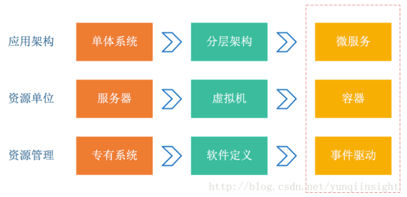
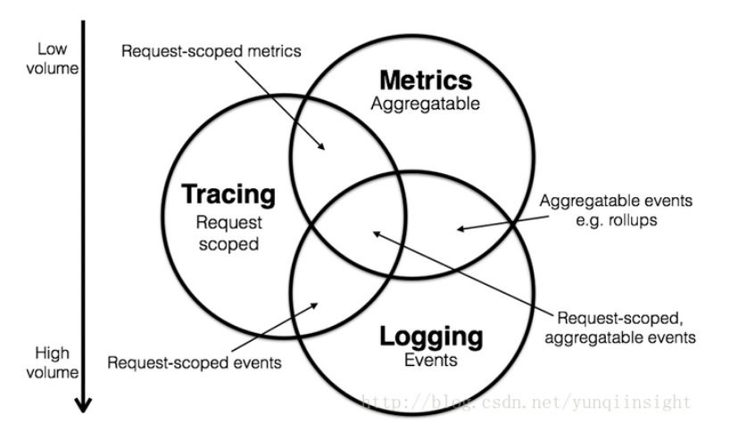
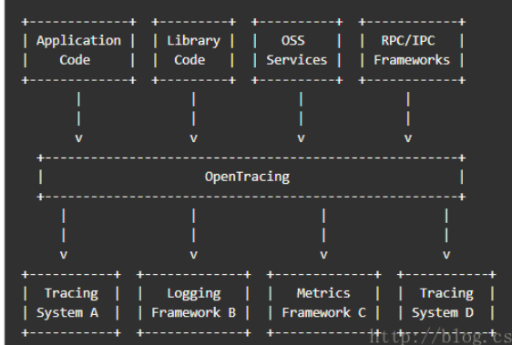
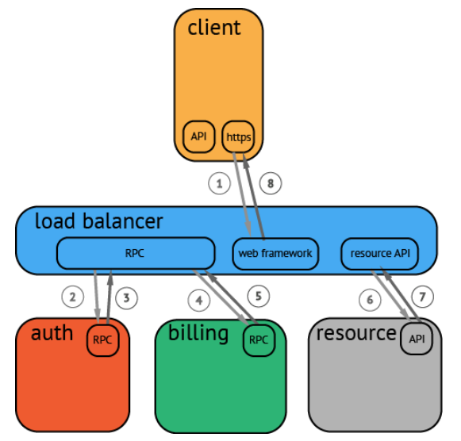
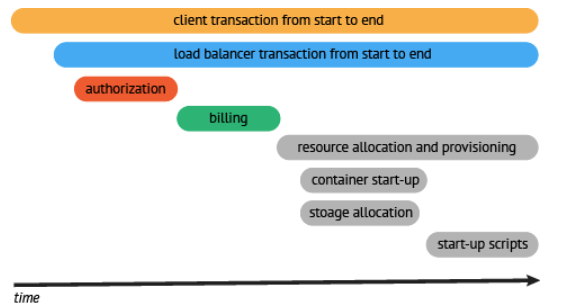

<!-- TOC -->

- [1、分布式系统的运维挑战](#1分布式系统的运维挑战)
- [2、Logging，Metrics 和 Tracing](#2loggingmetrics-和-tracing)
- [3、什么是OpenTracing](#3什么是opentracing)
- [4、OpenTracing 数据模型](#4opentracing-数据模型)
- [文章](#文章)

<!-- /TOC -->

- 官方文档：https://opentracing.io/docs/overview/what-is-tracing/
- github https://github.com/opentracing/

# 1、分布式系统的运维挑战

容器、Serverless 编程方式的诞生极大提升了软件交付与部署的效率。在架构的演化过程中，可以看到两个变化：

- 1.应用架构开始从单体系统逐步转变为微服务，其中的业务逻辑随之而来就会变成微服务之间的调用与请求。

- 2.资源角度来看，传统服务器这个物理单位也逐渐淡化，变成了看不见摸不到的虚拟资源模式。

从以上两个变化可以看到这种弹性、标准化的架构背后，原先运维与诊断的需求也变得越来越复杂。为了应对这种变化趋势，诞生一系列面向 DevOps 的诊断与分析系统，包括集中式日志系统（Logging），集中式度量系统（Metrics）和分布式追踪系统（Tracing）。

# 2、Logging，Metrics 和 Tracing

Logging，Metrics 和 Tracing 有各自专注的部分。

- 1.Logging - 用于记录离散的事件。例如，应用程序的调试信息或错误信息。它是我们诊断问题的依据。

- 2.Metrics - 用于记录可聚合的数据。例如，队列的当前深度可被定义为一个度量值，在元素入队或出队时被更新；HTTP 请求个数可被定义为一个计数器，新请求到来时进行累加。

- 3.Tracing - 用于记录请求范围内的信息。例如，一次远程方法调用的执行过程和耗时。它是我们排查系统性能问题的利器。

这三者也有相互重叠的部分，如下图所示。

通过上述信息，我们可以对已有系统进行分类。例如，Zipkin 专注于 tracing 领域；Prometheus 开始专注于 metrics，随着时间推移可能会集成更多的 tracing 功能，但不太可能深入 logging 领域； ELK，阿里云日志服务这样的系统开始专注于 logging 领域，但同时也不断地集成其他领域的特性到系统中来，正向上图中的圆心靠近。

# 3、什么是OpenTracing

为了给不同的分布式链路追踪系统（例如，Zipkin，Dapper，HTrace，X-Trace等）提示统一的接入API，OpenTracing使开发人员可以轻松地通过O（1）配置更改添加（或切换）跟踪实现。

- 后台无关的一套接口，被跟踪的服务只需要调用这套接口，就可以被任何实现这套接口的跟踪后台（比如Zipkin, Jaeger等等）支持，而作为一个跟踪后台，只要实现了个这套接口，就可以跟踪到任何调用这套接口的服务

- 标准化了对跟踪最小单位Span的管理：定义了开始Span，结束Span和记录Span耗时的API。

- 标准化了进程间跟踪数据传递的方式：定义了一套API方便跟踪数据的传递

- 标准化了进程内当前Span的管理：定义了存储和获取当前Span的API

> OpenTracing不做什么？

- 不对进程间传递的跟踪数据的编码定标准
- 不对向后台发送的跟踪数据的编码定标准

原因：让跟踪后台自己决定最适合他们的编码方式

比较流行的实现：
- Dapper(Google) : 各 tracer 的基础
- StackDriver Trace (Google)
- Zipkin(twitter)
- Appdash(golang)
- 鹰眼(taobao)
- 谛听(盘古，阿里云云产品使用的Trace系统)
- 云图(蚂蚁Trace系统)
- sTrace(神马)
- X-ray(aws)

# 4、OpenTracing 数据模型

分布式追踪系统发展很快，种类繁多，但核心步骤一般有三个：代码埋点，数据存储、查询展示。

在广义上，一个trace代表了一个事务或者流程在（分布式）系统中的执行过程。在OpenTracing标准中，trace是多个span组成的一个有向无环图（DAG），每一个span代表trace中被命名并计时的连续性的执行片段。

分布式追踪中的每个组件都包含自己的一个或者多个span。例如，在一个常规的RPC调用过程中，OpenTracing推荐在RPC的客户端和服务端，至少各有一个span，用于记录RPC调用的客户端和服务端信息。

一个父级的span会显示的并行或者串行启动多个子span。在OpenTracing标准中，甚至允许一个子span有个多父span（例如：并行写入的缓存，可能通过一次刷新操作写入动作）。

在一个分布式系统中，追踪一个事务或者调用流一般如上图所示。虽然这种图对于看清各组件的组合关系是很有用的，但是，它不能很好显示组件的调用时间，是串行调用还是并行调用，如果展现更复杂的调用关系，会更加复杂，甚至无法画出这样的图。另外，这种图也无法显示调用间的时间间隔以及是否通过定时调用来启动调用。一种更有效的展现一个典型的trace过程，如下图所示：

这种展现方式增加显示了执行时间的上下文，相关服务间的层次关系，进程或者任务的串行或并行调用关系。这样的视图有助于发现系统调用的关键路径。通过关注关键路径的执行过程，项目团队可能专注于优化路径中的关键位置，最大幅度的提升系统性能。例如：可以通过追踪一个资源定位的调用情况，明确底层的调用情况，发现哪些操作有阻塞的情况。

# 文章

- [开放分布式追踪（OpenTracing）入门与 Jaeger 实现](https://developer.aliyun.com/article/514488)

- [Metrics, tracing, and logging](http://peter.bourgon.org/blog/2017/02/21/metrics-tracing-and-logging.html?spm=a2c4e.11153959.blogcont514488.18.716330c2QmaPyn)
