<!-- TOC -->

- [0、基础](#0基础)
    - [1、概念](#1概念)
    - [2、Hive 操作符列表](#2hive-操作符列表)
    - [3、Hive 编译器的工作职责](#3hive-编译器的工作职责)
    - [4、优化器类型](#4优化器类型)
- [1、MapReduce实现基本SQL操作的原理](#1mapreduce实现基本sql操作的原理)
    - [1、Join的实现原理](#1join的实现原理)
    - [2、Group By的实现原理](#2group-by的实现原理)
    - [3、Distinct的实现原理](#3distinct的实现原理)
- [2、数据倾斜问题](#2数据倾斜问题)
    - [1、Ｇroup By优化通常有Map端数据聚合和倾斜数据分发两种方式](#1ｇroup-by优化通常有map端数据聚合和倾斜数据分发两种方式)
    - [2、Map Join 优化](#2map-join-优化)
- [3、问题](#3问题)
- [参考](#参考)

<!-- /TOC -->


Hive通常意义上来说，是把一个SQL转化成一个分布式作业，如MapReduce，Spark或者Tez。无论Hive的底层执行框架是MapReduce、Spark还是Tez，其原理基本都类似。而目前，由于MapReduce稳定，容错性好，大量数据情况下使用磁盘，能处理的数据量大，所以目前Hive的主流执行框架是MapReduce，但性能相比Spark和Tez也就较低.

目前的Hive除了支持在MapReduce上执行，还支持在Spark和Tez 上执行。我们以MapReduce为例来说明的Hive的原理。先回顾一下 MapReduce 原理。

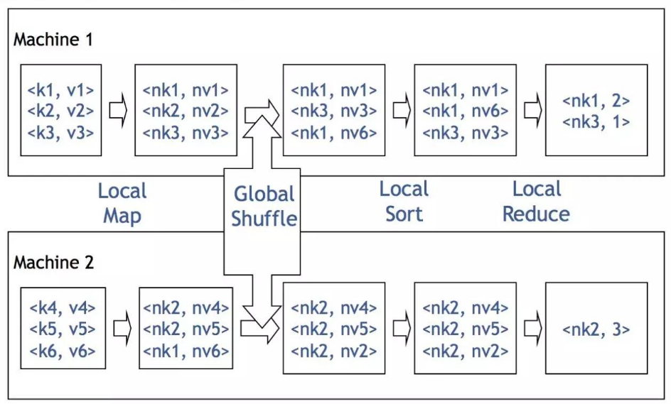

两个Mapper各自输入一块数据，由键值对构成，对它进行加工（加上了个字符n），然后按加工后的数据的键进行分组，相同的键到相同的机器。这样的话，第一台机器分到了键nk1和nk3，第二台机器分到了键nk2。接下来再在这些Reducers上执行聚合操作（这里执行的是是count），输出就是nk1出现了2次，nk3出现了1次，nk2出现了3次。从全局上来看，MapReduce就是一个分布式的GroupBy的过程。


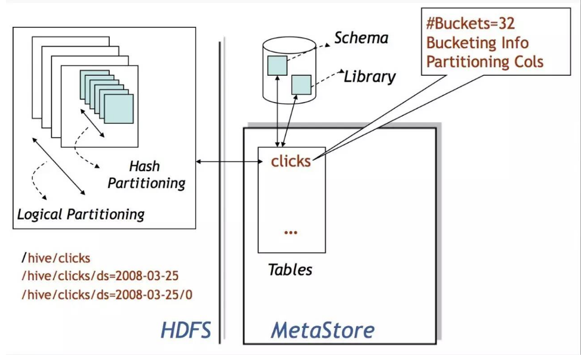

Hive的数据存储在HDFS上，基本存储单位是表或者分区，Hive内部把表或者分区称作SD，即Storage Descriptor。一个SD通常是一个HDFS路径，或者其它文件系统路径。SD的元数据信息存储在Hive MetaStore中，如文件路径，文件格式，列，数据类型，分隔符。Hive默认的分格符有三种，分别是^A、^B和^C，即ASCii码的1、2和3，分别用于分隔列，分隔列中的数组元素，和元素Key-Value对中的Key和Value。


# 0、基础

## 1、概念

- （1） Hive 将 HQL 转换成一组操作符（Operator），比如 GroupByOperator, JoinOperator 等

- （2）操作符 Operator 是 Hive 的最小处理单元

- （3）每个操作符代表一个 HDFS 操作或者 MapReduce 作业

- （4）Hive 通过 ExecMapper 和 ExecReducer 执行 MapReduce 程序，执行模式有本地模式和分 布式两种模式

## 2、Hive 操作符列表

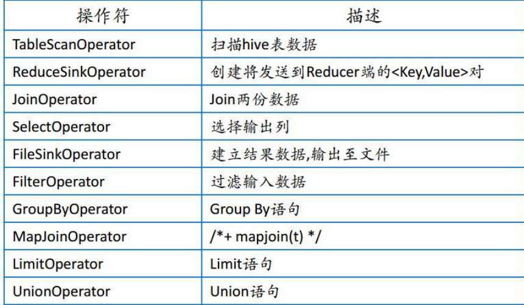

## 3、Hive 编译器的工作职责

- （1）Parser：将 HQL 语句转换成抽象语法树（AST：Abstract Syntax Tree）

- （2）Semantic Analyzer：将抽象语法树转换成查询块

- （3）Logic Plan Generator：将查询块转换成逻辑查询计划

- （4）Logic Optimizer：重写逻辑查询计划，优化逻辑执行计划

- （5）Physical Plan Gernerator：将逻辑计划转化成物理计划（MapReduce Jobs）

- （6）Physical Optimizer：选择最佳的 Join 策略，优化物理执行计划

一条SQL，进入的Hive。经过上述的过程，其实也是一个比较典型的编译过程变成了一个作业。

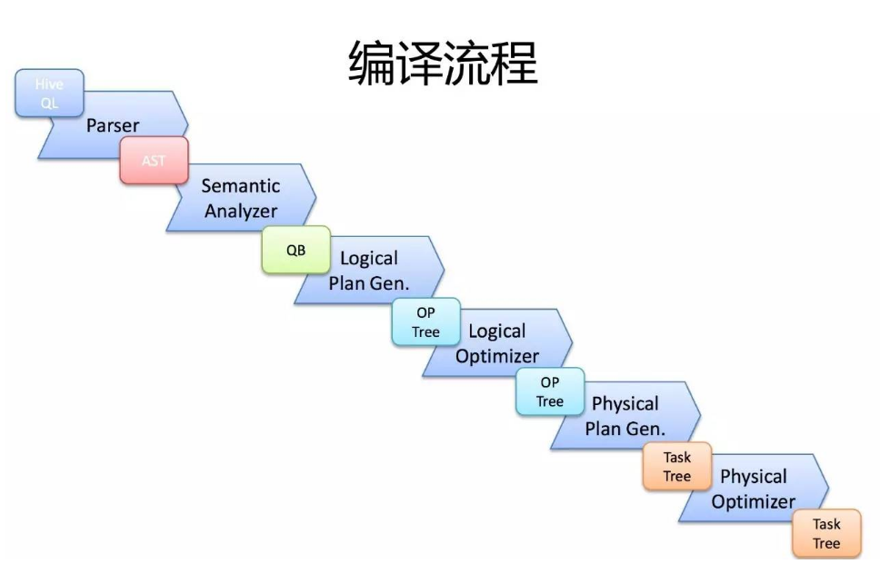

首先，Driver会输入一个字符串SQL，然后经过Parser变成AST，这个变成AST的过程是通过Antlr来完成的，也就是Anltr根据语法文件来将SQL变成AST。

AST进入SemanticAnalyzer（核心）变成QB，也就是所谓的QueryBlock。一个最简的查询块，通常来讲，一个From子句会生成一个QB。生成QB是一个递归过程，生成的 ＱＢ经过GenLogicalPlan过程，变成了一个Operator图，也是一个有向无环图。

OP DAG经过逻辑优化器，对这个图上的边或者结点进行调整，顺序修订，变成了一个优化后的有向无环图。这些优化过程可能包括谓词下推（Predicate Push Down），分区剪裁（Partition Prunner），关联排序（Join Reorder）等等


经过了逻辑优化，这个有向无环图还要能够执行。所以有了生成物理执行计划的过程。GenTasks。Ｈive的作法通常是碰到需要分发的地方，切上一刀，生成一道MapReduce作业。如Group By切一刀，Join切一刀，Distribute By切一刀，Distinct切一刀。

这么很多刀砍下去之后，刚才那个逻辑执行计划，也就是那个逻辑有向无环图，就被切成了很多个子图，每个子图构成一个结点。这些结点又连成了一个执行计划图，也就是Task Tree.

把这些个Task Tree 还可以有一些优化，比如基于输入选择执行路径，增加备份作业等。进行调整。这个优化就是由Physical Optimizer来完成的。经过Physical Optimizer，这每一个结点就是一个MapReduce作业或者本地作业，就可以执行了。

这就是一个SQL如何变成MapReduce作业的过程。要想观查这个过程的最终结果，可以打开Hive，输入Explain ＋ 语句，就能够看到。


## 4、优化器类型

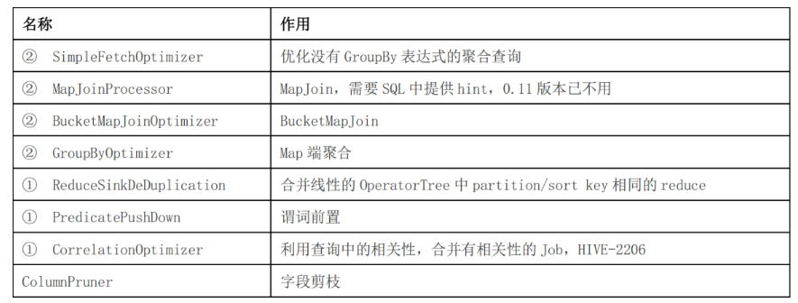

上表中带①符号的，优化目的都是尽量将任务合并到一个 Job 中，以减少 Job 数量，带②的 优化目的是尽量减少 shuffle 数据量


# 1、MapReduce实现基本SQL操作的原理

整体来看SQL对应两大类MapReduce任务

> 1、过滤类SQL与MR的关系(只有map没有reduce)

执行sql：select a.id,a,city, a.cate form access a where a.day=’20190414’ and a.cate= ‘大奔’

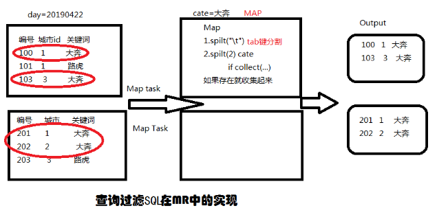

结论：过滤类的sql相当于ETL的数据清洗过程，并没有reduce过程，分区的过滤在读取数据的时候就已经进行了。map的个数是由分片数决定的。


> 2、聚合分组类SQL与MR的关系

select city, count(1) form access a where a.day=’20190414’ and a.cate= ‘奔驰’ group by city

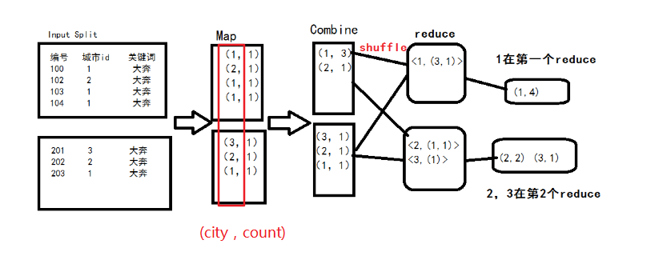


结论：其实这个过成和WC是非常相似的，在各自的分片中，都是把数据分割以后每个值都对应一个1得到<key,1>，再经过本地reduce（combine过程）把key一样的value=1相加，得到新的<key，values>，再经过shuffle过程，把所有分片中的<key,values>,key一致的values相加，又得到最终的<key,values>。combiner其实是一个本地的reduce主要就是为了减轻reduce的负担，但并不是所有的场景都会发生combiner，例如求平均数。


SELECT pageid, age, count(1) FROM pv_users GROUP BY pageid, age; 

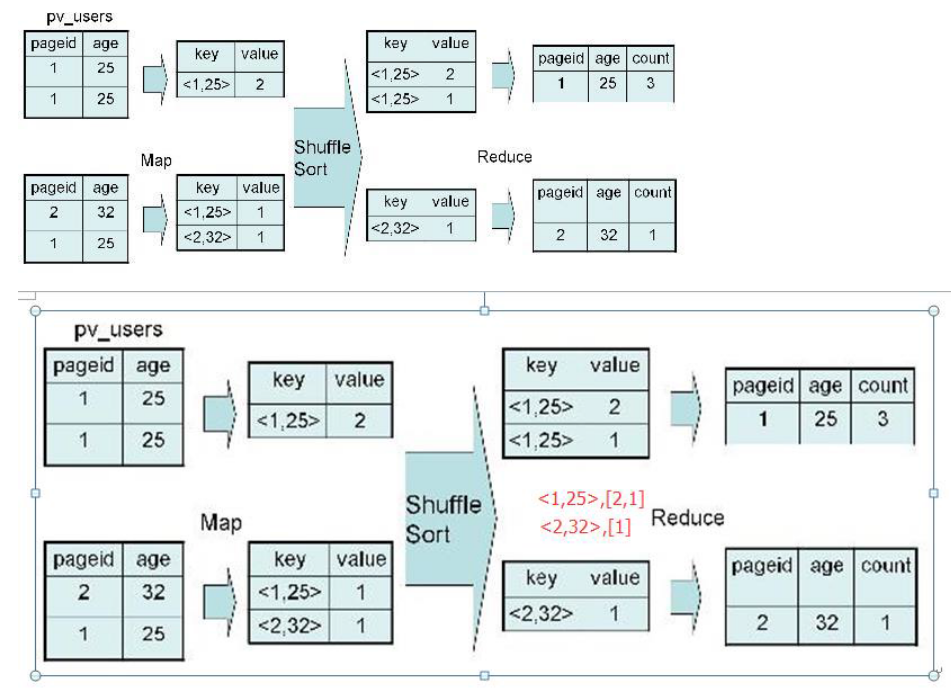


SELECT uid, SUM(COUNT) FROM logs GROUP BY uid;

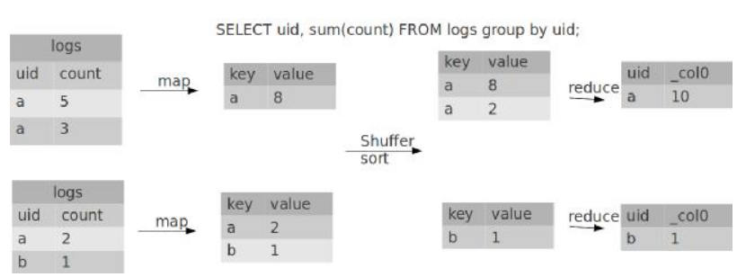

默认设置了hive.map.aggr=true，所以会在mapper端先group by一次，最后再把结果merge起来，为了减少reducer处理的数据量。注意看explain的mode是不一样的。mapper是hash，reducer是mergepartial。如果把hive.map.aggr=false，那将groupby放到reducer才做，他的mode是complete.

Operator

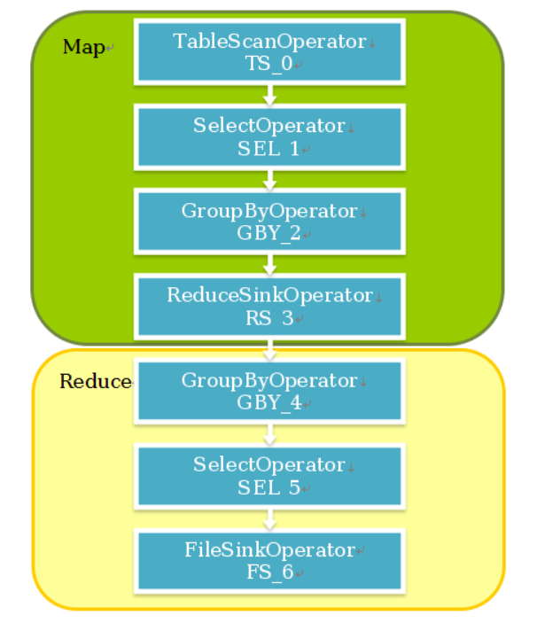


```
hive> explain SELECT uid, sum(count) FROM logs group by uid;
OK
ABSTRACT SYNTAX TREE:
  (TOK_QUERY (TOK_FROM (TOK_TABREF (TOK_TABNAME logs))) (TOK_INSERT (TOK_DESTINATION (TOK_DIR TOK_TMP_FILE)) (TOK_SELECT (TOK_SELEXPR (TOK_TABLE_OR_COL uid)) (TOK_SELEXPR (TOK_FUNCTION sum (TOK_TABLE_OR_COL count)))) (TOK_GROUPBY (TOK_TABLE_OR_COL uid))))
 
STAGE DEPENDENCIES:
  Stage-1 is a root stage
  Stage-0 is a root stage
 
STAGE PLANS:
  Stage: Stage-1
    Map Reduce
      Alias -> Map Operator Tree:
        logs 
          TableScan // 扫描表
            alias: logs
            Select Operator //选择字段
              expressions:
                    expr: uid
                    type: string
                    expr: count
                    type: int
              outputColumnNames: uid, count
              Group By Operator //这里是因为默认设置了hive.map.aggr=true，会在mapper先做一次聚合，减少reduce需要处理的数据
                aggregations:
                      expr: sum(count) //聚集函数
                bucketGroup: false
                keys: //键
                      expr: uid
                      type: string
                mode: hash //hash方式，processHashAggr()
                outputColumnNames: _col0, _col1
                Reduce Output Operator //输出key，value给reducer
                  key expressions:
                        expr: _col0
                        type: string
                  sort order: +
                  Map-reduce partition columns:
                        expr: _col0
                        type: string
                  tag: -1
                  value expressions:
                        expr: _col1
                        type: bigint
      Reduce Operator Tree:
        Group By Operator
 
          aggregations:
                expr: sum(VALUE._col0)
//聚合
          bucketGroup: false
          keys:
                expr: KEY._col0
                type: string
          mode: mergepartial //合并值
          outputColumnNames: _col0, _col1
          Select Operator //选择字段
            expressions:
                  expr: _col0
                  type: string
                  expr: _col1
                  type: bigint
            outputColumnNames: _col0, _col1
            File Output Operator //输出到文件
              compressed: false
              GlobalTableId: 0
              table:
                  input format: org.apache.hadoop.mapred.TextInputFormat
                  output format: org.apache.hadoop.hive.ql.io.HiveIgnoreKeyTextOutputFormat
 
  Stage: Stage-0
    Fetch Operator
      limit: -1
```

> 3、Distinct

按照 age 分组，然后统计每个分组里面的不重复的 pageid 有多少个

SELECT age, count(distinct pageid) FROM pv_users GROUP BY age;

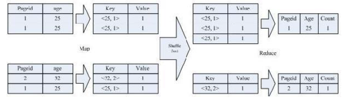

该 SQL 语句会按照 age 和 pageid 预先分组，进行 distinct 操作。然后会再按 照 age 进行分组，再进行一次 distinct 操作

> 4、join

SELECT pv.pageid, u.age FROM page_view pv JOIN user u ON pv.userid = u.userid;

实现过程
 
Map：

- 1、以 JOIN ON 条件中的列作为 Key，如果有多个列，则 Key 是这些列的组合
- 2、以 JOIN 之后所关心的列作为 Value，当有多个列时，Value 是这些列的组合。在 Value 中还会包含表的 Tag 信息，用于标明此 Value 对应于哪个表
- 3、按照 Key 进行排序

Shuffle：
　　1、根据 Key 的值进行 Hash，并将 Key/Value 对按照 Hash 值推至不同对 Reduce 中

Reduce：
　　1、 Reducer 根据 Key 值进行 Join 操作，并且通过 Tag 来识别不同的表中的数据

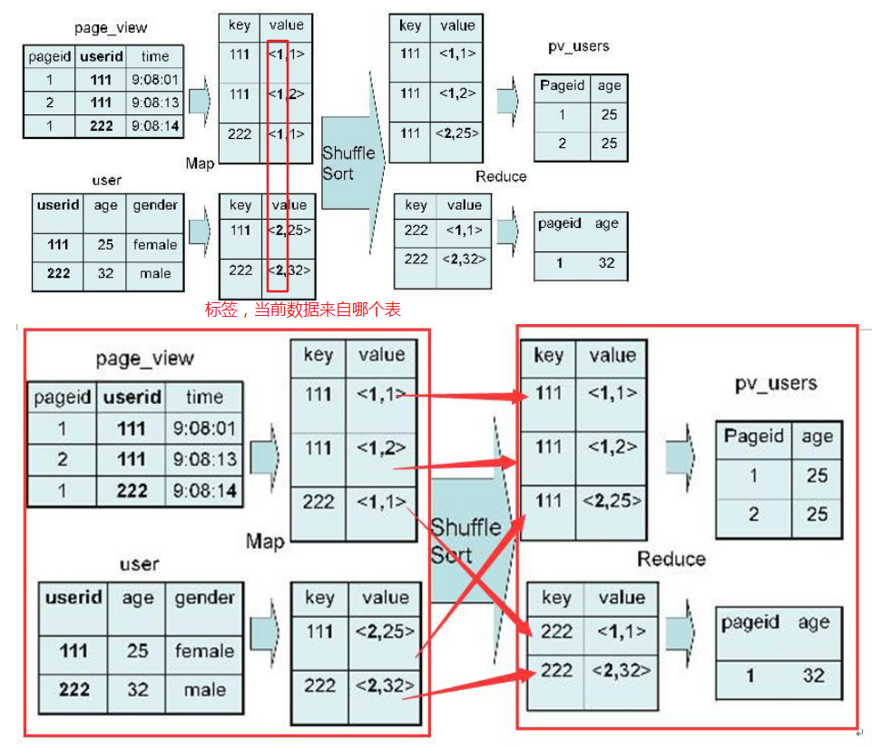


Ｍap端会分别读入各个表的一部分数据，把这部分数据进行打标，例如pv表标1，user表标2.

Map读取是分布式进行的。标完完后分发到Reduce端，Reduce 端根据Join Key，也就是关联键进行分组。然后按打的标进行排序，也就是图上的Shuffle Sort。

在每一个Reduce分组中，Key为111的在一起，也就是一台机器上。同时，pv表的数据在这台机器的上端，user表的数据在这台机器的下端。

这时候，Reduce把pv表的数据读入到内存里，然后逐条与硬盘上user表的数据做Join就可以了。

从这个实现可以看出，我们在写Hive Join的时候，应该尽可能把小表（分布均匀的表）写在左边，大表（或倾斜表）写在右边。这样可以有效利用内存和硬盘的关系，增强Hive的处理能力。

同时由于使用Join Key进行分发， Hive也只支持等值Join，不支持非等值Join。由于Join和Group By一样存在分发，所以也同样存在着倾斜的问题。所以Join也要对抗倾斜数据，提升查询执行性能。

通常，有一种执行非常快的Join叫Map Join 。

[问题]多表join？


- 扩展1：reducebykey和groupbykey的区别，前者会发生combiner 局部聚合，而后者不会，前者获得的是相同key对应的一个元素，后者是获取元素集合。reducebykey更加适合大数据，少用groupbykey（全数据shuffle）
- 扩展2：map task数是由数据文件分片数决定的分片数即是map任务数，程序员只能给个期望值
- 扩展3：reduce task数是由输入reduce的数据的分区（partitions）数决定的即分区数为map任务数，默认是1,程序员可直接设置reduce个数来改变reduce task数，reduce task数决定来 生成的文件数。
- 扩展4： MR数据shuffle确定数据发往哪一个reduce分区的规则是：取key的hashcode值对分区数模。
- 扩展5：explain sql ;查看某sql语句的执行计划


## 1、Join的实现原理

select u.name, o.orderid from order o join user u on o.uid = u.uid;


在map的输出value中为不同表的数据打上tag标记，在reduce阶段根据tag判断数据来源。MapReduce的过程如下（这里只是说明最基本的Join的实现，还有其他的实现方式）


## 2、Group By的实现原理

select rank, isonline, count(*) from city group by rank, isonline;

将GroupBy的字段组合为map的输出key值，利用MapReduce的排序，在reduce阶段保存LastKey区分不同的key。MapReduce的过程如下（当然这里只是说明Reduce端的非Hash聚合过程）


备注：排序key可以方便使用LastKey进行去重处理。

## 3、Distinct的实现原理

select dealid, count(distinct uid) num from order group by dealid;

当只有一个distinct字段时，如果不考虑Map阶段的Hash GroupBy，只需要将GroupBy字段和Distinct字段组合为map输出key，利用mapreduce的排序，同时将GroupBy字段作 为reduce的key，在reduce阶段保存LastKey即可完成去重


备注：这里下面的表在map阶段相当于做了一个去除处理？第二阶段按照partitionkey进行reduce进行分发。


如果有多个distinct字段呢，如下面的SQL


select dealid, count(distinct uid), count(distinct date) from order group by dealid;

实现方式有两种：


（1）如果仍然按照上面一个distinct字段的方法，即下图这种实现方式，无法跟据uid和date分别排序，也就无法通过LastKey去重，仍然需要在reduce阶段在内存中通过Hash去重


（2）第二种实现方式，可以对所有的distinct字段编号，每行数据生成n行数据，那么相同字段就会分别排序，这时只需要在reduce阶段记录LastKey即可去重。


这种实现方式很好的利用了MapReduce的排序，节省了reduce阶段去重的内存消耗，但是缺点是增加了shuffle的数据量。


需要注意的是，在生成reduce value时，除第一个distinct字段所在行需要保留value值，其余distinct数据行value字段均可为空。


备注：这里对uid编号0，date编号1，这里有2个distinct字段，所以原来的一行就会变成2行。


# 2、数据倾斜问题


## 1、Ｇroup By优化通常有Map端数据聚合和倾斜数据分发两种方式

Map端部分聚合，配置开关是hive.map.aggr

也就是执行SQL前先执行 set hive.map.aggr=true;它的原理是Map端在发到Reduce端之前先部分聚合一下。来减少数据量。因为我们刚才已经知道，聚合操作是在Reduce端完成的，只要能有效的减少Reduce端收到的数据量，就能有效的优化聚合速度，避免爆机，快速拿到结果。


另外一种方式则是针对倾斜的key做两道作业的聚合。什么是倾斜的数据？比如某猫双11交易，华为卖了1亿台，苹果卖了10万台。华为就是典型的倾斜数据了。如果要统计华为和苹果，会用两个Reduce作Group By，一个处理1亿台，一个处理10万台，那个1亿台的就是倾余。


由于按key分发，遇到倾斜数据怎么办？

可以使用hive.groupby.skewindata选项，通过两道MapReduce作业来处理。当选项设定为 true，生成的查询计划会有两个 MR Job。第一个 MR Job 中，Map 的输出结果集合会随机分布到Reduce 中，每个 Reduce 做部分聚合操作，并输出结果，这样处理的结果是相同的 Group By Key有可能被分发到不同的 Reduce 中，从而达到负载均衡的目的；第二个 MR Job 再根据预处理的数据结果按照 Group ByKey 分布到 Reduce 中（这个过程可以保证相同的 Group By Key 被分布到同一个 Reduce中），最后完成最终的聚合操作。 


第一道作业：Map随机分发，按gby key部分聚合 

第二道作业：第一道作业结果Map倾斜的key分发，按gbk key进行最终聚合


无论你使用Map端，或者两道作业。其原理都是通过部分聚合来来减少数据量。能不能部分聚合，部分聚合能不能有效减少数据量，通常与UDAF，也就是聚合函数有关。也就是只对代数聚合函数有效，对整体聚合函数无效。


所谓代数聚合函数，就是由部分结果可以汇总出整体结果的函数，如count，sum。 所谓整体聚合函数，就是无法由部分结果汇总出整体结果的函数，如avg，mean。 比如，sum, count，知道部分结果可以加和得到最终结果。 而对于，mean，avg，知道部分数据的中位数或者平均数，是求不出整体数据的中位数和平均数的。


## 2、Map Join 优化

手动的Map Join SQL如下：

INSERT INTO TABLE pv_users 

SELECT /*+ MAPJOIN(pv) */ pv.pageid, u.age 

FROM page_view pv JOIN user u 

ON (pv.userid = u.userid);

还是刚才的例子，用Map Join执行

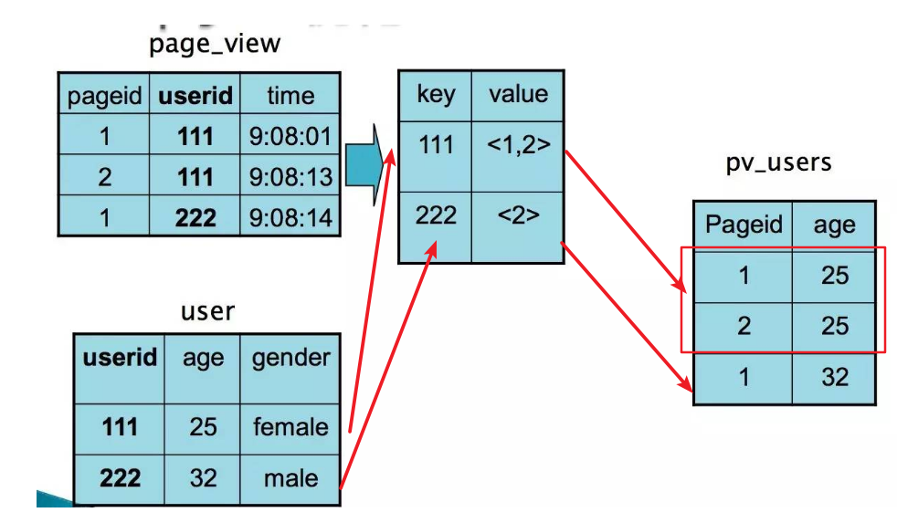


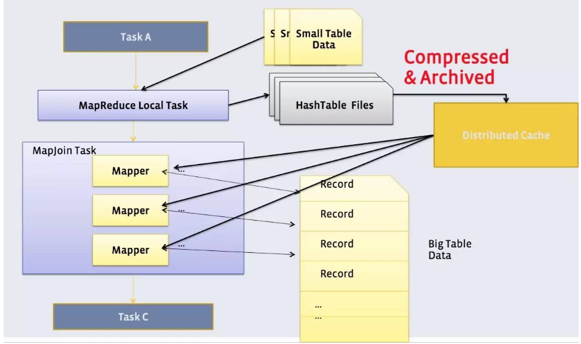

Map Join通常只适用于一个大表和一个小表做关联的场景，例如事实表和维表的关联。

原理如上图，用户可以手动指定哪个表是小表，然后在客户端把小表打成一个哈希表序列化文件的压缩包，通过分布式缓存均匀分发到作业执行的每一个结点上。然后在结点上进行解压，在内存中完成关联。


Map Join全过程不会使用Reduce，非常均匀，不会存在数据倾斜问题。默认情况下，小表不应该超过25M。在实际使用过程中，手动判断是不是应该用Map Join太麻烦了，而且小表可能来自于子查询的结果。


Hive有一种稍微复杂一点的机制，叫Auto Map Join

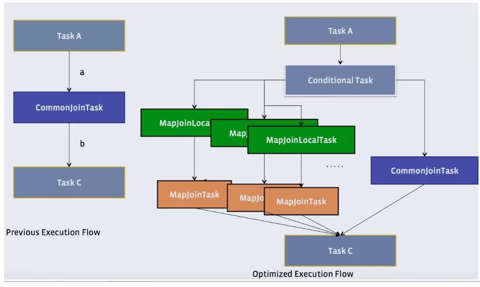


还记得原理中提到的物理优化器？Physical Optimizer么？它的其中一个功能就是把Join优化成Auto Map Join

图上左边是优化前的，右边是优化后的

优化过程是把Join作业前面加上一个条件选择器ConditionalTask和一个分支。左边的分支是MapJoin，右边的分支是Common Join(Reduce Join)

看看左边的分支是不是和我们上上一张图很像？

这个时候，我们在执行的时候，就由这个Conditional Task 进行实时路径选择，遇到小于25兆走左边，大于25兆走右边。所谓，男的走左边，女的走右边，人妖走中间。

在比较新版的Hive中，Auto Mapjoin是默认开启的。如果没有开启，可以使用一个开关， set hive.auto.convert.join=true 开启。

当然，Join也会遇到和上面的Group By一样的倾斜问题。


Ｈive 也可以通过像Group By一样两道作业的模式单独处理一行或者多行倾斜的数据。


set hive.optimize.skewjoin = true;  

set hive.skewjoin.key = skew_key_threshold （default = 100000）

其原理是就在Reduce Join过程，把超过十万条的倾斜键的行写到文件里，回头再起一道Join单行的Map Join作业来单独收拾它们。最后把结果取并集就是了。如上图所示。


# 3、问题

01、怎么知道hive作业产生倾斜了？

根据原理，倾斜只会发生在Reduce 是吧。如果Map倾斜一定是上一个Reduce倾斜了对吧。有一个Reduce死活执行不完，就是倾斜对吧。


02、在实践中，如果hive执行异常了，在问题分析上可以分享一下经验吗？比如 hive执行很慢。

有一个或几个结点慢，通常是倾斜。大家一起慢，通常是udf或者计算逻辑或者是GC问题。


03、为什么mapjoin task是多个，common join task是一个，mapjointask与mapjoinlocoltask有什么区别？

这里画多个的意思是，把小表分发到多个结点上，每个结点都是这样。不是多个。mapjoinlocoltask只做小表序列化，把小表序列化压缩打包。


04、hdfs是分布式的，那hive是分布式吗，还是只是在一个节点装上就可以了，所有任务的接收分发都通过这个节点。

Hive是单机的，一个结点就可以了，通常是两个，因为最好让Metastore独占一个。


06、是不是支持update 后，可以做增量groupby ,比如每天把一个用户访问次数做了sum后与历史这个用户的访问次数做sum?

是的，由MetaStore定期合并，MetaStore内部有几个线程。


08、mapjoin括号里面是小表吗？

是的


09、请问hive支持的sql语法全吗，用的时候好多在mysql可以的，hive里就语法错误？

不太全，还有特殊语法，比如distribute by, sort by，但还算比较全。


10、要是排序数据过大，大概要怎么解决。

Hive不推荐使用Order By，推荐使用Distribute By 和 sort by ，也就是分级分桶排。


11、能给讲讲row_number么？

Hive row_number是 reduce端做的，不是全局的。跟分发原理有关。


# 参考

- [HiveSQL解析原理：包括SQL转化为MapReduce过程及MapReduce如何实现基本SQL操作](https://blog.csdn.net/youzhouliu/article/details/70807993)

- [Hive SQL的执行流程](https://www.cnblogs.com/xuziyu/p/10750772.html)

- [Hive – Group By 的实现](http://fatkun.com/2013/01/hive-group-by.html)

- [Hive学习之路 （二十）Hive 执行过程实例分析](https://www.cnblogs.com/qingyunzong/p/8847651.html)

- [Hive 原理及查询优化](https://toutiao.io/posts/20mqgh/preview)

- [Hadoop Hive sql语法详解](https://blog.csdn.net/hguisu/article/details/7256833)

