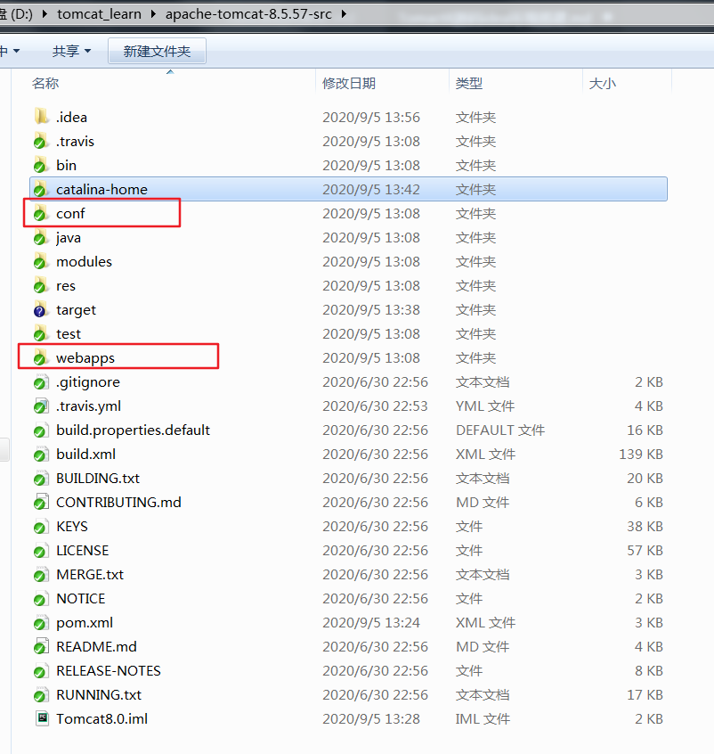
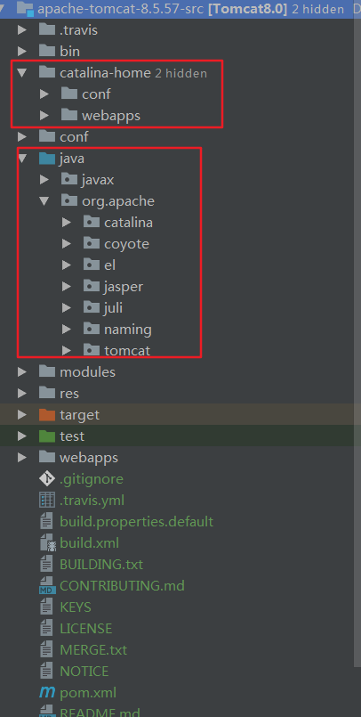
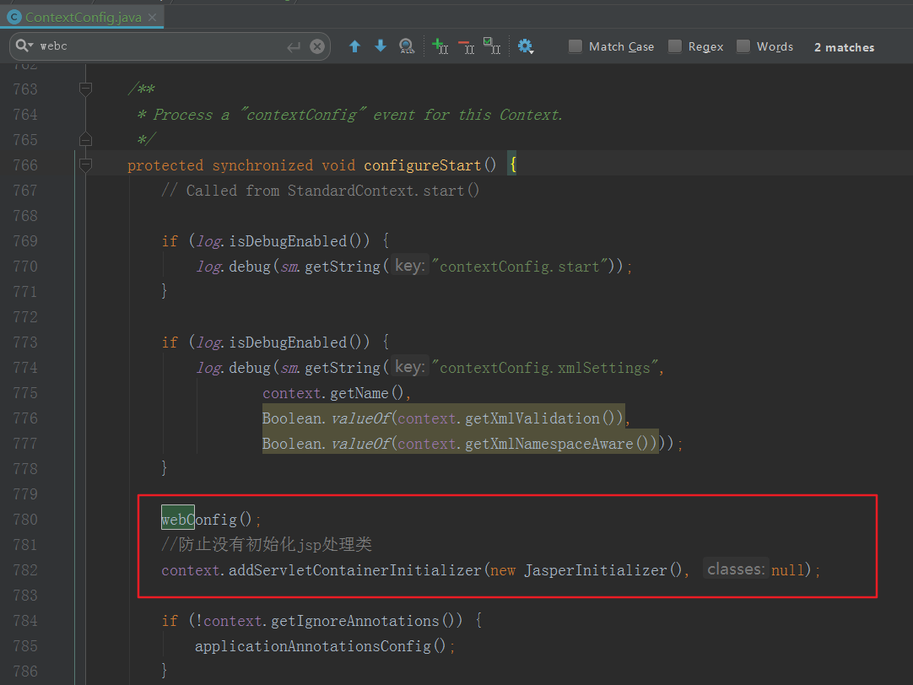

# 1、下载源码解压并创建目录

备注：版本apache-tomcat-8.5.57-src（从官网下载zip包即可）

将下载下来的源码压缩包解压，然后在解压后的目录中新建catalina-home目录和pom.xml文件，将跟目录中的conf和webapps文件夹复制到catalina-home目录中，如下




pom文件内容如下:

```xml
<?xml version="1.0" encoding="UTF-8"?>
<project xmlns="http://maven.apache.org/POM/4.0.0"
         xmlns:xsi="http://www.w3.org/2001/XMLSchema-instance"
         xsi:schemaLocation="http://maven.apache.org/POM/4.0.0 http://maven.apache.org/xsd/maven-4.0.0.xsd">

    <modelVersion>4.0.0</modelVersion>
    <groupId>org.apache.tomcat</groupId>
    <artifactId>Tomcat8.0</artifactId>
    <name>Tomcat8.0</name>
    <version>8.0</version>

    <build>
        <finalName>Tomcat8.0</finalName>
        <sourceDirectory>java</sourceDirectory>
        <testSourceDirectory>test</testSourceDirectory>
        <resources>
            <resource>
                <directory>java</directory>
            </resource>
        </resources>
        <testResources>
            <testResource>
                <directory>test</directory>
            </testResource>
        </testResources>
        <plugins>
            <plugin>
                <groupId>org.apache.maven.plugins</groupId>
                <artifactId>maven-compiler-plugin</artifactId>
                <version>2.3</version>
                <configuration>
                    <encoding>UTF-8</encoding>
                    <source>1.8</source>
                    <target>1.8</target>
                </configuration>
            </plugin>
        </plugins>
    </build>

    <dependencies>
        <dependency>
            <groupId>junit</groupId>
            <artifactId>junit</artifactId>
            <version>4.12</version>
            <scope>test</scope>
        </dependency>
        <dependency>
            <groupId>org.easymock</groupId>
            <artifactId>easymock</artifactId>
            <version>3.4</version>
        </dependency>
        <dependency>
            <groupId>ant</groupId>
            <artifactId>ant</artifactId>
            <version>1.7.0</version>
        </dependency>
        <dependency>
            <groupId>wsdl4j</groupId>
            <artifactId>wsdl4j</artifactId>
            <version>1.6.2</version>
        </dependency>
        <dependency>
            <groupId>javax.xml</groupId>
            <artifactId>jaxrpc</artifactId>
            <version>1.1</version>
        </dependency>
        <dependency>
            <groupId>org.eclipse.jdt.core.compiler</groupId>
            <artifactId>ecj</artifactId>
            <version>4.5.1</version>
        </dependency>

    </dependencies>
</project>


```


# 2、使用IDEA 以maven的项目导入



# 3、构建好项目后配置启动参数

主类：org.apache.catalina.startup.Bootstrap


```
-Dcatalina.home=D:/tomcat_learn/apache-tomcat-8.5.57-src/catalina-home
-Dcatalina.base=D:/tomcat_learn/apache-tomcat-8.5.57-src/catalina-home
-Djava.endorsed.dirs=D:/tomcat_learn/apache-tomcat-8.5.57-src/catalina-home/endorsed
-Djava.io.tmpdir=D:/tomcat_learn/apache-tomcat-8.5.57-src/catalina-home/temp
-Djava.util.logging.manager=org.apache.juli.ClassLoaderLogManager
-Djava.util.logging.config.file=D:/tomcat_learn/apache-tomcat-8.5.57-src/catalina-home/conf/logging.properties
-Duser.country=EN
```


# 4、问题

1、如果编译build的时候出现Test测试代码报错，注释该代码即可。本文中的Tomcat源码util.TestCookieFilter类会报错，将其注释即可。

2、在org.apache.catalina.startup.ContextConfig类中手动将JSP解析器初始化

context.addServletContainerInitializer(new JasperInitializer(), null);



3、日志输出中文乱码

添加参数-Duser.country=EN显示英文


# 5、访问

http://localhost:8080/


# 参考

- [IDEA搭建并运行Tomcat8源码](https://my.oschina.net/u/3737136/blog/2992813)

- [仿造Tomcat项目](https://github.com/lishuai2016/mytomcat)


