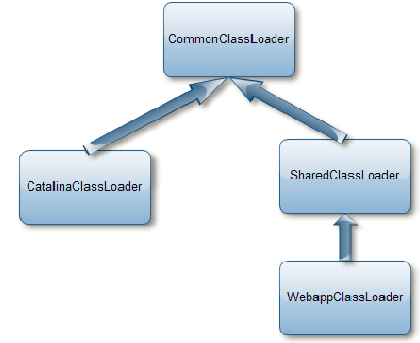

# Tomcat的类加载机制

在Tomcat的代码实现中，为了优化内存空间以及不同应用间的类隔离，Tomcat通过内置的一些类加载器来完成了这些功能。
在Java语言中，ClassLoader是以父子关系存在的，Java本身也有一定的类加载规范。在Tomcat中基本的ClassLoader层级关系如下图所示：

Tomcat启动的时候，会初始化图示所示的类加载器。而上面的三个类加载器：
CommonClassLoader、CatalinaClassLoader和SharedClassLoader是与具体部署的Web应用无关的，
而WebappClassLoader则对应Web应用，每个Web应用都会有独立的类加载器，从而实现类的隔离。

在每个Web应用初始化的时候，StandardContext对象代表每个Web应用，它会使用WebappLoader类来加载Web应用，
而WebappLoader中会初始化org.apache.catalina.loader.WebappClassLoader来为每个Web应用创建单独的类加载器，
当处理请求时，容器会根据请求的地址解析出由哪个Web应用来进行对应的处理，进而将当前线程的类加载器设置为请求Web应用的类加载器。

standEngine, StandHost, StandContext及StandWrapper是容器，他们之间有互相的包含关系。
例如，StandEngine是StandHost的父容器，StandHost是StandEngine的子容器。在StandService内还包含一个Executor及Connector。
1） Executor是线程池，它的具体实现是java的concurrent包实现的executor，这个不是必须的，如果没有配置，则使用自写的worker thread线程池
2） Connector是网络socket相关接口模块，它包含两个对象，ProtocolHandler及Adapter
- ProtocolHandler是接收socket请求，并将其解析成HTTP请求对象，可以配置成nio模式或者传统io模式
- Adapter是处理HTTP请求对象，它就是从StandEngine的valve一直调用到StandWrapper的valve

