Tomcat结构解析

<!-- TOC -->

- [Tomcat的总体架构](#tomcat的总体架构)
    - [01、连接器设计](#01连接器设计)
        - [1、ProtocolHandler 组件](#1protocolhandler-组件)
            - [1、Endpoint](#1endpoint)
            - [2、Processor](#2processor)
        - [2、Adapter 组件](#2adapter-组件)
    - [02、多层容器设计](#02多层容器设计)
        - [1、请求定位 Servlet 的过程](#1请求定位-servlet-的过程)
    - [03、Tomcat如何实现一键式启停？（Lifecycle 接口）](#03tomcat如何实现一键式启停lifecycle-接口)
        - [1、一键式启停：Lifecycle 接口](#1一键式启停lifecycle-接口)
        - [2、可扩展性：Lifecycle 事件](#2可扩展性lifecycle-事件)
        - [3、重用性：LifecycleBase 抽象基类](#3重用性lifecyclebase-抽象基类)
        - [4、生周期管理总体类图](#4生周期管理总体类图)
    - [04、Tomcat上层组件Catalina、Server、Service、Engine](#04tomcat上层组件catalinaserverserviceengine)
        - [1、Catalina](#1catalina)
        - [2、Server 组件](#2server-组件)
        - [3、Service 组件](#3service-组件)
        - [4、engine 组件](#4engine-组件)
    - [05、比较：Jetty架构特点之Connector组件](#05比较jetty架构特点之connector组件)
        - [1、Jetty 整体架构](#1jetty-整体架构)
        - [2、Jetty 的 Connector 组件的设计](#2jetty-的-connector-组件的设计)
            - [1、Java NIO](#1java-nio)
            - [2、Acceptor](#2acceptor)
            - [3、SelectorManager](#3selectormanager)
            - [4、Connection](#4connection)
        - [3、Jetty 的 Handler 组件的设计](#3jetty-的-handler-组件的设计)
            - [1、Handler 是什么](#1handler-是什么)
            - [2、Handler 继承关系](#2handler-继承关系)
            - [3、Handler 的类型](#3handler-的类型)
            - [4、如何实现 Servlet 规范](#4如何实现-servlet-规范)
    - [06、从Tomcat和Jetty中提炼组件化设计规范](#06从tomcat和jetty中提炼组件化设计规范)
        - [1、组件化及可配置](#1组件化及可配置)
        - [2、组件的创建](#2组件的创建)
        - [3、组件的生命周期管理](#3组件的生命周期管理)
        - [4、组件的骨架抽象类和模板模式](#4组件的骨架抽象类和模板模式)
    - [07、优化并提高Tomcat启动速度](#07优化并提高tomcat启动速度)
        - [1. 清理不必要的 Web 应用](#1-清理不必要的-web-应用)
        - [2. 清理 XML 配置文件](#2-清理-xml-配置文件)
        - [3. 清理 JAR 文件](#3-清理-jar-文件)
        - [4. 清理其他文件](#4-清理其他文件)
        - [5. 禁止 Tomcat TLD 扫描](#5-禁止-tomcat-tld-扫描)
        - [6、关闭 WebSocket 支持](#6关闭-websocket-支持)
        - [7、关闭 JSP 支持](#7关闭-jsp-支持)
        - [8、禁止 Servlet 注解扫描](#8禁止-servlet-注解扫描)
        - [9、配置 Web-Fragment 扫描](#9配置-web-fragment-扫描)
        - [10、随机数熵源优化](#10随机数熵源优化)
        - [11、并行启动多个 Web 应用](#11并行启动多个-web-应用)
- [Tomcat连接器](#tomcat连接器)
    - [1、NioEndpoint组件：Tomcat如何实现非阻塞I/O？](#1nioendpoint组件tomcat如何实现非阻塞io)
        - [1、Java I/O 模型](#1java-io-模型)
            - [1、同步阻塞 I/O](#1同步阻塞-io)
            - [2、同步非阻塞 I/O](#2同步非阻塞-io)
            - [3、I/O 多路复用](#3io-多路复用)
            - [4、异步 I/O](#4异步-io)
        - [2、NioEndpoint 组件](#2nioendpoint-组件)
            - [1、LimitLatch](#1limitlatch)
            - [2、Acceptor](#2acceptor-1)
            - [3、Poller](#3poller)
            - [4、SocketProcessor](#4socketprocessor)
        - [3、高并发思路](#3高并发思路)
    - [2、Nio2Endpoint组件：Tomcat如何实现异步I/O？](#2nio2endpoint组件tomcat如何实现异步io)
        - [1、Java NIO.2](#1java-nio2)
        - [2、Nio2Endpoint](#2nio2endpoint)
            - [1、Nio2Acceptor](#1nio2acceptor)
            - [2、Nio2SocketWrapper](#2nio2socketwrapper)
    - [3、AprEndpoint组件：Tomcat APR提高I/O性能的秘密](#3aprendpoint组件tomcat-apr提高io性能的秘密)
        - [1、AprEndpoint 工作过程](#1aprendpoint-工作过程)
            - [1、Acceptor](#1acceptor)
            - [2、Poller](#2poller)
        - [2、APR 提升性能的秘密](#2apr-提升性能的秘密)
            - [1、JVM 堆 VS 本地内存](#1jvm-堆-vs-本地内存)
            - [2、sendfile](#2sendfile)
    - [4、Executor组件：Tomcat如何扩展Java线程池？](#4executor组件tomcat如何扩展java线程池)
        - [1、Java 线程池](#1java-线程池)
        - [2、Tomcat 线程池](#2tomcat-线程池)
    - [5、新特性：Tomcat如何支持WebSocket？](#5新特性tomcat如何支持websocket)
        - [1、WebSocket 工作原理](#1websocket-工作原理)
        - [2、Tomcat 如何支持 WebSocket](#2tomcat-如何支持-websocket)
            - [1、WebSocket 加载](#1websocket-加载)
            - [2、WebSocket 请求处理](#2websocket-请求处理)
    - [6、比较：Jetty的线程策略EatWhatYouKill](#6比较jetty的线程策略eatwhatyoukill)
        - [1、Selector 编程的一般思路](#1selector-编程的一般思路)
        - [2、Jetty 中的 Selector 编程](#2jetty-中的-selector-编程)
            - [1、ManagedSelector](#1managedselector)
            - [2、SelectorUpdate 接口](#2selectorupdate-接口)
            - [3、Selectable 接口](#3selectable-接口)
            - [4、ExecutionStrategy](#4executionstrategy)
    - [7、总结：Tomcat和Jetty中的对象池技术](#7总结tomcat和jetty中的对象池技术)
        - [1、Tomcat 的 SynchronizedStack](#1tomcat-的-synchronizedstack)
        - [2、Jetty 的 ByteBufferPool](#2jetty-的-bytebufferpool)
        - [3、对象池的思考](#3对象池的思考)
    - [8、总结：Tomcat和Jetty的高性能、高并发之道](#8总结tomcat和jetty的高性能高并发之道)
        - [1、I/O 和线程模型](#1io-和线程模型)
        - [2、减少系统调用](#2减少系统调用)
        - [3、池化、零拷贝](#3池化零拷贝)
        - [4、高效的并发编程](#4高效的并发编程)
            - [1、缩小锁的范围](#1缩小锁的范围)
            - [2、用原子变量和 CAS 取代锁](#2用原子变量和-cas-取代锁)
            - [3、并发容器的使用](#3并发容器的使用)
            - [4、volatile 关键字的使用](#4volatile-关键字的使用)
    - [9、内核如何阻塞与唤醒进程？](#9内核如何阻塞与唤醒进程)
        - [1、进程和线程](#1进程和线程)
        - [2、阻塞与唤醒](#2阻塞与唤醒)
- [Tomcat容器](#tomcat容器)
    - [1、Host容器：Tomcat如何实现热部署和热加载？](#1host容器tomcat如何实现热部署和热加载)
        - [1、Tomcat 的后台线程](#1tomcat-的后台线程)
        - [2、Tomcat 热加载](#2tomcat-热加载)
        - [3、Tomcat 热部署](#3tomcat-热部署)
    - [2、Context容器（上）：Tomcat如何打破双亲委托机制？](#2context容器上tomcat如何打破双亲委托机制)
        - [1、JVM 的类加载器](#1jvm-的类加载器)
        - [2、Tomcat 的类加载器](#2tomcat-的类加载器)
            - [1、findClass 方法](#1findclass-方法)
            - [2、loadClass 方法](#2loadclass-方法)
    - [3、Context容器（中）：Tomcat如何隔离Web应用？](#3context容器中tomcat如何隔离web应用)
        - [1、Tomcat 类加载器的层次结构](#1tomcat-类加载器的层次结构)
            - [1、WebAppClassLoader](#1webappclassloader)
            - [2、SharedClassLoader](#2sharedclassloader)
            - [3、CatalinaClassLoader](#3catalinaclassloader)
            - [4、CommonClassLoader](#4commonclassloader)
        - [2、Spring 的加载问题](#2spring-的加载问题)
    - [4、Context容器（下）：Tomcat如何实现Servlet规范？](#4context容器下tomcat如何实现servlet规范)
        - [1、Servlet 管理](#1servlet-管理)
        - [2、Filter 管理](#2filter-管理)
        - [3、Listener 管理](#3listener-管理)
    - [5、新特性：Tomcat如何支持异步Servlet？](#5新特性tomcat如何支持异步servlet)
        - [1、异步 Servlet 示例](#1异步-servlet-示例)
        - [2、异步 Servlet 原理](#2异步-servlet-原理)
            - [1、startAsync 方法](#1startasync-方法)
            - [2、complete 方法](#2complete-方法)
    - [6、新特性：Spring Boot如何使用内嵌式的Tomcat和Jetty？](#6新特性spring-boot如何使用内嵌式的tomcat和jetty)
        - [1、Spring Boot 中 Web 容器相关的接口](#1spring-boot-中-web-容器相关的接口)
        - [2、内嵌式 Web 容器的创建和启动](#2内嵌式-web-容器的创建和启动)
        - [3、注册 Servlet 的三种方式](#3注册-servlet-的三种方式)
            - [1. Servlet 注解](#1-servlet-注解)
            - [2. ServletRegistrationBean](#2-servletregistrationbean)
            - [3. 动态注册](#3-动态注册)
        - [4、Web 容器的定制](#4web-容器的定制)
    - [7、比较：Jetty如何实现具有上下文信息的责任链？](#7比较jetty如何实现具有上下文信息的责任链)
    - [8、Spring框架中的设计模式](#8spring框架中的设计模式)
        - [1、简单工厂模式](#1简单工厂模式)
        - [2、工厂方法模式](#2工厂方法模式)
        - [3、单例模式](#3单例模式)
        - [4、代理模式](#4代理模式)
- [Tomcat通用组件](#tomcat通用组件)
    - [1、Logger组件：Tomcat的日志框架及实战](#1logger组件tomcat的日志框架及实战)
    - [2、Manager组件：Tomcat的Session管理机制解析](#2manager组件tomcat的session管理机制解析)
    - [3、 Cluster组件：Tomcat的集群通信原理](#3-cluster组件tomcat的集群通信原理)
- [Tomcat性能优化](#tomcat性能优化)
    - [1、JVM GC原理及调优的基本思路](#1jvm-gc原理及调优的基本思路)
        - [1、CMS vs G1](#1cms-vs-g1)
        - [2、GC 调优原则](#2gc-调优原则)
            - [1、CMS 收集器](#1cms-收集器)
            - [2、G1 收集器](#2g1-收集器)
        - [3、内存调优实战](#3内存调优实战)
    - [2、如何监控Tomcat的性能？](#2如何监控tomcat的性能)
        - [1、Tomcat 的关键指标](#1tomcat-的关键指标)
        - [2、通过 JConsole 监控 Tomcat](#2通过-jconsole-监控-tomcat)
            - [1、吞吐量、响应时间、错误数](#1吞吐量响应时间错误数)
            - [2、线程池](#2线程池)
            - [3、CPU](#3cpu)
            - [4、JVM 内存](#4jvm-内存)
        - [3、命令行查看 Tomcat 指标](#3命令行查看-tomcat-指标)
        - [4、实战案例](#4实战案例)
    - [3、Tomcat I/O和线程池的并发调优](#3tomcat-io和线程池的并发调优)
        - [1、I/O 模型的选择](#1io-模型的选择)
        - [2、线程池调优](#2线程池调优)
        - [3、实际场景下如何确定线程数](#3实际场景下如何确定线程数)
    - [4、Tomcat内存溢出的原因分析及调优](#4tomcat内存溢出的原因分析及调优)
        - [1、java.lang.OutOfMemoryError: Java heap space](#1javalangoutofmemoryerror-java-heap-space)
        - [2、java.lang.OutOfMemoryError: GC overhead limit exceeded](#2javalangoutofmemoryerror-gc-overhead-limit-exceeded)
        - [3、java.lang.OutOfMemoryError: Requested array size exceeds VM limit](#3javalangoutofmemoryerror-requested-array-size-exceeds-vm-limit)
        - [4、java.lang.OutOfMemoryError: MetaSpace](#4javalangoutofmemoryerror-metaspace)
        - [5、java.lang.OutOfMemoryError: Request size bytes for reason. Out of swap space](#5javalangoutofmemoryerror-request-size-bytes-for-reason-out-of-swap-space)
        - [6、java.lang.OutOfMemoryError: Unable to create native threads](#6javalangoutofmemoryerror-unable-to-create-native-threads)
        - [7、内存泄漏定位实战](#7内存泄漏定位实战)
    - [5、Tomcat拒绝连接原因分析及网络优化](#5tomcat拒绝连接原因分析及网络优化)
        - [1、常见异常](#1常见异常)
        - [2、Tomcat 网络参数](#2tomcat-网络参数)
        - [3、Tomcat 网络调优实战](#3tomcat-网络调优实战)
    - [6、Tomcat进程占用CPU过高怎么办？](#6tomcat进程占用cpu过高怎么办)
        - [1、Java 进程 CPU 使用率高”的解决思路是什么](#1java-进程-cpu-使用率高的解决思路是什么)
        - [2、定位高 CPU 使用率的线程和代码](#2定位高-cpu-使用率的线程和代码)
        - [3、进一步分析上下文切换开销](#3进一步分析上下文切换开销)
    - [7、谈谈Jetty性能调优的思路](#7谈谈jetty性能调优的思路)
    - [8、Tomcat和Jetty有哪些不同？](#8tomcat和jetty有哪些不同)
- [源码解析](#源码解析)
- [Tomcat的层次结构总结](#tomcat的层次结构总结)
- [1、一个\conf\server.xml](#1一个\conf\serverxml)
    - [1.1、Server](#11server)
    - [1.2 Service](#12-service)
    - [1.3、Connector](#13connector)
    - [1.4 、Engine](#14-engine)
    - [1.5、Host](#15host)
    - [1.6、Context](#16context)
- [2、Tomcat的核心组件就两个Connector和Container](#2tomcat的核心组件就两个connector和container)
- [3、Tomcat Server处理一个http请求的过程](#3tomcat-server处理一个http请求的过程)
    - [4、Tomcat的类加载机制](#4tomcat的类加载机制)
    - [5、Tomcat总体架构](#5tomcat总体架构)
- [参考](#参考)

<!-- /TOC -->


# Tomcat的总体架构

Tomcat 要实现 2 个核心功能：

- 1、处理 Socket 连接，负责网络字节流与 Request 和 Response 对象的转化。
- 2、加载和管理 Servlet，以及具体处理 Request 请求。

因此 Tomcat 设计了两个核心组件连接器（Connector）和容器（Container）来分别做这两件事情。连接器负责对外交流，容器负责内部处理。


Tomcat 支持的多种 I/O 模型和应用层协议。

Tomcat 支持的 I/O 模型有：

- NIO：非阻塞 I/O，采用 Java NIO 类库实现。
- NIO.2：异步 I/O，采用 JDK 7 最新的 NIO.2 类库实现。
- APR：采用 Apache 可移植运行库实现，是 C/C++ 编写的本地库。


Tomcat 支持的应用层协议有：
- HTTP/1.1：这是大部分 Web 应用采用的访问协议。
- AJP：用于和 Web 服务器集成（如 Apache）。
- HTTP/2：HTTP 2.0 大幅度的提升了 Web 性能。


Tomcat 为了实现支持多种 I/O 模型和应用层协议，一个容器可能对接多个连接器，就好比一个房间有多个门。但是单独的连接器或者容器都不能对外提供服务，需要把它们组装起来才能工作，组装后这个整体叫作 Service 组件。这里请你注意，Service 本身没有做什么重要的事情，只是在连接器和容器外面多包了一层，把它们组装在一起。Tomcat 内可能有多个 Service，这样的设计也是出于灵活性的考虑。通过在 Tomcat 中配置多个 Service，可以实现通过不同的端口号来访问同一台机器上部署的不同应用。


从图上你可以看到，最顶层是 Server，这里的 Server 指的就是一个 Tomcat 实例。一个 Server 中有一个或者多个 Service，一个 Service 中有多个连接器和一个容器。连接器与容器之间通过标准的 ServletRequest 和 ServletResponse 通信。


## 01、连接器设计

连接器对 Servlet 容器屏蔽了协议及 I/O 模型等的区别，无论是 HTTP 还是 AJP，在容器中获取到的都是一个标准的 ServletRequest 对象。我们可以把连接器的功能需求进一步细化，比如：

- 监听网络端口。
- 接受网络连接请求。
- 读取网络请求字节流。
- 根据具体应用层协议（HTTP/AJP）解析字节流，生成统一的 Tomcat Request 对象。
- 将 Tomcat Request 对象转成标准的 ServletRequest。
- 调用 Servlet 容器，得到 ServletResponse。
- 将 ServletResponse 转成 Tomcat Response 对象。
- 将 Tomcat Response 转成网络字节流。
- 将响应字节流写回给浏览器。

需求列清楚后，我们要考虑的下一个问题是，连接器应该有哪些子模块？优秀的模块化设计应该考虑高内聚、低耦合。

- 高内聚是指相关度比较高的功能要尽可能集中，不要分散。
- 低耦合是指两个相关的模块要尽可能减少依赖的部分和降低依赖的程度，不要让两个模块产生强依赖。


通过分析连接器的详细功能列表，我们发现连接器需要完成 3 个高内聚的功能：

- 1、网络通信。
- 2、应用层协议解析。
- 3、Tomcat Request/Response 与 ServletRequest/ServletResponse 的转化。

因此 Tomcat 的设计者设计了 3 个组件来实现这 3 个功能，分别是 Endpoint、Processor 和 Adapter。组件之间通过抽象接口交互。这样做还有一个好处是封装变化。这是面向对象设计的精髓，将系统中经常变化的部分和稳定的部分隔离，有助于增加复用性，并降低系统耦合度。网络通信的 I/O 模型是变化的，可能是非阻塞 I/O、异步 I/O 或者 APR。应用层协议也是变化的，可能是 HTTP、HTTPS、AJP。浏览器端发送的请求信息也是变化的。但是整体的处理逻辑是不变的，Endpoint 负责提供字节流给 Processor，Processor 负责提供 Tomcat Request 对象给 Adapter，Adapter 负责提供 ServletRequest 对象给容器。

如果要支持新的 I/O 方案、新的应用层协议，只需要实现相关的具体子类，上层通用的处理逻辑是不变的。


由于 I/O 模型和应用层协议可以自由组合，比如 NIO + HTTP 或者 NIO.2 + AJP。Tomcat 的设计者将网络通信和应用层协议解析放在一起考虑，设计了一个叫 ProtocolHandler 的接口来封装这两种变化点。各种协议和通信模型的组合有相应的具体实现类。比如：Http11NioProtocol 和 AjpNioProtocol。

除了这些变化点，系统也存在一些相对稳定的部分，因此 Tomcat 设计了一系列抽象基类来封装这些稳定的部分，抽象基类 AbstractProtocol 实现了 ProtocolHandler 接口。每一种应用层协议有自己的抽象基类，比如 AbstractAjpProtocol 和 AbstractHttp11Protocol，具体协议的实现类扩展了协议层抽象基类。下面我整理一下它们的继承关系。


通过上面的图，你可以清晰地看到它们的继承和层次关系，这样设计的目的是尽量将稳定的部分放到抽象基类，同时每一种 I/O 模型和协议的组合都有相应的具体实现类，我们在使用时可以自由选择。

小结一下，连接器模块用三个核心组件：Endpoint、Processor 和 Adapter 来分别做三件事情，其中 Endpoint 和 Processor 放在一起抽象成了 ProtocolHandler 组件，它们的关系如下图所示。


### 1、ProtocolHandler 组件

连接器用 ProtocolHandler 来处理网络连接和应用层协议，包含了 2 个重要部件：Endpoint 和 Processor，下面我来详细介绍它们的工作原理。

#### 1、Endpoint

Endpoint 是通信端点，即通信监听的接口，是具体的 Socket 接收和发送处理器，是对传输层的抽象，因此 Endpoint 是用来实现 TCP/IP 协议的。

Endpoint 是一个接口，对应的抽象实现类是 AbstractEndpoint，而 AbstractEndpoint 的具体子类，比如在 NioEndpoint 和 Nio2Endpoint 中，有两个重要的子组件：Acceptor 和 SocketProcessor。

其中 Acceptor 用于监听 Socket 连接请求。SocketProcessor 用于处理接收到的 Socket 请求，它实现 Runnable 接口，在 run 方法里调用协议处理组件 Processor 进行处理。为了提高处理能力，SocketProcessor 被提交到线程池来执行。而这个线程池叫作执行器（Executor)， Tomcat扩展了原生的 Java 线程池。


#### 2、Processor

如果说 Endpoint 是用来实现 TCP/IP 协议的，那么 Processor 用来实现 HTTP 协议，Processor 接收来自 Endpoint 的 Socket，读取字节流解析成 Tomcat Request 和 Response 对象，并通过 Adapter 将其提交到容器处理，Processor 是对应用层协议的抽象。

Processor 是一个接口，定义了请求的处理等方法。它的抽象实现类 AbstractProcessor 对一些协议共有的属性进行封装，没有对方法进行实现。具体的实现有 AjpProcessor、Http11Processor 等，这些具体实现类实现了特定协议的解析方法和请求处理方式。


我们再来看看连接器的组件图：


从图中我们看到，Endpoint 接收到 Socket 连接后，生成一个 SocketProcessor 任务提交到线程池去处理，SocketProcessor 的 run 方法会调用 Processor 组件去解析应用层协议，Processor 通过解析生成 Request 对象后，会调用 Adapter 的 Service 方法。


### 2、Adapter 组件

由于协议不同，客户端发过来的请求信息也不尽相同，Tomcat 定义了自己的 Request 类来“存放”这些请求信息。ProtocolHandler 接口负责解析请求并生成 Tomcat Request 类。但是这个 Request 对象不是标准的 ServletRequest，也就意味着，不能用 Tomcat Request 作为参数来调用容器。Tomcat 设计者的解决方案是引入 CoyoteAdapter，这是适配器模式的经典运用，连接器调用 CoyoteAdapter 的 sevice 方法，传入的是 Tomcat Request 对象，CoyoteAdapter 负责将 Tomcat Request 转成 ServletRequest，再调用容器的 service 方法。


## 02、多层容器设计

Tomcat 设计了 4 种容器，分别是 Engine、Host、Context 和 Wrapper。这 4 种容器不是平行关系，而是父子关系。下面我画了一张图帮你理解它们的关系。


你可能会问，为什么要设计成这么多层次的容器，这不是增加了复杂度吗？其实这背后的考虑是，Tomcat 通过一种分层的架构，使得 Servlet 容器具有很好的灵活性。

Context 表示一个 Web 应用程序；Wrapper 表示一个 Servlet，一个 Web 应用程序中可能会有多个 Servlet；Host 代表的是一个虚拟主机，或者说一个站点，可以给 Tomcat 配置多个虚拟主机地址，而一个虚拟主机下可以部署多个 Web 应用程序；Engine 表示引擎，用来管理多个虚拟站点，一个 Service 最多只能有一个 Engine。

你可以再通过 Tomcat 的server.xml配置文件来加深对 Tomcat 容器的理解。Tomcat 采用了组件化的设计，它的构成组件都是可配置的，其中最外层的是 Server，其他组件按照一定的格式要求配置在这个顶层容器中。


那么，Tomcat 是怎么管理这些容器的呢？你会发现这些容器具有父子关系，形成一个树形结构，你可能马上就想到了设计模式中的组合模式。没错，Tomcat 就是用组合模式来管理这些容器的。具体实现方法是，所有容器组件都实现了 Container 接口，因此组合模式可以使得用户对单容器对象和组合容器对象的使用具有一致性。这里单容器对象指的是最底层的 Wrapper，组合容器对象指的是上面的 Context、Host 或者 Engine。Container 接口定义如下：

```java

public interface Container extends Lifecycle {
    public void setName(String name);
    public Container getParent();
    public void setParent(Container container);
    public void addChild(Container child);
    public void removeChild(Container child);
    public Container findChild(String name);
}
```

正如我们期望的那样，我们在上面的接口看到了 getParent、setParent、addChild 和 removeChild 等方法。你可能还注意到 Container 接口扩展了 Lifecycle 接口，Lifecycle 接口用来统一管理各组件的生命周期。


### 1、请求定位 Servlet 的过程

设计了这么多层次的容器，Tomcat 是怎么确定请求是由哪个 Wrapper 容器里的 Servlet 来处理的呢？答案是，Tomcat 是用 Mapper 组件来完成这个任务的。

Mapper 组件的功能就是将用户请求的 URL 定位到一个 Servlet，它的工作原理是：Mapper 组件里保存了 Web 应用的配置信息，其实就是容器组件与访问路径的映射关系，比如 Host 容器里配置的域名、Context 容器里的 Web 应用路径，以及 Wrapper 容器里 Servlet 映射的路径，你可以想象这些配置信息就是一个多层次的 Map。

当一个请求到来时，Mapper 组件通过解析请求 URL 里的域名和路径，再到自己保存的 Map 里去查找，就能定位到一个 Servlet。请你注意，一个请求 URL 最后只会定位到一个 Wrapper 容器，也就是一个 Servlet。

读到这里你可能感到有些抽象，接下来我通过一个例子来解释这个定位的过程。


假如有一个网购系统，有面向网站管理人员的后台管理系统，还有面向终端客户的在线购物系统。这两个系统跑在同一个 Tomcat 上，为了隔离它们的访问域名，配置了两个虚拟域名：manage.shopping.com和user.shopping.com，网站管理人员通过manage.shopping.com域名访问 Tomcat 去管理用户和商品，而用户管理和商品管理是两个单独的 Web 应用。终端客户通过user.shopping.com域名去搜索商品和下订单，搜索功能和订单管理也是两个独立的 Web 应用。

针对这样的部署，Tomcat 会创建一个 Service 组件和一个 Engine 容器组件，在 Engine 容器下创建两个 Host 子容器，在每个 Host 容器下创建两个 Context 子容器。由于一个 Web 应用通常有多个 Servlet，Tomcat 还会在每个 Context 容器里创建多个 Wrapper 子容器。每个容器都有对应的访问路径，你可以通过下面这张图来帮助你理解。


假如有用户访问一个 URL，比如图中的http://user.shopping.com:8080/order/buy，Tomcat 如何将这个 URL 定位到一个 Servlet 呢？

1、首先，根据协议和端口号选定 Service 和 Engine。我们知道 Tomcat 的每个连接器都监听不同的端口，比如 Tomcat 默认的 HTTP 连接器监听 8080 端口、默认的 AJP 连接器监听 8009 端口。上面例子中的 URL 访问的是 8080 端口，因此这个请求会被 HTTP 连接器接收，而一个连接器是属于一个 Service 组件的，这样 Service 组件就确定了。我们还知道一个 Service 组件里除了有多个连接器，还有一个容器组件，具体来说就是一个 Engine 容器，因此 Service 确定了也就意味着 Engine 也确定了。


2、然后，根据域名选定 Host。Service 和 Engine 确定后，Mapper 组件通过 URL 中的域名去查找相应的 Host 容器，比如例子中的 URL 访问的域名是user.shopping.com，因此 Mapper 会找到 Host2 这个容器。

3、之后，根据 URL 路径找到 Context 组件。Host 确定以后，Mapper 根据 URL 的路径来匹配相应的 Web 应用的路径，比如例子中访问的是/order，因此找到了 Context4 这个 Context 容器。

4、最后，根据 URL 路径找到 Wrapper（Servlet）。Context 确定后，Mapper 再根据web.xml中配置的 Servlet 映射路径来找到具体的 Wrapper 和 Servlet。


看到这里，我想你应该已经了解了什么是容器，以及 Tomcat 如何通过一层一层的父子容器找到某个 Servlet 来处理请求。需要注意的是，并不是说只有 Servlet 才会去处理请求，实际上这个查找路径上的父子容器都会对请求做一些处理。我在上一期说过，连接器中的 Adapter 会调用容器的 Service 方法来执行 Servlet，最先拿到请求的是 Engine 容器，Engine 容器对请求做一些处理后，会把请求传给自己子容器 Host 继续处理，依次类推，最后这个请求会传给 Wrapper 容器，Wrapper 会调用最终的 Servlet 来处理。那么这个调用过程具体是怎么实现的呢？答案是使用 Pipeline-Valve 管道。


Pipeline-Valve 是责任链模式，责任链模式是指在一个请求处理的过程中有很多处理者依次对请求进行处理，每个处理者负责做自己相应的处理，处理完之后将再调用下一个处理者继续处理。


Valve 表示一个处理点，比如权限认证和记录日志。如果你还不太理解的话，可以来看看 Valve 和 Pipeline 接口中的关键方法。

```java

public interface Valve {
  public Valve getNext();
  public void setNext(Valve valve);
  public void invoke(Request request, Response response)
}
```

由于 Valve 是一个处理点，因此 invoke 方法就是来处理请求的。注意到 Valve 中有 getNext 和 setNext 方法，因此我们大概可以猜到有一个链表将 Valve 链起来了。请你继续看 Pipeline 接口：

```java

public interface Pipeline extends Contained {
  public void addValve(Valve valve);
  public Valve getBasic();
  public void setBasic(Valve valve);
  public Valve getFirst();
}
```

没错，Pipeline 中有 addValve 方法。Pipeline 中维护了 Valve 链表，Valve 可以插入到 Pipeline 中，对请求做某些处理。我们还发现 Pipeline 中没有 invoke 方法，因为整个调用链的触发是 Valve 来完成的，Valve 完成自己的处理后，调用getNext.invoke来触发下一个 Valve 调用。


每一个容器都有一个 Pipeline 对象，只要触发这个 Pipeline 的第一个 Valve，这个容器里 Pipeline 中的 Valve 就都会被调用到。但是，不同容器的 Pipeline 是怎么链式触发的呢，比如 Engine 中 Pipeline 需要调用下层容器 Host 中的 Pipeline。


这是因为 Pipeline 中还有个 getBasic 方法。这个 BasicValve 处于 Valve 链表的末端，它是 Pipeline 中必不可少的一个 Valve，负责调用下层容器的 Pipeline 里的第一个 Valve。我还是通过一张图来解释。


整个调用过程由连接器中的 Adapter 触发的，它会调用 Engine 的第一个 Valve：


// Calling the container
connector.getService().getContainer().getPipeline().getFirst().invoke(request, response);


Wrapper 容器的最后一个 Valve 会创建一个 Filter 链，并调用 doFilter 方法，最终会调到 Servlet 的 service 方法。

你可能会问，前面我们不是讲到了 Filter，似乎也有相似的功能，那 Valve 和 Filter 有什么区别吗？它们的区别是：

- Valve 是 Tomcat 的私有机制，与 Tomcat 的基础架构 /API 是紧耦合的。Servlet API 是公有的标准，所有的 Web 容器包括 Jetty 都支持 Filter 机制。

- 另一个重要的区别是 Valve 工作在 Web 容器级别，拦截所有应用的请求；而 Servlet Filter 工作在应用级别，只能拦截某个 Web 应用的所有请求。如果想做整个 Web 容器的拦截器，必须通过 Valve 来实现。


思考:Tomcat 内的 Context 组件跟 Servlet 规范中的 ServletContext 接口有什么区别？跟 Spring 中的 ApplicationContext 又有什么关系？

1）Servlet规范中ServletContext表示web应用的上下文环境，而web应用对应tomcat的概念是Context，所以从设计上，ServletContext自然会成为tomcat的Context具体实现的一个成员变量。

2）tomcat内部实现也是这样完成的，ServletContext对应tomcat实现是org.apache.catalina.core.ApplicationContext，Context容器对应tomcat实现是org.apache.catalina.core.StandardContext。ApplicationContext是StandardContext的一个成员变量。

3）Spring的ApplicationContext之前已经介绍过，tomcat启动过程中ContextLoaderListener会监听到容器初始化事件，它的contextInitialized方法中，Spring会初始化全局的Spring根容器ApplicationContext，初始化完毕后，Spring将其存储到ServletContext中。

总而言之，Servlet规范中ServletContext是tomcat的Context实现的一个成员变量，而Spring的ApplicationContext是Servlet规范中ServletContext的一个属性。


## 03、Tomcat如何实现一键式启停？（Lifecycle 接口）


从图上你可以看到各种组件的层次关系，图中的虚线表示一个请求在 Tomcat 中流转的过程。


上面这张图描述了组件之间的静态关系，如果想让一个系统能够对外提供服务，我们需要创建、组装并启动这些组件；在服务停止的时候，我们还需要释放资源，销毁这些组件，因此这是一个动态的过程。也就是说，Tomcat 需要动态地管理这些组件的生命周期。在我们实际的工作中，如果你需要设计一个比较大的系统或者框架时，你同样也需要考虑这几个问题：如何统一管理组件的创建、初始化、启动、停止和销毁？如何做到代码逻辑清晰？如何方便地添加或者删除组件？如何做到组件启动和停止不遗漏、不重复？

今天我们就来解决上面的问题，在这之前，先来看看组件之间的关系。如果你仔细分析过这些组件，可以发现它们具有两层关系。

- 第一层关系是组件有大有小，大组件管理小组件，比如 Server 管理 Service，Service 又管理连接器和容器。

- 第二层关系是组件有外有内，外层组件控制内层组件，比如连接器是外层组件，负责对外交流，外层组件调用内层组件完成业务功能。也就是说，请求的处理过程是由外层组件来驱动的。

这两层关系决定了系统在创建组件时应该遵循一定的顺序。

- 第一个原则是先创建子组件，再创建父组件，子组件需要被“注入”到父组件中。

- 第二个原则是先创建内层组件，再创建外层组件，内层组件需要被“注入”到外层组件。

因此，最直观的做法就是将图上所有的组件按照先小后大、先内后外的顺序创建出来，然后组装在一起。不知道你注意到没有，这个思路其实很有问题！因为这样不仅会造成代码逻辑混乱和组件遗漏，而且也不利于后期的功能扩展。为了解决这个问题，我们希望找到一种通用的、统一的方法来管理组件的生命周期，就像汽车“一键启动”那样的效果。


### 1、一键式启停：Lifecycle 接口

我在前面说到过，设计就是要找到系统的变化点和不变点。这里的不变点就是每个组件都要经历创建、初始化、启动这几个过程，这些状态以及状态的转化是不变的。而变化点是每个具体组件的初始化方法，也就是启动方法是不一样的。因此，我们把不变点抽象出来成为一个接口，这个接口跟生命周期有关，叫作 Lifecycle。Lifecycle 接口里应该定义这么几个方法：init、start、stop 和 destroy，每个具体的组件去实现这些方法。理所当然，在父组件的 init 方法里需要创建子组件并调用子组件的 init 方法。同样，在父组件的 start 方法里也需要调用子组件的 start 方法，因此调用者可以无差别的调用各组件的 init 方法和 start 方法，这就是`组合模式`的使用，并且只要调用最顶层组件，也就是 Server 组件的 init 和 start 方法，整个 Tomcat 就被启动起来了。下面是 Lifecycle 接口的定义。


### 2、可扩展性：Lifecycle 事件

我们再来考虑另一个问题，那就是系统的可扩展性。因为各个组件 init 和 start 方法的具体实现是复杂多变的，比如在 Host 容器的启动方法里需要扫描 webapps 目录下的 Web 应用，创建相应的 Context 容器，如果将来需要增加新的逻辑，直接修改 start 方法？这样会违反开闭原则，那如何解决这个问题呢？开闭原则说的是为了扩展系统的功能，你不能直接修改系统中已有的类，但是你可以定义新的类。我们注意到，组件的 init 和 start 调用是由它的父组件的状态变化触发的，上层组件的初始化会触发子组件的初始化，上层组件的启动会触发子组件的启动，因此我们把组件的生命周期定义成一个个状态，把状态的转变看作是一个事件。而事件是有监听器的，在监听器里可以实现一些逻辑，并且监听器也可以方便的添加和删除，这就是典型的`观察者模式`。

具体来说就是在 Lifecycle 接口里加入两个方法：添加监听器和删除监听器。除此之外，我们还需要定义一个 Enum 来表示组件有哪些状态，以及处在什么状态会触发什么样的事件。因此 Lifecycle 接口和 LifecycleState 就定义成了下面这样。


从图上你可以看到，组件的生命周期有 NEW、INITIALIZING、INITIALIZED、STARTING_PREP、STARTING、STARTED 等，而一旦组件到达相应的状态就触发相应的事件，比如 NEW 状态表示组件刚刚被实例化；而当 init 方法被调用时，状态就变成 INITIALIZING 状态，这个时候，就会触发 BEFORE_INIT_EVENT 事件，如果有监听器在监听这个事件，它的方法就会被调用。

### 3、重用性：LifecycleBase 抽象基类

有了接口，我们就要用类去实现接口。一般来说实现类不止一个，不同的类在实现接口时往往会有一些相同的逻辑，如果让各个子类都去实现一遍，就会有重复代码。那子类如何重用这部分逻辑呢？其实就是定义一个基类来实现共同的逻辑，然后让各个子类去继承它，就达到了重用的目的。而基类中往往会定义一些抽象方法，所谓的抽象方法就是说基类不会去实现这些方法，而是调用这些方法来实现骨架逻辑。抽象方法是留给各个子类去实现的，并且子类必须实现，否则无法实例化。

回到 Lifecycle 接口，Tomcat 定义一个基类 LifecycleBase 来实现 Lifecycle 接口，把一些公共的逻辑放到基类中去，比如生命状态的转变与维护、生命事件的触发以及监听器的添加和删除等，而子类就负责实现自己的初始化、启动和停止等方法。为了避免跟基类中的方法同名，我们把具体子类的实现方法改个名字，在后面加上 Internal，叫 initInternal、startInternal 等。我们再来看引入了基类 LifecycleBase 后的类图：


从图上可以看到，LifecycleBase 实现了 Lifecycle 接口中所有的方法，还定义了相应的抽象方法交给具体子类去实现，这是典型的`模板设计模式`。

我们还是看一看代码，可以帮你加深理解，下面是 LifecycleBase 的 init 方法实现

```java

@Override
public final synchronized void init() throws LifecycleException {
    //1. 状态检查
    if (!state.equals(LifecycleState.NEW)) {
        invalidTransition(Lifecycle.BEFORE_INIT_EVENT);
    }

    try {
        //2.触发INITIALIZING事件的监听器
        setStateInternal(LifecycleState.INITIALIZING, null, false);
        
        //3.调用具体子类的初始化方法
        initInternal();
        
        //4. 触发INITIALIZED事件的监听器
        setStateInternal(LifecycleState.INITIALIZED, null, false);
    } catch (Throwable t) {
      ...
    }
}
```

这个方法逻辑比较清楚，主要完成了四步：

- 第一步，检查状态的合法性，比如当前状态必须是 NEW 然后才能进行初始化。

- 第二步，触发 INITIALIZING 事件的监听器：在这个 setStateInternal 方法里，会调用监听器的业务方法。

- 第三步，调用具体子类实现的抽象方法 initInternal 方法。我在前面提到过，为了实现一键式启动，具体组件在实现 initInternal 方法时，又会调用它的子组件的 init 方法。

- 第四步，子组件初始化后，触发 INITIALIZED 事件的监听器，相应监听器的业务方法就会被调用。


总之，LifecycleBase 调用了抽象方法来实现骨架逻辑。讲到这里， 你可能好奇，LifecycleBase 负责触发事件，并调用监听器的方法，那是什么时候、谁把监听器注册进来的呢？


分为两种情况：
- 1、Tomcat 自定义了一些监听器，这些监听器是父组件在创建子组件的过程中注册到子组件的。比如 MemoryLeakTrackingListener 监听器，用来检测 Context 容器中的内存泄漏，这个监听器是 Host 容器在创建 Context 容器时注册到 Context 中的。

- 2、我们还可以在server.xml中定义自己的监听器，Tomcat 在启动时会解析server.xml，创建监听器并注册到容器组件。


### 4、生周期管理总体类图


图中的 StandardServer、StandardService 等是 Server 和 Service 组件的具体实现类，它们都继承了 LifecycleBase。


StandardEngine、StandardHost、StandardContext 和 StandardWrapper 是相应容器组件的具体实现类，因为它们都是容器，所以继承了 ContainerBase 抽象基类，而 ContainerBase 实现了 Container 接口，也继承了 LifecycleBase 类，它们的生命周期管理接口和功能接口是分开的，这也符合设计中接口分离的原则。


> 思考

从文中最后的类图上你会看到所有的容器组件都扩展了 ContainerBase，跟 LifecycleBase 一样，ContainerBase 也是一个骨架抽象类，请你思考一下，各容器组件有哪些“共同的逻辑”需要 ContainerBase 由来实现呢？


ContainerBase提供了针对Container接口的通用实现，所以最重要的职责包含两个:

- 1) 维护容器通用的状态数据
- 2) 提供管理状态数据的通用方法

容器的关键状态信息和方法有:

1) 父容器, 子容器列表
getParent, setParent, getParentClassLoader, setParentClassLoader;
getStartChildren, setStartChildren, addChild, findChild, findChildren, removeChild.

2) 容器事件和属性监听者列表
findContainerListeners, addContainerListener, removeContainerListener, fireContainerEvent;
addPropertyChangeListener, removePropertyChangeListener.

3) 当前容器对应的pipeline
getPipeline, addValve.

除了以上三类状态数据和对应的接口，ContainerBase还提供了两类通用功能:

1) 容器的生命周期实现，从LifecycleBase继承而来，完成状态数据的初始化和销毁
startInternal, stopInternal, destroyInternal

2) 后台任务线程管理，比如容器周期性reload任务
threadStart, threadStop，backgroundProcess.

想了解更多技术细节，可以参考源码org.apache.catalina.core.ContainerBase，有源码有真相。


## 04、Tomcat上层组件Catalina、Server、Service、Engine 

我们可以通过 Tomcat 的/bin目录下的脚本startup.sh来启动 Tomcat，那你是否知道我们执行了这个脚本后发生了什么呢？你可以通过下面这张流程图来了解一下。


1.Tomcat 本质上是一个 Java 程序，因此startup.sh脚本会启动一个 JVM 来运行 Tomcat 的启动类 Bootstrap。

2.Bootstrap 的主要任务是初始化 Tomcat 的类加载器，并且创建 Catalina。

3.Catalina 是一个启动类，它通过解析server.xml、创建相应的组件，并调用 Server 的 start 方法。

4.Server 组件的职责就是管理 Service 组件，它会负责调用 Service 的 start 方法。

5.Service 组件的职责就是管理连接器和顶层容器 Engine，因此它会调用连接器和 Engine 的 start 方法。

这样 Tomcat 的启动就算完成了。下面我来详细介绍一下上面这个启动过程中提到的几个非常关键的启动类和组件。你可以把 Bootstrap 看作是上帝，它初始化了类加载器，也就是创造万物的工具。如果我们把 Tomcat 比作是一家公司，那么 Catalina 应该是公司创始人，因为 Catalina 负责组建团队，也就是创建 Server 以及它的子组件。Server 是公司的 CEO，负责管理多个事业群，每个事业群就是一个 Service。Service 是事业群总经理，它管理两个职能部门：一个是对外的市场部，也就是连接器组件；另一个是对内的研发部，也就是容器组件。Engine 则是研发部经理，因为 Engine 是最顶层的容器组件。你可以看到这些启动类或者组件不处理具体请求，它们的任务主要是“管理”，管理下层组件的生命周期，并且给下层组件分配任务，也就是把请求路由到负责“干活儿”的组件。因此我把它们比作 Tomcat 的“高层”。


### 1、Catalina

Catalina 的主要任务就是创建 Server，它不是直接 new 一个 Server 实例就完事了，而是需要解析server.xml，把在server.xml里配置的各种组件一一创建出来，接着调用 Server 组件的 init 方法和 start 方法，这样整个 Tomcat 就启动起来了。作为“管理者”，Catalina 还需要处理各种“异常”情况，比如当我们通过“Ctrl + C”关闭 Tomcat 时，Tomcat 将如何优雅的停止并且清理资源呢？因此 Catalina 在 JVM 中注册一个“关闭钩子”。

```java

public void start() {
    //1. 如果持有的Server实例为空，就解析server.xml创建出来
    if (getServer() == null) {
        load();
    }
    //2. 如果创建失败，报错退出
    if (getServer() == null) {
        log.fatal(sm.getString("catalina.noServer"));
        return;
    }

    //3.启动Server
    try {
        getServer().start();
    } catch (LifecycleException e) {
        return;
    }

    //创建并注册关闭钩子
    if (useShutdownHook) {
        if (shutdownHook == null) {
            shutdownHook = new CatalinaShutdownHook();
        }
        Runtime.getRuntime().addShutdownHook(shutdownHook);
    }

    //用await方法监听停止请求
    if (await) {
        await();
        stop();
    }
}
```

那什么是“关闭钩子”，它又是做什么的呢？如果我们需要在 JVM 关闭时做一些清理工作，比如将缓存数据刷到磁盘上，或者清理一些临时文件，可以向 JVM 注册一个“关闭钩子”。“关闭钩子”其实就是一个线程，JVM 在停止之前会尝试执行这个线程的 run 方法。下面我们来看看 Tomcat 的“关闭钩子”CatalinaShutdownHook 做了些什么。

```java

protected class CatalinaShutdownHook extends Thread {

    @Override
    public void run() {
        try {
            if (getServer() != null) {
                Catalina.this.stop();
            }
        } catch (Throwable ex) {
           ...
        }
    }
}
```
从这段代码中你可以看到，Tomcat 的“关闭钩子”实际上就执行了 Server 的 stop 方法，Server 的 stop 方法会释放和清理所有的资源。

### 2、Server 组件

Server 组件的具体实现类是 StandardServer，我们来看下 StandardServer 具体实现了哪些功能。Server 继承了 LifecycleBase，它的生命周期被统一管理，并且它的子组件是 Service，因此它还需要管理 Service 的生命周期，也就是说在启动时调用 Service 组件的启动方法，在停止时调用它们的停止方法。Server 在内部维护了若干 Service 组件，它是以数组来保存的，那 Server 是如何添加一个 Service 到数组中的呢？

```java

@Override
public void addService(Service service) {

    service.setServer(this);

    synchronized (servicesLock) {
        //创建一个长度+1的新数组
        Service results[] = new Service[services.length + 1];
        
        //将老的数据复制过去
        System.arraycopy(services, 0, results, 0, services.length);
        results[services.length] = service;
        services = results;

        //启动Service组件
        if (getState().isAvailable()) {
            try {
                service.start();
            } catch (LifecycleException e) {
                // Ignore
            }
        }

        //触发监听事件
        support.firePropertyChange("service", null, service);
    }

}
```

从上面的代码你能看到，它并没有一开始就分配一个很长的数组，而是在添加的过程中动态地扩展数组长度，当添加一个新的 Service 实例时，会创建一个新数组并把原来数组内容复制到新数组，这样做的目的其实是为了节省内存空间。

除此之外，Server 组件还有一个重要的任务是启动一个 Socket 来监听停止端口，这就是为什么你能通过 shutdown 命令来关闭 Tomcat。不知道你留意到没有，上面 Catalina 的启动方法的最后一行代码就是调用了 Server 的 await 方法。在 await 方法里会创建一个 Socket 监听 8005 端口，并在一个死循环里接收 Socket 上的连接请求，如果有新的连接到来就建立连接，然后从 Socket 中读取数据；如果读到的数据是停止命令“SHUTDOWN”，就退出循环，进入 stop 流程。


### 3、Service 组件

Service 组件的具体实现类是 StandardService，我们先来看看它的定义以及关键的成员变量。

```java

public class StandardService extends LifecycleBase implements Service {
    //名字
    private String name = null;
    
    //Server实例
    private Server server = null;

    //连接器数组
    protected Connector connectors[] = new Connector[0];
    private final Object connectorsLock = new Object();

    //对应的Engine容器
    private Engine engine = null;
    
    //映射器及其监听器
    protected final Mapper mapper = new Mapper();
    protected final MapperListener mapperListener = new MapperListener(this);
```

StandardService 继承了 LifecycleBase 抽象类，此外 StandardService 中还有一些我们熟悉的组件，比如 Server、Connector、Engine 和 Mapper。那为什么还有一个 MapperListener？这是因为 Tomcat 支持热部署，当 Web 应用的部署发生变化时，Mapper 中的映射信息也要跟着变化，MapperListener 就是一个监听器，它监听容器的变化，并把信息更新到 Mapper 中，这是典型的观察者模式。


作为“管理”角色的组件，最重要的是维护其他组件的生命周期。此外在启动各种组件时，要注意它们的依赖关系，也就是说，要注意启动的顺序。我们来看看 Service 启动方法：


```java

protected void startInternal() throws LifecycleException {

    //1. 触发启动监听器
    setState(LifecycleState.STARTING);

    //2. 先启动Engine，Engine会启动它子容器
    if (engine != null) {
        synchronized (engine) {
            engine.start();
        }
    }
    
    //3. 再启动Mapper监听器
    mapperListener.start();

    //4.最后启动连接器，连接器会启动它子组件，比如Endpoint
    synchronized (connectorsLock) {
        for (Connector connector: connectors) {
            if (connector.getState() != LifecycleState.FAILED) {
                connector.start();
            }
        }
    }
}
```

从启动方法可以看到，Service 先启动了 Engine 组件，再启动 Mapper 监听器，最后才是启动连接器。这很好理解，因为内层组件启动好了才能对外提供服务，才能启动外层的连接器组件。而 Mapper 也依赖容器组件，容器组件启动好了才能监听它们的变化，因此 Mapper 和 MapperListener 在容器组件之后启动。组件停止的顺序跟启动顺序正好相反的，也是基于它们的依赖关系。


### 4、engine 组件

ngine 本质是一个容器，因此它继承了 ContainerBase 基类，并且实现了 Engine 接口。


public class StandardEngine extends ContainerBase implements Engine {
}

我们知道，Engine 的子容器是 Host，所以它持有了一个 Host 容器的数组，这些功能都被抽象到了 ContainerBase 中，ContainerBase 中有这样一个数据结构：


protected final HashMap<String, Container> children = new HashMap<>();

ContainerBase 用 HashMap 保存了它的子容器，并且 ContainerBase 还实现了子容器的“增删改查”，甚至连子组件的启动和停止都提供了默认实现，比如 ContainerBase 会用专门的线程池来启动子容器。

```java

for (int i = 0; i < children.length; i++) {
   results.add(startStopExecutor.submit(new StartChild(children[i])));
}
```
所以 Engine 在启动 Host 子容器时就直接重用了这个方法

那 Engine 自己做了什么呢？我们知道容器组件最重要的功能是处理请求，而 Engine 容器对请求的“处理”，其实就是把请求转发给某一个 Host 子容器来处理，具体是通过 Valve 来实现的。

通过专栏前面的学习，我们知道每一个容器组件都有一个 Pipeline，而 Pipeline 中有一个基础阀（Basic Valve），而 Engine 容器的基础阀定义如下：

```java

final class StandardEngineValve extends ValveBase {

    public final void invoke(Request request, Response response)
      throws IOException, ServletException {
  
      //拿到请求中的Host容器
      Host host = request.getHost();
      if (host == null) {
          return;
      }
  
      // 调用Host容器中的Pipeline中的第一个Valve
      host.getPipeline().getFirst().invoke(request, response);
  }
  
}
```

这个基础阀实现非常简单，就是把请求转发到 Host 容器。你可能好奇，从代码中可以看到，处理请求的 Host 容器对象是从请求中拿到的，请求对象中怎么会有 Host 容器呢？这是因为请求到达 Engine 容器中之前，Mapper 组件已经对请求进行了路由处理，Mapper 组件通过请求的 URL 定位了相应的容器，并且把容器对象保存到了请求对象中。

> 思考

Server 组件的在启动连接器和容器时，都分别加了锁，这是为什么呢？


## 05、比较：Jetty架构特点之Connector组件

Jetty 是 Eclipse 基金会的一个开源项目，和 Tomcat 一样，Jetty 也是一个“HTTP 服务器 + Servlet 容器”，并且 Jetty 和 Tomcat 在架构设计上有不少相似的地方。但同时 Jetty 也有自己的特点，主要是更加小巧，更易于定制化。Jetty 作为一名后起之秀，应用范围也越来越广，比如 Google App Engine 就采用了 Jetty 来作为 Web 容器。

### 1、Jetty 整体架构

简单来说，Jetty Server 就是由多个 Connector（连接器）、多个 Handler（处理器），以及一个线程池组成。整体结构请看下面这张图。


跟 Tomcat 一样，Jetty 也有 HTTP 服务器和 Servlet 容器的功能，因此 Jetty 中的 Connector 组件和 Handler 组件分别来实现这两个功能，而这两个组件工作时所需要的线程资源都直接从一个全局线程池 ThreadPool 中获取。

Jetty Server 可以有多个 Connector 在不同的端口上监听客户请求，而对于请求处理的 Handler 组件，也可以根据具体场景使用不同的 Handler。这样的设计提高了 Jetty 的灵活性，需要支持 Servlet，则可以使用 ServletHandler；需要支持 Session，则再增加一个 SessionHandler。也就是说我们可以不使用 Servlet 或者 Session，只要不配置这个 Handler 就行了。


为了启动和协调上面的核心组件工作，Jetty 提供了一个 Server 类来做这个事情，它负责创建并初始化 Connector、Handler、ThreadPool 组件，然后调用 start 方法启动它们。

我们对比一下 Tomcat 的整体架构图，你会发现 Tomcat 在整体上跟 Jetty 很相似，它们的第一个区别是 Jetty 中没有 Service 的概念，Tomcat 中的 Service 包装了多个连接器和一个容器组件，一个 Tomcat 实例可以配置多个 Service，不同的 Service 通过不同的连接器监听不同的端口；而 Jetty 中 Connector 是被所有 Handler 共享的。


它们的第二个区别是，在 Tomcat 中每个连接器都有自己的线程池，而在 Jetty 中所有的 Connector 共享一个全局的线程池。

### 2、Jetty 的 Connector 组件的设计

跟 Tomcat 一样，Connector 的主要功能是对 I/O 模型和应用层协议的封装。I/O 模型方面，最新的 Jetty 9 版本只支持 NIO，因此 Jetty 的 Connector 设计有明显的 Java NIO 通信模型的痕迹。至于应用层协议方面，跟 Tomcat 的 Processor 一样，Jetty 抽象出了 Connection 组件来封装应用层协议的差异。


#### 1、Java NIO

Java NIO 的核心组件是 Channel、Buffer 和 Selector。Channel 表示一个连接，可以理解为一个 Socket，通过它可以读取和写入数据，但是并不能直接操作数据，需要通过 Buffer 来中转。

Selector 可以用来检测 Channel 上的 I/O 事件，比如读就绪、写就绪、连接就绪，一个 Selector 可以同时处理多个 Channel，因此单个线程可以监听多个 Channel，这样会大量减少线程上下文切换的开销。下面我们通过一个典型的服务端 NIO 程序来回顾一下如何使用这些组件。

首先，创建服务端 Channel，绑定监听端口并把 Channel 设置为非阻塞方式。

```java

ServerSocketChannel server = ServerSocketChannel.open();
server.socket().bind(new InetSocketAddress(port));
server.configureBlocking(false);
```

然后，创建 Selector，并在 Selector 中注册 Channel 感兴趣的事件 OP_ACCEPT，告诉 Selector 如果客户端有新的连接请求到这个端口就通知我。

```java

Selector selector = Selector.open();
server.register(selector, SelectionKey.OP_ACCEPT);
```

接下来，Selector 会在一个死循环里不断地调用 select 去查询 I/O 状态，select 会返回一个 SelectionKey 列表，Selector 会遍历这个列表，看看是否有“客户”感兴趣的事件，如果有，就采取相应的动作。比如下面这个例子，如果有新的连接请求，就会建立一个新的连接。连接建立后，再注册 Channel 的可读事件到 Selector 中，告诉 Selector 我对这个 Channel 上是否有新的数据到达感兴趣。

```java

 while (true) {
        selector.select();//查询I/O事件
        for (Iterator<SelectionKey> i = selector.selectedKeys().iterator(); i.hasNext();) { 
            SelectionKey key = i.next(); 
            i.remove(); 

            if (key.isAcceptable()) { 
                // 建立一个新连接 
                SocketChannel client = server.accept(); 
                client.configureBlocking(false); 
                
                //连接建立后，告诉Selector，我现在对I/O可读事件感兴趣
                client.register(selector, SelectionKey.OP_READ);
            } 
        }
    } 

```

简单回顾完服务端 NIO 编程之后，你会发现服务端在 I/O 通信上主要完成了三件事情：监听连接、I/O 事件查询以及数据读写。因此 Jetty 设计了 Acceptor、SelectorManager 和 Connection 来分别做这三件事情，下面我分别来说说这三个组件。

#### 2、Acceptor

Acceptor 用于接受请求，跟 Tomcat 一样，Jetty 也有独立的 Acceptor 线程组用于处理连接请求。在 Connector 的实现类 ServerConnector 中，有一个_acceptors的数组，在 Connector 启动的时候, 会根据_acceptors数组的长度创建对应数量的 Acceptor，而 Acceptor 的个数可以配置。

```java


for (int i = 0; i < _acceptors.length; i++)
{
  Acceptor a = new Acceptor(i);
  getExecutor().execute(a);
}
```

Acceptor 是 ServerConnector 中的一个内部类，同时也是一个 Runnable，Acceptor 线程是通过 getExecutor 得到的线程池来执行的，前面提到这是一个全局的线程池。


Acceptor 通过阻塞的方式来接受连接，这一点跟 Tomcat 也是一样的。

```java

public void accept(int acceptorID) throws IOException
{
  ServerSocketChannel serverChannel = _acceptChannel;
  if (serverChannel != null && serverChannel.isOpen())
  {
    // 这里是阻塞的
    SocketChannel channel = serverChannel.accept();
    // 执行到这里时说明有请求进来了
    accepted(channel);
  }
}
```
接受连接成功后会调用 accepted 函数，accepted 函数中会将 SocketChannel 设置为非阻塞模式，然后交给 Selector 去处理，因此这也就到了 Selector 的地界了。

```java

private void accepted(SocketChannel channel) throws IOException
{
    channel.configureBlocking(false);
    Socket socket = channel.socket();
    configure(socket);
    // _manager是SelectorManager实例，里面管理了所有的Selector实例
    _manager.accept(channel);
}
```

#### 3、SelectorManager

Jetty 的 Selector 由 SelectorManager 类管理，而被管理的 Selector 叫作 ManagedSelector。SelectorManager 内部有一个 ManagedSelector 数组，真正干活的是 ManagedSelector。咱们接着上面分析，看看在 SelectorManager 在 accept 方法里做了什么。

```java

public void accept(SelectableChannel channel, Object attachment)
{
  //选择一个ManagedSelector来处理Channel
  final ManagedSelector selector = chooseSelector();
  //提交一个任务Accept给ManagedSelector
  selector.submit(selector.new Accept(channel, attachment));
}
```

SelectorManager 从本身的 Selector 数组中选择一个 Selector 来处理这个 Channel，并创建一个任务 Accept 交给 ManagedSelector，ManagedSelector 在处理这个任务主要做了两步：

第一步，调用 Selector 的 register 方法把 Channel 注册到 Selector 上，拿到一个 SelectionKey。

_key = _channel.register(selector, SelectionKey.OP_ACCEPT, this);

第二步，创建一个 EndPoint 和 Connection，并跟这个 SelectionKey（Channel）绑在一起：


```java


private void createEndPoint(SelectableChannel channel, SelectionKey selectionKey) throws IOException
{
    //1. 创建EndPoint
    EndPoint endPoint = _selectorManager.newEndPoint(channel, this, selectionKey);
    
    //2. 创建Connection
    Connection connection = _selectorManager.newConnection(channel, endPoint, selectionKey.attachment());
    
    //3. 把EndPoint、Connection和SelectionKey绑在一起
    endPoint.setConnection(connection);
    selectionKey.attach(endPoint);
    
}
```

上面这两个过程是什么意思呢？打个比方，你到餐厅吃饭，先点菜（注册 I/O 事件），服务员（ManagedSelector）给你一个单子（SelectionKey），等菜做好了（I/O 事件到了），服务员根据单子就知道是哪桌点了这个菜，于是喊一嗓子某某桌的菜做好了（调用了绑定在 SelectionKey 上的 EndPoint 的方法）。

这里需要你特别注意的是，ManagedSelector 并没有调用直接 EndPoint 的方法去处理数据，而是通过调用 EndPoint 的方法返回一个 Runnable，然后把这个 Runnable 扔给线程池执行，所以你能猜到，这个 Runnable 才会去真正读数据和处理请求。


#### 4、Connection

这个 Runnable 是 EndPoint 的一个内部类，它会调用 Connection 的回调方法来处理请求。Jetty 的 Connection 组件类比就是 Tomcat 的 Processor，负责具体协议的解析，得到 Request 对象，并调用 Handler 容器进行处理。下面我简单介绍一下它的具体实现类 HttpConnection 对请求和响应的处理过程。


请求处理：HttpConnection 并不会主动向 EndPoint 读取数据，而是向在 EndPoint 中注册一堆回调方法：

getEndPoint().fillInterested(_readCallback);

这段代码就是告诉 EndPoint，数据到了你就调我这些回调方法_readCallback吧，有点异步 I/O 的感觉，也就是说 Jetty 在应用层面模拟了异步 I/O 模型。

而在回调方法_readCallback里，会调用 EndPoint 的接口去读数据，读完后让 HTTP 解析器去解析字节流，HTTP 解析器会将解析后的数据，包括请求行、请求头相关信息存到 Request 对象里。

响应处理：Connection 调用 Handler 进行业务处理，Handler 会通过 Response 对象来操作响应流，向流里面写入数据，HttpConnection 再通过 EndPoint 把数据写到 Channel，这样一次响应就完成了。

到此你应该了解了 Connector 的工作原理，下面我画张图再来回顾一下 Connector 的工作流程。


- 1.Acceptor 监听连接请求，当有连接请求到达时就接受连接，一个连接对应一个 Channel，Acceptor 将 Channel 交给 ManagedSelector 来处理。
- 2.ManagedSelector 把 Channel 注册到 Selector 上，并创建一个 EndPoint 和 Connection 跟这个 Channel 绑定，接着就不断地检测 I/O 事件。
- 3.I/O 事件到了就调用 EndPoint 的方法拿到一个 Runnable，并扔给线程池执行。
- 4.线程池中调度某个线程执行 Runnable。
- 5.Runnable 执行时，调用回调函数，这个回调函数是 Connection 注册到 EndPoint 中的。
- 6.回调函数内部实现，其实就是调用 EndPoint 的接口方法来读数据。
- 7.Connection 解析读到的数据，生成请求对象并交给 Handler 组件去处理。

> 总结

Jetty Server 就是由多个 Connector、多个 Handler，以及一个线程池组成，在设计上简洁明了。Jetty 的 Connector 只支持 NIO 模型，跟 Tomcat 的 NioEndpoint 组件一样，它也是通过 Java 的 NIO API 实现的。我们知道，Java NIO 编程有三个关键组件：Channel、Buffer 和 Selector，而核心是 Selector。为了方便使用，Jetty 在原生 Selector 组件的基础上做了一些封装，实现了 ManagedSelector 组件。在线程模型设计上 Tomcat 的 NioEndpoint 跟 Jetty 的 Connector 是相似的，都是用一个 Acceptor 数组监听连接，用一个 Selector 数组侦测 I/O 事件，用一个线程池执行请求。它们的不同点在于，Jetty 使用了一个全局的线程池，所有的线程资源都是从线程池来分配。Jetty Connector 设计中的一大特点是，使用了回调函数来模拟异步 I/O，比如 Connection 向 EndPoint 注册了一堆回调函数。它的本质将函数当作一个参数来传递，告诉对方，你准备好了就调这个回调函数。

> 思考

Jetty 的 Connector 主要完成了三件事件：接收连接、I/O 事件查询以及数据读写。因此 Jetty 设计了 Acceptor、SelectorManager 和 Connection 来做这三件事情。今天的思考题是，为什么要把这些组件跑在不同的线程里呢？


### 3、Jetty 的 Handler 组件的设计

Jetty 的 Handler 在设计上非常有意思，可以说是 Jetty 的灵魂，Jetty 通过 Handler 实现了高度可定制化，那具体是如何实现的呢？


#### 1、Handler 是什么

Handler 就是一个接口，它有一堆实现类，Jetty 的 Connector 组件调用这些接口来处理 Servlet 请求，我们先来看看这个接口定义成什么样子。

```java

public interface Handler extends LifeCycle, Destroyable
{
    //处理请求的方法
    public void handle(String target, Request baseRequest, HttpServletRequest request, HttpServletResponse response)
        throws IOException, ServletException;
    
    //每个Handler都关联一个Server组件，被Server管理
    public void setServer(Server server);
    public Server getServer();

    //销毁方法相关的资源
    public void destroy();
}
```

你会看到 Handler 接口的定义非常简洁，主要就是用 handle 方法用来处理请求，跟 Tomcat 容器组件的 service 方法一样，它有 ServletRequest 和 ServletResponse 两个参数。除此之外，这个接口中还有 setServer 和 getServer 方法，因为任何一个 Handler 都需要关联一个 Server 组件，也就是说 Handler 需要被 Server 组件来管理。一般来说 Handler 会加载一些资源到内存，因此通过设置 destroy 方法来销毁。

#### 2、Handler 继承关系

Handler 只是一个接口，完成具体功能的还是它的子类。那么 Handler 有哪些子类呢？它们的继承关系又是怎样的？这些子类是如何实现 Servlet 容器功能的呢？Jetty 中定义了一些默认 Handler 类，并且这些 Handler 类之间的继承关系比较复杂，我们先通过一个全景图来了解一下。为了避免让你感到不适，我对类图进行了简化。


从图上你可以看到，Handler 的种类和层次关系还是比较复杂的：Handler 接口之下有抽象类 AbstractHandler，这一点并不意外，因为有接口一般就有抽象实现类。在 AbstractHandler 之下有 AbstractHandlerContainer，为什么需要这个类呢？这其实是个过渡，为了实现链式调用，一个 Handler 内部必然要有其他 Handler 的引用，所以这个类的名字里才有 Container，意思就是这样的 Handler 里包含了其他 Handler 的引用。

理解了上面的 AbstractHandlerContainer，我们就能理解它的两个子类了：HandlerWrapper 和 HandlerCollection。简单来说就是，HandlerWrapper 和 HandlerCollection 都是 Handler，但是这些 Handler 里还包括其他 Handler 的引用。不同的是，HandlerWrapper 只包含一个其他 Handler 的引用，而 HandlerCollection 中有一个 Handler 数组的引用。


接着来看左边的 HandlerWrapper，它有两个子类：Server 和 ScopedHandler。Server 比较好理解，它本身是 Handler 模块的入口，必然要将请求传递给其他 Handler 来处理，为了触发其他 Handler 的调用，所以它是一个 HandlerWrapper。再看 ScopedHandler，它也是一个比较重要的 Handler，实现了“具有上下文信息”的责任链调用。为什么我要强调“具有上下文信息”呢？那是因为 Servlet 规范规定 Servlet 在执行过程中是有上下文的。那么这些 Handler 在执行过程中如何访问这个上下文呢？这个上下文又存在什么地方呢？答案就是通过 ScopedHandler 来实现的。

而 ScopedHandler 有一堆的子类，这些子类就是用来实现 Servlet 规范的，比如 ServletHandler、ContextHandler、SessionHandler、ServletContextHandler 和 WebAppContext。接下来我会详细介绍它们，但我们先把总体类图看完。

请看类图的右边，跟 HandlerWrapper 对等的还有 HandlerCollection，HandlerCollection 其实维护了一个 Handler 数组。你可能会问，为什么要发明一个这样的 Handler？这是因为 Jetty 可能需要同时支持多个 Web 应用，如果每个 Web 应用有一个 Handler 入口，那么多个 Web 应用的 Handler 就成了一个数组，比如 Server 中就有一个 HandlerCollection，Server 会根据用户请求的 URL 从数组中选取相应的 Handler 来处理，就是选择特定的 Web 应用来处理请求。


#### 3、Handler 的类型

虽然从类图上看 Handler 有很多，但是本质上这些 Handler 分成三种类型：

- 第一种是协调 Handler，这种 Handler 负责将请求路由到一组 Handler 中去，比如上图中的 HandlerCollection，它内部持有一个 Handler 数组，当请求到来时，它负责将请求转发到数组中的某一个 Handler。

- 第二种是过滤器 Handler，这种 Handler 自己会处理请求，处理完了后再把请求转发到下一个 Handler，比如图上的 HandlerWrapper，它内部持有下一个 Handler 的引用。需要注意的是，所有继承了 HandlerWrapper 的 Handler 都具有了过滤器 Handler 的特征，比如 ContextHandler、SessionHandler 和 WebAppContext 等。

- 第三种是内容 Handler，说白了就是这些 Handler 会真正调用 Servlet 来处理请求，生成响应的内容，比如 ServletHandler。如果浏览器请求的是一个静态资源，也有相应的 ResourceHandler 来处理这个请求，返回静态页面。


#### 4、如何实现 Servlet 规范

上文提到，ServletHandler、ContextHandler 以及 WebAppContext 等，它们实现了 Servlet 规范，那具体是怎么实现的呢？为了帮助你理解，在这之前，我们还是来看看如何使用 Jetty 来启动一个 Web 应用。

```java

//新建一个WebAppContext，WebAppContext是一个Handler
WebAppContext webapp = new WebAppContext();
webapp.setContextPath("/mywebapp");
webapp.setWar("mywebapp.war");

//将Handler添加到Server中去
server.setHandler(webapp);

//启动Server
server.start();
server.join();
```

面的过程主要分为两步：

- 第一步创建一个 WebAppContext，接着设置一些参数到这个 Handler 中，就是告诉 WebAppContext 你的 WAR 包放在哪，Web 应用的访问路径是什么。

- 第二步就是把新创建的 WebAppContext 添加到 Server 中，然后启动 Server。


WebAppContext 对应一个 Web 应用。我们回忆一下 Servlet 规范中有 Context、Servlet、Filter、Listener 和 Session 等，Jetty 要支持 Servlet 规范，就需要有相应的 Handler 来分别实现这些功能。因此，Jetty 设计了 3 个组件：ContextHandler、ServletHandler 和 SessionHandler 来实现 Servlet 规范中规定的功能，而 WebAppContext 本身就是一个 ContextHandler，另外它还负责管理 ServletHandler 和 SessionHandler。

我们再来看一下什么是 ContextHandler。ContextHandler 会创建并初始化 Servlet 规范里的 ServletContext 对象，同时 ContextHandler 还包含了一组能够让你的 Web 应用运行起来的 Handler，可以这样理解，Context 本身也是一种 Handler，它里面包含了其他的 Handler，这些 Handler 能处理某个特定 URL 下的请求。比如，ContextHandler 包含了一个或者多个 ServletHandler。

再来看 ServletHandler，它实现了 Servlet 规范中的 Servlet、Filter 和 Listener 的功能。ServletHandler 依赖 FilterHolder、ServletHolder、ServletMapping、FilterMapping 这四大组件。FilterHolder 和 ServletHolder 分别是 Filter 和 Servlet 的包装类，每一个 Servlet 与路径的映射会被封装成 ServletMapping，而 Filter 与拦截 URL 的映射会被封装成 FilterMapping。

SessionHandler 从名字就知道它的功能，用来管理 Session。除此之外 WebAppContext 还有一些通用功能的 Handler，比如 SecurityHandler 和 GzipHandler，同样从名字可以知道这些 Handler 的功能分别是安全控制和压缩 / 解压缩。


WebAppContext 会将这些 Handler 构建成一个执行链，通过这个链会最终调用到我们的业务 Servlet。我们通过一张图来理解一下。


通过对比 Tomcat 的架构图，你可以看到，Jetty 的 Handler 组件和 Tomcat 中的容器组件是大致是对等的概念，Jetty 中的 WebAppContext 相当于 Tomcat 的 Context 组件，都是对应一个 Web 应用；而 Jetty 中的 ServletHandler 对应 Tomcat 中的 Wrapper 组件，它负责初始化和调用 Servlet，并实现了 Filter 的功能。

对于一些通用组件，比如安全和解压缩，在 Jetty 中都被做成了 Handler，这是 Jetty Handler 架构的特点。因此对于 Jetty 来说，请求处理模块就被抽象成 Handler，不管是实现了 Servlet 规范的 Handler，还是实现通用功能的 Handler，比如安全、解压缩等，我们可以任意添加或者裁剪这些“功能模块”，从而实现高度的可定制化。

> 总结

Jetty Server 就是由多个 Connector、多个 Handler，以及一个线程池组成。Jetty 的 Handler 设计是它的一大特色，Jetty 本质就是一个 Handler 管理器，Jetty 本身就提供了一些默认 Handler 来实现 Servlet 容器的功能，你也可以定义自己的 Handler 来添加到 Jetty 中，这体现了“微内核 + 插件”的设计思想。

> 思考

通过今天的学习，我们知道各种 Handler 都会对请求做一些处理，再将请求传给下一个 Handler，而 Servlet 也是用来处理请求的，那 Handler 跟 Servlet 有什么区别呢？


## 06、从Tomcat和Jetty中提炼组件化设计规范

### 1、组件化及可配置

Tomcat 和 Jetty 的整体架构都是基于组件的，你可以通过 XML 文件或者代码的方式来配置这些组件，比如我们可以在 server.xml 配置 Tomcat 的连接器以及容器组件。相应的，你也可以在 jetty.xml 文件里组装 Jetty 的 Connector 组件，以及各种 Handler 组件。也就是说，`Tomcat 和 Jetty 提供了一堆积木，怎么搭建这些积木由你来决定`，你可以根据自己的需要灵活选择组件来搭建你的 Web 容器，并且也可以自定义组件，这样的设计为 Web 容器提供了深度可定制化。


那 Web 容器如何实现这种组件化设计呢？我认为有两个要点：

- 第一个是面向接口编程。我们需要对系统的功能按照“高内聚、低耦合”的原则进行拆分，每个组件都有相应的接口，组件之间通过接口通信，这样就可以方便地替换组件了。比如我们可以选择不同连接器类型，只要这些连接器组件实现同一个接口就行。

- 第二个是 Web 容器提供一个载体把组件组装在一起工作。组件的工作无非就是处理请求，因此容器通过责任链模式把请求依次交给组件去处理。对于用户来说，我只需要告诉 Web 容器由哪些组件来处理请求。把组件组织起来需要一个“管理者”，这就是为什么 Tomcat 和 Jetty 都有一个 Server 的概念，Server 就是组件的载体，Server 里包含了连接器组件和容器组件；容器还需要把请求交给各个子容器组件去处理，Tomcat 和 Jetty 都是责任链模式来实现的。


用户通过配置来组装组件，跟 Spring 中 Bean 的依赖注入相似。Spring 的用户可以通过配置文件或者注解的方式来组装 Bean，Bean 与 Bean 的依赖关系完全由用户自己来定义。这一点与 Web 容器不同，Web 容器中组件与组件之间的关系是固定的，比如 Tomcat 中 Engine 组件下有 Host 组件、Host 组件下有 Context 组件等，但你不能在 Host 组件里“注入”一个 Wrapper 组件，这是由于 Web 容器本身的功能来决定的。

### 2、组件的创建

由于组件是可以配置的，Web 容器在启动之前并不知道要创建哪些组件，也就是说，不能通过硬编码的方式来实例化这些组件，而是需要通过反射机制来动态地创建。具体来说，Web 容器不是通过 new 方法来实例化组件对象的，而是通过 Class.forName 来创建组件。无论哪种方式，在实例化一个类之前，Web 容器需要把组件类加载到 JVM，这就涉及一个类加载的问题，Web 容器设计了自己类加载器，我会在专栏后面的文章详细介绍 Tomcat 的类加载器。


Spring 也是通过反射机制来动态地实例化 Bean，那么它用到的类加载器是从哪里来的呢？Web 容器给每个 Web 应用创建了一个类加载器，Spring 用到的类加载器是 Web 容器传给它的。

### 3、组件的生命周期管理

不同类型的组件具有父子层次关系，父组件处理请求后再把请求传递给某个子组件。你可能会感到疑惑，Jetty 的中 Handler 不是一条链吗，看上去像是平行关系？其实不然，Jetty 中的 Handler 也是分层次的，比如 WebAppContext 中包含 ServletHandler 和 SessionHandler。因此你也可以把 ContextHandler 和它所包含的 Handler 看作是父子关系。

而 Tomcat 通过容器的概念，把小容器放到大容器来实现父子关系，其实它们的本质都是一样的。这其实涉及如何统一管理这些组件，如何做到一键式启停。

Tomcat 和 Jetty 都采用了类似的办法来管理组件的生命周期，主要有两个要点，一是父组件负责子组件的创建、启停和销毁。这样只要启动最上层组件，整个 Web 容器就被启动起来了，也就实现了一键式启停；二是 Tomcat 和 Jetty 都定义了组件的生命周期状态，并且把组件状态的转变定义成一个事件，一个组件的状态变化会触发子组件的变化，比如 Host 容器的启动事件里会触发 Web 应用的扫描和加载，最终会在 Host 容器下创建相应的 Context 容器，而 Context 组件的启动事件又会触发 Servlet 的扫描，进而创建 Wrapper 组件。那么如何实现这种联动呢？答案是观察者模式。具体来说就是创建监听器去监听容器的状态变化，在监听器的方法里去实现相应的动作，这些监听器其实是组件生命周期过程中的“扩展点”。

Spring 也采用了类似的设计，Spring 给 Bean 生命周期状态提供了很多的“扩展点”。这些扩展点被定义成一个个接口，只要你的 Bean 实现了这些接口，Spring 就会负责调用这些接口，这样做的目的就是，当 Bean 的创建、初始化和销毁这些控制权交给 Spring 后，Spring 让你有机会在 Bean 的整个生命周期中执行你的逻辑。下面我通过一张图帮你理解 Spring Bean 的生命周期过程：


### 4、组件的骨架抽象类和模板模式

具体到组件的设计的与实现，Tomcat 和 Jetty 都大量采用了骨架抽象类和模板模式。比如说 Tomcat 中 ProtocolHandler 接口，ProtocolHandler 有抽象基类 AbstractProtocol，它实现了协议处理层的骨架和通用逻辑，而具体协议也有抽象基类，比如 HttpProtocol 和 AjpProtocol。对于 Jetty 来说，Handler 接口之下有 AbstractHandler，Connector 接口之下有 AbstractConnector，这些抽象骨架类实现了一些通用逻辑，并且会定义一些抽象方法，这些抽象方法由子类实现，抽象骨架类调用抽象方法来实现骨架逻辑。


这是一个通用的设计规范，不管是 Web 容器还是 Spring，甚至 JDK 本身都到处使用这种设计，比如 Java 集合中的 AbstractSet、AbstractMap 等。 值得一提的是，从 Java 8 开始允许接口有 default 方法，这样我们可以把抽象骨架类的通用逻辑放到接口中去。


> 总结

今天我总结了 Tomcat 和 Jetty 的组件化设计，我们可以通过搭积木的方式来定制化自己的 Web 容器。Web 容器为了支持这种组件化设计，遵循了一些规范，比如面向接口编程，用“管理者”去组装这些组件，用反射的方式动态的创建组件、统一管理组件的生命周期，并且给组件生命状态的变化提供了扩展点，组件的具体实现一般遵循骨架抽象类和模板模式。通过今天的学习，你会发现 Tomcat 和 Jetty 有很多共同点，并且 Spring 框架的设计也有不少相似的的地方，这正好说明了 Web 开发中有一些本质的东西是相通的，只要你深入理解了一个技术，也就是在一个点上突破了深度，再扩展广度就不是难事。并且我建议在学习一门技术的时候，可以回想一下之前学过的东西，是不是有相似的地方，有什么不同的地方，通过对比理解它们的本质，这样我们才能真正掌握这些技术背后的精髓。


## 07、优化并提高Tomcat启动速度

针对 Tomcat 8.5 和 9.0 版本，给出几条非常明确的建议

https://cwiki.apache.org/confluence/display/tomcat/HowTo/FasterStartUp

### 1. 清理不必要的 Web 应用

首先我们要做的是删除掉 webapps 文件夹下不需要的工程，一般是 host-manager、example、doc 等这些默认的工程，可能还有以前添加的但现在用不着的工程，最好把这些全都删除掉。如果你看过 Tomcat 的启动日志，可以发现每次启动 Tomcat，都会重新布署这些工程。

### 2. 清理 XML 配置文件

我们知道 Tomcat 在启动的时候会解析所有的 XML 配置文件，但 XML 解析的代价可不小，因此我们要尽量保持配置文件的简洁，需要解析的东西越少，速度自然就会越快。


### 3. 清理 JAR 文件

我们还可以删除所有不需要的 JAR 文件。JVM 的类加载器在加载类时，需要查找每一个 JAR 文件，去找到所需要的类。如果删除了不需要的 JAR 文件，查找的速度就会快一些。这里请注意：Web 应用中的 lib 目录下不应该出现 Servlet API 或者 Tomcat 自身的 JAR，这些 JAR 由 Tomcat 负责提供。如果你是使用 Maven 来构建你的应用，对 Servlet API 的依赖应该指定为provided。

### 4. 清理其他文件

及时清理日志，删除 logs 文件夹下不需要的日志文件。同样还有 work 文件夹下的 catalina 文件夹，它其实是 Tomcat 把 JSP 转换为 Class 文件的工作目录。有时候我们也许会遇到修改了代码，重启了 Tomcat，但是仍没效果，这时候便可以删除掉这个文件夹，Tomcat 下次启动的时候会重新生成。


### 5. 禁止 Tomcat TLD 扫描

Tomcat 为了支持 JSP，在应用启动的时候会扫描 JAR 包里面的 TLD 文件，加载里面定义的标签库，所以在 Tomcat 的启动日志里，你可能会碰到这种提示：

```
At least one JAR was scanned for TLDs yet contained no TLDs. Enable debug logging for this logger for a complete list of JARs that were scanned but no TLDs were found in them. Skipping unneeded JARs during scanning can improve startup time and JSP compilation time.
```

Tomcat 的意思是，我扫描了你 Web 应用下的 JAR 包，发现 JAR 包里没有 TLD 文件。我建议配置一下 Tomcat 不要去扫描这些 JAR 包，这样可以提高 Tomcat 的启动速度，并节省 JSP 编译时间。

那如何配置不去扫描这些 JAR 包呢，这里分两种情况：

1、如果你的项目没有使用 JSP 作为 Web 页面模板，而是使用 Velocity 之类的模板引擎，你完全可以把 TLD 扫描禁止掉。方法是，找到 Tomcat 的conf/目录下的context.xml文件，在这个文件里 Context 标签下，加上 JarScanner 和 JarScanFilter 子标签，像下面这样。


2、如果你的项目使用了 JSP 作为 Web 页面模块，意味着 TLD 扫描无法避免，但是我们可以通过配置来告诉 Tomcat，只扫描那些包含 TLD 文件的 JAR 包。方法是，找到 Tomcat 的conf/目录下的catalina.properties文件，在这个文件里的 jarsToSkip 配置项中，加上你的 JAR 包。


tomcat.util.scan.StandardJarScanFilter.jarsToSkip=xxx.jar

### 6、关闭 WebSocket 支持

Tomcat 会扫描 WebSocket 注解的 API 实现，比如@ServerEndpoint注解的类。我们知道，注解扫描一般是比较慢的，如果不需要使用 WebSocket 就可以关闭它。具体方法是，找到 Tomcat 的conf/目录下的context.xml文件，给 Context 标签加一个 containerSciFilter 的属性，像下面这样。


更进一步，如果你不需要 WebSocket 这个功能，你可以把 Tomcat lib 目录下的websocket-api.jar和tomcat-websocket.jar这两个 JAR 文件删除掉，进一步提高性能。

### 7、关闭 JSP 支持


### 8、禁止 Servlet 注解扫描

Servlet 3.0 引入了注解 Servlet，Tomcat 为了支持这个特性，会在 Web 应用启动时扫描你的类文件，因此如果你没有使用 Servlet 注解这个功能，可以告诉 Tomcat 不要去扫描 Servlet 注解。具体配置方法是，在你的 Web 应用的web.xml文件中，设置元素的属性metadata-complete="true"，像下面这样。


metadata-complete的意思是，web.xml里配置的 Servlet 是完整的，不需要再去库类中找 Servlet 的定义。


### 9、配置 Web-Fragment 扫描

Servlet 3.0 还引入了“Web 模块部署描述符片段”的web-fragment.xml，这是一个部署描述文件，可以完成web.xml的配置功能。而这个web-fragment.xml文件必须存放在 JAR 文件的META-INF目录下，而 JAR 包通常放在WEB-INF/lib目录下，因此 Tomcat 需要对 JAR 文件进行扫描才能支持这个功能。你可以通过配置web.xml里面的元素直接指定了哪些 JAR 包需要扫描web fragment，如果元素是空的， 则表示不需要扫描，像下面这样。


### 10、随机数熵源优化

这是一个比较有名的问题。Tomcat 7 以上的版本依赖 Java 的 SecureRandom 类来生成随机数，比如 Session ID。而 JVM 默认使用阻塞式熵源（/dev/random）， 在某些情况下就会导致 Tomcat 启动变慢。当阻塞时间较长时， 你会看到这样一条警告日志：

org.apache.catalina.util.SessionIdGenerator createSecureRandomINFO: Creation of SecureRandom instance for session ID generation using [SHA1PRNG] took [8152] milliseconds.

解决方案是通过设置，让 JVM 使用非阻塞式的熵源。我们可以设置 JVM 的参数：

 -Djava.security.egd=file:/dev/./urandom

或者是设置java.security文件，位于$JAVA_HOME/jre/lib/security目录之下： securerandom.source=file:/dev/./urandom这里请你注意，/dev/./urandom中间有个./的原因是 Oracle JRE 中的 Bug，Java 8 里面的 SecureRandom 类已经修正这个 Bug。 阻塞式的熵源（/dev/random）安全性较高， 非阻塞式的熵源（/dev/./urandom）安全性会低一些，因为如果你对随机数的要求比较高， 可以考虑使用硬件方式生成熵源。

### 11、并行启动多个 Web 应用

Tomcat 启动的时候，默认情况下 Web 应用都是一个一个启动的，等所有 Web 应用全部启动完成，Tomcat 才算启动完毕。如果在一个 Tomcat 下你有多个 Web 应用，为了优化启动速度，你可以配置多个应用程序并行启动，可以通过修改server.xml中 Host 元素的 startStopThreads 属性来完成。startStopThreads 的值表示你想用多少个线程来启动你的 Web 应用，如果设成 0 表示你要并行启动 Web 应用，像下面这样的配置。


这里需要注意的是，Engine 元素里也配置了这个参数，这意味着如果你的 Tomcat 配置了多个 Host（虚拟主机），Tomcat 会以并行的方式启动多个 Host。


# Tomcat连接器

## 1、NioEndpoint组件：Tomcat如何实现非阻塞I/O？

UNIX 系统下的 I/O 模型有 5 种：同步阻塞 I/O、同步非阻塞 I/O、I/O 多路复用、信号驱动 I/O 和异步 I/O。这些名词我们好像都似曾相识，但这些 I/O 通信模型有什么区别？同步和阻塞似乎是一回事，到底有什么不同？等一下，在这之前你是不是应该问自己一个终极问题：什么是 I/O？为什么需要这些 I/O 模型？


所谓的 `I/O 就是计算机内存与外部设备之间拷贝数据的过程`。我们知道 CPU 访问内存的速度远远高于外部设备，因此 CPU 是先把外部设备的数据读到内存里，然后再进行处理。请考虑一下这个场景，当你的程序通过 CPU 向外部设备发出一个读指令时，数据从外部设备拷贝到内存往往需要一段时间，这个时候 CPU 没事干了，你的程序是主动把 CPU 让给别人？还是让 CPU 不停地查：数据到了吗，数据到了吗……

就是 I/O 模型要解决的问题。今天我会先说说各种 I/O 模型的区别，然后重点分析 Tomcat 的 NioEndpoint 组件是如何实现非阻塞 I/O 模型的。

### 1、Java I/O 模型

对于一个网络 I/O 通信过程，比如网络数据读取，会涉及两个对象，一个是调用这个 I/O 操作的用户线程，另外一个就是操作系统内核。一个进程的地址空间分为用户空间和内核空间，用户线程不能直接访问内核空间。当用户线程发起 I/O 操作后，网络数据读取操作会经历两个步骤：

- 用户线程等待内核将数据从网卡拷贝到内核空间。
- 内核将数据从内核空间拷贝到用户空间。

各种 I/O 模型的区别就是：它们实现这两个步骤的方式是不一样的。

#### 1、同步阻塞 I/O

用户线程发起 read 调用后就阻塞了，让出 CPU。内核等待网卡数据到来，把数据从网卡拷贝到内核空间，接着把数据拷贝到用户空间，再把用户线程叫醒。

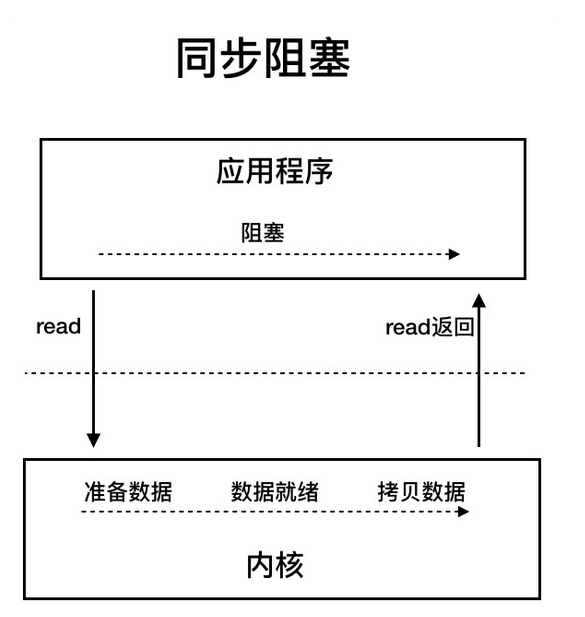


#### 2、同步非阻塞 I/O

用户线程不断的发起 read 调用，数据没到内核空间时，每次都返回失败，直到数据到了内核空间，这一次 read 调用后，在等待数据从内核空间拷贝到用户空间这段时间里，线程还是阻塞的，等数据到了用户空间再把线程叫醒。

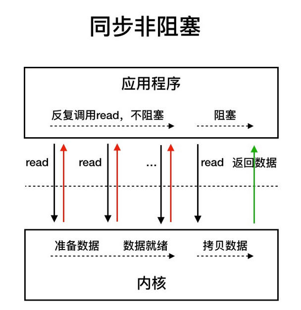

#### 3、I/O 多路复用

用户线程的读取操作分成两步了，线程先发起 select 调用，目的是问内核数据准备好了吗？等内核把数据准备好了，用户线程再发起 read 调用。在等待数据从内核空间拷贝到用户空间这段时间里，线程还是阻塞的。那为什么叫 I/O 多路复用呢？因为一次 select 调用可以向内核查多个数据通道（Channel）的状态，所以叫多路复用。

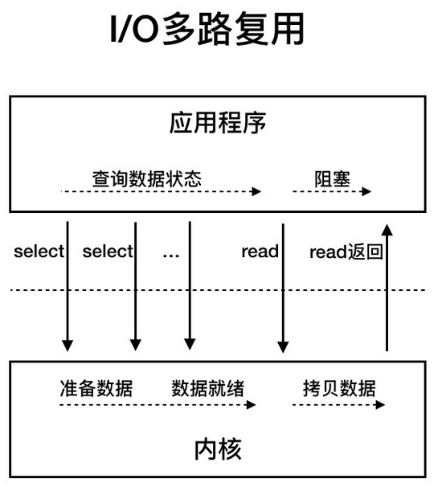


#### 4、异步 I/O

用户线程发起 read 调用的同时注册一个回调函数，read 立即返回，等内核将数据准备好后，再调用指定的回调函数完成处理。在这个过程中，用户线程一直没有阻塞。

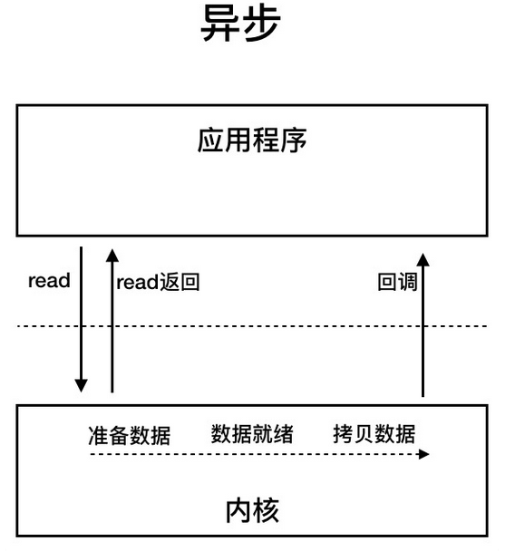


### 2、NioEndpoint 组件

Tomcat 的 NioEndpoint 组件实现了 I/O 多路复用模型，接下来我会介绍 NioEndpoint 的实现原理

我们知道，对于 Java 的多路复用器的使用，无非是两步：
- 1、创建一个 Selector，在它身上注册各种感兴趣的事件，然后调用 select 方法，等待感兴趣的事情发生。
- 2、感兴趣的事情发生了，比如可以读了，这时便创建一个新的线程从 Channel 中读数据。

Tomcat 的 NioEndpoint 组件虽然实现比较复杂，但基本原理就是上面两步。我们先来看看它有哪些组件，它一共包含 LimitLatch、Acceptor、Poller、SocketProcessor 和 Executor 共 5 个组件，它们的工作过程如下图所示。


LimitLatch 是连接控制器，它负责控制最大连接数，NIO 模式下默认是 10000，达到这个阈值后，连接请求被拒绝。


Acceptor 跑在一个单独的线程里，它在一个死循环里调用 accept 方法来接收新连接，一旦有新的连接请求到来，accept 方法返回一个 Channel 对象，接着把 Channel 对象交给 Poller 去处理。

Poller 的本质是一个 Selector，也跑在单独线程里。Poller 在内部维护一个 Channel 数组，它在一个死循环里不断检测 Channel 的数据就绪状态，一旦有 Channel 可读，就生成一个 SocketProcessor 任务对象扔给 Executor 去处理。

Executor 就是线程池，负责运行 SocketProcessor 任务类，SocketProcessor 的 run 方法会调用 Http11Processor 来读取和解析请求数据。我们知道，Http11Processor 是应用层协议的封装，它会调用容器获得响应，再把响应通过 Channel 写出。


#### 1、LimitLatch

LimitLatch 用来控制连接个数，当连接数到达最大时阻塞线程，直到后续组件处理完一个连接后将连接数减 1。请你注意到达最大连接数后操作系统底层还是会接收客户端连接，但用户层已经不再接收。LimitLatch 的核心代码如下：

```java

public class LimitLatch {
    private class Sync extends AbstractQueuedSynchronizer {
     
        @Override
        protected int tryAcquireShared() {
            long newCount = count.incrementAndGet();
            if (newCount > limit) {
                count.decrementAndGet();
                return -1;
            } else {
                return 1;
            }
        }

        @Override
        protected boolean tryReleaseShared(int arg) {
            count.decrementAndGet();
            return true;
        }
    }

    private final Sync sync;
    private final AtomicLong count;
    private volatile long limit;
    
    //线程调用这个方法来获得接收新连接的许可，线程可能被阻塞
    public void countUpOrAwait() throws InterruptedException {
      sync.acquireSharedInterruptibly(1);
    }

    //调用这个方法来释放一个连接许可，那么前面阻塞的线程可能被唤醒
    public long countDown() {
      sync.releaseShared(0);
      long result = getCount();
      return result;
   }
}
```

从上面的代码我们看到，LimitLatch 内步定义了内部类 Sync，而 Sync 扩展了 AQS，AQS 是 Java 并发包中的一个核心类，它在内部维护一个状态和一个线程队列，可以用来控制线程什么时候挂起，什么时候唤醒。我们可以扩展它来实现自己的同步器，实际上 Java 并发包里的锁和条件变量等等都是通过 AQS 来实现的，而这里的 LimitLatch 也不例外。

理解上面的代码时有两个要点：

- 1、用户线程通过调用 LimitLatch 的 countUpOrAwait 方法来拿到锁，如果暂时无法获取，这个线程会被阻塞到 AQS 的队列中。那 AQS 怎么知道是阻塞还是不阻塞用户线程呢？其实这是由 AQS 的使用者来决定的，也就是内部类 Sync 来决定的，因为 Sync 类重写了 AQS 的 tryAcquireShared() 方法。它的实现逻辑是如果当前连接数 count 小于 limit，线程能获取锁，返回 1，否则返回 -1。

- 2、如何用户线程被阻塞到了 AQS 的队列，那什么时候唤醒呢？同样是由 Sync 内部类决定，Sync 重写了 AQS 的 tryReleaseShared() 方法，其实就是当一个连接请求处理完了，这时又可以接收一个新连接了，这样前面阻塞的线程将会被唤醒。

其实你会发现 AQS 就是一个骨架抽象类，它帮我们搭了个架子，用来控制线程的阻塞和唤醒。具体什么时候阻塞、什么时候唤醒由你来决定。我们还注意到，当前线程数被定义成原子变量 AtomicLong，而 limit 变量用 volatile 关键字来修饰，这些并发编程的实际运用。

#### 2、Acceptor

Acceptor 实现了 Runnable 接口，因此可以跑在单独线程里。一个端口号只能对应一个 ServerSocketChannel，因此这个 ServerSocketChannel 是在多个 Acceptor 线程之间共享的，它是 Endpoint 的属性，由 Endpoint 完成初始化和端口绑定。初始化过程如下：

```java

serverSock = ServerSocketChannel.open();
serverSock.socket().bind(addr,getAcceptCount());
serverSock.configureBlocking(true);
```
从上面的初始化代码我们可以看到两个关键信息：
- 1、bind 方法的第二个参数表示操作系统的等待队列长度，我在上面提到，当应用层面的连接数到达最大值时，操作系统可以继续接收连接，那么操作系统能继续接收的最大连接数就是这个队列长度，可以通过 acceptCount 参数配置，默认是 100。
- 2、ServerSocketChannel 被设置成阻塞模式，也就是说它是以阻塞的方式接收连接的。

ServerSocketChannel 通过 accept() 接受新的连接，accept() 方法返回获得 SocketChannel 对象，然后将 SocketChannel 对象封装在一个 PollerEvent 对象中，并将 PollerEvent 对象压入 Poller 的 Queue 里，这是个典型的“生产者 - 消费者”模式，Acceptor 与 Poller 线程之间通过 Queue 通信。


#### 3、Poller

Poller 本质是一个 Selector，它内部维护一个 Queue，这个 Queue 定义如下：

private final SynchronizedQueue<PollerEvent> events = new SynchronizedQueue<>();

SynchronizedQueue 的方法比如 offer、poll、size 和 clear 方法，都使用了 synchronized 关键字进行修饰，用来保证同一时刻只有一个 Acceptor 线程对 Queue 进行读写。同时有多个 Poller 线程在运行，每个 Poller 线程都有自己的 Queue。每个 Poller 线程可能同时被多个 Acceptor 线程调用来注册 PollerEvent。同样 Poller 的个数可以通过 pollers 参数配置。

Poller 不断的通过内部的 Selector 对象向内核查询 Channel 的状态，一旦可读就生成任务类 SocketProcessor 交给 Executor 去处理。Poller 的另一个重要任务是循环遍历检查自己所管理的 SocketChannel 是否已经超时，如果有超时就关闭这个 SocketChannel。


#### 4、SocketProcessor

我们知道，Poller 会创建 SocketProcessor 任务类交给线程池处理，而 SocketProcessor 实现了 Runnable 接口，用来定义 Executor 中线程所执行的任务，主要就是调用 Http11Processor 组件来处理请求。Http11Processor 读取 Channel 的数据来生成 ServletRequest 对象，这里请你注意：Http11Processor 并不是直接读取 Channel 的。这是因为 Tomcat 支持同步非阻塞 I/O 模型和异步 I/O 模型，在 Java API 中，相应的 Channel 类也是不一样的，比如有 AsynchronousSocketChannel 和 SocketChannel，为了对 Http11Processor 屏蔽这些差异，Tomcat 设计了一个包装类叫作 SocketWrapper，Http11Processor 只调用 SocketWrapper 的方法去读写数据。


### 3、高并发思路

在弄清楚 NioEndpoint 的实现原理后，我们来考虑一个重要的问题，怎么把这个过程做到高并发呢？高并发就是能快速地处理大量的请求，需要合理设计线程模型让 CPU 忙起来，尽量不要让线程阻塞，因为一阻塞，CPU 就闲下来了。另外就是有多少任务，就用相应规模的线程数去处理。我们注意到 NioEndpoint 要完成三件事情：接收连接、检测 I/O 事件以及处理请求，那么最核心的就是把这三件事情分开，用不同规模的线程数去处理，比如用专门的线程组去跑 Acceptor，并且 Acceptor 的个数可以配置；用专门的线程组去跑 Poller，Poller 的个数也可以配置；最后具体任务的执行也由专门的线程池来处理，也可以配置线程池的大小。


> 总结

I/O 模型是为了解决内存和外部设备速度差异的问题。我们平时说的阻塞或非阻塞是指应用程序在发起 I/O 操作时，是立即返回还是等待。而同步和异步，是指应用程序在与内核通信时，数据从内核空间到应用空间的拷贝，是由内核主动发起还是由应用程序来触发。

在 Tomcat 中，Endpoint 组件的主要工作就是处理 I/O，而 NioEndpoint 利用 Java NIO API 实现了多路复用 I/O 模型。其中关键的一点是，读写数据的线程自己不会阻塞在 I/O 等待上，而是把这个工作交给 Selector。同时 Tomcat 在这个过程中运用到了很多 Java 并发编程技术，比如 AQS、原子类、并发容器，线程池等，都值得我们去细细品味。


> 思考

Tomcat 的 NioEndpoint 组件的名字中有 NIO，NIO 是非阻塞的意思，似乎说的是同步非阻塞 I/O 模型，但是 NioEndpoint 又是调用 Java 的的 Selector 来实现的，我们知道 Selector 指的是 I/O 多路复用器，也就是我们说的 I/O 多路复用模型，这不是矛盾了吗？


## 2、Nio2Endpoint组件：Tomcat如何实现异步I/O？

NIO 和 NIO.2 最大的区别是，一个是同步一个是异步。我在上期提到过，异步最大的特点是，应用程序不需要自己去触发数据从内核空间到用户空间的拷贝。为什么是应用程序去“触发”数据的拷贝，而不是直接从内核拷贝数据呢？这是因为应用程序是不能访问内核空间的，因此数据拷贝肯定是由内核来做，关键是谁来触发这个动作。是内核主动将数据拷贝到用户空间并通知应用程序。还是等待应用程序通过 Selector 来查询，当数据就绪后，应用程序再发起一个 read 调用，这时内核再把数据从内核空间拷贝到用户空间。需要注意的是，数据从内核空间拷贝到用户空间这段时间，应用程序还是阻塞的。所以你会看到异步的效率是高于同步的，因为异步模式下应用程序始终不会被阻塞。下面我以网络数据读取为例，来说明异步模式的工作过程。

- 1、首先，应用程序在调用 read API 的同时告诉内核两件事情：数据准备好了以后拷贝到哪个 Buffer，以及调用哪个回调函数去处理这些数据。

- 2、之后，内核接到这个 read 指令后，等待网卡数据到达，数据到了后，产生硬件中断，内核在中断程序里把数据从网卡拷贝到内核空间，接着做 TCP/IP 协议层面的数据解包和重组，再把数据拷贝到应用程序指定的 Buffer，最后调用应用程序指定的回调函数。

可能通过下面这张图来回顾一下同步与异步的区别：

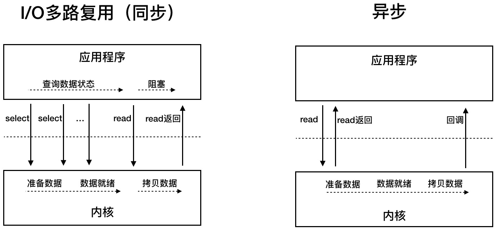


我们可以看到在异步模式下，应用程序当了“甩手掌柜”，内核则忙前忙后，但最大限度提高了 I/O 通信的效率。Windows 的 IOCP 和 Linux 内核 2.6 的 AIO 都提供了异步 I/O 的支持，Java 的 NIO.2 API 就是对操作系统异步 I/O API 的封装。

### 1、Java NIO.2

今天我们会重点关注 Tomcat 是如何实现异步 I/O 模型的，但在这之前，我们先来简单回顾下如何用 Java 的 NIO.2 API 来编写一个服务端程序。

```java

public class Nio2Server {

   void listen(){
      //1.创建一个线程池
      ExecutorService es = Executors.newCachedThreadPool();

      //2.创建异步通道群组
      AsynchronousChannelGroup tg = AsynchronousChannelGroup.withCachedThreadPool(es, 1);
      
      //3.创建服务端异步通道
      AsynchronousServerSocketChannel assc = AsynchronousServerSocketChannel.open(tg);

      //4.绑定监听端口
      assc.bind(new InetSocketAddress(8080));

      //5. 监听连接，传入回调类处理连接请求
      assc.accept(this, new AcceptHandler()); 
   }
}
```

上面的代码主要做了 5 件事情：
- 1、创建一个线程池，这个线程池用来执行来自内核的回调请求。
- 2、创建一个 AsynchronousChannelGroup，并绑定一个线程池。
- 3、创建 AsynchronousServerSocketChannel，并绑定到 AsynchronousChannelGroup。
- 4、绑定一个监听端口。
- 5、调用 accept 方法开始监听连接请求，同时传入一个回调类去处理连接请求。请你注意，accept 方法的第一个参数是 this 对象，就是 Nio2Server 对象本身，我在下文还会讲为什么要传入这个参数。


你可能会问，为什么需要创建一个线程池呢？其实在异步 I/O 模型里，应用程序不知道数据在什么时候到达，因此向内核注册回调函数，当数据到达时，内核就会调用这个回调函数。同时为了提高处理速度，会提供一个线程池给内核使用，这样不会耽误内核线程的工作，内核只需要把工作交给线程池就立即返回了。

我们再来看看处理连接的回调类 AcceptHandler 是什么样的。

```java

//AcceptHandler类实现了CompletionHandler接口的completed方法。它还有两个模板参数，第一个是异步通道，第二个就是Nio2Server本身
public class AcceptHandler implements CompletionHandler<AsynchronousSocketChannel, Nio2Server> {

   //具体处理连接请求的就是completed方法，它有两个参数：第一个是异步通道，第二个就是上面传入的NioServer对象
   @Override
   public void completed(AsynchronousSocketChannel asc, Nio2Server attachment) {      
      //调用accept方法继续接收其他客户端的请求
      attachment.assc.accept(attachment, this);
      
      //1. 先分配好Buffer，告诉内核，数据拷贝到哪里去
      ByteBuffer buf = ByteBuffer.allocate(1024);
      
      //2. 调用read函数读取数据，除了把buf作为参数传入，还传入读回调类
      channel.read(buf, buf, new ReadHandler(asc)); 

}
```
我们看到它实现了 CompletionHandler 接口，下面我们先来看看 CompletionHandler 接口的定义。

```java

public interface CompletionHandler<V,A> {

    void completed(V result, A attachment);

    void failed(Throwable exc, A attachment);
}
```
CompletionHandler 接口有两个模板参数 V 和 A，分别表示 I/O 调用的返回值和附件类。比如 accept 的返回值就是 AsynchronousSocketChannel，而附件类由用户自己决定，在 accept 的调用中，我们传入了一个 Nio2Server。因此 AcceptHandler 带有了两个模板参数：AsynchronousSocketChannel 和 Nio2Server。

CompletionHandler 有两个方法：completed 和 failed，分别在 I/O 操作成功和失败时调用。completed 方法有两个参数，其实就是前面说的两个模板参数。也就是说，Java 的 NIO.2 在调用回调方法时，会把返回值和附件类当作参数传给 NIO.2 的使用者。

下面我们再来看看处理读的回调类 ReadHandler 长什么样子。

```java

public class ReadHandler implements CompletionHandler<Integer, ByteBuffer> {   
    //读取到消息后的处理  
    @Override  
    public void completed(Integer result, ByteBuffer attachment) {  
        //attachment就是数据，调用flip操作，其实就是把读的位置移动最前面
        attachment.flip();  
        //读取数据
        ... 
    }  

    void failed(Throwable exc, A attachment){
        ...
    }
}
```

read 调用的返回值是一个整型数，所以我们回调方法里的第一个参数就是一个整型，表示有多少数据被读取到了 Buffer 中。第二个参数是一个 ByteBuffer，这是因为我们在调用 read 方法时，把用来存放数据的 ByteBuffer 当作附件类传进去了，所以在回调方法里，有 ByteBuffer 类型的参数，我们直接从这个 ByteBuffer 里获取数据。


### 2、Nio2Endpoint

掌握了 Java NIO.2 API 的使用以及服务端程序的工作原理之后，再来理解 Tomcat 的异步 I/O 实现就不难了。我们先通过一张图来看看 Nio2Endpoint 有哪些组件。

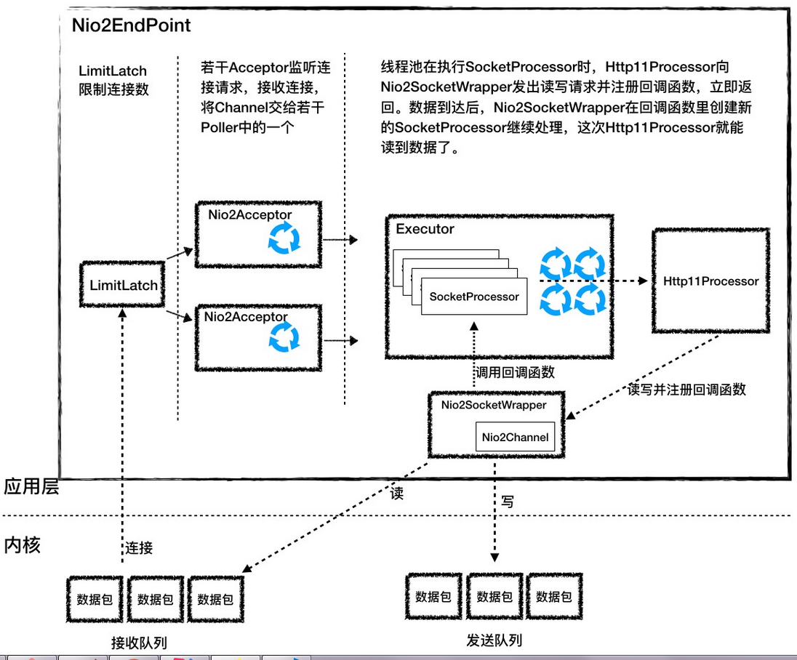

从图上看，总体工作流程跟 NioEndpoint 是相似的。

LimitLatch 是连接控制器，它负责控制最大连接数。

Nio2Acceptor 扩展了 Acceptor，用异步 I/O 的方式来接收连接，跑在一个单独的线程里，也是一个线程组。Nio2Acceptor 接收新的连接后，得到一个 AsynchronousSocketChannel，Nio2Acceptor 把 AsynchronousSocketChannel 封装成一个 Nio2SocketWrapper，并创建一个 SocketProcessor 任务类交给线程池处理，并且 SocketProcessor 持有 Nio2SocketWrapper 对象。

Executor 在执行 SocketProcessor 时，SocketProcessor 的 run 方法会调用 Http11Processor 来处理请求，Http11Processor 会通过 Nio2SocketWrapper 读取和解析请求数据，请求经过容器处理后，再把响应通过 Nio2SocketWrapper 写出。


需要你注意 Nio2Endpoint 跟 NioEndpoint 的一个明显不同点是，Nio2Endpoint 中没有 Poller 组件，也就是没有 Selector。这是为什么呢？因为在异步 I/O 模式下，Selector 的工作交给内核来做了。


#### 1、Nio2Acceptor

和 NioEndpint 一样，Nio2Endpoint 的基本思路是用 LimitLatch 组件来控制连接数，但是 Nio2Acceptor 的监听连接的过程不是在一个死循环里不断地调 accept 方法，而是通过回调函数来完成的。我们来看看它的连接监听方法：serverSock.accept(null, this);

其实就是调用了 accept 方法，注意它的第二个参数是 this，表明 Nio2Acceptor 自己就是处理连接的回调类，因此 Nio2Acceptor 实现了 CompletionHandler 接口。那么它是如何实现 CompletionHandler 接口的呢？

```java

protected class Nio2Acceptor extends Acceptor<AsynchronousSocketChannel>
    implements CompletionHandler<AsynchronousSocketChannel, Void> {
    
@Override
public void completed(AsynchronousSocketChannel socket,
        Void attachment) {
        
    if (isRunning() && !isPaused()) {
        if (getMaxConnections() == -1) {
            //如果没有连接限制，继续接收新的连接
            serverSock.accept(null, this);
        } else {
            //如果有连接限制，就在线程池里跑run方法，run方法会检查连接数
            getExecutor().execute(this);
        }
        //处理请求
        if (!setSocketOptions(socket)) {
            closeSocket(socket);
        }
    } 
}
```

可以看到 CompletionHandler 的两个模板参数分别是 AsynchronousServerSocketChannel 和 Void，我在前面说过第一个参数就是 accept 方法的返回值，第二个参数是附件类，由用户自己决定，这里为 Void。completed 方法的处理逻辑比较简单：

- 如果没有连接限制，继续在本线程中调用 accept 方法接收新的连接。
- 如果有连接限制，就在线程池里跑 run 方法去接收新的连接。那为什么要跑 run 方法呢，因为在 run 方法里会检查连接数，当连接达到最大数时，线程可能会被 LimitLatch 阻塞。为什么要放在线程池里跑呢？这是因为如果放在当前线程里执行，completed 方法可能被阻塞，会导致这个回调方法一直不返回。

接着 completed 方法会调用 setSocketOptions 方法，在这个方法里，会创建 Nio2SocketWrapper 和 SocketProcessor，并交给线程池处理。


#### 2、Nio2SocketWrapper

Nio2SocketWrapper 的主要作用是封装 Channel，并提供接口给 Http11Processor 读写数据。讲到这里你是不是有个疑问：Http11Processor 是不能阻塞等待数据的，按照异步 I/O 的套路，Http11Processor 在调用 Nio2SocketWrapper 的 read 方法时需要注册回调类，read 调用会立即返回，问题是立即返回后 Http11Processor 还没有读到数据，怎么办呢？这个请求的处理不就失败了吗？


为了解决这个问题，Http11Processor 是通过 2 次 read 调用来完成数据读取操作的。

- 第一次 read 调用：连接刚刚建立好后，Acceptor 创建 SocketProcessor 任务类交给线程池去处理，Http11Processor 在处理请求的过程中，会调用 Nio2SocketWrapper 的 read 方法发出第一次读请求，同时注册了回调类 readCompletionHandler，因为数据没读到，Http11Processor 把当前的 Nio2SocketWrapper 标记为数据不完整。接着 SocketProcessor 线程被回收，Http11Processor 并没有阻塞等待数据。这里请注意，Http11Processor 维护了一个 Nio2SocketWrapper 列表，也就是维护了连接的状态。

- 第二次 read 调用：当数据到达后，内核已经把数据拷贝到 Http11Processor 指定的 Buffer 里，同时回调类 readCompletionHandler 被调用，在这个回调处理方法里会重新创建一个新的 SocketProcessor 任务来继续处理这个连接，而这个新的 SocketProcessor 任务类持有原来那个 Nio2SocketWrapper，这一次 Http11Processor 可以通过 Nio2SocketWrapper 读取数据了，因为数据已经到了应用层的 Buffer。

这个回调类 readCompletionHandler 的源码如下，最关键的一点是，Nio2SocketWrapper 是作为附件类来传递的，这样在回调函数里能拿到所有的上下文。

```java

this.readCompletionHandler = new CompletionHandler<Integer, SocketWrapperBase<Nio2Channel>>() {
    public void completed(Integer nBytes, SocketWrapperBase<Nio2Channel> attachment) {
        ...
        //通过附件类SocketWrapper拿到所有的上下文
        Nio2SocketWrapper.this.getEndpoint().processSocket(attachment, SocketEvent.OPEN_READ, false);
    }

    public void failed(Throwable exc, SocketWrapperBase<Nio2Channel> attachment) {
        ...
    }
}
```

> 总结

在异步 I/O 模型里，内核做了很多事情，它把数据准备好，并拷贝到用户空间，再通知应用程序去处理，也就是调用应用程序注册的回调函数。Java 在操作系统 异步 IO API 的基础上进行了封装，提供了 Java NIO.2 API，而 Tomcat 的异步 I/O 模型就是基于 Java NIO.2 实现的。由于 NIO 和 NIO.2 的 API 接口和使用方法完全不同，可以想象一个系统中如果已经支持同步 I/O，要再支持异步 I/O，改动是比较大的，很有可能不得不重新设计组件之间的接口。但是 Tomcat 通过充分的抽象，比如 SocketWrapper 对 Channel 的封装，再加上 Http11Processor 的两次 read 调用，巧妙地解决了这个问题，使得协议处理器 Http11Processor 和 I/O 通信处理器 Endpoint 之间的接口保持不变。

> 思考

我在文章开头介绍 Java NIO.2 的使用时，提到过要创建一个线程池来处理异步 I/O 的回调，那么这个线程池跟 Tomcat 的工作线程池 Executor 是同一个吗？如果不是，它们有什么关系？


## 3、AprEndpoint组件：Tomcat APR提高I/O性能的秘密

我们在使用 Tomcat 时，会在启动日志里看到这样的提示信息：

```
The APR based Apache Tomcat Native library which allows optimal performance in production environments was not found on the java.library.path: ***
```
这句话的意思就是推荐你去安装 APR 库，可以提高系统性能。那什么是 APR 呢？

APR（Apache Portable Runtime Libraries）是 Apache 可移植运行时库，它是用 C 语言实现的，其目的是向上层应用程序提供一个跨平台的操作系统接口库。Tomcat 可以用它来处理包括文件和网络 I/O，从而提升性能。我在专栏前面提到过，Tomcat 支持的连接器有 NIO、NIO.2 和 APR。跟 NioEndpoint 一样，AprEndpoint 也实现了非阻塞 I/O，它们的区别是：NioEndpoint 通过调用 Java 的 NIO API 来实现非阻塞 I/O，而 AprEndpoint 是通过 JNI 调用 APR 本地库而实现非阻塞 I/O 的。

那同样是非阻塞 I/O，为什么 Tomcat 会提示使用 APR 本地库的性能会更好呢？这是因为在某些场景下，比如需要频繁与操作系统进行交互，Socket 网络通信就是这样一个场景，特别是如果你的 Web 应用使用了 TLS 来加密传输，我们知道 TLS 协议在握手过程中有多次网络交互，在这种情况下 Java 跟 C 语言程序相比还是有一定的差距，而这正是 APR 的强项。


Tomcat 本身是 Java 编写的，为了调用 C 语言编写的 APR，需要通过 JNI 方式来调用。JNI（Java Native Interface） 是 JDK 提供的一个编程接口，它允许 Java 程序调用其他语言编写的程序或者代码库，其实 JDK 本身的实现也大量用到 JNI 技术来调用本地 C 程序库。

在今天这一期文章，首先我会讲 AprEndpoint 组件的工作过程，接着我会在原理的基础上分析 APR 提升性能的一些秘密。在今天的学习过程中会涉及到一些操作系统的底层原理，毫无疑问掌握这些底层知识对于提高你的内功非常有帮助。


### 1、AprEndpoint 工作过程

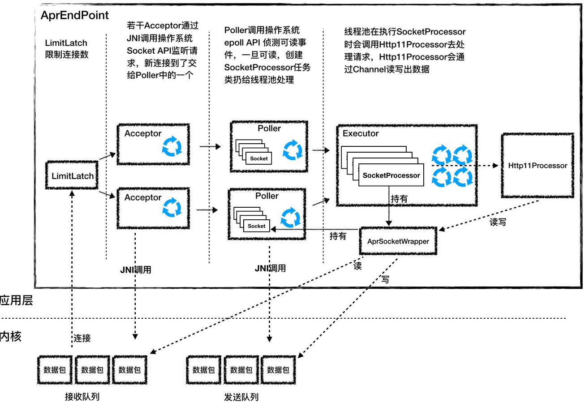


你会发现它跟 NioEndpoint 的图很像，从左到右有 LimitLatch、Acceptor、Poller、SocketProcessor 和 Http11Processor，只是 Acceptor 和 Poller 的实现和 NioEndpoint 不同。接下来我分别来讲讲这两个组件。

#### 1、Acceptor

Accpetor 的功能就是监听连接，接收并建立连接。它的本质就是调用了四个操作系统 API：Socket、Bind、Listen 和 Accept。那 Java 语言如何直接调用 C 语言 API 呢？答案就是通过 JNI。具体来说就是两步：先封装一个 Java 类，在里面定义一堆用 native 关键字修饰的方法，像下面这样。

```java

public class Socket {
  ...
  //用native修饰这个方法，表明这个函数是C语言实现
  public static native long create(int family, int type,
                                 int protocol, long cont)
                                 
  public static native int bind(long sock, long sa);
  
  public static native int listen(long sock, int backlog);
  
  public static native long accept(long sock)
}
```
接着用 C 代码实现这些方法，比如 Bind 函数就是这样实现的：


```java

//注意函数的名字要符合JNI规范的要求
JNIEXPORT jint JNICALL 
Java_org_apache_tomcat_jni_Socket_bind(JNIEnv *e, jlong sock,jlong sa)
  {
      jint rv = APR_SUCCESS;
      tcn_socket_t *s = (tcn_socket_t *）sock;
      apr_sockaddr_t *a = (apr_sockaddr_t *) sa;
  
        //调用APR库自己实现的bind函数
      rv = (jint)apr_socket_bind(s->sock, a);
      return rv;
  }
```
专栏里我就不展开 JNI 的细节了，你可以扩展阅读获得更多信息和例子。我们要注意的是函数名字要符合 JNI 的规范，以及 Java 和 C 语言如何互相传递参数，比如在 C 语言有指针，Java 没有指针的概念，所以在 Java 中用 long 类型来表示指针。AprEndpoint 的 Acceptor 组件就是调用了 APR 实现的四个 API。

#### 2、Poller

Acceptor 接收到一个新的 Socket 连接后，按照 NioEndpoint 的实现，它会把这个 Socket 交给 Poller 去查询 I/O 事件。AprEndpoint 也是这样做的，不过 AprEndpoint 的 Poller 并不是调用 Java NIO 里的 Selector 来查询 Socket 的状态，而是通过 JNI 调用 APR 中的 poll 方法，而 APR 又是调用了操作系统的 epoll API 来实现的。

这里有个特别的地方是在 AprEndpoint 中，我们可以配置一个叫deferAccept的参数，它对应的是 TCP 协议中的TCP_DEFER_ACCEPT，设置这个参数后，当 TCP 客户端有新的连接请求到达时，TCP 服务端先不建立连接，而是再等等，直到客户端有请求数据发过来时再建立连接。这样的好处是服务端不需要用 Selector 去反复查询请求数据是否就绪。

这是一种 TCP 协议层的优化，不是每个操作系统内核都支持，因为 Java 作为一种跨平台语言，需要屏蔽各种操作系统的差异，因此并没有把这个参数提供给用户；但是对于 APR 来说，它的目的就是尽可能提升性能，因此它向用户暴露了这个参数。


### 2、APR 提升性能的秘密

APR 连接器之所以能提高 Tomcat 的性能，除了 APR 本身是 C 程序库之外，还有哪些提速的秘密呢？


#### 1、JVM 堆 VS 本地内存

我们知道 Java 的类实例一般在 JVM 堆上分配，而 Java 是通过 JNI 调用 C 代码来实现 Socket 通信的，那么 C 代码在运行过程中需要的内存又是从哪里分配的呢？C 代码能否直接操作 Java 堆？

为了回答这些问题，我先来说说 JVM 和用户进程的关系。如果你想运行一个 Java 类文件，可以用下面的 Java 命令来执行。

java my.class

这个命令行中的java其实是一个可执行程序，这个程序会创建 JVM 来加载和运行你的 Java 类。操作系统会创建一个进程来执行这个java可执行程序，而每个进程都有自己的虚拟地址空间，JVM 用到的内存（包括堆、栈和方法区）就是从进程的虚拟地址空间上分配的。请你注意的是，JVM 内存只是进程空间的一部分，除此之外进程空间内还有代码段、数据段、内存映射区、内核空间等。从 JVM 的角度看，JVM 内存之外的部分叫作本地内存，C 程序代码在运行过程中用到的内存就是本地内存中分配的。下面我们通过一张图来理解一下。

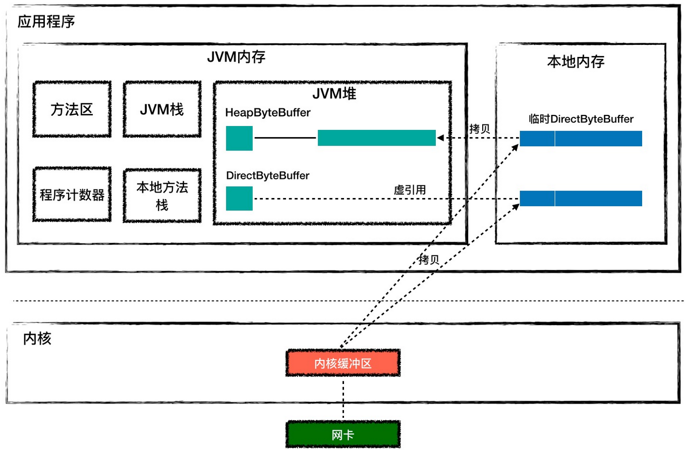

Tomcat 的 Endpoint 组件在接收网络数据时需要预先分配好一块 Buffer，所谓的 Buffer 就是字节数组byte[]，Java 通过 JNI 调用把这块 Buffer 的地址传给 C 代码，C 代码通过操作系统 API 读取 Socket 并把数据填充到这块 Buffer。Java NIO API 提供了两种 Buffer 来接收数据：HeapByteBuffer 和 DirectByteBuffer，下面的代码演示了如何创建两种 Buffer。

```java

//分配HeapByteBuffer
ByteBuffer buf = ByteBuffer.allocate(1024);

//分配DirectByteBuffer
ByteBuffer buf = ByteBuffer.allocateDirect(1024);
```

创建好 Buffer 后直接传给 Channel 的 read 或者 write 函数，最终这块 Buffer 会通过 JNI 调用传递给 C 程序。


//将buf作为read函数的参数
int bytesRead = socketChannel.read(buf);


那 HeapByteBuffer 和 DirectByteBuffer 有什么区别呢？HeapByteBuffer 对象本身在 JVM 堆上分配，并且它持有的字节数组byte[]也是在 JVM 堆上分配。但是如果用 HeapByteBuffer 来接收网络数据，需要把数据从内核先拷贝到一个临时的本地内存，再从临时本地内存拷贝到 JVM 堆，而不是直接从内核拷贝到 JVM 堆上。这是为什么呢？这是因为数据从内核拷贝到 JVM 堆的过程中，JVM 可能会发生 GC，GC 过程中对象可能会被移动，也就是说 JVM 堆上的字节数组可能会被移动，这样的话 Buffer 地址就失效了。如果这中间经过本地内存中转，从本地内存到 JVM 堆的拷贝过程中 JVM 可以保证不做 GC。

如果使用 HeapByteBuffer，你会发现 JVM 堆和内核之间多了一层中转，而 DirectByteBuffer 用来解决这个问题，DirectByteBuffer 对象本身在 JVM 堆上，但是它持有的字节数组不是从 JVM 堆上分配的，而是从本地内存分配的。DirectByteBuffer 对象中有个 long 类型字段 address，记录着本地内存的地址，这样在接收数据的时候，直接把这个本地内存地址传递给 C 程序，C 程序会将网络数据从内核拷贝到这个本地内存，JVM 可以直接读取这个本地内存，这种方式比 HeapByteBuffer 少了一次拷贝，因此一般来说它的速度会比 HeapByteBuffer 快好几倍。你可以通过上面的图加深理解。

Tomcat 中的 AprEndpoint 就是通过 DirectByteBuffer 来接收数据的，而 NioEndpoint 和 Nio2Endpoint 是通过 HeapByteBuffer 来接收数据的。你可能会问，NioEndpoint 和 Nio2Endpoint 为什么不用 DirectByteBuffer 呢？这是因为本地内存不好管理，发生内存泄漏难以定位，从稳定性考虑，NioEndpoint 和 Nio2Endpoint 没有去冒这个险。

#### 2、sendfile

我们再来考虑另一个网络通信的场景，也就是静态文件的处理。浏览器通过 Tomcat 来获取一个 HTML 文件，而 Tomcat 的处理逻辑无非是两步：

- 1、从磁盘读取 HTML 到内存。
- 2、将这段内存的内容通过 Socket 发送出去。

但是在传统方式下，有很多次的内存拷贝：
- 读取文件时，首先是内核把文件内容读取到内核缓冲区。
- 如果使用 HeapByteBuffer，文件数据从内核到 JVM 堆内存需要经过本地内存中转。
- 同样在将文件内容推入网络时，从 JVM 堆到内核缓冲区需要经过本地内存中转。
- 最后还需要把文件从内核缓冲区拷贝到网卡缓冲区。

从下面的图你会发现这个过程有 6 次内存拷贝，并且 read 和 write 等系统调用将导致进程从用户态到内核态的切换，会耗费大量的 CPU 和内存资源。

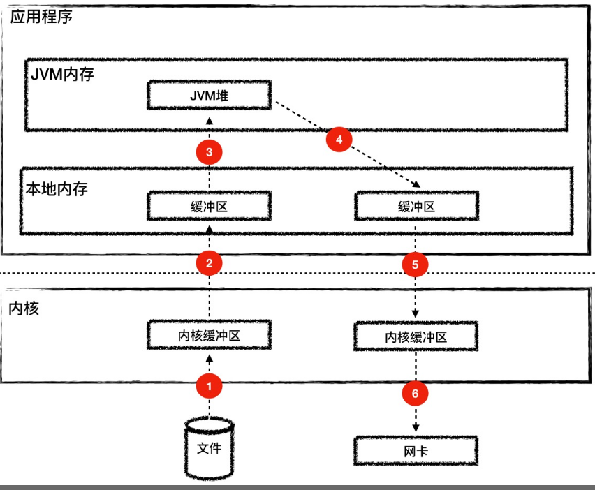

而 Tomcat 的 AprEndpoint 通过操作系统层面的 sendfile 特性解决了这个问题，sendfile 系统调用方式非常简洁。

sendfile(socket, file, len);

它带有两个关键参数：Socket 和文件句柄。将文件从磁盘写入 Socket 的过程只有两步：
- 第一步：将文件内容读取到内核缓冲区。
- 第二步：数据并没有从内核缓冲区复制到 Socket 关联的缓冲区，只有记录数据位置和长度的描述符被添加到 Socket 缓冲区中；接着把数据直接从内核缓冲区传递给网卡。这个过程你可以看下面的图。


> 总结

对于一些需要频繁与操作系统进行交互的场景，比如网络通信，Java 的效率没有 C 语言高，特别是 TLS 协议握手过程中需要多次网络交互，这种情况下使用 APR 本地库能够显著提升性能。除此之外，APR 提升性能的秘密还有：通过 DirectByteBuffer 避免了 JVM 堆与本地内存之间的内存拷贝；通过 sendfile 特性避免了内核与应用之间的内存拷贝以及用户态和内核态的切换。其实很多高性能网络通信组件，比如 Netty，都是通过 DirectByteBuffer 来收发网络数据的。由于本地内存难于管理，Netty 采用了本地内存池技术，感兴趣的同学可以深入了解一下。

> 思考

为什么不同的操作系统，比如 Linux 和 Windows，都有自己的 Java 虚拟机？


## 4、Executor组件：Tomcat如何扩展Java线程池？

在开发中我们经常会碰到“池”的概念，比如数据库连接池、内存池、线程池、常量池等。为什么需要“池”呢？程序运行的本质，就是通过使用系统资源（CPU、内存、网络、磁盘等）来完成信息的处理，比如在 JVM 中创建一个对象实例需要消耗 CPU 和内存资源，如果你的程序需要频繁创建大量的对象，并且这些对象的存活时间短，就意味着需要进行频繁销毁，那么很有可能这部分代码会成为性能的瓶颈。而“池”就是用来解决这个问题的，简单来说，对象池就是把用过的对象保存起来，等下一次需要这种对象的时候，直接从对象池中拿出来重复使用，避免频繁地创建和销毁。在 Java 中万物皆对象，线程也是一个对象，Java 线程是对操作系统线程的封装，创建 Java 线程也需要消耗系统资源，因此就有了线程池。JDK 中提供了线程池的默认实现，我们也可以通过扩展 Java 原生线程池来实现自己的线程池。同样，为了提高处理能力和并发度，Web 容器一般会把处理请求的工作放到线程池里来执行，Tomcat 扩展了原生的 Java 线程池，来满足 Web 容器高并发的需求，下面我们就来学习一下 Java 线程池的原理，以及 Tomcat 是如何扩展 Java 线程池的。


### 1、Java 线程池

简单的说，Java 线程池里内部维护一个线程数组和一个任务队列，当任务处理不过来的时，就把任务放到队列里慢慢处理。

我们先来看看 Java 线程池核心类 ThreadPoolExecutor 的构造函数，你需要知道 ThreadPoolExecutor 是如何使用这些参数的，这是理解 Java 线程工作原理的关键。

```java

public ThreadPoolExecutor(int corePoolSize,
                          int maximumPoolSize,
                          long keepAliveTime,
                          TimeUnit unit,
                          BlockingQueue<Runnable> workQueue,
                          ThreadFactory threadFactory,
                          RejectedExecutionHandler handler)
```

每次提交任务时，如果线程数还没达到核心线程数 corePoolSize，线程池就创建新线程来执行。当线程数达到 corePoolSize 后，新增的任务就放到工作队列 workQueue 里，而线程池中的线程则努力地从 workQueue 里拉活来干，也就是调用 poll 方法来获取任务。如果任务很多，并且 workQueue 是个有界队列，队列可能会满，此时线程池就会紧急创建新的临时线程来救场，如果总的线程数达到了最大线程数 maximumPoolSize，则不能再创建新的临时线程了，转而执行拒绝策略 handler，比如抛出异常或者由调用者线程来执行任务等。

如果高峰过去了，线程池比较闲了怎么办？临时线程使用 poll（keepAliveTime, unit）方法从工作队列中拉活干，请注意 poll 方法设置了超时时间，如果超时了仍然两手空空没拉到活，表明它太闲了，这个线程会被销毁回收。那还有一个参数 threadFactory 是用来做什么的呢？通过它你可以扩展原生的线程工厂，比如给创建出来的线程取个有意义的名字。


Java 提供了一些默认的线程池实现，比如 FixedThreadPool 和 CachedThreadPool，它们的本质就是给 ThreadPoolExecutor 设置了不同的参数，是定制版的 ThreadPoolExecutor。

```java


public static ExecutorService newFixedThreadPool(int nThreads) {
    return new ThreadPoolExecutor(nThreads, nThreads,
                                  0L, TimeUnit.MILLISECONDS,
                                 new LinkedBlockingQueue<Runnable>());
}

public static ExecutorService newCachedThreadPool() {
    return new ThreadPoolExecutor(0, Integer.MAX_VALUE,
                                  60L, TimeUnit.SECONDS,
                                  new SynchronousQueue<Runnable>());
}
```

从上面的代码你可以看到：
- FixedThreadPool 有固定长度（nThreads）的线程数组，忙不过来时会把任务放到无限长的队列里，这是因为 LinkedBlockingQueue 默认是一个无界队列。
- CachedThreadPool 的 maximumPoolSize 参数值是Integer.MAX_VALUE，因此它对线程个数不做限制，忙不过来时无限创建临时线程，闲下来时再回收。它的任务队列是 SynchronousQueue，表明队列长度为 0。

### 2、Tomcat 线程池

跟 FixedThreadPool/CachedThreadPool 一样，Tomcat 的线程池也是一个定制版的 ThreadPoolExecutor。

通过比较 FixedThreadPool 和 CachedThreadPool，我们发现它们传给 ThreadPoolExecutor 的参数有两个关键点：1、是否限制线程个数；2、是否限制队列长度。

对于 Tomcat 来说，这两个资源都需要限制，也就是说要对高并发进行控制，否则 CPU 和内存有资源耗尽的风险。因此 Tomcat 传入的参数是这样的：


```java

//定制版的任务队列
taskqueue = new TaskQueue(maxQueueSize);

//定制版的线程工厂
TaskThreadFactory tf = new TaskThreadFactory(namePrefix,daemon,getThreadPriority());

//定制版的线程池
executor = new ThreadPoolExecutor(getMinSpareThreads(), getMaxThreads(), maxIdleTime, TimeUnit.MILLISECONDS,taskqueue, tf);
```

你可以看到其中的两个关键点：
- Tomcat 有自己的定制版任务队列和线程工厂，并且可以限制任务队列的长度，它的最大长度是 maxQueueSize。
- Tomcat 对线程数也有限制，设置了核心线程数（minSpareThreads）和最大线程池数（maxThreads）。

除了资源限制以外，Tomcat 线程池还定制自己的任务处理流程。我们知道 Java 原生线程池的任务处理逻辑比较简单：
- 1、前 corePoolSize 个任务时，来一个任务就创建一个新线程。
- 2、后面再来任务，就把任务添加到任务队列里让所有的线程去抢，如果队列满了就创建临时线程。
- 3、如果总线程数达到 maximumPoolSize，执行拒绝策略。

Tomcat 线程池扩展了原生的 ThreadPoolExecutor，通过重写 execute 方法实现了自己的任务处理逻辑：

- 1、前 corePoolSize 个任务时，来一个任务就创建一个新线程。
- 2、再来任务的话，就把任务添加到任务队列里让所有的线程去抢，如果队列满了就创建临时线程。
- 3、如果总线程数达到 maximumPoolSize，`则继续尝试把任务添加到任务队列中去`。
- 4、如果缓冲队列也满了，插入失败，执行拒绝策略。

观察 Tomcat 线程池和 Java 原生线程池的区别，其实就是在第 3 步，Tomcat 在线程总数达到最大数时，不是立即执行拒绝策略，而是再尝试向任务队列添加任务，添加失败后再执行拒绝策略。那具体如何实现呢，其实很简单，我们来看一下 Tomcat 线程池的 execute 方法的核心代码。

```java

public class ThreadPoolExecutor extends java.util.concurrent.ThreadPoolExecutor {
  
  ...
  
  public void execute(Runnable command, long timeout, TimeUnit unit) {
      submittedCount.incrementAndGet();
      try {
          //调用Java原生线程池的execute去执行任务
          super.execute(command);
      } catch (RejectedExecutionException rx) {
         //如果总线程数达到maximumPoolSize，Java原生线程池执行拒绝策略
          if (super.getQueue() instanceof TaskQueue) {
              final TaskQueue queue = (TaskQueue)super.getQueue();
              try {
                  //继续尝试把任务放到任务队列中去
                  if (!queue.force(command, timeout, unit)) {
                      submittedCount.decrementAndGet();
                      //如果缓冲队列也满了，插入失败，执行拒绝策略。
                      throw new RejectedExecutionException("...");
                  }
              } 
          }
      }
}
```

从这个方法你可以看到，Tomcat 线程池的 execute 方法会调用 Java 原生线程池的 execute 去执行任务，如果总线程数达到 maximumPoolSize，Java 原生线程池的 execute 方法会抛出 RejectedExecutionException 异常，但是这个异常会被 Tomcat 线程池的 execute 方法捕获到，并继续尝试把这个任务放到任务队列中去；如果任务队列也满了，再执行拒绝策略。

> 定制版的任务队列

细心的你有没有发现，在 Tomcat 线程池的 execute 方法最开始有这么一行：submittedCount.incrementAndGet();

这行代码的意思把 submittedCount 这个原子变量加一，并且在任务执行失败，抛出拒绝异常时，将这个原子变量减一：submittedCount.decrementAndGet();

其实 Tomcat 线程池是用这个变量 submittedCount 来维护已经提交到了线程池，但是还没有执行完的任务个数。Tomcat 为什么要维护这个变量呢？这跟 Tomcat 的定制版的任务队列有关。Tomcat 的任务队列 TaskQueue 扩展了 Java 中的 LinkedBlockingQueue，我们知道 LinkedBlockingQueue 默认情况下长度是没有限制的，除非给它一个 capacity。因此 Tomcat 给了它一个 capacity，TaskQueue 的构造函数中有个整型的参数 capacity，TaskQueue 将 capacity 传给父类 LinkedBlockingQueue 的构造函数。

```java

public class TaskQueue extends LinkedBlockingQueue<Runnable> {

  public TaskQueue(int capacity) {
      super(capacity);
  }
  ...
}
```

这个 capacity 参数是通过 Tomcat 的 maxQueueSize 参数来设置的，但问题是默认情况下 maxQueueSize 的值是Integer.MAX_VALUE，等于没有限制，这样就带来一个问题：当前线程数达到核心线程数之后，再来任务的话线程池会把任务添加到任务队列，并且总是会成功，这样永远不会有机会创建新线程了。


为了解决这个问题，TaskQueue 重写了 LinkedBlockingQueue 的 offer 方法，在合适的时机返回 false，返回 false 表示任务添加失败，这时线程池会创建新的线程。那什么是合适的时机呢？请看下面 offer 方法的核心源码：


```java

public class TaskQueue extends LinkedBlockingQueue<Runnable> {

  ...
   @Override
  //线程池调用任务队列的方法时，当前线程数肯定已经大于核心线程数了
  public boolean offer(Runnable o) {

      //如果线程数已经到了最大值，不能创建新线程了，只能把任务添加到任务队列。
      if (parent.getPoolSize() == parent.getMaximumPoolSize()) 
          return super.offer(o);
          
      //执行到这里，表明当前线程数大于核心线程数，并且小于最大线程数。
      //表明是可以创建新线程的，那到底要不要创建呢？分两种情况：
      
      //1. 如果已提交的任务数小于当前线程数，表示还有空闲线程，无需创建新线程
      if (parent.getSubmittedCount()<=(parent.getPoolSize())) 
          return super.offer(o);
          
      //2. 如果已提交的任务数大于当前线程数，线程不够用了，返回false去创建新线程
      if (parent.getPoolSize()<parent.getMaximumPoolSize()) 
          return false;
          
      //默认情况下总是把任务添加到任务队列
      return super.offer(o);
  }
  
}
```

从上面的代码我们看到，只有当前线程数大于核心线程数、小于最大线程数，并且已提交的任务个数大于当前线程数时，也就是说线程不够用了，但是线程数又没达到极限，才会去创建新的线程。这就是为什么 Tomcat 需要维护已提交任务数这个变量，它的目的就是在任务队列的长度无限制的情况下，让线程池有机会创建新的线程。

当然默认情况下 Tomcat 的任务队列是没有限制的，你可以通过设置 maxQueueSize 参数来限制任务队列的长度。

> 总结

池化的目的是为了避免频繁地创建和销毁对象，减少对系统资源的消耗。Java 提供了默认的线程池实现，我们也可以扩展 Java 原生的线程池来实现定制自己的线程池，Tomcat 就是这么做的。Tomcat 扩展了 Java 线程池的核心类 ThreadPoolExecutor，并重写了它的 execute 方法，定制了自己的任务处理流程。同时 Tomcat 还实现了定制版的任务队列，重写了 offer 方法，使得在任务队列长度无限制的情况下，线程池仍然有机会创建新的线程。


> 思考

请你再仔细看看 Tomcat 的定制版任务队列 TaskQueue 的 offer 方法，它多次调用了 getPoolSize 方法，但是这个方法是有锁的，锁会引起线程上下文切换而损耗性能，请问这段代码可以如何优化呢？


## 5、新特性：Tomcat如何支持WebSocket？

我们知道 HTTP 协议是“请求 - 响应”模式，浏览器必须先发请求给服务器，服务器才会响应这个请求。也就是说，服务器不会主动发送数据给浏览器。对于实时性要求比较的高的应用，比如在线游戏、股票基金实时报价和在线协同编辑等，浏览器需要实时显示服务器上最新的数据，因此出现了 Ajax 和 Comet 技术。Ajax 本质上还是轮询，而 Comet 是在 HTTP 长连接的基础上做了一些 hack，但是它们的实时性不高，另外频繁的请求会给服务器带来压力，也会浪费网络流量和带宽。于是 HTML5 推出了 WebSocket 标准，使得浏览器和服务器之间任何一方都可以主动发消息给对方，这样服务器有新数据时可以主动推送给浏览器。

今天我会介绍 WebSocket 的工作原理，以及作为服务器端的 Tomcat 是如何支持 WebSocket 的。更重要的是，希望你在学完之后可以灵活地选用 WebSocket 技术来解决实际工作中的问题。

### 1、WebSocket 工作原理

WebSocket 的名字里带有 Socket，那 Socket 是什么呢？网络上的两个程序通过一个双向链路进行通信，这个双向链路的一端称为一个 Socket。一个 Socket 对应一个 IP 地址和端口号，应用程序通常通过 Socket 向网络发出请求或者应答网络请求。Socket 不是协议，它其实是对 TCP/IP 协议层抽象出来的 API。

但 WebSocket 不是一套 API，跟 HTTP 协议一样，WebSocket 也是一个应用层协议。为了跟现有的 HTTP 协议保持兼容，它通过 HTTP 协议进行一次握手，握手之后数据就直接从 TCP 层的 Socket 传输，就与 HTTP 协议无关了。浏览器发给服务端的请求会带上跟 WebSocket 有关的请求头，比如Connection: Upgrade和Upgrade: websocket。

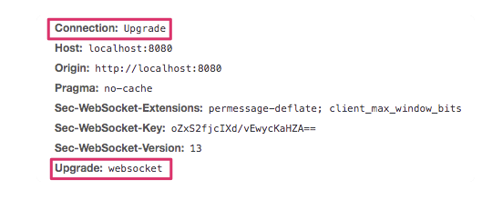

如果服务器支持 WebSocket，同样会在 HTTP 响应里加上 WebSocket 相关的 HTTP 头部。

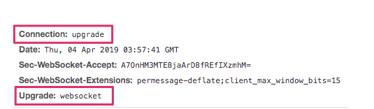

样 WebSocket 连接就建立好了，接下来 WebSocket 的数据传输会以 frame 形式传输，会将一条消息分为几个 frame，按照先后顺序传输出去。这样做的好处有：

- 大数据的传输可以分片传输，不用考虑数据大小的问题。
- 和 HTTP 的 chunk 一样，可以边生成数据边传输，提高传输效率。

### 2、Tomcat 如何支持 WebSocket

在讲 Tomcat 如何支持 WebSocket 之前，我们先来开发一个简单的聊天室程序，需求是：用户可以通过浏览器加入聊天室、发送消息，聊天室的其他人都可以收到消息。

浏览器端 JavaScript 核心代码如下：

```java

var Chat = {};
Chat.socket = null;
Chat.connect = (function(host) {

    //判断当前浏览器是否支持WebSocket
    if ('WebSocket' in window) {
        //如果支持则创建WebSocket JS类
        Chat.socket = new WebSocket(host);
    } else if ('MozWebSocket' in window) {
        Chat.socket = new MozWebSocket(host);
    } else {
        Console.log('WebSocket is not supported by this browser.');
        return;
    }

    //回调函数，当和服务器的WebSocket连接建立起来后，浏览器会回调这个方法
    Chat.socket.onopen = function () {
        Console.log('Info: WebSocket connection opened.');
        document.getElementById('chat').onkeydown = function(event) {
            if (event.keyCode == 13) {
                Chat.sendMessage();
            }
        };
    };

    //回调函数，当和服务器的WebSocket连接关闭后，浏览器会回调这个方法
    Chat.socket.onclose = function () {
        document.getElementById('chat').onkeydown = null;
        Console.log('Info: WebSocket closed.');
    };

    //回调函数，当服务器有新消息发送到浏览器，浏览器会回调这个方法
    Chat.socket.onmessage = function (message) {
        Console.log(message.data);
    };
});
```

上面的代码实现逻辑比较清晰，就是创建一个 WebSocket JavaScript 对象，然后实现了几个回调方法：onopen、onclose 和 onmessage。当连接建立、关闭和有新消息时，浏览器会负责调用这些回调方法。我们再来看服务器端 Tomcat 的实现代码：


```java

//Tomcat端的实现类加上@ServerEndpoint注解，里面的value是URL路径
@ServerEndpoint(value = "/websocket/chat")
public class ChatEndpoint {

    private static final String GUEST_PREFIX = "Guest";
    
    //记录当前有多少个用户加入到了聊天室，它是static全局变量。为了多线程安全使用原子变量AtomicInteger
    private static final AtomicInteger connectionIds = new AtomicInteger(0);
    
    //每个用户用一个CharAnnotation实例来维护，请你注意它是一个全局的static变量，所以用到了线程安全的CopyOnWriteArraySet
    private static final Set<ChatEndpoint> connections =
            new CopyOnWriteArraySet<>();

    private final String nickname;
    private Session session;

    public ChatEndpoint() {
        nickname = GUEST_PREFIX + connectionIds.getAndIncrement();
    }

    //新连接到达时，Tomcat会创建一个Session，并回调这个函数
    @OnOpen
    public void start(Session session) {
        this.session = session;
        connections.add(this);
        String message = String.format("* %s %s", nickname, "has joined.");
        broadcast(message);
    }

   //浏览器关闭连接时，Tomcat会回调这个函数
    @OnClose
    public void end() {
        connections.remove(this);
        String message = String.format("* %s %s",
                nickname, "has disconnected.");
        broadcast(message);
    }

    //浏览器发送消息到服务器时，Tomcat会回调这个函数
    @OnMessage
    public void incoming(String message) {
        // Never trust the client
        String filteredMessage = String.format("%s: %s",
                nickname, HTMLFilter.filter(message.toString()));
        broadcast(filteredMessage);
    }

    //WebSocket连接出错时，Tomcat会回调这个函数
    @OnError
    public void onError(Throwable t) throws Throwable {
        log.error("Chat Error: " + t.toString(), t);
    }

    //向聊天室中的每个用户广播消息
    private static void broadcast(String msg) {
        for (ChatAnnotation client : connections) {
            try {
                synchronized (client) {
                    client.session.getBasicRemote().sendText(msg);
                }
            } catch (IOException e) {
              ...
            }
        }
    }
}
```

根据 Java WebSocket 规范的规定，Java WebSocket 应用程序由一系列的 WebSocket Endpoint 组成。Endpoint 是一个 Java 对象，代表 WebSocket 连接的一端，就好像处理 HTTP 请求的 Servlet 一样，你可以把它看作是处理 WebSocket 消息的接口。跟 Servlet 不同的地方在于，Tomcat 会给每一个 WebSocket 连接创建一个 Endpoint 实例。你可以通过两种方式定义和实现 Endpoint。


- 第一种方法是编程式的，就是编写一个 Java 类继承javax.websocket.Endpoint，并实现它的 onOpen、onClose 和 onError 方法。这些方法跟 Endpoint 的生命周期有关，Tomcat 负责管理 Endpoint 的生命周期并调用这些方法。并且当浏览器连接到一个 Endpoint 时，Tomcat 会给这个连接创建一个唯一的 Session（javax.websocket.Session）。Session 在 WebSocket 连接握手成功之后创建，并在连接关闭时销毁。当触发 Endpoint 各个生命周期事件时，Tomcat 会将当前 Session 作为参数传给 Endpoint 的回调方法，因此一个 Endpoint 实例对应一个 Session，我们通过在 Session 中添加 MessageHandler 消息处理器来接收消息，MessageHandler 中定义了 onMessage 方法。在这里 Session 的本质是对 Socket 的封装，Endpoint 通过它与浏览器通信。

- 第二种定义 Endpoint 的方法是注解式的，也就是上面的聊天室程序例子中用到的方式，即实现一个业务类并给它添加 WebSocket 相关的注解。首先我们注意到@ServerEndpoint(value = "/websocket/chat")注解，它表明当前业务类 ChatEndpoint 是一个实现了 WebSocket 规范的 Endpoint，并且注解的 value 值表明 ChatEndpoint 映射的 URL 是/websocket/chat。我们还看到 ChatEndpoint 类中有@OnOpen、@OnClose、@OnError和在@OnMessage注解的方法，从名字你就知道它们的功能是什么。

对于程序员来说，其实我们只需要专注具体的 Endpoint 的实现，比如在上面聊天室的例子中，为了方便向所有人群发消息，ChatEndpoint 在内部使用了一个全局静态的集合 CopyOnWriteArraySet 来维护所有的 ChatEndpoint 实例，因为每一个 ChatEndpoint 实例对应一个 WebSocket 连接，也就是代表了一个加入聊天室的用户。当某个 ChatEndpoint 实例收到来自浏览器的消息时，这个 ChatEndpoint 会向集合中其他 ChatEndpoint 实例背后的 WebSocket 连接推送消息。那么这个过程中，Tomcat 主要做了哪些事情呢？简单来说就是两件事情：Endpoint 加载和 WebSocket 请求处理。下面我分别来详细说说 Tomcat 是如何做这两件事情的。


#### 1、WebSocket 加载

Tomcat 的 WebSocket 加载是通过 SCI 机制完成的。SCI 全称 ServletContainerInitializer，是 Servlet 3.0 规范中定义的用来接收 Web 应用启动事件的接口。那为什么要监听 Servlet 容器的启动事件呢？因为这样我们有机会在 Web 应用启动时做一些初始化工作，比如 WebSocket 需要扫描和加载 Endpoint 类。SCI 的使用也比较简单，将实现 ServletContainerInitializer 接口的类增加 HandlesTypes 注解，并且在注解内指定的一系列类和接口集合。比如 Tomcat 为了扫描和加载 Endpoint 而定义的 SCI 类如下：

```java

@HandlesTypes({ServerEndpoint.class, ServerApplicationConfig.class, Endpoint.class})
public class WsSci implements ServletContainerInitializer {
  
  public void onStartup(Set<Class<?>> clazzes, ServletContext ctx) throws ServletException {
  ...
  }
}
```
一旦定义好了 SCI，Tomcat 在启动阶段扫描类时，会将 HandlesTypes 注解中指定的类都扫描出来，作为 SCI 的 onStartup 方法的参数，并调用 SCI 的 onStartup 方法。注意到 WsSci 的 HandlesTypes 注解中定义了ServerEndpoint.class、ServerApplicationConfig.class和Endpoint.class，因此在 Tomcat 的启动阶段会将这些类的类实例（注意不是对象实例）传递给 WsSci 的 onStartup 方法。那么 WsSci 的 onStartup 方法又做了什么事呢？它会构造一个 WebSocketContainer 实例，你可以把 WebSocketContainer 理解成一个专门处理 WebSocket 请求的 Endpoint 容器。也就是说 Tomcat 会把扫描到的 Endpoint 子类和添加了注解@ServerEndpoint的类注册到这个容器中，并且这个容器还维护了 URL 到 Endpoint 的映射关系，这样通过请求 URL 就能找到具体的 Endpoint 来处理 WebSocket 请求。


#### 2、WebSocket 请求处理

在讲 WebSocket 请求处理之前，我们先来回顾一下 Tomcat 连接器的组件图。

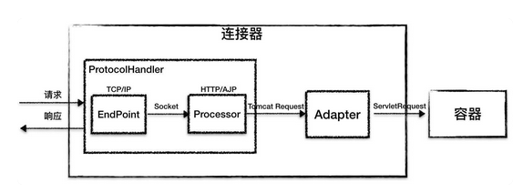

你可以看到 Tomcat 用 ProtocolHandler 组件屏蔽应用层协议的差异，其中 ProtocolHandler 中有两个关键组件：Endpoint 和 Processor。需要注意，这里的 Endpoint 跟上文提到的 WebSocket 中的 Endpoint 完全是两回事，连接器中的 Endpoint 组件用来处理 I/O 通信。WebSocket 本质就是一个应用层协议，因此不能用 HttpProcessor 来处理 WebSocket 请求，而要用专门 Processor 来处理，而在 Tomcat 中这样的 Processor 叫作 UpgradeProcessor。

为什么叫 UpgradeProcessor 呢？这是因为 Tomcat 是将 HTTP 协议升级成 WebSocket 协议的，我们知道 WebSocket 是通过 HTTP 协议来进行握手的，因此当 WebSocket 的握手请求到来时，HttpProtocolHandler 首先接收到这个请求，在处理这个 HTTP 请求时，Tomcat 通过一个特殊的 Filter 判断该当前 HTTP 请求是否是一个 WebSocket Upgrade 请求（即包含Upgrade: websocket的 HTTP 头信息），如果是，则在 HTTP 响应里添加 WebSocket 相关的响应头信息，并进行协议升级。具体来说就是用 UpgradeProtocolHandler 替换当前的 HttpProtocolHandler，相应的，把当前 Socket 的 Processor 替换成 UpgradeProcessor，同时 Tomcat 会创建 WebSocket Session 实例和 Endpoint 实例，并跟当前的 WebSocket 连接一一对应起来。这个 WebSocket 连接不会立即关闭，并且在请求处理中，不再使用原有的 HttpProcessor，而是用专门的 UpgradeProcessor，UpgradeProcessor 最终会调用相应的 Endpoint 实例来处理请求。下面我们通过一张图来理解一下。

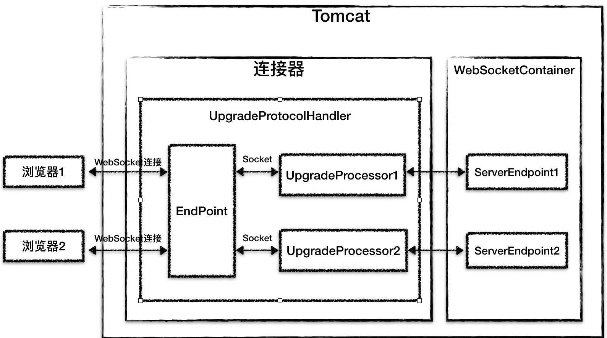


你可以看到，Tomcat 对 WebSocket 请求的处理没有经过 Servlet 容器，而是通过 UpgradeProcessor 组件直接把请求发到 ServerEndpoint 实例，并且 Tomcat 的 WebSocket 实现不需要关注具体 I/O 模型的细节，从而实现了与具体 I/O 方式的解耦。

> 总结

WebSocket 技术实现了 Tomcat 与浏览器的双向通信，Tomcat 可以主动向浏览器推送数据，可以用来实现对数据实时性要求比较高的应用。这需要浏览器和 Web 服务器同时支持 WebSocket 标准，Tomcat 启动时通过 SCI 技术来扫描和加载 WebSocket 的处理类 ServerEndpoint，并且建立起了 URL 到 ServerEndpoint 的映射关系。当第一个 WebSocket 请求到达时，Tomcat 将 HTTP 协议升级成 WebSocket 协议，并将该 Socket 连接的 Processor 替换成 UpgradeProcessor。这个 Socket 不会立即关闭，对接下来的请求，Tomcat 通过 UpgradeProcessor 直接调用相应的 ServerEndpoint 来处理。今天我讲了可以通过两种方式来开发 WebSocket 应用，一种是继承javax.websocket.Endpoint，另一种通过 WebSocket 相关的注解。其实你还可以通过 Spring 来实现 WebSocket 应用，有兴趣的话你可以去研究一下 Spring WebSocket 的原理。

> 思考

今天我举的聊天室的例子实现的是群发消息，如果要向某个特定用户发送消息，应该怎么做呢？


## 6、比较：Jetty的线程策略EatWhatYouKill

Jetty 总体上是由一系列 Connector、一系列 Handler 和一个 ThreadPool 组成，它们的关系如下图所示：

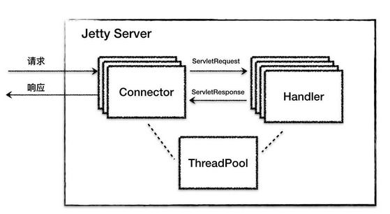

相比较 Tomcat 的连接器，Jetty 的 Connector 在设计上有自己的特点。Jetty 的 Connector 支持 NIO 通信模型，我们知道 NIO 模型中的主角就是 Selector，Jetty 在 Java 原生 Selector 的基础上封装了自己的 Selector，叫作 ManagedSelector。ManagedSelector 在线程策略方面做了大胆尝试，将 I/O 事件的侦测和处理放到同一个线程来处理，充分利用了 CPU 缓存并减少了线程上下文切换的开销。具体的数字是，根据 Jetty 的官方测试，这种名为“EatWhatYouKill”的线程策略将吞吐量提高了 8 倍。你一定很好奇它是如何实现的吧，今天我们就来看一看这背后的原理是什么。


### 1、Selector 编程的一般思路


常规的 NIO 编程思路是，将 I/O 事件的侦测和请求的处理分别用不同的线程处理。具体过程是：启动一个线程，在一个死循环里不断地调用 select 方法，检测 Channel 的 I/O 状态，一旦 I/O 事件达到，比如数据就绪，就把该 I/O 事件以及一些数据包装成一个 Runnable，将 Runnable 放到新线程中去处理。

在这个过程中按照职责划分，有两个线程在干活，一个是 I/O 事件检测线程，另一个是 I/O 事件处理线程。我们仔细思考一下这两者的关系，其实它们是生产者和消费者的关系。I/O 事件侦测线程作为生产者，负责“生产”I/O 事件，也就是负责接活儿的老板；I/O 处理线程是消费者，它“消费”并处理 I/O 事件，就是干苦力的员工。把这两个工作用不同的线程来处理，好处是它们互不干扰和阻塞对方。

### 2、Jetty 中的 Selector 编程

然而世事无绝对，将 I/O 事件检测和业务处理这两种工作分开的思路也有缺点。当 Selector 检测读就绪事件时，数据已经被拷贝到内核中的缓存了，同时 CPU 的缓存中也有这些数据了，我们知道 CPU 本身的缓存比内存快多了，这时当应用程序去读取这些数据时，如果用另一个线程去读，很有可能这个读线程使用另一个 CPU 核，而不是之前那个检测数据就绪的 CPU 核，这样 CPU 缓存中的数据就用不上了，并且线程切换也需要开销。

因此 Jetty 的 Connector 做了一个大胆尝试，那就是用把 I/O 事件的生产和消费放到同一个线程来处理，如果这两个任务由同一个线程来执行，如果执行过程中线程不阻塞，操作系统会用同一个 CPU 核来执行这两个任务，这样就能利用 CPU 缓存了。那具体是如何做的呢，我们还是来详细分析一下 Connector 中的 ManagedSelector 组件。


#### 1、ManagedSelector

ManagedSelector 的本质就是一个 Selector，负责 I/O 事件的检测和分发。为了方便使用，Jetty 在 Java 原生的 Selector 上做了一些扩展，就变成了 ManagedSelector，我们先来看看它有哪些成员变量：

```java

public class ManagedSelector extends ContainerLifeCycle implements Dumpable
{
    //原子变量，表明当前的ManagedSelector是否已经启动
    private final AtomicBoolean _started = new AtomicBoolean(false);
    
    //表明是否阻塞在select调用上
    private boolean _selecting = false;
    
    //管理器的引用，SelectorManager管理若干ManagedSelector的生命周期
    private final SelectorManager _selectorManager;
    
    //ManagedSelector不止一个，为它们每人分配一个id
    private final int _id;
    
    //关键的执行策略，生产者和消费者是否在同一个线程处理由它决定
    private final ExecutionStrategy _strategy;
    
    //Java原生的Selector
    private Selector _selector;
    
    //"Selector更新任务"队列
    private Deque<SelectorUpdate> _updates = new ArrayDeque<>();
    private Deque<SelectorUpdate> _updateable = new ArrayDeque<>();
    
    ...
}
```

这些成员变量中其他的都好理解，就是“Selector 更新任务”队列_updates和执行策略_strategy可能不是很直观。


#### 2、SelectorUpdate 接口


为什么需要一个“Selector 更新任务”队列呢，对于 Selector 的用户来说，我们对 Selector 的操作无非是将 Channel 注册到 Selector 或者告诉 Selector 我对什么 I/O 事件感兴趣，那么这些操作其实就是对 Selector 状态的更新，Jetty 把这些操作抽象成 SelectorUpdate 接口。

```java

/**
 * A selector update to be done when the selector has been woken.
 */
public interface SelectorUpdate
{
    void update(Selector selector);
}
```
这意味着如果你不能直接操作 ManageSelector 中的 Selector，而是需要向 ManagedSelector 提交一个任务类，这个类需要实现 SelectorUpdate 接口 update 方法，在 update 方法里定义你想要对 ManagedSelector 做的操作。比如 Connector 中 Endpoint 组件对读就绪事件感兴趣，它就向 ManagedSelector 提交了一个内部任务类 ManagedSelector.SelectorUpdate：


_selector.submit(_updateKeyAction);

这个_updateKeyAction就是一个 SelectorUpdate 实例，它的 update 方法实现如下：

```java

private final ManagedSelector.SelectorUpdate _updateKeyAction = new ManagedSelector.SelectorUpdate()
{
    @Override
    public void update(Selector selector)
    {
        //这里的updateKey其实就是调用了SelectionKey.interestOps(OP_READ);
        updateKey();
    }
};
```

我们看到在 update 方法里，调用了 SelectionKey 类的 interestOps 方法，传入的参数是OP_READ，意思是现在我对这个 Channel 上的读就绪事件感兴趣了。那谁来负责执行这些 update 方法呢，答案是 ManagedSelector 自己，它在一个死循环里拉取这些 SelectorUpdate 任务类逐个执行。


#### 3、Selectable 接口

那 I/O 事件到达时，ManagedSelector 怎么知道应该调哪个函数来处理呢？其实也是通过一个任务类接口，这个接口就是 Selectable，它返回一个 Runnable，这个 Runnable 其实就是 I/O 事件就绪时相应的处理逻辑。

```java

public interface Selectable
{
    //当某一个Channel的I/O事件就绪后，ManagedSelector会调用的回调函数
    Runnable onSelected();

    //当所有事件处理完了之后ManagedSelector会调的回调函数，我们先忽略。
    void updateKey();
}
```

ManagedSelector 在检测到某个 Channel 上的 I/O 事件就绪时，也就是说这个 Channel 被选中了，ManagedSelector 调用这个 Channel 所绑定的附件类的 onSelected 方法来拿到一个 Runnable。这句话有点绕，其实就是 ManagedSelector 的使用者，比如 Endpoint 组件在向 ManagedSelector 注册读就绪事件时，同时也要告诉 ManagedSelector 在事件就绪时执行什么任务，具体来说就是传入一个附件类，这个附件类需要实现 Selectable 接口。ManagedSelector 通过调用这个 onSelected 拿到一个 Runnable，然后把 Runnable 扔给线程池去执行。那 Endpoint 的 onSelected 是如何实现的呢？

```java

@Override
public Runnable onSelected()
{
    int readyOps = _key.readyOps();

    boolean fillable = (readyOps & SelectionKey.OP_READ) != 0;
    boolean flushable = (readyOps & SelectionKey.OP_WRITE) != 0;

    // return task to complete the job
    Runnable task= fillable 
            ? (flushable 
                    ? _runCompleteWriteFillable 
                    : _runFillable)
            : (flushable 
                    ? _runCompleteWrite 
                    : null);

    return task;
}
```

上面的代码逻辑很简单，就是读事件到了就读，写事件到了就写。

#### 4、ExecutionStrategy


前面我主要介绍了 ManagedSelector 的使用者如何跟 ManagedSelector 交互，也就是如何注册 Channel 以及 I/O 事件，提供什么样的处理类来处理 I/O 事件，接下来我们来看看 ManagedSelector 是如何统一管理和维护用户注册的 Channel 集合。再回到今天开始的讨论，ManagedSelector 将 I/O 事件的生产和消费看作是生产者消费者模式，为了充分利用 CPU 缓存，生产和消费尽量放到同一个线程处理，那这是如何实现的呢？Jetty 定义了 ExecutionStrategy 接口：

```java


public interface ExecutionStrategy
{
    //只在HTTP2中用到，简单起见，我们先忽略这个方法。
    public void dispatch();

    //实现具体执行策略，任务生产出来后可能由当前线程执行，也可能由新线程来执行
    public void produce();
    
    //任务的生产委托给Producer内部接口，
    public interface Producer
    {
        //生产一个Runnable(任务)
        Runnable produce();
    }
}
```

我们看到 ExecutionStrategy 接口比较简单，它将具体任务的生产委托内部接口 Producer，而在自己的 produce 方法里来实现具体执行逻辑，也就是生产出来的任务要么由当前线程执行，要么放到新线程中执行。Jetty 提供了一些具体策略实现类：ProduceConsume、ProduceExecuteConsume、ExecuteProduceConsume 和 EatWhatYouKill。它们的区别是：

- ProduceConsume：任务生产者自己依次生产和执行任务，对应到 NIO 通信模型就是用一个线程来侦测和处理一个 ManagedSelector 上所有的 I/O 事件，后面的 I/O 事件要等待前面的 I/O 事件处理完，效率明显不高。通过图来理解，图中绿色表示生产一个任务，蓝色表示执行这个任务。


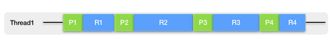

- ProduceExecuteConsume：任务生产者开启新线程来运行任务，这是典型的 I/O 事件侦测和处理用不同的线程来处理，缺点是不能利用 CPU 缓存，并且线程切换成本高。同样我们通过一张图来理解，图中的棕色表示线程切换。

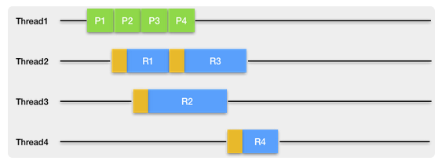

- ExecuteProduceConsume：任务生产者自己运行任务，但是该策略可能会新建一个新线程以继续生产和执行任务。这种策略也被称为“吃掉你杀的猎物”，它来自狩猎伦理，认为一个人不应该杀死他不吃掉的东西，对应线程来说，不应该生成自己不打算运行的任务。它的优点是能利用 CPU 缓存，但是潜在的问题是如果处理 I/O 事件的业务代码执行时间过长，会导致线程大量阻塞和线程饥饿。

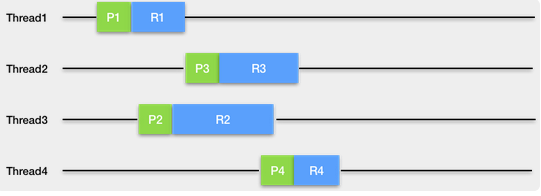


- EatWhatYouKill：这是 Jetty 对 ExecuteProduceConsume 策略的改良，在线程池线程充足的情况下等同于 ExecuteProduceConsume；当系统比较忙线程不够时，切换成 ProduceExecuteConsume 策略。为什么要这么做呢，原因是 ExecuteProduceConsume 是在同一线程执行 I/O 事件的生产和消费，它使用的线程来自 Jetty 全局的线程池，这些线程有可能被业务代码阻塞，如果阻塞得多了，全局线程池中的线程自然就不够用了，最坏的情况是连 I/O 事件的侦测都没有线程可用了，会导致 Connector 拒绝浏览器请求。于是 Jetty 做了一个优化，在低线程情况下，就执行 ProduceExecuteConsume 策略，I/O 侦测用专门的线程处理，I/O 事件的处理扔给线程池处理，其实就是放到线程池的队列里慢慢处理。


分析了这几种线程策略，我们再来看看 Jetty 是如何实现 ExecutionStrategy 接口的。答案其实就是实现 Produce 接口生产任务，一旦任务生产出来，ExecutionStrategy 会负责执行这个任务。


```java

private class SelectorProducer implements ExecutionStrategy.Producer
{
    private Set<SelectionKey> _keys = Collections.emptySet();
    private Iterator<SelectionKey> _cursor = Collections.emptyIterator();

    @Override
    public Runnable produce()
    {
        while (true)
        {
            //如何Channel集合中有I/O事件就绪，调用前面提到的Selectable接口获取Runnable,直接返回给ExecutionStrategy去处理
            Runnable task = processSelected();
            if (task != null)
                return task;
            
           //如果没有I/O事件就绪，就干点杂活，看看有没有客户提交了更新Selector的任务，就是上面提到的SelectorUpdate任务类。
            processUpdates();
            updateKeys();

           //继续执行select方法，侦测I/O就绪事件
            if (!select())
                return null;
        }
    }
 }
```
selectorProducer 是 ManagedSelector 的内部类，SelectorProducer 实现了 ExecutionStrategy 中的 Producer 接口中的 produce 方法，需要向 ExecutionStrategy 返回一个 Runnable。在这个方法里 SelectorProducer 主要干了三件事情

- 如果 Channel 集合中有 I/O 事件就绪，调用前面提到的 Selectable 接口获取 Runnable，直接返回给 ExecutionStrategy 去处理。

- 如果没有 I/O 事件就绪，就干点杂活，看看有没有客户提交了更新 Selector 上事件注册的任务，也就是上面提到的 SelectorUpdate 任务类。

- 干完杂活继续执行 select 方法，侦测 I/O 就绪事件。

> 总结

多线程虽然是提高并发的法宝，但并不是说线程越多越好，CPU 缓存以及线程上下文切换的开销也是需要考虑的。Jetty 巧妙设计了 EatWhatYouKill 的线程策略，尽量用同一个线程侦测 I/O 事件和处理 I/O 事件，充分利用了 CPU 缓存，并减少了线程切换的开销。


> 思考

文章提到 ManagedSelector 的使用者不能直接向它注册 I/O 事件，而是需要向 ManagedSelector 提交一个 SelectorUpdate 事件，ManagedSelector 将这些事件 Queue 起来由自己来统一处理，这样做有什么好处呢？


## 7、总结：Tomcat和Jetty中的对象池技术

Java 对象，特别是一个比较大、比较复杂的 Java 对象，它们的创建、初始化和 GC 都需要耗费 CPU 和内存资源，为了减少这些开销，Tomcat 和 Jetty 都使用了对象池技术。所谓的对象池技术，就是说一个 Java 对象用完之后把它保存起来，之后再拿出来重复使用，省去了对象创建、初始化和 GC 的过程。对象池技术是典型的以空间换时间的思路。

由于维护对象池本身也需要资源的开销，不是所有场景都适合用对象池。如果你的 Java 对象数量很多并且存在的时间比较短，对象本身又比较大比较复杂，对象初始化的成本比较高，这样的场景就适合用对象池技术。比如 Tomcat 和 Jetty 处理 HTTP 请求的场景就符合这个特征，请求的数量很多，为了处理单个请求需要创建不少的复杂对象（比如 Tomcat 连接器中 SocketWrapper 和 SocketProcessor），而且一般来说请求处理的时间比较短，一旦请求处理完毕，这些对象就需要被销毁，因此这个场景适合对象池技术。


### 1、Tomcat 的 SynchronizedStack

Tomcat 用 SynchronizedStack 类来实现对象池，下面我贴出它的关键代码来帮助你理解。

```java

public class SynchronizedStack<T> {

    //内部维护一个对象数组,用数组实现栈的功能
    private Object[] stack;

    //这个方法用来归还对象，用synchronized进行线程同步
    public synchronized boolean push(T obj) {
        index++;
        if (index == size) {
            if (limit == -1 || size < limit) {
                expand();//对象不够用了，扩展对象数组
            } else {
                index--;
                return false;
            }
        }
        stack[index] = obj;
        return true;
    }
    
    //这个方法用来获取对象
    public synchronized T pop() {
        if (index == -1) {
            return null;
        }
        T result = (T) stack[index];
        stack[index--] = null;
        return result;
    }
    
    //扩展对象数组长度，以2倍大小扩展
    private void expand() {
      int newSize = size * 2;
      if (limit != -1 && newSize > limit) {
          newSize = limit;
      }
      //扩展策略是创建一个数组长度为原来两倍的新数组
      Object[] newStack = new Object[newSize];
      //将老数组对象引用复制到新数组
      System.arraycopy(stack, 0, newStack, 0, size);
      //将stack指向新数组，老数组可以被GC掉了
      stack = newStack;
      size = newSize;
   }
}
```

这个代码逻辑比较清晰，主要是 SynchronizedStack 内部维护了一个对象数组，并且用数组来实现栈的接口：push 和 pop 方法，这两个方法分别用来归还对象和获取对象。你可能好奇为什么 Tomcat 使用一个看起来比较简单的 SynchronizedStack 来做对象容器，为什么不使用高级一点的并发容器比如 ConcurrentLinkedQueue 呢？这是因为 SynchronizedStack 用数组而不是链表来维护对象，可以减少结点维护的内存开销，并且它本身只支持扩容不支持缩容，也就是说数组对象在使用过程中不会被重新赋值，也就不会被 GC。这样设计的目的是用最低的内存和 GC 的代价来实现无界容器，同时 Tomcat 的最大同时请求数是有限制的，因此不需要担心对象的数量会无限膨胀。

### 2、Jetty 的 ByteBufferPool

我们再来看 Jetty 中的对象池 ByteBufferPool，它本质是一个 ByteBuffer 对象池。当 Jetty 在进行网络数据读写时，不需要每次都在 JVM 堆上分配一块新的 Buffer，只需在 ByteBuffer 对象池里拿到一块预先分配好的 Buffer，这样就避免了频繁的分配内存和释放内存。这种设计你同样可以在高性能通信中间件比如 Mina 和 Netty 中看到。ByteBufferPool 是一个接口：

```java

public interface ByteBufferPool
{
    public ByteBuffer acquire(int size, boolean direct);

    public void release(ByteBuffer buffer);
}
```

接口中的两个方法：acquire 和 release 分别用来分配和释放内存，并且你可以通过 acquire 方法的 direct 参数来指定 buffer 是从 JVM 堆上分配还是从本地内存分配。ArrayByteBufferPool 是 ByteBufferPool 的实现类，我们先来看看它的成员变量和构造函数：

```java


public class ArrayByteBufferPool implements ByteBufferPool
{
    private final int _min;//最小size的Buffer长度
    private final int _maxQueue;//Queue最大长度
    
    //用不同的Bucket(桶)来持有不同size的ByteBuffer对象,同一个桶中的ByteBuffer size是一样的
    private final ByteBufferPool.Bucket[] _direct;
    private final ByteBufferPool.Bucket[] _indirect;
    
    //ByteBuffer的size增量
    private final int _inc;
    
    public ArrayByteBufferPool(int minSize, int increment, int maxSize, int maxQueue)
    {
        //检查参数值并设置默认值
        if (minSize<=0)//ByteBuffer的最小长度
            minSize=0;
        if (increment<=0)
            increment=1024;//默认以1024递增
        if (maxSize<=0)
            maxSize=64*1024;//ByteBuffer的最大长度默认是64K
        
        //ByteBuffer的最小长度必须小于增量
        if (minSize>=increment) 
            throw new IllegalArgumentException("minSize >= increment");
            
        //最大长度必须是增量的整数倍
        if ((maxSize%increment)!=0 || increment>=maxSize)
            throw new IllegalArgumentException("increment must be a divisor of maxSize");
         
        _min=minSize;
        _inc=increment;
        
        //创建maxSize/increment个桶,包含直接内存的与heap的
        _direct=new ByteBufferPool.Bucket[maxSize/increment];
        _indirect=new ByteBufferPool.Bucket[maxSize/increment];
        _maxQueue=maxQueue;
        int size=0;
        for (int i=0;i<_direct.length;i++)
        {
          size+=_inc;
          _direct[i]=new ByteBufferPool.Bucket(this,size,_maxQueue);
          _indirect[i]=new ByteBufferPool.Bucket(this,size,_maxQueue);
        }
    }
}
```

从上面的代码我们看到，ByteBufferPool 是用不同的桶（Bucket）来管理不同长度的 ByteBuffer，因为我们可能需要分配一块 1024 字节的 Buffer，也可能需要一块 64K 字节的 Buffer。而桶的内部用一个 ConcurrentLinkedDeque 来放置 ByteBuffer 对象的引用。private final Deque _queue = new ConcurrentLinkedDeque<>();


你可以通过下面的图再来理解一下：

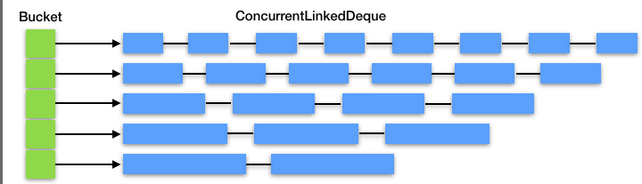

而 Buffer 的分配和释放过程，就是找到相应的桶，并对桶中的 Deque 做出队和入队的操作，而不是直接向 JVM 堆申请和释放内存。

```java

//分配Buffer
public ByteBuffer acquire(int size, boolean direct)
{
    //找到对应的桶，没有的话创建一个桶
    ByteBufferPool.Bucket bucket = bucketFor(size,direct);
    if (bucket==null)
        return newByteBuffer(size,direct);
    //这里其实调用了Deque的poll方法
    return bucket.acquire(direct);
        
}

//释放Buffer
public void release(ByteBuffer buffer)
{
    if (buffer!=null)
    {
      //找到对应的桶
      ByteBufferPool.Bucket bucket = bucketFor(buffer.capacity(),buffer.isDirect());
      
      //这里调用了Deque的offerFirst方法
  if (bucket!=null)
      bucket.release(buffer);
    }
}
```

### 3、对象池的思考

对象池作为全局资源，高并发环境中多个线程可能同时需要获取对象池中的对象，因此多个线程在争抢对象时会因为锁竞争而阻塞， 因此使用对象池有线程同步的开销，而不使用对象池则有创建和销毁对象的开销。对于对象池本身的设计来说，需要尽量做到无锁化，比如 Jetty 就使用了 ConcurrentLinkedDeque。如果你的内存足够大，可以考虑用线程本地（ThreadLocal）对象池，这样每个线程都有自己的对象池，线程之间互不干扰。

为了防止对象池的无限膨胀，必须要对池的大小做限制。对象池太小发挥不了作用，对象池太大的话可能有空闲对象，这些空闲对象会一直占用内存，造成内存浪费。这里你需要根据实际情况做一个平衡，因此对象池本身除了应该有自动扩容的功能，还需要考虑自动缩容。

所有的池化技术，包括缓存，都会面临内存泄露的问题，原因是对象池或者缓存的本质是一个 Java 集合类，比如 List 和 Stack，这个集合类持有缓存对象的引用，只要集合类不被 GC，缓存对象也不会被 GC。维持大量的对象也比较占用内存空间，所以必要时我们需要主动清理这些对象。以 Java 的线程池 ThreadPoolExecutor 为例，它提供了 allowCoreThreadTimeOut 和 setKeepAliveTime 两种方法，可以在超时后销毁线程，我们在实际项目中也可以参考这个策略。


另外在使用对象池时，我这里还有一些小贴士供你参考：
- 对象在用完后，需要调用对象池的方法将对象归还给对象池。
- 对象池中的对象在再次使用时需要重置，否则会产生脏对象，脏对象可能持有上次使用的引用，导致内存泄漏等问题，并且如果脏对象下一次使用时没有被清理，程序在运行过程中会发生意想不到的问题。
- 对象一旦归还给对象池，使用者就不能对它做任何操作了。
- 向对象池请求对象时有可能出现的阻塞、异常或者返回 null 值，这些都需要我们做一些额外的处理，来确保程序的正常运行。

> 总结

Tomcat 和 Jetty 都用到了对象池技术，这是因为处理一次 HTTP 请求的时间比较短，但是这个过程中又需要创建大量复杂对象。对象池技术可以减少频繁创建和销毁对象带来的成本，实现对象的缓存和复用。如果你的系统需要频繁的创建和销毁对象，并且对象的创建代价比较大，这种情况下，一般来说你会观察到 GC 的压力比较大，占用 CPU 率比较高，这个时候你就可以考虑使用对象池了。还有一种情况是你需要对资源的使用做限制，比如数据库连接，不能无限制地创建数据库连接，因此就有了数据库连接池，你也可以考虑把一些关键的资源池化，对它们进行统一管理，防止滥用。


## 8、总结：Tomcat和Jetty的高性能、高并发之道

高性能程序就是高效的利用 CPU、内存、网络和磁盘等资源，在短时间内处理大量的请求。那如何衡量“短时间和大量”呢？其实就是两个关键指标：响应时间和每秒事务处理量（TPS）。

那什么是资源的高效利用呢？ 我觉得有两个原则：

- 1、减少资源浪费。比如尽量避免线程阻塞，因为一阻塞就会发生线程上下文切换，就需要耗费 CPU 资源；再比如网络通信时数据从内核空间拷贝到 Java 堆内存，需要通过本地内存中转。

- 2、当某种资源成为瓶颈时，用另一种资源来换取。比如缓存和对象池技术就是用内存换 CPU；数据压缩后再传输就是用 CPU 换网络。

Tomcat 和 Jetty 中用到了大量的高性能、高并发的设计，我总结了几点：I/O 和线程模型、减少系统调用、池化、零拷贝、高效的并发编程。下面我会详细介绍这些设计，希望你也可以将这些技术用到实际的工作中去。

### 1、I/O 和线程模型

I/O 模型的本质就是为了缓解 CPU 和外设之间的速度差。当线程发起 I/O 请求时，比如读写网络数据，网卡数据还没准备好，这个线程就会被阻塞，让出 CPU，也就是说发生了线程切换。而线程切换是无用功，并且线程被阻塞后，它持有内存资源并没有释放，阻塞的线程越多，消耗的内存就越大，因此 I/O 模型的目标就是尽量减少线程阻塞。Tomcat 和 Jetty 都已经抛弃了传统的同步阻塞 I/O，采用了非阻塞 I/O 或者异步 I/O，目的是业务线程不需要阻塞在 I/O 等待上。除了 I/O 模型，线程模型也是影响性能和并发的关键点。Tomcat 和 Jetty 的总体处理原则是：

- 连接请求由专门的 Acceptor 线程组处理。
- I/O 事件侦测也由专门的 Selector 线程组来处理。
- 具体的协议解析和业务处理可能交给线程池（Tomcat），或者交给 Selector 线程来处理（Jetty）。

将这些事情分开的好处是解耦，并且可以根据实际情况合理设置各部分的线程数。这里请你注意，线程数并不是越多越好，因为 CPU 核的个数有限，线程太多也处理不过来，会导致大量的线程上下文切换。


### 2、减少系统调用

其实系统调用是非常耗资源的一个过程，涉及 CPU 从用户态切换到内核态的过程，因此我们在编写程序的时候要有意识尽量避免系统调用。比如在 Tomcat 和 Jetty 中，系统调用最多的就是网络通信操作了，一个 Channel 上的 write 就是系统调用，为了降低系统调用的次数，最直接的方法就是使用缓冲，当输出数据达到一定的大小才 flush 缓冲区。Tomcat 和 Jetty 的 Channel 都带有输入输出缓冲区。

还有值得一提的是，Tomcat 和 Jetty 在解析 HTTP 协议数据时， 都采取了延迟解析的策略，HTTP 的请求体（HTTP Body）直到用的时候才解析。也就是说，当 Tomcat 调用 Servlet 的 service 方法时，只是读取了和解析了 HTTP 请求头，并没有读取 HTTP 请求体。直到你的 Web 应用程序调用了 ServletRequest 对象的 getInputStream 方法或者 getParameter 方法时，Tomcat 才会去读取和解析 HTTP 请求体中的数据；这意味着如果你的应用程序没有调用上面那两个方法，HTTP 请求体的数据就不会被读取和解析，这样就省掉了一次 I/O 系统调用。

### 3、池化、零拷贝

其实池化的本质就是用内存换 CPU；而零拷贝就是不做无用功，减少资源浪费。

### 4、高效的并发编程

我们知道并发的过程中为了同步多个线程对共享变量的访问，需要加锁来实现。而锁的开销是比较大的，拿锁的过程本身就是个系统调用，如果锁没拿到线程会阻塞，又会发生线程上下文切换，尤其是大量线程同时竞争一把锁时，会浪费大量的系统资源。因此作为程序员，要有意识的尽量避免锁的使用，比如可以使用原子类 CAS 或者并发集合来代替。如果万不得已需要用到锁，也要尽量缩小锁的范围和锁的强度。接下来我们来看看 Tomcat 和 Jetty 如何做到高效的并发编程的。

#### 1、缩小锁的范围

缩小锁的范围，其实就是不直接在方法上加 synchronized，而是使用细粒度的对象锁。

```java

protected void startInternal() throws LifecycleException {

    setState(LifecycleState.STARTING);

    // 锁engine成员变量
    if (engine != null) {
        synchronized (engine) {
            engine.start();
        }
    }

   //锁executors成员变量
    synchronized (executors) {
        for (Executor executor: executors) {
            executor.start();
        }
    }

    mapperListener.start();

    //锁connectors成员变量
    synchronized (connectorsLock) {
        for (Connector connector: connectors) {
            // If it has already failed, don't try and start it
            if (connector.getState() != LifecycleState.FAILED) {
                connector.start();
            }
        }
    }
}
```
比如上面的代码是 Tomcat 的 StandardService 组件的启动方法，这个启动方法要启动三种子组件：Engine、Executors 和 Connectors。它没有直接在方法上加锁，而是用了三把细粒度的锁，来分别用来锁三个成员变量。如果直接在方法上加 synchronized，多个线程执行到这个方法时需要排队；而在对象级别上加 synchronized，多个线程可以并行执行这个方法，只是在访问某个成员变量时才需要排队。


#### 2、用原子变量和 CAS 取代锁

下面的代码是 Jetty 线程池的启动方法，它的主要功能就是根据传入的参数启动相应个数的线程。

```java

private boolean startThreads(int threadsToStart)
{
    while (threadsToStart > 0 && isRunning())
    {
        //获取当前已经启动的线程数，如果已经够了就不需要启动了
        int threads = _threadsStarted.get();
        if (threads >= _maxThreads)
            return false;

        //用CAS方法将线程数加一，请注意执行失败走continue，继续尝试
        if (!_threadsStarted.compareAndSet(threads, threads + 1))
            continue;

        boolean started = false;
        try
        {
            Thread thread = newThread(_runnable);
            thread.setDaemon(isDaemon());
            thread.setPriority(getThreadsPriority());
            thread.setName(_name + "-" + thread.getId());
            _threads.add(thread);//_threads并发集合
            _lastShrink.set(System.nanoTime());//_lastShrink是原子变量
            thread.start();
            started = true;
            --threadsToStart;
        }
        finally
        {
            //如果最终线程启动失败，还需要把线程数减一
            if (!started)
                _threadsStarted.decrementAndGet();
        }
    }
    return true;
}
```

你可以看到整个函数的实现是一个 while 循环，并且是无锁的。_threadsStarted表示当前线程池已经启动了多少个线程，它是一个原子变量 AtomicInteger，首先通过它的 get 方法拿到值，如果线程数已经达到最大值，直接返回。否则尝试用 CAS 操作将_threadsStarted的值加一，如果成功了意味着没有其他线程在改这个值，当前线程可以继续往下执行；否则走 continue 分支，也就是继续重试，直到成功为止。在这里当然你也可以使用锁来实现，但是我们的目的是无锁化。

#### 3、并发容器的使用

CopyOnWriteArrayList 适用于读多写少的场景，比如 Tomcat 用它来“存放”事件监听器，这是因为监听器一般在初始化过程中确定后就基本不会改变，当事件触发时需要遍历这个监听器列表，所以这个场景符合读多写少的特征。

#### 4、volatile 关键字的使用

再拿 Tomcat 中的 LifecycleBase 作为例子，它里面的生命状态就是用 volatile 关键字修饰的。volatile 的目的是为了保证一个线程修改了变量，另一个线程能够读到这种变化。对于生命状态来说，需要在各个线程中保持是最新的值，因此采用了 volatile 修饰。

```java

public abstract class LifecycleBase implements Lifecycle {

    //当前组件的生命状态，用volatile修饰
    private volatile LifecycleState state = LifecycleState.NEW;

}
```

> 总结

高性能程序能够高效的利用系统资源，首先就是减少资源浪费，比如要减少线程的阻塞，因为阻塞会导致资源闲置和线程上下文切换，Tomcat 和 Jetty 通过合理的 I/O 模型和线程模型减少了线程的阻塞。另外系统调用会导致用户态和内核态切换的过程，Tomcat 和 Jetty 通过缓存和延迟解析尽量减少系统调用，另外还通过零拷贝技术避免多余的数据拷贝。高效的利用资源还包括另一层含义，那就是我们在系统设计的过程中，经常会用一种资源换取另一种资源，比如 Tomcat 和 Jetty 中使用的对象池技术，就是用内存换取 CPU，将数据压缩后再传输就是用 CPU 换网络。除此之外，高效的并发编程也很重要，多线程虽然可以提高并发度，也带来了锁的开销，因此我们在实际编程过程中要尽量避免使用锁，比如可以用原子变量和 CAS 操作来代替锁。如果实在避免不了用锁，也要尽量减少锁的范围和强度，比如可以用细粒度的对象锁或者低强度的读写锁。Tomcat 和 Jetty 的代码也很好的实践了这一理念。


## 9、内核如何阻塞与唤醒进程？

Tomcat 连接器组件的设计，其中最重要的是各种 I/O 模型及其实现。而 I/O 模型跟操作系统密切相关，要彻底理解这些原理，我们首先需要弄清楚什么是进程和线程，什么是虚拟内存和物理内存，什么是用户空间和内核空间，线程的阻塞到底意味着什么，内核又是如何唤醒用户线程的等等这些问题。可以说掌握这些底层的知识，对于你学习 Tomcat 和 Jetty 的原理，乃至其他各种后端架构都至关重要，这些知识可以说是后端开发的“基石”。

### 1、进程和线程

我们先从 Linux 的进程谈起，操作系统要运行一个可执行程序，首先要将程序文件加载到内存，然后 CPU 去读取和执行程序指令，而一个进程就是“一次程序的运行过程”，内核会给每一个进程创建一个名为task_struct的数据结构，而内核也是一段程序，系统启动时就被加载到内存中了。

进程在运行过程中要访问内存，而物理内存是有限的，比如 16GB，那怎么把有限的内存分给不同的进程使用呢？跟 CPU 的分时共享一样，内存也是共享的，Linux 给每个进程虚拟出一块很大的地址空间，比如 32 位机器上进程的虚拟内存地址空间是 4GB，从 0x00000000 到 0xFFFFFFFF。但这 4GB 并不是真实的物理内存，而是进程访问到了某个虚拟地址，如果这个地址还没有对应的物理内存页，就会产生缺页中断，分配物理内存，MMU（内存管理单元）会将虚拟地址与物理内存页的映射关系保存在页表中，再次访问这个虚拟地址，就能找到相应的物理内存页。每个进程的这 4GB 虚拟地址空间分布如下图所示：

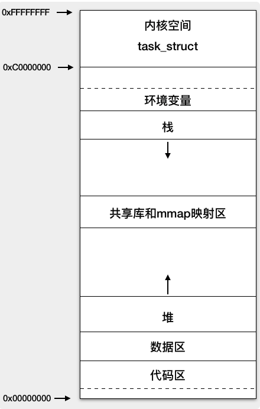

进程的虚拟地址空间总体分为用户空间和内核空间，低地址上的 3GB 属于用户空间，高地址的 1GB 是内核空间，这是基于安全上的考虑，用户程序只能访问用户空间，内核程序可以访问整个进程空间，并且只有内核可以直接访问各种硬件资源，比如磁盘和网卡。那用户程序需要访问这些硬件资源该怎么办呢？答案是通过系统调用，系统调用可以理解为内核实现的函数，比如应用程序要通过网卡接收数据，会调用 Socket 的 read 函数：ssize_t read(int fd,void *buf,size_t nbyte)

CPU 在执行系统调用的过程中会从用户态切换到内核态，CPU 在用户态下执行用户程序，使用的是用户空间的栈，访问用户空间的内存；当 CPU 切换到内核态后，执行内核代码，使用的是内核空间上的栈。从上面这张图我们看到，用户空间从低到高依次是代码区、数据区、堆、共享库与 mmap 内存映射区、栈、环境变量。其中堆向高地址增长，栈向低地址增长。

请注意用户空间上还有一个共享库和 mmap 映射区，Linux 提供了内存映射函数 mmap， 它可将文件内容映射到这个内存区域，用户通过读写这段内存，从而实现对文件的读取和修改，无需通过 read/write 系统调用来读写文件，省去了用户空间和内核空间之间的数据拷贝，Java 的 MappedByteBuffer 就是通过它来实现的；用户程序用到的系统共享库也是通过 mmap 映射到了这个区域。

我在开始提到的task_struct结构体本身是分配在内核空间，它的vm_struct成员变量保存了各内存区域的起始和终止地址，此外task_struct中还保存了进程的其他信息，比如进程号、打开的文件、创建的 Socket 以及 CPU 运行上下文等。

在 Linux 中，线程是一个轻量级的进程，轻量级说的是线程只是一个 CPU 调度单元，因此线程有自己的task_struct结构体和运行栈区，但是线程的其他资源都是跟父进程共用的，比如虚拟地址空间、打开的文件和 Socket 等。


### 2、阻塞与唤醒

我们知道当用户线程发起一个阻塞式的 read 调用，数据未就绪时，线程就会阻塞，那阻塞具体是如何实现的呢？Linux 内核将线程当作一个进程进行 CPU 调度，内核维护了一个可运行的进程队列，所有处于TASK_RUNNING状态的进程都会被放入运行队列中，本质是用双向链表将task_struct链接起来，排队使用 CPU 时间片，时间片用完重新调度 CPU。所谓调度就是在可运行进程列表中选择一个进程，再从 CPU 列表中选择一个可用的 CPU，将进程的上下文恢复到这个 CPU 的寄存器中，然后执行进程上下文指定的下一条指令。

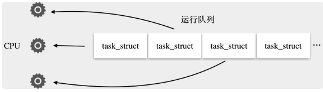

而阻塞的本质就是将进程的task_struct移出运行队列，添加到等待队列，并且将进程的状态的置为TASK_UNINTERRUPTIBLE或者TASK_INTERRUPTIBLE，重新触发一次 CPU 调度让出 CPU。

那线程怎么唤醒呢？线程在加入到等待队列的同时向内核注册了一个回调函数，告诉内核我在等待这个 Socket 上的数据，如果数据到了就唤醒我。这样当网卡接收到数据时，产生硬件中断，内核再通过调用回调函数唤醒进程。唤醒的过程就是将进程的task_struct从等待队列移到运行队列，并且将task_struct的状态置为TASK_RUNNING，这样进程就有机会重新获得 CPU 时间片。

这个过程中，内核还会将数据从内核空间拷贝到用户空间的堆上。

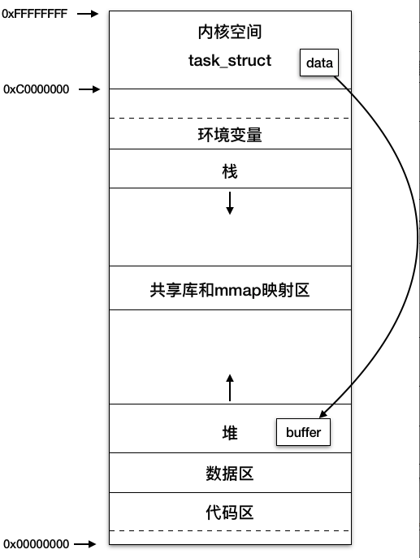

当 read 系统调用返回时，CPU 又从内核态切换到用户态，继续执行 read 调用的下一行代码，并且能从用户空间上的 Buffer 读到数据了。

> 总结

今天我们谈到了一次 Socket read 系统调用的过程：首先 CPU 在用户态执行应用程序的代码，访问进程虚拟地址空间的用户空间；read 系统调用时 CPU 从用户态切换到内核态，执行内核代码，内核检测到 Socket 上的数据未就绪时，将进程的task_struct结构体从运行队列中移到等待队列，并触发一次 CPU 调度，这时进程会让出 CPU；当网卡数据到达时，内核将数据从内核空间拷贝到用户空间的 Buffer，接着将进程的task_struct结构体重新移到运行队列，这样进程就有机会重新获得 CPU 时间片，系统调用返回，CPU 又从内核态切换到用户态，访问用户空间的数据。


# Tomcat容器

## 1、Host容器：Tomcat如何实现热部署和热加载？

今天我们首先来看热部署和热加载。要在运行的过程中升级 Web 应用，如果你不想重启系统，实现的方式有两种：热加载和热部署。那如何实现热部署和热加载呢？它们跟类加载机制有关，具体来说就是：

- 热加载的实现方式是 Web 容器启动一个后台线程，定期检测类文件的变化，如果有变化，就重新加载类，在这个过程中不会清空 Session ，一般用在开发环境。

- 热部署原理类似，也是由后台线程定时检测 Web 应用的变化，但它会重新加载整个 Web 应用。这种方式会清空 Session，比热加载更加干净、彻底，一般用在生产环境。

今天我们来学习一下 Tomcat 是如何用后台线程来实现热加载和热部署的。Tomcat 通过开启后台线程，使得各个层次的容器组件都有机会完成一些周期性任务。我们在实际工作中，往往也需要执行一些周期性的任务，比如监控程序周期性拉取系统的健康状态，就可以借鉴这种设计。


### 1、Tomcat 的后台线程

要说开启后台线程做周期性的任务，有经验的同学马上会想到线程池中的 ScheduledThreadPoolExecutor，它除了具有线程池的功能，还能够执行周期性的任务。Tomcat 就是通过它来开启后台线程的：

```java

bgFuture = exec.scheduleWithFixedDelay(
              new ContainerBackgroundProcessor(),//要执行的Runnable
              backgroundProcessorDelay, //第一次执行延迟多久
              backgroundProcessorDelay, //之后每次执行间隔多久
              TimeUnit.SECONDS);        //时间单位
```

上面的代码调用了 scheduleWithFixedDelay 方法，传入了四个参数，第一个参数就是要周期性执行的任务类 ContainerBackgroundProcessor，它是一个 Runnable，同时也是 ContainerBase 的内部类，ContainerBase 是所有容器组件的基类，我们来回忆一下容器组件有哪些，有 Engine、Host、Context 和 Wrapper 等，它们具有父子关系。

我们接来看 ContainerBackgroundProcessor 具体是如何实现的。

```java

protected class ContainerBackgroundProcessor implements Runnable {

    @Override
    public void run() {
        //请注意这里传入的参数是"宿主类"的实例
        processChildren(ContainerBase.this);
    }

    protected void processChildren(Container container) {
        try {
            //1. 调用当前容器的backgroundProcess方法。
            container.backgroundProcess();
            
            //2. 遍历所有的子容器，递归调用processChildren，
            //这样当前容器的子孙都会被处理            
            Container[] children = container.findChildren();
            for (int i = 0; i < children.length; i++) {
            //这里请你注意，容器基类有个变量叫做backgroundProcessorDelay，如果大于0，表明子容器有自己的后台线程，无需父容器来调用它的processChildren方法。
                if (children[i].getBackgroundProcessorDelay() <= 0) {
                    processChildren(children[i]);
                }
            }
        } catch (Throwable t) { ... }
```

上面的代码逻辑也是比较清晰的，首先 ContainerBackgroundProcessor 是一个 Runnable，它需要实现 run 方法，它的 run 很简单，就是调用了 processChildren 方法。这里有个小技巧，它把“宿主类”，也就是 ContainerBase 的类实例当成参数传给了 run 方法。

而在 processChildren 方法里，就做了两步：调用当前容器的 backgroundProcess 方法，以及递归调用子孙的 backgroundProcess 方法。请你注意 backgroundProcess 是 Container 接口中的方法，也就是说所有类型的容器都可以实现这个方法，在这个方法里完成需要周期性执行的任务。

这样的设计意味着什么呢？我们只需要在顶层容器，也就是 Engine 容器中启动一个后台线程，那么这个线程不但会执行 Engine 容器的周期性任务，它还会执行所有子容器的周期性任务。

上述代码都是在基类 ContainerBase 中实现的，那具体容器类需要做什么呢？其实很简单，如果有周期性任务要执行，就实现 backgroundProcess 方法；如果没有，就重用基类 ContainerBase 的方法。ContainerBase 的 backgroundProcess 方法实现如下：

```java

public void backgroundProcess() {

    //1.执行容器中Cluster组件的周期性任务
    Cluster cluster = getClusterInternal();
    if (cluster != null) {
        cluster.backgroundProcess();
    }
    
    //2.执行容器中Realm组件的周期性任务
    Realm realm = getRealmInternal();
    if (realm != null) {
        realm.backgroundProcess();
   }
   
   //3.执行容器中Valve组件的周期性任务
    Valve current = pipeline.getFirst();
    while (current != null) {
       current.backgroundProcess();
       current = current.getNext();
    }
    
    //4. 触发容器的"周期事件"，Host容器的监听器HostConfig就靠它来调用
    fireLifecycleEvent(Lifecycle.PERIODIC_EVENT, null);
}
```

从上面的代码可以看到，不仅每个容器可以有周期性任务，每个容器中的其他通用组件，比如跟集群管理有关的 Cluster 组件、跟安全管理有关的 Realm 组件都可以有自己的周期性任务。我在前面的专栏里提到过，容器之间的链式调用是通过 Pipeline-Valve 机制来实现的，从上面的代码你可以看到容器中的 Valve 也可以有周期性任务，并且被 ContainerBase 统一处理。请你特别注意的是，在 backgroundProcess 方法的最后，还触发了容器的“周期事件”。我们知道容器的生命周期事件有初始化、启动和停止等，那“周期事件”又是什么呢？它跟生命周期事件一样，是一种扩展机制，你可以这样理解：又一段时间过去了，容器还活着，你想做点什么吗？如果你想做点什么，就创建一个监听器来监听这个“周期事件”，事件到了我负责调用你的方法。总之，有了 ContainerBase 中的后台线程和 backgroundProcess 方法，各种子容器和通用组件不需要各自弄一个后台线程来处理周期性任务，这样的设计显得优雅和整洁。

### 2、Tomcat 热加载

有了 ContainerBase 的周期性任务处理“框架”，作为具体容器子类，只需要实现自己的周期性任务就行。而 Tomcat 的热加载，就是在 Context 容器中实现的。Context 容器的 backgroundProcess 方法是这样实现的：

```java

public void backgroundProcess() {

    //WebappLoader周期性的检查WEB-INF/classes和WEB-INF/lib目录下的类文件
    Loader loader = getLoader();
    if (loader != null) {
        loader.backgroundProcess();        
    }
    
    //Session管理器周期性的检查是否有过期的Session
    Manager manager = getManager();
    if (manager != null) {
        manager.backgroundProcess();
    }
    
    //周期性的检查静态资源是否有变化
    WebResourceRoot resources = getResources();
    if (resources != null) {
        resources.backgroundProcess();
    }
    
    //调用父类ContainerBase的backgroundProcess方法
    super.backgroundProcess();
}
```
从上面的代码我们看到 Context 容器通过 WebappLoader 来检查类文件是否有更新，通过 Session 管理器来检查是否有 Session 过期，并且通过资源管理器来检查静态资源是否有更新，最后还调用了父类 ContainerBase 的 backgroundProcess 方法。这里我们要重点关注，WebappLoader 是如何实现热加载的，它主要是调用了 Context 容器的 reload 方法，而 Context 的 reload 方法比较复杂，总结起来，主要完成了下面这些任务：


- 1、停止和销毁 Context 容器及其所有子容器，子容器其实就是 Wrapper，也就是说 Wrapper 里面 Servlet 实例也被销毁了。
- 2、停止和销毁 Context 容器关联的 Listener 和 Filter。
- 3、停止和销毁 Context 下的 Pipeline 和各种 Valve。
- 4、停止和销毁 Context 的类加载器，以及类加载器加载的类文件资源。
- 5、启动 Context 容器，在这个过程中会重新创建前面四步被销毁的资源。


在这个过程中，类加载器发挥着关键作用。一个 Context 容器对应一个类加载器，类加载器在销毁的过程中会把它加载的所有类也全部销毁。Context 容器在启动过程中，会创建一个新的类加载器来加载新的类文件。

在 Context 的 reload 方法里，并没有调用 Session 管理器的 destroy 方法，也就是说这个 Context 关联的 Session 是没有销毁的。你还需要注意的是，Tomcat 的热加载默认是关闭的，你需要在 conf 目录下的 context.xml 文件中设置 reloadable 参数来开启这个功能，像下面这样：<Context reloadable="true"/>


### 3、Tomcat 热部署

我们再来看看热部署，热部署跟热加载的本质区别是，热部署会重新部署 Web 应用，原来的 Context 对象会整个被销毁掉，因此这个 Context 所关联的一切资源都会被销毁，包括 Session。那么 Tomcat 热部署又是由哪个容器来实现的呢？应该不是由 Context，因为热部署过程中 Context 容器被销毁了，那么这个重担就落在 Host 身上了，因为它是 Context 的父容器。跟 Context 不一样，Host 容器并没有在 backgroundProcess 方法中实现周期性检测的任务，而是通过监听器 HostConfig 来实现的，HostConfig 就是前面提到的“周期事件”的监听器，那“周期事件”达到时，HostConfig 会做什么事呢？

```java

public void lifecycleEvent(LifecycleEvent event) {
    // 执行check方法。
    if (event.getType().equals(Lifecycle.PERIODIC_EVENT)) {
        check();
    } 
}
```

它执行了 check 方法，我们接着来看 check 方法里做了什么。

```java

protected void check() {

    if (host.getAutoDeploy()) {
        // 检查这个Host下所有已经部署的Web应用
        DeployedApplication[] apps =
            deployed.values().toArray(new DeployedApplication[0]);
        for (int i = 0; i < apps.length; i++) {
            //检查Web应用目录是否有变化
            checkResources(apps[i], false);
        }

        //执行部署
        deployApps();
    }
}
```
其实 HostConfig 会检查 webapps 目录下的所有 Web 应用：


- 如果原来 Web 应用目录被删掉了，就把相应 Context 容器整个销毁掉。
- 是否有新的 Web 应用目录放进来了，或者有新的 WAR 包放进来了，就部署相应的 Web 应用。

因此 HostConfig 做的事情都是比较“宏观”的，它不会去检查具体类文件或者资源文件是否有变化，而是检查 Web 应用目录级别的变化。


> 总结

今天我们学习 Tomcat 的热加载和热部署，它们的目的都是在不重启 Tomcat 的情况下实现 Web 应用的更新。热加载的粒度比较小，主要是针对类文件的更新，通过创建新的类加载器来实现重新加载。而热部署是针对整个 Web 应用的，Tomcat 会将原来的 Context 对象整个销毁掉，再重新创建 Context 容器对象。热加载和热部署的实现都离不开后台线程的周期性检查，Tomcat 在基类 ContainerBase 中统一实现了后台线程的处理逻辑，并在顶层容器 Engine 启动后台线程，这样子容器组件甚至各种通用组件都不需要自己去创建后台线程，这样的设计显得优雅整洁。


> 思考

为什么 Host 容器不通过重写 backgroundProcess 方法来实现热部署呢？


## 2、Context容器（上）：Tomcat如何打破双亲委托机制？

相信我们平时在工作中都遇到过 ClassNotFound 异常，这个异常表示 JVM 在尝试加载某个类的时候失败了。想要解决这个问题，首先你需要知道什么是类加载，JVM 是如何加载类的，以及为什么会出现 ClassNotFound 异常？弄懂上面这些问题之后，我们接着要思考 Tomcat 作为 Web 容器，它是如何加载和管理 Web 应用下的 Servlet 呢？Tomcat 正是通过 Context 组件来加载管理 Web 应用的，所以今天我会详细分析 Tomcat 的类加载机制。但在这之前，我们有必要预习一下 JVM 的类加载机制，我会先回答一下一开始抛出来的问题，接着再谈谈 Tomcat 的类加载器如何打破 Java 的双亲委托机制。


### 1、JVM 的类加载器

Java 的类加载，就是把字节码格式“.class”文件加载到 JVM 的方法区，并在 JVM 的堆区建立一个java.lang.Class对象的实例，用来封装 Java 类相关的数据和方法。那 Class 对象又是什么呢？你可以把它理解成业务类的模板，JVM 根据这个模板来创建具体业务类对象实例。JVM 并不是在启动时就把所有的“.class”文件都加载一遍，而是程序在运行过程中用到了这个类才去加载。JVM 类加载是由类加载器来完成的，JDK 提供一个抽象类 ClassLoader，这个抽象类中定义了三个关键方法，理解清楚它们的作用和关系非常重要。

```java

public abstract class ClassLoader {

    //每个类加载器都有个父加载器
    private final ClassLoader parent;
    
    public Class<?> loadClass(String name) {
  
        //查找一下这个类是不是已经加载过了
        Class<?> c = findLoadedClass(name);
        
        //如果没有加载过
        if( c == null ){
          //先委托给父加载器去加载，注意这是个递归调用
          if (parent != null) {
              c = parent.loadClass(name);
          }else {
              // 如果父加载器为空，查找Bootstrap加载器是不是加载过了
              c = findBootstrapClassOrNull(name);
          }
        }
        // 如果父加载器没加载成功，调用自己的findClass去加载
        if (c == null) {
            c = findClass(name);
        }
        
        return c；
    }
    
    protected Class<?> findClass(String name){
       //1. 根据传入的类名name，到在特定目录下去寻找类文件，把.class文件读入内存
          ...
          
       //2. 调用defineClass将字节数组转成Class对象
       return defineClass(buf, off, len)；
    }
    
    // 将字节码数组解析成一个Class对象，用native方法实现
    protected final Class<?> defineClass(byte[] b, int off, int len){
       ...
    }
}
```

从上面的代码我们可以得到几个关键信息：

- JVM 的类加载器是分层次的，它们有父子关系，每个类加载器都持有一个 parent 字段，指向父加载器。

- defineClass 是个工具方法，它的职责是调用 native 方法把 Java 类的字节码解析成一个 Class 对象，所谓的 native 方法就是由 C 语言实现的方法，Java 通过 JNI 机制调用。

- findClass 方法的主要职责就是找到“.class”文件，可能来自文件系统或者网络，找到后把“.class”文件读到内存得到字节码数组，然后调用 defineClass 方法得到 Class 对象。

- loadClass 是个 public 方法，说明它才是对外提供服务的接口，具体实现也比较清晰：首先检查这个类是不是已经被加载过了，如果加载过了直接返回，否则交给父加载器去加载。请你注意，这是一个递归调用，也就是说子加载器持有父加载器的引用，当一个类加载器需要加载一个 Java 类时，会先委托父加载器去加载，然后父加载器在自己的加载路径中搜索 Java 类，当父加载器在自己的加载范围内找不到时，才会交还给子加载器加载，这就是双亲委托机制。

JDK 中有哪些默认的类加载器？它们的本质区别是什么？为什么需要双亲委托机制？JDK 中有 3 个类加载器，另外你也可以自定义类加载器，它们的关系如下图所示。

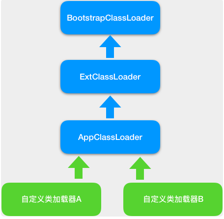

- BootstrapClassLoader 是启动类加载器，由 C 语言实现，用来加载 JVM 启动时所需要的核心类，比如rt.jar、resources.jar等。

- ExtClassLoader 是扩展类加载器，用来加载\jre\lib\ext目录下 JAR 包。

- AppClassLoader 是系统类加载器，用来加载 classpath 下的类，应用程序默认用它来加载类。

- 自定义类加载器，用来加载自定义路径下的类。

这些类加载器的工作原理是一样的，区别是它们的加载路径不同，也就是说 findClass 这个方法查找的路径不同。双亲委托机制是为了保证一个 Java 类在 JVM 中是唯一的，假如你不小心写了一个与 JRE 核心类同名的类，比如 Object 类，双亲委托机制能保证加载的是 JRE 里的那个 Object 类，而不是你写的 Object 类。这是因为 AppClassLoader 在加载你的 Object 类时，会委托给 ExtClassLoader 去加载，而 ExtClassLoader 又会委托给 BootstrapClassLoader，BootstrapClassLoader 发现自己已经加载过了 Object 类，会直接返回，不会去加载你写的 Object 类。


这里请你注意，类加载器的父子关系不是通过继承来实现的，比如 AppClassLoader 并不是 ExtClassLoader 的子类，而是说 AppClassLoader 的 parent 成员变量指向 ExtClassLoader 对象。同样的道理，如果你要自定义类加载器，不去继承 AppClassLoader，而是继承 ClassLoader 抽象类，再重写 findClass 和 loadClass 方法即可，Tomcat 就是通过自定义类加载器来实现自己的类加载逻辑。不知道你发现没有，如果你要打破双亲委托机制，就需要重写 loadClass 方法，因为 loadClass 的默认实现就是双亲委托机制。


### 2、Tomcat 的类加载器

Tomcat 的自定义类加载器 WebAppClassLoader 打破了双亲委托机制，它首先自己尝试去加载某个类，如果找不到再代理给父类加载器，其目的是优先加载 Web 应用自己定义的类。具体实现就是重写 ClassLoader 的两个方法：findClass 和 loadClass。

#### 1、findClass 方法

我们先来看看 findClass 方法的实现，为了方便理解和阅读，我去掉了一些细节：

```java

public Class<?> findClass(String name) throws ClassNotFoundException {
    ...
    
    Class<?> clazz = null;
    try {
            //1. 先在Web应用目录下查找类 
            clazz = findClassInternal(name);
    }  catch (RuntimeException e) {
           throw e;
       }
    
    if (clazz == null) {
    try {
            //2. 如果在本地目录没有找到，交给父加载器去查找
            clazz = super.findClass(name);
    }  catch (RuntimeException e) {
           throw e;
       }
    
    //3. 如果父类也没找到，抛出ClassNotFoundException
    if (clazz == null) {
        throw new ClassNotFoundException(name);
     }

    return clazz;
}

```

在 findClass 方法里，主要有三个步骤：

- 1、先在 Web 应用本地目录下查找要加载的类。
- 2、如果没有找到，交给父加载器去查找，它的父加载器就是上面提到的系统类加载器 AppClassLoader。
- 3、如何父加载器也没找到这个类，抛出 ClassNotFound 异常。


#### 2、loadClass 方法

接着我们再来看 Tomcat 类加载器的 loadClass 方法的实现，同样我也去掉了一些细节：

```java

public Class<?> loadClass(String name, boolean resolve) throws ClassNotFoundException {

    synchronized (getClassLoadingLock(name)) {
 
        Class<?> clazz = null;

        //1. 先在本地cache查找该类是否已经加载过
        clazz = findLoadedClass0(name);
        if (clazz != null) {
            if (resolve)
                resolveClass(clazz);
            return clazz;
        }

        //2. 从系统类加载器的cache中查找是否加载过
        clazz = findLoadedClass(name);
        if (clazz != null) {
            if (resolve)
                resolveClass(clazz);
            return clazz;
        }

        // 3. 尝试用ExtClassLoader类加载器类加载，为什么？
        ClassLoader javaseLoader = getJavaseClassLoader();
        try {
            clazz = javaseLoader.loadClass(name);
            if (clazz != null) {
                if (resolve)
                    resolveClass(clazz);
                return clazz;
            }
        } catch (ClassNotFoundException e) {
            // Ignore
        }

        // 4. 尝试在本地目录搜索class并加载
        try {
            clazz = findClass(name);
            if (clazz != null) {
                if (resolve)
                    resolveClass(clazz);
                return clazz;
            }
        } catch (ClassNotFoundException e) {
            // Ignore
        }

        // 5. 尝试用系统类加载器(也就是AppClassLoader)来加载
            try {
                clazz = Class.forName(name, false, parent);
                if (clazz != null) {
                    if (resolve)
                        resolveClass(clazz);
                    return clazz;
                }
            } catch (ClassNotFoundException e) {
                // Ignore
            }
       }
    
    //6. 上述过程都加载失败，抛出异常
    throw new ClassNotFoundException(name);
}
```
loadClass 方法稍微复杂一点，主要有六个步骤：

- 1、先在本地 Cache 查找该类是否已经加载过，也就是说 Tomcat 的类加载器是否已经加载过这个类。

- 2、如果 Tomcat 类加载器没有加载过这个类，再看看系统类加载器是否加载过。

- 3、如果都没有，就让 ExtClassLoader 去加载，这一步比较关键，目的防止 Web 应用自己的类覆盖 JRE 的核心类。因为 Tomcat 需要打破双亲委托机制，假如 Web 应用里自定义了一个叫 Object 的类，如果先加载这个 Object 类，就会覆盖 JRE 里面的那个 Object 类，这就是为什么 Tomcat 的类加载器会优先尝试用 ExtClassLoader 去加载，因为 ExtClassLoader 会委托给 BootstrapClassLoader 去加载，BootstrapClassLoader 发现自己已经加载了 Object 类，直接返回给 Tomcat 的类加载器，这样 Tomcat 的类加载器就不会去加载 Web 应用下的 Object 类了，也就避免了覆盖 JRE 核心类的问题。

- 4、如果 ExtClassLoader 加载器加载失败，也就是说 JRE 核心类中没有这类，那么就在本地 Web 应用目录下查找并加载。

- 5、如果本地目录下没有这个类，说明不是 Web 应用自己定义的类，那么由系统类加载器去加载。这里请你注意，Web 应用是通过Class.forName调用交给系统类加载器的，因为Class.forName的默认加载器就是系统类加载器。

- 6、如果上述加载过程全部失败，抛出 ClassNotFound 异常。


从上面的过程我们可以看到，Tomcat 的类加载器打破了双亲委托机制，没有一上来就直接委托给父加载器，而是先在本地目录下加载，为了避免本地目录下的类覆盖 JRE 的核心类，先尝试用 JVM 扩展类加载器 ExtClassLoader 去加载。那为什么不先用系统类加载器 AppClassLoader 去加载？很显然，如果是这样的话，那就变成双亲委托机制了，这就是 Tomcat 类加载器的巧妙之处。

> 总结

今天我介绍了 JVM 的类加载器原理和源码剖析，以及 Tomcat 的类加载器是如何打破双亲委托机制的，目的是为了优先加载 Web 应用目录下的类，然后再加载其他目录下的类，这也是 Servlet 规范的推荐做法。要打破双亲委托机制，需要继承 ClassLoader 抽象类，并且需要重写它的 loadClass 方法，因为 ClassLoader 的默认实现就是双亲委托。


> 思考

如果你并不想打破双亲委托机制，但是又想定义自己的类加载器来加载特定目录下的类，你需要重写 findClass 和 loadClass 方法中的哪一个？还是两个都要重写？


## 3、Context容器（中）：Tomcat如何隔离Web应用？

Tomcat 通过自定义类加载器 WebAppClassLoader 打破了双亲委托机制，具体来说就是重写了 JVM 的类加载器 ClassLoader 的 findClass 方法和 loadClass 方法，这样做的目的是优先加载 Web 应用目录下的类。除此之外，你觉得 Tomcat 的类加载器还需要完成哪些需求呢？或者说在设计上还需要考虑哪些方面？

我们知道，Tomcat 作为 Servlet 容器，它负责加载我们的 Servlet 类，此外它还负责加载 Servlet 所依赖的 JAR 包。并且 Tomcat 本身也是一个 Java 程序，因此它需要加载自己的类和依赖的 JAR 包。首先让我们思考这一下这几个问题：

- 1、假如我们在 Tomcat 中运行了两个 Web 应用程序，两个 Web 应用中有同名的 Servlet，但是功能不同，Tomcat 需要同时加载和管理这两个同名的 Servlet 类，保证它们不会冲突，因此 Web 应用之间的类需要隔离。

- 2、假如两个 Web 应用都依赖同一个第三方的 JAR 包，比如 Spring，那 Spring 的 JAR 包被加载到内存后，Tomcat 要保证这两个 Web 应用能够共享，也就是说 Spring 的 JAR 包只被加载一次，否则随着依赖的第三方 JAR 包增多，JVM 的内存会膨胀。

- 3、跟 JVM 一样，我们需要隔离 Tomcat 本身的类和 Web 应用的类。

在了解了 Tomcat 的类加载器在设计时要考虑的这些问题以后，今天我们主要来学习一下 Tomcat 是如何通过设计多层次的类加载器来解决这些问题的。


### 1、Tomcat 类加载器的层次结构

为了解决这些问题，Tomcat 设计了类加载器的层次结构，它们的关系如下图所示。下面我来详细解释为什么要设计这些类加载器，告诉你它们是怎么解决上面这些问题的。

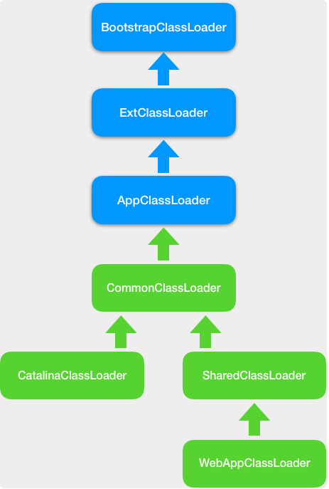


#### 1、WebAppClassLoader

我们先来看第 1 个问题，假如我们使用 JVM 默认 AppClassLoader 来加载 Web 应用，AppClassLoader 只能加载一个 Servlet 类，在加载第二个同名 Servlet 类时，AppClassLoader 会返回第一个 Servlet 类的 Class 实例，这是因为在 AppClassLoader 看来，同名的 Servlet 类只被加载一次。


因此 Tomcat 的解决方案是自定义一个类加载器 WebAppClassLoader， 并且给每个 Web 应用创建一个类加载器实例。我们知道，Context 容器组件对应一个 Web 应用，因此，每个 Context 容器负责创建和维护一个 WebAppClassLoader 加载器实例。这背后的原理是，`不同的加载器实例加载的类被认为是不同的类`，即使它们的类名相同。这就相当于在 Java 虚拟机内部创建了一个个相互隔离的 Java 类空间，每一个 Web 应用都有自己的类空间，Web 应用之间通过各自的类加载器互相隔离。

#### 2、SharedClassLoader

我们再来看第 2 个问题，本质需求是两个 Web 应用之间怎么共享库类，并且不能重复加载相同的类。我们知道，在双亲委托机制里，各个子加载器都可以通过父加载器去加载类，那么把需要共享的类放到父加载器的加载路径下不就行了吗，应用程序也正是通过这种方式共享 JRE 的核心类。因此 Tomcat 的设计者又加了一个类加载器 SharedClassLoader，作为 WebAppClassLoader 的父加载器，专门来加载 Web 应用之间共享的类。如果 WebAppClassLoader 自己没有加载到某个类，就会委托父加载器 SharedClassLoader 去加载这个类，SharedClassLoader 会在指定目录下加载共享类，之后返回给 WebAppClassLoader，这样共享的问题就解决了。

#### 3、CatalinaClassLoader

我们来看第 3 个问题，如何隔离 Tomcat 本身的类和 Web 应用的类？我们知道，要共享可以通过父子关系，要隔离那就需要兄弟关系了。兄弟关系就是指两个类加载器是平行的，它们可能拥有同一个父加载器，但是两个兄弟类加载器加载的类是隔离的。基于此 Tomcat 又设计一个类加载器 CatalinaClassLoader，专门来加载 Tomcat 自身的类。这样设计有个问题，那 Tomcat 和各 Web 应用之间需要共享一些类时该怎么办呢？

#### 4、CommonClassLoader

老办法，还是再增加一个 CommonClassLoader，作为 CatalinaClassLoader 和 SharedClassLoader 的父加载器。CommonClassLoader 能加载的类都可以被 CatalinaClassLoader 和 SharedClassLoader 使用，而 CatalinaClassLoader 和 SharedClassLoader 能加载的类则与对方相互隔离。WebAppClassLoader 可以使用 SharedClassLoader 加载到的类，但各个 WebAppClassLoader 实例之间相互隔离。

### 2、Spring 的加载问题

在 JVM 的实现中有一条隐含的规则，默认情况下，如果一个类由类加载器 A 加载，那么这个类的依赖类也是由相同的类加载器加载。比如 Spring 作为一个 Bean 工厂，它需要创建业务类的实例，并且在创建业务类实例之前需要加载这些类。Spring 是通过调用Class.forName来加载业务类的，我们来看一下 forName 的源码：

```java

public static Class<?> forName(String className) {
    Class<?> caller = Reflection.getCallerClass();
    return forName0(className, true, ClassLoader.getClassLoader(caller), caller);
}
```
可以看到在 forName 的函数里，会用调用者也就是 Spring 的加载器去加载业务类。

我在前面提到，Web 应用之间共享的 JAR 包可以交给 SharedClassLoader 来加载，从而避免重复加载。Spring 作为共享的第三方 JAR 包，它本身是由 SharedClassLoader 来加载的，Spring 又要去加载业务类，按照前面那条规则，加载 Spring 的类加载器也会用来加载业务类，但是业务类在 Web 应用目录下，不在 SharedClassLoader 的加载路径下，这该怎么办呢？

于是线程上下文加载器登场了，它其实是一种类加载器传递机制。为什么叫作“线程上下文加载器”呢，因为这个类加载器保存在线程私有数据里，只要是同一个线程，一旦设置了线程上下文加载器，在线程后续执行过程中就能把这个类加载器取出来用。因此 Tomcat 为每个 Web 应用创建一个 WebAppClassLoader 类加载器，并在启动 Web 应用的线程里设置线程上下文加载器，这样 Spring 在启动时就将线程上下文加载器取出来，用来加载 Bean。Spring 取线程上下文加载的代码如下：


cl = Thread.currentThread().getContextClassLoader();


> 总结

今天我介绍了 JVM 的类加载器原理并剖析了源码，以及 Tomcat 的类加载器的设计。重点需要你理解的是，Tomcat 的 Context 组件为每个 Web 应用创建一个 WebAppClassLoader 类加载器，由于不同类加载器实例加载的类是互相隔离的，因此达到了隔离 Web 应用的目的，同时通过 CommonClassLoader 等父加载器来共享第三方 JAR 包。而共享的第三方 JAR 包怎么加载特定 Web 应用的类呢？可以通过设置线程上下文加载器来解决。而作为 Java 程序员，我们应该牢记的是：

- 每个 Web 应用自己的 Java 类文件和依赖的 JAR 包，分别放在WEB-INF/classes和WEB-INF/lib目录下面。

- 多个应用共享的 Java 类文件和 JAR 包，分别放在 Web 容器指定的共享目录下。

- 当出现 ClassNotFound 错误时，应该检查你的类加载器是否正确。

线程上下文加载器不仅仅可以用在 Tomcat 和 Spring 类加载的场景里，核心框架类需要加载具体实现类时都可以用到它，比如我们熟悉的 JDBC 就是通过上下文类加载器来加载不同的数据库驱动的，感兴趣的话可以深入了解一下。

> 思考

在 StandardContext 的启动方法里，会将当前线程的上下文加载器设置为 WebAppClassLoader。

```java

originalClassLoader = Thread.currentThread().getContextClassLoader();
Thread.currentThread().setContextClassLoader(webApplicationClassLoader);
```

在启动方法结束的时候，还会恢复线程的上下文加载器：

Thread.currentThread().setContextClassLoader(originalClassLoader);

这是为什么呢？

线程上下文加载器其实是线程的一个私有数据，跟线程绑定的，这个线程做完启动Context组件的事情后，会被回收到线程池，之后被用来做其他事情，为了不影响其他事情，需要恢复之前的线程上下文加载器。


- 1.线程上下文的加载器是指定子类加载器来加载具体的某个桥接类。比如JDBC的Driver的加载。
- 2.每个Web下面的java类和jar(WEB-INF/classes和WEB-INF/lib),都是WebAppClassLoader加载
- 3.Web容器指定的共享目录一般是在什么路径下

CommonClassLoader对应<Tomcat>/common/*

CatalinaClassLoader对应 <Tomcat >/server/*

SharedClassLoader对应 <Tomcat >/shared/*

WebAppClassloader对应 <Tomcat >/webapps/<app>/WEB-INF/*目录


## 4、Context容器（下）：Tomcat如何实现Servlet规范？

我们知道，Servlet 容器最重要的任务就是创建 Servlet 的实例并且调用 Servlet，在前面两期我谈到了 Tomcat 如何定义自己的类加载器来加载 Servlet，但加载 Servlet 的类不等于创建 Servlet 的实例，类加载只是第一步，类加载好了才能创建类的实例，也就是说 Tomcat 先加载 Servlet 的类，然后在 Java 堆上创建了一个 Servlet 实例。

一个 Web 应用里往往有多个 Servlet，而在 Tomcat 中一个 Web 应用对应一个 Context 容器，也就是说一个 Context 容器需要管理多个 Servlet 实例。但 Context 容器并不直接持有 Servlet 实例，而是通过子容器 Wrapper 来管理 Servlet，你可以把 Wrapper 容器看作是 Servlet 的包装。那为什么需要 Wrapper 呢？Context 容器直接维护一个 Servlet 数组不就行了吗？这是因为 Servlet 不仅仅是一个类实例，它还有相关的配置信息，比如它的 URL 映射、它的初始化参数，因此设计出了一个包装器，把 Servlet 本身和它相关的数据包起来，没错，这就是面向对象的思想。


那管理好 Servlet 就完事大吉了吗？别忘了 Servlet 还有两个兄弟：Listener 和 Filter，它们也是 Servlet 规范中的重要成员，因此 Tomcat 也需要创建它们的实例，也需要在合适的时机去调用它们的方法。说了那么多，下面我们就来聊一聊 Tomcat 是如何做到上面这些事的。


### 1、Servlet 管理

前面提到，Tomcat 是用 Wrapper 容器来管理 Servlet 的，那 Wrapper 容器具体长什么样子呢？我们先来看看它里面有哪些关键的成员变量：protected volatile Servlet instance = null;

毫无悬念，它拥有一个 Servlet 实例，并且 Wrapper 通过 loadServlet 方法来实例化 Servlet。为了方便你阅读，我简化了代码：

```java

public synchronized Servlet loadServlet() throws ServletException {
    Servlet servlet;
  
    //1. 创建一个Servlet实例
    servlet = (Servlet) instanceManager.newInstance(servletClass);    
    
    //2.调用了Servlet的init方法，这是Servlet规范要求的
    initServlet(servlet);
    
    return servlet;
}
```

其实 loadServlet 主要做了两件事：创建 Servlet 的实例，并且调用 Servlet 的 init 方法，因为这是 Servlet 规范要求的。那接下来的问题是，什么时候会调到这个 loadServlet 方法呢？为了加快系统的启动速度，我们往往会采取资源延迟加载的策略，Tomcat 也不例外，默认情况下 Tomcat 在启动时不会加载你的 Servlet，除非你把 Servlet 的loadOnStartup参数设置为true。这里还需要你注意的是，虽然 Tomcat 在启动时不会创建 Servlet 实例，但是会创建 Wrapper 容器，就好比尽管枪里面还没有子弹，先把枪造出来。那子弹什么时候造呢？是真正需要开枪的时候，也就是说有请求来访问某个 Servlet 时，这个 Servlet 的实例才会被创建。


那 Servlet 是被谁调用的呢？我们回忆一下专栏前面提到过 Tomcat 的 Pipeline-Valve 机制，每个容器组件都有自己的 Pipeline，每个 Pipeline 中有一个 Valve 链，并且每个容器组件有一个 BasicValve（基础阀）。Wrapper 作为一个容器组件，它也有自己的 Pipeline 和 BasicValve，Wrapper 的 BasicValve 叫 StandardWrapperValve。

你可以想到，当请求到来时，Context 容器的 BasicValve 会调用 Wrapper 容器中 Pipeline 中的第一个 Valve，然后会调用到 StandardWrapperValve。我们先来看看它的 invoke 方法是如何实现的，同样为了方便你阅读，我简化了代码：

```java


public final void invoke(Request request, Response response) {

    //1.实例化Servlet
    servlet = wrapper.allocate();
   
    //2.给当前请求创建一个Filter链
    ApplicationFilterChain filterChain =
        ApplicationFilterFactory.createFilterChain(request, wrapper, servlet);

   //3. 调用这个Filter链，Filter链中的最后一个Filter会调用Servlet
   filterChain.doFilter(request.getRequest(), response.getResponse());

}
```

StandardWrapperValve 的 invoke 方法比较复杂，去掉其他异常处理的一些细节，本质上就是三步：

- 第一步，创建 Servlet 实例；
- 第二步，给当前请求创建一个 Filter 链；
- 第三步，调用这个 Filter 链。

你可能会问，为什么需要给每个请求创建一个 Filter 链？这是因为每个请求的请求路径都不一样，而 Filter 都有相应的路径映射，因此不是所有的 Filter 都需要来处理当前的请求，我们需要根据请求的路径来选择特定的一些 Filter 来处理。第二个问题是，为什么没有看到调到 Servlet 的 service 方法？这是因为 Filter 链的 doFilter 方法会负责调用 Servlet，具体来说就是 Filter 链中的最后一个 Filter 会负责调用 Servlet。接下来我们来看 Filter 的实现原理。


### 2、Filter 管理

我们知道，跟 Servlet 一样，Filter 也可以在web.xml文件里进行配置，不同的是，Filter 的作用域是整个 Web 应用，因此 Filter 的实例是在 Context 容器中进行管理的，Context 容器用 Map 集合来保存 Filter。private Map filterDefs = new HashMap<>();

那上面提到的 Filter 链又是什么呢？Filter 链的存活期很短，它是跟每个请求对应的。一个新的请求来了，就动态创建一个 Filter 链，请求处理完了，Filter 链也就被回收了。理解它的原理也非常关键，我们还是来看看源码：

```java

public final class ApplicationFilterChain implements FilterChain {
  
  //Filter链中有Filter数组，这个好理解
  private ApplicationFilterConfig[] filters = new ApplicationFilterConfig[0];
    
  //Filter链中的当前的调用位置
  private int pos = 0;
    
  //总共有多少了Filter
  private int n = 0;

  //每个Filter链对应一个Servlet，也就是它要调用的Servlet
  private Servlet servlet = null;
  
  public void doFilter(ServletRequest req, ServletResponse res) {
        internalDoFilter(request,response);
  }
   
  private void internalDoFilter(ServletRequest req,
                                ServletResponse res){

    // 每个Filter链在内部维护了一个Filter数组
    if (pos < n) {
        ApplicationFilterConfig filterConfig = filters[pos++];
        Filter filter = filterConfig.getFilter();

        filter.doFilter(request, response, this);
        return;
    }

    servlet.service(request, response);
   
}
```

从 ApplicationFilterChain 的源码我们可以看到几个关键信息：

- Filter 链中除了有 Filter 对象的数组，还有一个整数变量 pos，这个变量用来记录当前被调用的 Filter 在数组中的位置。

- Filter 链中有个 Servlet 实例，这个好理解，因为上面提到了，每个 Filter 链最后都会调到一个 Servlet。

- Filter 链本身也实现了 doFilter 方法，直接调用了一个内部方法 internalDoFilter。

- internalDoFilter 方法的实现比较有意思，它做了一个判断，如果当前 Filter 的位置小于 Filter 数组的长度，也就是说 Filter 还没调完，就从 Filter 数组拿下一个 Filter，调用它的 doFilter 方法。否则，意味着所有 Filter 都调到了，就调用 Servlet 的 service 方法。


但问题是，方法体里没看到循环，谁在不停地调用 Filter 链的 doFilter 方法呢？Filter 是怎么依次调到的呢？答案是 Filter 本身的 doFilter 方法会调用 Filter 链的 doFilter 方法，我们还是来看看代码就明白了：

```java

public void doFilter(ServletRequest request, ServletResponse response,
        FilterChain chain){
        
          ...
          
          //调用Filter的方法
          chain.doFilter(request, response);
      
      }
```

注意 Filter 的 doFilter 方法有个关键参数 FilterChain，就是 Filter 链。并且每个 Filter 在实现 doFilter 时，必须要调用 Filter 链的 doFilter 方法，而 Filter 链中保存当前 Filter 的位置，会调用下一个 Filter 的 doFilter 方法，这样链式调用就完成了。Filter 链跟 Tomcat 的 Pipeline-Valve 本质都是责任链模式，但是在具体实现上稍有不同，你可以细细体会一下。

### 3、Listener 管理

我们接着聊 Servlet 规范里 Listener。跟 Filter 一样，Listener 也是一种扩展机制，你可以监听容器内部发生的事件，主要有两类事件：

- 第一类是生命状态的变化，比如 Context 容器启动和停止、Session 的创建和销毁。
- 第二类是属性的变化，比如 Context 容器某个属性值变了、Session 的某个属性值变了以及新的请求来了等。

我们可以在web.xml配置或者通过注解的方式来添加监听器，在监听器里实现我们的业务逻辑。对于 Tomcat 来说，它需要读取配置文件，拿到监听器类的名字，实例化这些类，并且在合适的时机调用这些监听器的方法。Tomcat 是通过 Context 容器来管理这些监听器的。Context 容器将两类事件分开来管理，分别用不同的集合来存放不同类型事件的监听器：

```java

//监听属性值变化的监听器
private List<Object> applicationEventListenersList = new CopyOnWriteArrayList<>();

//监听生命事件的监听器
private Object applicationLifecycleListenersObjects[] = new Object[0];
```

剩下的事情就是触发监听器了，比如在 Context 容器的启动方法里，就触发了所有的 ServletContextListener：

```java

//1.拿到所有的生命周期监听器
Object instances[] = getApplicationLifecycleListeners();

for (int i = 0; i < instances.length; i++) {
   //2. 判断Listener的类型是不是ServletContextListener
   if (!(instances[i] instanceof ServletContextListener))
      continue;

   //3.触发Listener的方法
   ServletContextListener lr = (ServletContextListener) instances[i];
   lr.contextInitialized(event);
}
```

需要注意的是，这里的 ServletContextListener 接口是一种留给用户的扩展机制，用户可以实现这个接口来定义自己的监听器，监听 Context 容器的启停事件。Spring 就是这么做的。ServletContextListener 跟 Tomcat 自己的生命周期事件 LifecycleListener 是不同的。LifecycleListener 定义在生命周期管理组件中，由基类 LifecycleBase 统一管理。


> 总结

servlet 规范中最重要的就是 Servlet、Filter 和 Listener“三兄弟”。Web 容器最重要的职能就是把它们创建出来，并在适当的时候调用它们的方法。Tomcat 通过 Wrapper 容器来管理 Servlet，Wrapper 包装了 Servlet 本身以及相应的参数，这体现了面向对象中“封装”的设计原则。Tomcat 会给每个请求生成一个 Filter 链，Filter 链中的最后一个 Filter 会负责调用 Servlet 的 service 方法。对于 Listener 来说，我们可以定制自己的监听器来监听 Tomcat 内部发生的各种事件：包括 Web 应用级别的、Session 级别的和请求级别的。Tomcat 中的 Context 容器统一维护了这些监听器，并负责触发。最后小结一下这 3 期内容，Context 组件通过自定义类加载器来加载 Web 应用，并实现了 Servlet 规范，直接跟 Web 应用打交道，是一个核心的容器组件。也因此我用了很重的篇幅去讲解它，也非常建议你花点时间阅读一下它的源码。


> 思考

Context 容器分别用了 CopyOnWriteArrayList 和对象数组来存储两种不同的监听器，为什么要这样设计，你可以思考一下背后的原因。


## 5、新特性：Tomcat如何支持异步Servlet？

当一个新的请求到达时，Tomcat 和 Jetty 会从线程池里拿出一个线程来处理请求，这个线程会调用你的 Web 应用，Web 应用在处理请求的过程中，Tomcat 线程会一直阻塞，直到 Web 应用处理完毕才能再输出响应，最后 Tomcat 才回收这个线程。我们来思考这样一个问题，假如你的 Web 应用需要较长的时间来处理请求（比如数据库查询或者等待下游的服务调用返回），那么 Tomcat 线程一直不回收，会占用系统资源，在极端情况下会导致“线程饥饿”，也就是说 Tomcat 和 Jetty 没有更多的线程来处理新的请求。

那该如何解决这个问题呢？方案是 Servlet 3.0 中引入的异步 Servlet。主要是在 Web 应用里启动一个单独的线程来执行这些比较耗时的请求，而 Tomcat 线程立即返回，不再等待 Web 应用将请求处理完，这样 Tomcat 线程可以立即被回收到线程池，用来响应其他请求，降低了系统的资源消耗，同时还能提高系统的吞吐量。今天我们就来学习一下如何开发一个异步 Servlet，以及异步 Servlet 的工作原理，也就是 Tomcat 是如何支持异步 Servlet 的，让你彻底理解它的来龙去脉。


### 1、异步 Servlet 示例

我们先通过一个简单的示例来了解一下异步 Servlet 的实现。

```java

@WebServlet(urlPatterns = {"/async"}, asyncSupported = true)
public class AsyncServlet extends HttpServlet {

    //Web应用线程池，用来处理异步Servlet
    ExecutorService executor = Executors.newSingleThreadExecutor();

    public void service(HttpServletRequest req, HttpServletResponse resp) {
        //1. 调用startAsync或者异步上下文
        final AsyncContext ctx = req.startAsync();

       //用线程池来执行耗时操作
        executor.execute(new Runnable() {

            @Override
            public void run() {

                //在这里做耗时的操作
                try {
                    ctx.getResponse().getWriter().println("Handling Async Servlet");
                } catch (IOException e) {}

                //3. 异步Servlet处理完了调用异步上下文的complete方法
                ctx.complete();
            }

        });
    }
}
```
上面的代码有三个要点：

- 1、通过注解的方式来注册 Servlet，除了 @WebServlet 注解，还需要加上asyncSupported=true的属性，表明当前的 Servlet 是一个异步 Servlet。

- 2、Web 应用程序需要调用 Request 对象的 startAsync 方法来拿到一个异步上下文 AsyncContext。这个上下文保存了请求和响应对象。

- 3、Web 应用需要开启一个新线程来处理耗时的操作，处理完成后需要调用 AsyncContext 的 complete 方法。目的是告诉 Tomcat，请求已经处理完成。

这里请你注意，虽然异步 Servlet 允许用更长的时间来处理请求，但是也有超时限制的，默认是 30 秒，如果 30 秒内请求还没处理完，Tomcat 会触发超时机制，向浏览器返回超时错误，如果这个时候你的 Web 应用再调用ctx.complete方法，会得到一个 IllegalStateException 异常。


### 2、异步 Servlet 原理

过上面的例子，相信你对 Servlet 的异步实现有了基本的理解。要理解 Tomcat 在这个过程都做了什么事情，关键就是要弄清楚req.startAsync方法和ctx.complete方法都做了什么。

#### 1、startAsync 方法

startAsync 方法其实就是创建了一个异步上下文 AsyncContext 对象，AsyncContext 对象的作用是保存请求的中间信息，比如 Request 和 Response 对象等上下文信息。你来思考一下为什么需要保存这些信息呢？这是因为 Tomcat 的工作线程在request.startAsync调用之后，就直接结束回到线程池中了，线程本身不会保存任何信息。也就是说一个请求到服务端，执行到一半，你的 Web 应用正在处理，这个时候 Tomcat 的工作线程没了，这就需要有个缓存能够保存原始的 Request 和 Response 对象，而这个缓存就是 AsyncContext。

有了 AsyncContext，你的 Web 应用通过它拿到 Request 和 Response 对象，拿到 Request 对象后就可以读取请求信息，请求处理完了还需要通过 Response 对象将 HTTP 响应发送给浏览器。除了创建 AsyncContext 对象，startAsync 还需要完成一个关键任务，那就是告诉 Tomcat 当前的 Servlet 处理方法返回时，不要把响应发到浏览器，因为这个时候，响应还没生成呢；并且不能把 Request 对象和 Response 对象销毁，因为后面 Web 应用还要用呢。在 Tomcat 中，负责 flush 响应数据的是 CoyoteAdapter，它还会销毁 Request 对象和 Response 对象，因此需要通过某种机制通知 CoyoteAdapter，具体来说是通过下面这行代码：this.request.getCoyoteRequest().action(ActionCode.ASYNC_START, this);

你可以把它理解为一个 Callback，在这个 action 方法里设置了 Request 对象的状态，设置它为一个异步 Servlet 请求。

我们知道连接器是调用 CoyoteAdapter 的 service 方法来处理请求的，而 CoyoteAdapter 会调用容器的 service 方法，当容器的 service 方法返回时，CoyoteAdapter 判断当前的请求是不是异步 Servlet 请求，如果是，就不会销毁 Request 和 Response 对象，也不会把响应信息发到浏览器。你可以通过下面的代码理解一下，这是 CoyoteAdapter 的 service 方法，我对它进行了简化：

```java

public void service(org.apache.coyote.Request req, org.apache.coyote.Response res) {
    
   //调用容器的service方法处理请求
    connector.getService().getContainer().getPipeline().
           getFirst().invoke(request, response);
   
   //如果是异步Servlet请求，仅仅设置一个标志，
   //否则说明是同步Servlet请求，就将响应数据刷到浏览器
    if (request.isAsync()) {
        async = true;
    } else {
        request.finishRequest();
        response.finishResponse();
    }
   
   //如果不是异步Servlet请求，就销毁Request对象和Response对象
    if (!async) {
        request.recycle();
        response.recycle();
    }
}

```

接下来，当 CoyoteAdapter 的 service 方法返回到 ProtocolHandler 组件时，ProtocolHandler 判断返回值，如果当前请求是一个异步 Servlet 请求，它会把当前 Socket 的协议处理者 Processor 缓存起来，将 SocketWrapper 对象和相应的 Processor 存到一个 Map 数据结构里。

private final Map<S,Processor> connections = new ConcurrentHashMap<>();

之所以要缓存是因为这个请求接下来还要接着处理，还是由原来的 Processor 来处理，通过 SocketWrapper 就能从 Map 里找到相应的 Processor。

#### 2、complete 方法

接着我们再来看关键的ctx.complete方法，当请求处理完成时，Web 应用调用这个方法。那么这个方法做了些什么事情呢？最重要的就是把响应数据发送到浏览器。这件事情不能由 Web 应用线程来做，也就是说ctx.complete方法不能直接把响应数据发送到浏览器，因为这件事情应该由 Tomcat 线程来做，但具体怎么做呢？我们知道，连接器中的 Endpoint 组件检测到有请求数据达到时，会创建一个 SocketProcessor 对象交给线程池去处理，因此 Endpoint 的通信处理和具体请求处理在两个线程里运行。在异步 Servlet 的场景里，Web 应用通过调用ctx.complete方法时，也可以生成一个新的 SocketProcessor 任务类，交给线程池处理。对于异步 Servlet 请求来说，相应的 Socket 和协议处理组件 Processor 都被缓存起来了，并且这些对象都可以通过 Request 对象拿到。讲到这里，你可能已经猜到ctx.complete是如何实现的了：

```java

public void complete() {
    //检查状态合法性，我们先忽略这句
    check();
    
    //调用Request对象的action方法，其实就是通知连接器，这个异步请求处理完了
request.getCoyoteRequest().action(ActionCode.ASYNC_COMPLETE, null);
    
}
```
我们可以看到 complete 方法调用了 Request 对象的 action 方法。而在 action 方法里，则是调用了 Processor 的 processSocketEvent 方法，并且传入了操作码 OPEN_READ

```java

case ASYNC_COMPLETE: {
    clearDispatches();
    if (asyncStateMachine.asyncComplete()) {
        processSocketEvent(SocketEvent.OPEN_READ, true);
    }
    break;
}
```

我们接着看 processSocketEvent 方法，它调用 SocketWrapper 的 processSocket 方法：

```java

protected void processSocketEvent(SocketEvent event, boolean dispatch) {
    SocketWrapperBase<?> socketWrapper = getSocketWrapper();
    if (socketWrapper != null) {
        socketWrapper.processSocket(event, dispatch);
    }
}
```

而 SocketWrapper 的 processSocket 方法会创建 SocketProcessor 任务类，并通过 Tomcat 线程池来处理：

```java

public boolean processSocket(SocketWrapperBase<S> socketWrapper,
        SocketEvent event, boolean dispatch) {
        
      if (socketWrapper == null) {
          return false;
      }
      
      SocketProcessorBase<S> sc = processorCache.pop();
      if (sc == null) {
          sc = createSocketProcessor(socketWrapper, event);
      } else {
          sc.reset(socketWrapper, event);
      }
      //线程池运行
      Executor executor = getExecutor();
      if (dispatch && executor != null) {
          executor.execute(sc);
      } else {
          sc.run();
      }
}
```

请你注意 createSocketProcessor 函数的第二个参数是 SocketEvent，这里我们传入的是 OPEN_READ。通过这个参数，我们就能控制 SocketProcessor 的行为，因为我们不需要再把请求发送到容器进行处理，只需要向浏览器端发送数据，并且重新在这个 Socket 上监听新的请求就行了。最后我通过一张在帮你理解一下整个过程：

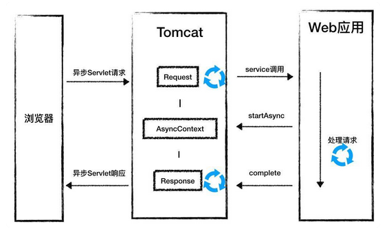

> 总结

非阻塞 I/O 模型可以利用很少的线程处理大量的连接，提高了并发度，本质就是通过一个 Selector 线程查询多个 Socket 的 I/O 事件，减少了线程的阻塞等待。同样，异步 Servlet 机制也是减少了线程的阻塞等待，将 Tomcat 线程和业务线程分开，Tomca 线程不再等待业务代码的执行。那什么样的场景适合异步 Servlet 呢？适合的场景有很多，最主要的还是根据你的实际情况，如果你拿不准是否适合异步 Servlet，就看一条：如果你发现 Tomcat 的线程不够了，大量线程阻塞在等待 Web 应用的处理上，而 Web 应用又没有优化的空间了，确实需要长时间处理，这个时候你不妨尝试一下异步 Servlet。

> 思考

异步 Servlet 将 Tomcat 线程和 Web 应用线程分开，体现了隔离的思想，也就是把不同的业务处理所使用的资源隔离开，使得它们互不干扰，尤其是低优先级的业务不能影响高优先级的业务。你可以思考一下，在你的 Web 应用内部，是不是也可以运用这种设计思想呢？


## 6、新特性：Spring Boot如何使用内嵌式的Tomcat和Jetty？

为了方便开发和部署，Spring Boot 在内部启动了一个嵌入式的 Web 容器。我们知道 Tomcat 和 Jetty 是组件化的设计，要启动 Tomcat 或者 Jetty 其实就是启动这些组件。在 Tomcat 独立部署的模式下，我们通过 startup 脚本来启动 Tomcat，Tomcat 中的 Bootstrap 和 Catalina 会负责初始化类加载器，并解析server.xml和启动这些组件。在内嵌式的模式下，Bootstrap 和 Catalina 的工作就由 Spring Boot 来做了，Spring Boot 调用了 Tomcat 和 Jetty 的 API 来启动这些组件。那 Spring Boot 具体是怎么做的呢？而作为程序员，我们如何向 Spring Boot 中的 Tomcat 注册 Servlet 或者 Filter 呢？我们又如何定制内嵌式的 Tomcat？


### 1、Spring Boot 中 Web 容器相关的接口

既然要支持多种 Web 容器，Spring Boot 对内嵌式 Web 容器进行了抽象，定义了 WebServer 接口：

```java

public interface WebServer {
    void start() throws WebServerException;
    void stop() throws WebServerException;
    int getPort();
}

```
各种 Web 容器比如 Tomcat 和 Jetty 需要去实现这个接口。

Spring Boot 还定义了一个工厂 ServletWebServerFactory 来创建 Web 容器，返回的对象就是上面提到的 WebServer。

```java

public interface ServletWebServerFactory {
    WebServer getWebServer(ServletContextInitializer... initializers);
}
```

可以看到 getWebServer 有个参数，类型是 ServletContextInitializer。它表示 ServletContext 的初始化器，用于 ServletContext 中的一些配置：

```java

public interface ServletContextInitializer {
    void onStartup(ServletContext servletContext) throws ServletException;
}
```

这里请注意，上面提到的 getWebServer 方法会调用 ServletContextInitializer 的 onStartup 方法，也就是说如果你想在 Servlet 容器启动时做一些事情，比如注册你自己的 Servlet，可以实现一个 ServletContextInitializer，在 Web 容器启动时，Spring Boot 会把所有实现了 ServletContextInitializer 接口的类收集起来，统一调它们的 onStartup 方法。

为了支持对内嵌式 Web 容器的定制化，Spring Boot 还定义了 WebServerFactoryCustomizerBeanPostProcessor 接口，它是一个 BeanPostProcessor，它在 postProcessBeforeInitialization 过程中去寻找 Spring 容器中 WebServerFactoryCustomizer 类型的 Bean，并依次调用 WebServerFactoryCustomizer 接口的 customize 方法做一些定制化

```java

public interface WebServerFactoryCustomizer<T extends WebServerFactory> {
    void customize(T factory);
}
```

### 2、内嵌式 Web 容器的创建和启动

铺垫了这些接口，我们再来看看 Spring Boot 是如何实例化和启动一个 Web 容器的。我们知道，Spring 的核心是一个 ApplicationContext，它的抽象实现类 AbstractApplicationContext 实现了著名的 refresh 方法，它用来新建或者刷新一个 ApplicationContext，在 refresh 方法中会调用 onRefresh 方法，AbstractApplicationContext 的子类可以重写这个 onRefresh 方法，来实现特定 Context 的刷新逻辑，因此 ServletWebServerApplicationContext 就是通过重写 onRefresh 方法来创建内嵌式的 Web 容器，具体创建过程是这样的：

```java

@Override
protected void onRefresh() {
     super.onRefresh();
     try {
        //重写onRefresh方法，调用createWebServer创建和启动Tomcat
        createWebServer();
     }
     catch (Throwable ex) {
     }
}

//createWebServer的具体实现
private void createWebServer() {
    //这里WebServer是Spring Boot抽象出来的接口，具体实现类就是不同的Web容器
    WebServer webServer = this.webServer;
    ServletContext servletContext = this.getServletContext();
    
    //如果Web容器还没创建
    if (webServer == null && servletContext == null) {
        //通过Web容器工厂来创建
        ServletWebServerFactory factory = this.getWebServerFactory();
        //注意传入了一个"SelfInitializer"
        this.webServer = factory.getWebServer(new ServletContextInitializer[]{this.getSelfInitializer()});
        
    } else if (servletContext != null) {
        try {
            this.getSelfInitializer().onStartup(servletContext);
        } catch (ServletException var4) {
          ...
        }
    }

    this.initPropertySources();
}
```

再来看看 getWebServer 具体做了什么，以 Tomcat 为例，主要调用 Tomcat 的 API 去创建各种组件：

```java

public WebServer getWebServer(ServletContextInitializer... initializers) {
    //1.实例化一个Tomcat，可以理解为Server组件。
    Tomcat tomcat = new Tomcat();
    
    //2. 创建一个临时目录
    File baseDir = this.baseDirectory != null ? this.baseDirectory : this.createTempDir("tomcat");
    tomcat.setBaseDir(baseDir.getAbsolutePath());
    
    //3.初始化各种组件
    Connector connector = new Connector(this.protocol);
    tomcat.getService().addConnector(connector);
    this.customizeConnector(connector);
    tomcat.setConnector(connector);
    tomcat.getHost().setAutoDeploy(false);
    this.configureEngine(tomcat.getEngine());
    
    //4. 创建定制版的"Context"组件。
    this.prepareContext(tomcat.getHost(), initializers);
    return this.getTomcatWebServer(tomcat);
}

```

你可能好奇 prepareContext 方法是做什么的呢？这里的 Context 是指 Tomcat 中的 Context 组件，为了方便控制 Context 组件的行为，Spring Boot 定义了自己的 TomcatEmbeddedContext，它扩展了 Tomcat 的 StandardContext：

class TomcatEmbeddedContext extends StandardContext {}


### 3、注册 Servlet 的三种方式

#### 1. Servlet 注解

在 Spring Boot 启动类上加上 @ServletComponentScan 注解后，使用 @WebServlet、@WebFilter、@WebListener 标记的 Servlet、Filter、Listener 就可以自动注册到 Servlet 容器中，无需其他代码，我们通过下面的代码示例来理解一下。

```java

@SpringBootApplication
@ServletComponentScan
public class xxxApplication
{}


@WebServlet("/hello")
public class HelloServlet extends HttpServlet {}
```

在 Web 应用的入口类上加上 @ServletComponentScan，并且在 Servlet 类上加上 @WebServlet，这样 Spring Boot 会负责将 Servlet 注册到内嵌的 Tomcat 中。


#### 2. ServletRegistrationBean

同时 Spring Boot 也提供了 ServletRegistrationBean、FilterRegistrationBean 和 ServletListenerRegistrationBean 这三个类分别用来注册 Servlet、Filter、Listener。假如要注册一个 Servlet，可以这样做：


```java

@Bean
public ServletRegistrationBean servletRegistrationBean() {
    return new ServletRegistrationBean(new HelloServlet(),"/hello");
}
```

这段代码实现的方法返回一个 ServletRegistrationBean，并将它当作 Bean 注册到 Spring 中，因此你需要把这段代码放到 Spring Boot 自动扫描的目录中，或者放到 @Configuration 标识的类中。

#### 3. 动态注册

你还可以创建一个类去实现前面提到的 ServletContextInitializer 接口，并把它注册为一个 Bean，Spring Boot 会负责调用这个接口的 onStartup 方法。

```java

@Component
public class MyServletRegister implements ServletContextInitializer {

    @Override
    public void onStartup(ServletContext servletContext) {
    
        //Servlet 3.0规范新的API
        ServletRegistration myServlet = servletContext
                .addServlet("HelloServlet", HelloServlet.class);
                
        myServlet.addMapping("/hello");
        
        myServlet.setInitParameter("name", "Hello Servlet");
    }

}
```
这里请注意两点：

- ServletRegistrationBean 其实也是通过 ServletContextInitializer 来实现的，它实现了 ServletContextInitializer 接口。

- 注意到 onStartup 方法的参数是我们熟悉的 ServletContext，可以通过调用它的 addServlet 方法来动态注册新的 Servlet，这是 Servlet 3.0 以后才有的功能。

### 4、Web 容器的定制

我们再来考虑一个问题，那就是如何在 Spring Boot 中定制 Web 容器。在 Spring Boot 2.0 中，我们可以通过两种方式来定制 Web 容器。

第一种方式是通过通用的 Web 容器工厂 ConfigurableServletWebServerFactory，来定制一些 Web 容器通用的参数：

```java

@Component
public class MyGeneralCustomizer implements
  WebServerFactoryCustomizer<ConfigurableServletWebServerFactory> {
  
    public void customize(ConfigurableServletWebServerFactory factory) {
        factory.setPort(8081);
        factory.setContextPath("/hello");
     }
}
```

第二种方式是通过特定 Web 容器的工厂比如 TomcatServletWebServerFactory 来进一步定制。下面的例子里，我们给 Tomcat 增加一个 Valve，这个 Valve 的功能是向请求头里添加 traceid，用于分布式追踪。TraceValve 的定义如下：

```java

class TraceValve extends ValveBase {
    @Override
    public void invoke(Request request, Response response) throws IOException, ServletException {

        request.getCoyoteRequest().getMimeHeaders().
        addValue("traceid").setString("1234xxxxabcd");

        Valve next = getNext();
        if (null == next) {
            return;
        }

        next.invoke(request, response);
    }

}

```
跟第一种方式类似，再添加一个定制器，代码如下：

```java

@Component
public class MyTomcatCustomizer implements
        WebServerFactoryCustomizer<TomcatServletWebServerFactory> {

    @Override
    public void customize(TomcatServletWebServerFactory factory) {
        factory.setPort(8081);
        factory.setContextPath("/hello");
        factory.addEngineValves(new TraceValve() );

    }
}
```

> 总结

今天我们学习了 Spring Boot 如何利用 Web 容器的 API 来启动 Web 容器、如何向 Web 容器注册 Servlet，以及如何定制化 Web 容器，除了给 Web 容器配置参数，还可以增加或者修改 Web 容器本身的组件。

> 思考

我在文章中提到，通过 ServletContextInitializer 接口可以向 Web 容器注册 Servlet，那 ServletContextInitializer 跟 Tomcat 中的 ServletContainerInitializer 有什么区别和联系呢？


## 7、比较：Jetty如何实现具有上下文信息的责任链？


## 8、Spring框架中的设计模式

### 1、简单工厂模式

我们来考虑这样一个场景：当 A 对象需要调用 B 对象的方法时，我们需要在 A 中 new 一个 B 的实例，我们把这种方式叫作硬编码耦合，它的缺点是一旦需求发生变化，比如需要使用 C 类来代替 B 时，就要改写 A 类的方法。假如应用中有 1000 个类以硬编码的方式耦合了 B，那改起来就费劲了。于是简单工厂模式就登场了，简单工厂模式又叫静态工厂方法，其实质是由一个工厂类根据传入的参数，动态决定应该创建哪一个产品类。Spring 中的 BeanFactory 就是简单工厂模式的体现，BeanFactory 是 Spring IOC 容器中的一个核心接口，它的定义如下：

```java

public interface BeanFactory {
   Object getBean(String name) throws BeansException;
   <T> T getBean(String name, Class<T> requiredType);
   Object getBean(String name, Object... args);
   <T> T getBean(Class<T> requiredType);
   <T> T getBean(Class<T> requiredType, Object... args);
   boolean containsBean(String name);
   boolean isSingleton(String name);
   boolea isPrototype(String name);
   boolean isTypeMatch(String name, ResolvableType typeToMatch);
   boolean isTypeMatch(String name, Class<?> typeToMatch);
   Class<?> getType(String name);
   String[] getAliases(String name);
}

```
我们可以通过它的具体实现类（比如 ClassPathXmlApplicationContext）来获取 Bean：

```java

BeanFactory bf = new ClassPathXmlApplicationContext("spring.xml");
User userBean = (User) bf.getBean("userBean");
```

从上面代码可以看到，使用者不需要自己来 new 对象，而是通过工厂类的方法 getBean 来获取对象实例，这是典型的简单工厂模式，只不过 Spring 是用反射机制来创建 Bean 的。


### 2、工厂方法模式

工厂方法模式说白了其实就是简单工厂模式的一种升级或者说是进一步抽象，它可以应用于更加复杂的场景，灵活性也更高。在简单工厂中，由工厂类进行所有的逻辑判断、实例创建；如果不想在工厂类中进行判断，可以为不同的产品提供不同的工厂，不同的工厂生产不同的产品，每一个工厂都只对应一个相应的对象，这就是工厂方法模式。

Spring 中的 FactoryBean 就是这种思想的体现，FactoryBean 可以理解为工厂 Bean，先来看看它的定义：

```java

public interface FactoryBean<T> {
  T getObject()；
  Class<?> getObjectType();
  boolean isSingleton();
}
```
我们定义一个类 UserFactoryBean 来实现 FactoryBean 接口，主要是在 getObject 方法里 new 一个 User 对象。这样我们通过 getBean(id) 获得的是该工厂所产生的 User 的实例，而不是 UserFactoryBean 本身的实例，像下面这样：

```java

BeanFactory bf = new ClassPathXmlApplicationContext("user.xml");
User userBean = (User) bf.getBean("userFactoryBean");
```

### 3、单例模式

单例模式是指一个类在整个系统运行过程中，只允许产生一个实例。在 Spring 中，Bean 可以被定义为两种模式：Prototype（多例）和 Singleton（单例），Spring Bean 默认是单例模式。那 Spring 是如何实现单例模式的呢？答案是通过单例注册表的方式，具体来说就是使用了 HashMap。请注意为了方便你阅读，我对代码进行了简化：

```java

public class DefaultSingletonBeanRegistry {
    
    //使用了线程安全容器ConcurrentHashMap，保存各种单实例对象
    private final Map<String, Object> singletonObjects = new ConcurrentHashMap<String, Object>;

    protected Object getSingleton(String beanName) {
    //先到HashMap中拿Object
    Object singletonObject = singletonObjects.get(beanName);
    
    //如果没拿到通过反射创建一个对象实例，并添加到HashMap中
    if (singletonObject == null) {
      singletonObjects.put(beanName,
                           Class.forName(beanName).newInstance());
   }
   
   //返回对象实例
   return singletonObjects.get(beanName);
  }
}
```
上面的代码逻辑比较清晰，先到 HashMap 去拿单实例对象，没拿到就创建一个添加到 HashMap。

### 4、代理模式

所谓代理，是指它与被代理对象实现了相同的接口，客户端必须通过代理才能与被代理的目标类进行交互，而代理一般在交互的过程中（交互前后），进行某些特定的处理，比如在调用这个方法前做前置处理，调用这个方法后做后置处理。代理模式中有下面几种角色：

- 抽象接口：定义目标类及代理类的共同接口，这样在任何可以使用目标对象的地方都可以使用代理对象。

- 目标对象： 定义了代理对象所代表的目标对象，专注于业务功能的实现。

- 代理对象： 代理对象内部含有目标对象的引用，收到客户端的调用请求时，代理对象通常不会直接调用目标对象的方法，而是在调用之前和之后实现一些额外的逻辑。

代理模式的好处是，可以在目标对象业务功能的基础上添加一些公共的逻辑，比如我们想给目标对象加入日志、权限管理和事务控制等功能，我们就可以使用代理类来完成，而没必要修改目标类，从而使得目标类保持稳定。这其实是开闭原则的体现，不要随意去修改别人已经写好的代码或者方法。

代理又分为静态代理和动态代理两种方式。静态代理需要定义接口，被代理对象（目标对象）与代理对象（Proxy) 一起实现相同的接口，我们通过一个例子来理解一下：

```java

//抽象接口
public interface IStudentDao {
    void save();
}

//目标对象
public class StudentDao implements IStudentDao {
    public void save() {
        System.out.println("保存成功");
    }
}

//代理对象
public class StudentDaoProxy implements IStudentDao{
    //持有目标对象的引用
    private IStudentDao target;
    public StudentDaoProxy(IStudentDao target){
        this.target = target;
    }

    //在目标功能对象方法的前后加入事务控制
    public void save() {
        System.out.println("开始事务");
        target.save();//执行目标对象的方法
        System.out.println("提交事务");
    }
}

public static void main(String[] args) {
    //创建目标对象
    StudentDao target = new StudentDao();

    //创建代理对象,把目标对象传给代理对象,建立代理关系
    StudentDaoProxy proxy = new StudentDaoProxy(target);
   
    //执行的是代理的方法
    proxy.save();
}
```

而 Spring 的 AOP 采用的是动态代理的方式，而动态代理就是指代理类在程序运行时由 JVM 动态创建。在上面静态代理的例子中，代理类（StudentDaoProxy）是我们自己定义好的，在程序运行之前就已经编译完成。而动态代理，代理类并不是在 Java 代码中定义的，而是在运行时根据我们在 Java 代码中的“指示”动态生成的。那我们怎么“指示”JDK 去动态地生成代理类呢？


在 Java 的java.lang.reflect包里提供了一个 Proxy 类和一个 InvocationHandler 接口，通过这个类和这个接口可以生成动态代理对象。具体来说有如下步骤：

1. 定义一个 InvocationHandler 类，将需要扩展的逻辑集中放到这个类中，比如下面的例子模拟了添加事务控制的逻辑。

```java

public class MyInvocationHandler implements InvocationHandler {

    private Object obj;

    public MyInvocationHandler(Object obj){
        this.obj=obj;
    }

    @Override
    public Object invoke(Object proxy, Method method, Object[] args)
            throws Throwable {

        System.out.println("开始事务");
        Object result = method.invoke(obj, args);
        System.out.println("开始事务");
        
        return result;
    }
}

```

2. 使用 Proxy 的 newProxyInstance 方法动态的创建代理对象：

```java

public static void main(String[] args) {
  //创建目标对象StudentDao
  IStudentDao stuDAO = new StudentDao();
  
  //创建MyInvocationHandler对象
  InvocationHandler handler = new MyInvocationHandler(stuDAO);
  
  //使用Proxy.newProxyInstance动态的创建代理对象stuProxy
  IStudentDao stuProxy = (IStudentDao) 
 Proxy.newProxyInstance(stuDAO.getClass().getClassLoader(), stuDAO.getClass().getInterfaces(), handler);
  
  //动用代理对象的方法
  stuProxy.save();
}

```

上面的代码实现和静态代理一样的功能，相比于静态代理，动态代理的优势在于可以很方便地对代理类的函数进行统一的处理，而不用修改每个代理类中的方法。Spring 实现了通过动态代理对类进行方法级别的切面增强，我来解释一下这句话，其实就是动态生成目标对象的代理类，并在代理类的方法中设置拦截器，通过执行拦截器中的逻辑增强了代理方法的功能，从而实现 AOP。


> 总结

今天我和你聊了 Spring 中的设计模式，我记得我刚毕业那会儿，拿到一个任务时我首先考虑的是怎么把功能实现了，从不考虑设计的问题，因此写出来的代码就显得比较稚嫩。后来随着经验的积累，我会有意识地去思考，这个场景是不是用个设计模式会更高大上呢？以后重构起来是不是会更轻松呢？慢慢我也就形成一个习惯，那就是用优雅的方式去实现一个系统，这也是每个程序员需要经历的过程。今天我们学习了 Spring 的两大核心功能 IOC 和 AOP 中用到的一些设计模式，主要有简单工厂模式、工厂方法模式、单例模式和代理模式。而代理模式又分为静态代理和动态代理。JDK 提供实现动态代理的机制，除此之外，还可以通过 CGLIB 来实现，有兴趣的同学可以理解一下它的原理。


> 思考

注意到在 newProxyInstance 方法中，传入了目标类的加载器、目标类实现的接口以及 MyInvocationHandler 三个参数，就能得到一个动态代理对象，请你思考一下 newProxyInstance 方法是如何实现的。


# Tomcat通用组件

## 1、Logger组件：Tomcat的日志框架及实战
## 2、Manager组件：Tomcat的Session管理机制解析
## 3、 Cluster组件：Tomcat的集群通信原理

# Tomcat性能优化

## 1、JVM GC原理及调优的基本思路

和 Web 应用程序一样，Tomcat 作为一个 Java 程序也跑在 JVM 中，因此如果我们要对 Tomcat 进行调优，需要先了解 JVM 调优的原理。而对于 JVM 调优来说，主要是 JVM 垃圾收集的优化，一般来说是因为有问题才需要优化，所以对于 JVM GC 来说，如果你观察到 Tomcat 进程的 CPU 使用率比较高，并且在 GC 日志中发现 GC 次数比较频繁、GC 停顿时间长，这表明你需要对 GC 进行优化了。在对 GC 调优的过程中，我们不仅需要知道 GC 的原理，更重要的是要熟练使用各种监控和分析工具，具备 GC 调优的实战能力。CMS 和 G1 是时下使用率比较高的两款垃圾收集器，从 Java 9 开始，采用 G1 作为默认垃圾收集器，而 G1 的目标也是逐步取代 CMS。所以今天我们先来简单回顾一下两种垃圾收集器 CMS 和 G1 的区别，接着通过一个例子帮你提高 GC 调优的实战能力。


### 1、CMS vs G1


CMS 收集器将 Java 堆分为年轻代（Young）或年老代（Old）。这主要是因为有研究表明，超过 90％的对象在第一次 GC 时就被回收掉，但是少数对象往往会存活较长的时间。CMS 还将年轻代内存空间分为幸存者空间（Survivor）和伊甸园空间（Eden）。新的对象始终在 Eden 空间上创建。一旦一个对象在一次垃圾收集后还幸存，就会被移动到幸存者空间。当一个对象在多次垃圾收集之后还存活时，它会移动到年老代。这样做的目的是在年轻代和年老代采用不同的收集算法，以达到较高的收集效率，比如在年轻代采用复制 - 整理算法，在年老代采用标记 - 清理算法。因此 CMS 将 Java 堆分成如下区域：


与 CMS 相比，G1 收集器有两大特点：

- G1 可以并发完成大部分 GC 的工作，这期间不会“Stop-The-World”。

- G1 使用非连续空间，这使 G1 能够有效地处理非常大的堆。此外，G1 可以同时收集年轻代和年老代。G1 并没有将 Java 堆分成三个空间（Eden、Survivor 和 Old），而是将堆分成许多（通常是几百个）非常小的区域。这些区域是固定大小的（默认情况下大约为 2MB）。每个区域都分配给一个空间。 G1 收集器的 Java 堆如下图所示：

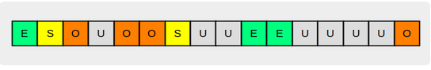

图上的 U 表示“未分配”区域。G1 将堆拆分成小的区域，一个最大的好处是可以做局部区域的垃圾回收，而不需要每次都回收整个区域比如年轻代和年老代，这样回收的停顿时间会比较短。具体的收集过程是：

- 将所有存活的对象将从收集的区域复制到未分配的区域，比如收集的区域是 Eden 空间，把 Eden 中的存活对象复制到未分配区域，这个未分配区域就成了 Survivor 空间。理想情况下，如果一个区域全是垃圾（意味着一个存活的对象都没有），则可以直接将该区域声明为“未分配”。

- 为了优化收集时间，G1 总是优先选择垃圾最多的区域，从而最大限度地减少后续分配和释放堆空间所需的工作量。这也是 G1 收集器名字的由来——Garbage-First。

### 2、GC 调优原则

GC 是有代价的，因此我们调优的根本原则是每一次 GC 都回收尽可能多的对象，也就是减少无用功。因此我们在做具体调优的时候，针对 CMS 和 G1 两种垃圾收集器，分别有一些相应的策略。

#### 1、CMS 收集器

对于 CMS 收集器来说，最重要的是`合理地设置年轻代和年老代的大小`。年轻代太小的话，会导致频繁的 Minor GC，并且很有可能存活期短的对象也不能被回收，GC 的效率就不高。而年老代太小的话，容纳不下从年轻代过来的新对象，会频繁触发单线程 Full GC，导致较长时间的 GC 暂停，影响 Web 应用的响应时间。

#### 2、G1 收集器

对于 G1 收集器来说，我不推荐直接设置年轻代的大小，这一点跟 CMS 收集器不一样，这是因为 G1 收集器会根据算法动态决定年轻代和年老代的大小。因此对于 G1 收集器，我们需要关心的是 Java 堆的总大小（-Xmx）。此外 G1 还有一个较关键的参数是-XX:MaxGCPauseMillis = n，这个参数是用来限制最大的 GC 暂停时间，目的是尽量不影响请求处理的响应时间。G1 将根据先前收集的信息以及检测到的垃圾量，估计它可以立即收集的最大区域数量，从而尽量保证 GC 时间不会超出这个限制。因此 G1 相对来说更加“智能”，使用起来更加简单。


### 3、内存调优实战

下面我通过一个例子实战一下 Java 堆设置得过小，导致频繁的 GC，我们将通过 GC 日志分析工具来观察 GC 活动并定位问题。

1. 首先我们建立一个 Spring Boot 程序，作为我们的调优对象，代码如下：

```java

@RestController
public class GcTestController {

    private Queue<Greeting> objCache =  new ConcurrentLinkedDeque<>();

    @RequestMapping("/greeting")
    public Greeting greeting() {
        Greeting greeting = new Greeting("Hello World!");

        if (objCache.size() >= 200000) {
            objCache.clear();
        } else {
            objCache.add(greeting);
        }
        return greeting;
    }
}

@Data
@AllArgsConstructor
class Greeting {
   private String message;
}

```

上面的代码就是创建了一个对象池，当对象池中的对象数到达 200000 时才清空一次，用来模拟年老代对象。

2. 用下面的命令启动测试程序：


java -Xmx32m -Xss256k -verbosegc -Xlog:gc*,gc+ref=debug,gc+heap=debug,gc+age=trace:file=gc-%p-%t.log:tags,uptime,time,level:filecount=2,filesize=100m -jar target/demo-0.0.1-SNAPSHOT.jar


我给程序设置的堆的大小为 32MB，目的是能让我们看到 Full GC。除此之外，我还打开了 verbosegc 日志，请注意这里我使用的版本是 Java 12，默认的垃圾收集器是 G1。

3. 使用 JMeter 压测工具向程序发送测试请求，访问的路径是/greeting。

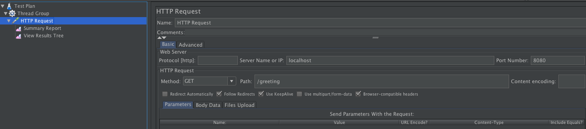

4. 使用 GCViewer 工具打开 GC 日志，我们可以看到这样的图：

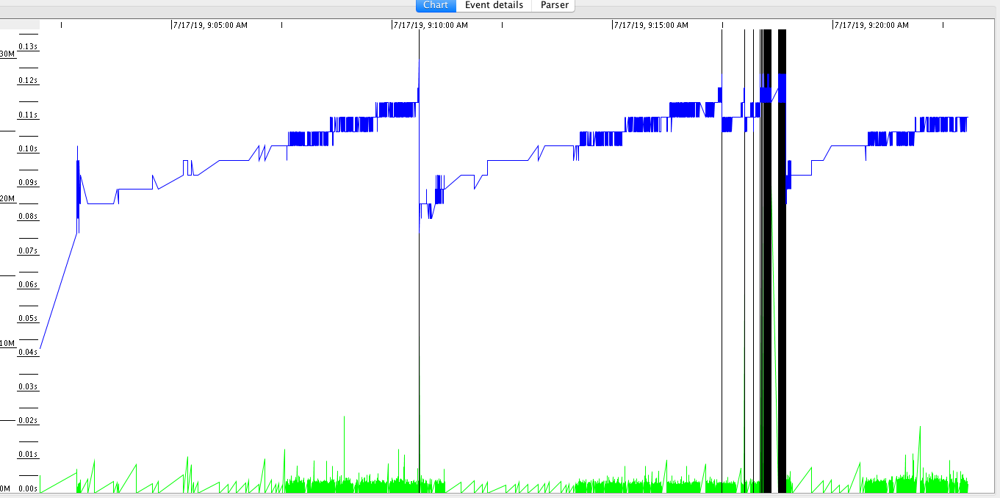

我来解释一下这张图：

- 图中上部的蓝线表示已使用堆的大小，我们看到它周期的上下震荡，这是我们的对象池要扩展到 200000 才会清空。

- 图底部的绿线表示年轻代 GC 活动，从图上看到当堆的使用率上去了，会触发频繁的 GC 活动。

- 图中的竖线表示 Full GC，从图上看到，伴随着 Full GC，蓝线会下降，这说明 Full GC 收集了年老代中的对象。

基于上面的分析，我们可以得出一个结论，那就是 Java 堆的大小不够。我来解释一下为什么得出这个结论：

- GC 活动频繁：年轻代 GC（绿色线）和年老代 GC（黑色线）都比较密集。这说明内存空间不够，也就是 Java 堆的大小不够。

- Java 的堆中对象在 GC 之后能够被回收，说明不是内存泄漏。

我们通过 GCViewer 还发现累计 GC 暂停时间有 55.57 秒，如下图所示：

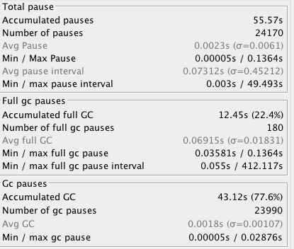


因此我们的解决方案是调大 Java 堆的大小，像下面这样：

java -Xmx2048m -Xss256k -verbosegc -Xlog:gc*,gc+ref=debug,gc+heap=debug,gc+age=trace:file=gc-%p-%t.log:tags,uptime,time,level:filecount=2,filesize=100m -jar target/demo-0.0.1-SNAPSHOT.jar


生成的新的 GC log 分析图如下：

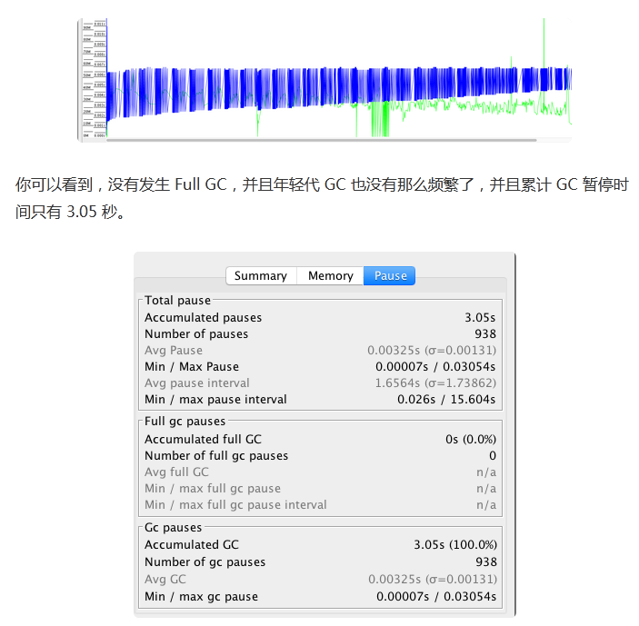


> 总结

今天我们首先回顾了 CMS 和 G1 两种垃圾收集器背后的设计思路以及它们的区别，接着分析了 GC 调优的总体原则。对于 CMS 来说，我们要合理设置年轻代和年老代的大小。你可能会问该如何确定它们的大小呢？这是一个迭代的过程，可以先采用 JVM 的默认值，然后通过压测分析 GC 日志。如果我们看年轻代的内存使用率处在高位，导致频繁的 Minor GC，而频繁 GC 的效率又不高，说明对象没那么快能被回收，这时年轻代可以适当调大一点。如果我们看年老代的内存使用率处在高位，导致频繁的 Full GC，这样分两种情况：如果每次 Full GC 后年老代的内存占用率没有下来，可以怀疑是内存泄漏；如果 Full GC 后年老代的内存占用率下来了，说明不是内存泄漏，我们要考虑调大年老代。对于 G1 收集器来说，我们可以适当调大 Java 堆，因为 G1 收集器采用了局部区域收集策略，单次垃圾收集的时间可控，可以管理较大的 Java 堆。

> 思考

如果把年轻代和年老代都设置得很大，会有什么问题？


## 2、如何监控Tomcat的性能？

在今天的文章里，我们首先来看看到底都需要监控 Tomcat 哪些关键指标，接着来具体学习如何通过 JConsole 来监控它们。如果系统没有暴露 JMX 接口，我们还可以通过命令行来查看 Tomcat 的性能指标。Web 应用的响应时间是我们关注的一个重点，最后我们通过一个实战案例，来看看 Web 应用的下游服务响应时间比较长的情况下，Tomcat 的各项指标是什么样子的。

### 1、Tomcat 的关键指标

Tomcat 的关键指标有吞吐量、响应时间、错误数、线程池、CPU 以及 JVM 内存。


我来简单介绍一下这些指标背后的意义。其中前三个指标是我们最关心的业务指标，Tomcat 作为服务器，就是要能够又快有好地处理请求，因此吞吐量要大、响应时间要短，并且错误数要少。

而后面三个指标是跟系统资源有关的，当某个资源出现瓶颈就会影响前面的业务指标，比如线程池中的线程数量不足会影响吞吐量和响应时间；但是线程数太多会耗费大量 CPU，也会影响吞吐量；当内存不足时会触发频繁地 GC，耗费 CPU，最后也会反映到业务指标上来。

那如何监控这些指标呢？Tomcat 可以通过 JMX 将上述指标暴露出来的。JMX（Java Management Extensions，即 Java 管理扩展）是一个为应用程序、设备、系统等植入监控管理功能的框架。JMX 使用管理 MBean 来监控业务资源，这些 MBean 在 JMX MBean 服务器上注册，代表 JVM 中运行的应用程序或服务。每个 MBean 都有一个属性列表。JMX 客户端可以连接到 MBean Server 来读写 MBean 的属性值。你可以通过下面这张图来理解一下 JMX 的工作原理：

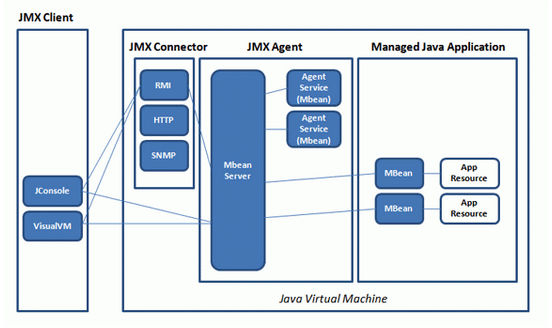


Tomcat 定义了一系列 MBean 来对外暴露系统状态，接下来我们来看看如何通过 JConsole 来监控这些指标。

### 2、通过 JConsole 监控 Tomcat

首先我们需要开启 JMX 的远程监听端口，具体来说就是设置若干 JVM 参数。我们可以在 Tomcat 的 bin 目录下新建一个名为setenv.sh的文件（或者setenv.bat，根据你的操作系统类型），然后输入下面的内容：

```java

export JAVA_OPTS="${JAVA_OPTS} -Dcom.sun.management.jmxremote"
export JAVA_OPTS="${JAVA_OPTS} -Dcom.sun.management.jmxremote.port=9001"
export JAVA_OPTS="${JAVA_OPTS} -Djava.rmi.server.hostname=x.x.x.x"
export JAVA_OPTS="${JAVA_OPTS} -Dcom.sun.management.jmxremote.ssl=false"
export JAVA_OPTS="${JAVA_OPTS} -Dcom.sun.management.jmxremote.authenticate=false"
```

重启 Tomcat，这样 JMX 的监听端口 9001 就开启了，接下来通过 JConsole 来连接这个端口。

jconsole x.x.x.x:9001

我们可以看到 JConsole 的主界面：

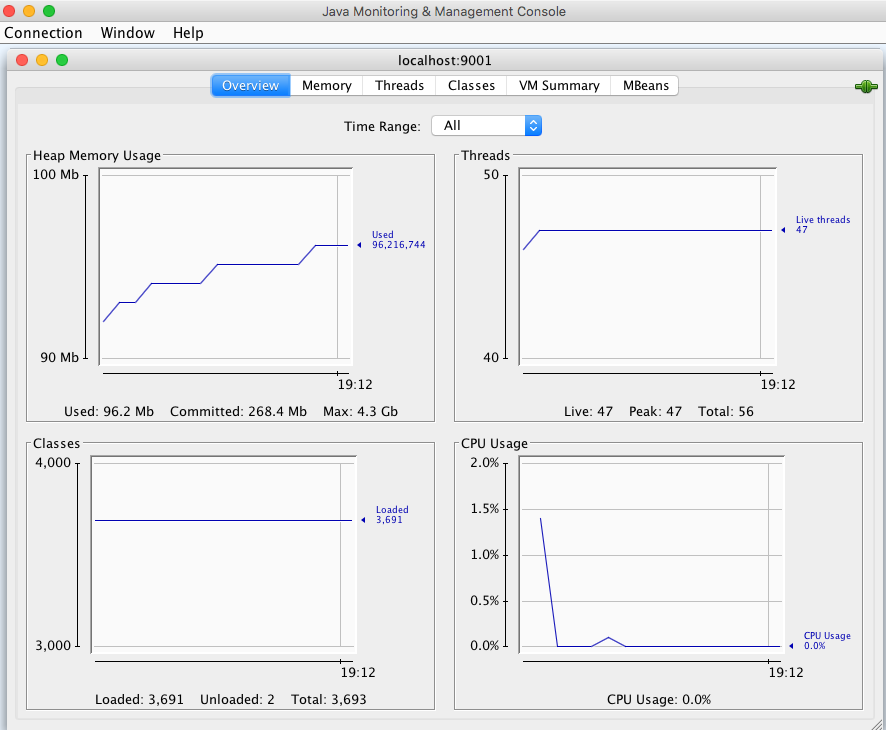

前面我提到的需要监控的关键指标有吞吐量、响应时间、错误数、线程池、CPU 以及 JVM 内存，接下来我们就来看看怎么在 JConsole 上找到这些指标。

#### 1、吞吐量、响应时间、错误数

在 MBeans 标签页下选择 GlobalRequestProcessor，这里有 Tomcat 请求处理的统计信息。你会看到 Tomcat 中的各种连接器，展开“http-nio-8080”，你会看到这个连接器上的统计信息，其中 maxTime 表示最长的响应时间，processingTime 表示平均响应时间，requestCount 表示吞吐量，errorCount 就是错误数。

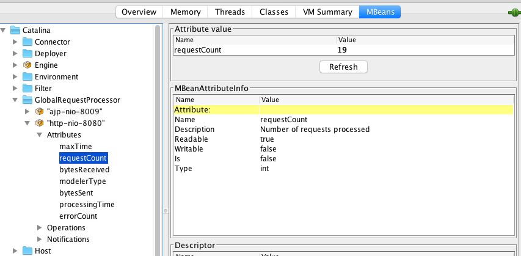

#### 2、线程池

选择“线程”标签页，可以看到当前 Tomcat 进程中有多少线程，如下图所示：

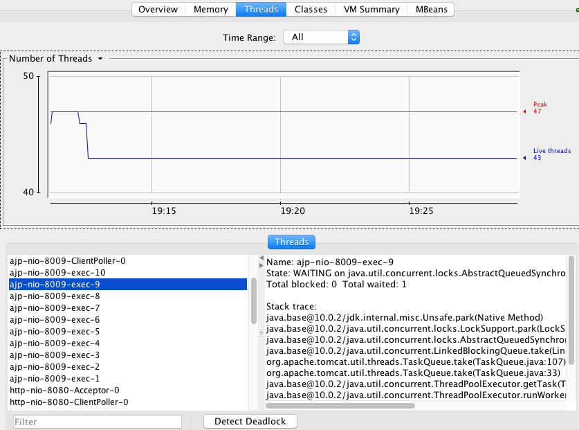

图的左下方是线程列表，右边是线程的运行栈，这些都是非常有用的信息。如果大量线程阻塞，通过观察线程栈，能看到线程阻塞在哪个函数，有可能是 I/O 等待，或者是死锁。

#### 3、CPU

在主界面可以找到 CPU 使用率指标，请注意这里的 CPU 使用率指的是 Tomcat 进程占用的 CPU，不是主机总的 CPU 使用率。


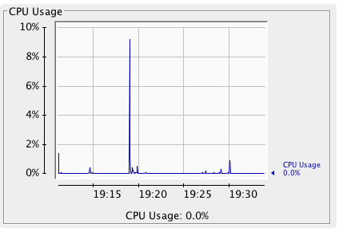


#### 4、JVM 内存

选择“内存”标签页，你能看到 Tomcat 进程的 JVM 内存使用情况。

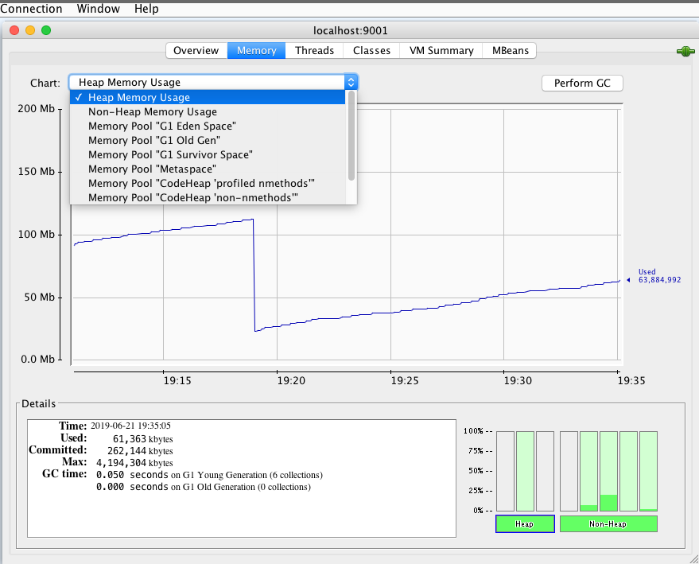

你还可以查看 JVM 各内存区域的使用情况，大的层面分堆区和非堆区。堆区里有分为 Eden、Survivor 和 Old。选择“VM Summary”标签，可以看到虚拟机内的详细信息。

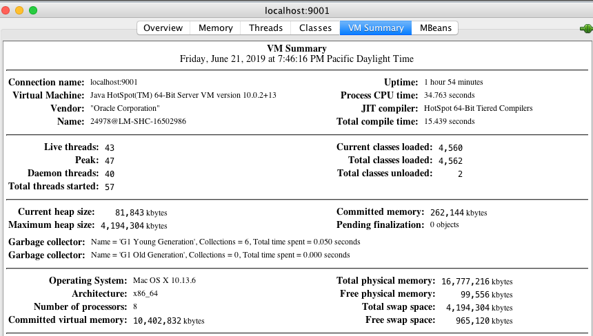


### 3、命令行查看 Tomcat 指标

极端情况下如果 Web 应用占用过多 CPU 或者内存，又或者程序中发生了死锁，导致 Web 应用对外没有响应，监控系统上看不到数据，这个时候需要我们登陆到目标机器，通过命令行来查看各种指标。

1. 首先我们通过 ps 命令找到 Tomcat 进程，拿到进程 ID。（ps -ef | grep tomcat）

2. 接着查看进程状态的大致信息，通过cat/proc//status命令：

3. 监控进程的 CPU 和内存资源使用情况：(top -p pid)

4. 查看 Tomcat 的网络连接，比如 Tomcat 在 8080 端口上监听连接请求，通过下面的命令查看连接列表：(netstat -na | grep 8080)

你还可以分别统计处在“已连接”状态和“TIME_WAIT”状态的连接数：

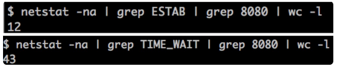

5. 通过 ifstat 来查看网络流量，大致可以看出 Tomcat 当前的请求数和负载状况。

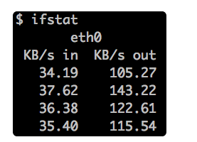


### 4、实战案例

在这个实战案例中，我们会创建一个 Web 应用，根据传入的参数 latency 来休眠相应的秒数，目的是模拟当前的 Web 应用在访问下游服务时遇到的延迟。然后用 JMeter 来压测这个服务，通过 JConsole 来观察 Tomcat 的各项指标，分析和定位问题。

主要的步骤有：

1. 创建一个 Spring Boot 程序，加入下面代码所示的一个 RestController：

```java

@RestController
public class DownStreamLatency {

    @RequestMapping("/greeting/latency/{seconds}")
    public Greeting greeting(@PathVariable long seconds) {

        try {
            Thread.sleep(seconds * 1000);
        } catch (InterruptedException e) {
            e.printStackTrace();
        }

        Greeting greeting = new Greeting("Hello World!");

        return greeting;
    }
}

```

从上面的代码我们看到，程序会读取 URL 传过来的 seconds 参数，先休眠相应的秒数，再返回请求。这样做的目的是，客户端压测工具能够控制服务端的延迟。为了方便观察 Tomcat 的线程数跟延迟之间的关系，还需要加大 Tomcat 的最大线程数，我们可以在application.properties文件中加入这样一行：

```
server.tomcat.max-threads=1000
server.tomcat.max-threads=1000
```

2. 启动 JMeter 开始压测，这里我们将压测的线程数设置为 100：

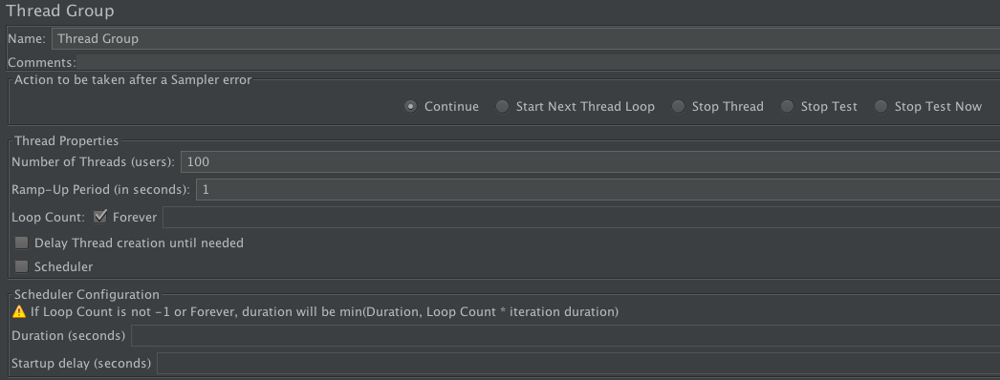

请你注意的是，我们还需要将客户端的 Timeout 设置为 1000 毫秒，这是因为 JMeter 的测试线程在收到响应之前，不会发出下一次请求，这就意味我们没法按照固定的吞吐量向服务端加压。而加了 Timeout 以后，JMeter 会有固定的吞吐量向 Tomcat 发送请求。


3. 开启测试，这里分三个阶段，第一个阶段将服务端休眠时间设为 2 秒，然后暂停一段时间。第二和第三阶段分别将休眠时间设置成 4 秒和 6 秒。

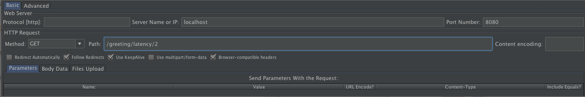

4. 最后我们通过 JConsole 来观察结果：

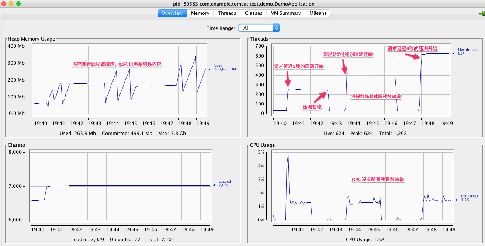


下面我们从线程数、内存和 CPU 这三个指标来分析 Tomcat 的性能问题。

- 首先看线程数，在第一阶段时间之前，线程数大概是 40，第一阶段压测开始后，线程数增长到 250。为什么是 250 呢？这是因为 JMeter 每秒会发出 100 个请求，每一个请求休眠 2 秒，因此 Tomcat 需要 200 个工作线程来干活；此外 Tomcat 还有一些其他线程用来处理网络通信和后台任务，所以总数是 250 左右。第一阶段压测暂停后，线程数又下降到 40，这是因为线程池会回收空闲线程。第二阶段测试开始后，线程数涨到了 420，这是因为每个请求休眠了 4 秒；同理，我们看到第三阶段测试的线程数是 620。

- 我们再来看 CPU，在三个阶段的测试中，CPU 的峰值始终比较稳定，这是因为 JMeter 控制了总体的吞吐量，因为服务端用来处理这些请求所需要消耗的 CPU 基本也是一样的。

- 各测试阶段的内存使用量略有增加，这是因为线程数增加了，创建线程也需要消耗内存。

从上面的测试结果我们可以得出一个结论：对于一个 Web 应用来说，下游服务的延迟越大，Tomcat 所需要的线程数越多，但是 CPU 保持稳定。所以如果你在实际工作碰到线程数飙升但是 CPU 没有增加的情况，这个时候你需要怀疑，你的 Web 应用所依赖的下游服务是不是出了问题，响应时间是否变长了。

> 总结

今天我们学习了 Tomcat 中的关键的性能指标以及如何监控这些指标：主要有吞吐量、响应时间、错误数、线程池、CPU 以及 JVM 内存。在实际工作中，我们需要通过观察这些指标来诊断系统遇到的性能问题，找到性能瓶颈。如果我们监控到 CPU 上升，这时我们可以看看吞吐量是不是也上升了，如果是那说明正常；如果不是的话，可以看看 GC 的活动，如果 GC 活动频繁，并且内存居高不下，基本可以断定是内存泄漏。

## 3、Tomcat I/O和线程池的并发调优

Tomcat 的调优涉及 I/O 模型和线程池调优、JVM 内存调优以及网络优化等，今天我们来聊聊 I/O 模型和线程池调优，由于 Web 应用程序跑在 Tomcat 的工作线程中，因此 Web 应用对请求的处理时间也直接影响 Tomcat 整体的性能，而 Tomcat 和 Web 应用在运行过程中所用到的资源都来自于操作系统，因此调优需要将服务端看作是一个整体来考虑。所谓的 I/O 调优指的是选择 NIO、NIO.2 还是 APR，而线程池调优指的是给 Tomcat 的线程池设置合适的参数，使得 Tomcat 能够又快又好地处理请求。

### 1、I/O 模型的选择

I/O 调优实际上是连接器类型的选择，一般情况下默认都是 NIO，在绝大多数情况下都是够用的，除非你的 Web 应用用到了 TLS 加密传输，而且对性能要求极高，这个时候可以考虑 APR，因为 APR 通过 OpenSSL 来处理 TLS 握手和加 / 解密。OpenSSL 本身用 C 语言实现，它还对 TLS 通信做了优化，所以性能比 Java 要高。

那你可能会问那什么时候考虑选择 NIO.2？我的建议是如果你的 Tomcat 跑在 Windows 平台上，并且 HTTP 请求的数据量比较大，可以考虑 NIO.2，这是因为 Windows 从操作系统层面实现了真正意义上的异步 I/O，如果传输的数据量比较大，异步 I/O 的效果就能显现出来。如果你的 Tomcat 跑在 Linux 平台上，建议使用 NIO，这是因为 Linux 内核没有很完善地支持异步 I/O 模型，因此 JVM 并没有采用原生的 Linux 异步 I/O，而是在应用层面通过 epoll 模拟了异步 I/O 模型，只是 Java NIO 的使用者感觉不到而已。因此可以这样理解，在 Linux 平台上，Java NIO 和 Java NIO.2 底层都是通过 epoll 来实现的，但是 Java NIO 更加简单高效。

### 2、线程池调优

跟 I/O 模型紧密相关的是线程池，线程池的调优就是设置合理的线程池参数。我们先来看看 Tomcat 线程池中有哪些关键参数：

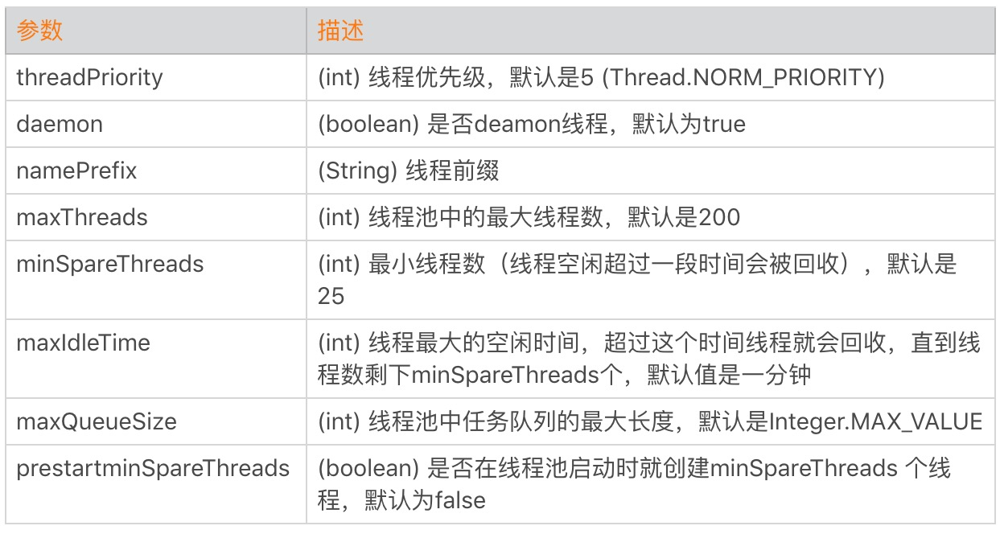

这里面最核心的就是如何确定 maxThreads 的值，如果这个参数设置小了，Tomcat 会发生线程饥饿，并且请求的处理会在队列中排队等待，导致响应时间变长；如果 maxThreads 参数值过大，同样也会有问题，因为服务器的 CPU 的核数有限，线程数太多会导致线程在 CPU 上来回切换，耗费大量的切换开销。那 maxThreads 设置成多少才算是合适呢？为了理解清楚这个问题，我们先来看看什么是利特尔法则（Little’s Law）。系统中的请求数 = 请求的到达速率 × 每个请求处理时间。

其实这个公式很好理解，我举个我们身边的例子：我们去超市购物结账需要排队，但是你是如何估算一个队列有多长呢？队列中如果每个人都买很多东西，那么结账的时间就越长，队列也会越长；同理，短时间一下有很多人来收银台结账，队列也会变长。因此队列的长度等于新人加入队列的频率乘以平均每个人处理的时间。

计算出了队列的长度，那么我们就创建相应数量的线程来处理请求，这样既能以最快的速度处理完所有请求，同时又没有额外的线程资源闲置和浪费。

假设一个单核服务器在接收请求：

- 如果每秒 10 个请求到达，平均处理一个请求需要 1 秒，那么服务器任何时候都有 10 个请求在处理，即需要 10 个线程。

- 如果每秒 10 个请求到达，平均处理一个请求需要 2 秒，那么服务器在每个时刻都有 20 个请求在处理，因此需要 20 个线程。

- 如果每秒 10000 个请求到达，平均处理一个请求需要 1 秒，那么服务器在每个时刻都有 10000 个请求在处理，因此需要 10000 个线程。

因此可以总结出一个公式：`线程池大小 = 每秒请求数 × 平均请求处理时间`

这是理想的情况，也就是说线程一直在忙着干活，没有被阻塞在 I/O 等待上。实际上任务在执行中，线程不可避免会发生阻塞，比如阻塞在 I/O 等待上，等待数据库或者下游服务的数据返回，虽然通过非阻塞 I/O 模型可以减少线程的等待，但是数据在用户空间和内核空间拷贝过程中，线程还是阻塞的。线程一阻塞就会让出 CPU，线程闲置下来，就好像工作人员不可能 24 小时不间断地处理客户的请求，解决办法就是增加工作人员的数量，一个人去休息另一个人再顶上。对应到线程池就是增加线程数量，因此 I/O 密集型应用需要设置更多的线程。

至此我们又得到一个线程池个数的计算公式，假设服务器是单核的：`线程池大小 = （线程 I/O 阻塞时间 + 线程 CPU 时间 ）/ 线程 CPU 时间`,其中：线程 I/O 阻塞时间 + 线程 CPU 时间 = 平均请求处理时间

对比一下两个公式，你会发现，平均请求处理时间在两个公式里都出现了，这说明请求时间越长，需要更多的线程是毫无疑问的。

同的是第一个公式是用每秒请求数来乘以请求处理时间；而第二个公式用请求处理时间来除以线程 CPU 时间，请注意 CPU 时间是小于请求处理时间的。

虽然这两个公式是从不同的角度来看待问题的，但都是理想情况，都有一定的前提条件。

- 1、请求处理时间越长，需要的线程数越多，但前提是 CPU 核数要足够，如果一个 CPU 来支撑 10000 TPS 并发，创建 10000 个线程，显然不合理，会造成大量线程上下文切换。

- 2、请求处理过程中，I/O 等待时间越长，需要的线程数越多，前提是 CUP 时间和 I/O 时间的比率要计算的足够准确。

- 3、请求进来的速率越快，需要的线程数越多，前提是 CPU 核数也要跟上。

### 3、实际场景下如何确定线程数

那么在实际情况下，线程池的个数如何确定呢？这是一个迭代的过程，先用上面两个公式大概算出理想的线程数，再反复压测调整，从而达到最优。

一般来说，如果系统的 TPS 要求足够大，用第一个公式算出来的线程数往往会比公式二算出来的要大。我建议选取这两个值中间更靠近公式二的值。也就是先设置一个较小的线程数，然后进行压测，当达到系统极限时（错误数增加，或者响应时间大幅增加），再逐步加大线程数，当增加到某个值，再增加线程数也无济于事，甚至 TPS 反而下降，那这个值可以认为是最佳线程数。

线程池中其他的参数，最好就用默认值，能不改就不改，除非在压测的过程发现了瓶颈。如果发现了问题就需要调整，比如 maxQueueSize，如果大量任务来不及处理都堆积在 maxQueueSize 中，会导致内存耗尽，这个时候就需要给 maxQueueSize 设一个限制。当然，这是一个比较极端的情况了。

再比如 minSpareThreads 参数，默认是 25 个线程，如果你发现系统在闲的时候用不到 25 个线程，就可以调小一点；如果系统在大部分时间都比较忙，线程池中的线程总是远远多于 25 个，这个时候你就可以把这个参数调大一点，因为这样线程池就不需要反复地创建和销毁线程了。

> 总结

今天我们学习了 I/O 调优，也就是如何选择连接器的类型，以及在选择过程中有哪些需要注意的地方。后面还聊到 Tomcat 线程池的各种参数，其中最重要的参数是最大线程数 maxThreads。理论上我们可以通过利特尔法则或者 CPU 时间与 I/O 时间的比率，计算出一个理想值，这个值只具有指导意义，因为它受到各种资源的限制，实际场景中，我们需要在理想值的基础上进行压测，来获得最佳线程数。

> 思考

其实调优很多时候都是在找系统瓶颈，假如有个状况：系统响应比较慢，但 CPU 的用率不高，内存有所增加，通过分析 Heap Dump 发现大量请求堆积在线程池的队列中，请问这种情况下应该怎么办呢？


## 4、Tomcat内存溢出的原因分析及调优

JVM 在抛出 java.lang.OutOfMemoryError 时，除了会打印出一行描述信息，还会打印堆栈跟踪，因此我们可以通过这些信息来找到导致异常的原因。在寻找原因前，我们先来看看有哪些因素会导致 OutOfMemoryError，其中内存泄漏是导致 OutOfMemoryError 的一个比较常见的原因，最后我们通过一个实战案例来定位内存泄漏。


### 1、java.lang.OutOfMemoryError: Java heap space

JVM 无法在堆中分配对象时，会抛出这个异常，导致这个异常的原因可能有三种：

- 1、内存泄漏。Java 应用程序一直持有 Java 对象的引用，导致对象无法被 GC 回收，比如对象池和内存池中的对象无法被 GC 回收。

- 2、配置问题。有可能是我们通过 JVM 参数指定的堆大小（或者未指定的默认大小），对于应用程序来说是不够的。解决办法是通过 JVM 参数加大堆的大小。

- 3、finalize 方法的过度使用。如果我们想在 Java 类实例被 GC 之前执行一些逻辑，比如清理对象持有的资源，可以在 Java 类中定义 finalize 方法，这样 JVM GC 不会立即回收这些对象实例，而是将对象实例添加到一个叫“java.lang.ref.Finalizer.ReferenceQueue”的队列中，执行对象的 finalize 方法，之后才会回收这些对象。Finalizer 线程会和主线程竞争 CPU 资源，但由于优先级低，所以处理速度跟不上主线程创建对象的速度，因此 ReferenceQueue 队列中的对象就越来越多，最终会抛出 OutOfMemoryError。解决办法是尽量不要给 Java 类定义 finalize 方法。


### 2、java.lang.OutOfMemoryError: GC overhead limit exceeded

出现这种 OutOfMemoryError 的原因是，垃圾收集器一直在运行，但是 GC 效率很低，比如 Java 进程花费超过 98％的 CPU 时间来进行一次 GC，但是回收的内存少于 2％的 JVM 堆，并且连续 5 次 GC 都是这种情况，就会抛出 OutOfMemoryError。解决办法是查看 GC 日志或者生成 Heap Dump，确认一下是不是内存泄漏，如果不是内存泄漏可以考虑增加 Java 堆的大小。当然你还可以通过参数配置来告诉 JVM 无论如何也不要抛出这个异常，方法是配置-XX:-UseGCOverheadLimit，但是我并不推荐这么做，因为这只是延迟了 OutOfMemoryError 的出现。

### 3、java.lang.OutOfMemoryError: Requested array size exceeds VM limit

从错误消息我们也能猜到，抛出这种异常的原因是“请求的数组大小超过 JVM 限制”，应用程序尝试分配一个超大的数组。比如应用程序尝试分配 512MB 的数组，但最大堆大小为 256MB，则将抛出 OutOfMemoryError，并且请求的数组大小超过 VM 限制。通常这也是一个配置问题（JVM 堆太小），或者是应用程序的一个 Bug，比如程序错误地计算了数组的大小，导致尝试创建一个大小为 1GB 的数组。


### 4、java.lang.OutOfMemoryError: MetaSpace

如果 JVM 的元空间用尽，则会抛出这个异常。我们知道 JVM 元空间的内存在本地内存中分配，但是它的大小受参数 MaxMetaSpaceSize 的限制。当元空间大小超过 MaxMetaSpaceSize 时，JVM 将抛出带有 MetaSpace 字样的 OutOfMemoryError。解决办法是加大 MaxMetaSpaceSize 参数的值。

### 5、java.lang.OutOfMemoryError: Request size bytes for reason. Out of swap space

当本地堆内存分配失败或者本地内存快要耗尽时，Java HotSpot VM 代码会抛出这个异常，VM 会触发“致命错误处理机制”，它会生成“致命错误”日志文件，其中包含崩溃时线程、进程和操作系统的有用信息。如果碰到此类型的 OutOfMemoryError，你需要根据 JVM 抛出的错误信息来进行诊断；或者使用操作系统提供的 DTrace 工具来跟踪系统调用，看看是什么样的程序代码在不断地分配本地内存。

### 6、java.lang.OutOfMemoryError: Unable to create native threads

抛出这个异常的过程大概是这样的：

- 1、Java 程序向 JVM 请求创建一个新的 Java 线程。

- 2、JVM 本地代码（Native Code）代理该请求，通过调用操作系统 API 去创建一个操作系统级别的线程 Native Thread。

- 3、操作系统尝试创建一个新的 Native Thread，需要同时分配一些内存给该线程，每一个 Native Thread 都有一个线程栈，线程栈的大小由 JVM 参数-Xss决定。

- 4、由于各种原因，操作系统创建新的线程可能会失败，下面会详细谈到。

- 5、JVM 抛出“java.lang.OutOfMemoryError: Unable to create new native thread”错误。

因此关键在于第四步线程创建失败，JVM 就会抛出 OutOfMemoryError，那具体有哪些因素会导致线程创建失败呢？

1.内存大小限制：我前面提到，Java 创建一个线程需要消耗一定的栈空间，并通过-Xss参数指定。请你注意的是栈空间如果过小，可能会导致 StackOverflowError，尤其是在递归调用的情况下；但是栈空间过大会占用过多内存，而对于一个 32 位 Java 应用来说，用户进程空间是 4GB，内核占用 1GB，那么用户空间就剩下 3GB，因此它能创建的线程数大致可以通过这个公式算出来：


Max memory（3GB） = [-Xmx] + [-XX:MaxMetaSpaceSize] + number_of_threads * [-Xss]

不过对于 64 位的应用，由于虚拟进程空间近乎无限大，因此不会因为线程栈过大而耗尽虚拟地址空间。但是请你注意，64 位的 Java 进程能分配的最大内存数仍然受物理内存大小的限制。

2.ulimit 限制，在 Linux 下执行ulimit -a，你会看到 ulimit 对各种资源的限制。

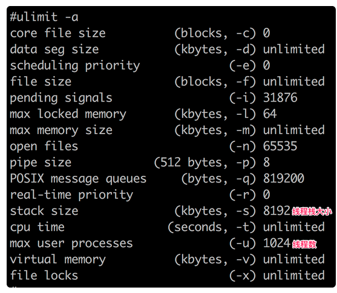

其中的“max user processes”就是一个进程能创建的最大线程数，我们可以修改这个参数：

ulimt -u 65535

3.参数sys.kernel.threads-max限制。这个参数限制操作系统全局的线程数，通过下面的命令可以查看它的值。

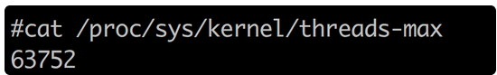

这表明当前系统能创建的总的线程是 63752。当然我们调整这个参数，具体办法是：在/etc/sysctl.conf配置文件中，加入sys.kernel.threads-max = 999999。

4.参数sys.kernel.pid_max限制，这个参数表示系统全局的 PID 号数值的限制，每一个线程都有 ID，ID 的值超过这个数，线程就会创建失败。跟sys.kernel.threads-max参数一样，我们也可以将sys.kernel.pid_max调大，方法是在/etc/sysctl.conf配置文件中，加入sys.kernel.pid_max = 999999。

对于线程创建失败的 OutOfMemoryError，除了调整各种参数，我们还需要从程序本身找找原因，看看是否真的需要这么多线程，有可能是程序的 Bug 导致创建过多的线程。


### 7、内存泄漏定位实战

我们先创建一个 Web 应用，不断地 new 新对象放到一个 List 中，来模拟 Web 应用中的内存泄漏。然后通过各种工具来观察 GC 的行为，最后通过生成 Heap Dump 来找到泄漏点。内存泄漏模拟程序比较简单，创建一个 Spring Boot 应用，定义如下所示的类：

```java

import org.springframework.scheduling.annotation.Scheduled;
import org.springframework.stereotype.Component;

import java.util.LinkedList;
import java.util.List;

@Component
public class MemLeaker {

    private List<Object> objs = new LinkedList<>();

    @Scheduled(fixedRate = 1000)
    public void run() {

        for (int i = 0; i < 50000; i++) {
            objs.add(new Object());
        }
    }
}
```

这个程序做的事情就是每隔 1 秒向一个 List 中添加 50000 个对象。接下来运行并通过工具观察它的 GC 行为：

1.运行程序并打开 verbosegc，将 GC 的日志输出到 gc.log 文件中。


java -verbose:gc -Xloggc:gc.log -XX:+PrintGCDetails -jar mem-0.0.1-SNAPSHOT.jar


2.使用jstat命令观察 GC 的过程：

jstat -gc 94223 2000 1000

94223 是程序的进程 ID，2000 表示每隔 2 秒执行一次，1000 表示持续执行 1000 次。下面是命令的输出：

- S0C：第一个 Survivor 区总的大小；
- S1C：第二个 Survivor 区总的大小；
- S0U：第一个 Survivor 区已使用内存的大小；
- S1U：第二个 Survivor 区已使用内存的大小。

后面的列相信从名字你也能猜出是什么意思了，其中 E 代表 Eden，O 代表 Old，M 代表 Metadata；YGC 表示 Minor GC 的总时间，YGCT 表示 Minor GC 的次数；FGC 表示 Full GC。通过这个工具，你能大概看到各个内存区域的大小、已经 GC 的次数和所花的时间。verbosegc 参数对程序的影响比较小，因此很适合在生产环境现场使用。

3.通过 GCViewer 工具查看 GC 日志，用 GCViewer 打开第一步产生的 gc.log，会看到这样的图：

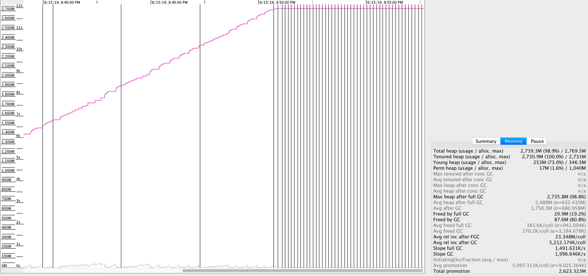

图中红色的线表示年老代占用的内存，你会看到它一直在增加，而黑色的竖线表示一次 Full GC。你可以看到后期 JVM 在频繁地 Full GC，但是年老代的内存并没有降下来，这是典型的内存泄漏的特征。除了内存泄漏，我们还可以通过 GCViewer 来观察 Minor GC 和 Full GC 的频次，已及每次的内存回收量。


4.为了找到内存泄漏点，我们通过 jmap 工具生成 Heap Dump：

jmap -dump:live,format=b,file=94223.bin 94223

5.用 Eclipse Memory Analyzer 打开 Dump 文件，通过内存泄漏分析，得到这样一个分析报告：

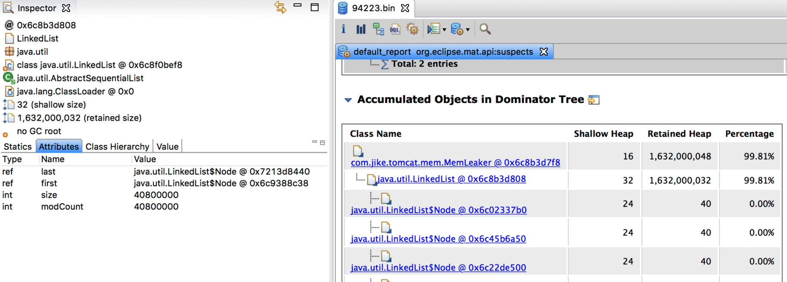

从报告中可以看到，JVM 内存中有一个长度为 4000 万的 List，至此我们也就找到了泄漏点。


## 5、Tomcat拒绝连接原因分析及网络优化

先讲讲 Java Socket 网络编程常见的异常有哪些，然后通过一个实验来重现其中的 Connection reset 异常，并且通过配置 Tomcat 的参数来解决这个问题。

### 1、常见异常

- java.net.SocketTimeoutException指超时错误。超时分为连接超时和读取超时，连接超时是指在调用 Socket.connect 方法的时候超时，而读取超时是调用 Socket.read 方法时超时。请你注意的是，连接超时往往是由于网络不稳定造成的，但是读取超时不一定是网络延迟造成的，很有可能是下游服务的响应时间过长。

- java.net.BindException: Address already in use: JVM_Bind指端口被占用。当服务器端调用 new ServerSocket(port) 或者 Socket.bind 函数时，如果端口已经被占用，就会抛出这个异常。我们可以用netstat –an命令来查看端口被谁占用了，换一个没有被占用的端口就能解决。


- java.net.ConnectException: Connection refused: connect指连接被拒绝。当客户端调用 new Socket(ip, port) 或者 Socket.connect 函数时，可能会抛出这个异常。原因是指定 IP 地址的机器没有找到；或者是机器存在，但这个机器上没有开启指定的监听端口。解决办法是从客户端机器 ping 一下服务端 IP，假如 ping 不通，可以看看 IP 是不是写错了；假如能 ping 通，需要确认服务端的服务是不是崩溃了。

- java.net.SocketException: Socket is closed指连接已关闭。出现这个异常的原因是通信的一方主动关闭了 Socket 连接（调用了 Socket 的 close 方法），接着又对 Socket 连接进行了读写操作，这时操作系统会报“Socket 连接已关闭”的错误。

- java.net.SocketException: Connection reset/Connect reset by peer: Socket write error指连接被重置。这里有两种情况，分别对应两种错误：第一种情况是通信的一方已经将 Socket 关闭，可能是主动关闭或者是因为异常退出，这时如果通信的另一方还在写数据，就会触发这个异常（Connect reset by peer）；如果对方还在尝试从 TCP 连接中读数据，则会抛出 Connection reset 异常。为了避免这些异常发生，在编写网络通信程序时要确保：程序退出前要主动关闭所有的网络连接。检测通信的另一方的关闭连接操作，当发现另一方关闭连接后自己也要关闭该连接。

- java.net.SocketException: Broken pipe指通信管道已坏。发生这个异常的场景是，通信的一方在收到“Connect reset by peer: Socket write error”后，如果再继续写数据则会抛出 Broken pipe 异常，解决方法同上。

- java.net.SocketException: Too many open files指进程打开文件句柄数超过限制。当并发用户数比较大时，服务器可能会报这个异常。这是因为每创建一个 Socket 连接就需要一个文件句柄，此外服务端程序在处理请求时可能也需要打开一些文件。你可以通过lsof -p pid命令查看进程打开了哪些文件，是不是有资源泄露，也就是说进程打开的这些文件本应该被关闭，但由于程序的 Bug 而没有被关闭。如果没有资源泄露，可以通过设置增加最大文件句柄数。具体方法是通过ulimit -a来查看系统目前资源限制，通过ulimit -n 10240修改最大文件数。


### 2、Tomcat 网络参数

接下来我们看看 Tomcat 两个比较关键的参数：maxConnections 和 acceptCount。在解释这个参数之前，先简单回顾下 TCP 连接的建立过程：客户端向服务端发送 SYN 包，服务端回复 SYN＋ACK，同时将这个处于 SYN_RECV 状态的连接保存到半连接队列。客户端返回 ACK 包完成三次握手，服务端将 ESTABLISHED 状态的连接移入 accept 队列，等待应用程序（Tomcat）调用 accept 方法将连接取走。这里涉及两个队列：

- 半连接队列：保存 SYN_RECV 状态的连接。队列长度由net.ipv4.tcp_max_syn_backlog设置。

- accept 队列：保存 ESTABLISHED 状态的连接。队列长度为min(net.core.somaxconn，backlog)。其中 backlog 是我们创建 ServerSocket 时指定的参数，最终会传递给 listen 方法：int listen(int sockfd, int backlog);

如果我们设置的 backlog 大于net.core.somaxconn，accept 队列的长度将被设置为net.core.somaxconn，而这个 backlog 参数就是 Tomcat 中的 acceptCount 参数，默认值是 100，但请注意net.core.somaxconn的默认值是 128。你可以想象在高并发情况下当 Tomcat 来不及处理新的连接时，这些连接都被堆积在 accept 队列中，而 acceptCount 参数可以控制 accept 队列的长度，超过这个长度时，内核会向客户端发送 RST，这样客户端会触发上文提到的“Connection reset”异常。

而 Tomcat 中的 maxConnections 是指 Tomcat 在任意时刻接收和处理的最大连接数。当 Tomcat 接收的连接数达到 maxConnections 时，Acceptor 线程不会再从 accept 队列中取走连接，这时 accept 队列中的连接会越积越多。

maxConnections 的默认值与连接器类型有关：NIO 的默认值是 10000，APR 默认是 8192。

所以你会发现 Tomcat 的最大并发连接数等于 maxConnections + acceptCount。如果 acceptCount 设置得过大，请求等待时间会比较长；如果 acceptCount 设置过小，高并发情况下，客户端会立即触发 Connection reset 异常。


### 3、Tomcat 网络调优实战

接下来我们通过一个直观的例子来加深对上面两个参数的理解。我们先重现流量高峰时 accept 队列堆积的情况，这样会导致客户端触发“Connection reset”异常，然后通过调整参数解决这个问题。主要步骤有：

1. 下载和安装压测工具JMeter。解压后打开，我们需要创建一个测试计划、一个线程组、一个请求和，如下图所示。

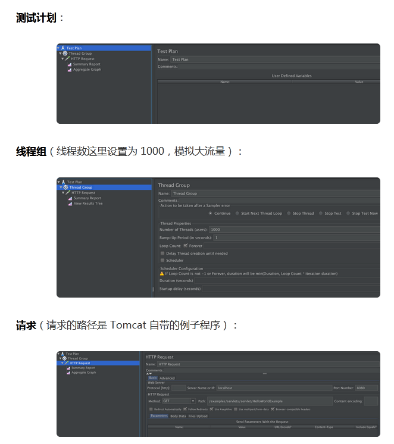

2. 启动 Tomcat。

3. 开启 JMeter 测试，在 View Results Tree 中会看到大量失败的请求，请求的响应里有“Connection reset”异常，也就是前面提到的，当 accept 队列溢出时，服务端的内核发送了 RST 给客户端，使得客户端抛出了这个异常。

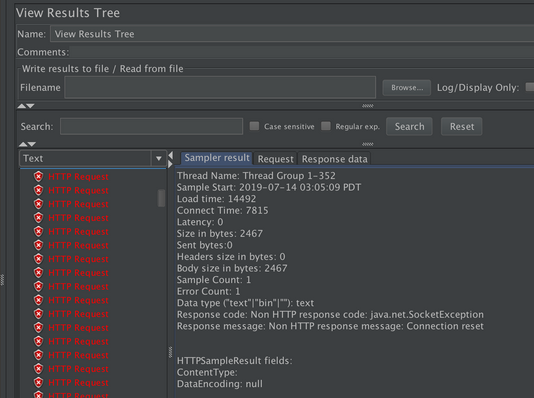

4. 修改内核参数，在/etc/sysctl.conf中增加一行net.core.somaxconn=2048，然后执行命令sysctl -p。

5. 修改 Tomcat 参数 acceptCount 为 2048，重启 Tomcat。

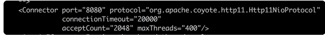

6. 再次启动 JMeter 测试，这一次所有的请求会成功，也看不到异常了。我们可以通过下面的命令看到系统中 ESTABLISHED 的连接数增大了，这是因为我们加大了 accept 队列的长度。

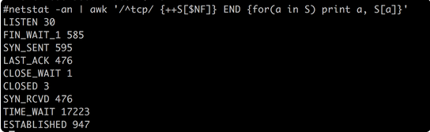

> 总结

在 Socket 网络通信过程中，我们不可避免地会碰到各种 Java 异常，了解这些异常产生的原因非常关键，通过这些信息我们大概知道问题出在哪里，如果一时找不到问题代码，我们还可以通过网络抓包工具来分析数据包。在这个基础上，我们还分析了 Tomcat 中两个比较重要的参数：acceptCount 和 maxConnections。acceptCount 用来控制内核的 TCP 连接队列长度，maxConnections 用于控制 Tomcat 层面的最大连接数。在实战环节，我们通过调整 acceptCount 和相关的内核参数somaxconn，增加了系统的并发度。

> 思考

在上面的实验中，我们通过netstat命令发现有大量的 TCP 连接处在 TIME_WAIT 状态，请问这是为什么？它可能会带来什么样的问题呢？


## 6、Tomcat进程占用CPU过高怎么办？

在性能优化这个主题里，前面我们聊过了 Tomcat 的内存问题和网络相关的问题，接下来我们看一下 CPU 的问题。CPU 资源经常会成为系统性能的一个瓶颈，这其中的原因是多方面的，可能是内存泄露导致频繁 GC，进而引起 CPU 使用率过高；又可能是代码中的 Bug 创建了大量的线程，导致 CPU 上下文切换开销。今天我们就来聊聊 Tomcat 进程的 CPU 使用率过高怎么办，以及怎样一步一步找到问题的根因。

### 1、Java 进程 CPU 使用率高”的解决思路是什么

通常我们所说的 CPU 使用率过高，这里面其实隐含着一个用来比较高与低的基准值，比如 JVM 在峰值负载下的平均 CPU 利用率为 40％，如果 CPU 使用率飙到 80% 就可以被认为是不正常的。典型的 JVM 进程包含多个 Java 线程，其中一些在等待工作，另一些则正在执行任务。在单个 Java 程序的情况下，线程数可以非常低，而对于处理大量并发事务的互联网后台来说，线程数可能会比较高。

对于 CPU 的问题，最重要的是要找到是`哪些线程在消耗 CPU`，通过线程栈定位到问题代码；如果没有找到个别线程的 CPU 使用率特别高，我们要怀疑到是不是`线程上下文切换`导致了 CPU 使用率过高。下面我们通过一个实例来学习 CPU 问题定位的过程。


### 2、定位高 CPU 使用率的线程和代码

1. 写一个模拟程序来模拟 CPU 使用率过高的问题，这个程序会在线程池中创建 4096 个线程。代码如下：

```java

@SpringBootApplication
@EnableScheduling
public class DemoApplication {

   //创建线程池，其中有4096个线程。
   private ExecutorService executor = Executors.newFixedThreadPool(4096);
   //全局变量，访问它需要加锁。
   private int count;
   
   //以固定的速率向线程池中加入任务
   @Scheduled(fixedRate = 10)
   public void lockContention() {
      IntStream.range(0, 1000000)
            .forEach(i -> executor.submit(this::incrementSync));
   }
   
   //具体任务，就是将count数加一
   private synchronized void incrementSync() {
      count = (count + 1) % 10000000;
   }
   
   public static void main(String[] args) {
      SpringApplication.run(DemoApplication.class, args);
   }

}
```

2. 在 Linux 环境下启动程序： 

java -Xss256k -jar demo-0.0.1-SNAPSHOT.jar

请注意，这里我将线程栈大小指定为 256KB。对于测试程序来说，操作系统默认值 8192KB 过大，因为我们需要创建 4096 个线程。

3. 使用 top 命令，我们看到 Java 进程的 CPU 使用率达到了 262.3%，注意到进程 ID 是 4361。

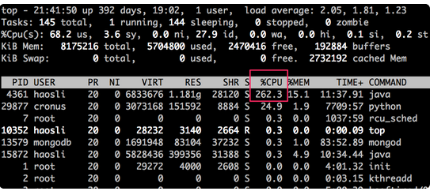

4. 接着我们用更精细化的 top 命令查看这个 Java 进程中各线程使用 CPU 的情况：

top -H -p 4361

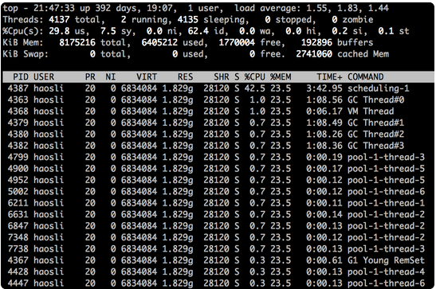

从图上我们可以看到，有个叫“scheduling-1”的线程占用了较多的 CPU，达到了 42.5%。因此下一步我们要找出这个线程在做什么事情。

5. 为了找出线程在做什么事情，我们需要用 jstack 命令生成线程快照，具体方法是：
jstack 4361

jstack 的输出比较大，你可以将输出写入文件：jstack 4361 > 4361.log

然后我们打开 4361.log，定位到第 4 步中找到的名为“scheduling-1”的线程，发现它的线程栈如下：

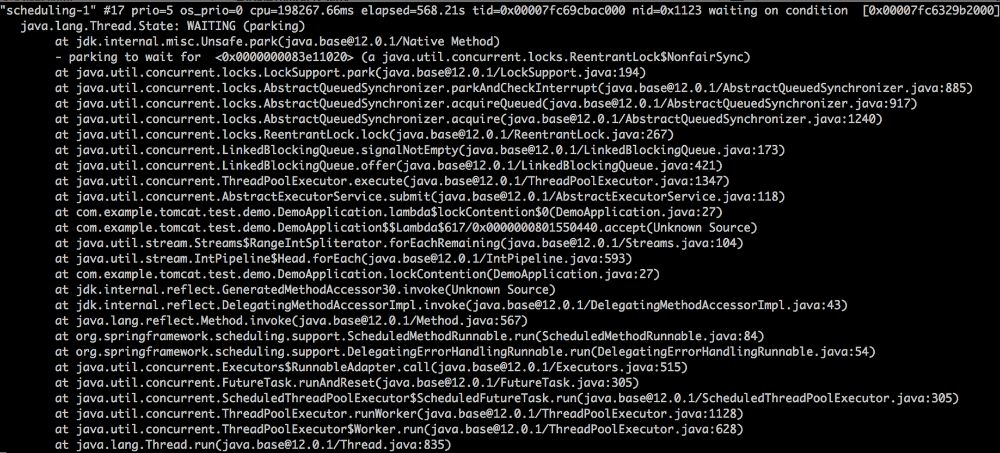

从线程栈中我们看到了AbstractExecutorService.submit这个函数调用，说明它是 Spring Boot 启动的周期性任务线程，向线程池中提交任务，这个线程消耗了大量 CPU。

### 3、进一步分析上下文切换开销

一般来说，通过上面的过程，我们就能定位到大量消耗 CPU 的线程以及有问题的代码，比如死循环。但是对于这个实例的问题，你是否发现这样一个情况：Java 进程占用的 CPU 是 262.3%， 而“scheduling-1”线程只占用了 42.5% 的 CPU，那还有将近 220% 的 CPU 被谁占用了呢？不知道你注意到没有，我们在第 4 步用top -H -p 4361命令看到的线程列表中还有许多名为“pool-1-thread-x”的线程，它们单个的 CPU 使用率不高，但是似乎数量比较多。你可能已经猜到，这些就是线程池中干活的线程。那剩下的 220% 的 CPU 是不是被这些线程消耗了呢？要弄清楚这个问题，我们还需要看 jstack 的输出结果，主要是看这些线程池中的线程是不是真的在干活，还是在“休息”呢？

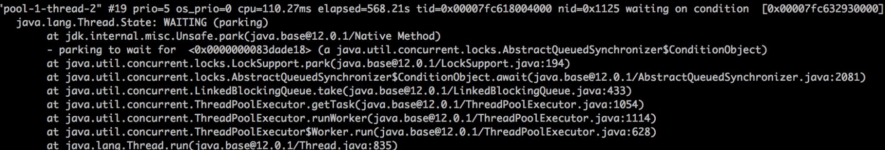

通过上面的图我们发现这些“pool-1-thread-x”线程基本都处于 WAITING 的状态，那什么是 WAITING 状态呢？或者说 Java 线程都有哪些状态呢？你可以通过下面的图来理解一下：

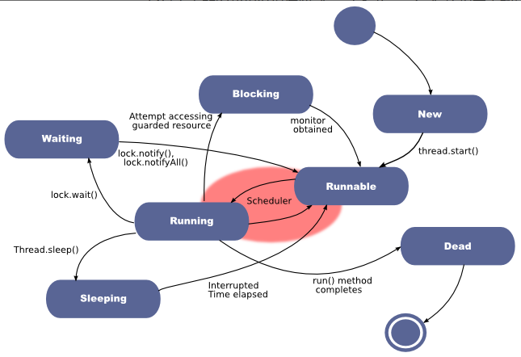

从图上我们看到“Blocking”和“Waiting”是两个不同的状态，我们要注意它们的区别：

- Blocking 指的是一个线程因为等待临界区的锁（Lock 或者 synchronized 关键字）而被阻塞的状态，请你注意的是处于这个状态的线程还没有拿到锁。

- Waiting 指的是一个线程拿到了锁，但是需要等待其他线程执行某些操作。比如调用了 Object.wait、Thread.join 或者 LockSupport.park 方法时，进入 Waiting 状态。前提是这个线程已经拿到锁了，并且在进入 Waiting 状态前，操作系统层面会自动释放锁，当等待条件满足，外部调用了 Object.notify 或者 LockSupport.unpark 方法，线程会重新竞争锁，成功获得锁后才能进入到 Runnable 状态继续执行。

回到我们的“pool-1-thread-x”线程，这些线程都处在“Waiting”状态，从线程栈我们看到，这些线程“等待”在 getTask 方法调用上，线程尝试从线程池的队列中取任务，但是队列为空，所以通过 LockSupport.park 调用进到了“Waiting”状态。那“pool-1-thread-x”线程有多少个呢？通过下面这个命令来统计一下，结果是 4096，正好跟线程池中的线程数相等。

你可能好奇了，那剩下的 220% 的 CPU 到底被谁消耗了呢？分析到这里，我们应该怀疑 CPU 的上下文切换开销了，因为我们看到 Java 进程中的线程数比较多。下面我们通过 vmstat 命令来查看一下操作系统层面的线程上下文切换活动：

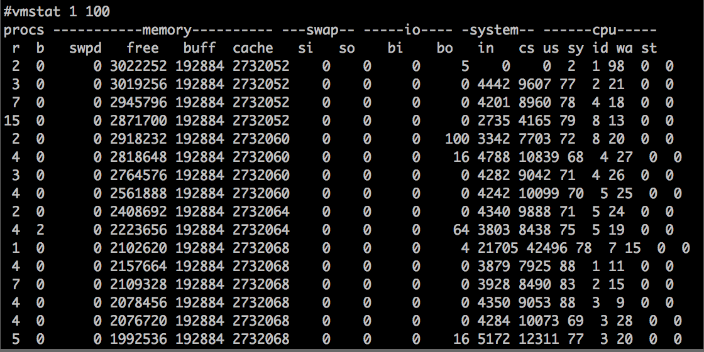

如果你还不太熟悉 vmstat，可以在这里学习如何使用 vmstat 和查看结果。其中 cs 那一栏表示线程上下文切换次数，in 表示 CPU 中断次数，我们发现这两个数字非常高，基本证实了我们的猜测，线程上下文切切换消耗了大量 CPU。那么问题来了，具体是哪个进程导致的呢？

我们停止 Spring Boot 测试程序，再次运行 vmstat 命令，会看到 in 和 cs 都大幅下降了，这样就证实了引起线程上下文切换开销的 Java 进程正是 4361。

> 总结

当我们遇到 CPU 过高的问题时，首先要定位是哪个进程的导致的，之后可以通过top -H -p pid命令定位到具体的线程。其次还要通 jstack 查看线程的状态，看看线程的个数或者线程的状态，如果线程数过多，可以怀疑是线程上下文切换的开销，我们可以通过 vmstat 和 pidstat 这两个工具进行确认。


## 7、谈谈Jetty性能调优的思路


## 8、Tomcat和Jetty有哪些不同？


# 源码解析


Tomcat的功能：

- http服务器：socket通信（tcp/ip），解析http报文
- servlet容器：多个servlet实例进行业务的处理


配置文件的结构：


备注：servlet和wrapper一一对应。


Tomcat套娃设计模式的好处：

- 一层套一层的方式，组件之间的关系清晰、便于组件生命周期的管理；
- 架构设计和xml配置文件标签结构类似；
- 便于子容器继承父容器的属性；


Tomcat启动过程


初始化阶段：


启动阶段：


备注：acceptor线程接收请求，poller线程用来判断是否有channel数据到来。


servlet处理链路


备注：poller线程是处理逻辑的入口


mapper组件结构封装（基于请求路径找到对应的处理servlet）


疑问：mapper什么时候初始化的？standardservice中进行初始化的。


# Tomcat的层次结构总结

Server--->Service--->[Connector1,ConnectorN,Engine[Host[Context1，ContextN]]]

- 
- 
- 
- 
- 
- 


# 1、一个\conf\server.xml

```xml
<?xml version="1.0" encoding="UTF-8"?>
<Server port="8005" shutdown="SHUTDOWN">
  <Listener className="org.apache.catalina.startup.VersionLoggerListener"/>
  <Listener SSLEngine="on" className="org.apache.catalina.core.AprLifecycleListener"/>
  <Listener className="org.apache.catalina.core.JasperListener"/>

  <Listener className="org.apache.catalina.core.JreMemoryLeakPreventionListener"/>
  <Listener className="org.apache.catalina.mbeans.GlobalResourcesLifecycleListener"/>
  <Listener className="org.apache.catalina.core.ThreadLocalLeakPreventionListener"/>
  
  <GlobalNamingResources>    
    <Resource auth="Container" description="User database that can be updated and saved" factory="org.apache.catalina.users.MemoryUserDatabaseFactory" name="UserDatabase" pathname="conf/tomcat-users.xml" type="org.apache.catalina.UserDatabase"/>
  </GlobalNamingResources>
  
  <Service name="Catalina">
    <!--The connectors can use a shared executor, you can define one or more named thread pools-->
    <!--
    <Executor name="tomcatThreadPool" namePrefix="catalina-exec-"
        maxThreads="150" minSpareThreads="4"/>
    -->
   
    <Connector connectionTimeout="20000" port="8080" protocol="HTTP/1.1" redirectPort="8443"/>
    <Connector port="8009" protocol="AJP/1.3" redirectPort="8443"/>
    <Engine defaultHost="localhost" name="Catalina">
      
      <Realm className="org.apache.catalina.realm.LockOutRealm">
        
        <Realm className="org.apache.catalina.realm.UserDatabaseRealm" resourceName="UserDatabase"/>
      </Realm>
      <Host appBase="webapps" autoDeploy="true" name="localhost" unpackWARs="true">
        
        <Valve className="org.apache.catalina.valves.AccessLogValve" directory="logs" pattern="%h %l %u %t &quot;%r&quot; %s %b" prefix="localhost_access_log." suffix=".txt"/>
      <Context docBase="didi" path="/didi" reloadable="true" source="org.eclipse.jst.jee.server:didi"/>
      </Host>
    </Engine>
  </Service>
</Server>

```

从上面的配置我们中，位于配置文件顶层的是Server和Service元素，其中Server元素是整个配置文件的根元素，而Service元素则是配置服务器的核心元素。在Service元素内部，定义了一系列的连接器和内部容器类的组件。

## 1.1、Server

<Server>元素对应的是整个Servlet容器，是整个配置的顶层元素，由org.apache.catalina.Server接口来定义，默认的实现类是org.apache.catalina.core.StandardServer。该元素可配置的属性主要是port和shutdown，分别指的是监听shutdown命令的端口和命令。在该元素中可以定义一个或多个<Service>元素，除此以外还可以定义一些全局的资源或监听器。

## 1.2 Service

<Service>元素由org.apache.catalina.Service接口定义，默认的实现类为org.apache.catalina.core.StandardService。在该元素中可以定义一个<Engine>元素、一个或多个<Connector>元素，这些<Connector>元素共享同一个<Engine>元素来进行请求的处理。

## 1.3、Connector

< Connector >元素由org.apache.catalina.connector.Connector类来定义。< Connector>是接受客户端浏览器请求并向用户最终返回响应结果的组件。该元素位于< Service>元素中，可以定义多个，在我们的示例中配置了两个，分别接受AJP请求和HTTP请求，在配置中，需要为其制定服务的协议和端口号。

## 1.4 、Engine

<Engine>元素由org.apache.catalina.Engine元素来定义，默认的实现类是org.apache.catalina.core.StandardEngine。<Engine>元素会用来处理<Service>中所有<Connector>接收到的请求，在<Engine>中可以定义多个<Host>元素作为虚拟主机。<Engine>是Tomcat配置中第一个实现org.apache.catalina.Container的接口，因此可以在其中定义一系列的子元素如<Realm>、<Valve>。

## 1.5、Host

<Host>元素由org.apache.catalina.Host接口来定义，默认实现为org.apache.catalina.core.StandardHost，
该元素定义在<Engine>中，可以定义多个。每个<Host>元素定义了一个虚拟主机，它可以包含一个或多个Web应用（通过<Context>元素来进行定义）。因为<Host>也是容器类元素，所以可以在其中定义子元素如<Realm>、<Valve>。

## 1.6、Context
 <Context>元素由org.apache.catalina.Context接口来定义，默认实现类为org.apache.catalina.core.StandardContext。
 该元素也许是大家用的最多的元素，在其中定义的是Web应用。一个<Host>中可以定义多个<Context>元素，分别对应不同的Web应用。该元素的属性，大家经常会用到如path、reloadable等，可以在<Context>中定义子元素如<Realm>、<Valve>。


# 2、Tomcat的核心组件就两个Connector和Container

从顶层开始：

- Server是Tomcat的最顶层元素，是service的集合，即可包含多个service，Server控制整个Tomcat的生命周期。

- Service由一个Container和多个Connector组成（或者说由Connector，Engine和线程池[可选]组成），形成一个独立完整的处理单元，对外提供服务。一般情况下我们并不需要配置多个Service,conf/server.xml默认配置了一个“Catalina”的<Service>。Tomcat将Engine，Host，Context，Wrapper统一抽象成Container。

Connector接受到请求后，会将请求交给Container，Container处理完了之后将结果返回给ConnectorConnector 组件是 Tomcat 中两个核心组件之一，它的主要任务是负责接收浏览器的发过来的 tcp 连接请求，创建一个 Request 和 Response 对象分别用于和请求端交换数据，然后会产生一个线程来处理这个请求并把产生的 Request 和 Response 
对象传给处理这个请求的线程，处理这个请求的线程就是 Container 组件要做的事了。

- Engine：没有父容器，一个 Engine代表一个完整的 Servlet 引擎，它接收来自Connector的请求，并决定传给哪个Host来处理，Host处理完请求后，将结果返回给Engine，Engine再将结果返回给Connector。

- Host：Engine可以包含多个Host，每个Host代表一个虚拟主机，这个虚拟主机的作用就是运行多个应用，它负责安装和展开这些应用，并且标识这个应用以便能够区分它们，每个虚拟主机对应的一个域名，不同Host容器接受处理对应不同域名的请求。

- Context：Host可以包含多个Context，Context是Servlet规范的实现，它提供了Servlet的基本环境，一个Context代表一个运行在Host上的Web应用

- Wrapper: Context可以包含多个Wrapper, Wrapper 代表一个 Servlet，它负责管理一个 Servlet，包括的 Servlet 的装载、初始化、执行以及资源回收。Wrapper 是最底层的容器，它没有子容器了，所以调用它的 addChild 将会报错。

# 3、Tomcat Server处理一个http请求的过程

假设来自客户的请求为：http://localhost:8080/wsota/wsota_index.jsp
- 1) 请求被发送到本机端口8080，被在那里侦听的CoyoteHTTP/1.1 Connector获得

- 2) Connector把该请求交给它所在的Service的Engine来处理，并等待来自Engine的回应

- 3) Engine获得请求localhost/wsota/wsota_index.jsp，匹配它所拥有的所有虚拟主机Host

- 4) Engine匹配到名为localhost的Host（即使匹配不到也把请求交给该Host处理，因为该Host被定义为该Engine的默认主机）

- 5) localhost Host获得请求/wsota/wsota_index.jsp，匹配它所拥有的所有Context

- 6) Host匹配到路径为/wsota的Context（如果匹配不到就把该请求交给路径名为""的Context去处理）

- 7) path="/wsota"的Context获得请求/wsota_index.jsp，在它的mapping table中寻找对应的servlet

- 8) Context匹配到URLPATTERN为*.jsp的servlet，对应于JspServlet类

- 9) 构造HttpServletRequest对象和HttpServletResponse对象，作为参数调用JspServlet的doGet或doPost方法

- 10) Context把执行完了之后的HttpServletResponse对象返回给Host

- 11) Host把HttpServletResponse对象返回给Engine

- 12) Engine把HttpServletResponse对象返回给Connector

- 13) Connector把HttpServletResponse对象返回给客户browser


> Context的部署配置文件web.xml的说明

一个Context对应于一个Web App，每个Web App是由一个或者多个servlet组成的
当一个Web App被初始化的时候，它将用自己的ClassLoader对象载入“部署配置文件web.xml”中定义的每个servlet类
它首先载入在$CATALINA_HOME/conf/web.xml中部署的servlet类
然后载入在自己的Web App根目录下的WEB-INF/web.xml中部署的servlet类
web.xml文件有两部分：servlet类定义和servlet映射定义
每个被载入的servlet类都有一个名字，且被填入该Context的映射表(mappingtable)中，和某种URLPATTERN对应
当该Context获得请求时，将查询mappingtable，找到被请求的servlet，并执行以获得请求回应
分析一下所有的Context共享的web.xml文件，在其中定义的servlet被所有的Web App载入


## 4、Tomcat的类加载机制
在Tomcat的代码实现中，为了优化内存空间以及不同应用间的类隔离，Tomcat通过内置的一些类加载器来完成了这些功能。
在Java语言中，ClassLoader是以父子关系存在的，Java本身也有一定的类加载规范。在Tomcat中基本的ClassLoader层级关系如下图所示：
<div align="center">  </div><br>

Tomcat启动的时候，会初始化图示所示的类加载器。而上面的三个类加载器：
CommonClassLoader、CatalinaClassLoader和SharedClassLoader是与具体部署的Web应用无关的，
而WebappClassLoader则对应Web应用，每个Web应用都会有独立的类加载器，从而实现类的隔离。

在每个Web应用初始化的时候，StandardContext对象代表每个Web应用，它会使用WebappLoader类来加载Web应用，
而WebappLoader中会初始化org.apache.catalina.loader.WebappClassLoader来为每个Web应用创建单独的类加载器，
当处理请求时，容器会根据请求的地址解析出由哪个Web应用来进行对应的处理，进而将当前线程的类加载器设置为请求Web应用的类加载器。


standEngine, StandHost, StandContext及StandWrapper是容器，他们之间有互相的包含关系。
例如，StandEngine是StandHost的父容器，StandHost是StandEngine的子容器。在StandService内还包含一个Executor及Connector。
1） Executor是线程池，它的具体实现是java的concurrent包实现的executor，这个不是必须的，如果没有配置，则使用自写的worker thread线程池
2） Connector是网络socket相关接口模块，它包含两个对象，ProtocolHandler及Adapter
- ProtocolHandler是接收socket请求，并将其解析成HTTP请求对象，可以配置成nio模式或者传统io模式
- Adapter是处理HTTP请求对象，它就是从StandEngine的valve一直调用到StandWrapper的valve

详细情况如图所示：
 <div align="center">  </div><br>

-  Wrapper封装了具体的访问资源，例如 index.html
- Context 封装了各个wrapper资源的集合，例如 app
- Host 封装了各个context资源的集合，例如 www.mydomain.com


按照领域模型，这个典型的URL访问，可以解析出三层领域对象，他们之间互有隶属关系。这是最基本的建模。
从上面的分析可以看出，从wrapper到host是层层递进，层层组合。那么host 资源的集合是什么呢，就是上面所说的engine。 
如果说以上的三个容器可以看成是物理模型的封装，那么engine可以看成是一种逻辑的封装。 
好了，有了这一整套engine的支持，我们已经可以完成从engine到host到context再到某个特定wrapper的定位，
然后进行业务逻辑的处理了(关于怎么处理业务逻辑，会在之后的blog中讲述)。

就好比，一个酒店已经完成了各个客房等硬件设施的建设与装修，接下来就是前台接待工作了。 
先说线程池，这是典型的线程池的应用。首先从线程池中取出一个可用线程（如果有的话），来处理请求，这个组件就是connector。
它就像酒店的前台服务员登记客人信息办理入住一样，主要完成了HTTP消息的解析，根据tomcat内部的mapping规则，
完成从engine到host到context再到某个特定wrapper的定位，进行业务处理，然后将返回结果返回。
之后，此次处理结束，线程重新回到线程池中，为下一次请求提供服务。 
如果线程池中没有空闲线程可用，则请求被阻塞，一直等待有空闲线程进行处理，直至阻塞超时。
线程池的实现有executor及worker thread两种。缺省的是worker thread 模式。 
至此，可以说一个酒店有了前台接待，有了房间等硬件设施，就可以开始正式运营了。
那么把engine，处理线程池，connector封装在一起，形成了一个完整独立的处理单元，这就是service，就好比某个独立的酒店。 
通常，我们经常看见某某集团旗下酒店。也就是说，每个品牌有多个酒店同时运营。就好比tomcat中有多个service在独自运行。
那么这多个service的集合就是server，就好比是酒店所属的集团。 


作用域 
那为什么要按层次分别封装一个对象呢？这主要是为了方便统一管理。类似命名空间的概念，在不同层次的配置，其作用域不一样。
以tomcat自带的打印request与response消息的RequestDumperValve为例。这个valve的类路径是： 
org.apache.catalina.valves.RequestDumperValve

valve机制是tomcat非常重要的处理逻辑的机制，会在相关文档里专门描述。 如果这个valve配置在server.xml的节点下，
则其只打印出访问这个app(my)的request与response消息。 
```xml
<Host name="localhost" appBase="webapps"  
          unpackWARs="true" autoDeploy="true"  
          xmlValidation="false" xmlNamespaceAware="false">  
             <Context path="/my" docBase=" /usr/local/tomcat/backup/my" >  
                    <Valve className="org.apache.catalina.valves.RequestDumperValve"/>  
              </Context>  
              <Context path="/my2" docBase=" /usr/local/tomcat/backup/my" >  
              </Context>  
  </Host>  
```


如果这个valve配置在server.xml的节点下，则其可以打印出访问这个host下两个app的request与response消息。 
```xml
<Host name="localhost" appBase="webapps"  
               unpackWARs="true" autoDeploy="true"  
                xmlValidation="false" xmlNamespaceAware="false">  
                    <Valve className="org.apache.catalina.valves.RequestDumperValve"/>  
                    <Context path="/my" docBase=" /usr/local/tomcat/backup/my" >  
                    </Context>  
                    <Context path="/my2" docBase=" /usr/local/tomcat/backup/my" >   
                    </Context>  
 </Host>  
```

在这里贴一个缺省的server.xml的配置，通过这些配置可以加深对tomcat核心架构分层模块的理解， 
```xml
 <Server port="8005" shutdown="SHUTDOWN">  
          <Listener className="org.apache.catalina.core.AprLifecycleListener" SSLEngine="on" />  
          <Listener className="org.apache.catalina.core.JasperListener" />   
          <Listener className="org.apache.catalina.mbeans.ServerLifecycleListener" />  
          <Listener className="org.apache.catalina.mbeans.GlobalResourcesLifecycleListener" />  
          <GlobalNamingResources>  
               <Resource name="UserDatabase" auth="Container"  
                       type="org.apache.catalina.UserDatabase"  
                      description="User database that can be updated and saved"  
                      factory="org.apache.catalina.users.MemoryUserDatabaseFactory"  
                      pathname="conf/tomcat-users.xml" />   
           </GlobalNamingResources>  
           <Service name="Catalina">  
                <Executor name="tomcatThreadPool" namePrefix="catalina-exec-"   
                      maxThreads="150" minSpareThreads="4"/>  
                <Connector port="80" protocol="HTTP/1.1"   
                      connectionTimeout="20000"   
                      redirectPort="7443" />  
                <Connector port="7009" protocol="AJP/1.3" redirectPort="7443" />  
                <Engine name="Catalina" defaultHost="localhost">  
                     <Realm className="org.apache.catalina.realm.UserDatabaseRealm"  
                            resourceName="UserDatabase"/>  
                     <Host name="localhost" appBase="webapps"  
                            unpackWARs="true" autoDeploy="true"  
                            xmlValidation="false" xmlNamespaceAware="false">  
                            <Context path="/my" docBase="/usr/local/tomcat/backup/my" >  
                            </Context>   
                     </Host>   
                 </Engine>  
             </Service>  
</Server>  
```


## 5、Tomcat总体架构

-  面向组件架构
-  基于JMX
-  事件侦听

1）面向组件架构
tomcat代码看似很庞大，但从结构上看却很清晰和简单，它主要由一堆组件组成，如Server、Service、Connector等，并基于JMX管理这些组件，
另外实现以上接口的组件也实现了代表生存期的接口Lifecycle，使其组件履行固定的生存期，在其整个生存期的过程中通过事件侦听LifecycleEvent实现扩展。
Tomcat的核心类图如下所示：
<div align="center">  </div><br>

Catalina：与开始/关闭shell脚本交互的主类，因此如果要研究启动和关闭的过程，就从这个类开始看起。
Server：是整个Tomcat组件的容器，包含一个或多个Service。
Service：Service是包含Connector和Container的集合，Service用适当的Connector接收用户的请求，再发给相应的Container来处理。
Connector：实现某一协议的连接器，如默认的有实现HTTP、HTTPS、AJP协议的。
Container：可以理解为处理某类型请求的容器，处理的方式一般为把处理请求的处理器包装为Valve对象，并按一定顺序放入类型为Pipeline的管道里。Container有多种子类型：Engine、Host、Context和Wrapper，这几种子类型Container依次包含，处理不同粒度的请求。另外Container里包含一些基础服务，如Loader、Manager和Realm。
Engine：Engine包含Host和Context，接到请求后仍给相应的Host在相应的Context里处理。
Host：就是我们所理解的虚拟主机。
Context：就是我们所部属的具体Web应用的上下文，每个请求都在是相应的上下文里处理的。
Wrapper：Wrapper是针对每个Servlet的Container，每个Servlet都有相应的Wrapper来管理。
可以看出Server、Service、Connector、Container、Engine、Host、Context和Wrapper这些核心组件的作用范围是逐层递减，并逐层包含。
下面就是些被Container所用的基础组件：
Loader：是被Container用来载入各种所需的Class。
Manager：是被Container用来管理Session池。
Realm：是用来处理安全里授权与认证。
分析完核心类后，再看看Tomcat启动的过程，Tomcat启动的时序图如下所示：
<div align="center">  </div><br>

从上图可以看出，Tomcat启动分为init和start两个过程，核心组件都实现了Lifecycle接口，都需实现start方法，
因此在start过程中就是从Server开始逐层调用子组件的start过程。[模板方法？？？]

2）基于JMX
Tomcat会为每个组件进行注册过程，通过Registry管理起来，而Registry是基于JMX来实现的，
因此在看组件的init和start过程实际上就是初始化MBean和触发MBean的start方法，会大量看到形如：
Registry.getRegistry(null, null).invoke(mbeans, "init", false);
Registry.getRegistry(null, null).invoke(mbeans, "start", false);
这样的代码，这实际上就是通过JMX管理各种组件的行为和生命期。

备注：
JMX（Java Management Extensions，即Java管理扩展）是一个为应用程序、设备、系统等植入管理功能的框架。JMX可以跨越一系列异构操作系统平台、
系统体系结构和网络传输协议，灵活的开发无缝集成的系统、网络和服务管理应用。

3）事件侦听
各个组件在其生命期中会有各种各样行为，而这些行为都有触发相应的事件，Tomcat就是通过侦听这些时间达到对这些行为进行扩展的目的。
在看组件的init和start过程中会看到大量如：
lifecycle.fireLifecycleEvent(AFTER_START_EVENT, null);这样的代码，这就是对某一类型事件的触发，如果你想在其中加入自己的行为，
就只用注册相应类型的事件即可。


protocol
我们发现这个类里面有很多与protocol有关的属性和方法，tomcat中支持两种协议的连接器：HTTP/1.1与AJP/1.3，
查看tomcat的配置文件server.xml可以看到如下配置：

- <Connector port="8080" protocol="HTTP/1.1"
-                connectionTimeout="20000"
-                redirectPort="8443" URIEncoding="utf-8"/>
-
- <Connector port="8009" protocol="AJP/1.3" redirectPort="8443" />

HTTP/1.1协议负责建立HTTP连接，web应用通过浏览器访问tomcat服务器用的就是这个连接器，默认监听的是8080端口；
AJP/1.3协议负责和其他HTTP服务器建立连接，监听的是8009端口，比如tomcat和apache或者iis集成时需要用到这个连接器。
协议上有三种不同的实现方式：JIO、APR、NIO。
JIO(Java.io)：用java.io纯JAVA编写的TCP模块，这是tomcat默认连接器实现方法；
APR(Apache Portable Runtime)：有C语言和JAVA两种语言实现，连接Apache httpd Web服务器的类库是在C中实现的，同时用APR进行网络通信；
NIO(java.nio)：这是用纯Java编写的连接器(Conector)的一种可选方法。该实现用java.nio核心Java网络类以提供非阻塞的TCP包特性。


# 参考

- [java-nio系列文章](http://ifeve.com/java-nio-all/)

- [devcenter-embedded-tomcat](https://github.com/heroku/devcenter-embedded-tomcat)
