Tomcat结构解析

<!-- TOC -->

- [4、Tomcat通用组件](#4tomcat通用组件)
    - [1、Logger组件：Tomcat的日志框架及实战](#1logger组件tomcat的日志框架及实战)
    - [2、Manager组件：Tomcat的Session管理机制解析](#2manager组件tomcat的session管理机制解析)
    - [3、Cluster组件：Tomcat的集群通信原理](#3cluster组件tomcat的集群通信原理)
- [6、源码解析](#6源码解析)
- [参考](#参考)

<!-- /TOC -->

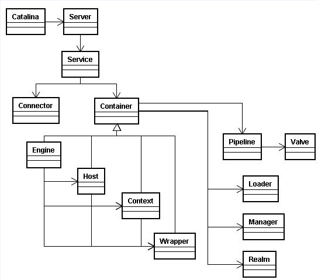

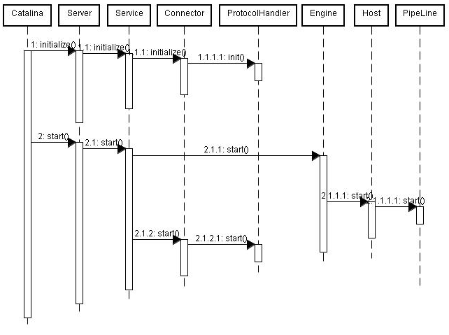

# 4、Tomcat通用组件

## 1、Logger组件：Tomcat的日志框架及实战
## 2、Manager组件：Tomcat的Session管理机制解析
## 3、Cluster组件：Tomcat的集群通信原理

# 6、源码解析

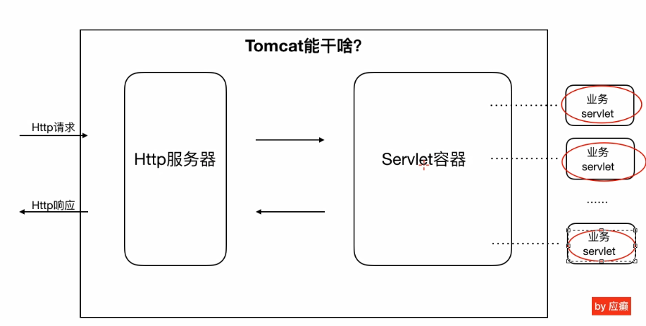

Tomcat的功能：

- http服务器：socket通信（tcp/ip），解析http报文
- servlet容器：多个servlet实例进行业务的处理

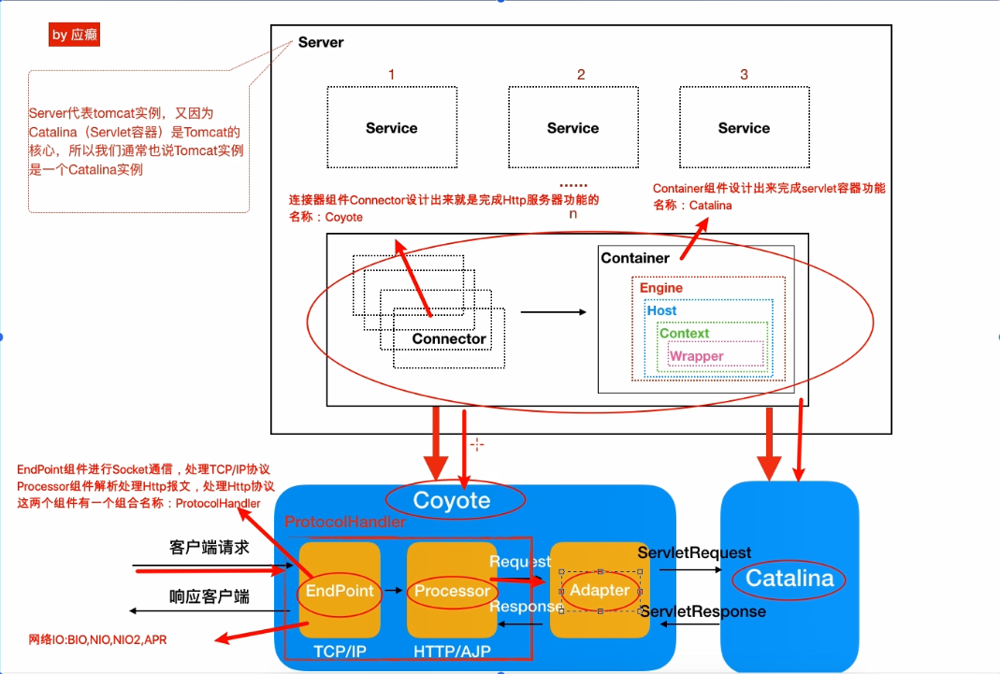

配置文件的结构：

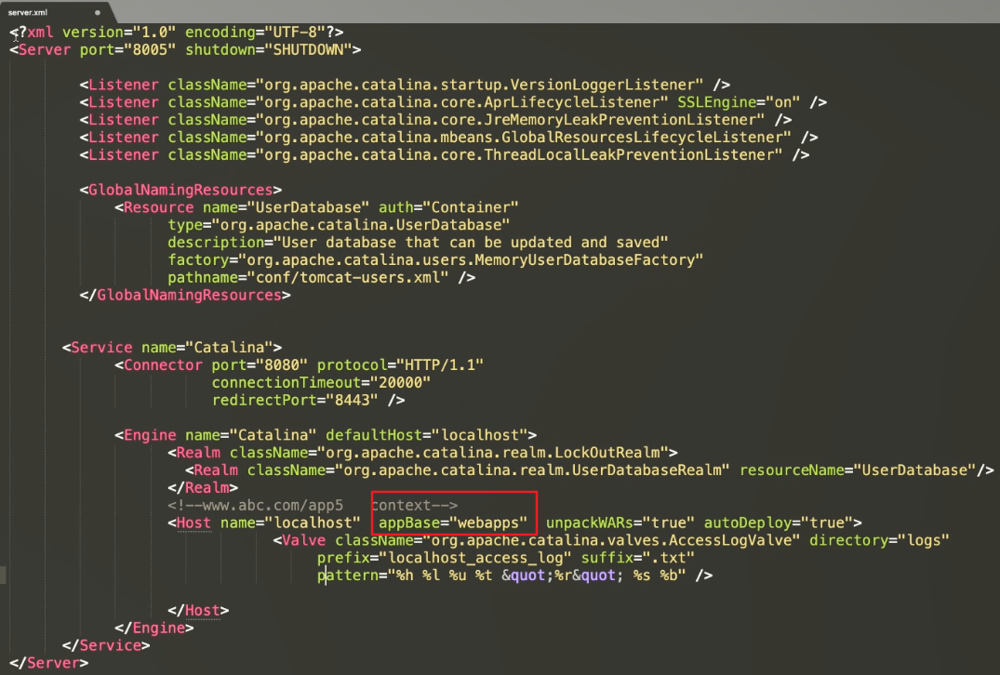

备注：servlet和wrapper一一对应。

Tomcat套娃设计模式的好处：

- 一层套一层的方式，组件之间的关系清晰、便于组件生命周期的管理；
- 架构设计和xml配置文件标签结构类似；
- 便于子容器继承父容器的属性；

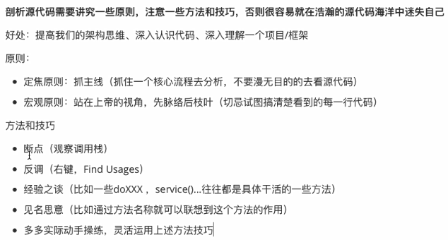

Tomcat启动过程

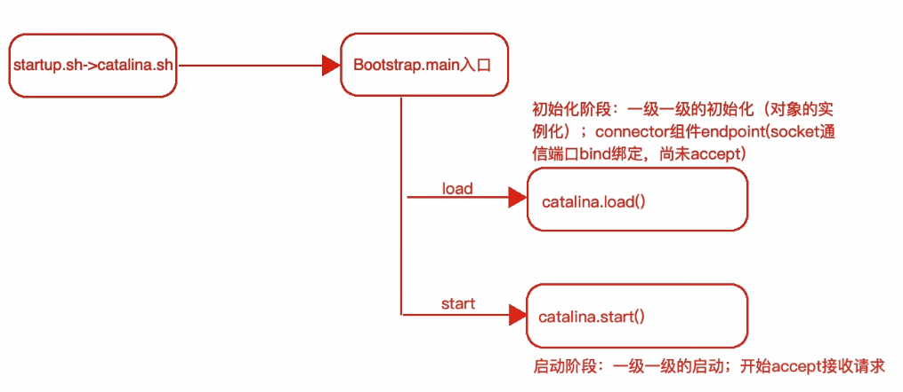

初始化阶段：

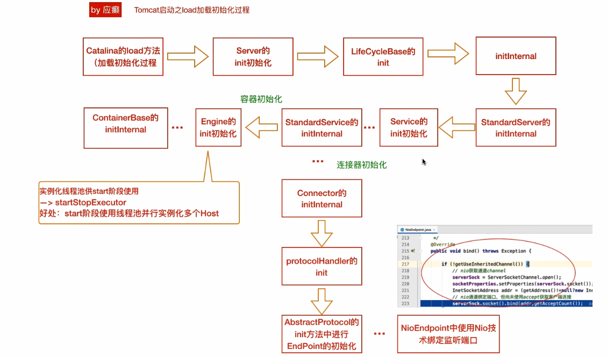

启动阶段：

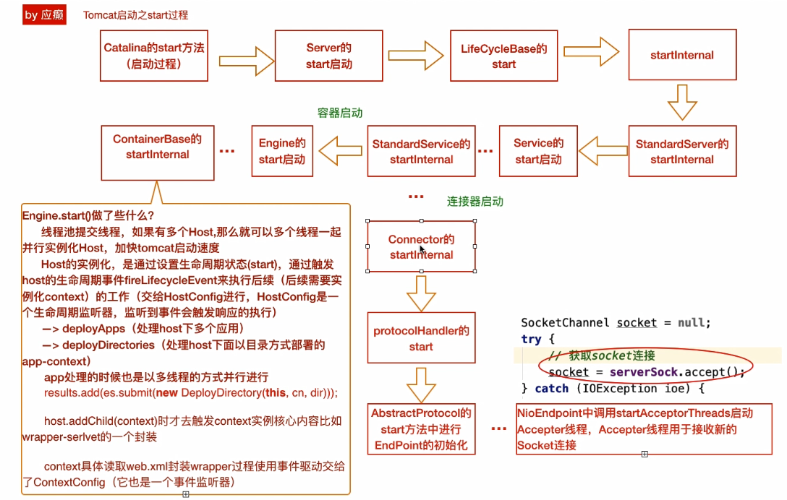

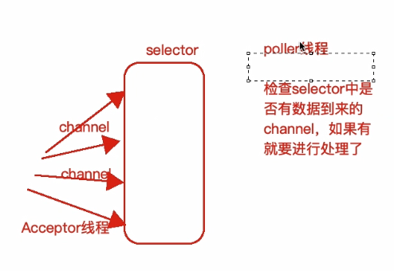

备注：acceptor线程接收请求，poller线程用来判断是否有channel数据到来。

servlet处理链路

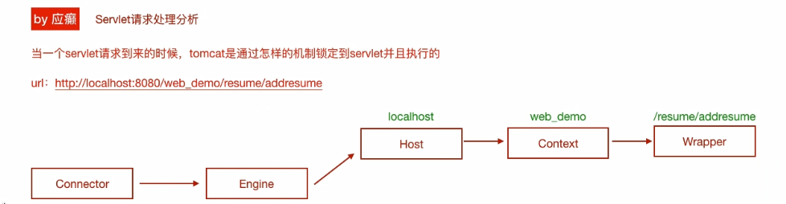

备注：poller线程是处理逻辑的入口

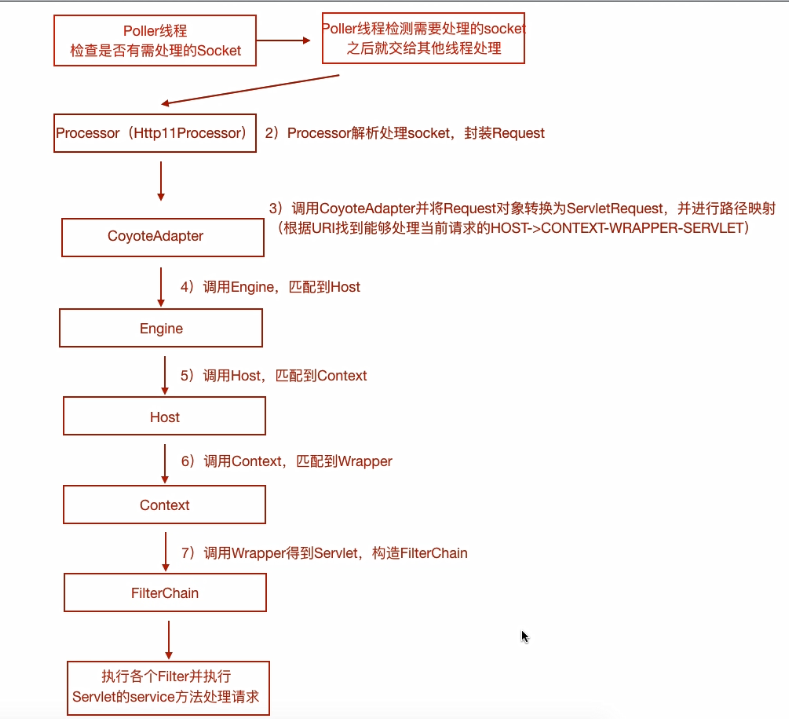

mapper组件结构封装（基于请求路径找到对应的处理servlet）

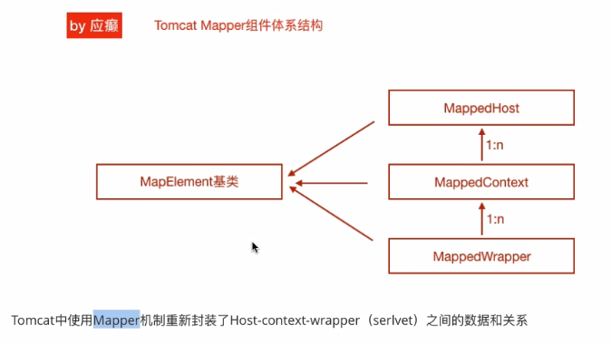

疑问：mapper什么时候初始化的？standardservice中进行初始化的。

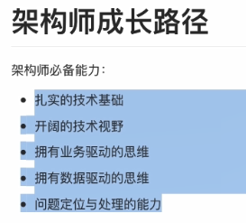

# 参考

- [java-nio系列文章](http://ifeve.com/java-nio-all/)

- [devcenter-embedded-tomcat](https://github.com/heroku/devcenter-embedded-tomcat)
