<!-- TOC -->

- [1、Tomcat的总体架构](#1tomcat的总体架构)
    - [01、连接器设计](#01连接器设计)
        - [1、ProtocolHandler 组件](#1protocolhandler-组件)
            - [1、Endpoint](#1endpoint)
            - [2、Processor](#2processor)
        - [2、Adapter 组件](#2adapter-组件)
    - [02、多层容器设计](#02多层容器设计)
        - [1、请求定位 Servlet 的过程](#1请求定位-servlet-的过程)
    - [03、Tomcat如何实现一键式启停？（Lifecycle 接口）](#03tomcat如何实现一键式启停lifecycle-接口)
        - [1、一键式启停：Lifecycle 接口](#1一键式启停lifecycle-接口)
        - [2、可扩展性：Lifecycle 事件](#2可扩展性lifecycle-事件)
        - [3、重用性：LifecycleBase 抽象基类](#3重用性lifecyclebase-抽象基类)
        - [4、生周期管理总体类图](#4生周期管理总体类图)
    - [04、Tomcat上层组件Catalina、Server、Service、Engine](#04tomcat上层组件catalinaserverserviceengine)
        - [1、Catalina](#1catalina)
        - [2、Server 组件](#2server-组件)
        - [3、Service 组件](#3service-组件)
        - [4、engine 组件](#4engine-组件)
    - [05、比较：Jetty架构特点之Connector组件](#05比较jetty架构特点之connector组件)
        - [1、Jetty 整体架构](#1jetty-整体架构)
        - [2、Jetty 的 Connector 组件的设计](#2jetty-的-connector-组件的设计)
            - [1、Java NIO](#1java-nio)
            - [2、Acceptor](#2acceptor)
            - [3、SelectorManager](#3selectormanager)
            - [4、Connection](#4connection)
        - [3、Jetty 的 Handler 组件的设计](#3jetty-的-handler-组件的设计)
            - [1、Handler 是什么](#1handler-是什么)
            - [2、Handler 继承关系](#2handler-继承关系)
            - [3、Handler 的类型](#3handler-的类型)
            - [4、如何实现 Servlet 规范](#4如何实现-servlet-规范)
    - [06、从Tomcat和Jetty中提炼组件化设计规范](#06从tomcat和jetty中提炼组件化设计规范)
        - [1、组件化及可配置](#1组件化及可配置)
        - [2、组件的创建](#2组件的创建)
        - [3、组件的生命周期管理](#3组件的生命周期管理)
        - [4、组件的骨架抽象类和模板模式](#4组件的骨架抽象类和模板模式)
    - [07、优化并提高Tomcat启动速度](#07优化并提高tomcat启动速度)
        - [1. 清理不必要的 Web 应用](#1-清理不必要的-web-应用)
        - [2. 清理 XML 配置文件](#2-清理-xml-配置文件)
        - [3. 清理 JAR 文件](#3-清理-jar-文件)
        - [4. 清理其他文件](#4-清理其他文件)
        - [5. 禁止 Tomcat TLD 扫描](#5-禁止-tomcat-tld-扫描)
        - [6、关闭 WebSocket 支持](#6关闭-websocket-支持)
        - [7、关闭 JSP 支持](#7关闭-jsp-支持)
        - [8、禁止 Servlet 注解扫描](#8禁止-servlet-注解扫描)
        - [9、配置 Web-Fragment 扫描](#9配置-web-fragment-扫描)
        - [10、随机数熵源优化](#10随机数熵源优化)
        - [11、并行启动多个 Web 应用](#11并行启动多个-web-应用)

<!-- /TOC -->

# 1、Tomcat的总体架构

Tomcat 要实现 2 个核心功能：

- 1、处理 Socket 连接，负责网络字节流与 Request 和 Response 对象的转化。
- 2、加载和管理 Servlet，以及具体处理 Request 请求。

因此 Tomcat 设计了两个核心组件连接器（Connector）和容器（Container）来分别做这两件事情。连接器负责对外交流，容器负责内部处理。


Tomcat 支持的多种 I/O 模型和应用层协议。

Tomcat 支持的 I/O 模型有：

- NIO：非阻塞 I/O，采用 Java NIO 类库实现。
- NIO.2：异步 I/O，采用 JDK 7 最新的 NIO.2 类库实现。
- APR：采用 Apache 可移植运行库实现，是 C/C++ 编写的本地库。


Tomcat 支持的应用层协议有：
- HTTP/1.1：这是大部分 Web 应用采用的访问协议。
- AJP：用于和 Web 服务器集成（如 Apache）。
- HTTP/2：HTTP 2.0 大幅度的提升了 Web 性能。


Tomcat 为了实现支持多种 I/O 模型和应用层协议，一个容器可能对接多个连接器，就好比一个房间有多个门。但是单独的连接器或者容器都不能对外提供服务，需要把它们组装起来才能工作，组装后这个整体叫作 Service 组件。这里请你注意，Service 本身没有做什么重要的事情，只是在连接器和容器外面多包了一层，把它们组装在一起。Tomcat 内可能有多个 Service，这样的设计也是出于灵活性的考虑。通过在 Tomcat 中配置多个 Service，可以实现通过不同的端口号来访问同一台机器上部署的不同应用。

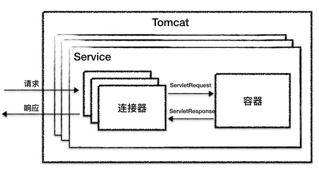

从图上你可以看到，最顶层是 Server，这里的 Server 指的就是一个 Tomcat 实例。一个 Server 中有一个或者多个 Service，一个 Service 中有多个连接器和一个容器。连接器与容器之间通过标准的 ServletRequest 和 ServletResponse 通信。


## 01、连接器设计

连接器对 Servlet 容器屏蔽了协议及 I/O 模型等的区别，无论是 HTTP 还是 AJP，在容器中获取到的都是一个标准的 ServletRequest 对象。我们可以把连接器的功能需求进一步细化，比如：

- 监听网络端口。
- 接受网络连接请求。
- 读取网络请求字节流。
- 根据具体应用层协议（HTTP/AJP）解析字节流，生成统一的 Tomcat Request 对象。
- 将 Tomcat Request 对象转成标准的 ServletRequest。
- 调用 Servlet 容器，得到 ServletResponse。
- 将 ServletResponse 转成 Tomcat Response 对象。
- 将 Tomcat Response 转成网络字节流。
- 将响应字节流写回给浏览器。

需求列清楚后，我们要考虑的下一个问题是，连接器应该有哪些子模块？优秀的模块化设计应该考虑高内聚、低耦合。

- 高内聚是指相关度比较高的功能要尽可能集中，不要分散。
- 低耦合是指两个相关的模块要尽可能减少依赖的部分和降低依赖的程度，不要让两个模块产生强依赖。


通过分析连接器的详细功能列表，我们发现连接器需要完成 3 个高内聚的功能：

- 1、网络通信。
- 2、应用层协议解析。
- 3、Tomcat Request/Response 与 ServletRequest/ServletResponse 的转化。

因此 Tomcat 的设计者设计了 3 个组件来实现这 3 个功能，分别是 Endpoint、Processor 和 Adapter。组件之间通过抽象接口交互。这样做还有一个好处是封装变化。这是面向对象设计的精髓，将系统中经常变化的部分和稳定的部分隔离，有助于增加复用性，并降低系统耦合度。网络通信的 I/O 模型是变化的，可能是非阻塞 I/O、异步 I/O 或者 APR。应用层协议也是变化的，可能是 HTTP、HTTPS、AJP。浏览器端发送的请求信息也是变化的。但是整体的处理逻辑是不变的，Endpoint 负责提供字节流给 Processor，Processor 负责提供 Tomcat Request 对象给 Adapter，Adapter 负责提供 ServletRequest 对象给容器。

如果要支持新的 I/O 方案、新的应用层协议，只需要实现相关的具体子类，上层通用的处理逻辑是不变的。


由于 I/O 模型和应用层协议可以自由组合，比如 NIO + HTTP 或者 NIO.2 + AJP。Tomcat 的设计者将网络通信和应用层协议解析放在一起考虑，设计了一个叫 ProtocolHandler 的接口来封装这两种变化点。各种协议和通信模型的组合有相应的具体实现类。比如：Http11NioProtocol 和 AjpNioProtocol。

除了这些变化点，系统也存在一些相对稳定的部分，因此 Tomcat 设计了一系列抽象基类来封装这些稳定的部分，抽象基类 AbstractProtocol 实现了 ProtocolHandler 接口。每一种应用层协议有自己的抽象基类，比如 AbstractAjpProtocol 和 AbstractHttp11Protocol，具体协议的实现类扩展了协议层抽象基类。下面我整理一下它们的继承关系。

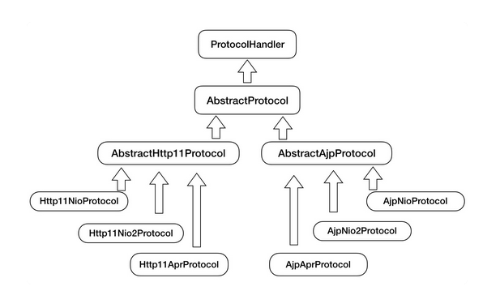

通过上面的图，你可以清晰地看到它们的继承和层次关系，这样设计的目的是尽量将稳定的部分放到抽象基类，同时每一种 I/O 模型和协议的组合都有相应的具体实现类，我们在使用时可以自由选择。

小结一下，连接器模块用三个核心组件：Endpoint、Processor 和 Adapter 来分别做三件事情，其中 Endpoint 和 Processor 放在一起抽象成了 ProtocolHandler 组件，它们的关系如下图所示。

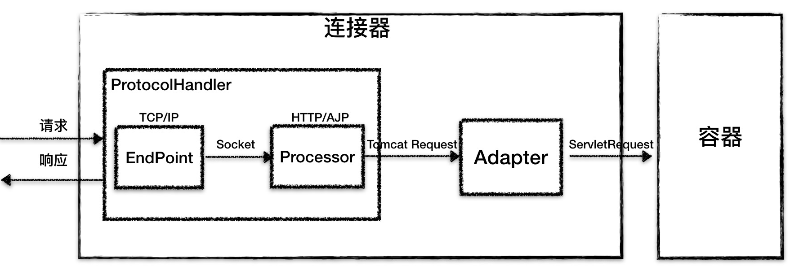


### 1、ProtocolHandler 组件

连接器用 ProtocolHandler 来处理网络连接和应用层协议，包含了 2 个重要部件：Endpoint 和 Processor，下面我来详细介绍它们的工作原理。

#### 1、Endpoint

Endpoint 是通信端点，即通信监听的接口，是具体的 Socket 接收和发送处理器，是对传输层的抽象，因此 Endpoint 是用来实现 TCP/IP 协议的。

Endpoint 是一个接口，对应的抽象实现类是 AbstractEndpoint，而 AbstractEndpoint 的具体子类，比如在 NioEndpoint 和 Nio2Endpoint 中，有两个重要的子组件：Acceptor 和 SocketProcessor。

其中 Acceptor 用于监听 Socket 连接请求。SocketProcessor 用于处理接收到的 Socket 请求，它实现 Runnable 接口，在 run 方法里调用协议处理组件 Processor 进行处理。为了提高处理能力，SocketProcessor 被提交到线程池来执行。而这个线程池叫作执行器（Executor)， Tomcat扩展了原生的 Java 线程池。


#### 2、Processor

如果说 Endpoint 是用来实现 TCP/IP 协议的，那么 Processor 用来实现 HTTP 协议，Processor 接收来自 Endpoint 的 Socket，读取字节流解析成 Tomcat Request 和 Response 对象，并通过 Adapter 将其提交到容器处理，Processor 是对应用层协议的抽象。

Processor 是一个接口，定义了请求的处理等方法。它的抽象实现类 AbstractProcessor 对一些协议共有的属性进行封装，没有对方法进行实现。具体的实现有 AjpProcessor、Http11Processor 等，这些具体实现类实现了特定协议的解析方法和请求处理方式。


我们再来看看连接器的组件图：

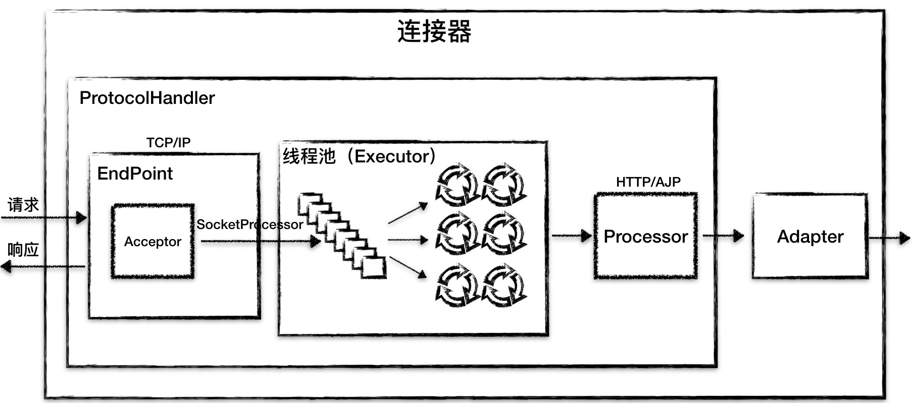

从图中我们看到，Endpoint 接收到 Socket 连接后，生成一个 SocketProcessor 任务提交到线程池去处理，SocketProcessor 的 run 方法会调用 Processor 组件去解析应用层协议，Processor 通过解析生成 Request 对象后，会调用 Adapter 的 Service 方法。


### 2、Adapter 组件

由于协议不同，客户端发过来的请求信息也不尽相同，Tomcat 定义了自己的 Request 类来“存放”这些请求信息。ProtocolHandler 接口负责解析请求并生成 Tomcat Request 类。但是这个 Request 对象不是标准的 ServletRequest，也就意味着，不能用 Tomcat Request 作为参数来调用容器。Tomcat 设计者的解决方案是引入 CoyoteAdapter，这是适配器模式的经典运用，连接器调用 CoyoteAdapter 的 sevice 方法，传入的是 Tomcat Request 对象，CoyoteAdapter 负责将 Tomcat Request 转成 ServletRequest，再调用容器的 service 方法。


## 02、多层容器设计

Tomcat 设计了 4 种容器，分别是 Engine、Host、Context 和 Wrapper。这 4 种容器不是平行关系，而是父子关系。下面我画了一张图帮你理解它们的关系。

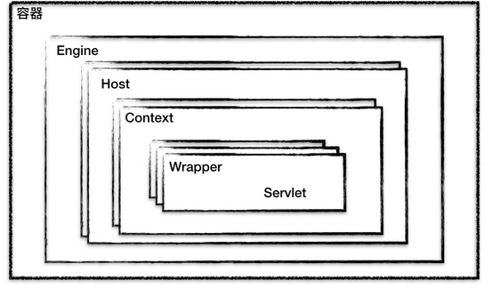

你可能会问，为什么要设计成这么多层次的容器，这不是增加了复杂度吗？其实这背后的考虑是，Tomcat 通过一种分层的架构，使得 Servlet 容器具有很好的灵活性。

Context 表示一个 Web 应用程序；Wrapper 表示一个 Servlet，一个 Web 应用程序中可能会有多个 Servlet；Host 代表的是一个虚拟主机，或者说一个站点，可以给 Tomcat 配置多个虚拟主机地址，而一个虚拟主机下可以部署多个 Web 应用程序；Engine 表示引擎，用来管理多个虚拟站点，一个 Service 最多只能有一个 Engine。

你可以再通过 Tomcat 的server.xml配置文件来加深对 Tomcat 容器的理解。Tomcat 采用了组件化的设计，它的构成组件都是可配置的，其中最外层的是 Server，其他组件按照一定的格式要求配置在这个顶层容器中。

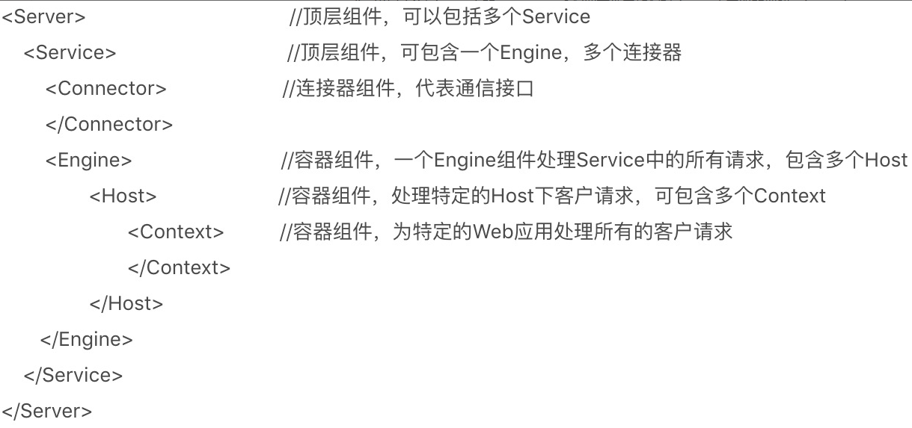

那么，Tomcat 是怎么管理这些容器的呢？你会发现这些容器具有父子关系，形成一个树形结构，你可能马上就想到了设计模式中的组合模式。没错，Tomcat 就是用组合模式来管理这些容器的。具体实现方法是，所有容器组件都实现了 Container 接口，因此组合模式可以使得用户对单容器对象和组合容器对象的使用具有一致性。这里单容器对象指的是最底层的 Wrapper，组合容器对象指的是上面的 Context、Host 或者 Engine。Container 接口定义如下：

```java

public interface Container extends Lifecycle {
    public void setName(String name);
    public Container getParent();
    public void setParent(Container container);
    public void addChild(Container child);
    public void removeChild(Container child);
    public Container findChild(String name);
}
```

正如我们期望的那样，我们在上面的接口看到了 getParent、setParent、addChild 和 removeChild 等方法。你可能还注意到 Container 接口扩展了 Lifecycle 接口，Lifecycle 接口用来统一管理各组件的生命周期。


### 1、请求定位 Servlet 的过程

设计了这么多层次的容器，Tomcat 是怎么确定请求是由哪个 Wrapper 容器里的 Servlet 来处理的呢？答案是，Tomcat 是用 Mapper 组件来完成这个任务的。

Mapper 组件的功能就是将用户请求的 URL 定位到一个 Servlet，它的工作原理是：Mapper 组件里保存了 Web 应用的配置信息，其实就是容器组件与访问路径的映射关系，比如 Host 容器里配置的域名、Context 容器里的 Web 应用路径，以及 Wrapper 容器里 Servlet 映射的路径，你可以想象这些配置信息就是一个多层次的 Map。

当一个请求到来时，Mapper 组件通过解析请求 URL 里的域名和路径，再到自己保存的 Map 里去查找，就能定位到一个 Servlet。请你注意，一个请求 URL 最后只会定位到一个 Wrapper 容器，也就是一个 Servlet。

读到这里你可能感到有些抽象，接下来我通过一个例子来解释这个定位的过程。


假如有一个网购系统，有面向网站管理人员的后台管理系统，还有面向终端客户的在线购物系统。这两个系统跑在同一个 Tomcat 上，为了隔离它们的访问域名，配置了两个虚拟域名：manage.shopping.com和user.shopping.com，网站管理人员通过manage.shopping.com域名访问 Tomcat 去管理用户和商品，而用户管理和商品管理是两个单独的 Web 应用。终端客户通过user.shopping.com域名去搜索商品和下订单，搜索功能和订单管理也是两个独立的 Web 应用。

针对这样的部署，Tomcat 会创建一个 Service 组件和一个 Engine 容器组件，在 Engine 容器下创建两个 Host 子容器，在每个 Host 容器下创建两个 Context 子容器。由于一个 Web 应用通常有多个 Servlet，Tomcat 还会在每个 Context 容器里创建多个 Wrapper 子容器。每个容器都有对应的访问路径，你可以通过下面这张图来帮助你理解。

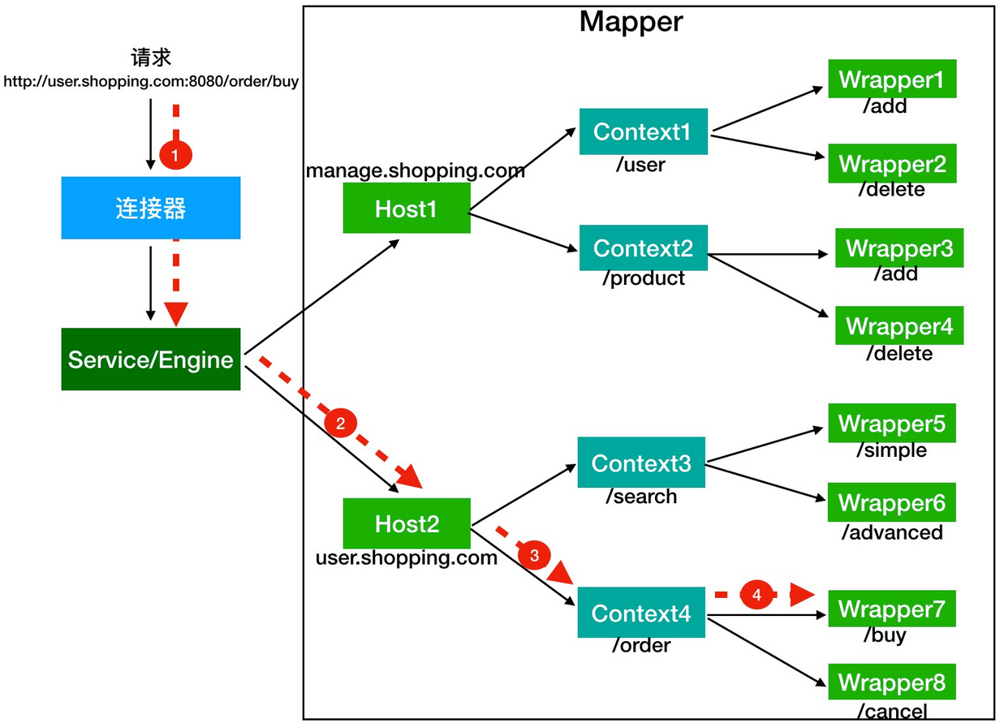

假如有用户访问一个 URL，比如图中的http://user.shopping.com:8080/order/buy，Tomcat 如何将这个 URL 定位到一个 Servlet 呢？

1、首先，根据协议和端口号选定 Service 和 Engine。我们知道 Tomcat 的每个连接器都监听不同的端口，比如 Tomcat 默认的 HTTP 连接器监听 8080 端口、默认的 AJP 连接器监听 8009 端口。上面例子中的 URL 访问的是 8080 端口，因此这个请求会被 HTTP 连接器接收，而一个连接器是属于一个 Service 组件的，这样 Service 组件就确定了。我们还知道一个 Service 组件里除了有多个连接器，还有一个容器组件，具体来说就是一个 Engine 容器，因此 Service 确定了也就意味着 Engine 也确定了。


2、然后，根据域名选定 Host。Service 和 Engine 确定后，Mapper 组件通过 URL 中的域名去查找相应的 Host 容器，比如例子中的 URL 访问的域名是user.shopping.com，因此 Mapper 会找到 Host2 这个容器。

3、之后，根据 URL 路径找到 Context 组件。Host 确定以后，Mapper 根据 URL 的路径来匹配相应的 Web 应用的路径，比如例子中访问的是/order，因此找到了 Context4 这个 Context 容器。

4、最后，根据 URL 路径找到 Wrapper（Servlet）。Context 确定后，Mapper 再根据web.xml中配置的 Servlet 映射路径来找到具体的 Wrapper 和 Servlet。


看到这里，我想你应该已经了解了什么是容器，以及 Tomcat 如何通过一层一层的父子容器找到某个 Servlet 来处理请求。需要注意的是，并不是说只有 Servlet 才会去处理请求，实际上这个查找路径上的父子容器都会对请求做一些处理。我在上一期说过，连接器中的 Adapter 会调用容器的 Service 方法来执行 Servlet，最先拿到请求的是 Engine 容器，Engine 容器对请求做一些处理后，会把请求传给自己子容器 Host 继续处理，依次类推，最后这个请求会传给 Wrapper 容器，Wrapper 会调用最终的 Servlet 来处理。那么这个调用过程具体是怎么实现的呢？答案是使用 Pipeline-Valve 管道。


Pipeline-Valve 是责任链模式，责任链模式是指在一个请求处理的过程中有很多处理者依次对请求进行处理，每个处理者负责做自己相应的处理，处理完之后将再调用下一个处理者继续处理。


Valve 表示一个处理点，比如权限认证和记录日志。如果你还不太理解的话，可以来看看 Valve 和 Pipeline 接口中的关键方法。

```java

public interface Valve {
  public Valve getNext();
  public void setNext(Valve valve);
  public void invoke(Request request, Response response)
}
```

由于 Valve 是一个处理点，因此 invoke 方法就是来处理请求的。注意到 Valve 中有 getNext 和 setNext 方法，因此我们大概可以猜到有一个链表将 Valve 链起来了。请你继续看 Pipeline 接口：

```java

public interface Pipeline extends Contained {
  public void addValve(Valve valve);
  public Valve getBasic();
  public void setBasic(Valve valve);
  public Valve getFirst();
}
```

没错，Pipeline 中有 addValve 方法。Pipeline 中维护了 Valve 链表，Valve 可以插入到 Pipeline 中，对请求做某些处理。我们还发现 Pipeline 中没有 invoke 方法，因为整个调用链的触发是 Valve 来完成的，Valve 完成自己的处理后，调用getNext.invoke来触发下一个 Valve 调用。


每一个容器都有一个 Pipeline 对象，只要触发这个 Pipeline 的第一个 Valve，这个容器里 Pipeline 中的 Valve 就都会被调用到。但是，不同容器的 Pipeline 是怎么链式触发的呢，比如 Engine 中 Pipeline 需要调用下层容器 Host 中的 Pipeline。


这是因为 Pipeline 中还有个 getBasic 方法。这个 BasicValve 处于 Valve 链表的末端，它是 Pipeline 中必不可少的一个 Valve，负责调用下层容器的 Pipeline 里的第一个 Valve。我还是通过一张图来解释。

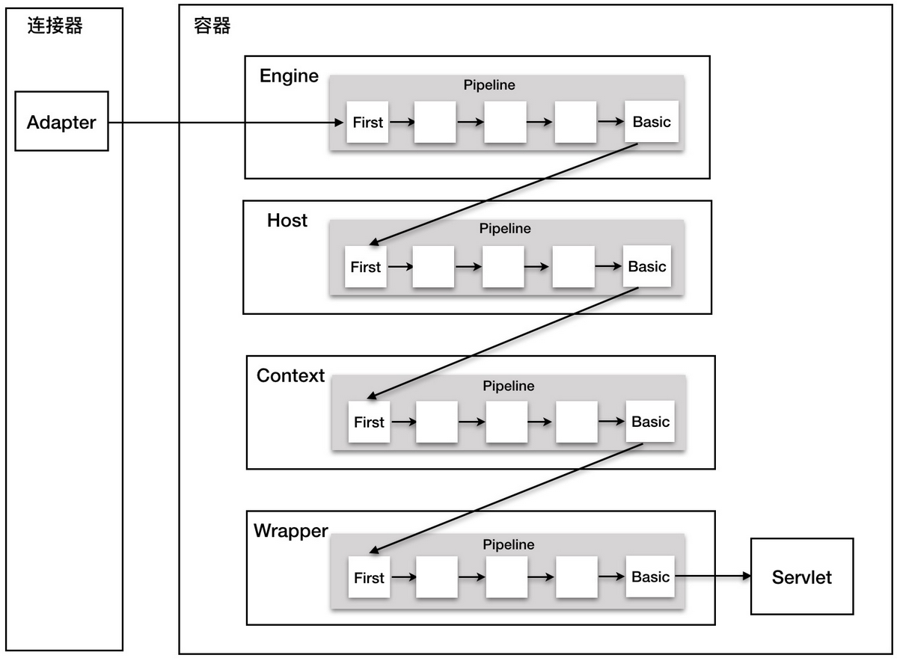

整个调用过程由连接器中的 Adapter 触发的，它会调用 Engine 的第一个 Valve：


// Calling the container
connector.getService().getContainer().getPipeline().getFirst().invoke(request, response);


Wrapper 容器的最后一个 Valve 会创建一个 Filter 链，并调用 doFilter 方法，最终会调到 Servlet 的 service 方法。

你可能会问，前面我们不是讲到了 Filter，似乎也有相似的功能，那 Valve 和 Filter 有什么区别吗？它们的区别是：

- Valve 是 Tomcat 的私有机制，与 Tomcat 的基础架构 /API 是紧耦合的。Servlet API 是公有的标准，所有的 Web 容器包括 Jetty 都支持 Filter 机制。

- 另一个重要的区别是 Valve 工作在 Web 容器级别，拦截所有应用的请求；而 Servlet Filter 工作在应用级别，只能拦截某个 Web 应用的所有请求。如果想做整个 Web 容器的拦截器，必须通过 Valve 来实现。


思考:Tomcat 内的 Context 组件跟 Servlet 规范中的 ServletContext 接口有什么区别？跟 Spring 中的 ApplicationContext 又有什么关系？

1）Servlet规范中ServletContext表示web应用的上下文环境，而web应用对应tomcat的概念是Context，所以从设计上，ServletContext自然会成为tomcat的Context具体实现的一个成员变量。

2）tomcat内部实现也是这样完成的，ServletContext对应tomcat实现是org.apache.catalina.core.ApplicationContext，Context容器对应tomcat实现是org.apache.catalina.core.StandardContext。ApplicationContext是StandardContext的一个成员变量。

3）Spring的ApplicationContext之前已经介绍过，tomcat启动过程中ContextLoaderListener会监听到容器初始化事件，它的contextInitialized方法中，Spring会初始化全局的Spring根容器ApplicationContext，初始化完毕后，Spring将其存储到ServletContext中。

总而言之，Servlet规范中ServletContext是tomcat的Context实现的一个成员变量，而Spring的ApplicationContext是Servlet规范中ServletContext的一个属性。


## 03、Tomcat如何实现一键式启停？（Lifecycle 接口）


从图上你可以看到各种组件的层次关系，图中的虚线表示一个请求在 Tomcat 中流转的过程。

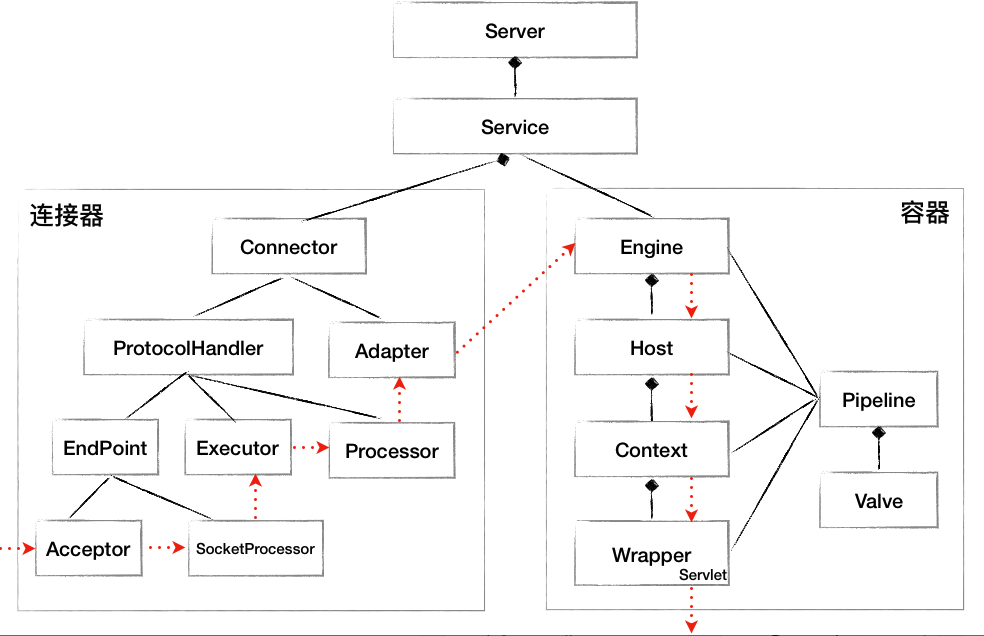

上面这张图描述了组件之间的静态关系，如果想让一个系统能够对外提供服务，我们需要创建、组装并启动这些组件；在服务停止的时候，我们还需要释放资源，销毁这些组件，因此这是一个动态的过程。也就是说，Tomcat 需要动态地管理这些组件的生命周期。在我们实际的工作中，如果你需要设计一个比较大的系统或者框架时，你同样也需要考虑这几个问题：如何统一管理组件的创建、初始化、启动、停止和销毁？如何做到代码逻辑清晰？如何方便地添加或者删除组件？如何做到组件启动和停止不遗漏、不重复？

今天我们就来解决上面的问题，在这之前，先来看看组件之间的关系。如果你仔细分析过这些组件，可以发现它们具有两层关系。

- 第一层关系是组件有大有小，大组件管理小组件，比如 Server 管理 Service，Service 又管理连接器和容器。

- 第二层关系是组件有外有内，外层组件控制内层组件，比如连接器是外层组件，负责对外交流，外层组件调用内层组件完成业务功能。也就是说，请求的处理过程是由外层组件来驱动的。

这两层关系决定了系统在创建组件时应该遵循一定的顺序。

- 第一个原则是先创建子组件，再创建父组件，子组件需要被“注入”到父组件中。

- 第二个原则是先创建内层组件，再创建外层组件，内层组件需要被“注入”到外层组件。

因此，最直观的做法就是将图上所有的组件按照先小后大、先内后外的顺序创建出来，然后组装在一起。不知道你注意到没有，这个思路其实很有问题！因为这样不仅会造成代码逻辑混乱和组件遗漏，而且也不利于后期的功能扩展。为了解决这个问题，我们希望找到一种通用的、统一的方法来管理组件的生命周期，就像汽车“一键启动”那样的效果。


### 1、一键式启停：Lifecycle 接口

我在前面说到过，设计就是要找到系统的变化点和不变点。这里的不变点就是每个组件都要经历创建、初始化、启动这几个过程，这些状态以及状态的转化是不变的。而变化点是每个具体组件的初始化方法，也就是启动方法是不一样的。因此，我们把不变点抽象出来成为一个接口，这个接口跟生命周期有关，叫作 Lifecycle。Lifecycle 接口里应该定义这么几个方法：init、start、stop 和 destroy，每个具体的组件去实现这些方法。理所当然，在父组件的 init 方法里需要创建子组件并调用子组件的 init 方法。同样，在父组件的 start 方法里也需要调用子组件的 start 方法，因此调用者可以无差别的调用各组件的 init 方法和 start 方法，这就是`组合模式`的使用，并且只要调用最顶层组件，也就是 Server 组件的 init 和 start 方法，整个 Tomcat 就被启动起来了。下面是 Lifecycle 接口的定义。

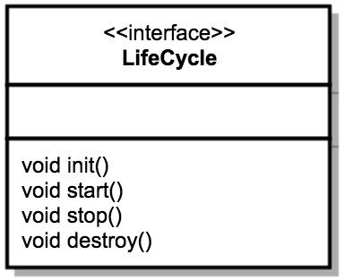


### 2、可扩展性：Lifecycle 事件

我们再来考虑另一个问题，那就是系统的可扩展性。因为各个组件 init 和 start 方法的具体实现是复杂多变的，比如在 Host 容器的启动方法里需要扫描 webapps 目录下的 Web 应用，创建相应的 Context 容器，如果将来需要增加新的逻辑，直接修改 start 方法？这样会违反开闭原则，那如何解决这个问题呢？开闭原则说的是为了扩展系统的功能，你不能直接修改系统中已有的类，但是你可以定义新的类。我们注意到，组件的 init 和 start 调用是由它的父组件的状态变化触发的，上层组件的初始化会触发子组件的初始化，上层组件的启动会触发子组件的启动，因此我们把组件的生命周期定义成一个个状态，把状态的转变看作是一个事件。而事件是有监听器的，在监听器里可以实现一些逻辑，并且监听器也可以方便的添加和删除，这就是典型的`观察者模式`。

具体来说就是在 Lifecycle 接口里加入两个方法：添加监听器和删除监听器。除此之外，我们还需要定义一个 Enum 来表示组件有哪些状态，以及处在什么状态会触发什么样的事件。因此 Lifecycle 接口和 LifecycleState 就定义成了下面这样。

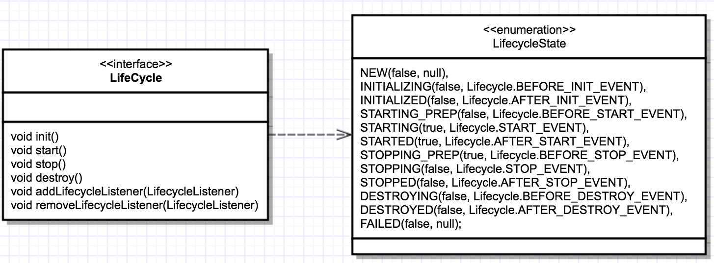

从图上你可以看到，组件的生命周期有 NEW、INITIALIZING、INITIALIZED、STARTING_PREP、STARTING、STARTED 等，而一旦组件到达相应的状态就触发相应的事件，比如 NEW 状态表示组件刚刚被实例化；而当 init 方法被调用时，状态就变成 INITIALIZING 状态，这个时候，就会触发 BEFORE_INIT_EVENT 事件，如果有监听器在监听这个事件，它的方法就会被调用。

### 3、重用性：LifecycleBase 抽象基类

有了接口，我们就要用类去实现接口。一般来说实现类不止一个，不同的类在实现接口时往往会有一些相同的逻辑，如果让各个子类都去实现一遍，就会有重复代码。那子类如何重用这部分逻辑呢？其实就是定义一个基类来实现共同的逻辑，然后让各个子类去继承它，就达到了重用的目的。而基类中往往会定义一些抽象方法，所谓的抽象方法就是说基类不会去实现这些方法，而是调用这些方法来实现骨架逻辑。抽象方法是留给各个子类去实现的，并且子类必须实现，否则无法实例化。

回到 Lifecycle 接口，Tomcat 定义一个基类 LifecycleBase 来实现 Lifecycle 接口，把一些公共的逻辑放到基类中去，比如生命状态的转变与维护、生命事件的触发以及监听器的添加和删除等，而子类就负责实现自己的初始化、启动和停止等方法。为了避免跟基类中的方法同名，我们把具体子类的实现方法改个名字，在后面加上 Internal，叫 initInternal、startInternal 等。我们再来看引入了基类 LifecycleBase 后的类图：

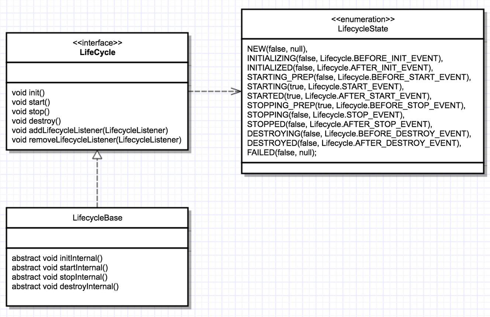

从图上可以看到，LifecycleBase 实现了 Lifecycle 接口中所有的方法，还定义了相应的抽象方法交给具体子类去实现，这是典型的`模板设计模式`。

我们还是看一看代码，可以帮你加深理解，下面是 LifecycleBase 的 init 方法实现

```java

@Override
public final synchronized void init() throws LifecycleException {
    //1. 状态检查
    if (!state.equals(LifecycleState.NEW)) {
        invalidTransition(Lifecycle.BEFORE_INIT_EVENT);
    }

    try {
        //2.触发INITIALIZING事件的监听器
        setStateInternal(LifecycleState.INITIALIZING, null, false);
        
        //3.调用具体子类的初始化方法
        initInternal();
        
        //4. 触发INITIALIZED事件的监听器
        setStateInternal(LifecycleState.INITIALIZED, null, false);
    } catch (Throwable t) {
      ...
    }
}
```

这个方法逻辑比较清楚，主要完成了四步：

- 第一步，检查状态的合法性，比如当前状态必须是 NEW 然后才能进行初始化。

- 第二步，触发 INITIALIZING 事件的监听器：在这个 setStateInternal 方法里，会调用监听器的业务方法。

- 第三步，调用具体子类实现的抽象方法 initInternal 方法。我在前面提到过，为了实现一键式启动，具体组件在实现 initInternal 方法时，又会调用它的子组件的 init 方法。

- 第四步，子组件初始化后，触发 INITIALIZED 事件的监听器，相应监听器的业务方法就会被调用。


总之，LifecycleBase 调用了抽象方法来实现骨架逻辑。讲到这里， 你可能好奇，LifecycleBase 负责触发事件，并调用监听器的方法，那是什么时候、谁把监听器注册进来的呢？


分为两种情况：
- 1、Tomcat 自定义了一些监听器，这些监听器是父组件在创建子组件的过程中注册到子组件的。比如 MemoryLeakTrackingListener 监听器，用来检测 Context 容器中的内存泄漏，这个监听器是 Host 容器在创建 Context 容器时注册到 Context 中的。

- 2、我们还可以在server.xml中定义自己的监听器，Tomcat 在启动时会解析server.xml，创建监听器并注册到容器组件。


### 4、生周期管理总体类图

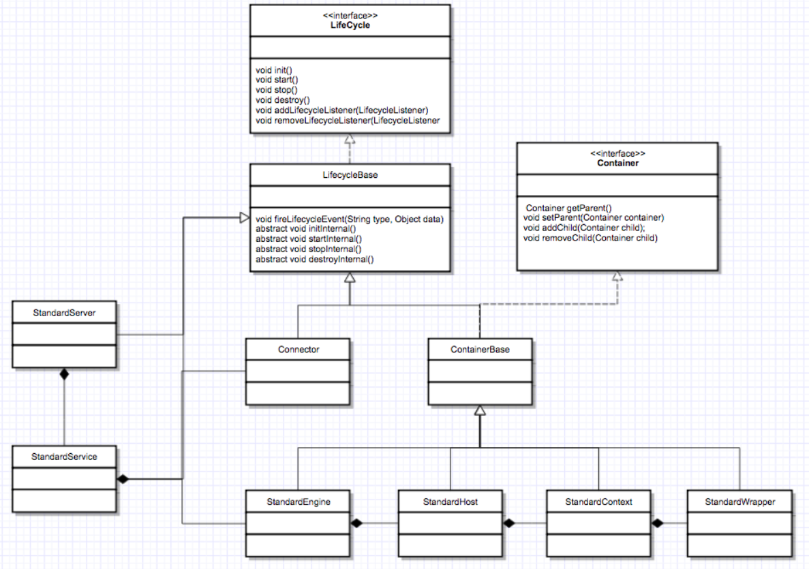

图中的 StandardServer、StandardService 等是 Server 和 Service 组件的具体实现类，它们都继承了 LifecycleBase。


StandardEngine、StandardHost、StandardContext 和 StandardWrapper 是相应容器组件的具体实现类，因为它们都是容器，所以继承了 ContainerBase 抽象基类，而 ContainerBase 实现了 Container 接口，也继承了 LifecycleBase 类，它们的生命周期管理接口和功能接口是分开的，这也符合设计中接口分离的原则。


> 思考

从文中最后的类图上你会看到所有的容器组件都扩展了 ContainerBase，跟 LifecycleBase 一样，ContainerBase 也是一个骨架抽象类，请你思考一下，各容器组件有哪些“共同的逻辑”需要 ContainerBase 由来实现呢？


ContainerBase提供了针对Container接口的通用实现，所以最重要的职责包含两个:

- 1) 维护容器通用的状态数据
- 2) 提供管理状态数据的通用方法

容器的关键状态信息和方法有:

1) 父容器, 子容器列表
getParent, setParent, getParentClassLoader, setParentClassLoader;
getStartChildren, setStartChildren, addChild, findChild, findChildren, removeChild.

2) 容器事件和属性监听者列表
findContainerListeners, addContainerListener, removeContainerListener, fireContainerEvent;
addPropertyChangeListener, removePropertyChangeListener.

3) 当前容器对应的pipeline
getPipeline, addValve.

除了以上三类状态数据和对应的接口，ContainerBase还提供了两类通用功能:

1) 容器的生命周期实现，从LifecycleBase继承而来，完成状态数据的初始化和销毁
startInternal, stopInternal, destroyInternal

2) 后台任务线程管理，比如容器周期性reload任务
threadStart, threadStop，backgroundProcess.

想了解更多技术细节，可以参考源码org.apache.catalina.core.ContainerBase，有源码有真相。


## 04、Tomcat上层组件Catalina、Server、Service、Engine 

我们可以通过 Tomcat 的/bin目录下的脚本startup.sh来启动 Tomcat，那你是否知道我们执行了这个脚本后发生了什么呢？你可以通过下面这张流程图来了解一下。

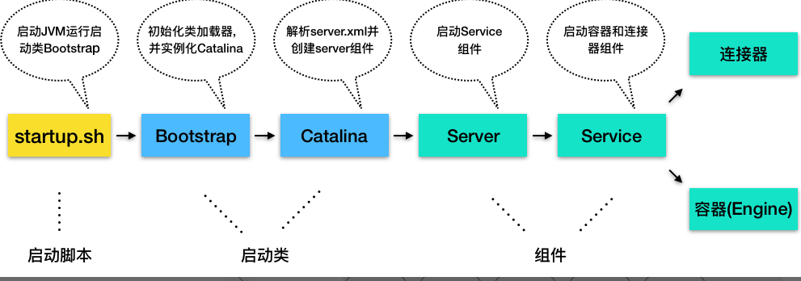


1.Tomcat 本质上是一个 Java 程序，因此startup.sh脚本会启动一个 JVM 来运行 Tomcat 的启动类 Bootstrap。

2.Bootstrap 的主要任务是初始化 Tomcat 的类加载器，并且创建 Catalina。

3.Catalina 是一个启动类，它通过解析server.xml、创建相应的组件，并调用 Server 的 start 方法。

4.Server 组件的职责就是管理 Service 组件，它会负责调用 Service 的 start 方法。

5.Service 组件的职责就是管理连接器和顶层容器 Engine，因此它会调用连接器和 Engine 的 start 方法。

这样 Tomcat 的启动就算完成了。下面我来详细介绍一下上面这个启动过程中提到的几个非常关键的启动类和组件。你可以把 Bootstrap 看作是上帝，它初始化了类加载器，也就是创造万物的工具。如果我们把 Tomcat 比作是一家公司，那么 Catalina 应该是公司创始人，因为 Catalina 负责组建团队，也就是创建 Server 以及它的子组件。Server 是公司的 CEO，负责管理多个事业群，每个事业群就是一个 Service。Service 是事业群总经理，它管理两个职能部门：一个是对外的市场部，也就是连接器组件；另一个是对内的研发部，也就是容器组件。Engine 则是研发部经理，因为 Engine 是最顶层的容器组件。你可以看到这些启动类或者组件不处理具体请求，它们的任务主要是“管理”，管理下层组件的生命周期，并且给下层组件分配任务，也就是把请求路由到负责“干活儿”的组件。因此我把它们比作 Tomcat 的“高层”。


### 1、Catalina

Catalina 的主要任务就是创建 Server，它不是直接 new 一个 Server 实例就完事了，而是需要解析server.xml，把在server.xml里配置的各种组件一一创建出来，接着调用 Server 组件的 init 方法和 start 方法，这样整个 Tomcat 就启动起来了。作为“管理者”，Catalina 还需要处理各种“异常”情况，比如当我们通过“Ctrl + C”关闭 Tomcat 时，Tomcat 将如何优雅的停止并且清理资源呢？因此 Catalina 在 JVM 中注册一个“关闭钩子”。

```java

public void start() {
    //1. 如果持有的Server实例为空，就解析server.xml创建出来
    if (getServer() == null) {
        load();
    }
    //2. 如果创建失败，报错退出
    if (getServer() == null) {
        log.fatal(sm.getString("catalina.noServer"));
        return;
    }

    //3.启动Server
    try {
        getServer().start();
    } catch (LifecycleException e) {
        return;
    }

    //创建并注册关闭钩子
    if (useShutdownHook) {
        if (shutdownHook == null) {
            shutdownHook = new CatalinaShutdownHook();
        }
        Runtime.getRuntime().addShutdownHook(shutdownHook);
    }

    //用await方法监听停止请求
    if (await) {
        await();
        stop();
    }
}
```

那什么是“关闭钩子”，它又是做什么的呢？如果我们需要在 JVM 关闭时做一些清理工作，比如将缓存数据刷到磁盘上，或者清理一些临时文件，可以向 JVM 注册一个“关闭钩子”。“关闭钩子”其实就是一个线程，JVM 在停止之前会尝试执行这个线程的 run 方法。下面我们来看看 Tomcat 的“关闭钩子”CatalinaShutdownHook 做了些什么。

```java

protected class CatalinaShutdownHook extends Thread {

    @Override
    public void run() {
        try {
            if (getServer() != null) {
                Catalina.this.stop();
            }
        } catch (Throwable ex) {
           ...
        }
    }
}
```
从这段代码中你可以看到，Tomcat 的“关闭钩子”实际上就执行了 Server 的 stop 方法，Server 的 stop 方法会释放和清理所有的资源。

### 2、Server 组件

Server 组件的具体实现类是 StandardServer，我们来看下 StandardServer 具体实现了哪些功能。Server 继承了 LifecycleBase，它的生命周期被统一管理，并且它的子组件是 Service，因此它还需要管理 Service 的生命周期，也就是说在启动时调用 Service 组件的启动方法，在停止时调用它们的停止方法。Server 在内部维护了若干 Service 组件，它是以数组来保存的，那 Server 是如何添加一个 Service 到数组中的呢？

```java

@Override
public void addService(Service service) {

    service.setServer(this);

    synchronized (servicesLock) {
        //创建一个长度+1的新数组
        Service results[] = new Service[services.length + 1];
        
        //将老的数据复制过去
        System.arraycopy(services, 0, results, 0, services.length);
        results[services.length] = service;
        services = results;

        //启动Service组件
        if (getState().isAvailable()) {
            try {
                service.start();
            } catch (LifecycleException e) {
                // Ignore
            }
        }

        //触发监听事件
        support.firePropertyChange("service", null, service);
    }

}
```

从上面的代码你能看到，它并没有一开始就分配一个很长的数组，而是在添加的过程中动态地扩展数组长度，当添加一个新的 Service 实例时，会创建一个新数组并把原来数组内容复制到新数组，这样做的目的其实是为了节省内存空间。

除此之外，Server 组件还有一个重要的任务是启动一个 Socket 来监听停止端口，这就是为什么你能通过 shutdown 命令来关闭 Tomcat。不知道你留意到没有，上面 Catalina 的启动方法的最后一行代码就是调用了 Server 的 await 方法。在 await 方法里会创建一个 Socket 监听 8005 端口，并在一个死循环里接收 Socket 上的连接请求，如果有新的连接到来就建立连接，然后从 Socket 中读取数据；如果读到的数据是停止命令“SHUTDOWN”，就退出循环，进入 stop 流程。


### 3、Service 组件

Service 组件的具体实现类是 StandardService，我们先来看看它的定义以及关键的成员变量。

```java

public class StandardService extends LifecycleBase implements Service {
    //名字
    private String name = null;
    
    //Server实例
    private Server server = null;

    //连接器数组
    protected Connector connectors[] = new Connector[0];
    private final Object connectorsLock = new Object();

    //对应的Engine容器
    private Engine engine = null;
    
    //映射器及其监听器
    protected final Mapper mapper = new Mapper();
    protected final MapperListener mapperListener = new MapperListener(this);
```

StandardService 继承了 LifecycleBase 抽象类，此外 StandardService 中还有一些我们熟悉的组件，比如 Server、Connector、Engine 和 Mapper。那为什么还有一个 MapperListener？这是因为 Tomcat 支持热部署，当 Web 应用的部署发生变化时，Mapper 中的映射信息也要跟着变化，MapperListener 就是一个监听器，它监听容器的变化，并把信息更新到 Mapper 中，这是典型的观察者模式。


作为“管理”角色的组件，最重要的是维护其他组件的生命周期。此外在启动各种组件时，要注意它们的依赖关系，也就是说，要注意启动的顺序。我们来看看 Service 启动方法：


```java

protected void startInternal() throws LifecycleException {

    //1. 触发启动监听器
    setState(LifecycleState.STARTING);

    //2. 先启动Engine，Engine会启动它子容器
    if (engine != null) {
        synchronized (engine) {
            engine.start();
        }
    }
    
    //3. 再启动Mapper监听器
    mapperListener.start();

    //4.最后启动连接器，连接器会启动它子组件，比如Endpoint
    synchronized (connectorsLock) {
        for (Connector connector: connectors) {
            if (connector.getState() != LifecycleState.FAILED) {
                connector.start();
            }
        }
    }
}
```

从启动方法可以看到，Service 先启动了 Engine 组件，再启动 Mapper 监听器，最后才是启动连接器。这很好理解，因为内层组件启动好了才能对外提供服务，才能启动外层的连接器组件。而 Mapper 也依赖容器组件，容器组件启动好了才能监听它们的变化，因此 Mapper 和 MapperListener 在容器组件之后启动。组件停止的顺序跟启动顺序正好相反的，也是基于它们的依赖关系。


### 4、engine 组件

ngine 本质是一个容器，因此它继承了 ContainerBase 基类，并且实现了 Engine 接口。


public class StandardEngine extends ContainerBase implements Engine {
}

我们知道，Engine 的子容器是 Host，所以它持有了一个 Host 容器的数组，这些功能都被抽象到了 ContainerBase 中，ContainerBase 中有这样一个数据结构：


protected final HashMap<String, Container> children = new HashMap<>();

ContainerBase 用 HashMap 保存了它的子容器，并且 ContainerBase 还实现了子容器的“增删改查”，甚至连子组件的启动和停止都提供了默认实现，比如 ContainerBase 会用专门的线程池来启动子容器。

```java

for (int i = 0; i < children.length; i++) {
   results.add(startStopExecutor.submit(new StartChild(children[i])));
}
```
所以 Engine 在启动 Host 子容器时就直接重用了这个方法

那 Engine 自己做了什么呢？我们知道容器组件最重要的功能是处理请求，而 Engine 容器对请求的“处理”，其实就是把请求转发给某一个 Host 子容器来处理，具体是通过 Valve 来实现的。

通过专栏前面的学习，我们知道每一个容器组件都有一个 Pipeline，而 Pipeline 中有一个基础阀（Basic Valve），而 Engine 容器的基础阀定义如下：

```java

final class StandardEngineValve extends ValveBase {

    public final void invoke(Request request, Response response)
      throws IOException, ServletException {
  
      //拿到请求中的Host容器
      Host host = request.getHost();
      if (host == null) {
          return;
      }
  
      // 调用Host容器中的Pipeline中的第一个Valve
      host.getPipeline().getFirst().invoke(request, response);
  }
  
}
```

这个基础阀实现非常简单，就是把请求转发到 Host 容器。你可能好奇，从代码中可以看到，处理请求的 Host 容器对象是从请求中拿到的，请求对象中怎么会有 Host 容器呢？这是因为请求到达 Engine 容器中之前，Mapper 组件已经对请求进行了路由处理，Mapper 组件通过请求的 URL 定位了相应的容器，并且把容器对象保存到了请求对象中。

> 思考

Server 组件的在启动连接器和容器时，都分别加了锁，这是为什么呢？


## 05、比较：Jetty架构特点之Connector组件

Jetty 是 Eclipse 基金会的一个开源项目，和 Tomcat 一样，Jetty 也是一个“HTTP 服务器 + Servlet 容器”，并且 Jetty 和 Tomcat 在架构设计上有不少相似的地方。但同时 Jetty 也有自己的特点，主要是更加小巧，更易于定制化。Jetty 作为一名后起之秀，应用范围也越来越广，比如 Google App Engine 就采用了 Jetty 来作为 Web 容器。

### 1、Jetty 整体架构

简单来说，Jetty Server 就是由多个 Connector（连接器）、多个 Handler（处理器），以及一个线程池组成。整体结构请看下面这张图。


跟 Tomcat 一样，Jetty 也有 HTTP 服务器和 Servlet 容器的功能，因此 Jetty 中的 Connector 组件和 Handler 组件分别来实现这两个功能，而这两个组件工作时所需要的线程资源都直接从一个全局线程池 ThreadPool 中获取。

Jetty Server 可以有多个 Connector 在不同的端口上监听客户请求，而对于请求处理的 Handler 组件，也可以根据具体场景使用不同的 Handler。这样的设计提高了 Jetty 的灵活性，需要支持 Servlet，则可以使用 ServletHandler；需要支持 Session，则再增加一个 SessionHandler。也就是说我们可以不使用 Servlet 或者 Session，只要不配置这个 Handler 就行了。


为了启动和协调上面的核心组件工作，Jetty 提供了一个 Server 类来做这个事情，它负责创建并初始化 Connector、Handler、ThreadPool 组件，然后调用 start 方法启动它们。

我们对比一下 Tomcat 的整体架构图，你会发现 Tomcat 在整体上跟 Jetty 很相似，它们的第一个区别是 Jetty 中没有 Service 的概念，Tomcat 中的 Service 包装了多个连接器和一个容器组件，一个 Tomcat 实例可以配置多个 Service，不同的 Service 通过不同的连接器监听不同的端口；而 Jetty 中 Connector 是被所有 Handler 共享的。


它们的第二个区别是，在 Tomcat 中每个连接器都有自己的线程池，而在 Jetty 中所有的 Connector 共享一个全局的线程池。

### 2、Jetty 的 Connector 组件的设计

跟 Tomcat 一样，Connector 的主要功能是对 I/O 模型和应用层协议的封装。I/O 模型方面，最新的 Jetty 9 版本只支持 NIO，因此 Jetty 的 Connector 设计有明显的 Java NIO 通信模型的痕迹。至于应用层协议方面，跟 Tomcat 的 Processor 一样，Jetty 抽象出了 Connection 组件来封装应用层协议的差异。


#### 1、Java NIO

Java NIO 的核心组件是 Channel、Buffer 和 Selector。Channel 表示一个连接，可以理解为一个 Socket，通过它可以读取和写入数据，但是并不能直接操作数据，需要通过 Buffer 来中转。

Selector 可以用来检测 Channel 上的 I/O 事件，比如读就绪、写就绪、连接就绪，一个 Selector 可以同时处理多个 Channel，因此单个线程可以监听多个 Channel，这样会大量减少线程上下文切换的开销。下面我们通过一个典型的服务端 NIO 程序来回顾一下如何使用这些组件。

首先，创建服务端 Channel，绑定监听端口并把 Channel 设置为非阻塞方式。

```java

ServerSocketChannel server = ServerSocketChannel.open();
server.socket().bind(new InetSocketAddress(port));
server.configureBlocking(false);
```

然后，创建 Selector，并在 Selector 中注册 Channel 感兴趣的事件 OP_ACCEPT，告诉 Selector 如果客户端有新的连接请求到这个端口就通知我。

```java

Selector selector = Selector.open();
server.register(selector, SelectionKey.OP_ACCEPT);
```

接下来，Selector 会在一个死循环里不断地调用 select 去查询 I/O 状态，select 会返回一个 SelectionKey 列表，Selector 会遍历这个列表，看看是否有“客户”感兴趣的事件，如果有，就采取相应的动作。比如下面这个例子，如果有新的连接请求，就会建立一个新的连接。连接建立后，再注册 Channel 的可读事件到 Selector 中，告诉 Selector 我对这个 Channel 上是否有新的数据到达感兴趣。

```java

 while (true) {
        selector.select();//查询I/O事件
        for (Iterator<SelectionKey> i = selector.selectedKeys().iterator(); i.hasNext();) { 
            SelectionKey key = i.next(); 
            i.remove(); 

            if (key.isAcceptable()) { 
                // 建立一个新连接 
                SocketChannel client = server.accept(); 
                client.configureBlocking(false); 
                
                //连接建立后，告诉Selector，我现在对I/O可读事件感兴趣
                client.register(selector, SelectionKey.OP_READ);
            } 
        }
    } 

```

简单回顾完服务端 NIO 编程之后，你会发现服务端在 I/O 通信上主要完成了三件事情：监听连接、I/O 事件查询以及数据读写。因此 Jetty 设计了 Acceptor、SelectorManager 和 Connection 来分别做这三件事情，下面我分别来说说这三个组件。

#### 2、Acceptor

Acceptor 用于接受请求，跟 Tomcat 一样，Jetty 也有独立的 Acceptor 线程组用于处理连接请求。在 Connector 的实现类 ServerConnector 中，有一个_acceptors的数组，在 Connector 启动的时候, 会根据_acceptors数组的长度创建对应数量的 Acceptor，而 Acceptor 的个数可以配置。

```java


for (int i = 0; i < _acceptors.length; i++)
{
  Acceptor a = new Acceptor(i);
  getExecutor().execute(a);
}
```

Acceptor 是 ServerConnector 中的一个内部类，同时也是一个 Runnable，Acceptor 线程是通过 getExecutor 得到的线程池来执行的，前面提到这是一个全局的线程池。


Acceptor 通过阻塞的方式来接受连接，这一点跟 Tomcat 也是一样的。

```java

public void accept(int acceptorID) throws IOException
{
  ServerSocketChannel serverChannel = _acceptChannel;
  if (serverChannel != null && serverChannel.isOpen())
  {
    // 这里是阻塞的
    SocketChannel channel = serverChannel.accept();
    // 执行到这里时说明有请求进来了
    accepted(channel);
  }
}
```
接受连接成功后会调用 accepted 函数，accepted 函数中会将 SocketChannel 设置为非阻塞模式，然后交给 Selector 去处理，因此这也就到了 Selector 的地界了。

```java

private void accepted(SocketChannel channel) throws IOException
{
    channel.configureBlocking(false);
    Socket socket = channel.socket();
    configure(socket);
    // _manager是SelectorManager实例，里面管理了所有的Selector实例
    _manager.accept(channel);
}
```

#### 3、SelectorManager

Jetty 的 Selector 由 SelectorManager 类管理，而被管理的 Selector 叫作 ManagedSelector。SelectorManager 内部有一个 ManagedSelector 数组，真正干活的是 ManagedSelector。咱们接着上面分析，看看在 SelectorManager 在 accept 方法里做了什么。

```java

public void accept(SelectableChannel channel, Object attachment)
{
  //选择一个ManagedSelector来处理Channel
  final ManagedSelector selector = chooseSelector();
  //提交一个任务Accept给ManagedSelector
  selector.submit(selector.new Accept(channel, attachment));
}
```

SelectorManager 从本身的 Selector 数组中选择一个 Selector 来处理这个 Channel，并创建一个任务 Accept 交给 ManagedSelector，ManagedSelector 在处理这个任务主要做了两步：

第一步，调用 Selector 的 register 方法把 Channel 注册到 Selector 上，拿到一个 SelectionKey。

_key = _channel.register(selector, SelectionKey.OP_ACCEPT, this);

第二步，创建一个 EndPoint 和 Connection，并跟这个 SelectionKey（Channel）绑在一起：


```java


private void createEndPoint(SelectableChannel channel, SelectionKey selectionKey) throws IOException
{
    //1. 创建EndPoint
    EndPoint endPoint = _selectorManager.newEndPoint(channel, this, selectionKey);
    
    //2. 创建Connection
    Connection connection = _selectorManager.newConnection(channel, endPoint, selectionKey.attachment());
    
    //3. 把EndPoint、Connection和SelectionKey绑在一起
    endPoint.setConnection(connection);
    selectionKey.attach(endPoint);
    
}
```

上面这两个过程是什么意思呢？打个比方，你到餐厅吃饭，先点菜（注册 I/O 事件），服务员（ManagedSelector）给你一个单子（SelectionKey），等菜做好了（I/O 事件到了），服务员根据单子就知道是哪桌点了这个菜，于是喊一嗓子某某桌的菜做好了（调用了绑定在 SelectionKey 上的 EndPoint 的方法）。

这里需要你特别注意的是，ManagedSelector 并没有调用直接 EndPoint 的方法去处理数据，而是通过调用 EndPoint 的方法返回一个 Runnable，然后把这个 Runnable 扔给线程池执行，所以你能猜到，这个 Runnable 才会去真正读数据和处理请求。


#### 4、Connection

这个 Runnable 是 EndPoint 的一个内部类，它会调用 Connection 的回调方法来处理请求。Jetty 的 Connection 组件类比就是 Tomcat 的 Processor，负责具体协议的解析，得到 Request 对象，并调用 Handler 容器进行处理。下面我简单介绍一下它的具体实现类 HttpConnection 对请求和响应的处理过程。


请求处理：HttpConnection 并不会主动向 EndPoint 读取数据，而是向在 EndPoint 中注册一堆回调方法：

getEndPoint().fillInterested(_readCallback);

这段代码就是告诉 EndPoint，数据到了你就调我这些回调方法_readCallback吧，有点异步 I/O 的感觉，也就是说 Jetty 在应用层面模拟了异步 I/O 模型。

而在回调方法_readCallback里，会调用 EndPoint 的接口去读数据，读完后让 HTTP 解析器去解析字节流，HTTP 解析器会将解析后的数据，包括请求行、请求头相关信息存到 Request 对象里。

响应处理：Connection 调用 Handler 进行业务处理，Handler 会通过 Response 对象来操作响应流，向流里面写入数据，HttpConnection 再通过 EndPoint 把数据写到 Channel，这样一次响应就完成了。

到此你应该了解了 Connector 的工作原理，下面我画张图再来回顾一下 Connector 的工作流程。

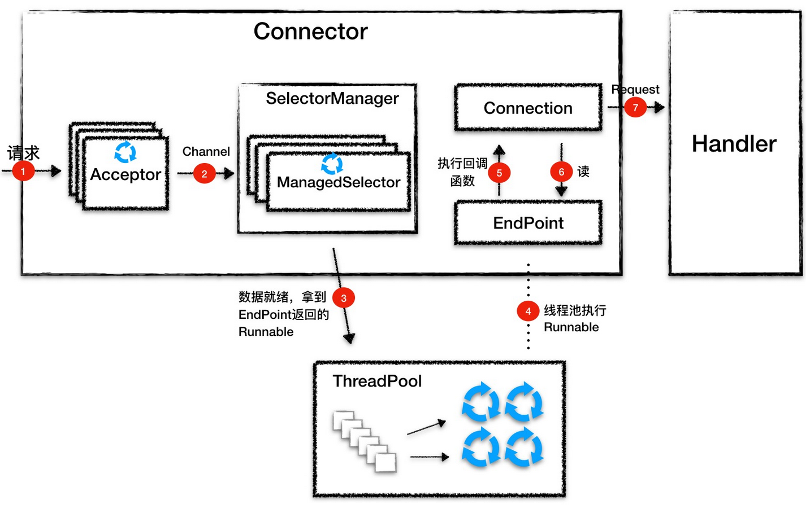

- 1.Acceptor 监听连接请求，当有连接请求到达时就接受连接，一个连接对应一个 Channel，Acceptor 将 Channel 交给 ManagedSelector 来处理。
- 2.ManagedSelector 把 Channel 注册到 Selector 上，并创建一个 EndPoint 和 Connection 跟这个 Channel 绑定，接着就不断地检测 I/O 事件。
- 3.I/O 事件到了就调用 EndPoint 的方法拿到一个 Runnable，并扔给线程池执行。
- 4.线程池中调度某个线程执行 Runnable。
- 5.Runnable 执行时，调用回调函数，这个回调函数是 Connection 注册到 EndPoint 中的。
- 6.回调函数内部实现，其实就是调用 EndPoint 的接口方法来读数据。
- 7.Connection 解析读到的数据，生成请求对象并交给 Handler 组件去处理。

> 总结

Jetty Server 就是由多个 Connector、多个 Handler，以及一个线程池组成，在设计上简洁明了。Jetty 的 Connector 只支持 NIO 模型，跟 Tomcat 的 NioEndpoint 组件一样，它也是通过 Java 的 NIO API 实现的。我们知道，Java NIO 编程有三个关键组件：Channel、Buffer 和 Selector，而核心是 Selector。为了方便使用，Jetty 在原生 Selector 组件的基础上做了一些封装，实现了 ManagedSelector 组件。在线程模型设计上 Tomcat 的 NioEndpoint 跟 Jetty 的 Connector 是相似的，都是用一个 Acceptor 数组监听连接，用一个 Selector 数组侦测 I/O 事件，用一个线程池执行请求。它们的不同点在于，Jetty 使用了一个全局的线程池，所有的线程资源都是从线程池来分配。Jetty Connector 设计中的一大特点是，使用了回调函数来模拟异步 I/O，比如 Connection 向 EndPoint 注册了一堆回调函数。它的本质将函数当作一个参数来传递，告诉对方，你准备好了就调这个回调函数。

> 思考

Jetty 的 Connector 主要完成了三件事件：接收连接、I/O 事件查询以及数据读写。因此 Jetty 设计了 Acceptor、SelectorManager 和 Connection 来做这三件事情。今天的思考题是，为什么要把这些组件跑在不同的线程里呢？


### 3、Jetty 的 Handler 组件的设计

Jetty 的 Handler 在设计上非常有意思，可以说是 Jetty 的灵魂，Jetty 通过 Handler 实现了高度可定制化，那具体是如何实现的呢？


#### 1、Handler 是什么

Handler 就是一个接口，它有一堆实现类，Jetty 的 Connector 组件调用这些接口来处理 Servlet 请求，我们先来看看这个接口定义成什么样子。

```java

public interface Handler extends LifeCycle, Destroyable
{
    //处理请求的方法
    public void handle(String target, Request baseRequest, HttpServletRequest request, HttpServletResponse response)
        throws IOException, ServletException;
    
    //每个Handler都关联一个Server组件，被Server管理
    public void setServer(Server server);
    public Server getServer();

    //销毁方法相关的资源
    public void destroy();
}
```

你会看到 Handler 接口的定义非常简洁，主要就是用 handle 方法用来处理请求，跟 Tomcat 容器组件的 service 方法一样，它有 ServletRequest 和 ServletResponse 两个参数。除此之外，这个接口中还有 setServer 和 getServer 方法，因为任何一个 Handler 都需要关联一个 Server 组件，也就是说 Handler 需要被 Server 组件来管理。一般来说 Handler 会加载一些资源到内存，因此通过设置 destroy 方法来销毁。

#### 2、Handler 继承关系

Handler 只是一个接口，完成具体功能的还是它的子类。那么 Handler 有哪些子类呢？它们的继承关系又是怎样的？这些子类是如何实现 Servlet 容器功能的呢？Jetty 中定义了一些默认 Handler 类，并且这些 Handler 类之间的继承关系比较复杂，我们先通过一个全景图来了解一下。为了避免让你感到不适，我对类图进行了简化。

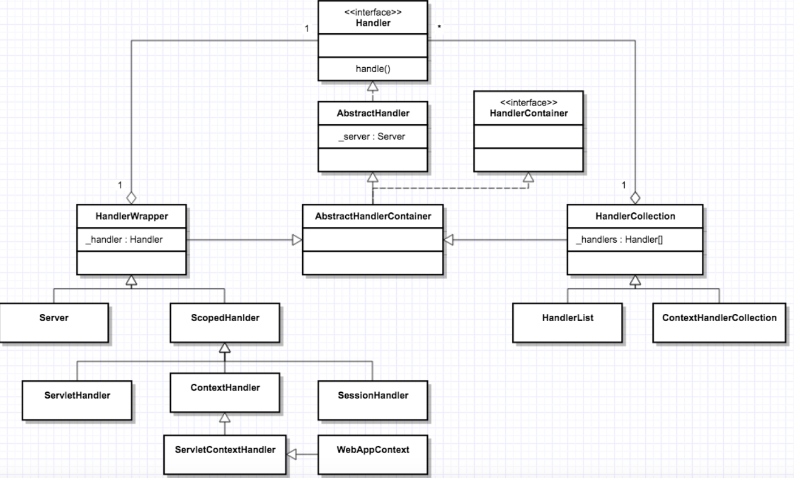


从图上你可以看到，Handler 的种类和层次关系还是比较复杂的：Handler 接口之下有抽象类 AbstractHandler，这一点并不意外，因为有接口一般就有抽象实现类。在 AbstractHandler 之下有 AbstractHandlerContainer，为什么需要这个类呢？这其实是个过渡，为了实现链式调用，一个 Handler 内部必然要有其他 Handler 的引用，所以这个类的名字里才有 Container，意思就是这样的 Handler 里包含了其他 Handler 的引用。

理解了上面的 AbstractHandlerContainer，我们就能理解它的两个子类了：HandlerWrapper 和 HandlerCollection。简单来说就是，HandlerWrapper 和 HandlerCollection 都是 Handler，但是这些 Handler 里还包括其他 Handler 的引用。不同的是，HandlerWrapper 只包含一个其他 Handler 的引用，而 HandlerCollection 中有一个 Handler 数组的引用。

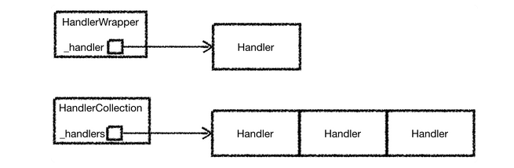


接着来看左边的 HandlerWrapper，它有两个子类：Server 和 ScopedHandler。Server 比较好理解，它本身是 Handler 模块的入口，必然要将请求传递给其他 Handler 来处理，为了触发其他 Handler 的调用，所以它是一个 HandlerWrapper。再看 ScopedHandler，它也是一个比较重要的 Handler，实现了“具有上下文信息”的责任链调用。为什么我要强调“具有上下文信息”呢？那是因为 Servlet 规范规定 Servlet 在执行过程中是有上下文的。那么这些 Handler 在执行过程中如何访问这个上下文呢？这个上下文又存在什么地方呢？答案就是通过 ScopedHandler 来实现的。

而 ScopedHandler 有一堆的子类，这些子类就是用来实现 Servlet 规范的，比如 ServletHandler、ContextHandler、SessionHandler、ServletContextHandler 和 WebAppContext。接下来我会详细介绍它们，但我们先把总体类图看完。

请看类图的右边，跟 HandlerWrapper 对等的还有 HandlerCollection，HandlerCollection 其实维护了一个 Handler 数组。你可能会问，为什么要发明一个这样的 Handler？这是因为 Jetty 可能需要同时支持多个 Web 应用，如果每个 Web 应用有一个 Handler 入口，那么多个 Web 应用的 Handler 就成了一个数组，比如 Server 中就有一个 HandlerCollection，Server 会根据用户请求的 URL 从数组中选取相应的 Handler 来处理，就是选择特定的 Web 应用来处理请求。


#### 3、Handler 的类型

虽然从类图上看 Handler 有很多，但是本质上这些 Handler 分成三种类型：

- 第一种是协调 Handler，这种 Handler 负责将请求路由到一组 Handler 中去，比如上图中的 HandlerCollection，它内部持有一个 Handler 数组，当请求到来时，它负责将请求转发到数组中的某一个 Handler。

- 第二种是过滤器 Handler，这种 Handler 自己会处理请求，处理完了后再把请求转发到下一个 Handler，比如图上的 HandlerWrapper，它内部持有下一个 Handler 的引用。需要注意的是，所有继承了 HandlerWrapper 的 Handler 都具有了过滤器 Handler 的特征，比如 ContextHandler、SessionHandler 和 WebAppContext 等。

- 第三种是内容 Handler，说白了就是这些 Handler 会真正调用 Servlet 来处理请求，生成响应的内容，比如 ServletHandler。如果浏览器请求的是一个静态资源，也有相应的 ResourceHandler 来处理这个请求，返回静态页面。


#### 4、如何实现 Servlet 规范

上文提到，ServletHandler、ContextHandler 以及 WebAppContext 等，它们实现了 Servlet 规范，那具体是怎么实现的呢？为了帮助你理解，在这之前，我们还是来看看如何使用 Jetty 来启动一个 Web 应用。

```java

//新建一个WebAppContext，WebAppContext是一个Handler
WebAppContext webapp = new WebAppContext();
webapp.setContextPath("/mywebapp");
webapp.setWar("mywebapp.war");

//将Handler添加到Server中去
server.setHandler(webapp);

//启动Server
server.start();
server.join();
```

面的过程主要分为两步：

- 第一步创建一个 WebAppContext，接着设置一些参数到这个 Handler 中，就是告诉 WebAppContext 你的 WAR 包放在哪，Web 应用的访问路径是什么。

- 第二步就是把新创建的 WebAppContext 添加到 Server 中，然后启动 Server。


WebAppContext 对应一个 Web 应用。我们回忆一下 Servlet 规范中有 Context、Servlet、Filter、Listener 和 Session 等，Jetty 要支持 Servlet 规范，就需要有相应的 Handler 来分别实现这些功能。因此，Jetty 设计了 3 个组件：ContextHandler、ServletHandler 和 SessionHandler 来实现 Servlet 规范中规定的功能，而 WebAppContext 本身就是一个 ContextHandler，另外它还负责管理 ServletHandler 和 SessionHandler。

我们再来看一下什么是 ContextHandler。ContextHandler 会创建并初始化 Servlet 规范里的 ServletContext 对象，同时 ContextHandler 还包含了一组能够让你的 Web 应用运行起来的 Handler，可以这样理解，Context 本身也是一种 Handler，它里面包含了其他的 Handler，这些 Handler 能处理某个特定 URL 下的请求。比如，ContextHandler 包含了一个或者多个 ServletHandler。

再来看 ServletHandler，它实现了 Servlet 规范中的 Servlet、Filter 和 Listener 的功能。ServletHandler 依赖 FilterHolder、ServletHolder、ServletMapping、FilterMapping 这四大组件。FilterHolder 和 ServletHolder 分别是 Filter 和 Servlet 的包装类，每一个 Servlet 与路径的映射会被封装成 ServletMapping，而 Filter 与拦截 URL 的映射会被封装成 FilterMapping。

SessionHandler 从名字就知道它的功能，用来管理 Session。除此之外 WebAppContext 还有一些通用功能的 Handler，比如 SecurityHandler 和 GzipHandler，同样从名字可以知道这些 Handler 的功能分别是安全控制和压缩 / 解压缩。


WebAppContext 会将这些 Handler 构建成一个执行链，通过这个链会最终调用到我们的业务 Servlet。我们通过一张图来理解一下。

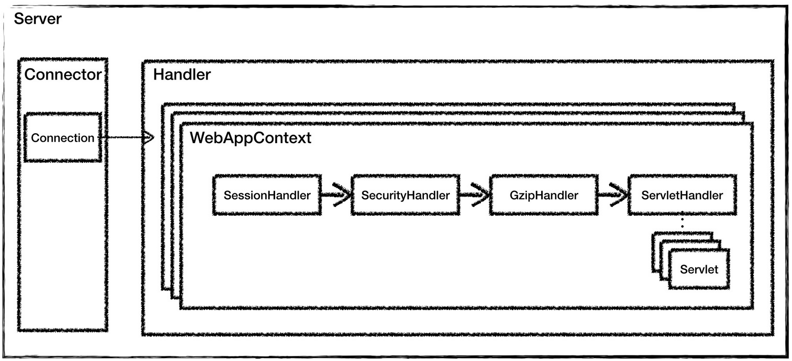

通过对比 Tomcat 的架构图，你可以看到，Jetty 的 Handler 组件和 Tomcat 中的容器组件是大致是对等的概念，Jetty 中的 WebAppContext 相当于 Tomcat 的 Context 组件，都是对应一个 Web 应用；而 Jetty 中的 ServletHandler 对应 Tomcat 中的 Wrapper 组件，它负责初始化和调用 Servlet，并实现了 Filter 的功能。

对于一些通用组件，比如安全和解压缩，在 Jetty 中都被做成了 Handler，这是 Jetty Handler 架构的特点。因此对于 Jetty 来说，请求处理模块就被抽象成 Handler，不管是实现了 Servlet 规范的 Handler，还是实现通用功能的 Handler，比如安全、解压缩等，我们可以任意添加或者裁剪这些“功能模块”，从而实现高度的可定制化。

> 总结

Jetty Server 就是由多个 Connector、多个 Handler，以及一个线程池组成。Jetty 的 Handler 设计是它的一大特色，Jetty 本质就是一个 Handler 管理器，Jetty 本身就提供了一些默认 Handler 来实现 Servlet 容器的功能，你也可以定义自己的 Handler 来添加到 Jetty 中，这体现了“微内核 + 插件”的设计思想。

> 思考

通过今天的学习，我们知道各种 Handler 都会对请求做一些处理，再将请求传给下一个 Handler，而 Servlet 也是用来处理请求的，那 Handler 跟 Servlet 有什么区别呢？


## 06、从Tomcat和Jetty中提炼组件化设计规范

### 1、组件化及可配置

Tomcat 和 Jetty 的整体架构都是基于组件的，你可以通过 XML 文件或者代码的方式来配置这些组件，比如我们可以在 server.xml 配置 Tomcat 的连接器以及容器组件。相应的，你也可以在 jetty.xml 文件里组装 Jetty 的 Connector 组件，以及各种 Handler 组件。也就是说，`Tomcat 和 Jetty 提供了一堆积木，怎么搭建这些积木由你来决定`，你可以根据自己的需要灵活选择组件来搭建你的 Web 容器，并且也可以自定义组件，这样的设计为 Web 容器提供了深度可定制化。


那 Web 容器如何实现这种组件化设计呢？我认为有两个要点：

- 第一个是面向接口编程。我们需要对系统的功能按照“高内聚、低耦合”的原则进行拆分，每个组件都有相应的接口，组件之间通过接口通信，这样就可以方便地替换组件了。比如我们可以选择不同连接器类型，只要这些连接器组件实现同一个接口就行。

- 第二个是 Web 容器提供一个载体把组件组装在一起工作。组件的工作无非就是处理请求，因此容器通过责任链模式把请求依次交给组件去处理。对于用户来说，我只需要告诉 Web 容器由哪些组件来处理请求。把组件组织起来需要一个“管理者”，这就是为什么 Tomcat 和 Jetty 都有一个 Server 的概念，Server 就是组件的载体，Server 里包含了连接器组件和容器组件；容器还需要把请求交给各个子容器组件去处理，Tomcat 和 Jetty 都是责任链模式来实现的。


用户通过配置来组装组件，跟 Spring 中 Bean 的依赖注入相似。Spring 的用户可以通过配置文件或者注解的方式来组装 Bean，Bean 与 Bean 的依赖关系完全由用户自己来定义。这一点与 Web 容器不同，Web 容器中组件与组件之间的关系是固定的，比如 Tomcat 中 Engine 组件下有 Host 组件、Host 组件下有 Context 组件等，但你不能在 Host 组件里“注入”一个 Wrapper 组件，这是由于 Web 容器本身的功能来决定的。

### 2、组件的创建

由于组件是可以配置的，Web 容器在启动之前并不知道要创建哪些组件，也就是说，不能通过硬编码的方式来实例化这些组件，而是需要通过反射机制来动态地创建。具体来说，Web 容器不是通过 new 方法来实例化组件对象的，而是通过 Class.forName 来创建组件。无论哪种方式，在实例化一个类之前，Web 容器需要把组件类加载到 JVM，这就涉及一个类加载的问题，Web 容器设计了自己类加载器，我会在专栏后面的文章详细介绍 Tomcat 的类加载器。


Spring 也是通过反射机制来动态地实例化 Bean，那么它用到的类加载器是从哪里来的呢？Web 容器给每个 Web 应用创建了一个类加载器，Spring 用到的类加载器是 Web 容器传给它的。

### 3、组件的生命周期管理

不同类型的组件具有父子层次关系，父组件处理请求后再把请求传递给某个子组件。你可能会感到疑惑，Jetty 的中 Handler 不是一条链吗，看上去像是平行关系？其实不然，Jetty 中的 Handler 也是分层次的，比如 WebAppContext 中包含 ServletHandler 和 SessionHandler。因此你也可以把 ContextHandler 和它所包含的 Handler 看作是父子关系。

而 Tomcat 通过容器的概念，把小容器放到大容器来实现父子关系，其实它们的本质都是一样的。这其实涉及如何统一管理这些组件，如何做到一键式启停。

Tomcat 和 Jetty 都采用了类似的办法来管理组件的生命周期，主要有两个要点，一是父组件负责子组件的创建、启停和销毁。这样只要启动最上层组件，整个 Web 容器就被启动起来了，也就实现了一键式启停；二是 Tomcat 和 Jetty 都定义了组件的生命周期状态，并且把组件状态的转变定义成一个事件，一个组件的状态变化会触发子组件的变化，比如 Host 容器的启动事件里会触发 Web 应用的扫描和加载，最终会在 Host 容器下创建相应的 Context 容器，而 Context 组件的启动事件又会触发 Servlet 的扫描，进而创建 Wrapper 组件。那么如何实现这种联动呢？答案是观察者模式。具体来说就是创建监听器去监听容器的状态变化，在监听器的方法里去实现相应的动作，这些监听器其实是组件生命周期过程中的“扩展点”。

Spring 也采用了类似的设计，Spring 给 Bean 生命周期状态提供了很多的“扩展点”。这些扩展点被定义成一个个接口，只要你的 Bean 实现了这些接口，Spring 就会负责调用这些接口，这样做的目的就是，当 Bean 的创建、初始化和销毁这些控制权交给 Spring 后，Spring 让你有机会在 Bean 的整个生命周期中执行你的逻辑。下面我通过一张图帮你理解 Spring Bean 的生命周期过程：

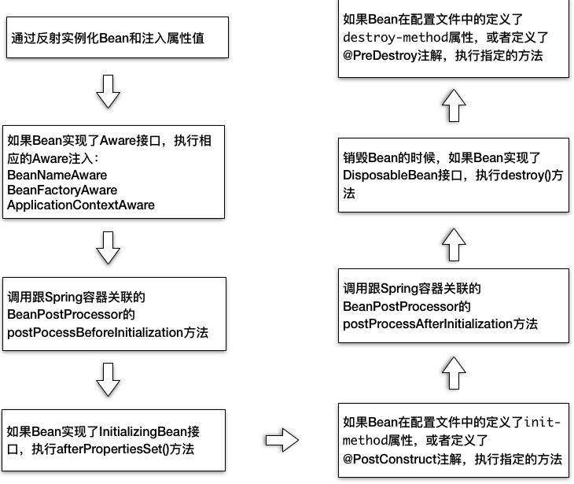

### 4、组件的骨架抽象类和模板模式

具体到组件的设计的与实现，Tomcat 和 Jetty 都大量采用了骨架抽象类和模板模式。比如说 Tomcat 中 ProtocolHandler 接口，ProtocolHandler 有抽象基类 AbstractProtocol，它实现了协议处理层的骨架和通用逻辑，而具体协议也有抽象基类，比如 HttpProtocol 和 AjpProtocol。对于 Jetty 来说，Handler 接口之下有 AbstractHandler，Connector 接口之下有 AbstractConnector，这些抽象骨架类实现了一些通用逻辑，并且会定义一些抽象方法，这些抽象方法由子类实现，抽象骨架类调用抽象方法来实现骨架逻辑。


这是一个通用的设计规范，不管是 Web 容器还是 Spring，甚至 JDK 本身都到处使用这种设计，比如 Java 集合中的 AbstractSet、AbstractMap 等。 值得一提的是，从 Java 8 开始允许接口有 default 方法，这样我们可以把抽象骨架类的通用逻辑放到接口中去。


> 总结

今天我总结了 Tomcat 和 Jetty 的组件化设计，我们可以通过搭积木的方式来定制化自己的 Web 容器。Web 容器为了支持这种组件化设计，遵循了一些规范，比如面向接口编程，用“管理者”去组装这些组件，用反射的方式动态的创建组件、统一管理组件的生命周期，并且给组件生命状态的变化提供了扩展点，组件的具体实现一般遵循骨架抽象类和模板模式。通过今天的学习，你会发现 Tomcat 和 Jetty 有很多共同点，并且 Spring 框架的设计也有不少相似的的地方，这正好说明了 Web 开发中有一些本质的东西是相通的，只要你深入理解了一个技术，也就是在一个点上突破了深度，再扩展广度就不是难事。并且我建议在学习一门技术的时候，可以回想一下之前学过的东西，是不是有相似的地方，有什么不同的地方，通过对比理解它们的本质，这样我们才能真正掌握这些技术背后的精髓。


## 07、优化并提高Tomcat启动速度

针对 Tomcat 8.5 和 9.0 版本，给出几条非常明确的建议

https://cwiki.apache.org/confluence/display/tomcat/HowTo/FasterStartUp

### 1. 清理不必要的 Web 应用

首先我们要做的是删除掉 webapps 文件夹下不需要的工程，一般是 host-manager、example、doc 等这些默认的工程，可能还有以前添加的但现在用不着的工程，最好把这些全都删除掉。如果你看过 Tomcat 的启动日志，可以发现每次启动 Tomcat，都会重新布署这些工程。

### 2. 清理 XML 配置文件

我们知道 Tomcat 在启动的时候会解析所有的 XML 配置文件，但 XML 解析的代价可不小，因此我们要尽量保持配置文件的简洁，需要解析的东西越少，速度自然就会越快。


### 3. 清理 JAR 文件

我们还可以删除所有不需要的 JAR 文件。JVM 的类加载器在加载类时，需要查找每一个 JAR 文件，去找到所需要的类。如果删除了不需要的 JAR 文件，查找的速度就会快一些。这里请注意：Web 应用中的 lib 目录下不应该出现 Servlet API 或者 Tomcat 自身的 JAR，这些 JAR 由 Tomcat 负责提供。如果你是使用 Maven 来构建你的应用，对 Servlet API 的依赖应该指定为provided。

### 4. 清理其他文件

及时清理日志，删除 logs 文件夹下不需要的日志文件。同样还有 work 文件夹下的 catalina 文件夹，它其实是 Tomcat 把 JSP 转换为 Class 文件的工作目录。有时候我们也许会遇到修改了代码，重启了 Tomcat，但是仍没效果，这时候便可以删除掉这个文件夹，Tomcat 下次启动的时候会重新生成。


### 5. 禁止 Tomcat TLD 扫描

Tomcat 为了支持 JSP，在应用启动的时候会扫描 JAR 包里面的 TLD 文件，加载里面定义的标签库，所以在 Tomcat 的启动日志里，你可能会碰到这种提示：

```
At least one JAR was scanned for TLDs yet contained no TLDs. Enable debug logging for this logger for a complete list of JARs that were scanned but no TLDs were found in them. Skipping unneeded JARs during scanning can improve startup time and JSP compilation time.
```

Tomcat 的意思是，我扫描了你 Web 应用下的 JAR 包，发现 JAR 包里没有 TLD 文件。我建议配置一下 Tomcat 不要去扫描这些 JAR 包，这样可以提高 Tomcat 的启动速度，并节省 JSP 编译时间。

那如何配置不去扫描这些 JAR 包呢，这里分两种情况：

1、如果你的项目没有使用 JSP 作为 Web 页面模板，而是使用 Velocity 之类的模板引擎，你完全可以把 TLD 扫描禁止掉。方法是，找到 Tomcat 的conf/目录下的context.xml文件，在这个文件里 Context 标签下，加上 JarScanner 和 JarScanFilter 子标签，像下面这样。

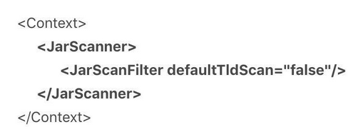


2、如果你的项目使用了 JSP 作为 Web 页面模块，意味着 TLD 扫描无法避免，但是我们可以通过配置来告诉 Tomcat，只扫描那些包含 TLD 文件的 JAR 包。方法是，找到 Tomcat 的conf/目录下的catalina.properties文件，在这个文件里的 jarsToSkip 配置项中，加上你的 JAR 包。


tomcat.util.scan.StandardJarScanFilter.jarsToSkip=xxx.jar

### 6、关闭 WebSocket 支持

Tomcat 会扫描 WebSocket 注解的 API 实现，比如@ServerEndpoint注解的类。我们知道，注解扫描一般是比较慢的，如果不需要使用 WebSocket 就可以关闭它。具体方法是，找到 Tomcat 的conf/目录下的context.xml文件，给 Context 标签加一个 containerSciFilter 的属性，像下面这样。

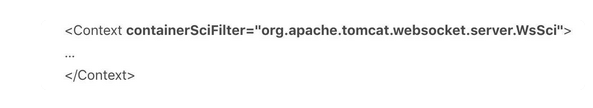

更进一步，如果你不需要 WebSocket 这个功能，你可以把 Tomcat lib 目录下的websocket-api.jar和tomcat-websocket.jar这两个 JAR 文件删除掉，进一步提高性能。

### 7、关闭 JSP 支持

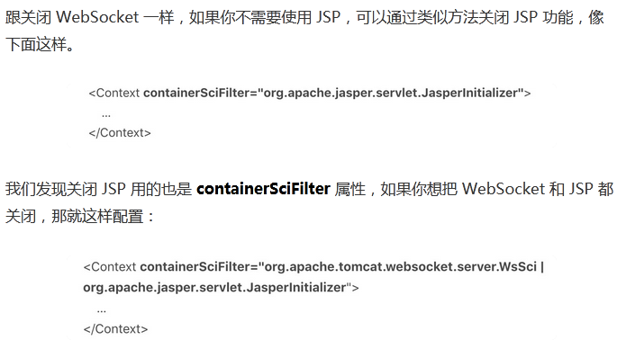


### 8、禁止 Servlet 注解扫描

Servlet 3.0 引入了注解 Servlet，Tomcat 为了支持这个特性，会在 Web 应用启动时扫描你的类文件，因此如果你没有使用 Servlet 注解这个功能，可以告诉 Tomcat 不要去扫描 Servlet 注解。具体配置方法是，在你的 Web 应用的web.xml文件中，设置元素的属性metadata-complete="true"，像下面这样。


metadata-complete的意思是，web.xml里配置的 Servlet 是完整的，不需要再去库类中找 Servlet 的定义。


### 9、配置 Web-Fragment 扫描

Servlet 3.0 还引入了“Web 模块部署描述符片段”的web-fragment.xml，这是一个部署描述文件，可以完成web.xml的配置功能。而这个web-fragment.xml文件必须存放在 JAR 文件的META-INF目录下，而 JAR 包通常放在WEB-INF/lib目录下，因此 Tomcat 需要对 JAR 文件进行扫描才能支持这个功能。你可以通过配置web.xml里面的元素直接指定了哪些 JAR 包需要扫描web fragment，如果元素是空的， 则表示不需要扫描，像下面这样。

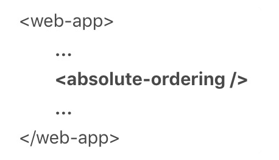

### 10、随机数熵源优化

这是一个比较有名的问题。Tomcat 7 以上的版本依赖 Java 的 SecureRandom 类来生成随机数，比如 Session ID。而 JVM 默认使用阻塞式熵源（/dev/random）， 在某些情况下就会导致 Tomcat 启动变慢。当阻塞时间较长时， 你会看到这样一条警告日志：

org.apache.catalina.util.SessionIdGenerator createSecureRandomINFO: Creation of SecureRandom instance for session ID generation using [SHA1PRNG] took [8152] milliseconds.

解决方案是通过设置，让 JVM 使用非阻塞式的熵源。我们可以设置 JVM 的参数：

 -Djava.security.egd=file:/dev/./urandom

或者是设置java.security文件，位于$JAVA_HOME/jre/lib/security目录之下： securerandom.source=file:/dev/./urandom这里请你注意，/dev/./urandom中间有个./的原因是 Oracle JRE 中的 Bug，Java 8 里面的 SecureRandom 类已经修正这个 Bug。 阻塞式的熵源（/dev/random）安全性较高， 非阻塞式的熵源（/dev/./urandom）安全性会低一些，因为如果你对随机数的要求比较高， 可以考虑使用硬件方式生成熵源。

### 11、并行启动多个 Web 应用

Tomcat 启动的时候，默认情况下 Web 应用都是一个一个启动的，等所有 Web 应用全部启动完成，Tomcat 才算启动完毕。如果在一个 Tomcat 下你有多个 Web 应用，为了优化启动速度，你可以配置多个应用程序并行启动，可以通过修改server.xml中 Host 元素的 startStopThreads 属性来完成。startStopThreads 的值表示你想用多少个线程来启动你的 Web 应用，如果设成 0 表示你要并行启动 Web 应用，像下面这样的配置。

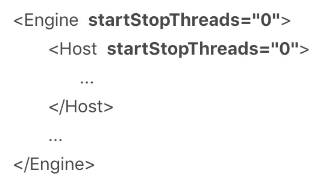

这里需要注意的是，Engine 元素里也配置了这个参数，这意味着如果你的 Tomcat 配置了多个 Host（虚拟主机），Tomcat 会以并行的方式启动多个 Host。

