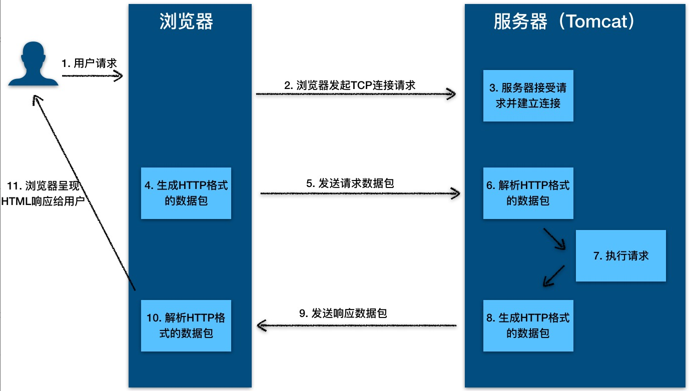
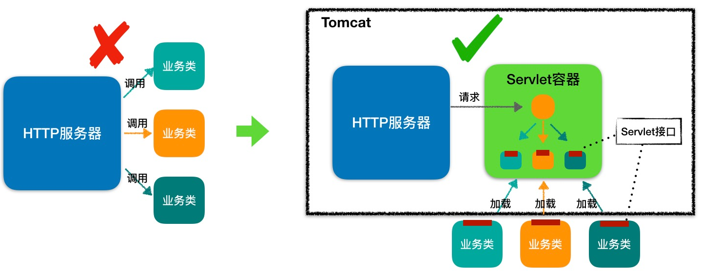
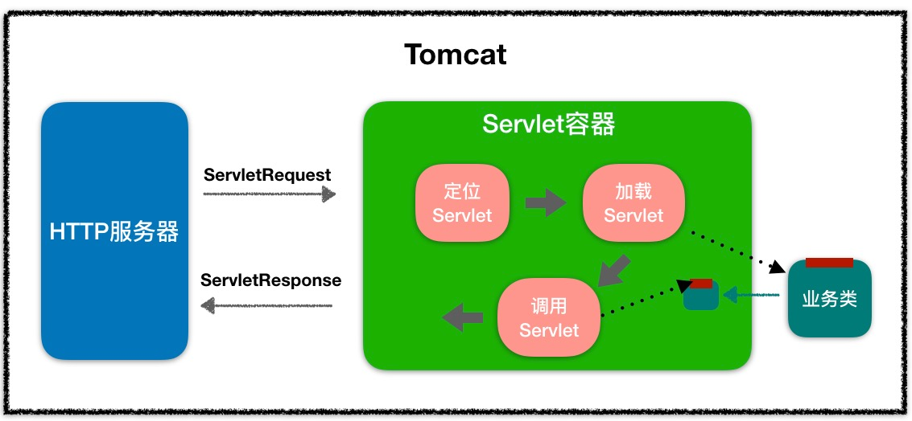
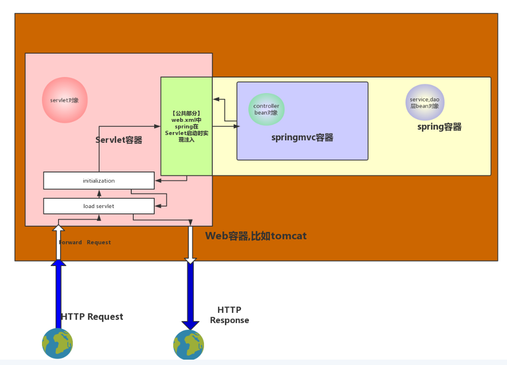

<!-- TOC -->

- [1、HTTP 的本质](#1http-的本质)
- [2、HTTP 工作原理](#2http-工作原理)
- [3、Servlet规范和Servlet容器](#3servlet规范和servlet容器)
    - [1、Servlet 接口](#1servlet-接口)
    - [2、Servlet 容器](#2servlet-容器)
        - [1、工作流程](#1工作流程)
        - [2、Web 应用](#2web-应用)
        - [3、扩展机制](#3扩展机制)
        - [4、和spring容器直接的关系](#4和spring容器直接的关系)
- [参考](#参考)

<!-- /TOC -->


Tomcat 和 Jetty 本身就是一个“HTTP 服务器 + Servlet 容器（运行实现了servlet接口的实例）”;

# 1、HTTP 的本质

HTTP 协议的本质就是一种浏览器与服务器之间约定好的通信格式

HTTP 协议是浏览器与服务器之间的数据传送协议。作为应用层协议，HTTP 是基于 TCP/IP 协议来传递数据的（HTML 文件、图片、查询结果等），HTTP 协议不涉及数据包（Packet）传输，主要规定了客户端和服务器之间的通信格式。

下面我通过一个例子来告诉你 HTTP 的本质是什么。

假如浏览器需要从远程 HTTP 服务器获取一个 HTML 文本，在这个过程中，浏览器实际上要做两件事情。

- 1、与服务器建立 Socket 连接。
- 2、生成请求数据并通过 Socket 发送出去。

# 2、HTTP 工作原理



从图上你可以看到，这个过程是：
- 1.用户通过浏览器进行了一个操作，比如输入网址并回车，或者是点击链接，接着浏览器获取了这个事件。
- 2.浏览器向服务端发出 TCP 连接请求。
- 3.服务程序接受浏览器的连接请求，并经过 TCP 三次握手建立连接。
- 4.浏览器将请求数据打包成一个 HTTP 协议格式的数据包。
- 5.浏览器将该数据包推入网络，数据包经过网络传输，最终达到端服务程序。
- 6.服务端程序拿到这个数据包后，同样以 HTTP 协议格式解包，获取到客户端的意图。
- 7.得知客户端意图后进行处理，比如提供静态文件或者调用服务端程序获得动态结果。
- 8.服务器将响应结果（可能是 HTML 或者图片等）按照 HTTP 协议格式打包。
- 9.服务器将响应数据包推入网络，数据包经过网络传输最终达到到浏览器。
- 10.浏览器拿到数据包后，以 HTTP 协议的格式解包，然后解析数据，假设这里的数据是 HTML。
- 11.浏览器将 HTML 文件展示在页面上。


那我们想要探究的 Tomcat 和 Jetty 作为一个 HTTP 服务器，在这个过程中都做了些什么事情呢？主要是接受连接、解析请求数据、处理请求和发送响应这几个步骤。这里请你注意，可能有成千上万的浏览器同时请求同一个 HTTP 服务器，因此 Tomcat 和 Jetty 为了提高服务的能力和并发度，往往会将自己要做的几个事情并行化，具体来说就是使用多线程的技术。


在 HTTP/1.0 时期，每次 HTTP 请求都会创建一个新的 TCP 连接，请求完成后之后这个 TCP 连接就会被关闭。这种通信模式的效率不高，所以在 HTTP/1.1 中，引入了 HTTP 长连接的概念，使用长连接的 HTTP 协议，会在响应头加入 Connection:keep-alive。这样当浏览器完成一次请求后，浏览器和服务器之间的 TCP 连接不会关闭，再次访问这个服务器上的网页时，浏览器会继续使用这一条已经建立的连接，也就是说两个请求可能共用一个 TCP 连接。


# 3、Servlet规范和Servlet容器

我们知道，浏览器发给服务端的是一个 HTTP 格式的请求，HTTP 服务器收到这个请求后，需要调用服务端程序来处理，所谓的服务端程序就是你写的 Java 类，一般来说不同的请求需要由不同的 Java 类来处理。


那么问题来了，HTTP 服务器怎么知道要调用哪个 Java 类的哪个方法呢。最直接的做法是在 HTTP 服务器代码里写一大堆 if else 逻辑判断：如果是 A 请求就调 X 类的 M1 方法，如果是 B 请求就调 Y 类的 M2 方法。但这样做明显有问题，因为 HTTP 服务器的代码跟业务逻辑耦合在一起了，如果新加一个业务方法还要改 HTTP 服务器的代码。


那该怎么解决这个问题呢？我们知道，面向接口编程是解决耦合问题的法宝，于是有一伙人就定义了一个接口，各种业务类都必须实现这个接口，这个接口就叫 Servlet 接口，有时我们也把实现了 Servlet 接口的业务类叫作 Servlet。


但是这里还有一个问题，对于特定的请求，HTTP 服务器如何知道由哪个 Servlet 来处理呢？Servlet 又是由谁来实例化呢？显然 HTTP 服务器不适合做这个工作，否则又和业务类耦合了。


于是，还是那伙人又发明了 Servlet 容器，Servlet 容器用来加载和管理业务类。HTTP 服务器不直接跟业务类打交道，而是把请求交给 Servlet 容器去处理，Servlet 容器会将请求转发到具体的 Servlet，如果这个 Servlet 还没创建，就加载并实例化这个 Servlet，然后调用这个 Servlet 的接口方法。因此 Servlet 接口其实是 Servlet 容器跟具体业务类之间的接口。下面我们通过一张图来加深理解。




图的左边表示 HTTP 服务器直接调用具体业务类，它们是紧耦合的。再看图的右边，HTTP 服务器不直接调用业务类，而是把请求交给容器来处理，容器通过 Servlet 接口调用业务类。因此 Servlet 接口和 Servlet 容器的出现，达到了 HTTP 服务器与业务类解耦的目的。

而 Servlet 接口和 Servlet 容器这一整套规范叫作 Servlet 规范。Tomcat 和 Jetty 都按照 Servlet 规范的要求实现了 Servlet 容器，同时它们也具有 HTTP 服务器的功能。作为 Java 程序员，如果我们要实现新的业务功能，只需要实现一个 Servlet，并把它注册到 Tomcat（Servlet 容器）中，剩下的事情就由 Tomcat 帮我们处理了。


## 1、Servlet 接口

Servlet 接口定义了下面五个方法：

```java

public interface Servlet {
    void init(ServletConfig config) throws ServletException;
    
    ServletConfig getServletConfig();
    
    void service(ServletRequest req, ServletResponse res）throws ServletException, IOException;
    
    String getServletInfo();
    
    void destroy();
}
```

其中最重要是的 service 方法，具体业务类在这个方法里实现处理逻辑。这个方法有两个参数：ServletRequest 和 ServletResponse。ServletRequest 用来封装请求信息，ServletResponse 用来封装响应信息，因此本质上这两个类是对通信协议的封装。

比如 HTTP 协议中的请求和响应就是对应了 HttpServletRequest 和 HttpServletResponse 这两个类。你可以通过 HttpServletRequest 来获取所有请求相关的信息，包括请求路径、Cookie、HTTP 头、请求参数等。

你可以看到接口中还有两个跟生命周期有关的方法 init 和 destroy，这是一个比较贴心的设计，Servlet 容器在加载 Servlet 类的时候会调用 init 方法，在卸载的时候会调用 destroy 方法。我们可能会在 init 方法里初始化一些资源，并在 destroy 方法里释放这些资源，比如 Spring MVC 中的 DispatcherServlet，就是在 init 方法里创建了自己的 Spring 容器。

你还会注意到 ServletConfig 这个类，ServletConfig 的作用就是封装 Servlet 的初始化参数。你可以在web.xml给 Servlet 配置参数，并在程序里通过 getServletConfig 方法拿到这些参数。

我们知道，有接口一般就有抽象类，抽象类用来实现接口和封装通用的逻辑，因此 Servlet 规范提供了 GenericServlet 抽象类，我们可以通过扩展它来实现 Servlet。虽然 Servlet 规范并不在乎通信协议是什么，但是大多数的 Servlet 都是在 HTTP 环境中处理的，因此 Servet 规范还提供了 HttpServlet 来继承 GenericServlet，并且加入了 HTTP 特性。这样我们通过继承 HttpServlet 类来实现自己的 Servlet，只需要重写两个方法：doGet 和 doPost。


## 2、Servlet 容器

为了解耦，HTTP 服务器不直接调用 Servlet，而是把请求交给 Servlet 容器来处理，那 Servlet 容器又是怎么工作的呢？接下来我会介绍 Servlet 容器大体的工作流程，一起来聊聊我们非常关心的两个话题：Web 应用的目录格式是什么样的，以及我该怎样扩展和定制化 Servlet 容器的功能。


### 1、工作流程

当客户请求某个资源时，HTTP 服务器会用一个 ServletRequest 对象把客户的请求信息封装起来，然后调用 Servlet 容器的 service 方法，Servlet 容器拿到请求后，根据请求的 URL 和 Servlet 的映射关系，找到相应的 Servlet，如果 Servlet 还没有被加载，就用反射机制创建这个 Servlet，并调用 Servlet 的 init 方法来完成初始化，接着调用 Servlet 的 service 方法来处理请求，把 ServletResponse 对象返回给 HTTP 服务器，HTTP 服务器会把响应发送给客户端。同样我通过一张图来帮助你理解。




### 2、Web 应用

Servlet 容器会实例化和调用 Servlet，那 Servlet 是怎么注册到 Servlet 容器中的呢？一般来说，我们是以 Web 应用程序的方式来部署 Servlet 的，而根据 Servlet 规范，Web 应用程序有一定的目录结构，在这个目录下分别放置了 Servlet 的类文件、配置文件以及静态资源，Servlet 容器通过读取配置文件，就能找到并加载 Servlet。Web 应用的目录结构大概是下面这样的：

```
| -  MyWebApp
      | -  WEB-INF/web.xml        -- 配置文件，用来配置Servlet等
      | -  WEB-INF/lib/           -- 存放Web应用所需各种JAR包
      | -  WEB-INF/classes/       -- 存放你的应用类，比如Servlet类
      | -  META-INF/              -- 目录存放工程的一些信息
```


Servlet 规范里定义了 ServletContext 这个接口来对应一个 Web 应用。Web 应用部署好后，Servlet 容器在启动时会加载 Web 应用，并为每个 Web 应用创建唯一的 ServletContext 对象。你可以把 ServletContext 看成是一个全局对象，一个 Web 应用可能有多个 Servlet，这些 Servlet 可以通过全局的 ServletContext 来共享数据，这些数据包括 Web 应用的初始化参数、Web 应用目录下的文件资源等。由于 ServletContext 持有所有 Servlet 实例，你还可以通过它来实现 Servlet 请求的转发。


### 3、扩展机制

引入了 Servlet 规范后，你不需要关心 Socket 网络通信、不需要关心 HTTP 协议，也不需要关心你的业务类是如何被实例化和调用的，因为这些都被 Servlet 规范标准化了，你只要关心怎么实现的你的业务逻辑。这对于程序员来说是件好事，但也有不方便的一面。所谓规范就是说大家都要遵守，就会千篇一律，但是如果这个规范不能满足你的业务的个性化需求，就有问题了，因此设计一个规范或者一个中间件，要充分考虑到可扩展性。Servlet 规范提供了两种扩展机制：Filter 和 Listener。


Filter 是过滤器，这个接口允许你对请求和响应做一些统一的定制化处理，比如你可以根据请求的频率来限制访问，或者根据国家地区的不同来修改响应内容。过滤器的工作原理是这样的：Web 应用部署完成后，Servlet 容器需要实例化 Filter 并把 Filter 链接成一个 FilterChain。当请求进来时，获取第一个 Filter 并调用 doFilter 方法，doFilter 方法负责调用这个 FilterChain 中的下一个 Filter。


Listener 是监听器，这是另一种扩展机制。当 Web 应用在 Servlet 容器中运行时，Servlet 容器内部会不断的发生各种事件，如 Web 应用的启动和停止、用户请求到达等。 Servlet 容器提供了一些默认的监听器来监听这些事件，当事件发生时，Servlet 容器会负责调用监听器的方法。当然，你可以定义自己的监听器去监听你感兴趣的事件，将监听器配置在web.xml中。比如 Spring 就实现了自己的监听器，来监听 ServletContext 的启动事件，目的是当 Servlet 容器启动时，创建并初始化全局的 Spring 容器。

### 4、和spring容器直接的关系

Tomcat&Jetty在启动时给每个Web应用创建一个全局的上下文环境，这个上下文就是ServletContext，其为后面的Spring容器提供宿主环境。

Tomcat&Jetty在启动过程中触发容器初始化事件，Spring的ContextLoaderListener会监听到这个事件，它的contextInitialized方法会被调用，在这个方法中，Spring会初始化全局的Spring根容器，这个就是Spring的IoC容器，IoC容器初始化完毕后，Spring将其存储到ServletContext中，便于以后来获取。

Tomcat&Jetty在启动过程中还会扫描Servlet，一个Web应用中的Servlet可以有多个，以SpringMVC中的DispatcherServlet为例，这个Servlet实际上是一个标准的前端控制器，用以转发、匹配、处理每个Servlet请求。

Servlet一般会延迟加载，当第一个请求达到时，Tomcat&Jetty发现DispatcherServlet还没有被实例化，就调用DispatcherServlet的init方法，DispatcherServlet在初始化的时候会建立自己的容器，叫做SpringMVC 容器，用来持有Spring MVC相关的Bean。同时，Spring MVC还会通过ServletContext拿到Spring根容器，并将Spring根容器设为SpringMVC容器的父容器，请注意，Spring MVC容器可以访问父容器中的Bean，但是父容器不能访问子容器的Bean， 也就是说Spring根容器不能访问SpringMVC容器里的Bean。说的通俗点就是，在Controller里可以访问Service对象，但是在Service里不可以访问Controller对象。



web容器中有servlet容器，spring项目部署后存在spring容器。其中spring控制service层和dao层的bean对象以及controller层bean对象。servlet容器控制servlet对象。项目启动是，首先 servlet初始化，初始化过程中通过web.xml中spring的配置加载spring配置，初始化spring容器。待容器加载完成。servlet初始化完成，则完成启动。springmvc是viewAndModie的请求传递和结果解析。本身并没有容器管理，都是交给spring管理。
HTTP请求到达web容器后，会到达Servlet容器，容器通过分发器分发到具体的spring的Controller层。执行业务操作后返回结果。


# 参考

- 极客时间---深入拆解Tomcat & Jetty 


