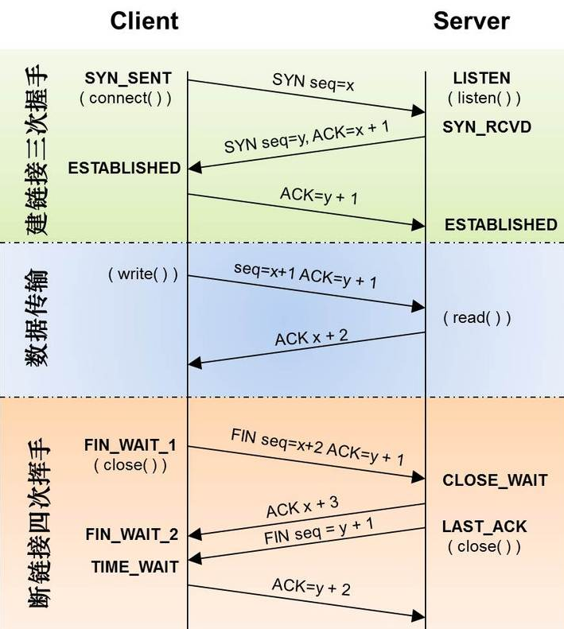
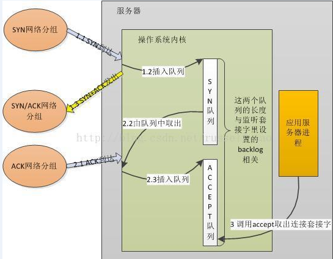
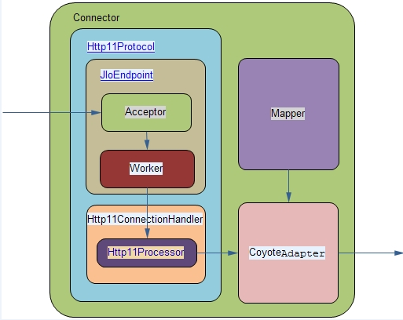
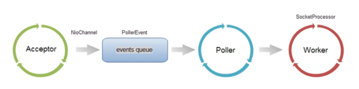
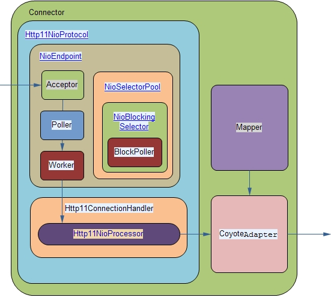
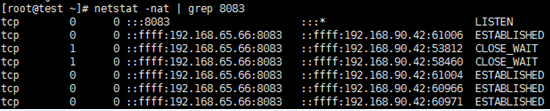
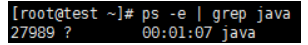
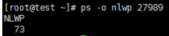
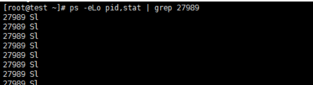

<!-- TOC -->

- [0、tcp相关](#0tcp相关)
    - [1、SYN攻击](#1syn攻击)
- [1、选择io模型和应用层协议](#1选择io模型和应用层协议)
- [2、BIO/NIO有何不同](#2bionio有何不同)
- [3、3个参数：acceptCount、maxConnections、maxThreads](#33个参数acceptcountmaxconnectionsmaxthreads)
    - [1、acceptCount（最大等待数）](#1acceptcount最大等待数)
    - [2、maxConnections（最大连接数）](#2maxconnections最大连接数)
    - [3、maxThreads（最大线程数）](#3maxthreads最大线程数)
    - [4、参数设置](#4参数设置)
- [4、线程池Executor](#4线程池executor)
- [5、查看当前状态](#5查看当前状态)
    - [1、连接数](#1连接数)
    - [2、线程](#2线程)
- [6、案例](#6案例)
- [9、总结](#9总结)
- [参考](#参考)

<!-- /TOC -->

# 0、tcp相关





tomcat有一个[acceptor线程]来accept socket连接，然后有[工作线程]来进行业务处理。对于client端的一个请求进来，流程是这样的：

- tcp的三次握手建立连接，建立连接的过程中，OS维护了半连接队列(syn队列)以及完全连接队列(accept队列)，
在第三次握手之后，server收到了client的ack，则进入establish的状态，然后该连接由syn队列移动到accept队列。

- tomcat的[acceptor线程]则负责从[accept队列]中取出该connection，接受该connection，然后交给工作线程去处理(读取请求参数、处理逻辑、返回响应等等；如果该连接不是keep alived的话，则关闭该连接，然后该工作线程释放回线程池，如果是keep alived的话，则等待下一个数据包的到来直到keepAliveTimeout，然后关闭该连接释放回线程池)，然后自己接着去accept队列取connection(当前socket连接超过maxConnections的时候，acceptor线程自己会阻塞等待，等连接降下去之后，才去处理accept队列的下一个连接)。[acceptCount指的就是这个accept队列的大小]


## 1、SYN攻击

在三次握手过程中，Server发送SYN-ACK之后，收到Client的ACK之前的TCP连接称为半连接（half-open connect），此时Server处于SYN_RCVD状态，当收到ACK后，Server转入ESTABLISHED状态。SYN攻击就是 Client在短时间内伪造大量不存在的IP地址，并向Server不断地发送SYN包，Server回复确认包，并等待Client的确认，由于源地址是不存在的，因此，Server需要不断重发直至超时，这些伪造的SYN包将产时间占用未连接队列，导致正常的SYN请求因为队列满而被丢弃，从而引起网络堵塞甚至系统瘫痪。SYN攻击时一种典型的DDOS攻击，检测SYN攻击的方式非常简单，即当Server上有大量半连接状态且源IP地址是随机的，则可以断定遭到SYN攻击了，使用如下命令可以让之现行：

netstat -nap | grep SYN_RECV


# 1、选择io模型和应用层协议

在使用tomcat时，经常会遇到连接数、线程数之类的配置问题，要真正理解这些概念，必须先了解Tomcat的连接器（Connector）。

Connector的主要功能，是接收连接请求，创建Request和Response对象用于和请求端交换数据；然后分配线程让Engine（也就是Servlet容器）来处理这个请求，并把产生的Request和Response对象传给Engine。当Engine处理完请求后，也会通过Connector将响应返回给客户端。

可以说，Servlet容器处理请求，是需要Connector进行调度和控制的，Connector是Tomcat处理请求的主干，因此Connector的配置和使用对Tomcat的性能有着重要的影响。

根据协议的不同，Connector可以分为HTTP Connector（重点）、AJP Connector等


Connector在处理HTTP请求时，会使用不同的protocol。不同的Tomcat版本支持的protocol不同，其中最典型的protocol包括BIO、NIO和APR（Tomcat7中支持这3种，Tomcat8增加了对NIO2的支持，而到了Tomcat8.5和Tomcat9.0，则去掉了对BIO的支持）。


Connector使用哪种protocol，可以通过<connector>元素中的protocol属性进行指定，也可以使用默认值。

指定的protocol取值及对应的协议如下：
- HTTP/1.1：默认值，使用的协议与Tomcat版本有关
- org.apache.coyote.http11.Http11Protocol：BIO
- org.apache.coyote.http11.Http11NioProtocol：NIO
- org.apache.coyote.http11.Http11Nio2Protocol：NIO2
- org.apache.coyote.http11.Http11AprProtocol：APR

如果没有指定protocol，则使用默认值HTTP/1.1，其含义如下：
- 在Tomcat7中，自动选取使用BIO或APR（如果找到APR需要的本地库，则使用APR，否则使用BIO）；
- 在Tomcat8中，自动选取使用NIO或APR（如果找到APR需要的本地库，则使用APR，否则使用NIO）。

# 2、BIO/NIO有何不同

无论是BIO，还是NIO，Connector处理请求的大致流程是一样的：

- 1、在accept队列中接收连接（当客户端向服务器发送请求时，如果客户端与OS完成三次握手建立了连接，则OS将该连接放入accept队列）；

- 2、在连接中获取请求的数据，生成request；调用servlet容器处理请求；返回response。

为了便于后面的说明，首先明确一下连接与请求的关系：连接是TCP层面的（传输层），对应socket；请求是HTTP层面的（应用层），必须依赖于TCP的连接实现；一个TCP连接中可能传输多个HTTP请求。

在BIO实现的Connector中，处理请求的主要实体是JIoEndpoint对象。JIoEndpoint维护了Acceptor和Worker：Acceptor接收socket，然后从Worker线程池中找出空闲的线程处理socket，如果worker线程池没有空闲线程，则Acceptor将阻塞。

其中Worker是Tomcat自带的线程池，如果通过<Executor>配置了其他线程池，原理与Worker类似。



在NIO实现的Connector中，处理请求的主要实体是NIoEndpoint对象。NIoEndpoint中除了包含Acceptor和Worker外，还是用了Poller，处理流程如下图所示





 
Acceptor接收socket后，不是直接使用Worker中的线程处理请求，而是先将请求发送给了Poller，
而Poller是实现NIO的关键。Acceptor向Poller发送请求通过队列实现，使用了典型的生产者-消费者模式。

在Poller中，维护了一个Selector对象；当Poller从队列中取出socket后，注册到该Selector中；
然后通过遍历Selector，找出其中可读的socket，并使用Worker中的线程处理相应请求。与BIO类似，Worker也可以被自定义的线程池代替。

通过上述过程可以看出，在NIoEndpoint处理请求的过程中，无论是Acceptor接收socket，还是线程处理请求，使用的仍然是阻塞方式；

但在“读取socket并交给Worker中的线程”的这个过程中，使用非阻塞的NIO实现，这是NIO模式与BIO模式的最主要区别（其他区别对性能影响较小，暂时略去不提）。而这个区别，在并发量较大的情形下可以带来Tomcat效率的显著提升.

目前大多数HTTP请求使用的是长连接（HTTP/1.1默认keep-alive为true），而长连接意味着，一个TCP的socket在当前请求结束后，如果没有新的请求到来，socket不会立马释放，而是等timeout后再释放。如果使用BIO，“读取socket并交给Worker中的线程”这个过程是阻塞的，也就意味着在socket等待下一个请求或等待释放的过程中，处理这个socket的工作线程会一直被占用，无法释放；因此Tomcat可以同时处理的socket数目不能超过最大线程数，性能受到了极大限制。

而使用NIO，“读取socket并交给Worker中的线程”这个过程是非阻塞的，当socket在等待下一个请求或等待释放时，并不会占用工作线程，因此Tomcat可以同时处理的socket数目远大于最大线程数，并发性能大大提高。

# 3、3个参数：acceptCount、maxConnections、maxThreads

> 总结

- maxThreads：tomcat起动的最大线程数，即同时处理的任务个数，默认值为200；
- maxConnections：取决于IO的链接方式，BOI默认和maxThreads一致，NIO默认10000；
- acceptCount：当tomcat起动的线程数达到最大时，接受排队的请求个数，默认值为100；

备注：在connector配置不同的协议protocol来决定使用哪种IO处理方式。

如果没有指定protocol，则使用默认值HTTP/1.1，其含义如下：
- 在Tomcat7中，自动选取使用BIO或APR（如果找到APR需要的本地库，则使用APR，否则使用BIO）；
- 在Tomcat8中，自动选取使用NIO或APR（如果找到APR需要的本地库，则使用APR，否则使用NIO）。


再回顾一下Tomcat处理请求的过程：在accept队列中接收连接（当客户端向服务器发送请求时，如果客户端与OS完成三次握手建立了连接，则OS将该连接放入accept队列）；在连接中获取请求的数据，生成request；调用servlet容器处理请求；返回response。

相对应的，Connector中的几个参数功能如下：

## 1、acceptCount（最大等待数）

accept队列的长度；当accept队列中连接的个数达到acceptCount时，队列满，进来的请求一律被拒绝。默认值是100。

acceptCount(backlog):在源码里头是backlog参数，默认值为100。该参数是指当前连接数超过maxConnections的时候，还可接受的连接数，即tcp的完全连接队列(accept队列)的大小。

backlog参数提示内核监听队列的最大长度。监听队列的长度如果超过backlog，服务器将不受理新的客户连接，客户端也将收到ECONNREFUSED错误信息。

在内核版本2.2之前的Linux中，backlog参数是指所有处于半连接状态（SYN_RCVD）和完全连接状态（ESTABLISHED）的socket的上限。但自内核版本2.2之后，它只表示处于完全连接状态的socket的上限，处于半连接状态的socket的上限则由/proc/sys/net/ipv4/tcp_max_syn_backlog内核参数定义。


当accept队列满了之后，即使client继续向server发送ACK的包，也会不被相应，此时，server通过/proc/sys/net/ipv4/tcp_abort_on_overflow来决定如何返回，0表示直接丢丢弃该ACK，1表示发送RST通知client；相应的，client则会分别返回read timeout 或者 connection reset by peer。

## 2、maxConnections（最大连接数）

`这个值表示最多可以有多少个socket连接到tomcat上。`

Tomcat在任意时刻接收和处理的最大连接数。[当Tomcat接收的连接数达到maxConnections时，Acceptor线程不会读取accept队列中的连接]；这时accept队列中的线程会一直阻塞着，直到Tomcat接收的连接数小于maxConnections。如果设置为-1，则连接数不受限制。

默认值与连接器使用的协议有关：NIO的默认值是10000，APR/native的默认值是8192，而BIO的默认值为maxThreads（如果配置了Executor，则默认值是Executor的maxThreads）。

在windows下，APR/native的maxConnections值会自动调整为设置值以下最大的1024的整数倍；如设置为2000，则最大值实际是1024。

```java
 // --------------------------------------------------- Acceptor Inner Class
    /**
     * The background thread that listens for incoming TCP/IP connections and
     * hands them off to an appropriate processor.
     */
    protected class Acceptor extends AbstractEndpoint.Acceptor {

        @Override
        public void run() {

            int errorDelay = 0;

            // Loop until we receive a shutdown command
            while (running) {

                // Loop if endpoint is paused
                while (paused && running) {
                    state = AcceptorState.PAUSED;
                    try {
                        Thread.sleep(50);
                    } catch (InterruptedException e) {
                        // Ignore
                    }
                }

                if (!running) {
                    break;
                }
                state = AcceptorState.RUNNING;

                try {
                    //if we have reached max connections, wait
                    countUpOrAwaitConnection();

                    SocketChannel socket = null;
                    try {
                        // Accept the next incoming connection from the server
                        // socket
                        socket = serverSock.accept();
                    } catch (IOException ioe) {
                        //we didn't get a socket
                        countDownConnection();
                        // Introduce delay if necessary
                        errorDelay = handleExceptionWithDelay(errorDelay);
                        // re-throw
                        throw ioe;
                    }
                    // Successful accept, reset the error delay
                    errorDelay = 0;

                    // setSocketOptions() will add channel to the poller
                    // if successful
                    if (running && !paused) {
                        if (!setSocketOptions(socket)) {
                            countDownConnection();
                            closeSocket(socket);
                        }
                    } else {
                        countDownConnection();
                        closeSocket(socket);
                    }
                } catch (SocketTimeoutException sx) {
                    // Ignore: Normal condition
                } catch (IOException x) {
                    if (running) {
                        log.error(sm.getString("endpoint.accept.fail"), x);
                    }
                } catch (Throwable t) {
                    ExceptionUtils.handleThrowable(t);
                    log.error(sm.getString("endpoint.accept.fail"), t);
                }
            }
            state = AcceptorState.ENDED;
        }
    }
```

这里countUpOrAwaitConnection()判断的就是当前的连接数是否超过maxConnections。


## 3、maxThreads（最大线程数）

请求处理线程的最大数量。默认值是200（Tomcat7和8都是的）。如果该Connector绑定了Executor，这个值会被忽略，因为该Connector将使用绑定的Executor，而不是内置的线程池来执行任务。

maxThreads规定的是最大的线程数目，并不是实际running的CPU数量；实际上，maxThreads的大小比CPU核心数量要大得多。这是因为，处理请求的线程真正用于计算的时间可能很少，大多数时间可能在阻塞，如等待数据库返回数据、等待硬盘读写数据等。因此，在某一时刻，只有少数的线程真正的在使用物理CPU，大多数线程都在等待；因此线程数远大于物理核心数才是合理的。

换句话说，Tomcat通过使用比CPU核心数量多得多的线程数，可以使CPU忙碌起来，大大提高CPU的利用率。

需要基于当前服务的类型是CPU密集型还是io密集型合理设置。

> maxConnections和maxThreads直接关系

maxConnections表示有多少个socket连接到tomcat上。NIO模式下默认是10000。而maxThreads则是woker线程并发处理请求的最大数。也就是虽然client的socket连接上了，但是可能都在tomcat的task queue里头，等待worker线程处理返回响应。

## 4、参数设置

（1）maxThreads的设置既与应用的特点有关，也与服务器的CPU核心数量有关。maxThreads数量应该远大于CPU核心数量；而且CPU核心数越大，maxThreads应该越大；应用中CPU越不密集（IO越密集），maxThreads应该越大，以便能够充分利用CPU。当然，maxThreads的值并不是越大越好，如果maxThreads过大，那么CPU会花费大量的时间用于线程的切换，整体效率会降低。

（2）maxConnections的设置与Tomcat的运行模式有关。如果tomcat使用的是BIO，那么maxConnections的值应该与maxThreads一致；如果tomcat使用的是NIO，那么类似于Tomcat的默认值，maxConnections值应该远大于maxThreads。

（3）通过前面的介绍可以知道，虽然tomcat同时可以处理的连接数目是maxConnections，但服务器中可以同时接收的连接数为[maxConnections+acceptCount] 。acceptCount的设置，与应用在连接过高情况下希望做出什么反应有关系。如果设置过大，后面进入的请求等待时间会很长；如果设置过小，后面进入的请求立马返回connection refused。


# 4、线程池Executor

Executor元素代表Tomcat中的线程池，可以由其他组件共享使用；要使用该线程池，组件需要通过executor属性指定该线程池。Executor是Service元素的内嵌元素。一般来说，使用线程池的是Connector组件；为了使Connector能使用线程池，Executor元素应该放在Connector前面。Executor与Connector的配置举例如下：

```xml
<Executor name="tomcatThreadPool" namePrefix ="catalina-exec-" maxThreads="150" minSpareThreads="4" />
<Connector executor="tomcatThreadPool" port="8080" protocol="HTTP/1.1" connectionTimeout="20000" redirectPort="8443" acceptCount="1000" />
```

Executor的主要属性包括：
- name：该线程池的标记
- maxThreads：线程池中最大活跃线程数，默认值200（Tomcat7和8都是）
- minSpareThreads：线程池中保持的最小线程数，最小值是25
- maxIdleTime：线程空闲的最大时间，当空闲超过该值时关闭线程（除非线程数小于minSpareThreads），单位是ms，默认值60000（1分钟）
- daemon：是否后台线程，默认值true
- threadPriority：线程优先级，默认值5
- namePrefix：线程名字的前缀，线程池中线程名字为：namePrefix+线程编号

# 5、查看当前状态

上面介绍了Tomcat连接数、线程数的概念以及如何设置，下面说明如何查看服务器中的连接数和线程数。
查看服务器的状态，大致分为两种方案：
- （1）使用现成的工具，
- （2）直接使用Linux的命令查看。

现成的工具，如JDK自带的jconsole工具可以方便的查看线程信息（此外还可以查看CPU、内存、类、JVM基本信息等），Tomcat自带的manager，收费工具New Relic等。
 
下面说一下如何通过Linux命令行，查看服务器中的连接数和线程数。

## 1、连接数

假设Tomcat接收http请求的端口是8083，则可以使用如下语句查看连接情况：netstat –nat | grep 8083

结果如下所示：



可以看出，有一个连接处于listen状态，监听请求；除此之外，还有4个已经建立的连接（ESTABLISHED）和2个等待关闭的连接（CLOSE_WAIT）。

## 2、线程

ps命令可以查看进程状态，如执行如下命令：ps –e | grep java

结果如下图：



可以看到，只打印了一个进程的信息；27989是线程id，java是指执行的java命令。

这是因为启动一个tomcat，内部所有的工作都在这一个进程里完成，包括主线程、垃圾回收线程、Acceptor线程、请求处理线程等等。

通过如下命令，可以看到该进程内有多少个线程；其中，nlwp含义是number of light-weight process。
ps –o nlwp 27989



可以看到，该进程内部有73个线程；但是73并没有排除处于idle状态的线程。要想获得真正在running的线程数量，可以通过以下语句完成：

ps -eLo pid ,stat | grep 27989 | grep running | wc -l

其中ps -eLo pid ,stat可以找出所有线程，并打印其所在的进程号和线程当前的状态；两个grep命令分别筛选进程号和线程状态；wc统计个数。其中，ps -eLo pid ,stat | grep 27989输出的结果如下：



图中只截图了部分结果；Sl表示大多数线程都处于空闲状态。


# 6、案例

Q:现在有这样一个需求，在一秒中有3万的支付订单请求，有什么比较好的解决方案吗？

PS:我们数据库用的是oracle 程序是java spring mybatis dubbo mq等技术，现在有这样一个场景 高并发写 在一秒中有3万的支付订单请求有什么比较好的解决方案吗？主要优化哪方面
 
 

- 1.首先要解决掉数据库的压力，3万qps对应的磁盘 iops 很大，不过现在好的 SSD 能提供很好的 iops, 
比如这款： ARK | Intel® SSD DC P3700 Series (800GB, 2.5in PCIe 3.0, 20nm, MLC) 单盘 90000 IOPS，应该能撑住你的数据库，考虑到主备，以及你的sharding需求，3-9 台数据库机器，高内存，高CPU，SSD磁盘应该能抗住

- 2.业务逻辑这一层: Java 系，用线程来抗并发的，如果业务逻辑不太复杂，那么基本能做到 100ms 内响应，那么 30000qps,对应的是 3000并发线程，这部分设计的时候记得保持无状态，单台支撑 300-1000 并发没问题，加上一倍的冗余，那么 6~20 台业务型机器可以抗住。

- 3.缓存层: 支付订单一般对缓存需求不高，但缓存层一般都会有，避免把查询压力压到数据库，简单两台缓存，
或者缓存平行部署在业务型机器上都可以解决，具体看你的情况了。

- 4.接入层: nginx 做LVS就可以了，记得 backlog 配大点就可以了, 3万qps, 假设单个请求的数据在 10KB 左右，那么是 300MB/s，如果是千兆机，每台4网卡，两内两外，加上冗余，我会部署4台入口机，如果是万兆机，两台做主备（心跳或者LVS)即可。

当然，魔鬼在细节，做好机器的监控，慢请求的监控，日志的汇聚与分析。然后逐步推进服务的 SOA 化来降低复杂度。留一台业务机打小流量来做线上测试。优化JVM运行参数，等等，要做的事情还很多。


从交易角度来看，各种高并发系统可以粗略分为两大类：交易驱动的系统，内容驱动的系统。其中：
- 交易驱动的系统：包括支付系统、电信计费系统、银行核心交易系统等，此类系统强调数据库事务的ACID原则。
- 内容驱动的系统：包括SNS、微博、门户、视频、搜索引擎等系统，此类系统对数据库事务ACID的关注不是第一位的，更强调CAP原则：Consistency（一致性）， Availability（可用性），Partition tolerance（分区容错性）。

与此对应，交易驱动的系统与内容驱动的系统在系统优化方法最大的差异在于：
- 交易驱动的系统：强调事务的ACID，按照CAP原则做选择，更强调CA（Consistency（一致性）和Availability（可用性）；因此交易驱动的系统一般在核心交易上选择关系型数据库（包括采用内存数据库、缓存等涉及事务问题），当然这就导致交易系统最大的瓶颈一般都在关系数据库上。

- 内容驱动的系统：可以在CAP之间根据业务需要做选择三选二，因此一般选择NOSQL为主、RDBMS为辅的方案。

在优化策略上，内容驱动的系统采用的诸多优化手段交易驱动的系统也可以采用，这里重点说一下因事务导致的业务复杂性的处理。3万笔/每秒这个级别的交易订单这个量级说实话挺大，但即便如此，也有诸多可优化的空间。由于题主未对具体场景说明，只能假定是典型的交易驱动系统，一些思考点：
- 1、3万笔/每秒是峰值最大交易量还是持续交易量？
- 2、3万笔/每秒是同一类型的订单还是诸多种类型的订单？
- 3、业务能否做拆分，例如从功能、从区域、从优先级等角度？
- 4、支付订单是实时交易还是非实时交易，能否延时入库？
- 5、支付订单能否延时批量处理？
- 6、支付订单是否涉及热点账户问题，也即对同一账户会有多个并发请求对其属性（例如账户余额）进行操作？


# 9、总结

tomcat server在tcp的accept队列的大小设置的基础上，对请求连接多做了一层保护，也就是maxConnections的大小限制。当client端的大量请求过来时，首先是OS层的tcp的accept队列帮忙挡住，accept队列满了的话，后续的连接无法进入accept队列，无法交由工作线程处理，client将得到read timeout或者connection reset的错误。第二层保护就是，在acceptor线程里头进行缓冲，当连接的socket超过maxConnections的时候，则进行阻塞等待，控制acceptor转给worker线程连接的速度，稍微缓缓，等待worker线程处理响应client。


# 参考

- [详解tomcat的连接数与线程池](https://www.cnblogs.com/kismetv/p/7806063.html)

- [tomcat的acceptCount与maxConnections](https://segmentfault.com/a/1190000008064162)

- [tomcat的maxThreads、acceptCount（最大线程数、最大排队数）](http://blog.sina.com.cn/s/blog_605f5b4f01012ljj.html)


