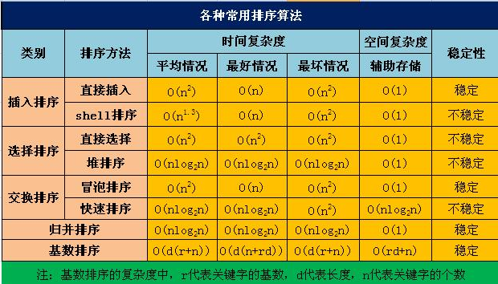
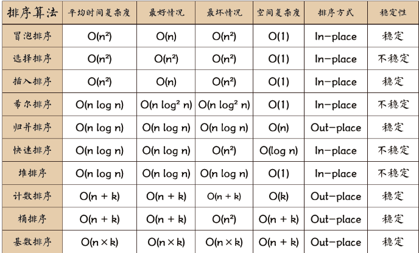
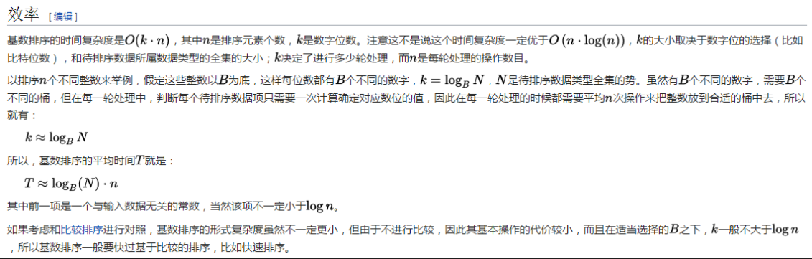
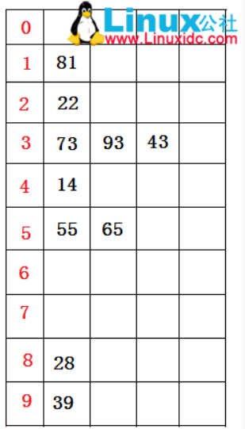
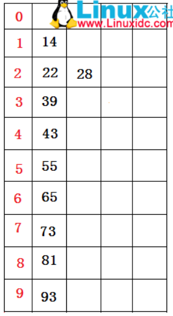

<!-- TOC -->

- [1、十大排序算法解析](#1十大排序算法解析)
    - [1、冒泡排序 【N*N】](#1冒泡排序-nn)
        - [1、基本冒泡](#1基本冒泡)
        - [2、优化1](#2优化1)
        - [3、优化2](#3优化2)
        - [4、冒泡排序相关[鸡尾酒排序]](#4冒泡排序相关鸡尾酒排序)
    - [2、快速排序](#2快速排序)
        - [1、几种写法](#1几种写法)
        - [2、快速排序的应用：求中位数和第k大数（k大数）](#2快速排序的应用求中位数和第k大数k大数)
    - [3、插入排序](#3插入排序)
    - [4、希尔排序](#4希尔排序)
    - [5、选择排序](#5选择排序)
    - [6、堆排序](#6堆排序)
    - [7、归并排序O(N*logN)](#7归并排序onlogn)
    - [8、基数排序(正数)](#8基数排序正数)
    - [9、计数排序](#9计数排序)
    - [10、桶排序](#10桶排序)

<!-- /TOC -->


# 1、十大排序算法解析






练习排序算法题目：https://www.lintcode.com/problem/463/


- 冒泡[N*N]：在没有改进算法的情况下都是N*N。优化1使用一个标志，一次遍历没有交换就结束（当数组是正序N）；优化2记录最后交换位置；

- 插入[N*N]：最好N（就是已经安装要求排好）；最坏（和要求排序完全反向有序）N*N；（希尔排序跳着插）

- 选择[N*N]：所以情况一样N*N     

- 快速：最好的情况是数据分布均匀每一次划分左右两边那都是一半；最坏情况是数组正序或者逆序

- 堆排序[O(N*logN)]：
- 希尔排序:
- 归并排序[O(N*logN)]：
- 基数排序：

- 桶排序：
- 计数排序：

> 比较排序和非比较排序

- 比较排序：冒泡、插入、选择、快速、堆排序、希尔排序、归并排序
- 非比较排序：基数排序、桶排序、计数排序


## 1、冒泡排序 【N*N】

### 1、基本冒泡

基本思想：设数组长度为N。

- 1．比较相邻的前后二个数据，如果前面数据大于后面的数据，就将二个数据交换。

- 2．这样对数组的第0个数据到N-1个数据进行一次遍历后，最大的一个数据就“沉”到数组第N-1个位置。

- 3．N=N-1，如果N不为0就重复前面二步，否则排序完成。

> 代码解析

- 每次比较相邻的两个数，前面的数要是大于后面的数就交换，遍历一次可以保证大数移动到数组的尾部，一共需要N-1趟；
- 外层循环控制遍历的次数；
- 内层循环控制一次遍历数据下沉的过程；


```java
public class Solution {
    /**
     * @param A: an integer array
     * @return: nothing
     */
    public void sortIntegers(int[] A) {
        // write your code here
        for (int i = 0; i < A.length - 1; i++) { //控制次数
            for (int j = 1 ;j < A.length - i; j++) { //一次遍历过程，排序好一个数，界限为无序数组的边界，已经排好序的不需要再比较
                if (A[j] < A[j - 1]) {
                    int temp = A[j];
                    A[j] = A[j - 1];
                    A[j - 1] = temp;
                }
            }
        }
    }
}
```

### 2、优化1

思路：数组假如局部有序，经过前几次交换已经使得数据排好序了，就没有必要在进行遍历比较，因此在一次遍历过程中发现没有相邻元素交换数据即可证明数组已经有序，直接结束即可。这里采用一个标记位来标识一次遍历过程是否交换过数据。

```java
public class Solution {
    /**
     * @param A: an integer array
     * @return: nothing
     */
    public void sortIntegers(int[] A) {
        // write your code here
       
        for (int i = 0; i < A.length - 1; i++) {
            boolean exchangeflag = false;
            for (int j = 1 ;j < A.length - i; j++) {
                if (A[j] < A[j - 1]) {
                    int temp = A[j];
                    A[j] = A[j - 1];
                    A[j - 1] = temp;
                    exchangeflag = true;
                }
            }
            if (!exchangeflag) {
                break;
            }
        }
    }
}
```
### 3、优化2

思路：假如数组后部分已经有序，遍历时依旧会对数组进行比较，这部分可以简化掉，其实我们可以记录上次数据交换的边界【即无序数组的右侧边界，默认是数组的右边界】，从边界处开始比较即可

```java
public class Solution {
    /**
     * @param A: an integer array
     * @return: nothing
     */
    public void sortIntegers(int[] A) {
        // write your code here
        int boardindex = A.length - 1;//无序数列的边界，每次比较只需要比到这里为止
        int lastexchangeindex = 0;//记录最后一次交换的位置
        for (int i = 0; i < A.length - 1; i++) {
            boolean exchangeflag = false;//有序标记，每一轮的初始是
            for (int j = 0 ;j < boardindex; j++) {
                if (A[j] > A[j + 1]) {
                    int temp = A[j];
                    A[j] = A[j + 1];
                    A[j + 1] = temp;
                    exchangeflag = true;//有元素交换，所以不是有序，标记变为
                    lastexchangeindex = j;//把无序数列的边界更新为最后一次交换元素的位置
                }
            }
            boardindex = lastexchangeindex;
            if (!exchangeflag) {
                break;
            }
            
        }
    }
}
```

### 4、冒泡排序相关[鸡尾酒排序]

- [漫画：什么是鸡尾酒排序？（修订版）](https://mp.weixin.qq.com/s/CoVZrvis6BnxBQgQrdc5kA)

简单来说就是冒泡奇数次从左侧开始，偶数次从右侧开始，避免只有一个数字插入有序列表造成列表无序的问题。

有8个数组成一个无序数列：2，3，4，5，6，7，8，1，希望从小到大排序

原始冒泡算法需要需要七轮，而采用鸡尾酒算法则只需要3轮即可

```java
public class Solution {
   public void sortIntegers(int[] A) {
        int temp;
        for (int i = 0 ; i < A.length / 2; i++) {
            boolean sort = true;
            //奇数次从左侧开始
            for (int j = i; j < A.length - 1 - i; j++) {
                if (A[j] > A[j + 1]) {
                    temp = A[j];
                    A[j] = A[j + 1];
                    A[j + 1] =temp;
                    sort = false;//有元素交换，所以不是有序，标记变为false
                }
            }
            if (sort) {
                break;
            }
            //偶数次遍历前恢复标记
            sort = true;
            //偶数次从右侧开始
            for (int j = A.length - 1 - i;j > i; j--) {
                if (A[j - 1] > A[j]) {
                    temp = A[j];
                    A[j] = A[j - 1];
                    A[j - 1] = temp;
                    sort = false;//有元素交换，所以不是有序，标记变为false
                }
            }
            if (sort) {
                break;
            }
        }
    }
}
```


记录一次遍历中相邻两个数交换的左右边界，减少遍历时的比较次数

```java
public class Solution {
   public void sortIntegers(int[] A) {
        int temp;
        
        //记录右侧最后一次交换的位置  
        int lastRightExchangeIndex = 0;
        //记录左侧最后一次交换的位置
        int lastLeftExchangeIndex = 0;
        //无序数列的右边界，每次比较只需要比到这里为止
        int rightSortBorder = A.length - 1;
        //无序数列的左边界，每次比较只需要比到这里为止   
        int leftSortBorder = 0;
        
        for (int i = 0 ; i < A.length / 2; i++) {
            boolean sort = true;
            //奇数次从左侧开始
            for (int j = leftSortBorder; j < rightSortBorder; j++) {
                if (A[j] > A[j + 1]) {
                    temp = A[j];
                    A[j] = A[j + 1];
                    A[j + 1] =temp;
                    sort = false;
                    lastRightExchangeIndex = j;
                }
            }
            rightSortBorder = lastRightExchangeIndex;
            if (sort) {
                break;
            }
            //偶数次遍历前恢复标记
            sort = true;
            //偶数次从右侧开始
            for (int j =rightSortBorder;j > leftSortBorder; j--) {
                if (A[j - 1] > A[j]) {
                    temp = A[j];
                    A[j] = A[j - 1];
                    A[j - 1] = temp;
                    sort = false;
                    lastLeftExchangeIndex = j;
                }
            }
            leftSortBorder = lastLeftExchangeIndex;
            if (sort) {
                break;
            }
        }
    }
}
```


## 2、快速排序

- 性能分析：时间复杂度 O(nlogn) 空间复杂度O（logn） 不稳定排序 `两个时间复杂度O(nlogn) 的排序算法都不稳定`

- 时间复杂度：
    - 最坏O（n^2） ：当划分不均匀时候 逆序and排好序都是最坏情况[逆序 8 7 6 5 4 3 2 期待正序 即为最坏情况]
    - 最好O（n） 当划分均匀
    - partition的时间复杂度: O（n）、一共需要logn次partition

- 空间复杂度：递归造成的栈空间的使用，最好情况，递归树的深度logn 空间复杂的logn，最坏情况，需要进行n‐1 递归调用，其空间复杂度为 O(n)，平均情况，空间复杂度也为O(log2n)。


由于关键字的比较和交换是跳跃进行的，因此，快速排序是一种不稳定的排序方法。

快速排序的每一轮就是将这一轮的基准数归位，直到所有的数都归为为止，排序结束。（类似冒泡）。partition是返回一个基准值的index, index 左边都小于该index的数，右边都大于该index的数。

快速排序之所比较快，因为相比冒泡排序，每次交换是跳跃式的。每次排序的时候设置一个基准点，将小于等于基准点的数全部放到基准点的左边，将大于等于基准点的数全部放到基准点的右边。这样在每次交换的时候就不会像冒泡排序一样每次只能在相邻的数之间进行交换，交换的距离就大的多了。因此总的比较和交换次数就少了，速度自然就提高了。当然在最坏的情况下，仍可能是相邻的两个数进行了交换。因此快速排序的最差时间复杂度和冒泡排序是一样的都是 O(n^2)，它的平均时间复杂度为 O(nlogn)。其实快速排序是基于 “二分” 的思想。

基本思想（分治）
- 1．先从数列中取出一个数作为基准数。
- 2．分区过程，将比这个数大的数全放到它的右边，小于或等于它的数全放到它的左边。
- 3．再对左右区间重复第二步，直到各区间只有一个数。


### 1、几种写法


> 写法1

```java
public class Solution {
    /**
     * @param A: an integer array
     * @return: nothing
     */
    public void sortIntegers2(int[] A) {
        // write your code here
        if (A == null || A.length < 2) {
            return;
        }
        quick_sort(A,0,A.length - 1);
    }
    
    
    public void quick_sort(int[] A ,int left,int right) {
        //递归的结束条件
       if (left < right) {
           int l = left;
           int r = right;
           int base = A[l];
           //完成一次交换数据
           while (l < r) {
               //从右边找第一个比基准数小的数，然后填入前一个坑
               while (l < r && A[r] > base) {
                   r--;
               }
               if (l < r) {
                   A[l++] = A[r];
               }
               //从左边找第一个比基准数大或者等于的数，然后填入前一个坑
               while (l < r && A[l] < base) {
                   l++;
               }
               if (l < r) {
                   A[r--] = A[l];
               }
           }
            A[l] = base;
            quick_sort(A,left,l - 1);
            quick_sort(A,l + 1,right);
       }
    }
}
```

> 写法2[推荐]


```java
//把划分分界点逻辑抽成一个单独的函数
public class Solution {
    /**
     * @param A: an integer array
     * @return: nothing
     */
    public void sortIntegers(int[] A) {
        // write your code here
        helper(A,0,A.length - 1);
    }
    
    
    public void helper(int[] nums,int start,int end) {
        if (start > end) {
            return;
        }
        int partition = partition(nums,start,end);
        helper(nums,start,partition - 1);
        helper(nums,partition + 1, end);
    }
    
    
    //返回分界点的下标
    public int partition(int[] nums,int start,int end) {
        int left = start;
        int right = end;
        int base = nums[left];
        while(left < right) {
            while(left < right && nums[right] >= base) {
                right--;
            }
            if (left < right) {
                nums[left++] = nums[right];
            }
            while(left < right && nums[left] <= base) {
                left++;
            }
            if (left < right) {
                nums[right--] = nums[left];
            }
        }
        nums[left] = base;
        return left;
    }
}
```

> 写法3

```java
public class Solution {
    /**
     * @param A: an integer array
     * @return: nothing
     */
    public void sortIntegers2(int[] A) {
        // write your code here
        if (A == null || A.length < 2) {
            return;
        }
        quick_sort(A,0,A.length - 1);
    }
    
    
    public void quick_sort(int[] A ,int startIndex, int endIndex) {
        // 递归结束条件：startIndex大等于endIndex的时候
       if (startIndex >= endIndex) {
           return;
       }
       //得到基准元素位置
       int pivotIndex = partition(A,startIndex,endIndex);
       //用分治法递归数列的两部分
       quick_sort(A, startIndex, pivotIndex - 1);
       quick_sort(A, pivotIndex + 1, endIndex);
    }
    
     public int partition(int[] A ,int startIndex, int endIndex) {
       int left = startIndex;
       int right = endIndex;
       //坑的位置，初始等于pivot的位置
       int index = startIndex;
       //取第一个位置的元素作为基准元素
       int pivot = A[startIndex];
       
       //大循环在左右指针重合或者交错时结束
       while (right > left) {
           //right指针从右向左进行比较
           while (right > left) {
               if (A[right] < pivot) {
                   A[left] = A[right];
                   index = right;
                   left++;
                   break;
               }
               right--;
           }
           //left指针从左向右进行比较
           while (right > left) {
               if (A[left] > pivot) {
                   A[right] = A[left];
                   index = left;
                   right--;
                   break;
               }
               left++;
           }
       }
        A[index] = pivot;
        return index;
    }
}
```


### 2、快速排序的应用：求中位数和第k大数（k大数）

```java
public int kthLargestElement(int k, int[] nums) {
        // write your code here
        if (nums == null || nums.length == 0 || k < 1 || k > nums.length) {
            return -1;
        }
        return k(nums, 0, nums.length - 1, nums.length - k);
    }
    public int k(int[] a, int left, int right, int k) {
            int l = left;
            int r = right;
            int base = a[l];
            while (l < r) {
                while (l < r && a[r] > base) {
                    r--;
                }
                if (l < r) {
                    a[l++] = a[r];
                }
                while (l < r && a[l] < base) {
                    l++;
                }
                if (l < r) {
                    a[r--] = a[l];
                }
            }
            a[l] = base;
            if (l == k) {
                return a[l];
            } else if (l < k) {
                return k(a, l + 1, right, k);
            } else {
                return k(a, left, l - 1, k);
            }
    }

```


## 3、插入排序

基本思想:类似于打扑克的起牌过程（在有序列表中找第一个比插入值小的）

设数组为a[0…n-1]。

- 1.初始时，a[0]自成1个有序区，无序区为a[1..n-1]。令i=1

- 2.将a[i]并入当前的有序区a[0…i-1]中形成a[0…i]的有序区间。

- 3.i++并重复第二步直到i==n-1。排序完成。


时间复杂度O(n^2), 空间复杂度O(1)

排序时间与输入有关：输入的元素个数以及元素已排序的程度。

- 最佳情况，输入数组是已经排好序的数组，运行时间是n的线性函数； 
- 最坏情况，输入数组是逆序，运行时间是n的二次函数。


```java
public class Solution {
   public void sortIntegers(int[] A) {
        // write your code here
       for (int i = 1; i < A.length; i++) {
           int insert = A[i];//本次要插入的值
           int j = i - 1;
           while (j >= 0 && insert <= A[j]) {//遍历找到要插入的位置，大于要插入元素后移  最后的j为第一个比要插入元素小的值
              A[j+1] = A[j];
              j--;
           }
           A[j+1] = insert;// 注意这里是j+1
       }
    }
}
```


## 4、希尔排序

希尔排序是基于插入排序的以下两点性质而提出改进方法的：
- 插入排序在对几乎已经排好序的数据操作时，效率高，即可以达到线性排序的效率
- 但插入排序一般来说是低效的，因为插入排序每次只能将数据移动一位
- 平均：O(n log2 n)约等于n的1.3次方
- 最坏：n*n

希尔排序（分组的插入排序）（增量排序）

该方法的基本思想是：先将整个待排元素序列分割成若干个子序列（由相隔某个“增量”的元素组成的）分别进行直接插入排序。然后依次缩减增量再进行排序，待整个序列中的元素基本有序（增量足够小）时，再对全体元素进行一次直接插入排序。因为直接插入排序在元素基本有序的情况下（接近最好情况），效率是很高的，因此希尔排序在时间效率上比前两种方法有较大提高。


```java
public class Solution {
   public void sortIntegers(int[] A) {
        int gap = 1;
        int i,j,temp;
        int len = A.length;
        while (gap < len / 3) {
            gap = gap * 3 + 1;
        }
        for (; gap > 0; gap /= 3) { //步长
            for (i = gap; i < len; i++) { //同插入排序   从第gap个位置开始插入元素
                temp = A[i];
                for (j = i - gap; j >= 0 && A[j] > temp; j -= gap) {
                    A[j + gap] = A[j];
                }
                A[j + gap] = temp;
            }
        }
    }
}
```


## 5、选择排序

时间复杂度O(n^2), 空间复杂度O(1)。排序时间与输入无关，最佳情况，最坏情况都是如此, 不稳定 如 {5,5,2}。

基本思想：设数组为a[0…n-1]。

- 1.初始时，数组全为无序区为a[0..n-1]。令i=0

- 2.在无序区a[i…n-1]中选取一个最小的元素，将其与a[i]交换。交换之后a[0…i]就形成了一个有序区。

- 3.i++并重复第二步直到i==n-1。排序完成。

直接选择排序和直接插入排序类似，都将数据分为有序区和无序区，所不同的是直接插入排序是将无序区的第一个元素直接插入到有序区以形成一个更大的有序区，而直接选择排序是从无序区选一个最小的元素直接放到有序区的最后。每次外循环遍历一次，把后面无序中最小的放到有序的最后一个。


每次遍历找到最小的元素的下标，然后让其放在其该处的位置，比如

第一次遍历 找到最小的放在A[0]

第二次遍历 找到次小值放在A[1]

.....


```java
public class Solution {
   public void sortIntegers(int[] A) {
        // write your code here
        for (int i = 0; i < A.length; i++) {
            int min = i;
            for (int j = i + 1; j < A.length; j++) {
                if (A[j] < A[min]) {
                    min = j;
                }
            }
            int temp = A[i];
            A[i] = A[min];
            A[min] = temp;
        }
    }
}
```


## 6、堆排序


- [漫画：什么是二叉堆？（修正版）](https://mp.weixin.qq.com/s/cq2EhVtOTzTVpNpLDXfeJg)
- [漫画：什么是堆排序？](https://mp.weixin.qq.com/s/8Bid1naBLtEjPoP-R4HkBg)
- [常见排序算法 - 堆排序 (Heap Sort)](http://bubkoo.com/2014/01/14/sort-algorithm/heap-sort/)
- [白话经典算法系列之七 堆与堆排序](https://blog.csdn.net/morewindows/article/details/6709644)


什么是二叉堆？二叉堆本质上是一种完全二叉树，它分为两个类型：最大堆和最小堆。

什么是最大堆呢？最大堆任何一个父节点的值，都大于等于它左右孩子节点的值。

什么是最小堆呢？最小堆任何一个父节点的值，都小于等于它左右孩子节点的值。

二叉堆的根节点叫做堆顶。

最大堆和最小堆的特点，决定了在最大堆的堆顶是整个堆中的最大元素；最小堆的堆顶是整个堆中的最小元素。

堆的自我调整,对于二叉堆，如下有几种操作：
- 插入节点[尾部插入，节点上浮]
- 删除节点[头部删除，尾部节点补头部节点的位置，堆排序采用的就是让头尾交换进行排序]
- 构建二叉堆[本质上就是让所有非叶子节点依次下沉]


二叉堆虽然是一颗完全二叉树，但它的存储方式并不是链式存储，而是顺序存储。换句话说，二叉堆的所有节点都存储在数组当中。数组中，在没有左右指针的情况下，如何定位到一个父节点的左孩子和右孩子呢？

我们可以依靠数组下标来计算。假设父节点的下标是parent，那么它的左孩子下标就是 2*parent+1；它的右孩子下标就是  2*parent+2。同理，如果一个节点的索引为index，那么左孩子index*2+1,右孩子为index*2+2


时间复杂度 O(nlogn), 空间复杂度O(1). 从这一点就可以看出，堆排序在时间上类似归并，但是它又是一种原地排序，时间复杂度小于归并的O(n+logn)

`排序时间与输入无关，最好，最差，平均都是O(nlogn). 不稳定`

堆排序借助了堆这个数据结构，堆类似二叉树，又具有堆积的性质（子节点的关键值总小于（大于）父节点） 堆排序包括两个主要操作:
- 保持堆的性质heapify(A,i) 时间复杂度O(logn)
- 建堆 buildmaxheap(A) 时间复杂度O(n) 线性时间建堆

对于大数据的处理： 如果对100亿条数据选择Topk数据，选择快速排序好还是堆排序好？ 答案是只能用堆排序。 堆排序只需要维护一个k大小的空间，即在内存开辟k大小的空间。而快速排序需要开辟能存储100亿条数据的空间，which is impossible.


堆这种数据结构的很好的应用是 优先级队列，如作业调度。


堆排序就是把最大堆堆顶的最大数取出，将剩余的堆继续调整为最大堆，再次将堆顶的最大数取出，这个过程持续到剩余数只有一个时结束。在堆中定义以下几种操作：
- 最大堆调整（Max-Heapify）：将堆的末端子节点作调整，使得子节点永远小于父节点
- 创建最大堆（Build-Max-Heap）：将堆所有数据重新排序，使其成为最大堆
- 堆排序（Heap-Sort）：移除位在第一个数据的根节点，并做最大堆调整的递归运算


堆排序需要进行以下两步：第一步：将数组堆化;第二步：对堆化数据排序;


```java
public class Solution {
/**
     * 堆排序的主要入口方法，共两步。
     */
    public  void sort(int[] nums,int len){
        /*
         *  第一步：将数组堆化
         *  beginIndex = 第一个非叶子节点。
         *  从第一个非叶子节点开始即可。无需从最后一个叶子节点开始。
         *  叶子节点可以看作已符合堆要求的节点，根节点就是它自己且自己以下值为最大。
         */
        int beginIndex = (len - 1) >> 1;
        for(int i = beginIndex; i >= 0; i--){
            maxHeapify(nums,i, len);
        }

        /*
         * 第二步：对堆化数据排序
         * 每次都是移出最顶层的根节点A[0]，与最尾部节点位置调换，同时遍历长度 - 1。
         * 然后从新整理被换到根节点的末尾元素，使其符合堆的特性。
         * 直至未排序的堆长度为 0。
         */
        for(int i = len; i > 0; i--){
            //swap(0, i);
            int temp = nums[0];
            nums[0] = nums[i];
            nums[i] = temp;
            maxHeapify(nums,0, i - 1);
        }
    }
    /**
     * 调整索引为 index 处的数据，使其符合堆的特性。
     *
     * @param index 需要堆化处理的数据的索引
     * @param len 未排序的堆（数组）的长度
     */
    private  void maxHeapify(int[] nums,int index,int len){
        int li = (index << 1) + 1; // 左子节点索引
        int ri = li + 1;           // 右子节点索引
        int cMax = li;             // 子节点值最大索引，默认左子节点。

        if(li > len) return;       // 左子节点索引超出计算范围，直接返回。
        if(ri <= len && nums[ri] > nums[li]) // 先判断左右子节点，哪个较大。
            cMax = ri;
        if(nums[cMax] > nums[index]){
            // 如果父节点被子节点调换，
            int temp = nums[index];
            nums[index] = nums[cMax];
            nums[cMax] = temp;
            maxHeapify(nums,cMax, len);  // 则需要继续判断换下后的父节点是否符合堆的特性。
        }
    }
}
```

## 7、归并排序O(N*logN)

1、将有序数组a[]和b[]合并到c[]中，以看出合并有序数列的效率是比较高的，可以达到O(n)。

```java
//将有序数组a[]和b[]合并到c[]中
     public static void mergeArray(int a[], int n, int b[], int m, int c[]){
          int i=0,j=0,k=0;
          while(i<n&&j<m){
              if(a[i]<b[j]){
                   c[k++]=a[i++];
              }else{
                   c[k++]=b[j++];
              }
          }

          while(i<n){
              c[k++]=a[i++];
          }
          while(j<m){
              c[k++]=b[j++];
          }

     }
```


2、归并排序算法

归并排序，其的基本思路就是将数组分成二组A，B，如果这二组组内的数据都是有序的，那么就可以很方便的将这二组数据进行排序。如何让这二组组内数据有序了？可以将A，B组各自再分成二组。依次类推，当分出来的小组只有一个数据时，可以认为这个小组组内已经达到了有序，然后再合并相邻的二个小组就可以了。这样通过先递归的分解数列，再合并数列就完成了归并排序。


递归版：

```java
static void merge_sort_recursive(int[] arr, int[] result, int start, int end) {
        //注意这里结束条件，包含等于，即只有一个元素就是有序的了
        if (start >= end)
                return;
        int len = end - start, mid = (len >> 1) + start;
        int start1 = start, end1 = mid;
        int start2 = mid + 1, end2 = end;
        merge_sort_recursive(arr, result, start1, end1);
        merge_sort_recursive(arr, result, start2, end2);
        //借助于临时temp数组，按照对应位置覆盖
        int k = start;
        while (start1 <= end1 && start2 <= end2)
                result[k++] = arr[start1] < arr[start2] ? arr[start1++] : arr[start2++];
        while (start1 <= end1)
                result[k++] = arr[start1++];
        while (start2 <= end2)
                result[k++] = arr[start2++];
        for (k = start; k <= end; k++)
                arr[k] = result[k];
}


public static void merge_sort(int[] arr) {
        int len = arr.length;
        int[] result = new int[len];
        merge_sort_recursive(arr, result, 0, len - 1);}

```

迭代版

```java
public static void merge_sort(int[] arr) {
    int len = arr.length;
    int[] result = new int[len];
    int block, start;
   
    // 原版代码的迭代次数少了一次，没有考虑到奇数列数组的情况
    for(block = 1; block < len*2; block *= 2) {
        for(start = 0; start <len; start += 2 * block) {
            int low = start;
            int mid = (start + block) < len ? (start + block) : len;
            int high = (start + 2 * block) < len ? (start + 2 * block) : len;
            //两个块的起始下标及结束下标
            int start1 = low, end1 = mid;
            int start2 = mid, end2 = high;
            //开始对两个block进行归并排序
            while (start1 < end1 && start2 < end2) {
                result[low++] = arr[start1] < arr[start2] ? arr[start1++] : arr[start2++];
            }
            while(start1 < end1) {
                result[low++] = arr[start1++];
            }
            while(start2 < end2) {
                result[low++] = arr[start2++];
            }
        }
        int[] temp = arr;
        arr = result;
        result = temp;
    }
    result = arr;     
}
```


非比较排序：计数排序，基数排序，桶排序，时间复杂度能够达到O(n). 这些排序为了达到不比较的目的，对数据做了一些基本假设（限制）。
- 如计数排序假设数据都[0,n] 范围内，且范围较小；
- 基数排序假设数据都[0,n] 范围内；
- 桶排序假设数据均匀独立的分布。

而且，非比较排序的空间要求比较高，用空间换取时间吧。当我们的待排序数组具备一些基数排序与桶排序要求的特性，且空间上又比较富裕时，桶排序与基数排序不失为最佳选择。


## 8、基数排序(正数)

[基数排序 详解](https://www.linuxidc.com/Linux/2016-07/133620.htm)

基数排序题目：https://leetcode-cn.com/problems/maximum-gap/

基数排序法是属于稳定性的排序，其时间复杂度为O (nlog(r)m)，其中r为所采取的基数，而m为堆数，在某些时候，基数排序法的效率高于其它的稳定性排序法。

基数排序（英语：Radix sort）是一种非比较型整数排序算法，其原理是将整数按位数切割成不同的数字，然后按每个位数分别比较。由于整数也可以表达字符串（比如名字或日期）和特定格式的浮点数，所以基数排序也不是只能使用于整数。基数排序的发明可以追溯到1887年赫尔曼·何乐礼在打孔卡片制表机（Tabulation Machine）上的贡献。

它是这样实现的：将所有待比较数值（正整数）统一为同样的数位长度，数位较短的数前面补零。然后，从最低位开始，依次进行一次排序。这样从最低位排序一直到最高位排序完成以后，数列就变成一个有序序列。

基数排序的方式可以采用LSD（Least significant digital）或MSD（Most significant digital），LSD的排序方式由键值的最右边开始，而MSD则相反，由键值的最左边开始。




假设有欲排数据序列如下所示：73  22  93  43  55  14  28  65  39  81

首先根据个位数的数值，在遍历数据时将它们各自分配到编号0至9的桶（个位数值与桶号一一对应）中。

分配结果（逻辑想象）如下图所示：



分配结束后。接下来将所有桶中所盛数据按照桶号由小到大（桶中由顶至底）依次重新收集串起来，得到如下仍然无序的数据序列：

81  22  73  93  43  14  55  65  28  39

接着，再进行一次分配，这次根据十位数值来分配（原理同上），分配结果（逻辑想象）如下图所示：



分配结束后。接下来再将所有桶中所盛的数据（原理同上）依次重新收集串接起来，得到如下的数据序列：

14  22  28  39  43  55  65  73  81  93

观察可以看到，此时原无序数据序列已经排序完毕。如果排序的数据序列有三位数以上的数据，则重复进行以上的动作直至最高位数为止。

```java
public class RadixSort
{
    public static void sort(int[] number, int d) //d表示最大的数有多少位
    {
        int k = 0;//每次排序后回填数组游标
        int n = 1;//控制取那一位进行比较，比如，个、十、百等
        int m = 1; //控制键值排序依据在哪一位
        int[][]temp = new int[10][number.length]; //数组的第一维表示可能的余数0-9
        int[]order = new int[10]; //数组orderp[i]用来表示该位是i的数的个数
        while(m <= d) {
            //把原来的数组填充到二维数组上去
            for(int i = 0; i < number.length; i++) {
                int lsd = ((number[i] / n) % 10);
                temp[lsd][order[lsd]] = number[i];
                //一行可能会存在多个元素，这个数组中的值，控制当前行元素的个数，即元素放在哪一列
                order[lsd]++;
            }
            for(int i = 0; i < 10; i++) {
                //说明这一行有元素，把元素取出放回数组
                if(order[i] != 0) {
                     for(int j = 0; j < order[i]; j++){
                        number[k] = temp[i][j];
                        k++;
                    }
                }
                //清空
                order[i] = 0;
            }
            n *= 10;
            k = 0;
            m++;
        }
    }
    public static void main(String[] args)
    {
        int[]data =
        {73, 22, 93, 43, 55, 14, 28, 65, 39, 81, 33, 100};
        RadixSort.sort(data, 3);
        for(inti = 0; i < data.length; i++)
        {
            System.out.print(data[i] + "");
        }
    }
    
    
    //获取位数
    public static int getMaxnum(int[] A) {
            int base = 10;
            int num = 1;
            for (int i = 0;i < A.length; i++) {
                while (Math.abs(A[i]) / base != 0) {
                    base *= 10;
                    num++;
                }
            }
            return num;
    }
}

```

假设我们有一些二元组(a,b)，要对它们进行以a为首要关键字，b的次要关键字的排序。我们可以先把它们先按照首要关键字排序，分成首要关键字相同的若干堆。然后，在按照次要关键值分别对每一堆进行单独排序。最后再把这些堆串连到一起，使首要关键字较小的一堆排在上面。按这种方式的基数排序称为MSD(Most Significant Dight)排序。第二种方式是从最低有效关键字开始排序，称为LSD(Least Significant Dight)排序。首先对所有的数据按照次要关键字排序，然后对所有的数据按照首要关键字排序。要注意的是，使用的排序算法必须是稳定的，否则就会取消前一次排序的结果。由于不需要分堆对每堆单独排序，LSD方法往往比MSD简单而开销小。下文介绍的方法全部是基于LSD的。

基数排序的简单描述就是将数字拆分为个位十位百位，每个位依次排序。因为这对算法稳定要求高，所以我们对数位排序用到上一个排序方法计数排序。因为基数排序要经过d (数据长度)次排序， 每次使用计数排序， 计数排序的复杂度为 O(n),  d 相当于常量和N无关，所以基数排序也是 O(n)。基数排序虽然是线性复杂度， 即对n个数字处理了n次，但是每一次代价都比较高， 而且使用计数排序的基数排序不能进行原地排序，需要更多的内存， 并且快速排序可能更好地利用硬件的缓存， 所以比较起来，像快速排序这些原地排序算法更可取。对于一个位数有限的十进制数，我们可以把它看作一个多元组，从高位到低位关键字重要程度依次递减。可以使用基数排序对一些位数有限的十进制数排序。

例如我们将一个三位数分成，个位，十位，百位三部分。我们要对七个三位数来进行排序，依次对其个位，十位，百位进行排序，如下图：

很显然，每一位的数的大小都在[0，9]中，对于每一位的排序用计数排序再适合不过。


> 效率

基数排序的时间复杂度是 O(k·n)，其中n是排序元素个数，k是数字位数。注意这不是说这个时间复杂度一定优于O(n·log(n))，因为k的大小一般会受到 n 的影响。 以排序n个不同整数来举例，假定这些整数以B为底，这样每位数都有B个不同的数字，k就一定不小于logB(n)。由于有B个不同的数字，所以就需要B个不同的桶，在每一轮比较的时候都需要平均n·log2(B) 次比较来把整数放到合适的桶中去，所以就有：

- k 大于或等于 logB(n)
- 每一轮(平均)需要 n·log2(B) 次比较

所以，基数排序的平均时间T就是：
T ≥ logB(n)·n·log2(B) = log2(n)·logB(2)·n·log2(B) = log2(n)·n·logB(2)·log2(B) = n·log2(n)

所以和比较排序相似，基数排序需要的比较次数：T ≥ n·log2(n)。 故其时间复杂度为 Ω(n·log2(n)) = Ω(n·log n) 。


```java
//基数排序：稳定排序（内部排序使用计数排序）
public class RadixSorting {

     // d为数据长度
     private static void radixSorting(int[] arr, int d) {
          // arr = countingSort(arr, 0);
          for (int i = 0; i < d; i++) {
              arr = countingSort(arr, i); // 依次对各位数字排序（直接用计数排序的变体）
              print(arr, i + 1, d);
          }
     }

     // 把每次按位排序的结果打印出来
     static void print(int[] arr, int k, int d) {
          if (k == d)
              System.out.println("最终排序结果为：");
          else
              System.out.println("按第" + k + "位排序后，结果为：");
          for (int t : arr) {
              System.out.print(t + " ");
          }
          System.out.println();
     }

     // 利用计数排序对元素的每一位进行排序
     private static int[] countingSort(int[] arr, int expIndex) {
          int k = 9;
          int[] b = new int[arr.length];
          int[] c = new int[k + 1]; // 这里比较特殊：数的每一位最大数为9

          for (int i = 0; i < k; i++) {
              c[i] = 0;
          }
          for (int i = 0; i < arr.length; i++) {
              int d = getBitData(arr[i], expIndex);
              c[d]++;
          }
          for (int i = 1; i <= k; i++) {
              c[i] += c[i - 1];
          }
          for (int i = arr.length - 1; i >= 0; i--) {
              int d = getBitData(arr[i], expIndex);
              b[c[d] - 1] = arr[i];// C[d]-1 就代表小于等于元素d的元素个数，就是d在B的位置
              c[d]--;
          }
          return b;
     }

     // 获取data指定位的数
     private static int getBitData(int data, int expIndex) {
          while (data != 0 && expIndex > 0) {
              data /= 10;
              expIndex--;
          }
          return data % 10;
     }

     public static void main(String[] args) {
          // TODO Auto-generated method stub
          int[] arr = new int[] { 326, 453, 608, 835, 751, 435, 704, 690, 88, 79,
                   79 };// { 333, 956, 175, 345, 212, 542, 99, 87 };
          System.out.println("基数排序前为：");
          for (int t : arr) {
              System.out.print(t + " ");
          }
          System.out.println();
          radixSorting(arr, 4);
     }

}

输出：

基数排序前为：
326 453 608 835 751 435 704 690 88 79 79
按第1位排序后，结果为：
690 751 453 704 835 435 326 608 88 79 79
按第2位排序后，结果为：
704 608 326 835 435 751 453 79 79 88 690
按第3位排序后，结果为：
79 79 88 326 435 453 608 690 704 751 835
最终排序结果为：
79 79 88 326 435 453 608 690 704 751 835

```


## 9、计数排序

计数排序（Counting sort）是一种稳定的线性时间排序算法。计数排序使用一个额外的数组C，其中第i个元素是待排序数组A中值等于i的元素的个数。然后根据数组C来将A中的元素排到正确的位置。

当输入的元素是n个0到k之间的整数时，它的运行时间是Θ(n + k)。计数排序不是比较排序，排序的速度快于任何比较排序算法。

由于用来计数的数组C的长度取决于待排序数组中数据的范围（等于待排序数组的最大值与最小值的差加上1），这使得计数排序对于数据范围很大的数组，需要大量时间和内存。例如：计数排序是用来排序0到100之间的数字的最好的算法，但是它不适合按字母顺序排序人名。

但是，计数排序可以用在基数排序算法中，能够更有效的排序数据范围很大的数组。

`通俗地理解，例如有10个年龄不同的人，统计出有8个人的年龄比A小，那A的年龄就排在第9位，用这个方法可以得到其他每个人的位置，也就排好了序。当然，年龄有重复时需要特殊处理（保证稳定性），这就是为什么最后要反向填充目标数组，以及将每个数字的统计减去1的原因。`

算法的步骤如下：
- 1、找出待排序的数组中最大和最小的元素；
- 2、统计数组中每个值为i的元素出现的次数，存入数组 C 的第 i 项；
- 3、对所有的计数累加（从C中的第一个元素开始，每一项和前一项相加）；
- 4、反向填充目标数组：将每个元素i放在新数组的第C(i)项，每放一个元素就将C(i)减去1；


```java

public static void jishu_sort(int[] arr) {
        if (arr == null || arr.length == 0) {
            return;
        }
        //找最大值来确定范围
        int max = arr[0];
        for (int i = 1;i < arr.length;i++) {
            if (arr[i] > max) {
                max = arr[i];
            }
        }
        //基于最大值+1申请数组，即数组中的值范围可以通过c数组的下标来表示，对应的值即个数
        int[] c = new int[max + 1];
        int[] b = new int[arr.length];
        //统计每个元素出现的次数放到c数组中去
        for (int i = 0; i < arr.length;i++) {
            c[arr[i]]++;
        }
        //c[i]含义，当前i元素是排序后的第c[i]个元素（相同元素多个位置均最后面的排位算，对应到数组的下标需要-1）
        for (int i = 1; i < c.length;i++) {
            c[i] = c[i] + c[i-1];
        }
        //遍历原来的数组，把元素按照排序后顺序放回临时数组b
        for (int i = 0;i < arr.length;i++) {
            int a = arr[i];
            b[c[a] - 1] = a;
            c[a]--;
        }
        //把临时数组b的值回填到原来的数组
        for (int i = 0;i < arr.length;i++) {
            arr[i] = b[i];
        }
    }

}


//通过最大值和最小值一起来确定边界
public static void main(String []args){
        //排序的数组
        int a[] = {100, 93, 97, 92, 96, 99, 92, 89, 93, 97, 90, 94, 92, 95};
        int b[] = countSort(a);
        for(int i : b){
                System.out.print(i + "  ");
        }
        System.out.println();
}
public static int[] countSort(int []a){
        int b[] = new int[a.length];
        int max = a[0], min = a[0];
        for(int i : a){
                if(i > max){
                        max = i;
                }
                if(i < min){
                        min = i;
                }
        }
        //这里k的大小是要排序的数组中，元素大小的极值差+1
        int k = max - min + 1;
        int c[] = new int[k];
        for(int i = 0; i < a.length; ++i){
                c[a[i]-min] += 1;//优化过的地方，减小了数组c的大小
        }
        for(int i = 1; i < c.length; ++i){
                c[i] = c[i] + c[i-1];
        }
        for(int i = a.length-1; i >= 0; --i){
                b[--c[a[i]-min]] = a[i];//按存取的方式取出c的元素
        }
        return b;
}
```


## 10、桶排序

- [漫画：什么是桶排序？](https://mp.weixin.qq.com/s/qrboxA5SwN7AbAcpZ_dpNQ)

桶排序题目：https://leetcode-cn.com/problems/maximum-gap/

桶排序（Bucket sort）或所谓的箱排序，是一个排序算法，工作的原理是将数组分到有限数量的桶里。每个桶再个别排序（有可能再使用别的排序算法或是以递归方式继续使用桶排序进行排序）。桶排序是鸽巢排序的一种归纳结果。当要被排序的数组内的数值是均匀分配的时候，桶排序使用线性时间（Θ(n)）。但桶排序并不是比较排序，他不受到O(n log n)下限的影响。


例如要对大小为[1..1000]范围内的n个整数A[1..n]排序，可以把桶设为大小为10的范围，具体而言，设集合B[1]存储[1..10]的整数，集合B[2]存储(10..20]的整数，……集合B[i]存储((i-1)*10, i*10]的整数，i = 1,2,..100。总共有100个桶。然后对A[1..n]从头到尾扫描一遍，把每个A[i]放入对应的桶B[j]中。 然后再对这100个桶中每个桶里的数字排序，这时可用冒泡，选择，乃至快排，一般来说任何排序法都可以。最后依次输出每个桶里面的数字，且每个桶中的数字从小到大输出，这样就得到所有数字排好序的一个序列了。


假设有n个数字，有m个桶，如果数字是平均分布的，则每个桶里面平均有n/m个数字。如果对每个桶中的数字采用快速排序，那么整个算法的复杂度是O(n+m*n/m*log(n/m))=O(n+nlogn-nlogm)从上式看出，当m接近n的时候，桶排序复杂度接近O(n)`即每个桶放一个元素`。当然，以上复杂度的计算是基于输入的n个数字是平均分布这个假设的。这个假设是很强的，实际应用中效果并没有这么好。如果所有的数字都落在同一个桶中，那就退化成一般的排序了。


桶排序是一种效率很高的排序算法，它的时间复杂度为O(n)，但桶排序有一定的限制，只有当待排序序列的元素为0到某一确定取值范围的整数时才适用，典型的例子比如成绩的排序等。

算法思想：设待排序序列的元素取值范围为0到m，则我们新建一个大小为m+1的临时数组并把初始值都设为0，遍历待排序序列，把待排序序列中元素的值作为临时数组的下标，找出临时数组中对应该下标的元素使之+1；然后遍历临时数组，把临时数组中元素大于0的下标作为值按次序依次填入待排序数组，元素的值作为重复填入该下标的次数，遍历完成则排序结束序列有序。

桶排序， 是最快最简单的排序。有多宽维度，就要申请多大的数组。比如100分的试卷，就要申请101个数组（试卷是0-100分），有人考了100分，就把array[100]加1，有人考了90，就把array[90]加1，有人考了70，就把array[70]+1，又有人考了90，就把array[90]加1，那么从高到底打印，如果是某个分数是0个人，就不打印，如果某个分数是1个人，就打印一次，如果某个分数是2个人，就打印两次，上面的例子就是100，90，90，90，70。

桶排序快是毋庸置疑的，但是，浪费了空间。比如打游戏，新手村里的小鸡攻击力是1，而最后一个副本的大BOSS的攻击力是999999999，那么就要对这个游戏的所有玩家和怪物的攻击力排序，就要申请一个1000000000长度的数组，就是array[1000000000]。假如每个字段的值都是1，1是整形，需要是4-8个字节（到底是4还是8取决于机器），那么这个数组就是1000000000/8/1024/1024=119MB。嗯哼？一个数组就要119M，你就是13年淘宝双11的160G内存的机器也拖不起吧。


桶排序以下列程序进行：
- 1、设置一个定量的数组当作空桶子。
- 2、寻访序列，并且把项目一个一个放到对应的桶子去。
- 3、对每个不是空的桶子进行排序。
- 4、从不是空的桶子里把项目再放回原来的序列中。


数据结构：数组

最坏时间复杂度： O(n^{2})

平均时间复杂度：O(n+k)

空间复杂度： O(n*k)


```java
//桶排序（对通排序进行简化，每个桶只放一个）
    public static void bucket_sort(int[] a) {
        int max = 0;
        for (int i = 0;i < a.length;i++) if (a[i] > max) max = a[i];
        int[] hash = new int[max + 1];
        for (int i = 0;i < a.length;i++) hash[a[i]]++;
        int k = 0;
        for (int i = 0;i < hash.length;i++) {
            while (hash[i]-- != 0) a[k++] = i;
        }
        System.out.println();
    }
```


```java
public class Main{
/**   
* @param a 待排序数组元素   
* @param step 步长(桶的宽度/区间),具体长度可根据情况设定   
* @return 桶的位置/索引   
*/
    private int indexFor(int a,int step){
        return a/step;
    }
    public void bucketSort(int []arr){

        int max=arr[0],min=arr[0];
        for (int a:arr) {
            if (max<a)
                max=a;
            if (min>a)
                min=a;
        }
        //该值也可根据实际情况选择
        int step = 10；
        int bucketNum=max/step-min/step+1;
        List buckList=new ArrayList<List<Integer>>();
        //create bucket
        for (int i=0;i<bucketNum;i++){
            buckList.add(new ArrayList<Integer>());
        }
        //push into the bucket
        for (int i=0;i<arr.length;i++){
            int index=indexFor(arr[i],step);
            ((ArrayList<Integer>)buckList.get(index)).add(arr[i]);
        }
        ArrayList<Integer> bucket=null;
        int index=0;
        for (int i=0;i<bucketNum;i++){
            bucket=(ArrayList<Integer>)buckList.get(i);
            insertSort(bucket);
            for (int k : bucket) {
                arr[index++]=k;
            }
        }

    }
    //把桶内元素插入排序
    private void insertSort(List<Integer> bucket){
        for (int i=1;i<bucket.size();i++){
            int temp=bucket.get(i);
            int j=i-1;
            for (; j>=0 && bucket.get(j)>temp;j--){
                bucket.set(j+1,bucket.get(j));
            }
            bucket.set(j+1,temp);
        }
    }
}
```