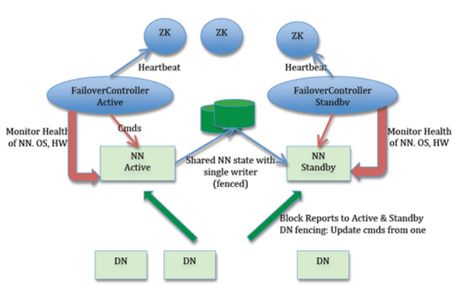
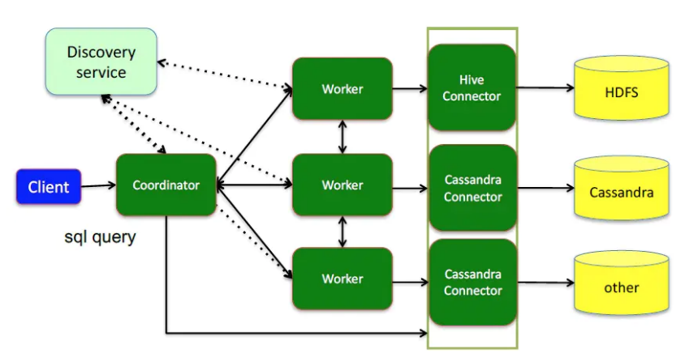

<!-- TOC -->

- [01、计算机基础](#01计算机基础)
    - [1、数据结构](#1数据结构)
    - [2、算法](#2算法)
        - [1、lru缓存最近最久未使用](#1lru缓存最近最久未使用)
        - [2、lfu使用频率](#2lfu使用频率)
    - [3、设计模式](#3设计模式)
        - [1、单例](#1单例)
        - [2、代理模式](#2代理模式)
    - [4、操作系统](#4操作系统)
        - [1、零拷贝](#1零拷贝)
        - [2、page cache](#2page-cache)
- [02、java基础](#02java基础)
    - [0、object中的方法](#0object中的方法)
        - [1、为什么需要重写hashcode和equal](#1为什么需要重写hashcode和equal)
    - [1、常用集合类](#1常用集合类)
        - [1、ArrayList和linkedlist](#1arraylist和linkedlist)
    - [2、并发](#2并发)
        - [1、threadlocal](#1threadlocal)
        - [2、synchronized](#2synchronized)
        - [3、lock](#3lock)
        - [4、synchronized和lock对比](#4synchronized和lock对比)
    - [3、jvm](#3jvm)
    - [4、线程池](#4线程池)
        - [1、阻塞队列有界无界](#1阻塞队列有界无界)
        - [2、ExecutorService方法](#2executorservice方法)
        - [3、线程执行异常问题](#3线程执行异常问题)
- [03、spring相关](#03spring相关)
    - [1、spring](#1spring)
    - [2、springmvc](#2springmvc)
    - [3、springboot](#3springboot)
        - [1、自动装配机制](#1自动装配机制)
    - [4、springcloud](#4springcloud)
        - [1、注册中心eureka](#1注册中心eureka)
        - [2、feign](#2feign)
        - [3、ribbon负载均衡](#3ribbon负载均衡)
        - [4、zuul网关](#4zuul网关)
        - [5、Hystrix熔断隔离](#5hystrix熔断隔离)
- [04、rpc相关](#04rpc相关)
- [05、缓存](#05缓存)
    - [1、redis](#1redis)
- [06、mq消息队列](#06mq消息队列)
    - [1、rocketmq](#1rocketmq)
    - [2、kafka](#2kafka)
- [07、搜索es](#07搜索es)
- [08、数据库](#08数据库)
    - [1、MySQL](#1mysql)
    - [2、clickhouse](#2clickhouse)
        - [1、数据查询的过程](#1数据查询的过程)
- [09、大数据](#09大数据)
    - [1、hdfs文件读写流程](#1hdfs文件读写流程)
        - [1、namenode节点的工作机制](#1namenode节点的工作机制)
    - [2、MapReduce](#2mapreduce)
    - [3、hive](#3hive)
    - [4、presto查询原理](#4presto查询原理)
    - [5、spark](#5spark)
- [10、注册中心](#10注册中心)
    - [1、eureka](#1eureka)
        - [1、多级缓存](#1多级缓存)
        - [2、集群模式](#2集群模式)
    - [2、xxl-job中的执行器注册](#2xxl-job中的执行器注册)
- [11、配置中心](#11配置中心)
    - [1、apollo](#1apollo)
- [12、调度中心](#12调度中心)
    - [1、timer](#1timer)
    - [2、schedulethreadpool](#2schedulethreadpool)
    - [3、quartz](#3quartz)
    - [4、xxl-job](#4xxl-job)
    - [5、elastic-job](#5elastic-job)
    - [6、工作流调度框架Oozie](#6工作流调度框架oozie)
- [13、zookeeper](#13zookeeper)
    - [1、zab协议流程](#1zab协议流程)
- [14、分布式锁](#14分布式锁)
    - [1、基于redis实现](#1基于redis实现)
    - [2、zookeeper实现](#2zookeeper实现)
- [15、分布式事务](#15分布式事务)
    - [1、两阶段提交](#1两阶段提交)
    - [2、三阶段提交](#2三阶段提交)
    - [3、tcc(try-commit-cancel)](#3tcctry-commit-cancel)
- [16、mybatis](#16mybatis)
- [17、shard-jdbc](#17shard-jdbc)
- [18、netty](#18netty)

<!-- /TOC -->

备注：使用三五句话描述一个技术点

# 01、计算机基础

## 1、数据结构

## 2、算法

### 1、lru缓存最近最久未使用

### 2、lfu使用频率

## 3、设计模式

### 1、单例

线程安全：饱汉模式，懒汉模式、双重检测、内部静态类、枚举值

### 2、代理模式

- 静态代理
- jdk动态代理和cglib动态代理

## 4、操作系统

### 1、零拷贝

### 2、page cache

# 02、java基础

## 0、object中的方法

### 1、为什么需要重写hashcode和equal

- 1、Object类的hashCode()方法返回这个对象存储的内存地址的编号; equals默认比较的是在内存的地址是否为同一个,使用==判断；

- 2、两个对象的equals相同，那么他们的hashCode一定相同；两个对象的equals不相同那么他们的hash也一样不相同（用户自己定义，不是强制的）；hash相同则，equals不一定相同；

- 3、如果重写equals()方法必须要重写hashCode()方法，来保证第二条的成立；

- 4、如果 ==比较的是基本数据类型，那么比较的是两个基本数据类型的值是否相等；如果 ==是比较的两个对象，那么比较的是两个对象的`引用`，也就是两个对象是否为同一个对象，并不是比较的对象的内容；

- 5、`如果你不重写这两个方法，将几乎不遇到任何问题，但是有的时候程序要求我们必须改变一些对象的默认实现`

- [为什么要重写hashcode和equals方法](../java-core/为什么要重写hashcode和equals方法.md)

- [对象相等判断==和equals的区别](../java-core/对象相等判断==和equals的区别.md)

- [Object方法解析](./java-core/Object.md)

## 1、常用集合类

### 1、ArrayList和linkedlist

增删改查的时间复杂度

## 2、并发

### 1、threadlocal

一个 Thread 里面只有一个ThreadLocalMap ，而在一个 ThreadLocalMap<key=ThreadLocal对象本身作为key,value=value> 里面却可以有很多的 ThreadLocal，每一个 ThreadLocal 都对应一个 value。因为一个 Thread 是可以调用多个 ThreadLocal 的，所以 Thread 内部就采用了 ThreadLocalMap 这样 Map 的数据结构来存放 ThreadLocal 和 value。

[threadlocal](../java/concurrent-threadlocal.md)

### 2、synchronized

### 3、lock

### 4、synchronized和lock对比

> 以下集合方面

- 1、公平性；
- 2、可重入性；
- 3、使用方式；
- 4、底层实现；

## 3、jvm

## 4、线程池

细节见：[线程池-工作原理](../java-core/线程池-工作原理.md)

- 核心参数7：keepAliveTime+时间单位、core、max、threadfactory、xxxblockingqueue、RejectedExecutionHandler；

- 阻塞队列分类：LinkedBlockingQueue、SynchronousQueue、DelayedWorkQueue、priorityBlockingQuene；

- 拒绝策略分类，为什么这么处理？（4种）

- （FixedThreadPool和SingleThreadExector：队列无限大）（CachedThreadPool 和 ScheduledThreadPool：线程个数无限大）创建时的默认参数，以及为什么

### 1、阻塞队列有界无界

### 2、ExecutorService方法

- summit和execute
- invokeAll：invokeAll等线程任务执行完毕后,取得全部任务的结果值。
- invokeAny：取得第一个方法的返回值,当第一个任务结束后，会调用interrupt方法中断其它任务。
- CompletionService：

[线程池-批量提交任务](../java-core/线程池-批量提交任务.md)

### 3、线程执行异常问题

# 03、spring相关

## 1、spring

## 2、springmvc

## 3、springboot

### 1、自动装配机制

Spring Boot启动的时候会通过@EnableAutoConfiguration注解找到META-INF/spring.factories配置文件中的所有自动配置类，并对其进行加载，而这些自动配置类都是以AutoConfiguration结尾来命名的，它实际上就是一个JavaConfig形式的Spring容器配置类，它能通过以Properties结尾命名的类中取得在全局配置文件中配置的属性如：server.port，而XxxxProperties类是通过@ConfigurationProperties注解与全局配置文件中对应的属性进行绑定的。一定要记得XxxxProperties类的含义是：封装配置文件中相关属性；XxxxAutoConfiguration类的含义是：自动配置类，目的是给容器中添加组件。

[springboot-自动配置机制](../spring/springboot-自动配置机制.md)

[springboot](../spring/springboot.md)

## 4、springcloud

### 1、注册中心eureka

### 2、feign

Feign的一个关键机制就是使用了动态代理。处理流程如下：

- 1、首先，如果你对某个接口定义了@FeignClient注解，Feign就会针对这个接口创建一个动态代理

- 2、接着你要是调用那个接口，本质就是会调用 Feign创建的动态代理，这是核心中的核心

- 3、Feign的动态代理会根据你在接口上的@RequestMapping等注解，来动态构造出你要请求的服务的地址

- 4、最后针对这个地址，发起请求、解析响应

### 3、ribbon负载均衡

它的作用是负载均衡，会帮你在每次请求时选择一台机器，均匀的把请求分发到各个机器上。

Ribbon的负载均衡默认使用的最经典的Round Robin轮询算法。此外，Ribbon是和Feign以及Eureka紧密协作，完成工作的，具体如下：

- 1、首先Ribbon会从 Eureka Client里获取到对应的服务注册表，也就知道了所有的服务都部署在了哪些机器上，在监听哪些端口号。

- 2、然后Ribbon就可以使用默认的Round Robin算法，从中选择一台机器

- 3、Feign就会针对这台机器，构造并发起请求。

对上述整个过程，再来一张图，帮助大家更深刻的理解：

### 4、zuul网关

所有请求都往网关走，网关会根据请求中的一些特征，将请求转发给后端的各个服务。可以做统一的降级、限流、认证授权、安全。

[hystrix](../spring/zuul.md)

### 5、Hystrix熔断隔离

Hystrix 支持线程池和信号量两种隔离方式，线程池隔离是当用户请求到 A 服务后，A 服务需要调用其他服务，这个时候可以为不同的服务创建独立的线程池，假如 A 需要调用 B 和 C，那么可以创建 2 个独立的线程池，将调用 B 服务的线程丢入到一个线程池，将调用 C 服务的线程丢入到另一个线程池，这样就起到隔离效果，就算其中某个线程池请求满了，无法处理请求了，对另一个线程池也没有影响。

信号量隔离就比较简单了，信号量就是一个计数器，比如初始化值是 100，那么每次请求过来的时候就会减 1，当信号量计数为 0 的时候，请求就会被拒绝，等之前的请求处理完成后，信号量会加 1，同时也起到了限流的作用，这就是信号量隔离，信号量隔离是在请求主线程中执行的。

线程池隔离的特点是 Command 运行在独立的线程池中，可以支持超时，是单独的线程，支持异步。信号量隔离运行在调用的主线程中，不支持超时，只能同步调用。

[hystrix](../spring/hystrix.md)

[spring-cloud-all](../spring/spring-cloud-all.md)

# 04、rpc相关

比较知名的rpc框架

- 1、dubbo
- 2、Google的grpc
- 3、Apache thrift
- 4、微博的motan
- 5、soft-rpc
- 6、xxl-rpc

基于netty构建的rpc通信核心点梳理：

> 1、消费端

- 1、消费端基于动态代理发送请求到服务提供者（动态代理的生成，服务提供者建立的长连接等）；如果是你spring应用，一般在一个类中，通过注解标识那些是rpc调用的消费者代理，需要在spring构建bean对象的时候把这些属性替换为动态代理对象。

- 2、基于netty构建的网络模型为异步，发送完请求后并不会阻塞等待结果，这里需要在异步模型上实现同步调用（java中的阻塞来实现，比如future）；基于请求id和响应id一致来匹配请求和响应；

- 3、如何处理没有响应返回的请求id？一直阻塞请求线程？？？

> 2、服务提供端

- 1、服务提供者基于请求参数中的接口全限定名称\方法名称\参数数组\参数类型数组，查询本地对应的服务对象，然后基于反射进行调用。

- 2、服务提供端io线程和业务线程由谁来处理请求。合理的划分；

- 3、服务提供者处理完业务逻辑，如何把数据发送给请求端，如何写channel以及如何把请求和响应对应起来；一般在netty中的channelhandler的接收到请求端的请求时，封装成一个任务提交到业务线程池去执行，执行完毕ctx.writeAndFlush(xxlRpcResponse);//写响应结果；

- 4、在服务端启动的过程中，一般会把标记为暴露服务的接口搜集到一个map缓存起来，当用户请求到来的时候，查这个map找对应的处理来进行处理；map<接口，实现类>；如果是spring应用，可以在容器启动的时候通过扫描对应的服务提供者注解标识进行解析，获取这个map对象；

- 6、服务注册到注册中心，更新上一步的map<接口，实现类>注册服务，具体到注册中心上的个数为<接口，list<服务提供者id>>，有可能存在一个接口对应多个服务提供者；

> 3、公用的

- 1、发送消息的序列化和反序列化；

# 05、缓存

## 1、redis

# 06、mq消息队列

## 1、rocketmq

## 2、kafka

# 07、搜索es

# 08、数据库

## 1、MySQL

## 2、clickhouse

### 1、数据查询的过程

当我们面对Distributed表引擎查询的时候，它主要为我们做了3件事情:

- 1、发起远程调用，根据集群的配置信息，从当前节点向远端分片发起Remote远程查询调用；
- 2、分布式表转本地表，在发送远程查询时，将SQL内的 _all表 转成 _local表，并同时查询当前节点的本地local表；
- 3、合并结果集，合并由多个分片返回的数据；

针对in或者join为了避免查询放大可以使用GLOBAL IN 和 GLOBAL JOIN 

[ck-distribute查询](../ck/ck-distribute查询.md)

# 09、大数据

- active namenode
- standby namenode
- datanode
- zookeeper
- failovercontroller 主备切换
- 共享存储同步editlog

## 1、hdfs文件读写流程

- 文件上传：基于内存里的chunk缓冲机制、packet数据包机制、内存队列异步发送机制。
- 并发问题：一个文件同时只允许一个client进行写，如何控制并发？文件契约机制。client端一个线程续约，namenode一个后台线程基于红黑树结构判断是否契约到期。

### 1、namenode节点的工作机制

- fsimage：保存文件元数据信息
- editlog:记录文件的操作记录日志
- namenode仅仅保存文件的元数据，针对数据块的datanode节点之间的关系，是通过datanode启动的时候自己汇报到namenode节点的，不需要进行持久化

namenode使用fsimage保存文件的元数据信息，为了保证效率每次修改只更改内存中的数据+记录editslog日志到磁盘，为了防止editslog日志过大，通过standby节点定时合并fsimage和editslog生成新的fsimage替换active namenode节点的fsimage。

## 2、MapReduce

## 3、hive

## 4、presto查询原理

> 查询过程

- 1、Worker向Discovery Server注册自己；

- 2、client通过 HTTP 发送一个查询语句给Presto集群的Coordinator；

- 3、Coordinator 接收到客户端传来的查询语句，对该语句进行解析、生成查询执行计划（Connector插件提供Metadata）；

- 4、Coordinator通过Discovery Server发现可用的Worker。

- 5、Coordinator向workers发送任务

- 6、Worker通过Connector插件读取数据

- 7、Worker在内存里执行任务（Worker是纯内存型计算引擎）

- 8、Worker将数据返回给Coordinator，之后再Response Client

- 9、Coordinator 从分发的Task之后，一直持续不断的从Single Stage 中的Task获得计算结果，并将结果写入到缓存中，直到所所有的计算结束；

- 10、Client 从提交查询后，就一直监听 Coordinator 中的本次查询结果集，立即输出。直到轮训到所有的结果都返回，本次查询结束；

> hive和presto对比

MapReduce与Presto的执行过程的不同点，MR每个操作要么需要写磁盘，要么需要等待前一个stage全部完成才开始执行，而Presto将SQL转换为多个stage，每个stage又由多个tasks执行，每个tasks又将分为多个split。所有的task是并行的方式进行允许，stage之间数据是以pipeline形式流式的执行，数据之间的传输也是通过网络以Memory-to-Memory的形式进行，没有磁盘io操作。这也是Presto性能比Hive快很多倍的决定性原因。

[presto](../hadoop/presto.md)

## 5、spark

# 10、注册中心

## 1、eureka

### 1、多级缓存

`两个后台线程：1、定时（间隔30秒）同步ReadWriteCacheMap到ReadOnlyCacheMap；2、定时（间隔60秒）检测心跳故障，默认超时时间90秒，心跳默认30秒一次`

> 1、在拉取注册表的时候

- 首先从ReadOnlyCacheMap里查缓存的注册表。
- 若没有，就找ReadWriteCacheMap里缓存的注册表。
- 如果还没有，就从内存中获取实际的注册表数据。

> 2、在注册表发生变更的时候

- 会在内存中更新变更的注册表数据，同时过期掉ReadWriteCacheMap。
- 此过程不会影响ReadOnlyCacheMap提供人家查询注册表。
- 一段时间内（默认30秒），各服务拉取注册表会直接读ReadOnlyCacheMap
- 30秒过后，Eureka Server的后台线程发现ReadWriteCacheMap已经清空了，也会清空ReadOnlyCacheMap中的缓存
- 下次有服务拉取注册表，又会从内存中获取最新的数据了，同时填充各个缓存。

[eureka-工作原理](../spring/eureka-工作原理.md)

### 2、集群模式

- 集群同步的机制：client可以找任意一个几点发送请求，然后这个server会将请求同步到其他所有的节点上去，但是其他的server仅仅只会在本地执行，不会再往其他节点同步。

- 数据同步的异步批处理机制：有三个队列，第一个队列纯写入（acceptorQueue），第二个队列用来根据时间和大小来拆分队列（processingOrder），第三个队列用来放批处理任务(batchWorkQueue)—>任务批处理机制。

## 2、xxl-job中的执行器注册

- 1、注册或者心跳直接更改注册表register_table，30秒发送一次心跳，更改修改时间，以此来判断服务是否健康；

- 2、一个后台线程30秒钟执行一次：首先把注册表register_table中，超过3*30没有更新的记录删除，然后把这些依旧存在的数据更新到group表中（服务调度查询依赖这个表），同时会把group中本批次已经下线的服务对应的IP清空；

# 11、配置中心

## 1、apollo

# 12、调度中心

## 1、timer

## 2、schedulethreadpool

## 3、quartz

## 4、xxl-job

## 5、elastic-job

## 6、工作流调度框架Oozie

# 13、zookeeper

## 1、zab协议流程

> 1、节点成为leader的条件

- 1、选epoch最大的；
- 2、epoch相等，选 zxid 最大的；
- 3、epoch和zxid都相等，选择server id最大的（就是我们配置zoo.cfg中的myid）；

> 2、数据一致性保障规则

leader挂了重新选主，选最新的leader，消息在新leader上的状态：

- 1、保证commit过的数据不丢失；

- 2、uncommit的消息在现有集群中是否存在大多数节点，是的话提交；不是的话丢弃；

[zk-zab协议](../zookeeper/zk-zab协议.md)

# 14、分布式锁

## 1、基于redis实现

- redssion（）
- redlok（在超时时间内，给redis集群多个master节点加锁，超过1/2+1成功说明加锁成功）

## 2、zookeeper实现

- cutor

核心：临时顺序节点、监听器添加

# 15、分布式事务

## 1、两阶段提交

## 2、三阶段提交

## 3、tcc(try-commit-cancel)

# 16、mybatis

# 17、shard-jdbc

分表分库

# 18、netty

