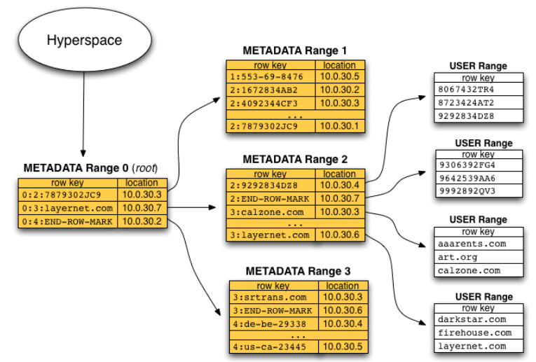

<!-- TOC -->

- [1、数据模型](#1数据模型)
- [2、bigtable集群](#2bigtable集群)
- [3、片的定位](#3片的定位)
- [4、元数据表（METADATA table）](#4元数据表metadata-table)
- [5、片的存储和读写](#5片的存储和读写)
- [6、额外优化](#6额外优化)
    - [1、Locality Group](#1locality-group)
    - [2、读缓存与 Bloom Filter](#2读缓存与-bloom-filter)
    - [3、Commit Log](#3commit-log)
- [参考](#参考)

<!-- /TOC -->

> bigtable贡献（对HBASE）

- 1、Bigtable 的「排序大表 + Column Family」在当时就不是什么新东西，但被证明了是一个非常成功的设计，能概括从线上到线下很多的业务需求，并且有很好的灵活性和扩展性。

- 2、Bigtable 的另一点贡献是把 `LSM (Log-Structured Merge)` Tree 这种古老的技术带回前台。它和当时全部机械硬盘的现状以及 GFS 的编程模型极搭。`把随机写全部转化为顺序写`，实现了非常好的吞吐和即使对线上应用也可以接受的延迟，只读 SSTable dump 极大简化了设计。用 GFS 解决底层存储备份一系列问题，也大大简化了 Bigtable 自身的实现。`SSTable + LSM Tree 这一部分的成果开源在了LevelDB`, 有广泛的应用，也启发了其他的很多开源项目。

# 1、数据模型

A Bigtable is a sparse, distributed, persistent multi-dimensional sorted map. The map is indexed by a row key, column key, and a timestamp; each value in the map is an uninterpreted arrays of bytes.

Bigtable是稀疏的、分布式的、持久化的、多维度的、顺序的map，我们可以将Bigtable的数据模型抽象为一系列的键值对，满足的映射关系为：key(row:string, column:string, time:int64) -> value(string)。

Bigtable的Key有三维，分别是行键（row key）、列键（column key）和时间戳（timestamp），行键和列键都是字节串，时间戳是64位整型。

为了方便管理，列又被分为多个列族（column family，是访问控制的单元），列键按照family:qualifier格式命名的。

`行键、列键和时间戳分别作为table的一级、二级、三级索引`，即一个table包含若干个row key，每个row key包含若干个列族，每个列族又包含若干个列，对于具有相同行键和列键的数据（cell），Bigtable会存储这个数据的多个版本，这些版本通过时间戳来区分。

如下图：

该表包含两个行键u1和u2，每个行键又含两个列族User和Social，User列族包含的列键有name、email、phone；Social列族包含的列键有friend、classmate；

(u1, name, v1)->Ricky 表示一个键值对；

(u1, email, v1)->ricky@gmail.com  和 (u1, email, v2)->ricky@yahoo.com 是两个不同的键值对。

综上，传统的map由一系列键值对组成，在Bigtable中，对应的键是由多个数据复合而成的，即row key，column key和timestamp。

Bigtable按照行键的字典序存储数据，因为系统庞大且为分布式，所以排序这个特性会带来很大的好处，行的空间邻近性可以确保当我们在扫描表时，我们感兴趣的记录会大概率的汇聚到一起。

Tablet是Bigtable分配和负载均衡的单元，Bigtable的表根据行键自动划分为片。最初表都只有一个tablet，但随着表的不断增大，原始的tablet自动分割为多个tablet，片的大小控制在100-200MB。

> 支撑技术

Bigtable的实现依托于Google的几个基础组件：

- 1、Google File System（GFS），一个分布式文件系统，用于存储日志和文件；
- 2、Google Sorted Strings Table（SSTable），一个不可修改的有序键值映射表，提供查询、遍历的功能；
- 3、Chubby，一个高可靠用于分布式的锁服务，其目的是解决分布式一致性的问题，通过Paxos算法实现。Chubby用于片定位，片服务器的状态监控，访问控制列表存储等任务。注：Chubby并不是开源的，但 Yahoo！`借鉴Chubby的设计思想开发了Zookeeper`，并将其开源。

# 2、bigtable集群

Bigtable集群包括三个主要部分：

- 1、供客户端使用的库，客户端需要读写数据时，直接与片服务器联系。因为客户端并不需要从主服务器获取片的位置信息，所以大多数客户端从来不需要访问主服务器，主服务器的负载一般很轻。

- 2、主服务器（master server），主服务器负责将片分配给片服务器，监控片服务器的添加和删除，平衡片服务器的负载，处理表和列族的创建等。注意，主服务器不存储任何片，不提供任何数据服务，也不提供片的定位信息。

- 3、片服务器（tablet server），每个片服务器负责一定量的片，处理对片的读写请求，以及片的分裂或合并。每个片实际由若干SSTable文件和memtable组成，而且这些SSTable和memtable都是已排序的。片服务器可以根据负载随时添加和删除。这里片服务器并不真实存储数据，而相当于一个连接Bigtable和GFS的代理，客户端的一些数据操作都通过片服务器代理间接访问GFS。

注意，主服务器负责将片分配给片服务器，而具体的数据服务则全权由片服务器负责。但是不要误以为片服务器真的存储了数据（除了内存中memtable的数据），数据的真实位置只有GFS才知道，主服务器将片分配给片服务器的意思应该是，片服务器获取了片的所有SSTable文件名，片服务器通过一些索引机制可以知道所需要的数据在哪个SSTable文件，然后从GFS中读取SSTable文件的数据，这个SSTable文件可能分布在好几台chunkserver上。 

片服务器启动时，它会在Chubby的某个特定目录下创建并获取一个锁文件（互斥锁），这个锁文件的名称是唯一表示该tablet server的。master server通过监控这个目录获取当前存活着的tablet server的信息。

- 如果tablet server失去了锁（比如网络问题），那么tablet server也就不再为对应的tablet服务了。

- 如果锁文件存在，那么tablet server会主动获取锁。

- 如果锁文件不存在，那么tablet server就永远不会再服务对应的tablet了，所以tablet server就会kill自己。

- 当tablet server要终止时，它会自己释放占有的锁，master server就会把该tablet server上的tablet分配给其它的tablet server。

那么maser server是如何获知tablet server不再服务了呢？master server会定期轮询每个tablet server的锁状态。如果tablet server报告自己失去了已经失去了锁，或者master server不能获取tablet server的状态，那么master server就会尝试去获取tablet server对应的锁文件。如果master server获取到了锁文件，并且Chubby是处于正常工作的状态的，此时master server就确认tablet server已经无法再提供服务了，master server删除相应的锁文件并把tablet server对应的tablet分配给新的tablet server。

如果master server与Chubby之间出现了网络问题，那么master server也会kill自己。但是这并不会影响tablet与tablet server之间的分配关系。

master server的启动需要经历一下几个阶段。

- master server需要从Chubby获取锁，这样可以确保在同一时刻只有一个master server在工作。
- master server扫描Chubby下特定的目录（即tablet server创建锁文件的目录），获取存活着的tablet server的信息。
- master server与存活着的tablet server通信，获取已被分配到tablet server的tablet信息。
- master server扫描METADATA tablet，获取所有的tablet信息，然后把未分配的tablet分配给tablet server。

# 3、片的定位

前面提到主服务器不提供片的位置信息，那么客户端是如何访问片的呢？Bigtable使用一个类似B+树的数据结构存储片的位置信息。

定位系统：

- Chubby file，保存着root tablet的位置。这个Chubby文件属于Chubby服务的一部分，一旦Chubby不可用，就意味着丢失了root tablet的位置，整个Bigtable也就不可用了。

- root tablet，root tablet其实是元数据表（METADATA table）的第一个分片，它保存着元数据表其它片的位置。root tablet很特别，为了保证树的深度不变，root tablet从不分裂。

- 其它的元数据片，它们和root tablet一起组成完整的元数据表。每个元数据片都包含了许多用户片的位置信息。

可以看出整个定位系统其实只是两部分，一个Chubby文件，一个元数据表。每个分片也都是由专门的片服务器负责，这就是不需要主服务器提供位置信息的原因。客户端会缓存片的位置信息，如果在缓存里找不到一个片的位置信息，就需要查找这个三层结构了，包括访问一次Chubby服务，访问两次片服务器。

# 4、元数据表（METADATA table）

元数据表（METADATA table）是一张特殊的表，它被用于数据的定位以及一些元数据服务，不可谓不重要。

- 元数据表的行键=片所属表名的id+片最后一行行键而成，所以每个片在元数据表中占据一条记录（一行），而且行键既包含了其所属表的信息也包含了其所拥有的行的范围；

- 除了知道元数据表的地址部分是常驻内存以外，还可以发现元数据表有一个列族称为location，我们已经知道元数据表每一行代表一个片，那么为什么需要一个列族来存储地址呢？因为每个片都可能由多个SSTable文件组成，列族可以用来存储任意多个SSTable文件的位置。一个合理的假设就是每个SSTable文件的位置信息占据一列，列名为location:filename。当然不一定非得用列键存储完整文件名，更大的可能性是把SSTable文件名存在值里。获取了文件名就可以向GFS索要数据了。

- 元数据表不止存储位置信息，也就是说列族不止location，这些数据暂时不是咱们关心的。

客户端会缓存tablet的位置信息，客户端在获取tablet的位置信息时，会涉及到两种情况：

- 如果客户端没有缓存目标tablet的位置信息，那么就会沿着root tablet定位到最终的tablet，整个过程需要3次网络往返（round-trips）。
- 如果客户端缓存了目标tablet的位置信息，但是到了目标tablet后发现原来缓存的tablet位置信息过时了，那么会重新从root tablet开始定位tablet，整个过程需要6个network round-trips。

# 5、片的存储和读写

片的数据最终还是写到GFS里的，片在GFS里的物理形态就是若干个SSTable文件。下图展示了读写操作基本情况

当片服务器收到一个写请求，片服务器首先检查请求是否合法。如果合法，先将写请求提交到日志去（Write-Ahead Log），然后将数据写入内存中的memtable。memtable相当于SSTable的缓存，当memtable成长到一定规模会被冻结，Bigtable随之创建一个新的memtable，并且将冻结的memtable转换为SSTable格式写入GFS，这个操作称为minor compaction。

当片服务器收到一个读请求，同样要检查请求是否合法。如果合法，这个读操作会查看所有SSTable文件和memtable的合并视图，因为SSTable和memtable本身都是已排序的，所以合并相当快。

每一次`minor compaction`都会产生一个新的SSTable文件，SSTable文件太多读操作的效率就降低了，所以Bigtable定期执行`merging compaction`操作，将几个SSTable和memtable合并为一个新的SSTable。BigTable还有个更厉害的叫`major compaction`，它将所有SSTable合并为一个新的SSTable。

# 6、额外优化

## 1、Locality Group

Bigtable 允许客户端为 Column Family 指定一个 Locality Group，并以 Locality Group 为基础指定其实际的文件存储格式以及压缩方式。

首先，在进行上面我们提到的 Compaction 操作时，Bigtable 会为 Tablet 中的每个 Locality Group 生成独立的 SSTable 文件。由此，用户便可将那些很少同时访问的 Column Famliy 放入到不同的 Locality Group 中，以提高查询效率。除外 Bigtable 也提供了其他基于 Locality Group 的调优参数设置，如设置某个 Locality Group 为 in-memory 等。

在压缩方面，Bigtable 允许用户指定某个 Locality Group 是否要对数据进行压缩以及使用何种格式进行压缩。值得注意的是，Bigtable 对 SSTable 的压缩是基于 SSTable 文件的 Block 进行的，而不是对整个文件直接进行压缩。尽管这会让压缩的效率下降，但这也使得用户在读取数据时 Bigtable 只需要对 SSTable 的某些 Block 进行解压。

## 2、读缓存与 Bloom Filter

了解过 LSM Tree 的读者可能已经意识到，Bigtable 使用的存储方式正是 LSM Tree：这种存储方式可以将对磁盘的随机写转换为顺序写，代价则是读取性能的下降。LSM Tree 被应用在 Bigtable 上是合情合理的，毕竟 Bigtable 的文件实际上存储在 GFS 中，而 GFS 主要针对顺序写进行优化，对随机写的支持可以说是极差。那么 Bigtable 在使用 LSM Tree 确保了写入性能后，当然就要通过其他的方式来确保自己的读性能了。首先便是读缓存。

总的来说，Bigtable 的读缓存由两个缓存层组成：Scan Cache 和 Block Cache。Block Cache 会缓存从 GFS 中读出的 SSTable 文件 Block，提高客户端读取某个数据附近的其他数据的效率；Scan Cache 则在 Block Cache 之上，缓存由 SSTable 返回给 Tablet Server 的键值对，以提高客户端重复读取相同数据的效率。

除外，为了提高检索的效率，Bigtable 也允许用户为某个 Locality Group 开启 Bloom Filter 机制，通过消耗一定量的内存保存为 SSTable 文件构建的 Bloom Filter，以在客户端检索记录时利用 Bloom Filter 快速地排除某些不包含该记录的 SSTable，减少需要读取的 SSTable 文件数。

## 3、Commit Log

Bigtable 使用了 Write-Ahead Log 的做法来确保数据高可用，那么便涉及了大量对 Commit Log 的写入，因此这也是个值得优化的地方。

首先，如果 Bigtable 为不同的 Tablet 使用不同的 Commit Log，那么系统就会有大量的 Commit Log 文件同时写入，提高了底层磁盘寻址的时间消耗。为此，Tablet Server 会把其接收到的所有 Tablet 写入操作写入到同一个 Commit Log 文件中。

这样的设计带来了另一个问题：如果该 Tablet Server 下线，其所负责的 Tablet 可能会被重新分配到其他若干个 Tablet Server 上，它们在恢复 Tablet MemTable 的过程中会重复读取上一个 Tablet Server 产生的 Commit Log。为了解决该问题，Tablet Server 在读取 Commit Log 前会向 Master 发送信号，Master 就会发起一次对原 Commit Log 的排序操作：原 Commit Log 会按 64 MB 切分为若干部分，每个部分并发地按照 (table, row name, log sequence number) 进行排序。完成排序后，Tablet Server 读取 Commit Log 时便可只读取自己需要的那一部分，减少重复读取。

# 参考

- [bigtable英文](https://static.usenix.org/events/osdi06/tech/chang/chang_html/?em_x=22)

- [BigTable 有什么值得称道（牛）的地方？](https://www.zhihu.com/question/19551534/answer/116874719)

- [小白带你学习google三篇论文———— BigTable](https://zhuanlan.zhihu.com/p/51042640)

- [Bigtable 论文详述](https://zhuanlan.zhihu.com/p/35687103)

- [bigtable原理](https://www.cnblogs.com/chenny7/p/6910117.html?utm_source=itdadao&utm_medium=referral)