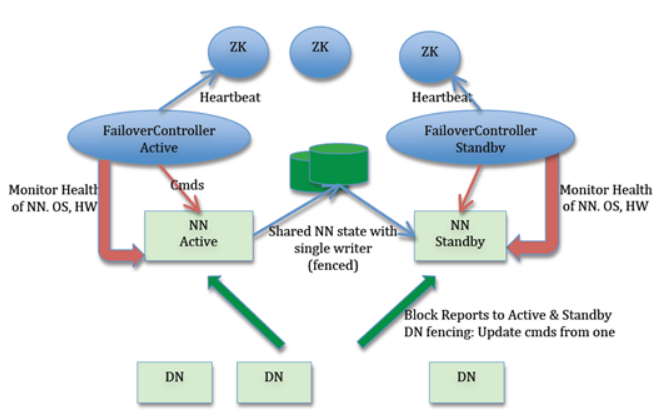
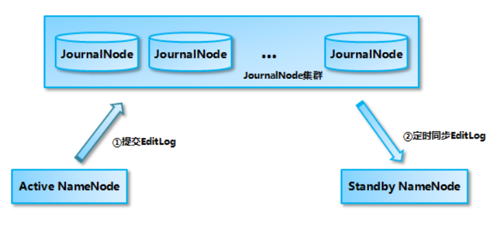
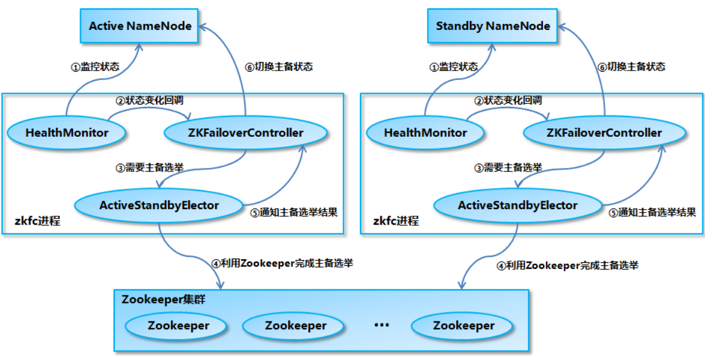

<!-- TOC -->

- [1、NameNode高可用构成](#1namenode高可用构成)
    - [1、ZKFC（ZKFailoverContoller）](#1zkfczkfailovercontoller)
    - [2、Zookeeper集群](#2zookeeper集群)
    - [3、共享存储系统](#3共享存储系统)
    - [1、基于QJM的共享存储系统](#1基于qjm的共享存储系统)
    - [4、DataNode 节点](#4datanode-节点)
- [2、NameNode的主备切换实现](#2namenode的主备切换实现)
- [参考](#参考)

<!-- /TOC -->

在 Hadoop 1.0 时代，Hadoop 的两大核心组件 HDFS NameNode 和 JobTracker 都存在着单点问题，这其中以 NameNode 的单点问题尤为严重。因为 NameNode 保存了整个 HDFS 的元数据信息，一旦 NameNode 挂掉，整个 HDFS 就无法访问，同时 Hadoop 生态系统中依赖于 HDFS 的各个组件，包括 MapReduce、Hive、Pig 以及 HBase 等也都无法正常工作，并且重新启动 NameNode 和进行数据恢复的过程也会比较耗时。这些问题在给 Hadoop 的使用者带来困扰的同时，也极大地限制了 Hadoop 的使用场景，使得 Hadoop 在很长的时间内仅能用作离线存储和离线计算，无法应用到对可用性和数据一致性要求很高的在线应用场景中。

所幸的是，在 Hadoop2.0 中，HDFS NameNode 和 YARN ResourceManger(JobTracker 在 2.0 中已经被整合到 YARN ResourceManger 之中) 的单点问题都得到了解决，经过多个版本的迭代和发展，目前已经能用于生产环境。`HDFS NameNode 和 YARN ResourceManger 的高可用 (High Availability，HA) 方案基本类似`，两者也复用了部分代码，但是由于 HDFS NameNode 对于数据存储和数据一致性的要求比 YARN ResourceManger 高得多，所以 HDFS NameNode 的高可用实现更为复杂一些，本文从内部实现的角度对 HDFS NameNode 的高可用机制进行详细的分析。

# 1、NameNode高可用构成

在hadoop 1.x的时候，NameNode存储单点问题，导致集群故障，成为集群的瓶颈。在hadoop 2.x之后，增加了NameNode的HA机制。对于NameNode单点问题，大家首先想到的解决方案是给NameNode做一些备份，但是难点是在于如何保证NameNode和它的备份节点的数据一致性问题。在分布式环境下要保证数据一致性问题，需要考虑的问题很多，比如脑裂，分区容错，一致性协议等等。下面一起看看Hadoop是如何解决的。

上图是Hadoop的2.x版本提供的NameNode的HA机制的架构。在这个架构体系涉及到Zookeeper，NameNode Active和NameNode Standby和共享存储空间，ZKFC。在整个高可用架构中，Active NameNode和Standby NameNode两台NameNode形成互备，一台处于Active状态，作为主节点，另外一台是Standby状态，作为备节点，只有主节点才能对外提供读写服务。

## 1、ZKFC（ZKFailoverContoller）

ZKFC（ZKFailoverContoller）作为独立的进程运行，对NameNode的主备切换进行总体控制。ZKFC能够及时加测到NameNode的健康状况，在active的NameNode故障的时候，借助Zookeeper实现自动主备选举和切换。当然，NameNode目前也支持不依赖Zookeeper的手动主备切换。Zookeeper集群主要是为控制器提供主被选举支持。

## 2、Zookeeper集群

为主备切换控制器提供主备选举支持。

## 3、共享存储系统

共享存储系统是NameNode实现高可用的关键部分，共享存储系统保存了NameNode运行过程中的所有产生的`HDFS的元数据。active NameNode和standby NameNode通过共享存储系统实现元数据同步。`在主备切换的时候，新的active NameNode在确认元数据同步之后才能继续对外提供服务。

除了通过共享存储系统共享HDFS的元数据信息之外，active NameNode和 standby NameNode还需要共享HDFS的数据块和DataNode之间的映射关系，`DataNode会同时向active NameNode和standby NameNode上报数据块位置信息`。

## 1、基于QJM的共享存储系统

共享存储系统主要是由多个JournalNode进程组成，JournalNode由奇数个组成。当Active NameNode中有事物提交，active NameNode会将editLog发给jouranlNode集群，journalNode集群通过`paxos`协议保证数据一致性（即：超过一半以上的jounalNode节点确认），这个数据完成了提交到共享存储。standby NameNode定期从journalNode读取editLog，合并到自己的fsimage上。总体的架构如下：

处于 Standby 状态的 NameNode 转换为 Active 状态的时候，有可能上一个 Active NameNode 发生了异常退出，那么 JournalNode 集群中各个 JournalNode 上的 EditLog 就可能会处于不一致的状态，所以首先要做的事情就是让 JournalNode 集群中各个节点上的 EditLog 恢复为一致。另外如前所述，当前处于 Standby 状态的 NameNode 的内存中的文件系统镜像有很大的可能是落后于旧的 Active NameNode 的，所以在 JournalNode 集群中各个节点上的 EditLog 达成一致之后，接下来要做的事情就是从 JournalNode 集群上补齐落后的 EditLog。只有在这两步完成之后，当前新的 Active NameNode 才能安全地对外提供服务。

## 4、DataNode 节点

除了通过共享存储系统共享 HDFS 的元数据信息之外，主 NameNode 和备 NameNode 还需要共享 HDFS 的数据块和 DataNode 之间的映射关系。DataNode 会同时向主 NameNode 和备 NameNode 上报数据块的位置信息。

# 2、NameNode的主备切换实现

NameNode 主备切换主要由 ZKFailoverController、HealthMonitor 和 ActiveStandbyElector 这 3 个组件来协同实现：

ZKFailoverController 作为 NameNode 机器上一个独立的进程启动 (在 hdfs 启动脚本之中的进程名为 zkfc)，启动的时候会创建 HealthMonitor 和 ActiveStandbyElector 这两个主要的内部组件，ZKFailoverController 在创建 HealthMonitor 和 ActiveStandbyElector 的同时，也会向 HealthMonitor 和 ActiveStandbyElector 注册相应的回调方法。

HealthMonitor 主要负责检测 NameNode 的健康状态，如果检测到 NameNode 的状态发生变化，会回调 ZKFailoverController 的相应方法进行自动的主备选举。

ActiveStandbyElector 主要负责完成自动的主备选举，内部封装了 Zookeeper 的处理逻辑，一旦 Zookeeper 主备选举完成，会回调 ZKFailoverController 的相应方法来进行 NameNode 的主备状态切换。

NameNode 实现主备切换的流程如图 2 所示，有以下几步：

- 1、HealthMonitor 初始化完成之后会启动内部的线程来定时调用对应 NameNode 的 HAServiceProtocol RPC 接口的方法，对 NameNode 的健康状态进行检测。

- 2、HealthMonitor 如果检测到 NameNode 的健康状态发生变化，会回调 ZKFailoverController 注册的相应方法进行处理。

- 3、如果 ZKFailoverController 判断需要进行主备切换，会首先使用 ActiveStandbyElector 来进行自动的主备选举。

- 4、ActiveStandbyElector 与 Zookeeper 进行交互完成自动的主备选举。

- 5、ActiveStandbyElector 在主备选举完成后，会回调 ZKFailoverController 的相应方法来通知当前的 NameNode 成为主 NameNode 或备 NameNode。

- 6、ZKFailoverController 调用对应 NameNode 的 HAServiceProtocol RPC 接口的方法将 NameNode 转换为 Active 状态或 Standby 状态。

# 参考

- [浅析HDFS基本原理](http://tech.weli.cn/2019/03/06/hdfs-basic/)

- [Hadoop NameNode 高可用 (High Availability) 实现解析](https://developer.ibm.com/zh/articles/os-cn-hadoop-name-node/)
