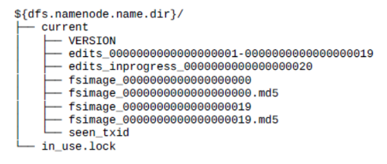
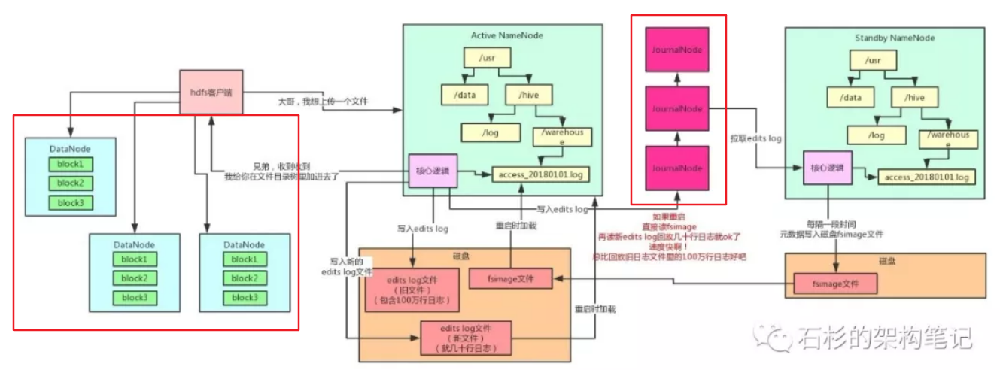
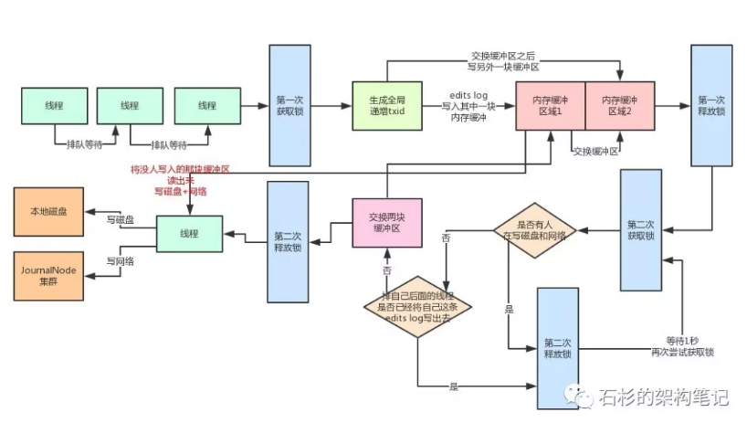

<!-- TOC -->

- [1、一个写文件案例剖析namenode工作机制](#1一个写文件案例剖析namenode工作机制)
    - [1、创建元数据信息](#1创建元数据信息)
    - [2、上传数据文件](#2上传数据文件)
- [2、namenode高并发写原理](#2namenode高并发写原理)
    - [1、分段加锁机制 + 内存双缓冲机制](#1分段加锁机制--内存双缓冲机制)
    - [2、多线程并发吞吐量的百倍优化](#2多线程并发吞吐量的百倍优化)
    - [3、缓冲数据批量刷磁盘 + 网络的优化](#3缓冲数据批量刷磁盘--网络的优化)
- [参考](#参考)

<!-- /TOC -->

`namenode使用fsimage保存文件的元数据信息，为了保证效率每次修改只更改内存中的数据+记录editslog日志到磁盘，为了防止editslog日志过大，通过standby节点定时合并fsimage和editslog生成新的fsimage替换active namenode节点的fsimage。`

NameNode有一个很核心的功能：管理整个HDFS集群的元数据，比如说文件目录树、权限的设置、副本数的设置，等等。

NameNode 在执行 HDFS 客户端提交的创建文件或者移动文件这样的写操作的时候，会首先把这些操作记录在 EditLog 文件之中，然后再更新内存中的文件系统镜像。内存中的文件系统镜像用于 NameNode 向客户端提供读服务，而 EditLog 仅仅只是在数据恢复的时候起作用。记录在 EditLog 之中的每一个操作又称为一个事务，每个事务有一个整数形式的事务 id 作为编号。EditLog 会被切割为很多段，每一段称为一个 Segment。正在写入的 EditLog Segment 处于 in-progress 状态，其文件名形如 editsinprogress${starttxid}，其中${start_txid} 表示这个 segment 的起始事务 id，例如上图中的 edits_inprogress_0000000000000000020。而已经写入完成的 EditLog Segment 处于 finalized 状态，其文件名形如 edits${start_txid}-${end_txid}，其中${start_txid} 表示这个 segment 的起始事务 id，${end_txid} 表示这个 segment 的结束事务 id，例如上图中的 edits_0000000000000000001-0000000000000000019。

NameNode 会定期对内存中的文件系统镜像进行 checkpoint 操作，在磁盘上生成 FSImage 文件，FSImage 文件的文件名形如 fsimage_${end_txid}，其中${end_txid} 表示这个 fsimage 文件的结束事务 id，例如上图中的 fsimage_0000000000000000020。在 NameNode 启动的时候会进行数据恢复，首先把 FSImage 文件加载到内存中形成文件系统镜像，然后再把 EditLog 之中 FsImage 的结束事务 id 之后的 EditLog 回放到这个文件系统镜像上。

# 1、一个写文件案例剖析namenode工作机制

## 1、创建元数据信息

下面就用最典型的文件目录树的维护，来给大家举例说明，我们看看下面的图。现在有一个客户端系统要上传一个1TB的大文件到HDFS集群里。

此时他会先跟NameNode通信，说：大哥，我想创建一个新的文件，他的名字叫“/usr/hive/warehouse/access_20180101.log”，大小是1TB，你看行不？

然后NameNode就会在自己内存的文件目录树里，在指定的目录下搞一个新的文件对象，名字就是“access_20180101.log”。

这个文件目录树不就是HDFS非常核心的一块元数据，维护了HDFS这个分布式文件系统中，有哪些目录，有哪些文件，对不对？

但是有个问题，这个文件目录树是在NameNode的内存里的啊！

这可坑爹了，你把重要的元数据都放在内存里，万一NameNode不小心宕机了可咋整？元数据不就全部丢失了？

可你要是每次都频繁的修改磁盘文件里的元数据，性能肯定是极低的啊！毕竟这是大量的磁盘随机读写！

没关系，我们来看看HDFS优雅的解决方案。

每次内存里改完了，写一条edits log，元数据修改的操作日志到磁盘文件里，不修改磁盘文件内容，就是顺序追加，这个性能就高多了。

每次NameNode重启的时候，把edits log里的操作日志读到内存里回放一下，不就可以恢复元数据了？

但是问题又来了，那edits log如果越来越大的话，岂不是每次重启都会很慢？因为要读取大量的edits log回放恢复元数据！

所以HDFS说，我可以这样子啊，我引入一个新的磁盘文件叫做fsimage，然后呢，再引入一个JournalNodes集群，以及一个Standby NameNode（备节点）。

每次Active NameNode（主节点）修改一次元数据都会生成一条edits log，除了写入本地磁盘文件，还会写入JournalNodes集群。

然后Standby NameNode就可以从JournalNodes集群拉取edits log，应用到自己内存的文件目录树里，跟Active NameNode保持一致。

然后每隔一段时间，Standby NameNode都把自己内存里的文件目录树写一份到磁盘上的fsimage，这可不是日志，这是完整的一份元数据。这个操作就是所谓的checkpoint检查点操作。然后把这个fsimage上传到到Active NameNode，接着清空掉Active NameNode的旧的edits log文件，这里可能都有100万行修改日志了！然后Active NameNode继续接收修改元数据的请求，再写入edits log，写了一小会儿，这里可能就几十行修改日志而已！

如果说此时，Active NameNode重启了，没关系，只要把Standby NameNode传过来的fsimage直接读到内存里，这个fsimage直接就是元数据，不需要做任何额外操作，纯读取，效率很高！然后把新的edits log里少量的几十行的修改日志回放到内存里就ok了！这个过程的启动速度就快的多了！因为不需要回放大量上百万行的edits log来恢复元数据了！

此外，大家看看上面这张图，现在咱们有俩NameNode。一个是主节点对外提供服务接收请求。另外一个纯就是接收和同步主节点的edits log以及执行定期checkpoint的备节点。

他们俩内存里的元数据几乎是一模一样的啊！所以呢，如果Active NameNode挂了，是不是可以立马切换成Standby NameNode对外提供服务？这不就是所谓的`NameNode主备高可用故障转移机制么！`

接下来大家再想想，HDFS客户端在NameNode内存里的文件目录树，新加了一个文件。但是这个时候，人家要把数据上传到多台DataNode机器上去啊，这可是一个1TB的大文件！咋传呢？

## 2、上传数据文件

很简单，把1TB的大文件拆成N个block，每个block是128MB。1TB = 1024GB = 1048576MB，一个block是128MB，那么就是对应着8192个block。

这些block会分布在不同的机器上管理着，比如说一共有100台机器组成的集群，那么每台机器上放80个左右的block就ok了。但是问题又来了，那如果这个时候1台机器宕机了，不就导致80个block丢失了？也就是说上传上去的1TB的大文件，会丢失一小部分数据啊。没关系！HDFS都考虑好了！

它会默认给每个block搞3个副本，一模一样的副本，分放在不同的机器上，如果一台机器宕机了，同一个block还有另外两个副本在其他机器上呢！

每个block都在不同的机器上有3个副本，任何一台机器宕机都没事！还可以从其他的机器上拿到那个block。

# 2、namenode高并发写原理

`问题：比如同时又多个客户端进行文件的上传，那么每一个进行文件的创建是不是需要等待editlog落盘+网络写JournalNodes集群成功才返回？`

如果大量客户端对NameNode发起高并发（比如每秒上千次）访问来修改元数据，此时NameNode该如何抗住？我们先来分析一下，高并发请求NameNode会遇到什么样的问题。

大家现在都知道了，每次请求NameNode修改一条元数据（比如说申请上传一个文件，那么就需要在内存目录树中加入一个文件），都要写一条edits log，包括两个步骤：

- 1、写入本地磁盘。
- 2、通过网络传输给JournalNodes集群。

但是如果对Java有一定了解的同学都该知道多线程并发安全问题吧？

NameNode在写edits log时的第一条原则：必须保证每条edits log都有一个全局顺序递增的transactionId（简称为txid），这样才可以标识出来一条一条的edits log的先后顺序。那么如果要保证每条edits log的txid都是递增的，就必须得加锁。每个线程修改了元数据，要写一条edits log的时候，都必须按顺序排队获取锁后，才能生成一个递增的txid，代表这次要写的edits log的序号。

如果每次都是在一个加锁的代码块里，生成txid，然后写磁盘文件edits log，网络请求写入journalnodes一条edits log，会咋样？

不用说，这个绝对完蛋了！NameNode本身用多线程接收多个客户端发送过来的并发的请求，结果多个线程居然修改完内存中的元数据之后，排着队写edits log！

而且你要知道，写本地磁盘 + 网络传输给journalnodes，都是很耗时的啊！性能两大杀手：`磁盘写 + 网络写`！

如果HDFS的架构真要是这么设计的话，基本上NameNode能承载的每秒的并发数量就很少了，可能就每秒处理几十个并发请求处理撑死了！

> HDFS优雅的解决方案

首先大家想一下，既然咱们不希望每个线程写edits log的时候，串行化排队生成txid + 写磁盘 + 写JournalNode，那么是不是可以搞一个内存缓冲？

也就是说，多个线程可以快速的获取锁，生成txid，然后快速的将edits log写入内存缓冲。接着就快速的释放锁，让下一个线程继续获取锁后，生成id + 写edits log进入内存缓冲。然后接下来有一个线程可以将内存中的edits log刷入磁盘，但是在这个过程中，还是继续允许其他线程将edits log写入内存缓冲中。

但是这里又有一个问题了，如果针对同一块内存缓冲，同时有人写入，还同时有人读取后写磁盘，那也有问题，因为不能并发读写一块共享内存数据！所以HDFS在这里采取了`double-buffer双缓冲机制`来处理！将一块内存缓冲分成两个部分：

- 其中一个部分可以写入
- 另外一个部分用于读取后写入磁盘和JournalNodes。

如下图所示：

## 1、分段加锁机制 + 内存双缓冲机制
 

首先各个线程依次第一次获取锁，生成顺序递增的txid，然后将edits log写入内存双缓冲的区域1，接着就立马第一次释放锁了。趁着这个空隙，后面的线程就可以再次立马第一次获取锁，然后立即写自己的edits log到内存缓冲。写内存那么快，可能才耗时几十微妙，接着就立马第一次释放锁了。所以这个并发优化绝对是有效果的。

接着各个线程竞争第二次获取锁，有线程获取到锁之后，就看看，有没有谁在`写磁盘和网络`？

如果没有，好，那么这个线程是个幸运儿！直接交换双缓冲的区域1和区域2，接着第二次释放锁。这个过程相当快速，内存里判断几个条件，耗时不了几微秒。

好，到这一步为止，内存缓冲已经被交换了，后面的线程可以立马快速的依次获取锁，然后将edits log写入内存缓冲的区域2，区域1中的数据被锁定了，不能写。

怎么样，是不是又感受到了一点点多线程并发的优化？

## 2、多线程并发吞吐量的百倍优化

接着，之前那个幸运儿线程，将内存缓冲的区域1中的数据读取出来（此时没人写区域1了，都在写区域2），将里面的edtis log都写入磁盘文件，以及通过网络写入JournalNodes集群。

这个过程可是很耗时的！但是没关系啊，人家做过优化了，在写磁盘和网络的过程中，是不持有锁的！

因此后面的线程可以噼里啪啦的快速的第一次获取锁后，立马写入内存缓冲的区域2，然后释放锁。

这个时候大量的线程都可以快速的写入内存，没有阻塞和卡顿！怎么样？并发优化的感觉感受到了没有！

## 3、缓冲数据批量刷磁盘 + 网络的优化

那么在幸运儿线程吭哧吭哧把数据写磁盘和网络的过程中，排在后面的大量线程，快速的第一次获取锁，写内存缓冲区域2，释放锁，之后，这些线程第二次获取到锁后会干嘛？

他们会发现有人在写磁盘啊，兄弟们！所以会立即休眠1秒，释放锁。

此时大量的线程并发过来的话，都会在这里快速的第二次获取锁，然后发现有人在写磁盘和网络，快速的释放锁，休眠。

怎么样，这个过程没有人长时间的阻塞其他人吧！因为都会快速的释放锁，所以后面的线程还是可以迅速的第一次获取锁后写内存缓冲！

again！并发优化的感觉感受到了没有？

而且这时，一定会有很多线程发现，好像之前那个幸运儿线程的txid是排在自己之后的，那么肯定就把自己的edits log从缓冲里写入磁盘和网络了。

这些线程甚至都不会休眠等待，直接就会返回后去干别的事情了，压根儿不会卡在这里。这里又感受到并发的优化没有？然后那个幸运儿线程写完磁盘和网络之后，就会唤醒之前休眠的那些线程。那些线程会依次排队再第二次获取锁后进入判断，咦！发现没有人在写磁盘和网络了！

然后就会再判断，有没有排在自己之后的线程已经将自己的edtis log写入磁盘和网络了。

如果有的话，就直接返回了。

没有的话，那么就成为第二个幸运儿线程，交换两块缓冲区，区域1和区域2交换一下。

然后释放锁，自己开始吭哧吭哧的将区域2的数据写入磁盘和网络。但是这个时候没有关系啊，后面的线程如果要写edits log的，还是可以第一次获取锁后立马写内存缓冲再释放锁。以此类推。

> 总结

其实这套机制还是挺复杂的，涉及到了分段加锁以及内存双缓冲两个机制。

通过这套机制，NameNode保证了多个线程在高并发的修改元数据之后写edits log的时候，不会说一个线程一个线程的写磁盘和网络，那样性能实在太差，并发能力太弱了！

所以通过上述那套复杂的机制，尽最大的努力保证，一个线程可以批量的将一个缓冲中的多条edits log刷入磁盘和网络。

在这个漫长的吭哧吭哧的过程中，其他的线程可以快速的高并发写入edits log到内存缓冲里，不会阻塞其他的线程写edits log。

所以，正是依靠以上机制，最大限度优化了NameNode处理高并发访问修改元数据的能力！

# 参考

- [小白都能看懂的Hadoop架构原理](https://mp.weixin.qq.com/s?__biz=MzU0OTk3ODQ3Ng==&mid=2247483809&idx=1&sn=a8d087c21171bf164fcda389ada9404a&chksm=fba6e9a2ccd160b4e1423c6d142b18849ded66cfdc1477e4d601e44f832d7026b64d80af8db1&scene=21#wechat_redirect)

- [Hadoop NameNode如何承载每秒上千次的高并发访问](https://mp.weixin.qq.com/s?__biz=MzU0OTk3ODQ3Ng==&mid=2247483821&idx=1&sn=872dad184dc230a1988973d3023eb837&chksm=fba6e9aeccd160b80a5c4c7957f045057bfff64bf5769eac976a2191d42511f14ff4cdabb5db&scene=21#wechat_redirect)