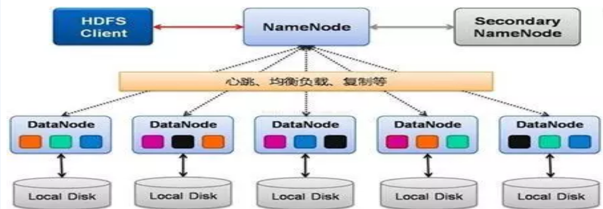
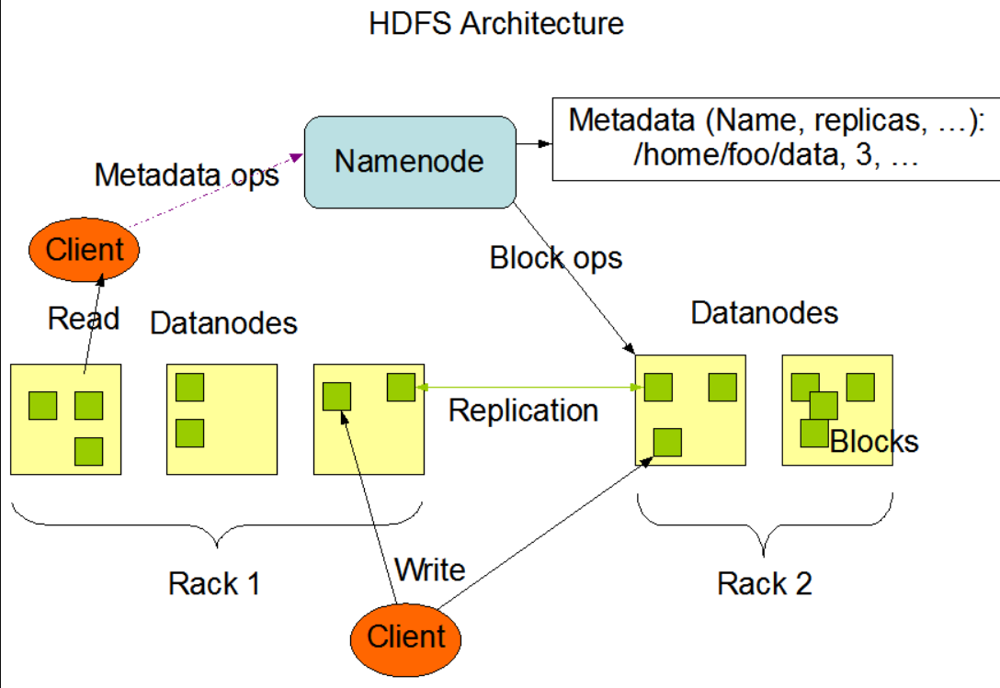
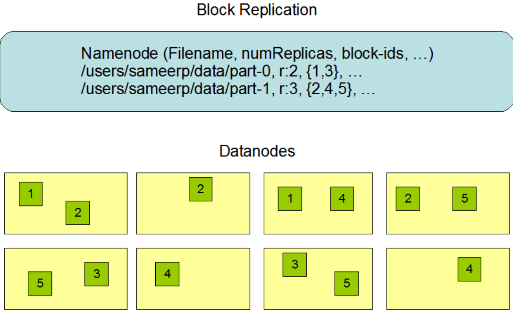

<!-- TOC -->

- [1、发展历程](#1发展历程)
- [2、Hadoop组成](#2hadoop组成)
- [3、架构](#3架构)
    - [1、NameNode](#1namenode)
        - [1、fsimage镜像和edits日志](#1fsimage镜像和edits日志)
        - [2、CHECKPOINT](#2checkpoint)
            - [1、CHECKPOINT概念](#1checkpoint概念)
            - [2、CHECKPOINT 过程](#2checkpoint-过程)
        - [3、Namenode容错机制](#3namenode容错机制)
    - [2、SecondaryNameNode](#2secondarynamenode)
    - [3、DataNode](#3datanode)
    - [4、client](#4client)
- [参考](#参考)

<!-- /TOC -->

# 1、发展历程

- Google发表的3篇论文:分布式文件系统 GFS、分布式计算框架 MapReduce、NoSQL数据库系统BigTable，俗称“三驾马车”

- Lucene开源项目的创始人 Doug Cutting基于Google论文实现了类似GFS和MapReduce的功能：HDFS和MapReduce。随后YARN发布，HDFS、MapRedue、YARN被视为Hadoop生态的基石：存储、计算、资源管理

- Facebook发布Hive，Hive 支持使用 SQL 语法来进行大数据计算，将SQL转换成MapReduce计算任务，大大降低了分布式计算系统的使用门槛

> 大数据技术产品：

- 大数据存储
    - 1、大数据文件系统hdfs；
    - 2、nosql:hbase、Cassandra
- 大数据计算
    - 1、批计算（离线）
        - 1、MapReduce
        - 2、spark
        - 3、storm
    - 2、流计算
        - 1、storm
        - 2、sparkstreaming
        - 3、flink
    - 3、数仓
        - 1、hive
        - 2、presto
        - 3、sparksql
- 大数据资源管理
    1、yarn
- 数据适配&传输：Sqoop、Flume、Kafka
- 分布式搜索：ElasticSearch

# 2、Hadoop组成

- 1）Hadoop HDFS：一个高可靠、高吞吐量的分布式文件系统。
- 2）HadoopMapReduce：一个分布式的离线并行计算框架。
- 3）HadoopYARN：作业调度与集群资源管理的框架。
- 4）Hadoop Common：支持其他模块的工具模块。

Hadoop1.0版本两个核心：HDFS+MapReduce

Hadoop2.0版本，引入了Yarn,增加了HA。核心：HDFS+Yarn+Mapreduce

- Yarn是资源调度框架。能够细粒度的管理和调度任务。此外，还能够支持其他的计算框架，比如spark等。

- HA主要指的是可以同时启动2个NameNode。其中一个处于工作（Active）状态，另一个处于随时待命（Standby）状态。这样，当一个NameNode所在的服务器宕机时，可以在数据不丢失的情况下，手工或者自动切换到另一个NameNode提供服务。

2019年6月hadoop已经推出3.x版本

hdfs部署：client+NameNode+DateNode+SecondaryNameNode

# 3、架构

HDFS集群以Master-Slave模式运行，主要有两类节点：一个Namenode(即Master)和多个Datanode(即Slave)。　

HDFS采用的master/slave架构。一个HDFS集群通常由一个Active的NameNode和若干DataNode组成，为了避免NameNode单点问题，通常会做一个NameNode的standby作为备份。在整个hdfs涉及到许多的核心概念，下面做一个简单介绍

- NameNode： NameNode是一个中心服务器，负责管理文件系统的名字空间以及客户端的访问，比如文件的打卡、关闭、重命名文件或者目录。`它负责确定数据块到具体的存储节点的映射`。在其同意调度下进行数据块的创建、删除、复制。

- DataNode: DataNode是HDFS的实际存储节点，负责管理它所在节点的存储；客户端的读写请求。并且定期上报心跳和块的存储位置。

- Block： HDFS上文件，从其内部看，一个文件其实是被分成一个或者多个数据块存储的，这些数据块存储在一组DataNode上。

- Edits: 在HDFS发起的创建、删除等操作其实是一个事物，事物在NameNode上以Edit对象存储在edits文件中，持久化在NameNode的本地磁盘上。

- FSimage: FSimage是NameNode的元数据存储快照，持久化在NameNode的本地磁盘上。

当NameNode重启的时候，NameNode从FSImage和Edits文件中读取数据，加载到内存中。

在HDFS体系来看，NameNode主要负责元数据的存储与操作，DataNode负责实际的存储。DataNode通常在一个机器上部署一个进程，这些机器分布式在多个机架上。整体架构如下图所示：

客户端操作HDFS上的文件时，向NameNode获取文件的元数据信息，NameNode返回文件的块存储位置，Client选择块存储位置最近的节点进行块操作。通常优先级是本机>本机柜>其他机柜的节点。数据块的分布式通常是在同一机架的两个节点存储两份，为了避免单个机架的故障导致数据块丢失，会选择在另外一个机架上的节点存储一份。如果把数据存储在三个不同的机架上，由于不同机架之间通过交换机进行数据交换，网络速度会比单机架慢，因此复制数据也会慢，此外，还会增加机架之间的交换机的压力。数据块分布如下图

DataNode除了负责客户端的读写操作外，还需要定期的向NameNode的active和standby做心跳汇报，如果有DataNode的心跳异常，被确定为死的节点，NameNode将会对存储在该节点的数据进行复制，保证数据块的数据块的副本数。DataNode除了心跳还会将本节点的数据块上报给NameNode的active和standby。

## 1、NameNode

- 是Master节点，管理整个HDFS集群的元数据(`有哪些目录，有哪些文件`)，比如说文件目录树、权限的设置、副本数的设置，等等。它维护着文件系统树(filesystem tree)以及文件树中所有的文件和文件夹的元数据(metadata)。管理这些信息的文件有两个，分别是Namespace 镜像文件(Namespace image)和操作日志文件(edit log)，这些信息被Cache在RAM中，当然，这两个文件也会被持久化存储在本地硬盘。目录与数据块之间的关系（靠fsimage和edits来实现），数据块和节点之间的关系，但是他并不持久化存储这些信息，因为这些信息会在系统启动时从数据节点重建。Namenode中仅仅存储目录树信息，而关于BLOCK的位置信息则是从各个Datanode上传到Namenode上的。
- 处理客户端的读写请求；用户通过namenode来实现对其他数据的访问和操作，类似于操作本地磁盘一样。

- fsimage:元数据镜像文件（HDFS的目录树）
- edits：元数据的操作日志（针对文文件系统件系统做的修改操作记录）

`namenode内存中存储的是=fsimage+edits`

### 1、fsimage镜像和edits日志

在HDFS中，fsimage和eidts是NameNode两个非常重要的文件。

其中，fsimage是HDFS文件系统存于硬盘中的元数据检查点，里面记录了自最后一次检查点之前HDFS文件系统中`所有目录和文件的序列化信息`；而edits保存了自最后一次检查点之后所有针对HDFS文件系统的操作，比如：增加文件、重命名文件、删除目录等等，`单并不会同步的记录在fsimage中。（为什么？那namenode上不就是旧的目录信息？）`。而当Namenode结点关闭的时候，也不会将fsimage与edits文件进行合并，这个合并的过程实际上是发生在Namenode启动的过程中。也就是说，当Namenode启动的时候，首先装载fsimage文件，然后在应用edits文件，最后还会将最新的目录树信息更新到新的fsimage文件中，然后启用新的edits文件。整个流程是没有问题的，但是有个小瑕疵，就是如果Namenode在启动后发生的改变过多，会导致edits文件变得非常大，大得程度与Namenode的更新频率有关系。那么在下一次Namenode启动的过程中，读取了fsimage文件后，会应用这个无比大的edits文件，导致启动时间变长，并且不可控，可能需要启动几个小时也说不定。Namenode的edits文件过大的问题，也就是SecondeNamenode要解决的主要问题。SecondNamenode会按照一定规则被唤醒，然后进行fsimage文件与edits文件的合并，防止edits文件过大，导致Namenode启动时间过长。

在NameNode启动时候，会先将fsimage中的文件系统元数据信息加载到内存，然后根据eidts中的记录将内存中的元数据同步至最新状态；所以，这两个文件一旦损坏或丢失，将导致整个HDFS文件系统不可用。

这两种文件存放在${dfs.namenode.name.dir}/current/目录下，文件名以edits_和fsimage_命名，该目录为NameNode上的本地目录。为了保证这两种元数据文件的高可用性，一般的做法，将dfs.namenode.name.dir设置成以逗号分隔的多个目录，这多个目录至少不要在一块磁盘上，最好放在不同的机器上，比如：挂载一个共享文件系统。

类似于数据库中的检查点，为了避免edits日志过大，在Hadoop1.X中，SecondaryNameNode会按照时间阈值（比如24小时）或者edits大小阈值（比如1G），周期性的将fsimage和edits的合并，然后将最新的fsimage推送给NameNode。而在Hadoop2.X中，这个动作是由Standby NameNode来完成。

### 2、CHECKPOINT

#### 1、CHECKPOINT概念

NameNode的metadata信息在启动后会加载到内存，由于加载到内存的数据很不安全，断电后就没有了，因此必须对内存中存放的信息做持久化处理。Namenode上保存着HDFS的命名空间。对于任何对文件系统元数据产生修改的操作，Namenode都会使用一种称为Edits的事务日志记录下来。例如，在HDFS中创建一个文件，Namenode就会在Edits中插入一条记录来表示；同样地，修改文件的副本系数也将往Edits插入一条记录。Namenode在本地操作系统的文件系统中存储这个Edits。整个文件系统的命名空间，包括数据块到文件的映射、文件的属性等，都存储在一个称为FsImage的文件中，这个文件也是放在Namenode所在的本地文件系统上。

Namenode在内存中保存着整个文件系统的命名空间和文件数据块映射(Blockmap)的映像。当Namenode启动时，它从硬盘中读取Edits和FsImage，将所有Edits中的事务作用在内存中的FsImage上，并将这个新版本的FsImage从内存中保存到本地磁盘上，然后删除旧的Edits，因为这个旧的Edits的事务都已经作用在FsImage上了。这个过程称为一个检查点(checkpoint)。

#### 2、CHECKPOINT 过程

在HA模式下checkpoint过程由StandBy NameNode来进行，以下简称为SNN，Active NameNode简称为ANN。

HA模式下的edit.log文件会同时写入多个JournalNodes节点的dfs.journalnode.edits.dir路径下，JournalNodes的个数为大于1的奇数(至少为3)，类似于Zookeeper的节点数，当有不超过一半的JournalNodes出现故障时，仍然能保证集群的稳定运行。

SNN会读取FSImage文件中的内容，并且每隔一段时间就会把ANN写入edit log中的记录读取出来，这样SNN的NameNode进程中一直保持着hdfs文件系统的最新状况namespace。当达到checkpoint条件的某一个时，就会直接将该信息写入一个新的FSImage文件中，然后通过HTTP传输给ANN。

### 3、Namenode容错机制

没有Namenode，HDFS就不能工作。事实上，如果运行namenode的机器坏掉的话，系统中的文件将会完全丢失，因为没有其他方法能够将位于不同datanode上的文件块(blocks)重建文件。因此，namenode的容错机制非常重要，Hadoop提供了两种机制。

第一种方式是将持久化存储在本地硬盘的文件系统元数据备份。Hadoop可以通过配置来让Namenode将他的持久化状态文件写到不同的文件系统中。这种写操作是同步并且是原子化的。比较常见的配置是在将持久化状态写到本地硬盘的。同时，也写入到一个远程挂载的网络文件系统。

第二种方式是运行一个辅助的Namenode(Secondary Namenode)。 事实上Secondary Namenode并不能被用作Namenode它的主要作用是定期的将Namespace镜像与操作日志文件(edit log)合并，以防止操作日志文件(edit log)变得过大。通常，Secondary Namenode 运行在一个单独的物理机上，因为合并操作需要占用大量的CPU时间以及和Namenode相当的内存。辅助Namenode保存着合并后的Namespace镜像的一个备份，万一哪天Namenode宕机了，这个备份就可以用上了。但是辅助Namenode总是落后于主Namenode，所以在Namenode宕机时，数据丢失是不可避免的。在这种情况下，一般的，要结合第一种方式中提到的远程挂载的网络文件系统(NFS)中的Namenode的元数据文件来使用，把NFS中的Namenode元数据文件，拷贝到辅助Namenode，并把辅助Namenode作为主Namenode来运行。

Hdfs 和 RAID 在思想上是有一些相似之处的。都是通过水平拓展，比如 RAID 水平拓展磁盘，Hdfs 则是水平拓展机器。

RAID （Redundant Array of Independent Disks）即独立磁盘冗余阵列，简称为磁盘阵列，是用多个独立的磁盘组成在一起形成一个大的磁盘系统，从而实现比单块磁盘更好的存储性能和更高的可靠性。

传统的文件系统是单机的，不能横跨不同的机器。HDFS(Hadoop Distributed FileSystem)的设计本质上是为了大量的数据能横跨成百上千台机器，但是你看到的是一个文件系统而不是很多文件系统。比如你说我要获取/hdfs/tmp/file1的数据，你引用的是一个文件路径，但是实际的数据存放在很多不同的机器上。你作为用户，不需要知道这些，就好比在单机上你不关心文件分散在什么磁道什么扇区一样。HDFS为你管理这些数据。

## 2、SecondaryNameNode

功能：`定时合并edits和fsimage也是一个很耗费资源的操作，且合并的同时，查询操作就无法保证效率和正确性，从而引入了secondNameNode，将耗费资源的操作放到另一台节点中。`

- 保存着NameNode的部分信息（不是全部信息NameNode宕掉之后恢复数据用），是NameNode的冷备份；- 合并fsimage和edits然后再发给namenode。（防止edits过大的一种解决方案）

## 3、DataNode

- 负责存储client发来的数据块block；
- 执行数据块的读写操作。是NameNode的小弟。

## 4、client

客户端(client)代表用户与namenode和datanode交互来访问整个文件系统。客户端提供了一些列的文件系统接口，因此在编程时，几乎无须知道datanode和namenode，即可完成我们所需要的功能。

# 参考

- [查看HDFS的元数据文件fsimage和编辑日志edits（1）](http://lxw1234.com/archives/2015/08/440.htm)

- [HADOOP HDFS上传下载原理](https://www.freesion.com/article/17591291253/)

