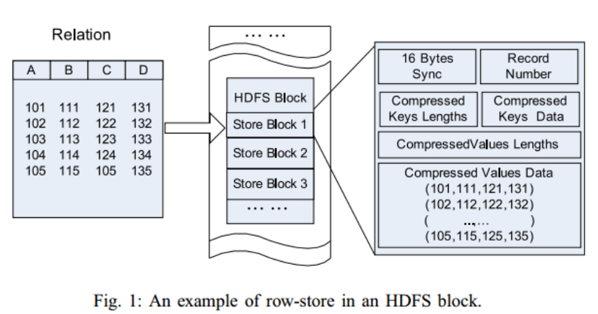
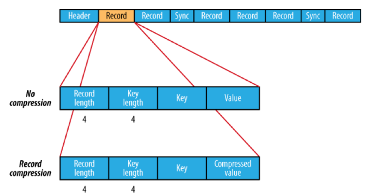
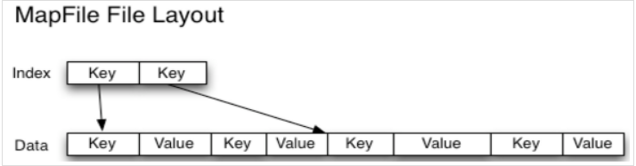
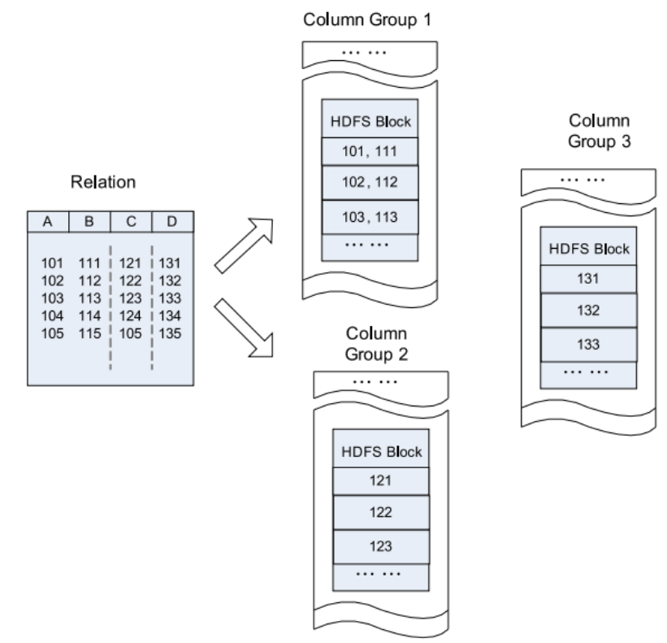
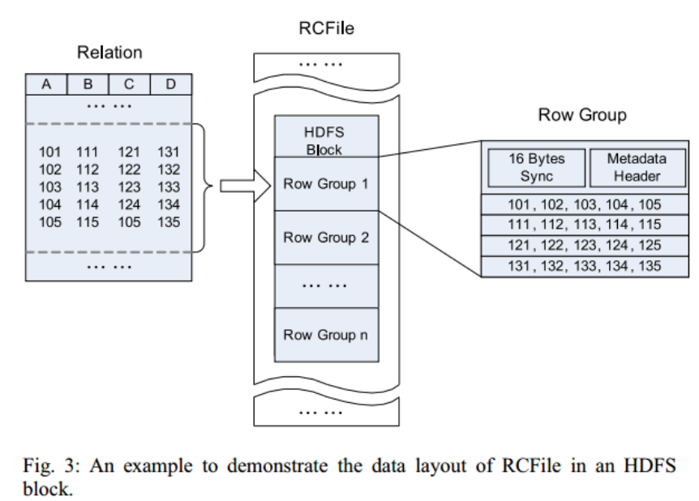
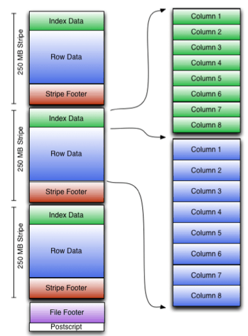

<!-- TOC -->

- [1、行存储](#1行存储)
    - [1、文本格式](#1文本格式)
    - [2、SequenceFile](#2sequencefile)
    - [3、MapFile](#3mapfile)
- [2、列存储](#2列存储)
    - [1、Parquet](#1parquet)
- [3、混合模式](#3混合模式)
    - [1、RCFile](#1rcfile)
    - [3、ORCfile](#3orcfile)
- [参考](#参考)

<!-- /TOC -->

hdfs文件存储格式分为两大类：行存储和列存储

- 行式存储: SequenceFile,MapFile,Avro Datafile
- 列式存储: Rcfile,Orcfile,Parquet

# 1、行存储

行存储,将一整行存储在一起,是一种连续的存储方式,例如SequenceFile,MapFile,缺点是如果只需要行中的某一列也必须把整行都读入内存当中

## 1、文本格式

文本格式的数据也是 Hadoop 中经常碰到的。如 TextFile 、XML 和 JSON。 文本格式除了会占用更多磁盘资源外，对它的解析开销一般会比二进制格式高几十倍以上，尤其是 XML 和 JSON，它们的解析开销比 Textfile 还要大，因此强烈不建议在生产系统中使用这些格式进行储存。 如果需要输出这些格式，请在客户端做相应的转换操作。 文本格式经常会用于日志收集，数据库导入，Hive 默认配置也是使用文本格式，而且常常容易忘了压缩，所以请确保使用了正确的格式。另外文本格式的一个缺点是它不具备类型和模式，比如销售金额、利润这类数值数据或者日期时间类型的数据，如果使用文本格式保存，由于它们本身的字符串类型的长短不一，或者含有负数，导致 MR 没有办法排序，所以往往需要将它们预处理成含有模式的二进制格式，这又导致了不必要的预处理步骤的开销和储存资源的浪费。

## 2、SequenceFile

SequenceFile 是 Hadoop API 提供的一种二进制文件，它将数据以 <key,value> 的形式序列化到文件中。这种二进制文件内部使用 Hadoop 的标准的 Writable 接口实现序列化和反序列化。它与 Hadoop API 中的 MapFile 是互相兼容的。Hive 中的 SequenceFile 继承自 Hadoop API 的 SequenceFile，不过它的 key 为空，使用 value 存放实际的值， 这样是为了避免 MR 在运行 map 阶段的排序过程。如果你用 Java API 编写 SequenceFile，并让 Hive 读取的话，请确保使用 value 字段存放数据，否则你需要自定义读取这种 SequenceFile 的 InputFormat class 和 OutputFormat class。

Hadoop适合处理大文件而不适合处理小文件,所以sequencefile是为小文件提供的一种容器,将小文件包装起来形成一个SequenceFile类, 它用一种<key,value>的形式序列化数据导入文件中。sequenceFile序列文件格式(.seq)。

在record中，又分为是否压缩格式。当没有被压缩时，key与value使用Serialization序列化写入SequenceFile。当选择压缩格式时，record的压缩格式与没有压缩其实不尽相同，除了value的bytes被压缩，key是不被压缩的。

## 3、MapFile

MapFile是排序后的SequenceFile,通过观察其目录结构可以看到MapFile由两部分组成，分别是data和index。

　　index作为文件的数据索引，主要记录了每个Record的key值，以及该Record在文件中的偏移位置。在MapFile被访问的时候,索引文件会被加载到内存，通过索引映射关系可迅速定位到指定Record所在文件位置，因此，相对SequenceFile而言，MapFile的检索效率是高效的，缺点是会消耗一部分内存来存储index数据。

　　需注意的是，MapFile并不会把所有Record都记录到index中去，默认情况下每隔128条记录存储一个索引映射。当然，记录间隔可人为修改，通过MapFIle.Writer的setIndexInterval()方法，或修改io.map.index.interval属性；

　　另外，与SequenceFile不同的是，MapFile的KeyClass一定要实现WritableComparable接口,即Key值是可比较的。

缺点：

- 1.文件不支持复写操作，不能向已存在的SequenceFile(MapFile)追加存储记录

- 2.当write流不关闭的时候，没有办法构造read流。也就是在执行文件写操作的时候，该文件是不可读取的

# 2、列存储

列存储会把文件切割成若干列,每一列存储在一起,是需要那一列读取那一列,不需要的不用读取,例如parquet ORCfile,RCfile,列存储不适合流式写入,写入失败当前文件无法恢复因此flume采用行存储,列存储由于每一列中的数据类型相同所以可以根据数据类型选择适合的编码和压缩格式

## 1、Parquet

parquet基于Google的dremel,擅长处理深度嵌套的数据(有点类似于嵌套多层的json格式),parquet会将嵌套结构整合为平面列存储。

# 3、混合模式

数据按行划分成Row Group，在Row Group内部，再将数据按列划分存储。

## 1、RCFile

RCFile全称Record Columnar File，列式记录文件，是一种类似于SequenceFile的键值对（Key/Value Pairs）数据文件。它的实现原理是首先将表分为几个行组，对每个行组内的数据进行按列存储，每一列的数据都是分开存储，正是先水平划分，再垂直划分的理念。rcfile文件格式(.rc)

当查询过程中，针对它并不关心的列时，它会在 IO 上跳过这些列。需要说明的是，RCFile 在 map 阶段从远端拷贝仍然是拷贝整个数据块，并且拷贝到本地目录后 RCFile 并不是真正直接跳过不需要的列，并跳到需要读取的列， 而是通过扫描每一个 row group 的头部定义来实现的，但是在整个 HDFS Block 级别的头部并没有定义每个列从哪个 row group 起始到哪个 row group 结束。所以在读取所有列的情况下，RCFile 的性能反而没有 SequenceFile 高。

如上图是HDFS内RCFile的存储结构，我们可以看到，首先对表进行行划分，分成多个行组。一个行组主要包括：16字节的HDFS同步块信息，主要是为了区分一个HDFS块上的相邻行组；元数据的头部信息主要包括该行组内的存储的行数、列的字段信息等等；因为当表很大，我们的字段很多的时候，我们往往只需要取出固定的一列就可以。

​ 在一般的行存储中 select a from table，虽然只是取出一个字段的值，但是还是会遍历整个表，所以效果和select * from table 一样，在RCFile中，像前面说的情况，只会读取该行组的一行。

​ 在一般的列存储中，会将不同的列分开存储，这样在查询的时候会跳过某些列，但是有时候存在一个表的有些列不在同一个HDFS块上，所以在查询的时候，Hive重组列的过程会浪费很多IO开销。而RCFile由于相同的列都是在一个HDFS块上，所以相对列存储而言会节省很多资源。

## 3、ORCfile

ORCfile:是RCfile的升级版,将数据划分为默认大小为250MB的stripe(条带),每个stripe包含索引,数据和footer,ORCfile包换索引比RCfile更加高效。orcfile文件格式(.orc)

根据结构图，我们可以看到ORCFile在RCFile基础上引申出来Stripe和Footer等。每个ORC文件首先会被横向切分成多个Stripe，而每个Stripe内部以列存储，所有的列存储在一个文件中，而且每个stripe默认的大小是250MB，相对于RCFile默认的行组大小是4MB，所以比RCFile更高效

# 参考

- https://hadoop.apache.org/docs/stable/hadoop-project-dist/hadoop-hdfs/HdfsDesign.html

- https://blog.csdn.net/qq_15014327/article/details/83095411

- https://www.infoq.cn/article/hadoop-file-format

