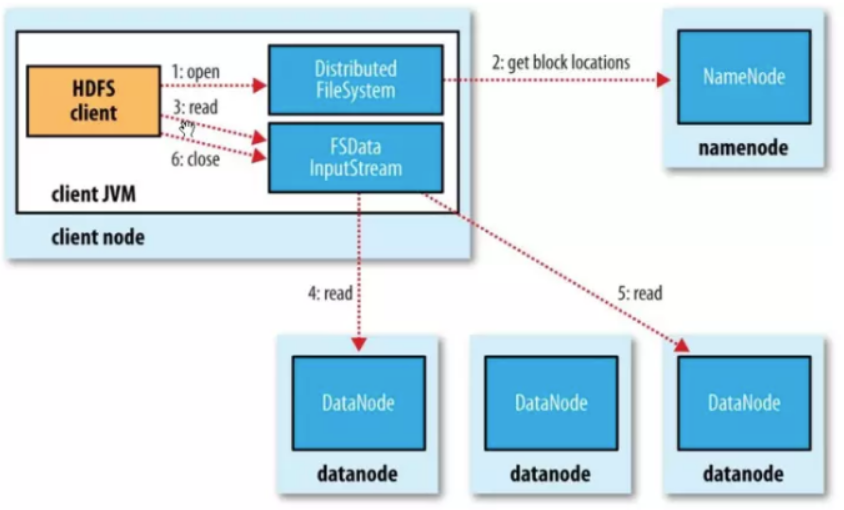
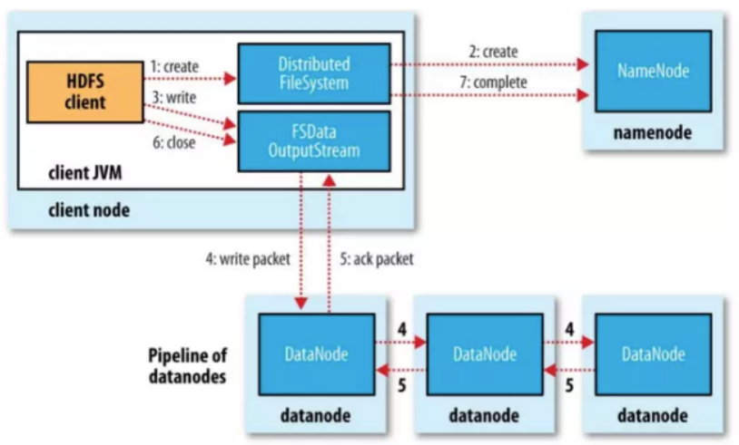
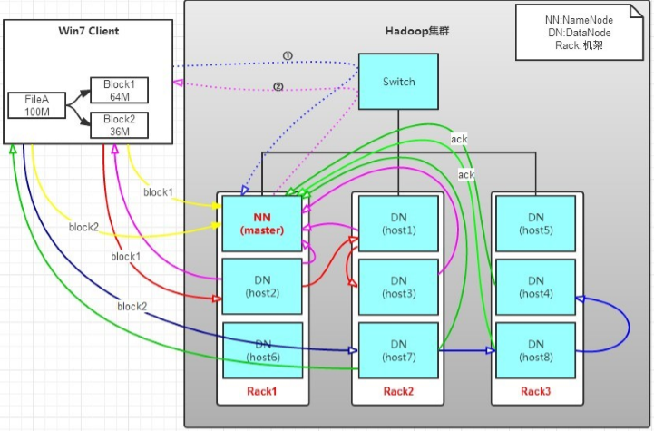
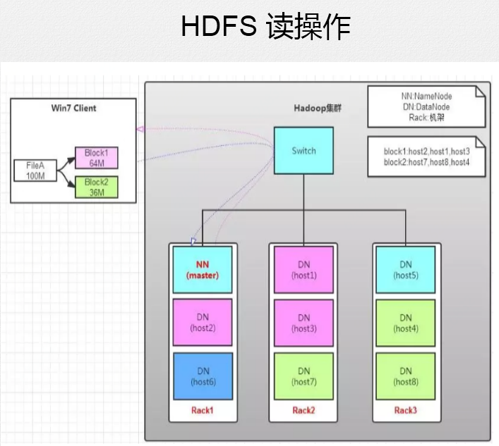
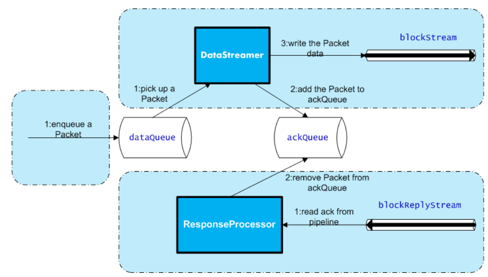
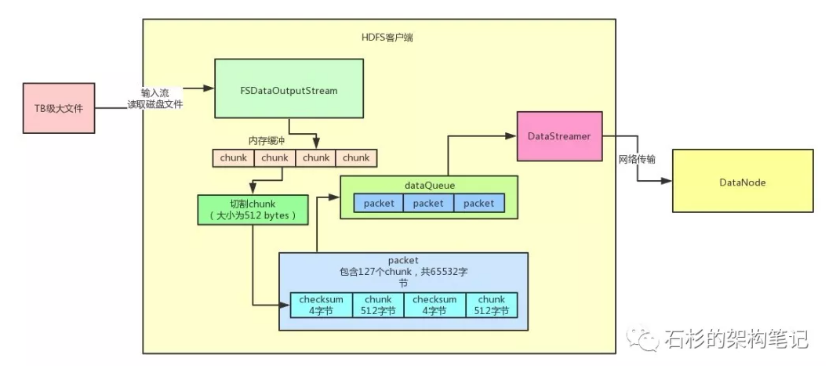
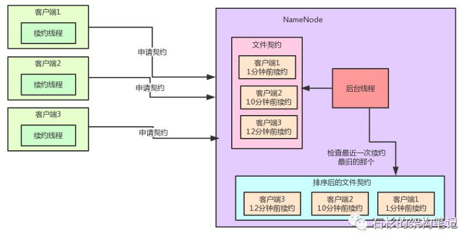

<!-- TOC -->

- [1、文件读](#1文件读)
- [2、文件写](#2文件写)
    - [1、DFSOutputStream内部原理](#1dfsoutputstream内部原理)
        - [1、创建Packet](#1创建packet)
        - [2、发送Packet](#2发送packet)
        - [3、接收ack](#3接收ack)
    - [2、文件契约机制](#2文件契约机制)
- [3、HDFS的使用场景和缺点](#3hdfs的使用场景和缺点)

<!-- /TOC -->

HDFS全称是Hadoop Distributed File System，是Hadoop的分布式文件系统。

# 1、文件读

`从namenode节点获取：文件->包含哪些数据块->数据块存在那些节点`

客户端打开文件，通过rpc的方式向NameNode获取`文件快的存储位置信息`，NameNode会将文件中的各个块的所有副本DataNode全部返回，这些DataNode会按照与客户端的位置的距离排序。如果客户端就是在DataNode上，客户端可以直接从本地读取文件，跳过网络IO，性能更高。客户端调研read方法，存储了文件的前几个块的地址的DFSInputStream，就会连接存储了第一个块的最近的DataNode。然后通过DFSInputStream就通过重复调用read方法，数据就从DataNode流动到可后端，当改DataNode的最后一个快读取完成了，DFSInputSteam会关闭与DataNode的连接，然后寻找下一个快的最佳节点。这个过程读客户端来说透明的，在客户端那边来看们就像是只读取了一个连续不断的流。

块是按顺序读的，通过 DFSInputStream 在 datanode 上打开新的连接去作为客户端读取的流。他也将会呼叫 namenode 来取得下一批所需要的块所在的 datanode 的位置(注意刚才说的只是从 namenode 获取前几个块的)。当客户端完成了读取，就在 FSDataInputStream 上调用 close() 方法结束整个流程。

在这个设计中一个重要的方面就是客户端直接从 DataNode 上检索数据，并通过 NameNode 指导来得到每一个块的最佳 DataNode。这种设计允许 HDFS 扩展大量的并发客户端，因为数据传输只是集群上的所有 DataNode 展开的。期间，NameNode 仅仅只需要服务于获取块位置的请求（`块位置信息是存放在内存中，所以效率很高`）。如果不这样设计，随着客户端数据量的增长，数据服务就会很快成为一个瓶颈。

# 2、文件写

备注：同一个文件同时只能有一个客户端进行写，但是允许多个客户端对不同的文件进行写。

- 1、通过Client向远程的NameNode发送RPC请求；

- 2、接收到请求后NameNode会首先判断对应的文件是否存在以及用户是否有对应的权限，成功则会为文件创建一个记录，否则会让客户端抛出异常；

- 3、当客户端开始写入文件的时候，开发库会将文件切分成多个packets，并在内部以"data queue"的形式管理这些packets，并向Namenode申请新的blocks，获取用来存储replicas的合适的datanodes列表，列表的大小根据在Namenode中对replication的设置而定。

- 4、开始以pipeline（管道）的形式将packet写入所有的replicas中。开发库把packet以流的方式写入第一个 datanode，该datanode把该`packet`存储之后，再将其传递给在此pipeline中的下一个datanode，直到最后一个 datanode， 这种写数据的方式呈流水线的形式。

- 5、最后一个datanode成功存储之后会返回一个ack packet，在pipeline里传递至客户端，在客户端的开发库内部维护着 "ack queue"，成功收到datanode返回的ack packet后会从"ack queue"移除相应的packet。

- 6、如果传输过程中，有某个datanode出现了故障，那么当前的pipeline会被关闭，出现故障的datanode会从当前的 pipeline中移除，剩余的block会继续剩下的datanode中继续以pipeline的形式传输，同时Namenode会分配一个新的 datanode，保持replicas设定的数量。

> 一种详细描述

- 1>将64M的block1按64k的package划分;

- 2>然后将第一个package发送给host2;

- 3>host2接收完后，将第一个package发送给host1，同时client向host2发送第二个package；

- 4>host1接收完第一个package后，发送给host3，同时接收host2发来的第二个package。

- 5>以此类推，如图红线实线所示，直到将block1发送完毕。

- 6>host2,host1,host3向NameNode，host2向Client发送通知，说“消息发送完了”。如图粉红颜色实线所示。

- 7>client收到host2发来的消息后，向namenode发送消息，说我写完了。这样就真完成了。如图黄色粗实线

- 8>发送完block1后，再向host7，host8，host4发送block2，如图蓝色实线所示。

- 9>发送完block2后，host7,host8,host4向NameNode，host7向Client发送通知，如图浅绿色实线所示。

- 10>client向NameNode发送消息，说我写完了，如图黄色粗实线，这样就完毕了。

备注：新的默认数据块大小为128M，分两次进行上传。

## 1、DFSOutputStream内部原理

`核心：基于内存里的chunk缓冲机制、packet数据包机制、内存队列异步发送机制。绝对不会有任何网络传输的卡顿，导致大文件的上传速度变慢。`

针对数据的上传如果使用jdk默认的流拷贝（FileInputStream->OutputStream,中间找一个小的内存byte[]数组，进行流对拷就行了，从本地文件读一点数据，就给DataNode发一点数据）,效率是低下的。

因为网络通信讲究的是适当频率，每次batch批量发送，你得读一大批数据，通过网络通信发一批数据。不能说读一点点数据，就立马来一次网络通信，就发出去这一点点的数据。如果按照上面这种原始的方式，绝对会导致网络通信效率极其低下，大文件上传性能很差。

为什么这么说呢？相当于你可能刚读出来几百个字节的数据，立马就写网络，卡顿个比如几百毫秒。然后再读下一批几百个字节的数据，再写网络卡顿个几百毫秒，这个性能很差，在工业级的大规模分布式系统中，是无法容忍的。

`HDFS对大文件上传的性能优化：DFSOutputStream。首先你需要自己创建一个针对本地磁盘文件的输入流。然后读到数据之后立马写入HDFS提供的FSDataOutputStream输出流。`

打开一个DFSOutputStream流，Client会写数据到流内部的一个缓冲区中，然后数据被分解成多个Packet，`每个Packet大小为64k字节`，每个Packet又由一组chunk和这组chunk对应的checksum数据组成，默认chunk大小为512字节，每个checksum是对512字节数据计算的校验和数据。

当Client写入的字节流数据达到一个Packet的长度，这个Packet会被构建出来，然后会被放到队列dataQueue中，接着DataStreamer线程会不断地从dataQueue队列中取出Packet，发送到复制Pipeline中的第一个DataNode上，并将该Packet从dataQueue队列中移到ackQueue队列中。ResponseProcessor线程接收从Datanode发送过来的ack，如果是一个成功的ack，表示复制Pipeline中的所有Datanode都已经接收到这个Packet，ResponseProcessor线程将packet从队列ackQueue中删除。

在发送过程中，如果发生错误，所有未完成的Packet都会从ackQueue队列中移除掉，然后重新创建一个新的Pipeline，排除掉出错的那些DataNode节点，接着DataStreamer线程继续从dataQueue队列中发送Packet。

下面是DFSOutputStream的结构及其原理，如图所示：

从下面3个方面来描述内部流程：

`block：默认128MB。块太小会增加寻址时间，块太大会减少Map的任务（通常一个Map只处理一个块的数据）`

### 1、创建Packet

Client写数据时，会将字节流数据缓存到`内部的缓冲区`中，当长度满足一个Chunk大小（512B）时，便会创建一个Packet（`包含127个chunk`）对象，然后向该Packet对象中写Chunk Checksum校验和数据，以及实际数据块Chunk Data，校验和数据是基于实际数据块计算得到的。每次满足一个Chunk大小时，都会向Packet中写上述数据内容，直到达到一个`Packet对象大小（64K）`，就会将该Packet对象放入到dataQueue队列中，等待DataStreamer线程取出并发送到DataNode节点。

### 2、发送Packet

DataStreamer线程从dataQueue队列中取出Packet对象，放到ackQueue队列中，然后向DataNode节点发送这个Packet对象所对应的数据。

### 3、接收ack

发送一个Packet数据包以后，会有一个用来接收ack的ResponseProcessor线程，如果收到成功的ack，则表示一个Packet发送成功。如果成功，则ResponseProcessor线程会将ackQueue队列中对应的Packet删除。

## 2、文件契约机制

`思考：这种契约机制类似于分布式锁（带续约机制的）？`

假如多个客户端同时要并发的写Hadoop HDFS上的一个文件，这样可以吗？

HDFS上的文件是不允许并发写的，比如并发的追加一些数据什么的。HDFS里有一个机制，叫做`文件契约机制`。也就是说，同一时间只能有一个客户端获取NameNode上面一个文件的契约，然后才可以写入数据。此时如果其他客户端尝试获取文件契约的时候，就获取不到，只能干等着。通过这个机制，就可以保证同一时间只有一个客户端在写一个文件。

在获取到了文件契约之后，在写文件的过程期间，那个客户端需要开启一个线程，不停的发送请求给NameNode进行文件续约，告诉NameNode，我还在写文件啊，你给我一直保留那个契约好吗？而NameNode内部有一个专门的后台线程，负责监控各个契约的续约时间。如果某个契约很长时间没续约了，此时就自动过期掉这个契约，让别的客户端来写。

> namenode节点如何高效的处理契约过期问题

假如我们有一个大规模部署的Hadoop集群，同时存在的客户端可能多达成千上万个。

此时NameNode内部维护的那个文件契约列表会非常非常的大，而监控契约的后台线程又需要频繁的每隔一段时间就检查一下所有的契约是否过期。比如，每隔几秒钟就遍历大量的契约，那么势必造成性能不佳，所以说这种契约监控机制明显是不适合大规模部署的hadoop集群的。

那么Hadoop是如何对文件契约监控算法进行优化的呢？

其实奥秘十分的简单，每次一个客户端发送续约请求之后，就设置这个契约的最近一次续约时间。然后，基于一个TreeSet数据结构来根据最近一次续约时间对契约进行排序，每次都把续约时间最老的契约排在最前头，这个排序后的契约数据结构十分的重要。

TreeSet是一种可排序的数据结构，他底层基于TreeMap来实现。TreeMap底层则基于红黑树来实现，可以保证元素没有重复，同时还能按照我们自己定义的排序规则在你每次插入一个元素的时候来进行自定义的排序。所以这里我们的排序规则：就是按照契约的最近一次续约时间来排序。

其实这个优化就是如此的简单，就是维护这么一个排序数据结构而已。

每次检查契约是否过期的时候，你不要遍历成千上万的契约，那样遍历效率当然会很低下。我们完全可以就从TreeSet中获取续约时间最老的那个契约，假如说连最近一次续约时间最老的那个契约都还没过期，那么就不用继续检查了啊！这说明续约时间更近的那些契约绝对不会过期！

举个例子：续约时间最老的那个契约，最近一次续约的时间是10分钟以前，但是我们判断契约过期的限制是超过15分钟不续约就过期那个契约。这个时候，连10分钟以前续约的契约都没有过期，那么那些8分钟以前，5分钟以前续约的契约，肯定也不会过期啊！

这个机制的优化对性能的提升是相当有帮助的，因为正常来说，过期的契约肯定还是占少数，所以压根儿不用每次都遍历所有的契约来检查是否过期。我们只需要检查续约时间最旧的那几个契约就可以了，如果一个契约过期了，那么就删掉那个契约，然后再检查第二旧的契约好了。以此类推。

通过这个TreeSet排序 + 优先检查最旧契约的机制，有效的将大规模集群下的契约监控机制的性能提升至少10倍以上，这种思想是非常值得我们学习和借鉴的。

在Spring Cloud微服务架构中，Eureka作为注册中心其实也有续约检查的机制，跟Hadoop是类似的。但是在Eureka中就没有实现类似的续约优化机制，而是暴力的每一轮都遍历所有的服务实例的续约时间。如果你面对的是一个大规模部署的微服务系统呢，情况就不妙了！部署了几十万台机器的大规模系统，有几十万个服务实例的续约信息驻留在Eureka的内存中，难道每隔几秒钟都要遍历几十万个服务实例的续约信息吗？

# 3、HDFS的使用场景和缺点

1、使用场景
- hdfs的设计一次写入，多次读取，支持修改。
- 大文件，在hdfs中一个块通常是64M、128M、256M，小文件会占用更多的元数据存储，增加文件数据块的寻址时间。
- 延时高，批处理。
- 高容错，多副本。

2、缺点
- 延迟比较高，不适合低延迟高吞吐率的场景
- 不适合小文件，小文件会占用NameNode的大量元数据存储内存，并且增加寻址时间
- 支持并发写入，一个文件只能有一个写入者
- 不支持随机修改，仅支持append

