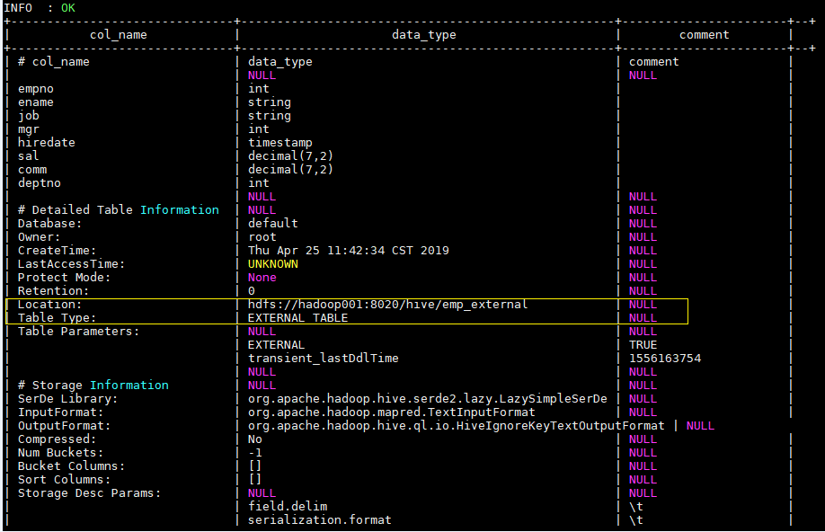

<!-- TOC -->

- [Hive常用DDL操作](#hive常用ddl操作)
    - [1、Database](#1database)
        - [1.1 查看数据列表](#11-查看数据列表)
        - [1.2 使用数据库](#12-使用数据库)
        - [1.3 新建数据库](#13-新建数据库)
        - [1.4 查看数据库信息](#14-查看数据库信息)
        - [1.5 删除数据库](#15-删除数据库)
    - [2、创建表](#2创建表)
        - [2.1 建表语法](#21-建表语法)
        - [2.2 内部表](#22-内部表)
        - [2.3 外部表](#23-外部表)
        - [2.4 分区表](#24-分区表)
        - [2.5 分桶表](#25-分桶表)
        - [2.6 倾斜表](#26-倾斜表)
        - [2.7 临时表](#27-临时表)
        - [2.8 CTAS创建表](#28-ctas创建表)
        - [2.9 复制表结构](#29-复制表结构)
        - [2.10 加载数据到表](#210-加载数据到表)
        - [2.11、建表语句指定格式](#211建表语句指定格式)
    - [3、修改表](#3修改表)
        - [3.1 重命名表RENAME](#31-重命名表rename)
        - [3.2 修改列CHANGE](#32-修改列change)
        - [3.3 新增列ADD](#33-新增列add)
    - [4、清空表/删除表](#4清空表删除表)
        - [4.1 清空表TRUNCATE](#41-清空表truncate)
        - [4.2 删除表DROP](#42-删除表drop)
    - [5、其他命令](#5其他命令)
        - [5.1 Describe](#51-describe)
        - [5.2 Show](#52-show)
    - [参考资料](#参考资料)

<!-- /TOC -->

# Hive常用DDL操作


## 1、Database

### 1.1 查看数据列表

```sql
show databases;
```

### 1.2 使用数据库

```sql
USE database_name;
```

### 1.3 新建数据库

语法：

```sql
CREATE (DATABASE|SCHEMA) [IF NOT EXISTS] database_name   --DATABASE|SCHEMA 是等价的
  [COMMENT database_comment] --数据库注释
  [LOCATION hdfs_path] --存储在 HDFS 上的位置
  [WITH DBPROPERTIES (property_name=property_value, ...)]; --指定额外属性
```

示例：

```sql
CREATE DATABASE IF NOT EXISTS hive_test
  COMMENT 'hive database for test'
  WITH DBPROPERTIES ('create'='heibaiying');
```

### 1.4 查看数据库信息

语法：

```sql
DESC DATABASE [EXTENDED] db_name; --EXTENDED 表示是否显示额外属性
```

示例：

```sql
DESC DATABASE  EXTENDED hive_test;
```


### 1.5 删除数据库

语法：

```sql
DROP (DATABASE|SCHEMA) [IF EXISTS] database_name [RESTRICT|CASCADE];
```

+ 默认行为是 RESTRICT，如果数据库中存在表则删除失败。要想删除库及其中的表，可以使用 CASCADE 级联删除。

示例：

```sql
DROP DATABASE IF EXISTS hive_test CASCADE;
```


## 2、创建表


内部表数据由Hive自身管理，外部表数据由HDFS管理；

内部表数据存储的位置是hive.metastore.warehouse.dir（默认：/user/hive/warehouse），外部表数据的存储位置由自己制定（如果没有LOCATION，Hive将在HDFS上的/user/hive/warehouse文件夹下以外部表的表名创建一个文件夹，并将属于这个表的数据存放在这里）；

- 删除内部表会直接删除元数据（metadata）及存储数据；

- 删除外部表仅仅会删除元数据，HDFS上的文件并不会被删除；

- 对内部表的修改会将修改直接同步给元数据，而对外部表的表结构和分区进行修改，则需要修复 MSCK REPAIR TABLE table_name;


内部表又叫做管理表 (Managed/Internal Table)，创建表时不做任何指定，默认创建的就是内部表。想要创建外部表 (External Table)，则需要使用 External 进行修饰。 内部表和外部表主要区别如下：

|              | 内部表                                                       | 外部表                                                       |
| ------------ | ------------------------------------------------------------ | ------------------------------------------------------------ |
| 数据存储位置 | 内部表数据存储的位置由 hive.metastore.warehouse.dir 参数指定，默认情况下表的数据存储在 HDFS 的 `/user/hive/warehouse/数据库名.db/表名/`  目录下 | 外部表数据的存储位置创建表时由 `Location` 参数指定；           |
| 导入数据     | 在导入数据到内部表，内部表将数据移动到自己的数据仓库目录下，数据的生命周期由 Hive 来进行管理 | 外部表不会将数据移动到自己的数据仓库目录下，只是在元数据中存储了数据的位置 |
| 删除表       | 删除元数据（metadata）和文件                                 | 只删除元数据（metadata）                                     |


### 2.1 建表语法

```sql
CREATE [TEMPORARY] [EXTERNAL] TABLE [IF NOT EXISTS] [db_name.]table_name     --表名
  [(col_name data_type [COMMENT col_comment],
    ... [constraint_specification])]  --列名 列数据类型
  [COMMENT table_comment]   --表描述
  [PARTITIONED BY (col_name data_type [COMMENT col_comment], ...)]  --分区表分区规则
  [
    CLUSTERED BY (col_name, col_name, ...) 
   [SORTED BY (col_name [ASC|DESC], ...)] INTO num_buckets BUCKETS
  ]  --分桶表分桶规则
  [SKEWED BY (col_name, col_name, ...) ON ((col_value, col_value, ...), (col_value, col_value, ...), ...)  
   [STORED AS DIRECTORIES] 
  ]  --指定倾斜列和值
  [
   [ROW FORMAT row_format]    
   [STORED AS file_format]
     | STORED BY 'storage.handler.class.name' [WITH SERDEPROPERTIES (...)]  
  ]  -- 指定行分隔符、存储文件格式或采用自定义存储格式
  [LOCATION hdfs_path]  -- 指定表的存储位置
  [TBLPROPERTIES (property_name=property_value, ...)]  --指定表的属性
  [AS select_statement];   --从查询结果创建表
```

### 2.2 内部表

```sql
  CREATE TABLE emp(
    empno INT,
    ename STRING,
    job STRING,
    mgr INT,
    hiredate TIMESTAMP,
    sal DECIMAL(7,2),
    comm DECIMAL(7,2),
    deptno INT)
    ROW FORMAT DELIMITED FIELDS TERMINATED BY "\t";
```

### 2.3 外部表

```sql
  CREATE EXTERNAL TABLE emp_external(
    empno INT,
    ename STRING,
    job STRING,
    mgr INT,
    hiredate TIMESTAMP,
    sal DECIMAL(7,2),
    comm DECIMAL(7,2),
    deptno INT)
    ROW FORMAT DELIMITED FIELDS TERMINATED BY "\t"
    LOCATION '/hive/emp_external';
```

使用 `desc format  emp_external` 命令可以查看表的详细信息如下：



### 2.4 分区表

```sql
  CREATE EXTERNAL TABLE emp_partition(
    empno INT,
    ename STRING,
    job STRING,
    mgr INT,
    hiredate TIMESTAMP,
    sal DECIMAL(7,2),
    comm DECIMAL(7,2)
    )
    PARTITIONED BY (deptno INT)   -- 按照部门编号进行分区
    ROW FORMAT DELIMITED FIELDS TERMINATED BY "\t"
    LOCATION '/hive/emp_partition';
```

### 2.5 分桶表

```sql
  CREATE EXTERNAL TABLE emp_bucket(
    empno INT,
    ename STRING,
    job STRING,
    mgr INT,
    hiredate TIMESTAMP,
    sal DECIMAL(7,2),
    comm DECIMAL(7,2),
    deptno INT)
    CLUSTERED BY(empno) SORTED BY(empno ASC) INTO 4 BUCKETS  --按照员工编号散列到四个 bucket 中
    ROW FORMAT DELIMITED FIELDS TERMINATED BY "\t"
    LOCATION '/hive/emp_bucket';
```

### 2.6 倾斜表

通过指定一个或者多个列经常出现的值（严重偏斜），Hive 会自动将涉及到这些值的数据拆分为单独的文件。在查询时，如果涉及到倾斜值，它就直接从独立文件中获取数据，而不是扫描所有文件，这使得性能得到提升。

```sql
  CREATE EXTERNAL TABLE emp_skewed(
    empno INT,
    ename STRING,
    job STRING,
    mgr INT,
    hiredate TIMESTAMP,
    sal DECIMAL(7,2),
    comm DECIMAL(7,2)
    )
    SKEWED BY (empno) ON (66,88,100)  --指定 empno 的倾斜值 66,88,100
    ROW FORMAT DELIMITED FIELDS TERMINATED BY "\t"
    LOCATION '/hive/emp_skewed';   
```

### 2.7 临时表

临时表仅对当前 session 可见，临时表的数据将存储在用户的暂存目录中，并在会话结束后删除。如果临时表与永久表表名相同，则对该表名的任何引用都将解析为临时表，而不是永久表。临时表还具有以下两个限制：

+ 不支持分区列；
+ 不支持创建索引。

```sql
  CREATE TEMPORARY TABLE emp_temp(
    empno INT,
    ename STRING,
    job STRING,
    mgr INT,
    hiredate TIMESTAMP,
    sal DECIMAL(7,2),
    comm DECIMAL(7,2)
    )
    ROW FORMAT DELIMITED FIELDS TERMINATED BY "\t";
```

### 2.8 CTAS创建表

支持从查询语句的结果创建表：

```sql
CREATE TABLE emp_copy AS SELECT * FROM emp WHERE deptno='20';
```

### 2.9 复制表结构

语法：

```sql
CREATE [TEMPORARY] [EXTERNAL] TABLE [IF NOT EXISTS] [db_name.]table_name  --创建表表名
   LIKE existing_table_or_view_name  --被复制表的表名
   [LOCATION hdfs_path]; --存储位置
```

示例：

```sql
CREATE TEMPORARY EXTERNAL TABLE  IF NOT EXISTS  emp_co  LIKE emp
```


### 2.10 加载数据到表

加载数据到表中属于 DML 操作，这里为了方便大家测试，先简单介绍一下加载本地数据到表中：

```sql
-- 加载数据到 emp 表中
load data local inpath "/usr/file/emp.txt" into table emp;
```

其中 emp.txt 的内容如下，你可以直接复制使用：

```
7369	SMITH	CLERK	7902	1980-12-17 00:00:00	800.00		20
7499	ALLEN	SALESMAN	7698	1981-02-20 00:00:00	1600.00	300.00	30
7521	WARD	SALESMAN	7698	1981-02-22 00:00:00	1250.00	500.00	30
7566	JONES	MANAGER	7839	1981-04-02 00:00:00	2975.00		20
7654	MARTIN	SALESMAN	7698	1981-09-28 00:00:00	1250.00	1400.00	30
7698	BLAKE	MANAGER	7839	1981-05-01 00:00:00	2850.00		30
7782	CLARK	MANAGER	7839	1981-06-09 00:00:00	2450.00		10
7788	SCOTT	ANALYST	7566	1987-04-19 00:00:00	1500.00		20
7839	KING	PRESIDENT		1981-11-17 00:00:00	5000.00		10
7844	TURNER	SALESMAN	7698	1981-09-08 00:00:00	1500.00	0.00	30
7876	ADAMS	CLERK	7788	1987-05-23 00:00:00	1100.00		20
7900	JAMES	CLERK	7698	1981-12-03 00:00:00	950.00		30
7902	FORD	ANALYST	7566	1981-12-03 00:00:00	3000.00		20
7934	MILLER	CLERK	7782	1982-01-23 00:00:00	1300.00		10
```


### 2.11、建表语句指定格式

```sql
CREATE TABLE IF NOT EXISTS create table temp1 （
column1  string comment'字段1',
column2  double comment'字段2'
）
PARTITIONED BY (dt string)   -- 指定分区，一个或者多个
ROW FORMAT SERDE 'org.apache.hadoop.hive.ql.io.orc.OrcSerde'
 WITH SERDEPROPERTIES (
 'field.delim'='\t','escape.delim'='\n',
 'serialization.null.format'=''
 ) STORED AS orc            -- 这里指定了orc的行和列的存储格式
 LOCATION
  'hdfs://xxxx/temp1';       -- 指定存储位置


-- 指定存储格式
PARTITIONED BY (
  dt string)
ROW FORMAT DELIMITED
  FIELDS TERMINATED BY '\t'
STORED AS ORC
LOCATION
  'hdfs://xxxx/temp1'


STORED AS ORC
LOCATION
  'hdfs://xxxx/temp1'

ROW FORMAT DELIMITED 
FIELDS TERMINATED BY '\t' 
LINES TERMINATED BY '\n' 


-- 指定输入输出格式

PARTITIONED BY ( 
  dt string,dp string)
ROW FORMAT SERDE 
  'org.apache.hadoop.hive.ql.io.orc.OrcSerde' 
STORED AS INPUTFORMAT 
  'org.apache.hadoop.hive.ql.io.orc.OrcInputFormat' 
OUTPUTFORMAT 
  'org.apache.hadoop.hive.ql.io.orc.OrcOutputFormat'
LOCATION
  'hdfs://xxx/temp1';


-- 文本格式存储

PARTITIONED BY ( 
  `dp` string,
  `dt` string)
ROW FORMAT DELIMITED 
  FIELDS TERMINATED BY '\t' 
STORED AS INPUTFORMAT 
  'com.hadoop.mapred.DeprecatedLzoTextInputFormat' 
OUTPUTFORMAT 
  'org.apache.hadoop.hive.ql.io.HiveIgnoreKeyTextOutputFormat'
LOCATION
  'hdfs://xxx/temp1';


ROW FORMAT DELIMITED 
  FIELDS TERMINATED BY ',' 
STORED AS INPUTFORMAT 
  'org.apache.hadoop.mapred.TextInputFormat' 
OUTPUTFORMAT 
  'org.apache.hadoop.hive.ql.io.HiveIgnoreKeyTextOutputFormat'


partitioned by (dt string,dp string)
ROW FORMAT SERDE 'org.apache.hadoop.hive.serde2.lazy.LazySimpleSerDe'
  WITH SERDEPROPERTIES (
  'field.delim'='\t',
  'serialization.null.format'=''
  ) STORED AS INPUTFORMAT "com.hadoop.mapred.DeprecatedLzoTextInputFormat"
OUTPUTFORMAT "org.apache.hadoop.hive.ql.io.HiveIgnoreKeyTextOutputFormat";

```


## 3、修改表

### 3.1 重命名表RENAME

语法：

```sql
ALTER TABLE table_name RENAME TO new_table_name;
```

示例：

```sql
ALTER TABLE emp_temp RENAME TO new_emp; --把 emp_temp 表重命名为 new_emp
```


### 3.2 修改列CHANGE

语法：

```sql
ALTER TABLE table_name [PARTITION partition_spec] CHANGE [COLUMN] col_old_name col_new_name column_type
  [COMMENT col_comment] [FIRST|AFTER column_name] [CASCADE|RESTRICT];
```

示例：

```sql
-- 修改字段名和类型
ALTER TABLE emp_temp CHANGE empno empno_new INT;
 
-- 修改字段 sal 的名称 并将其放置到 empno 字段后
ALTER TABLE emp_temp CHANGE sal sal_new decimal(7,2)  AFTER ename;

-- 为字段增加注释
ALTER TABLE emp_temp CHANGE mgr mgr_new INT COMMENT 'this is column mgr';
```


### 3.3 新增列ADD

示例：

```sql
ALTER TABLE emp_temp ADD COLUMNS (address STRING COMMENT 'home address');
```


## 4、清空表/删除表

### 4.1 清空表TRUNCATE

语法：

```sql
-- 清空整个表或表指定分区中的数据
TRUNCATE TABLE table_name [PARTITION (partition_column = partition_col_value,  ...)];
```

+ 目前只有内部表才能执行 TRUNCATE 操作，外部表执行时会抛出异常 `Cannot truncate non-managed table XXXX`。

示例：

```sql
TRUNCATE TABLE emp_mgt_ptn PARTITION (deptno=20);
```


### 4.2 删除表DROP

语法：

```sql
DROP TABLE [IF EXISTS] table_name [PURGE]; 
```

+ 内部表：不仅会删除表的元数据，同时会删除 HDFS 上的数据；
+ 外部表：只会删除表的元数据，不会删除 HDFS 上的数据；
+ 删除视图引用的表时，不会给出警告（但视图已经无效了，必须由用户删除或重新创建）。


## 5、其他命令

### 5.1 Describe

查看数据库：

```sql
DESCRIBE|Desc DATABASE [EXTENDED] db_name;  --EXTENDED 是否显示额外属性
```

查看表：

```sql
DESCRIBE|Desc [EXTENDED|FORMATTED] table_name --FORMATTED 以友好的展现方式查看表详情
```


### 5.2 Show

**1. 查看数据库列表**

```sql
-- 语法
SHOW (DATABASES|SCHEMAS) [LIKE 'identifier_with_wildcards'];

-- 示例：
SHOW DATABASES like 'hive*';
```

LIKE 子句允许使用正则表达式进行过滤，但是 SHOW 语句当中的 LIKE 子句只支持 `*`（通配符）和 `|`（条件或）两个符号。例如 `employees`，`emp *`，`emp * | * ees`，所有这些都将匹配名为 `employees` 的数据库。

**2. 查看表的列表**

```sql
-- 语法
SHOW TABLES [IN database_name] ['identifier_with_wildcards'];

-- 示例
SHOW TABLES IN default;
```

**3. 查看视图列表**

```sql
SHOW VIEWS [IN/FROM database_name] [LIKE 'pattern_with_wildcards'];   --仅支持 Hive 2.2.0 +
```

**4. 查看表的分区列表**

```sql
SHOW PARTITIONS table_name;
```

**5. 查看表/视图的创建语句**

```sql
SHOW CREATE TABLE ([db_name.]table_name|view_name);
```


## 参考资料

[LanguageManual DDL](https://cwiki.apache.org/confluence/display/Hive/LanguageManual+DDL)
