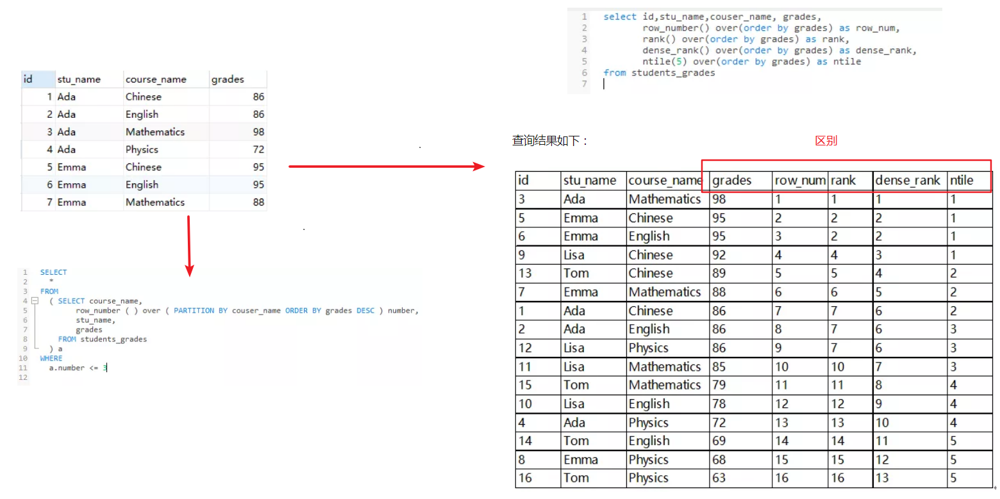
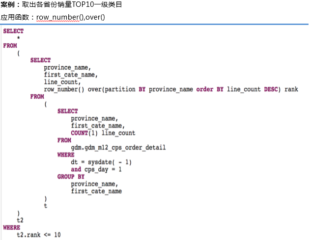

<!-- TOC -->

- [1、什么是开窗函数](#1什么是开窗函数)
- [2、几个排序函数row_number()、rank()、dense_rank()、ntile()的区别](#2几个排序函数row_numberrankdense_rankntile的区别)
- [9、场景的使用场景](#9场景的使用场景)
    - [1、聚合开窗函数](#1聚合开窗函数)
        - [1、count开窗函数](#1count开窗函数)
        - [2、sum开窗函数](#2sum开窗函数)
        - [3、min开窗函数](#3min开窗函数)
        - [4、max开窗函数](#4max开窗函数)
        - [5、avg开窗函数](#5avg开窗函数)
        - [6、first_value开窗函数](#6first_value开窗函数)
        - [7、last_value开窗函数](#7last_value开窗函数)
        - [8、lag开窗函数](#8lag开窗函数)
        - [9、lead开窗函数](#9lead开窗函数)
        - [10、cume_dist开窗函数](#10cume_dist开窗函数)
    - [2、排序开窗函数](#2排序开窗函数)
        - [1、rank开窗函数](#1rank开窗函数)
        - [2、dense_rank开窗函数](#2dense_rank开窗函数)
        - [3、ntile开窗函数](#3ntile开窗函数)
        - [4、row_number开窗函数](#4row_number开窗函数)
- [参考](#参考)

<!-- /TOC -->


# 1、什么是开窗函数

开窗函数/分析函数：over()。开窗函数也叫分析函数，有两类：`一类是聚合开窗函数，一类是排序开窗函数`。

开窗函数的调用格式为：


`函数名(列名) OVER(partition by 列名 order by列名) `


如果你没听说过开窗函数，看到上面开窗函数的调用方法，你可能还会有些疑惑。但只要你了解聚合函数，那么理解开窗函数就非常容易了。

我们知道聚合函数对一组值执行计算并返回单一的值，如sum()，count()，max()，min()， avg()等，这些函数常与group by子句连用。除了 COUNT 以外，聚合函数忽略空值。

但有时候一组数据只返回一组值是不能满足需求的，如我们经常想知道各个地区的前几名、各个班或各个学科的前几名。这时候需要`每一组返回多个值`。用开窗函数解决这类问题非常方便。

开窗函数和聚合函数的区别如下：

- （1）SQL 标准允许将所有聚合函数用作开窗函数，用OVER 关键字区分开窗函数和聚合函数。

- （2）聚合函数每组只返回一个值，开窗函数每组可返回多个值。

`注：常见主流数据库目前都支持开窗函数，但mysql数据库目前还不支持。`


常用开窗函数：

- 1.为每条数据显示聚合信息.(聚合函数() over())
- 2.为每条数据提供分组的聚合函数结果(聚合函数() over(partition by 字段) as 别名) --按照字段分组，分组后进行计算
- 3.与排名函数一起使用(row number() over(order by 字段) as 别名)

常用分析函数：（最常用的应该是1.2.3 的排序）

```
1、row_number() over(partition by ... order by ...)
2、rank() over(partition by ... order by ...)
3、dense_rank() over(partition by ... order by ...)
4、count() over(partition by ... order by ...)
5、max() over(partition by ... order by ...)
6、min() over(partition by ... order by ...)
7、sum() over(partition by ... order by ...)
8、avg() over(partition by ... order by ...)
9、first_value() over(partition by ... order by ...)
10、last_value() over(partition by ... order by ...)
11、lag() over(partition by ... order by ...)
12、lead() over(partition by ... order by ...)
lag 和lead 可以 获取结果集中，按一定排序所排列的当前行的上下相邻若干offset 的某个行的某个列(不用结果集的自关联）；
lag ，lead 分别是向前，向后；
lag 和lead 有三个参数，第一个参数是列名，第二个参数是偏移的offset，第三个参数是 超出记录窗口时的默认值）
```


# 2、几个排序函数row_number()、rank()、dense_rank()、ntile()的区别

（1） row_number() over()：对相等的值不进行区分，相等的值对应的排名相同，序号从1到n连续。

（2） rank() over()：相等的值排名相同，但若有相等的值，则序号从1到n不连续。如果有两个人都排在第3名，则没有第4名。

（3） dense_rank() over()：对相等的值排名相同，但序号从1到n连续。如果有两个人都排在第一名，则排在第2名（假设仅有1个第二名）的人是第3个人。

（4） ntile( n ) over()：可以看作是把有序的数据集合平均分配到指定的数量n的桶中,将桶号分配给每一行，排序对应的数字为桶号。如果不能平均分配，则较小桶号的桶分配额外的行，并且各个桶中能放的数据条数最多相差1。





> 例子：分区排序：row_number () over()

有如下学生成绩表：students_grades。查询每门课程course_name前三名的学生姓名及成绩，要求输出列格式如下：

course_name, number, stu_name, grades

SQL格式见上图左侧。




# 9、场景的使用场景

```sql
-- 建表
create table student_scores(
id int,
studentId int,
language int,
math int,
english int,
classId string,
departmentId string
);
-- 写入数据
insert into table student_scores values 
  (1,111,68,69,90,'class1','department1'),
  (2,112,73,80,96,'class1','department1'),
  (3,113,90,74,75,'class1','department1'),
  (4,114,89,94,93,'class1','department1'),
  (5,115,99,93,89,'class1','department1'),
  (6,121,96,74,79,'class2','department1'),
  (7,122,89,86,85,'class2','department1'),
  (8,123,70,78,61,'class2','department1'),
  (9,124,76,70,76,'class2','department1'),
  (10,211,89,93,60,'class1','department2'),
  (11,212,76,83,75,'class1','department2'),
  (12,213,71,94,90,'class1','department2'),
  (13,214,94,94,66,'class1','department2'),
  (14,215,84,82,73,'class1','department2'),
  (15,216,85,74,93,'class1','department2'),
  (16,221,77,99,61,'class2','department2'),
  (17,222,80,78,96,'class2','department2'),
  (18,223,79,74,96,'class2','department2'),
  (19,224,75,80,78,'class2','department2'),
  (20,225,82,85,63,'class2','department2');
```

## 1、聚合开窗函数

### 1、count开窗函数

```sql
-- count 开窗函数

select studentId,math,departmentId,classId,
-- 以符合条件的所有行作为窗口
count(math) over() as count1,
 -- 以按classId分组的所有行作为窗口
count(math) over(partition by classId) as count2,
 -- 以按classId分组、按math排序的所有行作为窗口
count(math) over(partition by classId order by math) as count3,
 -- 以按classId分组、按math排序、按 当前行+往前1行+往后2行的行作为窗口
count(math) over(partition by classId order by math rows between 1 preceding and 2 following) as count4
from student_scores where departmentId='department1';

-- 结果
studentid   math    departmentid    classid count1  count2  count3  count4
111         69      department1     class1  9       5       1       3
113         74      department1     class1  9       5       2       4
112         80      department1     class1  9       5       3       4
115         93      department1     class1  9       5       4       3
114         94      department1     class1  9       5       5       2
124         70      department1     class2  9       4       1       3
121         74      department1     class2  9       4       2       4
123         78      department1     class2  9       4       3       3
122         86      department1     class2  9       4       4       2

-- 结果解释:
studentid=115,count1为所有的行数9,count2为分区class1中的行数5,count3为分区class1中math值<=93的行数4,
count4为分区class1中math值向前+1行向后+2行(实际只有1行，后面第二行算下一个分组的了)的总行数3。
```

`问题：count4的用途？`

### 2、sum开窗函数

```sql
-- sum开窗函数

select studentId,math,departmentId,classId,
-- 以符合条件的所有行作为窗口
sum(math) over() as sum1,
-- 以按classId分组的所有行作为窗口
sum(math) over(partition by classId) as sum2,
 -- 以按classId分组、按math排序后、按到当前行(含当前行)的所有行作为窗口
sum(math) over(partition by classId order by math) as sum3,
 -- 以按classId分组、按math排序后、按当前行+往前1行+往后2行的行作为窗口
sum(math) over(partition by classId order by math rows between 1 preceding and 2 following) as sum4
from student_scores where departmentId='department1';

-- 结果
studentid   math    departmentid    classid sum1    sum2    sum3    sum4
111         69      department1     class1  718     410     69      223
113         74      department1     class1  718     410     143     316
112         80      department1     class1  718     410     223     341
115         93      department1     class1  718     410     316     267
114         94      department1     class1  718     410     410     187
124         70      department1     class2  718     308     70      222
121         74      department1     class2  718     308     144     308
123         78      department1     class2  718     308     222     238
122         86      department1     class2  718     308     308     164

-- 结果解释:同count开窗函数
```

### 3、min开窗函数

```sql
-- min 开窗函数

select studentId,math,departmentId,classId,
-- 以符合条件的所有行作为窗口
min(math) over() as min1,
-- 以按classId分组的所有行作为窗口
min(math) over(partition by classId) as min2,
 -- 以按classId分组、按math排序后、按到当前行(含当前行)的所有行作为窗口
min(math) over(partition by classId order by math) as min3,
 -- 以按classId分组、按math排序后、按当前行+往前1行+往后2行的行作为窗口
min(math) over(partition by classId order by math rows between 1 preceding and 2 following) as min4
from student_scores where departmentId='department1';

-- 结果
studentid   math    departmentid    classid min1    min2    min3    min4
111         69      department1     class1  69      69      69      69
113         74      department1     class1  69      69      69      69
112         80      department1     class1  69      69      69      74
115         93      department1     class1  69      69      69      80
114         94      department1     class1  69      69      69      93
124         70      department1     class2  69      70      70      70
121         74      department1     class2  69      70      70      70
123         78      department1     class2  69      70      70      74
122         86      department1     class2  69      70      70      78

-- 结果解释:同count开窗函数
```

### 4、max开窗函数

```sql
-- max 开窗函数
select studentId,math,departmentId,classId,
-- 以符合条件的所有行作为窗口
max(math) over() as max1,
-- 以按classId分组的所有行作为窗口
max(math) over(partition by classId) as max2,
 -- 以按classId分组、按math排序后、按到当前行(含当前行)的所有行作为窗口
max(math) over(partition by classId order by math) as max3,
 -- 以按classId分组、按math排序后、按当前行+往前1行+往后2行的行作为窗口
max(math) over(partition by classId order by math rows between 1 preceding and 2 following) as max4
from student_scores where departmentId='department1';

-- 结果
studentid   math    departmentid    classid max1    max2    max3    max4
111         69      department1     class1  94      94      69      80
113         74      department1     class1  94      94      74      93
112         80      department1     class1  94      94      80      94
115         93      department1     class1  94      94      93      94
114         94      department1     class1  94      94      94      94
124         70      department1     class2  94      86      70      78
121         74      department1     class2  94      86      74      86
123         78      department1     class2  94      86      78      86
122         86      department1     class2  94      86      86      86

-- 结果解释:同count开窗函数
```

### 5、avg开窗函数

```sql
-- avg 开窗函数
select studentId,math,departmentId,classId,
-- 以符合条件的所有行作为窗口
avg(math) over() as avg1,
-- 以按classId分组的所有行作为窗口
avg(math) over(partition by classId) as avg2,
 -- 以按classId分组、按math排序后、按到当前行(含当前行)的所有行作为窗口
avg(math) over(partition by classId order by math) as avg3,
 -- 以按classId分组、按math排序后、按当前行+往前1行+往后2行的行作为窗口
avg(math) over(partition by classId order by math rows between 1 preceding and 2 following) as avg4
from student_scores where departmentId='department1';

结果
studentid   math    departmentid    classid avg1                avg2    avg3                avg4
111         69      department1     class1  79.77777777777777   82.0    69.0                74.33333333333333
113         74      department1     class1  79.77777777777777   82.0    71.5                79.0
112         80      department1     class1  79.77777777777777   82.0    74.33333333333333   85.25
115         93      department1     class1  79.77777777777777   82.0    79.0                89.0
114         94      department1     class1  79.77777777777777   82.0    82.0                93.5
124         70      department1     class2  79.77777777777777   77.0    70.0                74.0
121         74      department1     class2  79.77777777777777   77.0    72.0                77.0
123         78      department1     class2  79.77777777777777   77.0    74.0                79.33333333333333
122         86      department1     class2  79.77777777777777   77.0    77.0                82.0

结果解释:同count开窗函数
```

### 6、first_value开窗函数

返回分区中的第一个值。

```sql
-- first_value 开窗函数
select studentId,math,departmentId,classId,
-- 以符合条件的所有行作为窗口
first_value(math) over() as first_value1,
-- 以按classId分组的所有行作为窗口
first_value(math) over(partition by classId) as first_value2,
 -- 以按classId分组、按math排序后、按到当前行(含当前行)的所有行作为窗口
first_value(math) over(partition by classId order by math) as first_value3,
 -- 以按classId分组、按math排序后、按当前行+往前1行+往后2行的行作为窗口
first_value(math) over(partition by classId order by math rows between 1 preceding and 2 following) as first_value4
from student_scores where departmentId='department1';

结果
studentid   math    departmentid    classid first_value1    first_value2    first_value3    first_value4
111         69      department1     class1  69              69              69              69
113         74      department1     class1  69              69              69              69
112         80      department1     class1  69              69              69              74
115         93      department1     class1  69              69              69              80
114         94      department1     class1  69              69              69              93
124         70      department1     class2  69              74              70              70
121         74      department1     class2  69              74              70              70
123         78      department1     class2  69              74              70              74
122         86      department1     class2  69              74              70              78

结果解释:studentid=124 first_value1:第一个值是69,first_value2:classId=class1分区 math的第一个值是69。
```

### 7、last_value开窗函数

返回分区中的第一个值。

```sql
-- last_value 开窗函数

select studentId,math,departmentId,classId,
-- 以符合条件的所有行作为窗口
last_value(math) over() as last_value1,
-- 以按classId分组的所有行作为窗口
last_value(math) over(partition by classId) as last_value2,
 -- 以按classId分组、按math排序后、按到当前行(含当前行)的所有行作为窗口
last_value(math) over(partition by classId order by math) as last_value3,
 -- 以按classId分组、按math排序后、按当前行+往前1行+往后2行的行作为窗口
last_value(math) over(partition by classId order by math rows between 1 preceding and 2 following) as last_value4
from student_scores where departmentId='department1';

结果
studentid   math    departmentid    classid last_value1 last_value2 last_value3 last_value4
111         69      department1     class1  70          93          69          80
113         74      department1     class1  70          93          74          93
112         80      department1     class1  70          93          80          94
115         93      department1     class1  70          93          93          94
114         94      department1     class1  70          93          94          94
124         70      department1     class2  70          70          70          78
121         74      department1     class2  70          70          74          86
123         78      department1     class2  70          70          78          86
122         86      department1     class2  70          70          86          86
```

### 8、lag开窗函数

lag(col,n,default) 用于统计窗口内往上第n个值。
- col:列名
- n:往上第n行
- default:往上第n行为NULL时候，取默认值,不指定则取NULL


```sql
-- lag 开窗函数

select studentId,math,departmentId,classId,
 --窗口内 往上取第二个 取不到时赋默认值60
lag(math,2,60) over(partition by classId order by math) as lag1,
 --窗口内 往上取第二个 取不到时赋默认值NULL
lag(math,2) over(partition by classId order by math) as lag2
from student_scores where departmentId='department1';

结果
studentid   math    departmentid    classid lag1    lag2
111         69      department1     class1  60      NULL
113         74      department1     class1  60      NULL
112         80      department1     class1  69      69
115         93      department1     class1  74      74
114         94      department1     class1  80      80
124         70      department1     class2  60      NULL
121         74      department1     class2  60      NULL
123         78      department1     class2  70      70
122         86      department1     class2  74      74

-- 结果解释:
-- 第3行 lag1:窗口内(69 74 80) 当前行80 向上取第二个值为69
-- 倒数第3行 lag2:窗口内(70 74) 当前行74 向上取第二个值为NULL
```

### 9、lead开窗函数
lead(col,n,default) 用于统计窗口内往下第n个值。
- col:列名
- n:往下第n行
- default:往下第n行为NULL时候，取默认值,不指定则取NULL

```sql
-- lead开窗函数

select studentId,math,departmentId,classId,
 --窗口内 往下取第二个 取不到时赋默认值60
lead(math,2,60) over(partition by classId order by math) as lead1,
 --窗口内 往下取第二个 取不到时赋默认值NULL
lead(math,2) over(partition by classId order by math) as lead2
from student_scores where departmentId='department1';

结果
studentid   math    departmentid    classid lead1   lead2
111         69      department1     class1  80      80
113         74      department1     class1  93      93
112         80      department1     class1  94      94
115         93      department1     class1  60      NULL
114         94      department1     class1  60      NULL
124         70      department1     class2  78      78
121         74      department1     class2  86      86
123         78      department1     class2  60      NULL
122         86      department1     class2  60      NULL

结果解释:第4行lead1 窗口内向下第二个值为空，赋值60
```

### 10、cume_dist开窗函数

计算某个窗口或分区中某个值的累积分布。假定升序排序，则使用以下公式确定累积分布：

小于等于当前值x的行数 / 窗口或partition分区内的总行数。其中，x 等于 order by 子句中指定的列的当前行中的值。

```sql
-- cume_dist 开窗函数

select studentId,math,departmentId,classId,
-- 统计小于等于当前分数的人数占总人数的比例
cume_dist() over(order by math) as cume_dist1,
-- 统计大于等于当前分数的人数占总人数的比例
cume_dist() over(order by math desc) as cume_dist2,
-- 统计分区内小于等于当前分数的人数占总人数的比例
cume_dist() over(partition by classId order by math) as cume_dist3
from student_scores where departmentId='department1';

结果
studentid   math    departmentid    classid cume_dist1              cume_dist2          cume_dist3
111         69      department1     class1  0.1111111111111111      1.0                 0.2
113         74      department1     class1  0.4444444444444444      0.7777777777777778  0.4
112         80      department1     class1  0.6666666666666666      0.4444444444444444  0.6
115         93      department1     class1  0.8888888888888888      0.2222222222222222  0.8
114         94      department1     class1  1.0                     0.1111111111111111  1.0
124         70      department1     class2  0.2222222222222222      0.8888888888888888  0.25
121         74      department1     class2  0.4444444444444444      0.7777777777777778  0.5
123         78      department1     class2  0.5555555555555556      0.5555555555555556  0.75
122         86      department1     class2  0.7777777777777778      0.3333333333333333  1.0

结果解释:
    第三行:
        cume_dist1=小于等于80的人数为6/总人数9=0.6666666666666666
        cume_dist2=大于等于80的人数为4/总人数9=0.4444444444444444
        cume_dist3=分区内小于等于80的人数为3/分区内总人数5=0.6
```

## 2、排序开窗函数

### 1、rank开窗函数

rank 开窗函数基于 over 子句中的 order by 确定一组值中一个值的排名。如果存在partition by ,则为每个分区组中的每个值排名。排名可能不是连续的。例如，如果两个行的排名为 1，则下一个排名为 3。

```sql

-- rank 开窗函数

select *,
-- 对全部学生按数学分数排序 
rank() over(order by math) as rank1,
-- 对院系 按数学分数排序
rank() over(partition by departmentId order by math) as rank2,
-- 对每个院系每个班级 按数学分数排序
rank() over(partition by departmentId,classId order by math) as rank3
from student_scores;

结果

id  studentid   language    math    english     classid departmentid    rank1   rank2   rank3
1   111         68          69      90          class1  department1     1       1       1
3   113         90          74      75          class1  department1     3       3       2
2   112         73          80      96          class1  department1     9       6       3
5   115         99          93      89          class1  department1     15      8       4
4   114         89          94      93          class1  department1     17      9       5
9   124         76          70      76          class2  department1     2       2       1
6   121         96          74      79          class2  department1     3       3       2
8   123         70          78      61          class2  department1     7       5       3
7   122         89          86      85          class2  department1     14      7       4
15  216         85          74      93          class1  department2     3       1       1
14  215         84          82      73          class1  department2     11      5       2
11  212         76          83      75          class1  department2     12      6       3
10  211         89          93      60          class1  department2     15      8       4
12  213         71          94      90          class1  department2     17      9       5
13  214         94          94      66          class1  department2     17      9       5
18  223         79          74      96          class2  department2     3       1       1
17  222         80          78      96          class2  department2     7       3       2
19  224         75          80      78          class2  department2     9       4       3
20  225         82          85      63          class2  department2     13      7       4
16  221         77          99      61          class2  department2     20      11      5

```

### 2、dense_rank开窗函数

```sql
dense_rank与rank有一点不同,当排名一样的时候,接下来的行是连续的。如两个行的排名为 1，则下一个排名为 2。

-- dense_rank 开窗函数

select *,
-- 对全部学生按数学分数排序
dense_rank() over(order by math) as dense_rank1,
-- 对院系 按数学分数排序
dense_rank() over(partition by departmentId order by math) as dense_rank2,
-- 对每个院系每个班级 按数学分数排序
dense_rank() over(partition by departmentId,classId order by math) as dense_rank3
from student_scores;

结果:
id  studentid   language    math    english classid departmentid    dense_rank1 dense_rank2 dense_rank3
1   111         68          69      90      class1  department1     1           1           1
3   113         90          74      75      class1  department1     3           3           2
2   112         73          80      96      class1  department1     5           5           3
5   115         99          93      89      class1  department1     10          7           4
4   114         89          94      93      class1  department1     11          8           5
9   124         76          70      76      class2  department1     2           2           1
6   121         96          74      79      class2  department1     3           3           2
8   123         70          78      61      class2  department1     4           4           3
7   122         89          86      85      class2  department1     9           6           4
15  216         85          74      93      class1  department2     3           1           1
14  215         84          82      73      class1  department2     6           4           2
11  212         76          83      75      class1  department2     7           5           3
10  211         89          93      60      class1  department2     10          7           4
12  213         71          94      90      class1  department2     11          8           5
13  214         94          94      66      class1  department2     11          8           5
18  223         79          74      96      class2  department2     3           1           1
17  222         80          78      96      class2  department2     4           2           2
19  224         75          80      78      class2  department2     5           3           3
20  225         82          85      63      class2  department2     8           6           4
16  221         77          99      61      class2  department2     12          9           5
```

### 3、ntile开窗函数

将分区中已排序的行划分为大小尽可能相等的指定数量的排名的组，并返回给定行所在的组的排名。

```sql
-- ntile 开窗函数

select *,
-- 对分区内的数据分成两组
ntile(2) over(partition by departmentid order by math) as ntile1,
-- 对分区内的数据分成三组
ntile(3) over(partition by departmentid order by math) as ntile2
from student_scores;

结果
id  studentid   language    math    english classid departmentid    ntile1  ntile2
1   111         68          69      90      class1  department1     1       1
9   124         76          70      76      class2  department1     1       1
6   121         96          74      79      class2  department1     1       1
3   113         90          74      75      class1  department1     1       2
8   123         70          78      61      class2  department1     1       2
2   112         73          80      96      class1  department1     2       2
7   122         89          86      85      class2  department1     2       3
5   115         99          93      89      class1  department1     2       3
4   114         89          94      93      class1  department1     2       3
18  223         79          74      96      class2  department2     1       1
15  216         85          74      93      class1  department2     1       1
17  222         80          78      96      class2  department2     1       1
19  224         75          80      78      class2  department2     1       1
14  215         84          82      73      class1  department2     1       2
11  212         76          83      75      class1  department2     1       2
20  225         82          85      63      class2  department2     2       2
10  211         89          93      60      class1  department2     2       2
12  213         71          94      90      class1  department2     2       3
13  214         94          94      66      class1  department2     2       3
16  221         77          99      61      class2  department2     2       3

结果解释:
    第8行
        ntile1:对分区的数据均匀分成2组后，当前行的组排名为2
        ntile2:对分区的数据均匀分成3组后，当前行的组排名为3
```

### 4、row_number开窗函数
从1开始对分区内的数据排序。

```sql

-- row_number 开窗函数

select studentid,departmentid,classid,math,
-- 对分区departmentid,classid内的数据按math排序
row_number() over(partition by departmentid,classid order by math) as row_number
from student_scores;

结果
studentid   departmentid    classid math    row_number
111         department1     class1  69      1
113         department1     class1  74      2
112         department1     class1  80      3
115         department1     class1  93      4
114         department1     class1  94      5
124         department1     class2  70      1
121         department1     class2  74      2
123         department1     class2  78      3
122         department1     class2  86      4
216         department2     class1  74      1
215         department2     class1  82      2
212         department2     class1  83      3
211         department2     class1  93      4
213         department2     class1  94      5
214         department2     class1  94      6
223         department2     class2  74      1
222         department2     class2  78      2
224         department2     class2  80      3
225         department2     class2  85      4
221         department2     class2  99      5

结果解释:
    同一分区,相同值，不同序。如studentid=213 studentid=214 值都为94 排序为5,6。

### 5、percent_rank开窗函数
计算给定行的百分比排名。可以用来计算超过了百分之多少的人。如360小助手开机速度超过了百分之多少的人。
(当前行的rank值-1)/(分组内的总行数-1)
1
2
-- percent_rank 开窗函数

select studentid,departmentid,classid,math,
row_number() over(partition by departmentid,classid order by math) as row_number,
percent_rank() over(partition by departmentid,classid order by math) as percent_rank
from student_scores;

结果
studentid   departmentid    classid math    row_number  percent_rank
111         department1     class1  69      1           0.0
113         department1     class1  74      2           0.25
112         department1     class1  80      3           0.5
115         department1     class1  93      4           0.75
114         department1     class1  94      5           1.0
124         department1     class2  70      1           0.0
121         department1     class2  74      2           0.3333333333333333
123         department1     class2  78      3           0.6666666666666666
122         department1     class2  86      4           1.0
216         department2     class1  74      1           0.0
215         department2     class1  82      2           0.2
212         department2     class1  83      3           0.4
211         department2     class1  93      4           0.6
213         department2     class1  94      5           0.8
214         department2     class1  94      6           0.8
223         department2     class2  74      1           0.0
222         department2     class2  78      2           0.25
224         department2     class2  80      3           0.5
225         department2     class2  85      4           0.75
221         department2     class2  99      5           1.0

结果解释:
    studentid=115,percent_rank=(4-1)/(5-1)=0.75
    studentid=123,percent_rank=(3-1)/(4-1)=0.6666666666666666

```


# 参考

- [开窗函数](https://www.douban.com/group/topic/155112949/)

- [Hive 开窗函数](https://blog.csdn.net/wangpei1949/article/details/81437574)


