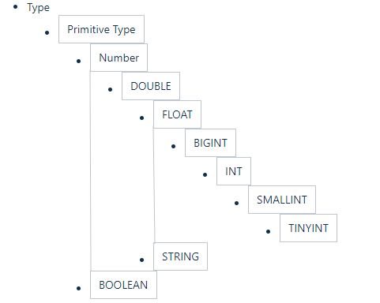

<!-- TOC -->

- [1、基本数据类型](#1基本数据类型)
- [2、隐式转换](#2隐式转换)
- [3、复杂类型](#3复杂类型)
- [4、示例](#4示例)

<!-- /TOC -->


# 1、基本数据类型

Hive 表中的列支持以下基本数据类型：

| 大类                                    | 类型                                                         |
| --------------------------------------- | ------------------------------------------------------------ |
| **Integers（整型）**                    | TINYINT—1 字节的有符号整数 <br/>SMALLINT—2 字节的有符号整数<br/> INT—4 字节的有符号整数<br/> BIGINT—8 字节的有符号整数 |
| **Boolean（布尔型）**                   | BOOLEAN—TRUE/FALSE                                           |
| **Floating point numbers（浮点型）**    | FLOAT— 单精度浮点型 <br/>DOUBLE—双精度浮点型                 |
| **Fixed point numbers（定点数）**       | DECIMAL—用户自定义精度定点数，比如 DECIMAL(7,2)               |
| **String types（字符串）**              | STRING—指定字符集的字符序列<br/> VARCHAR—具有最大长度限制的字符序列 <br/>CHAR—固定长度的字符序列 |
| **Date and time types（日期时间类型）** | TIMESTAMP —  时间戳 <br/>TIMESTAMP WITH LOCAL TIME ZONE — 时间戳，纳秒精度<br/> DATE—日期类型 |
| **Binary types（二进制类型）**          | BINARY—字节序列                                              |

> TIMESTAMP 和 TIMESTAMP WITH LOCAL TIME ZONE 的区别如下：
 
- **TIMESTAMP WITH LOCAL TIME ZONE**：用户提交时间给数据库时，会被转换成数据库所在的时区来保存。查询时则按照查询客户端的不同，转换为查询客户端所在时区的时间。

- **TIMESTAMP** ：提交什么时间就保存什么时间，查询时也不做任何转换。

# 2、隐式转换

Hive 中基本数据类型遵循以下的层次结构，按照这个层次结构，子类型到祖先类型允许隐式转换。例如 INT 类型的数据允许隐式转换为 BIGINT 类型。额外注意的是：按照类型层次结构允许将 STRING 类型隐式转换为 DOUBLE 类型。




# 3、复杂类型

| 类型       | 描述                                                         | 示例                                   |
| ---------- | ------------------------------------------------------------ | -------------------------------------- |
| **STRUCT** | 类似于对象，是字段的集合，字段的类型可以不同，可以使用 ` 名称.字段名 ` 方式进行访问 | STRUCT ('xiaoming', 12 , '2018-12-12') |
| **MAP**    | 键值对的集合，可以使用 ` 名称[key]` 的方式访问对应的值          | map('a', 1, 'b', 2)                    |
| **ARRAY**  | 数组是一组具有相同类型和名称的变量的集合，可以使用 ` 名称[index]` 访问对应的值 | ARRAY('a', 'b', 'c', 'd')              |


# 4、示例

如下给出一个基本数据类型和复杂数据类型的使用示例：

```sql
CREATE TABLE students(
  name      STRING,   -- 姓名
  age       INT,      -- 年龄
  subject   ARRAY<STRING>,   --学科
  score     MAP<STRING,FLOAT>,  --各个学科考试成绩
  address   STRUCT<houseNumber:int, street:STRING, city:STRING, province：STRING>  --家庭居住地址
) ROW FORMAT DELIMITED FIELDS TERMINATED BY "\t";
```

