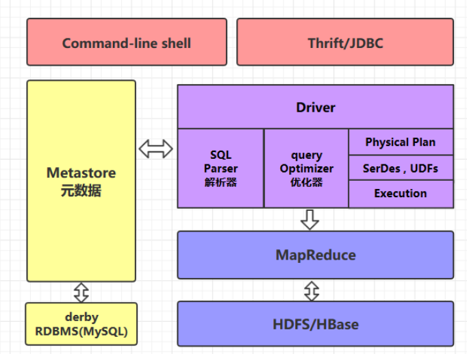
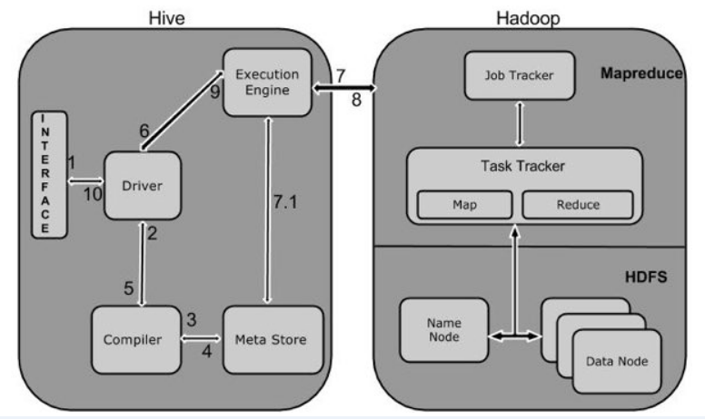
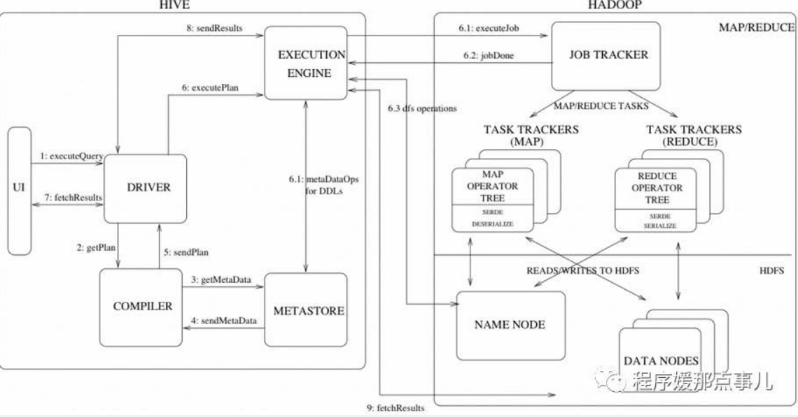

<!-- TOC -->

- [1、hive概念](#1hive概念)
- [2、Hive架构](#2hive架构)
    - [2.1 command-line shell & thrift/jdbc](#21-command-line-shell--thriftjdbc)
    - [2.2 Metastore](#22-metastore)
    - [2.3 HQL的执行流程](#23-hql的执行流程)
- [3、Hive工作原理](#3hive工作原理)
- [参考](#参考)

<!-- /TOC -->

# 1、hive概念

Hive 是一个构建在 Hadoop 之上的数据仓库，它可以将结构化的数据文件映射成表，并提供类 SQL 查询功能，用于查询的 SQL 语句会被转化为 MapReduce 作业，然后提交到 Hadoop 上运行。

本质是：将 HiveQL 转化成 MapReduce 程序执行

- 1） Hive 处理的数据存储在 HDFS
- 2） Hive 分析数据底层的实现是 MapReduce
- 3） 执行程序运行在 Yarn 上

Hive 不是：一个关系数据库、 一个设计用于联机事务处理（OLTP）、实时查询和行级更新的语言

> Hive特点

- 它存储架构在一个数据库中并处理数据到HDFS。

- 它是专为OLAP设计。

- 简单、容易上手 (提供了类似 sql 的查询语言 hql)，使得精通 sql 但是不了解 Java 编程的人也能很好地进行大数据分析；

- 它是熟知，快速，可扩展和可扩展的。为超大的数据集设计的计算和存储能力，集群扩展容易;

- 灵活性高，可以自定义用户函数 (UDF) 和存储格式；

- 统一的元数据管理，可与 presto／impala／sparksql 等共享数据；

- 执行延迟高，不适合做数据的实时处理，但适合做海量数据的离线处理。

> 优势

- 1） 操作接口采用类 SQL 语法，提供快速开发的能力（简单、容易上手）
- 2） 避免了去写 MapReduce，减少开发人员的学习成本。
- 3） Hive 的执行延迟比较高， 因此 Hive 常用于数据分析，对实时性要求不高的场合；
- 4） Hive 优势在于处理大数据，对于处理小数据没有优势，因为 Hive 的执行延迟比较高。
5） Hive 支持用户自定义函数，用户可以根据自己的需求来实现自己的函数。

> 劣势

- 1） Hive 的 HQL 表达能力有限:迭代式算法无法表达、数据挖掘方面不擅长
- 2） Hive 的效率比较低：Hive 自动生成的 MapReduce 作业，通常情况下不够智能化；Hive 调优比较困难，粒度较粗

# 2、Hive架构

解释器、编译器、优化器完成HQL查询语句从词法分析、语法分析、编译、优化以及查询计划的生成。生成的查询计划存储在HDFS中，并在随后有MapReduce调用执行。Hive的数据存储在HDFS中，大部分的查询、计算由MapReduce完成（包含*的查询，比如select * from tbl不会生成MapRedcue任务）。

## 2.1 command-line shell & thrift/jdbc

可以用 command-line shell 和 thrift／jdbc 两种方式来操作数据：

+ **command-line shell**：通过 hive 命令行的的方式来操作数据；
+ **thrift／jdbc**：通过 thrift 协议按照标准的 JDBC 的方式操作数据。

用户接口主要有三个：CLI，Client 和 WUI。其中最常用的是CLI，Cli启动的时候，会同时启动一个Hive副本。Client是Hive的客户端，用户连接至Hive Server。在启动 Client模式的时候，需要指出Hive Server所在节点，并且在该节点启动Hive Server。 WUI是通过浏览器访问Hive。

## 2.2 Metastore

在 Hive 中，表名、表结构、字段名、字段类型、表的分隔符、表的属性（表的属性（是否为外部表等），表的数据所在目录等。）等统一被称为元数据。所有的元数据默认存储在 Hive 内置的 derby 数据库中，但由于 derby 只能有一个实例，也就是说不能有多个命令行客户端同时访问，所以在实际生产环境中，通常使用 MySQL 代替 derby。

Hive 进行的是统一的元数据管理，就是说你在 Hive 上创建了一张表，然后在 presto／impala／sparksql 中都是可以直接使用的，它们会从 Metastore 中获取统一的元数据信息，同样的你在 presto／impala／sparksql 中创建一张表，在 Hive 中也可以直接使用。

## 2.3 HQL的执行流程

Hive 在执行一条 HQL 的时候，会经过以下步骤：

1. 语法解析：Antlr 定义 SQL 的语法规则，完成 SQL 词法，语法解析，将 SQL 转化为抽象 语法树 AST Tree；
2. 语义解析：遍历 AST Tree，抽象出查询的基本组成单元 QueryBlock；
3. 生成逻辑执行计划：遍历 QueryBlock，翻译为执行操作树 OperatorTree；
4. 优化逻辑执行计划：逻辑层优化器进行 OperatorTree 变换，合并不必要的 ReduceSinkOperator，减少 shuffle 数据量；
5. 生成物理执行计划：遍历 OperatorTree，翻译为 MapReduce 任务；
6. 优化物理执行计划：物理层优化器进行 MapReduce 任务的变换，生成最终的执行计划。

> 关于 Hive SQL 的详细执行流程可以参考美团技术团队的文章：[Hive SQL 的编译过程](https://tech.meituan.com/2014/02/12/hive-sql-to-mapreduce.html)

# 3、Hive工作原理

下图描述了Hive 和Hadoop之间的工作流程。

下表定义Hive和Hadoop框架的交互方式：

Step No.操作

1 Execute Query

Hive接口，如命令行或Web UI发送查询驱动程序（任何数据库驱动程序，如JDBC，ODBC等）来执行。

2 Get Plan

在驱动程序帮助下查询编译器，分析查询检查语法和查询计划或查询的要求。

3 Get Metadata

编译器发送元数据请求到Metastore（任何数据库）。

4 Send Metadata

Metastore发送元数据，以编译器的响应。

5 Send Plan

编译器检查要求，并重新发送计划给驱动程序。到此为止，查询解析和编译完成。

6 Execute Plan

驱动程序发送的执行计划到执行引擎。

7 Execute Job

在内部，执行作业的过程是一个MapReduce工作。执行引擎发送作业给JobTracker，在名称节点并把它分配作业到TaskTracker，这是在数据节点。在这里，查询执行MapReduce工作。

7.1 Metadata Ops

与此同时，在执行时，执行引擎可以通过Metastore执行元数据操作。

8 Fetch Result

执行引擎接收来自数据节点的结果。

9 Send Results

执行引擎发送这些结果值给驱动程序。

10 Send Results

驱动程序将结果发送给Hive接口。

# 参考

- [从HiveQL到MapReduce job过程简析](https://www.cnblogs.com/harrymore/p/8950210.html)
- [如何通俗地理解Hive的工作原理？](https://www.zhihu.com/question/49969423)
- [HiveSQL解析原理：包括SQL转化为MapReduce过程及MapReduce如何实现基本SQL操作](https://blog.csdn.net/youzhouliu/article/details/70807993)
- [Hive SQL转化为MapReduce执行计划深度解析](https://blog.csdn.net/i000zheng/article/details/81082774)

- [Hive原理](https://yq.aliyun.com/articles/653935)

- [Hive架构和工作原理](https://cloud.tencent.com/developer/news/362488)

1. [Hive Getting Started](https://cwiki.apache.org/confluence/display/Hive/GettingStarted)

2. [Hive SQL 的编译过程](https://tech.meituan.com/2014/02/12/hive-sql-to-mapreduce.html)

3. [LanguageManual DDL](https://cwiki.apache.org/confluence/display/Hive/LanguageManual+DDL)

4. [LanguageManual Types](https://cwiki.apache.org/confluence/display/Hive/LanguageManual+Types)

5. [Managed vs. External Tables](https://cwiki.apache.org/confluence/display/Hive/Managed+vs.+External+Tables)

