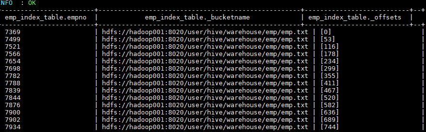
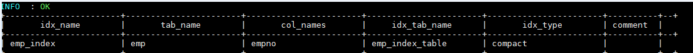

<!-- TOC -->

- [1、索引](#1索引)
    - [1、索引简介](#1索引简介)
    - [2、索引原理](#2索引原理)
    - [2.3 创建索引](#23-创建索引)
    - [2.4 查看索引](#24-查看索引)
    - [2.4 删除索引](#24-删除索引)
    - [2.5 重建索引](#25-重建索引)
- [2、索引案例](#2索引案例)
    - [1、创建索引](#1创建索引)
    - [2、重建索引](#2重建索引)
    - [3、自动使用索引](#3自动使用索引)
        - [3.4 查看索引](#34-查看索引)
- [3、索引的缺陷](#3索引的缺陷)
    - [参考资料](#参考资料)

<!-- /TOC -->


`结论：可以不使用，缺点，新增数据后必须手动 rebuild。3之后的版本移除，使用物化视图可代替。`


# 1、索引

## 1、索引简介

Hive 在 0.7.0 引入了索引的功能，索引的设计目标是提高表某些列的查询速度。如果没有索引，带有谓词的查询（如'WHERE table1.column = 10'）会加载整个表或分区并处理所有行。但是如果 column 存在索引，则只需要加载和处理文件的一部分。

## 2、索引原理

在指定列上建立索引，会产生一张索引表（表结构如下），里面的字段包括：索引列的值、该值对应的 HDFS 文件路径、该值在文件中的偏移量。在查询涉及到索引字段时，首先到索引表查找索引列值对应的 HDFS 文件路径及偏移量，这样就避免了全表扫描。

```properties
+--------------+----------------+----------+--+
|   col_name   |   data_type    | comment     |
+--------------+----------------+----------+--+
| empno        | int            |  建立索引的列  |   
| _bucketname  | string         |  HDFS 文件路径  |
| _offsets     | array<bigint>  |  偏移量       |
+--------------+----------------+----------+--+
```

## 2.3 创建索引

```sql
CREATE INDEX index_name     --索引名称
  ON TABLE base_table_name (col_name, ...)  --建立索引的列
  AS index_type    --索引类型
  [WITH DEFERRED REBUILD]    --重建索引
  [IDXPROPERTIES (property_name=property_value, ...)]  --索引额外属性
  [IN TABLE index_table_name]    --索引表的名字
  [
     [ ROW FORMAT ...] STORED AS ...  
     | STORED BY ...
  ]   --索引表行分隔符 、 存储格式
  [LOCATION hdfs_path]  --索引表存储位置
  [TBLPROPERTIES (...)]   --索引表表属性
  [COMMENT "index comment"];  --索引注释
```

## 2.4 查看索引

```sql
--显示表上所有列的索引
SHOW FORMATTED INDEX ON table_name;
```

## 2.4 删除索引

删除索引会删除对应的索引表。

```sql
DROP INDEX [IF EXISTS] index_name ON table_name;
```

如果存在索引的表被删除了，其对应的索引和索引表都会被删除。如果被索引表的某个分区被删除了，那么分区对应的分区索引也会被删除。

## 2.5 重建索引

```sql
ALTER INDEX index_name ON table_name [PARTITION partition_spec] REBUILD;
```

重建索引。如果指定了 PARTITION，则仅重建该分区的索引。


# 2、索引案例

## 1、创建索引

在 emp 表上针对 `empno` 字段创建名为 `emp_index`,索引数据存储在 `emp_index_table` 索引表中

```sql
create index emp_index on table emp(empno) as  
'org.apache.hadoop.hive.ql.index.compact.CompactIndexHandler' 
with deferred rebuild 
in table emp_index_table ;
```

此时索引表中是没有数据的，需要重建索引才会有索引的数据。

## 2、重建索引

```sql
alter index emp_index on emp rebuild; 
```

Hive 会启动 MapReduce 作业去建立索引，建立好后查看索引表数据如下。三个表字段分别代表：索引列的值、该值对应的 HDFS 文件路径、该值在文件中的偏移量。



## 3、自动使用索引

默认情况下，虽然建立了索引，但是 Hive 在查询时候是不会自动去使用索引的，需要开启相关配置。开启配置后，涉及到索引列的查询就会使用索引功能去优化查询。

```sql
SET hive.input.format=org.apache.hadoop.hive.ql.io.HiveInputFormat;
SET hive.optimize.index.filter=true;
SET hive.optimize.index.filter.compact.minsize=0;
```

### 3.4 查看索引

```sql
SHOW INDEX ON emp;
```




# 3、索引的缺陷

索引表最主要的一个缺陷在于：索引表无法自动 rebuild，这也就意味着如果表中有数据新增或删除，则必须手动 rebuild，重新执行 MapReduce 作业，生成索引表数据。

同时按照[官方文档](https://cwiki.apache.org/confluence/display/Hive/LanguageManual+Indexing) 的说明，Hive 会从 3.0 开始移除索引功能，主要基于以下两个原因：

- 具有自动重写的物化视图 (Materialized View) 可以产生与索引相似的效果（Hive 2.3.0 增加了对物化视图的支持，在 3.0 之后正式引入）。
- 使用列式存储文件格式（Parquet，ORC）进行存储时，这些格式支持选择性扫描，可以跳过不需要的文件或块。

> ORC 内置的索引功能可以参阅这篇文章：[Hive 性能优化之 ORC 索引–Row Group Index vs Bloom Filter Index](http://lxw1234.com/archives/2016/04/632.htm)


## 参考资料

1. [Create/Drop/Alter View](https://cwiki.apache.org/confluence/display/Hive/LanguageManual+DDL#LanguageManualDDL-Create/Drop/AlterView)
2. [Materialized views](https://cwiki.apache.org/confluence/display/Hive/Materialized+views)
3. [Hive 索引](http://lxw1234.com/archives/2015/05/207.htm)
4. [Overview of Hive Indexes](https://cwiki.apache.org/confluence/display/Hive/LanguageManual+Indexing)
