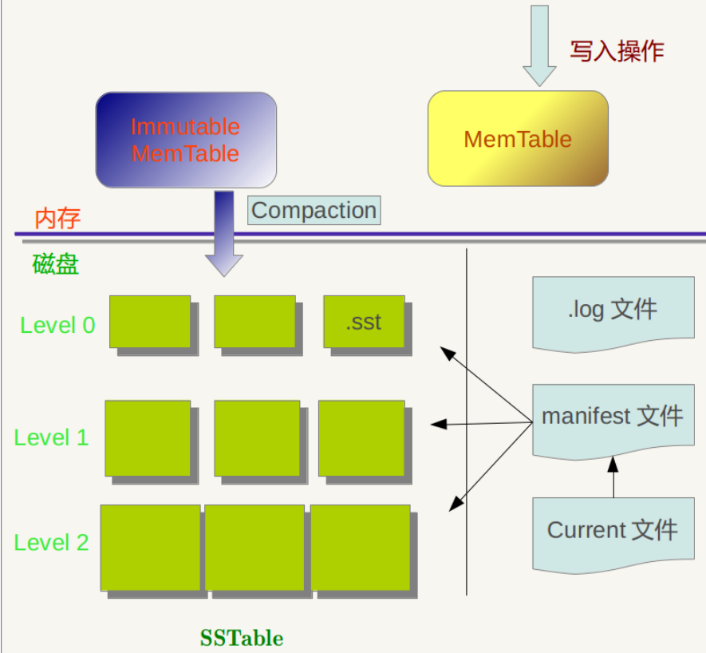

<!-- TOC -->

- [1、概念](#1概念)
- [2、整体架构](#2整体架构)
- [参考](#参考)

<!-- /TOC -->

# 1、概念

LevelDB是一个功能上类`Redis的key/value存储引擎`。Redis是一个基于纯内存的存储系统，而`LevelDB是基于内存 + SSD`的架构，内存存储最新的修改和热数据（可理解为缓存），SSD作为全量数据的持久化存储，所以LevelDB具备比redis更高的存储量，且具备良好的写入性能，读性能就略差了，主要原因是由于冷数据需要进行磁盘IO。

LevelDB is a fast key-value storage library written at Google that provides an ordered mapping from string keys to string values.

> Features

- Keys and values are arbitrary byte arrays.key和value都是任意长度的字节数组；
- Data is stored sorted by key. entry（即一条K-V记录）默认是按照key的字典顺序存储的，
- Callers can provide a custom comparison function to override the sort order.当然开发者也可以重载这个排序函数；
- The basic operations are Put(key,value), Get(key), Delete(key).提供的基本操作接口：Put()、Delete()、Get()、Batch()；
- Multiple changes can be made in one atomic batch.支持批量操作以原子操作进行；
- Users can create a transient snapshot to get a consistent view of data.可以创建数据全景的snapshot(快照)，并允许在快照中查找数据；
- Forward and backward iteration is supported over the data.可以通过前向（或后向）迭代器遍历数据（迭代器会隐含的创建一个snapshot）；
- Data is automatically compressed using the Snappy compression library.自动使用Snappy压缩数据；
- External activity (file system operations etc.) is relayed through a virtual interface so users can customize the operating system interactions.可移植性；

> Limitations
- This is not a SQL database. It does not have a relational data model, it does not support SQL queries, and it has no support for indexes.非关系型数据模型（NoSQL），不支持sql语句，也不支持索引；

- Only a single process (possibly multi-threaded) can access a particular database at a time.一次只允许一个进程访问一个特定的数据库；

- There is no client-server support builtin to the library. An application that needs such support will have to wrap their own server around the library.没有内置的C/S架构，但开发者可以使用LevelDB库自己封装一个server

LevelDb有如下一些特点：

首先，LevelDb是一个持久化存储的KV系统，和Redis这种内存型的KV系统不同，LevelDb不会像Redis一样狂吃内存，而是将大部分数据存储到磁盘上。

其次，`LevleDb在存储数据时，是根据记录的key值有序存储的，就是说相邻的key值在存储文件中是依次顺序存储的`，而应用可以自定义key大小比较函数，LevleDb会按照用户定义的比较函数依序存储这些记录。

再次，像大多数KV系统一样，LevelDb的操作接口很简单，基本操作包括写记录，读记录以及删除记录。也支持针对多条操作的原子批量操作。

另外，`LevelDb支持数据快照（snapshot）功能，使得读取操作不受写操作影响，可以在读操作过程中始终看到一致的数据`。

除此外，LevelDb还支持数据压缩等操作，这对于减小存储空间以及增快IO效率都有直接的帮助。

LevelDb性能非常突出，官方网站报道其随机写性能达到40万条记录每秒，而随机读性能达到6万条记录每秒。总体来说，`LevelDb的写操作要大大快于读操作，而顺序读写操作则大大快于随机读写操作`。

# 2、整体架构

LevelDb作为存储系统，数据记录的存储介质包括内存以及磁盘文件，当LevelDb运行了一段时间，此时我们给LevelDb进行透视拍照，那么您会看到如下一番景象：

从图中可以看出，构成LevelDb静态结构的包括六个主要部分：内存中的MemTable和Immutable MemTable以及磁盘上的几种主要文件：Current文件，Manifest文件，log文件以及SSTable文件。当然，LevelDb除了这六个主要部分还有一些辅助的文件，但是以上六个文件和数据结构是LevelDb的主体构成元素。

# 参考

- [数据分析与处理之二（Leveldb 实现原理）](https://www.cnblogs.com/haippy/archive/2011/12/04/2276064.html)

- [leveldb github源码](https://github.com/google/leveldb)

