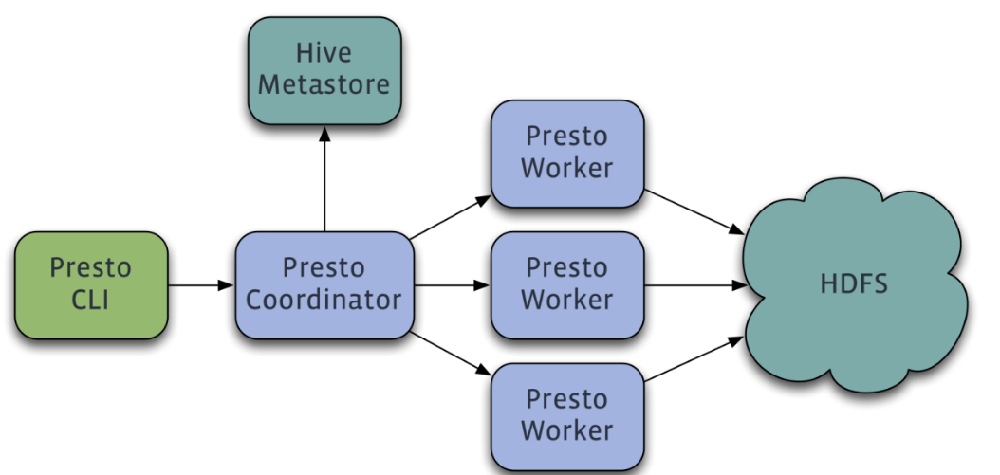
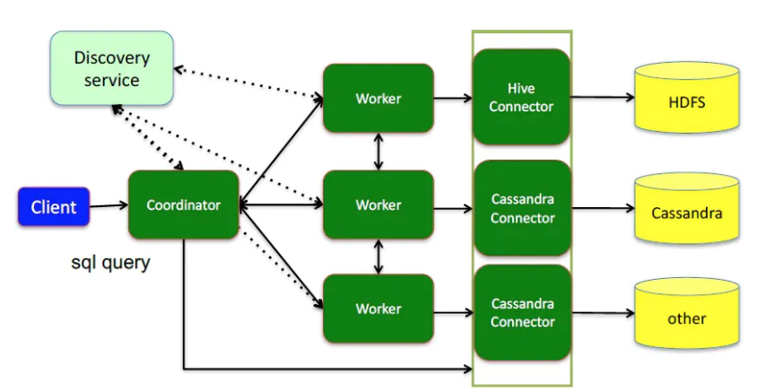
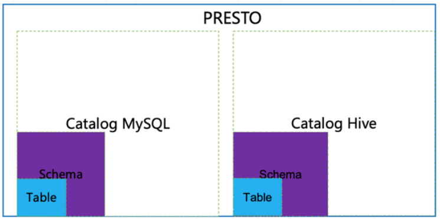
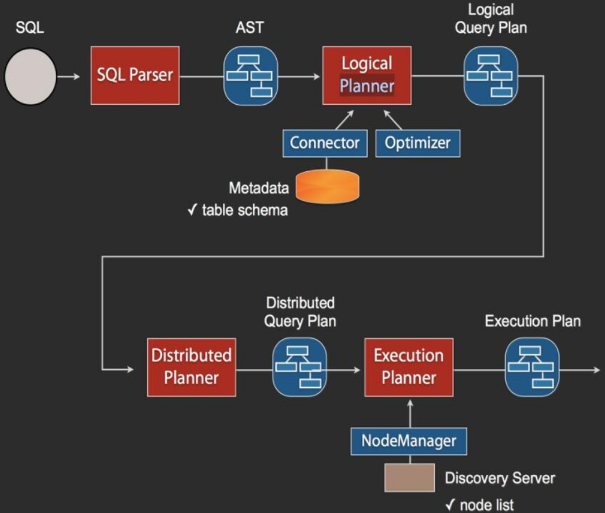
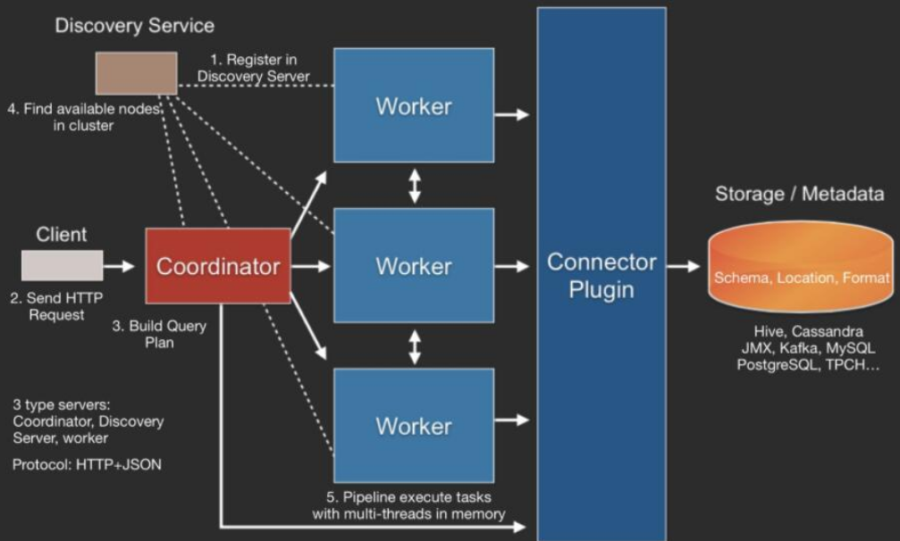
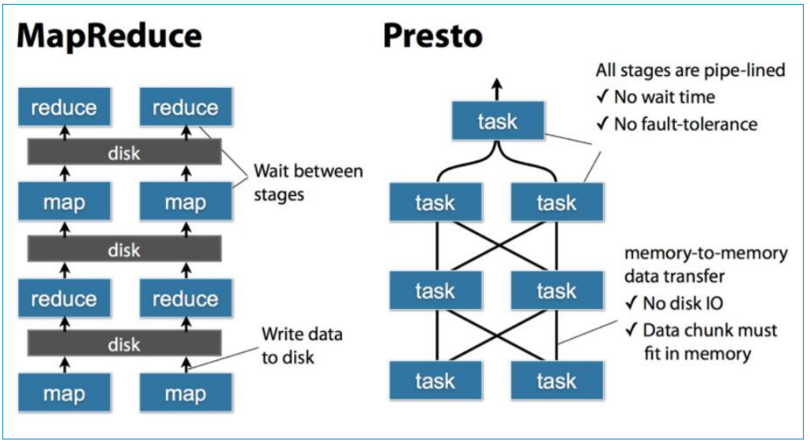
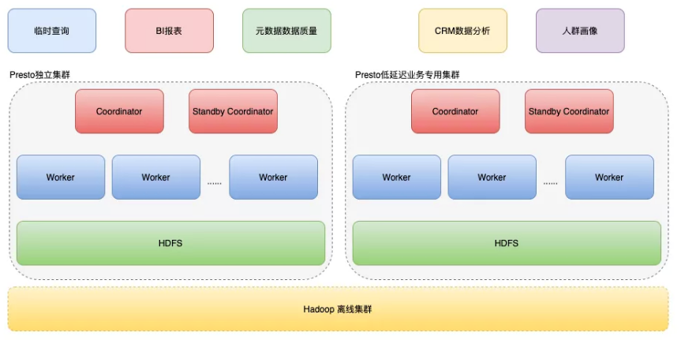
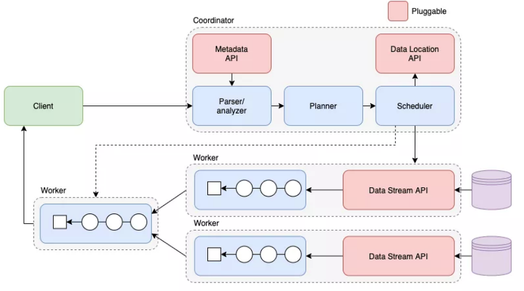

<!-- TOC -->

- [1、基本概念](#1基本概念)
- [2、Presto SQL执行步骤](#2presto-sql执行步骤)
- [3、Presto存储插件](#3presto存储插件)
- [9、presto和hive对比](#9presto和hive对比)
- [9、xx](#9xx)
    - [1、Presto 执行查询过程](#1presto-执行查询过程)
    - [2、Presto 为何高性能](#2presto-为何高性能)
    - [3、Presto在使用中的遇到的问题](#3presto在使用中的遇到的问题)
        - [1、HDFS 小文件问题](#1hdfs-小文件问题)
- [参考](#参考)

<!-- /TOC -->

> presto优点

- 完全基于内存的并行计算，Massively parallel processing（mpp）(大规模并行处理)模型
- 流水线
- 本地化计算
- 动态编译执行计划
- 小心使用内存和数据结构
- 类BlinkDB的近似查询
- GC控制
- presto数据处理能力到达PB级别，支持查询数据源有hive、kafka、cassandra、redis、mongodb、sql server等

Presto查询引擎是一个Master-Slave的架构，由一个Coordinator节点，一个Discovery Server节点，多个Worker节点组成，Discovery Server通常内嵌于Coordinator节点中。

- Coordinator负责解析SQL语句，生成执行计划，分发执行任务给Worker节点执行。

- Worker节点负责实际执行查询任务。

- Discovery Server:Worker节点启动后向Discovery Server服务注册，Coordinator从Discovery Server获得可以正常工作的Worker节点。

- 如果配置了Hive Connector，需要配置一个Hive MetaStore服务为Presto提供Hive元信息，Worker节点与HDFS交互读取数据。

`一个查询分解为多个stage 每个 stage拆分多个task，每个task处理一个or多个split ，一个task被分解为一个或多个Driver`

# 1、基本概念

- Connector是适配器，用于Presto和数据源（如Hive、RDBMS）的连接。你可以认为类似JDBC那样，但却是Presto的SPI的实现，使用标准的API来与不同的数据源交互。每个catalog都有一个特定的Connector。如果你使用catelog配置文件，你会发现每个文件都必须包含connector.name属性，用于指定catelog管理器（创建特定的Connector使用）。一个或多个catelog用同样的connector是访问同样的数据库。例如，你有两个Hive集群。你可以在一个Presto集群上配置两个catelog，两个catelog都是用Hive Connector，从而达到可以查询两个Hive集群。

`Presto 使用 Catalog、Schema和Table 这3层结构来管理数据`

- catalog：就是数据源。每个数据源连接都有一个名字，一个Catalog可以包含多个Schema，大家可以通过show catalogs 命令看到Presto已连接的所有数据源。

- schema：相当于一个数据库实例，一个Schema包含多张数据表。通过以下方式可列出catalog_name下的所有 Schema：show schemas from 'catalog_name'

- Table：数据表，与RDBMS上的数据库表意义相同。通过以下方式可查看'catalog_name.schema_name'下的所有表：show tables from 'catalog_name.schema_name'

在Presto中定位一张表，一般是catalog为根，例如：一张表的全称为 hive.test_data.test，标识hive(catalog)下的 test_data(schema)库中 test 表。可以简理解为：数据源的类别.数据库.数据表。

- 语句（Statement）：Presto执行ANSI兼容的SQL语句。当Presto提起语句时，指的就是ANSI标准的SQL语句，包含着列名、表达式和谓词。之所以要把语句和查询分开说，是因为Presto里，语句知识简单的文本SQL语句。而当语句执行时，Presto则会创建查询和分布式查询计划并在Worker上运行。

- 查询（Query）：当Presto解析一个语句时，它将其转换为一个查询，并创建一个分布式查询计划（多个互信连接的stage，运行在Worker上）。如果想获取Presto的查询情况，则获取每个组件（正在执行这语句的结点）的快照。

查询和语句的区别是，语句是存SQL文本，而查询是配置和实例化的组件。一个查询包含：stage、task、split、connector、其他组件和数据源。

- Stage：当Presto执行查询时，会将执行拆分为有层次结构的stage。例如，从hive中的10亿行数据中聚合数据，此时会创建一个用于聚合的根stage，用于聚合其他stage的数据。

层次结构的stage类似一棵树。每个查询都由一个根stage，用于聚合其他stage的数据。stage是Coordinator的分布式查询计划（distributed query plan）的模型，stage不是在worker上运行。

- Task：由于stage不是在worker上运行。stage又会被分为多个task，在不同的work上执行。

Task是Presto结构里是“work horse”。一个分布式查询计划会被拆分为多个stage，并再转为task，然后task就运行或处理split。Task有输入和输出，一个stage可以分为多个并行执行的task，一个task可以分为多个并行执行的driver。

- Split：Task运行在split上。split是一个大数据集合中的一块。分布式查询计划最底层的stage是通过split从connector上获取数据，分布式查询计划中间层或顶层则是从它们下层的stage获取数据。

Presto调度查询，coordinator跟踪每个机器运行什么任务，那些split正在被处理。

- Driver：Task包含一个或多个并行的driver。Driver在数据上处理，并生成输出，然后由Task聚合，最后传送给stage的其他task。一个driver是Operator的序列。driver是Presto最最低层的并行机制。一个driver有一个输出和一个输入。

- Operator：Operator消费，传送和生产数据。如一个Operator从connector中扫表获取数据，然后生产数据给其他Operator消费。一个过滤Operator消费数据，并应用谓词，最后生产出子集数据。

- Exchange：Exchange在Presto结点的不同stage之间传送数据。Task生产和消费数据是通过Exchange客户端。

# 2、Presto SQL执行步骤

当Coordinator收到一个Query，其SQL执行流程如上图所示。SQL通过Anltr3解析为AST（抽象语法树），然后通过Connector获取原始数据的Metadata信息，这里会有一些优化，比如缓存Metadata信息等，根据Metadata信息生成逻辑计划，然后会依次生成分发计划和执行计划，在执行计划里需要去Discovery里获取可用的node列表，然后根据一定的策略，将这些计划分发到指定的Worker机器上，Worker机器再分别执行。

- 1、Worker向Discovery Server注册自己；

- 2、client通过 HTTP 发送一个查询语句给Presto集群的Coordinator；

- 3、Coordinator 接收到客户端传来的查询语句，对该语句进行解析、生成查询执行计划（Connector插件提供Metadata）；

- 4、Coordinator通过Discovery Server发现可用的Worker。

- 5、Coordinator向workers发送任务

- 6、Worker通过Connector插件读取数据

- 7、Worker在内存里执行任务（Worker是纯内存型计算引擎）

- 8、Worker将数据返回给Coordinator，之后再Response Client

- 9、Coordinator 从分发的Task之后，一直持续不断的从Single Stage 中的Task获得计算结果，并将结果写入到缓存中，直到所所有的计算结束；

- 10、Client 从提交查询后，就一直监听 Coordinator 中的本次查询结果集，立即输出。直到轮训到所有的结果都返回，本次查询结束；

# 3、Presto存储插件

Presto设计了一个简单的`数据存储的抽象层`， 来满足在不同数据存储系统之上都可以使用SQL进行查询。存储插件（连接器,connector）只需要提供实现以下操作的接口， 包括对`元数据（metadata）的提取`，`获得数据存储的位置`，`获取数据本身的操作`等。除了主要使用的Hive/HDFS后台系统之外， 还可以开发了一些连接其他系统的Presto连接器，包括HBase，Scribe和定制开发的系统。插件结构图如下：

# 9、presto和hive对比

> 1、优点

上图显示了MapReduce与Presto的执行过程的不同点，MR每个操作要么需要写磁盘，要么需要等待前一个stage全部完成才开始执行，而Presto将SQL转换为多个stage，每个stage又由多个tasks执行，每个tasks又将分为多个split。所有的task是并行的方式进行允许，stage之间数据是以pipeline形式流式的执行，数据之间的传输也是通过网络以Memory-to-Memory的形式进行，没有磁盘io操作。这也是Presto性能比Hive快很多倍的决定性原因。

> 2、缺点

- No fault tolerance；当一个Query分发到多个Worker去执行时，当有一个Worker因为各种原因查询失败，那么Master会感知到，整个Query也就查询失败了，而Presto并没有重试机制，所以需要用户方实现重试机制。

- Memory Limitations for aggregations, huge joins；比如多表join需要很大的内存，由于Presto是纯内存计算，所以当内存不够时，Presto并不会将结果dump到磁盘上，所以查询也就失败了，但最新版本的Presto已支持写磁盘操作，这个待后续测试和调研。

- MPP(Massively Parallel Processing )架构；这个并不能说其是一个缺点，因为MPP架构就是解决大量数据分析而产生的，但是其缺点也很明显，假如我们访问的是Hive数据源，如果其中一台Worke由于load问题，数据处理很慢，那么整个查询都会受到影响，因为上游需要等待上游结果。

# 9、xx

## 1、Presto 执行查询过程

- 1、Client 发送请求给 Coordinator。
- 2、SQL 通过 ANTLR 进行解析生成 AST。
- 3、AST 通过元数据进行语义解析。
- 4、语义解析后的数据生成逻辑执行计划，并且通过规则进行优化。
- 5、切分逻辑执行计划为不同 Stage，并调度 Worker 节点去生成 Task。
- 6、Task 生成相应物理执行计划。
- 7、调度完后根据调度结果 Coordinator 将 Stage 串联起来。
- 8、Worker 执行相应的物理执行计划。
- 9、Client 不断地向 Coordinator 拉取查询结果，Coordinator 从最终汇聚输出的 Worker 节点拉取查询结果。

## 2、Presto 为何高性能

- Pipeline, 全内存计算。
- SQL 查询计划规则优化。
- 动态代码生成技术。
- 数据调度本地化，注重内存开销效率，优化数据结构，Cache，非精确查询等其它技术。

## 3、Presto在使用中的遇到的问题

### 1、HDFS 小文件问题

HDFS 小文件问题在大数据领域是个常见的问题。我们发现我们的数仓 Hive 表有些表的文件有几千个，查询特别慢。Presto 这两个参数限制了 Presto 每个节点每个 Task 可执行的最大 Split 数目。

node-scheduler.max-splits-per-node=100

node-scheduler.max-pending-splits-per-task=10

因此当查询有许多小文件的表的时候，问题就爆发出来了，查询起来特别慢。为了解决这个问题，我们分两步走:
- 适当调大了这两个参数.
- 在 Spark，Hive ETL 层面引入 Adaptive Spark 和小文件合并工具去解决这个小文件问题。

# 参考

- [官方-概念重要](https://prestodb.io/docs/current/overview/concepts.html)

- [分布式SQL查询引擎Presto原理介绍](https://blog.csdn.net/ronon77/article/details/84913826)

- [Presto实现原理和美团的使用实践](https://tech.meituan.com/2014/06/16/presto.html)

- [Presto架构及原理](https://www.cnblogs.com/tgzhu/p/6033373.html)

- [Presto架构及原理、安装及部署](https://www.liangzl.com/get-article-detail-40387.html)

- [Presto查询执行过程和索引条件下推分析](https://cloud.tencent.com/developer/article/1630727)

- [Presto 在有赞的实践之路](https://cloud.tencent.com/developer/news/606849)

- [Presto的一些基本概念](http://armsword.com/2018/08/11/the-basic-concepts-of-presto/)

