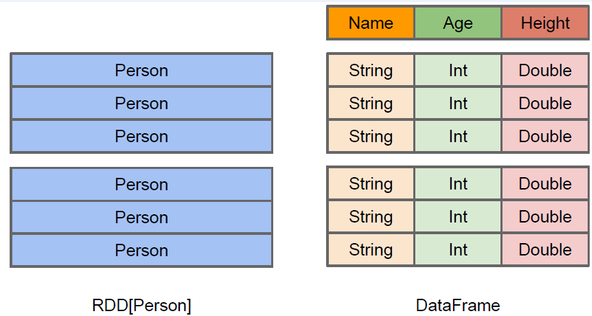
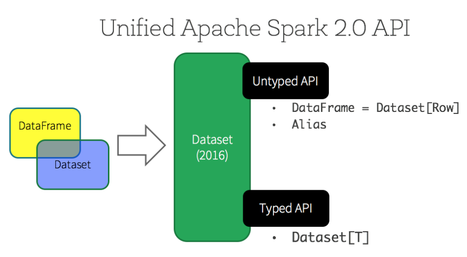
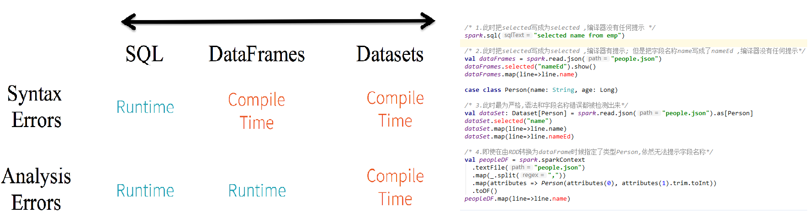
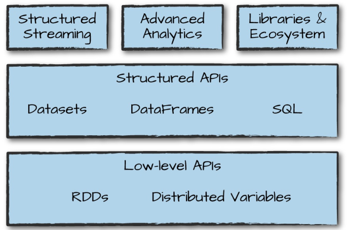
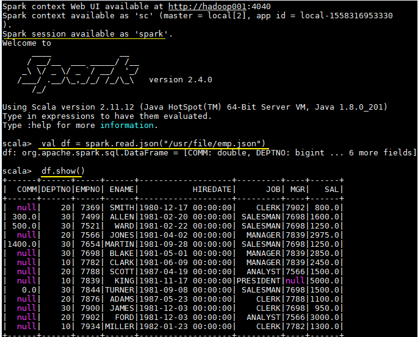

<!-- TOC -->

- [0、DataFrame & DataSet概念](#0dataframe--dataset概念)
    - [1、DataFrame](#1dataframe)
    - [2、DataFrame 对比 RDDs](#2dataframe-对比-rdds)
    - [3、DataSet](#3dataset)
    - [4、静态类型与运行时类型安全](#4静态类型与运行时类型安全)
    - [5、Untyped & Typed](#5untyped--typed)
    - [6、DataFrame & DataSet  & RDDs 总结](#6dataframe--dataset---rdds-总结)
- [1、创建DataFrame和Dataset](#1创建dataframe和dataset)
    - [1.1 创建DataFrame](#11-创建dataframe)
    - [1.2 创建Dataset](#12-创建dataset)
        - [1. 由外部数据集创建](#1-由外部数据集创建)
        - [2. 由内部数据集创建](#2-由内部数据集创建)
    - [1.3 由RDD创建DataFrame](#13-由rdd创建dataframe)
        - [1. 使用反射推断](#1-使用反射推断)
        - [2. 以编程方式指定Schema](#2-以编程方式指定schema)
    - [1.4  DataFrames与Datasets互相转换](#14--dataframes与datasets互相转换)
- [2、Columns列操作](#2columns列操作)
    - [2.1 引用列](#21-引用列)
    - [2.2 新增列](#22-新增列)
    - [2.3 删除列](#23-删除列)
    - [2.4 重命名列](#24-重命名列)
- [3、使用Structured API进行基本查询](#3使用structured-api进行基本查询)
- [4、使用Spark SQL进行基本查询](#4使用spark-sql进行基本查询)
    - [4.1 Spark  SQL基本使用](#41-spark--sql基本使用)
    - [4.2 全局临时视图](#42-全局临时视图)
- [参考资料](#参考资料)

<!-- /TOC -->


# 0、DataFrame & DataSet概念

## 1、DataFrame  

为了支持结构化数据的处理，Spark SQL 提供了新的数据结构 DataFrame。DataFrame 是一个由`具名列组成的数据集`。它在概念上等同于关系数据库中的表或 R/Python 语言中的 `data frame`。 由于 Spark SQL 支持多种语言的开发，所以每种语言都定义了 `DataFrame` 的抽象，主要如下：

| 语言   | 主要抽象                                     |
| ------ | -------------------------------------------- |
| Scala  | Dataset[T] & DataFrame (Dataset[Row] 的别名) |
| Java   | Dataset[T]                                   |
| Python | DataFrame                                    |
| R      | DataFrame                                    |

## 2、DataFrame 对比 RDDs

DataFrame 和 RDDs 最主要的区别在于一个面向的是结构化数据，一个面向的是非结构化数据，它们内部的数据结构如下：



DataFrame 内部的有明确 Scheme 结构，即列名、列字段类型都是已知的，这带来的好处是可以减少数据读取以及更好地优化执行计划，从而保证查询效率。

**DataFrame 和 RDDs 应该如何选择？**

+ 如果你想使用函数式编程而不是 DataFrame API，则使用 RDDs；
+ 如果你的数据是非结构化的 (比如流媒体或者字符流)，则使用 RDDs，
+ 如果你的数据是结构化的 (如 RDBMS 中的数据) 或者半结构化的 (如日志)，出于性能上的考虑，应优先使用 DataFrame。

## 3、DataSet

Dataset 也是分布式的数据集合，在 Spark 1.6 版本被引入，它集成了 RDD 和 DataFrame 的优点，具备强类型的特点，同时支持 Lambda 函数，但只能在 Scala 和 Java 语言中使用。在 Spark 2.0 后，为了方便开发者，Spark 将 DataFrame 和 Dataset 的 API 融合到一起，提供了结构化的 API(Structured API)，即用户可以通过一套标准的 API 就能完成对两者的操作。

> 这里注意一下：DataFrame 被标记为 Untyped API，而 DataSet 被标记为 Typed API，后文会对两者做出解释。



## 4、静态类型与运行时类型安全

静态类型 (Static-typing) 与运行时类型安全 (runtime type-safety) 主要表现如下:

在实际使用中，如果你用的是 Spark SQL 的查询语句，则直到运行时你才会发现有语法错误，而如果你用的是 DataFrame 和 Dataset，则在编译时就可以发现错误 (这节省了开发时间和整体代价)。DataFrame 和 Dataset 主要区别在于：

在 DataFrame 中，当你调用了 API 之外的函数，编译器就会报错，但如果你使用了一个不存在的字段名字，编译器依然无法发现。而 Dataset 的 API 都是用 Lambda 函数和 JVM 类型对象表示的，所有不匹配的类型参数在编译时就会被发现。

以上这些最终都被解释成关于类型安全图谱，对应开发中的语法和分析错误。在图谱中，Dataset 最严格，但对于开发者来说效率最高。下面的给出一个 IDEA 中代码编译的示例：



这里一个可能的疑惑是 DataFrame 明明是有确定的 Scheme 结构 (即列名、列字段类型都是已知的)，但是为什么还是无法对列名进行推断和错误判断，这是因为 DataFrame 是 Untyped 的。

## 5、Untyped & Typed 

在上面我们介绍过 DataFrame API 被标记为 `Untyped API`，而 DataSet API 被标记为 `Typed API`。DataFrame 的 `Untyped` 是相对于语言或 API 层面而言，它确实有明确的 Scheme 结构，即列名，列类型都是确定的，但这些信息完全由 Spark 来维护，Spark 只会在运行时检查这些类型和指定类型是否一致。这也就是为什么在 Spark 2.0 之后，官方推荐把 DataFrame 看做是 `DatSet[Row]`，Row 是 Spark 中定义的一个 `trait`，其子类中封装了列字段的信息。

相对而言，DataSet 是 `Typed` 的，即强类型。如下面代码，DataSet 的类型由 Case Class(Scala) 或者 Java Bean(Java) 来明确指定的，在这里即每一行数据代表一个 `Person`，这些信息由 JVM 来保证正确性，所以字段名错误和类型错误在编译的时候就会被 IDE 所发现。

```scala
case class Person(name: String, age: Long)
val dataSet: Dataset[Person] = spark.read.json("people.json").as[Person]
```


## 6、DataFrame & DataSet  & RDDs 总结

这里对三者做一下简单的总结：

+ RDDs 适合非结构化数据的处理，而 DataFrame & DataSet 更适合结构化数据和半结构化的处理；
+ DataFrame & DataSet 可以通过统一的 Structured API 进行访问，而 RDDs 则更适合函数式编程的场景；
+ 相比于 DataFrame 而言，DataSet 是强类型的 (Typed)，有着更为严格的静态类型检查；
+ DataSets、DataFrames、SQL 的底层都依赖了 RDDs API，并对外提供结构化的访问接口。




# 1、创建DataFrame和Dataset

## 1.1 创建DataFrame

Spark 中所有功能的入口点是 `SparkSession`，可以使用 `SparkSession.builder()` 创建。创建后应用程序就可以从现有 RDD，Hive 表或 Spark 数据源创建 DataFrame。示例如下：

```scala
val spark = SparkSession.builder().appName("Spark-SQL").master("local[2]").getOrCreate()
val df = spark.read.json("/usr/file/json/emp.json")
df.show()

// 建议在进行 spark SQL 编程前导入下面的隐式转换，因为 DataFrames 和 dataSets 中很多操作都依赖了隐式转换
import spark.implicits._
```

可以使用 `spark-shell` 进行测试，需要注意的是 `spark-shell` 启动后会自动创建一个名为 `spark` 的 `SparkSession`，在命令行中可以直接引用即可：




## 1.2 创建Dataset

Spark 支持由内部数据集和外部数据集来创建 DataSet，其创建方式分别如下：

###  1. 由外部数据集创建

```scala
// 1.需要导入隐式转换
import spark.implicits._

// 2.创建 case class,等价于 Java Bean
case class Emp(ename: String, comm: Double, deptno: Long, empno: Long, 
               hiredate: String, job: String, mgr: Long, sal: Double)

// 3.由外部数据集创建 Datasets
val ds = spark.read.json("/usr/file/emp.json").as[Emp]
ds.show()
```

### 2. 由内部数据集创建

```scala
// 1.需要导入隐式转换
import spark.implicits._

// 2.创建 case class,等价于 Java Bean
case class Emp(ename: String, comm: Double, deptno: Long, empno: Long, 
               hiredate: String, job: String, mgr: Long, sal: Double)

// 3.由内部数据集创建 Datasets
val caseClassDS = Seq(Emp("ALLEN", 300.0, 30, 7499, "1981-02-20 00:00:00", "SALESMAN", 7698, 1600.0),
                      Emp("JONES", 300.0, 30, 7499, "1981-02-20 00:00:00", "SALESMAN", 7698, 1600.0))
                    .toDS()
caseClassDS.show()
```

<br/>

## 1.3 由RDD创建DataFrame

Spark 支持两种方式把 RDD 转换为 DataFrame，分别是使用反射推断和指定 Schema 转换：

### 1. 使用反射推断

```scala
// 1.导入隐式转换
import spark.implicits._

// 2.创建部门类
case class Dept(deptno: Long, dname: String, loc: String)

// 3.创建 RDD 并转换为 dataSet
val rddToDS = spark.sparkContext
  .textFile("/usr/file/dept.txt")
  .map(_.split("\t"))
  .map(line => Dept(line(0).trim.toLong, line(1), line(2)))
  .toDS()  // 如果调用 toDF() 则转换为 dataFrame 
```

### 2. 以编程方式指定Schema

```scala
import org.apache.spark.sql.Row
import org.apache.spark.sql.types._


// 1.定义每个列的列类型
val fields = Array(StructField("deptno", LongType, nullable = true),
                   StructField("dname", StringType, nullable = true),
                   StructField("loc", StringType, nullable = true))

// 2.创建 schema
val schema = StructType(fields)

// 3.创建 RDD
val deptRDD = spark.sparkContext.textFile("/usr/file/dept.txt")
val rowRDD = deptRDD.map(_.split("\t")).map(line => Row(line(0).toLong, line(1), line(2)))


// 4.将 RDD 转换为 dataFrame
val deptDF = spark.createDataFrame(rowRDD, schema)
deptDF.show()
```

<br/>

## 1.4  DataFrames与Datasets互相转换

Spark 提供了非常简单的转换方法用于 DataFrame 与 Dataset 间的互相转换，示例如下：

```shell
# DataFrames转Datasets
scala> df.as[Emp]
res1: org.apache.spark.sql.Dataset[Emp] = [COMM: double, DEPTNO: bigint ... 6 more fields]

# Datasets转DataFrames
scala> ds.toDF()
res2: org.apache.spark.sql.DataFrame = [COMM: double, DEPTNO: bigint ... 6 more fields]
```

<br/>

# 2、Columns列操作

## 2.1 引用列

Spark 支持多种方法来构造和引用列，最简单的是使用 `col() ` 或 `column() ` 函数。

```scala
col("colName")
column("colName")

// 对于 Scala 语言而言，还可以使用$"myColumn"和'myColumn 这两种语法糖进行引用。
df.select($"ename", $"job").show()
df.select('ename, 'job).show()
```

## 2.2 新增列

```scala
// 基于已有列值新增列
df.withColumn("upSal",$"sal"+1000)
// 基于固定值新增列
df.withColumn("intCol",lit(1000))
```

## 2.3 删除列

```scala
// 支持删除多个列
df.drop("comm","job").show()
```

## 2.4 重命名列

```scala
df.withColumnRenamed("comm", "common").show()
```

需要说明的是新增，删除，重命名列都会产生新的 DataFrame，原来的 DataFrame 不会被改变。

<br/>

# 3、使用Structured API进行基本查询

```scala
// 1.查询员工姓名及工作
df.select($"ename", $"job").show()

// 2.filter 查询工资大于 2000 的员工信息
df.filter($"sal" > 2000).show()

// 3.orderBy 按照部门编号降序，工资升序进行查询
df.orderBy(desc("deptno"), asc("sal")).show()

// 4.limit 查询工资最高的 3 名员工的信息
df.orderBy(desc("sal")).limit(3).show()

// 5.distinct 查询所有部门编号
df.select("deptno").distinct().show()

// 6.groupBy 分组统计部门人数
df.groupBy("deptno").count().show()
```

<br/>

# 4、使用Spark SQL进行基本查询

## 4.1 Spark  SQL基本使用

```scala
// 1.首先需要将 DataFrame 注册为临时视图
df.createOrReplaceTempView("emp")

// 2.查询员工姓名及工作
spark.sql("SELECT ename,job FROM emp").show()

// 3.查询工资大于 2000 的员工信息
spark.sql("SELECT * FROM emp where sal > 2000").show()

// 4.orderBy 按照部门编号降序，工资升序进行查询
spark.sql("SELECT * FROM emp ORDER BY deptno DESC,sal ASC").show()

// 5.limit  查询工资最高的 3 名员工的信息
spark.sql("SELECT * FROM emp ORDER BY sal DESC LIMIT 3").show()

// 6.distinct 查询所有部门编号
spark.sql("SELECT DISTINCT(deptno) FROM emp").show()

// 7.分组统计部门人数
spark.sql("SELECT deptno,count(ename) FROM emp group by deptno").show()
```

## 4.2 全局临时视图

上面使用 `createOrReplaceTempView` 创建的是会话临时视图，它的生命周期仅限于会话范围，会随会话的结束而结束。

你也可以使用 `createGlobalTempView` 创建全局临时视图，全局临时视图可以在所有会话之间共享，并直到整个 Spark 应用程序终止后才会消失。全局临时视图被定义在内置的 `global_temp` 数据库下，需要使用限定名称进行引用，如 `SELECT * FROM global_temp.view1`。

```scala
// 注册为全局临时视图
df.createGlobalTempView("gemp")

// 使用限定名称进行引用
spark.sql("SELECT ename,job FROM global_temp.gemp").show()
```


# 参考资料

- [Spark SQL, DataFrames and Datasets Guide > Getting Started](https://spark.apache.org/docs/latest/sql-getting-started.html)
