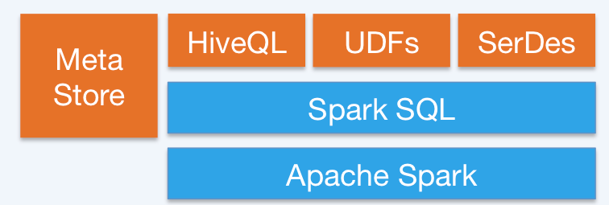
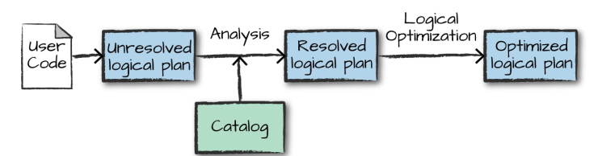
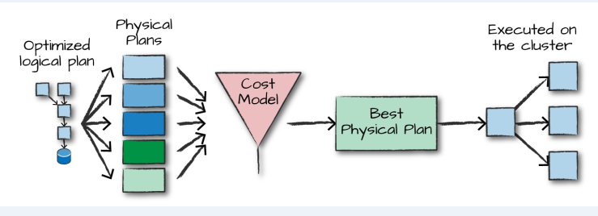

<!-- TOC -->

- [1、Spark SQL简介](#1spark-sql简介)
- [2、Spark SQL的运行原理](#2spark-sql的运行原理)
    - [1、逻辑计划(Logical Plan)](#1逻辑计划logical-plan)
    - [2、物理计划(Physical Plan)](#2物理计划physical-plan)
    - [3、执行](#3执行)
- [参考资料](#参考资料)

<!-- /TOC -->

# 1、Spark SQL简介

Spark SQL 是 Spark 中的一个子模块，主要用于操作结构化数据。它具有以下特点：

+  能够将 SQL 查询与 Spark 程序无缝混合，允许您使用 SQL 或 DataFrame API 对结构化数据进行查询；
+  支持多种开发语言；
+ 支持多达上百种的外部数据源，包括 Hive，Avro，Parquet，ORC，JSON 和 JDBC 等；
+ 支持 HiveQL 语法以及 Hive SerDes 和 UDF，允许你访问现有的 Hive 仓库；
+ 支持标准的 JDBC 和 ODBC 连接；
+ 支持优化器，列式存储和代码生成等特性；
+ 支持扩展并能保证容错。

# 2、Spark SQL的运行原理

DataFrame、DataSet 和 Spark SQL 的实际执行流程都是相同的：

1. 进行 DataFrame/Dataset/SQL 编程；
2. 如果是有效的代码，即代码没有编译错误，Spark 会将其转换为一个逻辑计划；
3. Spark 将此逻辑计划转换为物理计划，同时进行代码优化；
4. Spark 然后在集群上执行这个物理计划 (基于 RDD 操作) 。

## 1、逻辑计划(Logical Plan)

执行的第一个阶段是将用户代码转换成一个逻辑计划。它首先将用户代码转换成 `unresolved logical plan`(未解决的逻辑计划)，之所以这个计划是未解决的，是因为尽管您的代码在语法上是正确的，但是它引用的表或列可能不存在。 Spark 使用 `analyzer`(分析器) 基于 `catalog`(存储的所有表和 `DataFrames` 的信息) 进行解析。解析失败则拒绝执行，解析成功则将结果传给 `Catalyst` 优化器 (`Catalyst Optimizer`)，优化器是一组规则的集合，用于优化逻辑计划，通过谓词下推等方式进行优化，最终输出优化后的逻辑执行计划。

## 2、物理计划(Physical Plan) 

得到优化后的逻辑计划后，Spark 就开始了物理计划过程。 它通过生成不同的物理执行策略，并通过成本模型来比较它们，从而选择一个最优的物理计划在集群上面执行的。物理规划的输出结果是一系列的 RDDs 和转换关系 (transformations)。

## 3、执行

在选择一个物理计划后，Spark 运行其 RDDs 代码，并在运行时执行进一步的优化，生成本地 Java 字节码，最后将运行结果返回给用户。 

# 参考资料

1.  Matei Zaharia, Bill Chambers . Spark: The Definitive Guide[M] . 2018-02 
2. [Spark SQL, DataFrames and Datasets Guide](https://spark.apache.org/docs/latest/sql-programming-guide.html)
3. [且谈 Apache Spark 的 API 三剑客：RDD、DataFrame 和 Dataset(译文)](https://www.infoq.cn/article/three-apache-spark-apis-rdds-dataframes-and-datasets)
4. [A Tale of Three Apache Spark APIs: RDDs vs DataFrames and Datasets(原文)](https://databricks.com/blog/2016/07/14/a-tale-of-three-apache-spark-apis-rdds-dataframes-and-datasets.html)
