<!-- TOC -->

- [1、yarn简介](#1yarn简介)
    - [1、资源模型](#1资源模型)
- [2、YARN架构](#2yarn架构)
    - [1. ResourceManager](#1-resourcemanager)
    - [2. NodeManager](#2-nodemanager)
    - [3. ApplicationMaster](#3-applicationmaster)
    - [4. Contain](#4-contain)
- [3、YARN工作原理简述](#3yarn工作原理简述)
- [4、YARN工作原理详述](#4yarn工作原理详述)
    - [1. 作业提交](#1-作业提交)
    - [2. 作业初始化](#2-作业初始化)
    - [3. 任务分配](#3-任务分配)
    - [4. 任务运行](#4-任务运行)
    - [5. 进度和状态更新](#5-进度和状态更新)
    - [6. 作业完成](#6-作业完成)
- [5、提交作业到YARN上运行](#5提交作业到yarn上运行)
- [6、调度策略](#6调度策略)
    - [1、FIFO](#1fifo)
    - [2、Capacity Scheduler](#2capacity-scheduler)
    - [3、Fair Scheduler](#3fair-scheduler)
- [7、ApplicationMaster在mr和spark任务中代表什么](#7applicationmaster在mr和spark任务中代表什么)
    - [参考资料](#参考资料)

<!-- /TOC -->


# 1、yarn简介

**Apache YARN** (Yet Another Resource Negotiator)  是 hadoop 2.0 引入的集群资源管理系统。用户可以将各种服务框架部署在 YARN 上，由 YARN 进行统一地管理和资源分配。

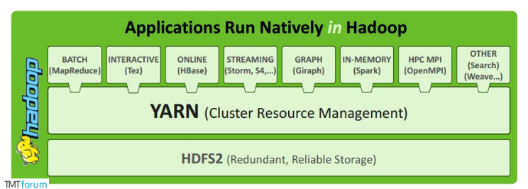


定位：Yarn核心组件，插拔式框架，利用事件来驱动资源各种分配管理。

默认集成的调度器：FIFO,FAIR,CAPACITY，配置参数：yarn.resourcemanager.scheduler.class

资源调度模型：
- 1、双层资源调度模型，RM中的资源调度器将资源分配给AM，AM在APP内部做二次分配；
- 2、资源分配过程为异步，并且AM获取资源的方式是通过心跳主动拉取；
- 3、计算节点NM也是通过心跳的方式来汇报当前的资源信息；
- 4、调度器均才用的是层级队列管理机制，fair/capacity都是支持子队列模式。


## 1、资源模型

```
Hadoop-2.6.1版本资源表示模型只支持cpu和memory，资源表述模型为：Container

NodeManager：
yarn.nodemanager.resource.memory-mb：NM可供分配的总内存大小，单位MB
yarn.nodemanager.resource.cpu-vcores ： NM可供分配的cpu核数

Container：
yarn.scheduler.minimum-allocation-mb
yarn.scheduler.maximum-allocation-mb
yarn.scheduler.minimum-allocation-vcores
yarn.scheduler.maximum-allocation-vcores
以上四个参数分别定义container的内存和cpu的上下限。
```


# 2、YARN架构

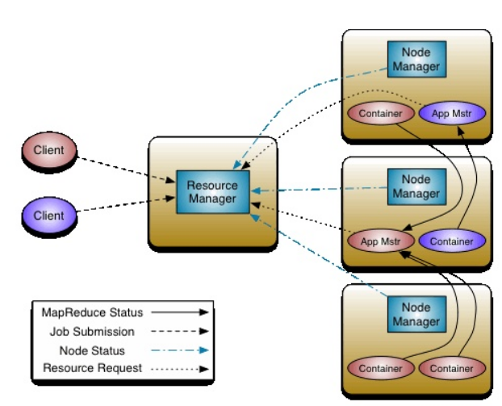

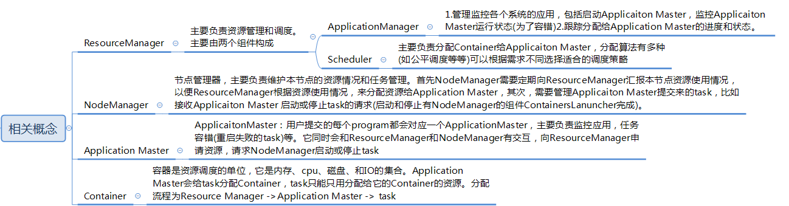


## 1. ResourceManager

`ResourceManager` 通常在独立的机器上以后台进程的形式运行，它是整个集群资源的主要协调者和管理者。`ResourceManager` 负责给用户提交的所有应用程序分配资源，它根据应用程序优先级、队列容量、ACLs、数据位置等信息，做出决策，然后以共享的、安全的、多租户的方式制定分配策略，调度集群资源。

它也包含了两个主要的组件：定时调用器(Scheduler)以及应用管理器(ApplicationManager)。

- 1、定时调度器(Scheduler`分配资源`)：从本质上来说，定时调度器就是一种策略，或者说一种算法。当 Client 提交一个任务的时候，它会根据所需要的资源以及当前集群的资源状况进行分配。注意，它只负责向应用程序分配资源，并不做监控以及应用程序的状态跟踪。

- 2、应用管理器(ApplicationManager`监控资源`)：同样，听名字就能大概知道它是干嘛的。应用管理器就是负责管理 Client 用户提交的应用。上面不是说到定时调度器（Scheduler）不对用户提交的程序监控嘛，其实啊，监控应用的工作正是由应用管理器（ApplicationManager）完成的。

## 2. NodeManager

`NodeManager` 是 YARN 集群中的每个具体节点的管理者。主要负责该节点内所有容器的生命周期的管理，监视资源和跟踪节点健康。具体如下：

- 启动时向 `ResourceManager` 注册并定时发送心跳消息，等待 `ResourceManager` 的指令；
- 维护 `Container` 的生命周期，监控 `Container` 的资源使用情况；
- 管理任务运行时的相关依赖，根据 `ApplicationMaster` 的需要，在启动 `Container` 之前将需要的程序及其依赖拷贝到本地。

## 3. ApplicationMaster 

在用户Client提交一个应用程序时，YARN 会启动一个轻量级的进程 `ApplicationMaster`。`ApplicationMaster` 负责协调来自 `ResourceManager` 的资源，获得资源后会将要运行的程序发送到容器上启动，然后进行分布式计算，并通过 `NodeManager` 监视容器内资源的使用情况，同时还负责任务的监控与容错。具体如下：

- 根据应用的运行状态来决定动态计算资源需求；
- 向 `ResourceManager` 申请资源，监控申请的资源的使用情况；
- 跟踪任务状态和进度，报告资源的使用情况和应用的进度信息；
- 负责任务的容错。


为什么是把运行程序发送到容器上去运行？如果以传统的思路来看，是程序运行着不动，然后数据进进出出不停流转。但当数据量大的时候就没法这么玩了，因为海量数据移动成本太大，时间太长。但是中国有一句老话山不过来，我就过去。大数据分布式计算就是这种思想，既然大数据难以移动，那我就把容易移动的应用程序发布到各个节点进行计算呗，这就是大数据分布式计算的思路。


## 4. Contain

`Container` 是 YARN 中的资源抽象，它封装了某个节点上的多维度资源，如内存、CPU、磁盘、网络等。当 AM 向 RM 申请资源时，RM 为 AM 返回的资源是用 `Container` （可以认为是一种单位）表示的。YARN 会为每个任务分配一个 `Container`，该任务只能使用该 `Container` 中描述的资源。`ApplicationMaster` 可在 `Container` 内运行任何类型的任务。例如，`MapReduce ApplicationMaster` 请求一个容器来启动 map 或 reduce 任务，而 `Giraph ApplicationMaster` 请求一个容器来运行 Giraph 任务。


# 3、YARN工作原理简述

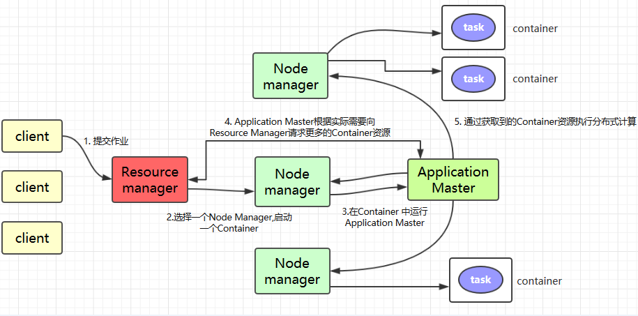

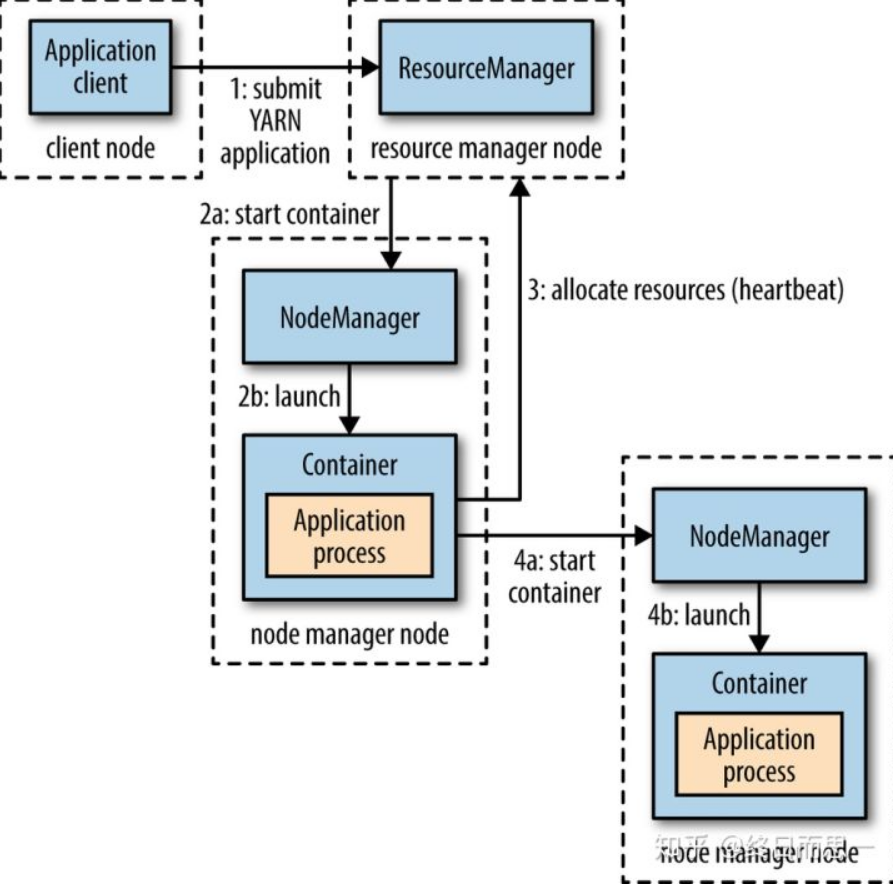

1.`Client` 提交作业到 YARN 上；

2.`Resource Manager` 选择一个 `Node Manager`，启动一个 `Container` 并运行 `Application Master` 实例；

3.`Application Master` 根据实际需要向 `Resource Manager` 请求更多的 `Container` 资源（如果作业很小, 应用管理器会选择在其自己的 JVM 中运行任务）；

4.`Application Master` 通过获取到的 `Container` 资源执行分布式计算。

   

# 4、YARN工作原理详述

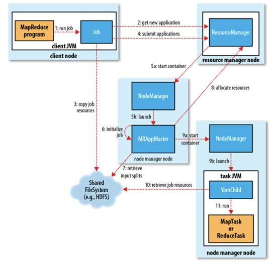


## 1. 作业提交

client 调用 job.waitForCompletion 方法，向整个集群提交 MapReduce 作业 (第 1 步) 。新的`作业 ID`(应用 ID) 由资源管理器分配 (第 2 步)。作业的 client 核实作业的输出, 计算输入的 split, 将作业的资源 (包括 Jar 包，配置文件, split 信息) 拷贝给 HDFS(第 3 步)。 最后, 通过调用资源管理器的 submitApplication() 来提交作业 (第 4 步)。

## 2. 作业初始化

当资源管理器收到 submitApplciation() 的请求时, 就将该请求发给调度器 (scheduler), 调度器分配 container, 然后资源管理器在该 container 内启动应用管理器进程, 由节点管理器监控 (第 5 步)。

MapReduce 作业的应用管理器是一个主类为 MRAppMaster 的 Java 应用，其通过创造一些 bookkeeping 对象来监控作业的进度,  得到任务的进度和完成报告 (第 6 步)。然后其通过分布式文件系统得到由客户端计算好的输入 split(第 7 步)，然后为每个输入 split 创建一个 map 任务, 根据 mapreduce.job.reduces 创建 reduce 任务对象。

## 3. 任务分配

如果作业很小, 应用管理器会选择在其自己的 JVM 中运行任务。

如果不是小作业,  那么应用管理器向资源管理器请求 container 来运行所有的 map 和 reduce 任务 (第 8 步)。这些请求是通过心跳来传输的,  包括每个 map 任务的数据位置，比如存放输入 split 的主机名和机架 (rack)，调度器利用这些信息来调度任务，尽量将任务分配给存储数据的节点, 或者分配给和存放输入 split 的节点相同机架的节点。

## 4. 任务运行

当一个任务由资源管理器的调度器分配给一个 container 后，应用管理器通过联系节点管理器来启动 container(第 9 步)。任务由一个主类为 YarnChild 的 Java 应用执行， 在运行任务之前首先本地化任务需要的资源，比如作业配置，JAR 文件,  以及分布式缓存的所有文件 (第 10 步。 最后, 运行 map 或 reduce 任务 (第 11 步)。

YarnChild 运行在一个专用的 JVM 中, 但是 YARN 不支持 JVM 重用。

## 5. 进度和状态更新

YARN 中的任务将其进度和状态 (包括 counter) 返回给应用管理器, 客户端每秒 (通 mapreduce.client.progressmonitor.pollinterval 设置) 向应用管理器请求进度更新, 展示给用户。

## 6. 作业完成

除了向应用管理器请求作业进度外,  客户端`每 5 分钟`都会通过调用 waitForCompletion() 来检查作业是否完成，时间间隔可以通过 mapreduce.client.completion.pollinterval 来设置。作业完成之后,  应用管理器和 container 会清理工作状态， OutputCommiter 的作业清理方法也会被调用。作业的信息会被作业历史服务器存储以备之后用户核查。


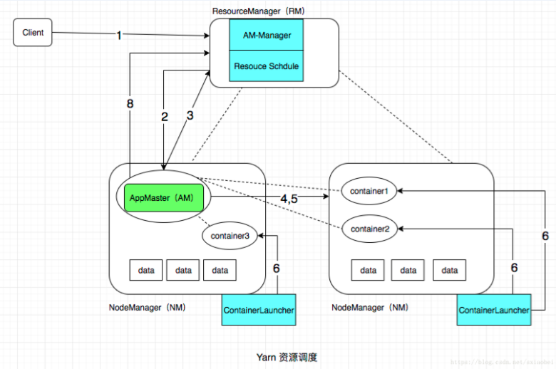


- 1.有YarnClient提交program信息到ResourceManager，包括(应用代码和应用需要的一切参数和环境信息)

- 2.ResourceManager收到请求之后，调用ApplicationMasterManager向NodeManager发送请求，申请一个资源(Container)，并且要求Container启动ApplicationMaster.

- 3.ApplicationMaster启动之后，首先注册自己到ResourceManager，然后为自己的Task申请Container，这个过程是轮训的，循环申请资源，ResourceManager收到请求之后，会要求NodeManager分配资源

- 4.资源分配完毕之后，Application Master发送请求到NodeManager，启动任务。

- 5.NodeManager设置Container的运行时环境(jar包，环境变量，任务启动脚本)，NodeManager会通过脚本启动任务

- 6.启动的过程是由NodeManager的ContainerLauncher负责的，ContainerLauncher完成启动任务的工作

- 7.这一步是在作业执行过程中持续发生的，我用虚线代表，主要包括两类交互，第一，task和Application Master的交互，task会向AM汇报任务状态和进度信息，比如任务启动，停止，状态更新。Applicaiton Master利用这些信息监控task整个执行过程。第二，是NodeManager和ResourceManager的交互，这个过程和任务没有关系，主要是两者之间保持的心跳信息(状态的变化等等)

- 8.Application Master在检测到作业运行完毕之后，Application Master想Resource Manager 删除自己，并且停止自己执行。

说明：

- 1.图中蓝色的部分，是NodeManager和ResourceManager的组件，主要负责控制整个流程
- 2.图中绿色的部分，核心资源分配流程，不属于yarn，是由具体的数据引擎实现的(如mr，spark，strom等)，由此可见Yarn采用了资源双层调度模型，第一层是Yarn分配资源(Container)给Applicaiton Master，这是由Yarn实现的 ，第二层，是Applicaiton Master分配资源给task，这是有具体工作引擎实现，这样的好处是将，yarn的调度和应用分隔开，便于yarn和应用实现、优化或升级自己的调度策略。


总结：上述内容是Yarn调度的基本过程，从调度过程可以看到，Yarn将资源封装抽象为Container，将应用抽象为Application Master,两个关键模型的抽象，实现了对资源和应用的统一管理，进而实现了调度平台和执行引擎的解耦。至于Application怎么样把Container分配给task，怎么样监控task的执行过程，完全是由执行引擎根据自身特性实现的。充分解耦的好处是，Yarn可以同时部署不同的执行引擎，集群不受限制，并且当一个执行引擎升级的时候，不会影响到别的引擎，这对于生产是至关重要的。并且Yarn提供了多种资源调度模式，以满足不同的生产环境。


# 5、提交作业到YARN上运行

这里以提交 Hadoop Examples 中计算 Pi 的 MApReduce 程序为例，相关 Jar 包在 Hadoop 安装目录的 `share/hadoop/mapreduce` 目录下：

```shell
# 提交格式: hadoop jar jar包路径 主类名称 主类参数
# hadoop jar hadoop-mapreduce-examples-2.6.0-cdh5.15.2.jar pi 3 3
```

# 6、调度策略

## 1、FIFO

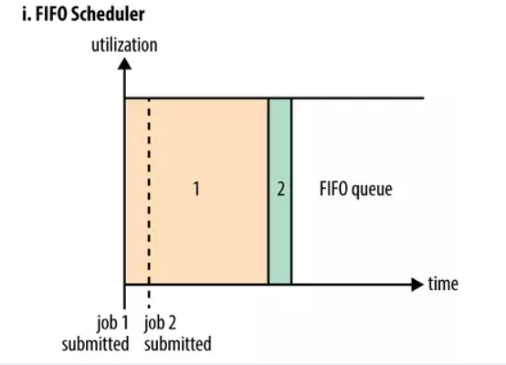

所有的任务都放在一个队列中，只有执行完一个任务后，才会进行下一个。这种调度方式最简单，但真实场景中并不推荐，因为会有很多问题，比如如果有大任务独占资源，会导致其他任务一直处于 pending 状态等。


## 2、Capacity Scheduler

Capacity Scheduler：容量(能力)调度器，通过配置队列的资源百分比来分配资源，每个队列可以设定一定比例的资源最低保证和使用上限，也可以对每个用户设定一定的资源使用上限以防止资源滥用。

特点：较为灵活的容量保证。


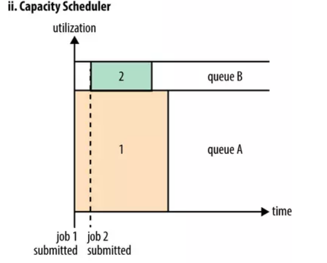

Capacity Scheduler（容量调度器）。Hadoop2.7.2默认的资源调度器。Capacity Schedule调度器以队列为单位划分资源。简单通俗点来说，就是一个个队列有独立的资源，队列的结构和资源是可以进行配置的


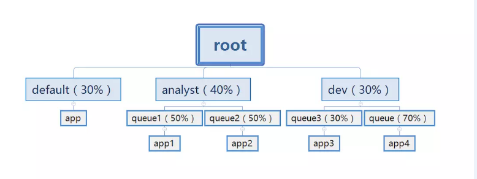

default队列占30%资源，analyst和dev分别占40%和30%资源；类似的，analyst和dev各有两个子队列，子队列在父队列的基础上再分配资源。队列以分层方式组织资源,设计了多层级别的资源限制条件以更好的让多用户共享一个Hadoop集群，比如队列资源限制、用户资源限制、用户应用程序数目限制。队列里的应用以FIFO方式调度，每个队列可设定一定比例的资源最低保证和使用上限，同时，每个用户也可以设定一定的资源使用上限以防止资源滥用。而当一个队列的资源有剩余时，可暂时将剩余资源共享给其他队列。

> 优点

- 容量保证，队列上都会设置一个资源的占比，这样可以保证每个队列都不会占用整个集群的资源。
- 安全，每个队列又严格的访问控制。用户只能向自己的队列里面提交任务，而且不能修改或者访问其他队列的任务。
- 弹性分配，空闲的资源可以被分配给任何队列。当多个队列出现争用的时候，则会按照比例进行平衡。
- 多租户租用，通过队列的容量限制，多个用户就可以共享同一个集群，同时保证每个队列分配到自己的容量，提高利用率。
- 操作性，yarn支持动态修改调整容量、权限等的分配，可以在运行时直接修改。还提供给管理员界面，来显示当前的队列状况。管理员可以在运行时，添加一个队列；但是不能删除一个队列。管理员还可以在运行时暂停某个队列，这样可以保证当前的队列在执行过程中，集群不会接收其他的任务。如果一个队列被设置成了stopped，那么就不能向他或者子队列上提交任务了。
- 基于资源的调度，协调不同资源需求的应用程序，比如内存、CPU、磁盘等等。


## 3、Fair Scheduler

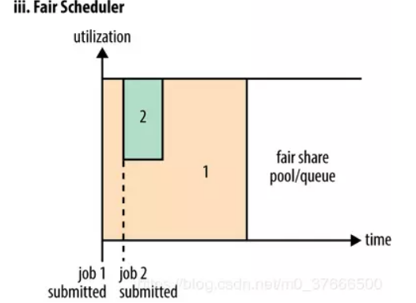

Fair Scheduler（公平调度器）：Fair 针对不同的应用（也可以为用户或用户组），每个应用属于一个队列，主旨是让每个应用分配的资源大体相当。（当然可以设置权重），若是只有一个应用，那集群所有资源都是他的。和 Capacity的区别是不需要预留资源 。适用情况：共享大集群、队列之间有较大差别。

Fair Scheduler： 公平调度器，可配置队列最大和最小的资源值 (cpu&memory的绝对值)，也可以定义可运行的App数据量，job权重等。

特点：相对公平，不会使作业一直饥饿。

# 7、ApplicationMaster在mr和spark任务中代表什么

- MRAppMaster是mapreduce的ApplicationMaster实现

- 由于 Spark 与 MapReduce 相比，是一种 DAG 计算框架，包含一系列的计算任务，比较特殊，所以 Spark 自己实现了一个`集中式调度器  Driver`，用来调用作业内部的计算任务。申请到的资源可以看成是申请分区资源，在该分区内，所有资源由 Driver 全权使用，以客户端方式提交的 Spark on Yarn 这种方式可以看成是 Driver 首先在资源管理和调度系统中注册为框架调度器（二级调度器），接收到需要得资源后，再开始进行作业调度。那么这种方式可以认为是一种曲线救国的双层调度实现方式，这个我们后面会讲到。


- [MapReduce与Yarn 的详细工作流程分析](http://www.spring4all.com/article/16913)
- [Hadoop系列之yarn架构与流程浅析](https://www.jianshu.com/p/254d01eaf884)
- [Apache Hadoop YARN 的架构与运行流程](http://www.justdojava.com/2019/07/01/yarn/)
- [Yarn的基础介绍以及job的提交流程](https://blog.51cto.com/14048416/2342195)

- [Spark运行原理](https://www.jianshu.com/p/de8261ced9fd)
- [Spark中yarn模式两种提交任务方式](https://www.shuzhiduo.com/A/RnJWw69OJq/)
- [Spark中yarn模式两种提交任务方式](https://www.cnblogs.com/LHWorldBlog/p/8414342.html)


## 参考资料

- [初步掌握 Yarn 的架构及原理](https://www.cnblogs.com/codeOfLife/p/5492740.html)

- [Apache Hadoop 2.9.2 > Apache Hadoop YARN](http://hadoop.apache.org/docs/stable/hadoop-yarn/hadoop-yarn-site/YARN.html)

- [深入浅出 Hadoop YARN](https://zhuanlan.zhihu.com/p/54192454) 

- [总结：详细讲解MapReduce过程(整理补充)](https://blog.csdn.net/MrLevo520/article/details/76781186)

- [MapReduce](https://segmentfault.com/a/1190000016544942)

- [YARN调度器(Scheduler)详解](https://www.cnblogs.com/lenmom/p/11285273.html)

- [YARN详解（YARN架构设计、常用命令、三种调度器）](https://www.2cto.com/net/201806/755467.html)

- [YARN工作原理 YARN调度器](https://www.jianshu.com/p/09cd2a87babd)

- [YARN资源调度策略之Capacity Scheduler](https://www.jianshu.com/p/1d5df94de97f)

- [Apache Hadoop YARN](https://hadoop.apache.org/docs/stable/hadoop-yarn/hadoop-yarn-site/YARN.html)

- [Yarn资源调度工作原理](https://www.2cto.com/net/201807/757954.html)

- [YARN 资源调度那些事儿](https://cloud.tencent.com/developer/article/1357111)

- [Yarn工作原理浅析](https://blog.csdn.net/weixin_41867777/article/details/80422867)

- [Yarn资源调度器](https://www.jianshu.com/p/87793a1dab6e)

- [Hadoop之YARN及运行流程](https://blog.csdn.net/qianshangding0708/article/details/47000159)
