<!-- TOC -->

- [第 01 章 对程序员来说 CPU 是什么](#第-01-章-对程序员来说-cpu-是什么)
    - [1.1 CPU 的内部结构解析](#11-cpu-的内部结构解析)
    - [1.2 CPU 是寄存器的集合体](#12-cpu-是寄存器的集合体)
    - [1.3 决定程序流程的程序计数器](#13-决定程序流程的程序计数器)
    - [1.4 条件分支和循环机制](#14-条件分支和循环机制)
    - [1.5 函数的调用机制](#15-函数的调用机制)
    - [1.6 通过地址和索引实现数组](#16-通过地址和索引实现数组)
    - [1.7 CPU 的处理其实很简单](#17-cpu-的处理其实很简单)
- [第 02 章 数据是用二进制数表示的](#第-02-章-数据是用二进制数表示的)
    - [2.1 用二进制数表示计算机信息的原因](#21-用二进制数表示计算机信息的原因)
    - [2.4 便于计算机处理的“补数”](#24-便于计算机处理的补数)
- [第 03 章 计算机进行小数运算时出错的原因](#第-03-章-计算机进行小数运算时出错的原因)
- [第 04 章 熟练使用有棱有角的内存](#第-04-章-熟练使用有棱有角的内存)
    - [4.1 内存的物理机制很简单](#41-内存的物理机制很简单)
    - [4.2 内存的逻辑模型是楼房](#42-内存的逻辑模型是楼房)
    - [4.3 简单的指针](#43-简单的指针)
    - [4.4 数组是高效使用内存的基础（数组和物理内存的构造是一样的）](#44-数组是高效使用内存的基础数组和物理内存的构造是一样的)
    - [4.5 栈、队列以及环形缓冲区](#45-栈队列以及环形缓冲区)
- [第 05 章 内存和磁盘的亲密关系](#第-05-章-内存和磁盘的亲密关系)
- [第 06 章 亲自尝试压缩数据](#第-06-章-亲自尝试压缩数据)
- [第 07 章 程序是在何种环境中运行的](#第-07-章-程序是在何种环境中运行的)
- [第 08 章 从源文件到可执行文件](#第-08-章-从源文件到可执行文件)
- [第 09 章 操作系统和应用的关系](#第-09-章-操作系统和应用的关系)
- [第 10 章 通过汇编语言了解 程序的实际构成[todo]](#第-10-章-通过汇编语言了解-程序的实际构成todo)
- [第 11 章 硬件控制方法](#第-11-章-硬件控制方法)
- [第 12 章 让计算机“思考”[todo]](#第-12-章-让计算机思考todo)

<!-- /TOC -->

备注：20200516、20200517快速阅读笔记

# 第 01 章 对程序员来说 CPU 是什么

- 程序是什么？指示计算机每一步动作的一组指令；
- 程序是由什么组成的？指令和数据
- 正在运行的程序存储在哪里？内存
- 什么是内存地址？内存中，用来表示命令和数据存储位置的数值；
- 计算机的构成元件中，谁负责程序的解释和运行？cpu

## 1.1 CPU 的内部结构解析

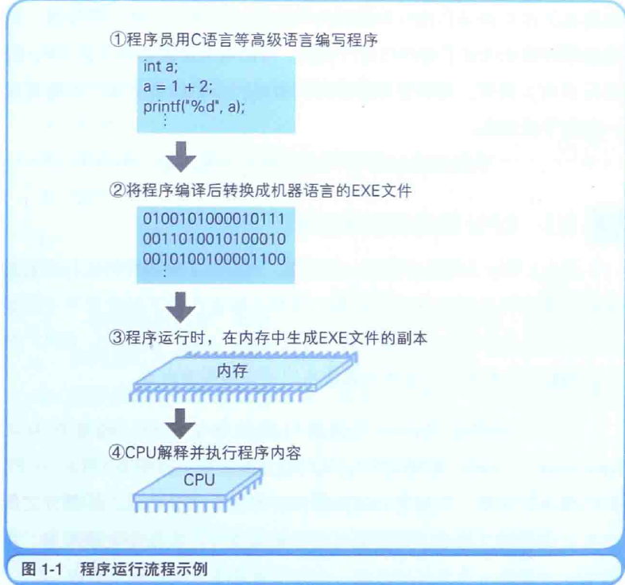

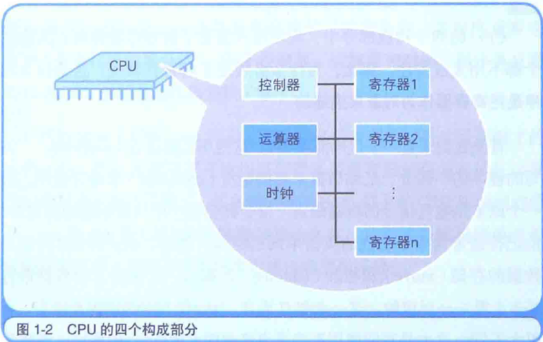

cpu内部是由寄存器、控制器、运行器和时钟四部分组成的，各个部分通过电流信号相互连通。

- 寄存器，可用来暂存指令和数据等处理对象，可以将其视为内存的一种。根据种类的不同，一个CPU内部会有20~100个寄存器；

- 控制器，负责把内存中的指令、数据等读入寄存器，并根据指令的执行结果来控制计算机；

- 运算器，负责运算从内存读入寄存器的数据；

- 时钟，负责发出CPU开始计时的时钟信号。不过有的时钟会位于CPU的外部；

## 1.2 CPU 是寄存器的集合体

核心关注寄存器。程序是把寄存器当作为对象来描述的。

内存的存储场所通过地址编号来区分，而寄存器的种类则通过名字来区分。

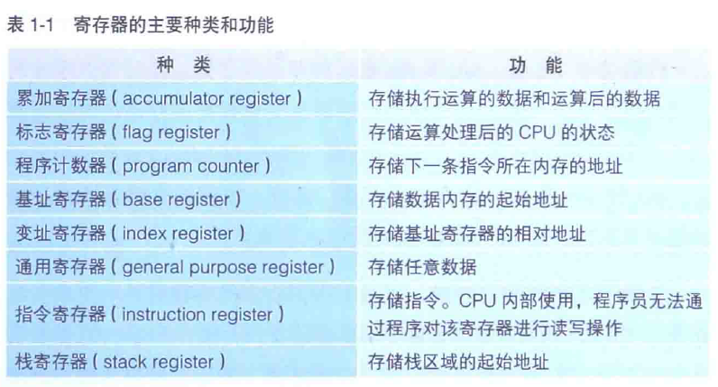

不同类型的CPU，其内部寄存器的数量、种类以及寄存器存储的数据范围都不同。不过大致可以分为8类。可以看出寄存器存储的内容可以是数据或者指令，其中，数据分为“用于计算的数值（放在累加寄存器存储）”和“表示内存地址的数值（基址寄存器和变址寄存器）”两种，数据种类的不同存储该数值的寄存器也不同。

程序计数器、累加寄存器、标志寄存器、指令寄存器和栈寄存器都只有一个，其他寄存器一般由多个。

备注：指令寄存器和栈寄存器可以不做过多关注。

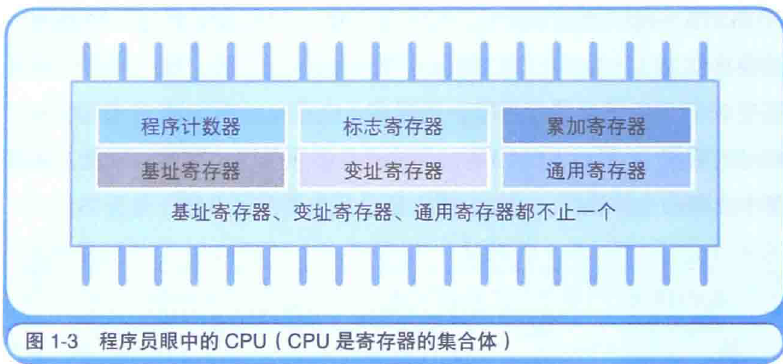

## 1.3 决定程序流程的程序计数器

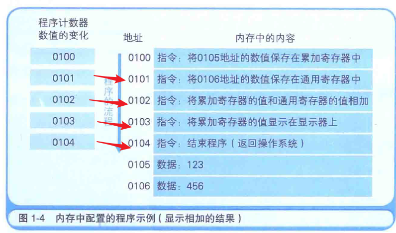

## 1.4 条件分支和循环机制

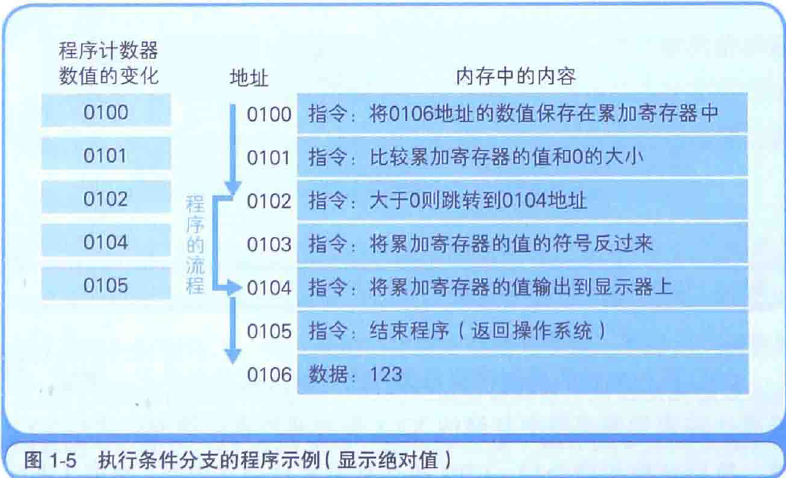

注意：标记寄存器会将当前累计寄存器运算结果是负数、零还是整数使用3个bit来标识。下面是一个32位CPU的标记寄存器。

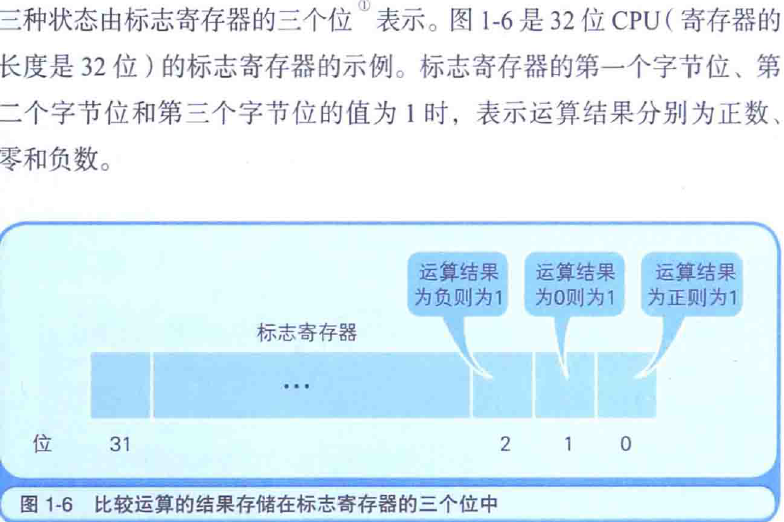

备注：使用跳转指令实现分支和循环的。

## 1.5 函数的调用机制

无论是哪一种语言，函数调用都是把程序计数器的值设置为函数的存储地址来实现的。

注意：机器语言的call指令和return指令来实现函数调用而不是跳转指令。

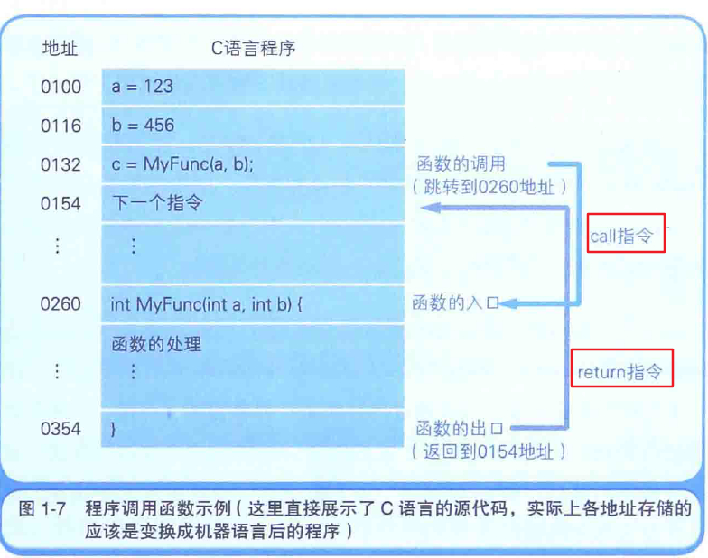

在执行函数调用时，将函数的入口地址设定到程序计数器之前，call指令会把调用函数后要执行的指令地址存储名为栈的主存内。函数处理完毕，在通过函数的出口来执行return指。return命令的功能是把保存在栈中的地址设定到程序计数器中。如图所示，myfunc函数被调用前，0154的地址保存在栈中。myfunc函数处理完毕后，栈中的0154就会被读出来，然后再被设定到程序计数器中。

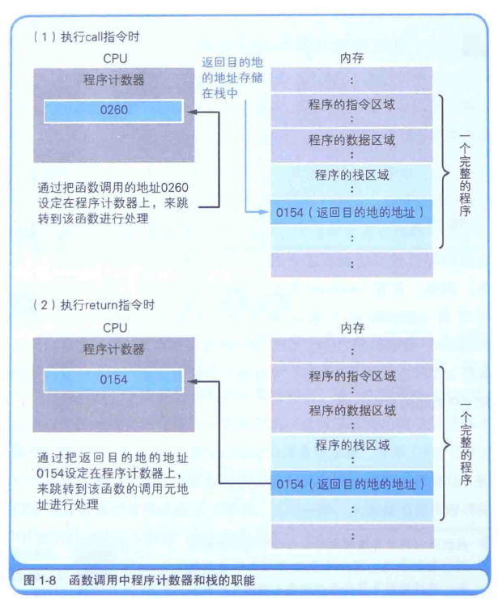

## 1.6 通过地址和索引实现数组

通过基准寄存器和变址寄存器就可以实现对内存上特定区域的内存区域进行划分，从而实现类似数组的操作。

CPU会把基准寄存器+变址寄存器值解释为实际查看的内存地址。这里基准寄存器相当于数组的起始位置，而变址寄存器的值相当于数组的索引值。

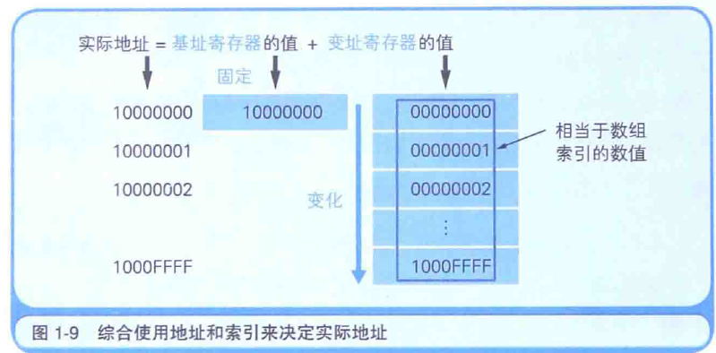

## 1.7 CPU 的处理其实很简单

物理语言有多模高级和复杂，CPU本身可以进行处理的事情其实很简单。

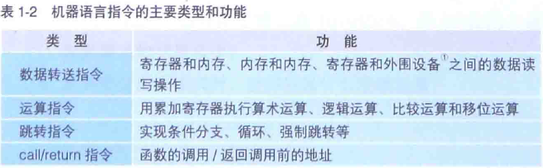

# 第 02 章 数据是用二进制数表示的

## 2.1 用二进制数表示计算机信息的原因

集成电路IC的一个引脚只能表示两种状态，和二进制的特性非常吻合。

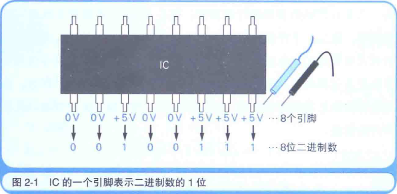

内存和磁盘都使用字节单位来存储和读写数据，因此字节是信息的基本单位。

## 2.4 便于计算机处理的“补数”

计算机内部的减法是通过加法实现的，即加一个负数。

备注：求补数的规则，正数的补数是他本身，负数的补数为对应正数按位取反+1；

> 总结

- 2.2 什么是二进制数

- 2.3 移位运算和乘除运算的关系（可以通过移位操作代替乘除运算）

- 2.5 逻辑右移和算术右移的区别

左移无论是逻辑左移还是算术左移均是补零，而逻辑右移空出来的为是补零，算术右移则需要考虑是正数还是负数，如果是负数需要补1，否则补零。

- 2.6 掌握逻辑运算的窍门（把0、1数字当成false和true来思考）

# 第 03 章 计算机进行小数运算时出错的原因

> 总结

- 3.1 将 0.1 累加 100 次也得不到 10

- 3.2 用二进制数表示小数

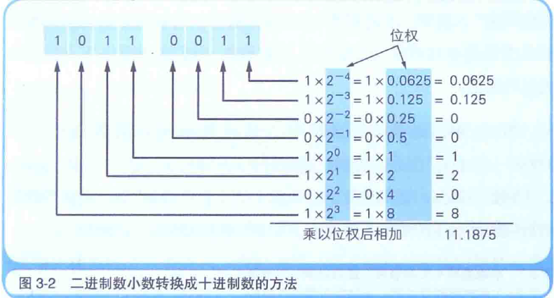

- 3.3 计算机运算出错的原因（有些十进制的小数没法转化为二进制，因为二进制表示的数不连续，只能表示2的次幂---正数或者负数次幂）

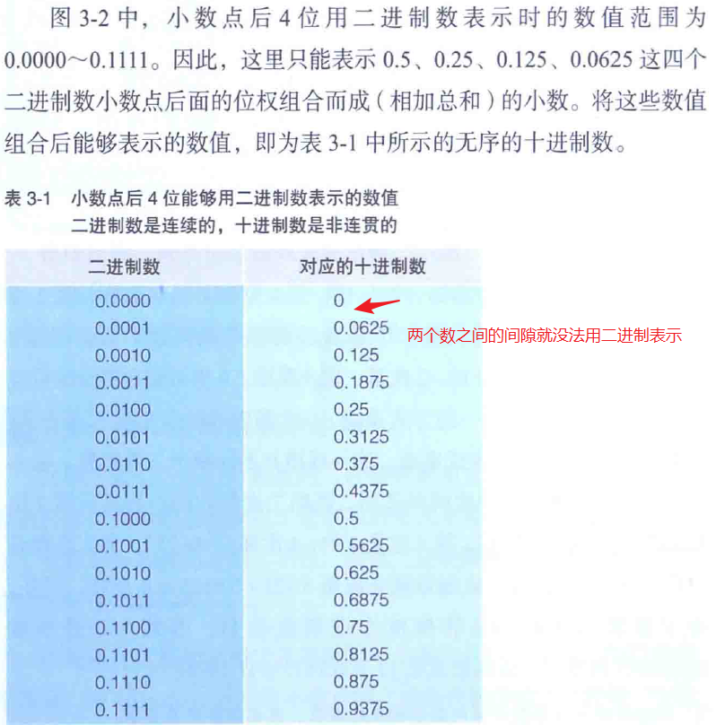

- 3.4 什么是浮点数（计算机内部使用浮点数来表示小数）

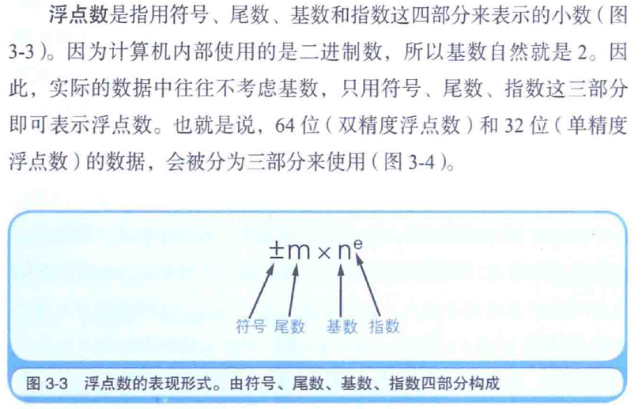

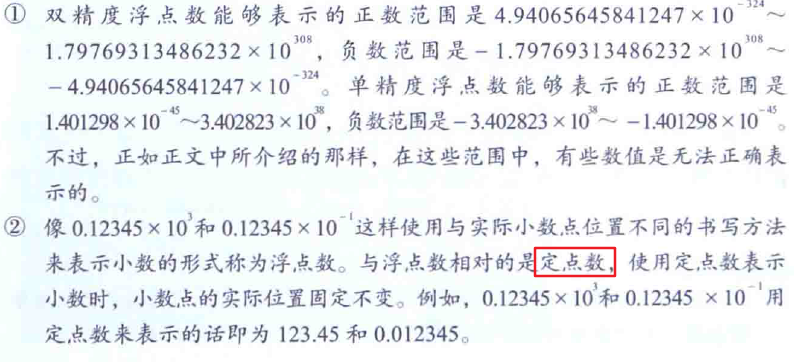

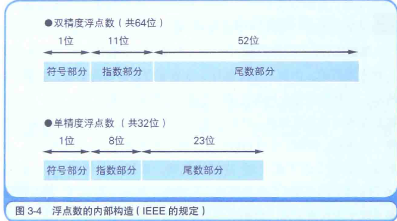

- 3.5 正则表达式和 EXCESS 系统（这里还需要再研究下具体的细节）[todo]

尾数使用正则表达式表示，指数使用EXCESS 系统表示（通过移位中间数字表示0，不使用负数）

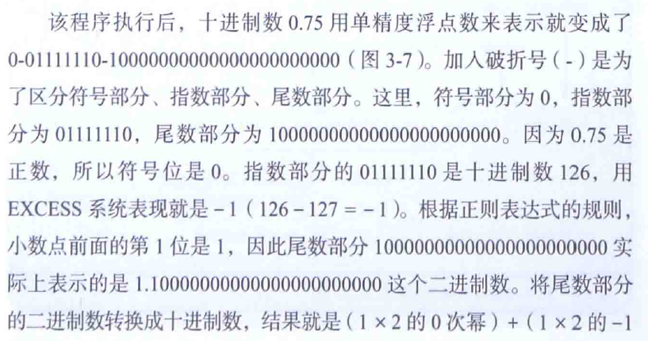

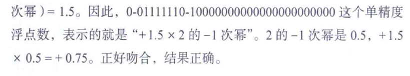

备注：发现0.1和0.75都是使用同一个二进制数表示

- 3.6 在实际的程序中进行确认

- 3.7 如何避免计算机计算出错

- 3.8 二进制数和十六进制数

# 第 04 章 熟练使用有棱有角的内存

高级语言中的数据类型表示的是什么？占据内存区域的大小和存储在该内存区域的数据类型。

## 4.1 内存的物理机制很简单

内存IC包含DRAM,SRAM，ROM等多种形式。内存IC中有电源、地址信号、数据信号、控制信号等用于输入输出的大量引脚，通过为其指定地址，来进行数据的读写。

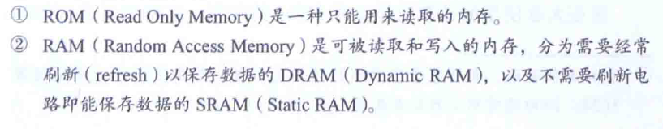

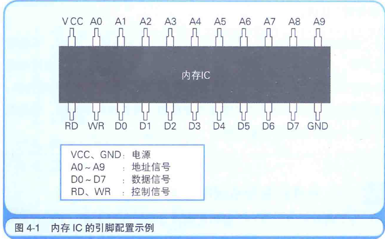

备注：地址信号的引脚数决定了可以表示的内存地址的个数，即内存的大小，这里因为数据信号引脚有8个，一次读写一个字节的数据，地址信号引脚数为10，即可以表示的内存大小为1K。

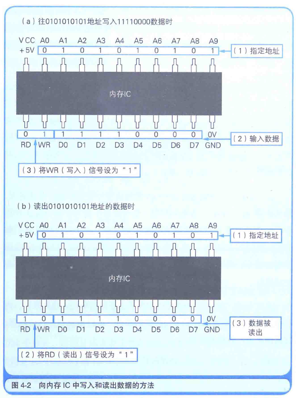

简单来说就是通过地址信号定位数据要读写的位置，然后通过控制信号表示是读还是写操作，最后就是通过数据信号写入或者读取数据。

## 4.2 内存的逻辑模型是楼房

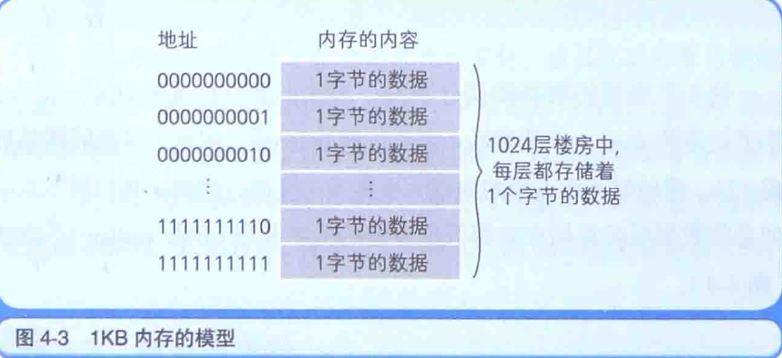

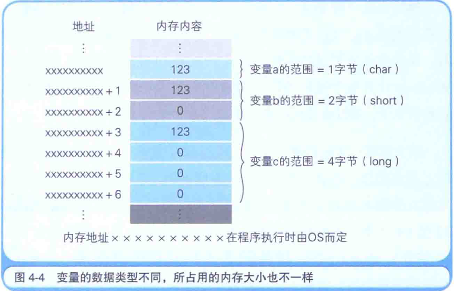

## 4.3 简单的指针

指针表示的不是数据的值而是存储着数据的内存地址。指针的数据类型表示的是从指针存储的地址中一次能够读取的数据字节数。

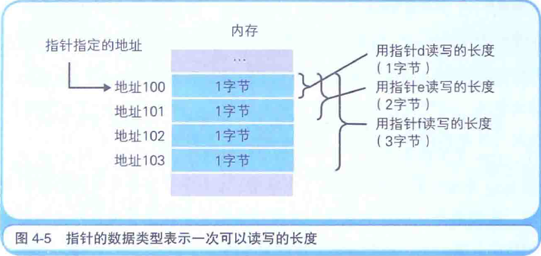

## 4.4 数组是高效使用内存的基础（数组和物理内存的构造是一样的）

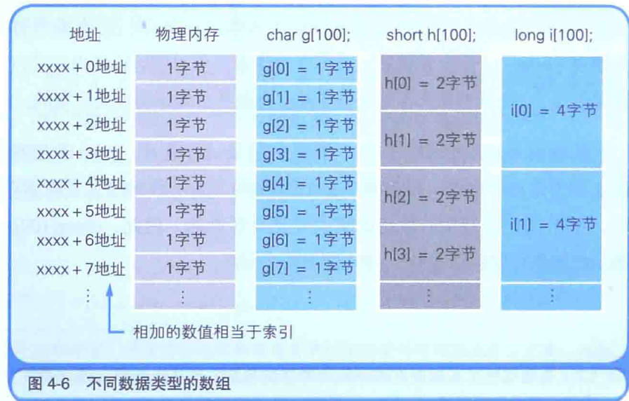

## 4.5 栈、队列以及环形缓冲区

队列一般以环形缓存区的形式实现。

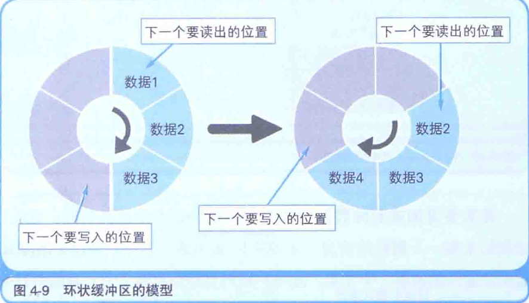

> 总结

- 4.6 链表使元素的追加和删除更容易

- 4.7 二叉查找树使数据搜索更有效

# 第 05 章 内存和磁盘的亲密关系

- 磁盘缓存指的是，把从磁盘读出的数据存储到内存中，当数据被再次读取的时候，不是从磁盘读取而是从内存中高速读取。

- 函数的加载方式由静态链接和动态链接两种；

- Windows，一般磁盘的一个扇区是512字节，扇区是磁盘保存数据的物理单位。

在计算机的五大部件（输入、输出、存储器、运算器和控制器）中，内存和磁盘被归为存储部件。不过利用电流来实现存储的内存，同利用磁效应来实现的存储的磁盘是有区别。

> 总结

- 5.1 不读入内存就无法运行

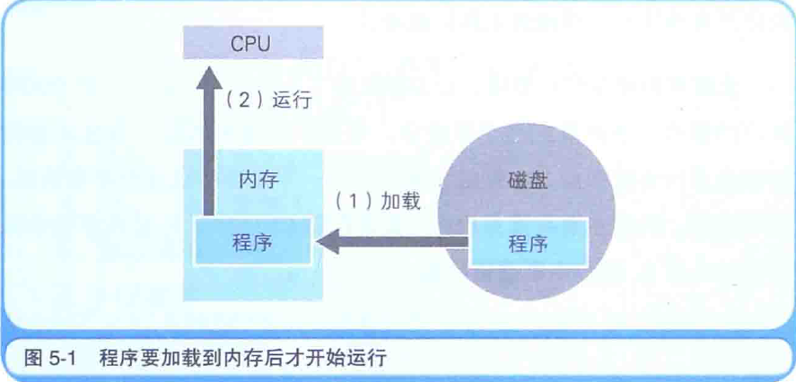

- 5.2 磁盘缓存加快了磁盘访问速度

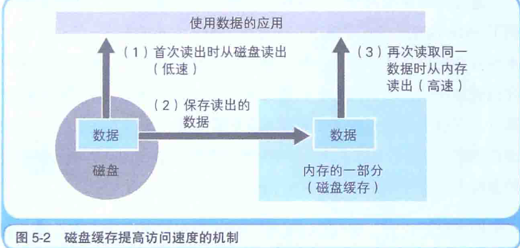

- 5.3 虚拟内存把磁盘作为部分内存来使用

虚拟内存是把磁盘的一部分作为假想的内存来使用。这与磁盘缓存是假想的磁盘（实际是内存）相对，虚拟内存是假想的内存（实际是磁盘）。

虚拟内存分为分页式和分段式，windows采用的是分页式。

分页式指的是，在不考虑程序构造的情况下，把运行的程序按照一定大小的页（page）进行分割，并以页为单位在内存和磁盘间进行置换（swap）。一般情况下，Windows计算机的页大小是4KB，也就是说，把大程序用4KB的页进行分割，并以页为单位放入磁盘（虚拟内存）或内存中。

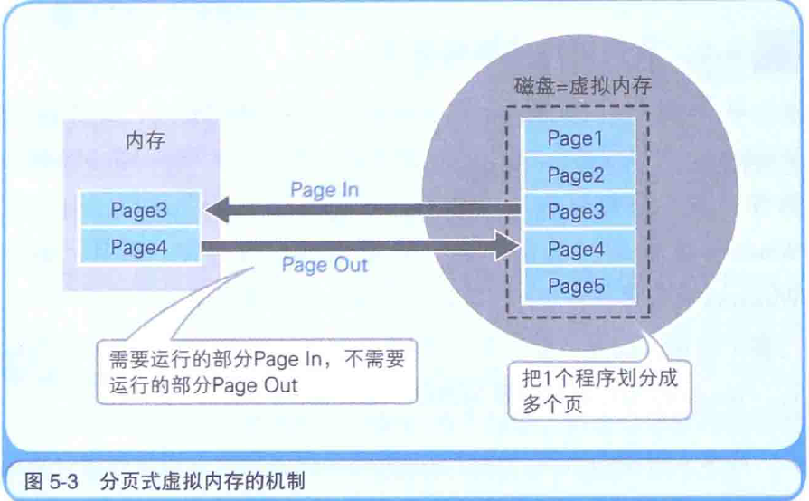

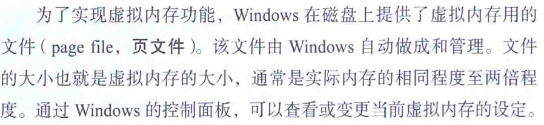

- 5.4 节约内存的编程方法（todo）

把应用程序变小的方法：1、通过DLL文件实现函数公有；2、通过调用_stdcall来减小程序文件的大小；

- 5.5 磁盘的物理结构

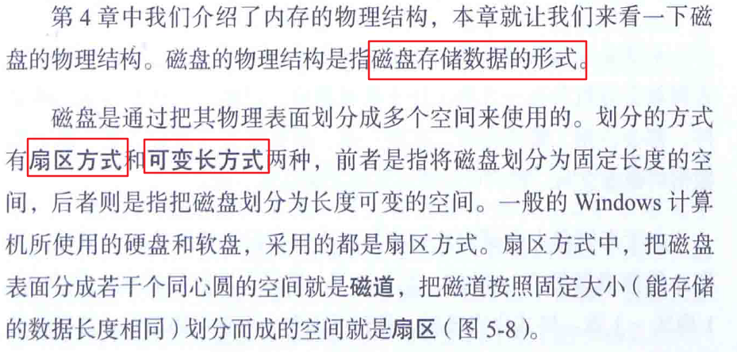

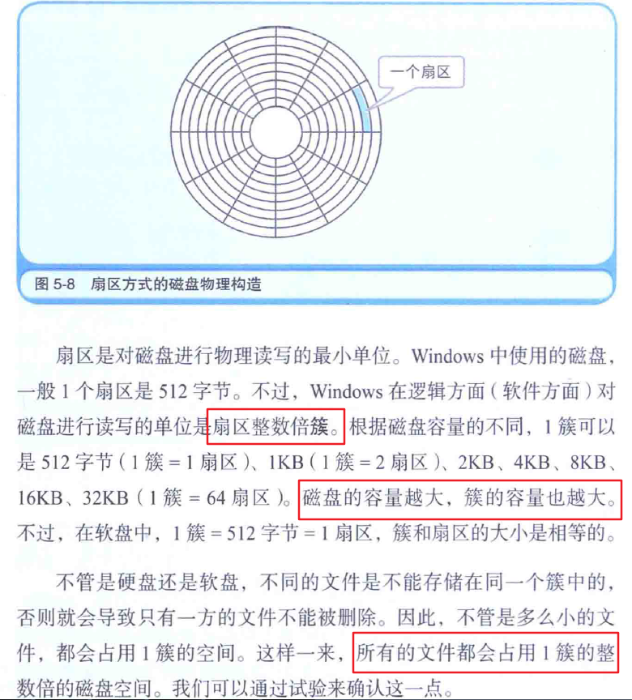

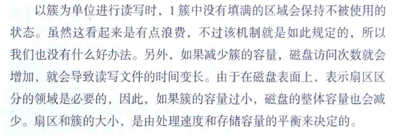

# 第 06 章 亲自尝试压缩数据

> 总结

- 6.1 文件以字节为单位保存

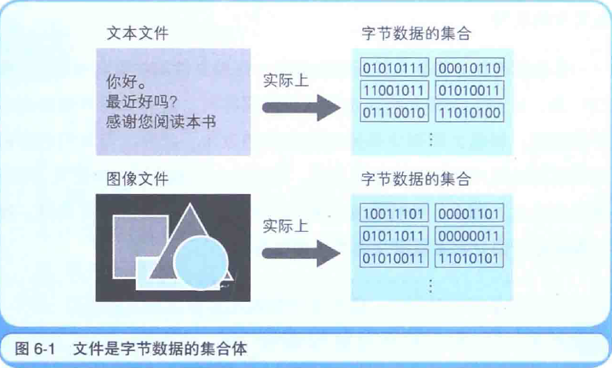

- 6.2 RLE 算法的机制

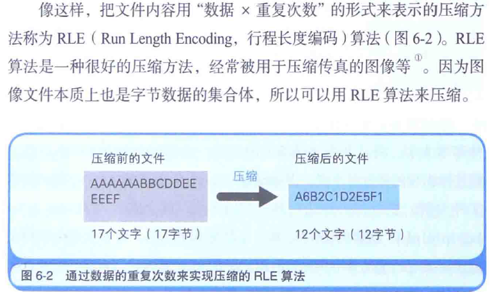

- 6.3 RLE 算法的缺点（不适合文本文件）

- 6.4 通过莫尔斯编码来看哈夫曼算法的基础

哈夫曼编码的核心是：多次出现的数据使用小于8位的字节数来表示，而不常用的数据使用超过8位的字节数来表示。简单来说就是使用短码表示高频数据，长码表示低频数据。

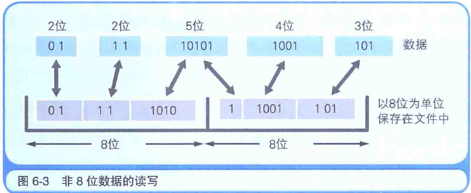

- 6.5 用二叉树实现哈夫曼编码（优化原始的哈夫曼编码）

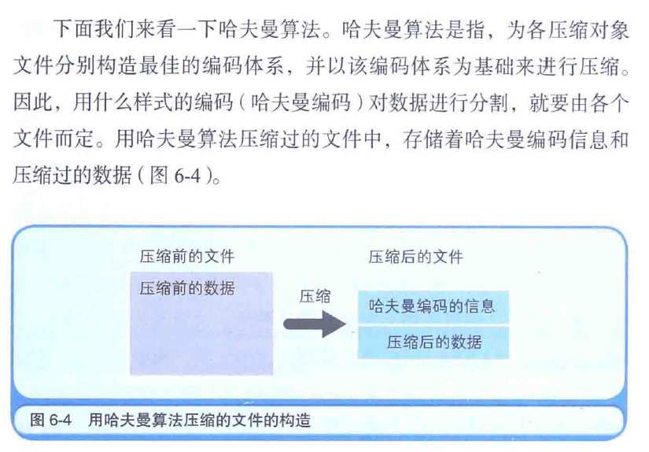

AAAAAABBCDDEEEEEF使用哈夫曼树进行编码的过程

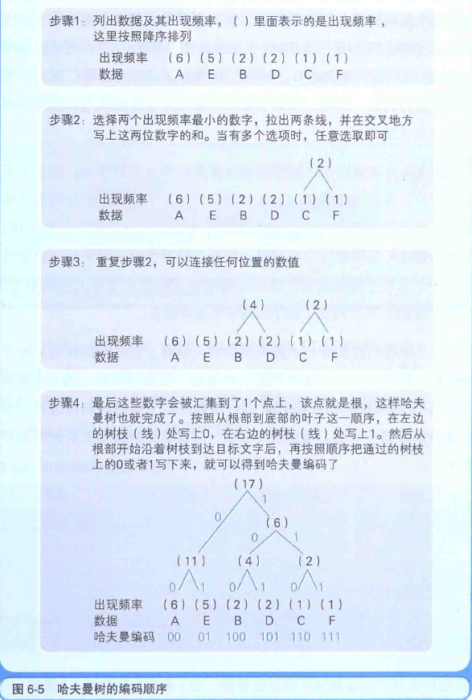

- 6.6 哈夫曼算法能够大幅提升压缩比率

- 6.7 可逆压缩和非可逆压缩

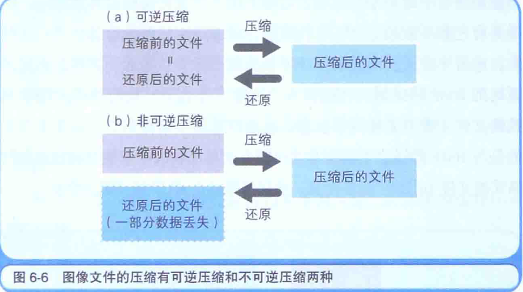

# 第 07 章 程序是在何种环境中运行的

> 总结

- 7.1 运行环境 = 操作系统 ＋ 硬件

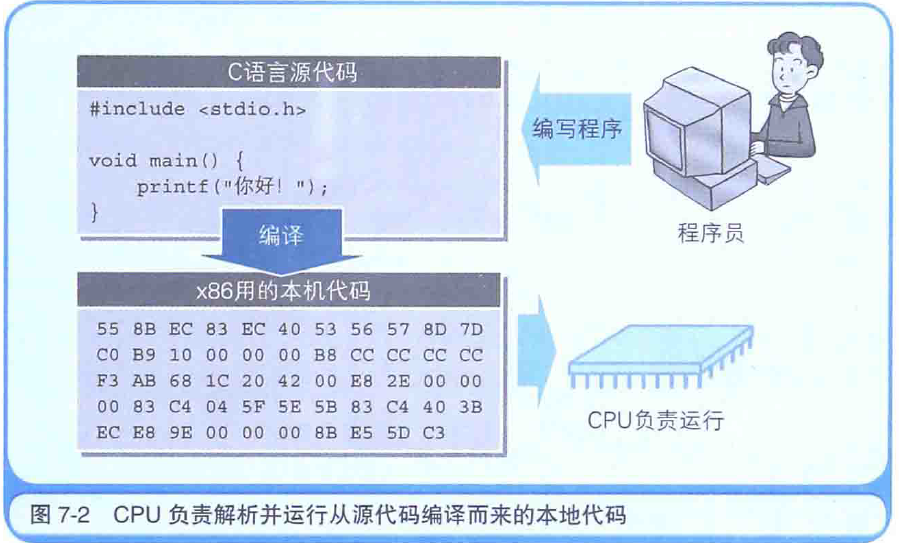

机器语言代码又称为本地代码。不同的CPU类型，机器语言是完全不同的。

- 7.2 Windows 克服了 CPU 以外的硬件差异

- 7.3 不同操作系统的 API 不同

- 7.4 FreeBSD Port 帮你轻松使用源代码

- 7.5 利用虚拟机获得其他操作系统环境

- 7.6 提供相同运行环境的 Java 虚拟机

- 7.7 BIOS（basic input/output system） 和引导

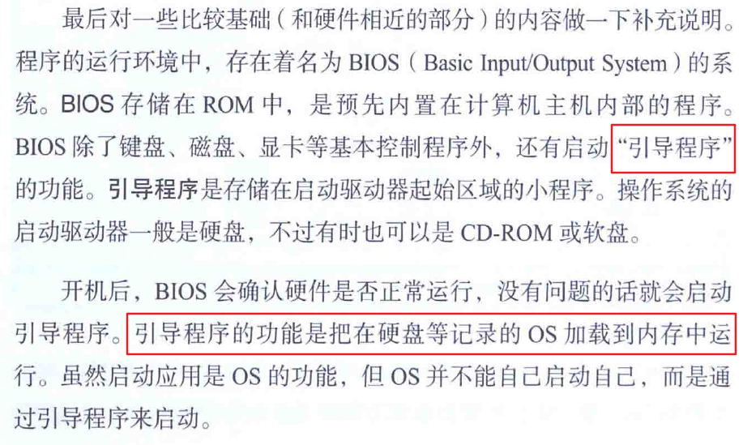

# 第 08 章 从源文件到可执行文件

> 总结

- 8.1 计算机只能运行本地代码（高级语言需要转化为机器码才可以被CPU执行）

- 8.2 本地代码的内容（数字01）

- 8.3 编译器负责转换源代码

- 8.4 仅靠编译是无法得到可执行文件的（编译之后还需要链接处理）

把多个目标文件结合，生成1个EXE文件的处理就是链接。运行链接的程序就是链接器。

- 8.5 启动及库文件

- 8.6 DLL 文件及导入库

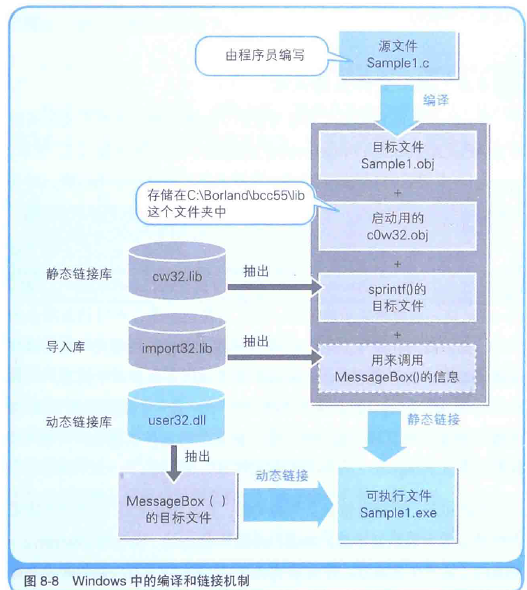

- 8.7 可执行文件运行时的必要条件

- 8.8 程序加载时会生成栈和堆

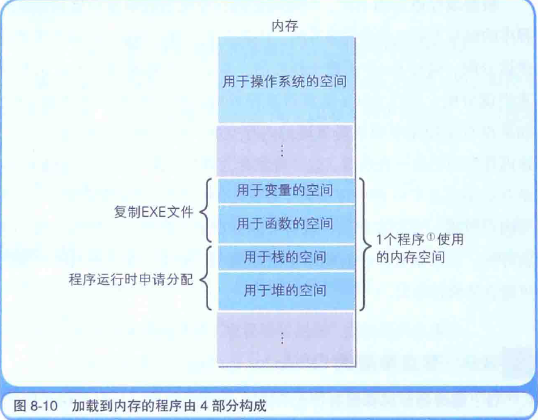

- 8.9 有点难度的 Q&A

# 第 09 章 操作系统和应用的关系

- 调用操作系统的功能叫做？系统调用

> 总结

- 9.1 操作系统功能的历史

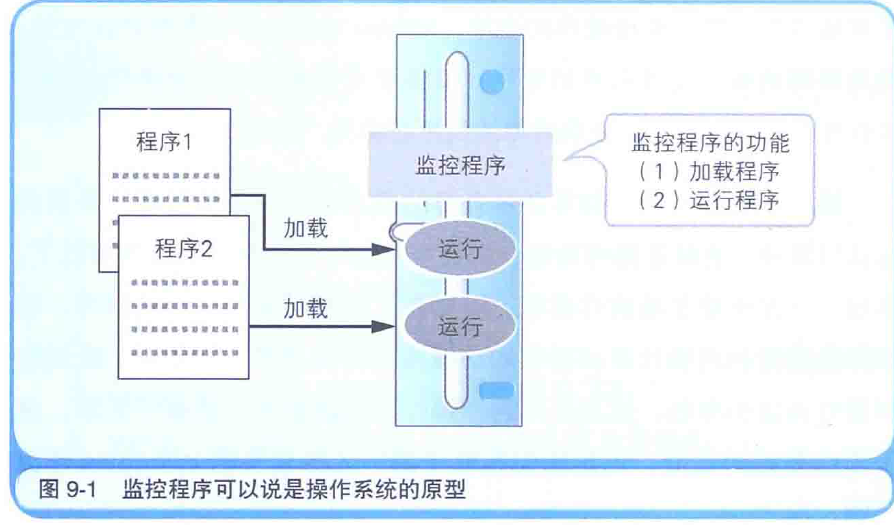

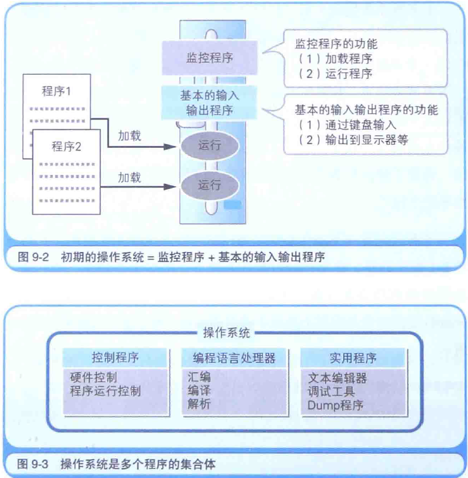

- 9.2 要意识到操作系统的存在

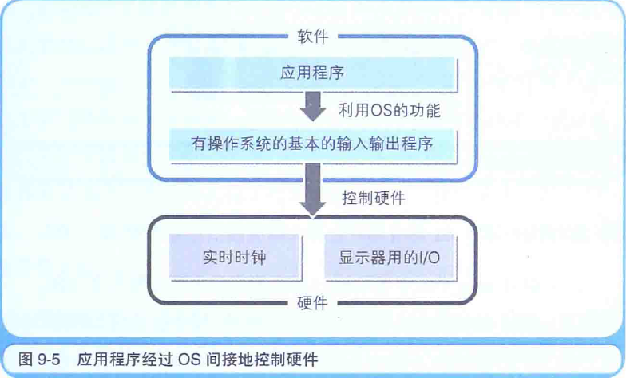

我们自己编写的程序通过操作系统来控制硬件。

- 9.3 系统调用和高级编程语言的移植性

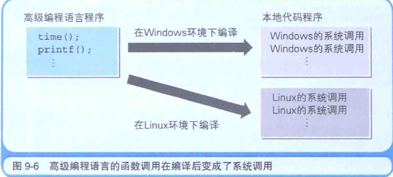

- 9.4 操作系统和高级编程语言使硬件抽象化

- 9.5 Windows 操作系统的特征

# 第 10 章 通过汇编语言了解 程序的实际构成[todo]

> 总结

- 10.1 汇编语言和本地代码是一一对应的

使用助记符的编程语言称为汇编语言。

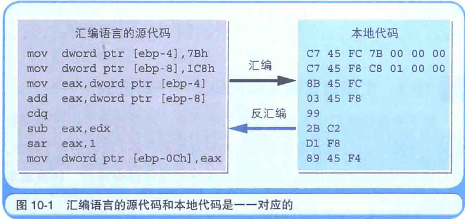

- 10.2 通过编译器输出汇编语言的源代码

- 10.3 不会转换成本地代码的伪指令

- 10.4 汇编语言的语法是“操作码 + 操作数”

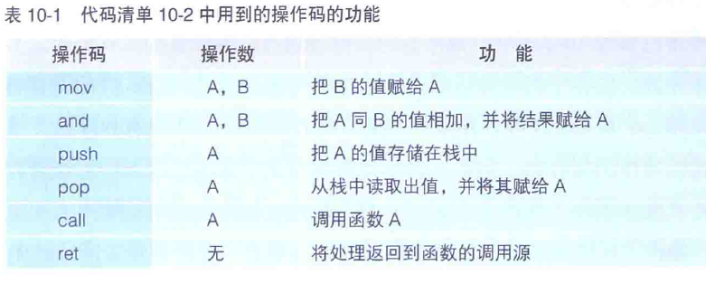

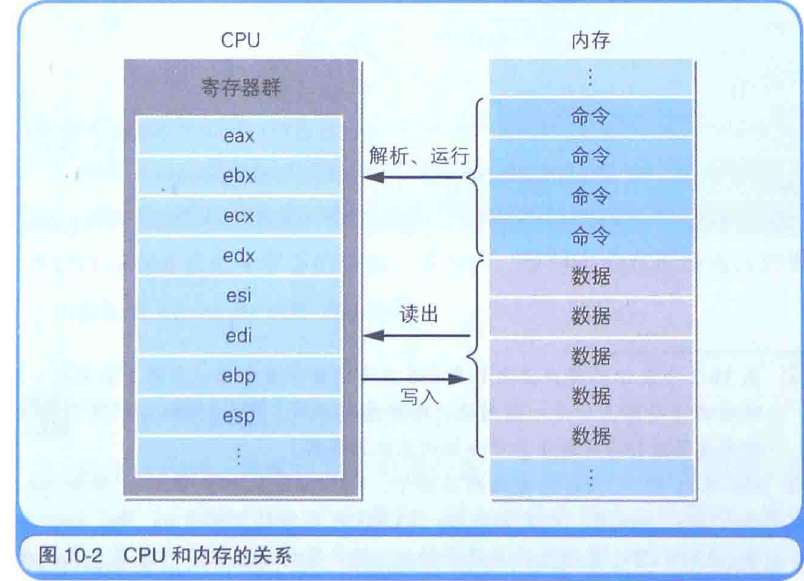

- 10.5 最常用的 mov 指令

- 10.6 对栈进行 push 和 pop

- 10.7 函数调用机制

- 10.8 函数内部的处理

- 10.9 始终确保全局变量用的内存空间

- 10.10 临时确保局部变量用的内存空间

- 10.11 循环处理的实现方法

- 10.12 条件分支的实现方法

- 10.13 了解程序运行方式的必要性

# 第 11 章 硬件控制方法

- IRQ interrupt request 中断请求  执行硬件中断请求的编号；
- DMA direct memory access ，不经过CPU中介的处理，外围设备直接同计算机的主存进行数据的传输；

如何通过程序来控制CPU和主内存以外的硬件呢？

> 总结

- 11.1 应用和硬件无关？

- 11.2 支撑硬件输入输出的 IN 指令和 OUT 指令

in指令通过指定的端口号的端口输入数据，并将其存储到CPU的寄存器中。out指令则是把CPU寄存器中存储的数据，输出到指定端口号的端口。

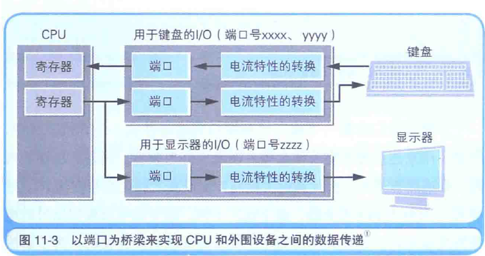

- 11.3 编写测试用的输入输出程序

- 11.4 外围设备的中断请求

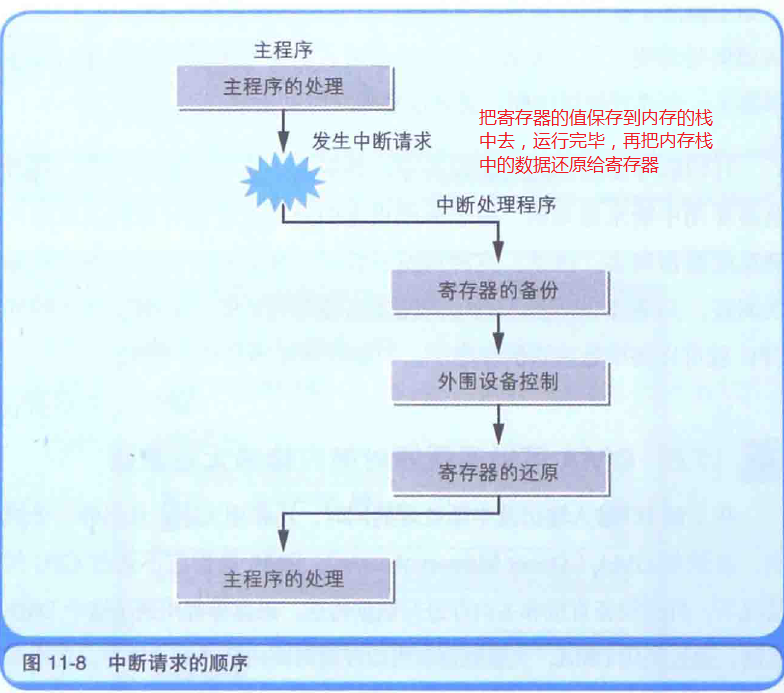

- 11.5 用中断来实现实时处理

- 11.6 DMA 可以实现短时间内传送大量数据

磁盘等都用到了DMA机制。

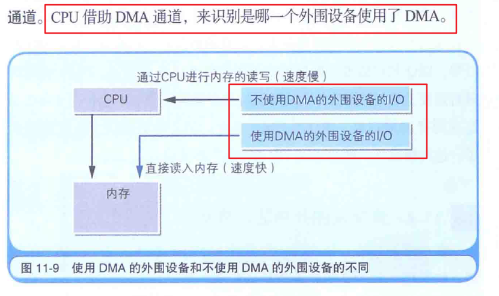

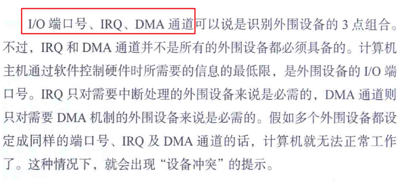

- 11.7 文字及图片的显示机制

显示器显示的信息一直存储在某内存中，称为VRAM（video ram）。之前是主内存的一部分，现在是显卡的一部分。

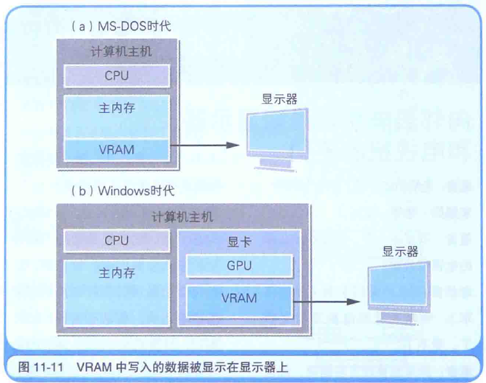

# 第 12 章 让计算机“思考”[todo]

> 总结

- 12.1 作为“工具”的程序和为了“思考”的程序

- 12.2 用程序来表示人类的思考方式

- 12.3 用程序来表示人类的思考习惯

- 12.4 程序生成随机数的方法

- 12.5 活用记忆功能以达到更接近人类的判断

- 12.6 用程序来表示人类的思考方式

> 附录 让我们开始 C 语言之旅

- C 语言的特点

- 变量和函数

- 数据类型

- 标准函数库

- 函数调用

- 局部变量和全局变量

- 数组和循环

- 其他语法结构

