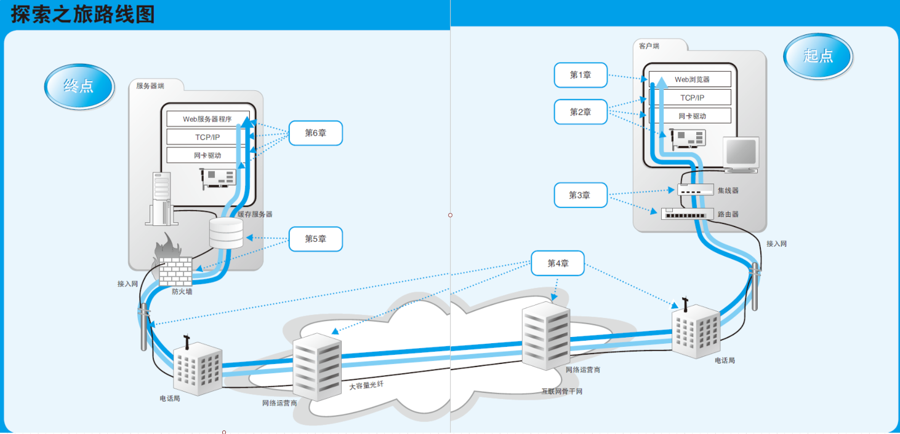
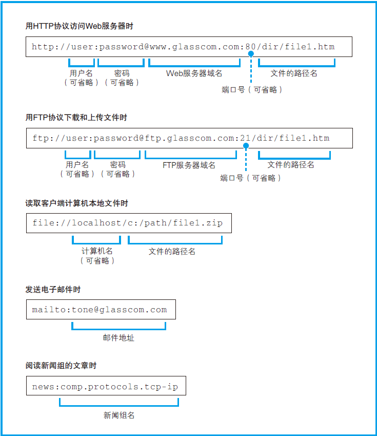
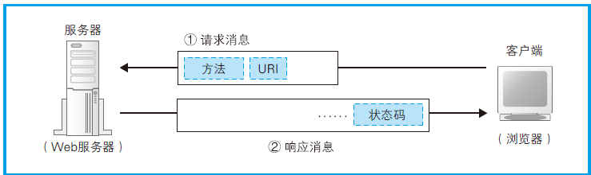
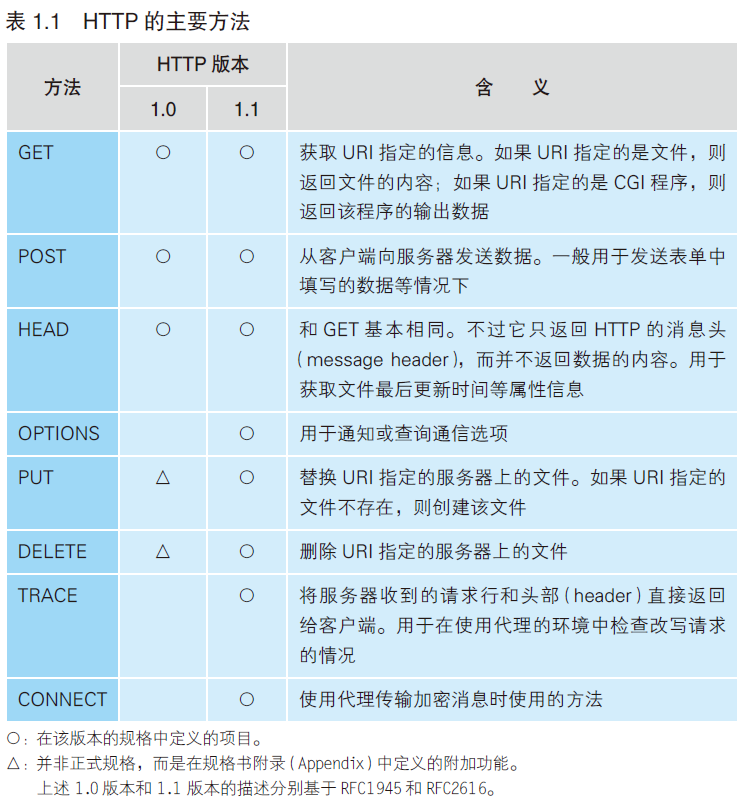
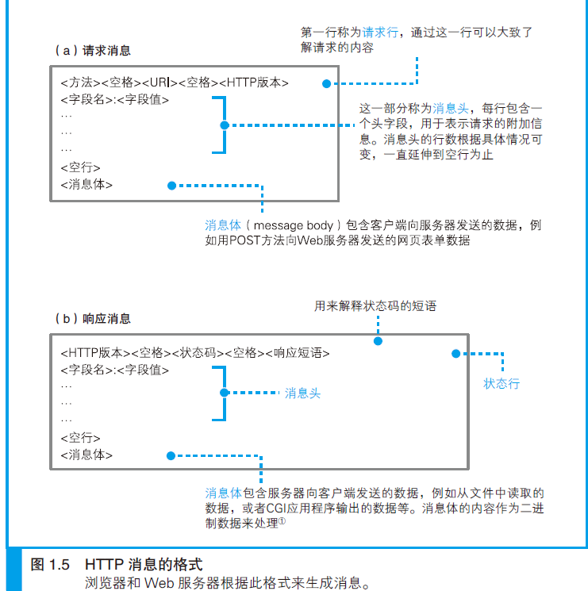
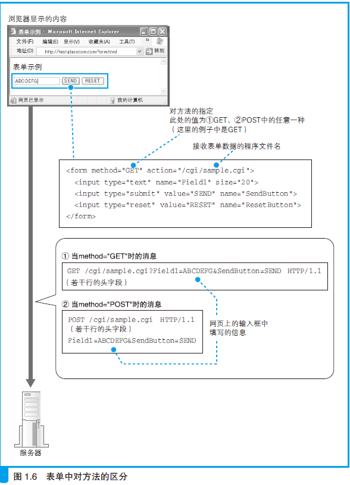

<!-- TOC -->

- [第1章 浏览器生成消息](#第1章-浏览器生成消息)
    - [1.1 生成HTTP请求消息](#11-生成http请求消息)
    - [1.2 向DNS服务器查询Web服务器的IP地址](#12-向dns服务器查询web服务器的ip地址)
    - [1.3 全世界DNS服务器的大接力](#13-全世界dns服务器的大接力)
    - [1.4 委托协议栈发送消息](#14-委托协议栈发送消息)
- [第2章 用电信号传输TCP/IP数据](#第2章-用电信号传输tcpip数据)
- [第3章 从网线到网络设备](#第3章-从网线到网络设备)
- [第4章 通过接入网进入互联网内部](#第4章-通过接入网进入互联网内部)
- [第5章 服务器端的局域网中有什么玄机](#第5章-服务器端的局域网中有什么玄机)
- [第6章 请求到达Web服务器，响应返回浏览器](#第6章-请求到达web服务器响应返回浏览器)

<!-- /TOC -->

备注：[20200518至???]快速阅读笔记

作者：[日]户根勤。译者: 周自恒

> 前言

Wireshark 网络分析的书：《Wireshark 网络分析就这么简单》和《Wireshark 网络分析的艺术》

其实浏览器和Web 服务器之间的交互却很简单，概括如下。

- (1) 浏览器向Web 服务器发送请求。
- (2) Web 服务器根据请求向浏览器发送响应。

> 全流程梳理

1、浏览器生成消息（探索浏览器内部）
- （1）生成HTTP 请求消息
- （2）向DNS 服务器查询Web 服务器的IP 地址
- （3）全世界DNS 服务器的大接力
- （4）委托协议栈发送消息

2、用电信号传输TCP/IP 数据（探索协议栈和网卡）
- （1）创建套接字
- （2）连接服务器
- （3）收发数据
- （4）从服务器断开连接并删除套接字
- （5）IP 与以太网的包收发操作
- （6）用UDP 协议收发数据的操作

3、从网线到网络设备（探索集线器、交换机和路由器）
- （1）信号在网线和集线器中传输
- （2）交换机的包转发操作
- （3）路由器的包转发操作
- （4）路由器的附加功能

4、通过接入网进入互联网内部（探索接入网和网络运营商）
- （1）ADSL 接入网的结构和工作方式
- （2）光纤接入网（FTTH）
- （3）接入网中使用的PPP 和隧道
- （4）网络运营商的内部
- （5）跨越运营商的网络包

5、服务器端的局域网中有什么玄机
- （1）Web 服务器的部署地点
- （2）防火墙的结构和原理
- （3）通过将请求平均分配给多台服务器来平衡负载
- （4）利用缓存服务器分担负载
- （5）内容分发服务

6、请求到达Web 服务器，响应返回浏览器（短短几秒的“漫长旅程”迎来终点）
- （1）服务器概览
- （2）服务器的接收操作
- （3）Web 服务器程序解释请求消息并作出响应
- （4）浏览器接收响应消息并显示内容

# 第1章 浏览器生成消息

## 1.1 生成HTTP请求消息　　

HTTP：Hypertext Transfer Protocol，超文本传送协议。

FTP：File Transfer Protocol，文件传送协议。

互联网中常见的几种URL，根据访问目标的不同，URL 的写法也会不同。

浏览器是一个具备多种客户端功能的综合性客户端软件，因此它需要一些东西来判断应该使用其中哪种功能来访问相应的数据，而各种不同的URL（URL：Uniform Resource Locator，统一资源定位符）就是用来干这个的。

　
> 1.1.4、HTTP的基本思路　　

HTTP 协议定义了客户端和服务器之间交互的消息内容和步骤，其基本思路非常简单。首先，客户端会向服务器发送请求消息。请求消息中包含的内容是“对什么”和“进行怎样的操作”两个部分。此外，HTTP 消息中还有一些用来表示附加信息的头字段。客户端向Web 服务器发送数据时，会先发送头字段，然后再发送数据。不过，头字段属于可有可无的附加信息。

- “对什么”的部分称为URI。

- “进行怎样的操作”的部分称为方法。方法表示需要让Web 服务器完成怎样的工作。

> 1.1.5、生成HTTP请求消息　　

备注：消息体的格式会通过消息头中的Content-Type 字段来定义（MIME 类型）。GET 方法能够发送的数据只有几百个字节，如果表单中的数据超过这一长度，则必须使用POST 方法来发送。

> 1.1.6 发送请求后会收到响应　　

## 1.2 向DNS服务器查询Web服务器的IP地址　　
1.2.1 IP地址的基本知识　　
1.2.2 域名和IP地址并用的理由　　
1.2.3 Socket库提供查询IP地址的功能　　
1.2.4 通过解析器向DNS服务器发出查询　　
1.2.5 解析器的内部原理　　
## 1.3 全世界DNS服务器的大接力　　
1.3.1 DNS服务器的基本工作　　
1.3.2 域名的层次结构　　
1.3.3 寻找相应的DNS服务器并获取IP地址　　
1.3.4 通过缓存加快DNS服务器的响应　　
## 1.4 委托协议栈发送消息　　
1.4.1 数据收发操作概览　　
1.4.2 创建套接字阶段　　
1.4.3 连接阶段：把管道接上去　　
1.4.4 通信阶段：传递消息　　
1.4.5 断开阶段：收发数据结束　　

# 第2章 用电信号传输TCP/IP数据　　

关键词：TCP/IP、套接字、协议栈、IP地址、端口号、包、头部、网卡、网卡驱动、MAC地址、以太网控制器、ICMP、UDP

——探索协议栈和网卡
2.1 创建套接字　　61
2.1.1　协议栈的内部结构　　61
2.1.2 套接字的实体就是通信控制信息　　63
2.1.3 调用socket时的操作　　66
2.2 连接服务器　　68
2.2.1 连接是什么意思　　68
2.2.2 负责保存控制信息的头部　　70
2.2.3 连接操作的实际过程　　73
2.3 收发数据　　75
2.3.1 将HTTP请求消息交给协议栈　　75
2.3.2 对较大的数据进行拆分　　78
2.3.3 使用ACK号确认网络包已收到　　79
2.3.4 根据网络包平均往返时间调整ACK号等待时间　　83
2.3.5 使用窗口有效管理ACK号　　84
2.3.6 ACK与窗口的合并　　87
2.3.7 接收HTTP响应消息　　89
2.4 从服务器断开并删除套接字　　90
2.4.1 数据发送完毕后断开连接　　90
2.4.2 删除套接字　　92
2.4.3 数据收发操作小结　　93
2.5 IP与以太网的包收发操作　　95
2.5.1 包的基本知识　　95
2.5.2 包收发操作概览　　99
2.5.3 生成包含接收方IP地址的IP头部　　102
2.5.4 生成以太网用的MAC头部　　106
2.5.5 通过ARP查询目标路由器的MAC地址　　108
2.5.6 以太网的基本知识　　111
2.5.7 将IP包转换成电或光信号发送出去　　114
2.5.8 给网络包再加3个控制数据　　116
2.5.9 向集线器发送网络包　　120
2.5.10 接收返回包　　123
2.5.11 将服务器的响应包从IP传递给TCP　　125
2.6 UDP协议的收发操作　　128
2.6.1 不需要重发的数据用UDP发送更高效　　128
2.6.2 控制用的短数据　　129
2.6.3 音频和视频数据　　130
插进Socket里的是灯泡还是程序　　132

# 第3章 从网线到网络设备　　

关键词：局域网（LAN）、双绞线、串扰、中继式集线器、MDI、MDI-X、交换式集线器、全双工、半双工、碰撞、自动协商、路由器、路由表、子网掩码、默认网关、分片、地址转换、公有地址、私有地址

——探索集线器、交换机和路由器
3.1 信号在网线和集线器中传输　　139
3.1.1 每个包都是独立传输的　　139
3.1.2 防止网线中的信号衰减很重要　　140
3.1.3 “双绞”是为了抑制噪声　　141
3.1.4 集线器将信号发往所有线路　　146
3.2 交换机的包转发操作　　149
3.2.1 交换机根据地址表进行转发　　149
3.2.2 MAC地址表的维护　　153
3.2.3 特殊操作　　154
3.2.4 全双工模式可以同时进行发送和接收　　155
3.2.5 自动协商：确定最优的传输速率　　156
3.2.6 交换机可同时执行多个转发操作　　159
3.3 路由器的包转发操作　　159
3.3.1 路由器的基本知识　　159
3.3.2 路由表中的信息　　162
3.3.3 路由器的包接收操作　　166
3.3.4 查询路由表确定输出端口　　166
3.3.5 找不到匹配路由时选择默认路由　　168
3.3.6 包的有效期　　169
3.3.7 通过分片功能拆分大网络包　　170
3.3.8 路由器的发送操作和计算机相同　　172
3.3.9 路由器与交换机的关系　　173
3.4 路由器的附加功能　　176
3.4.1 通过地址转换有效利用IP地址　　176
3.4.2 地址转换的基本原理　　178
3.4.3 改写端口号的原因　　180
3.4.4 从互联网访问公司内网　　181
3.4.5 路由器的包过滤功能　　182
集线器和路由器，换个名字身价翻倍？　　184

# 第4章 通过接入网进入互联网内部　

关键词：ADSL、FTTH、光纤、接入网、ADSL Modem集成式路由器、ATM、信元、正交振幅调制、分离器、DSLAM、宽带接入服务器、远程接入服务器、PPP、网络运行中心（NOC）、光纤、IX（Internet􀀀eXchange，互联网交换）

——探索接入网和网络运营商
4.1 ADSL接入网的结构和工作方式　　191
4.1.1 互联网的基本结构和家庭、公司网络是相同的　　191
4.1.2 连接用户与互联网的接入网　　192
4.1.3 ADSL Modem将包拆分成信元　　193
4.1.4 ADSL将信元“调制”成信号　　197
4.1.5 ADSL通过使用多个波来提高速率　　200
4.1.6 分离器的作用　　201
4.1.7 从用户到电话局　　203
4.1.8 噪声的干扰　　204
4.1.9 通过DSLAM到达BAS　　205
4.2 光纤接入网（FTTH）　　206
4.2.1 光纤的基本知识　　206
4.2.2 单模与多模　　208
4.2.3 通过光纤分路来降低成本　　213
4.3 接入网中使用的PPP和隧道　　217
4.3.1 用户认证和配置下发　　217
4.3.2 在以太网上传输PPP消息　　219
4.3.3 通过隧道将网络包发送给运营商　　223
4.3.4 接入网的整体工作过程　　225
4.3.5 不分配IP地址的无编号端口　　228
4.3.6 互联网接入路由器将私有地址转换成公有地址　　228
4.3.7 除PPPoE之外的其他方式　　230
4.4 网络运营商的内部　　233
4.4.1 POP和NOC　　233
4.4.2 室外通信线路的连接　　236
4.5 跨越运营商的网络包　　238
4.5.1 运营商之间的连接　　238
4.5.2 运营商之间的路由信息交换　　239
4.5.3 与公司网络中自动更新路由表机制的区别　　241
4.5.4 IX的必要性　　242
4.5.5 运营商如何通过IX互相连接　　243
名字叫服务器，其实是路由器　　246

# 第5章 服务器端的局域网中有什么玄机

防火墙、包过滤、数据中心、轮询、负载均衡器、缓存服务器、代理、代理服务器、内容分发服务、重定向

5.1 Web服务器的部署地点　　253
5.1.1 在公司里部署Web服务器　　253
5.1.2 将Web服务器部署在数据中心　　255
5.2 防火墙的结构和原理　　256
5.2.1 主流的包过滤方式　　256
5.2.2 如何设置包过滤的规则　　256
5.2.3 通过端口号限定应用程序　　260
5.2.4 通过控制位判断连接方向　　260
5.2.5 从公司内网访问公开区域的规则　　262
5.2.6 从外部无法访问公司内网　　262
5.2.7 通过防火墙　　263
5.2.8 防火墙无法抵御的攻击　　264
5.3 通过将请求平均分配给多台服务器来平衡负载　　265
5.3.1 性能不足时需要负载均衡　　265
5.3.2 使用负载均衡器分配访问　　266
5.4 使用缓存服务器分担负载　　270
5.4.1 如何使用缓存服务器　　270
5.4.2 缓存服务器通过更新时间管理内容　　271
5.4.3 最原始的代理——正向代理　　276
5.4.4 正向代理的改良版——反向代理　　278
5.4.5 透明代理　　279
5.5 内容分发服务　　280
5.5.1 利用内容分发服务分担负载　　280
5.5.2 如何找到最近的缓存服务器　　282
5.5.3 通过重定向服务器分配访问目标　　285
5.5.4 缓存的更新方法会影响性能　　287
当通信线路变成局域网　　291

# 第6章 请求到达Web服务器，响应返回浏览器

响应消息、多任务、多线程、虚拟目录、CGI、表单、访问控制、密码、数据格式、MIME

——短短几秒的“漫长旅程”迎来终点
6.1 服务器概览　　297
6.1.1 客户端与服务器的区别　　297
6.1.2 服务器程序的结构　　297
6.1.3 服务器端的套接字和端口号　　299
6.2 服务器的接收操作　　305
6.2.1 网卡将接收到的信号转换成数字信息　　305
6.2.2 IP模块的接收操作　　308
6.2.3 TCP模块如何处理连接包　　309
6.2.4 TCP模块如何处理数据包　　311
6.2.5 TCP模块的断开操作　　312
6.3 Web服务器程序解释请求消息并作出响应　　313
6.3.1 将请求的URI转换为实际的文件名　　313
6.3.2 运行CGI程序　　316
6.3.3 Web服务器的访问控制　　319
6.3.4 返回响应消息　　323
6.4 浏览器接收响应消息并显示内容　　323
6.4.1 通过响应的数据类型判断其中的内容　　323
6.4.2 浏览器显示网页内容！访问完成！　　326
Gateway是通往异世界的入口　　328

