<!-- TOC -->

- [01、计算机的三大原则](#01计算机的三大原则)
    - [1.1　计算机的三个根本性基础](#11　计算机的三个根本性基础)
        - [1.计算机是执行输入、运算、输出的机器](#1计算机是执行输入运算输出的机器)
        - [2.程序是指令和数据的集合](#2程序是指令和数据的集合)
        - [3.计算机的处理方式有时与人们的思维习惯不同](#3计算机的处理方式有时与人们的思维习惯不同)
- [02、试着制造一台计算机吧](#02试着制造一台计算机吧)
- [03、体验一次手工汇编](#03体验一次手工汇编)
    - [3.1　从程序员的角度看硬件](#31　从程序员的角度看硬件)
    - [3.2　机器语言和汇编语言](#32　机器语言和汇编语言)
    - [3.3　Z80 CPU 的寄存器结构](#33　z80-cpu-的寄存器结构)
- [04、程序像河水一样流动着](#04程序像河水一样流动着)
    - [4.1　程序的流程分为三种](#41　程序的流程分为三种)
        - [1、顺序执行](#1顺序执行)
        - [2、循环](#2循环)
        - [3、分支](#3分支)
    - [4.6　特殊的程序流程——中断处理](#46　特殊的程序流程中断处理)
    - [4.7　特殊的程序流程——事件驱动](#47　特殊的程序流程事件驱动)
- [05、与算法成为好朋友的七个要点](#05与算法成为好朋友的七个要点)
- [06、与数据结构成为好朋友的七个要点](#06与数据结构成为好朋友的七个要点)
    - [6.1　要点1 ：了解内存和变量的关系](#61　要点1-了解内存和变量的关系)
    - [6.2　要点2 ：了解作为数据结构基础的数组](#62　要点2-了解作为数据结构基础的数组)
- [07、成为会使用面向对象编程的程序员吧](#07成为会使用面向对象编程的程序员吧)
- [08、一用就会的数据库](#08一用就会的数据库)
    - [8.2　数据文件、DBMS 和数据库应用程序](#82　数据文件dbms-和数据库应用程序)
- [09、通过七个简单的实验理解TCP/IP 网络](#09通过七个简单的实验理解tcpip-网络)
- [10、试着加密数据吧](#10试着加密数据吧)
- [11、XML 究竟是什么](#11xml-究竟是什么)
- [12、SE 负责监管计算机系统的构建（se觉得相当于架构师的角色）](#12se-负责监管计算机系统的构建se觉得相当于架构师的角色)

<!-- /TOC -->

备注：20200516一天快速阅读笔记

# 01、计算机的三大原则 

- 初级问题：硬件和软件的区别是什么？

硬件是看得见摸得着的设备，比如计算机主机、显示器、键盘等。而软件是计算机所执行的程序，即指令和数据。软件本身是看不见的。

- 中级问题：存储字符串“中国”需要几个字节？

存储汉字时，字符编码不同，汉字所占用的字节数也就不同。在GBK 字符编码下，一个汉字占用2 个字节。而在UTF-8 字符编码下，一个汉字占用3 个字节。

- 高级问题：什么是编码（Code）？

通常将为了便于计算机处理而经过数字化处理的信息称作编码。

## 1.1　计算机的三个根本性基础

### 1.计算机是执行输入、运算、输出的机器

输入、运算、输出是硬件的基础

### 2.程序是指令和数据的集合

所谓指令，就是控制计算机进行输入、运算、输出的命令。把向计算机发出的指令一条条列出来，就得到了程序。

程序中的数据分为两类，一类是作为指令执行对象的输入数据，一类是从指令的执行结果得到的输出数据。

软件是指令和数据的集合

### 3.计算机的处理方式有时与人们的思维习惯不同

> 总结

- 1.4　对计算机来说什么都是数字

计算机内部会先把文字等信息转换成相应的数字再做处理，这样的数字叫作“字符编码”。

- 1.6　为了贴近人类，计算机在不断地进化

计算机硬件的组成要素

核心三种：CPU（处理器）、内存以及I/O。

CPU 是计算机的大脑，在其内部可对数据执行运算并控制内存和I/O。内存用于存储指令和数据。I/O 负责把键盘、鼠标、显示器等周边设备和主机连接在一起，实现数据的输入与输出。

# 02、试着制造一台计算机吧

- 初级问题：CPU 是什么的缩写？

CPU 是Central Processing Unit（中央处理器）的缩写。

- 中级问题：Hz 是表示什么的单位？

Hz（赫兹）是频率的单位。通常用Hz 来表示驱动CPU 运转的时钟信号的频率。1秒发出1 次时钟信号就是1Hz，所以100MHz（兆赫兹）的话就是100×100 万 = 1 亿次／秒。M（兆）代表100 万。

- 高级问题：Z80 CPU 是多少比特的CPU ？

Z80 CPU 是8 比特的CPU。CPU 上数据总线的条数，或者CPU 内部参与运算的寄存器的容量，都可以作为衡量CPU 性能的比特数。在Z80 CPU 中，无论是数据总线的条数还是寄存器的容量都是8 比特，所以Z80 CPU 是一款8 比特的CPU。而在Windows 个人计算机中广泛使用的Pentium（奔腾） CPU 则是32 比特的CPU。

> 总结

- 1、数据总线和地址总线

数据总线的宽度表示一次可以读取的bit数，地址总线的宽度可以表示总共的地址空间有多大（内存存储单元或I/O 地址）

- 2、总线是连接到CPU 中数据引脚、地址引脚、控制引脚上的电路的统称。

- 3、不经过CPU 而直接从外部设备读写内存的行为叫作DMA（Direct Memory Access，直接存储器访问）。在诸位所使用的个人计算机里，硬盘等设备要读写内存时使用的就是DMA。

- 4、计算机的工作原理非常简单。CPU在时钟信号的控制下解释、执行内存中存储的程序，按照程序中的指令从内存或I/O 中把数据输入到CPU 中，在CPU 内部进行运算，再把运算结果输出到内存或I/O 中。无论是小型的微型计算机，还是高性能的个人计算机，其工作原理都是相同的。

- 5、程序是指令和数据的集合，表示指令或数据的数值是以8 比特为一个单位存储到内存中的。（这里的8bit应该和内存宽度相关？？？）

# 03、体验一次手工汇编

- 初级问题： 什么是机器语言？

由二进制数字构成的程序，CPU 可以直接对其解释、执行。不仅是汇编语言，用C 语言、Java、BASIC 等编程语言编写的程序，也都需要先转换成机器语言才能被执行。机器语言有时也叫作“原生代码”（Native Code）。

- 中级问题： 通常把标识内存或I/O 中存储单元的数字称作什么？

标识内存或I/O 中存储单元的数字叫作“地址”。内存中有多个数据存储单元。计算机用从0 开始的编号标识每个存储单元，这些编号就是地址（Address）。I/O 中的寄存器也可以用地址来标识。哪个寄存器对应哪个地址，取决于CPU 和I/O 之间的布线方式。

- 高级问题： CPU 中的标志寄存器（Flags Register）有什么作用？

用于在运算指令执行后，存储运算结果的某些状态。一旦执行了算术运算、逻辑运算、比较运算等指令后，标志寄存器并不会存放运算结果的值，而是会把运算后的某些状态存储起来，例如运算结果是否为0、是否产生了负数、是否有溢出（Overflow）等。

## 3.1　从程序员的角度看硬件

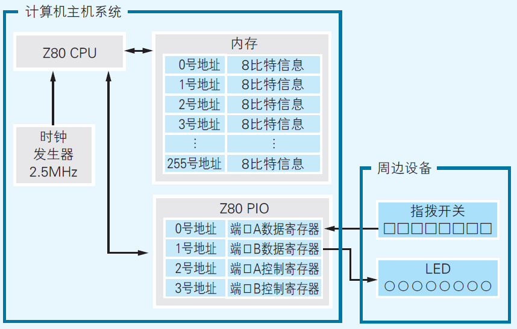

1、【CPU（处理器）信息】
- CPU的种类
- 时钟信号的频率

可以使用哪种机器语言取决于CPU（也称作处理器）的种类。所谓机器语言就是只用0 和1 两个二进制数书写的编程语言。即便是相同的机器语言，例如01010011，只要CPU 的种类不同，对它的解释也就不同。

在机器语言当中，指令执行时所需要的时钟周期数取决于指令的类型。

2、【内存信息】
- 地址空间
- 每个地址中可以存储多少比特的信息

每个地址都标示着一个内存中的数据存储单元，而这些地址所构成的范围就是内存的地址空间。在我们的微型计算机中，地址空间为0～255，每一个地址中可以存储8 比特（1 字节）的指令或数据。

3、【I/O 信息】
- I/O 的种类
- 地址空间
- 连接着何种周边设备

所谓I/O 的地址空间，是指用于指定I/O 寄存器的地址范围。在内存中，每个地址的功能都一样，既可用于存储指令又可用于
存储数据。而I/O 则不同，地址编号不同（即寄存器的类型不同），功能也就不同。

## 3.2　机器语言和汇编语言

汇编语言的语法十分简单，以至于语法只有一个，即把“标签”“操作码（指令）”和“操作数（指令的对象）”并排写在一行上，仅此而已。

操作数表示的是指令执行的对象。CPU 的寄存器、内存地址、I/O地址或者直接给出的数字都可以作为操作数。如果某条指令需要多个操作数，那么它们之间就要用逗号分割。操作数的个数取决于指令的种类。也有不需要操作数的指令，比如用于停止CPU 运转的HALT指令。

Z80 CPU 的指令全部加起来有70 条左右。

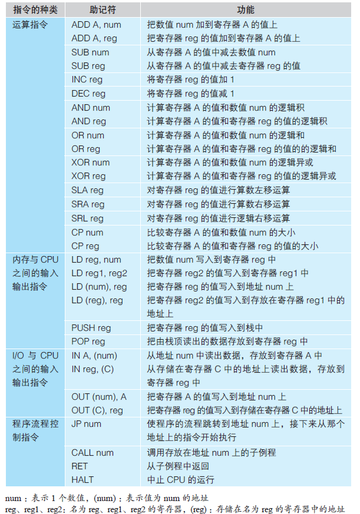

汇编语言中的1 条指令能转换成多少条机器语言取决于指令的种类以及操作数的个数。

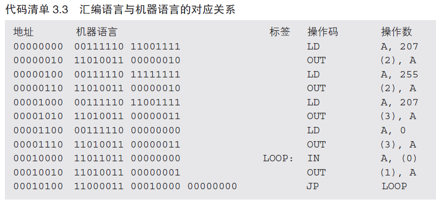

一旦重置了CPU，00000000 就会被自动存储到PC 寄存器中，这意味着接下来CPU 将要从00000000 号地址读出程序。首先CPU 会从00000000 号地址读出指令00111110，判断出这是一条由2 个字节构成的指令，于是接下来会从下一个地址（即00000001，1 号地址，代码清单3.3 中并没有标记出该地址本身）读出数据11001111，把这两个数据汇集到一起解释、执行。执行的指令是把数值207 写入到寄存器A，用汇编语言表示的话就是“LD A, 207”。这时，由于刚刚从内存读出了一条2 字节的指令（占用2 个内存地址），所以PC 寄存器的值要增加2，并接着从00000010 号地址读出指令，解释并执行。

接下来的流程与此类似，通过反复进行“读取指令”“解释、执行指令”“更新PC 寄存器的值”这3 个操作，程序就能运行起来了。一旦执行完最后一行的JP LOOP 所对应的机器语言，PC 寄存器的值就会被设为标签LOOP 对应的地址00010000，这样就可以循环执行同样的操作。请诸位重点观察PC 寄存器是如何控制程序流程的。

注意：在将一个2 字节的数据存储到内存时，存储顺序是低8 位在前、高8 位在后（也就是逆序存储）。这样的存储顺序叫作“小端序”（Little Endian），与此相反，将数据由高位到低位顺序地存储到内存的存储顺序则叫作“大端序”（Big Endian）。根据CPU 种类的不同，有的CPU 使用大端序，有的CPU 使用小端序。Z80CPU 使用的是小端序，因此JP LOOP 对应的机器语言为“11000011 00010000 00000000”。

## 3.3　Z80 CPU 的寄存器结构

计算机的硬件有三个基本要素，CPU、内存和I/O。CPU 负责解释、执行程序，从内存或I/O 输入数据，在内部进行运算，再把运算结果输出到内存或I/O。内存中存放着程序，程序是指令和数据的集合。I/O 中临时存放着用于与周边设备进行输入输出的数据。

既然数据的运算是在CPU 中进行的，那么在CPU 内部就应该有存储数据的地方。这种存储数据的地方叫作“寄存器”。虽然也叫寄存器，但是与I/O 的寄存器不同，CPU 的寄存器不仅能存储数据，还具备对数据进行运算的能力。CPU 带有什么样的寄存器取决于CPU 的种类。Z80 CPU 所带有的寄存器如图3.2 所示A。A、B、C、D 等字母是寄存器的名字。在汇编语言当中，可以将寄存器的名字指定为操作数。

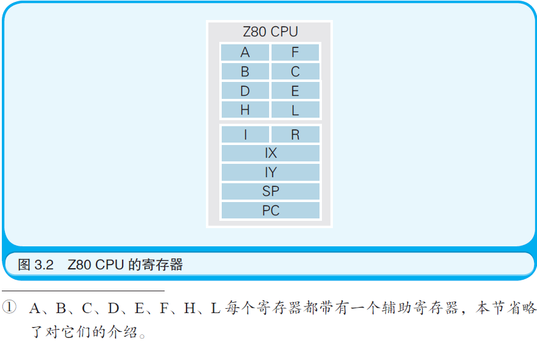

IX、IY、SP、PC 这4 个寄存器的大小是16 比特，其余寄存器的大小都是8 比特。寄存器的用途取决于它的类型。有的指令只能将特定的寄存器指定为操作数。

- A 寄存器也叫作“累加器”，是运算的核心。所以连接到它上面的导线也一定会比其他寄存器的多。
- F 寄存器也叫作“标志寄存器”，用于存储运算结果的状态，比如是否发生了进位，数字大小的比较结果等。
- PC寄存器也叫作“程序指针”，存储着指向CPU 接下来要执行的指令的地址。PC 寄存器的值会随着滴答滴答的时钟信号自动更新，可以说程序就是依靠不断变化的PC 寄存器的值运行起来的。
- SP寄存器也叫作“栈顶指针”，用于在内存中创建出一块称为“栈”的临时数据存储区域。

> 总结

- 尝试估算程序的执行时间（把每条指令的时钟周期相加得到总共所需的时钟周期，然后乘以每个时钟周期的时间，一个时钟周期=1/主频）

# 04、程序像河水一样流动着

- 初级问题：Flow Chart 的中文意思是什么？

流程图（Flow Chart）是指用图的形式表示程序的流程

- 中级问题：请说出自然界中河流的三种流动方式。

向着一个方向流淌；流着流着产生支流；卷成漩涡。与河流的流动方式一样，程序的流程也分为三种。在程序中，把犹如水流向着一个方向流淌的流程称作“顺序执行”；把犹如水流流着流着产生了支流的流程称作“条件分支”；把犹如水流卷成漩涡的流程称作“循环”。

- 高级问题：事件驱动是什么？

用户的操作等产生事件后，由事件决定程序的流程。

## 4.1　程序的流程分为三种 

PC（Program Counter，程序计数器）的寄存器，负责存储内存地址，该地址指向下一条即将执行的指令。每解释执行完一条指令，PC 寄存器的值就会自动被更新为下一条指令的地址。

一旦使用了机器语言或汇编语言所提供的跳转指令，就可以将PC 寄存器的值设置为任意的内存地址。如果将它的值设为之前执行过的步骤所对应的内存地址，那么就构成了循环。

备注：分支和循环实现都是利用了底层的跳转指令。

### 1、顺序执行

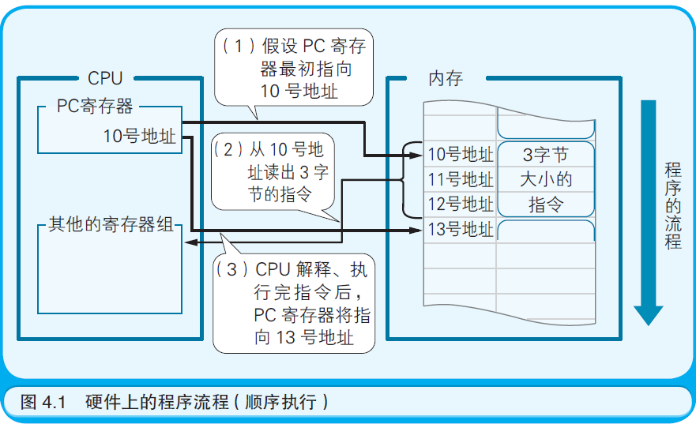

### 2、循环

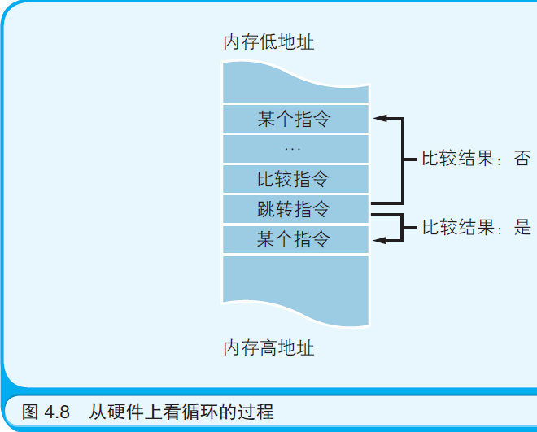

### 3、分支

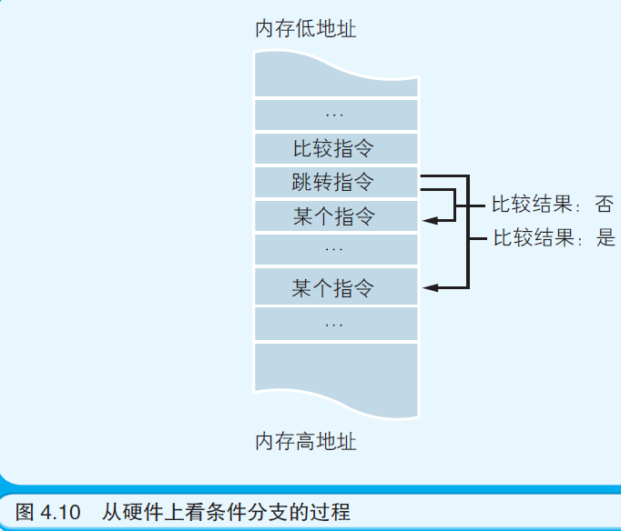

## 4.6　特殊的程序流程——中断处理

中断处理是指计算机使程序的流程突然跳转到程序中的特定地方，这样的地方被称为中断处理例程（Routine）或是中断处理程序
（Handler），而这种跳转是通过CPU 所具备的硬件功能实现的。人们通常把中断处理比作是接听电话。假设诸位都正坐在书桌前处理文件，这时突然来电话了，诸位就不得不停下手头的工作去接电话，接完电话再回到之前的工作。像这样由于外部的原因使正常的流程中断，中断后再返回到之前流程的过程就是中断处理流程。

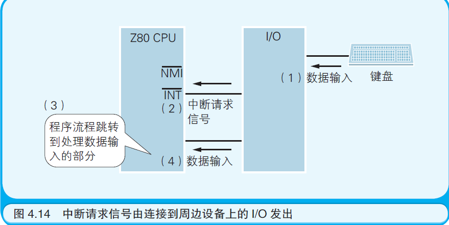

中断处理以从硬件发出的请求为条件，使程序的流程产生分支，因此可以说它是一种特殊的条件分支。可是，在诸位编写的程序中并不需要编写有关中断处理的代码。因为处理中断请求的程序，或是内置于被烧录在计算机ROM 中的BIOS 系统（Basic Input Output System，基本输入输出系统）中，或是内置于Windows 等操作系统中。只需要先记住以下两点即可：计算机具有硬件上处理中断的能力；中断一词的英文是Interrupt。

## 4.7　特殊的程序流程——事件驱动

> 总结

程序的流程还是只有顺序执行、条件分支和循环这三种。其中的顺序执行是最基本的程序流程，这是因为CPU 中的PC 寄存器的值会自动更新。条件分支和循环，在高级语言中用程序块表示，在机器语言和汇编语言中用跳转指令表示，在硬件上是通过把PC 寄存器的值设为要跳转到的目的地的内存地址来实现。

# 05、与算法成为好朋友的七个要点

- 初级问题：Algorithm 翻译成中文是什么？Algorithm 翻译成中文是“算法”
- 中级问题：辗转相除法是用于计算什么的算法？是用于计算最大公约数的算法。
- 高级问题：程序中的“哨兵”指的是什么？“ 哨兵”指的是一种含有特殊值的数据，可用于标识数据的结尾等。

> 七个要点：

- 5.2　要点1 ：算法中解决问题的步骤是明确且有限的
- 5.3　要点2 ：计算机不靠直觉而是机械地解决问题
- 5.4　要点3 ：了解并应用典型算法
- 5.5　要点4 ：利用计算机的处理速度
- 5.6　要点5 ：使用编程技巧提升程序执行速度
- 5.7　要点6 ：找出数字间的规律
- 5.8　要点7 ：先在纸上考虑算法

# 06、与数据结构成为好朋友的七个要点

- 初级问题:程序中的变量是指什么？

变量是数据的容器。变量中所存储的数据是可以改变的。变量的实质是按照变量所存储数据的大小被分配到的一块内存空间。

- 中级问题:把若干个数据沿直线排列起来的数据结构叫作什么？叫作“数组”。

使用了数组就可以高效地处理大量的数据。数组的实质是连续分配的一块特定大小的内存空间。

- 高级问题:栈和队列的区别是什么？

栈中数据的存取形式是LIFO ；队列中数据的存取形式是FIFO。LIFO（Last In First Out，后进先出）表示优先读取后存入的数据； FIFO（First In First Out，先进先出）表示优先读取先存入的数据。

## 6.1　要点1 ：了解内存和变量的关系

在一般的个人计算机中，内存内部被分割成了若干个数据存储单元，每个单元可以存储8 比特的数据（8 比特 = 1 字节）。为了区分各个单元，每个单元都被分配了一个编号，这个编号被称为“地址”或是“门牌号码”。如果一台个人计算机装配有64M 字节的内存，那么就会有从0 到64M（M = 100 万）这么多个地址。

因为依靠指定地址的方式编写程序很麻烦，所以在C 语言、Java、BASIC 等几乎所有的编程语言中，都是使用变量把数据存储进内存，或从内存中把数据读出来的。

变量是程序中数据存储的最小单位，每个变量都对应着一块物理上的内存空间。

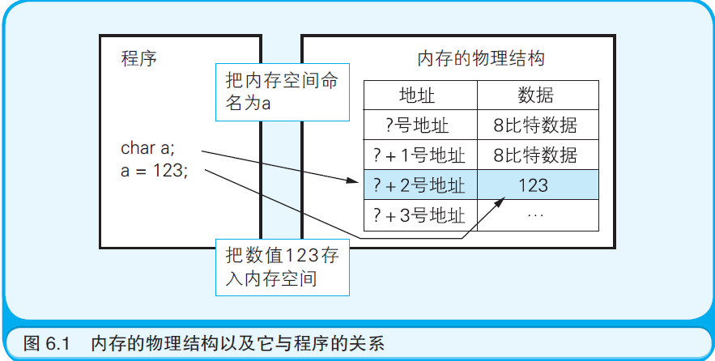

## 6.2　要点2 ：了解作为数据结构基础的数组

数组是数据结构的基础，之所以这么说是因为数组反映了内存的物理结构本身。在内存中存储数据的空间是连续分布的。而在程序中，往往要从内存整体中分配出一块连续的空间以供使用。如果用程序中的语句表示这种分配使用方式的话，就要用到数组.

**无论是在哪种编程语言中，数据结构的基础都是数组，因此设法灵活地运用数组才是关键。**

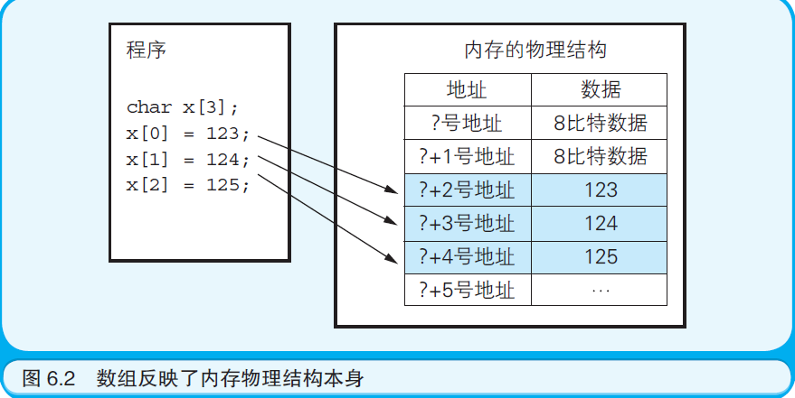

> 其他

- 6.3　要点3 ：了解数组的应用——作为典型算法的数据结构
- 6.4　要点4 ：了解并掌握典型数据结构的类型和概念
- 6.5　要点5 ：了解栈和队列的实现方法（数组、链表）
- 6.6　要点6 ：了解结构体的组成
- 6.7　要点7 ：了解链表和二叉树的实现方法

# 07、成为会使用面向对象编程的程序员吧

- 初级问题：Object 翻译成中文是什么？对象（Object）是表示事物的抽象名词
- 中级问题：OOP 是什么的缩略语？OOP 是Object Oriented Programming（面向对象编程）的缩略语。
- 高级问题：哪种编程语言在C 语言的基础上增加了对OOP 的支持？

++ 是表示自增（每次只将变量的值增加1）的C 语言运算符。之所以被命名为C++，是因为C++ 在C 语言的基础上增加了面向对象的机制这一点。另外，将C++ 进一步改良的编程语言就是Java 和C# 语言。

> 对面向对象理解的观点

- 7.3　 观点1 ：面向对象编程通过把组件（类）拼装到一起构建程序
- 7.4　 观点2 ：面向对象编程能够提升程序的开发效率和可维护性
- 7.5　 观点3 ：面向对象编程是适用于大型程序的开发方法
- 7.6　 观点4 ：面向对象编程就是在为现实世界建模
- 7.7　 观点5 ：面向对象编程可以借助UML （UnifiedModeling Language，统一建模语言）设计程序
- 7.8　 观点6 ：面向对象编程通过在对象间传递消息驱动程序
- 7.9　 观点7 ：在面向对象编程中使用“继承”（ Inheritance）、“封装”（ Encapsulation）和“多态”（Polymorphism，也称为多样性或多义性）

继承指的是通过继承已存在的类所拥有的成员而生成新的类。封装指的是在类所拥有的成员中，隐藏掉那些没有必要展现给该类调用者的成员。多态指的是针对同一种消息，不同的对象可以进行不同的操作。

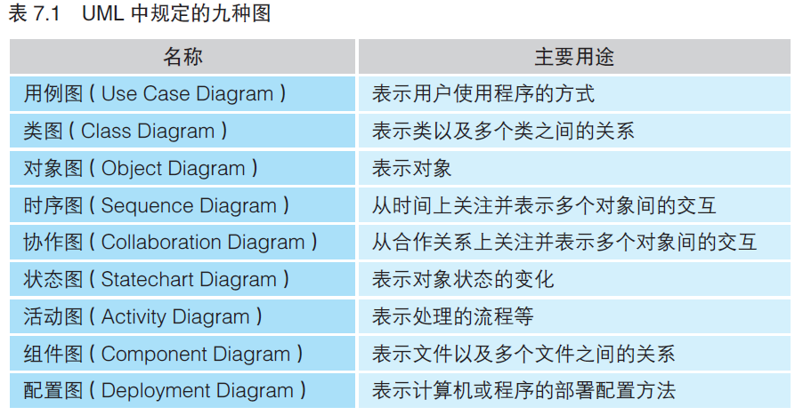

> 总结

- 1、结构体和java对象的区别：在C 语言中，结构体是数据的集合，它将数据捆绑在一起，使得我们可以将这些数据看作是一个整体。而对结构体中的数据进行操作的函数却写在了结构体的外部。然而在面向对象编程中，将表示事物行为的函数也放入了这个整体，这就形成了对象的概念，使得这个整体既能描述属性，又能描述行为。

- 2、面向对象所使用的主要编程技巧有继承、封装、多态三种；

- 3、类和对象的区别 ：类是对象的定义，而对象是类的实例（Instance）

- 4、类有三种使用方法：分别是：1. 仅调用类所持有的个别成员（函数和变量）；2. 在类的定义中包含其他的类（这种方法被称作组合）；3. 通过继承已存在的类定义出新的类。

# 08、一用就会的数据库

- 初级问题：数据库术语中的“表”是什么意思？表（Table）就是被整理成表格形式的数据。一张表由若干个列和行构成。列也被称为字段（Field）行也被称为记录（Record）。

- 中级问题：DBMS 是什么的简称？DBMS 是Database Management System（数据库管理系统）的简称。

- 高级问题：键和索引的区别是什么？键用于设定表和表之间的关系（Relationship），而索引是提升数据检索速度的机制。

## 8.2　数据文件、DBMS 和数据库应用程序

数据库的实质虽然是某种数据文件，但是诸位编写的应用程序并不是直接去读写这些数据文件，而是以DBMS 作为中介间接地读写（如图8.3 所示）。DBMS 不但可以使应用程序轻松地读写数据文件，而且还具有一致并且安全地存储数据的功能。

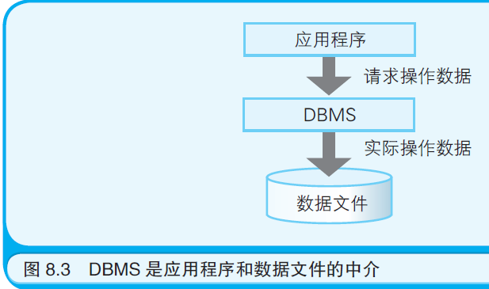

CRUD 由以下四种操作的英文名称的首字母组成， 即记录的插入（CREATE）、获取（REFER）、更新（UPDATE）、删除（DELETE）

> 其他

- 8.3　设计数据库 
- 8.4　通过拆表和整理数据实现规范化
- 8.5　用主键和外键在表间建立关系
- 8.6　索引能够提升数据的检索速度
- 8.7　设计用户界面
- 8.8　向DBMS发送CRUD操作的SQL 语句 
- 8.9　使用数据对象向DBMS发送SQL 语句
- 8.10　事务控制也可以交给DBMS 处理

# 09、通过七个简单的实验理解TCP/IP 网络

- 初级问题:LAN 是什么的缩略语？LAN 是Local Area Network（局域网）的缩略语。

- 中级问题:TCP/IP 是什么的缩略语？TCP/IP 是Transmission Control Protocol/Internet Protocol（传输控制协议和网际协议）的缩略语。

- 高级问题:MAC 地址是什么？所谓MAC 地址就是能够标识网卡的编号。几乎所有的网卡都会在上市前被分配一个不可变更的MAC 地址。在每一块网卡所带有的ROM（Read Only Memory，只读存储器）中，都预先烧录了一个唯一的MAC 地址。世界上的每一个MAC 地址都是独一无二的。

> 总结

- 9.1　实验环境

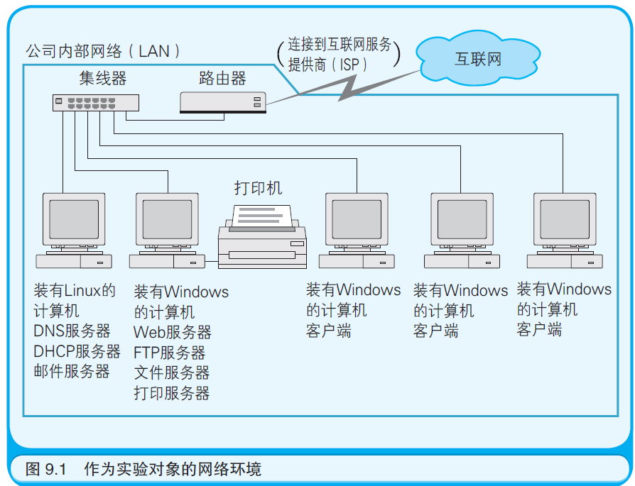

备注：LAN 内采用了CSMA/CD 机制。

- 9.2　实验1 ：查看网卡的MAC 地址（ipconfig /all 物理地址项）

- 9.3　实验2 ：查看计算机的IP 地址 （ipconfig /all   网络地址+主机地址，子网掩码）

- 9.4　实验3 ：了解DHCP 服务器的作用 。DHCP 的全称是Dynamic Host Configuration Protocol（动态主机设置协议）

- 9.5　实验4 ：路由器是数据传输过程中的指路人 （查看路由表route print）

- 9.6　实验5 ：查看路由器的路由过程 （通过命令tracert www.baidu.com看路由过程）

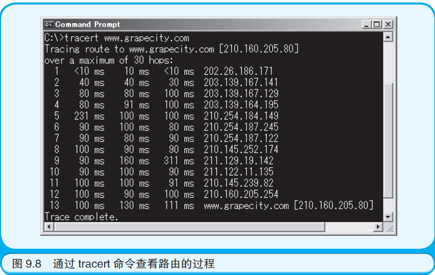

- 9.7　实验6 ：DNS服务器可以把主机名解析成IP地址 

DNS（Domain Name System，域名系统）的服务器。

hostname命令显示主机名。

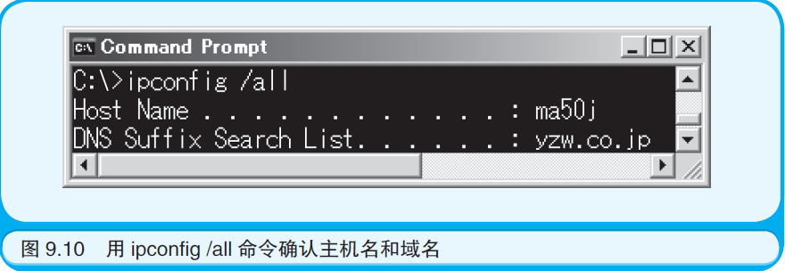

nslookup

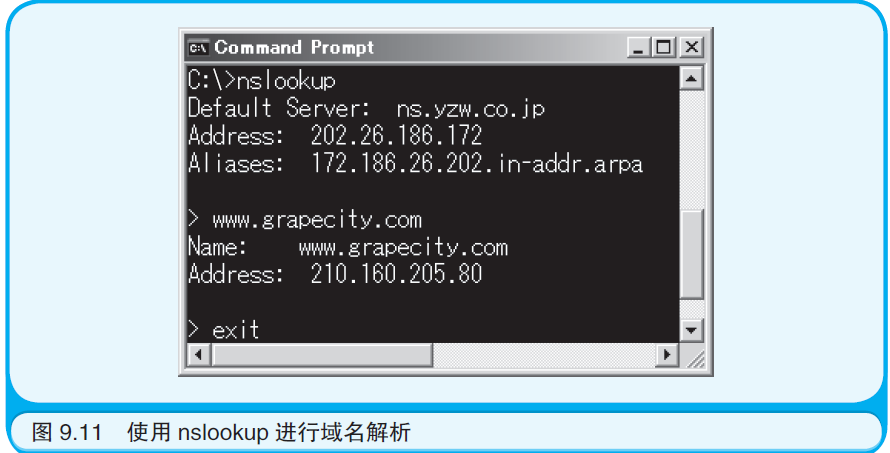

- 9.8　实验7 ：查看IP 地址和MAC 地址的对应关系 

在互联网的世界中，到处传输的都是附带了IP 地址的数据。但是能够标识作为数据最终接收者的网卡的，还是MAC 地址。于是在计算机中就加入了一种程序，用于实现由IP 地址到MAC 地址的转换，这种功能被称作ARP（Address Resolution Protocol，地址解析协议）。

执行arp -a 命令，就可以查看当前ARP缓存表中的内容。

- 9.9　TCP 的作用及TCP/IP 网络的层级模型

IP 协议用于指定数据发送目的地的IP 地址以及通过路由器转发数据。而TCP 协议则用于通过数据发送者和接收者相互回应对方发来的确认信号，可靠地传输数据。

# 10、试着加密数据吧

- 初级问题：通常把还原加密过的文件这一操作叫作什么？叫作解密。
- 中级问题：在字母A 的字符编码上加上3，可以得到哪个字母？可以得到字母D。
- 高级问题：在数字签名中使用的信息摘要是什么？信息摘要是指从作为数字签名对象的文件整体中计算出的数值。对比由文件整体计算出的信息摘要，可以证明文件的内容有没有被篡改。加密处理过的信息摘要就是数字签名。

对字符进行编码，有很多不同的编码方式。字符集分为ASCII 字符集、Unicode 字符集等若干种。

> 总结

- 10.1　先来明确一下什么是加密
- 10.2　错开字符编码的加密方式 
- 10.3　密钥越长，解密越困难 
- 10.4　适用于互联网的公开密钥加密技术 

“对称密钥加密技术”，这种加密技术的特征是在加密和解密的过程中使用数值相同的密钥。

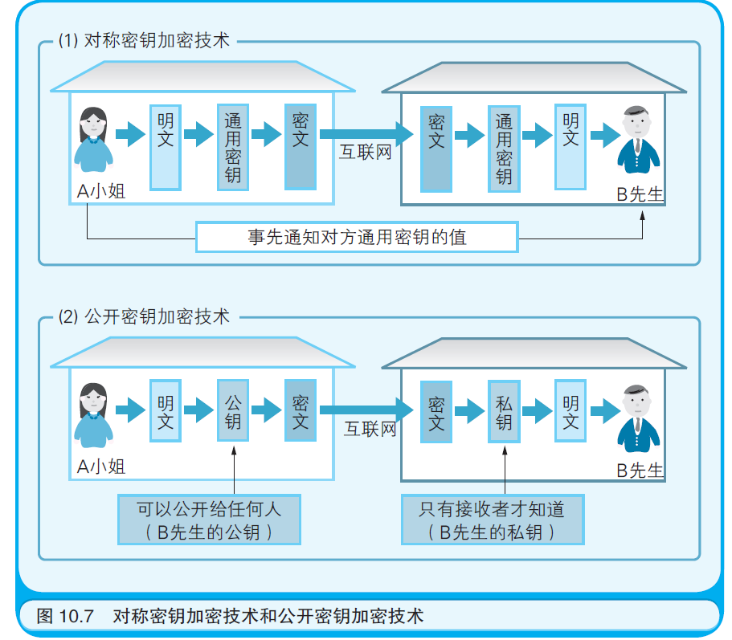

- 10.5　数字签名可以证明数据的发送者是谁

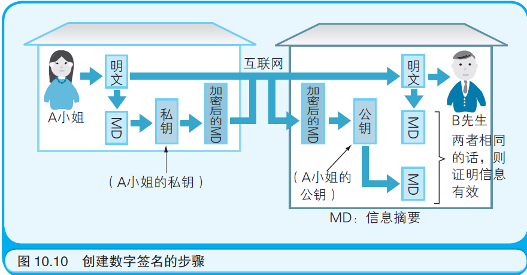

# 11、XML 究竟是什么

- 初级问题：XML 是什么的缩写？XML 是Extensible Markup Language（可扩展标记语言）的缩写。
- 中级问题：HTML 和XML 的区别是什么？HTML 是用于编写网页的标记语言。XML 是用于定义任意标记语言的元语言。
- 高级问题：在处理XML 文档的程序组件中，哪个成为了W3C 的推荐标准？DOM（Document Object Model，文档对象模型）。

其实完整的XML 文档包括XML 声明、XML 实例和DTD 三个部分。所谓XML 声明，就是写在XML 文档开头的、形如<?xml version="1.0" encoding="Shift_JIS"?> 的部分。XML实例是文档中通过标签被标记的部分。而DTD 的作用是定义XML 实例的结构。

> 总结

- 11.1　XML 是标记语言 ：通常把通过添加标签为数据赋予意义的行为称为“标记”。为这种给数据赋予意义的行为定义规则的语言就是“标记语言”。

- 11.2　XML 是可扩展的语言：xml不像HTML那样定义了有限数据量的标签，而xml没有定义任何标签，完全由用户自己定义。

- 11.3　XML 是元语言 

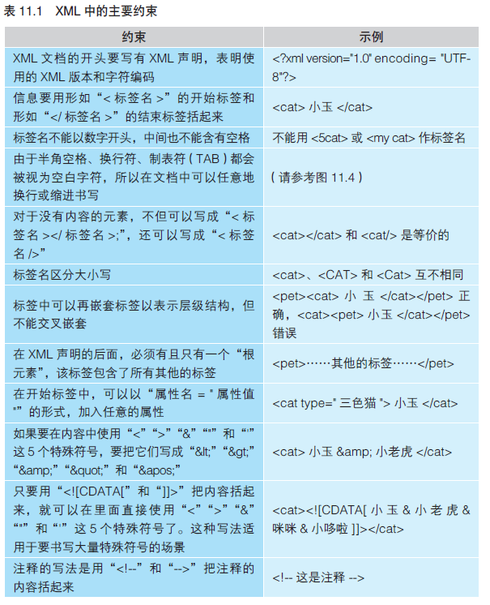

- 11.4　XML 可以为信息赋予意义 
- 11.5　XML 是通用的数据交换格式 
- 11.6　可以为XML 标签设定命名空间 。xmlns 即XML NameSpace（命名空间）的缩写。

- 11.7　可以严格地定义XML 的文档结构 

所谓有效的XML 文档是指在XML 文档中写有DTD（Document Type Definition，文档类型描述）信息。

与DTD 相同，还有一个名为XML Schema 的技术也可用于定义XML 实例的结构。在XML 中，DTD 借用了可称得上是标记语言始祖的SGML（Standard Generalized Markup Language，标准通用标记语言）语言的语法。而XML Schema 是为了XML 新近研发的技术，因此它可以对XML 文档执行更严格地检查，例如检查数据类型或数字位数等。

今后将成为主流的是崭新的XML Schema，而不是古老的DTD。

- 11.8　用于解析XML 的组件 
- 11.9　XML 可用于各种各样的领域

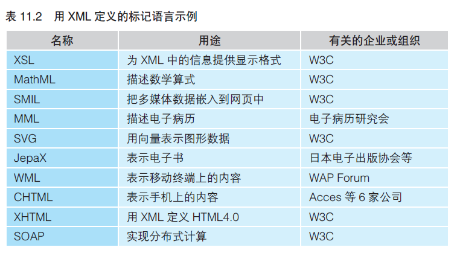

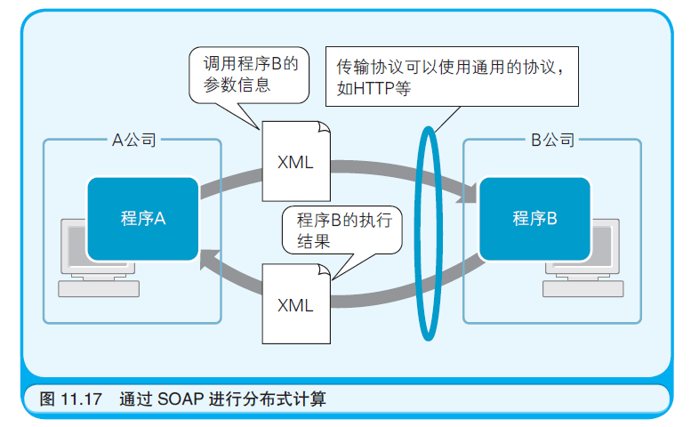

# 12、SE 负责监管计算机系统的构建（se觉得相当于架构师的角色）

- 初级问题：SE 是什么的缩略语？System Engineer（系统工程师）的缩略语。
- 中级问题：IT 是什么的缩略语？Information Technology（信息技术）的缩略语。
- 高级问题：请列举一个软件开发过程的模型。软件开发过程的模型有“瀑布模型”“原型模型”“螺旋模型”等。

> 总结

-  12.1　SE 是自始至终参与系统开发过程的工程师
-  12.2　SE 未必担任过程序员
-  12.3　系统开发过程的规范

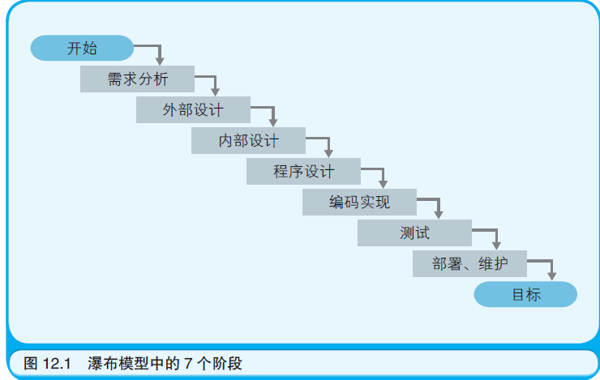

-  12.4　各个阶段的工作内容及文档
-  12.5　所谓设计，就是拆解
-  12.6　面向对象法简化了系统维护工作
-  12.7　技术能力和沟通能力
-  12.8　IT 不等于引进计算机
-  12.9　计算机系统的成功与失败
-  12.10　大幅提升设备利用率的多机备份

