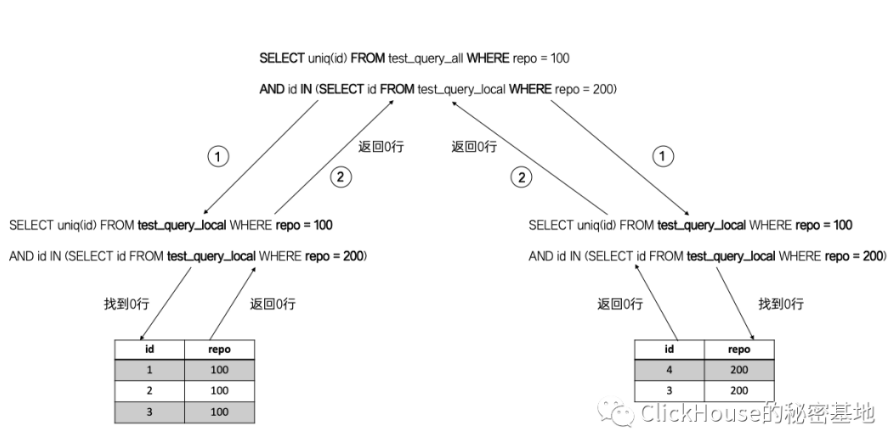

<!-- TOC -->

- [1、Distribute查询](#1distribute查询)
    - [1、基本查询过程](#1基本查询过程)
    - [2、IN查询](#2in查询)
        - [1、第一种写法:将本地表 test_query_local 改成 分布式表 test_query_all](#1第一种写法将本地表-test_query_local-改成-分布式表-test_query_all)
        - [2、第二种写法:全部替换为_all 分布式表](#2第二种写法全部替换为_all-分布式表)
        - [3、第三种写法:GLOBAL修饰符](#3第三种写法global修饰符)
    - [3、JOIN查询](#3join查询)
- [参考](#参考)

<!-- /TOC -->

# 1、Distribute查询

## 1、基本查询过程

什么是分发引擎？分发引擎在业务用来建立all表时使用。

当数据表包含多个分片的时候，我们需要将普通的本地查询转换为分布式查询。当然，这个转换动作是不需要用户自己进行的，在ClickHouse里面会由Distributed表引擎代劳。Distributed表引擎的定位就好比是一个分表的中间件或者一个视图，它本身并不存储数据，而是分片的代理，能自动的将SQL查询路由到每个分片。一种约定俗成的命名方式，是将Distributed表附带_all后缀；本地分片附带_local后缀，以示区分。


当我们面对Distributed表引擎查询的时候，它主要为我们做了3件事情:

- 1、发起远程调用，根据集群的配置信息，从当前节点向远端分片发起Remote远程查询调用；
- 2、分布式表转本地表，在发送远程查询时，将SQL内的 _all表 转成 _local表，并同时查询当前节点的本地local表；
- 3、合并结果集，合并由多个分片返回的数据；


如下图所示：


在各shard执行SQL是自动且并行化的，无需参数配置或手动干预。读数时随机选择某个shard的replica进行读取。如果表有索引优先使用索引。

分布式引擎接受参数有：服务器配置文件中的集群名称，远程数据库的名称，远程表的名称以及（可选）分片键。例：Distributed(logs, default, hits[, sharding_key])

以上面的建表引擎作为例子。

参数说明：

- logs : 服务器配置文件中的群集名称。rpm包装好后的配置文件在/etc/clickhouse-server/config.xml

- default: 库名，也可以使用常量表达式来代替数据库名称，如currentDatabase()

- hits:表名

- sharding_key：路由算法

上面引擎的隐喻是：定位logs集群,从位于群集中每个服务器上的“default.hits”表中读取数据。数据将在远程服务器部分处理。例如，对于使用GROUP BY的查询，将在远程服务器上聚合数据，聚合函数的中间状态将发送到请求者服务器。数据将会进一步聚合。


## 2、IN查询

在大多数时候，面向Distributed表的SQL写法与本地查询没有多大区别。但当我们执行 IN 或者 JOIN 查询的时候，一不小心就容易掉到坑里，因为这些查询子句会面对多张数据表。


为了便于演示，我们简化一下场景，用一个自查询的IN子句来解释说明，假设一张表的数据如下:

```sql
SELECT * FROM test_query_local
┌─id─┬─repo─┐
│  1 │  100 │
│  2 │  100 │
│  3 │  100 │
│  3 │  200 │
│  4 │  200 │
└────┴──────┘
```
现在有一个统计的需求，找到同时拥有repo = 100 和 repo = 200的个数，那么它的查询SQL可能是下面这个样子

```sql
SELECT uniq(id) FROM test_query_local WHERE repo = 100 
AND id IN (SELECT id FROM test_query_local WHERE repo = 200)


┌─uniq(id)─┐
│        1 │
└──────────┘
```

这条语句目前在单机执行是没有问题的，id为3的数据同时拥有2个repo。

现在模拟分布式的场景，把这张表进行分片操作，将它们分布到CH5和CH6两个节点，且每个节点的数据数据如下:

```sql
CH5节点 test_query_local
┌─id─┬─repo─┐
│  1 │  100 │
│  2 │  100 │
│  3 │  100 │
└────┴──────┘
CH6节点 test_query_local
┌─id─┬─repo─┐
│  3 │  200 │
│  4 │  200 │
└────┴──────┘
```

接着使用 分布式表 test_query_all 映射这2个分片。

### 1、第一种写法:将本地表 test_query_local 改成 分布式表 test_query_all

```sql
ch5.nauu.com :) SELECT uniq(id) FROM test_query_all WHERE repo = 100 AND id IN (SELECT id FROM test_query_local WHERE repo = 200)

SELECT uniq(id)
FROM test_query_all
WHERE (repo = 100) 
AND (
 id IN 
   (    
    SELECT id    
    FROM test_query_local    
    WHERE repo = 200
   )
)
┌─uniq(id)─┐
│        0 │
└──────────┘
1 rows in set. Elapsed: 0.009 sec.

```

你会发现返回的数据不对，进一步检查，原因是由 IN 子句引起的，因为它还在使用本地表 test_query_local。这是什么原理呢？我们看下面这张图就明白了

```sql
SELECT uniq(id) FROM test_query_all WHERE repo = 100 AND id IN (SELECT id FROM test_query_local WHERE repo = 200)

-- 被ck引擎解析为两条SQL：

-- ch5
SELECT uniq(id) FROM test_query_local WHERE repo = 100 AND id IN (SELECT id FROM test_query_local WHERE repo = 200)

-- ch6
SELECT uniq(id) FROM test_query_local WHERE repo = 100 AND id IN (SELECT id FROM test_query_local WHERE repo = 200)
```

由于分片的数据分布是不同的，所以数据没有查全。




### 2、第二种写法:全部替换为_all 分布式表

```sql
ch5.nauu.com :) SELECT uniq(id) FROM test_query_all WHERE repo = 100 AND id IN (SELECT id FROM test_query_all WHERE repo = 200)

SELECT uniq(id)
FROM test_query_all
WHERE (repo = 100) 
AND (
id IN (    
    SELECT id    
    FROM test_query_all    
    WHERE repo = 200
    )
)
┌─uniq(id)─┐
│        1 │
└──────────┘
```

从返回结果来看，这次好像没问题了。为什么这样能返回正确的结果呢?  如下图所示:


站在CH5节点的视角，在SQL语句 _all 转 _local后，在CH5本地会执行下面的语句：

```sql
SELECT uniq(id) FROM test_query_local WHERE repo = 100 
AND id IN (SELECT id FROM test_query_all WHERE repo = 200)
```

注意，IN 子句此时是分布式表 test_query_all，所以它又转成了下面的形式，分别在CH5本地和CH6远端执行：

SELECT id FROM test_query_local WHERE repo = 200

讲到这里就应该很清楚了，因为 IN子句 单独发起了一次分布式查询，所以数据查不全的问题被解决了。


还有什么"坑" 吗?  当然有啦 !!

现在站在CH6节点的视角，SQL在CH5被 _all 转 _local后，会向CH6节点发起远程查询调用。在CH6本地将同样会执行下面的语句：

```sql
SELECT uniq(id) FROM test_query_local WHERE repo = 100 
AND id IN (SELECT id FROM test_query_all WHERE repo = 200)
```

注意 IN 子查询，由于它是 分布式表 test_query_all，所以它又会向集群内其他分片发起分布式查询，如下图所示:


这就是分布式`查询的放大问题`，放大次数是 N的平方(N = 分片数量)。所以说，如果一张表有10个分片，那么一次分布式 IN 查询的背后会涉及100次查询，这显然是不可接受的。


### 3、第三种写法:GLOBAL修饰符

查询放大怎么解决呢? ClickHouse为我们提供了解决方案，继续改造刚才的语句，增加 GLOBAL修饰符:

```sql
SELECT uniq(id) FROM test_query_all WHERE repo = 100 
AND id GLOBAL IN (SELECT id FROM test_query_all WHERE repo = 200)
```

增加了 GLOBAL 之后查询会有什么变化呢? 

在使用了 GLOBAL 之后，整个分布式查询的流程又发生了变化，我们看下面这张图：


- 首先，将 GLOBAL 修饰的子句，单独进行了一次分布式查询;

- 接着，将子句的结果汇总后，用内存临时表保存;

- 最后，直接将临时表分发至每个分片节点，从而避免了查询放大的问题。


## 3、JOIN查询


对于分布式JOIN查询而言，其执行逻辑和 IN查询是一样的，它们唯一的区别是分发的语句不同，例如：

当执行 IN子句的时候，是将IN子句提取，发起分布式查询:


```sql
GLOBAL IN (SELECT id FROM test_query_all WHERE repo = 200)
```

IN子句 _all 转 _local，分发到每个分片执行，再汇总：

```sql
-- 分布式执行
SELECT id FROM test_query_local WHERE repo = 200
```

当执行JOIN子句的时候，是将右表提取，发起分布式查询：

```sql
SELECT * FROM test_query_all AS t1 GLOBAL JOIN test_query_all AS t2 ON t1.id = t2.id
```

右表 _all 转 _local，分发到每个分片执行，再汇总：

```sql
-- 分布式执行
SELECT id, repo FROM default.test_query_local
```

所以分布式JOIN查询我就不再演示图例了，参照IN子句的即可。

好了，现在总结一下，当执行分布式JOIN 或者IN 查询的时候，会碰到几种问题:

- 1、查询不全，由于分片的数据不均，会出现查询数据不全的问题，所以JOIN表 和 IN子句 也要使用 _all 分布式表;

- 2、查询放大，由于JOIN表 和 IN子句 也是 _all 分布式表，所以每个分片又会向其他远端的分片发起分布式查询，最终的查询次数是 N 的平方(N=分片数量);

- 3、解决思路，使用 GLOBAL IN 和 GLOBAL JOIN 可以避免查询放大的问题。


# 参考

- [ClickHouse Distribute 引擎深度解读](http://clickhouse.com.cn/topic/5a3e768d2141c2917483557e)

- [ClickHouse分布式IN & JOIN 查询的避坑指南](https://cloud.tencent.com/developer/article/1621346)