<!-- TOC -->autoauto- [1、基础](#1基础)auto    - [1、SRAM](#1sram)auto    - [2、DRAM](#2dram)auto    - [3、存储器的价格和性能](#3存储器的价格和性能)auto    - [4、局部性原理](#4局部性原理)auto        - [1、时间局部性](#1时间局部性)auto        - [2、空间局部性](#2空间局部性)auto- [2、寄存器](#2寄存器)auto- [3、高速缓存](#3高速缓存)auto    - [1、CPU访问内存数据](#1cpu访问内存数据)auto    - [2、CPU写数据到内存](#2cpu写数据到内存)auto        - [1、写直达（Write-Through）](#1写直达write-through)auto        - [2、写回（Write-Back）](#2写回write-back)auto        - [3、MESI协议：如何让多核CPU的高速缓存保持一致？](#3mesi协议如何让多核cpu的高速缓存保持一致)auto            - [1、缓存一致性问题](#1缓存一致性问题)auto- [4、内存\主存](#4内存\主存)auto- [5、磁盘](#5磁盘)auto- [参考](#参考)autoauto<!-- /TOC -->

计算机存储设备可被粗略分为内存储器（Main Memory）与外存储器（External Memory）两大类，内存存取速度快，但容量小，价格昂贵，而且不能长期保存数据，在不通电情况下数据会消失；外存储器存取速度相对较慢，却可以持久化存储。如果进行更加细致地划分，每个计算机系统中的存储设备都被组织成了一个存储器层次结构，在这个层次结构中，从上至下，设备变得访问速度越来越慢、容量越来越大，并且每字节的造价也越来越便宜。

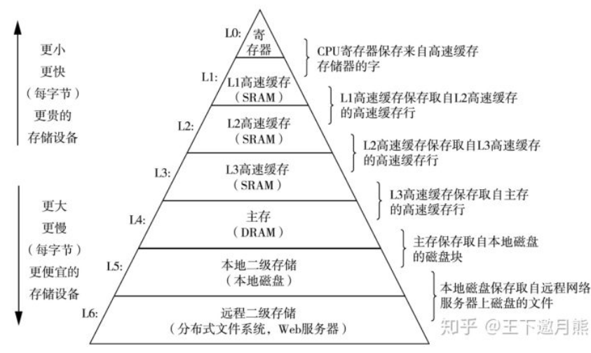


存储器层次结构的主要思想是一层上的存储器作为低一层存储器的高速缓存。因此，寄存器文件就是 L1 的高速缓存，L1 是 L2 的高速缓存，L2 是 L3 的高速缓存，L3 是主存的高速缓存，而主存又是磁盘的高速缓存。在某些具有分布式文件系统的网络系统中，本地磁盘就是存储在其他系统中磁盘上的数据的高速缓存。


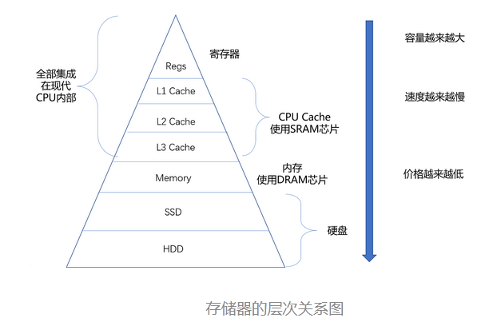

从 Cache、内存，到 SSD 和 HDD 硬盘，一台现代计算机中，就用上了所有这些存储器设备。其中，容量越小的设备速度越快，而且，CPU 并不是直接和每一种存储器设备打交道，而是每一种存储器设备，只和它相邻的存储设备打交道。比如，CPU Cache 是从内存里加载而来的，或者需要写回内存，并不会直接写回数据到硬盘，也不会直接从硬盘加载数据到 CPU Cache 中，而是先加载到内存，再从内存加载到 Cache 中。这样，各个存储器只和相邻的一层存储器打交道，并且随着一层层向下，存储器的容量逐层增大，访问速度逐层变慢，而单位存储成本也逐层下降，也就构成了我们日常所说的存储器层次结构。

# 1、基础

## 1、SRAM

SRAM 之所以被称为“静态”存储器，是因为只要处在通电状态，里面的数据就可以保持存在。而一旦断电，里面的数据就会丢失了。在 SRAM 里面，一个比特的数据，需要 6～8 个晶体管。所以 SRAM 的存储密度不高。同样的物理空间下，能够存储的数据有限。不过，因为 SRAM 的电路简单，所以访问速度非常快。

在 CPU 里，通常会有 L1、L2、L3 这样三层高速缓存。每个 CPU 核心都有一块属于自己的 L1 高速缓存，`通常分成指令缓存和数据缓存`，分开存放 CPU 使用的指令和数据。L1 的 Cache 往往就嵌在 CPU 核心的内部。

L2 的 Cache 同样是每个 CPU 核心都有的，不过它往往不在 CPU 核心的内部。所以，L2 Cache 的访问速度会比 L1 稍微慢一些。而 L3 Cache，则通常是多个 CPU 核心共用的，尺寸会更大一些，访问速度自然也就更慢一些。

## 2、DRAM

内存用的芯片和 Cache 有所不同，它用的是一种叫作 DRAM（Dynamic Random Access Memory，动态随机存取存储器）的芯片，比起 SRAM 来说，它的密度更高，有更大的容量，而且它也比 SRAM 芯片便宜不少。

DRAM 被称为“动态”存储器，是因为 DRAM 需要靠不断地“刷新”，才能保持数据被存储起来。DRAM 的一个比特，只需要一个晶体管和一个电容就能存储。所以，DRAM 在同样的物理空间下，能够存储的数据也就更多，也就是存储的“密度”更大。但是，因为数据是存储在电容里的，电容会不断漏电，所以需要定时刷新充电，才能保持数据不丢失。DRAM 的数据访问电路和刷新电路都比 SRAM 更复杂，所以访问延时也就更长。


## 3、存储器的价格和性能

https://colin-scott.github.io/personal_website/research/interactive_latency.html

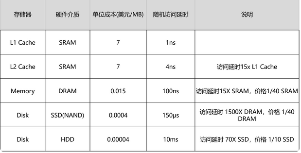

我们能不能既享受 CPU Cache 的速度，又享受内存、硬盘巨大的容量和低廉的价格呢？局部性原理

`CPU 和内存的访问速度已经有了 120 倍的差距。`

## 4、局部性原理

这个局部性原理包括时间局部性（temporal locality）和空间局部性（spatial locality）这两种策略。

### 1、时间局部性

这个策略是说，如果一个数据被访问了，那么它在短时间内还会被再次访问。

### 2、空间局部性

这个策略是说，如果一个数据被访问了，那么和它相邻的数据也很快会被访问。

`而局部性的存在，使得我们可以在应用开发中使用缓存这个有利的武器。比如，通过将热点数据加载并保留在速度更快的存储设备里面，我们可以用更低的成本来支撑服务器。`


# 2、寄存器


# 3、高速缓存


```java

int[] arr = new int[64 * 1024 * 1024];


// 循环1
for (int i = 0; i < arr.length; i++) arr[i] *= 3;


// 循环2
for (int i = 0; i < arr.length; i += 16) arr[i] *= 3
```

这个程序里的循环 1 和循环 2，运行所花费的时间会差多少？

在这段 Java 程序中，我们首先构造了一个 64×1024×1024 大小的整型数组。在循环 1 里，我们遍历整个数组，将数组中每一项的值变成了原来的 3 倍；在循环 2 里，我们每隔 16 个索引访问一个数组元素，将这一项的值变成了原来的 3 倍。按道理来说，循环 2 只访问循环 1 中 1/16 的数组元素，只进行了循环 1 中 1/16 的乘法计算，那循环 2 花费的时间应该是循环 1 的 1/16 左右。但是实际上，循环 1 在我的电脑上运行需要 50 毫秒，循环 2 只需要 46 毫秒。这两个循环花费时间之差在 15% 之内。

为什么会有这 15% 的差异呢？这和我们今天要讲的 CPU Cache 有关。之前我们看到了内存和硬盘之间存在的巨大性能差异。在 CPU 眼里，内存也慢得不行。于是，聪明的工程师们就在 CPU 里面嵌入了 CPU Cache（高速缓存），来解决这一问题。


寄存器文件在层次结构中位于最顶部，也就是第 0 级或记为 L0。一个典型的寄存器文件只存储几百字节的信息，而主存里可存放几十亿字节。然而，处理器从寄存器文件中读数据的速度比从主存中读取几乎要快 100 倍。针对这种处理器与主存之间的差异，系统设计者采用了更小、更快的存储设备，即高速缓存存储器（简称高速缓存），作为暂时的集结区域，用来存放处理器近期可能会需要的信息。

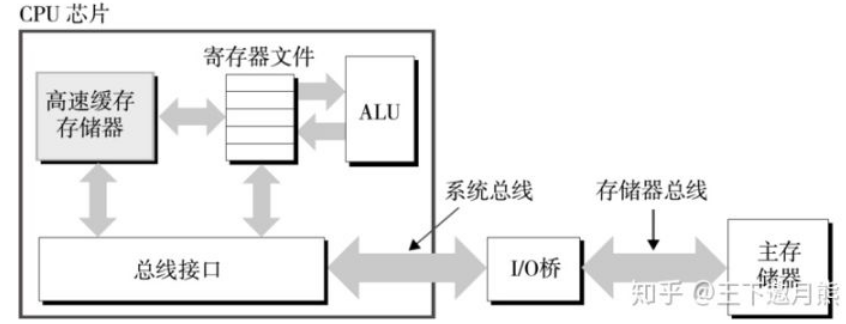

L1 和 L2 高速缓存是用一种叫做静态随机访问存储器（SRAM）的硬件技术实现的。比较新的、处理能力更强大的系统甚至有三级高速缓存：L1、L2 和 L3。系统可以获得一个很大的存储器，同时访问速度也很快，原因是利用了高速缓存的局部性原理，即程序具有访问局部区域里的数据和代码的趋势。通过让高速缓存里存放可能经常访问的数据的方法，大部分的存储器操作都能在快速的高速缓存中完成。

`CPU Cache=（l1+l2+l3）`

运行程序的时间主要花在了将对应的数据从内存中读取出来，加载到 CPU Cache 里。CPU 从内存中读取数据到 CPU Cache 的过程中，是一小块一小块来读取数据的，而不是按照单个数组元素来读取数据的。这样一小块一小块的数据，在 CPU Cache 里面，我们把它叫作 Cache Line（缓存块）。


在我们日常使用的 Intel 服务器或者 PC 里，Cache Line 的大小通常是 64 字节。而在上面的循环 2 里面，我们每隔 16 个整型数计算一次，16 个整型数正好是 64 个字节。于是，循环 1 和循环 2，需要把同样数量的 Cache Line 数据从内存中读取到 CPU Cache 中，最终两个程序花费的时间就差别不大了。

现代 CPU 进行数据读取的时候，无论数据是否已经存储在 Cache 中，CPU 始终会首先访问 Cache。只有当 CPU 在 Cache 中找不到数据的时候，才会去访问内存，并将读取到的数据写入 Cache 之中。当时间局部性原理起作用后，这个最近刚刚被访问的数据，会很快再次被访问。而 Cache 的访问速度远远快于内存，这样，CPU 花在等待内存访问上的时间就大大变短了。

`在各类基准测试（Benchmark）和实际应用场景中，CPU Cache 的命中率通常能达到 95% 以上。`


## 1、CPU访问内存数据

问题来了，CPU 如何知道要访问的内存数据，存储在 Cache 的哪个位置呢？接下来，我就从最基本的`直接映射 Cache（Direct Mapped Cache）`说起，带你来看整个 Cache 的数据结构和访问逻辑。


CPU 访问内存数据，是一小块一小块数据来读取的。对于读取内存中的数据，我们首先拿到的是数据所在的内存块（Block）的地址。而直接映射 Cache 采用的策略，就是确保任何一个内存块的地址，始终映射到一个固定的 CPU Cache 地址（Cache Line）。而这个映射关系，通常用 mod 运算（求余运算）来实现。下面我举个例子帮你理解一下。


比如说，我们的主内存被分成 0～31 号这样 32 个块。我们一共有 8 个缓存块。用户想要访问第 21 号内存块。如果 21 号内存块内容在缓存块中的话，它一定在 5 号缓存块（21 mod 8 = 5）中。

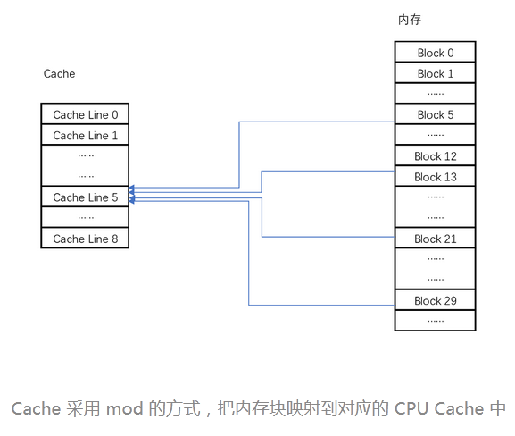


实际计算中，有一个小小的技巧，通常我们会把缓存块的数量设置成 2 的 N 次方。这样在计算取模的时候，可以直接取地址的低 N 位，也就是二进制里面的后几位。比如这里的 8 个缓存块，就是 2 的 3 次方。那么，在对 21 取模的时候，可以对 21 的 2 进制表示 10101 取地址的低三位，也就是 101，对应的 5，就是对应的缓存块地址。

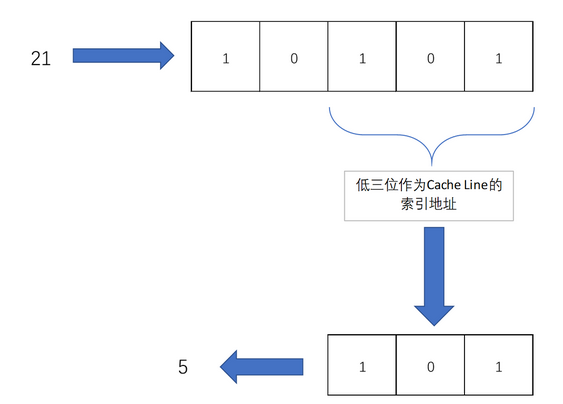

取 Block 地址的低位，就能得到对应的 Cache Line 地址，除了 21 号内存块外，13 号、5 号等很多内存块的数据，都对应着 5 号缓存块中。既然如此，假如现在 CPU 想要读取 21 号内存块，在读取到 5 号缓存块的时候，我们怎么知道里面的数据，究竟是不是 21 号对应的数据呢？

这个时候，在对应的缓存块中，我们会存储一个 `组标记（Tag）`。这个组标记会记录，当前缓存块内存储的数据对应的内存块，而缓存块本身的地址表示访问地址的低 N 位。就像上面的例子，21 的低 3 位 101，缓存块本身的地址已经涵盖了对应的信息、对应的组标记，我们只需要记录 21 剩余的高 2 位的信息，也就是 10 就可以了。

除了组标记信息之外，缓存块中还有两个数据。一个自然是从主内存中加载来的实际存放的数据，另一个是`有效位（valid bit）`。啥是有效位呢？它其实就是用来标记，对应的缓存块中的数据是否是有效的，确保不是机器刚刚启动时候的空数据。如果有效位是 0，无论其中的组标记和 Cache Line 里的数据内容是什么，CPU 都不会管这些数据，而要直接访问内存，重新加载数据。

CPU 在读取数据的时候，并不是要读取一整个 Block，而是读取一个他需要的数据片段。这样的数据，我们叫作 CPU 里的一个字（Word）。具体是哪个字，就用这个字在整个 Block 里面的位置来决定。这个位置，我们叫作偏移量（Offset）。


`一个内存的访问地址，最终包括高位代表的组标记、低位代表的索引，以及在对应的 Data Block 中定位对应字的位置偏移量。`

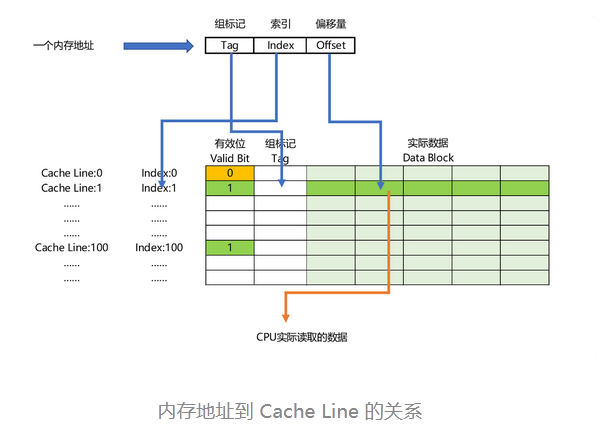

而内存地址对应到 Cache 里的数据结构，则多了一个有效位和对应的数据，由“索引 + 有效位 + 组标记 + 数据”组成。如果内存中的数据已经在 CPU Cache 里了，那一个内存地址的访问，就会经历这样 4 个步骤：

- 根据内存地址的低位，计算在 Cache 中的索引；

- 判断有效位，确认 Cache 中的数据是有效的；

- 对比内存访问地址的高位，和 Cache 中的组标记，确认 Cache 中的数据就是我们要访问的内存数据，从 Cache Line 中读取到对应的数据块（Data Block）；

- 根据内存地址的 Offset 位，从 Data Block 中，读取希望读取到的字。

如果在 2、3 这两个步骤中，CPU 发现，Cache 中的数据并不是要访问的内存地址的数据，那 CPU 就会访问内存，并把对应的 Block Data 更新到 Cache Line 中，同时更新对应的有效位和组标记的数据。

其实，除了直接映射 Cache 之外，我们常见的缓存放置策略还有全相连 Cache（Fully Associative Cache）、`组相连 Cache（Set Associative Cache）`。这几种策略的数据结构都是相似的，理解了最简单的直接映射 Cache，其他的策略你很容易就能理解了。

[CPU 和内存之间的访问性能](https://people.freebsd.org/~lstewart/articles/cpumemory.pdf)

## 2、CPU写数据到内存

`volatile 这个关键字有什么作用？它会确保我们对于这个变量的读取和写入，都一定会同步到主内存里，而不是从 Cache 里面读取`

```java

// 一种错误的理解，是把volatile关键词，当成是一个锁，可以把long/double这样的数的操作自动加锁
private volatile long synchronizedValue = 0;

// 另一种错误的理解，是把volatile关键词，当成可以让整数自增的操作也变成原子性的
private volatile int atomicInt = 0;
amoticInt++;
```

volatile 关键字的最核心知识点，要关系到 Java 内存模型（JMM，Java Memory Model）上。

虽然 JMM 只是 Java 虚拟机这个进程级虚拟机里的一个内存模型，但是这个内存模型，和计算机组成里的 CPU、高速缓存和主内存组合在一起的硬件体系非常相似。理解了 JMM，可以让你很容易理解计算机组成里 CPU、高速缓存和主内存之间的关系。

虽然 Java 内存模型是一个隔离了硬件实现的虚拟机内的抽象模型，但是它给了我们一个很好的“缓存同步”问题的示例。也就是说，如果我们的数据，在不同的线程或者 CPU 核里面去更新，因为不同的线程或 CPU 核有着自己各自的缓存，很有可能在 A 线程的更新，到 B 线程里面是看不见的。


我们现在用的 Intel CPU，通常都是多核的的。每一个 CPU 核里面，都有独立属于自己的 L1、L2 的 Cache，然后再有多个 CPU 核共用的 L3 的 Cache、主内存。因为 CPU Cache 的访问速度要比主内存快很多，而在 CPU Cache 里面，L1/L2 的 Cache 也要比 L3 的 Cache 快。所以，CPU 始终都是尽可能地从 CPU Cache 中去获取数据，而不是每一次都要从主内存里面去读取数据。


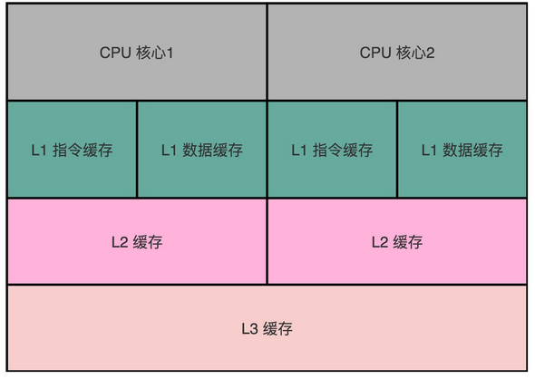

这个层级结构，就好像我们在 Java 内存模型里面，每一个线程都有属于自己的线程栈。线程在读取 COUNTER 的数据的时候，其实是从本地的线程栈的 Cache 副本里面读取数据，而不是从主内存里面读取数据。如果我们对于数据仅仅只是读，问题还不大.但是，对于数据，我们不光要读，还要去写入修改。这个时候，有两个问题来了。

`第一个问题是，写入 Cache 的性能也比写入主内存要快，那我们写入的数据，到底应该写到 Cache 里还是主内存呢？如果我们直接写入到主内存里，Cache 里的数据是否会失效呢？`

为了解决这些疑问，下面我要给你介绍两种写入策略。


### 1、写直达（Write-Through）

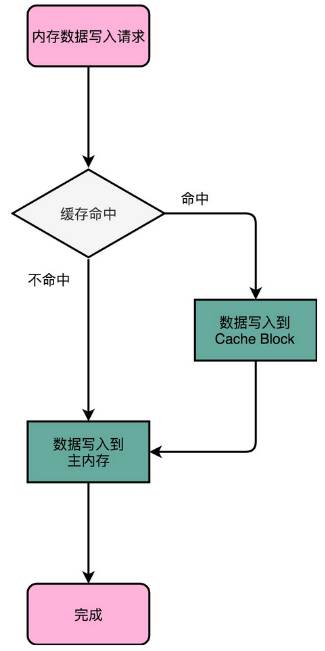

最简单的一种写入策略，叫作写直达（Write-Through）。在这个策略里，每一次数据都要写入到主内存里面。在写直达的策略里面，写入前，我们会先去判断数据是否已经在 Cache 里面了。如果数据已经在 Cache 里面了，我们先把数据写入更新到 Cache 里面，再写入到主内存里面；如果数据不在 Cache 里，我们就只更新主内存。

写直达的这个策略很直观，但是问题也很明显，那就是这个策略很慢。无论数据是不是在 Cache 里面，我们都需要把数据写到主内存里面。这个方式就有点儿像我们上面用 volatile 关键字，始终都要把数据同步到主内存里面。


### 2、写回（Write-Back）

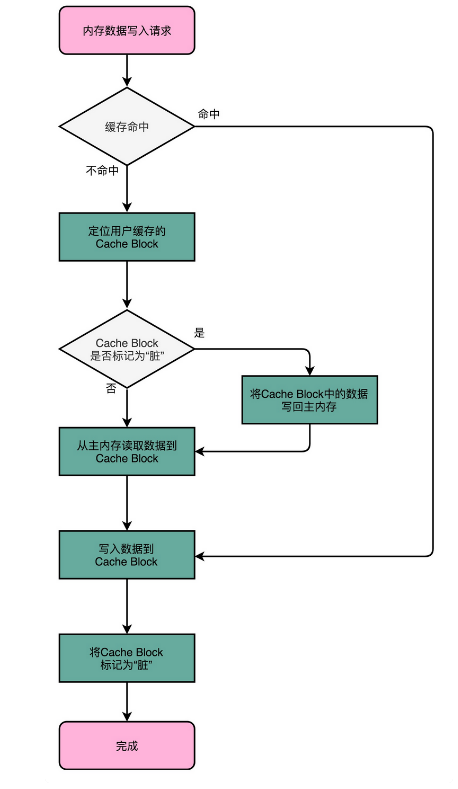

这个时候，我们就想了，既然我们去读数据也是默认从 Cache 里面加载，能否不用把所有的写入都同步到主内存里呢？只写入 CPU Cache 里面是不是可以？

当然是可以的。在 CPU Cache 的写入策略里，还有一种策略就叫作写回（Write-Back）。这个策略里，我们不再是每次都把数据写入到主内存，而是只写到 CPU Cache 里。只有当 CPU Cache 里面的数据要被“替换”的时候，我们才把数据写入到主内存里面去。


写回策略的过程是这样的：如果发现我们要写入的数据，就在 CPU Cache 里面，那么我们就只是更新 CPU Cache 里面的数据。同时，我们会标记 CPU Cache 里的这个 Block 是脏（Dirty）的。所谓脏的，就是指这个时候，我们的 CPU Cache 里面的这个 Block 的数据，和主内存是不一致的。

如果我们发现，我们要写入的数据所对应的 Cache Block 里，放的是别的内存地址的数据，那么我们就要看一看，那个 Cache Block 里面的数据有没有被标记成脏的。如果是脏的话，我们要先把这个 Cache Block 里面的数据，写入到主内存里面。然后，再把当前要写入的数据，写入到 Cache 里，同时把 Cache Block 标记成脏的。如果 Block 里面的数据没有被标记成脏的，那么我们直接把数据写入到 Cache 里面，然后再把 Cache Block 标记成脏的就好了。

在用了写回这个策略之后，我们在加载内存数据到 Cache 里面的时候，也要多出一步同步脏 Cache 的动作。如果加载内存里面的数据到 Cache 的时候，发现 Cache Block 里面有脏标记，我们也要先把 Cache Block 里的数据写回到主内存，才能加载数据覆盖掉 Cache。

可以看到，在写回这个策略里，如果我们大量的操作，都能够命中缓存。那么大部分时间里，我们都不需要读写主内存，自然性能会比写直达的效果好很多。

然而，无论是写回还是写直达，其实都还没有解决我们在上面 volatile 程序示例中遇到的问题，也就是`多个线程，或者是多个 CPU 核的缓存一致性的问题`。这也就是我们在写入修改缓存后，需要解决的第二个问题。

要解决这个问题，我们需要引入一个新的方法，叫作 MESI 协议。这是一个维护缓存一致性协议。这个协议不仅可以用在 CPU Cache 之间，也可以广泛用于各种需要使用缓存，同时缓存之间需要同步的场景下。


### 3、MESI协议：如何让多核CPU的高速缓存保持一致？

多核 CPU 有很多好处，其中最重要的一个就是，它使得我们在不能提升 CPU 的主频之后，找到了另一种提升 CPU 吞吐率的办法。我们把多核和 CPU Cache 两者一结合，就给我们带来了一个新的挑战。因为 CPU 的每个核各有各的缓存，互相之间的操作又是各自独立的，就会带来缓存一致性（Cache Coherence）的问题。


#### 1、缓存一致性问题


那什么是缓存一致性呢？我们拿一个有两个核心的 CPU，来看一下。你可以看这里这张图，我们结合图来说。

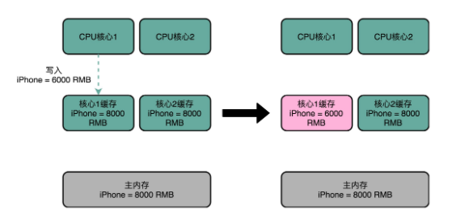

比方说，iPhone 降价了，我们要把 iPhone 最新的价格更新到内存里。为了性能问题，它采用了上一讲我们说的写回策略，先把数据写入到 L2 Cache 里面，然后把 Cache Block 标记成脏的。这个时候，数据其实并没有被同步到 L3 Cache 或者主内存里。1 号核心希望在这个 Cache Block 要被交换出去的时候，数据才写入到主内存里。


如果我们的 CPU 只有 1 号核心这一个 CPU 核，那这其实是没有问题的。不过，我们旁边还有一个 2 号核心呢！这个时候，2 号核心尝试从内存里面去读取 iPhone 的价格，结果读到的是一个错误的价格。这是因为，iPhone 的价格刚刚被 1 号核心更新过。但是这个更新的信息，只出现在 1 号核心的 L2 Cache 里，而没有出现在 2 号核心的 L2 Cache 或者主内存里面。这个问题，就是所谓的缓存一致性问题，1 号核心和 2 号核心的缓存，在这个时候是不一致的。

为了解决这个缓存不一致的问题，我们就需要有一种机制，来同步两个不同核心里面的缓存数据。那这样的机制需要满足什么条件呢？我觉得能够做到下面两点就是合理的。


第一点叫`写传播（Write Propagation）`。写传播是说，在一个 CPU 核心里，我们的 Cache 数据更新，必须能够传播到其他的对应节点的 Cache Line 里。


第二点叫`事务的串行化（Transaction Serialization）`，事务串行化是说，我们在一个 CPU 核心里面的读取和写入，在其他的节点看起来，顺序是一样的。


第一点写传播很容易理解。既然我们数据写完了，自然要同步到其他 CPU 核的 Cache 里。但是第二点事务的串行化，可能没那么好理解，我这里仔细解释一下。我们还拿刚才修改 iPhone 的价格来解释。这一次，我们找一个有 4 个核心的 CPU。1 号核心呢，先把 iPhone 的价格改成了 5000 块。差不多在同一个时间，2 号核心把 iPhone 的价格改成了 6000 块。这里两个修改，都会传播到 3 号核心和 4 号核心。

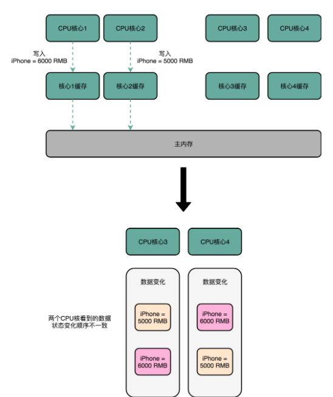


然而这里有个问题，3 号核心先收到了 2 号核心的写传播，再收到 1 号核心的写传播。所以 3 号核心看到的 iPhone 价格是先变成了 6000 块，再变成了 5000 块。而 4 号核心呢，是反过来的，先看到变成了 5000 块，再变成 6000 块。虽然写传播是做到了，但是各个 Cache 里面的数据，是不一致的。


事实上，我们需要的是，从 1 号到 4 号核心，都能看到相同顺序的数据变化。比如说，都是先变成了 5000 块，再变成了 6000 块。这样，我们才能称之为实现了事务的串行化。事务的串行化，不仅仅是缓存一致性中所必须的。比如，我们平时所用到的系统当中，最需要保障事务串行化的就是数据库。多个不同的连接去访问数据库的时候，我们必须保障事务的串行化，做不到事务的串行化的数据库，根本没法作为可靠的商业数据库来使用。


而在 CPU Cache 里做到事务串行化，需要做到两点，第一点是一个 CPU 核心对于数据的操作，需要同步通信给到其他 CPU 核心。第二点是，如果两个 CPU 核心里有同一个数据的 Cache，那么对于这个 Cache 数据的更新，需要有一个“锁”的概念。只有拿到了对应 Cache Block 的“锁”之后，才能进行对应的数据更新。接下来，我们就看看实现了这两个机制的 MESI 协议。

#### 2、总线嗅探机制和 MESI 协议

要解决缓存一致性问题，首先要解决的是多个 CPU 核心之间的数据传播问题。最常见的一种解决方案呢，叫作总线嗅探（Bus Snooping）。


这个策略，本质上就是把所有的读写请求都通过总线（Bus）广播给所有的 CPU 核心，然后让各个核心去“嗅探”这些请求，再根据本地的情况进行响应。总线本身就是一个特别适合广播进行数据传输的机制，所以总线嗅探这个办法也是我们日常使用的 Intel CPU 进行缓存一致性处理的解决方案。

基于总线嗅探机制，其实还可以分成很多种不同的缓存一致性协议。不过其中最常用的，就是今天我们要讲的 MESI 协议。和很多现代的 CPU 技术一样，MESI 协议也是在 Pentium 时代，被引入到 Intel CPU 中的。


MESI 协议，是一种叫作`写失效`（Write Invalidate）的协议。在写失效协议里，只有一个 CPU 核心负责写入数据，其他的核心，只是同步读取到这个写入。在这个 CPU 核心写入 Cache 之后，它会去广播一个“失效”请求告诉所有其他的 CPU 核心。其他的 CPU 核心，只是去判断自己是否也有一个“失效”版本的 Cache Block，然后把这个也标记成失效的就好了。

相对于写失效协议，还有一种叫作`写广播`（Write Broadcast）的协议。在那个协议里，一个写入请求广播到所有的 CPU 核心，同时更新各个核心里的 Cache。

写广播在实现上自然很简单，但是写广播需要占用更多的总线带宽。写失效只需要告诉其他的 CPU 核心，哪一个内存地址的缓存失效了，但是写广播还需要把对应的数据传输给其他 CPU 核心。

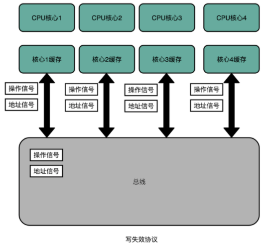

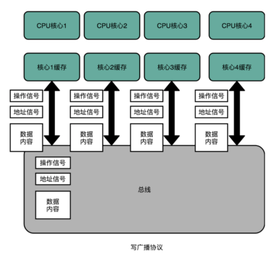


MESI 协议的由来呢，来自于我们对 Cache Line 的四个不同的标记，分别是：
- M：代表已修改（Modified）
- E：代表独占（Exclusive）
- S：代表共享（Shared）
- I：代表已失效（Invalidated）

我们先来看看“已修改”和“已失效”，这两个状态比较容易理解。所谓的“已修改”，就是我们上一讲所说的“脏”的 Cache Block。Cache Block 里面的内容我们已经更新过了，但是还没有写回到主内存里面。而所谓的“已失效“，自然是这个 Cache Block 里面的数据已经失效了，我们不可以相信这个 Cache Block 里面的数据。

然后，我们再来看“独占”和“共享”这两个状态。这就是 MESI 协议的精华所在了。无论是独占状态还是共享状态，缓存里面的数据都是“干净”的。这个“干净”，自然对应的是前面所说的“脏”的，也就是说，这个时候，Cache Block 里面的数据和主内存里面的数据是一致的。

那么“独占”和“共享”这两个状态的差别在哪里呢？这个差别就在于，在独占状态下，对应的 Cache Line 只加载到了当前 CPU 核所拥有的 Cache 里。其他的 CPU 核，并没有加载对应的数据到自己的 Cache 里。这个时候，如果要向独占的 Cache Block 写入数据，我们可以自由地写入数据，而不需要告知其他 CPU 核。

在独占状态下的数据，如果收到了一个来自于总线的读取对应缓存的请求，它就会变成共享状态。这个共享状态是因为，这个时候，另外一个 CPU 核心，也把对应的 Cache Block，从内存里面加载到了自己的 Cache 里来。


而在共享状态下，因为同样的数据在多个 CPU 核心的 Cache 里都有。所以，当我们想要更新 Cache 里面的数据的时候，不能直接修改，而是要先向所有的其他 CPU 核心广播一个请求，要求先把其他 CPU 核心里面的 Cache，都变成无效的状态，然后再更新当前 Cache 里面的数据。这个广播操作，一般叫作 RFO（Request For Ownership），也就是获取当前对应 Cache Block 数据的所有权。

有没有觉得这个操作有点儿像我们在多线程里面用到的读写锁。在共享状态下，大家都可以并行去读对应的数据。但是如果要写，我们就需要通过一个锁，获取当前写入位置的所有权。

整个 MESI 的状态，可以用一个有限状态机来表示它的状态流转。需要注意的是，对于不同状态触发的事件操作，可能来自于当前 CPU 核心，也可能来自总线里其他 CPU 核心广播出来的信号。

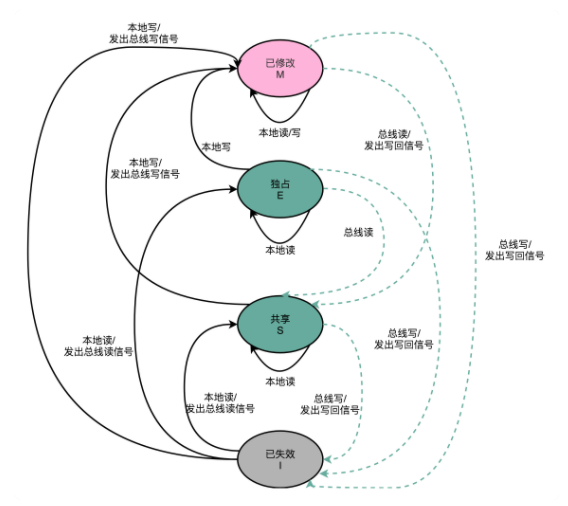

https://commons.wikimedia.org/wiki/File:Diagrama_MESI.GIF


# 4、内存\主存

主存是一个临时存储设备，在处理器执行程序时，用来存放程序和程序处理的数据。从物理上来说，主存是由一组动态随机存取存储器（DRAM）芯片组成的。从逻辑上来说，存储器是一个线性的字节数组，每个字节都有其唯一的地址（即数组索引），这些地址是从零开始的。一般来说，组成程序的每条机器指令都由不同数量的字节构成。

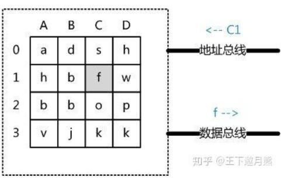


现代 DRAM 的结构和存取原理比较复杂，这里抽象出一个十分简单的存取模型来说明 DRAM 的工作原理。从抽象角度看，主存是一系列的存储单元组成的矩阵，每个存储单元存储固定大小的数据。每个存储单元有唯一的地址，现代主存的编址规则比较复杂，这里将其简化成一个二维地址：通过一个行地址和一个列地址可以唯一定位到一个存储单元。

当系统需要读取主存时，则将地址信号放到地址总线上传给主存，主存读到地址信号后，解析信号并定位到指定存储单元，然后将此存储单元数据放到数据总线上，供其它部件读取。写主存的过程类似，系统将要写入单元地址和数据分别放在地址总线和数据总线上，主存读取两个总线的内容，做相应的写操作。这里可以看出，主存存取的时间仅与存取次数呈线性关系，因为不存在机械操作，两次存取的数据的“距离”不会对时间有任何影响，例如，先取 A0 再取 A1 和先取 A0 再取 D3 的时间消耗是一样的。


计算机有五大组成部分，分别是：运算器、控制器、存储器、输入设备和输出设备。如果说计算机最重要的组件，是承担了运算器和控制器作用的 CPU，那内存就是第二重要的组件了。内存是五大组成部分里面的存储器，我们的指令和数据，都需要先加载到内存里面，才会被 CPU 拿去执行。

`程序并不能直接访问物理内存。`

我们的内存需要被分成固定大小的页（Page），然后再通过虚拟内存地址（Virtual Address）到物理内存地址（Physical Address）的地址转换（Address Translation），才能到达实际存放数据的物理内存位置。而我们的程序看到的内存地址，都是虚拟内存地址。既然如此，这些虚拟内存地址究竟是怎么转换成物理内存地址的呢？


## 1、简单页表

想要把虚拟内存地址，映射到物理内存地址，最直观的办法，就是来建一张映射表。这个映射表，能够实现虚拟内存里面的页，到物理内存里面的页的一一映射。这个映射表，在计算机里面，就叫作页表（Page Table）。页表这个地址转换的办法，会把一个内存地址分成页号（Directory）和偏移量（Offset）两个部分。这么说太理论了，我以一个 32 位的内存地址为例，帮你理解这个概念。

其实，前面的高位，就是内存地址的页号。后面的低位，就是内存地址里面的偏移量。做地址转换的页表，只需要保留虚拟内存地址的页号和物理内存地址的页号之间的映射关系就可以了。同一个页里面的内存，在物理层面是连续的。以一个页的大小是 4K 字节（4KB）为例，我们需要 20 位的高位，12 位的低位。


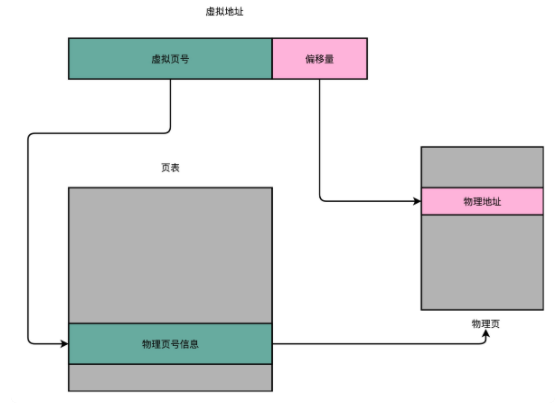

总结一下，对于一个内存地址转换，其实就是这样三个步骤：
- 1、把虚拟内存地址，切分成页号和偏移量的组合；
- 2、从页表里面，查询出虚拟页号，对应的物理页号；
- 3、直接拿物理页号，加上前面的偏移量，就得到了物理内存地址。

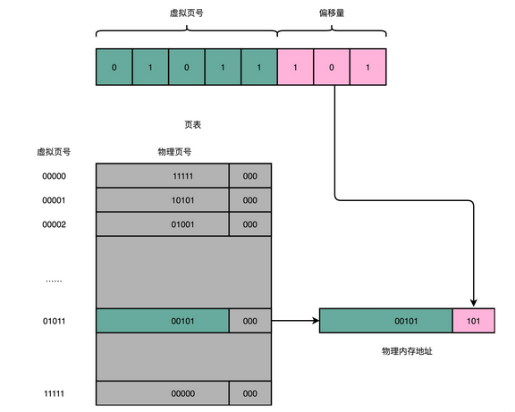


看起来这个逻辑似乎很简单，很容易理解，不过问题马上就来了。你能算一算，这样一个页表需要多大的空间吗？我们以 32 位的内存地址空间为例

32 位的内存地址空间，页表一共需要记录 2^20 个到物理页号的映射关系。这个存储关系，就好比一个 2^20 大小的数组。一个页号是完整的 32 位的 4 字节（Byte），这样一个页表就需要 4MB 的空间。听起来 4MB 的空间好像还不大啊，毕竟我们现在的内存至少也有 4GB，服务器上有个几十 GB 的内存和很正常。

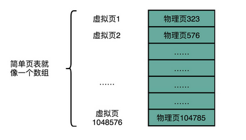

不过，这个空间可不是只占用一份哦。我们每一个进程，都有属于自己独立的虚拟内存地址空间。这也就意味着，每一个进程都需要这样一个页表。不管我们这个进程，是个本身只有几 KB 大小的程序，还是需要几 GB 的内存空间，都需要这样一个页表。

这还只是 32 位的内存地址空间，现在大家用的内存，多半已经超过了 4GB，也已经用上了 64 位的计算机和操作系统。这样的话，用上面这个数组的数据结构来保存页面，内存占用就更大了。那么，我们有没有什么更好的解决办法呢？

## 2、多级页表

仔细想一想，我们其实没有必要存下这 2^20 个物理页表啊。大部分进程所占用的内存是有限的，需要的页也自然是很有限的。我们只需要去存那些用到的页之间的映射关系就好了。如果你对数据结构比较熟悉，你可能要说了，那我们是不是应该用哈希表（Hash Map）这样的数据结构呢？很可惜你猜错了：）。在实践中，我们其实采用的是一种叫作多级页表（Multi-Level Page Table）的解决方案。这是为什么呢？为什么我们不用哈希表而用多级页表呢？

我们先来看一看，一个进程的内存地址空间是怎么分配的。在整个进程的内存地址空间，通常是“两头实、中间空”。在程序运行的时候，`内存地址从顶部往下，不断分配占用的栈的空间。而堆的空间，内存地址则是从底部往上，是不断分配占用的。`

所以，在一个实际的程序进程里面，虚拟内存占用的地址空间，通常是两段连续的空间。而不是完全散落的随机的内存地址。而多级页表，就特别适合这样的内存地址分布。我们以一个 4 级的多级页表为例，来看一下。同样一个虚拟内存地址，偏移量的部分和上面简单页表一样不变，但是原先的页号部分，我们把它拆成四段，从高到低，分成 4 级到 1 级这样 4 个页表索引。

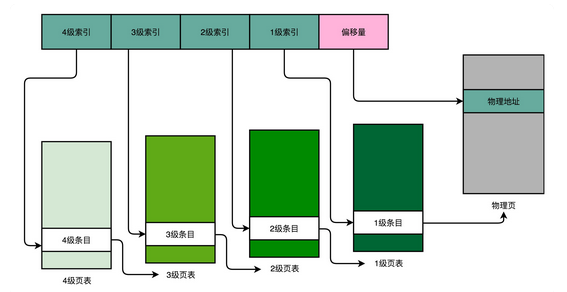

对应的，一个进程会有一个 4 级页表。我们先通过 4 级页表索引，找到 4 级页表里面对应的条目（Entry）。这个条目里存放的是一张 3 级页表所在的位置。4 级页面里面的每一个条目，都对应着一张 3 级页表，所以我们可能有多张 3 级页表。找到对应这张 3 级页表之后，我们用 3 级索引去找到对应的 3 级索引的条目。3 级索引的条目再会指向一个 2 级页表。同样的，2 级页表里我们可以用 2 级索引指向一个 1 级页表。而最后一层的 1 级页表里面的条目，对应的数据内容就是物理页号了。在拿到了物理页号之后，我们同样可以用“页号 + 偏移量”的方式，来获取最终的物理内存地址。

我们可能有很多张 1 级页表、2 级页表，乃至 3 级页表。但是，因为实际的虚拟内存空间通常是连续的，我们很可能只需要很少的 2 级页表，甚至只需要 1 张 3 级页表就够了。


事实上，多级页表就像一个多叉树的数据结构，所以我们常常称它为页表树（Page Table Tree）。因为虚拟内存地址分布的连续性，树的第一层节点的指针，很多就是空的，也就不需要有对应的子树了。所谓不需要子树，其实就是不需要对应的 2 级、3 级的页表。找到最终的物理页号，就好像通过一个特定的访问路径，走到树最底层的叶子节点。

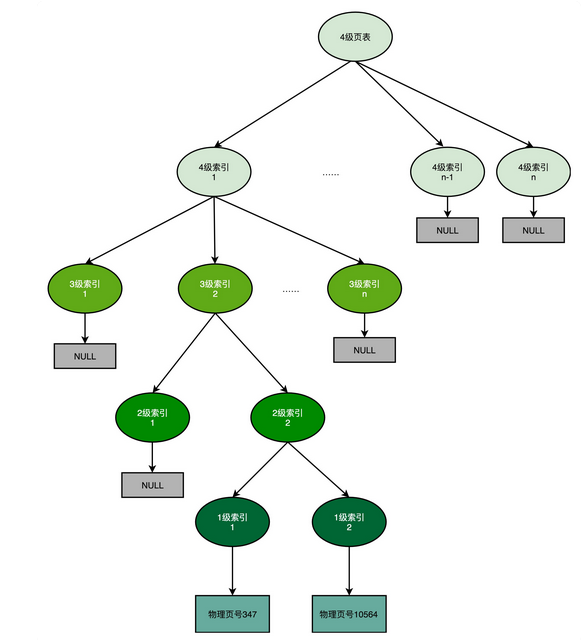

以这样的分成 4 级的多级页表来看，每一级如果都用 5 个比特表示。那么每一张某 1 级的页表，只需要 2^5=32 个条目。如果每个条目还是 4 个字节，那么一共需要 128 个字节。`这是页表占用的内存大小`

而一个 1 级索引表，对应 32 个 4KB 的也就是 128KB 的大小。一个填满的 2 级索引表，对应的就是 32 个 1 级索引表，也就是 4MB 的大小。`这个4kb代表一个页大小。含义是一个一级索引表可以表示的内存大小`

我们可以一起来测算一下，一个进程如果占用了 8MB 的内存空间，分成了 2 个 4MB 的连续空间。那么，它一共需要 2 个独立的、填满的 2 级索引表，也就意味着 64 个 1 级索引表，2 个独立的 3 级索引表，1 个 4 级索引表。一共需要 69 个索引表，每个 128 字节，大概就是 9KB 的空间。比起 4MB 来说，只有差不多 1/500。

`问题：这里计算的是1个四级+2个三级+2个二级+64个一级=69，为什么需要2个三级，而不是一个？`

不过，多级页表虽然节约了我们的存储空间，却带来了时间上的开销，所以它其实是一个“以时间换空间”的策略。原本我们进行一次地址转换，只需要访问一次内存就能找到物理页号，算出物理内存地址。但是，用了 4 级页表，我们就需要访问 4 次内存，才能找到物理页号了。

我们在前面两讲讲过，内存访问其实比 Cache 要慢很多。我们本来只是要做一个简单的地址转换，反而是一下子要多访问好多次内存。对于这个时间层面的性能损失，我们有没有什么更好的解决办法呢？


https://www.polarxiong.com/archives/%E5%A4%9A%E7%BA%A7%E9%A1%B5%E8%A1%A8%E5%A6%82%E4%BD%95%E8%8A%82%E7%BA%A6%E5%86%85%E5%AD%98.html


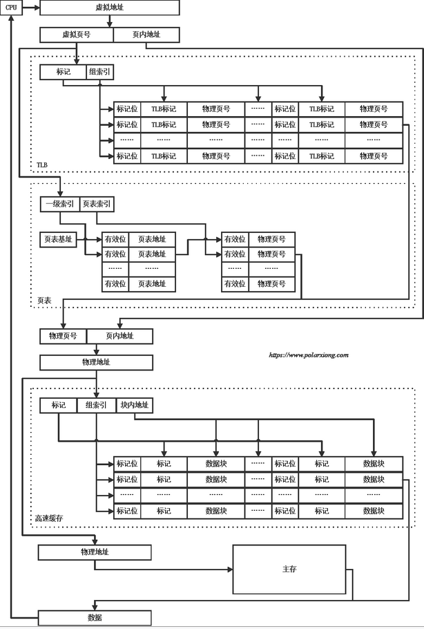

注意事项

- TLB采用组相联
- 页表采用两级页表
- cache采用组相联
- cache仅考虑L1 d-cache，不考虑L1 i-cache、L2 cache和L3 cache
- 未考虑页表缺页
- 简化了cache未命中情况

https://www.polarxiong.com/archives/%E5%9B%BE%E8%A7%A3%E8%99%9A%E6%8B%9F%E5%9C%B0%E5%9D%80%E5%88%B0%E7%89%A9%E7%90%86%E5%9C%B0%E5%9D%80%E7%9A%84%E7%BF%BB%E8%AF%91%E4%BB%A5%E5%8F%8A%E6%95%B0%E6%8D%AE%E7%9A%84%E8%8E%B7%E5%8F%96-TLB-%E9%A1%B5%E8%A1%A8-cache.html


https://www.polarxiong.com/archives/%E4%BB%8E%E8%99%9A%E6%8B%9F%E5%86%85%E5%AD%98%E7%9C%8B%E5%8F%AF%E6%89%A7%E8%A1%8C%E6%96%87%E4%BB%B6%E7%9A%84%E8%A3%85%E8%BD%BD.html


# 5、磁盘

`SSD（Solid-state drive 或 Solid-state disk，固态硬盘）、HDD（Hard Disk Drive，硬盘）`

磁盘是一种直接存取的存储设备 (DASD)。它是以存取时间变化不大为特征的。可以直接存取任何字符组，且容量大、速度较其它外存设备更快。磁盘是一个扁平的圆盘(与电唱机的唱片类似)，盘面上有许多称为磁道的圆圈，数据就记录在这些磁道上。磁盘可以是单片的，也可以是由若干盘片组成的盘组，每一盘片上有两个面。如下图中所示的 6 片盘组为例，除去最顶端和最底端的外侧面不存储数据之外，一共有 10 个面可以用来保存信息。

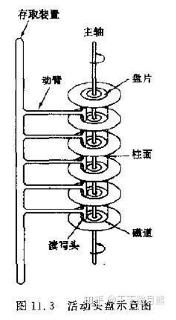


当磁盘驱动器执行读 / 写功能时。盘片装在一个主轴上，并绕主轴高速旋转，当磁道在读 / 写头 ( 又叫磁头 ) 下通过时，就可以进行数据的读 / 写了。一般磁盘分为固定头盘 ( 磁头固定 ) 和活动头盘。固定头盘的每一个磁道上都有独立的磁头，它是固定不动的，专门负责这一磁道上数据的读 / 写。活动头盘 ( 如上图 ) 的磁头是可移动的。每一个盘面上只有一个磁头 ( 磁头是双向的，因此正反盘面都能读写 )。它可以从该面的一个磁道移动到另一个磁道。所有磁头都装 在同一个动臂上，因此不同盘面上的所有磁头都是同时移动的 ( 行动整齐划一 )。当盘片绕主轴旋转的时候，磁头与旋转的盘片形成一个圆柱体。各个盘面上半径相 同的磁道组成了一个圆柱面，我们称为柱面。因此，柱面的个数也就是盘面上的磁道数。

磁盘上数据必须用一个三维地址唯一标示：柱面号、盘面号、块号 ( 磁道上的盘块 )。读 / 写磁盘上某一指定数据需要下面 3 个步骤: 

(1) 首先移动臂根据柱面号使磁头移动到所需要的柱面上，这一过程被称为定位或查找。如上图 11.3 中所示的 6 盘组示意图中，所有磁头都定位到了 10 个盘面的 10 条磁道上 ( 磁头都是双向的 )。这时根据盘面号来确定指定盘面上的磁道。 寻道时间越短，I/O操作越快，目前磁盘的平均寻道时间一般在3－15ms。
 
(2) 盘面确定以后，盘片开始旋转，将指定块号的磁道段移动至磁头下。

经过上面三个步骤，指定数据的存储位置就被找到。这时就可以开始读 / 写操作了。访问某一具体信息，由 3 部分时间组成：

- 1、查找时间 (seek time) Ts: 完成上述步骤 (1) 所需要的时间。这部分时间代价最高，最大可达到 0.1s 左右。

- 2、等待时间\旋转延迟  (latency time) Tl: 完成上述步骤 (2) 所需要的时间。由于盘片绕主轴旋转速度很快，一般为 7200 转 / 分 ( 电脑硬盘的性能指标之一 , 家用的普通硬盘的转速一般有 5400rpm( 笔记本 )、7200rpm 几种 )。因此一般旋转一圈大约 0.0083s。

- 3、传输时间 (transmission time) Tt: 数据通过系统总线传送到内存的时间，一般传输一个字节 (byte) 大概 0.02us=2*10^(-8)s


磁盘读取数据是以盘块(block)为基本单位的。位于同一盘块中的所有数据都能被一次性全部读取出来。而磁盘 IO 代价主要花费在查找时间 Ts 上。因此我们应该尽量将相关信息存放在同一盘块，同一磁道中。或者至少放在同一柱面或相邻柱面上，以求在读/写信息时尽量减少磁头来回移动的次数，避免过多的查找时间Ts。所以，在大规模数据存储方面，大量数据存储在外存磁盘中，而在外存磁盘中读取 / 写入块 (block) 中某数据时，首先需要定位到磁盘中的某块，如何有效地查找磁盘中的数据，需要一种合理高效的外存数据结构。

> 常见磁盘平均物理寻道时间为：

- 7200转/分的STAT硬盘平均物理寻道时间是9ms
- 10000转/分的STAT硬盘平均物理寻道时间是6ms
- 15000转/分的SAS硬盘平均物理寻道时间是4ms

 

> 常见硬盘的旋转延迟时间为：

- 7200   rpm的磁盘平均旋转延迟大约为60*1000/7200/2 = 4.17ms
- 10000 rpm的磁盘平均旋转延迟大约为60*1000/10000/2 = 3ms，
- 15000 rpm的磁盘其平均旋转延迟约为60*1000/15000/2 = 2ms。

> 最大IOPS的理论计算方法

IOPS = 1000 ms/ (寻道时间 + 旋转延迟)。可以忽略数据传输时间。

- 7200   rpm的磁盘 IOPS = 1000 / (9 + 4.17)  = 76 IOPS
- 10000 rpm的磁盘IOPS = 1000 / (6+ 3) = 111 IOPS
- 15000 rpm的磁盘IOPS = 1000 / (4 + 2) = 166 IOPS


## 1、iops

iops = 1/ 一次随机io耗时（查找时间+等待时间+传输时间）

IOPS (Input/Output Per Second)即每秒的输入输出量(或读写次数)，是衡量磁盘性能的主要指标之一。IOPS是指单位时间内系统能处理的I/O请求数量，一般以每秒处理的I/O请求数量为单位，I/O请求通常为读或写数据操作请求。

随机读写频繁的应用，如小文件存储(图片)、OLTP数据库、邮件服务器，关注随机读写性能，IOPS是关键衡量指标。

顺序读写频繁的应用，传输大量连续数据，如电视台的视频编辑，视频点播VOD(Video On Demand)，关注连续读写性能。数据吞吐量是关键衡量指标。


IOPS和数据吞吐量适用于不同的场合：
- 读取10000个1KB文件，用时10秒  Throught(吞吐量)=1MB/s ，IOPS=1000  追求IOPS
- 读取1个10MB文件，用时0.2秒  Throught(吞吐量)=50MB/s, IOPS=5  追求吞吐量

`机械硬盘的 IOPS 从 100 提升到 300、500 也就到头了，一块普通的 SSD 硬盘，可以轻松支撑 10000 乃至 20000 的 IOPS。`


## 2、响应时间（Response Time）

这个指标，其实就是程序发起一个硬盘的写入请求，直到这个请求返回的时间。


## 3、数据传输率（Data Transfer Rate）即吞吐率


## 4、iowait


# 6、总线


针对数据库选型的时候，需要考虑各自的场景，比如顺序读写还是随机读写，搞清楚固定硬盘和机械硬盘之间的差异，选择合适的数据库；


# 参考

- [一文了解数据库索引：哈希、B-Tree 与 LSM](https://zhuanlan.zhihu.com/p/60969786)

- [磁盘性能指标--IOPS 理论](https://www.iteye.com/blog/elf8848-1731274)


书籍

数据密集型应用系统设计

https://book.douban.com/subject/30329536/
