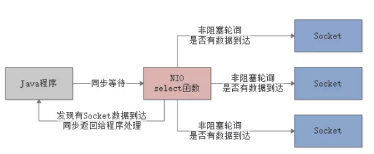
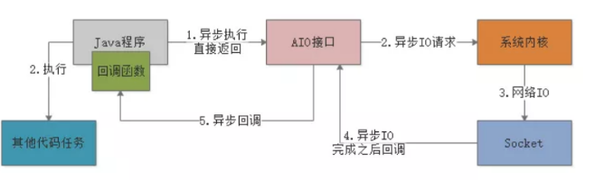

<!-- TOC -->

- [1、java中的IO模型](#1java中的io模型)
    - [1、JDK 1.4之前的同步阻塞IO](#1jdk-14之前的同步阻塞io)
    - [2、JDK 1.4之后的同步非阻塞NIO](#2jdk-14之后的同步非阻塞nio)
    - [3、NIO网络通信与IO多路复用模型[同步非阻塞]](#3nio网络通信与io多路复用模型同步非阻塞)
    - [4、AIO以及异步IO模型](#4aio以及异步io模型)
- [参考](#参考)

<!-- /TOC -->

# 1、java中的IO模型

## 1、JDK 1.4之前的同步阻塞IO

在JDK 1.4之前，主要就是同步阻塞IO模型，在Java里叫做BIO。

在Java代码里调用IO相关接口，发起IO操作之后，Java程序就会同步等待，这个同步指的是Java程序调用IO API接口的层面而言。

而IO API在底层的IO操作是基于阻塞IO来的，向操作系统内核发起IO请求，系统内核会等待数据就位之后，才会执行IO操作，执行完毕了才会返回。

## 2、JDK 1.4之后的同步非阻塞NIO

在JDK 1.4之后提供了NIO，他的概念是同步非阻塞，也就是说如果你调用NIO接口去执行IO操作，其实还是同步等待的，但是在底层的IO操作上 ，会对系统内核发起非阻塞IO请求，以非阻塞的形式来执行IO。

也就是说，如果底层数据没到位，那么内核返回异常信息，不会阻塞住，但是NIO接口内部会采用非阻塞方式过一会儿再次调用内核发起IO请求，直到成功为止。

但是之所以说是同步非阻塞，这里的“同步”指的就是因为在你的Java代码调用NIO接口层面是同步的，你还是要同步等待底层IO操作真正完成了才可以返回，只不过在执行底层IO的时候采用了非阻塞的方式来执行罢了。

## 3、NIO网络通信与IO多路复用模型[同步非阻塞]

实际上，如果基于NIO进行网络通信，采取的就是多路复用的IO模型，这个多路复用IO模型针对的是网络通信中的IO场景来说的。

简单来说，就是在基于Socket进行网络通信的时候，如果有多个客户端跟你的服务端建立了Socket连接，那你就需要维护多个Socket连接。

而所谓的多路复用IO模型，就是说你的Java代码直接通过一个select函数调用，直接会进入一个同步等待的状态。

这也是为什么说NIO一定是“同步”的[???]，因为你必须在这里同步等待某个Socket连接有请求到来。

接着你就要同步等着select函数去对底层的多个 Socket 连接进行轮询，不断的查看各个 Socket 连接谁有请求到达，就可以让select函数返回，交给我们的Java程序来处理。

select函数在底层会通过非阻塞的方式轮询各个Socket，任何一个Socket如果没有数据到达，那么非阻塞的特性会立即返回一个信息。

然后select函数可以轮询下一个Socket，不会阻塞在某个Socket上，所以底层是基于这种非阻塞的模式来“监视”各个Socket谁有数据到达的。

这就是所谓的“同步非阻塞”，但是因为操作系统把上述工作都封装在一个select函数调用里了，可以对多路Socket连接同时进行监视，所以就把这种模型称之为“IO多路复用”模型。

通过这种IO多路复用的模型，就可以用一个线程，调用一个select函数，然后监视大量的客户端连接了，如下图。

## 4、AIO以及异步IO模型

最后就是JDK 1.7之后，又支持了AIO，也叫做NIO 2.0，他就支持异步IO模型了。

我们先说一下异步IO模型是什么意思。

简单来说，就是你的Java程序可以基于AIO API发起一个请求，比如说接收网络数据，AIO API底层会基于异步IO模型来调用操作系统内核。

此时不需要去管这个IO是否成功了，AIO接口会直接返回，你的Java程序也会直接返回。

然后，你的Java程序就可以去干别的事儿了。大家联想一下上面说的那个异步的例子，就可以理解这里为什么叫做异步了。

因为BIO、NIO都是同步的，你发起IO请求，都必须同步等待IO操作完成。

但是这里你发起一个IO请求，直接AIO接口就返回了，你就可以干别的事儿了，纯异步的方式。

不过你需要提供一个回调函数给AIO接口，一旦底层系统内核完成了具体的IO请求，比如网络读写之类的，就会回调你提供的回调函数。

比如说你要是通过网络读取数据，那么此时AIO接口就会把操作系统异步读取到的数据交给你的回调函数。

整个过程如下图：

# 参考

[朱小厮的博客-Java NIO？看这一篇就够了！](https://mp.weixin.qq.com/s/l8hodrbiBO_XHx8Jtbmpyw)