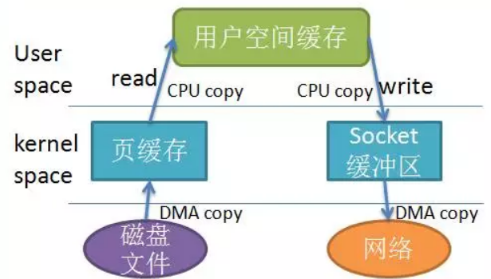
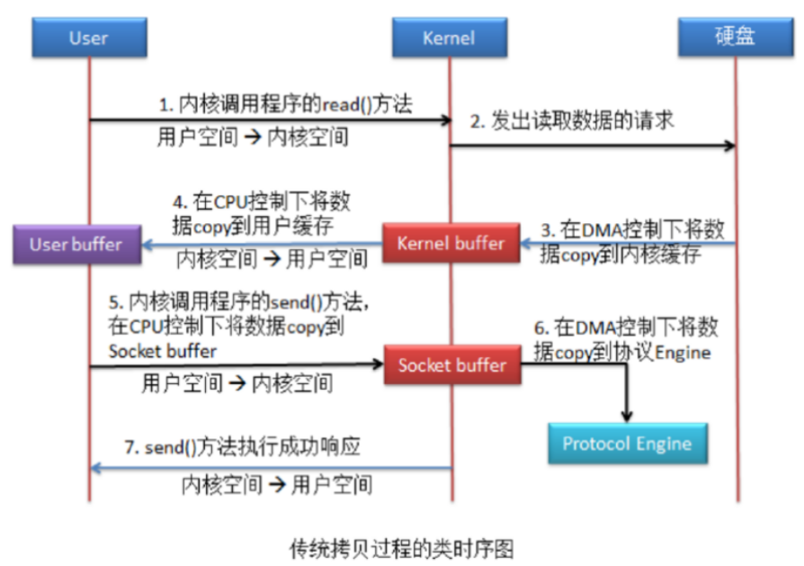
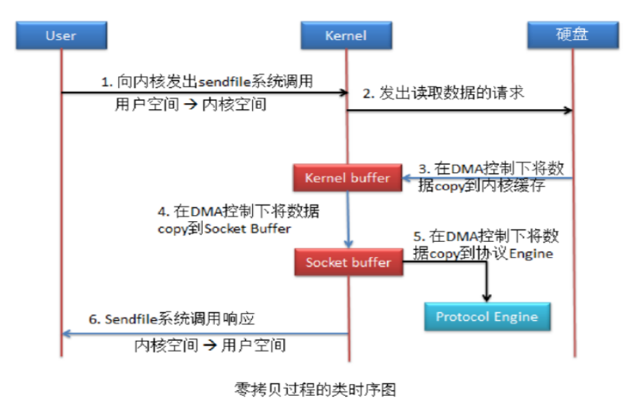
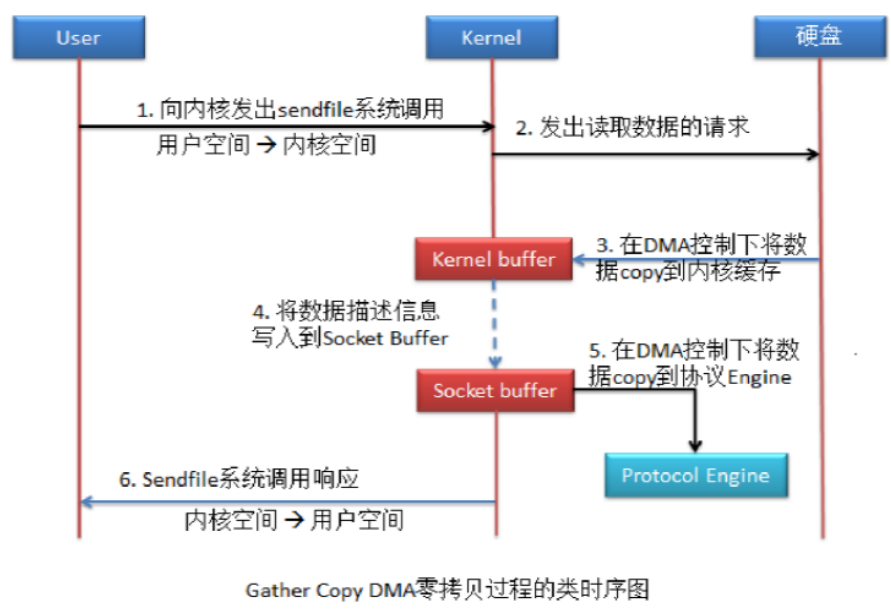
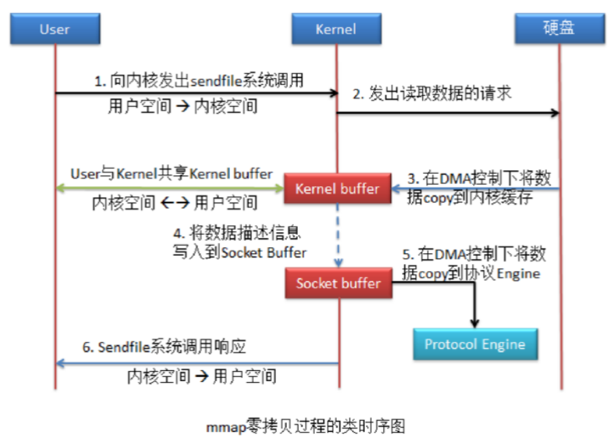
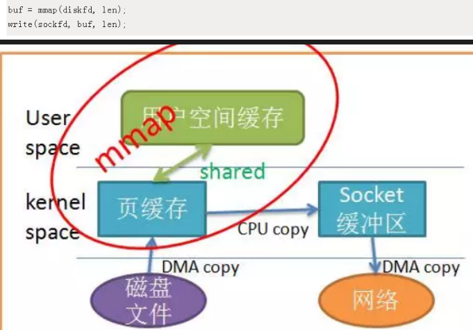
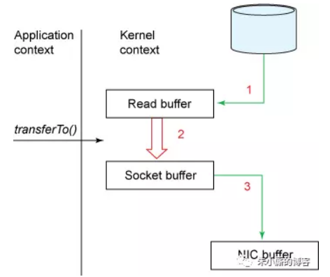
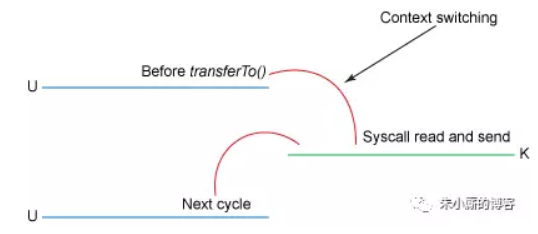
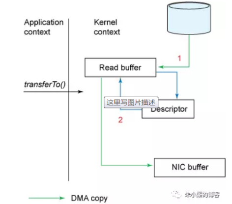

<!-- TOC -->

- [0、零拷贝](#0零拷贝)
    - [0、零拷贝技术分类](#0零拷贝技术分类)
    - [1、零拷贝概念](#1零拷贝概念)
    - [2、传统拷贝方式](#2传统拷贝方式)
    - [3、零拷贝方式](#3零拷贝方式)
    - [4、Gather Copy DMA 零拷贝方式（Direct Memory Access）](#4gather-copy-dma-零拷贝方式direct-memory-access)
    - [5、mmap 零拷贝](#5mmap-零拷贝)
- [1、java中的实现](#1java中的实现)
- [文章](#文章)

<!-- /TOC -->


# 0、零拷贝

> 缓存IO

缓存 IO 又被称作标准 IO，大多数文件系统的默认 IO 操作都是缓存 IO。在 Linux 的缓存 IO 机制中，操作系统会将 IO 的数据缓存在文件系统的页缓存（ page cache ）中，也就是说，数据会先被拷贝到操作系统内核的缓冲区中，然后才会从操作系统内核的缓冲区拷贝到应用程序的地址空间。

缓存 IO 的缺点：数据在传输过程中需要在应用程序地址空间和内核进行多次数据拷贝操作，这些数据拷贝操作所带来的 CPU 以及内存开销是非常大的。

## 0、零拷贝技术分类

零拷贝技术的发展很多样化，现有的零拷贝技术种类也非常多，而当前并没有一个适合于所有场景的零拷贝技术的出现。对于 Linux 来说，现存的零拷贝技术也比较多，这些零拷贝技术大部分存在于不同的 Linux 内核版本，有些旧的技术在不同的 Linux 内核版本间得到了很大的发展或者已经渐渐被新的技术所代替。本文针对这些零拷贝技术所适用的不同场景对它们进行了划分。概括起来，Linux 中的零拷贝技术主要有下面这几种：

- 1、直接 I/O

对于这种数据传输方式来说，应用程序可以直接访问硬件存储，操作系统内核只是辅助数据传输：这类零拷贝技术针对的是操作系统内核并不需要对数据进行直接处理的情况，数据可以在应用程序地址空间的缓冲区和磁盘之间直接进行传输，完全不需要 Linux 操作系统内核提供的页缓存的支持。

- 2、在数据传输的过程中，避免数据在操作系统内核地址空间的缓冲区和用户应用程序地址空间的缓冲区之间进行拷贝。

有的时候，应用程序在数据进行传输的过程中不需要对数据进行访问，那么，将数据从 Linux 的页缓存拷贝到用户进程的缓冲区中就可以完全避免，传输的数据在页缓存中就可以得到处理。在某些特殊的情况下，这种零拷贝技术可以获得较好的性能。Linux 中提供类似的系统调用主要有 mmap()，sendfile() 以及 splice()。

- 3、对数据在 Linux 的页缓存和用户进程的缓冲区之间的传输过程进行优化。

该零拷贝技术侧重于灵活地处理数据在用户进程的缓冲区和操作系统的页缓存之间的拷贝操作。这种方法延续了传统的通信方式，但是更加灵活。在Linux 中，该方法主要利用了写时复制技术。

前两类方法的目的主要是为了避免应用程序地址空间和操作系统内核地址空间这两者之间的缓冲区拷贝操作。这两类零拷贝技术通常适用在某些特殊的情况下，比如要传送的数据不需要经过操作系统内核的处理或者不需要经过应用程序的处理。

第三类方法则继承了传统的应用程序地址空间和操作系统内核地址空间之间数据传输的概念，进而针对数据传输本身进行优化。我们知道，硬件和软件之间的数据传输可以通过使用 DMA 来进行，DMA 进行数据传输的过程中几乎不需要CPU参与，这样就可以把 CPU 解放出来去做更多其他的事情，但是当数据需要在用户地址空间的缓冲区和 Linux 操作系统内核的页缓存之间进行传输的时候，并没有类似DMA 这种工具可以使用，CPU 需要全程参与到这种数据拷贝操作中，所以这第三类方法的目的是可以有效地改善数据在用户地址空间和操作系统内核地址空间之间传递的效率。

注意，对于各种零拷贝机制是否能够实现都是依赖于操作系统底层是否提供相应的支持。




当应用程序访问某块数据时，操作系统首先会检查，是不是最近访问过此文件，文件内容是否缓存在内核缓冲区，如果是，操作系统则直接根据read系统调用提供的buf地址，将内核缓冲区的内容拷贝到buf所指定的用户空间缓冲区中去。如果不是，操作系统则首先将磁盘上的数据拷贝的内核缓冲区，这一步目前主要依靠DMA来传输，然后再把内核缓冲区上的内容拷贝到用户缓冲区中。接下来，write系统调用再把用户缓冲区的内容拷贝到网络堆栈相关的内核缓冲区中，最后socket再把内核缓冲区的内容发送到网卡上。从上图中可以看出，共产生了四次数据拷贝，即使使用了DMA来处理了与硬件的通讯，CPU仍然需要处理两次数据拷贝，与此同时，在用户态与内核态也发生了多次上下文切换，无疑也加重了CPU负担。在此过程中，我们没有对文件内容做任何修改，那么在内核空间和用户空间来回拷贝数据无疑就是一种浪费，而零拷贝主要就是为了解决这种低效性。

## 1、零拷贝概念 

零拷贝指的是，从一个存储区域到另一个存储区域的 copy 任务没有CPU 参与。零拷贝通常用于网络文件传输，以减少 CPU 消耗和内存带宽占用，减少用户空间与 CPU 内核空间的拷贝过程，减少用户上下文与 CPU 内核上下文间的切换，提高系统效率。  用户空间指的是用户可操作的内存缓存区域，CPU 内核空间是指仅 CPU 可以操作的寄存器缓存及内存缓存区域。
用户上下文指的是用户状态环境，CPU 内核上下文指的是 CPU 内核状态环境。 
零拷贝需要 DMA 控制器的协助。DMA，Direct Memory Access，直接内存存取，是 CPU 的组成部分，其可以在 CPU 内核（算术逻辑运算器 ALU 等）不参与运算的情况下将数据从一个地址空间拷贝到另一个地址空间。


下面均以“将一个硬盘中的文件通过网络发送出去”的过程为例，来详细分析不同拷贝方式的实现细节。

## 2、传统拷贝方式


传统模式下，一般使用如下伪代码所示的read方法先将文件数据读入内存，然后通过 Socket的send方法 将内存中的数据发送出去。

```java
buffer = File.read
Socket.send(buffer)
```

这一过程实际上发生了四次数据拷贝。首先通过系统调用将文件数据读入到内核态 Buffer（DMA 拷贝），然后应用程序将内存态 Buffer 数据读入到用户态 Buffer（CPU 拷贝），接着用户程序通过 Socket 发送数据时将用户态 Buffer 数据拷贝到内核态 Buffer（CPU 拷贝），最后通过 DMA 拷贝将数据拷贝到 NIC Buffer。同时，还伴随着四次上下文切换，其中两次拷贝存在 CPU 参与。 

我们发现一个很明显的问题：应用程序的作用仅仅就是一个数据传输的中介，最后将
kernel buffer 中的数据传递到了 socket buffer。显然这是没有必要的。所以就引入了零拷贝。




## 3、零拷贝方式

Linux系统（ CentOS6 及其以上版本）对于零拷贝是通过sendfile系统调用实现的。

该拷贝方式共进行了 2 次用户空间与内核空间的上下文切换，以及 3 次数据拷贝，但整个拷贝过程均没有 CPU 的参与，这就是零拷贝。 

我们发现这里还存在一个问题：

- kernel buffer 到 socket buffer 的拷贝需要吗？
- kernel buffer 与 socket buffer 有什么区别呢？

DMA 控制器所控制的拷贝过程有一个要求，数据在源头的存放地址空间必须是连续的。kernel buffer 中的数据无法保证其连续性，所以需要将数据再拷贝到 socket buffer，socket buffer 可以保证了数据的连续性。 

这个拷贝过程能否避免呢？

可以，只要主机的 DMA 支持 Gather Copy 功能，就可以避免由 kernel buffer 到 socket buffer 的拷贝。




## 4、Gather Copy DMA 零拷贝方式（Direct Memory Access）

由于该拷贝方式是由 DMA 完成，与系统无关，所以只要保证系统支持 sendfile 系统调用功能即可。 

该方式中没有数据拷贝到 socket buffer。取而代之的是只是将 kernel buffer 中的数据描述信息写到了 socket buffer 中。数据描述信息包含了两方面的信息：kernel buffer 中数据的地址和偏移量


该拷贝方式共进行了 2 次用户空间与内核空间的上下文切换，以及 2 次数据拷贝，并且整个拷贝过程均没有 CPU 的参与。 

该拷贝方式的系统效率是高了，但与传统相比，也存在有不足。传统拷贝中 user buffer 中存有数据，因此应用程序能够对数据进行修改等操作；零拷贝中的 user buffer 中没有了数据，所以应用程序无法对数据进行操作了。Linux 的 mmap 零拷贝解决了这个问题。



## 5、mmap 零拷贝 

mmap 零拷贝是对零拷贝的改进。当然，若当前主机的 DMA 支持 Gather Copy，mmap同样可以实现 Gather Copy DMA 的零拷贝。


该方式与零拷贝的唯一区别是，应用程序与内核共享了 Kernel buffer。由于是共享，所以应用程序也就可以操作该 buffer 了。当然，应用程序对于 Kernel buffer 的操作，就会引发用户空间与内核空间的切换。

该拷贝方式共进行了 4 次用户空间与内核空间的上下文切换，以及 2 次数据拷贝，并且整个拷贝过程均没有 CPU 的参与。虽然较之前面的零拷贝增加了两次上下文切换，但应用程序可以对数据进行修改了。




> 让数据传输不需要经过user space，使用mmap

我们减少拷贝次数的一种方法是调用mmap()来代替read调用：



应用程序调用 mmap()，磁盘上的数据会通过 DMA被拷贝的内核缓冲区，接着操作系统会把这段内核缓冲区与应用程序共享，这样就不需要把内核缓冲区的内容往用户空间拷贝。应用程序再调用 write(),操作系统直接将内核缓冲区的内容拷贝到 socket缓冲区中，这一切都发生在内核态，最后， socket缓冲区再把数据发到网卡去。


使用mmap替代read很明显减少了一次拷贝，当拷贝数据量很大时，无疑提升了效率。但是使用 mmap是有代价的。当你使用 mmap时，你可能会遇到一些隐藏的陷阱。例如，当你的程序 map了一个文件，但是当这个文件被另一个进程截断(truncate)时, write系统调用会因为访问非法地址而被 SIGBUS信号终止。 SIGBUS信号默认会杀死你的进程并产生一个 coredump,如果你的服务器这样被中止了，那会产生一笔损失。

通常我们使用以下解决方案避免这种问题：

- 1、为SIGBUS信号建立信号处理程序 当遇到 SIGBUS信号时，信号处理程序简单地返回， write系统调用在被中断之前会返回已经写入的字节数，并且 errno会被设置成success,但是这是一种糟糕的处理办法，因为你并没有解决问题的实质核心。

- 2、使用文件租借锁 通常我们使用这种方法，在文件描述符上使用租借锁，我们为文件向内核申请一个租借锁，当其它进程想要截断这个文件时，内核会向我们发送一个实时的 RT_SIGNAL_LEASE信号，告诉我们内核正在破坏你加持在文件上的读写锁。这样在程序访问非法内存并且被 SIGBUS杀死之前，你的 write系统调用会被中断。 write会返回已经写入的字节数，并且置 errno为success。 我们应该在 mmap文件之前加锁，并且在操作完文件后解锁：


# 1、java中的实现

Zero-Copy技术省去了将操作系统的read buffer拷贝到程序的buffer，以及从程序buffer拷贝到socket buffer的步骤，直接将read buffer拷贝到socket buffer. Java NIO中的FileChannal.transferTo()方法就是这样的实现，这个实现是依赖于操作系统底层的sendFile()实现的。

```
public void transferTo(long position, long count, WritableByteChannel target);

他底层的调用时系统调用sendFile()方法：

#include <sys/socket.h>
ssize_t sendfile(int out_fd, int in_fd, off_t *offset, size_t count);
```

下图展示了在transferTo()之后的数据流向：



下图展示了在使用transferTo()之后的上下文切换：



使用了Zero-Copy技术之后，整个过程如下：

- 1、transferTo()方法使得文件A的内容直接拷贝到一个read buffer（kernel buffer）中；

- 2、然后数据(kernel buffer)拷贝到socket buffer中。

- 3、最后将socket buffer中的数据拷贝到网卡设备（protocol engine）中传输；

这显然是一个伟大的进步：这里把上下文的切换次数从4次减少到2次，同时也把数据copy的次数从4次降低到了3次。

但是这是Zero-Copy么，答案是否定的。

> 进阶

Linux 2.1内核开始引入了sendfile函数（上一节有提到）,用于将文件通过socket传送。

sendfile(socket, file, len);

该函数通过一次系统调用完成了文件的传送，减少了原来read/write方式的模式切换。此外更是减少了数据的copy。

通过sendfile传送文件只需要一次系统调用，当调用sendfile时：

- 首先（通过DMA）将数据从磁盘读取到kernel buffer中；

- 然后将kernel buffer拷贝到socket buffer中；

- 最后将socket buffer中的数据copy到网卡设备（protocol engine）中发送；

这个过程就是第二节（详述）中的那个步骤。

sendfile与read/write模式相比，少了一次copy。但是从上述过程中也可以发现从kernel buffer中将数据copy到socket buffer是没有必要的。

Linux2.4 内核对sendfile做了改进，改进后的处理过程如下：

- 1、将文件拷贝到kernel buffer中；

- 2、向socket buffer中追加当前要发生的数据在kernel buffer中的位置和偏移量；

- 3、根据socket buffer中的位置和偏移量直接将kernel buffer的数据copy到网卡设备（protocol engine）中；

经过上述过程，数据只经过了2次copy就从磁盘传送出去了。这个才是真正的Zero-Copy(这里的零拷贝是针对kernel来讲的，数据在kernel模式下是Zero-Copy)。

正是Linux2.4的内核做了改进，Java中的TransferTo()实现了Zero-Copy,如下图：



Zero-Copy技术的使用场景有很多，比如Kafka, 又或者是Netty等，可以大大提升程序的性能。


# 文章

- [zerocopy](https://developer.ibm.com/articles/j-zerocopy/)


[认真分析mmap：是什么 为什么 怎么用](https://www.cnblogs.com/huxiao-tee/p/4660352.html)
[认真分析mmap：是什么 为什么 怎么用](https://mp.weixin.qq.com/s/uXtuZ2NZGfJ2JYCOe-IxIQ)
