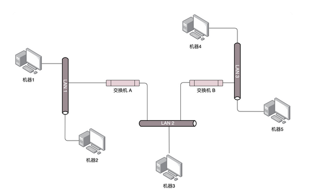

<!-- TOC -->

- [1、常用的网络协议](#1常用的网络协议)
- [2、网络分层的真实含义是什么？](#2网络分层的真实含义是什么)
- [3、ifconfig](#3ifconfig)
    - [1、无类型域间选路（CIDR）](#1无类型域间选路cidr)
    - [2、MAC 地址](#2mac-地址)
    - [3、网络设备的状态标识](#3网络设备的状态标识)
- [4、DHCP与PXE：IP是怎么来的，又是怎么没的？](#4dhcp与pxeip是怎么来的又是怎么没的)
    - [1、如何配置 IP 地址？](#1如何配置-ip-地址)
    - [2、动态主机配置协议（DHCP）](#2动态主机配置协议dhcp)
        - [1、解析 DHCP 的工作方式](#1解析-dhcp-的工作方式)
        - [2、IP 地址的收回和续租](#2ip-地址的收回和续租)
- [5、从物理层到MAC层：如何在宿舍里自己组网玩联机游戏？](#5从物理层到mac层如何在宿舍里自己组网玩联机游戏)
    - [1、第一层（物理层）](#1第一层物理层)
    - [2、第二层（数据链路层）](#2第二层数据链路层)
- [6、交换机与VLAN：办公室太复杂，我要回学校](#6交换机与vlan办公室太复杂我要回学校)
    - [1、拓扑结构是怎么形成的？](#1拓扑结构是怎么形成的)
    - [2、如何解决常见的环路问题？](#2如何解决常见的环路问题)
    - [3、STP 的工作过程是怎样的？](#3stp-的工作过程是怎样的)
- [参考](#参考)

<!-- /TOC -->


# 01、常用的网络协议


在经济学领域，有个伦纳德·里德（Leonard E. Read）创作的《铅笔的故事》。这个故事通过一个铅笔的诞生过程，来讲述复杂的经济学理论。这里，我也用一个下单的过程，看看互联网世界的运行过程中，都使用了哪些网络协议。


你先在浏览器里面输入 https://www.kaola.com ，这是一个 `URL`。浏览器只知道名字是“www.kaola.com”，但是不知道具体的地点，所以不知道应该如何访问。于是，它打开地址簿去查找。可以使用一般的地址簿协议 `DNS` 去查找，还可以使用另一种更加精准的地址簿查找协议 `HTTPDNS`。


无论用哪一种方法查找，最终都会得到这个地址：106.114.138.24。这个是 `IP` 地址，是互联网世界的“门牌号”。

知道了目标地址，浏览器就开始打包它的请求。对于普通的浏览请求，往往会使用 `HTTP` 协议；但是对于购物的请求，往往需要进行加密传输，因而会使用 `HTTPS` 协议。无论是什么协议，里面都会写明“你要买什么和买多少”。

DNS、HTTP、HTTPS 所在的层我们称为`应用层`。经过应用层封装后，浏览器会将应用层的包交给下一层去完成，通过 socket 编程来实现。下一层是`传输层`。传输层有两种协议，一种是无连接的协议 `UDP`，一种是面向连接的协议 `TCP`。对于支付来讲，往往使用 TCP 协议。所谓的面向连接就是，TCP 会保证这个包能够到达目的地。如果不能到达，就会重新发送，直至到达。

TCP 协议里面会有两个端口，一个是浏览器监听的端口，一个是电商的服务器监听的端口。操作系统往往通过端口来判断，它得到的包应该给哪个进程。

传输层封装完毕后，浏览器会将包交给操作系统的`网络层`。网络层的协议是 IP 协议。在 IP 协议里面会有源 IP 地址，即浏览器所在机器的 IP 地址和目标 IP 地址，也即电商网站所在服务器的 IP 地址。


操作系统既然知道了目标 IP 地址，就开始想如何根据这个门牌号找到目标机器。操作系统往往会判断，这个目标 IP 地址是本地人，还是外地人。如果是本地人，从门牌号就能看出来，但是显然电商网站不在本地，而在遥远的地方。操作系统知道要离开本地去远方。虽然不知道远方在何处，但是可以这样类比一下：如果去国外要去海关，去外地就要去`网关`。而操作系统启动的时候，就会被 DHCP 协议配置 IP 地址，以及默认的网关的 IP 地址 192.168.1.1。


操作系统如何将 IP 地址发给网关呢？在本地通信基本靠吼，于是操作系统大吼一声，谁是 192.168.1.1 啊？网关会回答它，我就是，我的本地地址在村东头。这个本地地址就是` MAC` 地址，而大吼的那一声是 `ARP` 协议。


于是操作系统将 IP 包交给了下一层，也就是 MAC 层。网卡再将包发出去。由于这个包里面是有 MAC 地址的，因而它能够到达网关。网关收到包之后，会根据自己的知识，判断下一步应该怎么走。网关往往是一个路由器，到某个 IP 地址应该怎么走，这个叫作路由表。路由器有点像玄奘西行路过的一个个国家的一个个城关。每个城关都连着两个国家，每个国家相当于一个局域网，在每个国家内部，都可以使用本地的地址 MAC 进行通信。一旦跨越城关，就需要拿出 IP 头来，里面写着贫僧来自东土大唐（就是源 IP 地址），欲往西天拜佛求经（指的是目标 IP 地址）。路过宝地，借宿一晚，明日启程，请问接下来该怎么走啊？城关往往是知道这些“知识”的，因为城关和临近的城关也会经常沟通。到哪里应该怎么走，这种沟通的协议称为`路由协议`，常用的有 `OSPF` 和 `BGP`。城关与城关之间是一个国家，当网络包知道了下一步去哪个城关，还是要使用国家内部的 MAC 地址，通过下一个城关的 MAC 地址，找到下一个城关，然后再问下一步的路怎么走，一直到走出最后一个城关。最后一个城关知道这个网络包要去的地方。于是，对着这个国家吼一声，谁是目标 IP 啊？目标服务器就会回复一个 MAC 地址。网络包过关后，通过这个 MAC 地址就能找到目标服务器。

目标服务器发现 MAC 地址对上了，取下 MAC 头来，发送给操作系统的网络层。发现 IP 也对上了，就取下 IP 头。IP 头里会写上一层封装的是 TCP 协议，然后将其交给传输层，即 TCP 层。


在这一层里，对于收到的每个包，都会有一个回复的包说明收到了。这个回复的包绝非这次下单请求的结果，例如购物是否成功，扣了多少钱等，而仅仅是 TCP 层的一个说明，即收到之后的回复。当然这个回复，会沿着刚才来的方向走回去，报个平安。因为一旦出了国门，西行路上千难万险，如果在这个过程中，网络包走丢了，例如进了大沙漠，或者被强盗抢劫杀害怎么办呢？因而到了要报个平安。如果过一段时间还是没到，发送端的 TCP 层会重新发送这个包，还是上面的过程，直到有一天收到平安到达的回复。这个重试绝非你的浏览器重新将下单这个动作重新请求一次。对于浏览器来讲，就发送了一次下单请求，TCP 层不断自己闷头重试。除非 TCP 这一层出了问题，例如连接断了，才轮到浏览器的应用层重新发送下单请求。

当网络包平安到达 TCP 层之后，TCP 头中有目标端口号，通过这个端口号，可以找到电商网站的进程正在监听这个端口号，假设一个 Tomcat，将这个包发给电商网站。

电商网站的进程得到 HTTP 请求的内容，知道了要买东西，买多少。往往一个电商网站最初接待请求的这个 Tomcat 只是个接待员，负责统筹处理这个请求，而不是所有的事情都自己做。例如，这个接待员要告诉专门管理订单的进程，登记要买某个商品，买多少，要告诉管理库存的进程，库存要减少多少，要告诉支付的进程，应该付多少钱，等等。

如何告诉相关的进程呢？往往通过 `RPC` 调用，即远程过程调用的方式来实现。远程过程调用就是当告诉管理订单进程的时候，接待员不用关心中间的网络互连问题，会由 RPC 框架统一处理。RPC 框架有很多种，有基于 HTTP 协议放在 HTTP 的报文里面的，有直接封装在 TCP 报文里面的。

当接待员发现相应的部门都处理完毕，就回复一个 HTTPS 的包，告知下单成功。这个 HTTPS 的包，会像来的时候一样，经过千难万险到达你的个人电脑，最终进入浏览器，显示支付成功。


# 02、网络分层的真实含义是什么？

> 4个问题

- 1、TCP 在进行三次握手的时候，IP 层和 MAC 层对应都有什么操作呢？

当然是 TCP 发送每一个消息，都会带着 IP 层和 MAC 层了。因为，TCP 每发送一个消息，IP 层和 MAC 层的所有机制都要运行一遍。而你只看到 TCP 三次握手了，其实，IP 层和 MAC 层为此也忙活好久了。这里要记住一点：只要是在网络上跑的包，都是完整的。可以有下层没上层，绝对不可能有上层没下层。所以，对 TCP 协议来说，三次握手也好，重试也好，只要想发出去包，就要有 IP 层和 MAC 层，不然是发不出去的。

- 2、第三层IP 协议里面包含目标地址和源地址。第三层里往往还包含路由协议。路由就像中转站，我们从原始地址 A 到目标地址 D，中间经过两个中转站 A->B->C->D，是通过路由转发的。那么第二个问题来了。A 知道自己的下一个中转站是 B，那从 A 发出来的包，应该把 B 的 IP 地址放在哪里呢？B 知道自己的下一个中转站是 C，从 B 发出来的包，应该把 C 的 IP 地址放在哪里呢？如果放在 IP 协议中的目标地址，那包到了中转站，怎么知道最终的目的地址是 D 呢？

- 3、你一定经常听说二层设备、三层设备。二层设备处理的通常是 MAC 层的东西。那我发送一个 HTTP 的包，是在第七层工作的，那是不是不需要经过二层设备？或者即便经过了，二层设备也不处理呢？或者换一种问法，二层设备处理的包里，有没有 HTTP 层的内容呢？

- 4、从你的电脑，通过 SSH 登录到公有云主机里面，都需要经历哪些过程？或者说你打开一个电商网站，都需要经历哪些过程？


> 网络为什么要分层？

`因为，是个复杂的程序都要分层`


当一个网络包从一个网口经过的时候，你看到了，首先先看看要不要请进来，处理一把。有的网口配置了混杂模式，凡是经过的，全部拿进来。拿进来以后，就要交给一段程序来处理。于是，你调用 process_layer2(buffer)。当然，这是一个假的函数。但是你明白其中的意思，知道肯定是有这么个函数的。那这个函数是干什么的呢？从 Buffer 中，摘掉二层的头，看一看，应该根据头里面的内容做什么操作。假设你发现这个包的 MAC 地址和你的相符，那说明就是发给你的，于是需要调用 process_layer3(buffer)。这个时候，Buffer 里面往往就没有二层的头了，因为已经在上一个函数的处理过程中拿掉了，或者将开始的偏移量移动了一下。在这个函数里面，摘掉三层的头，看看到底是发送给自己的，还是希望自己转发出去的。如何判断呢？如果 IP 地址不是自己的，那就应该转发出去；如果 IP 地址是自己的，那就是发给自己的。根据 IP 头里面的标示，拿掉三层的头，进行下一层的处理，到底是调用 process_tcp(buffer) 呢，还是调用 process_udp(buffer) 呢？


假设这个地址是 TCP 的，则会调用 process_tcp(buffer)。这时候，Buffer 里面没有三层的头，就需要查看四层的头，看这是一个发起，还是一个应答，又或者是一个正常的数据包，然后分别由不同的逻辑进行处理。如果是发起或者应答，接下来可能要发送一个回复包；如果是一个正常的数据包，就需要交给上层了。交给谁呢？是不是有 process_http(buffer) 函数呢？


没有的，如果你是一个网络包处理程序，你不需要有 process_http(buffer)，而是应该交给应用去处理。交给哪个应用呢？在四层的头里面有端口号，不同的应用监听不同的端口号。如果发现浏览器应用在监听这个端口，那你发给浏览器就行了。至于浏览器怎么处理，和你没有关系。浏览器自然是解析 HTML，显示出页面来。电脑的主人看到页面很开心，就点了鼠标。点击鼠标的动作被浏览器捕获。浏览器知道，又要发起另一个 HTTP 请求了，于是使用端口号，将请求发给了你。

你应该调用 send_tcp(buffer)。不用说，Buffer 里面就是 HTTP 请求的内容。这个函数里面加一个 TCP 的头，记录下源端口号。浏览器会给你目的端口号，一般为 80 端口。然后调用 send_layer3(buffer)。Buffer 里面已经有了 HTTP 的头和内容，以及 TCP 的头。在这个函数里面加一个 IP 的头，记录下源 IP 的地址和目标 IP 的地址。然后调用 send_layer2(buffer)。Buffer 里面已经有了 HTTP 的头和内容、TCP 的头，以及 IP 的头。这个函数里面要加一下 MAC 的头，记录下源 MAC 地址，得到的就是本机器的 MAC 地址和目标的 MAC 地址。不过，这个还要看当前知道不知道，知道就直接加上；不知道的话，就要通过一定的协议处理过程，找到 MAC 地址。反正要填一个，不能空着。万事俱备，只要 Buffer 里面的内容完整，就可以从网口发出去了，你作为一个程序的任务就算告一段落了。


# 03、ifconfig

你知道怎么查看 IP 地址吗？在 Windows 上是 ipconfig，在 Linux 上是 ifconfig。

那你知道在 Linux 上还有什么其他命令可以查看 IP 地址吗？答案是 ip addr。


```
root@test:~# ip addr
1: lo: <LOOPBACK,UP,LOWER_UP> mtu 65536 qdisc noqueue state UNKNOWN group default 
    link/loopback 00:00:00:00:00:00 brd 00:00:00:00:00:00
    inet 127.0.0.1/8 scope host lo
       valid_lft forever preferred_lft forever
    inet6 ::1/128 scope host 
       valid_lft forever preferred_lft forever
2: eth0: <BROADCAST,MULTICAST,UP,LOWER_UP> mtu 1500 qdisc pfifo_fast state UP group default qlen 1000
    link/ether fa:16:3e:c7:79:75 brd ff:ff:ff:ff:ff:ff
    inet 10.100.122.2/24 brd 10.100.122.255 scope global eth0
       valid_lft forever preferred_lft forever
    inet6 fe80::f816:3eff:fec7:7975/64 scope link 
       valid_lft forever preferred_lft forever
```

`在 IP 地址的后面有个 scope，对于 eth0 这张网卡来讲，是 global，说明这张网卡是可以对外的，可以接收来自各个地方的包。对于 lo 来讲，是 host，说明这张网卡仅仅可以供本机相互通信。lo 全称是 loopback，又称环回接口，往往会被分配到 127.0.0.1 这个地址。这个地址用于本机通信，经过内核处理后直接返回，不会在任何网络中出现。`

备注：包含三部分内容：1、IP地址；2、mac地址；3、网络设备的状态标识


在网络地址中，至少在当时设计的时候，对于 A、B、 C 类主要分两部分，前面一部分是网络号，后面一部分是主机号。

下面这个表格，详细地展示了 A、B、C 三类地址所能包含的主机的数量。


## 1、无类型域间选路（CIDR）

于是有了一个折中的方式叫作无类型域间选路，简称 CIDR。这种方式打破了原来设计的几类地址的做法，将 32 位的 IP 地址一分为二，前面是网络号，后面是主机号。从哪里分呢？你如果注意观察的话可以看到，10.100.122.2/24，这个 IP 地址中有一个斜杠，斜杠后面有个数字 24。这种地址表示形式，就是 CIDR。后面 24 的意思是，32 位中，前 24 位是网络号，后 8 位是主机号。

伴随着 CIDR 存在的，一个是广播地址，10.100.122.255。如果发送这个地址，所有 10.100.122 网络里面的机器都可以收到。另一个是子网掩码，255.255.255.0。

将子网掩码和 IP 地址按位计算 AND，就可得到网络号。


表格中的 192.168.0.x 是最常用的私有 IP 地址。你家里有 Wi-Fi，对应就会有一个 IP 地址。一般你家里地上网设备不会超过 256 个，所以 /24 基本就够了。有时候我们也能见到 /16 的 CIDR，这两种是最常见的，也是最容易理解的。不需要将十进制转换为二进制 32 位，就能明显看出 192.168.0 是网络号，后面是主机号。而整个网络里面的第一个地址 192.168.0.1，往往就是你这个私有网络的出口地址。例如，你家里的电脑连接 Wi-Fi，Wi-Fi 路由器的地址就是 192.168.0.1，而 192.168.0.255 就是广播地址。一旦发送这个地址，整个 192.168.0 网络里面的所有机器都能收到。

> 示例

我们来看 16.158.165.91/22 这个 CIDR。求一下这个网络的第一个地址、子网掩码和广播地址。你要是上来就写 16.158.165.1，那就大错特错了。/22 不是 8 的整数倍，不好办，只能先变成二进制来看。16.158 的部分不会动，它占了前 16 位。中间的 165，变为二进制为‭10100101‬。除了前面的 16 位，还剩 6 位。所以，这 8 位中前 6 位是网络号，16.158.<101001>，而 <01>.91 是机器号。第一个地址是 16.158.<101001><00>.1，即 16.158.164.1。子网掩码是 255.255.<111111><00>.0，即 255.255.252.0。广播地址为 16.158.<101001><11>.255，即 16.158.167.255。

`广播地址为网络号几位全取1，第一地址为网络号后几位全取0+1`


## 2、MAC 地址

在 IP 地址的上一行是 link/ether fa:16:3e:c7:79:75 brd ff:ff:ff:ff:ff:ff，这个被称为 MAC 地址，是一个网卡的物理地址，用十六进制，6 个 byte 表示。

因为 MAC 地址号称全局唯一，不会有两个网卡有相同的 MAC 地址，而且网卡自生产出来，就带着这个地址。很多人看到这里就会想，既然这样，整个互联网的通信，全部用 MAC 地址好了，只要知道了对方的 MAC 地址，就可以把信息传过去。

这样当然是不行的。 一个网络包要从一个地方传到另一个地方，除了要有确定的地址，还需要有定位功能。 而有门牌号码属性的 IP 地址，才是有远程定位功能的。

例如，你去杭州市网商路 599 号 B 楼 6 层找刘超，你在路上问路，可能被问的人不知道 B 楼是哪个，但是可以给你指网商路怎么去。但是如果你问一个人，你知道这个身份证号的人在哪里吗？可想而知，没有人知道。

`MAC 地址更像是身份证，是一个唯一的标识`。它的唯一性设计是为了组网的时候，不同的网卡放在一个网络里面的时候，可以不用担心冲突。从硬件角度，保证不同的网卡有不同的标识。

MAC 地址是有一定定位功能的，只不过范围非常有限。你可以根据 IP 地址，找到杭州市网商路 599 号 B 楼 6 层，但是依然找不到我，你就可以靠吼了，大声喊身份证 XXXX 的是哪位？我听到了，我就会站起来说，是我啊。但是如果你在上海，到处喊身份证 XXXX 的是哪位，我不在现场，当然不会回答，因为我在杭州不在上海。所以，MAC 地址的通信范围比较小，局限在一个子网里面。例如，从 192.168.0.2/24 访问 192.168.0.3/24 是可以用 MAC 地址的。一旦跨子网，即从 192.168.0.2/24 到 192.168.1.2/24，MAC 地址就不行了，需要 IP 地址起作用了。


## 3、网络设备的状态标识

```
2: eth0: <BROADCAST,MULTICAST,UP,LOWER_UP> mtu 1500 qdisc pfifo_fast state UP group default qlen 1000
```


来看 <BROADCAST,MULTICAST,UP,LOWER_UP>是干什么的？这个叫做 net_device flags，网络设备的状态标识。

UP 表示网卡处于启动的状态；BROADCAST 表示这个网卡有广播地址，可以发送广播包；MULTICAST 表示网卡可以发送多播包；LOWER_UP 表示 L1 是启动的，也即网线插着呢。MTU1500 是指什么意思呢？是哪一层的概念呢？最大传输单元 MTU 为 1500，这是以太网的默认值。MTU 是二层 MAC 层的概念。MAC 层有 MAC 的头，以太网规定连 MAC 头带正文合起来，不允许超过 1500 个字节。正文里面有 IP 的头、TCP 的头、HTTP 的头。如果放不下，就需要分片来传输。

qdisc pfifo_fast 是什么意思呢？qdisc 全称是 queueing discipline，中文叫排队规则。内核如果需要通过某个网络接口发送数据包，它都需要按照为这个接口配置的 qdisc（排队规则）把数据包加入队列。最简单的 qdisc 是 pfifo，它不对进入的数据包做任何的处理，数据包采用先入先出的方式通过队列。pfifo_fast 稍微复杂一些，它的队列包括三个波段（band）。在每个波段里面，使用先进先出规则。三个波段（band）的优先级也不相同。band 0 的优先级最高，band 2 的最低。如果 band 0 里面有数据包，系统就不会处理 band 1 里面的数据包，band 1 和 band 2 之间也是一样。数据包是按照服务类型（Type of Service，TOS）被分配到三个波段（band）里面的。TOS 是 IP 头里面的一个字段，代表了当前的包是高优先级的，还是低优先级的。


# 04、DHCP与PXE：IP是怎么来的，又是怎么没的？

如果需要和其他机器通讯，我们就需要一个通讯地址，我们需要给网卡配置这么一个地址。

## 1、如何配置 IP 地址？

那如何配置呢？如果有相关的知识和积累，你可以用命令行自己配置一个地址。可以使用 ifconfig，也可以使用 ip addr。设置好了以后，用这两个命令，将网卡 up 一下，就可以开始工作了。

- 使用 net-tools：

```
$ sudo ifconfig eth1 10.0.0.1/24
$ sudo ifconfig eth1 up
```

- 使用 iproute2：

```
$ sudo ip addr add 10.0.0.1/24 dev eth1
$ sudo ip link set up eth1
```

`这种配置的为静态IP`

## 2、动态主机配置协议（DHCP）

动态主机配置协议（Dynamic Host Configuration Protocol），简称 DHCP。

有了这个协议，网络管理员就轻松多了。他只需要配置一段共享的 IP 地址。每一台新接入的机器都通过 DHCP 协议，来这个共享的 IP 地址里申请，然后自动配置好就可以了。等人走了，或者用完了，还回去，这样其他的机器也能用。

`所以说，如果是数据中心里面的服务器，IP 一旦配置好，基本不会变，这就相当于买房自己装修。DHCP 的方式就相当于租房。你不用装修，都是帮你配置好的。你暂时用一下，用完退租就可以了。`


### 1、解析 DHCP 的工作方式

当一台机器新加入一个网络的时候，肯定一脸懵，啥情况都不知道，只知道自己的 MAC 地址。怎么办？先吼一句，我来啦，有人吗？这时候的沟通基本靠“吼”。这一步，我们称为 DHCP Discover。新来的机器使用 IP 地址 0.0.0.0 发送了一个广播包，目的 IP 地址为 255.255.255.255。广播包封装了 UDP，UDP 封装了 BOOTP。其实 DHCP 是 BOOTP 的增强版，但是如果你去抓包的话，很可能看到的名称还是 BOOTP 协议。

在这个广播包里面，新人大声喊：我是新来的（Boot request），我的 MAC 地址是这个，我还没有 IP，谁能给租给我个 IP 地址！格式就像这样：


如果一个网络管理员在网络里面配置了 DHCP Server 的话，他就相当于这些 IP 的管理员。他立刻能知道来了一个“新人”。这个时候，我们可以体会 MAC 地址唯一的重要性了。当一台机器带着自己的 MAC 地址加入一个网络的时候，MAC 是它唯一的身份，如果连这个都重复了，就没办法配置了。只有 MAC 唯一，IP 管理员才能知道这是一个新人，需要租给它一个 IP 地址，这个过程我们称为 DHCP Offer。同时，DHCP Server 为此客户保留为它提供的 IP 地址，从而不会为其他 DHCP 客户分配此 IP 地址。DHCP Offer 的格式就像这样，里面有给新人分配的地址。


DHCP Server 仍然使用广播地址作为目的地址，因为，此时请求分配 IP 的新人还没有自己的 IP。DHCP Server 回复说，我分配了一个可用的 IP 给你，你看如何？除此之外，服务器还发送了子网掩码、网关和 IP 地址租用期等信息。新来的机器很开心，它的“吼”得到了回复，并且有人愿意租给它一个 IP 地址了，这意味着它可以在网络上立足了。当然更令人开心的是，如果有多个 DHCP Server，这台新机器会收到多个 IP 地址，简直受宠若惊。

它会选择其中一个 DHCP Offer，一般是最先到达的那个，并且会向网络发送一个 DHCP Request 广播数据包，包中包含客户端的 MAC 地址、接受的租约中的 IP 地址、提供此租约的 DHCP 服务器地址等，并告诉所有 DHCP Server 它将接受哪一台服务器提供的 IP 地址，告诉其他 DHCP 服务器，谢谢你们的接纳，并请求撤销它们提供的 IP 地址，以便提供给下一个 IP 租用请求者。


此时，由于还没有得到 DHCP Server 的最后确认，客户端仍然使用 0.0.0.0 为源 IP 地址、255.255.255.255 为目标地址进行广播。在 BOOTP 里面，接受某个 DHCP Server 的分配的 IP。

当 DHCP Server 接收到客户机的 DHCP request 之后，会广播返回给客户机一个 DHCP ACK 消息包，表明已经接受客户机的选择，并将这一 IP 地址的合法租用信息和其他的配置信息都放入该广播包，发给客户机，欢迎它加入网络大家庭。最终租约达成的时候，还是需要广播一下，让大家都知道。


### 2、IP 地址的收回和续租

既然是租房子，就是有租期的。租期到了，管理员就要将 IP 收回。如果不用的话，收回就收回了。就像你租房子一样，如果还要续租的话，不能到了时间再续租，而是要提前一段时间给房东说。DHCP 也是这样。

客户机会在租期过去 50% 的时候，直接向为其提供 IP 地址的 DHCP Server 发送 DHCP request 消息包。客户机接收到该服务器回应的 DHCP ACK 消息包，会根据包中所提供的新的租期以及其他已经更新的 TCP/IP 参数，更新自己的配置。这样，IP 租用更新就完成了。

好了，一切看起来完美。DHCP 协议大部分人都知道，但是其实里面隐藏着一个细节，很多人可能不会去注意。接下来，我就讲一个有意思的事情：网络管理员不仅能自动分配 IP 地址，还能帮你自动安装操作系统！


# 05、从物理层到MAC层：如何在宿舍里自己组网玩联机游戏？


## 1、第一层（物理层）

电脑连电脑，除了网线要交叉，还需要配置这两台电脑的 IP 地址、子网掩码和默认网关。这三个概念上一节详细描述过了。要想两台电脑能够通信，这三项必须配置成为一个网络，可以一个是 192.168.0.1/24，另一个是 192.168.0.2/24，否则是不通的。

到此为止，两台电脑已经构成了一个最小的局域网，也即 LAN。可以玩联机局域网游戏啦！等到第三个哥们也买了一台电脑，怎么把三台电脑连在一起呢？先别说交换机，当时交换机也贵。有一个叫做 Hub 的东西，也就是`集线器`。这种设备有多个口，可以将宿舍里的多台电脑连接起来。但是，和交换机不同，集线器没有大脑，它完全在`物理层工作`。它会将自己收到的每一个字节，都复制到其他端口上去。这是第一层物理层联通的方案。


## 2、第二层（数据链路层）

你可能已经发现问题了。Hub 采取的是广播的模式，如果每一台电脑发出的包，宿舍的每个电脑都能收到，那就麻烦了。这就需要解决几个问题：
- 这个包是发给谁的？谁应该接收？
- 大家都在发，会不会产生混乱？有没有谁先发、谁后发的规则？
- 如果发送的时候出现了错误，怎么办？


这几个问题，都是第二层，数据链路层，也即 MAC 层要解决的问题。`MAC 的全称是 Medium Access Control，即媒体访问控制。控制什么呢？其实就是控制在往媒体上发数据的时候，谁先发、谁后发的问题。防止发生混乱。`这解决的是第二个问题。这个问题中的规则，学名叫多路访问。有很多算法可以解决这个问题。就像车管所管束马路上跑的车，能想的办法都想过了。

接下来要解决第一个问题：发给谁，谁接收？这里用到一个物理地址，叫作`链路层地址即mac地址`。但是因为第二层主要解决媒体接入控制的问题，所以它常被称为MAC 地址。解决第一个问题就牵扯到第二层的网络包格式。对于以太网，第二层的最开始，就是目标的 MAC 地址和源的 MAC 地址。接下来是类型，大部分的类型是 IP 数据包，然后 IP 里面包含 TCP、UDP，以及 HTTP 等，这都是里层封装的事情。


对于以太网，第二层的最后面是 `CRC`，也就是循环冗余检测。通过 XOR 异或的算法，来计算整个包是否在发送的过程中出现了错误，主要解决第三个问题。

这里还有一个没有解决的问题，当源机器知道目标机器的时候，可以将目标地址放入包里面，如果不知道呢？一个广播的网络里面接入了 N 台机器，我怎么知道每个 MAC 地址是谁呢？这就是` ARP 协议，也就是已知 IP 地址，求 MAC 地址的协议`。

在一个局域网里面，当知道了 IP 地址，不知道 MAC 怎么办呢？靠“吼”。


广而告之，发送一个广播包，谁是这个 IP 谁来回答。具体询问和回答的报文就像下面这样：


为了避免每次都用 ARP 请求，机器本地也会进行 ARP 缓存。当然机器会不断地上线下线，IP 也可能会变，所以 ARP 的 MAC 地址缓存过一段时间就会过期。

`交换机是有 MAC 地址学习能力的，学完了它就知道谁在哪儿了，不用广播了。`


> 如果一个局域网里面有多个交换机，ARP 广播的模式会出现什么问题呢？

ARP广播时，交换机会将一个端口收到的包转发到其它所有的端口上。比如数据包经过交换机A到达交换机B，交换机B又将包复制为多份广播出去。如果整个局域网存在一个环路，使得数据包又重新回到了最开始的交换机A，这个包又会被A再次复制多份广播出去。如此循环，数据包会不停得转发，而且越来越多，最终占满带宽，或者使解析协议的硬件过载，行成广播风暴。


# 06、交换机与VLAN：办公室太复杂，我要回学校

## 1、拓扑结构是怎么形成的？

我们先来看两台交换机的情形。两台交换机连接着三个局域网，每个局域网上都有多台机器。如果机器 1 只知道机器 4 的 IP 地址，当它想要访问机器 4，把包发出去的时候，它必须要知道机器 4 的 MAC 地址。



于是机器 1 发起广播，机器 2 收到这个广播，但是这不是找它的，所以没它什么事。交换机 A 一开始是不知道任何拓扑信息的，在它收到这个广播后，采取的策略是，除了广播包来的方向外，它还要转发给其他所有的网口。于是机器 3 也收到广播信息了，但是这和它也没什么关系。当然，交换机 B 也是能够收到广播信息的，但是这时候它也是不知道任何拓扑信息的，因而也是进行广播的策略，将包转发到局域网三。这个时候，机器 4 和机器 5 都收到了广播信息。机器 4 主动响应说，这是找我的，这是我的 MAC 地址。于是一个 ARP 请求就成功完成了。

在上面的过程中，交换机 A 和交换机 B 都是能够学习到这样的信息：机器 1 是在左边这个网口的。当了解到这些拓扑信息之后，情况就好转起来。当机器 2 要访问机器 1 的时候，机器 2 并不知道机器 1 的 MAC 地址，所以机器 2 会发起一个 ARP 请求。这个广播消息会到达机器 1，也同时会到达交换机 A。这个时候交换机 A 已经知道机器 1 是不可能在右边的网口的，所以这个广播信息就不会广播到局域网二和局域网三。

当机器 3 要访问机器 1 的时候，也需要发起一个广播的 ARP 请求。这个时候交换机 A 和交换机 B 都能够收到这个广播请求。交换机 A 当然知道主机 A 是在左边这个网口的，所以会把广播消息转发到局域网一。同时，交换机 B 收到这个广播消息之后，由于它知道机器 1 是不在右边这个网口的，所以不会将消息广播到局域网三。

## 2、如何解决常见的环路问题？

例如这个图，当两个交换机将两个局域网同时连接起来的时候。你可能会觉得，这样反而有了高可用性。但是却不幸地出现了环路。出现了环路会有什么结果呢？


我们来想象一下机器 1 访问机器 2 的过程。一开始，机器 1 并不知道机器 2 的 MAC 地址，所以它需要发起一个 ARP 的广播。广播到达机器 2，机器 2 会把 MAC 地址返回来，看起来没有这两个交换机什么事情。

但是问题来了，这两个交换机还是都能够收到广播包的。交换机 A 一开始是不知道机器 2 在哪个局域网的，所以它会把广播消息放到局域网二，在局域网二广播的时候，交换机 B 右边这个网口也是能够收到广播消息的。交换机 B 会将这个广播信息发送到局域网一。局域网一的这个广播消息，又会到达交换机 A 左边的这个接口。交换机 A 这个时候还是不知道机器 2 在哪个局域网，于是将广播包又转发到局域网二。左转左转左转，好像是个圈哦。

可能有人会说，当两台交换机都能够逐渐学习到拓扑结构之后，是不是就可以了？

别想了，压根儿学不会的。机器 1 的广播包到达交换机 A 和交换机 B 的时候，本来两个交换机都学会了机器 1 是在局域网一的，但是当交换机 A 将包广播到局域网二之后，交换机 B 右边的网口收到了来自交换机 A 的广播包。根据学习机制，这彻底损坏了交换机 B 的三观，刚才机器 1 还在左边的网口呢，怎么又出现在右边的网口呢？哦，那肯定是机器 1 换位置了，于是就误会了，交换机 B 就学会了，机器 1 是从右边这个网口来的，把刚才学习的那一条清理掉。同理，交换机 A 右边的网口，也能收到交换机 B 转发过来的广播包，同样也误会了，于是也学会了，机器 1 从右边的网口来，不是从左边的网口来。

然而当广播包从左边的局域网一广播的时候，两个交换机再次刷新三观，原来机器 1 是在左边的，过一会儿，又发现不对，是在右边的，过一会，又发现不对，是在左边的。这还是一个包转来转去，每台机器都会发广播包，交换机转发也会复制广播包，当广播包越来越多的时候，按照上一节讲过一个共享道路的算法，也就是路会越来越堵，最后谁也别想走。所以，必须有一个方法解决环路的问题，怎么破除环路呢？


## 3、STP 的工作过程是怎样的？


在数据结构中，有一个方法叫做最小生成树。有环的我们常称为图。将图中的环破了，就生成了树。在计算机网络中，`生成树的算法叫作 STP`，全称 Spanning Tree Protocol


- Root Bridge，也就是根交换机。这个比较容易理解，可以比喻为“掌门”交换机，是某棵树的老大，是掌门，最大的大哥。

- Designated Bridges，有的翻译为指定交换机。这个比较难理解，可以想像成一个“小弟”，对于树来说，就是一棵树的树枝。所谓“指定”的意思是，我拜谁做大哥，其他交换机通过这个交换机到达根交换机，也就相当于拜他做了大哥。这里注意是树枝，不是叶子，因为叶子往往是主机。

- Bridge Protocol Data Units （BPDU） ，网桥协议数据单元。可以比喻为“相互比较实力”的协议。行走江湖，比的就是武功，拼的就是实力。当两个交换机碰见的时候，也就是相连的时候，就需要互相比一比内力了。BPDU 只有掌门能发，已经隶属于某个掌门的交换机只能传达掌门的指示。

- Priority Vector，优先级向量。可以比喻为实力 （值越小越牛）。实力是啥？就是一组 ID 数目，[Root Bridge ID, Root Path Cost, Bridge ID, and Port ID]。为什么这样设计呢？这是因为要看怎么来比实力。先看 Root Bridge ID。拿出老大的 ID 看看，发现掌门一样，那就是师兄弟；再比 Root Path Cost，也即我距离我的老大的距离，也就是拿和掌门关系比，看同一个门派内谁和老大关系铁；最后比 Bridge ID，比我自己的 ID，拿自己的本事比。


## 4、如何解决广播问题和安全问题？

有两种分的方法：

- 一个是物理隔离：就是每个部门有单独的交换机，配置单独的子网，这样部门之间的沟通就需要路由器了；

- 另外一种方式是虚拟隔离，就是用我们常说的 VLAN，或者叫虚拟局域网。使用 VLAN，一个交换机上会连属于多个局域网的机器，那交换机怎么区分哪个机器属于哪个局域网呢？


我们只需要在原来的二层的头上加一个 TAG，里面有一个 VLAN ID，一共 12 位。为什么是 12 位呢？因为 12 位可以划分 4096 个 VLAN。

如果我们买的交换机是支持 VLAN 的，当这个交换机把二层的头取下来的时候，就能够识别这个 VLAN ID。这样只有相同 VLAN 的包，才会互相转发，不同 VLAN 的包，是看不到的。这样广播问题和安全问题就都能够解决了。


我们可以设置交换机每个口所属的 VLAN。如果某个口坐的是程序员，他们属于 VLAN 10；如果某个口坐的是人事，他们属于 VLAN 20；如果某个口坐的是财务，他们属于 VLAN 30。这样，财务发的包，交换机只会转发到 VLAN 30 的口上。程序员啊，你就监听 VLAN 10 吧，里面除了代码，啥都没有。而且对于交换机来讲，每个 VLAN 的口都是可以重新设置的。一个财务走了，把他所在座位的口从 VLAN 30 移除掉，来了一个程序员，坐在财务的位置上，就把这个口设置为 VLAN 10，十分灵活。有人会问交换机之间怎么连接呢？将两个交换机连接起来的口应该设置成什么 VLAN 呢？对于支持 VLAN 的交换机，有一种口叫作 `Trunk` 口。它可以转发属于任何 VLAN 的口。交换机之间可以通过这种口相互连接。

> 总结

- 1、当交换机的数目越来越多的时候，会遭遇环路问题，让网络包迷路，这就需要使用 STP 协议，将有环路的图变成没有环路的树，从而解决环路问题。

- 2、交换机数目多会面临隔离问题，可以通过 VLAN 形成虚拟局域网，从而解决广播问题和安全问题。


# 07、ICMP与ping

## 1、ICMP 协议的格式

那你知道 ping 是如何工作的吗？

ping 是基于 ICMP 协议工作的。ICMP 全称 Internet Control Message Protocol，就是互联网控制报文协议。这里面的关键词是“控制”，那具体是怎么控制的呢？

ICMP 报文是封装在 IP 包里面的。因为传输指令的时候，肯定需要源地址和目标地址。它本身非常简单。


ICMP 报文有很多的类型，不同的类型有不同的代码。`最常用的类型是主动请求为 8，主动请求的应答为 0。`

## 2、查询报文类型

例如，常用的 ping 就是查询报文，是一种主动请求，并且获得主动应答的 ICMP 协议。所以，ping 发的包也是符合 ICMP 协议格式的，只不过它在后面增加了自己的格式。

对 ping 的主动请求，进行网络抓包，称为 ICMP ECHO REQUEST。同理主动请求的回复，称为ICMP ECHO REPLY。比起原生的 ICMP，这里面多了两个字段，一个是标识符。这个很好理解，你派出去两队侦查兵，一队是侦查战况的，一队是去查找水源的，要有个标识才能区分。另一个是序号，你派出去的侦查兵，都要编个号。如果派出去 10 个，回来 10 个，就说明前方战况不错；如果派出去 10 个，回来 2 个，说明情况可能不妙。

在选项数据中，ping 还会存放发送请求的时间值，来计算往返时间，说明路程的长短。

## 3、差错报文类型

我举几个 ICMP 差错报文的例子：`终点不可达为 3，源抑制为 4，超时为 11，重定向为 5。`这些都是什么意思呢？我给你具体解释一下。

差错报文的结构相对复杂一些。除了前面还是 IP，ICMP 的前 8 字节不变，后面则跟上出错的那个 IP 包的 IP 头和 IP 正文的前 8 个字节。


## 4、ping：查询报文类型的使用

接下来，我们重点来看 ping 的发送和接收过程。


假定主机 A 的 IP 地址是 192.168.1.1，主机 B 的 IP 地址是 192.168.1.2，它们都在同一个子网。那当你在主机 A 上运行“ping 192.168.1.2”后，会发生什么呢?


ping 命令执行的时候，源主机首先会构建一个 ICMP 请求数据包，ICMP 数据包内包含多个字段。最重要的是两个，第一个是`类型字段`，对于请求数据包而言该字段为 8；另外一个是`顺序号`，主要用于区分连续 ping 的时候发出的多个数据包。每发出一个请求数据包，顺序号会自动加 1。为了能够计算往返时间 RTT，它会在报文的数据部分插入发送时间。然后，由 ICMP 协议将这个数据包连同地址 192.168.1.2 一起交给 IP 层。IP 层将以 192.168.1.2 作为目的地址，本机 IP 地址作为源地址，加上一些其他控制信息，构建一个 IP 数据包。接下来，需要加入 MAC 头。如果在本节 ARP 映射表中查找出 IP 地址 192.168.1.2 所对应的 MAC 地址，则可以直接使用；如果没有，则需要发送 ARP 协议查询 MAC 地址，获得 MAC 地址后，由数据链路层构建一个数据帧，目的地址是 IP 层传过来的 MAC 地址，源地址则是本机的 MAC 地址；还要附加上一些控制信息，依据以太网的介质访问规则，将它们传送出去。


主机 B 收到这个数据帧后，先检查它的目的 MAC 地址，并和本机的 MAC 地址对比，如符合，则接收，否则就丢弃。接收后检查该数据帧，将 IP 数据包从帧中提取出来，交给本机的 IP 层。同样，IP 层检查后，将有用的信息提取后交给 ICMP 协议。主机 B 会构建一个 ICMP 应答包，应答数据包的类型字段为 0，顺序号为接收到的请求数据包中的顺序号，然后再发送出去给主机 A。


在规定的时候间内，源主机如果没有接到 ICMP 的应答包，则说明目标主机不可达；如果接收到了 ICMP 应答包，则说明目标主机可达。此时，源主机会检查，用当前时刻减去该数据包最初从源主机上发出的时刻，就是 ICMP 数据包的时间延迟。

当然这只是最简单的，同一个局域网里面的情况。如果跨网段的话，还会涉及网关的转发、路由器的转发等等。但是对于 ICMP 的头来讲，是没什么影响的。会影响的是根据目标 IP 地址，选择路由的下一跳，还有每经过一个路由器到达一个新的局域网，需要换 MAC 头里面的 MAC 地址。

如果在自己的可控范围之内，当遇到网络不通的问题的时候，除了直接 ping 目标的 IP 地址之外，还应该有一个清晰的网络拓扑图。并且从理论上来讲，应该要清楚地知道一个网络包从源地址到目标地址都需要经过哪些设备，然后逐个 ping 中间的这些设备或者机器。如果可能的话，在这些关键点，通过 tcpdump -i eth0 icmp，查看包有没有到达某个点，回复的包到达了哪个点，可以更加容易推断出错的位置。经常会遇到一个问题，如果不在我们的控制范围内，很多中间设备都是禁止 ping 的，但是 ping 不通不代表网络不通。这个时候就要使用 telnet，通过其他协议来测试网络是否通。


## 5、Traceroute：差错报文类型的使用

那其他的类型呢？是不是只有真正遇到错误的时候，才能收到呢？那也不是，有一个程序 Traceroute，是个“大骗子”。它会使用 ICMP 的规则，故意制造一些能够产生错误的场景。所以，`Traceroute 的第一个作用就是故意设置特殊的 TTL，来追踪去往目的地时沿途经过的路由器。`Traceroute 的参数指向某个目的 IP 地址，它会发送一个 UDP 的数据包。将 TTL 设置成 1，也就是说一旦遇到一个路由器或者一个关卡，就表示它“牺牲”了。

如果中间的路由器不止一个，当然碰到第一个就“牺牲”。于是，返回一个 ICMP 包，也就是网络差错包，类型是时间超时。那大军前行就带一顿饭，试一试走多远会被饿死，然后找个哨探回来报告，那我就知道大军只带一顿饭能走多远了。接下来，将 TTL 设置为 2。第一关过了，第二关就“牺牲”了，那我就知道第二关有多远。如此反复，直到到达目的主机。这样，Traceroute 就拿到了所有的路由器 IP。当然，有的路由器压根不会回这个 ICMP。这也是 Traceroute 一个公网的地址，看不到中间路由的原因。

怎么知道 UDP 有没有到达目的主机呢？Traceroute 程序会发送一份 UDP 数据报给目的主机，但它会选择一个不可能的值作为 UDP 端口号（大于 30000）。当该数据报到达时，将使目的主机的 UDP 模块产生一份“端口不可达”错误 ICMP 报文。如果数据报没有到达，则可能是超时。这就相当于故意派人去西天如来那里去请一本《道德经》，结果人家信佛不信道，消息就会被打出来。被打的消息传回来，你就知道西天是能够到达的。为什么不去取《心经》呢？因为 UDP 是无连接的。也就是说这人一派出去，你就得不到任何音信。你无法区别到底是半路走丢了，还是真的信佛遁入空门了，只有让人家打出来，你才会得到消息。

`Traceroute 还有一个作用是故意设置不分片，从而确定路径的 MTU。`要做的工作首先是发送分组，并设置“不分片”标志。发送的第一个分组的长度正好与出口 MTU 相等。如果中间遇到窄的关口会被卡住，会发送 ICMP 网络差错包，类型为“需要进行分片但设置了不分片位”。其实，这是人家故意的好吧，每次收到 ICMP“不能分片”差错时就减小分组的长度，直到到达目标主机。


> 总结

- ICMP 相当于网络世界的侦察兵。我讲了两种类型的 ICMP 报文，一种是主动探查的查询报文，一种异常报告的差错报文；
- ping 使用查询报文，Traceroute 使用差错报文。


# 08、世界这么大，我想出网关：欧洲十国游与玄奘西行

## 1、MAC 头和 IP 头的细节


在 MAC 头里面，先是目标 MAC 地址，然后是源 MAC 地址，然后有一个协议类型，用来说明里面是 IP 协议。IP 头里面的版本号，目前主流的还是 IPv4，服务类型 TOS ，TTL 。另外，还有 8 位标识协议。这里到了下一层的协议，也就是，是 TCP 还是 UDP。最重要的就是源 IP 和目标 IP。先是源 IP 地址，然后是目标 IP 地址。

`下一层有个字段标识上层使用的协议类型`

在任何一台机器上，当要访问另一个 IP 地址的时候，都会先判断，这个目标 IP 地址，和当前机器的 IP 地址，是否在同一个网段。怎么判断同一个网段呢？需要 CIDR 和子网掩码；

- 如果是同一个网段，例如，你访问你旁边的兄弟的电脑，那就没网关什么事情，直接将源地址和目标地址放入 IP 头中，然后通过 ARP 获得 MAC 地址，将源 MAC 和目的 MAC 放入 MAC 头中，发出去就可以了。


- 如果不是同一网段，例如，你要访问你们校园网里面的 BBS，该怎么办？这就需要发往默认网关 Gateway。Gateway 的地址一定是和源 IP 地址是一个网段的。往往不是第一个，就是第二个。例如 192.168.1.0/24 这个网段，Gateway 往往会是 192.168.1.1/24 或者 192.168.1.2/24。

如何发往默认网关呢？网关不是和源 IP 地址是一个网段的么？这个过程就和发往同一个网段的其他机器是一样的：将源地址和目标 IP 地址放入 IP 头中，通过 ARP 获得网关的 MAC 地址，将源 MAC 和网关的 MAC 放入 MAC 头中，发送出去。网关所在的端口，例如 192.168.1.1/24 将网络包收进来，然后接下来怎么做，就完全看网关的了。

`网关往往是一个路由器，是一个三层转发的设备`。啥叫三层设备？前面也说过了，就是把 MAC 头和 IP 头都取下来，然后根据里面的内容，看看接下来把包往哪里转发的设备。

很多情况下，人们把网关就叫做路由器。其实不完全准确，而另一种比喻更加恰当：`路由器是一台设备，它有五个网口或者网卡，相当于有五只手，分别连着五个局域网。每只手的 IP 地址都和局域网的 IP 地址相同的网段，每只手都是它握住的那个局域网的网关。`

任何一个想发往其他局域网的包，都会到达其中一只手，被拿进来，拿下 MAC 头和 IP 头，看看，根据自己的路由算法，选择另一只手，加上 IP 头和 MAC 头，然后扔出去。

这个时候，问题来了，该选择哪一只手？IP 头和 MAC 头加什么内容，哪些变、哪些不变呢？这个问题比较复杂，大致可以分为两类，一个是静态路由，一个是动态路由。

`静态路由，其实就是在路由器上，配置一条一条规则`。这些规则包括：想访问 BBS 站（它肯定有个网段），从 2 号口出去，下一跳是 IP2；想访问教学视频站（它也有个自己的网段），从 3 号口出去，下一跳是 IP3，然后保存在路由器里。每当要选择从哪只手抛出去的时候，就一条一条的匹配规则，找到符合的规则，就按规则中设置的那样，从某个口抛出去，找下一跳 IPX。


## 2、IP 头和 MAC 头哪些变、哪些不变？

MAC 地址是一个局域网内才有效的地址。因而，MAC 地址只要过网关，就必定会改变，因为已经换了局域网。两者主要的区别在于 IP 地址是否改变。`不改变 IP 地址的网关，我们称为转发网关；改变 IP 地址的网关，我们称为NAT 网关。平时在自己家或者公司使用的都是nat这种方式`

### 1、转发网关


务器 A 要访问服务器 B。首先，服务器 A 会思考，192.168.4.101 和我不是一个网段的，因而需要先发给网关。那网关是谁呢？已经静态配置好了，网关是 192.168.1.1。网关的 MAC 地址是多少呢？发送 ARP 获取网关的 MAC 地址，然后发送包。包的内容是这样的：

```
源 MAC：服务器 A 的 MAC
目标 MAC：192.168.1.1 这个网口的 MAC
源 IP：192.168.1.101
目标 IP：192.168.4.101
```

包到达 192.168.1.1 这个网口，发现 MAC 一致，将包收进来，开始思考往哪里转发。在路由器 A 中配置了静态路由之后，要想访问 192.168.4.0/24，要从 192.168.56.1 这个口出去，下一跳为 192.168.56.2。于是，路由器 A 思考的时候，匹配上了这条路由，要从 192.168.56.1 这个口发出去，发给 192.168.56.2，那 192.168.56.2 的 MAC 地址是多少呢？路由器 A 发送 ARP 获取 192.168.56.2 的 MAC 地址，然后发送包。包的内容是这样的：

```
源 MAC：192.168.56.1 的 MAC 地址
目标 MAC：192.168.56.2 的 MAC 地址
源 IP：192.168.1.101
目标 IP：192.168.4.101
```

包到达 192.168.56.2 这个网口，发现 MAC 一致，将包收进来，开始思考往哪里转发。在路由器 B 中配置了静态路由，要想访问 192.168.4.0/24，要从 192.168.4.1 这个口出去，没有下一跳了。因为我右手这个网卡，就是这个网段的，我是最后一跳了。于是，路由器 B 思考的时候，匹配上了这条路由，要从 192.168.4.1 这个口发出去，发给 192.168.4.101。那 192.168.4.101 的 MAC 地址是多少呢？路由器 B 发送 ARP 获取 192.168.4.101 的 MAC 地址，然后发送包。包的内容是这样的：

```
源 MAC：192.168.4.1 的 MAC 地址
目标 MAC：192.168.4.101 的 MAC 地址
源 IP：192.168.1.101
目标 IP：192.168.4.101
```

包到达服务器 B，MAC 地址匹配，将包收进来。通过这个过程可以看出，每到一个新的局域网，MAC 都是要变的，但是 IP 地址都不变。在 IP 头里面，不会保存任何网关的 IP 地址。`所谓的下一跳是，某个 IP 要将这个 IP 地址转换为 MAC 放入 MAC 头。`

IP 地址在三个局域网都可见，在三个局域网之间的网段都不会冲突。在三个网段之间传输包，IP 头不改变。


### 2、NAT网关（重要）

这里遇见的第一个问题是，局域网之间没有商量过，各定各的网段，因而 IP 段冲突了。最左面大唐的地址是 192.168.1.101，最右面印度的地址也是 192.168.1.101，如果单从 IP 地址上看，简直是自己访问自己，其实是大唐的 192.168.1.101 要访问印度的 192.168.1.101。怎么解决这个问题呢？既然局域网之间没有商量过，你们各管各的，那到国际上，也即中间的局域网里面，就需要使用另外的地址。就像出国，不能用咱们自己的身份证，而要改用护照一样，玄奘西游也要拿着专门取经的通关文牒，而不能用自己国家的身份证。


首先，目标服务器 B 在国际上要有一个国际的身份，我们给它一个 192.168.56.2。在网关 B 上，我们记下来，国际身份 192.168.56.2 对应国内身份 192.168.1.101。凡是要访问 192.168.56.2，都转成 192.168.1.101。

于是，源服务器 A 要访问目标服务器 B，要指定的目标地址为 192.168.56.2。这是它的国际身份。服务器 A 想，192.168.56.2 和我不是一个网段的，因而需要发给网关，网关是谁？已经静态配置好了，网关是 192.168.1.1，网关的 MAC 地址是多少？发送 ARP 获取网关的 MAC 地址，然后发送包。包的内容是这样的：

```
源 MAC：服务器 A 的 MAC
目标 MAC：192.168.1.1 这个网口的 MAC
源 IP：192.168.1.101
目标 IP：192.168.56.2
```

包到达 192.168.1.1 这个网口，发现 MAC 一致，将包收进来，开始思考往哪里转发。在路由器 A 中配置了静态路由：要想访问 192.168.56.2/24，要从 192.168.56.1 这个口出去，没有下一跳了，因为我右手这个网卡，就是这个网段的，我是最后一跳了。于是，路由器 A 思考的时候，匹配上了这条路由，要从 192.168.56.1 这个口发出去，发给 192.168.56.2。那 192.168.56.2 的 MAC 地址是多少呢？路由器 A 发送 ARP 获取 192.168.56.2 的 MAC 地址。当网络包发送到中间的局域网的时候，服务器 A 也需要有个国际身份，因而在国际上，源 IP 地址也不能用 192.168.1.101，需要改成 192.168.56.1。发送包的内容是这样的：

```
源 MAC：192.168.56.1 的 MAC 地址
目标 MAC：192.168.56.2 的 MAC 地址
源 IP：192.168.56.1
目标 IP：192.168.56.2
```

包到达 192.168.56.2 这个网口，发现 MAC 一致，将包收进来，开始思考往哪里转发。路由器 B 是一个 NAT 网关，它上面配置了，要访问国际身份 192.168.56.2 对应国内身份 192.168.1.101，于是改为访问 192.168.1.101。在路由器 B 中配置了静态路由：要想访问 192.168.1.0/24，要从 192.168.1.1 这个口出去，没有下一跳了，因为我右手这个网卡，就是这个网段的，我是最后一跳了。于是，路由器 B 思考的时候，匹配上了这条路由，要从 192.168.1.1 这个口发出去，发给 192.168.1.101。那 192.168.1.101 的 MAC 地址是多少呢？路由器 B 发送 ARP 获取 192.168.1.101 的 MAC 地址，然后发送包。内容是这样的：

```
源 MAC：192.168.1.1 的 MAC 地址
目标 MAC：192.168.1.101 的 MAC 地址
源 IP：192.168.56.1
目标 IP：192.168.1.101
```

包到达服务器 B，MAC 地址匹配，将包收进来。从服务器 B 接收的包可以看出，源 IP 为服务器 A 的国际身份，因而发送返回包的时候，也发给这个国际身份，由路由器 A 做 NAT，转换为国内身份。从这个过程可以看出，IP 地址也会变。这个过程用英文说就是 `Network Address Translation，简称 NAT`。

其实这第二种方式我们经常见，现在大家每家都有家用路由器，家里的网段都是 192.168.1.x，所以你肯定访问不了你邻居家的这个私网的 IP 地址的。所以，当我们家里的包发出去的时候，都被家用路由器 NAT 成为了运营商的地址了。很多办公室访问外网的时候，也是被 NAT 过的，因为不可能办公室里面的 IP 也是公网可见的，公网地址实在是太贵了，所以一般就是整个办公室共用一个到两个出口 IP 地址。你可以通过 https://www.whatismyip.com/ 查看自己的出口 IP 地址。

> 问题

当在你家里要访问 163 网站的时候，你的包需要 NAT 成为公网 IP，返回的包又要 NAT 成你的私有 IP，返回包怎么知道这是你的请求呢？它怎么就这么智能的 NAT 成了你的 IP 而非别人的 IP 呢？


# 09、路由协议：西出网关无故人，敢问路在何方

## 1、如何配置路由？

路由器就是一台网络设备，它有多张网卡。当一个入口的网络包送到路由器时，它会根据一个本地的转发信息库，来决定如何正确地转发流量。这个转发信息库通常被称为`路由表`。

一张路由表中会有多条路由规则。每一条规则至少包含这三项信息。

- 目的网络：这个包想去哪儿？
- 出口设备：将包从哪个口扔出去？
- 下一跳网关：下一个路由器的地址。

通过 route 命令和 ip route 命令都可以进行查询或者配置。

例如，我们设置 ip route add 10.176.48.0/20 via 10.173.32.1 dev eth0，就说明要去 10.176.48.0/20 这个目标网络，要从 eth0 端口出去，经过 10.173.32.1。

网关上的路由策略就是按照这三项配置信息进行配置的。这种配置方式的一个核心思想是：`根据目的 IP 地址来配置路由。`


## 2、如何配置策略路由？

当然，在真实的复杂的网络环境中，除了可以根据目的 ip 地址配置路由外，还可以根据多个参数来配置路由，这就称为`策略路由`。

可以配置多个路由表，可以根据源 IP 地址、入口设备、TOS 等选择路由表，然后在路由表中查找路由。这样可以使得来自不同来源的包走不同的路由。例如，我们设置：

```
ip rule add from 192.168.1.0/24 table 10 
ip rule add from 192.168.2.0/24 table 20
```
表示从 192.168.1.10/24 这个网段来的，使用 table 10 中的路由表，而从 192.168.2.0/24 网段来的，使用 table20 的路由表。

在一条路由规则中，也可以走多条路径。例如，在下面的路由规则中：


ip route add default scope global nexthop via 100.100.100.1 weight 1 nexthop via 200.200.200.1 weight 2

下一跳有两个地方，分别是 100.100.100.1 和 200.200.200.1，权重分别为 1 比 2。

在什么情况下会用到如此复杂的配置呢？我来举一个现实中的例子。我是房东，家里从运营商那儿拉了两根网线。这两根网线分别属于两个运行商。一个带宽大一些，一个带宽小一些。这个时候，我就不能买普通的家用路由器了，得买个高级点的，可以接两个外网的。家里的网络呢，就是普通的家用网段 192.168.1.x/24。家里有两个租户，分别把线连到路由器上。IP 地址为 192.168.1.101/24 和 192.168.1.102/24，网关都是 192.168.1.1/24，网关在路由器上。就像上一节说的一样，家里的网段是私有网段，出去的包需要 NAT 成公网的 IP 地址，因而路由器是一个 NAT 路由器。两个运营商都要为这个网关配置一个公网的 IP 地址。如果你去查看你们家路由器里的网段，基本就是我图中画的样子。


运行商里面也有一个 IP 地址，在运营商网络里面的网关。不同的运营商方法不一样，有的是 /32 的，也即一个一对一连接。例如，运营商 1 给路由器分配的地址是 183.134.189.34/32，而运营商网络里面的网关是 183.134.188.1/32。有的是 /30 的，也就是分了一个特别小的网段。运营商 2 给路由器分配的地址是 60.190.27.190/30，运营商网络里面的网关是 60.190.27.189/30。根据这个网络拓扑图，可以将路由配置成这样：

```

$ ip route list table main 
60.190.27.189/30 dev eth3  proto kernel  scope link  src 60.190.27.190
183.134.188.1 dev eth2  proto kernel  scope link  src 183.134.189.34
192.168.1.0/24 dev eth1  proto kernel  scope link  src 192.168.1.1
127.0.0.0/8 dev lo  scope link
default via 183.134.188.1 dev eth2
```


## 3、动态路由算法


## 4、动态路由协议


> 第二模块 底层网络知识详解：最重要的传输层 (4讲)

# 10、UDP协议：因性善而简单，难免碰到“城会玩”
# 11、TCP协议（上）：因性恶而复杂，先恶后善反轻松
# 12、TCP协议（下）：西行必定多妖孽，恒心智慧消磨难
# 13、套接字Socket：Talk is cheap, show me the code

> 第二模块 底层网络知识详解：最常用的应用层 (4讲)

# 14、HTTP协议：看个新闻原来这么麻烦
# 15、HTTPS协议：点外卖的过程原来这么复杂
# 16、流媒体协议：如何在直播里看到美女帅哥？
# 17、P2P协议：我下小电影，99%急死你

> 第二模块 底层网络知识详解：陌生的数据中心 (6讲)

# 18、DNS协议：网络世界的地址簿
# 19、HttpDNS：网络世界的地址簿也会指错路
# 20、CDN：你去小卖部取过快递么？
# 21、数据中心：我是开发商，自己拿地盖别墅
# 22、VPN：朝中有人好做官
# 23、移动网络：去巴塞罗那，手机也上不了脸书

> 第三模块 热门技术中的应用：云计算中的网络 (5讲)

# 24、云中网络：自己拿地成本高，购买公寓更灵活
# 25、软件定义网络：共享基础设施的小区物业管理办法
# 26、云中的网络安全：虽然不是土豪，也需要基本安全和保障
# 27、云中的网络QoS：邻居疯狂下电影，我该怎么办？
# 28、云中网络的隔离GRE、VXLAN：虽然住一个小区，也要保护隐私

> 第三模块 热门技术中的应用：容器技术中的网络 (3讲)

# 29、容器网络：来去自由的日子，不买公寓去合租
# 30、容器网络之Flannel：每人一亩三分地
# 31、容器网络之Calico：为高效说出善意的谎言

> 第三模块 热门技术中的应用：微服务相关协议 (5讲)

# 32、RPC协议综述：远在天边，近在眼前
# 33、基于XML的SOAP协议：不要说NBA，请说美国职业篮球联赛
# 34、基于JSON的RESTful接口协议：我不关心过程，请给我结果
# 35、二进制类RPC协议：还是叫NBA吧，总说全称多费劲
# 36、跨语言类RPC协议：交流之前，双方先来个专业术语表

第四模块 网络协议知识串讲 (4讲)

第37讲 | 知识串讲：用双十一的故事串起碎片的网络协议（上）
第38讲 | 知识串讲：用双十一的故事串起碎片的网络协议（中）
第39讲 | 知识串讲：用双十一的故事串起碎片的网络协议（下）
第40讲 | 搭建一个网络实验环境：授人以鱼不如授人以渔

答疑与加餐 (9讲)

协议专栏特别福利 | 答疑解惑第一期
协议专栏特别福利 | 答疑解惑第二期
协议专栏特别福利 | 答疑解惑第三期
协议专栏特别福利 | 答疑解惑第四期
协议专栏特别福利 | 答疑解惑第五期
加餐1 | 测一测：这些网络协议你都掌握了吗？
加餐2 | 创作故事：我是如何创作“趣谈网络协议”专栏的？
加餐3 | “趣谈网络协议”专栏食用指南
第2季回归 | 这次我们来“趣谈Linux操作系统”

结束语 (1讲)

结束语 | 放弃完美主义，执行力就是限时限量认真完成
