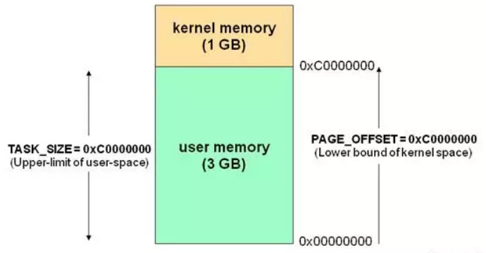
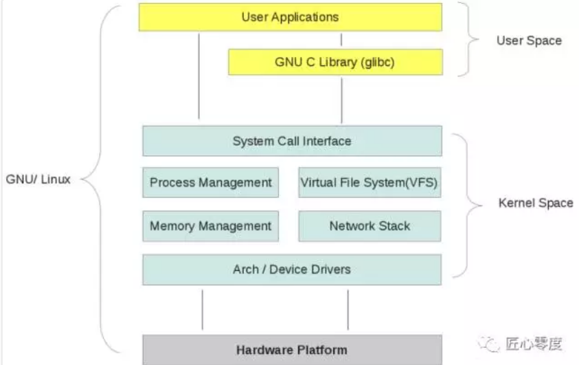
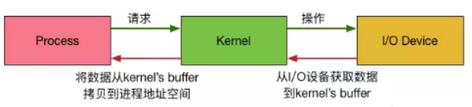
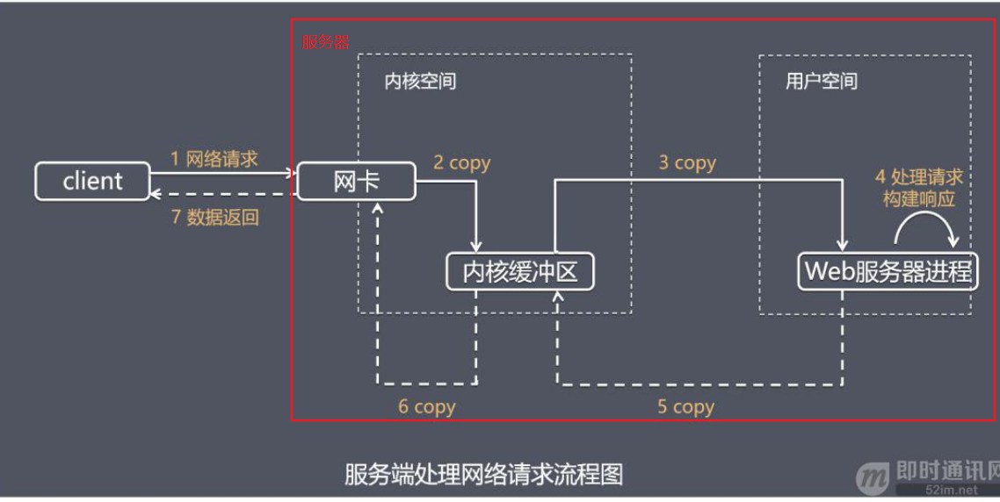
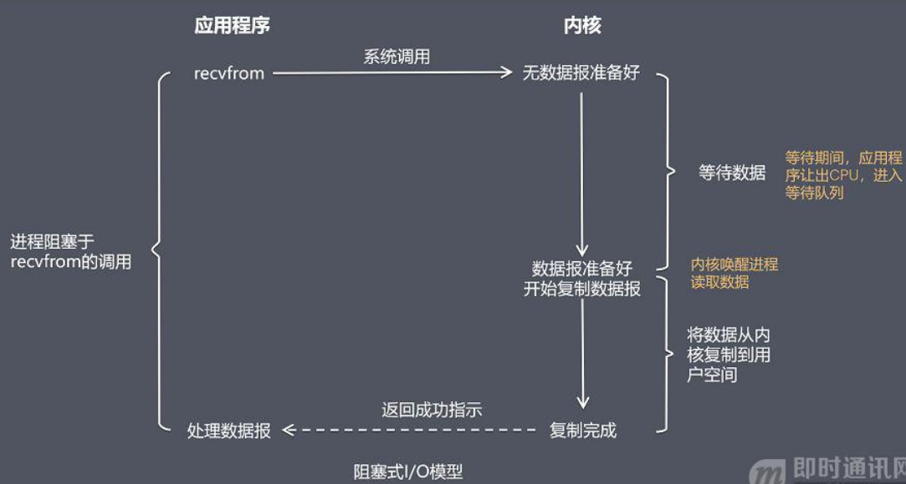
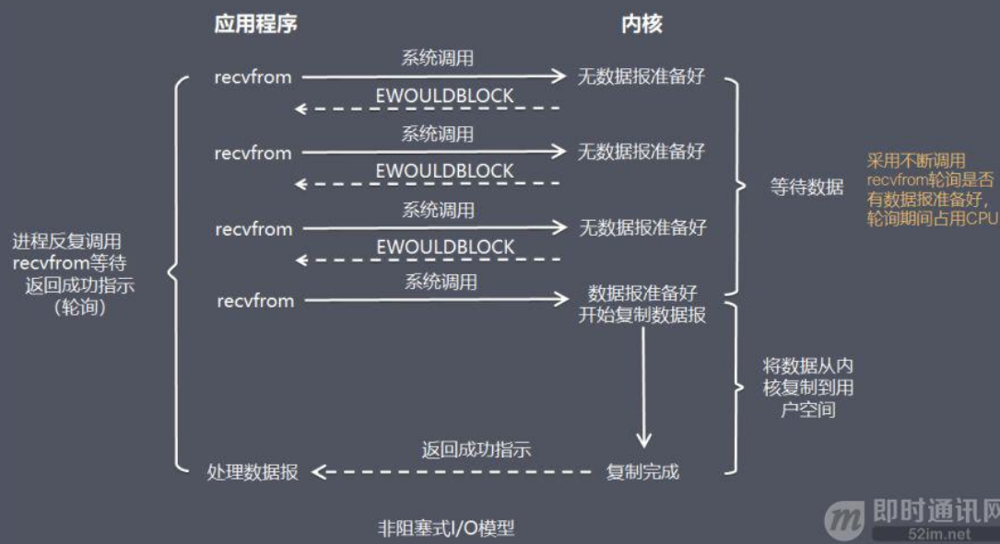
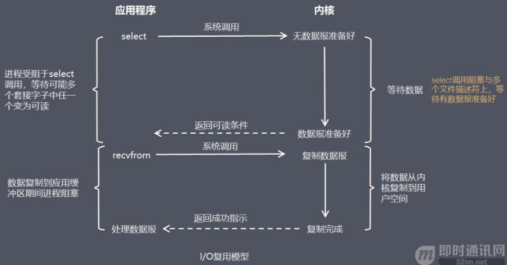
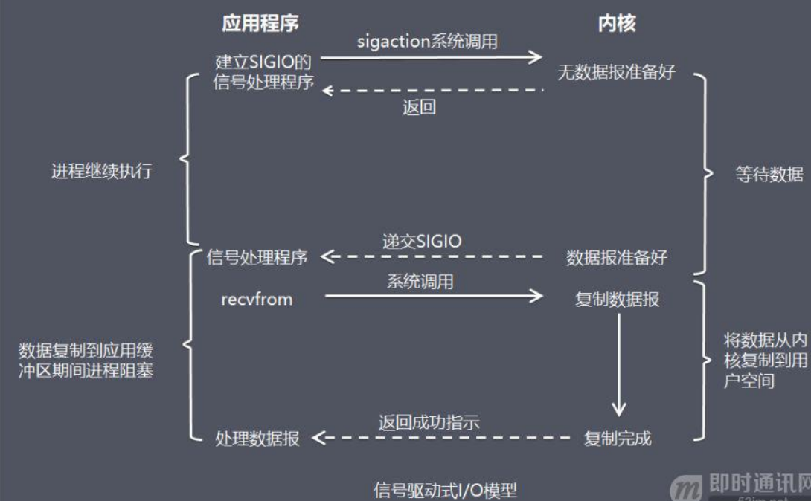
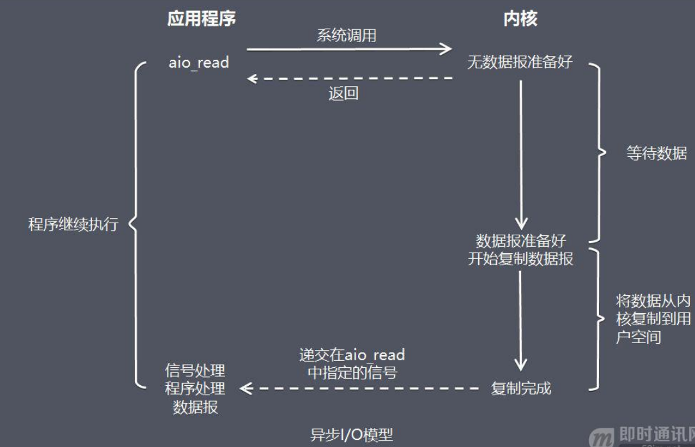
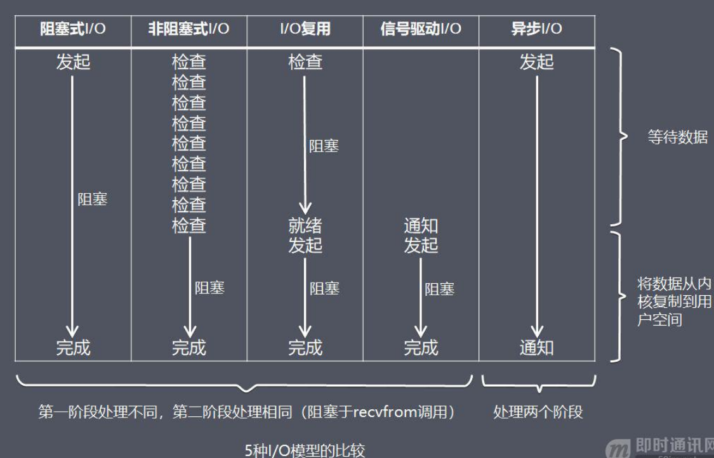

<!-- TOC -->

- [1、用户空间和内核空间](#1用户空间和内核空间)
- [2、高性能网络编程中的I/O模型](#2高性能网络编程中的io模型)
    - [1、互联网服务端处理网络请求的原理](#1互联网服务端处理网络请求的原理)
    - [2、“I/O 模型”的基本认识](#2io-模型的基本认识)
    - [3、I/O模型1：阻塞式 I/O 模型(blocking I/O）](#3io模型1阻塞式-io-模型blocking-io)
    - [4、I/O模型2：非阻塞式 I/O 模型(non-blocking I/O）](#4io模型2非阻塞式-io-模型non-blocking-io)
    - [5、I/O模型3：I/O 复用模型(I/O multiplexing）](#5io模型3io-复用模型io-multiplexing)
        - [1、文件描述符fd](#1文件描述符fd)
        - [2、select](#2select)
        - [3、poll](#3poll)
        - [4、epoll](#4epoll)
    - [6、I/O模型4：信号驱动式 I/O 模型（signal-driven I/O)](#6io模型4信号驱动式-io-模型signal-driven-io)
    - [7、I/O模型5：异步 I/O 模型（即AIO，全称asynchronous I/O）](#7io模型5异步-io-模型即aio全称asynchronous-io)
    - [8、5 种 I/O 模型总结](#85-种-io-模型总结)
- [参考](#参考)

<!-- /TOC -->

# 1、用户空间和内核空间

我们知道现在操作系统都是采用虚拟存储器，那么对32位操作系统而言，它的寻址空间（虚拟存储空间）为4G（2的32次方）。操心系统的核心是内核，独立于普通的应用程序，可以访问受保护的内存空间，也有访问底层硬件设备的所有权限。为了保证用户进程不能直接操作内核，保证内核的安全，操心系统将虚拟空间划分为两部分，一部分为内核空间，一部分为用户空间。针对linux操作系统而言，将最高的1G字节（从虚拟地址0xC0000000到0xFFFFFFFF），供内核使用，称为内核空间，而将较低的3G字节（从虚拟地址0x00000000到0xBFFFFFFF），供各个进程使用，称为用户空间。每个进程可以通过系统调用进入内核，因此，Linux内核由系统内的所有进程共享。于是，从具体进程的角度来看，每个进程可以拥有4G字节的虚拟空间。

空间分配如下图所示：

有了用户空间和内核空间，整个linux内部结构可以分为三部分，从最底层到最上层依次是：硬件-->内核空间-->用户空间。

如下图所示：

>> 需要注意的细节问题，从上图可以看出内核的组成:

- 内核空间中存放的是内核代码和数据，而进程的用户空间中存放的是用户程序的代码和数据。不管是内核空间还是用户空间，它们都处于虚拟空间中。

- Linux使用两级保护机制：0级供内核使用，3级供用户程序使用。

我们都知道，为了OS的安全性等的考虑，进程是无法直接操作I/O设备的，其必须通过系统调用请求内核来协助完成I/O动作，而内核会为每个I/O设备维护一个buffer。

如下图所示：

整个请求过程为： 用户进程发起请求，内核接受到请求后，从I/O设备中获取数据到buffer中，再将buffer中的数据copy到用户进程的地址空间，该用户进程获取到数据后再响应客户端。

在整个请求过程中，数据输入至buffer需要时间，而从buffer复制数据至进程也需要时间。因此根据在这两段时间内等待方式的不同，I/O动作可以分为以下五种模式：

- 阻塞I/O (Blocking I/O)

- 非阻塞I/O (Non-Blocking I/O)

- I/O复用（I/O Multiplexing)

- 信号驱动的I/O (Signal Driven I/O)

- 异步I/O (Asynchrnous I/O) 

>> 记住这两点很重要

- 1 等待数据准备 (Waiting for the data to be ready)

- 2 将数据从内核拷贝到进程中 (Copying the data from the kernel to the process)

# 2、高性能网络编程中的I/O模型

## 1、互联网服务端处理网络请求的原理

首先看看一个典型互联网服务端处理网络请求的典型过程：

由上图可以看到，主要处理步骤包括： 

- 1）获取请求数据，客户端与服务器建立连接发出请求，服务器接受请求（1-3）；
- 2）构建响应，当服务器接收完请求，并在用户空间处理客户端的请求，直到构建响应完成（4）；
- 3）返回数据，服务器将已构建好的响应再通过内核空间的网络 I/O 发还给客户端（5-7）。

设计服务端并发模型时，主要有如下两个关键点： 

- 1）服务器如何管理连接，获取输入数据；
- 2）服务器如何处理请求。

以上两个关键点最终都与操作系统的 I/O 模型以及线程(进程)模型相关，下面先详细介绍这I/O模型。

## 2、“I/O 模型”的基本认识

介绍操作系统的 I/O 模型之前，先了解一下几个概念： 

- 1）阻塞调用与非阻塞调用；
- 2）阻塞调用是指调用结果返回之前，当前线程会被挂起，调用线程只有在得到结果之后才会返回；
- 3）非阻塞调用指在不能立刻得到结果之前，该调用不会阻塞当前线程。

两者的最大区别在于被调用方在收到请求到返回结果之前的这段时间内，调用方是否一直在等待。

阻塞是指调用方一直在等待而且别的事情什么都不做；非阻塞是指调用方先去忙别的事情。

同步处理与异步处理：同步处理是指被调用方得到最终结果之后才返回给调用方；异步处理是指被调用方先返回应答，然后再计算调用结果，计算完最终结果后再通知并返回给调用方。

阻塞、非阻塞和同步、异步的区别（阻塞、非阻塞和同步、异步其实针对的对象是不一样的）：

1）阻塞、非阻塞的讨论对象是调用者；

2）同步、异步的讨论对象是被调用者。

> recvfrom 函数：

recvfrom 函数(经 Socket 接收数据)，这里把它视为系统调用。

一个输入操作通常包括两个不同的阶段：

1）等待数据准备好；

2）从内核向进程复制数据。

对于一个套接字上的输入操作，第一步通常涉及等待数据从网络中到达。当所等待分组到达时，它被复制到内核中的某个缓冲区。第二步就是把数据从内核缓冲区复制到应用进程缓冲区。

实际应用程序在系统调用完成上面的 2 步操作时，调用方式的阻塞、非阻塞，操作系统在处理应用程序请求时，处理方式的同步、异步处理的不同，可以分为 5 种 I/O 模型（下面的章节将逐个展开介绍）。（参考《UNIX网络编程卷1》）

## 3、I/O模型1：阻塞式 I/O 模型(blocking I/O）

在阻塞式 I/O 模型中，应用程序在从调用 recvfrom 开始到它返回有数据报准备好这段时间是阻塞的，recvfrom 返回成功后，应用进程开始处理数据报。

- 比喻：一个人在钓鱼，当没鱼上钩时，就坐在岸边一直等。
- 优点：程序简单，在阻塞等待数据期间进程/线程挂起，基本不会占用 CPU 资源。
- 缺点：每个连接需要独立的进程/线程单独处理，当并发请求量大时为了维护程序，内存、线程切换开销较大，这种模型在实际生产中很少使用。

## 4、I/O模型2：非阻塞式 I/O 模型(non-blocking I/O）

在非阻塞式 I/O 模型中，应用程序把一个套接口设置为非阻塞，就是告诉内核，当所请求的 I/O 操作无法完成时，不要将进程睡眠。

而是返回一个错误，应用程序基于 I/O 操作函数将不断的轮询数据是否已经准备好，如果没有准备好，继续轮询，直到数据准备好为止。

- 比喻：边钓鱼边玩手机，隔会再看看有没有鱼上钩，有的话就迅速拉杆。
- 优点：不会阻塞在内核的等待数据过程，每次发起的 I/O 请求可以立即返回，不用阻塞等待，实时性较好。
- 缺点：轮询将会不断地询问内核，这将占用大量的 CPU 时间，系统资源利用率较低，所以一般 Web 服务器不使用这种 I/O 模型。

## 5、I/O模型3：I/O 复用模型(I/O multiplexing）

在 I/O 复用模型中，会用到 Select 或 Poll 函数或 Epoll 函数(Linux 2.6 以后的内核开始支持)，这两个函数也会使进程阻塞，但是和阻塞 I/O 有所不同。

这两个函数可以同时阻塞多个 I/O 操作，而且可以同时对多个读操作，多个写操作的 I/O 函数进行检测，直到有数据可读或可写时，才真正调用 I/O 操作函数。

- 比喻：放了一堆鱼竿，在岸边一直守着这堆鱼竿，没鱼上钩就玩手机。
- 优点：可以基于一个阻塞对象，同时在多个描述符上等待就绪，而不是使用多个线程(每个文件描述符一个线程)，这样可以大大节省系统资源。
- 缺点：当连接数较少时效率相比多线程+阻塞 I/O 模型效率较低，可能延迟更大，因为单个连接处理需要 2 次系统调用，占用时间会有增加。

众所周之，Nginx这样的高性能互联网反向代理服务器大获成功的关键就是得益于Epoll。

IO multiplexing这个词可能有点陌生，但是如果我说select，epoll，大概就都能明白了。有些地方也称这种IO方式为event driven IO。我们都知道，select/epoll的好处就在于单个process就可以同时处理多个网络连接的IO。它的基本原理就是select/epoll这个function会不断的轮询所负责的所有socket，当某个socket有数据到达了，就通知用户进程。

当用户进程调用了select，那么整个进程会被block，而同时，内核会“监视”所有select负责的socket，当任何一个socket中的数据准备好了，select就会返回。这个时候用户进程再调用read操作，将数据从内核拷贝到用户进程。

这个图和blocking IO的图其实并没有太大的不同，事实上，还更差一些。因为这里需要使用两个system call (select 和 recvfrom)，而blocking IO只调用了一个system call (recvfrom)。但是，用select的优势在于它可以同时处理多个connection。（多说一句。所以，如果处理的连接数不是很高的话，使用select/epoll的web server不一定比使用multi-threading + blocking IO的web server性能更好，可能延迟还更大。select/epoll的优势并不是对于单个连接能处理得更快，而是在于能处理更多的连接。）在IO multiplexing Model中，实际中，对于每一个socket，一般都设置成为non-blocking，但是，如上图所示，整个用户的process其实是一直被block的。只不过process是被select这个函数block，而不是被socket IO给block。

### 1、文件描述符fd

Linux的内核将所有外部设备都可以看做一个文件来操作。那么我们对与外部设备的操作都可以看做对文件进行操作。我们对一个文件的读写，都通过调用内核提供的系统调用；内核给我们返回一个filede scriptor（fd,文件描述符）。而对一个socket的读写也会有相应的描述符，称为socketfd(socket描述符）。描述符就是一个数字，指向内核中一个结构体（文件路径，数据区，等一些属性）。那么我们的应用程序对文件的读写就通过对描述符的读写完成。

### 2、select

基本原理：select 函数监视的文件描述符分3类，分别是writefds、readfds、和exceptfds。调用后select函数会阻塞，直到有描述符就绪（有数据可读、可写、或者有except），或者超时（timeout指定等待时间，如果立即返回设为null即可），函数返回。当select函数返回后，可以通过遍历fdset，来找到就绪的描述符。

> 缺点:

- 1、select最大的缺陷就是单个进程所打开的FD是有一定限制的，它由FDSETSIZE设置，32位机默认是1024个，64位机默认是2048。一般来说这个数目和系统内存关系很大，”具体数目可以cat /proc/sys/fs/file-max察看”。32位机默认是1024个。64位机默认是2048.

- 2、对socket进行扫描时是线性扫描，即采用轮询的方法，效率较低。当套接字比较多的时候，每次select()都要通过遍历FDSETSIZE个Socket来完成调度，不管哪个Socket是活跃的，都遍历一遍。这会浪费很多CPU时间。”如果能给套接字注册某个回调函数，当他们活跃时，自动完成相关操作，那就避免了轮询”，这正是epoll与kqueue做的。

- 3、需要维护一个用来存放大量fd的数据结构，这样会使得用户空间和内核空间在传递该结构时复制开销大。

### 3、poll

基本原理：poll本质上和select没有区别，它将用户传入的数组拷贝到内核空间，然后查询每个fd对应的设备状态，如果设备就绪则在设备等待队列中加入一项并继续遍历，如果遍历完所有fd后没有发现就绪设备，则挂起当前进程，直到设备就绪或者主动超时，被唤醒后它又要再次遍历fd。这个过程经历了多次无谓的遍历。

它没有最大连接数的限制，原因是它是基于链表来存储的，但是同样有一个缺点：

- 1、大量的fd的数组被整体复制于用户态和内核地址空间之间，而不管这样的复制是不是有意义。

- 2、poll还有一个特点是“水平触发”，如果报告了fd后，没有被处理，那么下次poll时会再次报告该fd。

注意：从上面看，select和poll都需要在返回后，通过遍历文件描述符来获取已经就绪的socket。事实上，同时连接的大量客户端在一时刻可能只有很少的处于就绪状态，因此随着监视的描述符数量的增长，其效率也会线性下降。

### 4、epoll

epoll是在2.6内核中提出的，是之前的select和poll的增强版本。相对于select和poll来说，epoll更加灵活，没有描述符限制。epoll使用一个文件描述符管理多个描述符，将用户关系的文件描述符的事件存放到内核的一个事件表中，这样在用户空间和内核空间的copy只需一次。

基本原理：epoll支持水平触发和边缘触发，最大的特点在于边缘触发，它只告诉进程哪些fd刚刚变为就绪态，并且只会通知一次。还有一个特点是，epoll使用“事件”的就绪通知方式，通过epollctl注册fd，一旦该fd就绪，内核就会采用类似callback的回调机制来激活该fd，epollwait便可以收到通知。

epoll的优点：

- 1、没有最大并发连接的限制，能打开的FD的上限远大于1024（1G的内存上能监听约10万个端口）。

- 2、效率提升，不是轮询的方式，不会随着FD数目的增加效率下降。只有活跃可用的FD才会调用callback函数；即Epoll最大的优点就在于它只管你“活跃”的连接，而跟连接总数无关，因此在实际的网络环境中，Epoll的效率就会远远高于select和poll。

- 3、内存拷贝，利用mmap()文件映射内存加速与内核空间的消息传递；即epoll使用mmap减少复制开销。

JDK1.5_update10版本使用epoll替代了传统的select/poll，极大的提升了NIO通信的性能。

备注：JDK NIO的BUG，例如臭名昭著的epoll bug，它会导致Selector空轮询，最终导致CPU 100%。官方声称在JDK1.6版本的update18修复了该问题，但是直到JDK1.7版本该问题仍旧存在，只不过该BUG发生概率降低了一些而已，它并没有被根本解决。这个可以在后续netty系列里面进行说明下。

## 6、I/O模型4：信号驱动式 I/O 模型（signal-driven I/O)

在信号驱动式 I/O 模型中，应用程序使用套接口进行信号驱动 I/O，并安装一个信号处理函数，进程继续运行并不阻塞。

当数据准备好时，进程会收到一个 SIGIO 信号，可以在信号处理函数中调用 I/O 操作函数处理数据。

- 比喻：鱼竿上系了个铃铛，当铃铛响，就知道鱼上钩，然后可以专心玩手机。
- 优点：线程并没有在等待数据时被阻塞，可以提高资源的利用率。
- 缺点：信号 I/O 在大量 IO 操作时可能会因为信号队列溢出导致没法通知。

信号驱动 I/O 尽管对于处理 UDP 套接字来说有用，即这种信号通知意味着到达一个数据报，或者返回一个异步错误。

但是，对于 TCP 而言，信号驱动的 I/O 方式近乎无用，因为导致这种通知的条件为数众多，每一个来进行判别会消耗很大资源，与前几种方式相比优势尽失。

## 7、I/O模型5：异步 I/O 模型（即AIO，全称asynchronous I/O）

由 POSIX 规范定义，应用程序告知内核启动某个操作，并让内核在整个操作（包括将数据从内核拷贝到应用程序的缓冲区）完成后通知应用程序。

这种模型与信号驱动模型的主要区别在于：信号驱动 I/O 是由内核通知应用程序何时启动一个 I/O 操作，而异步 I/O 模型是由内核通知应用程序 I/O 操作何时完成。

- 优点：异步 I/O 能够充分利用 DMA 特性，让 I/O 操作与计算重叠。
- 缺点：要实现真正的异步 I/O，操作系统需要做大量的工作。目前 Windows 下通过 IOCP 实现了真正的异步 I/O。

而在 Linux 系统下，Linux 2.6才引入，目前 AIO 并不完善，因此在 Linux 下实现高并发网络编程时都是以 IO 复用模型模式为主。

## 8、5 种 I/O 模型总结

从上图中我们可以看出，越往后，阻塞越少，理论上效率也是最优。

这五种 I/O 模型中，前四种属于同步 I/O，因为其中真正的 I/O 操作(recvfrom)将阻塞进程/线程，只有异步 I/O 模型才与 POSIX 定义的异步 I/O 相匹配。

# 参考

- [高性能网络编程(五)：一文读懂高性能网络编程中的I/O模型](http://www.52im.net/thread-1935-1-1.html)

- [聊聊Unix与Java的IO模型](https://mp.weixin.qq.com/s/mEahtWqeFqzzaETHKAWtzw)
- [NIO相关基础篇三](https://mp.weixin.qq.com/s/5SKgdkC0kaHN495psLd3Tg?scene=25#wechat_redirect)
- [Linux 五种IO模型](https://blog.csdn.net/weily11/article/details/80311258)
- [什么是Zero-Copy?](https://mp.weixin.qq.com/s/aInxpcCC6k_R_tNzzURByg)

- [闲话高并发的那些神话，看京东架构师如何把它拉下神坛](https://cloud.tencent.com/developer/article/1170510)