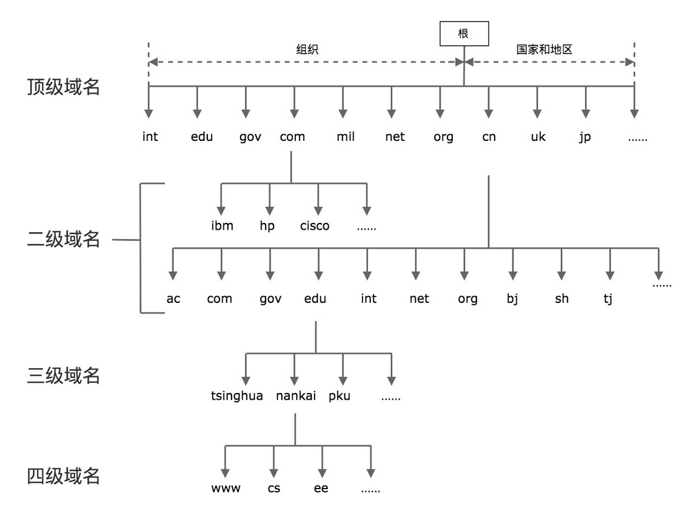

<!-- TOC -->

- [0、问题](#0问题)
- [01、TCP/IP](#01tcpip)
- [02、网络编程模型：客户端-服务器网络模型的基本概念](#02网络编程模型客户端-服务器网络模型的基本概念)
    - [1、IP 和端口](#1ip-和端口)
    - [2、保留网段\子网掩码](#2保留网段\子网掩码)
    - [3、域名系统](#3域名系统)
    - [4、数据报和字节流](#4数据报和字节流)
- [03、套接字](#03套接字)
    - [1、通用套接字地址格式](#1通用套接字地址格式)
    - [2、IPv4 套接字格式地址](#2ipv4-套接字格式地址)
    - [3、IPv6 套接字地址格式](#3ipv6-套接字地址格式)
    - [4、几种套接字地址格式比较](#4几种套接字地址格式比较)
- [04、TCP三次握手](#04tcp三次握手)
    - [1、服务端准备连接的过程](#1服务端准备连接的过程)
        - [1、创建套接字](#1创建套接字)
        - [2、bind](#2bind)
- [参考](#参考)

<!-- /TOC -->


# 0、问题

- 大家经常说的四层、七层，分别指的是什么？
- TCP 三次握手是什么，TIME_WAIT 是怎么发生的？CLOSE_WAIT 又是什么状态？
- Linux 下的 epoll 解决的是什么问题？如何使用 epoll 写出高性能的网络程序？
- 什么是网络事件驱动模型？Reactor 模式又是什么？


学习高性能网络编程，掌握两个核心要点就可以了：`第一就是理解网络协议，并在这个基础上和操作系统内核配合，感知各种网络 I/O 事件；第二就是学会使用线程处理并发。`


要学好网络编程，需要达到以下三个层次。

- 第一个层次，充分理解 TCP/IP 网络模型和协议;
- 第二个层次，结合对协议的理解，增强对各种异常情况的优雅处理能力。比如对 TCP 数据流的处理，半关闭的连接，TCP 连接有效性的侦测，处理各种异常情况等，这些问题决定了程序的健壮性。
- 第三个层次，写出可以支持大规模高并发的网络处理程序。深入研究 C10K 问题，引入进程、线程、多路复用、非阻塞、异步、事件驱动等现代高性能网络编程所需要的技术。


# 01、TCP/IP

一般我们说的 4 层、7 层，也是遵从了 OSI 模型的定义，分别指代传输层和应用层。我们说 TCP/IP 的应用层对应了 OSI 的应用层、表示层和会话层；TCP/IP 的网络接口层对应了 OSI 的数据链路层和物理层。


下图展示了 TCP/IP 在各大操作系统的演变历史


# 02、网络编程模型：客户端-服务器网络模型的基本概念

在谈论网络编程时，我们首先需要建立一个概念，也就是“客户端 - 服务器”。


在网络编程中，具体到客户端 - 服务器模型时，我们经常会考虑是使用 TCP 还是 UDP，其实它们二者的区别也很简单：TCP 中连接是谁发起的，在 UDP 中报文是谁发送的。`tcp谁发起的谁是客户端，udp谁发送的谁是客户端`

服务器端需要在一开始就监听在一个众所周知的端口上(比如80端口)，等待客户端发送请求，一旦有客户端连接建立，服务器端就会消耗一定的计算机资源为它服务，服务器端是需要同时为成千上万的客户端服务的。

客户端相对来说更为简单，它向服务器端的监听端口发起连接请求，连接建立之后，通过连接通路和服务器端进行通信。

`还有一点需要强调的是，无论是客户端，还是服务器端，它们运行的单位都是进程（process），而不是机器。`


## 1、IP 和端口

计算机的 IP 地址是唯一的，每个连接的端口号是不同的。端口号是一个 16 位的整数，最多为 65536。当一个客户端发起连接请求时，客户端的端口是由操作系统内核临时分配的，称为临时端口；但是服务器端的端口通常是一个众所周知的端口。

一个连接可以通过客户端 - 服务器端的 IP 和端口唯一确定，这叫做套接字对，按照下面的四元组表示：

```
（clientaddr:clientport, serveraddr: serverport)
```

下图表示了一个客户端 - 服务器之间的连接


## 2、保留网段\子网掩码

在网络 IP 划分的时候，我们需要区分两个概念。

- 第一是网络（network）的概念，直观点说，它表示的是这组 IP 共同的部分，比如在 192.168.1.1~192.168.1.255 这个区间里，它们共同的部分是 192.168.1.0。

- 第二是主机（host）的概念，它表示的是这组 IP 不同的部分，上面的例子中 1~255 就是不同的那些部分，表示有 255 个可用的不同 IP。例如 IPv4 地址，192.0.2.12，我们可以说前面三个 bytes 是子网，最后一个 byte 是 host，或者换个方式，我们能说 host 为 8 位，子网掩码为 192.0.2.0/24（255.255.255.0）。


`子网掩码的格式永远都是二进制格式：前面是一连串的 1，后面跟着一连串的 0`

保留网段即内网IP


## 3、域名系统

简单来说就是IP地址不好记，起了一个别名助记符，如何把这个助记符和IP关联起来，就是域名系统要干的事情。

全球域名按照从大到小的结构，形成了一棵树状结构。实际访问一个域名时，是从最底层开始写起，例如 www.google.com，www.tinghua.edu.cn等。



## 4、数据报和字节流

传输层其实是有两种协议的，一种是大家广为熟悉的 TCP， 而另一种就是 UDP。

TCP，又被叫做字节流套接字（Stream Socket），UDP 也有一个类似的叫法, 数据报套接字（Datagram Socket），一般分别以“SOCK_STREAM”与“SOCK_DGRAM”分别来表示 TCP 和 UDP 套接字。

Datagram Sockets 有时称为“无连接的 sockets”（connectionless sockets）。

Stream sockets 是可靠的、双向连接的通讯串流。比如以“1-2-3”的顺序将字节流输出到套接字上，它们在另一端一定会以“1-2-3”的顺序抵达，而且不会出错。这种高质量的通信是如何办到的呢？这就是由 TCP（Transmission Control Protocol）协议完成的，TCP通过诸如`连接管理，拥塞控制，数据流与窗口管理，超时和重传等`一系列精巧而详细的设计，提供了高质量的端到端的通信方式。

并不是所有场景都是以tcp保证数据的高质量，比如多人联网游戏、视频会议，甚至聊天室。`会使用tcp，原因是速度`


# 03、套接字

在网络编程中，我们经常会提到 socket 这个词，它的中文翻译为套接字，有的时候也叫做套接口。socket 这个英文单词的原意是“插口”“插槽”， 在网络编程中，它的寓意是可以通过插口接入的方式，快速完成网络连接和数据收发。你可以把它想象成现实世界的电源插口，或者是早期上网需要的网络插槽，所以 socket 也可以看做是对物理世界的直接映射。

下面这张图表达的其实是网络编程中，客户端和服务器工作的核心逻辑。


我们先从右侧的服务器端开始看，因为在客户端发起连接请求之前，服务器端必须初始化好。右侧的图显示的是服务器端初始化的过程，首先初始化 socket，之后服务器端需要执行 bind 函数，将自己的服务能力绑定在一个众所周知的地址和端口上，紧接着，服务器端执行 listen 操作，将原先的 socket 转化为服务端的 socket，服务端最后阻塞在 accept 上等待客户端请求的到来。

此时，服务器端已经准备就绪。客户端需要先初始化 socket，再执行 connect 向服务器端的地址和端口发起连接请求，这里的地址和端口必须是客户端预先知晓的。这个过程，就是著名的 TCP 三次握手（Three-way Handshake）。

一旦三次握手完成，客户端和服务器端建立连接，就进入了数据传输过程。


具体来说，客户端进程向操作系统内核发起 write 字节流写操作，内核协议栈将字节流通过网络设备传输到服务器端，服务器端从内核得到信息，将字节流从内核读入到进程中，并开始业务逻辑的处理，完成之后，服务器端再将得到的结果以同样的方式写给客户端。可以看到，一旦连接建立，数据的传输就不再是单向的，而是双向的，这也是 TCP 的一个显著特性。

当客户端完成和服务器端的交互后，比如执行一次 Telnet 操作，或者一次 HTTP 请求，需要和服务器端断开连接时，就会执行 close 函数，操作系统内核此时会通过原先的连接链路向服务器端发送一个 FIN 包，服务器收到之后执行被动关闭，这时候整个链路处于半关闭状态，此后，服务器端也会执行 close 函数，整个链路才会真正关闭。半关闭的状态下，发起 close 请求的一方在没有收到对方 FIN 包之前都认为连接是正常的；而在全关闭的状态下，双方都感知连接已经关闭。


`socket 是我们用来建立连接，传输数据的唯一途径。`

## 1、通用套接字地址格式

```c

/* POSIX.1g 规范规定了地址族为2字节的值.  */
typedef unsigned short int sa_family_t;
/* 描述通用套接字地址  */
struct sockaddr{
    sa_family_t sa_family;  /* 地址族.  16-bit*/
    char sa_data[14];   /* 具体的地址值 112-bit */
  }; 
```

在这个结构体里，第一个字段是地址族，它表示使用什么样的方式对地址进行解释和保存，好比电话簿里的手机格式，或者是固话格式，这两种格式的长度和含义都是不同的。地址族在 glibc 里的定义非常多，常用的有以下几种：

- AF_LOCAL：表示的是本地地址，对应的是 Unix 套接字，这种情况一般用于本地 socket 通信，很多情况下也可以写成 AF_UNIX、AF_FILE；

- AF_INET：因特网使用的 IPv4 地址；

- AF_INET6：因特网使用的 IPv6 地址。

这里的 AF_ 表示的含义是 Address Family，但是很多情况下，我们也会看到以 PF_ 表示的宏，比如 PF_INET、PF_INET6 等，实际上 PF_ 的意思是 Protocol Family，也就是协议族的意思。`我们用 AF_xxx 这样的值来初始化 socket 地址，用 PF_xxx 这样的值来初始化 socket。`我们在 头文件中可以清晰地看到，这两个值本身就是一一对应的。


```c
/* 各种地址族的宏定义  */
#define AF_UNSPEC PF_UNSPEC
#define AF_LOCAL  PF_LOCAL
#define AF_UNIX   PF_UNIX
#define AF_FILE   PF_FILE
#define AF_INET   PF_INET
#define AF_AX25   PF_AX25
#define AF_IPX    PF_IPX
#define AF_APPLETALK  PF_APPLETALK
#define AF_NETROM PF_NETROM
#define AF_BRIDGE PF_BRIDGE
#define AF_ATMPVC PF_ATMPVC
#define AF_X25    PF_X25
#define AF_INET6  PF_INET6
```

## 2、IPv4 套接字格式地址

```c

/* IPV4套接字地址，32bit值.  */
typedef uint32_t in_addr_t;
struct in_addr
  {
    in_addr_t s_addr;
  };
  
/* 描述IPV4的套接字地址格式  */
struct sockaddr_in
  {
    sa_family_t sin_family; /* 16-bit */
    in_port_t sin_port;     /* 端口号  16-bit*/
    struct in_addr sin_addr;    /* Internet address. 32-bit */


    /* 这里仅仅用作占位符，不做实际用处  */
    unsigned char sin_zero[8];
  };
```

我们对这个结构体稍作解读，首先可以发现和 sockaddr 一样，都有一个 16-bit 的 sin_family 字段，对于 IPv4 来说这个值就是 AF_INET。接下来是端口号，我们可以看到端口号最多是 16-bit，也就是说最大支持 2 的 16 次方，这个数字是 65536，所以我们应该知道支持寻址的端口号最多就是 65535。所谓保留端口就是大家约定俗成的，已经被对应服务广为使用的端口，比如 ftp 的 21 端口，ssh 的 22 端口，http 的 80 端口等。一般而言，大于 5000 的端口可以作为我们自己应用程序的端口使用。

下面是 glibc 定义的保留端口。

```c

/* Standard well-known ports.  */
enum
  {
    IPPORT_ECHO = 7,    /* Echo service.  */
    IPPORT_DISCARD = 9,   /* Discard transmissions service.  */
    IPPORT_SYSTAT = 11,   /* System status service.  */
    IPPORT_DAYTIME = 13,  /* Time of day service.  */
    IPPORT_NETSTAT = 15,  /* Network status service.  */
    IPPORT_FTP = 21,    /* File Transfer Protocol.  */
    IPPORT_TELNET = 23,   /* Telnet protocol.  */
    IPPORT_SMTP = 25,   /* Simple Mail Transfer Protocol.  */
    IPPORT_TIMESERVER = 37, /* Timeserver service.  */
    IPPORT_NAMESERVER = 42, /* Domain Name Service.  */
    IPPORT_WHOIS = 43,    /* Internet Whois service.  */
    IPPORT_MTP = 57,


    IPPORT_TFTP = 69,   /* Trivial File Transfer Protocol.  */
    IPPORT_RJE = 77,
    IPPORT_FINGER = 79,   /* Finger service.  */
    IPPORT_TTYLINK = 87,
    IPPORT_SUPDUP = 95,   /* SUPDUP protocol.  */


    IPPORT_EXECSERVER = 512,  /* execd service.  */
    IPPORT_LOGINSERVER = 513, /* rlogind service.  */
    IPPORT_CMDSERVER = 514,
    IPPORT_EFSSERVER = 520,


    /* UDP ports.  */
    IPPORT_BIFFUDP = 512,
    IPPORT_WHOSERVER = 513,
    IPPORT_ROUTESERVER = 520,


    /* Ports less than this value are reserved for privileged processes.  */
    IPPORT_RESERVED = 1024,


    /* Ports greater this value are reserved for (non-privileged) servers.  */
    IPPORT_USERRESERVED = 5000
```

实际的 IPv4 地址是一个 32-bit 的字段，可以想象最多支持的地址数就是 2 的 32 次方，大约是 42 亿，应该说这个数字在设计之初还是非常巨大的，无奈互联网蓬勃发展，全球接入的设备越来越多，这个数字渐渐显得不太够用了，于是大家所熟知的 IPv6 就隆重登场了。


## 3、IPv6 套接字地址格式

```c

struct sockaddr_in6
  {
    sa_family_t sin6_family; /* 16-bit */
    in_port_t sin6_port;  /* 传输端口号 # 16-bit */
    uint32_t sin6_flowinfo; /* IPv6流控信息 32-bit*/
    struct in6_addr sin6_addr;  /* IPv6地址128-bit */
    uint32_t sin6_scope_id; /* IPv6域ID 32-bit */
  };
```

整个结构体长度是 28 个字节，其中流控信息和域 ID 先不用管，这两个字段，一个在 glibc 的官网上根本没出现，另一个是当前未使用的字段。这里的地址族显然应该是 AF_INET6，端口同 IPv4 地址一样，关键的地址从 32 位升级到 128 位，这个数字就大到恐怖了，完全解决了寻址数字不够的问题。请注意，以上无论 IPv4 还是 IPv6 的地址格式都是因特网套接字的格式，还有一种本地套接字格式，用来作为本地进程间的通信， 也就是前面提到的 AF_LOCAL。

```c

struct sockaddr_un {
    unsigned short sun_family; /* 固定为 AF_LOCAL */
    char sun_path[108];   /* 路径名 */
};
```

## 4、几种套接字地址格式比较

这几种地址的比较见下图，IPv4 和 IPv6 套接字地址结构的长度是固定的，而本地地址结构的长度是可变的。


> 思考题

可以想一想 IPv4、IPv6、本地套接字格式以及通用地址套接字，它们有什么共性呢？如果你是 BSD 套接字的设计者，你为什么要这样设计呢？第二道题是，为什么本地套接字格式不需要端口号，而 IPv4 和 IPv6 套接字格式却需要端口号呢？


unix系统有一种一统天下的简洁之美:一切皆文件，socket也是文件。

1.像sock_addr的结构体里描述的那样，几种套接字都要有地址族和地址两个字段。这容易理解，你要与外部通信，肯定要至少告诉计算机对方的地址和使用的是哪一种地址。与远程计算机的通信还需要一个端口号。而本地socket的不同之处在于不需要端口号，那么就有了问题2;

2.本地socket本质上是在访问本地的文件系统，所以自然不需要端口。远程socket是直接将一段字节流发送到远程计算机的一个进程，而远程计算机可能同时有多个进程在监听，所以用端口号标定要发给哪一个进程。


# 04、TCP三次握手


## 1、服务端准备连接的过程

### 1、创建套接字

要创建一个可用的套接字，需要使用下面的函数：

int socket(int domain, int type, int protocol)

- domain 就是指 PF_INET、PF_INET6 以及 PF_LOCAL 等，表示什么样的套接字。

- type 可用的值是：SOCK_STREAM: 表示的是字节流，对应 TCP；SOCK_DGRAM： 表示的是数据报，对应 UDP；SOCK_RAW: 表示的是原始套接字。

- 参数 protocol 原本是用来指定通信协议的，但现在基本废弃。因为协议已经通过前面两个参数指定完成。protocol 目前一般写成 0 即可。


### 2、bind

创建出来的套接字如果需要被别人使用，就需要调用 bind 函数把套接字和套接字地址绑定。调用 bind 函数的方式如下：

bind(int fd, sockaddr * addr, socklen_t len)

我们需要注意到 bind 函数后面的第二个参数是通用地址格式sockaddr * addr。这里有一个地方值得注意，那就是虽然接收的是通用地址格式，实际上传入的参数可能是 IPv4、IPv6 或者本地套接字格式`（类似于java中的多态）`。bind 函数会根据 len 字段判断传入的参数 addr 该怎么解析，len 字段表示的就是传入的地址长度，它是一个可变值。

对于使用者来说，每次需要将 IPv4、IPv6 或者本地套接字格式转化为通用套接字格式，就像下面的 IPv4 套接字地址格式的例子一样：

```c

struct sockaddr_in name;
bind (sock, (struct sockaddr *) &name, sizeof (name)
```

对于实现者来说，可根据该地址结构的前两个字节判断出是哪种地址。为了处理长度可变的结构，需要读取函数里的第三个参数，也就是 len 字段，这样就可以对地址进行解析和判断了。


# 参考

- 极客时间---网络编程实战


