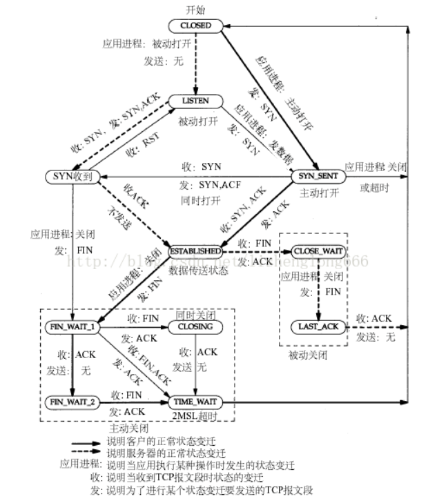
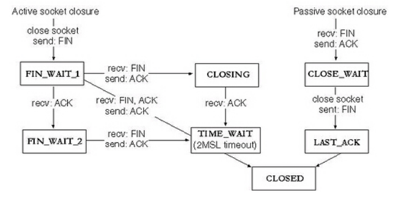

关闭socket分为主动关闭（Active closure）和被动关闭（Passive closure）两种情况。前者是指有本地主机主动发起的关闭；而后者则是指本地主机检测到远程主机发起关闭之后，作出回应，从而关闭整个连接。将关闭部分的状态转移摘出来，就得到了下图：

# 1、产生原因

通过图上，我们来分析，什么情况下，连接处于CLOSE_WAIT状态呢？`在被动关闭连接情况下`，在已经接收到FIN，但是还没有发送自己的FIN的时刻，连接处于CLOSE_WAIT状态。

通常来讲，CLOSE_WAIT状态的持续时间应该很短，正如SYN_RCVD状态。但是在一些特殊情况下，就会出现连接长时间处于CLOSE_WAIT状态的情况。

出现大量close_wait的现象，主要原因是某种情况下对方关闭了socket链接，但是我方忙于读或者写，没有关闭连接。代码需要判断socket，一旦读到0，断开连接，read返回负，检查一下errno，如果不是AGAIN，就断开连接。

# 参考

- [tcp连接出现close_wait状态？可能是代码不够健壮](https://www.cnblogs.com/grey-wolf/p/9945637.html)

- [CLOSE_WAIT问题-TCP](https://www.cnblogs.com/baishuchao/p/9024205.html)

- [CLOSE_WAIT状态的原因与解决方法](https://www.cnblogs.com/Leslieblog/p/10413202.html)