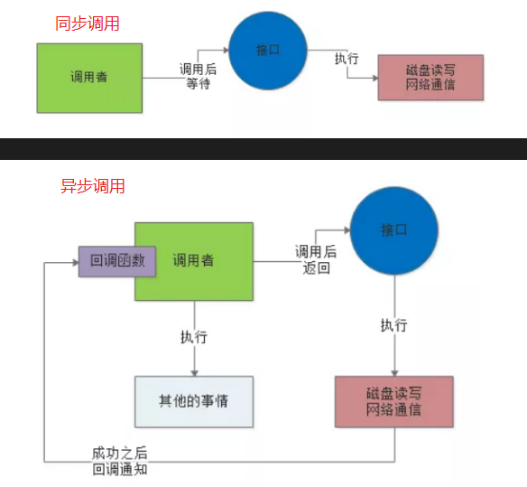
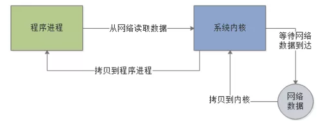
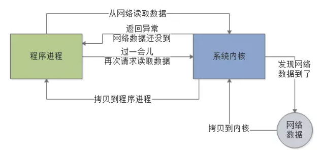

<!-- TOC -->

- [1、同步与异步](#1同步与异步)
- [2、阻塞与非阻塞](#2阻塞与非阻塞)

<!-- /TOC -->

# 1、同步与异步

想要搞明白IO模型，就先得搞明白“同步”与“异步”的关系。

所谓的“同步”，比如说调用者去调用一个接口，这个接口比如要执行一些磁盘文件读写操作，或者是网络通信操作。

假设是“同步”的模式，调用者必须要等待这个接口的磁盘读写或者网络通信的操作执行完毕了，调用者才能返回，这就是“同步”.

所谓的“异步”，就是说这个调用者调用接口之后，直接就返回了，他去干别的事儿了，也不管那个接口的磁盘读写或者是网络通信是否成功。

然后这个接口后续如果干完了自己的任务，比如写完了文件或者是什么的，会反过来通知调用者，之前你的那个调用成功了。可以通过一些内部通信机制来通知，也可以通过回调函数来通知，如下图。

> 用生活中的例子理解同步与异步

如果给大家举个生活中的例子，那么就可以用买烟这个事儿来举个例子

比如说现在你要去一个柜台买很多条香烟，但是现在柜台没那么多货，他需要打电话给库房来查一下有没有足够的货。

这个时候，库房的工作人员正好去吃饭了，那现在你有两种选择：

第一种选择，你可以在柜台等着，一直等待库房工作人员回来，柜台专员打通电话给他查到了库存是否充足，你再走。

这个就是“同步”，你找柜台工作人员买香烟，他要打电话给库房工作人员问库存，如果你选择“同步”模式，那么你就在柜台一直等着，直到成功查询到库存为止。

第二种选择，你可以先回家干点儿别的，比如说洗衣服做饭之类的，然后过了一会儿，柜台工作人员打通电话给库房工作人员，查到香烟库存了，就会打个电话给你，告诉你这个事儿。

这就是“异步”，你跟柜台工作人员说了这个事儿，就直接走了，干别的去了，柜台工作人员后面完成他的任务之后，就会反过来打电话回调通知你。

# 2、阻塞与非阻塞

实际上阻塞与非阻塞的概念，通常是针对底层的IO操作来说的。

比如现在我们的程序想要通过网络读取数据，如果是阻塞IO模式，一旦发起请求到操作系统内核去从网络中读取数据，就会阻塞在那里，必须要等待网络中的数据到达了之后，才能从网络读取数据到内核，再从内核返回给程序，如下图。

而非阻塞，指的就是程序发送请求给内核要从网络读取数据，但是此时网络中的数据还没到，此时不会阻塞住，内核会返回一个异常消息给程序。

程序就可以干点儿别的，然后过一会儿再来发起一次请求给内核，让内核尝试从网络读取数据。

因为如果网络中的数据还没到位，是不会阻塞住程序的，需要程序自己不断的轮询内核去尝试读取数据，所以这种IO就是非阻塞的。如下图：

> 总结（重点）

大家不要把“同步/异步”概念和“阻塞/非阻塞”概念混淆起来，实际上他们是两组不同的概念。

“同步/异步”更多的是针对比如接口调用，服务调用，API类库调用，类似这样的场景。

而“阻塞/非阻塞”概念针对的是底层IO操作的场景，比如磁盘IO，网络IO。但是在Java IO模型里，两种概念之间是有一定的关联关系的。

