<!-- TOC -->

- [1、基础](#1基础)
    - [1、SRAM](#1sram)
    - [2、DRAM](#2dram)
    - [3、存储器的价格和性能](#3存储器的价格和性能)
    - [4、局部性原理](#4局部性原理)
        - [1、时间局部性](#1时间局部性)
        - [2、空间局部性](#2空间局部性)
- [2、寄存器](#2寄存器)
- [3、高速缓存](#3高速缓存)
    - [1、CPU访问内存数据](#1cpu访问内存数据)
    - [2、CPU写数据到内存](#2cpu写数据到内存)
        - [1、写直达（Write-Through）](#1写直达write-through)
        - [2、写回（Write-Back）](#2写回write-back)
        - [3、MESI协议：如何让多核CPU的高速缓存保持一致？](#3mesi协议如何让多核cpu的高速缓存保持一致)
            - [1、缓存一致性问题](#1缓存一致性问题)
            - [2、总线嗅探机制和 MESI 协议](#2总线嗅探机制和-mesi-协议)
- [4、内存\主存](#4内存\主存)
    - [1、简单页表](#1简单页表)
    - [2、多级页表](#2多级页表)
    - [3、TLB加速地址转换](#3tlb加速地址转换)
    - [4、内存保护](#4内存保护)
        - [1、可执行空间保护（Executable Space Protection）](#1可执行空间保护executable-space-protection)
        - [2、地址空间布局随机化（Address Space Layout Randomization）](#2地址空间布局随机化address-space-layout-randomization)
    - [5、CPU访问数据流程总结](#5cpu访问数据流程总结)
- [5、磁盘](#5磁盘)
    - [1、iops](#1iops)
    - [2、响应时间（Response Time）](#2响应时间response-time)
    - [3、数据传输率（Data Transfer Rate）即吞吐率](#3数据传输率data-transfer-rate即吞吐率)
    - [4、iowait](#4iowait)
- [6、总线](#6总线)
    - [1、降低复杂性：总线的设计思路来源](#1降低复杂性总线的设计思路来源)
    - [2、三种线路和多总线架构](#2三种线路和多总线架构)
- [7、输入输出设备](#7输入输出设备)
    - [1、CPU 是如何控制 I/O 设备的？](#1cpu-是如何控制-io-设备的)
    - [2、信号和地址：发挥总线的价值](#2信号和地址发挥总线的价值)
- [参考](#参考)

<!-- /TOC -->

计算机存储设备可被粗略分为内存储器（Main Memory）与外存储器（External Memory）两大类，内存存取速度快，但容量小，价格昂贵，而且不能长期保存数据，在不通电情况下数据会消失；外存储器存取速度相对较慢，却可以持久化存储。如果进行更加细致地划分，每个计算机系统中的存储设备都被组织成了一个存储器层次结构，在这个层次结构中，从上至下，设备变得访问速度越来越慢、容量越来越大，并且每字节的造价也越来越便宜。


存储器层次结构的主要思想是一层上的存储器作为低一层存储器的高速缓存。因此，寄存器文件就是 L1 的高速缓存，L1 是 L2 的高速缓存，L2 是 L3 的高速缓存，L3 是主存的高速缓存，而主存又是磁盘的高速缓存。在某些具有分布式文件系统的网络系统中，本地磁盘就是存储在其他系统中磁盘上的数据的高速缓存。


从 Cache、内存，到 SSD 和 HDD 硬盘，一台现代计算机中，就用上了所有这些存储器设备。其中，容量越小的设备速度越快，而且，CPU 并不是直接和每一种存储器设备打交道，而是每一种存储器设备，只和它相邻的存储设备打交道。比如，CPU Cache 是从内存里加载而来的，或者需要写回内存，并不会直接写回数据到硬盘，也不会直接从硬盘加载数据到 CPU Cache 中，而是先加载到内存，再从内存加载到 Cache 中。这样，各个存储器只和相邻的一层存储器打交道，并且随着一层层向下，存储器的容量逐层增大，访问速度逐层变慢，而单位存储成本也逐层下降，也就构成了我们日常所说的存储器层次结构。

# 1、基础

## 1、SRAM

SRAM 之所以被称为“静态”存储器，是因为只要处在通电状态，里面的数据就可以保持存在。而一旦断电，里面的数据就会丢失了。在 SRAM 里面，一个比特的数据，需要 6～8 个晶体管。所以 SRAM 的存储密度不高。同样的物理空间下，能够存储的数据有限。不过，因为 SRAM 的电路简单，所以访问速度非常快。

在 CPU 里，通常会有 L1、L2、L3 这样三层高速缓存。每个 CPU 核心都有一块属于自己的 L1 高速缓存，`通常分成指令缓存和数据缓存`，分开存放 CPU 使用的指令和数据。L1 的 Cache 往往就嵌在 CPU 核心的内部。

L2 的 Cache 同样是每个 CPU 核心都有的，不过它往往不在 CPU 核心的内部。所以，L2 Cache 的访问速度会比 L1 稍微慢一些。而 L3 Cache，则通常是多个 CPU 核心共用的，尺寸会更大一些，访问速度自然也就更慢一些。

## 2、DRAM

内存用的芯片和 Cache 有所不同，它用的是一种叫作 DRAM（Dynamic Random Access Memory，动态随机存取存储器）的芯片，比起 SRAM 来说，它的密度更高，有更大的容量，而且它也比 SRAM 芯片便宜不少。

DRAM 被称为“动态”存储器，是因为 DRAM 需要靠不断地“刷新”，才能保持数据被存储起来。DRAM 的一个比特，只需要一个晶体管和一个电容就能存储。所以，DRAM 在同样的物理空间下，能够存储的数据也就更多，也就是存储的“密度”更大。但是，因为数据是存储在电容里的，电容会不断漏电，所以需要定时刷新充电，才能保持数据不丢失。DRAM 的数据访问电路和刷新电路都比 SRAM 更复杂，所以访问延时也就更长。


## 3、存储器的价格和性能

https://colin-scott.github.io/personal_website/research/interactive_latency.html


我们能不能既享受 CPU Cache 的速度，又享受内存、硬盘巨大的容量和低廉的价格呢？局部性原理

`CPU 和内存的访问速度已经有了 120 倍的差距。`

## 4、局部性原理

这个局部性原理包括时间局部性（temporal locality）和空间局部性（spatial locality）这两种策略。

### 1、时间局部性

这个策略是说，如果一个数据被访问了，那么它在短时间内还会被再次访问。

### 2、空间局部性

这个策略是说，如果一个数据被访问了，那么和它相邻的数据也很快会被访问。

`而局部性的存在，使得我们可以在应用开发中使用缓存这个有利的武器。比如，通过将热点数据加载并保留在速度更快的存储设备里面，我们可以用更低的成本来支撑服务器。`


# 2、寄存器


# 3、高速缓存


```java

int[] arr = new int[64 * 1024 * 1024];


// 循环1
for (int i = 0; i < arr.length; i++) arr[i] *= 3;


// 循环2
for (int i = 0; i < arr.length; i += 16) arr[i] *= 3
```

这个程序里的循环 1 和循环 2，运行所花费的时间会差多少？

在这段 Java 程序中，我们首先构造了一个 64×1024×1024 大小的整型数组。在循环 1 里，我们遍历整个数组，将数组中每一项的值变成了原来的 3 倍；在循环 2 里，我们每隔 16 个索引访问一个数组元素，将这一项的值变成了原来的 3 倍。按道理来说，循环 2 只访问循环 1 中 1/16 的数组元素，只进行了循环 1 中 1/16 的乘法计算，那循环 2 花费的时间应该是循环 1 的 1/16 左右。但是实际上，循环 1 在我的电脑上运行需要 50 毫秒，循环 2 只需要 46 毫秒。这两个循环花费时间之差在 15% 之内。

为什么会有这 15% 的差异呢？这和我们今天要讲的 CPU Cache 有关。之前我们看到了内存和硬盘之间存在的巨大性能差异。在 CPU 眼里，内存也慢得不行。于是，聪明的工程师们就在 CPU 里面嵌入了 CPU Cache（高速缓存），来解决这一问题。


寄存器文件在层次结构中位于最顶部，也就是第 0 级或记为 L0。一个典型的寄存器文件只存储几百字节的信息，而主存里可存放几十亿字节。然而，处理器从寄存器文件中读数据的速度比从主存中读取几乎要快 100 倍。针对这种处理器与主存之间的差异，系统设计者采用了更小、更快的存储设备，即高速缓存存储器（简称高速缓存），作为暂时的集结区域，用来存放处理器近期可能会需要的信息。


L1 和 L2 高速缓存是用一种叫做静态随机访问存储器（SRAM）的硬件技术实现的。比较新的、处理能力更强大的系统甚至有三级高速缓存：L1、L2 和 L3。系统可以获得一个很大的存储器，同时访问速度也很快，原因是利用了高速缓存的局部性原理，即程序具有访问局部区域里的数据和代码的趋势。通过让高速缓存里存放可能经常访问的数据的方法，大部分的存储器操作都能在快速的高速缓存中完成。

`CPU Cache=（l1+l2+l3）`

运行程序的时间主要花在了将对应的数据从内存中读取出来，加载到 CPU Cache 里。CPU 从内存中读取数据到 CPU Cache 的过程中，是一小块一小块来读取数据的，而不是按照单个数组元素来读取数据的。这样一小块一小块的数据，在 CPU Cache 里面，我们把它叫作 Cache Line（缓存块）。


在我们日常使用的 Intel 服务器或者 PC 里，Cache Line 的大小通常是 64 字节。而在上面的循环 2 里面，我们每隔 16 个整型数计算一次，16 个整型数正好是 64 个字节。于是，循环 1 和循环 2，需要把同样数量的 Cache Line 数据从内存中读取到 CPU Cache 中，最终两个程序花费的时间就差别不大了。

现代 CPU 进行数据读取的时候，无论数据是否已经存储在 Cache 中，CPU 始终会首先访问 Cache。只有当 CPU 在 Cache 中找不到数据的时候，才会去访问内存，并将读取到的数据写入 Cache 之中。当时间局部性原理起作用后，这个最近刚刚被访问的数据，会很快再次被访问。而 Cache 的访问速度远远快于内存，这样，CPU 花在等待内存访问上的时间就大大变短了。

`在各类基准测试（Benchmark）和实际应用场景中，CPU Cache 的命中率通常能达到 95% 以上。`


## 1、CPU访问内存数据

问题来了，CPU 如何知道要访问的内存数据，存储在 Cache 的哪个位置呢？接下来，我就从最基本的`直接映射 Cache（Direct Mapped Cache）`说起，带你来看整个 Cache 的数据结构和访问逻辑。


CPU 访问内存数据，是一小块一小块数据来读取的。对于读取内存中的数据，我们首先拿到的是数据所在的内存块（Block）的地址。而直接映射 Cache 采用的策略，就是确保任何一个内存块的地址，始终映射到一个固定的 CPU Cache 地址（Cache Line）。而这个映射关系，通常用 mod 运算（求余运算）来实现。下面我举个例子帮你理解一下。


比如说，我们的主内存被分成 0～31 号这样 32 个块。我们一共有 8 个缓存块。用户想要访问第 21 号内存块。如果 21 号内存块内容在缓存块中的话，它一定在 5 号缓存块（21 mod 8 = 5）中。


实际计算中，有一个小小的技巧，通常我们会把缓存块的数量设置成 2 的 N 次方。这样在计算取模的时候，可以直接取地址的低 N 位，也就是二进制里面的后几位。比如这里的 8 个缓存块，就是 2 的 3 次方。那么，在对 21 取模的时候，可以对 21 的 2 进制表示 10101 取地址的低三位，也就是 101，对应的 5，就是对应的缓存块地址。


取 Block 地址的低位，就能得到对应的 Cache Line 地址，除了 21 号内存块外，13 号、5 号等很多内存块的数据，都对应着 5 号缓存块中。既然如此，假如现在 CPU 想要读取 21 号内存块，在读取到 5 号缓存块的时候，我们怎么知道里面的数据，究竟是不是 21 号对应的数据呢？

这个时候，在对应的缓存块中，我们会存储一个 `组标记（Tag）`。这个组标记会记录，当前缓存块内存储的数据对应的内存块，而缓存块本身的地址表示访问地址的低 N 位。就像上面的例子，21 的低 3 位 101，缓存块本身的地址已经涵盖了对应的信息、对应的组标记，我们只需要记录 21 剩余的高 2 位的信息，也就是 10 就可以了。

除了组标记信息之外，缓存块中还有两个数据。一个自然是从主内存中加载来的实际存放的数据，另一个是`有效位（valid bit）`。啥是有效位呢？它其实就是用来标记，对应的缓存块中的数据是否是有效的，确保不是机器刚刚启动时候的空数据。如果有效位是 0，无论其中的组标记和 Cache Line 里的数据内容是什么，CPU 都不会管这些数据，而要直接访问内存，重新加载数据。

CPU 在读取数据的时候，并不是要读取一整个 Block，而是读取一个他需要的数据片段。这样的数据，我们叫作 CPU 里的一个字（Word）。具体是哪个字，就用这个字在整个 Block 里面的位置来决定。这个位置，我们叫作偏移量（Offset）。


`一个内存的访问地址，最终包括高位代表的组标记、低位代表的索引，以及在对应的 Data Block 中定位对应字的位置偏移量。`


而内存地址对应到 Cache 里的数据结构，则多了一个有效位和对应的数据，由“索引 + 有效位 + 组标记 + 数据”组成。如果内存中的数据已经在 CPU Cache 里了，那一个内存地址的访问，就会经历这样 4 个步骤：

- 根据内存地址的低位，计算在 Cache 中的索引；

- 判断有效位，确认 Cache 中的数据是有效的；

- 对比内存访问地址的高位，和 Cache 中的组标记，确认 Cache 中的数据就是我们要访问的内存数据，从 Cache Line 中读取到对应的数据块（Data Block）；

- 根据内存地址的 Offset 位，从 Data Block 中，读取希望读取到的字。

如果在 2、3 这两个步骤中，CPU 发现，Cache 中的数据并不是要访问的内存地址的数据，那 CPU 就会访问内存，并把对应的 Block Data 更新到 Cache Line 中，同时更新对应的有效位和组标记的数据。

其实，除了直接映射 Cache 之外，我们常见的缓存放置策略还有全相连 Cache（Fully Associative Cache）、`组相连 Cache（Set Associative Cache）`。这几种策略的数据结构都是相似的，理解了最简单的直接映射 Cache，其他的策略你很容易就能理解了。

[CPU 和内存之间的访问性能](https://people.freebsd.org/~lstewart/articles/cpumemory.pdf)

## 2、CPU写数据到内存

`volatile 这个关键字有什么作用？它会确保我们对于这个变量的读取和写入，都一定会同步到主内存里，而不是从 Cache 里面读取`

```java

// 一种错误的理解，是把volatile关键词，当成是一个锁，可以把long/double这样的数的操作自动加锁
private volatile long synchronizedValue = 0;

// 另一种错误的理解，是把volatile关键词，当成可以让整数自增的操作也变成原子性的
private volatile int atomicInt = 0;
amoticInt++;
```

volatile 关键字的最核心知识点，要关系到 Java 内存模型（JMM，Java Memory Model）上。

虽然 JMM 只是 Java 虚拟机这个进程级虚拟机里的一个内存模型，但是这个内存模型，和计算机组成里的 CPU、高速缓存和主内存组合在一起的硬件体系非常相似。理解了 JMM，可以让你很容易理解计算机组成里 CPU、高速缓存和主内存之间的关系。

虽然 Java 内存模型是一个隔离了硬件实现的虚拟机内的抽象模型，但是它给了我们一个很好的“缓存同步”问题的示例。也就是说，如果我们的数据，在不同的线程或者 CPU 核里面去更新，因为不同的线程或 CPU 核有着自己各自的缓存，很有可能在 A 线程的更新，到 B 线程里面是看不见的。


我们现在用的 Intel CPU，通常都是多核的的。每一个 CPU 核里面，都有独立属于自己的 L1、L2 的 Cache，然后再有多个 CPU 核共用的 L3 的 Cache、主内存。因为 CPU Cache 的访问速度要比主内存快很多，而在 CPU Cache 里面，L1/L2 的 Cache 也要比 L3 的 Cache 快。所以，CPU 始终都是尽可能地从 CPU Cache 中去获取数据，而不是每一次都要从主内存里面去读取数据。


这个层级结构，就好像我们在 Java 内存模型里面，每一个线程都有属于自己的线程栈。线程在读取 COUNTER 的数据的时候，其实是从本地的线程栈的 Cache 副本里面读取数据，而不是从主内存里面读取数据。如果我们对于数据仅仅只是读，问题还不大.但是，对于数据，我们不光要读，还要去写入修改。这个时候，有两个问题来了。

`第一个问题是，写入 Cache 的性能也比写入主内存要快，那我们写入的数据，到底应该写到 Cache 里还是主内存呢？如果我们直接写入到主内存里，Cache 里的数据是否会失效呢？`

为了解决这些疑问，下面我要给你介绍两种写入策略。


### 1、写直达（Write-Through）


最简单的一种写入策略，叫作写直达（Write-Through）。在这个策略里，每一次数据都要写入到主内存里面。在写直达的策略里面，写入前，我们会先去判断数据是否已经在 Cache 里面了。如果数据已经在 Cache 里面了，我们先把数据写入更新到 Cache 里面，再写入到主内存里面；如果数据不在 Cache 里，我们就只更新主内存。

写直达的这个策略很直观，但是问题也很明显，那就是这个策略很慢。无论数据是不是在 Cache 里面，我们都需要把数据写到主内存里面。这个方式就有点儿像我们上面用 volatile 关键字，始终都要把数据同步到主内存里面。


### 2、写回（Write-Back）


这个时候，我们就想了，既然我们去读数据也是默认从 Cache 里面加载，能否不用把所有的写入都同步到主内存里呢？只写入 CPU Cache 里面是不是可以？

当然是可以的。在 CPU Cache 的写入策略里，还有一种策略就叫作写回（Write-Back）。这个策略里，我们不再是每次都把数据写入到主内存，而是只写到 CPU Cache 里。只有当 CPU Cache 里面的数据要被“替换”的时候，我们才把数据写入到主内存里面去。


写回策略的过程是这样的：如果发现我们要写入的数据，就在 CPU Cache 里面，那么我们就只是更新 CPU Cache 里面的数据。同时，我们会标记 CPU Cache 里的这个 Block 是脏（Dirty）的。所谓脏的，就是指这个时候，我们的 CPU Cache 里面的这个 Block 的数据，和主内存是不一致的。

如果我们发现，我们要写入的数据所对应的 Cache Block 里，放的是别的内存地址的数据，那么我们就要看一看，那个 Cache Block 里面的数据有没有被标记成脏的。如果是脏的话，我们要先把这个 Cache Block 里面的数据，写入到主内存里面。然后，再把当前要写入的数据，写入到 Cache 里，同时把 Cache Block 标记成脏的。如果 Block 里面的数据没有被标记成脏的，那么我们直接把数据写入到 Cache 里面，然后再把 Cache Block 标记成脏的就好了。

在用了写回这个策略之后，我们在加载内存数据到 Cache 里面的时候，也要多出一步同步脏 Cache 的动作。如果加载内存里面的数据到 Cache 的时候，发现 Cache Block 里面有脏标记，我们也要先把 Cache Block 里的数据写回到主内存，才能加载数据覆盖掉 Cache。

可以看到，在写回这个策略里，如果我们大量的操作，都能够命中缓存。那么大部分时间里，我们都不需要读写主内存，自然性能会比写直达的效果好很多。

然而，无论是写回还是写直达，其实都还没有解决我们在上面 volatile 程序示例中遇到的问题，也就是`多个线程，或者是多个 CPU 核的缓存一致性的问题`。这也就是我们在写入修改缓存后，需要解决的第二个问题。

要解决这个问题，我们需要引入一个新的方法，叫作 MESI 协议。这是一个维护缓存一致性协议。这个协议不仅可以用在 CPU Cache 之间，也可以广泛用于各种需要使用缓存，同时缓存之间需要同步的场景下。


### 3、MESI协议：如何让多核CPU的高速缓存保持一致？

多核 CPU 有很多好处，其中最重要的一个就是，它使得我们在不能提升 CPU 的主频之后，找到了另一种提升 CPU 吞吐率的办法。我们把多核和 CPU Cache 两者一结合，就给我们带来了一个新的挑战。因为 CPU 的每个核各有各的缓存，互相之间的操作又是各自独立的，就会带来缓存一致性（Cache Coherence）的问题。


#### 1、缓存一致性问题


那什么是缓存一致性呢？我们拿一个有两个核心的 CPU，来看一下。你可以看这里这张图，我们结合图来说。


比方说，iPhone 降价了，我们要把 iPhone 最新的价格更新到内存里。为了性能问题，它采用了上一讲我们说的写回策略，先把数据写入到 L2 Cache 里面，然后把 Cache Block 标记成脏的。这个时候，数据其实并没有被同步到 L3 Cache 或者主内存里。1 号核心希望在这个 Cache Block 要被交换出去的时候，数据才写入到主内存里。


如果我们的 CPU 只有 1 号核心这一个 CPU 核，那这其实是没有问题的。不过，我们旁边还有一个 2 号核心呢！这个时候，2 号核心尝试从内存里面去读取 iPhone 的价格，结果读到的是一个错误的价格。这是因为，iPhone 的价格刚刚被 1 号核心更新过。但是这个更新的信息，只出现在 1 号核心的 L2 Cache 里，而没有出现在 2 号核心的 L2 Cache 或者主内存里面。这个问题，就是所谓的缓存一致性问题，1 号核心和 2 号核心的缓存，在这个时候是不一致的。

为了解决这个缓存不一致的问题，我们就需要有一种机制，来同步两个不同核心里面的缓存数据。那这样的机制需要满足什么条件呢？我觉得能够做到下面两点就是合理的。


第一点叫`写传播（Write Propagation）`。写传播是说，在一个 CPU 核心里，我们的 Cache 数据更新，必须能够传播到其他的对应节点的 Cache Line 里。


第二点叫`事务的串行化（Transaction Serialization）`，事务串行化是说，我们在一个 CPU 核心里面的读取和写入，在其他的节点看起来，顺序是一样的。


第一点写传播很容易理解。既然我们数据写完了，自然要同步到其他 CPU 核的 Cache 里。但是第二点事务的串行化，可能没那么好理解，我这里仔细解释一下。我们还拿刚才修改 iPhone 的价格来解释。这一次，我们找一个有 4 个核心的 CPU。1 号核心呢，先把 iPhone 的价格改成了 5000 块。差不多在同一个时间，2 号核心把 iPhone 的价格改成了 6000 块。这里两个修改，都会传播到 3 号核心和 4 号核心。


然而这里有个问题，3 号核心先收到了 2 号核心的写传播，再收到 1 号核心的写传播。所以 3 号核心看到的 iPhone 价格是先变成了 6000 块，再变成了 5000 块。而 4 号核心呢，是反过来的，先看到变成了 5000 块，再变成 6000 块。虽然写传播是做到了，但是各个 Cache 里面的数据，是不一致的。


事实上，我们需要的是，从 1 号到 4 号核心，都能看到相同顺序的数据变化。比如说，都是先变成了 5000 块，再变成了 6000 块。这样，我们才能称之为实现了事务的串行化。事务的串行化，不仅仅是缓存一致性中所必须的。比如，我们平时所用到的系统当中，最需要保障事务串行化的就是数据库。多个不同的连接去访问数据库的时候，我们必须保障事务的串行化，做不到事务的串行化的数据库，根本没法作为可靠的商业数据库来使用。


而在 CPU Cache 里做到事务串行化，需要做到两点，第一点是一个 CPU 核心对于数据的操作，需要同步通信给到其他 CPU 核心。第二点是，如果两个 CPU 核心里有同一个数据的 Cache，那么对于这个 Cache 数据的更新，需要有一个“锁”的概念。只有拿到了对应 Cache Block 的“锁”之后，才能进行对应的数据更新。接下来，我们就看看实现了这两个机制的 MESI 协议。

#### 2、总线嗅探机制和 MESI 协议

要解决缓存一致性问题，首先要解决的是多个 CPU 核心之间的数据传播问题。最常见的一种解决方案呢，叫作总线嗅探（Bus Snooping）。


这个策略，本质上就是把所有的读写请求都通过总线（Bus）广播给所有的 CPU 核心，然后让各个核心去“嗅探”这些请求，再根据本地的情况进行响应。总线本身就是一个特别适合广播进行数据传输的机制，所以总线嗅探这个办法也是我们日常使用的 Intel CPU 进行缓存一致性处理的解决方案。

基于总线嗅探机制，其实还可以分成很多种不同的缓存一致性协议。不过其中最常用的，就是今天我们要讲的 MESI 协议。和很多现代的 CPU 技术一样，MESI 协议也是在 Pentium 时代，被引入到 Intel CPU 中的。


MESI 协议，是一种叫作`写失效`（Write Invalidate）的协议。在写失效协议里，只有一个 CPU 核心负责写入数据，其他的核心，只是同步读取到这个写入。在这个 CPU 核心写入 Cache 之后，它会去广播一个“失效”请求告诉所有其他的 CPU 核心。其他的 CPU 核心，只是去判断自己是否也有一个“失效”版本的 Cache Block，然后把这个也标记成失效的就好了。

相对于写失效协议，还有一种叫作`写广播`（Write Broadcast）的协议。在那个协议里，一个写入请求广播到所有的 CPU 核心，同时更新各个核心里的 Cache。

写广播在实现上自然很简单，但是写广播需要占用更多的总线带宽。写失效只需要告诉其他的 CPU 核心，哪一个内存地址的缓存失效了，但是写广播还需要把对应的数据传输给其他 CPU 核心。


MESI 协议的由来呢，来自于我们对 Cache Line 的四个不同的标记，分别是：
- M：代表已修改（Modified）
- E：代表独占（Exclusive）
- S：代表共享（Shared）
- I：代表已失效（Invalidated）

我们先来看看“已修改”和“已失效”，这两个状态比较容易理解。所谓的“已修改”，就是我们上一讲所说的“脏”的 Cache Block。Cache Block 里面的内容我们已经更新过了，但是还没有写回到主内存里面。而所谓的“已失效“，自然是这个 Cache Block 里面的数据已经失效了，我们不可以相信这个 Cache Block 里面的数据。

然后，我们再来看“独占”和“共享”这两个状态。这就是 MESI 协议的精华所在了。无论是独占状态还是共享状态，缓存里面的数据都是“干净”的。这个“干净”，自然对应的是前面所说的“脏”的，也就是说，这个时候，Cache Block 里面的数据和主内存里面的数据是一致的。

那么“独占”和“共享”这两个状态的差别在哪里呢？这个差别就在于，在独占状态下，对应的 Cache Line 只加载到了当前 CPU 核所拥有的 Cache 里。其他的 CPU 核，并没有加载对应的数据到自己的 Cache 里。这个时候，如果要向独占的 Cache Block 写入数据，我们可以自由地写入数据，而不需要告知其他 CPU 核。

在独占状态下的数据，如果收到了一个来自于总线的读取对应缓存的请求，它就会变成共享状态。这个共享状态是因为，这个时候，另外一个 CPU 核心，也把对应的 Cache Block，从内存里面加载到了自己的 Cache 里来。


而在共享状态下，因为同样的数据在多个 CPU 核心的 Cache 里都有。所以，当我们想要更新 Cache 里面的数据的时候，不能直接修改，而是要先向所有的其他 CPU 核心广播一个请求，要求先把其他 CPU 核心里面的 Cache，都变成无效的状态，然后再更新当前 Cache 里面的数据。这个广播操作，一般叫作 RFO（Request For Ownership），也就是获取当前对应 Cache Block 数据的所有权。

有没有觉得这个操作有点儿像我们在多线程里面用到的读写锁。在共享状态下，大家都可以并行去读对应的数据。但是如果要写，我们就需要通过一个锁，获取当前写入位置的所有权。

整个 MESI 的状态，可以用一个有限状态机来表示它的状态流转。需要注意的是，对于不同状态触发的事件操作，可能来自于当前 CPU 核心，也可能来自总线里其他 CPU 核心广播出来的信号。


https://commons.wikimedia.org/wiki/File:Diagrama_MESI.GIF


# 4、内存\主存

主存是一个临时存储设备，在处理器执行程序时，用来存放程序和程序处理的数据。从物理上来说，主存是由一组动态随机存取存储器（DRAM）芯片组成的。从逻辑上来说，存储器是一个线性的字节数组，每个字节都有其唯一的地址（即数组索引），这些地址是从零开始的。一般来说，组成程序的每条机器指令都由不同数量的字节构成。


现代 DRAM 的结构和存取原理比较复杂，这里抽象出一个十分简单的存取模型来说明 DRAM 的工作原理。从抽象角度看，主存是一系列的存储单元组成的矩阵，每个存储单元存储固定大小的数据。每个存储单元有唯一的地址，现代主存的编址规则比较复杂，这里将其简化成一个二维地址：通过一个行地址和一个列地址可以唯一定位到一个存储单元。

当系统需要读取主存时，则将地址信号放到地址总线上传给主存，主存读到地址信号后，解析信号并定位到指定存储单元，然后将此存储单元数据放到数据总线上，供其它部件读取。写主存的过程类似，系统将要写入单元地址和数据分别放在地址总线和数据总线上，主存读取两个总线的内容，做相应的写操作。这里可以看出，主存存取的时间仅与存取次数呈线性关系，因为不存在机械操作，两次存取的数据的“距离”不会对时间有任何影响，例如，先取 A0 再取 A1 和先取 A0 再取 D3 的时间消耗是一样的。


计算机有五大组成部分，分别是：运算器、控制器、存储器、输入设备和输出设备。如果说计算机最重要的组件，是承担了运算器和控制器作用的 CPU，那内存就是第二重要的组件了。内存是五大组成部分里面的存储器，我们的指令和数据，都需要先加载到内存里面，才会被 CPU 拿去执行。

`程序并不能直接访问物理内存。`

我们的内存需要被分成固定大小的页（Page），然后再通过虚拟内存地址（Virtual Address）到物理内存地址（Physical Address）的地址转换（Address Translation），才能到达实际存放数据的物理内存位置。而我们的程序看到的内存地址，都是虚拟内存地址。既然如此，这些虚拟内存地址究竟是怎么转换成物理内存地址的呢？


## 1、简单页表

想要把虚拟内存地址，映射到物理内存地址，最直观的办法，就是来建一张映射表。这个映射表，能够实现虚拟内存里面的页，到物理内存里面的页的一一映射。这个映射表，在计算机里面，就叫作页表（Page Table）。页表这个地址转换的办法，会把一个内存地址分成页号（Directory）和偏移量（Offset）两个部分。这么说太理论了，我以一个 32 位的内存地址为例，帮你理解这个概念。

其实，前面的高位，就是内存地址的页号。后面的低位，就是内存地址里面的偏移量。做地址转换的页表，只需要保留虚拟内存地址的页号和物理内存地址的页号之间的映射关系就可以了。同一个页里面的内存，在物理层面是连续的。以一个页的大小是 4K 字节（4KB）为例，我们需要 20 位的高位，12 位的低位。


总结一下，对于一个内存地址转换，其实就是这样三个步骤：
- 1、把虚拟内存地址，切分成页号和偏移量的组合；
- 2、从页表里面，查询出虚拟页号，对应的物理页号；
- 3、直接拿物理页号，加上前面的偏移量，就得到了物理内存地址。


看起来这个逻辑似乎很简单，很容易理解，不过问题马上就来了。你能算一算，这样一个页表需要多大的空间吗？我们以 32 位的内存地址空间为例

32 位的内存地址空间，页表一共需要记录 2^20 个到物理页号的映射关系。这个存储关系，就好比一个 2^20 大小的数组。一个页号是完整的 32 位的 4 字节（Byte），这样一个页表就需要 4MB 的空间。听起来 4MB 的空间好像还不大啊，毕竟我们现在的内存至少也有 4GB，服务器上有个几十 GB 的内存和很正常。


不过，这个空间可不是只占用一份哦。我们每一个进程，都有属于自己独立的虚拟内存地址空间。这也就意味着，每一个进程都需要这样一个页表。不管我们这个进程，是个本身只有几 KB 大小的程序，还是需要几 GB 的内存空间，都需要这样一个页表。

这还只是 32 位的内存地址空间，现在大家用的内存，多半已经超过了 4GB，也已经用上了 64 位的计算机和操作系统。这样的话，用上面这个数组的数据结构来保存页面，内存占用就更大了。那么，我们有没有什么更好的解决办法呢？

## 2、多级页表

仔细想一想，我们其实没有必要存下这 2^20 个物理页表啊。大部分进程所占用的内存是有限的，需要的页也自然是很有限的。我们只需要去存那些用到的页之间的映射关系就好了。如果你对数据结构比较熟悉，你可能要说了，那我们是不是应该用哈希表（Hash Map）这样的数据结构呢？很可惜你猜错了：）。在实践中，我们其实采用的是一种叫作多级页表（Multi-Level Page Table）的解决方案。这是为什么呢？为什么我们不用哈希表而用多级页表呢？

我们先来看一看，一个进程的内存地址空间是怎么分配的。在整个进程的内存地址空间，通常是“两头实、中间空”。在程序运行的时候，`内存地址从顶部往下，不断分配占用的栈的空间。而堆的空间，内存地址则是从底部往上，是不断分配占用的。`

所以，在一个实际的程序进程里面，虚拟内存占用的地址空间，通常是两段连续的空间。而不是完全散落的随机的内存地址。而多级页表，就特别适合这样的内存地址分布。我们以一个 4 级的多级页表为例，来看一下。同样一个虚拟内存地址，偏移量的部分和上面简单页表一样不变，但是原先的页号部分，我们把它拆成四段，从高到低，分成 4 级到 1 级这样 4 个页表索引。


对应的，一个进程会有一个 4 级页表。我们先通过 4 级页表索引，找到 4 级页表里面对应的条目（Entry）。这个条目里存放的是一张 3 级页表所在的位置。4 级页面里面的每一个条目，都对应着一张 3 级页表，所以我们可能有多张 3 级页表。找到对应这张 3 级页表之后，我们用 3 级索引去找到对应的 3 级索引的条目。3 级索引的条目再会指向一个 2 级页表。同样的，2 级页表里我们可以用 2 级索引指向一个 1 级页表。而最后一层的 1 级页表里面的条目，对应的数据内容就是物理页号了。在拿到了物理页号之后，我们同样可以用“页号 + 偏移量”的方式，来获取最终的物理内存地址。

我们可能有很多张 1 级页表、2 级页表，乃至 3 级页表。但是，因为实际的虚拟内存空间通常是连续的，我们很可能只需要很少的 2 级页表，甚至只需要 1 张 3 级页表就够了。


事实上，多级页表就像一个多叉树的数据结构，所以我们常常称它为页表树（Page Table Tree）。因为虚拟内存地址分布的连续性，树的第一层节点的指针，很多就是空的，也就不需要有对应的子树了。所谓不需要子树，其实就是不需要对应的 2 级、3 级的页表。找到最终的物理页号，就好像通过一个特定的访问路径，走到树最底层的叶子节点。


以这样的分成 4 级的多级页表来看，每一级如果都用 5 个比特表示。那么每一张某 1 级的页表，只需要 2^5=32 个条目。如果每个条目还是 4 个字节，那么一共需要 128 个字节。`这是页表占用的内存大小`

而一个 1 级索引表，对应 32 个 4KB 的也就是 128KB 的大小。一个填满的 2 级索引表，对应的就是 32 个 1 级索引表，也就是 4MB 的大小。`这个4kb代表一个页大小。含义是一个一级索引表可以表示的内存大小`

我们可以一起来测算一下，一个进程如果占用了 8MB 的内存空间，分成了 2 个 4MB 的连续空间。那么，它一共需要 2 个独立的、填满的 2 级索引表，也就意味着 64 个 1 级索引表，2 个独立的 3 级索引表，1 个 4 级索引表。一共需要 69 个索引表，每个 128 字节，大概就是 9KB 的空间。比起 4MB 来说，只有差不多 1/500。

`问题：这里计算的是1个四级+2个三级+2个二级+64个一级=69，为什么需要2个三级，而不是一个？`

不过，多级页表虽然节约了我们的存储空间，却带来了时间上的开销，所以它其实是一个“以时间换空间”的策略。原本我们进行一次地址转换，只需要访问一次内存就能找到物理页号，算出物理内存地址。但是，用了 4 级页表，我们就需要访问 4 次内存，才能找到物理页号了。

我们在前面两讲讲过，内存访问其实比 Cache 要慢很多。我们本来只是要做一个简单的地址转换，反而是一下子要多访问好多次内存。对于这个时间层面的性能损失，我们有没有什么更好的解决办法呢？


## 3、TLB加速地址转换

机器指令里面的内存地址都是虚拟内存地址。程序里面的每一个进程，都有一个属于自己的虚拟内存地址空间。我们可以通过地址转换来获得最终的实际物理地址。我们每一个指令都存放在内存里面，每一条数据都存放在内存里面。因此，“地址转换”是一个非常高频的动作，“地址转换”的性能就变得至关重要了。


从虚拟内存地址到物理内存地址的转换，我们通过页表这个数据结构来处理。为了节约页表的内存存储空间，我们会使用多级页表数据结构。不过，多级页表虽然节约了我们的存储空间，但是却带来了时间上的开销，变成了一个“以时间换空间”的策略。原本我们进行一次地址转换，只需要访问一次内存就能找到物理页号，算出物理内存地址。但是用了 4 级页表，我们就需要访问 4 次内存，才能找到物理页号。


我们知道，内存访问其实比 Cache 要慢很多。我们本来只是要做一个简单的地址转换，现在反而要一下子多访问好多次内存。这种情况该怎么处理呢？你是否还记得之前讲过的“加个缓存”的办法呢？我们来试一试。程序所需要使用的指令，都顺序存放在虚拟内存里面。我们执行的指令，也是一条条顺序执行下去的。也就是说，我们对于指令地址的访问，存在前面几讲所说的“空间局部性”和“时间局部性”，而需要访问的数据也是一样的。我们连续执行了 5 条指令。因为内存地址都是连续的，所以这 5 条指令通常都在同一个“虚拟页”里。

因此，这连续 5 次的内存地址转换，其实都来自于同一个虚拟页号，转换的结果自然也就是同一个物理页号。那我们就可以用前面几讲说过的，用一个“加个缓存”的办法。把之前的内存转换地址缓存下来，使得我们不需要反复去访问内存来进行内存地址转换。

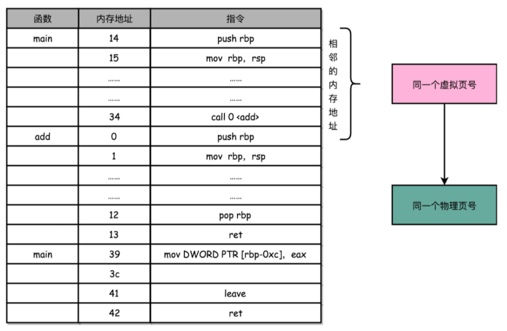

于是，计算机工程师们专门在 CPU 里放了一块缓存芯片。这块缓存芯片我们称之为 TLB，全称是地址变换高速缓冲（Translation-Lookaside Buffer）。这块缓存存放了之前已经进行过地址转换的查询结果。这样，当同样的虚拟地址需要进行地址转换的时候，我们可以直接在 TLB 里面查询结果，而不需要多次访问内存来完成一次转换。TLB 和我们前面讲的 CPU 的高速缓存类似，可以分成指令的 TLB 和数据的 TLB，也就是 ITLB 和 DTLB。同样的，我们也可以根据大小对它进行分级，变成 L1、L2 这样多层的 TLB。除此之外，还有一点和 CPU 里的高速缓存也是一样的，我们需要用脏标记这样的标记位，来实现“写回”这样缓存管理策略。


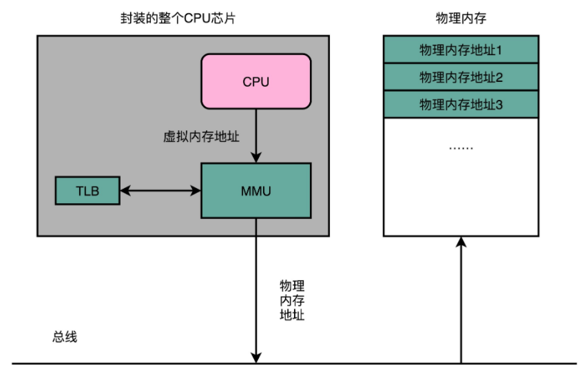

为了性能，我们整个内存转换过程也要由硬件来执行。在 CPU 芯片里面，我们封装了内存管理单元（MMU，Memory Management Unit）芯片，用来完成地址转换。和 TLB 的访问和交互，都是由这个 MMU 控制的。


## 4、内存保护

因为我们的指令、数据都存放在内存里面，也就是内存安全问题。如果被人修改了内存里面的内容，我们的 CPU 就可能会去执行我们计划之外的指令。这个指令可能是破坏我们服务器里面的数据，也可能是被人获取到服务器里面的敏感信息。


进程的程序也好，数据也好，都要存放在内存里面。实际程序指令的执行，也是通过程序计数器里面的地址，去读取内存内的内容，然后运行对应的指令，使用相应的数据。虽然我们现代的操作系统和 CPU，已经做了各种权限的管控。正常情况下，我们已经通过虚拟内存地址和物理内存地址的区分，隔离了各个进程。但是，无论是 CPU 这样的硬件，还是操作系统这样的软件，都太复杂了，难免还是会被黑客们找到各种各样的漏洞。就像我们在软件开发过程中，常常会有一个“兜底”的错误处理方案一样，在对于内存的管理里面，计算机也有一些最底层的安全保护机制。这些机制统称为内存保护（Memory Protection）。我这里就为你简单介绍两个。

### 1、可执行空间保护（Executable Space Protection）


这个机制是说，我们对于一个进程使用的内存，只把其中的指令部分设置成“可执行”的，对于其他部分，比如数据部分，不给予“可执行”的权限。因为无论是指令，还是数据，在我们的 CPU 看来，都是二进制的数据。我们直接把数据部分拿给 CPU，如果这些数据解码后，也能变成一条合理的指令，其实就是可执行的。

这个时候，黑客们想到了一些搞破坏的办法。我们在程序的数据区里，放入一些要执行的指令编码后的数据，然后找到一个办法，让 CPU 去把它们当成指令去加载，那 CPU 就能执行我们想要执行的指令了。对于进程里内存空间的执行权限进行控制，可以使得 CPU 只能执行指令区域的代码。对于数据区域的内容，即使找到了其他漏洞想要加载成指令来执行，也会因为没有权限而被阻挡掉。

比如：SQL注入

### 2、地址空间布局随机化（Address Space Layout Randomization）


这里的核心问题是，其他的人、进程、程序，会去修改掉特定进程的指令、数据，然后，让当前进程去执行这些指令和数据，造成破坏。要想修改这些指令和数据，我们需要知道这些指令和数据所在的位置才行。

原先我们一个进程的内存布局空间是固定的，所以任何第三方很容易就能知道指令在哪里，程序栈在哪里，数据在哪里，堆又在哪里。这个其实为想要搞破坏的人创造了很大的便利。而地址空间布局随机化这个机制，就是让这些区域的位置不再固定，在内存空间随机去分配这些进程里不同部分所在的内存空间地址，让破坏者猜不出来。猜不出来呢，自然就没法找到想要修改的内容的位置。如果只是随便做点修改，程序只会 crash 掉，而不会去执行计划之外的代码。

这样的“随机化”策略，其实也是我们日常应用开发中一个常见的策略。比如数据库密码加随机salt进行存储。


## 5、CPU访问数据流程总结


https://www.polarxiong.com/archives/%E5%A4%9A%E7%BA%A7%E9%A1%B5%E8%A1%A8%E5%A6%82%E4%BD%95%E8%8A%82%E7%BA%A6%E5%86%85%E5%AD%98.html


注意事项

- TLB采用组相联
- 页表采用两级页表
- cache采用组相联
- cache仅考虑L1 d-cache，不考虑L1 i-cache、L2 cache和L3 cache
- 未考虑页表缺页
- 简化了cache未命中情况

https://www.polarxiong.com/archives/%E5%9B%BE%E8%A7%A3%E8%99%9A%E6%8B%9F%E5%9C%B0%E5%9D%80%E5%88%B0%E7%89%A9%E7%90%86%E5%9C%B0%E5%9D%80%E7%9A%84%E7%BF%BB%E8%AF%91%E4%BB%A5%E5%8F%8A%E6%95%B0%E6%8D%AE%E7%9A%84%E8%8E%B7%E5%8F%96-TLB-%E9%A1%B5%E8%A1%A8-cache.html


https://www.polarxiong.com/archives/%E4%BB%8E%E8%99%9A%E6%8B%9F%E5%86%85%E5%AD%98%E7%9C%8B%E5%8F%AF%E6%89%A7%E8%A1%8C%E6%96%87%E4%BB%B6%E7%9A%84%E8%A3%85%E8%BD%BD.html


# 5、磁盘

`SSD（Solid-state drive 或 Solid-state disk，固态硬盘）、HDD（Hard Disk Drive，硬盘）`

磁盘是一种直接存取的存储设备 (DASD)。它是以存取时间变化不大为特征的。可以直接存取任何字符组，且容量大、速度较其它外存设备更快。磁盘是一个扁平的圆盘(与电唱机的唱片类似)，盘面上有许多称为磁道的圆圈，数据就记录在这些磁道上。磁盘可以是单片的，也可以是由若干盘片组成的盘组，每一盘片上有两个面。如下图中所示的 6 片盘组为例，除去最顶端和最底端的外侧面不存储数据之外，一共有 10 个面可以用来保存信息。


当磁盘驱动器执行读 / 写功能时。盘片装在一个主轴上，并绕主轴高速旋转，当磁道在读 / 写头 ( 又叫磁头 ) 下通过时，就可以进行数据的读 / 写了。一般磁盘分为固定头盘 ( 磁头固定 ) 和活动头盘。固定头盘的每一个磁道上都有独立的磁头，它是固定不动的，专门负责这一磁道上数据的读 / 写。活动头盘 ( 如上图 ) 的磁头是可移动的。每一个盘面上只有一个磁头 ( 磁头是双向的，因此正反盘面都能读写 )。它可以从该面的一个磁道移动到另一个磁道。所有磁头都装 在同一个动臂上，因此不同盘面上的所有磁头都是同时移动的 ( 行动整齐划一 )。当盘片绕主轴旋转的时候，磁头与旋转的盘片形成一个圆柱体。各个盘面上半径相 同的磁道组成了一个圆柱面，我们称为柱面。因此，柱面的个数也就是盘面上的磁道数。

磁盘上数据必须用一个三维地址唯一标示：柱面号、盘面号、块号 ( 磁道上的盘块 )。读 / 写磁盘上某一指定数据需要下面 3 个步骤: 

(1) 首先移动臂根据柱面号使磁头移动到所需要的柱面上，这一过程被称为定位或查找。如上图 11.3 中所示的 6 盘组示意图中，所有磁头都定位到了 10 个盘面的 10 条磁道上 ( 磁头都是双向的 )。这时根据盘面号来确定指定盘面上的磁道。 寻道时间越短，I/O操作越快，目前磁盘的平均寻道时间一般在3－15ms。
 
(2) 盘面确定以后，盘片开始旋转，将指定块号的磁道段移动至磁头下。

经过上面三个步骤，指定数据的存储位置就被找到。这时就可以开始读 / 写操作了。访问某一具体信息，由 3 部分时间组成：

- 1、查找时间 (seek time) Ts: 完成上述步骤 (1) 所需要的时间。这部分时间代价最高，最大可达到 0.1s 左右。

- 2、等待时间\旋转延迟  (latency time) Tl: 完成上述步骤 (2) 所需要的时间。由于盘片绕主轴旋转速度很快，一般为 7200 转 / 分 ( 电脑硬盘的性能指标之一 , 家用的普通硬盘的转速一般有 5400rpm( 笔记本 )、7200rpm 几种 )。因此一般旋转一圈大约 0.0083s。

- 3、传输时间 (transmission time) Tt: 数据通过系统总线传送到内存的时间，一般传输一个字节 (byte) 大概 0.02us=2*10^(-8)s


磁盘读取数据是以盘块(block)为基本单位的。位于同一盘块中的所有数据都能被一次性全部读取出来。而磁盘 IO 代价主要花费在查找时间 Ts 上。因此我们应该尽量将相关信息存放在同一盘块，同一磁道中。或者至少放在同一柱面或相邻柱面上，以求在读/写信息时尽量减少磁头来回移动的次数，避免过多的查找时间Ts。所以，在大规模数据存储方面，大量数据存储在外存磁盘中，而在外存磁盘中读取 / 写入块 (block) 中某数据时，首先需要定位到磁盘中的某块，如何有效地查找磁盘中的数据，需要一种合理高效的外存数据结构。

> 常见磁盘平均物理寻道时间为：

- 7200转/分的STAT硬盘平均物理寻道时间是9ms
- 10000转/分的STAT硬盘平均物理寻道时间是6ms
- 15000转/分的SAS硬盘平均物理寻道时间是4ms

 

> 常见硬盘的旋转延迟时间为：

- 7200   rpm的磁盘平均旋转延迟大约为60*1000/7200/2 = 4.17ms
- 10000 rpm的磁盘平均旋转延迟大约为60*1000/10000/2 = 3ms，
- 15000 rpm的磁盘其平均旋转延迟约为60*1000/15000/2 = 2ms。

> 最大IOPS的理论计算方法

IOPS = 1000 ms/ (寻道时间 + 旋转延迟)。可以忽略数据传输时间。

- 7200   rpm的磁盘 IOPS = 1000 / (9 + 4.17)  = 76 IOPS
- 10000 rpm的磁盘IOPS = 1000 / (6+ 3) = 111 IOPS
- 15000 rpm的磁盘IOPS = 1000 / (4 + 2) = 166 IOPS


## 1、iops


这个每秒读写的次数，我们称之为IOPS，也就是每秒输入输出操作的次数。

`IOPS 和 DTR（Data Transfer Rate，数据传输率）才是输入输出性能的核心指标。`

这是因为，我们在实际的应用开发当中，对于数据的访问，更多的是随机读写，而不是顺序读写。我们平时所说的服务器承受的“并发”，其实是在说，会有很多个不同的进程和请求来访问服务器。自然，它们在硬盘上访问的数据，是很难顺序放在一起的。这种情况下，随机读写的 IOPS 才是服务器性能的核心指标。


iops = 1/ 一次随机io耗时（查找时间+等待时间+传输时间）

IOPS (Input/Output Per Second)即每秒的输入输出量(或读写次数)，是衡量磁盘性能的主要指标之一。IOPS是指单位时间内系统能处理的I/O请求数量，一般以每秒处理的I/O请求数量为单位，I/O请求通常为读或写数据操作请求。

随机读写频繁的应用，如小文件存储(图片)、OLTP数据库、邮件服务器，关注随机读写性能，IOPS是关键衡量指标。

顺序读写频繁的应用，传输大量连续数据，如电视台的视频编辑，视频点播VOD(Video On Demand)，关注连续读写性能。数据吞吐量是关键衡量指标。


IOPS和数据吞吐量适用于不同的场合：
- 读取10000个1KB文件，用时10秒  Throught(吞吐量)=1MB/s ，IOPS=1000  追求IOPS
- 读取1个10MB文件，用时0.2秒  Throught(吞吐量)=50MB/s, IOPS=5  追求吞吐量

`机械硬盘的 IOPS 从 100 提升到 300、500 也就到头了，一块普通的 SSD 硬盘，可以轻松支撑 10000 乃至 20000 的 IOPS。`


## 2、响应时间（Response Time）

这个指标，其实就是程序发起一个硬盘的写入请求，直到这个请求返回的时间。


## 3、数据传输率（Data Transfer Rate）即吞吐率

我们现在常用的硬盘有两种。一种是 HDD 硬盘，也就是我们常说的机械硬盘。另一种是 SSD 硬盘，一般也被叫作固态硬盘。现在的 HDD 硬盘，用的是 SATA 3.0 的接口。而 SSD 硬盘呢，通常会用两种接口，一部分用的也是 SATA 3.0 的接口；另一部分呢，用的是 PCI Express 的接口。

现在我们常用的 SATA 3.0 的接口，带宽是 6Gb/s。这里的“b”是比特。这个带宽相当于每秒可以传输 768MB 的数据。而我们日常用的 HDD 硬盘的数据传输率，差不多在 200MB/s 左右。


## 4、iowait


如何定位 IO_WAIT？

即使是用上了 PCI Express 接口的 SSD 硬盘，IOPS 也就是在 2 万左右。而我们的 CPU 的主频通常在 2GHz 以上，也就是每秒可以做 20 亿次操作。即使 CPU 向硬盘发起一条读写指令，需要很多个时钟周期，一秒钟 CPU 能够执行的指令数，和我们硬盘能够进行的操作数，也有好几个数量级的差异。这也是为什么，我们在应用开发的时候往往会说“性能瓶颈在 I/O 上”。因为很多时候，CPU 指令发出去之后，不得不去“等”我们的 I/O 操作完成，才能进行下一步的操作。那么，在实际遇到服务端程序的性能问题的时候，我们怎么知道这个问题是不是来自于 CPU 等 I/O 来完成操作呢？别着急，我们接下来，就通过 top 和 iostat 这些命令，一起来看看 CPU 到底有没有在等待 io 操作。


top 命令的输出结果
```

top - 06:26:30 up 4 days, 53 min,  1 user,  load average: 0.79, 0.69, 0.65
Tasks: 204 total,   1 running, 203 sleeping,   0 stopped,   0 zombie
%Cpu(s): 20.0 us,  1.7 sy,  0.0 ni, 77.7 id,  0.0 wa,  0.0 hi,  0.7 si,  0.0 st
KiB Mem:   7679792 total,  6646248 used,  1033544 free,   251688 buffers
KiB Swap:        0 total,        0 used,        0 free.  4115536 cached Mem
```

在 top 命令的输出结果里面，有一行是以 %CPU 开头的。这一行里，有一个叫作 wa 的指标，这个指标就代表着 iowait，也就是 CPU 等待 IO 完成操作花费的时间占 CPU 的百分比。下一次，当你自己的服务器遇到性能瓶颈，load 很大的时候，你就可以通过 top 看一看这个指标。知道了 iowait 很大，那么我们就要去看一看，实际的 I/O 操作情况是什么样的。这个时候，你就可以去用 iostat 这个命令了。我们输入“iostat”，就能够看到实际的硬盘读写情况。


```

avg-cpu:  %user   %nice %system %iowait  %steal   %idle
          17.02    0.01    2.18    0.04    0.00   80.76
Device:            tps    kB_read/s    kB_wrtn/s    kB_read    kB_wrtn
sda               1.81         2.02        30.87     706768   10777408
```

你会看到，这个命令里，不仅有 iowait 这个 CPU 等待时间的百分比，还有一些更加具体的指标了，并且它还是按照你机器上安装的多块不同的硬盘划分的。这里的 tps 指标，其实就对应着我们上面所说的硬盘的 IOPS 性能。而 kB_read/s 和 kB_wrtn/s 指标，就对应着我们的数据传输率的指标。

知道实际硬盘读写的 tps、kB_read/s 和 kb_wrtn/s 的指标，我们基本上可以判断出，机器的性能是不是卡在 I/O 上了。那么，接下来，我们就是要找出到底是哪一个进程是这些 I/O 读写的来源了。这个时候，你需要“iotop”这个命令。

```

Total DISK READ :       0.00 B/s | Total DISK WRITE :      15.75 K/s
Actual DISK READ:       0.00 B/s | Actual DISK WRITE:      35.44 K/s
  TID  PRIO  USER     DISK READ  DISK WRITE  SWAPIN     IO>    COMMAND                                             
  104 be/3 root        0.00 B/s    7.88 K/s  0.00 %  0.18 % [jbd2/sda1-8]
  383 be/4 root        0.00 B/s    3.94 K/s  0.00 %  0.00 % rsyslogd -n [rs:main Q:Reg]
 1514 be/4 www-data    0.00 B/s    3.94 K/s  0.00 %  0.00 % nginx: worker process
```

通过 iotop 这个命令，你可以看到具体是哪一个进程实际占用了大量 I/O，那么你就可以有的放矢，去优化对应的程序了。上面的这些示例里，不管是 wa 也好，tps 也好，它们都很小。那么，接下来，我就给你用 Linux 下，用 stress 命令，来模拟一个高 I/O 复杂的情况，来看看这个时候的 iowait 是怎么样的。

> 总结

在顺序读取的情况下，无论是 HDD 硬盘还是 SSD 硬盘，性能看起来都是很不错的。不过，等到进行随机读取测试的时候，硬盘的性能才能见了真章。因为在大部分的应用开发场景下，我们关心的并不是在顺序读写下的数据量，而是每秒钟能够进行输入输出的操作次数，也就是 IOPS 这个核心性能指标。

你会发现，即使是使用 PCI Express 接口的 SSD 硬盘，IOPS 也就只是到了 2 万左右。这个性能，和我们 CPU 的每秒 20 亿次操作的能力比起来，可就差得远了。所以很多时候，我们的程序对外响应慢，其实都是 CPU 在等待 I/O 操作完成。


在 Linux 下，我们可以通过 top 这样的命令，来看整个服务器的整体负载。在应用响应慢的时候，我们可以先通过这个指令，来看 CPU 是否在等待 I/O 完成自己的操作。进一步地，我们可以通过 iostat 这个命令，来看到各个硬盘这个时候的读写情况。而 iotop 这个命令，能够帮助我们定位到到底是哪一个进程在进行大量的 I/O 操作。这些命令的组合，可以快速帮你定位到是不是我们的程序遇到了 I/O 的瓶颈，以及这些瓶颈来自于哪些程序，你就可以根据定位的结果来优化你自己的程序了。


https://louwrentius.com/understanding-iops-latency-and-storage-performance.html


## 5、ssd

`SSD适合读多写少的场景`


### 1、SSD 的读写原理

SSD 没有像机械硬盘那样的寻道过程，所以它的随机读写都更快。我在下面列了一个表格，对比了一下 SSD 和机械硬盘的优缺点。

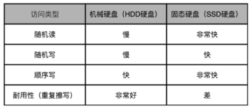

不管是机械硬盘不擅长的随机读写，还是它本身已经表现不错的顺序写入，SSD 在这些方面都要比 HDD 强。不过，有一点，机械硬盘要远强于 SSD，那就是耐用性。如果我们需要频繁地重复写入删除数据，那么机械硬盘要比 SSD 性价比高很多。


要想知道为什么 SSD 的耐用性不太好，我们先要理解 SSD 硬盘的存储和读写原理。我们之前说过，CPU Cache 用的 SRAM 是用一个电容来存放一个比特的数据。对于 SSD 硬盘，我们也可以先简单地认为，它是由一个电容加上一个电压计组合在一起，记录了一个或者多个比特。


### 2、SLC、MLC、TLC 和 QLC


能够记录一个比特很容易理解。给电容里面充上电有电压的时候就是 1，给电容放电里面没有电就是 0。采用这样方式存储数据的 SSD 硬盘，我们一般称之为使用了 SLC 的颗粒，全称是 Single-Level Cell，也就是一个存储单元中只有一位数据。


但是，这样的方式会遇到和 CPU Cache 类似的问题，那就是，同样的面积下，能够存放下的元器件是有限的。如果只用 SLC，我们就会遇到，存储容量上不去，并且价格下不来的问题。于是呢，硬件工程师们就陆续发明了 MLC（Multi-Level Cell）、TLC（Triple-Level Cell）以及 QLC（Quad-Level Cell），也就是能在一个电容里面存下 2 个、3 个乃至 4 个比特。

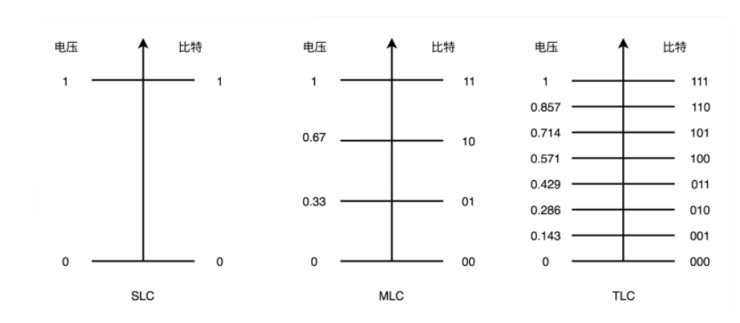


只有一个电容，我们怎么能够表示更多的比特呢？别忘了，这里我们还有一个电压计。4 个比特一共可以从 0000-1111 表示 16 个不同的数。那么，如果我们能往电容里面充电的时候，充上 15 个不同的电压，并且我们电压计能够区分出这 15 个不同的电压。加上电容被放空代表的 0，就能够代表从 0000-1111 这样 4 个比特了。不过，要想表示 15 个不同的电压，充电和读取的时候，对于精度的要求就会更高。这会导致充电和读取的时候都更慢，所以 QLC 的 SSD 的读写速度，要比 SLC 的慢上好几倍。如果你想要知道是什么样的物理原理导致这个 QLC 更慢，可以去读一读这篇

https://www.anandtech.com/show/5067/understanding-tlc-nand/2


### 3、P/E 擦写问题

如果我们去看一看 SSD 硬盘的硬件构造，可以看到，它大概是自顶向下是这么构成的。

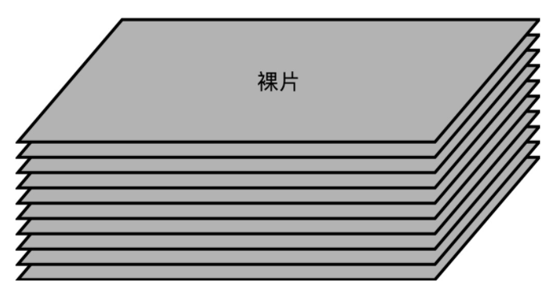

首先，自然和其他的 I/O 设备一样，它有对应的接口和控制电路。现在的 SSD 硬盘用的是 SATA 或者 PCI Express 接口。在控制电路里，有一个很重要的模块，叫作 FTL（Flash-Translation Layer），也就是闪存转换层。这个可以说是 SSD 硬盘的一个核心模块，SSD 硬盘性能的好坏，很大程度上也取决于 FTL 的算法好不好。

实际 I/O 设备，它其实和机械硬盘很像。现在新的大容量 SSD 硬盘都是 3D 封装的了，也就是说，是由很多个裸片（Die）叠在一起的，就好像我们的机械硬盘把很多个盘面（Platter）叠放再一起一样，这样可以在同样的空间下放下更多的容量。

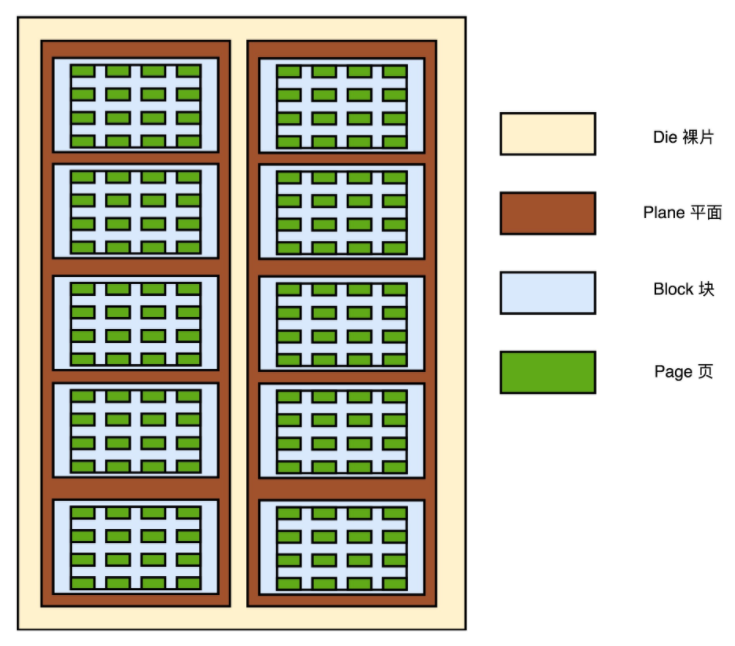

一张裸片上可以放多个平面（Plane），一般一个平面上的存储容量大概在 GB 级别。一个平面上面，会划分成很多个块（Block），一般一个块（Block）的存储大小， 通常几百 KB 到几 MB 大小。一个块里面，还会区分很多个页（Page），就和我们内存里面的页一样，一个页的大小通常是 4KB。

对于 SSD 硬盘来说，数据的写入叫作 Program。写入不能像机械硬盘一样，通过覆写（Overwrite）来进行的，而是要先去擦除（Erase），然后再写入。SSD 的读取和写入的基本单位，不是一个比特（bit）或者一个字节（byte），而是一个页（Page）。SSD 的擦除单位就更夸张了，我们不仅不能按照比特或者字节来擦除，连按照页来擦除都不行，我们必须按照块来擦除。

你必须记住的一点是，SSD 的使用寿命，其实是每一个块（Block）的擦除的次数。你可以把 SSD 硬盘的一个平面看成是一张白纸。我们在上面写入数据，就好像用铅笔在白纸上写字。如果想要把已经写过字的地方写入新的数据，我们先要用橡皮把已经写好的字擦掉。但是，如果频繁擦同一个地方，那这个地方就会破掉，之后就没有办法再写字了。我们上面说的 SLC 的芯片，可以擦除的次数大概在 10 万次，MLC 就在 1 万次左右，而 TLC 和 QLC 就只在几千次了。


### 4、SSD 读写的生命周期

下面我们来实际看一看，一块 SSD 硬盘在日常是怎么被用起来的。我用三种颜色分别来表示 SSD 硬盘里面的页的不同状态，白色代表这个页从来没有写入过数据，绿色代表里面写入的是有效的数据，红色代表里面的数据，在我们的操作系统看来已经是删除的了。

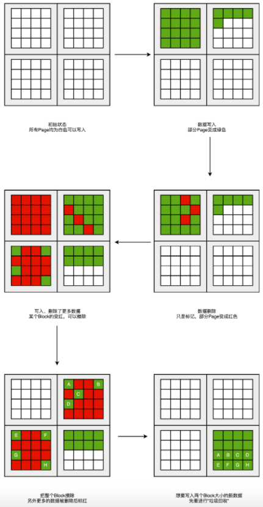

一开始，所有块的每一个页都是白色的。随着我们开始往里面写数据，里面的有些页就变成了绿色。

然后，因为我们删除了硬盘上的一些文件，所以有些页变成了红色。但是这些红色的页，并不能再次写入数据。因为 SSD 硬盘不能单独擦除一个页，必须一次性擦除整个块，所以新的数据，我们只能往后面的白色的页里面写。这些散落在各个绿色空间里面的红色空洞，就好像硬盘碎片。

如果有哪一个块的数据一次性全部被标红了，那我们就可以把整个块进行擦除。它就又会变成白色，可以重新一页一页往里面写数据。这种情况其实也会经常发生。毕竟一个块不大，也就在几百 KB 到几 MB。你删除一个几 MB 的文件，数据又是连续存储的，自然会导致整个块可以被擦除。

随着硬盘里面的数据越来越多，红色空洞占的地方也会越来越多。于是，你会发现，我们就要没有白色的空页去写入数据了。这个时候，我们要做一次类似于 Windows 里面“磁盘碎片整理”或者 Java 里面的“内存垃圾回收”工作。找一个红色空洞最多的块，把里面的绿色数据，挪到另一个块里面去，然后把整个块擦除，变成白色，可以重新写入数据。

不过，这个“磁盘碎片整理”或者“内存垃圾回收”的工作，我们不能太主动、太频繁地去做。因为 SSD 的擦除次数是有限的。如果动不动就搞个磁盘碎片整理，那么我们的 SSD 硬盘很快就会报废了。

说到这里，你可能要问了，这是不是说，我们的 SSD 硬盘的容量是用不满的？因为我们总会遇到一些红色空洞？

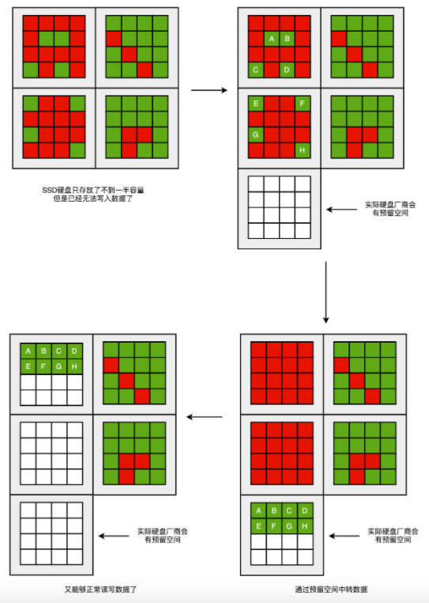

没错，一块 SSD 的硬盘容量，是没办法完全用满的。不过，为了不得罪消费者，生产 SSD 硬盘的厂商，其实是预留了一部分空间，专门用来做这个“磁盘碎片整理”工作的。一块标成 240G 的 SSD 硬盘，往往实际有 256G 的硬盘空间。SSD 硬盘通过我们的控制芯片电路，把多出来的硬盘空间，用来进行各种数据的闪转腾挪，让你能够写满那 240G 的空间。这个多出来的 16G 空间，叫作`预留空间（Over Provisioning）`，一般 SSD 的硬盘的预留空间都在 7%-15% 左右。


### 5、FTL 和磨损均衡

如果ssd盘一部分读取操作多写入操作少，另外一部分区域写多读取少时，有一天，这些块的擦除次数到了，变成了坏块，就会造成这块硬盘的可以用的容量却变小了。

那么，我们有没有什么办法，不让这些坏块那么早就出现呢？

其实我们要的就是想一个办法，让 SSD 硬盘各个块的擦除次数，均匀分摊到各个块上。这个策略呢，就叫作`磨损均衡（Wear-Leveling）`。实现这个技术的核心办法，和虚拟内存一样，就是添加一个间接层。这个间接层，就是 FTL 这个闪存转换层。

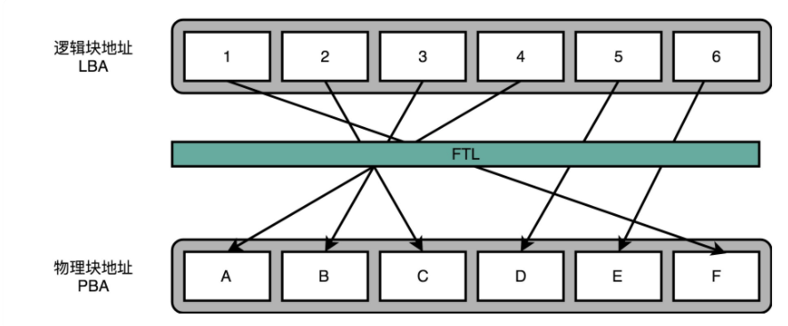

就像在管理内存的时候，我们通过一个页表映射虚拟内存页和物理页一样，在 FTL 里面，存放了逻辑块地址（Logical Block Address，简称 LBA）到物理块地址（Physical Block Address，简称 PBA）的映射。

操作系统访问的硬盘地址，其实都是逻辑地址。只有通过 FTL 转换之后，才会变成实际的物理地址，找到对应的块进行访问。操作系统本身，不需要去考虑块的磨损程度，只要和操作机械硬盘一样来读写数据就好了。操作系统所有对于 SSD 硬盘的读写请求，都要经过 FTL。FTL 里面又有逻辑块对应的物理块，所以 FTL 能够记录下来，每个物理块被擦写的次数。如果一个物理块被擦写的次数多了，FTL 就可以将这个物理块，挪到一个擦写次数少的物理块上。但是，逻辑块不用变，操作系统也不需要知道这个变化。这也是我们在设计大型系统中的一个典型思路，也就是各层之间是隔离的，操作系统不需要考虑底层的硬件是什么，完全交由硬件的控制电路里面的 FTL，来管理对于实际物理硬件的写入。


#### 1、TRIM 指令的支持

不过，操作系统不去关心实际底层的硬件是什么，在 SSD 硬盘的使用上，也会带来一个问题。这个问题就是，操作系统的逻辑层和 SSD 的逻辑层里的块状态，是不匹配的。

我们在操作系统里面去删除一个文件，其实并没有真的在物理层面去删除这个文件，只是在文件系统里面，把对应的 inode 里面的元信息清理掉，这代表这个 inode 还可以继续使用，可以写入新的数据。这个时候，实际物理层面的对应的存储空间，在操作系统里面被标记成可以写入了。所以，其实我们日常的文件删除，都只是一个操作系统层面的逻辑删除。这也是为什么，很多时候我们不小心删除了对应的文件，我们可以通过各种恢复软件，把数据找回来。同样的，这也是为什么，如果我们想要删除干净数据，需要用各种“文件粉碎”的功能才行。这个删除的逻辑在机械硬盘层面没有问题，因为文件被标记成可以写入，后续的写入可以直接覆写这个位置。但是，在 SSD 硬盘上就不一样了。我在这里放了一张详细的示意图。我们下面一起来看看具体是怎么回事儿。

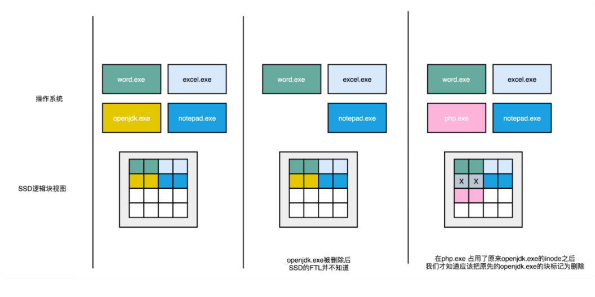

一开始，操作系统里面有好几个文件，不同的文件我用不同的颜色标记出来了。下面的 SSD 的逻辑块里面占用的页，我们也用同样的颜色标记出来文件占用的对应页。当我们在操作系统里面，删除掉一个刚刚下载的文件，比如标记成黄色 openjdk.exe 这样一个 jdk 的安装文件，在操作系统里面，对应的 inode 里面，就没有文件的元信息。但是，这个时候，我们的 SSD 的逻辑块层面，其实并不知道这个事情。所以在，逻辑块层面，openjdk.exe 仍然是占用了对应的空间。对应的物理页，也仍然被认为是被占用了的。

这个时候，如果我们需要对 SSD 进行垃圾回收操作，openjdk.exe 对应的物理页，仍然要在这个过程中，被搬运到其他的 Block 里面去。只有当操作系统，再在刚才的 inode 里面写入数据的时候，我们才会知道原来的些黄色的页，其实都已经没有用了，我们才会把它标记成废弃掉。所以，在使用 SSD 的硬盘情况下，你会发现，操作系统对于文件的删除，SSD 硬盘其实并不知道。这就导致，我们为了磨损均衡，很多时候在都在搬运很多已经删除了的数据。这就会产生很多不必要的数据读写和擦除，既消耗了 SSD 的性能，也缩短了 SSD 的使用寿命。

为了解决这个问题，现在的操作系统和 SSD 的主控芯片，都支持 TRIM 命令。这个命令可以在文件被删除的时候，让操作系统去通知 SSD 硬盘，对应的逻辑块已经标记成已删除了。现在的 SSD 硬盘都已经支持了 TRIM 命令。无论是 Linux、Windows 还是 MacOS，这些操作系统也都已经支持了 TRIM 命令了。

#### 2、写入放大

其实，TRIM 命令的发明，也反应了一个使用 SSD 硬盘的问题，那就是，SSD 硬盘容易越用越慢。当 SSD 硬盘的存储空间被占用得越来越多，每一次写入新数据，我们都可能没有足够的空白。我们可能不得不去进行垃圾回收，合并一些块里面的页，然后再擦除掉一些页，才能匀出一些空间来。这个时候，从应用层或者操作系统层面来看，我们可能只是写入了一个 4KB 或者 4MB 的数据。但是，实际通过 FTL 之后，我们可能要去搬运 8MB、16MB 甚至更多的数据。

我们通过“实际的闪存写入的数据量 / 系统通过 FTL 写入的数据量 = 写入放大”，可以得到，写入放大的倍数越多，意味着实际的 SSD 性能也就越差，会远远比不上实际 SSD 硬盘标称的指标。而解决写入放大，需要我们在后台定时进行垃圾回收，在硬盘比较空闲的时候，就把搬运数据、擦除数据、留出空白的块的工作做完，而不是等实际数据写入的时候，再进行这样的操作。


### 6、ssd应用

#### 1、AeroSpike：如何最大化 SSD 的使用效率？

AeroSpike 这个专门针对 SSD 硬盘特性设计的 Key-Value 数据库（键值对数据库），是怎么利用这些物理特性的。

- 1、首先，AeroSpike 操作 SSD 硬盘，并没有通过操作系统的文件系统。而是直接操作 SSD 里面的块和页。因为操作系统里面的文件系统，对于 KV 数据库来说，只是让我们多了一层间接层，只会降低性能，对我们没有什么实际的作用。

- 2、在写入数据的时候，AeroSpike 尽可能去写一个较大的数据块，而不是频繁地去写很多小的数据块。这样，硬盘就不太容易频繁出现磁盘碎片。并且，一次性写入一个大的数据块，也更容易利用好顺序写入的性能优势。AeroSpike 写入的一个数据块，是 128KB，远比一个页的 4KB 要大得多。

- 3、在读取数据的时候，AeroSpike 倒是可以读取 512 字节（Bytes）这样的小数据。因为 SSD 的随机读取性能很好，也不像写入数据那样有擦除寿命问题。而且，很多时候我们读取的数据是键值对里面的值的数据，这些数据要在网络上传输。如果一次性必须读出比较大的数据，就会导致我们的网络带宽不够用。


因为 AeroSpike 是一个对于响应时间要求很高的实时 KV 数据库，如果出现了严重的写放大效应，会导致写入数据的响应时间大幅度变长。所以 AeroSpike 做了这样几个动作：

第一个是持续地进行磁盘碎片整理。AeroSpike 用了所谓的高水位（High Watermark）算法。其实这个算法很简单，就是一旦一个物理块里面的数据碎片超过 50%，就把这个物理块搬运压缩，然后进行数据擦除，确保磁盘始终有足够的空间可以写入。

第二个是在 AeroSpike 给出的最佳实践中，为了保障数据库的性能，建议你只用到 SSD 硬盘标定容量的一半。也就是说，我们人为地给 SSD 硬盘预留了 50% 的预留空间，以确保 SSD 硬盘的写放大效应尽可能小，不会影响数据库的访问性能。


## 6、案例

### 1、Cassandra：顺序写和随机读

作为一个分布式的 KV 数据库，Cassandra 的键一般被称为 Row Key。其实就是一个 16 到 36 个字节的字符串。每一个 Row Key 对应的值其实是一个哈希表，里面可以用键值对，再存入很多你需要的数据。

Cassandra 本身不像关系型数据库那样，有严格的 Schema，在数据库创建的一开始就定义好了有哪些列（Column）。但是，它设计了一个叫作列族（Column Family）的概念，我们需要把经常放在一起使用的字段，放在同一个列族里面。比如，DMP 里面的人口属性信息，我们可以把它当成是一个列族。用户的兴趣信息，可以是另外一个列族。这样，既保持了不需要严格的 Schema 这样的灵活性，也保留了可以把常常一起使用的数据存放在一起的空间局部性。往 Cassandra 的里面读写数据，其实特别简单，就好像是在一个巨大的分布式的哈希表里面写数据。我们指定一个 Row Key，然后插入或者更新这个 Row Key 的数据就好了。

#### 1、Cassandra 的写操作

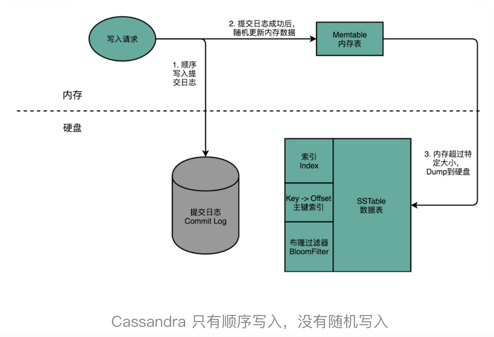

Cassandra 解决随机写入数据的解决方案，简单来说，就叫作“不随机写，只顺序写”。对于 Cassandra 数据库的写操作，通常包含两个动作。第一个是往磁盘上写入一条提交日志（Commit Log）。另一个操作，则是直接在内存的数据结构上去更新数据。后面这个往内存的数据结构里面的数据更新，只有在提交日志写成功之后才会进行。每台机器上，都有一个可靠的硬盘可以让我们去写入提交日志。写入提交日志都是顺序写（Sequential Write），而不是随机写（Random Write），这使得我们最大化了写入的吞吐量。

内存的空间比较有限，一旦内存里面的数据量或者条目超过一定的限额，Cassandra 就会把内存里面的数据结构 dump 到硬盘上。这个 Dump 的操作，也是顺序写而不是随机写，所以性能也不会是一个问题。除了 Dump 的数据结构文件，Cassandra 还会根据 row key 来生成一个索引文件，方便后续基于索引来进行快速查询。

随着硬盘上的 Dump 出来的文件越来越多，Cassandra 会在后台进行文件的对比合并。在很多别的 KV 数据库系统里面，也有类似这种的合并动作，比如 AeroSpike 或者 Google 的 BigTable。这些操作我们一般称之为 Compaction。合并动作同样是顺序读取多个文件，在内存里面合并完成，再 Dump 出来一个新的文件。整个操作过程中，在硬盘层面仍然是顺序读写。

#### 2、Cassandra 的读操作

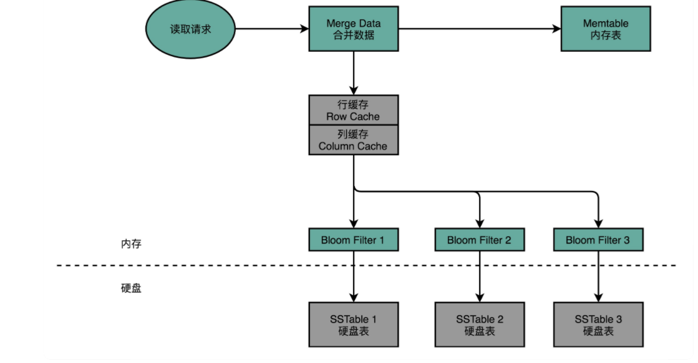

Cassandra 的读请求，会通过缓存、BloomFilter 进行两道过滤，尽可能避免数据请求命中硬盘

当我们要从 Cassandra 读数据的时候，会从内存里面找数据，再从硬盘读数据，然后把两部分的数据合并成最终结果。这些硬盘上的文件，在内存里面会有对应的 Cache，只有在 Cache 里面找不到，我们才会去请求硬盘里面的数据。如果不得不访问硬盘，因为硬盘里面可能 Dump 了很多个不同时间点的内存数据的快照。所以，找数据的时候，我们也是按照时间从新的往旧的里面找。这也就带来另外一个问题，我们可能要查询很多个 Dump 文件，才能找到我们想要的数据。所以，Cassandra 在这一点上又做了一个优化。那就是，它会为每一个 Dump 的文件里面所有 Row Key 生成一个 BloomFilter，然后把这个 BloomFilter 放在内存里面。这样，如果想要查询的 Row Key 在数据文件里面不存在，那么 99% 以上的情况下，它会被 BloomFilter 过滤掉，而不需要访问硬盘。这样，只有当数据在内存里面没有，并且在硬盘的某个特定文件上的时候，才会触发一次对于硬盘的读请求。


Cassandra 是 Facebook 在 2008 年开源的。那个时候，SSD 硬盘还没有那么普及。可以看到，它的读写设计充分考虑了硬件本身的特性。在写入数据进行持久化上，Cassandra 没有任何的随机写请求，无论是 Commit Log 还是 Dump，全部都是顺序写。

在数据读的请求上，最新写入的数据都会更新到内存。如果要读取这些数据，会优先从内存读到。这相当于是一个使用了 LRU 的缓存机制。只有在万般无奈的情况下，才会有对于硬盘的随机读请求。即使在这样的情况下，Cassandra 也在文件之前加了一层 BloomFilter，把本来因为 Dump 文件带来的需要多次读硬盘的问题，简化成多次内存读和一次硬盘读。

这些设计，使得 Cassandra 即使是在 HDD 硬盘上，也能有不错的访问性能。因为所有的写入都是顺序写或者写入到内存，所以，写入可以做到高并发。HDD 硬盘的吞吐率还是很不错的，每秒可以写入 100MB 以上的数据，如果一条数据只有 1KB，那么 10 万的 WPS（Writes per seconds）也是能够做到的。这足够支撑我们 DMP 期望的写入压力了。

可以参与SSD解决读取的性能问题。

在数据写入层面，Cassandra 的数据写入都是 Commit Log 的顺序写入，也就是不断地在硬盘上往后追加内容，而不是去修改现有的文件内容。一旦内存里面的数据超过一定的阈值，Cassandra 又会完整地 Dump 一个新文件到文件系统上。这同样是一个追加写入。

数据的对比和紧凑化（Compaction），同样是读取现有的多个文件，然后写一个新的文件出来。写入操作只追加不修改的特性，正好天然地符合 SSD 硬盘只能按块进行擦除写入的操作。在这样的写入模式下，Cassandra 用到的 SSD 硬盘，不需要频繁地进行后台的 Compaction，能够最大化 SSD 硬盘的使用寿命。这也是为什么，Cassandra 在 SSD 硬盘普及之后，能够获得进一步快速发展。


# 6、总线

CPU 所代表的控制器和运算器，要和存储器，也就是我们的主内存，以及输入和输出设备进行通信。那问题来了，CPU 从我们的键盘、鼠标接收输入信号，向显示器输出信号，这之间究竟是怎么通信的呢？换句话说，计算机是用什么样的方式来完成，CPU 和内存、以及外部输入输出设备的通信呢？这个问题的答案就是总线。

## 1、降低复杂性：总线的设计思路来源

计算机里其实有很多不同的硬件设备，除了 CPU 和内存之外，我们还有大量的输入输出设备。可以说，你计算机上的每一个接口，键盘、鼠标、显示器、硬盘，乃至通过 USB 接口连接的各种外部设备，都对应了一个设备或者模块。如果各个设备间的通信，都是互相之间单独进行的。如果我们有 N 个不同的设备，他们之间需要各自单独连接，那么系统复杂度就会变成 N2。每一个设备或者功能电路模块，都要和其他 N−1 个设备去通信。为了简化系统的复杂度，我们就引入了总线，把这个 N2 的复杂度，变成一个 N 的复杂度。

那怎么降低复杂度呢？与其让各个设备之间互相单独通信，不如我们去设计一个公用的线路。CPU 想要和什么设备通信，通信的指令是什么，对应的数据是什么，都发送到这个线路上；设备要向 CPU 发送什么信息呢，也发送到这个线路上。这个线路就好像一个高速公路，各个设备和其他设备之间，不需要单独建公路，只建一条小路通向这条高速公路就好了。


总线，其实就是一组线路。我们的 CPU、内存以及输入和输出设备，都是通过这组线路，进行相互间通信的。总线的英文叫作 Bus。`这种设计模式类属于发布订阅mq`


## 2、三种线路和多总线架构

现代的 Intel CPU 的体系结构里面，通常有好几条总线。


首先，CPU 和内存以及高速缓存通信的总线，这里面通常有两种总线。这种方式，我们称之为双独立总线（Dual Independent Bus，缩写为 DIB）。CPU 里，有一个`快速的本地总线（Local Bus）`也叫后端总线，用来和高速缓存通信的；以及一个速度相对较慢的`前端总线（Front-side Bus）` 也称`系统总线`。而前端总线，则是用来和主内存以及输入输出设备通信的。CPU 里面的北桥芯片，把前端总线，一分为二，变成了三个总线。

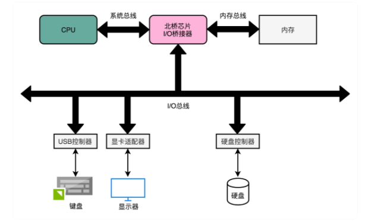

CPU 里面的内存接口，直接和系统总线通信，然后系统总线再接入一个 I/O 桥接器（I/O Bridge）。这个 I/O 桥接器，一边接入了我们的内存总线，使得我们的 CPU 和内存通信；另一边呢，又接入了一个 I/O 总线，用来连接 I/O 设备。


事实上，真实的计算机里，这个总线层面拆分得更细。根据不同的设备，还会分成独立的 PCI 总线、ISA 总线等等。

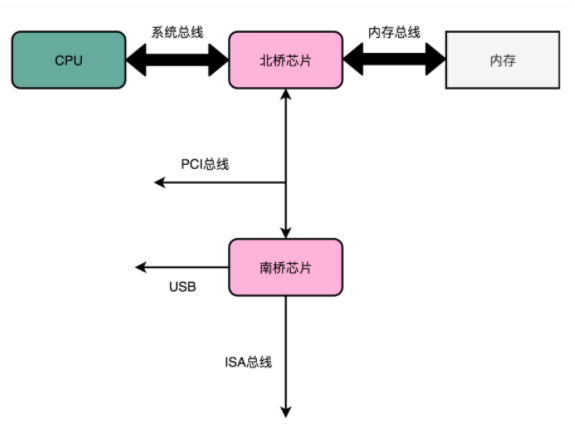


在物理层面，其实我们完全可以把总线看作一组“电线”。不过呢，这些电线之间也是有分工的，我们通常有三类线路。
- 1、数据线（Data Bus），用来传输实际的数据信息，也就是实际上了公交车的“人”。
- 2、地址线（Address Bus），用来确定到底把数据传输到哪里去，是内存的某个位置，还是某一个 I/O 设备。这个其实就相当于拿了个纸条，写下了上面的人要下车的站点。
- 3、控制线（Control Bus），用来控制对于总线的访问。虽然我们把总线比喻成了一辆公交车。那么有人想要做公交车的时候，需要告诉公交车司机，这个就是我们的控制信号。

尽管总线减少了设备之间的耦合，也降低了系统设计的复杂度，但同时也带来了一个新问题，那就是总线不能同时给多个设备提供通信功能。我们的总线是很多个设备公用的，那多个设备都想要用总线，我们就需要有一个机制，去决定这种情况下，到底把总线给哪一个设备用。这个机制，就叫作总线裁决（Bus Arbitraction）。


# 7、输入输出设备


像蓝牙、WiFi 无线网卡这样的设备是输入输出设备吗？我们的输入输出设备的寄存器在哪里？到底是在主板上，还是在硬件设备上？


实际上，输入输出设备，并不只是一个设备。大部分的输入输出设备，都有两个组成部分。第一个是它的接口（Interface），第二个才是实际的 I/O 设备（Actual I/O Device）。我们的硬件设备并不是直接接入到总线上和 CPU 通信的，而是通过接口，用接口连接到总线上，再通过总线和 CPU 通信。

平时听说的并行接口（Parallel Interface）、串行接口（Serial Interface）、USB 接口，都是计算机主板上内置的各个接口。我们的实际硬件设备，比如，使用并口的打印机、使用串口的老式鼠标或者使用 USB 接口的 U 盘，都要插入到这些接口上，才能和 CPU 工作以及通信的。


接口本身就是一块电路板。CPU 其实不是和实际的硬件设备打交道，而是和这个接口电路板打交道。我们平时说的，设备里面有三类寄存器，其实都在这个设备的接口电路上，而不在实际的设备上。


那这三类寄存器是哪三类寄存器呢？它们分别是状态寄存器（Status Register）、 命令寄存器（Command Register）以及数据寄存器（Data Register），


除了内置在主板上的接口之外，有些接口可以集成在设备上。

## 1、CPU 是如何控制 I/O 设备的？

无论是内置在主板上的接口，还是集成在设备上的接口，除了三类寄存器之外，还有对应的控制电路。正是通过这个控制电路，CPU 才能通过向这个接口电路板传输信号，来控制实际的硬件。

我们先来看一看，硬件设备上的这些寄存器有什么用。这里，我拿我们平时用的打印机作为例子。

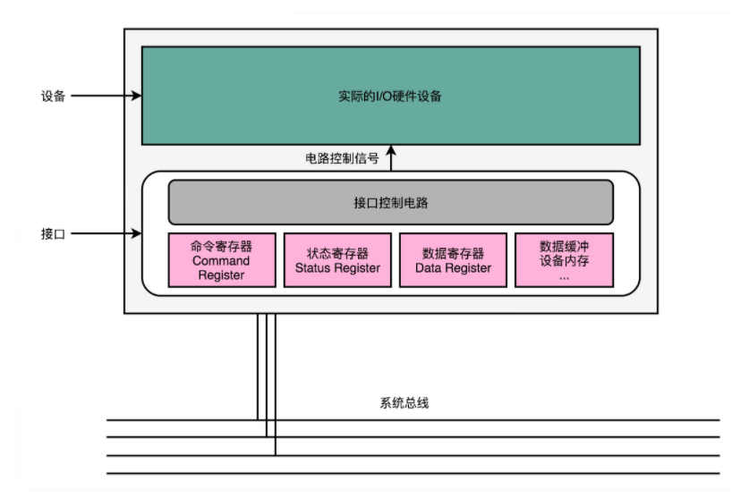


- 首先是数据寄存器（Data Register）。CPU 向 I/O 设备写入需要传输的数据，比如要打印的内容是“GeekTime”，我们就要先发送一个“G”给到对应的 I/O 设备。

- 然后是命令寄存器（Command Register）。CPU 发送一个命令，告诉打印机，要进行打印工作。这个时候，打印机里面的控制电路会做两个动作。第一个，是去设置我们的状态寄存器里面的状态，把状态设置成 not-ready。第二个，就是实际操作打印机进行打印。

- 而状态寄存器（Status Register），就是告诉了我们的 CPU，现在设备已经在工作了，所以这个时候，CPU 你再发送数据或者命令过来，都是没有用的。直到前面的动作已经完成，状态寄存器重新变成了 ready 状态，我们的 CPU 才能发送下一个字符和命令。


当然，在实际情况中，打印机里通常不只有数据寄存器，还会有数据缓冲区。我们的 CPU 也不是真的一个字符一个字符这样交给打印机去打印的，而是一次性把整个文档传输到打印机的内存或者数据缓冲区里面一起打印的。不过，通过上面这个例子，相信你对 CPU 是怎么操作 I/O 设备的，应该有所了解了。


## 2、信号和地址：发挥总线的价值

我们的 CPU 到底要往总线上发送一个什么样的命令，才能和 I/O 接口上的设备通信呢？

CPU 和 I/O 设备的通信，一样是通过 CPU 支持的机器指令来执行的。

为了让已经足够复杂的 CPU 尽可能简单，计算机会把 I/O 设备的各个寄存器，以及 I/O 设备内部的内存地址，都映射到主内存地址空间里来。主内存的地址空间里，会给不同的 I/O 设备预留一段一段的内存地址。CPU 想要和这些 I/O 设备通信的时候呢，就往这些地址发送数据。这些地址信息，就是通过地址线来发送的，而对应的数据信息呢，自然就是通过数据线来发送的了。

而我们的 I/O 设备呢，就会监控地址线，并且在 CPU 往自己地址发送数据的时候，把对应的数据线里面传输过来的数据，接入到对应的设备里面的寄存器和内存里面来。CPU 无论是向 I/O 设备发送命令、查询状态还是传输数据，都可以通过这样的方式。这种方式呢，叫作`内存映射IO（Memory-Mapped I/O，简称 MMIO）。
`

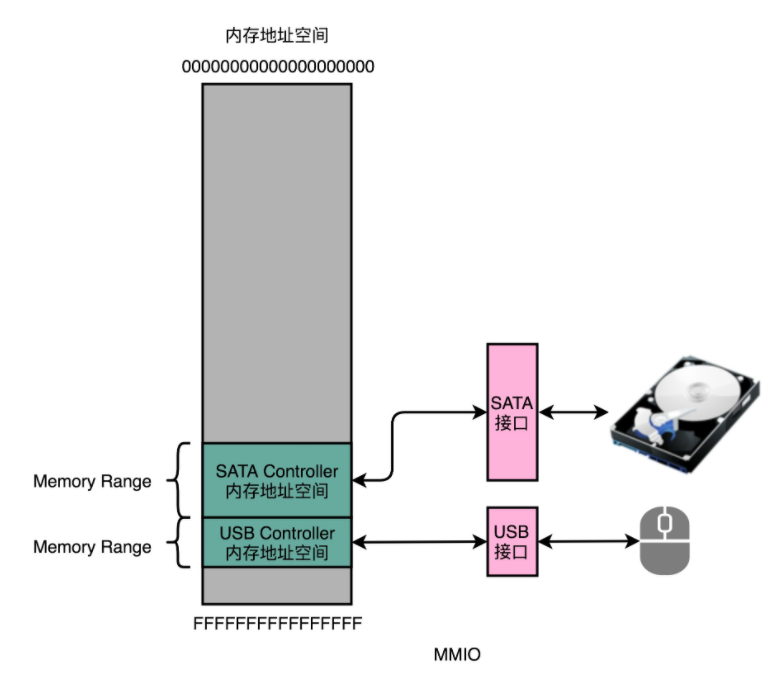

那么，MMIO 是不是唯一一种 CPU 和设备通信的方式呢？答案是否定的。精简指令集 MIPS 的 CPU 特别简单，所以这里只有 MMIO。而我们有 2000 多个指令的 Intel X86 架构的计算机，自然可以设计专门的和 I/O 设备通信的指令，也就是 in 和 out 指令。Intel CPU 虽然也支持 MMIO，不过它还可以通过特定的指令，来支持端口映射 I/O（Port-Mapped I/O，简称 PMIO）或者也可以叫独立输入输出（Isolated I/O）。其实 PMIO 的通信方式和 MMIO 差不多，核心的区别在于，PMIO 里面访问的设备地址，不再是在内存地址空间里面，而是一个专门的端口（Port）。这个端口并不是指一个硬件上的插口，而是和 CPU 通信的一个抽象概念。

无论是 PMIO 还是 MMIO，CPU 都会传送一条二进制的数据，给到 I/O 设备的对应地址。设备自己本身的接口电路，再去解码这个数据。解码之后的数据呢，就会变成设备支持的一条指令，再去通过控制电路去操作实际的硬件设备。对于 CPU 来说，它并不需要关心设备本身能够支持哪些操作。它要做的，只是在总线上传输一条条数据就好了。这个，其实也有点像我们在设计模式里面的 Command 模式。我们在总线上传输的，是一个个数据对象，然后各个接受这些对象的设备，再去根据对象内容，进行实际的解码和命令执行。


> 总结

CPU 并不是发送一个特定的操作指令来操作不同的 I/O 设备。因为如果是那样的话，随着新的 I/O 设备的发明，我们就要去扩展 CPU 的指令集了。在计算机系统里面，CPU 和 I/O 设备之间的通信，是这么来解决的。

首先，在 I/O 设备这一侧，我们把 I/O 设备拆分成，能和 CPU 通信的接口电路，以及实际的 I/O 设备本身。接口电路里面有对应的状态寄存器、命令寄存器、数据寄存器、数据缓冲区和设备内存等等。接口电路通过总线和 CPU 通信，接收来自 CPU 的指令和数据。而接口电路中的控制电路，再解码接收到的指令，实际去操作对应的硬件设备。

而在 CPU 这一侧，对 CPU 来说，它看到的并不是一个个特定的设备，而是一个个内存地址或者端口地址。CPU 只是向这些地址传输数据或者读取数据。所需要的指令和操作内存地址的指令其实没有什么本质差别。通过软件层面对于传输的命令数据的定义，而不是提供特殊的新的指令，来实际操作对应的 I/O 硬件。


# 参考

- [一文了解数据库索引：哈希、B-Tree 与 LSM](https://zhuanlan.zhihu.com/p/60969786)

- [磁盘性能指标--IOPS 理论](https://www.iteye.com/blog/elf8848-1731274)