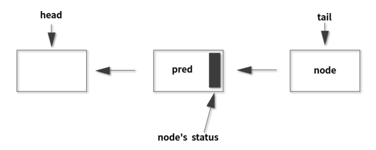

<!-- TOC -->

- [01、为什么需要 AQS？AQS 的作用和重要性是什么？](#01为什么需要-aqsaqs-的作用和重要性是什么)
    - [1、锁和协作类有共同点：阀门功能](#1锁和协作类有共同点阀门功能)
    - [2、为什么需要 AQS](#2为什么需要-aqs)
    - [3、AQS 的作用](#3aqs-的作用)
- [02、AQS 的内部原理是什么样的？](#02aqs-的内部原理是什么样的)
    - [1、state 状态](#1state-状态)
    - [2、FIFO 队列](#2fifo-队列)
    - [3、获取/释放方法](#3获取释放方法)
- [03、源码解析](#03源码解析)
    - [1、AQS 在CountDownLatch 等类中的应用原理是什么？](#1aqs-在countdownlatch-等类中的应用原理是什么)
        - [1、构造函数](#1构造函数)
        - [2、getCount](#2getcount)
        - [3、countDown](#3countdown)
        - [4、await](#4await)
        - [5、AQS 在 CountDownLatch 的应用总结](#5aqs-在-countdownlatch-的应用总结)

<!-- /TOC -->

# 01、为什么需要 AQS？AQS 的作用和重要性是什么？


我们先来介绍一下 AQS（AbstractQueuedSynchronizer）的重要性，来看看 AQS 被用在了哪些类里面。

AQS 在 ReentrantLock、ReentrantReadWriteLock、Semaphore、CountDownLatch、ThreadPoolExcutor 的 Worker 中都有运用（JDK 1.8），AQS 是这些类的底层原理。

而以上这些类，很多都是我们经常使用的类，大部分我们在前面课时中也已经详细介绍过，所以说 JUC 包里很多重要的工具类背后都离不开 AQS 框架，因此 AQS 的重要性不言而喻。

> 学习 AQS 的思路

AQS 类的内部结构要比一般的类复杂得多，里面有很多细节，不容易完全掌握，所以如果我们一上来就直接看源码，容易把自己给绕晕。

其实我们大多数的程序员都是业务开发者，而不是 JDK 开发者，所以平时并不需要自己来开发类似于 ReentrantLock 这样的工具类，所以通常而言，我们不会直接使用到 AQS 来进行开发，因为 JDK 已经提供了很多封装好的线程协作工具类，像前面讲解的 ReentrantLock、Semaphore 就是 JDK 提供给我们的，其内部就用到了 AQS，而这些工具类已经基本足够覆盖大部分的业务场景了，这就使得我们即便不了解 AQS，也能利用这些工具类顺利进行开发。

既然我们学习 AQS 的目的不是进行代码开发，那我们为什么还需要学习 AQS 呢？我认为，我们学习 AQS 的目的主要是想理解其背后的原理、学习设计思想，以提高技术并应对面试。所以本课时的主要目的是从宏观的角度去解读 AQS，`比如知道为什么需要 AQS、AQS 有什么作用`，在了解了宏观思想之后，再去分析它的内部结构，学习起来就轻松多了。

## 1、锁和协作类有共同点：阀门功能

就让我们从熟悉的类作为学习 AQS 的切入点，请你先来思考一下，之前学过的 ReentrantLock 和 Semaphore，二者之间有没有什么共同点？

其实它们都可以当做一个阀门来使用。比如我们把 Semaphore 的许可证数量设置为 1，那么由于它只有一个许可证，所以只能允许一个线程通过，并且当之前的线程归还许可证后，会允许其他线程继续获得许可证。其实这点和 ReentrantLock 很像，只有一个线程能获得锁，并且当这个线程释放锁之后，会允许其他的线程获得锁。那如果线程发现当前没有额外的许可证时，或者当前得不到锁，那么线程就会被阻塞，并且等到后续有许可证或者锁释放出来后，被唤醒，所以这些环节都是比较类似的。

除了上面讲的 ReentrantLock 和 Semaphore 之外，我们会发现 CountDownLatch、ReentrantReadWriteLock 等工具类都有类似的让线程“协作”的功能，其实它们背后都是利用 AQS 来实现的。

## 2、为什么需要 AQS

原因是，上面刚讲的那些协作类，它们有很多工作是类似的，所以如果能把实现类似工作的代码给提取出来，变成一个新的底层工具类（或称为框架）的话，就可以直接使用这个工具类来构建上层代码了，而这个工具类其实就是 AQS。

有了 AQS 之后，对于 ReentrantLock 和 Semaphore 等线程协作工具类而言，它们就不需要关心这么多的线程调度细节，只需要实现它们各自的设计逻辑即可。


那我们再尝试逆向思考一下，如果没有 AQS 会怎么样？如果没有 AQS，那就需要每个线程协作工具类自己去实现至少以下内容，包括：

- 1、状态的原子性管理
- 2、线程的阻塞与解除阻塞
- 3、队列的管理

这里的状态对于不同的工具类而言，代表不同的含义，比如对于 ReentrantLock 而言，它需要维护锁被重入的次数，但是保存重入次数的变量是会被多线程同时操作的，就需要进行处理，以便保证线程安全。不仅如此，对于那些未抢到锁的线程，还应该让它们陷入阻塞，并进行排队，并在合适的时机唤醒。所以说这些内容其实是比较繁琐的，而且也是比较重复的，而这些工作目前都由 AQS 来承担了。

如果没有 AQS，就需要 ReentrantLock 等类来自己实现相关的逻辑，但是让每个线程协作工具类自己去正确并且高效地实现这些内容，是相当有难度的。AQS 可以帮我们把 “脏活累活” 都搞定，所以对于 ReentrantLock 和 Semaphore 等类而言，它们只需要关注自己特有的业务逻辑即可。正所谓是“哪有什么岁月静好，不过是有人替你负重前行”。

> 比喻：HR 和面试官

如果看到这里，你还不是特别理解 AQS 的作用，那就请看接下来的这个比喻，我们把 AQS 和线程协作工具类给“拟人化”，比作是 HR 和面试官。

这里模拟候选人参加校招面试的场景。对公司而言，面试一般需要面试官和 HR 参加。通常有两种面试，一种是群面，一种是单面，群面是指多个同学一起参加的面试，例如规定是 10 个人一起面试，那群面规则就是先凑齐 10 个人，再统一面试。


而单面往往是流水线形式的、一对一的面试。假设我们一共有 5 个面试官进行单面，即这 5 个面试官同时分别面试一个候选人，在面试过程中，候选人会进行排队，前面的候选人面试完了以后，后面候选人就跟上，找空闲的面试官开始面试，这就是单面的场景。


乍看起来，群面和单面的面试规则是很不一样的：前者是多人一起面试，而后者是逐个面试。但也其实，群面和单面也有很多相同的地方（或者称为流程或环节），而这些相同的地方往往都是由 HR 负责的。比如面试者来了，HR 需要安排候选人签到、就坐等待、排队，然后 HR 要按顺序叫号，从而避免发生多个候选人冲突的情况，同时 HR 还要确保等待的同学最终都会被叫到，这一系列的内容都由 HR 负责，而这些内容无论是单面还是群面都是一样的。这些 HR 在面试中所做的工作，其实就可以比作是 AQS 所干的活儿。

至于具体的面试规则，比如群面规则是 5 个人还是 10 个人一起？是单面还是群？这些是由面试官来安排的。对于面试官而言，他不会关心候选人是否号码冲突、如何等待、如何叫号，是否有休息的场地等，因为这是 HR 的职责范围。

这里的面试官就对应利用了 AQS 实现具体的协作逻辑的工具类，而 HR 则代表 AQS。刚才所说的让候选人休息，就是指把线程进行阻塞，不要持续耗费 CPU；而后续叫号让候选人去面试，则意味着去唤醒线程。

群面的流程类似于 CountDownLatch，CountDownLatch 会先设置需要倒数的初始值，假设为 10，每来一个候选人，计数减 1，如果 10 个人都到齐了，就开始面试。同样，单面可以理解为是 Semaphore 信号量，假设有 5 个许可证，每个线程每次获取 1 个许可证，这就类似于有 5 个面试官并行面试，候选人在面试之前需要先获得许可证，面试结束后归还许可证。

对于 CountDownLatch 和 Semaphore 等工具类而言，它要确定自己的“要人”规则，是凑齐 10 个候选人一起面试，像群面一样呢？还是出 1 进 1，像单面一样呢？确定了规则之后，剩下的类似招呼面试者（类比于调度线程）等一系列工作可以交给 AQS 来做，这样一来，各自的职责就非常独立且分明了。

## 3、AQS 的作用

AQS 是一个用于构建锁、同步器等线程协作工具类的框架，有了 AQS 以后，很多用于线程协作的工具类就都可以很方便的被写出来，有了 AQS 之后，可以让更上层的开发极大的减少工作量，避免重复造轮子，同时也避免了上层因处理不当而导致的线程安全问题，因为 AQS 把这些事情都做好了。总之，有了 AQS 之后，我们构建线程协作工具类就容易多了。


# 02、AQS 的内部原理是什么样的？


我们对 AQS 进行内部原理解析的话需要抓住重点，因为 AQS 的内部比较复杂，代码很长而且非常不容易读懂，如果我们一上来就一头扎进去读源码，是很难完全掌握它的。所以在本课时中，我们把 AQS 最核心的三个部分作为重点提炼出来，由这三个部分作为切入点，打开 AQS 的大门。

是哪三大部分呢？AQS 最核心的三大部分就是状态、队列和期望协作工具类去实现的获取/释放等重要方法。我们就从这三个部分出发，分别展开讲解。

## 1、state 状态

如果我们的 AQS 想要去管理或者想作为协作工具类的一个基础框架，那么它必然要管理一些状态，而这个状态在 AQS 内部就是用 state 变量去表示的。它的定义如下：

private volatile int state;//The synchronization state.

而 state 的含义并不是一成不变的，它会根据具体实现类的作用不同而表示不同的含义，下面举几个例子。

比如说在信号量里面，state 表示的是剩余许可证的数量。如果我们最开始把 state 设置为 10，这就代表许可证初始一共有 10 个，然后当某一个线程取走一个许可证之后，这个 state 就会变为 9，所以信号量的 state 相当于是一个内部计数器。

再比如，在 CountDownLatch 工具类里面，state 表示的是需要“倒数”的数量。一开始我们假设把它设置为 5，当每次调用 CountDown 方法时，state 就会减 1，一直减到 0 的时候就代表这个门闩被放开。

下面我们再来看一下 state 在 ReentrantLock 中是什么含义，在 ReentrantLock 中它表示的是锁的占有情况。最开始是 0，表示没有任何线程占有锁；如果 state 变成 1，则就代表这个锁已经被某一个线程所持有了。

那为什么还会变成 2、3、4 呢？为什么会往上加呢？因为 ReentrantLock 是可重入的，同一个线程可以再次拥有这把锁就叫重入。如果这个锁被同一个线程多次获取，那么 state 就会逐渐的往上加，state 的值表示重入的次数。在释放的时候也是逐步递减，比如一开始是 4，释放一次就变成了 3，再释放一次变成了 2，这样进行的减操作，即便是减到 2 或者 1 了，都不代表这个锁是没有任何线程持有，只有当它减到 0 的时候，此时恢复到最开始的状态了，则代表现在没有任何线程持有这个锁了。所以，state 等于 0 表示锁不被任何线程所占有，代表这个锁当前是处于释放状态的，其他线程此时就可以来尝试获取了。

这就是 state 在不同类中不同含义的一个具体表现。我们举了三个例子，如果未来有新的工具要利用到 AQS，它一定也需要利用 state，为这个类表示它所需要的业务逻辑和状态。

下面我们再来看一下关于 state 修改的问题，因为 state 是会被多个线程共享的，会被并发地修改，所以所有去修改 state 的方法都必须要保证 state 是线程安全的。可是 state 本身它仅仅是被 volatile 修饰的，volatile 本身并不足以保证线程安全，所以我们就来看一下，AQS 在修改 state 的时候具体利用了什么样的设计来保证并发安全。

我们举两个和 state 相关的方法，分别是 compareAndSetState 及 setState，它们的实现已经由 AQS 去完成了，也就是说，我们直接调用这两个方法就可以对 state 进行线程安全的修改。下面就来看一下这两个方法的源码是怎么实现的。

先来看一下 compareAndSetState 方法，这是一个我们非常熟悉的 CAS 操作，这个方法的代码，如下所示：

```java
protected final boolean compareAndSetState(int expect, int update) {
    return unsafe.compareAndSwapInt(this, stateOffset, expect, update);
}
```

方法里面只有一行代码，即 return unsafe.compareAndSwapInt(this, stateOffset, expect, update)，这个方法我们已经非常熟悉了，它利用了 Unsafe 里面的 CAS 操作，利用 CPU 指令的原子性保证了这个操作的原子性，与之前介绍过的原子类去保证线程安全的原理是一致的。

接下来看一下 setState 方法的源码，如下所示：

```java
protected final void setState(int newState) {
    state = newState;
}
```

我们可以看到，它去修改 state 值的时候非常直截了当，直接把 state = newState，这样就直接赋值了。你可能会感到困惑，这里并没有进行任何的并发安全处理，没有加锁也没有 CAS，那如何能保证线程安全呢？

这里就要说到 volatile 的作用了，前面在学习 volatile 关键字的时候，知道了它适用于两种场景，其中一种场景就是，当对基本类型的变量进行直接赋值时，如果加了 volatile 就可以保证它的线程安全。注意，这是 volatile 的非常典型的使用场景。

private volatile int state;//The synchronization state.

可以看出，state 是 int 类型的，属于基本类型，并且这里的 setState 方法内是对 state 直接赋值的，它不涉及读取之前的值，也不涉及在原来值的基础上再修改，所以我们仅仅利用 volatile 就可以保证在这种情况下的并发安全，这就是 setState 方法线程安全的原因。

下面我们对 state 进行总结，在 AQS 中有 state 这样的一个属性，是被 volatile 修饰的，会被并发修改，它代表当前工具类的某种状态，在不同的类中代表不同的含义。

## 2、FIFO 队列

AQS 的第二个核心部分，FIFO 队列，即先进先出队列，这个队列最主要的作用是存储等待的线程。假设很多线程都想要同时抢锁，那么大部分的线程是抢不到的，那怎么去处理这些抢不到锁的线程呢？就得需要有一个队列来存放、管理它们。所以 AQS 的一大功能就是充当线程的“排队管理器”。

当多个线程去竞争同一把锁的时候，就需要用排队机制把那些没能拿到锁的线程串在一起；而当前面的线程释放锁之后，这个管理器就会挑选一个合适的线程来尝试抢刚刚释放的那把锁。所以 AQS 就一直在维护这个队列，并把等待的线程都放到队列里面。

这个队列内部是双向链表的形式，其数据结构看似简单，但是要想维护成一个线程安全的双向队列却非常复杂，因为要考虑很多的多线程并发问题。我们来看一下 AQS 作者 Doug Lea 给出的关于这个队列的一个图示：



在队列中，分别用 head 和 tail 来表示头节点和尾节点，两者在初始化的时候都指向了一个空节点。头节点可以理解为“当前持有锁的线程”，而在头节点之后的线程就被阻塞了，它们会等待被唤醒，唤醒也是由 AQS 负责操作的。

## 3、获取/释放方法

下面我们就来看一看 AQS 的第三个核心部分，获取/释放方法。在 AQS 中除了刚才讲过的 state 和队列之外，还有一部分非常重要，那就是获取和释放相关的重要方法，这些方法是协作工具类的逻辑的具体体现，需要每一个协作工具类自己去实现，所以在不同的工具类中，它们的实现和含义各不相同。

> 获取方法

我们首先来看一下获取方法。获取操作通常会依赖 state 变量的值，根据 state 值不同，协作工具类也会有不同的逻辑，并且在获取的时候也经常会阻塞，下面就让我们来看几个具体的例子。

比如 ReentrantLock 中的 lock 方法就是其中一个“获取方法”，执行时，如果发现 state 不等于 0 且当前线程不是持有锁的线程，那么就代表这个锁已经被其他线程所持有了。这个时候，当然就获取不到锁，于是就让该线程进入阻塞状态。

再比如，Semaphore 中的 acquire 方法就是其中一个“获取方法”，作用是获取许可证，此时能不能获取到这个许可证也取决于 state 的值。如果 state 值是正数，那么代表还有剩余的许可证，数量足够的话，就可以成功获取；但如果 state 是 0，则代表已经没有更多的空余许可证了，此时这个线程就获取不到许可证，会进入阻塞状态，所以这里同样也是和 state 的值相关的。

再举个例子，CountDownLatch 获取方法就是 await 方法（包含重载方法），作用是“等待，直到倒数结束”。执行 await 的时候会判断 state 的值，如果 state 不等于 0，线程就陷入阻塞状态，直到其他线程执行倒数方法把 state 减为 0，此时就代表现在这个门闩放开了，所以之前阻塞的线程就会被唤醒。

我们总结一下，“获取方法”在不同的类中代表不同的含义，但往往和 state 值相关，也经常会让线程进入阻塞状态，这也同样证明了 state 状态在 AQS 类中的重要地位。

> 释放方法

释放方法是站在获取方法的对立面的，通常和刚才的获取方法配合使用。我们刚才讲的获取方法可能会让线程阻塞，比如说获取不到锁就会让线程进入阻塞状态，但是释放方法通常是不会阻塞线程的。

比如在 Semaphore 信号量里面，释放就是 release 方法（包含重载方法），release() 方法的作用是去释放一个许可证，会让 state 加 1；而在 CountDownLatch 里面，释放就是 countDown 方法，作用是倒数一个数，让 state 减 1。所以也可以看出，在不同的实现类里面，他们对于 state 的操作是截然不同的，需要由每一个协作类根据自己的逻辑去具体实现。

> 拓展阅读

下面我们再进行一些拓展阅读，本课时是把 AQS 的核心结构拎出来讲解的，对于了解 AQS 内部结构有很大好处，但是并不足以包含 AQS 的全貌。如果有兴趣进一步深入理解 AQS ，可以选择学习相关的拓展资源：

- 第一个资源是 AQS 作者本人 Doug Lea 所写的一篇论文，这篇论文自然是非常宝贵的学习资料，请点击这里查看；
- 第二个是来自 Javadoop 博客对于 AQS 的源码分析的文章，感兴趣的话也可以阅读，请点击这里查看。

> 总结

介绍了 AQS 最重要的三个部分。第一个是 state，它是一个数值，在不同的类中表示不同的含义，往往代表一种状态；第二个是一个队列，该队列用来存放线程；第三个是“获取/释放”的相关方法，需要利用 AQS 的工具类根据自己的逻辑去实现。


# 03、源码解析

## 1、AQS 在CountDownLatch 等类中的应用原理是什么？


我们先讲一下 AQS 的用法。如果想使用 AQS 来写一个自己的线程协作工具类，通常而言是分为以下三步，这也是 JDK 里利用 AQS 类的主要步骤：

- 第一步，新建一个自己的线程协作工具类，在内部写一个 Sync 类，该 Sync 类继承 AbstractQueuedSynchronizer，即 AQS；

- 第二步，想好设计的线程协作工具类的协作逻辑，在 Sync 类里，根据是否是独占，来重写对应的方法。如果是独占，则重写 tryAcquire 和 tryRelease 等方法；如果是非独占，则重写 tryAcquireShared 和 tryReleaseShared 等方法；

- 第三步，在自己的线程协作工具类中，实现获取/释放的相关方法，并在里面调用 AQS 对应的方法，如果是独占则调用 acquire 或 release 等方法，非独占则调用 acquireShared 或 releaseShared 或 acquireSharedInterruptibly 等方法。

通过这三步就可以实现对 AQS 的利用了。由于这三个步骤是经过浓缩和提炼的，所以现在你可能感觉有些不太容易理解，我们后面会有具体的实例来帮助理解，这里先有一个初步的印象即可。

你可能注意到了，上面的第二步是根据某些条件来重写特定的一部分方法，这个做法好像之前很少遇到过，或者说你可能会想，是不是有更好的做法？比如通过实现接口的方式，因为实现某一个接口之后，自然就知道需要重写其中哪些方法了，为什么要先继承类，然后自己去判断选择哪些方法进行重写呢？这不是自己给自己设置障碍吗？

关于这个问题的答案，其实在 AQS 的原作者 Doug Lea 的论文中已经进行了说明，他认为如果是实现接口的话，那每一个抽象方法都需要实现。比如你把整个 AQS 作为接口，那么需要实现的方法有很多，包括 tryAcquire、tryRelease、tryAcquireShared、tryReleaseShared 等，但是实际上我们并不是每个方法都需要重写，根据需求的不同，有选择的去实现一部分就足以了，所以就设计为不采用实现接口，而采用继承类并重写方法的形式。

那可能你又有疑问了，继承类后，是不强制要求重写方法的，所以如果我们一个方法都不重写，行不行呢？答案是，如果不重写刚才所讲的 tryAcquire 等方法，是不行的，因为在执行的时候会抛出异常，我们来看下 AQS 对这些方法的默认的实现就知道了。

下面有四个方法的代码，分别是 tryAcquire、tryRelease、tryAcquireShared 和 tryReleaseShared 方法：

```java
protected boolean tryAcquire(int arg) {
    throw new UnsupportedOperationException();
}

protected boolean tryRelease(int arg) {
    throw new UnsupportedOperationException();
}

protected int tryAcquireShared(int arg) {
  throw new UnsupportedOperationException();
}

protected boolean tryReleaseShared(int arg) {
    throw new UnsupportedOperationException();
}
```

可以看到它们内部只有一行实现代码，就是直接抛出异常，所以要求我们在继承 AQS 之后，必须把相关方法去重写、覆盖，这样未来我们写的线程协作类才能正常的运行。

> AQS 在 CountDownLatch 的应用

上面讲了使用 AQS 的基本流程，现在我们用例子来帮助理解，一起来看看 AQS 在 CountDownLatch 中的应用。

在 CountDownLatch 里面有一个子类，该类的类名叫 Sync，这个类正是继承自 AQS。下面给出了 CountDownLatch 部分代码的截取：

```java
public class CountDownLatch {
    /**
     * Synchronization control For CountDownLatch.
     * Uses AQS state to represent count.
     */

    private static final class Sync extends AbstractQueuedSynchronizer {
        private static final long serialVersionUID = 4982264981922014374L;
        Sync(int count) {
            setState(count);
        }
        int getCount() {
            return getState();
        }
        protected int tryAcquireShared(int acquires) {
            return (getState() == 0) ? 1 : -1;
        }
        protected boolean tryReleaseShared(int releases) {
            // Decrement count; signal when transition to zero
            for (;;) {
                int c = getState();
                if (c == 0)
                    return false;
                int nextc = c-1;
                if (compareAndSetState(c, nextc))
                    return nextc == 0;
            }
        }
    }
    private final Sync sync;
   //省略其他代码...
}
```

可以很明显看到最开始一个 Sync 类继承了 AQS，这正是上一节所讲的“第一步，新建一个自己的线程协作工具类，在内部写一个 Sync 类，该 Sync 类继承 AbstractQueuedSynchronizer，即 AQS”。而在 CountDownLatch 里面还有一个 sync 的变量，正是 Sync 类的一个对象。

同时，我们看到，Sync 不但继承了 AQS 类，而且还重写了 tryAcquireShared 和 tryReleaseShared 方法，这正对应了“第二步，想好设计的线程协作工具类的协作逻辑，在 Sync 类里，根据是否是独占，来重写对应的方法。如果是独占，则重写 tryAcquire 或 tryRelease 等方法；如果是非独占，则重写 tryAcquireShared 和 tryReleaseShared 等方法”。

这里的 CountDownLatch 属于非独占的类型，因此它重写了 tryAcquireShared 和 tryReleaseShared 方法，那么这两个方法的具体含义是什么呢？别急，接下来就让我们对 CountDownLatch 类里面最重要的 4 个方法进行分析，逐步揭开它的神秘面纱。

### 1、构造函数

首先来看看构造函数。CountDownLatch 只有一个构造方法，传入的参数是需要“倒数”的次数，每次调用 countDown 方法就会倒数 1，直到达到了最开始设定的次数之后，相当于是“打开了门闩”，所以之前在等待的线程可以继续工作了。

我们具体来看下构造函数的代码：

```java
//当 count < 0 时会抛出异常，当 count > = 0，即代码 this.sync = new Sync( count ) ，往 Sync 中传入了 count。
public CountDownLatch(int count) {
    if (count < 0) throw new IllegalArgumentException("count < 0");
    this.sync = new Sync(count);
}
//该构造函数调用了 AQS 的 setState 方法，并且把 count 传进去了，而 setState 正是给 AQS 中的 state 变量赋值的
Sync(int count) {
     setState(count);
}

//我们通过 CountDownLatch 构造函数将传入的 count 最终传递到 AQS 内部的 state 变量，给 state 赋值，state 就代表还需要倒数的次数。
protected final void setState(int newState) {
    state = newState;
}
```


### 2、getCount

该方法的作用是获取当前剩余的还需要“倒数”的数量，getCount 方法的源码如下：

```java
//该方法 return 的是 sync 的 getCount
public long getCount() {
     return sync.getCount();
}

//getCount 方法调用的是 AQS 的 getState
int getCount() {
     return getState();
}

protected final int getState() {
    return state;
}

```

如代码所示，protected final int getState 方法直接 return 的就是 state 的值，所以最终它获取到的就在 AQS 中 state 变量的值。

### 3、countDown

我们再来看看 countDown 方法，该方法其实就是 CountDownLatch 的“释放”方法，下面来看下源码：

```java
//在 countDown 方法中调用的是 sync 的 releaseShared 方法
public void countDown() {
    sync.releaseShared(1);
}

//可以看出，releaseShared 先进行 if 判断，判断 tryReleaseShared 方法的返回结果
public final boolean releaseShared(int arg) {
    if (tryReleaseShared(arg)) {//只有在count=0时返回true
        doReleaseShared();//唤醒阻塞的全部线程
        return true;
    }
    return false;
}


protected boolean tryReleaseShared(int releases) {
    // Decrement count; signal when transition to zero
    for (;;) {
        int c = getState();
        if (c == 0)
            return false;
        int nextc = c-1;
        if (compareAndSetState(c, nextc))
            return nextc == 0;
    }
}
```

方法内是一个 for 的死循环，在循环体中，最开始是通过 getState 拿到当前 state 的值并赋值给变量 c，这个 c 可以理解为是 count 的缩写，如果此时 c = 0，则意味着已经倒数为零了，会直接会执行下面的 return false 语句，一旦 tryReleaseShared 方法返回 false，再往上看上一层的 releaseShared 方法，就会直接跳过整个 if (tryReleaseShared(arg)) 代码块，直接返回 false，相当于 releaseShared 方法不产生效果，也就意味着 countDown 方法不产生效果。

再回到 tryReleaseShared 方法中往下看 return false 下面的语句，如果 c 不等于 0，在这里会先把 c-1 的值赋给 nextc，然后再利用 CAS 尝试把 nextc 赋值到 state 上。如果赋值成功就代表本次 countDown 方法操作成功，也就意味着把 AQS 内部的 state 值减了 1。最后，是 return nextc == 0，如果 nextc 为 0，意味着本次倒数后恰好达到了规定的倒数次数，门闩应当在此时打开，所以 tryReleaseShared 方法会返回 true，那么再回到之前的 releaseShared 方法中，可以看到，接下来会调用 doReleaseShared 方法，效果是对之前阻塞的线程进行唤醒，让它们继续执行。

如果结合具体的数来分析，可能会更清晰。假设 c = 2，则代表需要倒数的值是 2，nextc = c-1，所以 nextc 就是 1，然后利用 CAS 尝试把 state 设置为 1，假设设置成功，最后会 return nextc == 0，此时 nextc 等于 1，不等于 0，所以返回 false，也就意味着 countDown 之后成功修改了 state 的值，把它减 1 了，但并没有唤醒线程。

下一次执行 countDown时，c 的值就是 1，而 nextc = c - 1，所以 nextc 等于 0，若这时 CAS 操作成功，最后 return nextc == 0，所以方法返回 true，一旦 tryReleaseShared 方法 return true，则 releaseShared 方法会调用 doReleaseShared 方法，把所有之前阻塞的线程都唤醒。

### 4、await

接着我们来看看 await 方法，该方法是 CountDownLatch 的“获取”方法，调用 await 方法会把线程阻塞，直到倒数为 0 才能继续执行。await 方法和 countDown 是配对的，追踪源码可以看到 await 方法的实现：

```java
//它会调用 sync 的 acquireSharedInterruptibly ，并且传入 1
public void await() throws InterruptedException {
    sync.acquireSharedInterruptibly(1);
}

//可以看到，它除了对于中断的处理之外，比较重要的就是 tryAcquireShared 方法。这个方法很简单，它会直接判断 getState 的值是不是等于 0，如果等于 0 就返回 1，不等于 0 则返回 -1。
public final void acquireSharedInterruptibly(int arg)
        throws InterruptedException {
    if (Thread.interrupted())
        throw new InterruptedException();
    if (tryAcquireShared(arg) < 0) // count不为0条件成立进入阻塞
        doAcquireSharedInterruptibly(arg);
}

protected int tryAcquireShared(int acquires) {
    return (getState() == 0) ? 1 : -1;
}
```

getState 方法获取到的值是剩余需要倒数的次数，如果此时剩余倒数的次数大于 0，那么 getState 的返回值自然不等于 0，因此 tryAcquireShared 方法会返回 -1，一旦返回 -1，再看到 if (tryAcquireShared(arg) < 0) 语句中，就会符合 if 的判断条件，并且去执行 doAcquireSharedInterruptibly 方法，然后会让线程进入阻塞状态。

我们再来看下另一种情况，当 state 如果此时已经等于 0 了，那就意味着倒数其实结束了，不需要再去等待了，就是说门闩是打开状态，所以说此时 getState 返回 0，tryAcquireShared 方法返回 1 ，一旦返回 1，对于 acquireSharedInterruptibly 方法而言相当于立刻返回，也就意味着 await 方法会立刻返回，那么此时线程就不会进入阻塞状态了，相当于倒数已经结束，立刻放行了。

这里的 await 和 countDown 方法，正对应了本讲一开始所介绍的“第三步，在自己的线程协作工具类中，实现获取/释放的相关方法，并在里面调用 AQS 对应的方法，如果是独占则调用 acquire 或 release 等方法，非独占则调用 acquireShared 或 releaseShared 或 acquireSharedInterruptibly 等方法。”

### 5、AQS 在 CountDownLatch 的应用总结

当线程调用 CountDownLatch 的 await 方法时，便会尝试获取“共享锁”，不过一开始通常获取不到锁，于是线程被阻塞。“共享锁”可获取到的条件是“锁计数器”的值为 0，而“锁计数器”的初始值为 count，当每次调用 CountDownLatch 对象的 countDown 方法时，也可以把“锁计数器” -1。通过这种方式，调用 count 次 countDown 方法之后，“锁计数器”就为 0 了，于是之前等待的线程就会继续运行了，并且此时如果再有线程想调用 await 方法时也会被立刻放行，不会再去做任何阻塞操作了。

