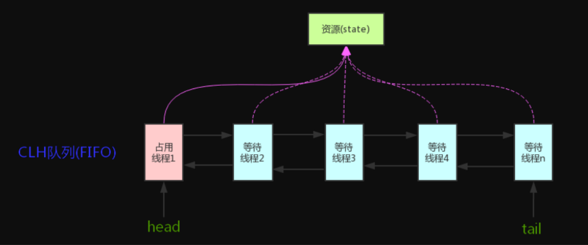
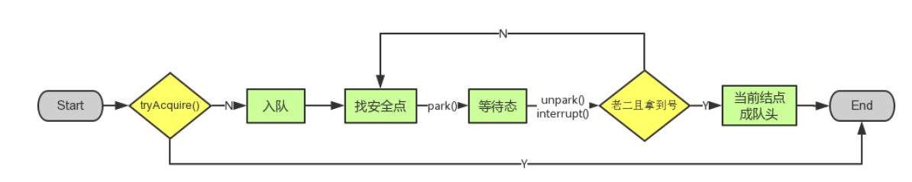

<!-- TOC -->

- [1、AbstractOwnableSynchronizer](#1abstractownablesynchronizer)
- [2、AbstractQueuedSynchronizer](#2abstractqueuedsynchronizer)
    - [1、内部等待队列的Node类](#1内部等待队列的node类)
    - [2、acquire(int arg)[lock方法会调用]](#2acquireint-arglock方法会调用)
        - [1、tryAcquire(int arg)](#1tryacquireint-arg)
        - [2、addWaiter(Node mode) 把等待线程封装成一个节点，拼接在等待队列的尾部](#2addwaiternode-mode-把等待线程封装成一个节点拼接在等待队列的尾部)
        - [3、acquireQueued(final Node node, int arg)写入队列之后需要将当前线程挂起](#3acquirequeuedfinal-node-node-int-arg写入队列之后需要将当前线程挂起)
            - [1、shouldParkAfterFailedAcquire(Node pred, Node node)](#1shouldparkafterfailedacquirenode-pred-node-node)
            - [2、parkAndCheckInterrupt()](#2parkandcheckinterrupt)
    - [3、release(int arg)[unlock方法调用]](#3releaseint-argunlock方法调用)
        - [1、tryRelease(int arg)](#1tryreleaseint-arg)
        - [2、unparkSuccessor(Node node)唤醒队列中的线程](#2unparksuccessornode-node唤醒队列中的线程)
    - [4、hasQueuedPredecessors()](#4hasqueuedpredecessors)
    - [5、acquireInterruptibly[lockInterruptibly]](#5acquireinterruptiblylockinterruptibly)
    - [6、tryAcquireNanos(int arg, long nanosTimeout)[tryLock(long timeout, TimeUnit unit)]](#6tryacquirenanosint-arg-long-nanostimeouttrylocklong-timeout-timeunit-unit)
    - [7、acquireShared(int)](#7acquiresharedint)
        - [1、tryAcquireShared(int arg)](#1tryacquiresharedint-arg)
        - [2、doAcquireShared(int arg)](#2doacquiresharedint-arg)
            - [setHeadAndPropagate(Node node, int propagate)](#setheadandpropagatenode-node-int-propagate)
    - [8、releaseShared(int arg)](#8releasesharedint-arg)
        - [1、tryReleaseShared(int arg)](#1tryreleasesharedint-arg)
        - [2、doReleaseShared()](#2doreleaseshared)
- [3、AQS设计](#3aqs设计)
    - [1、AQS 对资源的共享方式](#1aqs-对资源的共享方式)
    - [2、AQS底层使用了模板方法模式](#2aqs底层使用了模板方法模式)
- [实例](#实例)
    - [1、Mutex（互斥锁）](#1mutex互斥锁)
- [参考](#参考)

<!-- /TOC -->


抽象队列同步器AbstractQueuedSynchronizer（AQS），它包含了state变量、加锁线程、等待队列等并发中的核心组件。


> AQS 原理概览

**AQS核心思想是，如果被请求的共享资源空闲，则将当前请求资源的线程设置为有效的工作线程，并且将共享资源设置为锁定状态。如果被请求的共享资源被占用，那么就需要一套线程阻塞等待以及被唤醒时锁分配的机制，这个机制AQS是用CLH队列锁实现的，即将暂时获取不到锁的线程加入到队列中。**

`CLH(Craig,Landin,and Hagersten)队列是一个虚拟的双向队列（虚拟的双向队列即不存在队列实例，仅存在结点之间的关联关系）。AQS是将每条请求共享资源的线程封装成一个CLH锁队列的一个结点（Node）来实现锁的分配。`




> 总结

不同的自定义同步器争用共享资源的方式也不同。自定义同步器在实现时只需要实现共享资源state的获取与释放方式即可，至于具体线程等待队列的维护（如获取资源失败入队/唤醒出队等），AQS已经在顶层实现好了。自定义同步器实现时主要实现以下几种方法：

- isHeldExclusively()：该线程是否正在独占资源。只有用到condition才需要去实现它。
- tryAcquire(int)：独占方式。尝试获取资源，成功则返回true，失败则返回false。
- tryRelease(int)：独占方式。尝试释放资源，成功则返回true，失败则返回false。
- tryAcquireShared(int)：共享方式。尝试获取资源。负数表示失败；0表示成功，但没有剩余可用资源；正数表示成功，且有剩余资源。
- tryReleaseShared(int)：共享方式。尝试释放资源，如果释放后允许唤醒后续等待结点返回true，否则返回false。


# 1、AbstractOwnableSynchronizer


```java

//一个线程独占式的占有资源。便于子类开发。用来实现独占锁
public abstract class AbstractOwnableSynchronizer
    implements java.io.Serializable {

    protected AbstractOwnableSynchronizer() { }

    private transient Thread exclusiveOwnerThread; //唯一的字段，存放的是获取锁的线程

    protected final void setExclusiveOwnerThread(Thread thread) {
        exclusiveOwnerThread = thread;
    }

    protected final Thread getExclusiveOwnerThread() {
        return exclusiveOwnerThread;
    }
}

```

# 2、AbstractQueuedSynchronizer

AQS使用一个int成员变量来表示同步状态，通过内置的FIFO队列来完成获取资源线程的排队工作。AQS使用CAS对该同步状态进行原子操作实现对其值的修改。


```java

public abstract class AbstractQueuedSynchronizer
    extends AbstractOwnableSynchronizer
    implements java.io.Serializable {

protected AbstractQueuedSynchronizer() { }

private transient volatile Node head;//等待队列的头结点

private transient volatile Node tail;//等待队列的尾节点

private volatile int state;//锁状态字段，初始化为0。共享变量，使用volatile修饰保证线程可见性

static final long spinForTimeoutThreshold = 1000L;


private static final Unsafe unsafe = Unsafe.getUnsafe();//可以自己操作内存的工具类

private static final long stateOffset;//状态字段在内存中存储位置偏移
private static final long headOffset;//head字段在内存中存储位置偏移
private static final long tailOffset;//tail字段在内存中存储位置偏移

private static final long waitStatusOffset;//node类的waitStatus字段在内存中存储位置偏移
private static final long nextOffset;//node类的next字段在内存中存储位置偏移

//初始化各个内存偏移量的位置
static {
    try {
        stateOffset = unsafe.objectFieldOffset
            (AbstractQueuedSynchronizer.class.getDeclaredField("state"));
        headOffset = unsafe.objectFieldOffset
            (AbstractQueuedSynchronizer.class.getDeclaredField("head"));
        tailOffset = unsafe.objectFieldOffset
            (AbstractQueuedSynchronizer.class.getDeclaredField("tail"));
        waitStatusOffset = unsafe.objectFieldOffset
            (Node.class.getDeclaredField("waitStatus"));
        nextOffset = unsafe.objectFieldOffset
            (Node.class.getDeclaredField("next"));

    } catch (Exception ex) { throw new Error(ex); }
}

}
```

状态信息通过procted类型的getState，setState，compareAndSetState进行操作

```java

//返回同步状态的当前值
protected final int getState() {  
        return state;
}
 // 设置同步状态的值
protected final void setState(int newState) { 
        state = newState;
}
//原子地（CAS操作）将同步状态值设置为给定值update如果当前同步状态的值等于expect（期望值）
protected final boolean compareAndSetState(int expect, int update) {
        return unsafe.compareAndSwapInt(this, stateOffset, expect, update);
}
```


## 1、内部等待队列的Node类

Node结点是对每一个等待获取资源的线程的封装，其包含了需要同步的线程本身及其等待状态，如是否被阻塞、是否等待唤醒、是否已经被取消等。变量waitStatus则表示当前Node结点的等待状态，共有5种取值CANCELLED、SIGNAL、CONDITION、PROPAGATE、0。

- CANCELLED(1)：表示当前结点已取消调度。当timeout或被中断（响应中断的情况下），会触发变更为此状态，进入该状态后的结点将不会再变化。

- SIGNAL(-1)：表示后继结点在等待当前结点唤醒。后继结点入队时，会将前继结点的状态更新为SIGNAL。

- CONDITION(-2)：表示结点等待在Condition上，当其他线程调用了Condition的signal()方法后，CONDITION状态的结点将从等待队列转移到同步队列中，等待获取同步锁。

- PROPAGATE(-3)：共享模式下，前继结点不仅会唤醒其后继结点，同时也可能会唤醒后继的后继结点。

- 0：新结点入队时的默认状态。

注意，负值表示结点处于有效等待状态，而正值表示结点已被取消。所以源码中很多地方用>0、<0来判断结点的状态是否正常。


```java
    static final class Node {//把获取不到锁的线程封装成一个node对象，构造等待队列
        static final Node SHARED = new Node();//标记一个节点正在等待共享锁
        static final Node EXCLUSIVE = null;//标记一个线程正在等待独占锁

        static final int CANCELLED =  1;//表示线程被取消（因为超时或者中断）
        static final int SIGNAL    = -1;//表示后继线程unparking
        static final int CONDITION = -2;//表示线程在等待一个条件
        static final int PROPAGATE = -3;//表示下一个获取共享的应该被无条件传播

        volatile int waitStatus;//等待线程的节点状态。初始化为0，取值只能取上面的几种

        /**
         * Link to predecessor node that current node/thread relies on
         * for checking waitStatus. Assigned during enqueuing, and nulled
         * out (for sake of GC) only upon dequeuing.  Also, upon
         * cancellation of a predecessor, we short-circuit while
         * finding a non-cancelled one, which will always exist
         * because the head node is never cancelled: A node becomes
         * head only as a result of successful acquire. A
         * cancelled thread never succeeds in acquiring, and a thread only
         * cancels itself, not any other node.
         */
        volatile Node prev;

        /**
         * Link to the successor node that the current node/thread
         * unparks upon release. Assigned during enqueuing, adjusted
         * when bypassing cancelled predecessors, and nulled out (for
         * sake of GC) when dequeued.  The enq operation does not
         * assign next field of a predecessor until after attachment,
         * so seeing a null next field does not necessarily mean that
         * node is at end of queue. However, if a next field appears
         * to be null, we can scan prev's from the tail to
         * double-check.  The next field of cancelled nodes is set to
         * point to the node itself instead of null, to make life
         * easier for isOnSyncQueue.
         */
        volatile Node next;

        volatile Thread thread;//请求锁的线程

        /**
         * Link to next node waiting on condition, or the special
         * value SHARED.  Because condition queues are accessed only
         * when holding in exclusive mode, we just need a simple
         * linked queue to hold nodes while they are waiting on
         * conditions. They are then transferred to the queue to
         * re-acquire. And because conditions can only be exclusive,
         * we save a field by using special value to indicate shared
         * mode.
         */
        Node nextWaiter;

       
        final boolean isShared() {//判断是否为共享模式
            return nextWaiter == SHARED;
        }

        final Node predecessor() throws NullPointerException {
            Node p = prev;
            if (p == null)
                throw new NullPointerException();
            else
                return p;
        }

        Node() {    // Used to establish initial head or SHARED marker
        }

        Node(Thread thread, Node mode) {     // Used by addWaiter
            this.nextWaiter = mode;
            this.thread = thread;
        }

        Node(Thread thread, int waitStatus) { // Used by Condition
            this.waitStatus = waitStatus;
            this.thread = thread;
        }
    }
```

## 2、acquire(int arg)[lock方法会调用]

此方法是独占模式下线程获取共享资源的顶层入口。如果获取到资源，线程直接返回，否则进入等待队列，直到获取到资源为止，且整个过程忽略中断的影响。这也正是lock()的语义，当然不仅仅只限于lock()。获取到资源后，线程就可以去执行其临界区代码了。

如果 `tryAcquire(arg)` 获取锁失败，则需要用 `addWaiter(Node.EXCLUSIVE)` 将当前线程写入队列中。写入之前需要将当前线程包装为一个 `Node` 对象(`addWaiter(Node.EXCLUSIVE)`)。

AQS 中的队列是由 Node 节点组成的双向链表实现的。

```java
//先调用tryAcquire(arg)获取锁失败时，添加到等待队列
public final void acquire(int arg) {
        if (!tryAcquire(arg) &&// 1
            acquireQueued( //3
                addWaiter(Node.EXCLUSIVE),//2
                 arg))
            selfInterrupt();//4
}
```


函数流程如下：

- 1、tryAcquire()尝试直接去获取资源，如果成功则直接返回（这里体现了非公平锁，每个线程获取锁时会尝试直接抢占加塞一次，而CLH队列中可能还有别的线程在等待）；

- 2、没成功，则调用addWaiter()将该线程加入等待队列的尾部，并标记为独占模式；

- 3、acquireQueued()使线程在等待队列中休息，有机会时（轮到自己，会被unpark()）会去尝试获取资源。获取到资源后才返回。如果在整个等待过程中被中断过，则返回true，否则返回false。

- 4、如果线程在等待过程中被中断过，它是不响应的。只是获取资源后才再进行自我中断selfInterrupt()，将中断补上。




### 1、tryAcquire(int arg)

```java
//留给子类去实现
protected boolean tryAcquire(int arg) {
        throw new UnsupportedOperationException();
}

```

什么？直接throw异常？说好的功能呢？好吧，还记得概述里讲的AQS只是一个框架，具体资源的获取/释放方式交由自定义同步器去实现吗？就是这里了！！！AQS这里只定义了一个接口，具体资源的获取交由自定义同步器去实现了（通过state的get/set/CAS）！！！至于能不能重入，能不能加塞，那就看具体的自定义同步器怎么去设计了！！！当然，自定义同步器在进行资源访问时要考虑线程安全的影响。


这里之所以没有定义成abstract，是因为独占模式下只用实现tryAcquire-tryRelease，而共享模式下只用实现tryAcquireShared-tryReleaseShared。如果都定义成abstract，那么每个模式也要去实现另一模式下的接口。说到底，Doug Lea还是站在咱们开发者的角度，尽量减少不必要的工作量。


### 2、addWaiter(Node mode) 把等待线程封装成一个节点，拼接在等待队列的尾部


首先判断队列是否为空，不为空时则将封装好的 `Node` 利用 `CAS` 写入队尾，如果出现并发写入失败就需要调用 `enq(node);` 来写入了。

```java
//如果mode=null，是的创建的Node结点的nextWaiter属性为null
private Node addWaiter(Node mode) {
        Node node = new Node(Thread.currentThread(), mode);
        // Try the fast path of enq; backup to full enq on failure
        Node pred = tail;
        if (pred != null) {//1、尾部节点不为空，直接拼接在尾部
            node.prev = pred;
            if (compareAndSetTail(pred, node)) {
                pred.next = node;
                return node;
            }
        }
        enq(node);
        return node;
}


//自旋保证入队列成功
private Node enq(final Node node) {
    for (;;) {
        Node t = tail;
        if (t == null) { // Must initialize  尾部节点为空时，初始化头尾节点为同一个
            if (compareAndSetHead(new Node()))
                tail = head;
        } else {
            node.prev = t;
            if (compareAndSetTail(t, node)) {
                t.next = node;
                return t;
            }
        }
    }
}

```


### 3、acquireQueued(final Node node, int arg)写入队列之后需要将当前线程挂起

OK，通过tryAcquire()和addWaiter()，该线程获取资源失败，已经被放入等待队列尾部了。聪明的你立刻应该能想到该线程下一部该干什么了吧：进入等待状态休息，直到其他线程彻底释放资源后唤醒自己，自己再拿到资源，然后就可以去干自己想干的事了。没错，就是这样！是不是跟医院排队拿号有点相似~~acquireQueued()就是干这件事：在等待队列中排队拿号（中间没其它事干可以休息），直到拿到号后再返回。这个函数非常关键


acquireQueued()函数的具体流程：

- 1、结点进入队尾后，检查状态，找到安全休息点；
- 2、调用park()进入waiting状态，等待unpark()或interrupt()唤醒自己；
- 3、被唤醒后，看自己是不是有资格能拿到号。如果拿到，head指向当前结点，并返回从入队到拿到号的整个过程中是否被中断过；如果没拿到，继续流程1。

```java

//node为当前线程封装节点
final boolean acquireQueued(final Node node, int arg) {
        boolean failed = true;//标记是否成功拿到资源
        try {
            boolean interrupted = false;//标记等待过程中是否被中断过
            for (;;) {
                final Node p = node.predecessor();//拿到前驱
                //如果前驱是head，即该结点已成老二，那么便有资格去尝试获取资源（可能是老大释放完资源唤醒自己的，当然也可能被interrupt了）。
                if (p == head && tryAcquire(arg)) {
                    setHead(node);//拿到资源后，将head指向该结点。所以head所指的标杆结点，就是当前获取到资源的那个结点或null。
                    p.next = null; //setHead中node.prev已置为null，此处再将head.next置为null，就是为了方便GC回收以前的head结点。也就意味着之前拿完资源的结点出队了！
                    failed = false;// 成功获取资源
                    return interrupted;//返回等待过程中是否被中断过
                }
                //如果自己可以休息了，就通过park()进入waiting状态，直到被unpark()。如果不可中断的情况下被中断了，那么会从park()中醒过来，发现拿不到资源，从而继续进入park()等待。
                if (shouldParkAfterFailedAcquire(p, node) &&
                    parkAndCheckInterrupt())//在这里会阻塞线程
                    interrupted = true;//如果等待过程中被中断过，哪怕只有那么一次，就将interrupted标记为true
            }
        } finally {
            if (failed)// 如果等待过程中没有成功获取资源（如timeout，或者可中断的情况下被中断了），那么取消结点在队列中的等待。
                cancelAcquire(node);
        }
    }

//把当前节点设置为头结点
private void setHead(Node node) {
        head = node;
        node.thread = null;
        node.prev = null;
 }

```


#### 1、shouldParkAfterFailedAcquire(Node pred, Node node)

此方法主要用于检查状态，看看自己是否真的可以去休息了（进入waiting状态），万一队列前边的线程都放弃了只是瞎站着，那也说不定，对吧！

```java
//pred为node的前一个节点
private static boolean shouldParkAfterFailedAcquire(Node pred, Node node) {
        int ws = pred.waitStatus;//判断前一个节点的状态
        if (ws == Node.SIGNAL)
            return true;//如果已经告诉前驱拿完号后通知自己一下，那就可以安心休息了
        if (ws > 0) {
            /*
             * 如果前驱放弃了，那就一直往前找，直到找到最近一个正常等待的状态，并排在它的后边。
             * 注意：那些放弃的结点，由于被自己“加塞”到它们前边，它们相当于形成一个无引用链，稍后就会被保安大叔赶走了(GC回收)！
             */
            do {
                node.prev = pred = pred.prev;
            } while (pred.waitStatus > 0);
            pred.next = node;
        } else {
            //如果前驱正常，那就把前驱的状态设置成SIGNAL，告诉它拿完号后通知自己一下。有可能失败，人家说不定刚刚释放完呢！
            compareAndSetWaitStatus(pred, ws, Node.SIGNAL);
        }
        return false;
    }
```
整个流程中，如果前驱结点的状态不是SIGNAL，那么自己就不能安心去休息，需要去找个安心的休息点，同时可以再尝试下看有没有机会轮到自己拿号。


#### 2、parkAndCheckInterrupt()

如果线程找好安全休息点后，那就可以安心去休息了。此方法就是让线程去休息，真正进入等待状态。

```java
    //调用LockSupport.park()阻塞线程，然后返回线程的中断标记位
    private final boolean parkAndCheckInterrupt() {
        LockSupport.park(this);
        return Thread.interrupted();
    }

    public static boolean interrupted() {
        return currentThread().isInterrupted(true);
    }

    private native boolean isInterrupted(boolean ClearInterrupted);
```

park()会让当前线程进入waiting状态。在此状态下，有两种途径可以唤醒该线程：1）被unpark()；2）被interrupt()。需要注意的是，Thread.interrupted()会清除当前线程的中断标记位。 


## 3、release(int arg)[unlock方法调用]

此方法是独占模式下线程释放共享资源的顶层入口。它会释放指定量的资源，如果彻底释放了（即state=0）,它会唤醒等待队列里的其他线程来获取资源。这也正是unlock()的语义，当然不仅仅只限于unlock()。

```java

public final boolean release(int arg) {
        if (tryRelease(arg)) {//释放成功后需要唤醒等待队列中的线程
            Node h = head;//找到头结点
            if (h != null && h.waitStatus != 0)
                unparkSuccessor(h);//唤醒等待队列里的下一个线程
            return true;
        }
        return false;
```

逻辑并不复杂。它调用tryRelease()来释放资源。有一点需要注意的是，它是根据tryRelease()的返回值来判断该线程是否已经完成释放掉资源了！所以自定义同步器在设计tryRelease()的时候要明确这一点！！


### 1、tryRelease(int arg)

```java
//子类自己实现
protected boolean tryRelease(int arg) {
        throw new UnsupportedOperationException();
}
```

跟tryAcquire()一样，这个方法是需要独占模式的自定义同步器去实现的。正常来说，tryRelease()都会成功的，因为这是独占模式，该线程来释放资源，那么它肯定已经拿到独占资源了，直接减掉相应量的资源即可(state-=arg)，也不需要考虑线程安全的问题。但要注意它的返回值，上面已经提到了，release()是根据tryRelease()的返回值来判断该线程是否已经完成释放掉资源了！所以自义定同步器在实现时，如果已经彻底释放资源(state=0)，要返回true，否则返回false。


### 2、unparkSuccessor(Node node)唤醒队列中的线程

此方法用于唤醒等待队列中下一个线程

```java
//唤醒操作
private void unparkSuccessor(Node node) {//这里，node一般为当前线程所在的结点。

    int ws = node.waitStatus;
    if (ws < 0) //置零当前线程所在的结点状态，允许失败。
        compareAndSetWaitStatus(node, ws, 0);

    Node s = node.next;//找到下一个需要唤醒的结点s
    if (s == null || s.waitStatus > 0) {//如果为空或已取消
        s = null;
        for (Node t = tail; t != null && t != node; t = t.prev)//从后朝前遍历第一个有效的节点
            if (t.waitStatus <= 0)//从这里可以看出，<=0的结点，都是还有效的结点。
                s = t;
    }
    if (s != null)
        LockSupport.unpark(s.thread);//唤醒线程
}
```

这个函数并不复杂。一句话概括：`用unpark()唤醒等待队列中最前边的那个未放弃线程`，这里我们也用s来表示吧。此时，再和acquireQueued()联系起来，s被唤醒后，进入if (p == head && tryAcquire(arg))的判断（即使p!=head也没关系，它会再进入shouldParkAfterFailedAcquire()寻找一个安全点。这里既然s已经是等待队列中最前边的那个未放弃线程了，那么通过shouldParkAfterFailedAcquire()的调整，s也必然会跑到head的next结点，下一次自旋p==head就成立啦），然后s把自己设置成head标杆结点，表示自己已经获取到资源了，acquire()也返回了！！And then, DO what you WANT!


## 4、hasQueuedPredecessors()

```java
public final boolean hasQueuedPredecessors() {
        // The correctness of this depends on head being initialized
        // before tail and on head.next being accurate if the current
        // thread is first in queue.
        Node t = tail; // Read fields in reverse initialization order
        Node h = head;
        Node s;
        return h != t &&
            ((s = h.next) == null || s.thread != Thread.currentThread());
    }
```


## 5、acquireInterruptibly[lockInterruptibly]

```java
public final void acquireInterruptibly(int arg)
            throws InterruptedException {
        if (Thread.interrupted())
            throw new InterruptedException();
        if (!tryAcquire(arg))
            doAcquireInterruptibly(arg);
    }


private void doAcquireInterruptibly(int arg)
        throws InterruptedException {
        final Node node = addWaiter(Node.EXCLUSIVE);
        boolean failed = true;
        try {
            for (;;) {
                final Node p = node.predecessor();
                if (p == head && tryAcquire(arg)) {
                    setHead(node);
                    p.next = null; // help GC
                    failed = false;
                    return;
                }
                if (shouldParkAfterFailedAcquire(p, node) &&
                    parkAndCheckInterrupt())
                    throw new InterruptedException();
            }
        } finally {
            if (failed)
                cancelAcquire(node);
        }
    }
```


## 6、tryAcquireNanos(int arg, long nanosTimeout)[tryLock(long timeout, TimeUnit unit)]

```java
public final boolean tryAcquireNanos(int arg, long nanosTimeout)
            throws InterruptedException {
        if (Thread.interrupted())
            throw new InterruptedException();
        return tryAcquire(arg) ||
            doAcquireNanos(arg, nanosTimeout);
    }

private boolean doAcquireNanos(int arg, long nanosTimeout)
            throws InterruptedException {
        if (nanosTimeout <= 0L)
            return false;
        final long deadline = System.nanoTime() + nanosTimeout;
        final Node node = addWaiter(Node.EXCLUSIVE);
        boolean failed = true;
        try {
            for (;;) {
                final Node p = node.predecessor();
                if (p == head && tryAcquire(arg)) {
                    setHead(node);
                    p.next = null; // help GC
                    failed = false;
                    return true;
                }
                nanosTimeout = deadline - System.nanoTime();
                if (nanosTimeout <= 0L)//说明时间到了
                    return false;
                if (shouldParkAfterFailedAcquire(p, node) &&
                    nanosTimeout > spinForTimeoutThreshold)
                    LockSupport.parkNanos(this, nanosTimeout);
                if (Thread.interrupted())
                    throw new InterruptedException();
            }
        } finally {
            if (failed)
                cancelAcquire(node);
        }
    }
```


## 7、acquireShared(int)

此方法是共享模式下线程获取共享资源的顶层入口。它会获取指定量的资源，获取成功则直接返回，获取失败则进入等待队列，直到获取到资源为止，整个过程忽略中断。

```java
 public final void acquireShared(int arg) {
        if (tryAcquireShared(arg) < 0)
            doAcquireShared(arg);
    }
```

所以这里acquireShared()的流程就是：

- 1、tryAcquireShared()尝试获取资源，成功则直接返回；
- 2、失败则通过doAcquireShared()进入等待队列park()，直到被unpark()/interrupt()并成功获取到资源才返回。整个等待过程也是忽略中断的。

其实跟acquire()的流程大同小异，只不过多了个自己拿到资源后，还会去唤醒后继队友的操作（这才是共享嘛）。

### 1、tryAcquireShared(int arg)

```java
protected int tryAcquireShared(int arg) {
        throw new UnsupportedOperationException();
    }
```

这里tryAcquireShared()依然需要自定义同步器去实现。但是AQS已经把其返回值的语义定义好了：负值代表获取失败；0代表获取成功，但没有剩余资源；正数表示获取成功，还有剩余资源，其他线程还可以去获取。


### 2、doAcquireShared(int arg)

此方法用于将当前线程加入等待队列尾部休息，直到其他线程释放资源唤醒自己，自己成功拿到相应量的资源后才返回。

```java
    
private void doAcquireShared(int arg) {
    final Node node = addWaiter(Node.SHARED);//加入队列尾部
    boolean failed = true;//是否成功标志
    try {
        boolean interrupted = false;//等待过程中是否被中断过的标志
        for (;;) {
            final Node p = node.predecessor();//前驱
            if (p == head) {//如果到head的下一个，因为head是拿到资源的线程，此时node被唤醒，很可能是head用完资源来唤醒自己的
                int r = tryAcquireShared(arg);//尝试获取资源
                if (r >= 0) {//成功
                    setHeadAndPropagate(node, r);//将head指向自己，还有剩余资源可以再唤醒之后的线程
                    p.next = null; // help GC
                    if (interrupted)//如果等待过程中被打断过，此时将中断补上。
                        selfInterrupt();
                    failed = false;
                    return;
                }
            }

            //判断状态，寻找安全点，进入waiting状态，等着被unpark()或interrupt()
            if (shouldParkAfterFailedAcquire(p, node) &&
                parkAndCheckInterrupt())
                interrupted = true;
        }
    } finally {
        if (failed)
            cancelAcquire(node);
    }
}
```
有木有觉得跟acquireQueued()很相似？对，其实流程并没有太大区别。只不过这里将补中断的selfInterrupt()放到doAcquireShared()里了，而独占模式是放到acquireQueued()之外，其实都一样，不知道Doug Lea是怎么想的。


跟独占模式比，还有一点需要注意的是，这里只有线程是head.next时（“老二”），才会去尝试获取资源，有剩余的话还会唤醒之后的队友。那么问题就来了，假如老大用完后释放了5个资源，而老二需要6个，老三需要1个，老四需要2个。老大先唤醒老二，老二一看资源不够，他是把资源让给老三呢，还是不让？答案是否定的！老二会继续park()等待其他线程释放资源，也更不会去唤醒老三和老四了。独占模式，同一时刻只有一个线程去执行，这样做未尝不可；但共享模式下，多个线程是可以同时执行的，现在因为老二的资源需求量大，而把后面量小的老三和老四也都卡住了。当然，这并不是问题，只是AQS保证严格按照入队顺序唤醒罢了（保证公平，但降低了并发）。


#### setHeadAndPropagate(Node node, int propagate)


```java
private void setHeadAndPropagate(Node node, int propagate) {
    Node h = head;
    setHead(node);//head指向自己
     //如果还有剩余量，继续唤醒下一个邻居线程
    if (propagate > 0 || h == null || h.waitStatus < 0) {
        Node s = node.next;
        if (s == null || s.isShared())
            doReleaseShared();
    }
}
```
此方法在setHead()的基础上多了一步，就是自己苏醒的同时，如果条件符合（比如还有剩余资源），还会去唤醒后继结点，毕竟是共享模式！


## 8、releaseShared(int arg)

此方法是共享模式下线程释放共享资源的顶层入口。它会释放指定量的资源，如果成功释放且允许唤醒等待线程，它会唤醒等待队列里的其他线程来获取资源。

```java
public final boolean releaseShared(int arg) {
    if (tryReleaseShared(arg)) {//尝试释放资源
        doReleaseShared();//唤醒后继结点
        return true;
    }
    return false;
}
```

此方法的流程也比较简单，一句话：释放掉资源后，唤醒后继。跟独占模式下的release()相似，但有一点稍微需要注意：独占模式下的tryRelease()在完全释放掉资源（state=0）后，才会返回true去唤醒其他线程，这主要是基于独占下可重入的考量；而共享模式下的releaseShared()则没有这种要求，共享模式实质就是控制一定量的线程并发执行，那么拥有资源的线程在释放掉部分资源时就可以唤醒后继等待结点。例如，资源总量是13，A（5）和B（7）分别获取到资源并发运行，C（4）来时只剩1个资源就需要等待。A在运行过程中释放掉2个资源量，然后tryReleaseShared(2)返回true唤醒C，C一看只有3个仍不够继续等待；随后B又释放2个，tryReleaseShared(2)返回true唤醒C，C一看有5个够自己用了，然后C就可以跟A和B一起运行。而ReentrantReadWriteLock读锁的tryReleaseShared()只有在完全释放掉资源（state=0）才返回true，所以自定义同步器可以根据需要决定tryReleaseShared()的返回值。


### 1、tryReleaseShared(int arg)

```java
protected boolean tryReleaseShared(int arg) {
        throw new UnsupportedOperationException();
    }
```


### 2、doReleaseShared()

```java
private void doReleaseShared() {
    for (;;) {
        Node h = head;
        if (h != null && h != tail) {
            int ws = h.waitStatus;
            if (ws == Node.SIGNAL) {
                if (!compareAndSetWaitStatus(h, Node.SIGNAL, 0))
                    continue;
                unparkSuccessor(h);//唤醒后继
            }
            else if (ws == 0 &&
                     !compareAndSetWaitStatus(h, 0, Node.PROPAGATE))
                continue;
        }
        if (h == head)// head发生变化
            break;
    }
}
```


# 3、AQS设计


## 1、AQS 对资源的共享方式

**AQS定义两种资源共享方式**

- **Exclusive**（独占）：只有一个线程能执行，如ReentrantLock。又可分为公平锁和非公平锁：
    - 公平锁：按照线程在队列中的排队顺序，先到者先拿到锁
    - 非公平锁：当线程要获取锁时，无视队列顺序直接去抢锁，谁抢到就是谁的
-  **Share**（共享）：多个线程可同时执行，如Semaphore、CountDownLatCh、 CyclicBarrier、ReadWriteLock。

ReentrantReadWriteLock 可以看成是组合式，因为ReentrantReadWriteLock也就是读写锁允许多个线程同时对某一资源进行读。

`不同的自定义同步器争用共享资源的方式也不同。自定义同步器在实现时只需要实现共享资源 state 的获取与释放方式即可，至于具体线程等待队列的维护（如获取资源失败入队/唤醒出队等），AQS已经在上层已经帮我们实现好了。`

## 2、AQS底层使用了模板方法模式

同步器的设计是基于模板方法模式的，如果需要自定义同步器一般的方式是这样：

- 1.使用者继承AbstractQueuedSynchronizer并重写指定的方法。（这些重写方法很简单，无非是对于共享资源state的获取和释放）

- 2.将AQS组合在自定义同步组件的实现中，并调用其模板方法，而这些模板方法会调用使用者重写的方法。

这和我们以往通过实现接口的方式有很大区别，这是模板方法模式很经典的一个运用，下面简单的给大家介绍一下模板方法模式，模板方法模式是一个很容易理解的设计模式之一。

> 模板方法模式是基于”继承“的，主要是为了在不改变模板结构的前提下在子类中重新定义模板中的内容以实现复用代码。举个很简单的例子假如我们要去一个地方的步骤是：购票`buyTicket()`->安检`securityCheck()`->乘坐某某工具回家`ride()`->到达目的地`arrive()`。我们可能乘坐不同的交通工具回家比如飞机或者火车，所以除了`ride()`方法，其他方法的实现几乎相同。我们可以定义一个包含了这些方法的抽象类，然后用户根据自己的需要继承该抽象类然后修改 `ride()`方法。

**AQS使用了模板方法模式，自定义同步器时需要重写下面几个AQS提供的模板方法：**

```java
isHeldExclusively()//该线程是否正在独占资源。只有用到condition才需要去实现它。
tryAcquire(int)//独占方式。尝试获取资源，成功则返回true，失败则返回false。
tryRelease(int)//独占方式。尝试释放资源，成功则返回true，失败则返回false。
tryAcquireShared(int)//共享方式。尝试获取资源。负数表示失败；0表示成功，但没有剩余可用资源；正数表示成功，且有剩余资源。
tryReleaseShared(int)//共享方式。尝试释放资源，成功则返回true，失败则返回false。

```

默认情况下，每个方法都抛出 `UnsupportedOperationException`。 这些方法的实现必须是内部线程安全的，并且通常应该简短而不是阻塞。AQS类中的其他方法都是final ，所以无法被其他类使用，只有这几个方法可以被其他类使用。 

以ReentrantLock为例，state初始化为0，表示未锁定状态。A线程lock()时，会调用tryAcquire()独占该锁并将state+1。此后，其他线程再tryAcquire()时就会失败，直到A线程unlock()到state=0（即释放锁）为止，其它线程才有机会获取该锁。当然，释放锁之前，A线程自己是可以重复获取此锁的（state会累加），这就是可重入的概念。但要注意，获取多少次就要释放多么次，这样才能保证state是能回到零态的。

再以CountDownLatch以例，任务分为N个子线程去执行，state也初始化为N（注意N要与线程个数一致）。这N个子线程是并行执行的，每个子线程执行完后countDown()一次，state会CAS(Compare and Swap)减1。等到所有子线程都执行完后(即state=0)，会unpark()主调用线程，然后主调用线程就会从await()函数返回，继续后余动作。

一般来说，自定义同步器要么是独占方法，要么是共享方式，他们也只需实现`tryAcquire-tryRelease`、`tryAcquireShared-tryReleaseShared`中的一种即可。但AQS也支持自定义同步器同时实现独占和共享两种方式，如`ReentrantReadWriteLock`。


# 实例

## 1、Mutex（互斥锁）

Mutex是一个不可重入的互斥锁实现。锁资源（AQS里的state）只有两种状态：0表示未锁定，1表示锁定。下边是Mutex的核心源码：

```java

class Mutex implements Lock, java.io.Serializable {
    // 自定义同步器
    private static class Sync extends AbstractQueuedSynchronizer {
        // 判断是否锁定状态
        protected boolean isHeldExclusively() {
            return getState() == 1;
        }

        // 尝试获取资源，立即返回。成功则返回true，否则false。
        public boolean tryAcquire(int acquires) {
            assert acquires == 1; // 这里限定只能为1个量
            if (compareAndSetState(0, 1)) {//state为0才设置为1，不可重入！
                setExclusiveOwnerThread(Thread.currentThread());//设置为当前线程独占资源
                return true;
            }
            return false;
        }

        // 尝试释放资源，立即返回。成功则为true，否则false。
        protected boolean tryRelease(int releases) {
            assert releases == 1; // 限定为1个量
            if (getState() == 0)//既然来释放，那肯定就是已占有状态了。只是为了保险，多层判断！
                throw new IllegalMonitorStateException();
            setExclusiveOwnerThread(null);
            setState(0);//释放资源，放弃占有状态
            return true;
        }
    }

    // 真正同步类的实现都依赖继承于AQS的自定义同步器！
    private final Sync sync = new Sync();

    //lock<-->acquire。两者语义一样：获取资源，即便等待，直到成功才返回。
    public void lock() {
        sync.acquire(1);
    }

    //tryLock<-->tryAcquire。两者语义一样：尝试获取资源，要求立即返回。成功则为true，失败则为false。
    public boolean tryLock() {
        return sync.tryAcquire(1);
    }

    //unlock<-->release。两者语文一样：释放资源。
    public void unlock() {
        sync.release(1);
    }

    //锁是否占有状态
    public boolean isLocked() {
        return sync.isHeldExclusively();
    }
}
```


同步类在实现时一般都将自定义同步器（sync）定义为内部类，供自己使用；而同步类自己（Mutex）则实现某个接口，对外服务。当然，接口的实现要直接依赖sync，它们在语义上也存在某种对应关系！！而sync只用实现资源state的获取-释放方式tryAcquire-tryRelelase，至于线程的排队、等待、唤醒等，上层的AQS都已经实现好了，我们不用关心。

除了Mutex，ReentrantLock/CountDownLatch/Semphore这些同步类的实现方式都差不多，不同的地方就在获取-释放资源的方式tryAcquire-tryRelelase。掌握了这点，AQS的核心便被攻破了！


# 参考

- [Java并发之AQS详解](http://www.cnblogs.com/waterystone/p/4920797.html)
- [Java并发包基石-AQS详解](https://www.cnblogs.com/chengxiao/archive/2017/07/24/7141160.html)
