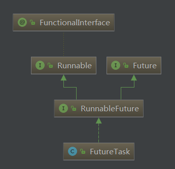
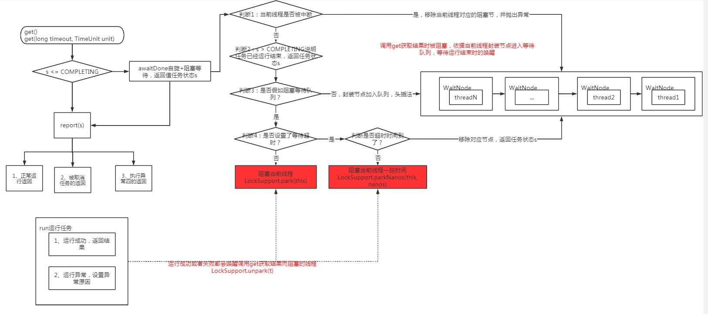

<!-- TOC -->

- [1、Future](#1future)
- [2、RunnableFuture](#2runnablefuture)
- [3、Runnable](#3runnable)
- [4、FutureTask](#4futuretask)
    - [1、属性字段](#1属性字段)
    - [2、构造函数](#2构造函数)
    - [3、get](#3get)
    - [4、awaitDone](#4awaitdone)
    - [5、run()](#5run)
    - [runAndReset()](#runandreset)
    - [handlePossibleCancellationInterrupt处理中断情况](#handlepossiblecancellationinterrupt处理中断情况)
    - [setException设置异常并唤醒阻塞的线程](#setexception设置异常并唤醒阻塞的线程)
    - [finishCompletion()唤醒等待的线程](#finishcompletion唤醒等待的线程)
    - [6、set设置运行结果并唤醒阻塞的线程](#6set设置运行结果并唤醒阻塞的线程)
    - [7、cancel取消任务](#7cancel取消任务)
    - [8、report返回结果](#8report返回结果)

<!-- /TOC -->





问题：如何阻塞的获取运行结果的？




> 总结

当我们通过get获取FutureTask的执行结果时，会基于当前任务执行所处的状态来决定返回值的，首先如果是已经运行完成（可能失败或者成功，失败也算是运行结束了），直接基于状态判断返回结果（这个有三种情况report）。如果还没有运行，则进行一个自旋+阻塞的判断，这里为了能够及时通知不同线程调用get而阻塞，封装了一个等待队列来实现任务完成后进行唤醒。


# 1、Future

```java

public interface Future<V> {

    //尝试曲线执行的任务。如果任务已经完成、已经被取消过的任务、或者不能够被取消的任务则取消失败。
    //如果调用取消的时候任务还没有被执行，则这个任务永远也不会执行了；
    //如果任务处于运行中，则根据参数mayInterruptIfRunning来决定是否中断任务；
    //如果当前方法返回true，则后续的调用isDone和isCancelled则都返回true；（即取消的任务也认为完成了）
    boolean cancel(boolean mayInterruptIfRunning);

    //任务被取消了则返回true
    boolean isCancelled();

    //任务正常执行完成、异常、取消都返回true
    boolean isDone();

    //阻塞等待返回结果
    V get() throws InterruptedException, ExecutionException;

   //阻塞等待指定时间
    V get(long timeout, TimeUnit unit)
        throws InterruptedException, ExecutionException, TimeoutException;
}

```

# 2、RunnableFuture

```java
public interface RunnableFuture<V> extends Runnable, Future<V> {
    void run();
}
```


# 3、Runnable

```java
public interface Runnable {
     public abstract void run();
}
```

# 4、FutureTask


## 1、属性字段

```java
    /**
     * Possible state transitions:
     * NEW -> COMPLETING -> NORMAL
     * NEW -> COMPLETING -> EXCEPTIONAL
     * NEW -> CANCELLED
     * NEW -> INTERRUPTING -> INTERRUPTED
     */
    //任务的运行状态，初始化为NEW。
    private volatile int state;
    private static final int NEW          = 0;
    private static final int COMPLETING   = 1;
    private static final int NORMAL       = 2;
    private static final int EXCEPTIONAL  = 3;
    private static final int CANCELLED    = 4;
    private static final int INTERRUPTING = 5;
    private static final int INTERRUPTED  = 6;

    private Callable<V> callable;//当前要执行的任务封装
    /** The result to return or exception to throw from get() */
    private Object outcome;//返回结果或者一个异常对象
    /** The thread running the callable; CASed during run() */
    private volatile Thread runner;//运行当前任务的线程
    /** Treiber stack of waiting threads */
    private volatile WaitNode waiters;

    // Unsafe mechanics
    private static final sun.misc.Unsafe UNSAFE;
    private static final long stateOffset;//内存中state遍历的偏移量
    private static final long runnerOffset;//runner内存地址
    private static final long waitersOffset;//waiters内存地址
    static {
        try {
            UNSAFE = sun.misc.Unsafe.getUnsafe();
            Class<?> k = FutureTask.class;
            stateOffset = UNSAFE.objectFieldOffset
                (k.getDeclaredField("state"));
            runnerOffset = UNSAFE.objectFieldOffset
                (k.getDeclaredField("runner"));
            waitersOffset = UNSAFE.objectFieldOffset
                (k.getDeclaredField("waiters"));
        } catch (Exception e) {
            throw new Error(e);
        }
    }
    //用于保存调用get而阻塞等待返回结果的线程
    static final class WaitNode {
        volatile Thread thread;//绑定调用的线程
        volatile WaitNode next;
        WaitNode() { thread = Thread.currentThread(); }
    }
```


## 2、构造函数

```java
    public FutureTask(Callable<V> callable) {
        if (callable == null)
            throw new NullPointerException();
        this.callable = callable;
        this.state = NEW;       // ensure visibility of callable
    }

     public FutureTask(Runnable runnable, V result) {
        this.callable = Executors.callable(runnable, result);
        this.state = NEW;       // ensure visibility of callable
    }
```

```java
public class Executors {

 public static <T> Callable<T> callable(Runnable task, T result) {
        if (task == null)
            throw new NullPointerException();
        return new RunnableAdapter<T>(task, result);
}


//内部适配类
static final class RunnableAdapter<T> implements Callable<T> {
        final Runnable task;
        final T result;
        RunnableAdapter(Runnable task, T result) {
            this.task = task;
            this.result = result;
        }
        public T call() {
            task.run();
            return result;
        }
    }

}


```


## 3、get

可以看到分两步：
- 1、看状态是否为完成，大于COMPLETING；
- 2、完成状态时调用report获取结果；


```java
    public V get() throws InterruptedException, ExecutionException {
            int s = state;
            if (s <= COMPLETING) //说明任务还没有执行完成
                s = awaitDone(false, 0L);
            return report(s);
    }

    public V get(long timeout, TimeUnit unit)
        throws InterruptedException, ExecutionException, TimeoutException {
        if (unit == null)
            throw new NullPointerException();
        int s = state;
        if (s <= COMPLETING &&
            (s = awaitDone(true, unit.toNanos(timeout))) <= COMPLETING)//等待指定时间再次判断任务的状态。这里是基于状态来判断是否抛出异常
            throw new TimeoutException();
        return report(s);
    }
```

## 4、awaitDone

```java
    //三种情况返回：
    //1、等待完成
    //2、中断；
    //3、超时
    //timed=true表示设置了超时等待，false则死等
    private int awaitDone(boolean timed, long nanos)
        throws InterruptedException {
        final long deadline = timed ? System.nanoTime() + nanos : 0L;//计算需要等待的最后时间点
        WaitNode q = null;
        boolean queued = false;//标记CAS操作是否成功
        for (;;) {
            if (Thread.interrupted()) {//线程被中断了
                removeWaiter(q);
                throw new InterruptedException();
            }

            int s = state;
            if (s > COMPLETING) {//任务已经运行完成
                if (q != null)
                    q.thread = null;
                return s;
            }
            else if (s == COMPLETING) // cannot time out yet
                Thread.yield();
            else if (q == null)//运行中或者还没有运行走这个分支
                q = new WaitNode();
            else if (!queued)//把当前线程放到等待唤醒队列的列表中
                queued = UNSAFE.compareAndSwapObject(this, waitersOffset,
                                                     q.next = waiters, q);//头插法拼接等待节点q.next = waiters
            else if (timed) {//开启阻塞时间等待
                nanos = deadline - System.nanoTime();
                if (nanos <= 0L) {//时间到了
                    removeWaiter(q);//从等待队列中移除当前线程对应的节点
                    return state;//返回任务当前运行的状态
                }
                LockSupport.parkNanos(this, nanos);//阻塞等待指定时间
            }
            else
                LockSupport.park(this);//阻塞等待
        }
    }


/**
     * Tries to unlink a timed-out or interrupted wait node to avoid
     * accumulating garbage.  Internal nodes are simply unspliced
     * without CAS since it is harmless if they are traversed anyway
     * by releasers.  To avoid effects of unsplicing from already
     * removed nodes, the list is retraversed in case of an apparent
     * race.  This is slow when there are a lot of nodes, but we don't
     * expect lists to be long enough to outweigh higher-overhead
     * schemes.
     */
    private void removeWaiter(WaitNode node) {
        if (node != null) {
            node.thread = null;//等待结果的线程设置为null
            retry:
            for (;;) {          // restart on removeWaiter race
                for (WaitNode pred = null, q = waiters, s; q != null; q = s) {//q=null的时候结束，q为遍历指针，pred为q的前一个节点
                    s = q.next;//等待队列中的下一个
                    if (q.thread != null)//都是有效的等待节点
                        pred = q;
                    else if (pred != null) {//说明q.thread == null，修改指针，跳过这个节点
                        pred.next = s;
                        if (pred.thread == null) // check for race
                            continue retry;
                    }
                    else if (!UNSAFE.compareAndSwapObject(this, waitersOffset,
                                                          q, s))
                        continue retry;
                }
                break;//外层的自旋靠这个跳出
            }
        }
    }

```


## 5、run()

```java
public void run() {
        //执行前检查任务的状态
        if (state != NEW ||
            !UNSAFE.compareAndSwapObject(this, runnerOffset,
                                         null, Thread.currentThread()))//cas标记这个任务被当前线程运行
            return;
        try {
            Callable<V> c = callable;
            if (c != null && state == NEW) {//任务处于初始状态，切不为空
                V result;
                boolean ran;//运行是否有异常标记
                try {
                    result = c.call();
                    ran = true;//运行成功
                } catch (Throwable ex) {
                    result = null;
                    ran = false;//失败了
                    setException(ex);//设置异常state=EXCEPTIONAL
                }
                if (ran)//成功设置返回值
                    set(result);//state=NORMAL
            }
        } finally {
            // runner must be non-null until state is settled to
            // prevent concurrent calls to run()
            runner = null;
            // state must be re-read after nulling runner to prevent
            // leaked interrupts
            int s = state;
            if (s >= INTERRUPTING)
                handlePossibleCancellationInterrupt(s);
        }
    }
```


## runAndReset()

```java
 /**
     * Executes the computation without setting its result, and then
     * resets this future to initial state, failing to do so if the
     * computation encounters an exception or is cancelled.  This is
     * designed for use with tasks that intrinsically execute more
     * than once.
     *
     * @return {@code true} if successfully run and reset
     */
    //这是设计为多次执行的任务，比如ScheduledThreadPoolExecutor执行的周期性调度任务。
    //执行任务不设置返回结果.如果执行的过程中遇到了失败，则重新设置当前的future的状态为初始化状态。
    protected boolean runAndReset() {
        if (state != NEW ||
            !UNSAFE.compareAndSwapObject(this, runnerOffset,
                                         null, Thread.currentThread()))
            return false;
        boolean ran = false;//运行是否有异常标记
        int s = state;
        try {
            Callable<V> c = callable;
            if (c != null && s == NEW) {
                try {
                    c.call(); // don't set result
                    ran = true;//运行成功
                } catch (Throwable ex) {
                    setException(ex);
                }
            }
        } finally {
            // runner must be non-null until state is settled to
            // prevent concurrent calls to run()
            runner = null;
            // state must be re-read after nulling runner to prevent
            // leaked interrupts
            s = state;
            if (s >= INTERRUPTING)
                handlePossibleCancellationInterrupt(s);
        }
        return ran && s == NEW;
    }
```


## handlePossibleCancellationInterrupt处理中断情况

```java
  /**
     * Ensures that any interrupt from a possible cancel(true) is only
     * delivered to a task while in run or runAndReset.
     */
    private void handlePossibleCancellationInterrupt(int s) {
        // It is possible for our interrupter to stall before getting a
        // chance to interrupt us.  Let's spin-wait patiently.
        if (s == INTERRUPTING)
            while (state == INTERRUPTING)
                Thread.yield(); // wait out pending interrupt

        // assert state == INTERRUPTED;

        // We want to clear any interrupt we may have received from
        // cancel(true).  However, it is permissible to use interrupts
        // as an independent mechanism for a task to communicate with
        // its caller, and there is no way to clear only the
        // cancellation interrupt.
        //
        // Thread.interrupted();
    }
```


## setException设置异常并唤醒阻塞的线程

```java
//设置state=COMPLETING--->EXCEPTIONAL
protected void setException(Throwable t) {
        if (UNSAFE.compareAndSwapInt(this, stateOffset, NEW, COMPLETING)) {//设置状态为完成中
            outcome = t;
            UNSAFE.putOrderedInt(this, stateOffset, EXCEPTIONAL); // final state 设置为异常状态
            finishCompletion();
        }
}
```

## finishCompletion()唤醒等待的线程

```java
//唤醒等待的线程
private void finishCompletion() {
        // assert state > COMPLETING;
        for (WaitNode q; (q = waiters) != null;) {//第一层循环主要是保证下面的CAS操作成功进行的自旋
            if (UNSAFE.compareAndSwapObject(this, waitersOffset, q, null)) {//字段设置为null
                for (;;) {
                    Thread t = q.thread;//先判断当前等待节点的线程变量是否为空，不为空的时候才进行唤醒
                    if (t != null) {
                        q.thread = null;
                        LockSupport.unpark(t);//唤醒等待的线程
                    }
                    WaitNode next = q.next;//保存下一个节点
                    if (next == null)
                        break;
                    q.next = null; // unlink to help gc
                    q = next;//遍历下一个节点
                }
                break;
            }
        }

        done();

        callable = null;        // to reduce footprint
    }

protected void done() { }//空实现
```


## 6、set设置运行结果并唤醒阻塞的线程

```java
//标记为正常完成状态NORMAL
protected void set(V v) {
        if (UNSAFE.compareAndSwapInt(this, stateOffset, NEW, COMPLETING)) {
            outcome = v;
            UNSAFE.putOrderedInt(this, stateOffset, NORMAL); // final state
            finishCompletion();//唤醒等待的线程
        }
    }
```


## 7、cancel取消任务

```java

public boolean cancel(boolean mayInterruptIfRunning) {
        if (!(state == NEW &&
              UNSAFE.compareAndSwapInt(this, stateOffset, NEW,
                  mayInterruptIfRunning ? INTERRUPTING : CANCELLED)))
            return false;
        try {    // in case call to interrupt throws exception
            if (mayInterruptIfRunning) {//中断线程
                try {
                    Thread t = runner;
                    if (t != null)
                        t.interrupt();
                } finally { // final state
                    UNSAFE.putOrderedInt(this, stateOffset, INTERRUPTED);
                }
            }
        } finally {
            finishCompletion();
        }
        return true;
    }
```


## 8、report返回结果

```java
private V report(int s) throws ExecutionException {
        Object x = outcome;
        if (s == NORMAL)
            return (V)x;//1、正常情况返回结果
        if (s >= CANCELLED)//2、取消的时候返回结果
            throw new CancellationException();
        throw new ExecutionException((Throwable)x);//3、执行异常的时候返回的结果
    }
```
