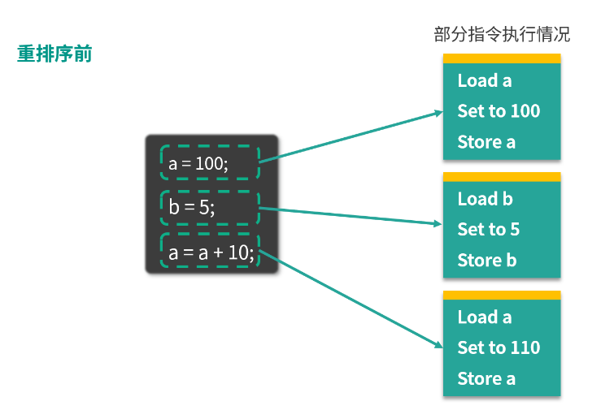
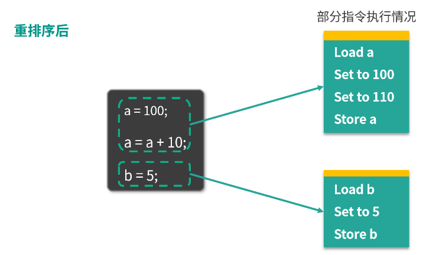
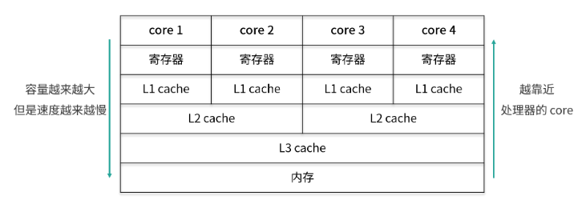
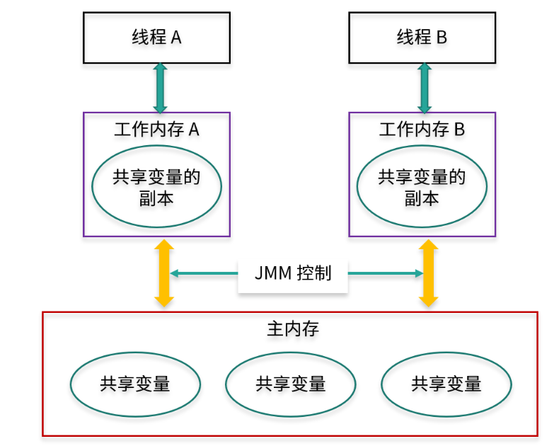

<!-- TOC -->

- [01、什么是 Java 内存模型？](#01什么是-java-内存模型)
    - [1、容易混淆：JVM 内存结构 VS Java 内存模型](#1容易混淆jvm-内存结构 vs-java-内存模型)
    - [2、JVM 内存结构](#2jvm-内存结构)
    - [2、Java 内存模型](#2java-内存模型)
        - [1、从 Java 代码到 CPU 指令](#1从-java-代码到-cpu-指令)
        - [2、为什么需要 JMM（Java Memory Model，Java 内存模型）](#2为什么需要-jmmjava-memory-modeljava-内存模型)
        - [3、JMM 是规范](#3jmm-是规范)
        - [4、JMM 是工具类和关键字的原理](#4jmm-是工具类和关键字的原理)
- [02、什么是指令重排序？为什么要重排序？](#02什么是指令重排序为什么要重排序)
    - [1、什么是重排序](#1什么是重排序)
    - [2、重排序的 3 种情况](#2重排序的-3-种情况)
        - [（1）编译器优化](#1编译器优化)
        - [（2）CPU 重排序](#2cpu-重排序)
        - [（3） 内存的“重排序”](#3 内存的重排序)
- [03、Java 中的原子操作有哪些注意事项？](#03java-中的原子操作有哪些注意事项)
    - [1、Java 中的原子操作有哪些](#1java-中的原子操作有哪些)
    - [2、long 和 double 的原子性](#2long 和 double 的原子性)
- [04、什么是“内存可见性”问题？](#04什么是内存可见性问题)
- [05、主内存和工作内存的关系？](#05主内存和工作内存的关系)
    - [1、CPU 有多级缓存，导致读的数据过期](#1cpu-有多级缓存导致读的数据过期)
    - [2、JMM的抽象：主内存和工作内存](#2jmm的抽象主内存和工作内存)
- [06、什么是 happens-before 规则？](#06什么是-happens-before-规则)
    - [1、单线程规则](#1单线程规则)
    - [2、锁操作规则（synchronized 和 Lock 接口等）](#2锁操作规则synchronized-和-lock-接口等)
    - [3、volatile 变量规则](#3volatile-变量规则)
    - [4、线程启动start规则](#4线程启动start规则)
    - [5、线程 join 规则](#5线程-join-规则)
    - [6、中断规则](#6中断规则)
    - [7、并发工具类的规则](#7并发工具类的规则)
- [07、volatile 的作用是什么？与 synchronized 有什么异同？](#07volatile-的作用是什么与-synchronized-有什么异同)
    - [1、volatile 是什么](#1volatile-是什么)
    - [2、volatile 的适用场合](#2volatile-的适用场合)
        - [1、适用场合1：布尔标记位](#1适用场合1布尔标记位)
        - [2、适用场合 2：作为触发器](#2适用场合-2作为触发器)
    - [3、volatile 的作用（第一点是保证可见性，第二点是禁止重排序）](#3volatile-的作用第一点是保证可见性第二点是禁止重排序)
    - [4、volatile 和 synchronized 的关系](#4volatile-和-synchronized-的关系)
- [08、单例模式的双重检查锁模式为什么必须加 volatile？](#08单例模式的双重检查锁模式为什么必须加-volatile)

<!-- /TOC -->

# 01、什么是 Java 内存模型？

如果你想了解 Java 并发的底层原理，那么 Java 内存模型的知识非常重要，同时也是一个分水岭，可以区分出我们是仅停留在如何使用并发工具，还是能更进一步，知其所以然。

## 1、容易混淆：JVM 内存结构 VS Java 内存模型

Java 作为一种面向对象的语言，有很多概念，从名称上看起来比较相似，比如 JVM 内存结构、Java 内存模型，这是两个截然不同的概念，但是很容易混淆。网络上也有不少讲 Java 内存模型的文章，其实写的是 JVM 内存结构。


所以我们就先从整体上概括一下这两者的主要作用：

- JVM 内存结构和 Java 虚拟机的运行时区域有关；

- Java 内存模型和 Java 的并发编程有关。

所以可以看出，这两个概念其实是有很大区别的。

## 2、JVM 内存结构

我们都知道，Java 代码是要运行在虚拟机上的，而虚拟机在执行 Java 程序的过程中会把所管理的内存划分为若干个不同的数据区域，这些区域都有各自的用途。在《Java 虚拟机规范（Java SE 8）》中描述了 JVM 运行时内存区域结构可分为以下 6 个区。


- 1、堆区（Heap）：堆是存储类实例和数组的，通常是内存中最大的一块。实例很好理解，比如 new Object() 就会生成一个实例；而数组也是保存在堆上面的，因为在 Java 中，数组也是对象。

- 2、虚拟机栈（Java Virtual Machine Stacks）：它保存局部变量和部分结果，并在方法调用和返回中起作用。

- 3、方法区（Method Area）：它存储每个类的结构，例如运行时的常量池、字段和方法数据，以及方法和构造函数的代码，包括用于类初始化以及接口初始化的特殊方法。

- 4、本地方法栈（Native Method Stacks）：与虚拟机栈基本类似，区别在于虚拟机栈为虚拟机执行的 Java 方法服务，而本地方法栈则是为 Native 方法服务。

- 5、程序计数器（The PC Register）：是最小的一块内存区域，它的作用通常是保存当前正在执行的 JVM 指令地址。

- 6、运行时常量池（Run-Time Constant Pool）：是方法区的一部分，包含多种常量，范围从编译时已知的数字到必须在运行时解析的方法和字段引用。

注意，以上是 Java 虚拟机规范，不同的虚拟机实现会各有不同，一般会遵守规范。


这里总结一下，JVM 内存结构是由 Java 虚拟机规范定义的，描述的是在 Java 程序执行过程中，由 JVM 管理的不同数据区域，各个区域有其特定的功能。官方的规范地址： https://docs.oracle.com/javase/specs/jvms/se8/html/jvms-2.html

## 2、Java 内存模型

### 1、从 Java 代码到 CPU 指令

看完了 JVM 内存结构，就让我们回到 Java 内存模型上来。我们都知道，编写的 Java 代码，最终还是要转化为 CPU 指令才能执行的。为了理解 Java 内存模型的作用，我们首先就来回顾一下从 Java 代码到最终执行的 CPU 指令的大致流程：

- 最开始，我们编写的 Java 代码，是 *.java 文件；

- 在编译（包含词法分析、语义分析等步骤）后，在刚才的 *.java 文件之外，会多出一个新的 Java 字节码文件（*.class）；

- JVM 会分析刚才生成的字节码文件（*.class），并根据平台等因素，把字节码文件转化为具体平台上的机器指令；

- 机器指令则可以直接在 CPU 上运行，也就是最终的程序执行。


### 2、为什么需要 JMM（Java Memory Model，Java 内存模型）

在更早期的语言中，其实是不存在内存模型的概念的。

所以程序最终执行的效果会依赖于具体的处理器，而不同的处理器的规则又不一样，不同的处理器之间可能差异很大，因此同样的一段代码，可能在处理器 A 上运行正常，而在处理器 B 上运行的结果却不一致。同理，在没有 JMM 之前，不同的 JVM 的实现，也会带来不一样的“翻译”结果。


所以 Java 非常需要一个标准，来让 Java 开发者、编译器工程师和 JVM 工程师能够达成一致。达成一致后，我们就可以很清楚的知道什么样的代码最终可以达到什么样的运行效果，让多线程运行结果可以预期，这个标准就是 JMM，这就是需要 JMM 的原因。


我们本课时将突破 Java 代码的层次，开始往下钻研，研究从 Java 代码到 CPU 指令的这个转化过程要遵守哪些和并发相关的原则和规范，这就是 JMM 的重点内容。如果不加以规范，那么同样的 Java 代码，完全可能产生不一样的执行效果，那是不可接受的，这也违背了 Java “书写一次、到处运行”的特点。


### 3、JMM 是规范

JMM 是和多线程相关的一组规范，需要各个 JVM 的实现来遵守 JMM 规范，以便于开发者可以利用这些规范，更方便地开发多线程程序。这样一来，即便同一个程序在不同的虚拟机上运行，得到的程序结果也是一致的。

如果没有 JMM 内存模型来规范，那么很可能在经过了不同 JVM 的“翻译”之后，导致在不同的虚拟机上运行的结果不一样，那是很大的问题。


因此，JMM 与处理器、缓存、并发、编译器有关。它解决了 CPU 多级缓存、处理器优化、指令重排等导致的结果不可预期的问题。

### 4、JMM 是工具类和关键字的原理

之前我们使用了各种同步工具和关键字，包括 volatile、synchronized、Lock 等，其实它们的原理都涉及 JMM。正是 JMM 的参与和帮忙，才让各个同步工具和关键字能够发挥作用，帮我们开发出并发安全的程序。


比如我们写了关键字 synchronized，JVM 就会在 JMM 的规则下，“翻译”出合适的指令，包括限制指令之间的顺序，以便在即使发生了重排序的情况下，也能保证必要的“可见性”，这样一来，不同的 JVM 对于相同的代码的执行结果就变得可预期了，我们 Java 程序员就只需要用同步工具和关键字就可以开发出正确的并发程序了，这都要感谢 JMM。


JMM 里最重要 3 点内容，分别是：`重排序、原子性、内存可见性。`


# 02、什么是指令重排序？为什么要重排序？

本课时我们主要介绍什么是重排序？为什么要重排序？

## 1、什么是重排序

假设我们写了一个 Java 程序，包含一系列的语句，我们会默认期望这些语句的实际运行顺序和写的代码顺序一致。但实际上，编译器、JVM 或者 CPU 都有可能出于优化等目的，对于实际指令执行的顺序进行调整，这就是重排序。

你可能感到很困惑，为什么要重排序？这样做有什么好处呢？`重排序的好处：提高处理速度`

我们来举一个具体的例子。




图中左侧是 3 行 Java 代码，右侧是这 3 行代码可能被转化成的指令。可以看出 a = 100 对应的是 Load a、Set to 100、Store a，意味着从主存中读取 a 的值，然后把值设置为 100，并存储回去，同理， b = 5 对应的是下面三行  Load b、Set to 5、Store b，最后的 a = a + 10，对应的是 Load a、Set to 110、Store a。如果你仔细观察，会发现这里有两次“Load a”和两次“Store a”，说明存在一定的重排序的优化空间。

经过重排序之后，情况如下图所示：




重排序后， a 的两次操作被放到一起，指令执行情况变为 Load a、Set to 100、Set to 110、 Store a。下面和 b 相关的指令不变，仍对应 Load b、 Set to 5、Store b。

可以看出，重排序后 a 的相关指令发生了变化，节省了一次 Load a 和一次 Store a。重排序通过减少执行指令，从而提高整体的运行速度，这就是重排序带来的优化和好处。

## 2、重排序的 3 种情况

###（1）编译器优化

编译器（包括 JVM、JIT 编译器等）出于优化的目的，例如当前有了数据 a，把对 a 的操作放到一起效率会更高，避免读取 b 后又返回来重新读取 a 的时间开销，此时在编译的过程中会进行一定程度的重排。不过重排序并不意味着可以任意排序，它需要需要保证重排序后，不改变单线程内的语义，否则如果能任意排序的话，程序早就逻辑混乱了。


### （2）CPU 重排序

CPU 同样会有优化行为，这里的优化和编译器优化类似，都是通过乱序执行的技术来提高整体的执行效率。所以即使之前编译器不发生重排，CPU 也可能进行重排，我们在开发中，一定要考虑到重排序带来的后果。


### （3） 内存的“重排序”

内存系统内不存在真正的重排序，但是内存会带来看上去和重排序一样的效果，所以这里的“重排序”打了双引号。由于内存有缓存的存在，在 JMM 里表现为主存和本地内存，而主存和本地内存的内容可能不一致，所以这也会导致程序表现出乱序的行为。


举个例子，线程 1 修改了 a 的值，但是修改后没有来得及把新结果写回主存或者线程 2 没来得及读到最新的值，所以线程 2 看不到刚才线程 1 对 a 的修改，此时线程 2 看到的 a 还是等于初始值。但是线程 2 却可能看到线程 1 修改 a 之后的代码执行效果，表面上看起来像是发生了重顺序。
 


# 03、Java 中的原子操作有哪些注意事项？


## 1、Java 中的原子操作有哪些

Java 中的以下几种操作是具备原子性的，属于原子操作：

- 除了 long 和 double 之外的基本类型（int、byte、boolean、short、char、float）的读/写操作，都天然的具备原子性；

- 所有引用 reference 的读/写操作；

- 加了 volatile 后，所有变量的读/写操作（包含 long 和 double）。这也就意味着 long 和 double 加了 volatile 关键字之后，对它们的读写操作同样具备原子性；

- 在 java.concurrent.Atomic 包中的一部分类的一部分方法是具备原子性的，比如 AtomicInteger 的 incrementAndGet 方法。

## 2、long 和 double 的原子性

在前面，我们讲述了 long 和 double 和其他的基本类型不太一样，好像不具备原子性，这是什么原因造成的呢？ 官方文档对于上述问题的描述，如下所示：

 

Non-Atomic Treatment of double and long

For the purposes of the Java programming language memory model, a single write to a non-volatile long or double value is treated as two separate writes: one to each 32-bit half. This can result in a situation where a thread sees the first 32 bits of a 64-bit value from one write, and the second 32 bits from another write.

Writes and reads of volatile long and double values are always atomic.

Writes to and reads of references are always atomic, regardless of whether they are implemented as 32-bit or 64-bit values.

Some implementations may find it convenient to divide a single write action on a 64-bit long or double value into two write actions on adjacent 32-bit values. For efficiency's sake, this behavior is implementation-specific; an implementation of the Java Virtual Machine is free to perform writes to long and double values atomically or in two parts.

Implementations of the Java Virtual Machine are encouraged to avoid splitting 64-bit values where possible. Programmers are encouraged to declare shared 64-bit values as volatile or synchronize their programs correctly to avoid possible complications.


从刚才的 JVM 规范中我们可以知道，long 和 double 的值需要占用 64 位的内存空间，而对于 64 位值的写入，可以分为两个 32 位的操作来进行。这样一来，本来是一个整体的赋值操作，就可能被拆分为低 32 位和高 32 位的两个操作。如果在这两个操作之间发生了其他线程对这个值的读操作，就可能会读到一个错误、不完整的值。


JVM 的开发者可以自由选择是否把 64 位的 long 和 double 的读写操作作为原子操作去实现，并且规范推荐 JVM 将其实现为原子操作。当然，JVM 的开发者也有权利不这么做，这同样是符合规范的。

规范同样规定，如果使用 volatile 修饰了 long 和 double，那么其读写操作就必须具备原子性了。同时，规范鼓励程序员使用 volatile 关键字对这个问题加以控制，由于规范规定了对于 volatile long 和 volatile double 而言，JVM 必须保证其读写操作的原子性，所以加了 volatile 之后，对于程序员而言，就可以确保程序正确。

> 实际开发中

此时，你可能会有疑问，比如，如果之前对于上述问题不是很了解，在开发过程中没有给 long 和 double 加 volatile，好像也没有出现过问题？而且，在以后的开发过程中，是不是必须给 long 和 double 加 volatile 才是安全的？

其实在实际开发中，读取到“半个变量”的情况非常罕见，这个情况在目前主流的 Java 虚拟机中不会出现。因为 JVM 规范虽然不强制虚拟机把 long 和 double 的变量写操作实现为原子操作，但它其实是“强烈建议”虚拟机去把该操作作为原子操作来实现的。


而在目前各种平台下的主流虚拟机的实现中，几乎都会把 64 位数据的读写操作作为原子操作来对待，因此我们在编写代码时一般不需要为了避免读到“半个变量”而把 long 和 double 声明为 volatile 的。

原子操作 + 原子操作 != 原子操作

值得注意的是，简单地把原子操作组合在一起，并不能保证整体依然具备原子性。比如连续转账两次的操作行为，显然不能合并当做一个原子操作，虽然每一次转账操作都是具备原子性的，但是将两次转账合为一次的操作，这个组合就不具备原子性了，因为在两次转账之间可能会插入一些其他的操作，例如系统自动扣费等，导致第二次转账失败，而且第二次转账失败并不会影响第一次转账成功。


# 04、什么是“内存可见性”问题？

我们先从两个案例来入手，看一看什么是可见性问题。

> 案例一

我们来看看下面的代码，有一个变量 x，它是 int 类型的，如下所示：

```java
public class Visibility {

    int x = 0;

    public void write() {
        x = 1;
    }

    public void read() {
        int y = x;
    }
}
```

这是一段很简单的代码，类中有两个方法：

write 方法，作用是给 x 赋值，代码中，把 x 赋值为 1，由于 x 的初始值是 0，所以执行 write 方法相当于改变了 x 的值；
read 方法，作用是把 x 读取出来，读取的时候我们用了一个新的 int 类型变量的 y 来接收 x 的值。

我们假设有两个线程来执行上述代码，第 1 个线程执行的是 write 方法，第 2 个线程执行的是 read 方法。下面我们来分析一下，代码在实际运行过程中的情景是怎么样的，由于 x 的初始值为 0，所以对于左边的第 1 个线程和右边的第 2 个线程而言，它们都可以从主内存中去获取到这个信息，对两个线程来说 x 都是 0。可是此时我们假设第 1 个线程先去执行 write 方法，它就把 x 的值从 0 改为了 1，但是它改动的动作并不是直接发生在主内存中的，而是会发生在第 1 个线程的工作内存中。


那么，假设线程 1 的工作内存还未同步给主内存，此时假设线程 2 开始读取，那么它读到的 x 值不是 1，而是 0，也就是说虽然此时线程 1 已经把 x 的值改动了，但是对于第 2 个线程而言，根本感知不到 x 的这个变化，这就产生了可见性问题。

> 案例二

下面我们再来看一个案例。在如下所示的代码中，有两个变量 a 和 b， 并且把它们赋初始值为 10 和 20。

```java
public class VisibilityProblem {//演示可见性带来的问题

    int a = 10;
    int b = 20;

    private void change() {
        a = 30;
        b = a;
    }


    private void print() {
        System.out.println("b=" + b + ";a=" + a);
    }

    public static void main(String[] args) {
        while (true) {
            VisibilityProblem problem = new VisibilityProblem();
            new Thread(new Runnable() {
                @Override
                public void run() {
                    try {
                        Thread.sleep(1);
                    } catch (InterruptedException e) {
                        e.printStackTrace();
                    }
                    problem.change();//改变
                }
            }).start();

            new Thread(new Runnable() {
                @Override
                public void run() {
                    try {
                        Thread.sleep(1);
                    } catch (InterruptedException e) {
                        e.printStackTrace();
                    }
                    problem.print();//读取
                }
            }).start();
        }
    }
}
```

在类中，有两个方法：
- change 方法，把 a 改成 30，然后把 b 赋值为 a 的值；
- print 方法，先打印出 b 的值，然后再打印出 a 的值。

接下来我们来看一下 main 函数，在 main 函数中同样非常简单。首先有一个 while 的死循环，在这个循环中，我们新建两个线程，并且让它们先休眠一毫秒，然后再分别去执行 change 方法和 print 方法。休眠一毫秒的目的是让它们执行这两个方法的时间，尽可能的去靠近。

下面我们运行这段代码并分析一下可能出现的情况。

- 第 1 种情况：是最普通的情况了。假设第 1 个线程，也就是执行 change 的线程先运行，并且运行完毕了，然后第 2 个线程开始运行，那么第 2 个线程自然会打印出 b = 30;a = 30 的结果。

- 第 2 种情况：与第 1 种情况相反。因为线程先 start，并不代表它真的先执行，所以第 2 种情况是第 2 个线程先打印，然后第 1 个线程再去进行 change，那么此时打印出来的就是 a 和 b 的初始值，打印结果为 b = 20;a = 10。

- 第 3 种情况：它们几乎同时运行，所以会出现交叉的情况。比如说当第 1 个线程的 change 执行到一半，已经把 a 的值改为 30 了，而 b 的值还未来得及修改，此时第 2 个线程就开始打印了，所以此时打印出来的 b 还是原始值 20，而 a 已经变为了 30， 即打印结果为 b = 20;a = 30。

这些都很好理解，但是有一种情况不是特别容易理解，那就是打印结果为 b = 30;a = 10，我们来想一下，为什么会发生这种情况？

首先打印出来的是 b = 30，这意味着 b 的值被改变了，也就是说 b = a 这个语句已经执行了；如果 b = a 要想执行，那么前面 a = 30 也需要执行，此时 b 才能等于 a 的值，也就是 30；这也就意味着 change 方法已经执行完毕了。可是在这种情况下再打印 a，结果应该是 a = 30，而不应该打印出 a = 10。因为在刚才 change 执行的过程中，a 的值已经被改成 30 了，不再是初始值的 10。所以，如果出现了打印结果为 b = 30;a = 10 这种情况，就意味着发生了可见性问题：a 的值已经被第 1 个线程修改了，但是其他线程却看不到，由于 a 的最新值却没能及时同步过来，所以才会打印出 a 的旧值。发生上述情况的几率不高


> 解决问题

那么我们应该如何避免可见性问题呢？在案例一中，我们可以使用 volatile 来解决问题，我们在原来的代码的基础上给 x 变量加上 volatile 修饰，其他的代码不变。加了 volatile 关键字之后，只要第 1 个线程修改完了 x 的值，那么当第 2 个线程想读取 x 的时候，它一定可以读取到 x 的最新的值，而不可能读取到旧值。

同理，我们也可以用 volatile 关键字来解决案例二的问题，如果我们给 a 和 b 加了 volatile 关键字后，无论运行多长时间，也不会出现 b = 30;a = 10 的情况，这是因为 volatile 保证了只要 a 和 b 的值发生了变化，那么读取的线程一定能感知到。

> 能够保证可见性的措施

除了 volatile 关键字可以让变量保证可见性外，synchronized、Lock、并发集合等一系列工具都可以在一定程度上保证可见性.

> synchronized 不仅保证了原子性，还保证了可见性

下面我们再来分析一下之前所使用过的 synchronized 关键字，在理解了可见性问题之后，相信你对 synchronized 的理解会更加深入。

关于 synchronized 这里有一个特别值得说的点，我们之前可能一致认为，使用了 synchronized 之后，它会设立一个临界区，这样在一个线程操作临界区内的数据的时候，另一个线程无法进来同时操作，所以保证了线程安全。

其实这是不全面的，这种说法没有考虑到可见性问题，完整的说法是：synchronized 不仅保证了临界区内最多同时只有一个线程执行操作，同时还保证了在前一个线程释放锁之后，之前所做的所有修改，都能被获得同一个锁的下一个线程所看到，也就是能读取到最新的值。因为如果其他线程看不到之前所做的修改，依然也会发生线程安全问题。
 

# 05、主内存和工作内存的关系？


## 1、CPU 有多级缓存，导致读的数据过期

由于 CPU 的处理速度很快，相比之下，内存的速度就显得很慢，所以为了提高 CPU 的整体运行效率，减少空闲时间，在 CPU 和内存之间会有 cache 层，也就是缓存层的存在。虽然缓存的容量比内存小，但是缓存的速度却比内存的速度要快得多，其中 L1 缓存的速度仅次于寄存器的速度。结构示意图如下所示：



在图中，从下往上分别是内存，L3 缓存、L2 缓存、L1 缓存，寄存器，然后最上层是 CPU 的 4个核心。从内存，到 L3 缓存，再到 L2 和 L1 缓存，它们距离 CPU 的核心越来越近了，越靠近核心，其容量就越小，但是速度也越快。正是架由于缓存层的存在，才让我们的 CPU 能发挥出更好的性能。

其实，线程间对于共享变量的可见性问题，并不是直接由多核引起的，而是由我们刚才讲到的这些 L3 缓存、L2 缓存、L1 缓存，也就是多级缓存引起的：每个核心在获取数据时，都会将数据从内存一层层往上读取，同样，后续对于数据的修改也是先写入到自己的 L1 缓存中，然后等待时机再逐层往下同步，直到最终刷回内存。

假设 core 1 修改了变量 a 的值，并写入到了 core 1 的 L1 缓存里，但是还没来得及继续往下同步，由于 core 1 有它自己的的 L1 缓存，core 4 是无法直接读取 core 1 的 L1 缓存的值的，那么此时对于 core 4 而言，变量 a 的值就不是 core 1 修改后的最新的值，core 4 读取到的值可能是一个过期的值，从而引起多线程时可见性问题的发生。

## 2、JMM的抽象：主内存和工作内存

什么是主内存和工作内存？

Java 作为高级语言，屏蔽了 L1 缓存、L2 缓存、L3 缓存，也就是多层缓存的这些底层细节，用 JMM 定义了一套读写数据的规范。我们不再需要关心 L1 缓存、L2 缓存、L3 缓存等多层缓存的问题，我们只需要关心 JMM 抽象出来的主内存和工作内存的概念。为了更方便你去理解，可参考下图：



每个线程只能够直接接触到工作内存，无法直接操作主内存，而工作内存中所保存的正是主内存的共享变量的副本，主内存和工作内存之间的通信是由 JMM 控制的。

主内存和工作内存的关系，JMM 有以下规定：

（1）所有的变量都存储在主内存中，同时每个线程拥有自己独立的工作内存，而工作内存中的变量的内容是主内存中该变量的拷贝；

（2）线程不能直接读 / 写主内存中的变量，但可以操作自己工作内存中的变量，然后再同步到主内存中，这样，其他线程就可以看到本次修改；

（3） 主内存是由多个线程所共享的，但线程间不共享各自的工作内存，如果线程间需要通信，则必须借助主内存中转来完成。

听到这里，你对上图的理解可能会更深刻一些，从图中可以看出，每个工作内存中的变量都是对主内存变量的一个拷贝，相当于是一个副本。而且图中没有一条线是可以直接连接各个工作内存的，因为工作内存之间的通信，都需要通过主内存来中转。

正是由于所有的共享变量都存在于主内存中，每个线程有自己的工作内存，其中存储的是变量的副本，所以这个副本就有可能是过期的，我们来举个例子：如果一个变量 x 被线程 A 修改了，只要还没同步到主内存中，线程 B 就看不到，所以此时线程 B 读取到的 x 值就是一个过期的值，这就导致了可见性问题。


# 06、什么是 happens-before 规则？


Happens-before 关系是用来描述和可见性相关问题的：如果第一个操作 happens-before 第二个操作（也可以描述为，第一个操作和第二个操作之间满足 happens-before 关系），那么我们就说第一个操作对于第二个操作一定是可见的，也就是第二个操作在执行时就一定能保证看见第一个操作执行的结果。

> 不具备 happens-before 关系的例子

我们先来举一个不具备 happens-before 关系的例子，从宏观上进一步理解 happens-before 关系想要表达的内容。我们来看看下面的代码：

```java
public class Visibility {

    int x = 0;

    public void write() {
        x = 1;
    }

    public void read() {
        int y = x;
    }
}
```

代码很简单，类里面有一个 int x 变量 ，初始值为 0，而 write 方法的作用是把 x 的值改写为 1， 而 read 方法的作用则是读取 x 的值。

如果有两个线程，分别执行 write 和 read 方法，那么由于这两个线程之间没有相互配合的机制，所以 write 和 read 方法内的代码不具备 happens-before 关系，其中的变量的可见性无法保证，下面我们用例子说明这个情况。

比如，假设线程 1 已经先执行了 write 方法，修改了共享变量 x 的值，然后线程 2 执行 read 方法去读取 x 的值，此时我们并不能确定线程 2 现在是否能读取到之前线程 1 对 x 所做的修改，线程 2 有可能看到这次修改，所以读到的 x 值是 1，也有可能看不到本次修改，所以读到的 x 值是最初始的 0。既然存在不确定性，那么 write 和 read 方法内的代码就不具备 happens-before 关系。相反，如果第一个操作 happens-before 第二个操作，那么第一个操作对于第二个操作而言一定是可见的。

下面我们来看一下 happens-before 关系包含哪些具体的规则 。

Happens-before 关系的规则有哪些？

如果分别有操作 x 和操作 y，用 hb(x, y) 来表示 x happens-before y。

## 1、单线程规则

在一个单独的线程中，按照程序代码的顺序，先执行的操作 happen-before 后执行的操作。也就是说，如果操作 x 和操作 y 是同一个线程内的两个操作，并且在代码里 x 先于 y 出现，那么有 hb(x, y)。这一个 happens-before 的规则非常重要，因为如果对于同一个线程内部而言，后面语句都不能保证可以看见前面的语句的执行结果的话，那会造成非常严重的后果，程序的逻辑性就无法保证了。

这里有一个注意点，我们之前讲过重排序，那是不是意味着 happens-before 关系的规则和重排序冲突，为了满足 happens-before 关系，就不能重排序了？

答案是否定的。其实只要重排序后的结果依然符合 happens-before 关系，也就是能保证可见性的话，那么就不会因此限制重排序的发生。比如，单线程内，语句 1 在语句 2 的前面，所以根据“单线程规则”，语句 1 happens-before 语句 2，但是并不是说语句 1 一定要在语句 2 之前被执行，例如语句 1 修改的是变量 a 的值，而语句 2 的内容和变量 a 无关，那么语句 1 和语句 2 依然有可能被重排序。当然，如果语句 1 修改的是变量 a，而语句 2 正好是去读取变量 a 的值，那么语句 1 就一定会在语句 2 之前执行了。

## 2、锁操作规则（synchronized 和 Lock 接口等）

如果操作 A 是解锁，而操作 B 是对同一个锁的加锁，那么 hb(A, B) 。有线程 A 和线程 B 这两个线程。线程 A 在解锁之前的所有操作，对于线程 B 的对同一个锁的加锁之后的所有操作而言，都是可见的。这就是锁操作的 happens-before 关系的规则。

## 3、volatile 变量规则

对一个 volatile 变量的写操作 happen-before 后面对该变量的读操作。

这就代表了如果变量被 volatile 修饰，那么每次修改之后，其他线程在读取这个变量的时候一定能读取到该变量最新的值。我们之前介绍过 volatile 关键字，知道它能保证可见性，而这正是由本条规则所规定的。

## 4、线程启动start规则

Thread 对象的 start 方法 happen-before 此线程 run 方法中的每一个操作。线程 A 启动了一个子线程 B，那么子线程 B 在执行 run 方法里面的语句的时候，它一定能看到父线程在执行 threadB.start() 前的所有操作的结果。

## 5、线程 join 规则

我们知道 join 可以让线程之间等待，假设线程 A 通过调用 threadB.start() 启动了一个新线程 B，然后调用 threadB.join() ，那么线程 A 将一直等待到线程 B 的 run 方法结束（不考虑中断等特殊情况），然后 join 方法才返回。在 join 方法返回后，线程 A 中的所有后续操作都可以看到线程 B 的 run 方法中执行的所有操作的结果，也就是线程 B 的 run 方法里面的操作 happens-before 线程 A 的 join 之后的语句。


## 6、中断规则

对线程 interrupt 方法的调用 happens-before 检测该线程的中断事件。

也就是说，如果一个线程被其他线程 interrupt，那么在检测中断时（比如调用 Thread.interrupted 或者 Thread.isInterrupted 方法）一定能看到此次中断的发生，不会发生检测结果不准的情况。

## 7、并发工具类的规则

- 1、线程安全的并发容器（如 ConcurrentHashMap）在 get 某个值时一定能看到在此之前发生的 put 等存入操作的结果。也就是说，线程安全的并发容器的存入操作 happens-before 读取操作。

- 2、信号量（Semaphore）它会释放许可证，也会获取许可证。这里的释放许可证的操作 happens-before 获取许可证的操作，也就是说，如果在获取许可证之前有释放许可证的操作，那么在获取时一定可以看到。

- 3、Future：Future 有一个 get 方法，可以用来获取任务的结果。那么，当 Future 的 get 方法得到结果的时候，一定可以看到之前任务中所有操作的结果，也就是说 Future 任务中的所有操作 happens-before Future 的 get 操作。

- 4、线程池：要想利用线程池，就需要往里面提交任务（Runnable 或者 Callable），这里面也有一个 happens-before 关系的规则，那就是提交任务的操作 happens-before 任务的执行。

> 总结

需要重点记忆的有：锁操作的 happens-before 规则和 volatile 的 happens-before 规则，因为它们与 synchronized 和 volatile 的使用都有着紧密的联系。而线程启动、线程 join、线程中断以及并发工具类的 happens-before 规则你可以不做重点了解，因为通常情况下，这些规则都会默认被当作已知条件去使用的。
 


# 07、volatile 的作用是什么？与 synchronized 有什么异同？


## 1、volatile 是什么

首先我们就来介绍一下 volatile，它是 Java 中的一个关键字，是一种同步机制。当某个变量是共享变量，且这个变量是被 volatile 修饰的，那么在修改了这个变量的值之后，再读取该变量的值时，可以保证获取到的是修改后的最新的值，而不是过期的值。

相比于 synchronized 或者 Lock，volatile 是更轻量的，因为使用 volatile 不会发生上下文切换等开销很大的情况，不会让线程阻塞。但正是由于它的开销相对比较小，所以它的效果，也就是能力，相对也小一些。

虽然说 volatile 是用来保证线程安全的，但是它做不到像 synchronized 那样的同步保护，volatile 仅在很有限的场景中才能发挥作用，所以下面就让我们来看一下它的适用场景，我们会先给出不适合使用 volatile 的场景，再给出两种适合使用 volatile 的场景。

## 2、volatile 的适用场合

不适用：a++

首先我们就来看一下不适合使用 volatile 的场景，volatile 不适合运用于需要保证原子性的场景，比如更新的时候需要依赖原来的值，而最典型的就是 a++ 的场景，我们仅靠 volatile 是不能保证 a++ 的线程安全的。代码如下所示：

```java
public class DontVolatile implements Runnable {

    volatile int a;
    AtomicInteger realA = new AtomicInteger();

    public static void main(String[] args) throws InterruptedException {
        Runnable r =  new DontVolatile();
        Thread thread1 = new Thread(r);
        Thread thread2 = new Thread(r);
        thread1.start();
        thread2.start();
        thread1.join();
        thread2.join();
        System.out.println(((DontVolatile) r).a);
        System.out.println(((DontVolatile) r).realA.get());
    }
    @Override
    public void run() {
        for (int i = 0; i < 1000; i++) {
            a++;
            realA.incrementAndGet();
        }
    }
}
```

在这段代码中，我们有一个 volatile 修饰的 int 类型的 a 变量，并且下面还有一个原子类的 realA，原子类是可以保证线程安全的，所以我们就用它来和 volatile int a 做对比，看一看它们实际效果上的差别。

在 main 函数中，我们新建了两个线程，并且让它们运行。这两个线程运行的内容就是去执行 1000 次的累加操作，每次累加操作会对 volatile 修饰的变量 a 进行自加操作，同时还会对原子类 realA 进行自加操作。当这两个线程都运行完毕之后，我们把结果给打印出来，其中一种运行结果如下：

1988

2000

会发现最终的 a 值和 realA 值分别为 1988 和 2000。可以看出，即便变量 a 被 volatile 修饰了，即便它最终一共执行了 2000 次的自加操作（这一点可以由原子类的最终值来印证），但是依然有一些自加操作失效了，所以最终它的结果是不到 2000 的，这就证明了 volatile 不能保证原子性，那么它究竟适合运用于什么场景呢？

### 1、适用场合1：布尔标记位

如果某个共享变量自始至终只是被各个线程所赋值或读取，而没有其他的操作（比如读取并在此基础上进行修改这样的复合操作）的话，那么我们就可以使用 volatile 来代替 synchronized 或者代替原子类，因为赋值操作自身是具有原子性的，volatile 同时又保证了可见性，这就足以保证线程安全了。

一个比较典型的场景就是布尔标记位的场景，例如 volatile boolean flag。因为通常情况下，boolean 类型的标记位是会被直接赋值的，此时不会存在复合操作（如 a++），只存在单一操作，就是去改变 flag 的值，而一旦 flag 被 volatile 修饰之后，就可以保证可见性了，那么这个 flag 就可以当作一个标记位，此时它的值一旦发生变化，所有线程都可以立刻看到，所以这里就很适合运用 volatile 了。

我们来看一下代码示例：

```java
public class YesVolatile1 implements Runnable {

    volatile boolean done = false;
    AtomicInteger realA = new AtomicInteger();

    public static void main(String[] args) throws InterruptedException {
        Runnable r =  new YesVolatile1();
        Thread thread1 = new Thread(r);
        Thread thread2 = new Thread(r);
        thread1.start();
        thread2.start();
        thread1.join();
        thread2.join();
        System.out.println(((YesVolatile1) r).done);
        System.out.println(((YesVolatile1) r).realA.get());
    }
    @Override
    public void run() {
        for (int i = 0; i < 1000; i++) {
            setDone();
            realA.incrementAndGet();
        }
    }

    private void setDone() {
        done = true;
    }
}
```

这段代码和前一段代码非常相似，唯一不同之处在于，我们把 volatile int a 改成了 volatile boolean done，并且在 1000 次循环的操作过程中调用的是 setDone() 方法，而这个 setDone() 方法就是把 done 这个变量设置为 true，而不是根据它原来的值再做判断，例如原来是 false，就设置成 true，或者原来是 true，就设置成 false，这些复杂的判断是没有的，setDone() 方法直接就把变量 done 的值设置为 true。那么这段代码最终运行的结果如下：

true

2000

无论运行多少次，控制台都会打印出 true 和 2000，打印出的 2000 已经印证出确实是执行了 2000 次操作，而最终的 true 结果证明了，在这种场景下，volatile 起到了保证线程安全的作用。

第二个例子区别于第一个例子最大的不同点就在于，第一个例子的操作是 a++，这是个复合操作，不具备原子性，而在本例中的操作仅仅是把 done 设置为 true，这样的赋值操作本身就是具备原子性的，所以在这个例子中，它是适合运用 volatile 的。

### 2、适用场合 2：作为触发器

那么下面我们再来看第二个适合用 volatile 的场景：作为触发器，保证其他变量的可见性。

下面是 Brian Goetz 提供的一个经典例子：

```java
Map configOptions;
char[] configText;
volatile boolean initialized = false;
 
. . .
 
// In thread A
 
configOptions = new HashMap();
configText = readConfigFile(fileName);
processConfigOptions(configText, configOptions);
initialized = true;
 
. . .
 
// In thread B
 
while (!initialized) 
  sleep();
// use configOptions
```

在这段代码中可以看到，我们有一个 map 叫作 configOptions，还有一个 char 数组叫作 configText，然后会有一个被 volatile 修饰的 boolean initialized，最开始等于 false。再下面的这四行代码是由线程 A 所执行的，它所做的事情就是初始化 configOptions，再初始化 configText，再把这两个值放到一个方法中去执行，实际上这些都代表了初始化的行为。那么一旦这些方法执行完毕之后，就代表初始化工作完成了，线程 A 就会把 initialized 这个变量设置为 true。

而对于线程 B 而言，它一开始会在 while 循环中反复执行 sleep 方法（例如休眠一段时间），直到 initialized 这个变量变成 true，线程 B 才会跳过 sleep 方法，继续往下执行。重点来了，一旦 initialized 变成了 true，此时对于线程 B 而言，它就会立刻使用这个 configOptions，所以这就要求此时的 configOptions 是初始化完毕的，且初始化的操作的结果必须对线程 B 可见，否则线程 B 在执行的时候就可能报错。

你可能会担心，因为这个 configOptions 是在线程 A 中修改的，那么在线程 B 中读取的时候，会不会发生可见性问题，会不会读取的不是初始化完毕后的值？如果我们不使用 volatile，那么确实是存在这个问题的。

但是现在我们用了被 volatile 修饰的 initialized 作为触发器，所以这个问题被解决了。根据happens-before 关系的单线程规则，线程 A 中 configOptions 的初始化 happens-before 对 initialized 变量的写入，而线程 B 中对 initialzed 的读取 happens-before 对 configOptions 变量的使用，同时根据 happens-before 关系的 volatile 规则，线程 A 中对 initialized 的写入为 true 的操作 happens-before 线程 B 中随后对 initialized 变量的读取。

如果我们分别有操作 A 和操作 B，我们用 hb(A, B) 来表示 A happens-before B。而 Happens-before 是有可传递性质的，如果hb(A, B)，且hb(B, C)，那么可以推出hb(A, C)。所以根据上面的条件，我们可以得出结论：线程 A 中对于 configOptions 的初始化 happens-before 线程 B 中 对于 configOptions 的使用。所以对于线程 B 而言，既然它已经看到了 initialized 最新的值，那么它同样就能看到包括 configOptions 在内的这些变量初始化后的状态，所以此时线程 B 使用 configOptions 是线程安全的。这种用法就是把被 volatile 修饰的变量作为触发器来使用，保证其他变量的可见性，这种用法也是非常值得掌握的，可以作为面试时的亮点。

## 3、volatile 的作用（第一点是保证可见性，第二点是禁止重排序）

上面我们分析了两种非常典型的用法，那么就来总结一下 volatile 的作用，它一共有两层作用。

- 第一层的作用是保证可见性。Happens-before 关系中对于 volatile 是这样描述的：对一个 volatile 变量的写操作 happen-before 后面对该变量的读操作。

这就代表了如果变量被 volatile 修饰，那么每次修改之后，接下来在读取这个变量的时候一定能读取到该变量最新的值。

- 第二层的作用就是禁止重排序。先介绍一下 as-if-serial语义：不管怎么重排序，（单线程）程序的执行结果不会改变。在满足 as-if-serial 语义的前提下，由于编译器或 CPU 的优化，代码的实际执行顺序可能与我们编写的顺序是不同的，这在单线程的情况下是没问题的，但是一旦引入多线程，这种乱序就可能会导致严重的线程安全问题。用了 volatile 关键字就可以在一定程度上禁止这种重排序。

##4、volatile 和 synchronized 的关系

- 相似性：volatile 可以看作是一个轻量版的 synchronized，比如一个共享变量如果自始至终只被各个线程赋值和读取，而没有其他操作的话，那么就可以用 volatile 来代替 synchronized 或者代替原子变量，足以保证线程安全。实际上，对 volatile 字段的每次读取或写入都类似于“半同步”——读取 volatile 与获取 synchronized 锁有相同的内存语义，而写入 volatile 与释放 synchronized 锁具有相同的语义。

- 不可代替：但是在更多的情况下，volatile 是不能代替 synchronized 的，volatile 并没有提供原子性和互斥性。

- 性能方面：volatile 属性的读写操作都是无锁的，正是因为无锁，所以不需要花费时间在获取锁和释放锁上，所以说它是高性能的，比 synchronized 性能更好。


# 08、单例模式的双重检查锁模式为什么必须加 volatile？


单例模式指的是，保证一个类只有一个实例，并且提供一个可以全局访问的入口。


那么我们为什么需要单例呢？其中**一个理由，那就是为了节省内存、节省计算。**因为在很多情况下，我们只需要一个实例就够了，如果出现更多的实例，反而纯属浪费。

下面我们举一个例子来说明这个情况，以一个初始化比较耗时的类来说，代码如下所示：

```java
public class ExpensiveResource {
    public ExpensiveResource() {
        field1 = // 查询数据库
        field2 = // 然后对查到的数据做大量计算
        field3 = // 加密、压缩等耗时操作
    }
}
```

这个类在构造的时候，需要查询数据库并对查到的数据做大量计算，所以在第一次构造时，我们花了很多时间来初始化这个对象。但是假设数据库里的数据是不变的，我们就可以把这个对象保存在内存中，那么以后开发的时候就可以直接用这同一个实例了，不需要再次构建新实例。如果每次都重新生成新的实例，则会造成更多的浪费，实在没有必要。

接下来看看需要单例的第二个理由，那就是为了保证结果的正确。

比如我们需要一个全局的计数器，用来统计人数，如果有多个实例，反而会造成混乱。

另外呢，就是为了方便管理。很多工具类，我们只需要一个实例，那么我们通过统一的入口，比如通过 getInstance 方法去获取这个单例是很方便的，太多实例不但没有帮助，反而会让人眼花缭乱。

一般单例模式的类结构：有一个私有的 Singleton 类型的 singleton 对象；同时构造方法也是私有的，为了防止他人调用构造函数来生成实例；另外还会有一个 public 的 getInstance 方法，可通过这个方法获取到单例。


> 双重检查锁模式的写法

单例模式有多种写法，我们重点介绍一下和 volatile 强相关的双重检查锁模式的写法，代码如下所示：

```java
public class Singleton {

    private static volatile Singleton singleton;

    private Singleton() {
    }

    public static Singleton getInstance() {
        if (singleton == null) {
            synchronized (Singleton.class) {
                if (singleton == null) {
                    singleton = new Singleton();
                }
            }
        }
        return singleton;
    }
}
```

在这里我将重点讲解 getInstance 方法，方法中首先进行了一次 if (singleton == null) 的检查，然后是 synchronized 同步块，然后又是一次 if (singleton == null) 的检查，最后是 singleton = new Singleton() 来生成实例。

我们进行了两次 if (singleton == null) 检查，这就是“双重检查锁”这个名字的由来。这种写法是可以保证线程安全的，假设有两个线程同时到达 synchronized 语句块，那么实例化代码只会由其中先抢到锁的线程执行一次，而后抢到锁的线程会在第二个 if 判断中发现 singleton 不为 null，所以跳过创建实例的语句。再后面的其他线程再来调用 getInstance 方法时，只需判断第一次的 if (singleton == null) ，然后会跳过整个 if 块，直接 return 实例化后的对象。

这种写法的优点是不仅线程安全，而且延迟加载、效率也更高。

讲到这里就涉及到了一个常见的问题，面试官可能会问你，“为什么要 double-check？去掉任何一次的 check 行不行？”

我们先来看第二次的 check，这时你需要考虑这样一种情况，有两个线程同时调用 getInstance 方法，由于 singleton 是空的 ，因此两个线程都可以通过第一重的 if 判断；然后由于锁机制的存在，会有一个线程先进入同步语句，并进入第二重 if 判断 ，而另外的一个线程就会在外面等待。

不过，当第一个线程执行完 new Singleton() 语句后，就会退出 synchronized 保护的区域，这时如果没有第二重 if (singleton == null) 判断的话，那么第二个线程也会创建一个实例，此时就破坏了单例，这肯定是不行的。

而对于第一个 check 而言，如果去掉它，那么所有线程都会串行执行，效率低下，所以两个 check 都是需要保留的。

在双重检查锁模式中为什么需要使用 volatile 关键字

相信细心的你可能看到了，我们在双重检查锁模式中，给 singleton 这个对象加了 volatile 关键字，那**为什么要用 volatile 呢？**主要就在于 singleton = new Singleton() ，它并非是一个原子操作，事实上，在 JVM 中上述语句至少做了以下这 3 件事：

- 第一步是给 singleton 分配内存空间；
- 第二步开始调用 Singleton 的构造函数等，来初始化 singleton；
- 第三步，将 singleton 对象指向分配的内存空间（执行完这步 singleton 就不是 null 了）。

这里需要留意一下 1-2-3 的顺序，因为存在指令重排序的优化，也就是说第2 步和第 3 步的顺序是不能保证的，最终的执行顺序，可能是 1-2-3，也有可能是 1-3-2。

如果是 1-3-2，那么在第 3 步执行完以后，singleton 就不是 null 了，可是这时第 2 步并没有执行，singleton 对象未完成初始化，它的属性的值可能不是我们所预期的值。假设此时线程 2 进入 getInstance 方法，由于 singleton 已经不是 null 了，所以会通过第一重检查并直接返回，但其实这时的 singleton 并没有完成初始化，所以使用这个实例的时候会报错，详细流程如下图所示：


线程 1 首先执行新建实例的第一步，也就是分配单例对象的内存空间，由于线程 1 被重排序，所以执行了新建实例的第三步，也就是把 singleton 指向之前分配出来的内存地址，在这第三步执行之后，singleton 对象便不再是 null。

这时线程 2 进入 getInstance 方法，判断 singleton 对象不是 null，紧接着线程 2 就返回 singleton 对象并使用，由于没有初始化，所以报错了。最后，线程 1 “姗姗来迟”，才开始执行新建实例的第二步——初始化对象，可是这时的初始化已经晚了，因为前面已经报错了。

使用了 volatile 之后，相当于是表明了该字段的更新可能是在其他线程中发生的，因此应确保在读取另一个线程写入的值时，可以顺利执行接下来所需的操作。在 JDK 5 以及后续版本所使用的 JMM 中，在使用了 volatile 后，会一定程度禁止相关语句的重排序，从而避免了上述由于重排序所导致的读取到不完整对象的问题的发生。

`使用 volatile 的意义主要在于它可以防止避免拿到没完成初始化的对象，从而保证了线程安全`


