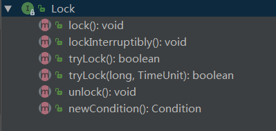
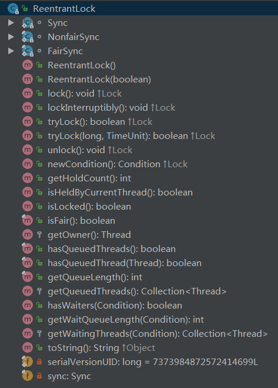

<!-- TOC -->

- [0、Lock接口（6个方法）](#0lock接口6个方法)
- [1、ReentrantLock可重入锁](#1reentrantlock可重入锁)
    - [1、构造函数](#1构造函数)
    - [2、lock()](#2lock)
    - [3、unlock()](#3unlock)
    - [4、lockInterruptibly()](#4lockinterruptibly)
    - [5、tryLock()](#5trylock)
    - [6、tryLock(long timeout, TimeUnit unit)](#6trylocklong-timeout-timeunit-unit)
- [2、Sync继承AQS抽象类](#2sync继承aqs抽象类)
- [3、FairSync公平锁](#3fairsync公平锁)
    - [1、lock()](#1lock)
    - [2、tryAcquire(int acquires)](#2tryacquireint-acquires)
- [4、NonfairSync非公平锁](#4nonfairsync非公平锁)
    - [1、lock()](#1lock-1)
    - [2、tryAcquire(int acquires)](#2tryacquireint-acquires-1)

<!-- /TOC -->


通常的使用方式如下:

```java
    private ReentrantLock lock = new ReentrantLock();
    public void run() {
        lock.lock();
        try {
            //do bussiness
        } catch (InterruptedException e) {
            e.printStackTrace();
        } finally {
            lock.unlock();
        }
    }
```


# 0、Lock接口（6个方法）



```java
public interface Lock {

    void lock();//获取锁，如果获取不到锁阻塞当前线程

    //可中断的获取锁，如果当前锁可用立即返回。否则阻塞线程直到下面两种情况：
    //1、当前线程获取到锁；
    //2、被其他线程中断；
    void lockInterruptibly() throws InterruptedException;

    /**
    典型用法
     * Lock lock = ...;
     * if (lock.tryLock()) {//尝试获取锁
     *   try {
     *     // manipulate protected state
     *   } finally {
     *     lock.unlock();//只有获取到锁了才进行解锁
     *   }
     * } else {
     *   // perform alternative actions 获取失败的时候需要进行的处理
     * }}
     */
    //如果获取锁时可用直接返回true，如果不可用直接返回false；
    boolean tryLock();

    //如果获取锁时可用直接返回true，如果不可用会阻塞当前线程，直到发生下面三件事：
    //1、当前线程获取到锁；
    //2、被其他线程中断；
    //3、时间到了；
    //time参数小于或者等于0无效
    boolean tryLock(long time, TimeUnit unit) throws InterruptedException;

    //需要保证只有拥有锁的线程才可以释放锁
    void unlock();

    //基于当前锁对象生成一个条件对象。当前线程在调用条件对象的方法时必须先持有锁，调用await()时会释放掉锁。
    Condition newCondition();
}

```


# 1、ReentrantLock可重入锁




说明：包含3个内部内，其中Sync继承AQS（AbstractQueuedSynchronizer），FairSync和NonfairSync继承Sync，分别实现公平锁和非公平锁。继承关系：

- FairSync--->Sync--->AbstractQueuedSynchronizer
- NonfairSync--->Sync--->AbstractQueuedSynchronizer

```java

public class ReentrantLock implements Lock, java.io.Serializable {

private final Sync sync;//唯一的一个属性字段，同步器


}
```


## 1、构造函数

```java

public ReentrantLock() {//默认的是非公平锁
        sync = new NonfairSync();
    }

public ReentrantLock(boolean fair) {//通过参数可以指定创建锁的公平性
        sync = fair ? new FairSync() : new NonfairSync();
}

```


## 2、lock()


> 核心流程

那么现在如果有一个线程过来尝试用ReentrantLock的lock()方法进行加锁，会发生什么事情呢？很简单，这个AQS对象内部有一个核心的变量叫做state，是int类型的，代表了加锁的状态。初始状态下，这个state的值是0。另外，这个AQS内部还有一个关键变量，用来记录当前加锁的是哪个线程，初始化状态下，这个变量是null。


接着线程1跑过来调用ReentrantLock的lock()方法尝试进行加锁，这个加锁的过程，直接就是用CAS操作将state值从0变为1。如果之前没人加过锁，那么state的值肯定是0，此时线程1就可以加锁成功。一旦线程1加锁成功了之后，就可以设置当前加锁线程是自己。所以大家看下面的图，就是线程1跑过来加锁的一个过程。


其实看到这儿，大家应该对所谓的AQS有感觉了。说白了，就是并发包里的一个核心组件，里面有state变量、加锁线程变量等核心的东西，维护了加锁状态。你会发现，ReentrantLock这种东西只是一个外层的API，内核中的锁机制实现都是依赖AQS组件的。


这个ReentrantLock之所以用Reentrant打头，意思就是他是一个可重入锁。可重入锁的意思，就是你可以对一个ReentrantLock对象多次执行lock()加锁和unlock()释放锁，也就是可以对一个锁加多次，叫做可重入加锁。

大家看明白了那个state变量之后，就知道了如何进行可重入加锁！

其实每次线程1可重入加锁一次，会判断一下当前加锁线程就是自己，那么他自己就可以可重入多次加锁，每次加锁就是把state的值给累加1，别的没啥变化。


接着，如果线程1加锁了之后，线程2跑过来加锁会怎么样呢？

我们来看看锁的互斥是如何实现的？线程2跑过来一下看到，哎呀！state的值不是0啊？所以CAS操作将state从0变为1的过程会失败，因为state的值当前为1，说明已经有人加锁了！接着线程2会看一下，是不是自己之前加的锁啊？当然不是了，“加锁线程”这个变量明确记录了是线程1占用了这个锁，所以线程2此时就是加锁失败。
给大家来一张图，一起来感受一下这个过程：


接着，线程2会将自己放入AQS中的一个等待队列，因为自己尝试加锁失败了，此时就要将自己放入队列中来等待，等待线程1释放锁之后，自己就可以重新尝试加锁了

所以大家可以看到，AQS是如此的核心！AQS内部还有一个等待队列，专门放那些加锁失败的线程！同样，给大家来一张图，一起感受一下：


接着，线程1在执行完自己的业务逻辑代码之后，就会释放锁！他释放锁的过程非常的简单，就是将AQS内的state变量的值递减1，如果state值为0，则彻底释放锁，会将“加锁线程”变量也设置为null！整个过程，参见下图：


接下来，会从等待队列的队头唤醒线程2重新尝试加锁。好！线程2现在就重新尝试加锁，这时还是用CAS操作将state从0变为1，此时就会成功，成功之后代表加锁成功，就会将state设置为1。此外，还要把“加锁线程”设置为线程2自己，同时线程2自己就从等待队列中出队了。最后再来一张图，大家来看看这个过程。


> 源码解析

```java
    public void lock() {
        sync.lock();//调用同步器的lock方法
    }
```

备注：如论是公平锁还是非公平锁，底层都是调用AQS的acquire(1)来实现,而acquire(1)又会先tryAcquire(1)，失败的时候才会加入等待队列。

以公平锁为例

可以看到是使用 `sync`的方法，而这个方法是一个抽象方法，具体是由其子类(`FairSync`)来实现的。

接着是调用`AbstractQueuedSynchronizer.acquire(1)`,第一步是尝试获取锁(`tryAcquire(arg)`),这个也是由其子类实现


- 1、首先会判断 `AQS` 中的 `state` 是否等于 0，0 表示目前没有其他线程获得锁，当前线程就可以尝试获取锁。

**注意**:尝试之前会利用 `hasQueuedPredecessors()` 方法来判断 AQS 的队列中中是否有其他线程，如果有则不会尝试获取锁(**这是公平锁特有的情况**)。

- 2、如果队列中没有线程就利用 CAS 来将 AQS 中的 state 修改为1，也就是获取锁，获取成功则将当前线程置为获得锁的独占线程(`setExclusiveOwnerThread(current)`)。

- 3、如果 `state` 大于 0 时，说明锁已经被获取了，则需要判断获取锁的线程是否为当前线程(`ReentrantLock` 支持重入)，是则需要将 `state + 1`，并将值更新。

- 4、否则返回false，说明获取锁失败。

## 3、unlock()

```java
public void unlock() {
        sync.release(1);
}
```


## 4、lockInterruptibly()

```java
public void lockInterruptibly() throws InterruptedException {
        sync.acquireInterruptibly(1);
    }
```


## 5、tryLock()

```java
public boolean tryLock() {
        return sync.nonfairTryAcquire(1);//非公平锁获取
    }
```


## 6、tryLock(long timeout, TimeUnit unit)

```java
public boolean tryLock(long timeout, TimeUnit unit)
            throws InterruptedException {
        return sync.tryAcquireNanos(1, unit.toNanos(timeout));
    }
```


# 2、Sync继承AQS抽象类

```java
abstract static class Sync extends AbstractQueuedSynchronizer {
        private static final long serialVersionUID = -5179523762034025860L;

        abstract void lock();//对应lock接口的lock方法获取锁。子类去实现，可以快速实现非公平锁

        /**
         * Performs non-fair tryLock.  tryAcquire is implemented in
         * subclasses, but both need nonfair try for trylock method.
         */
        //非公平锁获取的方式。（公平锁的trylock也会调用，所以放在了这里）
        final boolean nonfairTryAcquire(int acquires) {
            final Thread current = Thread.currentThread();
            int c = getState();//获取AQS同步锁的状态
            if (c == 0) {//说明是空闲状态
                if (compareAndSetState(0, acquires)) {//基于cas更新state的值
                    setExclusiveOwnerThread(current);//更新成功把当前线程设置为独占线程
                    return true;
                }
            }
            else if (current == getExclusiveOwnerThread()) {//判断占用锁的线程是不是自己
                int nextc = c + acquires;
                if (nextc < 0) // overflow
                    throw new Error("Maximum lock count exceeded");
                setState(nextc);//这里采用直接赋值，在一个线程内操作，不存在竞争
                return true;
            }
            return false;
        }

        //公平锁和非公平锁一样的释放锁逻辑：简单来说就是更新AQS中的state字段的值
        protected final boolean tryRelease(int releases) {
            int c = getState() - releases;//获取锁的状态
            if (Thread.currentThread() != getExclusiveOwnerThread())//只有持有锁的线程才可以调用
                throw new IllegalMonitorStateException();
            boolean free = false;
            if (c == 0) {//由于锁的可重入性，这里为0表示完全释放了锁
                free = true;
                setExclusiveOwnerThread(null);
            }
            setState(c);//更新状态字段
            return free;
        }

        protected final boolean isHeldExclusively() {
            // While we must in general read state before owner,
            // we don't need to do so to check if current thread is owner
            return getExclusiveOwnerThread() == Thread.currentThread();
        }

        final ConditionObject newCondition() {
            return new ConditionObject();
        }

        // Methods relayed from outer class

        final Thread getOwner() {//获取持有锁的当前线程
            return getState() == 0 ? null : getExclusiveOwnerThread();
        }

        final int getHoldCount() {//可重入的层数
            return isHeldExclusively() ? getState() : 0;
        }

        final boolean isLocked() {//判断锁是否被占用了
            return getState() != 0;
        }

        /**
         * Reconstitutes the instance from a stream (that is, deserializes it).
         */
        private void readObject(java.io.ObjectInputStream s)
            throws java.io.IOException, ClassNotFoundException {
            s.defaultReadObject();
            setState(0); // reset to unlocked state
        }
    }
```


# 3、FairSync公平锁

```java
static final class FairSync extends Sync {

        final void lock() {
            acquire(1);//间接先调用tryAcquire(int acquires)
        }

        /**
         * Fair version of tryAcquire.  Don't grant access unless
         * recursive call or no waiters or is first.
         */
        //尝试获取锁
        protected final boolean tryAcquire(int acquires) {
            final Thread current = Thread.currentThread();
            int c = getState();
            if (c == 0) {//没有被占用
                if (!hasQueuedPredecessors() &&//先判断等待队列是否为空
                    compareAndSetState(0, acquires)) {//等待队列为空时，直接cas尝试获取锁
                    setExclusiveOwnerThread(current);
                    return true;
                }
            }
            else if (current == getExclusiveOwnerThread()) {//锁被占用，判断当前线程是否为自己
                int nextc = c + acquires;
                if (nextc < 0)
                    throw new Error("Maximum lock count exceeded");
                setState(nextc);
                return true;
            }
            return false;
        }
    }
```

## 1、lock()
## 2、tryAcquire(int acquires)

# 4、NonfairSync非公平锁

公平锁与非公平锁的差异主要在获取锁：

- 公平锁就相当于买票，后来的人需要排到队尾依次买票，**不能插队**。

- 而非公平锁则没有这些规则，是**抢占模式**，每来一个人不会去管队列如何，直接尝试获取锁。即：在尝试获取锁时`tryAcquire(arg)`，非公平锁是不需要判断队列中是否还有其他线程，也是直接尝试获取锁：

由于公平锁需要关心队列的情况，得按照队列里的先后顺序来获取锁(会造成大量的线程上下文切换)，而非公平锁则没有这个限制。所以也就能解释非公平锁的效率会被公平锁更高。


```java
static final class NonfairSync extends Sync {

    //和公平锁的区别，上来就先尝试直接获取锁，获取锁失败时，再使用和公平锁一样的方式获取锁。
    final void lock() {
        if (compareAndSetState(0, 1))//先抢占，不成功再说
            setExclusiveOwnerThread(Thread.currentThread());
        else
            acquire(1);
    }

    protected final boolean tryAcquire(int acquires) {
        return nonfairTryAcquire(acquires);
    }
}
```

## 1、lock()
## 2、tryAcquire(int acquires)


