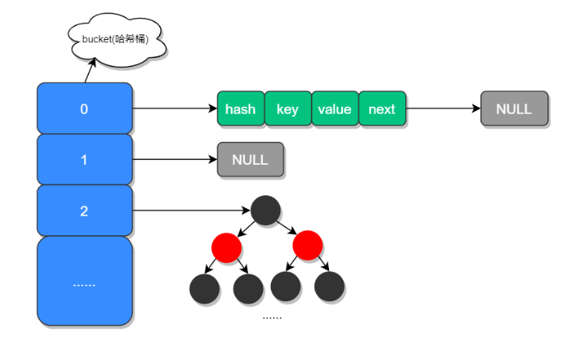
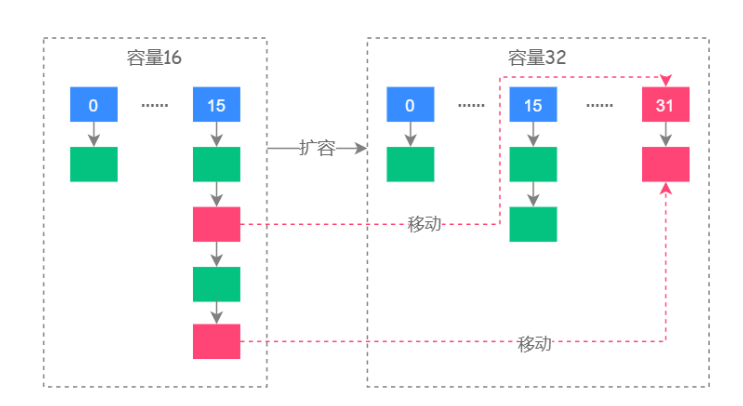
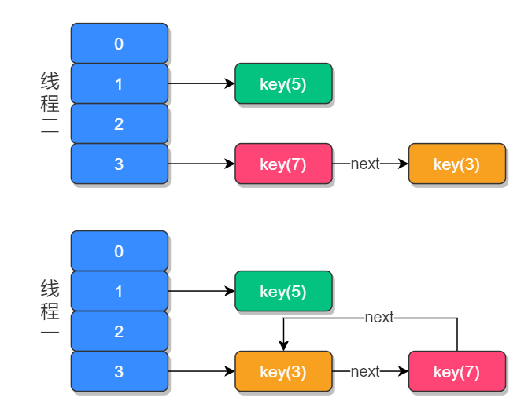
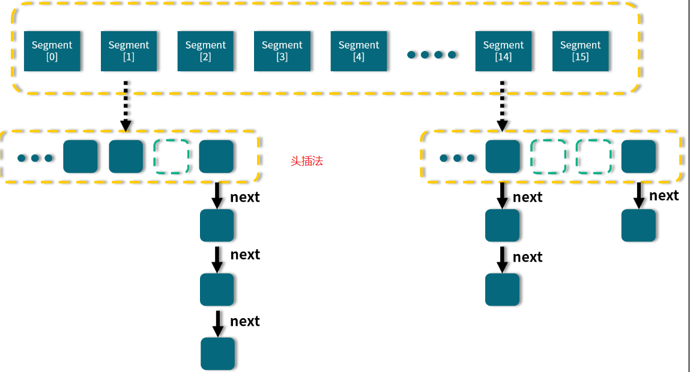
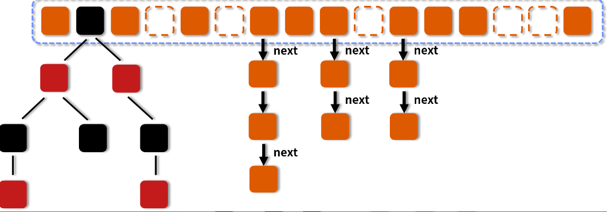
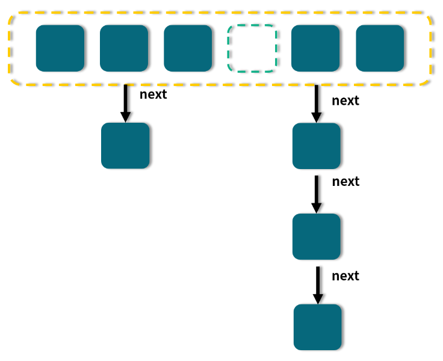

<!-- TOC -->

- [01、HashMap 为什么是线程不安全的？](#01hashmap-为什么是线程不安全的)
    - [1、源码分析](#1源码分析)
    - [2、实验：扩容期间取出的值不准确](#2实验扩容期间取出的值不准确)
- [02、ConcurrentHashMap 在 Java7 和 8 有何不同？](#02concurrenthashmap-在-java7-和-8-有何不同)
- [03、为什么 Map 桶中超过 8 个才转为红黑树？](#03为什么-map-桶中超过-8-个才转为红黑树)
- [04、同样是线程安全，ConcurrentHashMap 和 Hashtable 的区别？](#04同样是线程安全concurrenthashmap-和-hashtable-的区别)

<!-- /TOC -->

> 问题

- 1、HashMap 底层是如何实现的？在 JDK 1.8 中它都做了哪些优化？
- 2、JDK 1.8 HashMap 扩容时做了哪些优化？
- 3、加载因子为什么是 0.75？
- 4、当有哈希冲突时，HashMap 是如何查找并确认元素的？
- 5、HashMap 源码中有哪些重要的方法？
- 6、HashMap 是如何导致死循环的？


# 00、源码分析

备注：以jdk1.8为例。

在 JDK 1.7 中 HashMap 是以数组加链表的形式组成的，JDK 1.8 之后新增了红黑树的组成结构，当链表大于 8 并且容量大于 64 时，链表结构会转换成红黑树结构，它的组成结构如下图所示：



JDK 1.8 之所以添加红黑树是因为一旦链表过长，会严重影响 HashMap 的性能，而红黑树具有快速增删改查的特点，这样就可以有效的解决链表过长时操作比较慢的问题。

## 1、Node节点

```java
//数组中的元素我们称之为哈希桶，它的定义如下.包含了四个字段：hash、key、value、next，其中 next 表示链表的下一个节点。
static class Node<K,V> implements Map.Entry<K,V> {
        final int hash;
        final K key;
        V value;
        Node<K,V> next;

        Node(int hash, K key, V value, Node<K,V> next) {
            this.hash = hash;
            this.key = key;
            this.value = value;
            this.next = next;
        }

        public final K getKey()        { return key; }
        public final V getValue()      { return value; }
        public final String toString() { return key + "=" + value; }

        public final int hashCode() {
            return Objects.hashCode(key) ^ Objects.hashCode(value);
        }

        public final V setValue(V newValue) {
            V oldValue = value;//返回旧值
            value = newValue;
            return oldValue;
        }

        public final boolean equals(Object o) {
            if (o == this)//内存地址一致
                return true;
            if (o instanceof Map.Entry) {//类型一致
                Map.Entry<?,?> e = (Map.Entry<?,?>)o;
                if (Objects.equals(key, e.getKey()) &&
                    Objects.equals(value, e.getValue()))
                    return true;
            }
            return false;
        }
    }
```


## 2、TreeNode

```java
static final class TreeNode<K,V> extends LinkedHashMap.Entry<K,V> {
        TreeNode<K,V> parent;  // red-black tree links
        TreeNode<K,V> left;
        TreeNode<K,V> right;
        TreeNode<K,V> prev;    // needed to unlink next upon deletion
        boolean red;
        TreeNode(int hash, K key, V val, Node<K,V> next) {
            super(hash, key, val, next);
        }

        //每个节点有个指针指向父节点，然后递归查找，当一个节点的父节点为null，说明当前节点即是根节点
        final TreeNode<K,V> root() {
            for (TreeNode<K,V> r = this, p;;) {
                if ((p = r.parent) == null)
                    return r;
                r = p;
            }
        }

        /**
         * Ensures that the given root is the first node of its bin.
         */
        static <K,V> void moveRootToFront(Node<K,V>[] tab, TreeNode<K,V> root) {
            int n;
            if (root != null && tab != null && (n = tab.length) > 0) {
                int index = (n - 1) & root.hash;
                TreeNode<K,V> first = (TreeNode<K,V>)tab[index];
                if (root != first) {
                    Node<K,V> rn;
                    tab[index] = root;
                    TreeNode<K,V> rp = root.prev;
                    if ((rn = root.next) != null)
                        ((TreeNode<K,V>)rn).prev = rp;
                    if (rp != null)
                        rp.next = rn;
                    if (first != null)
                        first.prev = root;
                    root.next = first;
                    root.prev = null;
                }
                assert checkInvariants(root);
            }
        }

        /**
         * Finds the node starting at root p with the given hash and key.
         * The kc argument caches comparableClassFor(key) upon first use
         * comparing keys.
         */
         //从根节点开始调用，通过参数进行二分查找。
        final TreeNode<K,V> find(int h, Object k, Class<?> kc) {
            TreeNode<K,V> p = this;//遍历指针指向当前节点
            do {
                int ph, dir; K pk;
                TreeNode<K,V> pl = p.left, pr = p.right, q;//初始化pl、pr为当前节点的左右节点
                if ((ph = p.hash) > h)//1、当前节点的hash值大于目标hash值，朝左走
                    p = pl;
                else if (ph < h)//2、当前节点的hash值小于目标hash值，朝右走
                    p = pr;
                else if ((pk = p.key) == k || (k != null && k.equals(pk)))//3、当前节点值正好是要找的，返回
                    return p;
                else if (pl == null)
                    p = pr;
                else if (pr == null)
                    p = pl;
                else if ((kc != null ||
                          (kc = comparableClassFor(k)) != null) &&
                         (dir = compareComparables(kc, k, pk)) != 0)
                    p = (dir < 0) ? pl : pr;
                else if ((q = pr.find(h, k, kc)) != null)
                    return q;
                else
                    p = pl;
            } while (p != null);
            return null;
        }

        /**
         * Calls find for root node.
         */
        //先找到当前节点的根节点，然后基于根节点进行查找
        final TreeNode<K,V> getTreeNode(int h, Object k) {
            return ((parent != null) ? root() : this).find(h, k, null);
        }

        /**
         * Tie-breaking utility for ordering insertions when equal
         * hashCodes and non-comparable. We don't require a total
         * order, just a consistent insertion rule to maintain
         * equivalence across rebalancings. Tie-breaking further than
         * necessary simplifies testing a bit.
         */
        static int tieBreakOrder(Object a, Object b) {
            int d;
            if (a == null || b == null ||
                (d = a.getClass().getName().
                 compareTo(b.getClass().getName())) == 0)
                d = (System.identityHashCode(a) <= System.identityHashCode(b) ?
                     -1 : 1);
            return d;
        }

        /**
         * Forms tree of the nodes linked from this node.
         * @return root of tree
         */
        final void treeify(Node<K,V>[] tab) {
            TreeNode<K,V> root = null;
            for (TreeNode<K,V> x = this, next; x != null; x = next) {
                next = (TreeNode<K,V>)x.next;
                x.left = x.right = null;
                if (root == null) {
                    x.parent = null;
                    x.red = false;
                    root = x;
                }
                else {
                    K k = x.key;
                    int h = x.hash;
                    Class<?> kc = null;
                    for (TreeNode<K,V> p = root;;) {
                        int dir, ph;
                        K pk = p.key;
                        if ((ph = p.hash) > h)
                            dir = -1;
                        else if (ph < h)
                            dir = 1;
                        else if ((kc == null &&
                                  (kc = comparableClassFor(k)) == null) ||
                                 (dir = compareComparables(kc, k, pk)) == 0)
                            dir = tieBreakOrder(k, pk);

                        TreeNode<K,V> xp = p;
                        if ((p = (dir <= 0) ? p.left : p.right) == null) {
                            x.parent = xp;
                            if (dir <= 0)
                                xp.left = x;
                            else
                                xp.right = x;
                            root = balanceInsertion(root, x);
                            break;
                        }
                    }
                }
            }
            moveRootToFront(tab, root);
        }

        /**
         * Returns a list of non-TreeNodes replacing those linked from
         * this node.
         */
        final Node<K,V> untreeify(HashMap<K,V> map) {
            Node<K,V> hd = null, tl = null;
            for (Node<K,V> q = this; q != null; q = q.next) {
                Node<K,V> p = map.replacementNode(q, null);
                if (tl == null)
                    hd = p;
                else
                    tl.next = p;
                tl = p;
            }
            return hd;
        }

        /**
         * Tree version of putVal.
         */
        final TreeNode<K,V> putTreeVal(HashMap<K,V> map, Node<K,V>[] tab,
                                       int h, K k, V v) {
            Class<?> kc = null;
            boolean searched = false;
            TreeNode<K,V> root = (parent != null) ? root() : this;
            for (TreeNode<K,V> p = root;;) {
                int dir, ph; K pk;
                if ((ph = p.hash) > h)
                    dir = -1;
                else if (ph < h)
                    dir = 1;
                else if ((pk = p.key) == k || (k != null && k.equals(pk)))
                    return p;
                else if ((kc == null &&
                          (kc = comparableClassFor(k)) == null) ||
                         (dir = compareComparables(kc, k, pk)) == 0) {
                    if (!searched) {
                        TreeNode<K,V> q, ch;
                        searched = true;
                        if (((ch = p.left) != null &&
                             (q = ch.find(h, k, kc)) != null) ||
                            ((ch = p.right) != null &&
                             (q = ch.find(h, k, kc)) != null))
                            return q;
                    }
                    dir = tieBreakOrder(k, pk);
                }

                TreeNode<K,V> xp = p;
                if ((p = (dir <= 0) ? p.left : p.right) == null) {
                    Node<K,V> xpn = xp.next;
                    TreeNode<K,V> x = map.newTreeNode(h, k, v, xpn);
                    if (dir <= 0)
                        xp.left = x;
                    else
                        xp.right = x;
                    xp.next = x;
                    x.parent = x.prev = xp;
                    if (xpn != null)
                        ((TreeNode<K,V>)xpn).prev = x;
                    moveRootToFront(tab, balanceInsertion(root, x));
                    return null;
                }
            }
        }

        /**
         * Removes the given node, that must be present before this call.
         * This is messier than typical red-black deletion code because we
         * cannot swap the contents of an interior node with a leaf
         * successor that is pinned by "next" pointers that are accessible
         * independently during traversal. So instead we swap the tree
         * linkages. If the current tree appears to have too few nodes,
         * the bin is converted back to a plain bin. (The test triggers
         * somewhere between 2 and 6 nodes, depending on tree structure).
         */
        final void removeTreeNode(HashMap<K,V> map, Node<K,V>[] tab,
                                  boolean movable) {
            int n;
            if (tab == null || (n = tab.length) == 0)
                return;
            int index = (n - 1) & hash;
            TreeNode<K,V> first = (TreeNode<K,V>)tab[index], root = first, rl;
            TreeNode<K,V> succ = (TreeNode<K,V>)next, pred = prev;
            if (pred == null)
                tab[index] = first = succ;
            else
                pred.next = succ;
            if (succ != null)
                succ.prev = pred;
            if (first == null)
                return;
            if (root.parent != null)
                root = root.root();
            if (root == null || root.right == null ||
                (rl = root.left) == null || rl.left == null) {
                tab[index] = first.untreeify(map);  // too small
                return;
            }
            TreeNode<K,V> p = this, pl = left, pr = right, replacement;
            if (pl != null && pr != null) {
                TreeNode<K,V> s = pr, sl;
                while ((sl = s.left) != null) // find successor
                    s = sl;
                boolean c = s.red; s.red = p.red; p.red = c; // swap colors
                TreeNode<K,V> sr = s.right;
                TreeNode<K,V> pp = p.parent;
                if (s == pr) { // p was s's direct parent
                    p.parent = s;
                    s.right = p;
                }
                else {
                    TreeNode<K,V> sp = s.parent;
                    if ((p.parent = sp) != null) {
                        if (s == sp.left)
                            sp.left = p;
                        else
                            sp.right = p;
                    }
                    if ((s.right = pr) != null)
                        pr.parent = s;
                }
                p.left = null;
                if ((p.right = sr) != null)
                    sr.parent = p;
                if ((s.left = pl) != null)
                    pl.parent = s;
                if ((s.parent = pp) == null)
                    root = s;
                else if (p == pp.left)
                    pp.left = s;
                else
                    pp.right = s;
                if (sr != null)
                    replacement = sr;
                else
                    replacement = p;
            }
            else if (pl != null)
                replacement = pl;
            else if (pr != null)
                replacement = pr;
            else
                replacement = p;
            if (replacement != p) {
                TreeNode<K,V> pp = replacement.parent = p.parent;
                if (pp == null)
                    root = replacement;
                else if (p == pp.left)
                    pp.left = replacement;
                else
                    pp.right = replacement;
                p.left = p.right = p.parent = null;
            }

            TreeNode<K,V> r = p.red ? root : balanceDeletion(root, replacement);

            if (replacement == p) {  // detach
                TreeNode<K,V> pp = p.parent;
                p.parent = null;
                if (pp != null) {
                    if (p == pp.left)
                        pp.left = null;
                    else if (p == pp.right)
                        pp.right = null;
                }
            }
            if (movable)
                moveRootToFront(tab, r);
        }

        /**
         * Splits nodes in a tree bin into lower and upper tree bins,
         * or untreeifies if now too small. Called only from resize;
         * see above discussion about split bits and indices.
         *
         * @param map the map
         * @param tab the table for recording bin heads
         * @param index the index of the table being split
         * @param bit the bit of hash to split on
         */
        final void split(HashMap<K,V> map, Node<K,V>[] tab, int index, int bit) {
            TreeNode<K,V> b = this;
            // Relink into lo and hi lists, preserving order
            TreeNode<K,V> loHead = null, loTail = null;
            TreeNode<K,V> hiHead = null, hiTail = null;
            int lc = 0, hc = 0;
            for (TreeNode<K,V> e = b, next; e != null; e = next) {
                next = (TreeNode<K,V>)e.next;
                e.next = null;
                if ((e.hash & bit) == 0) {
                    if ((e.prev = loTail) == null)
                        loHead = e;
                    else
                        loTail.next = e;
                    loTail = e;
                    ++lc;
                }
                else {
                    if ((e.prev = hiTail) == null)
                        hiHead = e;
                    else
                        hiTail.next = e;
                    hiTail = e;
                    ++hc;
                }
            }

            if (loHead != null) {
                if (lc <= UNTREEIFY_THRESHOLD)
                    tab[index] = loHead.untreeify(map);
                else {
                    tab[index] = loHead;
                    if (hiHead != null) // (else is already treeified)
                        loHead.treeify(tab);
                }
            }
            if (hiHead != null) {
                if (hc <= UNTREEIFY_THRESHOLD)
                    tab[index + bit] = hiHead.untreeify(map);
                else {
                    tab[index + bit] = hiHead;
                    if (loHead != null)
                        hiHead.treeify(tab);
                }
            }
        }

        /* ------------------------------------------------------------ */
        // Red-black tree methods, all adapted from CLR

        static <K,V> TreeNode<K,V> rotateLeft(TreeNode<K,V> root,
                                              TreeNode<K,V> p) {
            TreeNode<K,V> r, pp, rl;
            if (p != null && (r = p.right) != null) {
                if ((rl = p.right = r.left) != null)
                    rl.parent = p;
                if ((pp = r.parent = p.parent) == null)
                    (root = r).red = false;
                else if (pp.left == p)
                    pp.left = r;
                else
                    pp.right = r;
                r.left = p;
                p.parent = r;
            }
            return root;
        }

        static <K,V> TreeNode<K,V> rotateRight(TreeNode<K,V> root,
                                               TreeNode<K,V> p) {
            TreeNode<K,V> l, pp, lr;
            if (p != null && (l = p.left) != null) {
                if ((lr = p.left = l.right) != null)
                    lr.parent = p;
                if ((pp = l.parent = p.parent) == null)
                    (root = l).red = false;
                else if (pp.right == p)
                    pp.right = l;
                else
                    pp.left = l;
                l.right = p;
                p.parent = l;
            }
            return root;
        }

        static <K,V> TreeNode<K,V> balanceInsertion(TreeNode<K,V> root,
                                                    TreeNode<K,V> x) {
            x.red = true;
            for (TreeNode<K,V> xp, xpp, xppl, xppr;;) {
                if ((xp = x.parent) == null) {
                    x.red = false;
                    return x;
                }
                else if (!xp.red || (xpp = xp.parent) == null)
                    return root;
                if (xp == (xppl = xpp.left)) {
                    if ((xppr = xpp.right) != null && xppr.red) {
                        xppr.red = false;
                        xp.red = false;
                        xpp.red = true;
                        x = xpp;
                    }
                    else {
                        if (x == xp.right) {
                            root = rotateLeft(root, x = xp);
                            xpp = (xp = x.parent) == null ? null : xp.parent;
                        }
                        if (xp != null) {
                            xp.red = false;
                            if (xpp != null) {
                                xpp.red = true;
                                root = rotateRight(root, xpp);
                            }
                        }
                    }
                }
                else {
                    if (xppl != null && xppl.red) {
                        xppl.red = false;
                        xp.red = false;
                        xpp.red = true;
                        x = xpp;
                    }
                    else {
                        if (x == xp.left) {
                            root = rotateRight(root, x = xp);
                            xpp = (xp = x.parent) == null ? null : xp.parent;
                        }
                        if (xp != null) {
                            xp.red = false;
                            if (xpp != null) {
                                xpp.red = true;
                                root = rotateLeft(root, xpp);
                            }
                        }
                    }
                }
            }
        }

        static <K,V> TreeNode<K,V> balanceDeletion(TreeNode<K,V> root,
                                                   TreeNode<K,V> x) {
            for (TreeNode<K,V> xp, xpl, xpr;;)  {
                if (x == null || x == root)
                    return root;
                else if ((xp = x.parent) == null) {
                    x.red = false;
                    return x;
                }
                else if (x.red) {
                    x.red = false;
                    return root;
                }
                else if ((xpl = xp.left) == x) {
                    if ((xpr = xp.right) != null && xpr.red) {
                        xpr.red = false;
                        xp.red = true;
                        root = rotateLeft(root, xp);
                        xpr = (xp = x.parent) == null ? null : xp.right;
                    }
                    if (xpr == null)
                        x = xp;
                    else {
                        TreeNode<K,V> sl = xpr.left, sr = xpr.right;
                        if ((sr == null || !sr.red) &&
                            (sl == null || !sl.red)) {
                            xpr.red = true;
                            x = xp;
                        }
                        else {
                            if (sr == null || !sr.red) {
                                if (sl != null)
                                    sl.red = false;
                                xpr.red = true;
                                root = rotateRight(root, xpr);
                                xpr = (xp = x.parent) == null ?
                                    null : xp.right;
                            }
                            if (xpr != null) {
                                xpr.red = (xp == null) ? false : xp.red;
                                if ((sr = xpr.right) != null)
                                    sr.red = false;
                            }
                            if (xp != null) {
                                xp.red = false;
                                root = rotateLeft(root, xp);
                            }
                            x = root;
                        }
                    }
                }
                else { // symmetric
                    if (xpl != null && xpl.red) {
                        xpl.red = false;
                        xp.red = true;
                        root = rotateRight(root, xp);
                        xpl = (xp = x.parent) == null ? null : xp.left;
                    }
                    if (xpl == null)
                        x = xp;
                    else {
                        TreeNode<K,V> sl = xpl.left, sr = xpl.right;
                        if ((sl == null || !sl.red) &&
                            (sr == null || !sr.red)) {
                            xpl.red = true;
                            x = xp;
                        }
                        else {
                            if (sl == null || !sl.red) {
                                if (sr != null)
                                    sr.red = false;
                                xpl.red = true;
                                root = rotateLeft(root, xpl);
                                xpl = (xp = x.parent) == null ?
                                    null : xp.left;
                            }
                            if (xpl != null) {
                                xpl.red = (xp == null) ? false : xp.red;
                                if ((sl = xpl.left) != null)
                                    sl.red = false;
                            }
                            if (xp != null) {
                                xp.red = false;
                                root = rotateRight(root, xp);
                            }
                            x = root;
                        }
                    }
                }
            }
        }

        /**
         * Recursive invariant check
         */
        static <K,V> boolean checkInvariants(TreeNode<K,V> t) {
            TreeNode<K,V> tp = t.parent, tl = t.left, tr = t.right,
                tb = t.prev, tn = (TreeNode<K,V>)t.next;
            if (tb != null && tb.next != t)
                return false;
            if (tn != null && tn.prev != t)
                return false;
            if (tp != null && t != tp.left && t != tp.right)
                return false;
            if (tl != null && (tl.parent != t || tl.hash > t.hash))
                return false;
            if (tr != null && (tr.parent != t || tr.hash < t.hash))
                return false;
            if (t.red && tl != null && tl.red && tr != null && tr.red)
                return false;
            if (tl != null && !checkInvariants(tl))
                return false;
            if (tr != null && !checkInvariants(tr))
                return false;
            return true;
        }
    }
```


## 3、属性

```java
     //初始容量，必须是2的N次方，默认是16
    static final int DEFAULT_INITIAL_CAPACITY = 1 << 4; // aka 16

    //通过构造函数指定容量不能超过该最大容量
    static final int MAXIMUM_CAPACITY = 1 << 30;

    //默认的负载因子
    static final float DEFAULT_LOAD_FACTOR = 0.75f;

    //链表转化为红黑树门限值，默认是8。同时满足容量大于64的条件
    static final int TREEIFY_THRESHOLD = 8;

    //转换链表的临界值，当元素小于此值时，会将红黑树结构转换成链表结构
    static final int UNTREEIFY_THRESHOLD = 6;

    //链表转化为树时，hash表的最小容量。最小的树容量
    static final int MIN_TREEIFY_CAPACITY = 64;

    //数组
    transient Node<K,V>[] table;

    //缓存
    transient Set<Map.Entry<K,V>> entrySet;

    //存放的key-value映射的个数，即元素的个数
    transient int size;

    //hashmap结构修改的次数。这个字段用在迭代器遍历时有修改，实现快速失败
    transient int modCount;

    // 扩容resize的门限值 (capacity * load factor)
    int threshold;
    
    //负载因子
    final float loadFactor;
```

> 什么是加载因子？加载因子为什么是 0.75？

加载因子也叫扩容因子或负载因子，用来判断什么时候进行扩容的，假如加载因子是 0.5，HashMap 的初始化容量是 16，那么当 HashMap 中有 16*0.5=8 个元素时，HashMap 就会进行扩容。

那加载因子为什么是 0.75 而不是 0.5 或者 1.0 呢？

这其实是出于容量和性能之间平衡的结果：

- 当加载因子设置比较大的时候，扩容的门槛就被提高了，扩容发生的频率比较低，占用的空间会比较小，但此时发生 Hash 冲突的几率就会提升，因此需要更复杂的数据结构来存储元素，这样对元素的操作时间就会增加，运行效率也会因此降低；
- 而当加载因子值比较小的时候，扩容的门槛会比较低，因此会占用更多的空间，此时元素的存储就比较稀疏，发生哈希冲突的可能性就比较小，因此操作性能会比较高。

- 为了提升扩容效率，HashMap的容量（capacity）有一个固定的要求，那就是一定是2的幂。所以，如果负载因子是3/4的话，那么和capacity的乘积结果就可以是一个整数

所以综合了以上情况就取了一个 0.5 到 1.0 的平均数 0.75 作为加载因子。


## 4、查询

```java

public V get(Object key) {
    Node<K,V> e;
    // 对 key 进行哈希操作
    return (e = getNode(hash(key), key)) == null ? null : e.value;
}
//根据key来查询节点
final Node<K,V> getNode(int hash, Object key) {
    Node<K,V>[] tab; Node<K,V> first, e; int n; K k;
    // 非空判断
    if ((tab = table) != null && (n = tab.length) > 0 &&
        (first = tab[(n - 1) & hash]) != null) {//等价于hash%n，查找该hash值对应的槽位对应的值，赋值给fist
        // 判断第一个元素是否是要查询的元素
        if (first.hash == hash && // always check first node
            ((k = first.key) == key || (key != null && key.equals(k))))//，当哈希冲突时我们需要通过判断 key 值是否相等，基于equals查找
            return first;//假如这里返回的话，说明第一个节点就是
        // 下一个节点非空判断
        if ((e = first.next) != null) {
            // 如果第一节点是树结构，则使用 getTreeNode 直接获取相应的数据
            if (first instanceof TreeNode)
                return ((TreeNode<K,V>)first).getTreeNode(hash, key);//当前节点应该是根节点，然后通过根节点进行查找
            do { // 非树结构，循环节点判断
                // hash 相等并且 key 相同，则返回此节点
                if (e.hash == hash &&
                    ((k = e.key) == key || (key != null && key.equals(k))))
                    return e;
            } while ((e = e.next) != null);//遍历链表查找
        }
    }
    return null;
}

```


## 5、新增

```java
public V put(K key, V value) {
    // 对 key 进行哈希操作
    return putVal(hash(key), key, value, false, true);
}
final V putVal(int hash, K key, V value, boolean onlyIfAbsent,
               boolean evict) {
    Node<K,V>[] tab; Node<K,V> p; int n, i;
    // 哈希表为空则创建表
    if ((tab = table) == null || (n = tab.length) == 0)
        n = (tab = resize()).length;
    // 根据 key 的哈希值计算出要插入的数组索引 i
    if ((p = tab[i = (n - 1) & hash]) == null)
        // 1、如果 table[i] 等于 null，则直接插入
        tab[i] = newNode(hash, key, value, null);
    else {
        Node<K,V> e; K k;
        // 2、如果 key 已经存在了，直接覆盖 value
        if (p.hash == hash &&
            ((k = p.key) == key || (key != null && key.equals(k))))
            e = p;
        // 3、如果 key 不存在，判断是否为红黑树
        else if (p instanceof TreeNode)
            // 红黑树直接插入键值对
            e = ((TreeNode<K,V>)p).putTreeVal(this, tab, hash, key, value);
        else {
            // 4、为链表结构，循环准备插入
            for (int binCount = 0; ; ++binCount) {
                // 下一个元素为空时
                if ((e = p.next) == null) {
                    p.next = newNode(hash, key, value, null);//尾插法拼接新节点
                    // 转换为红黑树进行处理
                    if (binCount >= TREEIFY_THRESHOLD - 1) // -1 for 1st
                        treeifyBin(tab, hash);
                    break;
                }
                //  key 已经存在直接覆盖 value
                if (e.hash == hash &&
                    ((k = e.key) == key || (key != null && key.equals(k))))
                    break;
                p = e;
            }
        }
        if (e != null) { // existing mapping for key
            V oldValue = e.value;
            if (!onlyIfAbsent || oldValue == null)
                e.value = value;
            afterNodeAccess(e);
            return oldValue;
        }
    }
    ++modCount;
    // 超过最大容量，扩容
    if (++size > threshold)
        resize();
    afterNodeInsertion(evict);
    return null;
}


```


## 6、扩容（2倍扩容）

```java

final Node<K,V>[] resize() {
    // 扩容前的数组
    Node<K,V>[] oldTab = table;
    // 扩容前的数组的大小和阈值
    int oldCap = (oldTab == null) ? 0 : oldTab.length;
    int oldThr = threshold;
    // 预定义新数组的大小和阈值
    int newCap, newThr = 0;
    if (oldCap > 0) {
        // 超过最大值就不再扩容了
        if (oldCap >= MAXIMUM_CAPACITY) {
            threshold = Integer.MAX_VALUE;
            return oldTab;
        }
        // 扩大容量为当前容量的两倍，但不能超过 MAXIMUM_CAPACITY
        else if ((newCap = oldCap << 1) < MAXIMUM_CAPACITY &&
                 oldCap >= DEFAULT_INITIAL_CAPACITY)
            newThr = oldThr << 1; // double threshold
    }
    // 当前数组没有数据，使用初始化的值
    else if (oldThr > 0) // initial capacity was placed in threshold
        newCap = oldThr;
    else {               // zero initial threshold signifies using defaults
        // 如果初始化的值为 0，则使用默认的初始化容量
        newCap = DEFAULT_INITIAL_CAPACITY;
        newThr = (int)(DEFAULT_LOAD_FACTOR * DEFAULT_INITIAL_CAPACITY);
    }
    // 如果新的容量等于 0
    if (newThr == 0) {
        float ft = (float)newCap * loadFactor;
        newThr = (newCap < MAXIMUM_CAPACITY && ft < (float)MAXIMUM_CAPACITY ?
                  (int)ft : Integer.MAX_VALUE);
    }
    threshold = newThr; 
    @SuppressWarnings({"rawtypes","unchecked"})
    Node<K,V>[] newTab = (Node<K,V>[])new Node[newCap];//创建新数组
    // 开始扩容，将新的容量赋值给 table
    table = newTab;
    // 原数据不为空，将原数据复制到新 table 中
    if (oldTab != null) {
        // 根据容量循环数组，复制非空元素到新 table
        for (int j = 0; j < oldCap; ++j) {
            Node<K,V> e;
            if ((e = oldTab[j]) != null) {
                oldTab[j] = null;
                // 如果链表只有一个，则进行直接赋值
                if (e.next == null)
                    newTab[e.hash & (newCap - 1)] = e;
                else if (e instanceof TreeNode)
                    // 红黑树相关的操作
                    ((TreeNode<K,V>)e).split(this, newTab, j, oldCap);
                else { // preserve order
                    // 链表复制，JDK 1.8 扩容优化部分
                    Node<K,V> loHead = null, loTail = null;
                    Node<K,V> hiHead = null, hiTail = null;
                    Node<K,V> next;
                    do {
                        next = e.next;
                        // 原索引
                        if ((e.hash & oldCap) == 0) {//存放原来放在第一个槽位的元素
                            if (loTail == null)
                                loHead = e;
                            else
                                loTail.next = e;
                            loTail = e;
                        }
                        // 原索引 + oldCap
                        else {
                            if (hiTail == null)
                                hiHead = e;
                            else
                                hiTail.next = e;
                            hiTail = e;
                        }
                    } while ((e = next) != null);
                    // 将原索引放到哈希桶中
                    if (loTail != null) {
                        loTail.next = null;
                        newTab[j] = loHead;
                    }
                    // 将原索引 + oldCap 放到哈希桶中
                    if (hiTail != null) {
                        hiTail.next = null;
                        newTab[j + oldCap] = hiHead;
                    }
                }
            }
        }
    }
    return newTab;
}

```
从以上源码可以看出，JDK 1.8 在扩容时并没有像 JDK 1.7 那样，重新计算每个元素的哈希值，而是通过高位运算（e.hash & oldCap）来确定元素是否需要移动，比如 key1 的信息如下：

key1.hash = 10 0000 1010

oldCap = 16 0001 0000

使用 e.hash & oldCap 得到的结果，高一位为 0，当结果为 0 时表示元素在扩容时位置不会发生任何变化，而 key 2 信息如下：

key2.hash = 10 0001 0001

oldCap = 16 0001 0000

这时候得到的结果，高一位为 1，当结果为 1 时，表示元素在扩容时位置发生了变化，新的下标位置等于原下标位置 + 原数组长度，如下图所示：



其中红色的虚线图代表了扩容时元素移动的位置。


## 7、HashMap 死循环分析(在1.7采用头插入，1.8优化为尾插入，因为头插入容易产生环形链表死循环问题)

以 JDK 1.7 为例，假设 HashMap 默认大小为 2，原本 HashMap 中有一个元素 key(5)，我们再使用两个线程：t1 添加元素 key(3)，t2 添加元素 key(7)，当元素 key(3) 和 key(7) 都添加到 HashMap 中之后，线程 t1 在执行到 Entry<K,V> next = e.next; 时，交出了 CPU 的使用权，源码如下：

```java

void transfer(Entry[] newTable, boolean rehash) {
    int newCapacity = newTable.length;
    for (Entry<K,V> e : table) {
        while(null != e) {
            Entry<K,V> next = e.next; // 线程一执行此处
            if (rehash) {
                e.hash = null == e.key ? 0 : hash(e.key);
            }
            int i = indexFor(e.hash, newCapacity);
            e.next = newTable[i];
            newTable[i] = e;
            e = next;
        }
    }
}

```

那么此时线程 t1 中的 e 指向了 key(3)，而 next 指向了 key(7) ；之后线程 t2 重新 rehash 之后链表的顺序被反转，链表的位置变成了 key(5) → key(7) → key(3)，其中 “→” 用来表示下一个元素。

当 t1 重新获得执行权之后，先执行 newTalbe[i] = e 把 key(3) 的 next 设置为 key(7)，而下次循环时查询到 key(7) 的 next 元素为 key(3)，于是就形成了 key(3) 和 key(7) 的循环引用，因此就导致了死循环的发生，如下图所示：




当然发生死循环的原因是 JDK 1.7 链表插入方式为首部倒序插入，这个问题在 JDK 1.8 得到了改善，变成了尾部正序插入。

有人曾经把这个问题反馈给了 Sun 公司，但 Sun 公司认为这不是一个问题，因为 HashMap 本身就是非线程安全的，如果要在多线程下，建议使用 ConcurrentHashMap 替代，但这个问题在面试中被问到的几率依然很大，所以在这里需要特别说明一下。


# 01、HashMap 为什么是线程不安全的？

## 1、源码分析

第一步，我们来看一下 HashMap 中 put 方法的源码：

```java

public V put(K key, V value) {
    if (key == null)
        return putForNullKey(value);
    int hash = hash(key.hashCode());
    int i = indexFor(hash, table.length);
    for (Entry<K,V> e = table[i]; e != null; e = e.next) {
        Object k;
        if (e.hash == hash && ((k = e.key) == key || key.equals(k))) {
            V oldValue = e.value;
            e.value = value;
            e.recordAccess(this);
            return oldValue;
        }
    } 
 
    //modCount++ 是一个复合操作
    modCount++;
 
    addEntry(hash, key, value, i);
    return null;
}
```

在 HashMap 的 put() 方法中，可以看出里面进行了很多操作，那么在这里，我们把目光聚焦到标记出来的 modCount++ 这一行代码中，相信有经验的小伙伴一定发现了，这相当于是典型的“i++”操作。从表面上看 i++ 只是一行代码，但实际上它并不是一个原子操作，它的执行步骤主要分为三步，而且在每步操作之间都有可能被打断。

- 第一个步骤是读取；
- 第二个步骤是增加；
- 第三个步骤是保存。
那么我们接下来具体看一下如何发生的线程不安全问题。


我们根据箭头指向依次看，假设线程 1 首先拿到 i=1 的结果，然后进行 i+1 操作，但此时 i+1 的结果并没有保存下来，线程 1 就被切换走了，于是 CPU 开始执行线程 2，它所做的事情和线程 1 是一样的 i++ 操作，但此时我们想一下，它拿到的 i 是多少？实际上和线程 1 拿到的 i 的结果一样都是 1，为什么呢？因为线程 1 虽然对 i 进行了 +1 操作，但结果没有保存，所以线程 2 看不到修改后的结果。

然后假设等线程 2 对 i 进行 +1 操作后，又切换到线程 1，让线程 1 完成未完成的操作，即将 i + 1 的结果 2 保存下来，然后又切换到线程 2 完成 i = 2 的保存操作，虽然两个线程都执行了对 i 进行 +1 的操作，但结果却最终保存了 i = 2 的结果，而不是我们期望的 i = 3，这样就发生了线程安全问题，导致了数据结果错误，这也是最典型的线程安全问题。

所以，从源码的角度，或者说从理论上来讲，这完全足以证明 HashMap 是线程非安全的了。因为如果有多个线程同时调用 put() 方法的话，它很有可能会把 modCount 的值计算错（上述的源码分析针对的是 Java 7 版本的源码，而在 Java 8 版本的 HashMap 的 put 方法中会调用 putVal 方法，里面同样有 ++modCount 语句，所以原理是一样的）。

## 2、实验：扩容期间取出的值不准确

刚才我们分析了源码，你可能觉得不过瘾，下面我们就打开代码编辑器，用一个实验来证明 HashMap 是线程不安全的。

为什么说 HashMap 不是线程安全的呢？我们先来讲解下原理。HashMap 本身默认的容量不是很大，如果不停地往 map 中添加新的数据，它便会在合适的时机进行扩容。而在扩容期间，它会新建一个新的空数组，并且用旧的项填充到这个新的数组中去。那么，在这个填充的过程中，如果有线程获取值，很可能会取到 null 值，而不是我们所希望的、原来添加的值。所以我们程序就想演示这种情景，我们来看一下这段代码：

```java
public class HashMapNotSafe {
 
    public static void main(String[] args) {
        final Map<Integer, String> map = new HashMap<>();
 
        final Integer targetKey = 0b1111_1111_1111_1111; // 65 535
        final String targetValue = "v";
        map.put(targetKey, targetValue);
 
        new Thread(() -> {
            IntStream.range(0, targetKey).forEach(key -> map.put(key, "someValue"));
        }).start();
 
        while (true) {
            if (null == map.get(targetKey)) {
                throw new RuntimeException("HashMap is not thread safe.");
            }
        }
    }
}

```

代码中首先建立了一个 HashMap，并且定义了 key 和 value， key 的值是一个二进制的 1111_1111_1111_1111，对应的十进制是 65535。之所以选取这样的值，就是为了让它在扩容往回填充数据的时候，尽量不要填充得太快，比便于我们能捕捉到错误的发生。而对应的 value 是无所谓的，我们随意选取了一个非 null 的 "v" 来表示它，并且把这个值放到了 map 中。

接下来，我们就用一个新的线程不停地往我们的 map 中去填入新的数据，我们先来看是怎么填入的。首先它用了一个 IntStream，这个 range 是从 0 到之前所讲过的 65535，这个 range 是一个左闭右开的区间，所以会从 0、1、2、3……一直往上加，并且每一次加的时候，这个 0、1、2、3、4 都会作为 key 被放到 map 中去。而它的 value 是统一的，都是 "someValue"，因为 value 不是我们所关心的。

然后，我们就会把这个线程启动起来，随后就进入一个 while 循环，这个 while 循环是关键，在 while 循环中我们会不停地检测之前放入的 key 所对应的 value 还是不是我们所期望的字符串 "v"。我们在 while 循环中会不停地从 map 中取 key 对应的值。如果 HashMap 是线程安全的，那么无论怎样它所取到的值都应该是我们最开始放入的字符串 "v"，可是如果取出来是一个 null，就会满足这个 if 条件并且随即抛出一个异常，因为如果取出 null 就证明它所取出来的值和我们一开始放入的值是不一致的，也就证明了它是线程不安全的，所以在此我们要抛出一个 RuntimeException 提示我们。

下面就让我们运行这个程序来看一看是否会抛出这个异常。一旦抛出就代表它是线程不安全的，这段代码的运行结果：

```java

Exception in thread "main" java.lang.RuntimeException: HashMap is not thread safe.
at lesson29.HashMapNotSafe.main(HashMapNotSafe.java:25)
```

很明显，很快这个程序就抛出了我们所希望看到的 RuntimeException，并且我们把它描述为：HashMap is not thread safe，一旦它能进入到这个 if 语句，就已经证明它所取出来的值是 null，而不是我们期望的字符串 "v"。

通过以上这个例子，我们也证明了HashMap 是线程非安全的。

除了刚才的例子之外，还有很多种线程不安全的情况，例如：

## 3、同时 put 碰撞导致数据丢失

比如，有多个线程同时使用 put 来添加元素，而且恰好两个 put 的 key 是一样的，它们发生了碰撞，也就是根据 hash 值计算出来的 bucket 位置一样，并且两个线程又同时判断该位置是空的，可以写入，所以这两个线程的两个不同的 value 便会添加到数组的同一个位置，这样最终就只会保留一个数据，丢失一个数据。

## 4、可见性问题无法保证

我们再从可见性的角度去考虑一下。可见性也是线程安全的一部分，如果某一个数据结构声称自己是线程安全的，那么它同样需要保证可见性，也就是说，当一个线程操作这个容器的时候，该操作需要对另外的线程都可见，也就是其他线程都能感知到本次操作。可是 HashMap 对此是做不到的，如果线程 1 给某个 key 放入了一个新值，那么线程 2 在获取对应的 key 的值的时候，它的可见性是无法保证的，也就是说线程 2 可能可以看到这一次的更改，但也有可能看不到。所以从可见性的角度出发，HashMap 同样是线程非安全的。

## 5、死循环造成 CPU 100%

下面我们再举一个死循环造成 CPU 100% 的例子。HashMap 有可能会发生死循环并且造成  CPU 100% ，这种情况发生最主要的原因就是在扩容的时候，也就是内部新建新的 HashMap 的时候，扩容的逻辑会反转散列桶中的节点顺序，当有多个线程同时进行扩容的时候，由于 HashMap 并非线程安全的，所以如果两个线程同时反转的话，便可能形成一个循环，并且这种循环是链表的循环，相当于 A 节点指向 B 节点，B 节点又指回到 A 节点，这样一来，在下一次想要获取该 key 所对应的 value 的时候，便会在遍历链表的时候发生永远无法遍历结束的情况，也就发生 CPU 100% 的情况。

所以综上所述，HashMap 是线程不安全的，在多线程使用场景中如果需要使用 Map，应该尽量避免使用线程不安全的 HashMap。同时，虽然 Collections.synchronizedMap(new HashMap()) 是线程安全的，但是效率低下，因为内部用了很多的 synchronized，多个线程不能同时操作。推荐使用线程安全同时性能比较好的 ConcurrentHashMap。


# 02、ConcurrentHashMap 在 Java7 和 8 有何不同？

在 Java 8 中，对于 ConcurrentHashMap 这个常用的工具类进行了很大的升级，对比之前 Java 7 版本在诸多方面都进行了调整和变化。不过，在 Java 7 中的 Segment 的设计思想依然具有参考和学习的价值，所以在很多情况下面试官都会问你：ConcurrentHashMap 在 Java 7 和 Java 8 中的结构分别是什么？它们有什么相同点和不同点？所以本课时就对 ConcurrentHashMap 在这两个版本的特点和性质进行对比和介绍。

## 1、Java 7 版本的 ConcurrentHashMap

我们首先来看一下 Java 7 版本中的 ConcurrentHashMap 的结构示意图：



从图中我们可以看出，在 ConcurrentHashMap 内部进行了 Segment 分段，Segment 继承了 ReentrantLock，可以理解为一把锁，各个 Segment 之间都是相互独立上锁的，互不影响。相比于之前的 Hashtable 每次操作都需要把整个对象锁住而言，大大提高了并发效率。因为它的锁与锁之间是独立的，而不是整个对象只有一把锁。

每个 Segment 的底层数据结构与 HashMap 类似，仍然是数组和链表组成的拉链法结构。默认有 0~15 共 16 个 Segment，所以最多可以同时支持 16 个线程并发操作（操作分别分布在不同的 Segment 上）。16 这个默认值可以在初始化的时候设置为其他值，但是一旦确认初始化以后，是不可以扩容的。

## 2、Java 8 版本的 ConcurrentHashMap

在 Java 8 中，几乎完全重写了 ConcurrentHashMap，代码量从原来 Java 7 中的 1000 多行，变成了现在的 6000 多行，所以也大大提高了源码的阅读难度。而为了方便我们理解，我们还是先从整体的结构示意图出发，看一看总体的设计思路，然后再去深入细节。



图中的节点有三种类型。

- 第一种是最简单的，空着的位置代表当前还没有元素来填充。
- 第二种就是和 HashMap 非常类似的拉链法结构，在每一个槽中会首先填入第一个节点，但是后续如果计算出相同的 Hash 值，就用链表的形式往后进行延伸。
- 第三种结构就是红黑树结构，这是 Java 7 的 ConcurrentHashMap 中所没有的结构，在此之前我们可能也很少接触这样的数据结构。

当第二种情况的链表长度大于某一个阈值（默认为 8），且同时满足一定的容量要求的时候，ConcurrentHashMap 便会把这个链表从链表的形式转化为红黑树的形式，目的是进一步提高它的查找性能。所以，Java 8 的一个重要变化就是引入了红黑树的设计，由于红黑树并不是一种常见的数据结构，所以我们在此简要介绍一下红黑树的特点。

红黑树是每个节点都带有颜色属性的二叉查找树，颜色为红色或黑色，红黑树的本质是对二叉查找树 BST 的一种平衡策略，我们可以理解为是一种平衡二叉查找树，查找效率高，会自动平衡，防止极端不平衡从而影响查找效率的情况发生。

由于自平衡的特点，即左右子树高度几乎一致，所以其查找性能近似于二分查找，时间复杂度是 O(log(n)) 级别；反观链表，它的时间复杂度就不一样了，如果发生了最坏的情况，可能需要遍历整个链表才能找到目标元素，时间复杂度为 O(n)，远远大于红黑树的 O(log(n))，尤其是在节点越来越多的情况下，O(log(n)) 体现出的优势会更加明显。

> 红黑树的一些其他特点：

- 每个节点要么是红色，要么是黑色，但根节点永远是黑色的。
- 红色节点不能连续，也就是说，红色节点的子和父都不能是红色的。
- 从任一节点到其每个叶子节点的路径都包含相同数量的黑色节点。

正是由于这些规则和要求的限制，红黑树保证了较高的查找效率，所以现在就可以理解为什么 Java 8 的 ConcurrentHashMap 要引入红黑树了。好处就是避免在极端的情况下冲突链表变得很长，在查询的时候，效率会非常慢。而红黑树具有自平衡的特点，所以，即便是极端情况下，也可以保证查询效率在 O(log(n))。

## 3、分析 Java 8 版本的 ConcurrentHashMap 的重要源码

前面我们讲解了 Java 7 和 Java 8 中 ConcurrentHashMap 的主体结构，下面我们深入源码分析。由于 Java 7 版本已经过时了，所以我们把重点放在 Java 8 版本的源码分析上。

### 1、Node 节点

我们先来看看最基础的内部存储结构 Node，这就是一个一个的节点，如这段代码所示：

```java
static class Node<K,V> implements Map.Entry<K,V> {
    final int hash;
    final K key;
    volatile V val;
    volatile Node<K,V> next;
    // ...
}
```

可以看出，每个 Node 里面是 key-value 的形式，并且把 value 用 volatile 修饰，以便保证可见性，同时内部还有一个指向下一个节点的 next 指针，方便产生链表结构。

下面我们看两个最重要、最核心的方法。

### 2、put 方法源码分析

put 方法的核心是 putVal 方法。如下所示：

```java
final V putVal(K key, V value, boolean onlyIfAbsent) {
    if (key == null || value == null) {
        throw new NullPointerException();
    }
    //计算 hash 值
    int hash = spread(key.hashCode());
    int binCount = 0;
    for (Node<K, V>[] tab = table; ; ) {
        Node<K, V> f;
        int n, i, fh;
        //如果数组是空的，就进行初始化
        if (tab == null || (n = tab.length) == 0) {
            tab = initTable();
        }
        // 找该 hash 值对应的数组下标
        else if ((f = tabAt(tab, i = (n - 1) & hash)) == null) {
            //如果该位置是空的，就用 CAS 的方式放入新值
            if (casTabAt(tab, i, null,
                    new Node<K, V>(hash, key, value, null))) {
                break;
            }
        }
        //hash值等于 MOVED 代表在扩容
        else if ((fh = f.hash) == MOVED) {
            tab = helpTransfer(tab, f);
        }
        //槽点上是有值的情况
        else {
            V oldVal = null;
            //用 synchronized 锁住当前槽点，保证并发安全
            synchronized (f) {
                if (tabAt(tab, i) == f) {
                    //如果是链表的形式
                    if (fh >= 0) {
                        binCount = 1;
                        //遍历链表
                        for (Node<K, V> e = f; ; ++binCount) {
                            K ek;
                            //如果发现该 key 已存在，就判断是否需要进行覆盖，然后返回
                            if (e.hash == hash &&
                                    ((ek = e.key) == key ||
                                            (ek != null && key.equals(ek)))) {
                                oldVal = e.val;
                                if (!onlyIfAbsent) {
                                    e.val = value;
                                }
                                break;
                            }
                            Node<K, V> pred = e;
                            //到了链表的尾部也没有发现该 key，说明之前不存在，就把新值添加到链表的最后
                            if ((e = e.next) == null) {
                                pred.next = new Node<K, V>(hash, key,
                                        value, null);
                                break;
                            }
                        }
                    }
                    //如果是红黑树的形式
                    else if (f instanceof TreeBin) {
                        Node<K, V> p;
                        binCount = 2;
                        //调用 putTreeVal 方法往红黑树里增加数据
                        if ((p = ((TreeBin<K, V>) f).putTreeVal(hash, key,
                                value)) != null) {
                            oldVal = p.val;
                            if (!onlyIfAbsent) {
                                p.val = value;
                            }
                        }
                    }
                }
            }
            if (binCount != 0) {
                //检查是否满足条件并把链表转换为红黑树的形式，默认的 TREEIFY_THRESHOLD 阈值是 8
                if (binCount >= TREEIFY_THRESHOLD) {
                    treeifyBin(tab, i);
                }
                //putVal 的返回是添加前的旧值，所以返回 oldVal
                if (oldVal != null) {
                    return oldVal;
                }
                break;
            }
        }
    }
    addCount(1L, binCount);
    return null;
}

```

通过以上的源码分析，我们对于 putVal 方法有了详细的认识，可以看出，方法中会逐步根据当前槽点是未初始化、空、扩容、链表、红黑树等不同情况做出不同的处理。

### 3、get 方法源码分析

get 方法比较简单，我们同样用源码注释的方式来分析一下：

```java

public V get(Object key) {
    Node<K,V>[] tab; Node<K,V> e, p; int n, eh; K ek;
    //计算 hash 值
    int h = spread(key.hashCode());
    //如果整个数组是空的，或者当前槽点的数据是空的，说明 key 对应的 value 不存在，直接返回 null
    if ((tab = table) != null && (n = tab.length) > 0 &&
            (e = tabAt(tab, (n - 1) & h)) != null) {
        //判断头结点是否就是我们需要的节点，如果是则直接返回
        if ((eh = e.hash) == h) {
            if ((ek = e.key) == key || (ek != null && key.equals(ek)))
                return e.val;
        }
        //如果头结点 hash 值小于 0，说明是红黑树或者正在扩容，就用对应的 find 方法来查找
        else if (eh < 0)
            return (p = e.find(h, key)) != null ? p.val : null;
        //遍历链表来查找
        while ((e = e.next) != null) {
            if (e.hash == h &&
                    ((ek = e.key) == key || (ek != null && key.equals(ek))))
                return e.val;
        }
    }
    return null;
}
```

> 总结一下get 的过程：

- 1、计算 Hash 值，并由此值找到对应的槽点；
- 2、如果数组是空的或者该位置为 null，那么直接返回 null 就可以了；
- 3、如果该位置处的节点刚好就是我们需要的，直接返回该节点的值；
- 4、如果该位置节点是红黑树或者正在扩容，就用 find 方法继续查找；
- 5、否则那就是链表，就进行遍历链表查找。


## 4、对比Java7 和Java8 的异同和优缺点

### 1、数据结构

正如本课时最开始的两个结构示意图所示，Java 7 采用 Segment 分段锁来实现，而 Java 8 中的 ConcurrentHashMap 使用数组 + 链表 + 红黑树，在这一点上它们的差别非常大。

### 2、并发度

Java 7 中，每个 Segment 独立加锁，最大并发个数就是 Segment 的个数，默认是 16。

但是到了 Java 8 中，锁粒度更细，理想情况下 table 数组元素的个数（也就是数组长度）就是其支持并发的最大个数，并发度比之前有提高。

### 3、保证并发安全的原理

Java 7 采用 Segment 分段锁来保证安全，而 Segment 是继承自 ReentrantLock。

Java 8 中放弃了 Segment 的设计，采用 Node + CAS + synchronized 保证线程安全。

### 4、遇到 Hash 碰撞

Java 7 在 Hash 冲突时，会使用拉链法，也就是链表的形式。

Java 8 先使用拉链法，在链表长度超过一定阈值时，将链表转换为红黑树，来提高查找效率。

### 5、查询时间复杂度

Java 7 遍历链表的时间复杂度是 O(n)，n 为链表长度。

Java 8 如果变成遍历红黑树，那么时间复杂度降低为 O(log(n))，n 为树的节点个数。

# 03、为什么 Map 桶中超过 8 个才转为红黑树？

JDK 1.8 的 HashMap 和 ConcurrentHashMap 都有这样一个特点：最开始的 Map 是空的，因为里面没有任何元素，往里放元素时会计算 hash 值，计算之后，第 1 个 value 会首先占用一个桶（也称为槽点）位置，后续如果经过计算发现需要落到同一个桶中，那么便会使用链表的形式往后延长，俗称“拉链法”，如图所示：



图中，有的桶是空的， 比如第 4 个；有的只有一个元素，比如 1、3、6；有的就是刚才说的拉链法，比如第 2 和第 5 个桶。

当链表长度大于或等于阈值（默认为 8）的时候，如果同时还满足容量大于或等于 MIN_TREEIFY_CAPACITY（默认为 64）的要求，就会把链表转换为红黑树。同样，后续如果由于删除或者其他原因调整了大小，当红黑树的节点小于或等于 6 个以后，又会恢复为链表形态。

让我们回顾一下 HashMap 的结构示意图：


在图中我们可以看到，有一些槽点是空的，有一些是拉链，有一些是红黑树。

更多的时候我们会关注，为何转为红黑树以及红黑树的一些特点，可是，为什么转化的这个阈值要默认设置为 8 呢？要想知道为什么设置为 8，那首先我们就要知道为什么要转换，因为转换是第一步。

每次遍历一个链表，平均查找的时间复杂度是 O(n)，n 是链表的长度。红黑树有和链表不一样的查找性能，由于红黑树有自平衡的特点，可以防止不平衡情况的发生，所以可以始终将查找的时间复杂度控制在 O(log(n))。最初链表还不是很长，所以可能 O(n) 和 O(log(n)) 的区别不大，但是如果链表越来越长，那么这种区别便会有所体现。所以为了提升查找性能，需要把链表转化为红黑树的形式。

那为什么不一开始就用红黑树，反而要经历一个转换的过程呢？其实在 JDK 的源码注释中已经对这个问题作了解释：

`Because TreeNodes are about twice the size of regular nodes,use them only when bins contain enough nodes to warrant use (see TREEIFY_THRESHOLD). And when they become too small (due removal or resizing) they are converted back to plain bins.`


这段话的意思是：单个 TreeNode 需要占用的空间大约是普通 Node 的两倍，所以只有当包含足够多的 Nodes 时才会转成 TreeNodes，而是否足够多就是由 TREEIFY_THRESHOLD 的值决定的。而当桶中节点数由于移除或者 resize 变少后，又会变回普通的链表的形式，以便节省空间。

通过查看源码可以发现，默认是链表长度达到 8 就转成红黑树，而当长度降到 6 就转换回去，这体现了时间和空间平衡的思想，最开始使用链表的时候，空间占用是比较少的，而且由于链表短，所以查询时间也没有太大的问题。可是当链表越来越长，需要用红黑树的形式来保证查询的效率。对于何时应该从链表转化为红黑树，需要确定一个阈值，这个阈值默认为 8，并且在源码中也对选择 8 这个数字做了说明，原文如下：

```
In usages with well-distributed user hashCodes, tree bins are rarely used.  Ideally, under random hashCodes, the frequency of nodes in bins follows a Poisson distribution (http://en.wikipedia.org/wiki/Poisson_distribution) with a parameter of about 0.5 on average for the default resizing threshold of 0.75, although with a large variance because of resizing granularity. Ignoring variance, the expected occurrences of list size k are (exp(-0.5) * pow(0.5, k) / factorial(k)). The first values are:
 
 0:    0.60653066
 1:    0.30326533
 2:    0.07581633
 3:    0.01263606
 4:    0.00157952
 5:    0.00015795
 6:    0.00001316
 7:    0.00000094
 8:    0.00000006
 more: less than 1 in ten million
```

上面这段话的意思是，如果 hashCode 分布良好，也就是 hash 计算的结果离散好的话，那么红黑树这种形式是很少会被用到的，因为各个值都均匀分布，很少出现链表很长的情况。在理想情况下，链表长度符合泊松分布，各个长度的命中概率依次递减，当长度为 8 的时候，概率仅为 0.00000006。这是一个小于千万分之一的概率，通常我们的 Map 里面是不会存储这么多的数据的，所以通常情况下，并不会发生从链表向红黑树的转换。

但是，HashMap 决定某一个元素落到哪一个桶里，是和这个对象的 hashCode 有关的，JDK 并不能阻止我们用户实现自己的哈希算法，如果我们故意把哈希算法变得不均匀，例如：

```java
@Override
public int hashCode() {
    return 1;
}
```

这里 hashCode 计算出来的值始终为 1，那么就很容易导致 HashMap 里的链表变得很长。让我们来看下面这段代码：

```java
public class HashMapDemo {
 
    public static void main(String[] args) {
        HashMap map = new HashMap<HashMapDemo,Integer>(1);
        for (int i = 0; i < 1000; i++) {
            HashMapDemo hashMapDemo1 = new HashMapDemo();
            map.put(hashMapDemo1, null);
        }
        System.out.println("运行结束");
    }
 
    @Override
    public int hashCode() {
        return 1;
    }
}
```

在这个例子中，我们建了一个 HashMap，并且不停地往里放入值，所放入的 key 的对象，它的 hashCode 是被重写过得，并且始终返回 1。这段代码运行时，如果通过 debug 让程序暂停在 System.out.println("运行结束") 这行语句，我们观察 map 内的节点，可以发现已经变成了 TreeNode，而不是通常的 Node，这说明内部已经转为了红黑树。


事实上，链表长度超过 8 就转为红黑树的设计，更多的是为了防止用户自己实现了不好的哈希算法时导致链表过长，从而导致查询效率低，而此时转为红黑树更多的是一种保底策略，用来保证极端情况下查询的效率。

通常如果 hash 算法正常的话，那么链表的长度也不会很长，那么红黑树也不会带来明显的查询时间上的优势，反而会增加空间负担。所以通常情况下，并没有必要转为红黑树，所以就选择了概率非常小，小于千万分之一概率，也就是长度为 8 的概率，把长度 8 作为转化的默认阈值。

所以如果平时开发中发现 HashMap 或是 ConcurrentHashMap 内部出现了红黑树的结构，这个时候往往就说明我们的哈希算法出了问题，需要留意是不是我们实现了效果不好的 hashCode 方法，并对此进行改进，以便减少冲突。


# 04、同样是线程安全，ConcurrentHashMap 和 Hashtable 的区别？


我们都知道 HashMap 不是线程安全的，而 ConcurrentHashMap 和 Hashtable 它们两个确实都是线程安全的，那它们有哪些不同点呢？我们从以下四个角度出发，去分析它们的不同点。

## 1、出现的版本不同

我们先从表面的、显而易见的出现时间来分析。Hashtable 在 JDK1.0 的时候就存在了，并在 JDK1.2 版本中实现了 Map 接口，成为了集合框架的一员。而 ConcurrentHashMap 则是在 JDK1.5 中才出现的，也正是因为它们出现的年代不同，而后出现的往往是对前面出现的类的优化，所以它们在实现方式以及性能上，也存在着较大的不同。

## 2、实现线程安全的方式不同

虽然 ConcurrentHashMap 和 Hashtable 它们两个都是线程安全的，但是从原理上分析，Hashtable 实现并发安全的原理是通过 synchronized 关键字，让我们直接看下源码，以 clear() 方法为例，代码如下：

```java
public synchronized void clear() {
    Entry<?,?> tab[] = table;
    modCount++;
    for (int index = tab.length; --index >= 0; )
        tab[index] = null;
    count = 0;
}
```

可以看出这个 clear() 方法是被 synchronized 关键字所修饰的，同理其他的方法例如 put、get、size 等，也同样是被 synchronized 关键字修饰的。之所以 Hashtable 是线程安全的，是因为几乎每个方法都被 synchronized 关键字所修饰了，这也就保证了线程安全。

Collections.SynchronizedMap(new HashMap()) 的原理和 Hashtable 类似，也是利用 synchronized 实现的。而我们的 ConcurrentHashMap 实现的原理，却有大大的不同。


ConcurrentHashMap 的原理:本质上它实现线程安全的原理是利用了 CAS + synchronized + Node 节点的方式，这和 Hashtable 的完全利用 synchronized 的方式有很大的不同。

## 3、性能不同

正因为它们在线程安全的实现方式上的不同，导致它们在性能方面也有很大的不同。当线程数量增加的时候，Hashtable 的性能会急剧下降，因为每一次修改都需要锁住整个对象，而其他线程在此期间是不能操作的。不仅如此，还会带来额外的上下文切换等开销，所以此时它的吞吐量甚至还不如单线程的情况。

而在 ConcurrentHashMap 中，就算上锁也仅仅会对一部分上锁而不是全部都上锁，所以多线程中的吞吐量通常都会大于单线程的情况，也就是说，在并发效率上，ConcurrentHashMap 比 Hashtable 提高了很多。

## 4、迭代时修改的不同

Hashtable（包括 HashMap）不允许在迭代期间修改内容，否则会抛出ConcurrentModificationException 异常，其原理是检测 modCount 变量，迭代器的 next() 方法的代码如下：

```java
public T next() {
    if (modCount != expectedModCount)
        throw new ConcurrentModificationException();
    return nextElement();
}
```

可以看出在这个 next() 方法中，会首先判断 modCount 是否等于 expectedModCount。其中 expectedModCount 是在迭代器生成的时候随之生成的，并且不会改变。它所代表的含义是当前 Hashtable 被修改的次数，而每一次去调用 Hashtable 的包括 addEntry()、remove()、rehash() 等方法中，都会修改 modCount 的值。这样一来，如果我们在迭代的过程中，去对整个 Hashtable 的内容做了修改的话，也就同样会反映到 modCount 中。这样一来，迭代器在进行 next 的时候，也可以感知到，于是它就会发现 modCount 不等于 expectedModCount，就会抛出 ConcurrentModificationException 异常。

所以对于 Hashtable 而言，它是不允许在迭代期间对内容进行修改的。相反，ConcurrentHashMap 即便在迭代期间修改内容，也不会抛出ConcurrentModificationException。

本课时总结了 ConcurrentHashMap 与 Hashtable 的区别，虽然它们都是线程安全的，但是在出现的版本上、实现线程安全的方式上、性能上，以及迭代时是否支持修改等方面都有较大的不同，如果我们有并发的场景，那么使用 ConcurrentHashMap 是最合适的，相反，Hashtable 已经不再推荐使用。


