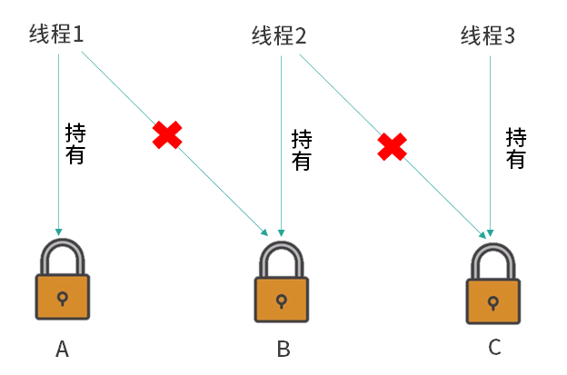

<!-- TOC -->

- [01、如何写一个必然死锁的例子？](#01如何写一个必然死锁的例子)
    - [1、死锁的影响](#1死锁的影响)
        - [1、数据库中](#1数据库中)
        - [2、JVM 中](#2jvm-中)
        - [3、几率不高但危害大](#3几率不高但危害大)
    - [2、发生死锁的例子](#2发生死锁的例子)
- [02、发生死锁必须满足哪 4 个条件？](#02发生死锁必须满足哪-4-个条件)
- [03、如何用命令行和代码定位死锁？](#03如何用命令行和代码定位死锁)
    - [1、命令：jstack](#1命令jstack)
    - [2、代码：ThreadMXBean](#2代码threadmxbean)
- [04、有哪些解决死锁问题的策略？](#04有哪些解决死锁问题的策略)
    - [1、避免策略（检查线程的执行顺序，避免资源竞争）](#1避免策略检查线程的执行顺序避免资源竞争)
    - [2、检测与恢复策略](#2检测与恢复策略)
        - [方法1——线程终止](#方法1线程终止)
        - [方法2——资源抢占](#方法2资源抢占)
    - [3、鸵鸟策略](#3鸵鸟策略)
    - [4、其他避免死锁方案](#4其他避免死锁方案)

<!-- /TOC -->


# 01、如何写一个必然死锁的例子？


> 1、什么是死锁

- 发生在并发中

首先你要知道，死锁一定发生在并发场景中。我们为了保证线程安全，有时会给程序使用各种能保证并发安全的工具，尤其是锁，但是如果在使用过程中处理不得当，就有可能会导致发生死锁的情况。

- 互不相让

死锁是一种状态，当两个（或多个）线程（或进程）相互持有对方所需要的资源，却又都不主动释放自己手中所持有的资源，导致大家都获取不到自己想要的资源，所有相关的线程（或进程）都无法继续往下执行，在未改变这种状态之前都不能向前推进，我们就把这种状态称为死锁状态，认为它们发生了死锁。通俗的讲，死锁就是两个或多个线程（或进程）被无限期地阻塞，相互等待对方手中资源的一种状态。


> 2、两个线程的例子


此时我们有两个线程，分别是线程 A 和线程 B，假设线程 A 现在持有了锁 A，线程 B 持有了锁 B，然后线程 A 尝试去获取锁 B，当然它获取不到，因为线程 B 还没有释放锁 B。然后线程 B 又来尝试获取锁 A，同样线程 B 也获取不到锁 A，因为锁 A 已经被线程 A 持有了。这样一来，线程 A 和线程 B 就发生了死锁，因为它们都相互持有对方想要的资源，却又不释放自己手中的资源，形成相互等待，而且会一直等待下去。

> 3、多个线程造成死锁的情况

死锁不仅仅存在于两个线程的场景，在多个线程中也同样存在。如果多个线程之间的依赖关系是环形，存在环路的依赖关系，那么也可能会发生死锁。



首先线程 1 持有了锁 A，然后线程 2 持有了锁 B，然后线程 3 持有了锁 C，现在每个线程都分别持有一把锁。接下来线程 1 想要去持有锁 B，可是它获取不到，因为现在锁 B 正在线程 2 的手里；接下来线程 2 又去尝试获取锁 C， 它同样也获取不到，因为现在锁 C 在线程 3 的手里；然后线程 3 去尝试获取锁 A ，当然它也获取不到，因为锁 A 现在在线程 1 的手里，这样一来线程 1、线程 2 和线程 3 相互之间就形成了一个环，这就是在多线程中发生死锁的情况。所以不仅是两个线程，多个线程同样也有可能会发生死锁的情况。

## 1、死锁的影响

死锁的影响在不同系统中是不一样的，影响的大小一部分取决于当前这个系统或者环境对死锁的处理能力。

### 1、数据库中

例如，在数据库系统软件的设计中，考虑了监测死锁以及从死锁中恢复的情况。在执行一个事务的时候可能需要获取多把锁，并一直持有这些锁直到事务完成。在某个事务中持有的锁可能在其他事务中也需要，因此在两个事务之间有可能发生死锁的情况，一旦发生了死锁，如果没有外部干涉，那么两个事务就会永远的等待下去。但数据库系统不会放任这种情况发生，当数据库检测到这一组事务发生了死锁时，根据策略的不同，可能会选择放弃某一个事务，被放弃的事务就会释放掉它所持有的锁，从而使其他的事务继续顺利进行。此时程序可以重新执行被强行终止的事务，而这个事务现在就可以顺利执行了，因为所有跟它竞争资源的事务都已经在刚才执行完毕，并且释放资源了。

### 2、JVM 中

在 JVM 中，对于死锁的处理能力就不如数据库那么强大了。如果在 JVM 中发生了死锁，JVM 并不会自动进行处理，所以一旦死锁发生，就会陷入无穷的等待。

### 3、几率不高但危害大

死锁的问题和其他的并发安全问题一样，是概率性的，也就是说，即使存在发生死锁的可能性，也并不是 100% 会发生的。如果每个锁的持有时间很短，那么发生冲突的概率就很低，所以死锁发生的概率也很低。但是在线上系统里，可能每天有几千万次的“获取锁”、“释放锁”操作，在巨量的次数面前，整个系统发生问题的几率就会被放大，只要有某几次操作是有风险的，就可能会导致死锁的发生。

也正是因为死锁“不一定会发生”的特点，导致提前找出死锁成为了一个难题。压力测试虽然可以检测出一部分可能发生死锁的情况，但是并不足以完全模拟真实、长期运行的场景，因此没有办法把所有潜在可能发生死锁的代码都找出来。

一旦发生了死锁，根据发生死锁的线程的职责不同，就可能会造成子系统崩溃、性能降低甚至整个系统崩溃等各种不良后果。而且死锁往往发生在高并发、高负载的情况下，因为可能会直接影响到很多用户，造成一系列的问题。以上就是死锁发生几率不高但是危害大的特点。

## 2、发生死锁的例子

下面我们举一个必然会发生死锁的例子，代码如下所示：

```java
public class MustDeadLock implements Runnable {

    public int flag;
    static Object o1 = new Object();
    static Object o2 = new Object();

    public void run() {
        System.out.println("线程"+Thread.currentThread().getName() + "的flag为" + flag);
        if (flag == 1) {
            synchronized (o1) {
                try {
                    Thread.sleep(500);
                } catch (Exception e) {
                    e.printStackTrace();
                }
                synchronized (o2) {
                    System.out.println("线程1获得了两把锁");
                }
            }
        }
        if (flag == 2) {
            synchronized (o2) {
                try {
                    Thread.sleep(500);
                } catch (Exception e) {
                    e.printStackTrace();
                }
                synchronized (o1) {
                    System.out.println("线程2获得了两把锁");
                }
            }
        }
    }

    public static void main(String[] argv) {
        MustDeadLock r1 = new MustDeadLock();
        MustDeadLock r2 = new MustDeadLock();
        r1.flag = 1;
        r2.flag = 2;
        Thread t1 = new Thread(r1, "t1");
        Thread t2 = new Thread(r2, "t2");
        t1.start();
        t2.start();
    }
}
```

可以看到，在这段代码中有一个 int 类型的 flag，它是一个标记位，然后我们新建了 o1 和 o2、作为 synchronized 的锁对象。

下面我们来看看 run 方法。在 run 方法里面，它会首先打印出当前线程的名字，然后打印出当前线程 flag 的值是多少。

如果 flag 等于 1，就会先获取 o1 这把锁，然后休眠 500 毫秒，再去尝试获取 o2 这把锁并且打印出"线程1获得了两把锁"。

如果 flag 等于 2，那么情况恰恰相反，线程会先获取 o2 这把锁，然后休眠 500 毫秒，再去获取 o1 这把锁，并且打印出"线程2获得了两把锁"。

最后我们来看一下 main 方法，在 main 方法中新建了两个本类的实例，也就是两个 Runnable 对象，并且把它们的 flag 分别改为 1 和 2：r1 的 flag 设置为 1，r2 的 flag 设置为 2。然后新建两个线程，分别去执行这两个 Runnable 对象，执行 r1 和 r2 这两个线程的名字分别叫做 t1 和 t2，最后我们把两个线程给启动起来。

程序的一种执行结果：

线程t1的flag为1

线程t2的flag为2

这里的重点就在于程序执行到此时还在继续执行，并没停止，并且它永远不会打印出“线程 1 获得了两把锁”或“线程 2 获得了两把锁”这样的语句，此时这里就发生了死锁。


> 对发生死锁的过程进行分析：

当第 1 个线程运行的时候，它会发现自己的 flag 是 1 ，所以它会尝试先获得 o1 这把锁，然后休眠 500 毫秒。

在线程 1 启动并休眠的期间，线程 2 同样会启动起来。由于线程 2 的 flag 是 2，所以它会进入到下面 的 if (flag == 2) 对应的代码块中，然后线程 2 首先会去获取 o2 这把锁。也就是说在线程 1 启动并获取到 o1 这把锁之后进行休眠的期间，线程 2 获取到了 o2 这把锁，然后线程 2 也开始 500 毫秒的休眠。

当线程 1 的 500 毫秒休眠时间结束后，它将尝试去获取 o2 这把锁，此时 o2 这个锁正被线程 2 持有，所以线程 1 无法获取到的 o2。

紧接着线程 2 也会苏醒过来，它将尝试获取 o1 这把锁，此时 o1 已被线程 1 持有。

所以现在的状态是，线程 1 卡在获取 o2 这把锁的位置，而线程 2 卡在获取 o1 这把锁的位置，这样一来线程 1 和线程 2 就形成了相互等待，需要对方持有的资源才能继续执行，从而形成了死锁。在这个例子里，如果线程 2 比线程 1 先启动，情况也是类似的，最终也会形成死锁。这就是一个“必然发生死锁的例子”。


 


# 02、发生死锁必须满足哪 4 个条件？


- 第 1 个叫互斥条件，它的意思是每个资源每次只能被一个线程（或进程，下同）使用，为什么资源不能同时被多个线程或进程使用呢？这是因为如果每个人都可以拿到想要的资源，那就不需要等待，所以是不可能发生死锁的。

- 第 2 个是请求与保持条件，它是指当一个线程因请求资源而阻塞时，则需对已获得的资源保持不放。如果在请求资源时阻塞了，并且会自动释放手中资源（例如锁）的话，那别人自然就能拿到我刚才释放的资源，也就不会形成死锁。

- 第 3 个是不剥夺条件，它是指线程已获得的资源，在末使用完之前，不会被强行剥夺。比如我们在上一课时中介绍的数据库的例子，它就有可能去强行剥夺某一个事务所持有的资源，这样就不会发生死锁了。所以要想发生死锁，必须满足不剥夺条件，也就是说当现在的线程获得了某一个资源后，别人就不能来剥夺这个资源，这才有可能形成死锁。

- 第 4 个是循环等待条件，只有若干线程之间形成一种头尾相接的循环等待资源关系时，才有可能形成死锁，比如在两个线程之间，这种“循环等待”就意味着它们互相持有对方所需的资源、互相等待；而在三个或更多线程中，则需要形成环路，例如依次请求下一个线程已持有的资源等。

> 案例解析

看下上面所写的必然死锁的例子中，看看它是否一一满足了这 4 个条件

我们先来看一下第 1 个互斥条件，很显然，我们使用的是 synchronized 互斥锁，它的锁对象 o1、o2 只能同时被一个线程所获得，所以是满足互斥条件的。

第 2 个是请求与保持条件，可以看到，同样是满足的。比如，线程 1 在获得 o1 这把锁之后想去尝试获取 o2 这把锁 ，这时它被阻塞了，但是它并不会自动去释放 o1 这把锁，而是对已获得的资源保持不放。

第 3 个是不剥夺条件，在我们这个代码程序中，JVM 并不会主动把某一个线程所持有的锁剥夺，所以也满足不剥夺条件。

第 4 个是循环等待条件，可以看到在我们的例子中，这两个线程都想获取对方已持有的资源，也就是说线程 1 持有 o1 去等待 o2，而线程 2 则是持有 o2 去等待 o1，这是一个环路，此时就形成了一个循环等待。


可以看出，在我们的例子中确实满足这 4 个必要条件，今后我们就可以从这 4 个发生死锁的必要条件出发，来解决死锁的问题，只要破坏任意一个条件就可以消除死锁，这也是我们后面要讲的解决死锁策略中重点要考虑的内容。


# 03、如何用命令行和代码定位死锁？

下面就来看一下是如何用命令行的方式找到死锁的。

## 1、命令：jstack

这个命令叫作 jstack，它能看到我们 Java 线程的一些相关信息。如果是比较明显的死锁关系，那么这个工具就可以直接检测出来；如果死锁不明显，那么它无法直接检测出来，不过我们也可以借此来分析线程状态，进而就可以发现锁的相互依赖关系，所以这也是很有利于我们找到死锁的方式。


首先，我们运行死锁的 MustDeadLock 类。


由于它发生了死锁，在我们没有干预的情况下，程序在运行后就不会停止；然后打开我们的终端，执行 ${JAVA_HOME}/bin/jps 这个命令，就可以查看到当前 Java 程序的 pid，我的执行结果如下：

56402 MustDeadLock

MustDeadLock 这类的 pid 56402；然后我们继续执行下一个命令，${JAVA_HOME}/bin/jstack 加空格，接着输入我们刚才所拿到的这个类的 pid，也就是 56402，所以完整的命令是 ${JAVA_HOME}/bin/jstack 56402；最后它会打印出很多信息，就包含了线程获取锁的信息，比如哪个线程获取哪个锁，它获得的锁是在哪个语句中获得的，它正在等待或者持有的锁是什么等，这些重要信息都会打印出来。我们截取一部分和死锁相关的有用信息，展示如下：

```java
Found one Java-level deadlock:
=============================
"t2":
  waiting to lock monitor 0x00007fa06c004a18 (object 0x000000076adabaf0, a java.lang.Object),
  which is held by "t1"
"t1":
  waiting to lock monitor 0x00007fa06c007358 (object 0x000000076adabb00, a java.lang.Object),
  which is held by "t2"

Java stack information for the threads listed above:
===================================================
"t2":
	at lesson67.MustDeadLock.run(MustDeadLock.java:31)
	- waiting to lock <0x000000076adabaf0> (a java.lang.Object)
	- locked <0x000000076adabb00> (a java.lang.Object)
	at java.lang.Thread.run(Thread.java:748)
"t1":
	at lesson67.MustDeadLock.run(MustDeadLock.java:19)
	- waiting to lock <0x000000076adabb00> (a java.lang.Object)
	- locked <0x000000076adabaf0> (a java.lang.Object)
	at java.lang.Thread.run(Thread.java:748)

Found 1 deadlock

```

在这里它首先会打印“Found one Java-level deadlock”，表明“找到了一个死锁”，然后是更详细的信息，从中间这部分的信息中可以看出，t2 线程想要去获取这个尾号为 af0 的锁对象，但是它被 t1 线程持有，同时 t2 持有尾号为 b00 的锁对象；相反，t1 想要获取尾号为 b00 的锁对象，但是它被 t2 线程持有，同时 t1 持有的却是尾号为 af0 的锁对象，这就形成了一个依赖环路，发生了死锁。最后它还打印出了“Found 1 deadlock.”，可以看出，jstack 工具不但帮我们找到了死锁，甚至还把哪个线程、想要获取哪个锁、形成什么样的环路都告诉我们了，当我们有了这样的信息之后，死锁就非常容易定位了，所以接下来我们就可以进一步修改代码，来避免死锁了。

以上就是利用 jstack 来定位死锁的方法，jstack 可以用来帮助我们分析线程持有的锁和需要的锁，然后分析出是否有循环依赖形成死锁的情况。

## 2、代码：ThreadMXBean

下面我们再看一下用代码来定位死锁的方式。

我们会用到 ThreadMXBean 工具类，代码示例如下：

```java
public class DetectDeadLock implements Runnable {

    public int flag;
    static Object o1 = new Object();
    static Object o2 = new Object();


    public void run() {
        System.out.println(Thread.currentThread().getName()+" flag = " + flag);
        if (flag == 1) {
            synchronized (o1) {
                try {
                    Thread.sleep(500);
                } catch (Exception e) {
                    e.printStackTrace();
                }
                synchronized (o2) {
                    System.out.println("线程1获得了两把锁");
                }
            }
        }
        if (flag == 2) {
            synchronized (o2) {
                try {
                    Thread.sleep(500);
                } catch (Exception e) {
                    e.printStackTrace();
                }
                synchronized (o1) {
                    System.out.println("线程2获得了两把锁");
                }
            }
        }
    }

    public static void main(String[] argv) throws InterruptedException {
        DetectDeadLock r1 = new DetectDeadLock();
        DetectDeadLock r2 = new DetectDeadLock();
        r1.flag = 1;
        r2.flag = 2;
        Thread t1 = new Thread(r1,"t1");
        Thread t2 = new Thread(r2,"t2");
        t1.start();
        t2.start();
        Thread.sleep(1000);
        ThreadMXBean threadMXBean = ManagementFactory.getThreadMXBean();
        long[] deadlockedThreads = threadMXBean.findDeadlockedThreads();
        if (deadlockedThreads != null && deadlockedThreads.length > 0) {
            for (int i = 0; i < deadlockedThreads.length; i++) {
                ThreadInfo threadInfo = threadMXBean.getThreadInfo(deadlockedThreads[i]);
                System.out.println("线程id为"+threadInfo.getThreadId()+",线程名为" + threadInfo.getThreadName()+"的线程已经发生死锁，需要的锁正被线程"+threadInfo.getLockOwnerName()+"持有。");
            }
        }
    }
}
```

这个类是在前面 MustDeadLock 类的基础上做了升级，MustDeadLock 类的主要作用就是让线程 1 和线程 2 分别以不同的顺序来获取到 o1 和 o2 这两把锁，并且形成死锁。在 main 函数中，在启动 t1 和 t2 之后的代码，是我们本次新加入的代码，我们用 Thread.sleep(1000) 来确保已经形成死锁，然后利用 ThreadMXBean 来检查死锁。

通过 ThreadMXBean 的 findDeadlockedThreads 方法，可以获取到一个 deadlockedThreads 的数组，然后进行判断，当这个数组不为空且长度大于 0 的时候，我们逐个打印出对应的线程信息。比如我们打印出了线程 id，也打印出了线程名，同时打印出了它所需要的那把锁正被哪个线程所持有，那么这一部分代码的运行结果如下。

```
t1 flag = 1
t2 flag = 2
线程 id 为 12，线程名为 t2 的线程已经发生死锁，需要的锁正被线程 t1 持有。
线程 id 为 11，线程名为 t1 的线程已经发生死锁，需要的锁正被线程 t2 持有。
```

一共有四行语句，前两行是“t1 flag = 1“、“t2 flag = 2”，这是发生死锁之前所打印出来的内容；然后的两行语句就是我们检测到的死锁的结果，可以看到，它打印出来的是“线程 id 为 12，线程名为 t2 的线程已经发生了死锁，需要的锁正被线程 t1 持有。”同样的，它也会打印出“线程 id 为 11，线程名为 t1 的线程已经发生死锁，需要的锁正被线程 t2 持有。”

可以看出，ThreadMXBean 也可以帮我们找到并定位死锁，如果我们在业务代码中加入这样的检测，那我们就可以在发生死锁的时候及时地定位，同时进行报警等其他处理，也就增强了我们程序的健壮性。

# 04、有哪些解决死锁问题的策略？


> 线上发生死锁应该怎么办

如果线上环境发生了死锁，那么其实不良后果就已经造成了，修复死锁的最好时机在于“防患于未然”，而不是事后补救。就好比发生火灾时，一旦着了大火，想要不造成损失去扑灭几乎已经不可能了。死锁也是一样的，如果线上发生死锁问题，为了尽快减小损失，最好的办法是保存 JVM 信息、日志等“案发现场”的数据，然后立刻重启服务，来尝试修复死锁。为什么说重启服务能解决这个问题呢？因为发生死锁往往要有很多前提条件的，并且当并发度足够高的时候才有可能会发生死锁，所以重启后再次立刻发生死锁的几率并不是很大，当我们重启服务器之后，就可以暂时保证线上服务的可用，然后利用刚才保存过的案发现场的信息，排查死锁、修改代码，最终重新发布。


我们有哪些常见的对于死锁的修复策略呢？下面将会介绍三种主要的修复策略，分别是：

- 避免策略
- 检测与恢复策略
- 鸵鸟策略


## 1、避免策略（检查线程的执行顺序，避免资源竞争）

避免策略最主要的思路就是，优化代码逻辑，从根本上消除发生死锁的可能性。通常而言，发生死锁的一个主要原因是顺序相反的去获取不同的锁。因此我们就演示如何通过调整锁的获取顺序来避免死锁。

转账时避免死锁

我们先来看一下转账时发生死锁的情况。这个例子是一个示意性的，是为了学习死锁所而写的例子，所以和真实的银行系统的设计有很大不同，不过没关系，因为我们主要看的是如何避免死锁，而不是转账的业务逻辑。

（1）发生了死锁

我们的转账系统为了保证线程安全，在转账前需要首先获取到两把锁（两个锁对象），分别是被转出的账户和被转入的账户。如果不做这一层限制，那么在某一个线程修改余额的期间，可能会有其他线程同时修改该变量，可能导致线程安全问题。所以在没有获取到这两把锁之前，是不能对余额进行操作的；只有获取到这两把锁之后，才能进行接下来真正的转账操作。当然，如果要转出的余额大于账户的余额，也不能转账，因为不允许余额变成负数。

而这期间就隐藏着发生死锁的可能，我们来看下代码：

```java
public class TransferMoney implements Runnable {

    int flag;
    static Account a = new Account(500);
    static Account b = new Account(500);

    static class Account {

        public Account(int balance) {
            this.balance = balance;
        }

        int balance;
    }

    @Override
    public void run() {
        if (flag == 1) {
            transferMoney(a, b, 200);
        }
        if (flag == 0) {
            transferMoney(b, a, 200);
        }
    }

    public static void transferMoney(Account from, Account to, int amount) {
        //先获取两把锁，然后开始转账
        synchronized (to) {
            synchronized (from) {
                if (from.balance - amount < 0) {
                    System.out.println("余额不足，转账失败。");
                    return;
                }
                from.balance -= amount;
                to.balance += amount;
                System.out.println("成功转账" + amount + "元");
            }
        }
    }

    public static void main(String[] args) throws InterruptedException {
        TransferMoney r1 = new TransferMoney();
        TransferMoney r2 = new TransferMoney();
        r1.flag = 1;
        r2.flag = 0;
        Thread t1 = new Thread(r1);
        Thread t2 = new Thread(r2);
        t1.start();
        t2.start();
        t1.join();
        t2.join();
        System.out.println("a的余额" + a.balance);
        System.out.println("b的余额" + b.balance);
        }
    }
```

在代码中，首先定义了 int 类型的 flag，它是一个标记位，用于控制不同线程执行不同逻辑。然后建了两个 Account 对象 a 和 b，代表账户，它们最初都有 500 元的余额。

我们接下来看 run 方法，该方法里面会根据 flag 值，来决定传入 transferMoney 方法的参数的顺序，如果 flag 为 1，那么就代表从 a 账户转给 b 账户 200元；相反，如果 flag 为 0，那么它就从 b 账户转给 a 账户 200 元。

我们再来看一下 transferMoney 转账方法，这个方法会先尝试获取两把锁，也就是 synchronized (to) 和 synchronized (from)。当都获取成功之后，它首先会判断余额是不是足以转出本次的转账金额，如果不足的话，则直接用 return 来退出；如果余额足够，就对转出账户进行减余额，对被转入的账户加余额，最后打印出“成功转账 XX 元”的消息。

在主函数中我们新建了两个 TransferMoney 对象，并且把它们的 flag 分别设置为 1 和 0，然后分别传入两个线程中，并把它们都启动起来，最后，打印出各自的余额。

执行结果如下：

```
成功转账200元
成功转账200元
a的余额500
b的余额500
```

代码是可以正常执行的，打印结果也是符合逻辑的。此时并没有发生死锁，因为每个锁的持有时间很短，同时释放也很快，所以在低并发的情况下，不容易发生死锁的现象。那我们对代码做一些小调整，让它发生死锁。

如果我们在两个 synchronized 之间加上一个 Thread.sleep(500)，来模拟银行网络迟延等情况，那么 transferMoney 方法就变为：

```java
public static void transferMoney(Account from, Account to, int amount) {
    //先获取两把锁，然后开始转账
    synchronized (to) {
        try {
            Thread.sleep(500);
        } catch (InterruptedException e) {
            e.printStackTrace();
        }
        synchronized (from) {
            if (from.balance - amount < 0) {
                System.out.println("余额不足，转账失败。");
                return;
            }
            from.balance -= amount;
            to.balance += amount;
            System.out.println("成功转账" + amount + "元");
        }
    }
}
```

可以看到 transferMoney 的变化就在于，在两个 synchronized 之间，也就是获取到第一把锁后、获取到第二把锁前，我们加了睡眠 500 毫秒的语句。此时再运行程序，会有很大的概率发生死锁，从而导致控制台中不打印任何语句，而且程序也不会停止。

我们分析一下它为什么会发生死锁，最主要原因就是，两个不同的线程获取两个锁的顺序是相反的（第一个线程获取的这两个账户和第二个线程获取的这两个账户顺序恰好相反，第一个线程的“转出账户”正是第二个线程的“转入账户”），所以我们就可以从这个“相反顺序”的角度出发，来解决死锁问题。

（2）实际上不在乎获取锁的顺序

经过思考，我们可以发现，其实转账时，并不在乎两把锁的相对获取顺序。转账的时候，我们无论先获取到转出账户锁对象，还是先获取到转入账户锁对象，只要最终能拿到两把锁，就能进行安全的操作。所以我们来调整一下获取锁的顺序，使得先获取的账户和该账户是“转入”或“转出”无关，而是使用 HashCode 的值来决定顺序，从而保证线程安全。

修复之后的 transferMoney 方法如下：

```java
//先从hash值小的加锁
public static void transferMoney(Account from, Account to, int amount) {

    int fromHash = System.identityHashCode(from);
    int toHash = System.identityHashCode(to);
    if (fromHash < toHash) {
        synchronized (from) {
            synchronized (to) {
                if (from.balance - amount < 0) {
                    System.out.println("余额不足，转账失败。");
                    return;
                }
                from.balance -= amount;
                to.balance += amount;
                System.out.println("成功转账" + amount + "元");
            }
        }
    } else if (fromHash > toHash) {
        synchronized (to) {
            synchronized (from) {
                if (from.balance - amount < 0) {
                    System.out.println("余额不足，转账失败。");
                    return;
                }
                from.balance -= amount;
                to.balance += amount;
                System.out.println("成功转账" + amount + "元");
            }
        }
    }
}
```

可以看到，我们会分别计算出这两个 Account 的 HashCode，然后根据 HashCode 的大小来决定获取锁的顺序。这样一来，不论是哪个线程先执行，不论是转出还是被转入，它获取锁的顺序都会严格根据 HashCode 的值来决定，那么大家获取锁的顺序就一样了，就不会出现获取锁顺序相反的情况，也就避免了死锁。

（3）有主键就更安全、方便

下面我们看一下用主键决定锁获取顺序的方式，它会更加的安全方便。刚才我们使用了 HashCode 作为排序的标准，因为 HashCode 比较通用，每个对象都有，不过这依然有极小的概率会发生 HashCode 相同的情况。在实际生产中，需要排序的往往是一个实体类，而一个实体类一般都会有一个主键 ID，主键 ID 具有唯一、不重复的特点，所以如果我们这个类包含主键属性的话就方便多了，我们也没必要去计算 HashCode，直接使用它的主键 ID 来进行排序，由主键 ID 大小来决定获取锁的顺序，就可以确保避免死锁。


## 2、检测与恢复策略

什么是死锁检测算法？它和之前避免死锁的策略不一样，避免死锁是通过逻辑让死锁不发生，而这里的检测与恢复策略，是先允许系统发生死锁，然后再解除。例如系统可以在每次调用锁的时候，都记录下来调用信息，形成一个“锁的调用链路图”，然后隔一段时间就用死锁检测算法来检测一下，搜索这个图中是否存在环路，一旦发生死锁，就可以用死锁恢复机制，比如剥夺某一个资源，来解开死锁，进行恢复。所以它的思路和之前的死锁避免策略是有很大不同的。

在检测到死锁发生后，如何解开死锁呢？

### 方法1——线程终止

第一种解开死锁的方法是线程（或进程，下同）终止，在这里，系统会逐个去终止已经陷入死锁的线程，线程被终止，同时释放资源，这样死锁就会被解开。

当然这个终止是需要讲究顺序的，一般有以下几个考量指标。

（1）优先级

一般来说，终止时会考虑到线程或者进程的优先级，先终止优先级低的线程。例如，前台线程会涉及界面显示，这对用户而言是很重要的，所以前台线程的优先级往往高于后台线程。

（2）已占用资源、还需要的资源

同时也会考虑到某个线程占有的资源有多少，还需要的资源有多少？如果某线程已经占有了一大堆资源，只需要最后一点点资源就可以顺利完成任务，那么系统可能就不会优先选择终止这样的线程，会选择终止别的线程来优先促成该线程的完成。

（3）已经运行时间

另外还可以考虑的一个因素就是已经运行的时间，比如当前这个线程已经运行了很多个小时，甚至很多天了，很快就能完成任务了，那么终止这个线程可能不是一个明智的选择，我们可以让那些刚刚开始运行的线程终止，并在之后把它们重新启动起来，这样成本更低。

这里会有各种各样的算法和策略，我们根据实际业务去进行调整就可以了。

### 方法2——资源抢占

第二个解开死锁的方法就是资源抢占。其实，我们不需要把整个的线程终止，而是只需要把它已经获得的资源进行剥夺，比如让线程回退几步、 释放资源，这样一来就不用终止掉整个线程了，这样造成的后果会比刚才终止整个线程的后果更小一些，成本更低。

当然这种方式也有一个缺点，那就是如果算法不好的话，我们抢占的那个线程可能一直是同一个线程，就会造成线程饥饿。也就是说，这个线程一直被剥夺它已经得到的资源，那么它就长期得不到运行。

以上就是死锁的检测与恢复策略。

## 3、鸵鸟策略


鸵鸟策略的意思就是，如果我们的系统发生死锁的概率不高，并且一旦发生其后果不是特别严重的话，我们就可以选择先忽略它。直到死锁发生的时候，我们再人工修复，比如重启服务，这并不是不可以的。如果我们的系统用的人比较少，比如是内部的系统，那么在并发量极低的情况下，它可能几年都不会发生死锁。对此我们考虑到投入产出比，自然也没有必要去对死锁问题进行特殊的处理，这是需要根据我们的业务场景进行合理选择的。


## 4、其他避免死锁方案

- 1、使用ReentrantLock和ReentrantReadWriteLock时，尽量使用tryLock(long timeout, TimeUnit unit)的方法(ReentrantLock、ReentrantReadWriteLock)，设置超时时间，超时可以退出防止死锁。
- 2、尽量使用java.util.concurrent(jdk 1.5以上)包的并发类代替手写控制并发，比较常用的是ConcurrentHashMap、ConcurrentLinkedQueue、AtomicBoolean等等，实际应用中java.util.concurrent.atomic十分有用，简单方便且效率比使用Lock更高
- 3、尽量降低锁的使用粒度，尽量不要几个功能用同一把锁，能锁块不锁方法
- 4、尽量减少同步的代码块，synchronized


