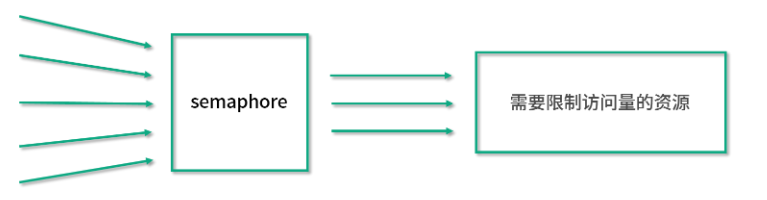
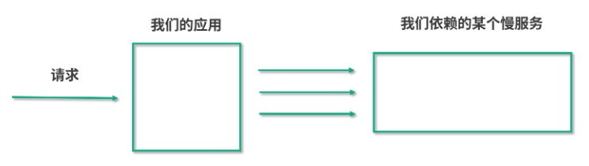
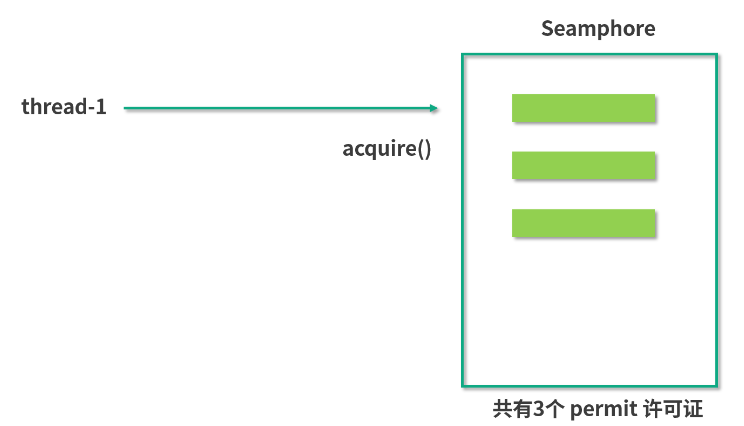
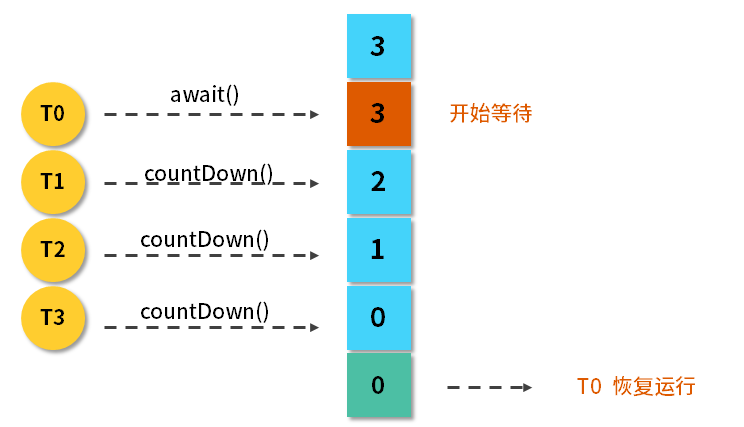

<!-- TOC -->

- [01、信号量Semaphore能被FixedThreadPool替代吗？](#01信号量semaphore能被fixedthreadpool替代吗)
    - [1、Semaphore信号量概念](#1semaphore信号量概念)
    - [2、应用实例使用场景](#2应用实例使用场景)
        - [1、正常情况下获取许可证](#1正常情况下获取许可证)
        - [2、没许可证时，会阻塞前来请求的线程](#2没许可证时会阻塞前来请求的线程)
    - [3、用法使用流程](#3用法使用流程)
    - [4、主要方法介绍](#4主要方法介绍)
    - [5、示例代码](#5示例代码)
- [02、CountDownLatch 是如何安排线程执行顺序的？](#02countdownlatch-是如何安排线程执行顺序的)
    - [1、主要方法介绍](#1主要方法介绍)
    - [2、用法](#2用法)
        - [用法一：一个线程等待其他多个线程都执行完毕，再继续自己的工作](#用法一一个线程等待其他多个线程都执行完毕再继续自己的工作)
        - [3、用法二：多个线程等待某一个线程的信号，同时开始执行](#3用法二多个线程等待某一个线程的信号同时开始执行)
- [03、CyclicBarrier 和 CountdownLatch 有什么异同？](#03cyclicbarrier-和-countdownlatch-有什么异同)
    - [1、CyclicBarrier作用](#1cyclicbarrier作用)
    - [2、执行动作 barrierAction](#2执行动作-barrieraction)
    - [3、CyclicBarrier 和 CountDownLatch 的异同](#3cyclicbarrier-和-countdownlatch-的异同)
- [04、Condition、object.wait() 和 notify() 的关系？](#04conditionobjectwait-和-notify-的关系)
    - [1、Condition接口作用](#1condition接口作用)
    - [2、用 Condition 和 wait/notify 实现简易版阻塞队列](#2用-condition-和-waitnotify-实现简易版阻塞队列)
        - [1、用 Condition 实现简易版阻塞队列](#1用-condition-实现简易版阻塞队列)
        - [2、用 wait/notify 实现简易版阻塞队列](#2用-waitnotify-实现简易版阻塞队列)
    - [2、Condition 和 wait/notify的关系](#2condition-和-waitnotify的关系)

<!-- /TOC -->


控制并发流程的工具类作用就是更容易地让线程之间相互配合，比如让线程 A 等待线程 B 执行完毕后再继续执行，来满足业务逻辑。

# 01、信号量Semaphore能被FixedThreadPool替代吗？


## 1、Semaphore信号量概念




从图中可以看出，信号量的一个最主要的作用就是，来控制那些需要限制并发访问量的资源。具体来讲，信号量会维护“许可证”的计数，而线程去访问共享资源前，必须先拿到许可证。线程可以从信号量中去“获取”一个许可证，一旦线程获取之后，信号量持有的许可证就转移过去了，所以信号量手中剩余的许可证要减一。

同理，线程也可以“释放”一个许可证，如果线程释放了许可证，这个许可证相当于被归还给信号量了，于是信号量中的许可证的可用数量加一。当信号量拥有的许可证数量减到 0 时，如果下个线程还想要获得许可证，那么这个线程就必须等待，直到之前得到许可证的线程释放，它才能获取。由于线程在没有获取到许可证之前不能进一步去访问被保护的共享资源，所以这就控制了资源的并发访问量，这就是整体思路。

## 2、应用实例使用场景


我们来看一个具体的场景：



在这个场景中，我们的服务是中间这个方块儿，左侧是请求，右侧是我们所依赖的那个慢服务。出于种种原因（比如计算量大、依赖的下游服务多等），右边的慢服务速度很慢，并且它可以承受的请求数量也很有限，一旦有太多的请求同时到达它这边，可能会导致它这个服务不可用，会压垮它。所以我们必须要保护它，不能让太多的线程同时去访问。那怎么才能做到这件事情呢？

在讲解怎么做到这个事情之前，我们先来看一看，在通常的场景下，我们用一个普通线程池能不能做到这件事情。

```java
public class SemaphoreDemo1 {

    public static void main(String[] args) {
        ExecutorService service = Executors.newFixedThreadPool(50);
        for (int i = 0; i < 1000; i++) {
            service.submit(new Task());
        }
        service.shutdown();
    }

    static class Task implements Runnable {

        @Override
        public void run() {
            System.out.println(Thread.currentThread().getName() + "调用了慢服务");
            try {
                //模拟慢服务
                Thread.sleep(3000);
            } catch (InterruptedException e) {
                e.printStackTrace();
            }
        }
    }
}
```

在这段代码中，有一个固定 50 个线程的线程池，然后给线程池提交 1000 个任务，并且每一个任务所执行的内容，就是去休眠 3 秒钟，来模拟调用这个慢服务的过程。我们启动这个程序，会发现它会从线程 1 一直到线程 50 都去调用这个慢服务，当然实际调用顺序每次都会不一样，但是这 50 个线程都会去几乎同时调用这个慢服务，在这种情况下，就会导致我们的慢服务崩溃。

所以，必须严格限制能够同时到达该服务的请求数。比如，我们想限制同时不超过 3 个请求来访问该服务，该怎么实现呢？并且这里有一点值得注意，我们的前提条件是，线程池中确实有 50 个线程，线程数肯定超过了 3 个，那么怎么进一步控制这么多的线程不同时访问慢服务呢？我们可以通过信号量来解决这个问题。

### 1、正常情况下获取许可证



这张图的方框代表一个许可证为 3 的信号量，每一个绿色的长条代表一个许可证（permit）。现在我们拥有 3 个许可证，并且信号量的特点是非常“慷慨”，只要它持有许可证，别人想请求的话它都会分发的。假设此时 Thread 1 来请求了，在这种情况下，信号量就会把一个许可证给到这边的第一个线程 Thread 1。于是 Thread 1 获得了许可证，Thread 1 拿到许可证之后就拥有了访问慢服务的资格，它紧接着就会去访问我们的慢服务，同时，我们的信号量手中持有的许可证也减为了 2。假设这个慢服务速度很慢，可能长时间内不返回，所以在没返回之前，Thread 1 也会不释放许可证，在此期间第二个线程又来请求了，同理，此时由于信号量手中持有两个许可证，还是可以满足 Thread 2 的需求的，所以就把第二个许可证给了第二个线程。这样一来，第二个线程也拿到了我们的许可证，可以访问右边的慢服务了。同理，在前两个线程返回前，第三个线程也过来了，也是按照同样的方式获得了许可证，并且访问慢服务。

### 2、没许可证时，会阻塞前来请求的线程

至此，我们信号量中的许可证已经没有了，因为原有的 3 个都分给这 3 个线程了。在这种情况下，信号量就可以进一步发挥作用了，此时假设第 4 个线程再来请求找我们信号量拿许可证，由于此时线程 1、线程 2、线程 3 都正在访问“慢服务”，还没归还许可证，而信号量自身也没有更多的许可证了，所以在这个时候就会发生这样的一种情况：线程 4 在找我们用 acquire 方法请求许可证的时候，它会被阻塞，意味着线程 4 没有拿到许可证，也就没有被允许访问“慢服务”，也就是说此时“慢服务”依然只能被前面的 3 个线程访问，这样就达到我们最开始的目的了：限制同时最多有 3 个线程调用我们的慢服务。

> 有线程释放信号量后

假设此时线程 1 因为最早去的，它执行完了这个任务，于是返回了。返回的时候它会调用 release 方法，表示“我处理完了我的任务，我想把许可证还回去”，所以，此时线程 1 就释放了之前持有的许可证，把它还给了我们的信号量，于是信号量所持有的许可证数量从 0 又变回了 1.

此时由于许可证已经归还给了信号量，那么刚才找我们要许可证的线程 4 就可以顺利地拿到刚刚释放的这个许可证了。于是线程 4 也就拥有了访问慢服务的访问权，接下来它也会去访问这个慢服务。

不过要注意，此时线程 1 先归还了许可证给信号量，再由信号量把这个许可证转给线程 4，所以，此时同时访问慢服务的依然只有 3 个线程，分别是线程 2、3 和 4，因为之前的线程 1 已经完成任务并且离开了。


> 如果有两个线程释放许可证

假设程序继续运行，随着时间推移，线程 2 和 3 同时执行完毕，然后释放手中的许可证。于是信号量又重新拥有了 2 个许可证，它会把许可证进一步发放给还有这个需求的线程 5 和线程 6，那么这两个线程也就能访问这个慢服务了：不过此时访问慢服务的就变成了线程 4、5、6，可以看出，总的数量从来没有超过 3 个。

在这个例子中，线程 4 一开始获取许可证的时候被阻塞了，那个时候即使有线程 5 和线程 6 甚至线程 100 都来执行 acquire 方法的话，信号量也会把这些通通给阻塞住，这样就起到了信号量最主要的控制并发量的作用。

> 总结

以上的过程，展示了如何利用信号量，去控制在同一时刻最多只有 3 个线程执行某任务的目的，那主要就是通过控制许可证的发放和归还的方式实现的。

## 3、用法使用流程

使用流程主要分为以下三步。

- 1、首先初始化一个信号量，并且传入许可证的数量，这是它的带公平参数的构造函数：public Semaphore(int permits, boolean fair)，传入两个参数，第一个参数是许可证的数量，另一个参数是是否公平。如果第二个参数传入 true，则代表它是公平的策略，会把之前已经等待的线程放入到队列中，而当有新的许可证到来时，它会把这个许可证按照顺序发放给之前正在等待的线程；如果这个构造函数第二个参数传入 false，则代表非公平策略，也就有可能插队，就是说后进行请求的线程有可能先得到许可证。

- 2、第二个流程是在建立完这个构造函数，初始化信号量之后，我们就可以利用 acquire() 方法。在调用慢服务之前，让线程来调用 acquire 方法或者 acquireUninterruptibly方法，这两个方法的作用是要获取许可证，这同时意味着只有这个方法能顺利执行下去的话，它才能进一步访问这个代码后面的调用慢服务的方法。如果此时信号量已经没有剩余的许可证了，那么线程就会等在 acquire 方法的这一行代码中，所以它也不会进一步执行下面调用慢服务的方法。我们正是用这种方法，保护了我们的慢服务。acquire() 和 acquireUninterruptibly() 的区别是：是否能响应中断。acquire() 是可以支持中断的，也就是说，它在获取信号量的期间，假设这个线程被中断了，那么它就会跳出 acquire() 方法，不再继续尝试获取了。而 acquireUninterruptibly() 方法是不会被中断的。

- 3、第三步就是在任务执行完毕之后，调用 release() 来释放许可证，比如说我们在执行完慢服务这行代码之后，再去执行 release() 方法，这样一来，许可证就会还给我们的信号量了。

## 4、主要方法介绍

除了这几个主要方法以外，还有一些其他的方法：

（1）public boolean tryAcquire()

tryAcquire 和之前介绍锁的 trylock 思维是一致的，是尝试获取许可证，相当于看看现在有没有空闲的许可证，如果有就获取，如果现在获取不到也没关系，不必陷入阻塞，可以去做别的事。

（2）public boolean tryAcquire(long timeout, TimeUnit unit)

同样有一个重载的方法，它里面传入了超时时间。比如传入了 3 秒钟，则意味着最多等待 3 秒钟，如果等待期间获取到了许可证，则往下继续执行；如果超时时间到，依然获取不到许可证，它就认为获取失败，且返回 false。

（3）availablePermits()

这个方法用来查询可用许可证的数量，返回一个整型的结果。

## 5、示例代码

下面我们来看一段示例代码：

```java
public class SemaphoreDemo2 {

    static Semaphore semaphore = new Semaphore(3);//1、初始化信号量

    public static void main(String[] args) {
        ExecutorService service = Executors.newFixedThreadPool(50);
        for (int i = 0; i < 1000; i++) {
            service.submit(new Task());
        }
        service.shutdown();
    }

    static class Task implements Runnable {

        @Override
        public void run() {
            try {
                semaphore.acquire();//2、获取信号量
            } catch (InterruptedException e) {
                e.printStackTrace();
            }
            System.out.println(Thread.currentThread().getName() + "拿到了许可证，花费2秒执行慢服务");
            try {
                Thread.sleep(2000);
            } catch (InterruptedException e) {
                e.printStackTrace();
            }
            System.out.println("慢服务执行完毕，" + Thread.currentThread().getName() + "释放了许可证");
            semaphore.release();//3、释放信号量
        }
    }
}
```

在这段代码中我们新建了一个数量为 3 的信号量，然后又有一个和之前一样的固定 50 线程的线程池，并且往里面放入 1000 个任务。每个任务在执行模拟慢服务之前，会先用信号量的 acquire 方法获取到信号量，然后再去执行这 2 秒钟的慢服务，最后利用 release() 方法来释放许可证。

代码执行结果如下：

```
pool-1-thread-1拿到了许可证，花费2秒执行慢服务
pool-1-thread-2拿到了许可证，花费2秒执行慢服务
pool-1-thread-3拿到了许可证，花费2秒执行慢服务
慢服务执行完毕，pool-1-thread-1释放了许可证
慢服务执行完毕，pool-1-thread-2释放了许可证
慢服务执行完毕，pool-1-thread-3释放了许可证
pool-1-thread-4拿到了许可证，花费2秒执行慢服务
pool-1-thread-5拿到了许可证，花费2秒执行慢服务
pool-1-thread-6拿到了许可证，花费2秒执行慢服务
慢服务执行完毕，pool-1-thread-4释放了许可证
慢服务执行完毕，pool-1-thread-5释放了许可证
慢服务执行完毕，pool-1-thread-6释放了许可证
...
```

它会先让线程 1、2、3 拿到许可证，然后分别去执行这 2 秒钟的慢服务，直到执行完毕则会释放许可证，后面的线程才能进一步拿到许可证来执行服务。当前面 3 个线程还没有执行完毕，也就是还没有释放许可证的时候，后面的线程其实已经来请求了，它们也会尝试调用 acquire 方法，只不过这个时候会被阻塞住。通过执行结果可以看出，同时最多只有 3 个线程可以访问我们的慢服务。

> 特殊用法：一次性获取或释放多个许可证

我们再来介绍一下信号量的一种特殊用法，那就是它可以一次性释放或者获取多个许可证。

比如 semaphore.acquire(2)，里面传入参数 2，这就叫一次性获取两个许可证。同时释放也是一样的，semaphore.release(3) 相当于一次性释放三个许可证。

为什么要这样做呢？我们列举一个使用场景。比如说第一个任务 A（Task A ）会调用很耗资源的方法一 method1()，而任务 B 调用的是方法二 method 2，但这个方法不是特别消耗资源。在这种情况下，假设我们一共有 5 个许可证，只能允许同时有 1 个线程调用方法一，或者同时最多有 5 个线程调用方法二，但是方法一和方法二不能同时被调用。

所以，我们就要求 Task A 在执行之前要一次性获取到 5 个许可证才能执行，而 Task B 只需要获取一个许可证就可以执行了。这样就避免了任务 A 和 B 同时运行，同时又很好的兼顾了效率，不至于同时只允许一个线程访问方法二，那样的话也存在浪费资源的情况，所以这就相当于我们可以根据自己的需求合理地利用信号量的许可证来分配资源。

> 注意点

信号量还有几个注意点：

- 1、获取和释放的许可证数量尽量保持一致，否则比如每次都获取 2 个但只释放 1 个甚至不释放，那么信号量中的许可证就慢慢被消耗完了，最后导致里面没有许可证了，那其他的线程就再也没办法访问了；
- 2、在初始化的时候可以设置公平性，如果设置为 true 则会让它更公平，但如果设置为 false 则会让总的吞吐量更高。
- 3、信号量是支持跨线程、跨线程池的，而且并不是哪个线程获得的许可证，就必须由这个线程去释放。事实上，对于获取和释放许可证的线程是没有要求的，比如线程 A 获取了然后由线程 B 释放，这完全是可以的，只要逻辑合理即可。


> 信号量能被 FixedThreadPool 替代吗？

让我们回到本课时的题目：信号量能不能被 FixedThreadPool 代替呢？这个问题相当于，信号量是可以限制同时访问的线程数，那为什么不直接用固定数量线程池去限制呢？这样不是更方便吗？比如说线程池里面有 3 个线程，那自然最多只有 3 个线程去访问了。

这是一个很好的问题，我们在实际业务中会遇到这样的情况：假如，在调用慢服务之前需要有个判断条件，比如只想在每天的零点附近去访问这个慢服务时受到最大线程数的限制（比如 3 个线程），而在除了每天零点附近的其他大部分时间，我们是希望让更多的线程去访问的。所以在这种情况下就应该把线程池的线程数量设置为 50 ，甚至更多，然后在执行之前加一个 if 判断，如果符合时间限制了（比如零点附近），再用信号量去额外限制，这样做是比较合理的。

再说一个例子，比如说在大型应用程序中会有不同类型的任务，它们也是通过不同的线程池来调用慢服务的。因为调用方不只是一处，可能是 Tomcat 服务器或者网关，我们就不应该限制，或者说也无法做到限制它们的线程池的大小。但可以做的是，在执行任务之前用信号量去限制一下同时访问的数量，因为我们的信号量具有跨线程、跨线程池的特性，所以即便这些请求来自于不同的线程池，我们也可以限制它们的访问。如果用 FixedThreadPool 去限制，那就做不到跨线程池限制了，这样的话会让功能大大削弱。

基于以上的理由，如果想要限制并发访问的线程数，用信号量是更合适的。


# 02、CountDownLatch 是如何安排线程执行顺序的？


我们先来介绍一下 CountDownLatch，它是 JDK 提供的并发流程控制的工具类，它是在 java.util.concurrent 包下，在 JDK1.5 以后加入的。下面举个例子来说明它主要在什么场景下使用。

比如我们去游乐园坐激流勇进，有的时候游乐园里人不是那么多，这时，管理员会让你稍等一下，等人坐满了再开船，这样的话可以在一定程度上节约游乐园的成本。座位有多少，就需要等多少人，这就是 CountDownLatch 的核心思想，等到一个设定的数值达到之后，才能出发。

我们把激流勇进的例子用流程图的方式来表示：




可以看到，最开始 CountDownLatch 设置的初始值为 3，然后 T0 线程上来就调用 await 方法，它的作用是让这个线程开始等待，等待后面的 T1、T2、T3，它们每一次调用 countDown 方法，3 这个数值就会减 1，也就是从 3 减到 2，从 2 减到 1，从 1 减到 0，一旦减到 0 之后，这个 T0 就相当于达到了自己触发继续运行的条件，于是它就恢复运行了。

## 1、主要方法介绍

下面介绍一下 CountDownLatch 的主要方法。

（1）构造函数：public CountDownLatch(int count) {  };

它的构造函数是传入一个参数，该参数 count 是需要倒数的数值。

（2）await()：调用 await() 方法的线程开始等待，直到倒数结束，也就是 count 值为 0 的时候才会继续执行。

（3）await(long timeout, TimeUnit unit)：await() 有一个重载的方法，里面会传入超时参数，这个方法的作用和 await() 类似，但是这里可以设置超时时间，如果超时就不再等待了。

（4）countDown()：把数值倒数 1，也就是将 count 值减 1，直到减为 0 时，之前等待的线程会被唤起。

## 2、用法

接着来介绍一下 CountDownLatch 的两个典型用法。

### 用法一：一个线程等待其他多个线程都执行完毕，再继续自己的工作

在实际场景中，很多情况下需要我们初始化一系列的前置条件（比如建立连接、准备数据），在这些准备条件都完成之前，是不能进行下一步工作的，所以这就是利用 CountDownLatch 的一个很好场景，我们可以让应用程序的主线程在其他线程都准备完毕之后再继续执行。

举个生活中的例子，那就是运动员跑步的场景，比如在比赛跑步时有 5 个运动员参赛，终点有一个裁判员，什么时候比赛结束呢？那就是当所有人都跑到终点之后，这相当于裁判员等待 5 个运动员都跑到终点，宣布比赛结束。我们用代码的形式来写出运动员跑步的场景，代码如下：

```java
public class RunDemo1 {

    public static void main(String[] args) throws InterruptedException {
        CountDownLatch latch = new CountDownLatch(5);
        ExecutorService service = Executors.newFixedThreadPool(5);
        for (int i = 0; i < 5; i++) {
            final int no = i + 1;
            Runnable runnable = new Runnable() {

                @Override
                public void run() {
                    try {
                        Thread.sleep((long) (Math.random() * 10000));
                        System.out.println(no + "号运动员完成了比赛。");
                    } catch (InterruptedException e) {
                        e.printStackTrace();
                    } finally {
                        latch.countDown();
                    }
                }
            };
            service.submit(runnable);
        }
        System.out.println("等待5个运动员都跑完.....");
        latch.await();
        System.out.println("所有人都跑完了，比赛结束。");
    }
}
```

在这段代码中，我们新建了一个初始值为 5 的 CountDownLatch，然后建立了一个固定 5 线程的线程池，用一个 for 循环往这个线程池中提交 5 个任务，每个任务代表一个运动员，这个运动员会首先随机等待一段时间，代表他在跑步，然后打印出他完成了比赛，在跑完了之后，同样会调用 countDown 方法来把计数减 1。

之后我们再回到主线程，主线程打印完“等待 5 个运动员都跑完”这句话后，会调用 await() 方法，代表让主线程开始等待，在等待之前的那几个子线程都执行完毕后，它才会认为所有人都跑完了比赛。这段程序的运行结果如下所示：

```
等待5个运动员都跑完.....
4号运动员完成了比赛。
3号运动员完成了比赛。
1号运动员完成了比赛。
5号运动员完成了比赛。
2号运动员完成了比赛。
所有人都跑完了，比赛结束。
```

可以看出，直到 5 个运动员都完成了比赛之后，主线程才会继续，而且由于子线程等待的时间是随机的，所以各个运动员完成比赛的次序也是随机的。

### 3、用法二：多个线程等待某一个线程的信号，同时开始执行

这和第一个用法有点相反，我们再列举一个实际的场景，比如在运动会上，刚才说的是裁判员等运动员，现在是运动员等裁判员。在运动员起跑之前都会等待裁判员发号施令，一声令下运动员统一起跑，我们用代码把这件事情描述出来，如下所示：

```java
public class RunDemo2 {

    public static void main(String[] args) throws InterruptedException {
        System.out.println("运动员有5秒的准备时间");
        CountDownLatch countDownLatch = new CountDownLatch(1);
        ExecutorService service = Executors.newFixedThreadPool(5);
        for (int i = 0; i < 5; i++) {
            final int no = i + 1;
            Runnable runnable = new Runnable() {
                @Override
                public void run() {
                    System.out.println(no + "号运动员准备完毕，等待裁判员的发令枪");
                    try {
                        countDownLatch.await();
                        System.out.println(no + "号运动员开始跑步了");
                    } catch (InterruptedException e) {
                        e.printStackTrace();
                    }
                }
            };
            service.submit(runnable);
        }
        Thread.sleep(5000);
        System.out.println("5秒准备时间已过，发令枪响，比赛开始！");
        countDownLatch.countDown();
    }
}
```

在这段代码中，首先打印出了运动员有 5 秒的准备时间，然后新建了一个 CountDownLatch，其倒数值只有 1；接着，同样是一个 5 线程的线程池，并且用 for 循环的方式往里提交 5 个任务，而这 5 个任务在一开始时就让它调用 await() 方法开始等待。

接下来我们再回到主线程。主线程会首先等待 5 秒钟，这意味着裁判员正在做准备工作，比如他会喊“各就各位，预备”这样的话语；然后 5 秒之后，主线程会打印出“5 秒钟准备时间已过，发令枪响，比赛开始”的信号，紧接着会调用 countDown 方法，一旦主线程调用了该方法，那么之前那 5 个已经调用了 await() 方法的线程都会被唤醒，所以这段程序的运行结果如下：

```
运动员有5秒的准备时间
2号运动员准备完毕，等待裁判员的发令枪
1号运动员准备完毕，等待裁判员的发令枪
3号运动员准备完毕，等待裁判员的发令枪
4号运动员准备完毕，等待裁判员的发令枪
5号运动员准备完毕，等待裁判员的发令枪
5秒准备时间已过，发令枪响，比赛开始！
2号运动员开始跑步了
1号运动员开始跑步了
5号运动员开始跑步了
4号运动员开始跑步了
3号运动员开始跑步了
```

可以看到，运动员首先会有 5 秒钟的准备时间，然后 5 个运动员分别都准备完毕了，等待发令枪响，紧接着 5 秒之后，发令枪响，比赛开始，于是 5 个子线程几乎同时开始跑步了。

> 注意点

下面来讲一下 CountDownLatch 的注意点：

- 刚才讲了两种用法，其实这两种用法并不是孤立的，甚至可以把这两种用法结合起来，比如利用两个 CountDownLatch，第一个初始值为多个，第二个初始值为 1，这样就可以应对更复杂的业务场景了；
- CountDownLatch 是不能够重用的，比如已经完成了倒数，那可不可以在下一次继续去重新倒数呢？这是做不到的，如果你有这个需求的话，可以考虑使用 CyclicBarrier 或者创建一个新的 CountDownLatch 实例。

> 总结

CountDownLatch 类在创建实例的时候，需要在构造函数中传入倒数次数，然后由需要等待的线程去调用 await 方法开始等待，而每一次其他线程调用了 countDown 方法之后，计数便会减 1，直到减为 0 时，之前等待的线程便会继续运行。


# 03、CyclicBarrier 和 CountdownLatch 有什么异同？


## 1、CyclicBarrier作用

CyclicBarrier 和 CountDownLatch 确实有一定的相似性，它们都能阻塞一个或者一组线程，直到某种预定的条件达到之后，这些之前在等待的线程才会统一出发，继续向下执行。正因为它们有这个相似点，你可能会认为它们的作用是完全一样的，其实并不是。

CyclicBarrier 可以构造出一个集结点，当某一个线程执行 await() 的时候，它就会到这个集结点开始等待，等待这个栅栏被撤销。直到预定数量的线程都到了这个集结点之后，这个栅栏就会被撤销，之前等待的线程就在此刻统一出发，继续去执行剩下的任务。

举一个生活中的例子。假设我们班级春游去公园里玩，并且会租借三人自行车，每个人都可以骑，但由于这辆自行车是三人的，所以要凑齐三个人才能骑一辆，而且从公园大门走到自行车驿站需要一段时间。那么我们模拟这个场景，写出如下代码：

```java
public class CyclicBarrierDemo {

    public static void main(String[] args) {
        CyclicBarrier cyclicBarrier = new CyclicBarrier(3);
        for (int i = 0; i < 6; i++) {
            new Thread(new Task(i + 1, cyclicBarrier)).start();
        }
    }

    static class Task implements Runnable {

        private int id;
        private CyclicBarrier cyclicBarrier;

        public Task(int id, CyclicBarrier cyclicBarrier) {
            this.id = id;
            this.cyclicBarrier = cyclicBarrier;
        }

        @Override
        public void run() {
            System.out.println("同学" + id + "现在从大门出发，前往自行车驿站");
            try {
                Thread.sleep((long) (Math.random() * 10000));
                System.out.println("同学" + id + "到了自行车驿站，开始等待其他人到达");
                cyclicBarrier.await();
                System.out.println("同学" + id + "开始骑车");
            } catch (InterruptedException e) {
                e.printStackTrace();
            } catch (BrokenBarrierException e) {
                e.printStackTrace();
            }
        }
    }
}
```

在这段代码中可以看到，首先建了一个参数为 3 的 CyclicBarrier，参数为 3 的意思是需要等待 3 个线程到达这个集结点才统一放行；然后我们又在 for 循环中去开启了 6 个线程，每个线程中执行的 Runnable 对象就在下方的 Task 类中，直接看到它的 run 方法，它首先会打印出"同学某某现在从大门出发，前往自行车驿站"，然后是一个随机时间的睡眠，这就代表着从大门开始步行走到自行车驿站的时间，由于每个同学的步行速度不一样，所以时间用随机值来模拟。

当同学们都到了驿站之后，比如某一个同学到了驿站，首先会打印出“同学某某到了自行车驿站，开始等待其他人到达”的消息，然后去调用 CyclicBarrier 的 await() 方法。一旦它调用了这个方法，它就会陷入等待，直到三个人凑齐，才会继续往下执行，一旦开始继续往下执行，就意味着 3 个同学开始一起骑车了，所以打印出“某某开始骑车”这个语句。

接下来我们运行一下这个程序，结果如下所示：

```
同学1现在从大门出发，前往自行车驿站
同学3现在从大门出发，前往自行车驿站
同学2现在从大门出发，前往自行车驿站
同学4现在从大门出发，前往自行车驿站
同学5现在从大门出发，前往自行车驿站
同学6现在从大门出发，前往自行车驿站
同学5到了自行车驿站，开始等待其他人到达
同学2到了自行车驿站，开始等待其他人到达
同学3到了自行车驿站，开始等待其他人到达
同学3开始骑车
同学5开始骑车
同学2开始骑车
同学6到了自行车驿站，开始等待其他人到达
同学4到了自行车驿站，开始等待其他人到达
同学1到了自行车驿站，开始等待其他人到达
同学1开始骑车
同学6开始骑车
同学4开始骑车
```

可以看到 6 个同学纷纷从大门出发走到自行车驿站，因为每个人的速度不一样，所以会有 3 个同学先到自行车驿站，不过在这 3 个先到的同学里面，前面 2 个到的都必须等待第 3 个人到齐之后，才可以开始骑车。后面的同学也一样，由于第一辆车已经被骑走了，第二辆车依然也要等待 3 个人凑齐才能统一发车。

要想实现这件事情，如果你不利用 CyclicBarrier 去做的话，逻辑可能会非常复杂，因为你也不清楚哪个同学先到、哪个后到。而用了 CyclicBarrier 之后，可以非常简洁优雅的实现这个逻辑，这就是它的一个非常典型的应用场景。

## 2、执行动作 barrierAction

public CyclicBarrier(int parties, Runnable barrierAction)：当 parties 线程到达集结点时，继续往下执行前，会执行这一次这个动作。

接下来我们再介绍一下它的一个额外功能，就是执行动作 barrierAction 功能。CyclicBarrier 还有一个构造函数是传入两个参数的，第一个参数依然是 parties，代表需要几个线程到齐；第二个参数是一个 Runnable 对象，它就是我们下面所要介绍的 barrierAction。

当预设数量的线程到达了集结点之后，在出发的时候，便会执行这里所传入的 Runnable 对象，那么假设我们把刚才那个代码的构造函数改成如下这个样子：

```java
CyclicBarrier cyclicBarrier = new CyclicBarrier(3, new Runnable() {
    @Override
    public void run() {
        System.out.println("凑齐3人了，出发！");
    }
});
```

可以看出，我们传入了第二个参数，它是一个 Runnable 对象，在这里传入了这个 Runnable 之后，这个任务就会在到齐的时候去打印"凑齐3人了，出发！"。上面的代码如果改成这个样子，则执行结果如下所示：

```
同学1现在从大门出发，前往自行车驿站
同学3现在从大门出发，前往自行车驿站
同学2现在从大门出发，前往自行车驿站
同学4现在从大门出发，前往自行车驿站
同学5现在从大门出发，前往自行车驿站
同学6现在从大门出发，前往自行车驿站
同学2到了自行车驿站，开始等待其他人到达
同学4到了自行车驿站，开始等待其他人到达
同学6到了自行车驿站，开始等待其他人到达
凑齐3人了，出发！
同学6开始骑车
同学2开始骑车
同学4开始骑车
同学1到了自行车驿站，开始等待其他人到达
同学3到了自行车驿站，开始等待其他人到达
同学5到了自行车驿站，开始等待其他人到达
凑齐3人了，出发！
同学5开始骑车
同学1开始骑车
同学3开始骑车
```

可以看出，三个人凑齐了一组之后，就会打印出“凑齐 3 人了，出发！”这样的语句，该语句恰恰是我们在这边传入 Runnable 所执行的结果。

值得注意的是，这个语句每个周期只打印一次，不是说你有几个线程在等待就打印几次，而是说这个任务只在“开闸”的时候执行一次。所以 CyclicBarrier 的 barrierAction 特别适合用于下面的场景：一组子任务分别去执行各自的逻辑，然后我们会把一个汇总各个子任务结果的任务放到 barrierAction 中去执行，当每一个子任务都执行完毕之后，汇总各个子任务结果的任务自动启动，使它们形成一个配合。

## 3、CyclicBarrier 和 CountDownLatch 的异同

相同点：都能阻塞一个或一组线程，直到某个预设的条件达成发生，再统一出发。

但是它们也有很多不同点，具体如下。

- 1、作用对象不同：CyclicBarrier 要等固定数量的线程都到达了栅栏位置才能继续执行，而 CountDownLatch 只需等待数字倒数到 0，也就是说 CountDownLatch 作用于事件，但 CyclicBarrier 作用于线程；CountDownLatch 是在调用了 countDown 方法之后把数字倒数减 1，而 CyclicBarrier 是在某线程开始等待后把计数减 1。

- 2、可重用性不同：CountDownLatch 在倒数到 0  并且触发门闩打开后，就不能再次使用了，除非新建一个新的实例；而 CyclicBarrier 可以重复使用，在刚才的代码中也可以看出，每 3 个同学到了之后都能出发，并不需要重新新建实例。CyclicBarrier 还可以随时调用 reset 方法进行重置，如果重置时有线程已经调用了 await 方法并开始等待，那么这些线程则会抛出 BrokenBarrierException 异常。

- 3、执行动作不同：CyclicBarrier 有执行动作 barrierAction，而 CountDownLatch 没这个功能。


# 04、Condition、object.wait() 和 notify() 的关系？

下面先讲一下 Condition 这个接口，来看看它的作用、如何使用，以及需要注意的点有哪些。

## 1、Condition接口作用

我们假设线程 1 需要等待某些条件满足后，才能继续运行，这个条件会根据业务场景不同，有不同的可能性，比如等待某个时间点到达或者等待某些任务处理完毕。在这种情况下，我们就可以执行 Condition 的 await 方法，一旦执行了该方法，这个线程就会进入阻塞状态。

通常会有另外一个线程，我们把它称作线程 2，它去达成对应的条件，直到这个条件达成之后，那么，线程 2 调用 Condition 的 signal 方法 [或 signalAll 方法]，代表“这个条件已经达成了，之前等待这个条件的线程现在可以苏醒了”。这个时候，JVM 就会从之前被阻塞的那些线程中去寻找到等待该 Condition 的线程，并予以唤醒。于是，线程 1 在此时就会被唤醒，然后它的线程状态又会回到 Runnable 可执行状态。


我们用一个代码来说明这个问题，如下所示：

```java
public class ConditionDemo {
    private ReentrantLock lock = new ReentrantLock();
    private Condition condition = lock.newCondition();//构建条件对象

    void method1() throws InterruptedException {
        lock.lock();
        try{
            System.out.println(Thread.currentThread().getName()+":条件不满足，开始await");
            condition.await();//等待
            System.out.println(Thread.currentThread().getName()+":条件满足了，开始执行后续的任务");
        }finally {
            lock.unlock();
        }
    }

    void method2() throws InterruptedException {
        lock.lock();
        try{
            System.out.println(Thread.currentThread().getName()+":需要5秒钟的准备时间");
            Thread.sleep(5000);
            System.out.println(Thread.currentThread().getName()+":准备工作完成，唤醒其他的线程");
            condition.signal();//唤醒等待该条件
        }finally {
            lock.unlock();
        }
    }

    public static void main(String[] args) throws InterruptedException {
        ConditionDemo conditionDemo = new ConditionDemo();
        new Thread(new Runnable() {
            @Override
            public void run() {
                try {
                    conditionDemo.method2();
                } catch (InterruptedException e) {
                    e.printStackTrace();
                }
            }
        }).start();
        conditionDemo.method1();
    }
}
```

在这个代码中，有以下三个方法。

- method1，它代表主线程将要执行的内容，首先获取到锁，打印出“条件不满足，开始 await”，然后调用 condition.await() 方法，直到条件满足之后，则代表这个语句可以继续向下执行了，于是打印出“条件满足了，开始执行后续的任务”，最后会在 finally 中解锁。

- method2，它同样也需要先获得锁，然后打印出“需要 5 秒钟的准备时间”，接着用 sleep 来模拟准备时间；在时间到了之后，则打印出“准备工作完成”，最后调用 condition.signal() 方法，把之前已经等待的线程唤醒。

- main 方法，它的主要作用是执行上面这两个方法，它先去实例化我们这个类，然后再用子线程去调用这个类的 method2 方法，接着用主线程去调用 method1 方法。

最终这个代码程序运行结果如下所示：

```
main:条件不满足，开始 await
Thread-0:需要 5 秒钟的准备时间
Thread-0:准备工作完成，唤醒其他的线程
main:条件满足了，开始执行后续的任务
```

同时也可以看到，打印这行语句它所运行的线程，第一行语句和第四行语句打印的是在 main 线程中，也就是在主线程中去打印的，而第二、第三行是在子线程中打印的。这个代码就模拟了我们前面所描述的场景。


下面我们来看一下，在使用 Condition 的时候有哪些注意点。

- 线程 2 解锁后，线程 1 才能获得锁并继续执行。
- 线程 2 对应刚才代码中的子线程，而线程 1 对应主线程。这里需要额外注意，并不是说子线程调用了 signal 之后，主线程就可以立刻被唤醒去执行下面的代码了，而是说在调用了 signal 之后，还需要等待子线程完全退出这个锁，即执行 unlock 之后，这个主线程才有可能去获取到这把锁，并且当获取锁成功之后才能继续执行后面的任务。刚被唤醒的时候主线程还没有拿到锁，是没有办法继续往下执行的。

signalAll() 和 signal() 区别：signalAll() 会唤醒所有正在等待的线程，而 signal() 只会唤醒一个线程。

## 2、用 Condition 和 wait/notify 实现简易版阻塞队列

Condition 和 wait/notify 来实现生产者/消费者模式，其中的精髓就在于用 Condition 和 wait/notify 来实现简易版阻塞队列，我们来分别回顾一下这两段代码。

### 1、用 Condition 实现简易版阻塞队列

代码如下所示：

```java
public class MyBlockingQueueForCondition {
 
   private Queue queue;
   private int max = 16;
   private ReentrantLock lock = new ReentrantLock();
   private Condition notEmpty = lock.newCondition();
   private Condition notFull = lock.newCondition();
 
   public MyBlockingQueueForCondition(int size) {
       this.max = size;
       queue = new LinkedList();
   }
 
   public void put(Object o) throws InterruptedException {
       lock.lock();
       try {
           while (queue.size() == max) {
               notFull.await();
           }
           queue.add(o);
           notEmpty.signalAll();
       } finally {
           lock.unlock();
       }
   }
 
   public Object take() throws InterruptedException {
       lock.lock();
       try {
           while (queue.size() == 0) {
               notEmpty.await();
           }
           Object item = queue.remove();
           notFull.signalAll();
           return item;
       } finally {
           lock.unlock();
       }
   }
}
```

在上面的代码中，首先定义了一个队列变量 queue，其最大容量是 16；然后定义了一个 ReentrantLock 类型的 Lock 锁，并在 Lock 锁的基础上创建了两个 Condition，一个是 notEmpty，另一个是 notFull，分别代表队列没有空和没有满的条件；最后，声明了 put 和 take 这两个核心方法。

### 2、用 wait/notify 实现简易版阻塞队列

我们再来看看如何使用 wait/notify 来实现简易版阻塞队列，代码如下：

```java
class MyBlockingQueueForWaitNotify {
 
   private int maxSize;
   private LinkedList<Object> storage;
 
   public MyBlockingQueueForWaitNotify (int size) {
       this.maxSize = size;
       storage = new LinkedList<>();
   }
 
   public synchronized void put() throws InterruptedException {
       while (storage.size() == maxSize) {
           this.wait();
       }
       storage.add(new Object());
       this.notifyAll();
   }
 
   public synchronized void take() throws InterruptedException {
       while (storage.size() == 0) {
           this.wait();
       }
       System.out.println(storage.remove());
       this.notifyAll();
   }
}
```

如代码所示，最主要的部分仍是 put 与 take 方法。我们先来看 put 方法，该方法被 synchronized 保护，while 检查 List 是否已满，如果不满就往里面放入数据，并通过 notifyAll() 唤醒其他线程。同样，take 方法也被 synchronized 修饰，while 检查 List 是否为空，如果不为空则获取数据并唤醒其他线程。

## 2、Condition 和 wait/notify的关系

对比上面两种实现方式的 put 方法，会发现非常类似，此时让我们把这两段代码同时列在屏幕中，然后进行对比：

左：

```java
public void put(Object o) throws InterruptedException {
   lock.lock();
   try {
      while (queue.size() == max) {
         condition1.await();
      }
      queue.add(o);
      condition2.signalAll();
   } finally {
      lock.unlock();
   }
}
```

右：

```java
public synchronized void put() throws InterruptedException {
   while (storage.size() == maxSize) {
      this.wait();
   }
   storage.add(new Object());
   this.notifyAll();
}
```

可以看出，左侧是 Condition 的实现，右侧是 wait/notify 的实现：

```
lock.lock() 对应进入 synchronized 方法
condition.await() 对应 object.wait()
condition.signalAll() 对应 object.notifyAll()
lock.unlock() 对应退出 synchronized 方法
```

实际上，如果说 Lock 是用来代替 synchronized 的，那么 Condition 就是用来代替相对应的 Object 的 wait/notify/notifyAll，所以在用法和性质上几乎都一样。

Condition 把 Object 的 wait/notify/notifyAll 转化为了一种相应的对象，其实现的效果基本一样，但是把更复杂的用法，变成了更直观可控的对象方法，是一种升级。

await 方法会自动释放持有的 Lock 锁，和 Object 的 wait 一样，不需要自己手动释放锁。

另外，调用 await 的时候必须持有锁，否则会抛出异常，这一点和 Object 的 wait 一样。


 
