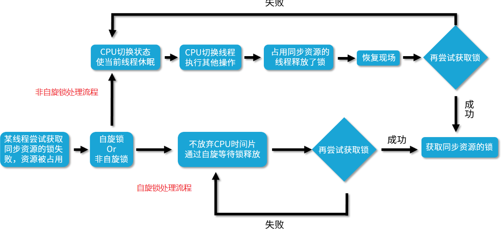

<!-- TOC -->

- [01、锁的分类以及各种特点](#01锁的分类以及各种特点)
    - [1、偏向锁/轻量级锁/重量级锁](#1偏向锁轻量级锁重量级锁)
        - [1、偏向锁](#1偏向锁)
        - [2、轻量级锁](#2轻量级锁)
        - [3、重量级锁](#3重量级锁)
    - [2、可重入锁/非可重入锁](#2可重入锁非可重入锁)
    - [3、共享锁/独占锁](#3共享锁独占锁)
    - [4、公平锁/非公平锁(ReentrantLock默认非公平，synchronized是非公平锁)](#4公平锁非公平锁reentrantlock默认非公平synchronized是非公平锁)
        - [1、对比公平和非公平的优缺点](#1对比公平和非公平的优缺点)
        - [2、ReentrantLock源码中的公平锁和非公平锁逻辑](#2reentrantlock源码中的公平锁和非公平锁逻辑)
    - [5、悲观锁/乐观锁](#5悲观锁乐观锁)
        - [1、悲观锁(锁竞争激烈)](#1悲观锁锁竞争激烈)
        - [2、乐观锁(锁竞争不激烈)](#2乐观锁锁竞争不激烈)
        - [3、典型案例](#3典型案例)
            - [1、悲观锁：synchronized 关键字和 Lock 接口](#1悲观锁synchronized-关键字和-lock-接口)
            - [2、乐观锁：原子类](#2乐观锁原子类)
            - [3、悲观锁和乐观锁：数据库](#3悲观锁和乐观锁数据库)
    - [6、自旋锁/非自旋锁](#6自旋锁非自旋锁)
        - [1、对比自旋和非自旋的获取锁的流程](#1对比自旋和非自旋的获取锁的流程)
        - [2、自旋锁的好处](#2自旋锁的好处)
        - [3、AtomicLong 的实现](#3atomiclong-的实现)
        - [4、自己实现一个可重入的自旋锁](#4自己实现一个可重入的自旋锁)
        - [5、自旋锁缺点](#5自旋锁缺点)
        - [6、自旋锁适用场景](#6自旋锁适用场景)
    - [7、可中断锁/不可中断锁](#7可中断锁不可中断锁)
- [02、如何看到 synchronized 背后的“monitor 锁”？](#02如何看到-synchronized-背后的monitor-锁)
    - [1、获取和释放 monitor 锁的时机](#1获取和释放-monitor-锁的时机)
    - [2、用 javap 命令查看反汇编的结果](#2用-javap-命令查看反汇编的结果)
        - [1、同步代码块](#1同步代码块)
        - [2、同步方法](#2同步方法)
- [03、synchronized 和 Lock 孰优孰劣，如何选择？](#03synchronized-和-lock-孰优孰劣如何选择)
    - [1、相同点](#1相同点)
    - [2、不同点](#2不同点)
    - [3、如何选择](#3如何选择)
- [04、Lock 有哪几个常用方法？分别有什么用？](#04lock-有哪几个常用方法分别有什么用)
    - [1、lock接口方法](#1lock接口方法)
        - [1、lock() 方法](#1lock-方法)
        - [2、tryLock()](#2trylock)
        - [3、tryLock(long time, TimeUnit unit)](#3trylocklong-time-timeunit-unit)
        - [4、lockInterruptibly()](#4lockinterruptibly)
        - [5、unlock()](#5unlock)
- [05、读写锁 ReadWriteLock 获取锁有哪些规则？](#05读写锁-readwritelock-获取锁有哪些规则)
    - [1、读写锁的获取规则](#1读写锁的获取规则)
    - [2、使用案例](#2使用案例)
    - [3、读写锁适用场合](#3读写锁适用场合)
- [06、读锁应该插队吗？什么是读写锁的升降级？](#06读锁应该插队吗什么是读写锁的升降级)
    - [1、读锁插队策略](#1读锁插队策略)
    - [2、策略选择演示](#2策略选择演示)
    - [3、锁的升降级](#3锁的升降级)
        - [1、为什么需要锁的降级？](#1为什么需要锁的降级)
        - [2、支持锁的降级，不支持升级](#2支持锁的降级不支持升级)
        - [3、为什么不支持锁的升级？](#3为什么不支持锁的升级)
- [07、JVM 对锁进行了哪些优化？](#07jvm-对锁进行了哪些优化)
    - [1、自适应的自旋锁](#1自适应的自旋锁)
    - [2、锁消除](#2锁消除)
    - [3、锁粗化](#3锁粗化)
    - [4、偏向锁/轻量级锁/重量级锁](#4偏向锁轻量级锁重量级锁)
        - [1、偏向锁](#1偏向锁-1)
        - [2、轻量级锁](#2轻量级锁-1)
        - [3、重量级锁](#3重量级锁-1)
        - [4、锁升级的路径](#4锁升级的路径)

<!-- /TOC -->


# 01、锁的分类以及各种特点

对于 Java 中的锁而言，一把锁也有可能同时占有多个标准，符合多种分类，比如 ReentrantLock 既是可中断锁，又是可重入锁。

根据分类标准我们把锁分为以下 7 大类别，分别是：

- 偏向锁/轻量级锁/重量级锁；
- 可重入锁/非可重入锁；
- 共享锁/独占锁；
- 公平锁/非公平锁；
- 悲观锁/乐观锁；
- 自旋锁/非自旋锁；
- 可中断锁/不可中断锁。

以上是常见的分类标准，下面我们来逐一介绍它们的含义。

## 1、偏向锁/轻量级锁/重量级锁

这三种锁特指 synchronized 锁的状态，通过在对象头中的 mark word 来表明锁的状态。

### 1、偏向锁

如果自始至终，对于这把锁都不存在竞争，那么其实就没必要上锁，只需要打个标记就行了，这就是偏向锁的思想。一个对象被初始化后，还没有任何线程来获取它的锁时，那么它就是可偏向的，当有第一个线程来访问它并尝试获取锁的时候，它就将这个线程记录下来，以后如果尝试获取锁的线程正是偏向锁的拥有者，就可以直接获得锁，开销很小，性能最好。

### 2、轻量级锁

JVM 开发者发现在很多情况下，synchronized 中的代码是被多个线程交替执行的，而不是同时执行的，也就是说并不存在实际的竞争，或者是只有短时间的锁竞争，用 CAS 就可以解决，这种情况下，用完全互斥的重量级锁是没必要的。轻量级锁是指当锁原来是偏向锁的时候，被另一个线程访问，说明存在竞争，那么偏向锁就会升级为轻量级锁，线程会通过自旋的形式尝试获取锁，而不会陷入阻塞。

### 3、重量级锁

重量级锁是互斥锁，它是利用操作系统的同步机制实现的，所以开销相对比较大。当多个线程直接有实际竞争，且锁竞争时间长的时候，轻量级锁不能满足需求，锁就会膨胀为重量级锁。重量级锁会让其他申请却拿不到锁的线程进入阻塞状态。


你可以发现锁升级的路径：无锁→偏向锁→轻量级锁→重量级锁。

综上所述，偏向锁性能最好，可以避免执行 CAS 操作。而轻量级锁利用自旋和 CAS 避免了重量级锁带来的线程阻塞和唤醒，性能中等。重量级锁则会把获取不到锁的线程阻塞，性能最差。

## 2、可重入锁/非可重入锁

可重入锁指的是线程当前已经持有这把锁了，能在不释放这把锁的情况下，再次获取这把锁。同理，不可重入锁指的是虽然线程当前持有了这把锁，但是如果想再次获取这把锁，也必须要先释放锁后才能再次尝试获取。

对于可重入锁而言，最典型的就是 ReentrantLock 了，正如它的名字一样，reentrant 的意思就是可重入，它也是 Lock 接口最主要的一个实现类。

## 3、共享锁/独占锁

共享锁指的是我们同一把锁可以被多个线程同时获得，而独占锁指的就是，这把锁只能同时被一个线程获得。我们的读写锁，就最好地诠释了共享锁和独占锁的理念。读写锁中的读锁，是共享锁，而写锁是独占锁。读锁可以被同时读，可以同时被多个线程持有，而写锁最多只能同时被一个线程持有。

## 4、公平锁/非公平锁(ReentrantLock默认非公平，synchronized是非公平锁)

公平锁的公平的含义在于如果线程现在拿不到这把锁，那么线程就都会进入等待，开始排队，在等待队列里等待时间长的线程会优先拿到这把锁，有先来先得的意思。而非公平锁就不那么“完美”了，它会在一定情况下，忽略掉已经在排队的线程，发生插队现象。


公平锁指的是按照线程请求的顺序，来分配锁；而非公平锁指的是不完全按照请求的顺序，在一定情况下，可以允许插队。但需要注意这里的非公平并不是指完全的随机，不是说线程可以任意插队，而是仅仅“在合适的时机”插队。

那么什么时候是合适的时机呢？假设当前线程在请求获取锁的时候，恰巧前一个持有锁的线程释放了这把锁，那么当前申请锁的线程就可以不顾已经等待的线程而选择立刻插队。但是如果当前线程请求的时候，前一个线程并没有在那一时刻释放锁，那么当前线程还是一样会进入等待队列。


看到这里，你可能不解，为什么要设置非公平策略呢，而且非公平还是 ReentrantLock的默认策略，如果我们不加以设置的话默认就是非公平的，难道我的这些排队的时间都白白浪费了吗，为什么别人比我有优先权呢？毕竟公平是一种很好的行为，而非公平是一种不好的行为。


让我们考虑一种情况，假设线程 A 持有一把锁，线程 B 请求这把锁，由于线程 A 已经持有这把锁了，所以线程 B 会陷入等待，在等待的时候线程 B 会被挂起，也就是进入阻塞状态，那么当线程 A 释放锁的时候，本该轮到线程 B 苏醒获取锁，但如果此时突然有一个线程 C 插队请求这把锁，那么根据非公平的策略，会把这把锁给线程 C，这是因为唤醒线程 B 是需要很大开销的，很有可能在唤醒之前，线程 C 已经拿到了这把锁并且执行完任务释放了这把锁。相比于等待唤醒线程 B 的漫长过程，插队的行为会让线程 C 本身跳过陷入阻塞的过程，如果在锁代码中执行的内容不多的话，线程 C 就可以很快完成任务，并且在线程 B 被完全唤醒之前，就把这个锁交出去，这样是一个双赢的局面，对于线程 C 而言，不需要等待提高了它的效率，而对于线程 B 而言，它获得锁的时间并没有推迟，因为等它被唤醒的时候，线程 C 早就释放锁了，因为线程 C 的执行速度相比于线程 B 的唤醒速度，是很快的，所以 Java 设计者设计非公平锁，是为了提高整体的运行效率。

> 1、公平的场景

下面我们用图示来说明公平和非公平的场景，先来看公平的情况。假设我们创建了一个公平锁，此时有 4 个线程按顺序来请求公平锁，线程 1 在拿到这把锁之后，线程 2、3、4 会在等待队列中开始等待，然后等线程 1 释放锁之后，线程 2、3、4 会依次去获取这把锁，线程 2 先获取到的原因是它等待的时间最长。

> 2、不公平的场景

下面我们再来看看非公平的情况，假设线程 1 在解锁的时候，突然有线程 5 尝试获取这把锁，那么根据我们的非公平策略，线程 5 是可以拿到这把锁的，尽管它没有进入等待队列，而且线程 2、3、4 等待的时间都比线程 5 要长，但是从整体效率考虑，这把锁此时还是会交给线程 5 持有。


> 3、代码案例：演示公平和非公平的效果

下面我们来用代码演示看下公平和非公平的实际效果，代码如下：

```java
//描述：演示公平锁，分别展示公平和不公平的情况，非公平锁会让现在持有锁的线程优先再次获取到锁。代码借鉴自Java并发编程实战手册2.7。
public class FairAndUnfair {
    public static void main(String args[]) {
        PrintQueue printQueue = new PrintQueue();//执行内部的方法需要加锁
        Thread thread[] = new Thread[10];
        for (int i = 0; i < 10; i++) {
            thread[i] = new Thread(new Job(printQueue), "Thread " + i);
        }


        for (int i = 0; i < 10; i++) {//初始化10个线程并发调用
            thread[i].start();
            try {
                Thread.sleep(100);
            } catch (InterruptedException e) {
                e.printStackTrace();
            }
        }
    }


}


class Job implements Runnable {
    private PrintQueue printQueue;
    public Job(PrintQueue printQueue) {
        this.printQueue = printQueue;
    }

    @Override
    public void run() {
        System.out.printf("%s: Going to print a job\n", Thread.currentThread().getName());
        printQueue.printJob(new Object());
        System.out.printf("%s: The document has been printed\n", Thread.currentThread().getName());
    }


}


class PrintQueue {
    private final Lock queueLock = new ReentrantLock(false);//

    public void printJob(Object document) {
        queueLock.lock();

        try {
            Long duration = (long) (Math.random() * 10000);
            System.out.printf("%s: PrintQueue: Printing a Job during %d seconds\n",
                    Thread.currentThread().getName(), (duration / 1000));
            Thread.sleep(duration);
        } catch (InterruptedException e) {
            e.printStackTrace();
        } finally {
            queueLock.unlock();
        }


        queueLock.lock();
        try {
            Long duration = (long) (Math.random() * 10000);
            System.out.printf("%s: PrintQueue: Printing a Job during %d seconds\n",
                    Thread.currentThread().getName(), (duration / 1000));
            Thread.sleep(duration);
        } catch (InterruptedException e) {
            e.printStackTrace();
        } finally {
            queueLock.unlock();
            }
    }
}
//我们可以通过改变 new ReentrantLock(false) 中的参数来设置公平/非公平锁。以上代码在公平的情况下的输出：

Thread 0: Going to print a job
Thread 0: PrintQueue: Printing a Job during 5 seconds
Thread 1: Going to print a job
Thread 2: Going to print a job
Thread 3: Going to print a job
Thread 4: Going to print a job
Thread 5: Going to print a job
Thread 6: Going to print a job
Thread 7: Going to print a job
Thread 8: Going to print a job
Thread 9: Going to print a job
Thread 1: PrintQueue: Printing a Job during 3 seconds
Thread 2: PrintQueue: Printing a Job during 4 seconds
Thread 3: PrintQueue: Printing a Job during 3 seconds
Thread 4: PrintQueue: Printing a Job during 9 seconds
Thread 5: PrintQueue: Printing a Job during 5 seconds
Thread 6: PrintQueue: Printing a Job during 7 seconds
Thread 7: PrintQueue: Printing a Job during 3 seconds
Thread 8: PrintQueue: Printing a Job during 9 seconds
Thread 9: PrintQueue: Printing a Job during 5 seconds
Thread 0: PrintQueue: Printing a Job during 8 seconds
Thread 0: The document has been printed
Thread 1: PrintQueue: Printing a Job during 1 seconds
Thread 1: The document has been printed
Thread 2: PrintQueue: Printing a Job during 8 seconds
Thread 2: The document has been printed
Thread 3: PrintQueue: Printing a Job during 2 seconds
Thread 3: The document has been printed
Thread 4: PrintQueue: Printing a Job during 0 seconds
Thread 4: The document has been printed
Thread 5: PrintQueue: Printing a Job during 7 seconds
Thread 5: The document has been printed
Thread 6: PrintQueue: Printing a Job during 3 seconds
Thread 6: The document has been printed
Thread 7: PrintQueue: Printing a Job during 9 seconds
Thread 7: The document has been printed
Thread 8: PrintQueue: Printing a Job during 5 seconds
Thread 8: The document has been printed
Thread 9: PrintQueue: Printing a Job during 9 seconds
Thread 9: The document has been printed

//可以看出，线程直接获取锁的顺序是完全公平的，先到先得。而以上代码在非公平的情况下的输出是这样的：

Thread 0: Going to print a job
Thread 0: PrintQueue: Printing a Job during 6 seconds
Thread 1: Going to print a job
Thread 2: Going to print a job
Thread 3: Going to print a job
Thread 4: Going to print a job
Thread 5: Going to print a job
Thread 6: Going to print a job
Thread 7: Going to print a job
Thread 8: Going to print a job
Thread 9: Going to print a job
Thread 0: PrintQueue: Printing a Job during 8 seconds
Thread 0: The document has been printed
Thread 1: PrintQueue: Printing a Job during 9 seconds
Thread 1: PrintQueue: Printing a Job during 8 seconds
Thread 1: The document has been printed
Thread 2: PrintQueue: Printing a Job during 6 seconds
Thread 2: PrintQueue: Printing a Job during 4 seconds
Thread 2: The document has been printed
Thread 3: PrintQueue: Printing a Job during 9 seconds
Thread 3: PrintQueue: Printing a Job during 8 seconds
Thread 3: The document has been printed
Thread 4: PrintQueue: Printing a Job during 4 seconds
Thread 4: PrintQueue: Printing a Job during 2 seconds
Thread 4: The document has been printed
Thread 5: PrintQueue: Printing a Job during 2 seconds
Thread 5: PrintQueue: Printing a Job during 5 seconds
Thread 5: The document has been printed
Thread 6: PrintQueue: Printing a Job during 2 seconds
Thread 6: PrintQueue: Printing a Job during 6 seconds
Thread 6: The document has been printed
Thread 7: PrintQueue: Printing a Job during 6 seconds
Thread 7: PrintQueue: Printing a Job during 4 seconds
Thread 7: The document has been printed
Thread 8: PrintQueue: Printing a Job during 3 seconds
Thread 8: PrintQueue: Printing a Job during 6 seconds
Thread 8: The document has been printed
Thread 9: PrintQueue: Printing a Job during 3 seconds
Thread 9: PrintQueue: Printing a Job during 5 seconds
Thread 9: The document has been printed
```


可以看出，非公平情况下，存在抢锁“插队”的现象，比如Thread 0 在释放锁后又能优先获取到锁，虽然此时在等待队列中已经有 Thread 1 ~ Thread 9 在排队了。

### 1、对比公平和非公平的优缺点

我们接下来对比公平和非公平的优缺点，如表格所示。


公平锁的优点在于各个线程公平平等，每个线程等待一段时间后，都有执行的机会，而它的缺点就在于整体执行速度更慢，吞吐量更小，相反非公平锁的优势就在于整体执行速度更快，吞吐量更大，但同时也可能产生线程饥饿问题，也就是说如果一直有线程插队，那么在等待队列中的线程可能长时间得不到运行。

### 2、ReentrantLock源码中的公平锁和非公平锁逻辑

下面我们来分析公平和非公平锁的源码，具体看下它们是怎样实现的，可以看到在 ReentrantLock 类包含一个 Sync 类，这个类继承自AQS（AbstractQueuedSynchronizer），代码如下：

```java

public class ReentrantLock implements Lock, java.io.Serializable {
 
private static final long serialVersionUID = 7373984872572414699L;
 
/** Synchronizer providing all implementation mechanics */
 
private final Sync sync;

//Sync 类，Sync 有公平锁 FairSync 和非公平锁 NonfairSync两个子类
abstract static class Sync extends AbstractQueuedSynchronizer {...}

static final class NonfairSync extends Sync {...}
static final class FairSync extends Sync {...}

//公平锁的锁获取源码如下：
protected final boolean tryAcquire(int acquires) {
    final Thread current = Thread.currentThread();
    int c = getState();
    if (c == 0) {
        if (!hasQueuedPredecessors() && //这里判断了 hasQueuedPredecessors()
                compareAndSetState(0, acquires)) {
            setExclusiveOwnerThread(current);
            return true;
        }
    } else if (current == getExclusiveOwnerThread()) {
        int nextc = c + acquires;
        if (nextc < 0) {
            throw new Error("Maximum lock count exceeded");
        }
        setState(nextc);
        return true;
    }
    return false;
}

//非公平锁的锁获取源码如下：
final boolean nonfairTryAcquire(int acquires) {
    final Thread current = Thread.currentThread();
    int c = getState();
    if (c == 0) {
        if (compareAndSetState(0, acquires)) { //这里没有判断，hasQueuedPredecessors()
            setExclusiveOwnerThread(current);
            return true;
        }
    }
    else if (current == getExclusiveOwnerThread()) {
        int nextc = c + acquires;
        if (nextc < 0) // overflow
        throw new Error("Maximum lock count exceeded");
        setState(nextc);
        return true;
    }
    return false;
}
```


通过对比，我们可以明显的看出公平锁与非公平锁的 lock() 方法唯一的区别就在于公平锁在获取锁时多了一个限制条件：hasQueuedPredecessors() 为 false，这个方法就是判断在等待队列中是否已经有线程在排队了。这也就是公平锁和非公平锁的核心区别，如果是公平锁，那么一旦已经有线程在排队了，当前线程就不再尝试获取锁；对于非公平锁而言，无论是否已经有线程在排队，都会尝试获取一下锁，获取不到的话，再去排队。

这里有一个特例需要我们注意，针对 tryLock() 方法，它不遵守设定的公平原则。

例如，当有线程执行 tryLock() 方法的时候，一旦有线程释放了锁，那么这个正在 tryLock 的线程就能获取到锁，即使设置的是公平锁模式，即使在它之前已经有其他正在等待队列中等待的线程，简单地说就是 tryLock 可以插队。

看它的源码就会发现：

```java
public boolean tryLock() {
    return sync.nonfairTryAcquire(1);
}
```

这里调用的就是 nonfairTryAcquire()，表明了是不公平的，和锁本身是否是公平锁无关。

综上所述，公平锁就是会按照多个线程申请锁的顺序来获取锁，从而实现公平的特性。非公平锁加锁时不考虑排队等待情况，直接尝试获取锁，所以存在后申请却先获得锁的情况，但由此也提高了整体的效率。


## 5、悲观锁/乐观锁

悲观锁的概念是在获取资源之前，必须先拿到锁，以便达到“独占”的状态，当前线程在操作资源的时候，其他线程由于不能拿到锁，所以其他线程不能来影响我。而乐观锁恰恰相反，它并不要求在获取资源前拿到锁，也不会锁住资源；相反，乐观锁利用 CAS 理念，在不独占资源的情况下，完成了对资源的修改。


> 悲观锁和乐观锁的本质是什么？

`悲观锁和乐观锁是从是否锁住资源的角度进行分类的`

### 1、悲观锁(锁竞争激烈)

悲观锁比较悲观，它认为如果不锁住这个资源，别的线程就会来争抢，就会造成数据结果错误，所以悲观锁为了确保结果的正确性，会在每次获取并修改数据时，都把数据锁住，让其他线程无法访问该数据，这样就可以确保数据内容万无一失。


我们举个例子，假设线程 A 和 B 使用的都是悲观锁，所以它们在尝试获取同步资源时，必须要先拿到锁。

假设线程 A 拿到了锁，并且正在操作同步资源，那么此时线程 B 就必须进行等待。

而当线程 A 执行完毕后，CPU 才会唤醒正在等待这把锁的线程 B 再次尝试获取锁。

如果线程 B 现在获取到了锁，才可以对同步资源进行自己的操作。这就是悲观锁的操作流程。

### 2、乐观锁(锁竞争不激烈)

乐观锁比较乐观，认为自己在操作资源的时候不会有其他线程来干扰，所以并不会锁住被操作对象，不会不让别的线程来接触它，同时，为了确保数据正确性，在更新之前，会去对比在我修改数据期间，数据有没有被其他线程修改过：如果没被修改过，就说明真的只有我自己在操作，那我就可以正常的修改数据；如果发现数据和我一开始拿到的不一样了，说明其他线程在这段时间内修改过数据，那说明我迟了一步，所以我会放弃这次修改，并选择报错、重试等策略。


乐观锁的实现一般都是利用 CAS 算法实现的。我们举个例子，假设线程 A 此时运用的是乐观锁。那么它去操作同步资源的时候，不需要提前获取到锁，而是可以直接去读取同步资源，并且在自己的线程内进行计算。

当它计算完毕之后、准备更新同步资源之前，会先判断这个资源是否已经被其他线程所修改过。

如果这个时候同步资源没有被其他线程修改更新，也就是说此时的数据和线程 A 最开始拿到的数据是一致的话，那么此时线程 A 就会去更新同步资源，完成修改的过程。

而假设此时的同步资源已经被其他线程修改更新了，线程 A 会发现此时的数据已经和最开始拿到的数据不一致了，那么线程 A 不会继续修改该数据，而是会根据不同的业务逻辑去选择报错或者重试。

`悲观锁和乐观锁概念并不是 Java 中独有的，这是一种广义的思想，这种思想可以应用于其他领域，比如说在数据库中，同样也有对悲观锁和乐观锁的应用。`

### 3、典型案例

#### 1、悲观锁：synchronized 关键字和 Lock 接口

Java 中悲观锁的实现包括 synchronized 关键字和 Lock 相关类等，我们以 Lock 接口为例，例如 Lock 的实现类 ReentrantLock，类中的 lock() 等方法就是执行加锁，而 unlock() 方法是执行解锁。处理资源之前必须要先加锁并拿到锁，等到处理完了之后再解开锁，这就是非常典型的悲观锁思想。

#### 2、乐观锁：原子类

乐观锁的典型案例就是原子类，例如 AtomicInteger 在更新数据时，就使用了乐观锁的思想，多个线程可以同时操作同一个原子变量。

#### 3、悲观锁和乐观锁：数据库

数据库中同时拥有悲观锁和乐观锁的思想。例如，我们如果在 MySQL 选择 select for update 语句，那就是悲观锁，在提交之前不允许第三方来修改该数据，这当然会造成一定的性能损耗，在高并发的情况下是不可取的。

相反，我们可以利用一个版本 version 字段在数据库中实现乐观锁。在获取及修改数据时都不需要加锁，但是我们在获取完数据并计算完毕，准备更新数据时，会检查版本号和获取数据时的版本号是否一致，如果一致就直接更新，如果不一致，说明计算期间已经有其他线程修改过这个数据了，那我就可以选择重新获取数据，重新计算，然后再次尝试更新数据。

SQL语句示例如下（假设取出数据的时候 version 为1）：

```sql
UPDATE student
    SET 
        name = ‘小李’,
        version= 2
    WHERE   id= 100
        AND version= 1
```


有一种说法认为，悲观锁由于它的操作比较重量级，不能多个线程并行执行，而且还会有上下文切换等动作，所以悲观锁的性能不如乐观锁好，应该尽量避免用悲观锁，这种说法是不正确的。

因为虽然悲观锁确实会让得不到锁的线程阻塞，但是这种开销是固定的。悲观锁的原始开销确实要高于乐观锁，但是特点是一劳永逸，就算一直拿不到锁，也不会对开销造成额外的影响。

反观乐观锁虽然一开始的开销比悲观锁小，但是如果一直拿不到锁，或者并发量大，竞争激烈，导致不停重试，那么消耗的资源也会越来越多，甚至开销会超过悲观锁。

所以，同样是悲观锁，在不同的场景下，效果可能完全不同，可能在今天的这种场景下是好的选择，在明天的另外的场景下就是坏的选择，这恰恰是“汝之蜜糖，彼之砒霜”。

因此，我们就来看一下两种锁各自的使用场景，把合适的锁用到合适的场景中去，把合理的资源分配到合理的地方去。

> 两种锁各自的使用场景

悲观锁适合用于并发写入多、临界区代码复杂、竞争激烈等场景，这种场景下悲观锁可以避免大量的无用的反复尝试等消耗。

乐观锁适用于大部分是读取，少部分是修改的场景，也适合虽然读写都很多，但是并发并不激烈的场景。在这些场景下，乐观锁不加锁的特点能让性能大幅提高。


## 6、自旋锁/非自旋锁

自旋锁的理念是如果线程现在拿不到锁，并不直接陷入阻塞或者释放 CPU 资源，而是开始利用循环，不停地尝试获取锁，这个循环过程被形象地比喻为“自旋”，就像是线程在“自我旋转”。相反，非自旋锁的理念就是没有自旋的过程，如果拿不到锁就直接放弃，或者进行其他的处理逻辑，例如去排队、陷入阻塞等。


首先，我们了解什么叫自旋？“自旋”可以理解为“自我旋转”，这里的“旋转”指“循环”，比如 while 循环或者 for 循环。“自旋”就是自己在这里不停地循环，直到目标达成。而不像普通的锁那样，如果获取不到锁就进入阻塞。

### 1、对比自旋和非自旋的获取锁的流程

下面我们用这样一张流程图来对比一下自旋锁和非自旋锁的获取锁的过程。



首先，我们来看自旋锁，它并不会放弃  CPU  时间片，而是通过自旋等待锁的释放，也就是说，它会不停地再次地尝试获取锁，如果失败就再次尝试，直到成功为止。

我们再来看下非自旋锁，非自旋锁和自旋锁是完全不一样的，如果它发现此时获取不到锁，它就把自己的线程切换状态，让线程休眠，然后 CPU 就可以在这段时间去做很多其他的事情，直到之前持有这把锁的线程释放了锁，于是 CPU 再把之前的线程恢复回来，让这个线程再去尝试获取这把锁。如果再次失败，就再次让线程休眠，如果成功，一样可以成功获取到同步资源的锁。

可以看出，非自旋锁和自旋锁最大的区别，就是如果它遇到拿不到锁的情况，它会把线程阻塞，直到被唤醒。而自旋锁会不停地尝试。那么，自旋锁这样不停尝试的好处是什么呢？

### 2、自旋锁的好处

首先，阻塞和唤醒线程都是需要高昂的开销的，如果同步代码块中的内容不复杂，那么可能转换线程带来的开销比实际业务代码执行的开销还要大。

在很多场景下，可能我们的同步代码块的内容并不多，所以需要的执行时间也很短，如果我们仅仅为了这点时间就去切换线程状态，那么其实不如让线程不切换状态，而是让它自旋地尝试获取锁，等待其他线程释放锁，有时我只需要稍等一下，就可以避免上下文切换等开销，提高了效率。

用一句话总结自旋锁的好处，那就是自旋锁用循环去不停地尝试获取锁，让线程始终处于 Runnable 状态，节省了线程状态切换带来的开销。

### 3、AtomicLong 的实现

在 Java 1.5 版本及以上的并发包中，也就是 java.util.concurrent 的包中，里面的原子类基本都是自旋锁的实现。

比如我们看一个 AtomicLong 的实现，里面有一个 getAndIncrement 方法，源码如下：

```java
public final long getAndIncrement() {
    return unsafe.getAndAddLong(this, valueOffset, 1L);
}
//可以看到它调用了一个 unsafe.getAndAddLong
public final long getAndAddLong (Object var1,long var2, long var4){
    long var6;
    do {
        var6 = this.getLongVolatile(var1, var2);//获取最新的值
    } while (!this.compareAndSwapLong(var1, var2, var6, var6 + var4));


    return var6;
}
```

这里的 do-while 循环就是一个自旋操作，如果在修改过程中遇到了其他线程竞争导致没修改成功的情况，就会 while 循环里进行死循环，直到修改成功为止。

### 4、自己实现一个可重入的自旋锁

```java
public class ReentrantSpinLock  {//实现一个可重入的自旋锁
 
    private AtomicReference<Thread> owner = new AtomicReference<>();
 
    //重入次数
    private int count = 0;
 
    public void lock() {
        Thread t = Thread.currentThread();
        if (t == owner.get()) {
            ++count;
            return;
        }
        //自旋获取锁
        while (!owner.compareAndSet(null, t)) {
            System.out.println("自旋了");
        }
    }
 
    public void unlock() {
        Thread t = Thread.currentThread();
        //只有持有锁的线程才能解锁
        if (t == owner.get()) {
            if (count > 0) {
                --count;
            } else {
                //此处无需CAS操作，因为没有竞争，因为只有线程持有者才能解锁
                owner.set(null);
            }
        }
    }
 
    public static void main(String[] args) {
        ReentrantSpinLock spinLock = new ReentrantSpinLock();
        Runnable runnable = new Runnable() {
            @Override
            public void run() {
                System.out.println(Thread.currentThread().getName() + "开始尝试获取自旋锁");
                spinLock.lock();
                try {
                    System.out.println(Thread.currentThread().getName() + "获取到了自旋锁");
                    Thread.sleep(4000);
                } catch (InterruptedException e) {
                    e.printStackTrace();
                } finally {
                    spinLock.unlock();
                    System.out.println(Thread.currentThread().getName() + "释放了了自旋锁");
                }
            }
        };
        Thread thread1 = new Thread(runnable);
        Thread thread2 = new Thread(runnable);
        thread1.start();
        thread2.start();
    }
}
```

这段代码的运行结果是：

```java
Thread-0获取到了自旋锁
...
自旋了
自旋了
自旋了
自旋了
自旋了
自旋了
自旋了
自旋了
Thread-0释放了了自旋锁
Thread-1获取到了自旋锁
```

前面会打印出很多“自旋了”，说明自旋期间，CPU依然在不停运转。

### 5、自旋锁缺点

那么自旋锁有没有缺点呢？其实自旋锁是有缺点的。它最大的缺点就在于虽然避免了线程切换的开销，但是它在避免线程切换开销的同时也带来了新的开销，因为它需要不停得去尝试获取锁。如果这把锁一直不能被释放，那么这种尝试只是无用的尝试，会白白浪费处理器资源。也就是说，虽然一开始自旋锁的开销低于线程切换，但是随着时间的增加，这种开销也是水涨船高，后期甚至会超过线程切换的开销，得不偿失。

### 6、自旋锁适用场景

所以我们就要看一下自旋锁的适用场景。首先，自旋锁适用于并发度不是特别高的场景，以及临界区比较短小的情况，这样我们可以利用避免线程切换来提高效率。

可是如果临界区很大，线程一旦拿到锁，很久才会释放的话，那就不合适用自旋锁，因为自旋会一直占用 CPU 却无法拿到锁，白白消耗资源。


## 7、可中断锁/不可中断锁

在 Java 中，synchronized 关键字修饰的锁代表的是不可中断锁，一旦线程申请了锁，就没有回头路了，只能等到拿到锁以后才能进行其他的逻辑处理。而我们的 ReentrantLock 是一种典型的可中断锁，例如使用 lockInterruptibly 方法在获取锁的过程中，突然不想获取了，那么也可以在中断之后去做其他的事情，不需要一直傻等到获取到锁才离开。


# 02、如何看到 synchronized 背后的“monitor 锁”？

总结：同步代码块是利用 monitorenter 和 monitorexit 指令实现的，而同步方法则是利用给flags添加 ACC_SYNCHRONIZED标记实现的。

## 1、获取和释放 monitor 锁的时机

我们都知道，最简单的同步方式就是利用 synchronized 关键字来修饰代码块或者修饰一个方法，那么这部分被保护的代码，在同一时刻就最多只有一个线程可以运行，而 synchronized 的背后正是利用 monitor 锁实现的。所以首先我们来看下获取和释放 monitor 锁的时机，每个 Java 对象都可以用作一个实现同步的锁，这个锁也被称为内置锁或 monitor 锁，获得 monitor 锁的唯一途径就是进入由这个锁保护的同步代码块或同步方法，线程在进入被 synchronized 保护的代码块之前，会自动获取锁，并且无论是正常路径退出，还是通过抛出异常退出，在退出的时候都会自动释放锁。

我们首先来看一个 synchronized 修饰方法的代码的例子：

```java
public synchronized void method() {
    method body
}
```


## 2、用 javap 命令查看反汇编的结果

JVM 实现 synchronized 方法和 synchronized 代码块的细节是不一样的，下面我们就分别来看一下两者的实现。

### 1、同步代码块
首先我们来看下同步代码块的实现，如代码所示。

```java
public class SynTest {
    public void synBlock() {
        synchronized (this) {
            System.out.println("xxx");
        }
    }
}
```

在 SynTest 类中的 synBlock 方法，包含一个同步代码块，synchronized 代码块中有一行代码打印了 xxx 字符串，下面我们来通过命令看下 synchronized 关键字到底做了什么事情：首先用 cd 命令切换到 SynTest.java 类所在的路径，然后执行 javac SynTest.java，于是就会产生一个名为 SynTest.class 的字节码文件，然后我们执行 javap -verbose SynTest.class，就可以看到对应的反汇编内容。

关键信息如下：

```java
public void synBlock();
    descriptor: ()V
    flags: ACC_PUBLIC
    Code:
      stack=2, locals=3, args_size=1
         0: aload_0
         1: dup
         2: astore_1
         3: monitorenter
         4: getstatic     #2                  // Field java/lang/System.out:Ljava/io/PrintStream;
         7: ldc           #3                      // String lagou
         9: invokevirtual #4               // Method java/io/PrintStream.println:(Ljava/lang/String;)V
        12: aload_1
        13: monitorexit
        14: goto          22
        17: astore_2
        18: aload_1
        19: monitorexit
        20: aload_2
        21: athrow
        22: return
```

从里面可以看出，synchronized 代码块实际上多了 monitorenter 和 monitorexit 指令，第3、13、19行指令分别对应的是 monitorenter 和 monitorexit。这里有一个 monitorenter，却有两个 monitorexit 指令的原因是，JVM 要保证每个 monitorenter 必须有与之对应的 monitorexit，monitorenter 指令被插入到同步代码块的开始位置，而 monitorexit 需要插入到方法正常结束处和异常处两个地方，这样就可以保证抛异常的情况下也能释放锁。

可以把执行 monitorenter 理解为加锁，执行 monitorexit 理解为释放锁，每个对象维护着一个记录着被锁次数的计数器。未被锁定的对象的该计数器为 0，我们来具体看一下 monitorenter 和 monitorexit 的含义：

1、monitorenter：执行 monitorenter 的线程尝试获得 monitor 的所有权，会发生以下这三种情况之一：

- a. 如果该 monitor 的计数为 0，则线程获得该 monitor 并将其计数设置为 1。然后，该线程就是这个 monitor 的所有者。

- b. 如果线程已经拥有了这个 monitor ，则它将重新进入，并且累加计数。

- c. 如果其他线程已经拥有了这个 monitor，那个这个线程就会被阻塞，直到这个 monitor 的计数变成为 0，代表这个 monitor 已经被释放了，于是当前这个线程就会再次尝试获取这个 monitor。

2、monitorexit：monitorexit 的作用是将 monitor 的计数器减 1，直到减为 0 为止。代表这个 monitor 已经被释放了，已经没有任何线程拥有它了，也就代表着解锁，所以，其他正在等待这个 monitor 的线程，此时便可以再次尝试获取这个 monitor 的所有权。


### 2、同步方法

从上面可以看出，同步代码块是使用 monitorenter 和 monitorexit 指令实现的。而对于 synchronized 方法，并不是依靠 monitorenter 和 monitorexit 指令实现的，被 javap 反汇编后可以看到，synchronized 方法和普通方法大部分是一样的，不同在于，这个方法会有一个叫作 ACC_SYNCHRONIZED 的 flag 修饰符，来表明它是同步方法。

同步方法的代码如下所示。

```java
public synchronized void synMethod() {
 
}
```

对应的反汇编指令如下所示。

```java
public synchronized void synMethod();
    descriptor: ()V
    flags: ACC_PUBLIC, ACC_SYNCHRONIZED
    Code:
      stack=0, locals=1, args_size=1
         0: return
      LineNumberTable:
        line 16: 0
```

可以看出，被 synchronized 修饰的方法会有一个 ACC_SYNCHRONIZED 标志。当某个线程要访问某个方法的时候，会首先检查方法是否有 ACC_SYNCHRONIZED 标志，如果有则需要先获得 monitor 锁，然后才能开始执行方法，方法执行之后再释放 monitor 锁。其他方面， synchronized 方法和刚才的 synchronized 代码块是很类似的，例如这时如果其他线程来请求执行方法，也会因为无法获得 monitor 锁而被阻塞。


# 03、synchronized 和 Lock 孰优孰劣，如何选择？


本课时我们主要学习 synchronized 和 Lock 的异同点，以及该如何选择。

## 1、相同点

synchronized 和 Lock 的相同点非常多，我们这里重点讲解 3 个比较大的相同点。

- 1、synchronized 和 Lock 都是用来保护资源线程安全的。这一点毋庸置疑，这是它们的基本作用。

- 2、都可以保证可见性。

对于 synchronized 而言，线程 A 在进入 synchronized 块之前或在 synchronized 块内进行操作，对于后续的获得同一个 monitor 锁的线程 B 是可见的，也就是线程 B 是可以看到线程 A 之前的操作的，这也体现了 happens-before 针对 synchronized 的一个原则。

而对于 Lock 而言，它和 synchronized 是一样，都可以保证可见性，在解锁之前的所有操作对加锁之后的所有操作都是可见的。


- 3、synchronized 和 ReentrantLock 都拥有可重入的特点

这里的 ReentrantLock 是 Lock 接口的一个最主要的实现类，在对比 synchronized 和 Lock 的时候，也会选择 Lock 的主要实现类来进行对比。可重入指的是某个线程如果已经获得了一个锁，现在试图再次请求这个它已经获得的锁，如果它无需提前释放这个锁，而是直接可以继续使用持有的这个锁，那么就是可重入的。如果必须释放锁后才能再次申请这个锁，就是不可重入的。而 synchronized 和 ReentrantLock 都具有可重入的特性。

## 2、不同点

下面我们来看下 synchronized 和 Lock 的区别，和相同点一样，它们之间也有非常多的区别，这里讲解其中比较大的 7 点不同。

- 1、用法区别

synchronized 关键字可以加在方法上，不需要指定锁对象（此时的锁对象为 this），也可以新建一个同步代码块并且自定义 monitor 锁对象；而 Lock 接口必须显示用 Lock 锁对象开始加锁 lock() 和解锁 unlock()，并且一般会在 finally 块中确保用 unlock() 来解锁，以防发生死锁。

与 Lock 显式的加锁和解锁不同的是 synchronized 的加解锁是隐式的，尤其是抛异常的时候也能保证释放锁，但是 Java 代码中并没有相关的体现。

- 2、加解锁顺序不同

对于 Lock 而言如果有多把 Lock 锁，Lock 可以不完全按照加锁的反序解锁，比如我们可以先获取 Lock1 锁，再获取 Lock2 锁，解锁时则先解锁 Lock1，再解锁 Lock2，加解锁有一定的灵活度，如代码所示。

```java
lock1.lock();
lock2.lock();
...
lock1.unlock();
lock2.unlock();
```

但是 synchronized 无法做到，synchronized 解锁的顺序和加锁的顺序必须完全相反，例如：

```java
synchronized(obj1){
    synchronized(obj2){
        ...
    }
}
```

那么在这里，顺序就是先对 obj1 加锁，然后对 obj2 加锁，然后对 obj2 解锁，最后解锁 obj1。这是因为 synchronized 加解锁是由 JVM 实现的，在执行完 synchronized 块后会自动解锁，所以会按照 synchronized 的嵌套顺序加解锁，不能自行控制。

- 3、synchronized 锁不够灵活

一旦 synchronized 锁已经被某个线程获得了，此时其他线程如果还想获得，那它只能被阻塞，直到持有锁的线程运行完毕或者发生异常从而释放这个锁。如果持有锁的线程持有很长时间才释放，那么整个程序的运行效率就会降低，而且如果持有锁的线程永远不释放锁，那么尝试获取锁的线程只能永远等下去。

相比之下，Lock 类在等锁的过程中，如果使用的是 lockInterruptibly 方法，那么如果觉得等待的时间太长了不想再继续等待，可以中断退出，也可以用 tryLock() 等方法尝试获取锁，如果获取不到锁也可以做别的事，更加灵活。

- 4、synchronized 锁只能同时被一个线程拥有，但是 Lock 锁没有这个限制

例如在读写锁中的读锁，是可以同时被多个线程持有的，可是 synchronized 做不到。

- 5、原理区别

synchronized 是内置锁，由 JVM 实现获取锁和释放锁的原理，还分为偏向锁、轻量级锁、重量级锁。

Lock 根据实现不同，有不同的原理，例如 ReentrantLock 内部是通过 AQS 来获取和释放锁的。

- 6、是否可以设置公平/非公平

公平锁是指多个线程在等待同一个锁时，根据先来后到的原则依次获得锁。ReentrantLock 等 Lock 实现类可以根据自己的需要来设置公平或非公平，synchronized 则不能设置。

- 7、性能区别

在 Java 5 以及之前，synchronized 的性能比较低，但是到了 Java 6 以后，发生了变化，因为 JDK 对 synchronized 进行了很多优化，比如自适应自旋、锁消除、锁粗化、轻量级锁、偏向锁等，所以后期的 Java 版本里的 synchronized 的性能并不比 Lock 差。

## 3、如何选择

在 Java 并发编程实战和 Java 核心技术里都认为：

- 1、如果能不用最好既不使用 Lock 也不使用 synchronized。因为在许多情况下你可以使用 java.util.concurrent 包中的机制，它会为你处理所有的加锁和解锁操作，也就是推荐优先使用工具类来加解锁。

- 2、如果 synchronized 关键字适合你的程序， 那么请尽量使用它，这样可以减少编写代码的数量，减少出错的概率。因为一旦忘记在 finally 里 unlock，代码可能会出很大的问题，而使用 synchronized 更安全。

- 3、如果特别需要 Lock 的特殊功能，比如尝试获取锁、可中断、超时功能等，才使用 Lock。


# 04、Lock 有哪几个常用方法？分别有什么用？


Lock 接口是 Java 5 引入的，最常见的实现类是 ReentrantLock，可以起到“锁”的作用。

Lock 和 synchronized 是两种最常见的锁，锁是一种工具，用于控制对共享资源的访问，而  Lock 和 synchronized 都可以达到线程安全的目的，但是在使用上和功能上又有较大的不同。所以 Lock 并不是用来代替 synchronized 的，而是当使用 synchronized 不合适或不足以满足要求的时候，Lock 可以用来提供更高级功能的。

通常情况下，Lock 只允许一个线程来访问这个共享资源。不过有的时候，一些特殊的实现也可允许并发访问，比如 ReadWriteLock 里面的 ReadLock。

## 1、lock接口方法

```java
public interface Lock {
    void lock();
    void lockInterruptibly() throws InterruptedException;
    boolean tryLock();
    boolean tryLock(long time, TimeUnit unit) throws InterruptedException;
    void unlock();
    Condition newCondition();
}

```

我们可以看到与 Lock 接口加解锁相关的主要有 5 个方法，我们接下来重点分析这 5 种方法的作用和用法，这 5 种方法分别是 lock()、tryLock()、tryLock(long time, TimeUnit unit) 和 lockInterruptibly()、unlock()。

### 1、lock() 方法

在 Lock 接口中声明了 4 种方法来获取锁（lock()、tryLock()、tryLock(long time, TimeUnit unit)和lockInterruptibly()），那么这 4 种方法具体有什么区别呢？

首先，lock() 是最基础的获取锁的方法。在线程获取锁时如果锁已被其他线程获取，则进行等待，是最初级的获取锁的方法。

对于 Lock 接口而言，获取锁和释放锁都是显式的，不像 synchronized 那样是隐式的，所以 Lock 不会像 synchronized 一样在异常时自动释放锁（synchronized 即使不写对应的代码也可以释放），lock 的加锁和释放锁都必须以代码的形式写出来，所以使用 lock() 时必须由我们自己主动去释放锁，因此最佳实践是执行 lock() 后，首先在 try{} 中操作同步资源，如果有必要就用 catch{} 块捕获异常，然后在 finally{} 中释放锁，以保证发生异常时锁一定被释放，示例代码如下所示。

```java
Lock lock = ...;
lock.lock();
try{
    //获取到了被本锁保护的资源，处理任务
    //捕获异常
}finally{
    lock.unlock();   //释放锁
}
```

如果我们不遵守在 finally 里释放锁的规范，就会让 Lock 变得非常危险，因为你不知道未来什么时候由于异常的发生，导致跳过了 unlock() 语句，使得这个锁永远不能被释放了，其他线程也无法再获得这个锁，这就是 Lock 相比于 synchronized 的一个劣势，使用 synchronized 时不需要担心这个问题。

与此同时，lock() 方法不能被中断，这会带来很大的隐患：一旦陷入死锁，lock() 就会陷入永久等待，所以一般我们用 tryLock() 等其他更高级的方法来代替 lock()，下面我们就看一看 tryLock() 方法。

### 2、tryLock()

tryLock() 用来尝试获取锁，如果当前锁没有被其他线程占用，则获取成功，返回 true，否则返回 false，代表获取锁失败。相比于 lock()，这样的方法显然功能更强大，我们可以根据是否能获取到锁来决定后续程序的行为。

因为该方法会立即返回，即便在拿不到锁时也不会一直等待，所以通常情况下，我们用 if 语句判断 tryLock() 的返回结果，根据是否获取到锁来执行不同的业务逻辑，典型使用方法如下。

```java
Lock lock = ...;
if(lock.tryLock()) {
     try{
         //处理任务
     }finally{
         lock.unlock();   //释放锁
     } 
}else {
    //如果不能获取锁，则做其他事情
}
```

有了这个强大的 tryLock() 方法我们便可以解决死锁问题，代码如下所示。

```java
public void tryLock(Lock lock1, Lock lock2) throws InterruptedException {
        while (true) {
            if (lock1.tryLock()) {
                try {
                    if (lock2.tryLock()) {
                        try {
                            System.out.println("获取到了两把锁，完成业务逻辑");
                            return;
                        } finally {
                            lock2.unlock();
                        }
                    }
                } finally {
                    lock1.unlock();
                }
            } else {
                Thread.sleep(new Random().nextInt(1000));
            }
        }
}
```

如果代码中我们不用 tryLock() 方法，那么便可能会产生死锁，比如有两个线程同时调用这个方法，传入的 lock1 和 lock2 恰好是相反的，那么如果第一个线程获取了 lock1 的同时，第二个线程获取了 lock2，它们接下来便会尝试获取对方持有的那把锁，但是又获取不到，于是便会陷入死锁，但是有了 tryLock() 方法之后，我们便可以避免死锁的发生，首先会检测 lock1 是否能获取到，如果能获取到再尝试获取 lock2，但如果 lock1 获取不到也没有关系，我们会在下面进行随机时间的等待，这个等待的目标是争取让其他的线程在这段时间完成它的任务，以便释放其他线程所持有的锁，以便后续供我们使用，同理如果获取到了 lock1 但没有获取到 lock2，那么也会释放掉 lock1，随即进行随机的等待，只有当它同时获取到 lock1 和 lock2 的时候，才会进入到里面执行业务逻辑，比如在这里我们会打印出“获取到了两把锁，完成业务逻辑”，然后方法便会返回。

### 3、tryLock(long time, TimeUnit unit)

tryLock() 的重载方法是 tryLock(long time, TimeUnit unit)，这个方法和 tryLock() 很类似，区别在于 tryLock(long time, TimeUnit unit) 方法会有一个超时时间，在拿不到锁时会等待一定的时间，如果在时间期限结束后，还获取不到锁，就会返回 false；如果一开始就获取锁或者等待期间内获取到锁，则返回 true。

这个方法解决了 lock() 方法容易发生死锁的问题，使用 tryLock(long time, TimeUnit unit) 时，在等待了一段指定的超时时间后，线程会主动放弃这把锁的获取，避免永久等待；在等待的期间，也可以随时中断线程，这就避免了死锁的发生。本方法和下面介绍的 lockInterruptibly() 是非常类似的，让我们来看一下 lockInterruptibly() 方法。

### 4、lockInterruptibly()

这个方法的作用就是去获取锁，如果这个锁当前是可以获得的，那么这个方法会立刻返回，但是如果这个锁当前是不能获得的（被其他线程持有），那么当前线程便会开始等待，除非它等到了这把锁或者是在等待的过程中被中断了，否则这个线程便会一直在这里执行这行代码。一句话总结就是，除非当前线程在获取锁期间被中断，否则便会一直尝试获取直到获取到为止。

顾名思义，lockInterruptibly() 是可以响应中断的。相比于不能响应中断的 synchronized 锁，lockInterruptibly() 可以让程序更灵活，可以在获取锁的同时，保持对中断的响应。我们可以把这个方法理解为超时时间是无穷长的 tryLock(long time, TimeUnit unit)，因为 tryLock(long time, TimeUnit unit) 和 lockInterruptibly() 都能响应中断，只不过 lockInterruptibly() 永远不会超时。

这个方法本身是会抛出 InterruptedException 的，所以使用的时候，如果不在方法签名声明抛出该异常，那么就要写两个 try 块，如下所示。

```java
public void lockInterruptibly() {
        try {
            lock.lockInterruptibly();
            try {
                System.out.println("操作资源");
            } finally {
                lock.unlock();
            }
        } catch (InterruptedException e) {
            e.printStackTrace();
        }
    }
```

在这个方法中我们首先执行了 lockInterruptibly 方法，并且对它进行了 try catch 包装，然后同样假设我们能够获取到这把锁，和之前一样，就必须要使用 try finall 来保障锁的绝对释放。

### 5、unlock()

最后要介绍的方法是 unlock() 方法，是用于解锁的，方法比较简单，对于 ReentrantLock 而言，执行 unlock() 的时候，内部会把锁的“被持有计数器”减 1，直到减到 0 就代表当前这把锁已经完全释放了，如果减 1 后计数器不为 0，说明这把锁之前被“重入”了，那么锁并没有真正释放，仅仅是减少了持有的次数。


# 05、读写锁 ReadWriteLock 获取锁有哪些规则？


在没有读写锁之前，我们假设使用普通的 ReentrantLock，那么虽然我们保证了线程安全，但是也浪费了一定的资源，因为如果多个读操作同时进行，其实并没有线程安全问题，我们可以允许让多个读操作并行，以便提高程序效率。但是写操作不是线程安全的，如果多个线程同时写，或者在写的同时进行读操作，便会造成线程安全问题。

我们的读写锁就解决了这样的问题，它设定了一套规则，既可以保证多个线程同时读的效率，同时又可以保证有写入操作时的线程安全。

整体思路是它有两把锁，第 1 把锁是写锁，获得写锁之后，既可以读数据又可以修改数据，而第 2 把锁是读锁，获得读锁之后，只能查看数据，不能修改数据。读锁可以被多个线程同时持有，所以多个线程可以同时查看数据。

在读的地方合理使用读锁，在写的地方合理使用写锁，灵活控制，可以提高程序的执行效率。

## 1、读写锁的获取规则

我们在使用读写锁时遵守下面的获取规则：

- 如果有一个线程已经占用了读锁，则此时其他线程如果要申请读锁，可以申请成功。
- 如果有一个线程已经占用了读锁，则此时其他线程如果要申请写锁，则申请写锁的线程会一直等待释放读锁，因为读写不能同时操作。
- 如果有一个线程已经占用了写锁，则此时其他线程如果申请写锁或者读锁，都必须等待之前的线程释放写锁，同样也因为读写不能同时，并且两个线程不应该同时写。

所以我们用一句话总结：要么是一个或多个线程同时有读锁，要么是一个线程有写锁，但是两者不会同时出现。也可以总结为：读读共享、其他都互斥（写写互斥、读写互斥、写读互斥）。

## 2、使用案例

下面我们举个例子来应用读写锁，ReentrantReadWriteLock 是 ReadWriteLock 的实现类，最主要的有两个方法：readLock() 和 writeLock() 用来获取读锁和写锁。

```java
public class ReadWriteLockDemo {


    private static final ReentrantReadWriteLock reentrantReadWriteLock = new ReentrantReadWriteLock(
            false);
    private static final ReentrantReadWriteLock.ReadLock readLock = reentrantReadWriteLock
            .readLock();//获取读锁
    private static final ReentrantReadWriteLock.WriteLock writeLock = reentrantReadWriteLock
            .writeLock();//获取写锁


    private static void read() {
        readLock.lock();
        try {
            System.out.println(Thread.currentThread().getName() + "得到读锁，正在读取");
            Thread.sleep(500);
        } catch (InterruptedException e) {
            e.printStackTrace();
        } finally {
            readLock.unlock();
            System.out.println(Thread.currentThread().getName() + "释放读锁");
        }
    }


    private static void write() {
        writeLock.lock();
        try {
            System.out.println(Thread.currentThread().getName() + "得到写锁，正在写入");
            Thread.sleep(500);
        } catch (InterruptedException e) {
            e.printStackTrace();
        } finally {
            writeLock.unlock();
            System.out.println(Thread.currentThread().getName() + "释放写锁");
        }
    }


    public static void main(String[] args) throws InterruptedException {
        new Thread(() -> read()).start();
        new Thread(() -> read()).start();
        new Thread(() -> write()).start();
        new Thread(() -> write()).start();
    }
}
```

程序的运行结果是：

```
Thread-0得到读锁，正在读取
Thread-1得到读锁，正在读取
Thread-0释放读锁
Thread-1释放读锁
Thread-2得到写锁，正在写入
Thread-2释放写锁
Thread-3得到写锁，正在写入
Thread-3释放写锁
```

可以看出，读锁可以同时被多个线程获得，而写锁不能。

## 3、读写锁适用场合

最后我们来看下读写锁的适用场合，相比于 ReentrantLock 适用于一般场合，ReadWriteLock 适用于读多写少的情况，合理使用可以进一步提高并发效率。


# 06、读锁应该插队吗？什么是读写锁的升降级？


## 1、读锁插队策略

如果锁被设置为非公平，那么它是可以在前面线程释放锁的瞬间进行插队的，而不需要进行排队。在读写锁这里，策略也是这样的吗？

首先，我们看到 ReentrantReadWriteLock 可以设置为公平或者非公平，代码如下：

公平锁：

ReentrantReadWriteLock reentrantReadWriteLock = new ReentrantReadWriteLock(true);

非公平锁：

ReentrantReadWriteLock reentrantReadWriteLock = new ReentrantReadWriteLock(false);

如果是公平锁，我们就在构造函数的参数中传入 true，如果是非公平锁，就在构造函数的参数中传入 false，默认是非公平锁。在获取读锁之前，线程会检查 readerShouldBlock() 方法，同样，在获取写锁之前，线程会检查 writerShouldBlock() 方法，来决定是否需要插队或者是去排队。

首先看公平锁对于这两个方法的实现：

```java
final boolean writerShouldBlock() {
    return hasQueuedPredecessors();
}

final boolean readerShouldBlock() {
    return hasQueuedPredecessors();
}
```

很明显，在公平锁的情况下，只要等待队列中有线程在等待，也就是 hasQueuedPredecessors() 返回 true 的时候，那么 writer 和 reader 都会 block，也就是一律不允许插队，都乖乖去排队，这也符合公平锁的思想。

下面让我们来看一下非公平锁的实现：

```java
final boolean writerShouldBlock() {
    return false; // writers can always barge
}
final boolean readerShouldBlock() {
    return apparentlyFirstQueuedIsExclusive();
}
```

在 writerShouldBlock() 这个方法中始终返回 false，可以看出，对于想获取写锁的线程而言，由于返回值是 false，所以它是随时可以插队的，这就和我们的 ReentrantLock 的设计思想是一样的，但是读锁却不一样。这里实现的策略很有意思，先让我们来看下面这种场景：

假设线程 2 和线程 4 正在同时读取，线程 3 想要写入，但是由于线程 2 和线程 4 已经持有读锁了，所以线程 3 就进入等待队列进行等待。此时，线程 5 突然跑过来想要插队获取读锁：

面对这种情况有两种应对策略：

- 第一种策略：允许插队

由于现在有线程在读，而线程 5 又不会特别增加它们读的负担，因为线程们可以共用这把锁，所以第一种策略就是让线程 5 直接加入到线程 2 和线程 4 一起去读取。这种策略看上去增加了效率，但是有一个严重的问题，那就是如果想要读取的线程不停地增加，比如线程 6，那么线程  6 也可以插队，这就会导致读锁长时间内不会被释放，导致线程 3 长时间内拿不到写锁，也就是那个需要拿到写锁的线程会陷入“饥饿”状态，它将在长时间内得不到执行。


- 第二种策略：不允许插队

这种策略认为由于线程 3 已经提前等待了，所以虽然线程 5 如果直接插队成功，可以提高效率，但是我们依然让线程 5 去排队等待：按照这种策略线程 5 会被放入等待队列中，并且排在线程 3 的后面，让线程 3 优先于线程 5 执行，这样可以避免“饥饿”状态，这对于程序的健壮性是很有好处的，直到线程 3 运行完毕，线程 5 才有机会运行，这样谁都不会等待太久的时间。


所以我们可以看出，即便是非公平锁，只要等待队列的头结点是尝试获取写锁的线程，那么读锁依然是不能插队的，目的是避免“饥饿”。

## 2、策略选择演示

策略的选择取决于具体锁的实现，ReentrantReadWriteLock 的实现选择了策略 2 ，是很明智的。

下面我们就用实际的代码来演示一下上面这种场景。

策略演示代码如下所示：

```java
public class ReadLockJumpQueue {
 
    private static final ReentrantReadWriteLock reentrantReadWriteLock = new ReentrantReadWriteLock();
    private static final ReentrantReadWriteLock.ReadLock readLock = reentrantReadWriteLock
            .readLock();
    private static final ReentrantReadWriteLock.WriteLock writeLock = reentrantReadWriteLock
            .writeLock();
 
    private static void read() {
        readLock.lock();
        try {
            System.out.println(Thread.currentThread().getName() + "得到读锁，正在读取");
            Thread.sleep(2000);
        } catch (InterruptedException e) {
            e.printStackTrace();
        } finally {
            readLock.unlock();
            System.out.println(Thread.currentThread().getName() + "释放读锁");
        }
    }
 
    private static void write() {
        writeLock.lock();
        try {
            System.out.println(Thread.currentThread().getName() + "得到写锁，正在写入");
            Thread.sleep(2000);
        } catch (InterruptedException e) {
            e.printStackTrace();
        } finally {
            writeLock.unlock();
            System.out.println(Thread.currentThread().getName() + "释放写锁");
        }
    }
 
    public static void main(String[] args) throws InterruptedException {
        new Thread(() -> read(),"Thread-2").start();
        new Thread(() -> read(),"Thread-4").start();
        new Thread(() -> write(),"Thread-3").start();
        new Thread(() -> read(),"Thread-5").start();
    }
}
```

以上代码的运行结果是：

```java
Thread-2得到读锁，正在读取
Thread-4得到读锁，正在读取
Thread-2释放读锁
Thread-4释放读锁
Thread-3得到写锁，正在写入
Thread-3释放写锁
Thread-5得到读锁，正在读取
Thread-5释放读锁
```

从这个结果可以看出，ReentrantReadWriteLock 的实现选择了“不允许插队”的策略，这就大大减小了发生“饥饿”的概率。（如果运行结果和课程不一致，可以在每个线程启动后增加 100ms 的睡眠时间，以便保证线程的运行顺序）。

## 3、锁的升降级


下面我们再来看一下锁的升降级，首先我们看一下这段代码，这段代码演示了在更新缓存的时候，如何利用锁的降级功能。

```java
public class CachedData {
 
    Object data;
    volatile boolean cacheValid;
    final ReentrantReadWriteLock rwl = new ReentrantReadWriteLock();
 
    void processCachedData() {
        rwl.readLock().lock();
        if (!cacheValid) {
            //在获取写锁之前，必须首先释放读锁。
            rwl.readLock().unlock();
            rwl.writeLock().lock();
            try {
                //这里需要再次判断数据的有效性,因为在我们释放读锁和获取写锁的空隙之内，可能有其他线程修改了数据。
                if (!cacheValid) {
                    data = new Object();
                    cacheValid = true;
                }
                //在不释放写锁的情况下，直接获取读锁，这就是读写锁的降级。
                rwl.readLock().lock();
            } finally {
                //释放了写锁，但是依然持有读锁
                rwl.writeLock().unlock();
            }
        }
 
        try {
            System.out.println(data);
        } finally {
            //释放读锁
            rwl.readLock().unlock();
        }
    }
}
```

在这段代码中有一个读写锁，最重要的就是中间的 processCachedData 方法，在这个方法中，会首先获取到读锁，也就是rwl.readLock().lock()，它去判断当前的缓存是否有效，如果有效那么就直接跳过整个 if 语句，如果已经失效，代表我们需要更新这个缓存了。由于我们需要更新缓存，所以之前获取到的读锁是不够用的，我们需要获取写锁。

在获取写锁之前，我们首先释放读锁，然后利用 rwl.writeLock().lock()来获取到写锁，然后是经典的 try finally 语句，在 try 语句中我们首先判断缓存是否有效，因为在刚才释放读锁和获取写锁的过程中，可能有其他线程抢先修改了数据，所以在此我们需要进行二次判断。

如果我们发现缓存是无效的，就用 new Object() 这样的方式来示意，获取到了新的数据内容，并把缓存的标记位设置为 ture，让缓存变得有效。由于我们后续希望打印出 data 的值，所以不能在此处释放掉所有的锁。我们的选择是在不释放写锁的情况下直接获取读锁，也就是rwl.readLock().lock() 这行语句所做的事情，然后，在持有读锁的情况下释放写锁，最后，在最下面的 try 中把 data 的值打印出来。

这就是一个非常典型的利用锁的降级功能的代码。

你可能会想，我为什么要这么麻烦进行降级呢？我一直持有最高等级的写锁不就可以了吗？这样谁都没办法来影响到我自己的工作，永远是线程安全的。

### 1、为什么需要锁的降级？

如果我们在刚才的方法中，一直使用写锁，最后才释放写锁的话，虽然确实是线程安全的，但是也是没有必要的，因为我们只有一处修改数据的代码：

data = new Object();

后面我们对于 data 仅仅是读取。如果还一直使用写锁的话，就不能让多个线程同时来读取了，持有写锁是浪费资源的，降低了整体的效率，所以这个时候利用锁的降级是很好的办法，可以提高整体性能。

### 2、支持锁的降级，不支持升级

如果我们运行下面这段代码，在不释放读锁的情况下直接尝试获取写锁，也就是锁的升级，会让线程直接阻塞，程序是无法运行的。

```java
final static ReentrantReadWriteLock rwl = new ReentrantReadWriteLock();
 
public static void main(String[] args) {
    upgrade();
}
 
public static void upgrade() {
    rwl.readLock().lock();
    System.out.println("获取到了读锁");
    rwl.writeLock().lock();
    System.out.println("成功升级");
}
```

这段代码会打印出“获取到了读锁”，但是却不会打印出“成功升级”，因为 ReentrantReadWriteLock 不支持读锁升级到写锁。

### 3、为什么不支持锁的升级？

我们知道读写锁的特点是如果线程都申请读锁，是可以多个线程同时持有的，可是如果是写锁，只能有一个线程持有，并且不可能存在读锁和写锁同时持有的情况。

正是因为不可能有读锁和写锁同时持有的情况，所以升级写锁的过程中，需要等到所有的读锁都释放，此时才能进行升级。

假设有 A，B 和 C 三个线程，它们都已持有读锁。假设线程 A 尝试从读锁升级到写锁。那么它必须等待 B 和 C 释放掉已经获取到的读锁。如果随着时间推移，B 和 C 逐渐释放了它们的读锁，此时线程 A 确实是可以成功升级并获取写锁。

但是我们考虑一种特殊情况。假设线程 A 和 B 都想升级到写锁，那么对于线程 A 而言，它需要等待其他所有线程，包括线程 B 在内释放读锁。而线程 B 也需要等待所有的线程，包括线程 A 释放读锁。这就是一种非常典型的死锁的情况。谁都愿不愿意率先释放掉自己手中的锁。

但是读写锁的升级并不是不可能的，也有可以实现的方案，如果我们保证每次只有一个线程可以升级，那么就可以保证线程安全。只不过最常见的 ReentrantReadWriteLock 对此并不支持。

> 总结
对于 ReentrantReadWriteLock 而言。

- 插队策略
    - 公平策略下，只要队列里有线程已经在排队，就不允许插队。
    
    - 非公平策略下：
        - 如果允许读锁插队，那么由于读锁可以同时被多个线程持有，所以可能造成源源不断的后面的线程一直插队成功，导致读锁一直不能完全释放，从而导致写锁一直等待，为了防止“饥饿”，在等待队列的头结点是尝试获取写锁的线程的时候，不允许读锁插队。
        
        - 写锁可以随时插队，因为写锁并不容易插队成功，写锁只有在当前没有任何其他线程持有读锁和写锁的时候，才能插队成功，同时写锁一旦插队失败就会进入等待队列，所以很难造成“饥饿”的情况，允许写锁插队是为了提高效率。

- 升降级策略：只能从写锁降级为读锁，不能从读锁升级为写锁。


# 07、JVM 对锁进行了哪些优化？


相比于 JDK 1.5，在 JDK 1.6 中 HotSopt 虚拟机对 synchronized 内置锁的性能进行了很多优化，包括自适应的自旋、锁消除、锁粗化、偏向锁、轻量级锁等。有了这些优化措施后，synchronized 锁的性能得到了大幅提高，下面我们分别介绍这些具体的优化。

## 1、自适应的自旋锁

“自旋”就是不释放 CPU，一直循环尝试获取锁，如下面这段代码所

```java
public final long getAndAddLong(Object var1, long var2, long var4) {
    long var6;
    do {
        var6 = this.getLongVolatile(var1, var2);
    } while(!this.compareAndSwapLong(var1, var2, var6, var6 + var4));
 
    return var6;
}
```

代码中使用一个 do-while 循环来一直尝试修改 long 的值。自旋的缺点在于如果自旋时间过长，那么性能开销是很大的，浪费了 CPU 资源。

在 JDK 1.6 中引入了自适应的自旋锁来解决长时间自旋的问题。自适应意味着自旋的时间不再固定，而是会根据最近自旋尝试的成功率、失败率，以及当前锁的拥有者的状态等多种因素来共同决定。自旋的持续时间是变化的，自旋锁变“聪明”了。比如，如果最近尝试自旋获取某一把锁成功了，那么下一次可能还会继续使用自旋，并且允许自旋更长的时间；但是如果最近自旋获取某一把锁失败了，那么可能会省略掉自旋的过程，以便减少无用的自旋，提高效率。

## 2、锁消除

看下面的代码：
```java
public class Person {

    private String name;
    private int age;

    public Person(String personName, int personAge) {
        name = personName;
        age = personAge;
    }

    public Person(Person p) {
        this(p.getName(), p.getAge());
    }

    public String getName() {
        return name;
    }

    public int getAge() {
        return age;
    }
}

class Employee {

    private Person person;

    // makes a defensive copy to protect against modifications by caller
    public Person getPerson() {
        return new Person(person);
    }


    public void printEmployeeDetail(Employee emp) {
        Person person = emp.getPerson();
        // this caller does not modify the object, so defensive copy was unnecessary
        System.out.println("Employee's name: " + person.getName() + "; age: " + person.getAge());
    }
}
```

在这段代码中，我们看到下方的 Employee 类中的 getPerson() 方法，这个方法中使用了类里面的 person 对象，并且新建一个和它属性完全相同的新的 person 对象，目的是防止方法调用者修改原来的 person 对象。但是在这个例子中，其实是没有任何必要新建对象的，因为我们的 printEmployeeDetail() 方法没有对这个对象做出任何的修改，仅仅是打印，既然如此，我们其实可以直接打印最开始的 person 对象，而无须新建一个新的。

如果编译器可以确定最开始的 person 对象不会被修改的话，它可能会优化并且消除这个新建  person 的过程。

根据这样的思想，接下来我们就来举一个锁消除的例子，经过逃逸分析之后，如果发现某些对象不可能被其他线程访问到，那么就可以把它们当成栈上数据，栈上数据由于只有本线程可以访问，自然是线程安全的，也就无需加锁，所以会把这样的锁给自动去除掉。

例如，我们的 StringBuffer 的 append 方法如下所示：

```java
@Override
public synchronized StringBuffer append(Object obj) {
    toStringCache = null;
    super.append(String.valueOf(obj));
    return this;
}
```

从代码中可以看出，这个方法是被 synchronized 修饰的同步方法，因为它可能会被多个线程同时使用。

但是在大多数情况下，它只会在一个线程内被使用，如果编译器能确定这个 StringBuffer 对象只会在一个线程内被使用，就代表肯定是线程安全的，那么我们的编译器便会做出优化，把对应的 synchronized 给消除，省去加锁和解锁的操作，以便增加整体的效率。

## 3、锁粗化

接下来，我们来介绍一下锁粗化。如果我们释放了锁，紧接着什么都没做，又重新获取锁，例如下面这段代码所示：

```java
public void lockCoarsening() {
    synchronized (this) {
        //do something
    }
    synchronized (this) {
        //do something
    }
    synchronized (this) {
        //do something
    }
}
```

那么其实这种释放和重新获取锁是完全没有必要的，如果我们把同步区域扩大，也就是只在最开始加一次锁，并且在最后直接解锁，那么就可以把中间这些无意义的解锁和加锁的过程消除，相当于是把几个 synchronized 块合并为一个较大的同步块。这样做的好处在于在线程执行这些代码时，就无须频繁申请与释放锁了，这样就减少了性能开销。

不过，我们这样做也有一个副作用，那就是我们会让同步区域变大。如果在循环中我们也这样做，如代码所示：

```java
for (int i = 0; i < 1000; i++) {
    synchronized (this) {
        //do something
    }
}
```

也就是我们在第一次循环的开始，就开始扩大同步区域并持有锁，直到最后一次循环结束，才结束同步代码块释放锁的话，这就会导致其他线程长时间无法获得锁。所以，这里的锁粗化不适用于循环的场景，仅适用于非循环的场景。

锁粗化功能是默认打开的，用 -XX:-EliminateLocks 可以关闭该功能。

## 4、偏向锁/轻量级锁/重量级锁

这三种锁是特指 synchronized 锁的状态的，通过在对象头中的 mark word 来表明锁的状态。

### 1、偏向锁

对于偏向锁而言，它的思想是如果自始至终，对于这把锁都不存在竞争，那么其实就没必要上锁，只要打个标记就行了。一个对象在被初始化后，如果还没有任何线程来获取它的锁时，它就是可偏向的，当有第一个线程来访问它尝试获取锁的时候，它就记录下来这个线程，如果后面尝试获取锁的线程正是这个偏向锁的拥有者，就可以直接获取锁，开销很小。

### 2、轻量级锁

JVM 的开发者发现在很多情况下，synchronized 中的代码块是被多个线程交替执行的，也就是说，并不存在实际的竞争，或者是只有短时间的锁竞争，用 CAS 就可以解决。这种情况下，重量级锁是没必要的。轻量级锁指当锁原来是偏向锁的时候，被另一个线程所访问，说明存在竞争，那么偏向锁就会升级为轻量级锁，线程会通过自旋的方式尝试获取锁，不会阻塞。

### 3、重量级锁

这种锁利用操作系统的同步机制实现，所以开销比较大。当多个线程直接有实际竞争，并且锁竞争时间比较长的时候，此时偏向锁和轻量级锁都不能满足需求，锁就会膨胀为重量级锁。重量级锁会让其他申请却拿不到锁的线程进入阻塞状态。

### 4、锁升级的路径
最后，我们看下锁的升级路径，`无锁--->偏向锁--->轻量级锁--->重量级锁`。从无锁到偏向锁，再到轻量级锁，最后到重量级锁。结合前面我们讲过的知识，偏向锁性能最好，避免了 CAS 操作。而轻量级锁利用自旋和 CAS 避免了重量级锁带来的线程阻塞和唤醒，性能中等。重量级锁则会把获取不到锁的线程阻塞，性能最差。

JVM 默认会优先使用偏向锁，如果有必要的话才逐步升级，这大幅提高了锁的性能。