<!-- TOC -->

- [01、Sharding-Jdbc 包结构](#01sharding-jdbc-包结构)
    - [1、基于可扩展性设计阅读源码](#1基于可扩展性设计阅读源码)
    - [2、基于分包设计原则阅读源码](#2基于分包设计原则阅读源码)
    - [3、基于基础开发规范阅读源码](#3基于基础开发规范阅读源码)
    - [4、基于核心执行流程阅读源码](#4基于核心执行流程阅读源码)
    - [5、基于框架演进过程阅读源码](#5基于框架演进过程阅读源码)
    - [6、基于通用外部组件阅读源码](#6基于通用外部组件阅读源码)
    - [7、如何梳理ShardingSphere中的核心技术体系？](#7如何梳理shardingsphere中的核心技术体系)
        - [1、基础架构](#1基础架构)
        - [2、分片引擎](#2分片引擎)
        - [3、分布式事务](#3分布式事务)
        - [4、治理与集成](#4治理与集成)
- [02、微内核架构：ShardingSphere 如何实现系统的扩展性？](#02微内核架构shardingsphere-如何实现系统的扩展性)
    - [1、什么是微内核架构？](#1什么是微内核架构)
    - [2、为什么要使用微内核架构？](#2为什么要使用微内核架构)
    - [3、什么是微内核架构？](#3什么是微内核架构)
    - [4、如何实现微内核架构？](#4如何实现微内核架构)
    - [5、ShardingSphere 中的微内核架构基础实现机制](#5shardingsphere-中的微内核架构基础实现机制)
    - [6、微内核架构在 ShardingSphere 中的应用](#6微内核架构在-shardingsphere-中的应用)
        - [1、SQL 解析器 SQLParser](#1sql-解析器-sqlparser)
        - [2、配置中心 ConfigCenterRepository](#2配置中心-configcenterrepository)
- [03、分布式主键：ShardingSphere 中有哪些分布式主键实现方式？](#03分布式主键shardingsphere-中有哪些分布式主键实现方式)
    - [1、mybatis的GeneratedKey](#1mybatis的generatedkey)
    - [2、ShardingSphere 中的 GeneratedKey](#2shardingsphere-中的-generatedkey)
        - [1、ShardingKeyGenerator](#1shardingkeygenerator)
        - [2、UUIDShardingKeyGenerator](#2uuidshardingkeygenerator)
        - [3、SnowflakeShardingKeyGenerator](#3snowflakeshardingkeygenerator)
- [04、解析引擎](#04解析引擎)
    - [1、从 DataSource 到 SQL 解析引擎入口](#1从-datasource-到-sql-解析引擎入口)
    - [2、SQLParseEngine](#2sqlparseengine)
    - [2、SQLParseKernel](#2sqlparsekernel)
        - [1、生成 SQL 抽象语法树](#1生成-sql-抽象语法树)
        - [2、提取 SQL 片段](#2提取-sql-片段)
        - [3、使用这些片段来填充 SQL 语句](#3使用这些片段来填充-sql-语句)
- [05、路由引擎](#05路由引擎)
- [06、改写引擎](#06改写引擎)
- [07、执行引擎](#07执行引擎)
- [08、归并引擎](#08归并引擎)
- [09、读写分离](#09读写分离)
- [10、分布式事务](#10分布式事务)
- [11、数据脱敏：如何基于改写引擎实现低侵入性数据脱敏方案？](#11数据脱敏如何基于改写引擎实现低侵入性数据脱敏方案)
- [12、配置中心：如何基于配置中心实现配置信息的动态化管理？](#12配置中心如何基于配置中心实现配置信息的动态化管理)
- [13、注册中心：如何基于注册中心实现数据库访问熔断机制？](#13注册中心如何基于注册中心实现数据库访问熔断机制)
- [14、链路跟踪：如何基于 Hook 机制以及 OpenTracing 协议实现数据访问链路跟踪？](#14链路跟踪如何基于-hook-机制以及-opentracing-协议实现数据访问链路跟踪)
- [15、系统集成：如何完成 ShardingSphere 内核与 Spring+SpringBoot 的无缝整合？](#15系统集成如何完成-shardingsphere-内核与-springspringboot-的无缝整合)
- [参考](#参考)

<!-- /TOC -->


`源码版本4.0.1`


JDBC 调用过程如下：APP -> ORM -> JDBC -> PROXY -> MySQL。如果要完成数据的分库分表，可以在这五层任意地方进行，Sharding-Jdbc 是在 JDBC 层进行分库分表，Sharding-Proxy 是在 PROXY 进行分库分表。

备注：Sharding-Jdbc通过重写jdbc的connection、statement、resultset等接口实现分片等功能；


# 01、Sharding-Jdbc 包结构

Sharding-Jdbc 是一个轻量级的分库分表框架，使用时最关键的是配制分库分表策略，其余的和使用普通的 MySQL 驱动一样，几乎不用改代码。


```
sharding-jdbc  
    ├── sharding-jdbc-core      重写DataSource/Connection/Statement/ResultSet四大对象
    └── sharding-jdbc-orchestration        配置中心
sharding-core
    ├── sharding-core-api       接口和配置类	
    ├── sharding-core-common    通用分片策略实现...
    ├── sharding-core-route     SQL路由，核心类StatementRoutingEngine
    ├── sharding-core-rewrite   SQL改写，核心类ShardingSQLRewriteEngine
    ├── sharding-core-execute   SQL执行，核心类ShardingExecuteEngine
    └── sharding-core-merge     结果合并，核心类MergeEngine
shardingsphere-sql-parser 
    ├── shardingsphere-sql-parser-spi       SQLParserEntry，用于初始化SQLParser
    ├── shardingsphere-sql-parser-engine    SQL解析，核心类SQLParseEngine
    ├── shardingsphere-sql-parser-relation
    └── shardingsphere-sql-parser-mysql     MySQL解析器，核心类MySQLParserEntry和MySQLParser
shardingsphere-underlying           基础接口和api
    ├── shardingsphere-rewrite      SQLRewriteEngine接口
    ├── shardingsphere-execute      QueryResult查询结果
    └── shardingsphere-merge        MergeEngine接口
shardingsphere-spi                  SPI加载工具类
sharding-transaction
    ├── sharding-transaction-core   接口ShardingTransactionManager，SPI加载		
    ├── sharding-transaction-2pc    实现类XAShardingTransactionManager
    └── sharding-transaction-base   实现类SeataATShardingTransactionManager

```

## 1、基于可扩展性设计阅读源码

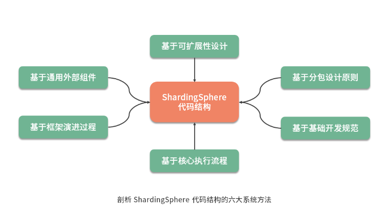


ShardingSphere 在设计上采用了微内核架构模式来确保系统具有高度的可扩展性，并使用了 JDK 提供的 SPI 机制来具体实现微内核架构。在 ShardingSphere 源代码的根目录下，存在一个独立工程 shardingsphere-spi。显然，从命名上看，这个工程中应该包含了 ShardingSphere 实现 SPI 的相关代码。该工程中存在一个 TypeBasedSPI 接口，它的类层结构比较丰富，课程后面将要讲到的很多核心接口都继承了该接口，包括实现配置中心的 ConfigCenter、注册中心的 RegistryCenter 等，如下所示：

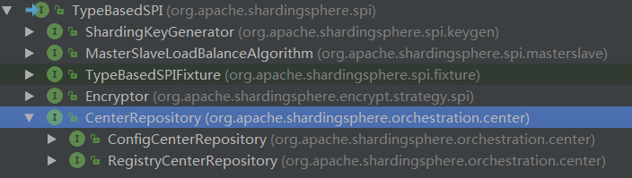

这些接口的实现都遵循了 JDK 提供的 SPI 机制。在我们阅读 ShardingSphere 的各个代码工程时，一旦发现在代码工程中的 META-INF/services 目录里创建了一个以服务接口命名的文件，就说明这个代码工程中包含了用于实现扩展性的 SPI 定义。

在 ShardingSphere 中，大量使用了微内核架构和 SPI 机制实现系统的扩展性。只要掌握了微内核架构的基本原理以及 SPI 的实现方式就会发现，原来在 ShardingSphere 中，很多代码结构上的组织方式就是为了满足这些扩展性的需求。ShardingSphere 中实现微内核架构的方式就是直接对 JDK 的 ServiceLoader 类进行一层简单的封装，并添加属性设置等自定义的功能，其本身并没有太多复杂的内容。

当然，可扩展性的表现形式不仅仅只有微内核架构一种。在 ShardingSphere 中也大量使用了回调（Callback）机制以及多种支持扩展性的设计模式。

## 2、基于分包设计原则阅读源码

分包（Package）设计原则可以用来设计和规划开源框架的代码结构。对于一个包结构而言，最核心的设计要点就是高内聚和低耦合。我们刚开始阅读某个框架的源码时，为了避免过多地扎进细节而只关注某一个具体组件，同样可以使用这些原则来管理我们的学习预期。


## 3、基于基础开发规范阅读源码

对于 ShardingSphere 而言，在梳理它的代码结构时有一个非常好的切入点，那就是基于 JDBC 规范。我们知道 ShardingSphere 在设计上一开始就完全兼容 JDBC 规范，它对外暴露的一套分片操作接口与 JDBC 规范中所提供的接口完全一致。只要掌握了 JDBC 中关于 DataSource、Connection、Statement 等核心接口的使用方式，就可以非常容易地把握 ShardingSphere 中暴露给开发人员的代码入口，进而把握整个框架的代码结构。

在 ShardingSphere 中，存在一个 ShardingDataSourceFactory 工厂类，专门用来创建 ShardingDataSource，ShardingDataSource 就是一个 JDBC 规范中的 DataSource 实现类：

```java
public final class ShardingDataSourceFactory {
    
    public static DataSource createDataSource(
            final Map<String, DataSource> dataSourceMap, final ShardingRuleConfiguration shardingRuleConfig, final Properties props) throws SQLException {
        return new ShardingDataSource(dataSourceMap, new ShardingRule(shardingRuleConfig, dataSourceMap.keySet()), props);
    }
}

```
通过这个工厂类，我们很容易就找到了创建支持分片机制的 DataSource 入口，从而引出其背后的 ShardingConnection、ShardingStatement 等类。事实上，在 ShardingSphere 中存在一批 DataSourceFactory 工厂类以及对应的 DataSource 类：

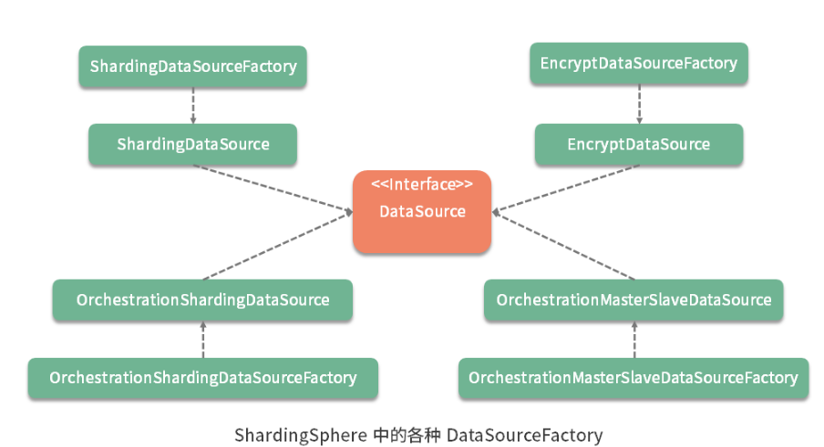

## 4、基于核心执行流程阅读源码

那么，对于 ShardingSphere 框架而言，什么才是它的主流程呢？这个问题其实不难回答。事实上，JDBC 规范为我们实现数据存储和访问提供了基本的开发流程。我们可以从 DataSource 入手，逐步引入 Connection、Statement 等对象，并完成 SQL 执行的主流程。这是从框架提供的核心功能角度梳理的一种主流程。

对于框架内部的代码组织结构而言，实际上也存在着核心流程的概念。最典型的就是 ShardingSphere 的分片引擎结构，整个分片引擎执行流程可以非常清晰的分成五个组成部分，分别是解析引擎、路由引擎、改写引擎、执行引擎和归并引擎：

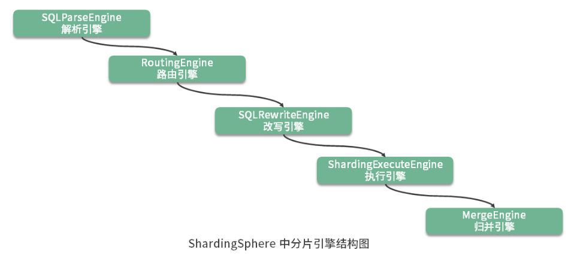

ShardingSphere 对每个引擎都进行了明确地命名，在代码工程的组织结构上也做了对应的约定，例如 sharding-core-route 工程用于实现路由引擎；sharding-core-execute 工程用于实现执行引擎；sharding-core-merge 工程用于实现归并引擎等。这是从框架内部实现机制角度梳理的一种主流程。


## 5、基于框架演进过程阅读源码

分库分表功能，然后扩展到读写分离，然后再到数据脱敏。


## 6、基于通用外部组件阅读源码

在 ShardingSphere 中集成了一批优秀的开源框架，包括用于实现配置中心和注册中心的Zookeeper、Apollo、Nacos，用于实现链路跟踪的 SkyWalking，用于实现分布式事务的 Atomikos 和 Seata 等。

我们先以分布式事务为例，ShardingSphere 提供了一个 sharding-transaction-core 代码工程，用于完成对分布式事务的抽象。然后又针对基于两阶段提交的场景，提供了 sharding-transaction-2pc 代码工程，以及针对柔性事务提供了 sharding-transaction-base 代码工程。而在 sharding-transaction-2pc 代码工程内部，又包含了如下所示的 5 个子代码工程。

在翻阅这些代码工程时，会发现每个工程中的类都很少，原因就在于，这些类都只是完成与第三方框架的集成而已。所以，只要我们对这些第三方框架有一定了解，阅读这部分代码就会显得非常简单。

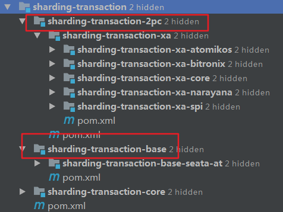


再举一个例子，我们知道 ZooKeeper 可以同时用来实现配置中心和注册中心。作为一款主流的分布式协调框架，基本的工作原理就是采用了它所提供的临时节点以及监听机制。基于 ZooKeeper 的这一原理，我们可以把当前 ShardingSphere 所使用的各个 DataSource 注册到 ZooKeeper 中，并根据 DataSource 的运行时状态来动态对数据库实例进行治理，以及实现访问熔断机制。事实上，ShardingSphere 能做到这一点，依赖的就是 ZooKeeper 所提供的基础功能。只要我们掌握了这些功能，理解这块代码就不会很困难，而 ShardingSphere 本身并没有使用 ZooKeeper 中任何复杂的功能。


## 7、如何梳理ShardingSphere中的核心技术体系？

从基础架构、分片引擎、分布式事务以及治理与集成等 4 个方面对这些技术体系进行阐述。


### 1、基础架构

这里定义基础架构的标准是，属于基础架构类的技术可以脱离 ShardingSphere 框架本身独立运行。也就是说，这些技术可以单独抽离出来，供其他框架直接使用。我们认为 ShardingSphere 所实现的微内核架构和分布式主键可以归到基础架构。

### 2、分片引擎

分片引擎是 ShardingSphere 最核心的技术体系，包含了解析引擎、路由引擎、改写引擎、执行引擎、归并引擎和读写分离等 6 大主题。其中分片引擎在整个 ShardingSphere 源码解析内容中占有最大内容。

对于解析引擎而言，我们重点梳理 SQL 解析流程所包含的各个阶段；对于路由引擎，我们将在介绍路由基本原理的基础上，给出数据访问的分片路由和广播路由，以及如何在路由过程中集成多种分片策略和分片算法的实现过程；改写引擎相对比较简单，我们将围绕如何基于装饰器模式完成 SQL 改写实现机制这一主题展开讨论；而对于执行引擎，首先需要梳理和抽象分片环境下 SQL 执行的整体流程，然后把握 ShardingSphere 中的 Executor 执行模型；在归并引擎中，我们将分析数据归并的类型，并阐述各种归并策略的实现过程；最后，我们将关注普通主从架构和分片主从架构下读写分离的实现机制。

### 3、分布式事务

针对分布式事务，我们需要理解 ShardingSphere 中对分布式事务的抽象过程，然后系统分析在 ShardingSphere 中如何基于各种第三方框架集成强一致性事务和柔性事务支持的实现原理。

### 4、治理与集成

在治理和集成部分，从源码角度讨论的话题包括数据脱敏、配置中心、注册中心、链路跟踪以及系统集成。

对于数据脱敏，我们会在改写引擎的基础上给出如何实现低侵入性的数据脱敏方案；配置中心用来完成配置信息的动态化管理，而注册中心则实现了数据库访问熔断机制，这两种技术可以采用通用的框架进行实现，只是面向了不同的业务场景，我们会分析通用的实现原理以及面向业务场景的差异性；ShardingSphere 中实现了一系列的 Hook 机制，我们将基于这些 Hook 机制以及 OpenTracing 协议来剖析实现数据访问链路跟踪的工作机制；当然，作为一款主流的开源框架，ShardingSphere 也完成与 Spring 以及 SpringBoot 的无缝集成，对系统集成方式的分析可以更好地帮助我们使用这个框架。


# 02、微内核架构：ShardingSphere 如何实现系统的扩展性？

## 1、什么是微内核架构？

微内核是一种典型的架构模式 ，区别于普通的设计模式，架构模式是一种高层模式，用于描述系统级的结构组成、相互关系及相关约束。微内核架构在开源框架中的应用也比较广泛，除了 ShardingSphere 之外，在主流的 PRC 框架 Dubbo 中也实现了自己的微内核架构。那么，在介绍什么是微内核架构之前，我们有必要先阐述这些开源框架会使用微内核架构的原因。


## 2、为什么要使用微内核架构？

微内核架构本质上是为了提高系统的扩展性 。所谓扩展性，是指系统在经历不可避免的变更时所具有的灵活性，以及针对提供这样的灵活性所需要付出的成本间的平衡能力。也就是说，当在往系统中添加新业务时，不需要改变原有的各个组件，只需把新业务封闭在一个新的组件中就能完成整体业务的升级，我们认为这样的系统具有较好的可扩展性。

就架构设计而言，扩展性是软件设计的永恒话题。而要实现系统扩展性，一种思路是提供可插拔式的机制来应对所发生的变化。当系统中现有的某个组件不满足要求时，我们可以实现一个新的组件来替换它，而整个过程对于系统的运行而言应该是无感知的，我们也可以根据需要随时完成这种新旧组件的替换。

比如ShardingSphere 中提供的分布式主键功能，分布式主键的实现可能有很多种，而扩展性在这个点上的体现就是， 我们可以使用任意一种新的分布式主键实现来替换原有的实现，而不需要依赖分布式主键的业务代码做任何的改变 。

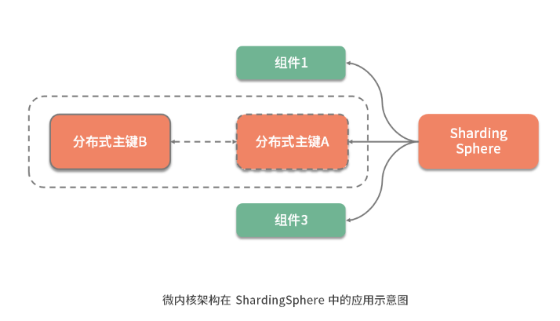

微内核架构模式为这种实现扩展性的思路提供了架构设计上的支持，ShardingSphere 基于微内核架构实现了高度的扩展性。在介绍如何实现微内核架构之前，我们先对微内核架构的具体组成结构和基本原理做简要的阐述。


## 3、什么是微内核架构？

从组成结构上讲， 微内核架构包含两部分组件：内核系统和插件 。这里的内核系统通常提供系统运行所需的最小功能集，而插件是独立的组件，包含自定义的各种业务代码，用来向内核系统增强或扩展额外的业务能力。在 ShardingSphere 中，前面提到的分布式主键就是插件，而 ShardingSphere 的运行时环境构成了内核系统。

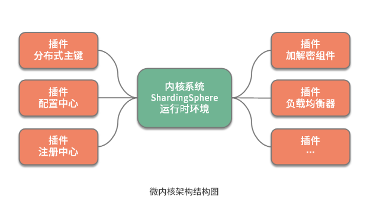

那么这里的插件具体指的是什么呢？这就需要我们明确两个概念，一个概念就是经常在说的 API ，这是系统对外暴露的接口。而另一个概念就是 SPI（Service Provider Interface，服务提供接口），这是插件自身所具备的扩展点。就两者的关系而言，API 面向业务开发人员，而 SPI 面向框架开发人员，两者共同构成了 ShardingSphere 本身。

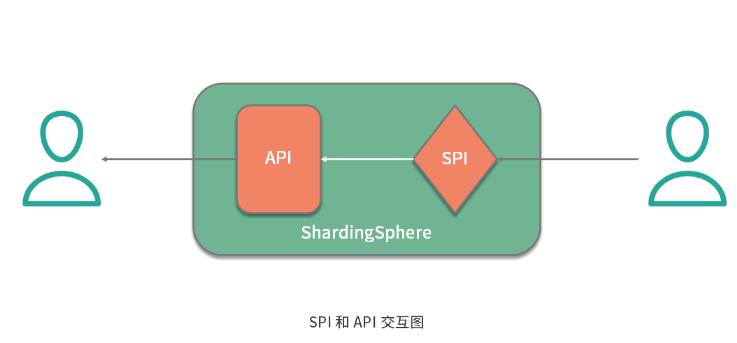

可插拔式的实现机制说起来简单，做起来却不容易，我们需要考虑两方面内容。一方面，我们需要梳理系统的变化并把它们抽象成多个 SPI 扩展点。另一方面， 当我们实现了这些 SPI 扩展点之后，就需要构建一个能够支持这种可插拔机制的具体实现，从而提供一种 SPI 运行时环境 。

那么，ShardingSphere 是如何实现微内核架构的呢？让我们来一起看一下。


## 4、如何实现微内核架构？

事实上，JDK 已经为我们提供了一种微内核架构的实现方式，这种实现方式针对如何设计和实现 SPI 提出了一些开发和配置上的规范，ShardingSphere 使用的就是这种规范。首先，我们需要设计一个服务接口，并根据需要提供不同的实现类。接下来，我们将模拟实现分布式主键的应用场景。

基于 SPI 的约定，创建一个单独的工程来存放服务接口，并给出接口定义。请注意 这个服务接口的完整类路径为 com.tianyilan.KeyGenerator ，接口中只包含一个获取目标主键的简单示例方法。

```java
package com.tianyilan; 

public interface KeyGenerator{ 

    String getKey(); 
}

```

针对该接口，提供两个简单的实现类，分别是基于 UUID 的 UUIDKeyGenerator 和基于雪花算法的 SnowflakeKeyGenerator。为了让演示过程更简单，这里我们直接返回一个模拟的结果。

```java
public class UUIDKeyGenerator implements KeyGenerator { 

    @Override 
    public String getKey() { 

       return "UUIDKey"; 
    } 
} 
	
public class SnowflakeKeyGenerator implements KeyGenerator { 

    @Override 
    public String getKey() { 

       return "SnowflakeKey"; 
    } 
}

```

接下来的这个步骤很关键， 在这个代码工程的 META-INF/services/ 目录下，需要创建一个以服务接口完整类路径 com.tianyilan.KeyGenerator 命名的文件 ，文件的内容是指向该接口所对应的两个实现类的完整类路径 com.tianyilan.UUIDKeyGenerator 和 com.tianyilan. SnowflakeKeyGenerator。

我们把这个代码工程打成一个 jar 包，然后新建另一个代码工程，该代码工程需要这个 jar 包，并完成如下所示的 Main 函数。


```java
import java.util.ServiceLoader; 
import com.tianyilan. KeyGenerator; 

public class Main { 
    public static void main(String[] args) { 

       ServiceLoader<KeyGenerator> generators = ServiceLoader.load(KeyGenerator.class); 

       for (KeyGenerator generator : generators) { 
           System.out.println(generator.getClass()); 
           String key = generator.getKey(); 
           System.out.println(key); 
       } 
    } 
}

```
现在，该工程的角色是 SPI 服务的使用者，这里使用了 JDK 提供的 ServiceLoader 工具类来获取所有 KeyGenerator 的实现类。现在在 jar 包的 META-INF/services/com.tianyilan.KeyGenerator 文件中有两个 KeyGenerator 实现类的定义。执行这段 Main 函数，我们将得到的输出结果如下：

```
	class com.tianyilan.UUIDKeyGenerator 
	UUIDKey 
	class com.tianyilan.SnowflakeKeyGenerator 
	SnowflakeKey

```

如果我们调整 META-INF/services/com.tianyilan.KeyGenerator 文件中的内容，去掉 com.tianyilan.UUIDKeyGenerator 的定义，并重新打成 jar 包供 SPI 服务的使用者进行引用。再次执行 Main 函数，则只会得到基于 SnowflakeKeyGenerator 的输出结果。

至此， 完整 的 SPI 提供者和使用者的实现过程演示完毕。我们通过一张图，总结基于 JDK 的 SPI 机制实现微内核架构的开发流程：

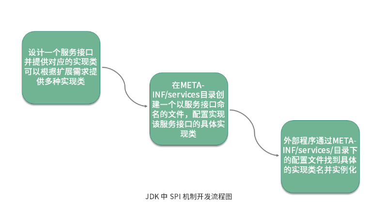

这个示例非常简单，但却是 ShardingSphere 中实现微内核架构的基础。接下来，就让我们把话题转到 ShardingSphere，看看 ShardingSphere 中应用 SPI 机制的具体方法。

ShardingSphere 中微内核架构的实现过程并不复杂，基本就是对 JDK 中 SPI 机制的封装。让我们一起来看一下。


## 5、ShardingSphere 中的微内核架构基础实现机制

我们发现，在 ShardingSphere 源码的根目录下，存在一个独立的工程 shardingsphere-spi。显然，从命名上看，这个工程中应该包含了 ShardingSphere 实现 SPI 的相关代码。我们先来看这个接口定义 TypeBasedSPI：

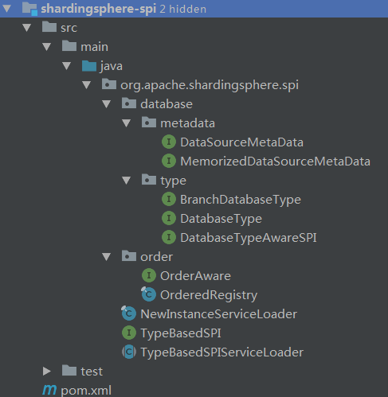

```java
public interface TypeBasedSPI { 

    //获取SPI对应的类型 
    String getType(); 

    //获取属性 
    Properties getProperties(); 

    //设置属性 
    void setProperties(Properties properties); 
}

```

再看一下 NewInstanceServiceLoader 类，从命名上看，不难想象该类的作用类似于一种 ServiceLoader，用于加载新的目标对象实例：

```java
public final class NewInstanceServiceLoader {

    private static final Map<Class, Collection<Class<?>>> SERVICE_MAP = new HashMap<>();

    public static <T> void register(final Class<T> service) {
        for (T each : ServiceLoader.load(service)) {
            registerServiceClass(service, each);//service是接口each是实例具体类型
        }
    }
    //缓存每个接口对应的实例类型集合
    @SuppressWarnings("unchecked")
    private static <T> void registerServiceClass(final Class<T> service, final T instance) {
        Collection<Class<?>> serviceClasses = SERVICE_MAP.get(service);
        if (null == serviceClasses) {
            serviceClasses = new LinkedHashSet<>();
        }
        serviceClasses.add(instance.getClass());
        SERVICE_MAP.put(service, serviceClasses);
    }

    @SneakyThrows
    @SuppressWarnings("unchecked")
    public static <T> Collection<T> newServiceInstances(final Class<T> service) {
        Collection<T> result = new LinkedList<>();
        if (null == SERVICE_MAP.get(service)) {
            return result;
        }
        for (Class<?> each : SERVICE_MAP.get(service)) {
            result.add((T) each.newInstance());//通过反射实例化
        }
        return result;
    }
}

```

在上面这段代码中， 首先看到了熟悉的 ServiceLoader.load(service) 方法，这是 JDK 中 ServiceLoader 工具类的具体应用。同时，注意到 ShardingSphere 使用了一个 HashMap 来保存类的定义以及类的实例之 间 的一对多关系，可以认为，这是一种用于提高访问效率的缓存机制。

看一下 TypeBasedSPIServiceLoader 的实现，该类依赖于前面介绍的 NewInstanceServiceLoader 类。 

```java
public abstract class TypeBasedSPIServiceLoader<T extends TypeBasedSPI> {

    private final Class<T> classType;

    public final T newService(final String type, final Properties props) {//获取type类型的实例并设置属性props
        Collection<T> typeBasedServices = loadTypeBasedServices(type);
        if (typeBasedServices.isEmpty()) {
            throw new RuntimeException(String.format("Invalid `%s` SPI type `%s`.", classType.getName(), type));
        }
        T result = typeBasedServices.iterator().next();
        result.setProperties(props);
        return result;
    }

    public final T newService() {//这里只是获取接口列表中的第一个
        T result = loadFirstTypeBasedService();
        result.setProperties(new Properties());
        return result;
    }
    //使用NewInstanceServiceLoader获取实例类列表，并根据类型做过滤
    private Collection<T> loadTypeBasedServices(final String type) {
        return Collections2.filter(NewInstanceServiceLoader.newServiceInstances(classType), input -> type.equalsIgnoreCase(input.getType()));
    }

    private T loadFirstTypeBasedService() {
        Collection<T> instances = NewInstanceServiceLoader.newServiceInstances(classType);
        if (instances.isEmpty()) {
            throw new RuntimeException(String.format("Invalid `%s` SPI, no implementation class load from SPI.", classType.getName()));
        }
        return instances.iterator().next();
    }
}

```

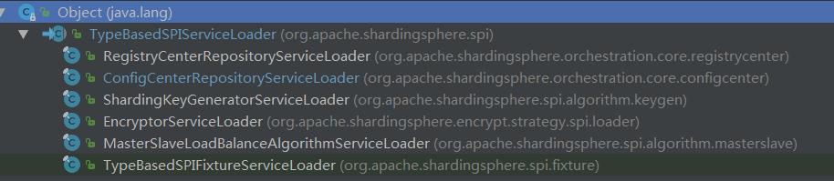

基于 NewInstanceServiceLoader 获取实例类列表，并根据所传入的类型做过滤：

TypeBasedSPIServiceLoader 对外暴露了服务的接口，对通过 loadTypeBasedServices 方法获取的服务实例设置对应的属性然后返回。同时，TypeBasedSPIServiceLoader 也对外暴露了不需要传入类型的 newService 方法，该方法使用了 loadFirstTypeBasedService 工具方法来获取第一个服务实例。

这样，shardingsphere-spi 代码工程中的内容就介绍完毕。 这部分内容相当于是 ShardingSphere 中所提供的插件运行时环境 。下面我们基于 ShardingSphere 中提供的几个典型应用场景来讨论这个运行时环境的具体使用方法。


## 6、微内核架构在 ShardingSphere 中的应用

### 1、SQL 解析器 SQLParser

SQLParser 类，该类负责将具体某一条 SQL 解析成一个抽象语法树的整个过程。而这个 SQLParser 的生成由 SQLParserFactory 负责。

```java
public final class SQLParserFactory {

    static {
        NewInstanceServiceLoader.register(SQLParserConfiguration.class);//解析注册接口有哪些实现类型
    }

    public static SQLParser newInstance(final String databaseTypeName, final String sql) {
        for (SQLParserConfiguration each : NewInstanceServiceLoader.newServiceInstances(SQLParserConfiguration.class)) {//通过SPI机制加载所有扩展
            if (each.getDatabaseTypeName().equals(databaseTypeName)) {//基于数据库类型匹配不同的实现类
                return createSQLParser(sql, each);//基于解析配置生成具体的解析器
            }
        }
        throw new UnsupportedOperationException(String.format("Cannot support database type '%s'", databaseTypeName));
    }

    @SneakyThrows
    private static SQLParser createSQLParser(final String sql, final SQLParserConfiguration configuration) {
        Lexer lexer = (Lexer) configuration.getLexerClass().getConstructor(CharStream.class).newInstance(CharStreams.fromString(sql));
        return configuration.getParserClass().getConstructor(TokenStream.class).newInstance(new CommonTokenStream(lexer));
    }
}

```

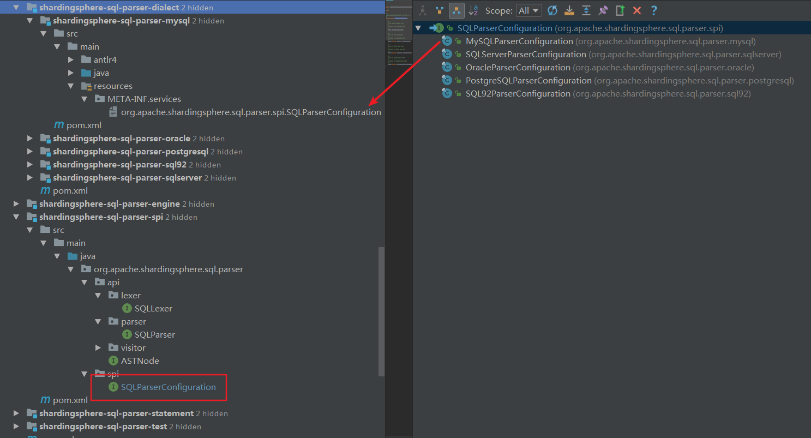


这里引入的 SQLParserConfiguration 接口就位于 shardingsphere-sql-parser-spi 工程的 org.apache.shardingsphere.sql.parser.spi 包中。显然，从包的命名上看，该接口是一个 SPI 接口。在 SQLParserConfiguration 类层结构接口中包含一批实现类，分别对应各个具体的数据库：

我们先来看针对 MySQL 的代码工程 shardingsphere-sql-parser-mysql，在 META-INF/services 目录下，我们找到了一个 org.apache.shardingsphere.sql.parser.spi.SQLParserConfiguration 文件。通过这种方式，系统在运行时就会根据类路径动态加载 SPI。

可以注意到，在 SQLParserConfiguration 接口的类层结构中，实际并没有使用到 TypeBasedSPI 接口 ，而是完全采用了 JDK 原生的 SPI 机制。


### 2、配置中心 ConfigCenterRepository

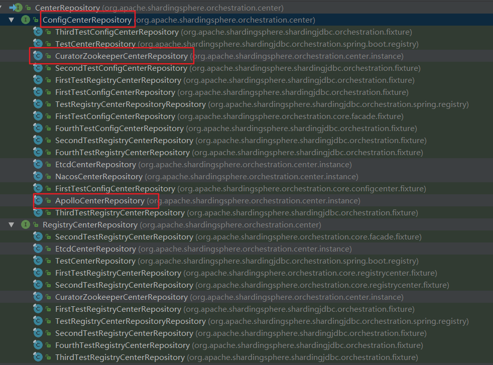

```java
public interface CenterRepository extends TypeBasedSPI {
}
```

显然，CenterRepository 接口继承了 TypeBasedSPI 接口。

在 sharding-orchestration-core 工程的 org.apache.shardingsphere.orchestration.core.configcenter 中，我们找到了 ConfigCenterRepositoryServiceLoader 类，该类扩展了前面提到的 TypeBasedSPIServiceLoader 类：

```java
public final class ConfigCenterRepositoryServiceLoader extends TypeBasedSPIServiceLoader<ConfigCenterRepository> {

    static {
        NewInstanceServiceLoader.register(ConfigCenterRepository.class);
    }

    public ConfigCenterRepositoryServiceLoader() {
        super(ConfigCenterRepository.class);
    }

    /**
     * Load config center repository from SPI. 基于spi机制加载配置对象配置的配中心实例
     */
    public ConfigCenterRepository load(final CenterConfiguration config) {
        Preconditions.checkNotNull(config, "Config center configuration cannot be null.");
        ConfigCenterRepository result = newService(config.getType(), config.getProperties());
        result.init(config);
        return result;
    }
}
```

那么它是如何实现的呢？ ConfigCenterRepositoryServiceLoader 类通过 NewInstanceServiceLoader.register(ConfigCenterRepository.class) 语句将所有 ConfigCenterRepository 注册到系统中，这一步会通过 JDK 的 ServiceLoader 工具类加载类路径中的所有 ConfigCenterRepository 实例。

我们可以看到在上面的 load 方法中，通过父类 TypeBasedSPIServiceLoader 的 newService 方法，基于类型创建了 SPI 实例。

以 ApolloCenterRepository 为例，我们来看它的使用方法。在 sharding-orchestration-config-apollo 工程的 META-INF/services 目录下，应该存在一个名为 org.apache.shardingsphere.orchestration.center.ConfigCenterRepository 的配置文件，指向 ApolloCenterRepository 类：

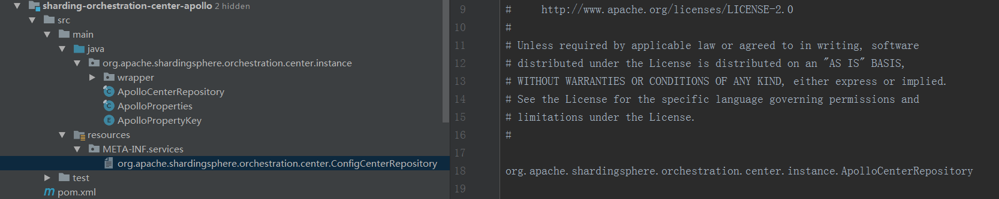

其他的 ApolloCenterRepository 实现也是一样，你可以自行查阅 sharding-orchestration-config-zookeeper-curator 等工程中的 SPI 配置文件。

至此，我们全面了解了 ShardingSphere 中的微内核架构，也就可以基于 ShardingSphere 所提供的各种 SPI 扩展点提供满足自身需求的具体实现。


在日常开发过程中，我们一般可以直接使用 JDK 的 ServiceLoader 类来实现 SPI 机制。当然，我们也可以采用像 ShardingSphere 的方式对 ServiceLoader 类进行一层简单的封装，并添加属性设置等自定义功能。

同时，我们也应该注意到，ServiceLoader 这种实现方案也有一定缺点：

- 一方面，META/services 这个配置文件的加载地址是写死在代码中，缺乏灵活性。

- 另一方面，ServiceLoader 内部采用了基于迭代器的加载方法，会把配置文件中的所有 SPI 实现类都加载到内存中，效率不高。

所以如果需要提供更高的灵活性和性能，我们也可以基于 ServiceLoader 的实现方法自己开发适合自身需求的 SPI 加载 机制。

> 总结

微内核架构是 ShardingSphere 中最核心的基础架构，为这个框架提供了高度的灵活度，以及可插拔的扩展性。微内核架构也是一种同样的架构模式，本课时我们对这个架构模式的特点和组成结构做了介绍，并基于 JDK 中提供的 SPI 机制给出了实现这一架构模式的具体方案。

ShardingSphere 中大量使用了微内核架构来解耦系统内核和各个组件之间的关联关系，我们基于解析引擎和配置中心给出了具体的实现案例。在学习这些案例时 ，重点在于掌握 ShardingSphere 中对 JDK 中 SPI的封装机制。

这里给你留一道思考题：ShardingSphere 中使用微内核架构时对 JDK 中的 SPI 机制做了哪些封装？


# 03、分布式主键：ShardingSphere 中有哪些分布式主键实现方式？


在介绍 ShardingSphere 提供的具体分布式主键实现方式之前，我们有必要先对框架中抽象的自动生成键 GeneratedKey 方案进行讨论，从而帮助你明确分布式主键的具体使用场景和使用方法。


## 1、mybatis的GeneratedKey 

GeneratedKey 并不是 ShardingSphere 所创造的概念。如果你熟悉 Mybatis 这种 ORM 框架，对它就不会陌生。通常，我们会在 Mybatis 的 Mapper 文件中设置 useGeneratedKeys 和 keyProperty 属性：

```xml
    <insert id="addEntity" useGeneratedKeys="true" keyProperty="recordId" > 
        INSERT INTO health_record (user_id, level_id, remark)  
        VALUES (#{userId,jdbcType=INTEGER}, #{levelId,jdbcType=INTEGER},  
             #{remark,jdbcType=VARCHAR}) 
    </insert> 

```
在执行这个 insert 语句时，返回的对象中自动包含了生成的主键值。当然，这种方式能够生效的前提是对应的数据库本身支持自增长的主键。


## 2、ShardingSphere 中的 GeneratedKey

### 1、ShardingKeyGenerator

接下来我们分析 ShardingKeyGenerator 接口，从定义上看，该接口继承了 TypeBasedSPI 接口：

```java
public interface ShardingKeyGenerator extends TypeBasedSPI {     
    Comparable<?> generateKey(); 
} 
```

来到 TableRule 中，在它的一个构造函数中找到了 ShardingKeyGenerator 的创建过程：

```java
shardingKeyGenerator = containsKeyGeneratorConfiguration(tableRuleConfig) 
                ? new ShardingKeyGeneratorServiceLoader().newService(tableRuleConfig.getKeyGeneratorConfig().getType(), tableRuleConfig.getKeyGeneratorConfig().getProperties()) : null; 

```

这里有一个 ShardingKeyGeneratorServiceLoader 类，该类定义如下：

```java
public final class ShardingKeyGeneratorServiceLoader extends TypeBasedSPIServiceLoader<ShardingKeyGenerator> { 
     
    static { 
        NewInstanceServiceLoader.register(ShardingKeyGenerator.class); 
    } 
     
    public ShardingKeyGeneratorServiceLoader() { 
        super(ShardingKeyGenerator.class); 
    } 
} 

```

ShardingKeyGeneratorServiceLoader 继承了 TypeBasedSPIServiceLoader 类，并在静态方法中通过 NewInstanceServiceLoader 注册了类路径中所有的 ShardingKeyGenerator。然后，ShardingKeyGeneratorServiceLoader 的 newService 方法基于类型参数通过 SPI 创建实例，并赋值 Properties 属性。

通过继承 TypeBasedSPIServiceLoader 类来创建一个新的 ServiceLoader 类，然后在其静态方法中注册相应的 SPI 实现，这是 ShardingSphere 中应用微内核模式的常见做法，很多地方都能看到类似的处理方法。

我们在 sharding-core-common 工程的 META-INF/services 目录中看到了具体的 SPI 定义：

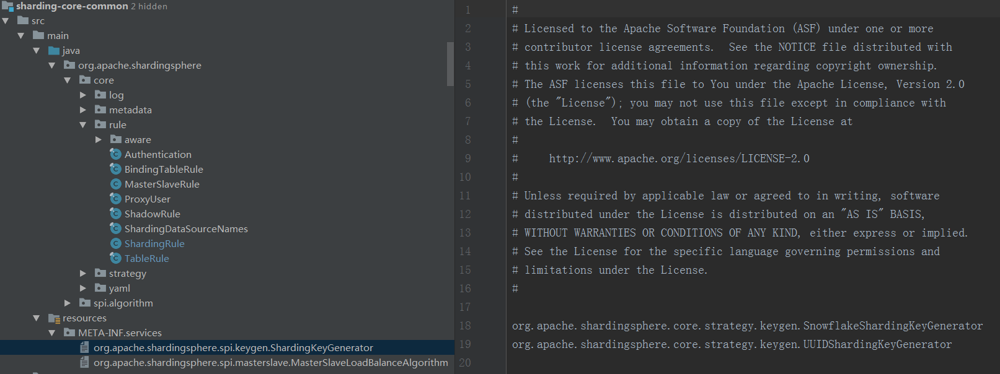

可以看到，这里有两个 ShardingKeyGenerator，分别是 SnowflakeShardingKeyGenerator 和 UUIDShardingKeyGenerator，它们都位于org.apache.shardingsphere.core.strategy.keygen 包下。


在 ShardingSphere 中，ShardingKeyGenerator 接口存在一批实现类。除了前面提到的 SnowflakeShardingKeyGenerator 和UUIDShardingKeyGenerator，还实现了 LeafSegmentKeyGenerator 和 LeafSnowflakeKeyGenerator 类，但这两个类的实现过程有些特殊，我们一会再具体展开。

### 2、UUIDShardingKeyGenerator

我们先来看最简单的 ShardingKeyGenerator，即 UUIDShardingKeyGenerator。UUIDShardingKeyGenerator 的实现非常容易理解，直接采用 UUID.randomUUID() 的方式产生分布式主键：

```java
public final class UUIDShardingKeyGenerator implements ShardingKeyGenerator { 
     
    private Properties properties = new Properties(); 
     
    @Override 
    public String getType() { 
        return "UUID"; 
    } 
     
    @Override 
    public synchronized Comparable<?> generateKey() { 
        return UUID.randomUUID().toString().replaceAll("-", ""); 
    } 
} 

```

### 3、SnowflakeShardingKeyGenerator

再来看 SnowFlake（雪花）算法，SnowFlake 是 ShardingSphere 默认的分布式主键生成策略。它是 Twitter 开源的分布式 ID 生成算法，其核心思想是使用一个 64bit 的 long 型数字作为全局唯一 ID，且 ID 引入了时间戳，基本上能够保持自增。SnowFlake 算法在分布式系统中的应用十分广泛，SnowFlake 算法中 64bit 的详细结构存在一定的规范：

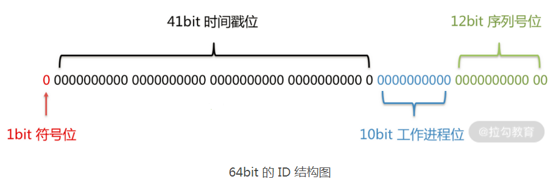


在上图中，我们把 64bit 分成了四个部分：

- 1、符号位：第一个部分即第一个 bit，值为 0，没有实际意义。

- 2、时间戳位：第二个部分是 41 个 bit，表示的是时间戳。41 位的时间戳可以容纳的毫秒数是 2 的 41 次幂，一年所使用的毫秒数是365 * 24 * 60 * 60 * 1000，即 69.73 年。 也就是说，ShardingSphere 的 SnowFlake 算法的时间纪元从 2016 年 11 月 1 日零点开始，可以使用到 2086 年 ，相信能满足绝大部分系统的要求。

- 3、工作进程位：第三个部分是 10 个 bit，表示工作进程位，其中前 5 个 bit 代表机房 id，后 5 个 bit 代表机器id。

- 序列号位：第四个部分是 12 个 bit，表示序号，也就是某个机房某台机器上在一毫秒内同时生成的 ID 序号。如果在这个毫秒内生成的数量超过 4096（即 2 的 12 次幂），那么生成器会等待下个毫秒继续生成。

因为 SnowFlake 算法依赖于时间戳，所以还需要考虑时钟回拨这种场景。所谓时钟回拨，是指服务器因为时间同步，导致某一部分机器的时钟回到了过去的时间点。显然，时间戳的回滚会导致生成一个已经使用过的 ID，因此默认分布式主键生成器提供了一个最大容忍的时钟回拨毫秒数。如果时钟回拨的时间超过最大容忍的毫秒数阈值，则程序报错；如果在可容忍的范围内，默认分布式主键生成器会等待时钟同步到最后一次主键生成的时间后再继续工作。ShardingSphere 中最大容忍的时钟回拨毫秒数的默认值为 0，可通过属性设置。

了解了 SnowFlake 算法的基本概念之后，我们来看 SnowflakeShardingKeyGenerator 类的具体实现。首先在 SnowflakeShardingKeyGenerator 类中存在一批常量的定义，用于维护 SnowFlake 算法中各个 bit 之间的关系，同时还存在一个 TimeService 用于获取当前的时间戳。而 SnowflakeShardingKeyGenerator 的核心方法 generateKey 负责生成具体的 ID，我们这里给出详细的代码，并为每行代码都添加注释：


> 总结

在分布式系统的开发过程中，分布式主键是一种基础需求。而对于与数据库相关的操作而言，我们往往需要将分布式主键与数据库的主键自动生成机制关联起来。在今天的课程中，我们就从 ShardingSphere 的自动生成键方案说起，引出了分布式主键的各种实现方案。这其中包括最简单的 UUID，也包括经典的雪花算法，以及雪花算法的改进方案 LeafSegment 和 LeafSnowflake 算法。

这里给你留一道思考题：ShardingSphere 中如何分别实现基于号段的 Leaf 以及基于 Snowflake 的 Leaf 来生成分布式 ID？


# 04、解析引擎

`SQL 解析的作用就是根据输入的 SQL 语句生成一个 SQLStatement 对象。`


对于分片引擎而言，第一个核心组件就是 SQL 解析引擎。

## 1、从 DataSource 到 SQL 解析引擎入口

Java 语言提供了数据分片的实现方式：

```java
//创建分片规则配置类 
ShardingRuleConfiguration shardingRuleConfig = new ShardingRuleConfiguration(); 

//创建分表规则配置类 
TableRuleConfiguration tableRuleConfig = new TableRuleConfiguration("user", "ds${0..1}.user${0..1}"); 

//创建分布式主键生成配置类 
Properties properties = new Properties(); 
result.setProperty("worker.id", "33"); 
KeyGeneratorConfiguration keyGeneratorConfig = new KeyGeneratorConfiguration("SNOWFLAKE", "id", properties);
result.setKeyGeneratorConfig(keyGeneratorConfig);
shardingRuleConfig.getTableRuleConfigs().add(tableRuleConfig); 

//根据年龄分库，一共分为2个库 
shardingRuleConfig.setDefaultDatabaseShardingStrategyConfig(new InlineShardingStrategyConfiguration("sex", "ds${sex % 2}")); 

//根据用户id分表，一共分为2张表 
shardingRuleConfig.setDefaultTableShardingStrategyConfig(new StandardShardingStrategyConfiguration("id", "user${id % 2}")); 

//通过工厂类创建具体的DataSource 
return ShardingDataSourceFactory.createDataSource(createDataSourceMap(), shardingRuleConfig, new Properties());

```

可以看到，上述代码构建了几个数据源，加上分库、分表策略以及分片规则，然后通过 ShardingDataSourceFactory 获取了目前数据源 DataSource 。显然，对于应用开发而言，DataSource 就是我们使用 ShardingSphere 框架的入口。事实上，对于 ShardingSphere 内部的运行机制而言，DataSource 同样是引导我们进入分片引擎的入口。围绕 DataSource，通过跟踪代码的调用链路，我们可以得到如下所示的类层结构图：

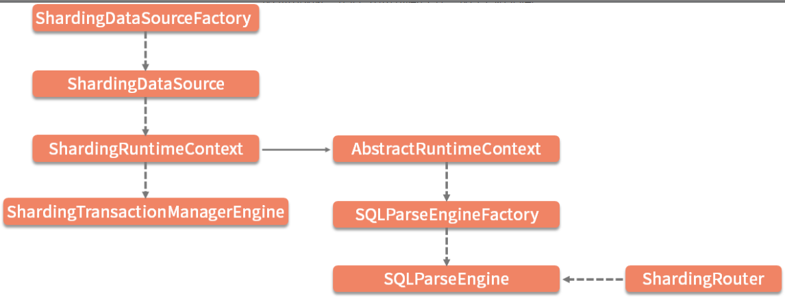

上图已经引出了 ShardingSphere 内核中的很多核心对象，先看SQLParseEngine。一方面，在 DataSource 的创建过程中，最终初始化了 SQLParseEngine；另一方面，负责执行路由功能的 ShardingRouter 也依赖于 SQLParseEngine。这个 SQLParseEngine 就是 ShardingSphere 中负责整个 SQL 解析过程的入口。

在 ShardingSphere 中，存在一批以“Engine”结尾的引擎类。从架构思想上看，这些类在设计和实现上普遍采用了外观模式。外观（Facade）模式的意图可以描述为子系统中的一组接口提供一个一致的界面。外观模式定义了一个高层接口，这个接口使得这一子系统更加容易使用。该模式的示意图如下图所示：

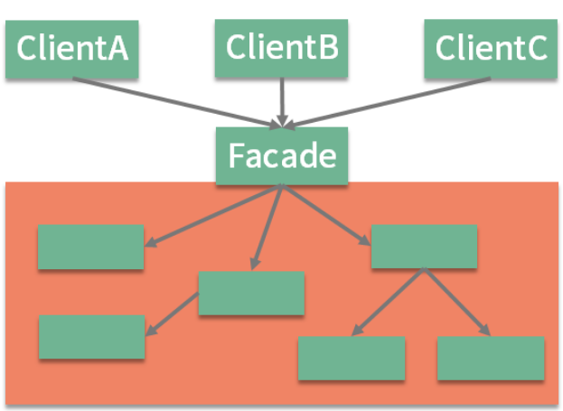

从作用上讲，外观模式能够起到客户端与后端服务之间的隔离作用，随着业务需求的变化和时间的演进，外观背后各个子系统的划分和实现可能需要进行相应的调整和升级，这种调整和升级需要做到对客户端透明。在设计诸如 ShardingSphere 这样的中间件框架时，这种隔离性尤为重要。

对于 SQL 解析引擎而言，情况同样类似。不同之处在于，SQLParseEngine 本身并不提供外观作用，而是把这部分功能委托给了另一个核心类 SQLParseKernel。从命名上看，这个类才是 SQL 解析的内核类，也是所谓的外观类。SQLParseKernel 屏蔽了后端服务中复杂的 SQL 抽象语法树对象 SQLAST、SQL 片段对象 SQLSegment ，以及最终的 SQL 语句 SQLStatement 对象的创建和管理过程。上述这些类之间的关系如下所示：

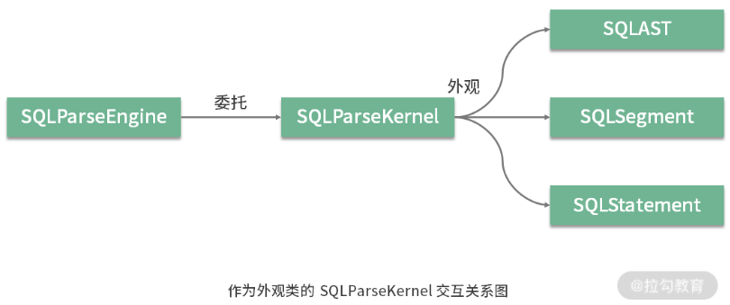

备注：SQLParseKernel在新版本中不存在了

## 2、SQLParseEngine

从前面的类层结构图中可以看到，AbstractRuntimeContext 是 SQLParseEngine 的构建入口。顾名思义，RuntimeContext 在 ShardingSphere 中充当一种运行时上下文，保存着与运行时环境下相关的分片规则、分片属性、数据库类型、执行引擎以及 SQL 解析引擎。作为 RuntimeContext 接口的实现类，AbstractRuntimeContex 在其构造函数中完成了对 SQLParseEngine 的构建，构建过程如下所示：

```java
protected AbstractRuntimeContext(final T rule, final Properties props, final DatabaseType databaseType) { 
       … 
       parseEngine = SQLParseEngineFactory.getSQLParseEngine(DatabaseTypes.getTrunkDatabaseTypeName(databaseType)); 
       … 
}

```
显然，这里通过工厂类 SQLParseEngineFactory 完成了 SQLParseEngine 的创建过程。工厂类 SQLParseEngineFactory 的实现如下：

```java
public final class SQLParserEngineFactory {

    private static final Map<String, SQLParserEngine> ENGINES = new ConcurrentHashMap<>();

    public static SQLParserEngine getSQLParserEngine(final String databaseTypeName) {
        if (ENGINES.containsKey(databaseTypeName)) {
            return ENGINES.get(databaseTypeName);
        }
        synchronized (ENGINES) {
            if (ENGINES.containsKey(databaseTypeName)) {//如果缓存中包含了指定数据库类型对应的SQLParseEngine，则直接返回
                return ENGINES.get(databaseTypeName);
            }
            SQLParserEngine result = new SQLParserEngine(databaseTypeName);//创建SQLParseEngine
            ENGINES.put(databaseTypeName, result);//将新创建的SQLParseEngine放入缓存中
            return result;
        }
    }
}
```

从上述代码中可以看到，这里基于 ConcurrentHashMap 对象做了一层基于内存的缓存处理，SQLParseEngineFactory 的实现方式在 ShardingSphere 中具有代表性。为了提高访问性能，ShardingSphere 大量使用这种方式来构建基于内容的缓存机制。


接下来，我们来看 SQLParseEngine 类本身，该类的完整代码如下所示：

```java
public final class SQLParseEngine {

    private final String databaseTypeName;

    private final SQLParseResultCache cache = new SQLParseResultCache();

    public SQLStatement parse(final String sql, final boolean useCache) {
        ParsingHook parsingHook = new SPIParsingHook();
        parsingHook.start(sql);
        try {
            SQLStatement result = parse0(sql, useCache);
            parsingHook.finishSuccess(result);
            return result;
            // CHECKSTYLE:OFF
        } catch (final Exception ex) {
            // CHECKSTYLE:ON
            parsingHook.finishFailure(ex);
            throw ex;
        }
    }

    private SQLStatement parse0(final String sql, final boolean useCache) {
        if (useCache) {
            Optional<SQLStatement> cachedSQLStatement = cache.getSQLStatement(sql);
            if (cachedSQLStatement.isPresent()) {
                return cachedSQLStatement.get();
            }
        }//委托SQLParseKernel创建SQLStatement
        SQLStatement result = new SQLParseKernel(ParseRuleRegistry.getInstance(), databaseTypeName, sql).parse();
        if (useCache) {
            cache.put(sql, result);
        }
        return result;
    }
}

```

关于 SQLParseEngine 有几点值得注意：

- 首先，这里使用了 ParsingHook 作为系统运行时的 Hook 管理，也就是我们常说的代码钩子。ShardingSphere 提供了一系列的 ParsingHook 实现，后续我们在讨论到 ShardingSphere 的链路跟踪时会对 Hook 机制进一步展开。

- 其次，我们发现用于解析 SQL 的 parse 方法返回了一个 SQLStatement 对象。也就是说，这个 SQLStatement 就是整个 SQL 解析引擎的最终输出对象。这里同样基于 Google Guava 框架中的 Cache 类构建了一个 SQLParseResultCache，对解析出来的 SQLStatement 进行缓存处理。


作为 ShardingSphere 分片引擎的第一个核心组件，`解析引擎的目的在于生成 SQLStatement 目标对象`。而整个解析引擎分成三大阶段，即生成 SQL 抽象语法树、提取 SQL 片段以及使用这些片段来填充 SQL 语句。


## 2、SQLParseKernel

在 SQLParseKernel 类中，发现了如下所示的三个 Engine 类定义，包括 SQL 解析器引擎 SQLParserEngine（请注意该类名与 SQLParseEngine 类名的区别）、SQLSegment 提取器引擎 SQLSegmentsExtractor 以及 SQLStatement 填充器引擎 SQLStatementFiller。


### 1、生成 SQL 抽象语法树


### 2、提取 SQL 片段

作为解析引擎最终产物的 SQLStatement ，实际上封装的是对 SQL 片段对象 SQLSegment 的获取操作。

在 ShardingSphere 中内置了一大批通用的 SQLSegment，包括查询选择项（SelectItems）、表信息（Table）、排序信息（OrderBy）、分组信息（GroupBy）以及分页信息（Limit）等。

现在，假设有这样一句 SQL：

SELECT task_id, task_name FROM health_task WHERE user_id = 'user1' AND record_id = 2  

通过解析，我们获取了如下所示的抽象语法树：

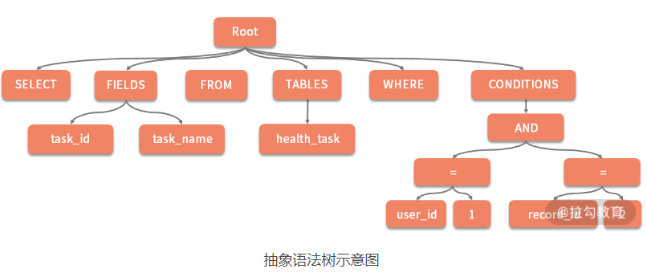

我们发现，对于上述抽象语法树中的某些节点（如 SELECT、FROM 和 WHERE）没有子节点，而对于如 FIELDS、TABLES 和 CONDITIONS 节点而言，本身也是一个树状结构。


### 3、使用这些片段来填充 SQL 语句


完成所有 SQLSegment 的提取之后，我们就来到了解析引擎的最后一个阶段，即填充 SQLStatement。


# 05、路由引擎


# 06、改写引擎

# 07、执行引擎

# 08、归并引擎


# 09、读写分离


# 10、分布式事务


# 11、数据脱敏：如何基于改写引擎实现低侵入性数据脱敏方案？

# 12、配置中心：如何基于配置中心实现配置信息的动态化管理？

# 13、注册中心：如何基于注册中心实现数据库访问熔断机制？

# 14、链路跟踪：如何基于 Hook 机制以及 OpenTracing 协议实现数据访问链路跟踪？

# 15、系统集成：如何完成 ShardingSphere 内核与 Spring+SpringBoot 的无缝整合？


# 参考

- [Sharding-Jdbc 源码分析](https://www.cnblogs.com/binarylei/p/12234545.html)


